<!-- <div style="text-align: center; margin-top: 4em; margin-bottom: 2em;"> -->
<!--    -->
<!-- </div> -->
<!-- <div style="margin-top: 4em; margin-bottom: 2em;"> -->
<!--    -->
<!-- </div> -->

<div style="margin-top: 4em; margin-bottom: 2em; text-align: center;">
  
</div>

<!-- <div style="text-align: center; margin-top: 4em; margin-bottom: 1em;"> -->
<!--   © Jan Dul<br> -->
<!-- </div> -->


<div style="text-align: left; margin-top: 0; margin-bottom: 3em;">

  © Jan Dul<br>
  Version `r params$version`. First pubished March 10, 2026. Last update:  `r format(Sys.time(), '%B %d, %Y')`<br>

  Refer to the book as: Dul, J. (2026). <em>Necessary Condition Analysis (NCA): Principles and Application</em>. Chapman &amp; Hall/CRC Press.
</div>

# Preface {-}

"Is coffee a necessary condition for you?" Someone asked me this question after hearing that I had taken time away in Italy to focus on writing my book, and that I like Italy's coffee culture. "No, it is not; it only helps." Focus, time, perseverance, and several other things are true necessary conditions. Without any of them, the book would not exist.

And here it is! In the book I present the principles of Necessary Condition Analysis (NCA) and their application in empirical studies in research and practice. NCA is an approach that uses necessity causal logic to identify necessary conditions from data. The core idea is that a necessary condition must be present to make the outcome possible, and that its absence guarantees the absence of the outcome. Compensation is not possible.

My intention with this book is to help researchers, data analysts, practitioners, and others develop a deeper understanding of the NCA approach and apply it effectively and with high-quality standards. The book brings together the fundamentals of NCA and integrates the most recent methodological advancements and tools. It synthesizes ideas from my earlier publications that describe NCA at introductory levels [e.g., @dul2016orm; @dul2020book] as well as more advanced treatments [@dul2020orm; @dul2021online; @dul2024different], while also introducing more background, new topics and recent developments. From 2021 to 2026, a regularly updated online predecessor of this book was available [@dul2021online], which is now archived and integrated into the present book.

The first chapter of this book provides a general introduction to the possibilities and current use of NCA. Next, Part I contains five chapters on the *principles* of NCA, covering NCA's causality, theory, mathematics, statistics, and its credibility for identifying necessity from data. Part II has six chapters about the *application* of these principles in empirical studies discussing NCA's hypothesis formulation, data collection, data analysis, reporting, and how to apply NCA in multimethod research and in practice. I finish the book with a summary and a personal reflection.

The book's content expresses my current understanding and interpretation of NCA. NCA develops over time, just like other methodological approaches do. As NCA is applied more widely, new questions, topics, insights, and ideas will emerge. An online version of the book with updates and additional materials is available via the book-page: https://jandul.github.io/NCA/. For the physical version of the book see @dul2025book.

I hope this book serves those who wish to gain a comprehensive understanding of the principles of NCA and their application, both in academic research and practical contexts.

Enjoy discovering and applying NCA! \
  \  
  \  
  \
Leiden, March 2026

# Acknowledgements {-}

I created NCA during a long process that spans more than a decade. NCA and the content of this book are not only the result of my own thinking and reading but also of many discussions with fellow researchers during in person and online meetings, at conferences, workshops, seminars, webinars, and in email exchanges. These interactions have played an important role in shaping NCA.

I wish to express my gratitude to the universities and other research organizations that invited me to deliver NCA seminars and workshops, both in its early years and more recently. These engagements enabled valuable face-to-face discussions that contributed to the development of NCA. I would like to mention the following institutions in alphabetical order: AGH University of Krakow (Poland), Bocconi University (Italy), Chalmers University (Sweden), Deakin University (Australia), Eindhoven University of Technology (Netherlands), Erasmus University (Netherlands), Federal University of Pernambuco (Brazil), George Washington University (USA), Helmut Schmidt University (Germany), INSEAD Business School (France), Jagiellonian University (Poland), LUISS (Italy), Mines Paris Tech (France), Nottingham University (UK), Oslo University (Norway), Oxford University (UK), Penn State University (USA), Radboud University of Nijmegen (Netherlands), RIVM (Netherlands), Tilburg University (Netherlands), University of Amsterdam (Netherlands), TNO (Netherlands), University of Bayreuth (Germany), University of Beira Interior (Portugal), University of Bologna (Italy), University of Coimbra (Portugal), University of Côte d'Azur (France), University of Durham (UK), University of Groningen (Netherlands), University of Kassel (Germany), University of Lincoln (UK), University of Maastricht (Netherlands), University of Paris (France), University of Porto (Portugal), University of Sevilla (Spain), University of Trento (Italy), University of Valencia (Spain), and Wroclaw University of Economics and Business (Poland).

I would also like to express my special appreciation to the Rotterdam School of Management at Erasmus University (Netherlands). Since the incubation of NCA, the school has supported me in developing and disseminating NCA. In particular, I wish to thank Erik van Raaij and Finn Wynstra for their enduring support.

I extend my acknowledgements to the dedicated team of NCA ambassadors and supporters who have contributed in different roles to the dissemination and advancement of this approach, ranging from student assistants to co-authors and co-developers: Jorick Alberga, Florence Allard-Poesie, Tatiana Andreeva, Joost Baart, Gijs van Biezen, Ruben Blom, Stefan Breet, Jon Bokrantz, Govert Buijs, Silvia Dello Russo, Monique van Donzel, Ger Haan, Tony Hak$^\dagger$, Sven Hauff, Patrycja Klimas, Wilfred Knol, Roelof Kuik, Erwin van der Laan$^\dagger$, Wangoo Lee, Igor Marchetti, Magdalena Marczewska, Justine Massu, Indy Oostrom, Erik van Raaij, Henk van Rhee, Nicole Richter, Krista Schellevis, Chloé Schwitzgebel, Daniele Spinelli, Zsófia Tóth, and Caroline Witte. Their support greatly accelerated the adoption of NCA in research.

Throughout the development of NCA, I engaged in extensive and ongoing discussions with numerous scholars and practitioners regarding the positioning of NCA in relation to mainstream approaches. In particular, I learned a lot from my conversations with Gary Goertz, regarding the positioning of NCA vis-à-vis regression analysis and statistics; Barbara Vis and Claude Rubinson on using NCA within the context of QCA; Oskar Kosch on the relationship between NCA and machine learning; Roelof Kuik on the detailed mathematical and statistical foundations of NCA, and Ger Haan on strategies for making NCA appealing to practitioners.

Finally, I would like to thank Bob Bastian, Gijs van Biezen, Jon Bokrantz, Patrycja Klimas, Roelof Kuik, Igor Marchetti, and José Luis Roldán for commenting on a draft version of this book.

Thank you all. Without your help, NCA would not be what it is today.


<!--chapter:end:index.Rmd-->

\mainmatter

# Introduction {#introduction}

NCA is a methodological approach that uses a *necessity* causal perspective for identifying necessary conditions from data. Necessity causal logic in NCA implies that if a certain level of the condition is not present, a certain level of the outcome will not occur: If not $X$, then not $Y$. No other factor can compensate for the absence of the necessary condition (or a required level of it). The necessary condition *allows* the outcome to exist, but does not produce it.^[This book uses specific terminology, such as condition and outcome, that is explained in the glossary of Appendix \@ref(glossary).] A necessary condition operates independently of the rest of the causal structure and serves as a 'critical success factor' or 'must-have'. When absent, it creates a 'bottleneck' or 'constraint' that prevents the target outcome, which cannot be compensated by other factors. For example, a student must have a high school diploma for admission to a university. Without such a diploma, the student will not be admitted. Other factors like a student's high motivation cannot compensate for the lack of a diploma.

Necessity causal logic and NCA differ from *sufficiency* causal logic and related methods. In sufficiency causal logic the condition *produces* the outcome: if $X$, then $Y$. A single factor may be sufficient for the outcome, for example when students graduate, they receive a diploma. Often, not a single factor but a combination of factors (a 'configuration') may be sufficient for the outcome: if [combination of $X$'s], then $Y$. A university diploma alone is not sufficient for admission to a PhD program; however, combining it with strong motivation, good grades, and a recommendation letter will secure it. Such a configurational sufficiency logic is used in methodologies and frameworks like Rothman’s Sufficient-Component Cause model in medicine [SCC, @rothman1976causes], Wright’s Necessary Element of a Sufficient Set in law [NESS, @wright1985causation], and Ragin’s Qualitative Comparative Analysis in the social sciences [QCA, @ragin1987comparative].

Necessity causal logic also differs from *probabilistic* causal sufficiency logic where the single factor is a 'contributing cause' that helps to produce the outcome and contributes to the outcome 'on average': 'if $X$, then probably $Y$'. Highly motivated people are more likely to be admitted to a PhD program than those with lower motivation, although there are highly motivated people who are not admitted and less motivated people who are admitted. Such a probabilistic causal sufficiency logic is applied in statistical methodologies for causal inference, such as in Pearl's Directed Acyclic Graphs (DAGs) and do-operator approach [@pearl2009causality] and Angrist et al.'s Instrumental Variable approach [IV, @angrist1996identification].

The different causal lenses (single necessity causes, configurational sufficiency causes, and single probabilistic sufficiency causes) offer fundamentally distinct perspectives on causality. These lenses reflect different theoretical expectations (hypotheses) about how outcomes arise. This means that phenomena and data can be approached with different causal lenses (Chapter \@ref(causality)). The choice of lens may be guided by the specific nature of the phenomenon, the study question, or the analyst’s theoretical priorities^[In this book the general term for a user of NCA or other methodological approaches is *analyst*. The analyst can be an academic scholar or a practitioner. The general term for an academic research activity or a project in practice is *study*.]. For instance, if the question is whether a certain resource (e.g., access to capital) is required for a firm to enter a market, a necessity lens is appropriate. This lens helps identify bottleneck factors: conditions that must be in place for success. In contrast, if the aim is to identify combinations of national conditions that are sufficient for strong climate policy commitment (e.g., public support + high income, or climate risk + high fossil fuel dependence), a configurational sufficiency perspective, as used in QCA, may be appropriate. This approach assumes that different pathways can each lead to the same outcome. If the goal is to understand whether self-efficacy increases the likelihood of engaging in a behavior, a probabilistic sufficiency lens is fitting. This approach helps estimate how much more likely the outcome is when a cause is present.

No lens is inherently superior; each has unique strengths and limitations. Thus, there are no better or worse lenses; there are no more or less relevant lenses. These lenses are different and shed different light on the same issues. What matters is that the chosen lens aligns with the goals of the study, the nature of the causal claim being made, and indeed the preference of the analyst. Once a causal lens is selected, it is essential to apply a methodological approach that matches the logic of that lens, ensuring *theory–method fit*, which is essential for the credibility and usefulness of the findings (Chapter \@ref(multimethodstudies)).

This book's emphasis on causality has both theoretical and practical reasons. Theoretically, scientific theories aim to explain why outcomes occur, not merely to describe patterns of co-occurrence (Chapters \@ref(theory) and \@ref(hypothesisformulation)). Practically, changing or influencing an outcome requires intervention on causes of the outcome, not on co-occurring factors (Chapter \@ref(practice)). The assumption that $X$ is a necessary cause of $Y$ implies the assumption that $X$ temporally precedes $Y$ (Chapter \@ref(causality)).

<!-- Single necessity causes, single and configurational sufficiency causes, and single probabilistic sufficiency causes are fundamentally different approaches to causality. They represent different theoretical 'lenses' to describe and analyze the phenomena of interest. One lens is not better than another, and it is up to -->
<!-- <!-- some phenomena may be better understood and described from one specific causal perspective, while others might benefit from using another perspective or multiple perspectives. -->
<!-- the analyst to choose the lens most suitable to the context. However, once the lens is selected, a proper method should be used to ensure theory-method fit. -->

<!-- it is assumed that single causes are probabilistic sufficient for the outcome, and contribute to the outcome on average ('average effect logic') and that the absence of such cause can be compensated by  another cause ('additive logic'). For example, regression analysis describes the complexity of different contributing factors to the outcome with an additive model (the regression equation). In such model a low value of one factor can be compensated by a high value of another factor: a less motivated person may be admitted because a higher grade compensates the lack of motivation. NCA is a quantitative method. Whereas conventional quantitative research commonly focuses on probabilistic sufficiency causes, NCA's focus is on necessity causes. NCA ensures theory-method fit when the theory assumes a necessity causal relationship between factors^[In this book we use the general term 'factor' for a variable, independently of its role as cause or effect. When referring to a necessity relationship between variables, NCA uses the term 'condition' for what is commonly called independent variable, explanatory variable, input variable, predictor variable, antecedent variable, or determinant, and the term 'outcome' for what is commonly called dependent variable, response variable, criterion variable, output variable, effect variable, etc.] -->

<!-- , and this relationship must be evaluated (tested) with empirical data. -->

NCA is an approach that is specifically designed to analyze necessity. It has two intertwined parts: a 'soft' part and a 'hard' part. The soft part is NCA's soul: the causal perspective of necessity (NCA methodology). The hard part is NCA's data analysis method (NCA method) that fits this perspective. Therefore, the term 'NCA' refers to a combination of the NCA methodology with its causal necessity perspective, and the corresponding NCA method for analyzing data.^[In previous publications I have inconsistently used the terms 'approach', 'methodology' and 'method' in the context of NCA. In this book, I follow the common distinction between *methodology*, referring to the philosophical and theoretical framework, and *method* referring to the specific techniques, tools, or procedures used to collect and analyze data. The combination of the two parts is called *approach* or *methodological approach*.] NCA's necessity causal lens extends beyond common binary conditional necessity logic. Specifically, NCA adds causal reasoning to conditional logic, incorporates a continuous view on necessity, and permits exceptions (the 'typicality' perspective, see Chapter \@ref(causality)).

The book is organized as follows. Part I discusses the methodological principles of NCA, explaining its causality (e.g., compared to other causal perspectives), theory (e.g., main elements of a necessity theory, different types of necessity theories), mathematics (e.g., mathematical estimation of ceiling line, NCA parameters such as effect size, and measures of fit) and statistics (e.g., NCA's null hypothesis tests, Monte Carlo simulations with NCA), and NCA's credibility to identify necessity (e.g., using statistical and empirical criteria).

Part II of the book outlines how to conduct NCA. Specifically, this part discusses NCA's hypothesis formulation, data collection, data analysis, reporting, how to apply NCA in a multimethod study, and how NCA can be used in practice. The book concludes with a summary and personal reflection on 10 years of NCA, and Part III provides additional materials.

<!-- It can provide new theoretical insights: since a necessary condition blocks the outcome if absent, the condition must be part of any theory that aims to predict the outcome. NCA is also relevant for practice: all identified necessary conditions must be established to enable a target outcome. If a necessary condition is not met it is a bottleneck for the outcome. Any change process that fails to address this bottleneck will be ineffective, leading to wasted effort. -->

With its innovative approach to causality and data analysis, NCA has rapidly entered the social, medical, and technical sciences.^[The NCA methodology and method can be used in any type of investigation that aims to describe causal relationships. Although usually quantitative data (numbers) are used in NCA, NCA can also be used with qualitative data (words, symbols, see Chapter \@ref(datacollection)) as long as scores (values, levels) for the condition and the outcome are available.] The publication in 2016 of NCA's core paper [@dul2016orm] marks the start of NCA, although proto-versions of NCA were introduced earlier [@dul2008case; @dul2010necessary].^[The dissemination of NCA's core paper [@dul2016orm] has been welcomed by @bergh2022constitutes: "The significant expansion of an unknown method along with its usability (including an illustration, user-friendly recommendations, and a software tool) makes the article a gold standard for a contribution via transfer" (p. 1840).] Subsequently, several extensions were developed, including a statistical significance test [@dul2020orm], and specialized software (Appendix \@ref(appendixb)). Various publications, such as a textbook [@dul2020book] and an online book [@dul2021online] with practical guidelines on applying the method were developed to facilitate the understanding and dissemination of NCA. Furthermore, publications introducing and summarizing NCA have emerged across various fields of business and management, including Human Resource Management [@hauff2021hrm], Marketing and Sales [@dul2021marketing; @conde2025uncovering], Tourism Management [@toth2019tourism], Entrepreneurship [@linder2022necessary], Supply Chain Management [@bokrantz2022building], and International Business [@richter2022necessary]. Also outside the business and management field, the method was introduced in fields such as Public Health [@gregoproposing], Clinical Psychology [@marchetti2025necessity], Education [@tynan2020education], and Creativity [@dul2020creativity].
<!-- \textcolor{red}{Update} -->

Editors of academic journals have recognized the value of NCA by publishing editorial comments on the approach [e.g., @dul2024identifying; @fainshmidt2020contributions; @hernaus2022from; @robinson2022; @sarstedt2023advanced]. Review articles [e.g., @aguinis2020methodological; @boon2019systematic; @dabic202140; @frazier2017psychological; @rozenkowska2023theory;@delsordo2025role] and a plethora of journal articles suggest using NCA in future studies, for example, in the fields of education [e.g., @crede2021should], human resource management [e.g., @hauff2021analytical; @parker2024smart], information systems [e.g., @sharma2024framework], international business/management [e.g., @richter2022use; @zahoor2023international], marketing [e.g., @guenther2023improving; @jovanovic2022under], operations and supply chain management [e.g., @acquah2023invest], strategy [e.g., @bouncken2020value; @deist2023digital; @klimas2023attributes; @ogundipe2022interfirm], and tourism and hospitality [e.g., @becker2023pls]. At the time of writing this book, hundreds of articles that apply NCA have been published already. The number of publications in 'Web of Science' ranked journals^[Journals ranked in Clarivate's Journal Citation Reports.] that apply NCA has increased steadily. Appendix \@ref(appendixa) shows these articles that have appeared through the end of 2025.

Published articles use NCA as the sole or primary method (Appendix \@ref(appendixa); Table \@ref(tab:pubstablealone)), or combine NCA in a multimethod study (Chapter \@ref(multimethodstudies)) with Qualitative Comparative Analysis (QCA, Table \@ref(tab:pubstableqca)) or with regression-based methods. Examples of regression-based methods include multiple linear regression (MLR, Table \@ref(tab:pubstablemlr)) and structural equation modeling (SEM, Tables \@ref(tab:pubstablesem) and \@ref(tab:pubstableplssem)). NCA is also combined with a variety of other methods (Tables \@ref(tab:pubstableother) and \@ref(tab:pubstablecombiother)). Although the number of articles with NCA has grown rapidly, NCA is not always applied according to minimum standards [Chapter \@ref(reporting), @dul2023necessary], and several misconceptions have been published.^[Most misconceptions relate to a lack of awareness about the principles of NCA. Example misconceptions are: "NCA should specify the full data generation process (DGP)" (given its purpose, NCA specifies only a part of the DGP), "NCA is just a statistical method" (NCA is a broad methodological approach that combines theory, mathematics (geometry) and uses statistical tools), "NCA's statistical test is a test of H1" (NCA's statistical tests are null hypothesis tests, testing H0), "NCA is the necessity analysis of QCA" (the necessity analysis of NCA and that of fuzzy-set QCA are fundamentally different), "Necessary conditions according to NCA are the same as INUS conditions" (INUS conditions are local necessary parts of a sufficient configuration that produces the outcome; NCA considers overall necessary conditions for the outcome), "NCA cannot test sufficiency" (NCA can test the absence of $X$ being necessary for absence of $Y$, which is equivalent to $X$ is sufficient for $Y$), etc. Several misconceptions are addressed in specific publications [@dul2019necessary; @dul2021necessary; @dul2022problematic].] Therefore, **the main goal of this book is to promote proper understanding and high-quality application of NCA**.

Many articles that apply NCA conclude that necessity was identified, although the evidence is not always convincing. Other articles that apply NCA concluded that necessity was not found [e.g., @batey2021designing; @luo2022pathway; @gu2022configurations; @peng2022pathway; @golini2016exploiting]. Not finding a necessary condition might be a valuable result, because such a result shows that a supposed essential factor for an outcome does not need to be present and its absence can be compensated [e.g., @arenius2017no]. On the other hand, finding a large number of potential necessary conditions, for example in an exploration study [e.g., @gantert2022moral; @klimas2021strategy; @stek2021train] does not mean that all are informative because several conditions may not have a theoretical meaning or may be trivial, which could have been easily identified before the analysis was done (Chapter \@ref(hypothesisformulation)).^[A positive or negative conclusion about necessity depends on the analyst's judgement of many elements, summarized in NCA's SCoRe checklist for conducting and reporting an NCA study (Chapter \@ref(reporting)).]

<!-- Whereas most quantitative research (implicitly) adopts the probabilistic sufficiency perspective when causal claims are made, NCA offers an alternative by focusing on necessity causality. NCA can also be used in qualitative research to identify conditions that must be present for an outcome to occur. A component of this approach is a specific method for selecting and analyzing a small number of cases [@dul2024how]. In both quantitative and qualitative research it is important to know whether causes are necessary or not, because if any necessary cause is absent, the effect cannot be achieved. For theory development aimed at predicting an outcome, the necessary condition must be included as part of the theory.  -->


<!-- For practice, this means that necessary conditions must be met, and addressing other causes while leaving the unsatisfied necessary condition (the bottleneck) unresolved will have no effect, resulting in waste of effort.  -->
<!-- With conventional regression-based research methods (e.g, multiple linear regression, structural equation modeling), research questions about cause-effect relationships are often formulated like 'what is the effect of $X$ on $Y$?' and related hypotheses are similar to '$X$ has a positive (or negative) effect on $Y$'. The regression equation consisting of terms that are added to produce the average effect including an 'error term', implicitly assumes additive causal sufficiency logic and cause $X$ is assumed  to contribute to producing effect $Y$ *on average*, and the absence of $X$ can be compensated by the presence of other causes. In other words: $X$ is an average contributor to $Y$: a probabilistic cause. -->
<!-- Such causal relationship that is studies with regression analysis implies an *average effect* of $X$ on $Y$. -->
<!-- However, the type of causality is usually not specified.  -->
<!-- ,  which can be graphically shown as an arrow between $X$ and $Y$ indicating a temporal direction: first $X$, then $Y$, with a + or - sign shown above the arrow indicating that $X$ increases or decreases $Y$ on average.  -->
<!-- In NCA, cause $X$ is assumed to be a *necessary* cause of $Y$. The research question is formulated as 'is $X$ necessary for $Y$?'. The corresponding hypothesis is: '$X$ is necessary for $Y$'. If $X$ is necessary for $Y$, single cause $X$ can stop the outcome when it is absent or has a low value. It can be a *bottleneck*, a *critical success factor* or a *must have* factor.  -->

<!-- The NCA method consists of three parts:  -->

<!-- * Using  *necessity logic* for developing theoretical causal statements (theory, hypotheses).  -->

<!-- * *Data analysis* for calculating necessity parameters. -->

<!-- * *Statistical testing* for evaluating necessity parameters.  -->
<!-- NCA can identify necessary conditions from data.  -->
Conducting NCA consists of four stages:

1. Formulate the formal necessity hypothesis.
2. Collect data.
3. Analyze data.
4. Report results.

In the first stage (Chapter \@ref(hypothesisformulation)), necessity causal logic is employed to formulate a theoretical expectation about conditions that are necessary for the outcome^[In this book, it is assumed that hypothesis formulation is done before data collection. The reasons are discussed in Chapter \@ref(hypothesisformulation).].  \
<!-- has three reasons. First, it usually relatively simple to formulate a necessary condition hypothesis (see Chapter \@ref(hypothesisformulation). Second, it is often more efficient to use empirical data for testing a developed hypothesis than for developing a hypothesis with data. In the latter situation the developed hypothesis should be tested with new data. Third, for identifying a necessary condition, NCA requires theoretical support, which means that also in a theory/testing or exploratory study a hypothesis must be formulated after data analysis. This implies that in this book the focus is on using data to *test* necessity, and not on using data for building or *exploring* necessity, e.g., like in data mining].  -->
<!-- Backgrounds of necessary condition hypotheses are discussed in chapter  \@ref(theory), and chapter  \@ref(hypothesisformulation) explains how such hypothesis ($X$ is necessary for $Y$) can be developed and formulated.  -->
The second stage (Chapter \@ref(datacollection)) consists of collecting new or existing data for testing the hypothesis, which includes the consideration of study design, sampling or case selection, and measurement. NCA does not have a 'measurement model', as SEM and QCA have (in QCA it is called 'calibration'). This means that any type of data can be used as input to NCA as long as the scores of $X$ and $Y$ are meaningful, valid, and reliable. NCA poses no new requirements on the data, although some aspects of data collection (case selection in qualitative studies; power analysis in quantitative studies, see for example, @dul2024how may differ. NCA can also be used with archival data to give a new perspective on previous findings [@dul2024advancing]. \    
<!-- . Chapter  \@ref(data) explains this and gives examples of data that can be used in NCA.  -->
In the third stage (Chapters \@ref(dataanalysis), \@ref(multimethodstudies)), NCA's data analysis is conducted, which differs entirely from common types of data analysis. \    
In the fourth stage (Chapter \@ref(reporting)), the results of NCA are reported. 

<!-- The mathematical and statistical backgrounds of the data analysis are shown in chapters  \@ref(mathematical) and  \@ref(statistical). Details of the application of the data analysis are in chapter (\@ref(dataanalysis)), while chapter  \@ref(multimethod) discusses how NCA can be used in multimethod research with regression-based methods and QCA.  -->
<!-- Chapter \@ref(reporting) gives guidelines for this. -->

<!-- While the first part of this book introduces the underlying principles of NCA (with chapters on causality, theory, mathematics, statistics, and the credibility of NCA), the second part focuses on its application, detailing the four above stages (with the chapters Hypothesis formulation, Study design, Sampling, Measurement, Data types, Data analysis, Multimethod studies, Reporting, and Practice). -->

Currently, most applications of NCA are in academic research, where researchers use the NCA approach to develop and test theories. NCA is also entering practical settings where NCA is applied by practitioners such as consultants and data analysts as an innovative approach for addressing challenges and exploring new opportunities. This is discussed in Chapter \@ref(practice). 

After discussing the fundamental backgrounds of the NCA methodology in Part I, the four stages of the NCA method  are discussed in Part II. 

<!-- NCA ensures theory-method fit when the theory assumes a necessity causal relationship between factors^[In this book we use the general term 'factor' for a variable, independently of its role as cause or effect. When referring to a necessity relationship between variables, NCA uses the term 'condition' for what is commonly called independent variable, explanatory variable, input variable, predictor variable, antecedent variable, or determinant, and the term 'outcome' for what is commonly called dependent variable, response variable, criterion variable, output variable, effect variable, etc.] -->
<!-- NCA can be used as a stand-alone method or be used together with  conventional methods such as multiple linear regression, structural equation modeling, or Qualitative Comparative Analysis (QCA). The decision to apply NCA as a stand-alone method or a complementary method depends on the goal of the research.  -->
<!-- ## NCA as stand-alone method {#standalone} -->
<!-- A researcher may have two reasons to use *NCA as a stand-alone method* in a particular study. First, the researcher may want to employ just a necessity view on the phenomenon of interest.  He may have formulated a parsimonious 'pure necessity theory' (see Chapter \@ref(theory)) consisting of one or more necessity relations [e.g., @karwowski2016intellligence; @knol2018implementing]. To ensure theory-method fit, NCA is used for testing pure necessity theories. A regression-based method is not appropriate for this purpose. -->
<!-- [Similarly, when a researcher wants to test a theory consisting only of generic causal relations (most current theories), a conventional probability-based method such as regression analysis should be selected and NCA is not appropriate]. A second reason for using NCA as the stand-alone method is that the researcher may want to add a necessity view to an existing generic causal theory from the literature. Without (re)testing the generic causal relationships, she may want to test whether some concepts of the theory are (also) necessary conditions.  -->
<!-- The advantage of using NCA as a stand-alone method is that the study and its theoretical reasoning can focus on the single necessary concepts. There is no need to include other concepts (e.g., contributing factors, control variables) into the reasoning and analysis. This allows a clear story line and efficient data collection and analysis. -->
<!-- ## NCA as a complementary method {#complementary} -->
<!-- A researcher may also have reasons to use *NCA in combination with other methods* in a single study. The researcher may want to add a necessity view to a generic causal theory and to analyze necessity and generic relationships in combination. This can be done in two ways. First, the *generic causal theory is leading* and some concepts from this theory are tested for necessity. Second  a *combined necessity-generial causal theory* is developed with both necessity and generic causal relationships between concepts.  -->

<!-- In the first option, an existing or new *generic causal theory* has concepts that are considered being contributing factors that can change the probability of the outcome (including control variables). From these concepts, potential necessary conditions are selected. The necessity and generic causal relationships of these concepts with the outcome are tested with the appropriate methods and the methods are conducted successively. The integration occurs when the results are discussed. Several NCA multimethod studies that start with a generic causal theory have been reported in the literature. For example, when NCA is used in combination with (multiple) *regression* [e.g., @jain2022drives1; @klimas2021strategy; @stek2021train] or *structural equation modeling* [e.g., @della2021relevance; @lee2021distinctive; @renner2022understanding;  @richter2020predictors] "important" factors are identified with a regression-based method, and the necessity of these and other factors is analyzed with NCA for identifying whether the factors are necessary or not (see section \@ref(ncaregression)). When NCA is used in combination with *Qualitative Comparative Analysis- QCA* [e.g., @torres2021levels; @kopplin2021equifinal] the results of NCA are compared to the sufficient configurations that are identified by QCA (see section \@ref(ncaqca)).  -->
<!-- In the second option, the researcher starts the study with a combined *necessity and generic causal theory*. This is a complex 'embedded necessity theory' (see Chapter \@ref(theory)) that consists of both necessity and generic causal relations from the start. Some concepts may only have a generic causal but not a necessity relationship with the outcome; other concepts may be a necessary cause but not a generic cause, and yet others may be both a necessary cause and a generic cause. Embedded necessity theories that combine necessity and generic causal theorizing for describing relations are still rare. In QCA, most studies theorize from the perspective of sufficiency and test the potential necessity of the single factors, but do not include necessity theorizing from the start. Also, most studies that combine NCA with multiple regression or structural equation modeling do not theorize about necessity and generic causation in combination [for an exception see @dul2019physical]. Testing embedded necessity theories requires a multimethod approach with both regression-based method and a necessity-based method. -->
<!-- When combining NCA with regression analysis or QCA, the order of conducting NCA and the other method is not relevant. When NCA is used in combination with structural equation modeling (SEM) the order matters. First SEM is applied followed by NCA. The reason is that the outcome of the SEM measurement model is used to define the constructs to be tested for necessity with NCA. -->
<!-- ## Formulate the necessary condition hypothesis {#formulate} -->
<!-- NCA starts with a theoretical notion that a necessity relation may exist between $X$ (the potential condition) and $Y$ (the outcome). This is usually done by formulating and justifying a hypothesis that is part of a theory (see Chapter \@ref(theory)). -->
<!-- NCA is mainly used in theory-testing research, which starts with formulating the theory and proceeds with empirical testing the theory with data. Hence, theory formulation comes before data collection and analysis. This is also the focus in this book. However, NCA can also be used in theory-building and exploratory research. Then formulating the theory is based on the results of the data analysis, and thus comes after it [e.g., @stek2021train]. -->
<!-- ## Collect the data {#collect} -->
<!-- Collecting data in NCA is not different from collecting data in general. The goal of data collection is to have scores (values, levels) for the condition $X$ and the outcome $Y$ for each case. The selected research design (e.g., 'experiment', 'survey', 'case study') must meet common quality standards. Also the selection of cases for measurement and data analysis must fit the goal of the research (e.g., random sampling, purposive sampling for specific reasons). The data must be 'good'. This means that the data must be valid (the measurement scores reflect what they are intended to reflect) and reliable (when measurement is repeated, the results are the same).  -->
<!-- NCA has no new requirements on collecting the data. There are a few exceptions. First, the setup of a 'necessity experiment' is different than the setup of a 'sufficiency experiment' or a common 'average treatment effect experiment' (see section \@ref(experiment)). Second, in certain situations it is possible to sample just a single case to perform NCA (see section \@ref(samplesize)). Third, the way that NCA is conducted may differ depending on the types of data that are used:  quantitative data (section \@ref(quantitative)), qualitative data (section \@ref(qualitative)), longitudinal data (section \@ref(longitudinal)), and set membership scores (section \@ref(setmembership)). Furthermore, the identification of potential outliers is partly different from the common way of identifying outliers (see section \@ref(outliers)).  -->


<!-- ## \textcolor{gray}{analyze the data}  -->
<!-- ## <span style="color: #D3D3D3">analyze the data</span> {#analyze} -->
<!-- under construction -->

<!-- ## analyze the data {#dataanalysissummary} -->
<!-- Data analysis is at the core of NCA. NCA's data analysis assumes that it makes theoretically sense to analyze the data with necessity logic (see section \@ref(formulate)) and that the data are meaningful (see section \@ref(collect)). For a quantitative necessary condition analysis the 'scatter plot' approach can be used. The scatter plot maps cases in the XY plane and NCA conducts a bivariate analysis on the scatter plot. -->


<!--chapter:end:010-introductionJO.Rmd-->

# Part I. Principles {-}

Part I of the book about Principles presents the theoretical background and assumptions of NCA. Understanding the principles of NCA is important for recognizing the method's possibilities and limitations. It is also essential for avoiding unrealistic expectations and misinterpretations.

The first chapter (Chapter \@ref(causality)) discusses NCA's causality perspective and how it is different from conventional perspectives. The next chapter (Chapter \@ref(theory)) discusses what a necessity theory is. The subsequent two chapters present the mathematical (Chapter \@ref(mathematics)) and statistical (Chapter \@ref(statistics)) backgrounds of NCA. The final chapter (Chapter \@ref(sensitivityspecificity)) evaluates NCA's credibility for identifying necessary conditions from data.

# Causality {#causality}

## Summary of this chapter {#summarycausality}

NCA uses a causal perspective that is (partly) different from common views on causality. This chapter presents NCA's causal perspective by comparing it to other causal perspectives. The chapter begins by discussing what a cause is (Section \@ref(whatisacause)), followed by a discussion of the commonly used sufficiency causality (Section \@ref(sufficiencycausality)). Next, necessity causality is discussed (Section \@ref(necessitycausality)). For both types of causality, three perspectives are distinguished: deterministic, probabilistic, and typicality (deterministic with exceptions). NCA uses the deterministic (or typicality) necessity causal perspective. In the next section (Section \@ref(causalversusconditionallogic)), NCA's use of conditional logic (assuming a causal direction) is compared with the conventional view on conditional logic (in which no causal direction is assumed). Subsequently, another unique feature of NCA is discussed: the concept of necessary condition in degree (NiD), which extends the conventional binary approach (absence or presence of $X$ is necessary for absence or presence of $Y$) to a continuous approach: level $x$ of $X$ is necessary for level $y$ of $Y$ (Section \@ref(binarytocontinuous)). Finally, Section \@ref(underdetermination) discusses that, due to causal underdetermination, no causal perspective is superior to another.

## What is a cause? {#whatisacause}
Causality is often loosely defined as the *influence* of a cause $X$ on an effect $Y$. General expressions like $X$ has an effect on $Y$, $X$ affects $Y$, or $X$ contributes to $Y$ without specifying the type of causality are commonplace. Causality is a complex subject that is extensively debated in the philosophy of science literature and elsewhere. The Scottish philosopher David Hume (1711-1776) laid the foundation for modern discussions about causation. Hume defined a cause as follows:

>“… we may define a cause to be an object, follow’d by another, and where all the objects, similar to the first, are follow’d by objects, similar to the second: Or in other words, where, if the first object had not been, the second never had existed.” [@hume1756essays, p. 121].

The first part of this definition refers to *sufficiency* causality (if $X$, then $Y$).^[If $X$, then $Y$ means: if we see $X$, we also see $Y$, and if we add $X$, we get $Y$.] It includes a specification of the temporal order: $Y$ follows $X$, and a generalization: the statement applies also to "similar objects". The second part of the definition refers to *necessity* causality (if not $X$, then not $Y$)^[If not $X$, then not $Y$ means: if we do not see $X$, we also do not see $Y$, and if we remove $X$, we do not see $Y$ anymore.] although without the generalization [for a further discussion see @dul2024different]. The two types of causality are illustrated in Figure \@ref(fig:cornerssufficiencynecessity), showing observed $XY$ patterns where $X$ is the condition and $Y$ is the outcome that can have two values (absent/present).^[Causality itself cannot be observed, see Section \@ref(underdetermination) and Chapter \@ref(hypothesisformulation).] When $X$ is a sufficient cause for $Y$ (Figure \@ref(fig:cornerssufficiencynecessity)-left), observations (points, cases) can exist in all corners except corner 4: If $X$ is present, then $Y$ is present. When $X$ is a *necessary* cause for $Y$ (Figure \@ref(fig:cornerssufficiencynecessity)-right), observations can exist in all corners except in corner 1: If $X$ is absent, then $Y$ is absent. The corner where observations are not possible is called the *empty space* and the corner where observations are possible the *feasible area*.

<!-- ^[When $X$ is *necessary and sufficient* for $Y$ cases are possible in corners 2 and 3 but not in corners 1 and 4.]   -->

```{r cornerssufficiencynecessity, echo=FALSE, fig.show="hold", out.width='45%', fig.cap="$XY$-tables illustrating  sufficiency causality (Left) and necessity causality (Right) with binary concepts. Gray = observations (points, cases) are possible. White = no observations are possible."}

 #par(mar = c(4, 4, .1, .1))
 par(mfrow = c(1,2))
 knitr::include_graphics("sufficiency.png")
 knitr::include_graphics("necessity.png")
```


## Sufficiency causality {#sufficiencycausality}

Most phenomena in the social, biomedical and other sciences are studied from the perspective of sufficiency causality (if $X$, then $Y$). When people talk about a cause or causality they (almost always) implicitly mean sufficiency causality.
<!-- For example, when regression-based statistical methods are used to infer causality, sufficiency causality is implicit and the type of causality is probabilistic: if $X$, then probably $Y$.  Then a cause is a 'contributory cause' that has an 'average effect' on the outcome. Next the common use of probabilistic sufficiency in regression-based statistical methods for causal inference,  -->
<!-- A third type of sufficiency, introduced in physics and not yet explicitly used in the social sciences, is the typicality perspective on causality. This perspective is non-probabilistic but allows exceptions.     -->

Three fundamentally different perspectives on sufficiency causality can be distinguished: deterministic, probabilistic, and typicality [@dul2024different]. Table \@ref(tab:causalitysuf) summarizes these perspectives and lists some main methods that (implicitly) use this perspective when inferring causality.

```{r causalitysuf, echo = FALSE, warning=FALSE, message=FALSE, include=TRUE, cache=TRUE}

library("kableExtra")
caussuf <- read.csv("causalitySUF.csv")

words <- c("always", "probably", "typically")

caussuf[] <- lapply(caussuf, function(x) {
  if (!is.character(x)) return(x)
  for (w in words) {
    x <- gsub(w, paste0("\\emph{", w, "}"), x, fixed = TRUE)
  }
  x
})

csuf <- kbl(caussuf, 
    col.names = gsub("[.]", " ", names(caussuf)),
    caption = "Perspectives on sufficiency causality: if $X$, then ... $Y$.",
    booktabs = TRUE,
    longtable = FALSE,
    align = c("l"),
    escape = FALSE
    ) %>%
    kableExtra::kable_styling(latex_options = "HOLD_position")
footnote(csuf, c("QCA = Qualitative Comparative Analysis", "SCC = Sufficient Component Cause model", "NESS = Necessary Element of a Sufficient Set", "LR = Logistic (Logit) Regression" ,"MLR = Multiple Linear Regression ", "SEM = Structural Equation Modeling"),fixed_small_size = TRUE)
```

### Deterministic sufficiency {#deterministicsufficiency}
Hume's sufficiency definition has been interpreted as being about deterministic causality: if $X$, then *always* $Y$ [e.g., @baumgartner2009inferring]. Many phenomena in the physical world may be described by such a *deterministic sufficiency causal perspective*. For example, reaching the speed of sound produces a sonic boom. In the social sciences, single deterministic sufficiency causes are rare, as normally several factors together produce an outcome. Such a sufficiency perspective is used in 'parts-whole' methods and frameworks [@varzi2019mereology; @machamer2000thinking], for example, in the Sufficient-Component Cause model in medicine [SCC; @rothman1976causes], the Necessary Element of a Sufficient Set approach in law [NESS, @wright1985causation], and Qualitative Comparative Analysis in social sciences [QCA; @ragin1987comparative; @campbell2026tackling], use such a sufficiency perspective. The combination of causal factors (called configurations in QCA) is considered deterministically sufficient for the outcome: If [combination of $X$'s], then $Y$. Several combinations may be sufficient ('equifinality'), such that none of these configurations is necessary for the outcome. The causal factors that are parts of the configurations are called INUS conditions: Insufficient but Necessary parts of Unnecessary but Sufficient configurations [@mackie1965causes]. INUS conditions should not be confused with necessary conditions; INUS conditions are 'locally' necessary for the configuration to produce the outcome, and usually not overall necessary for the outcome itself [@dul2021necessary]. NCA considers only overall necessary conditions for the outcome. Although the theoretical foundations of SCC, NESS and QCA are based on a deterministic ontology, in practice the determinism may be imperfect.^[See for example QCA's use of the consistency score < 1 to allow imperfect sufficiency.] Deterministic sufficiency means that corner 4 of Figure \@ref(fig:cornerssufficiencynecessity)-left remains empty.

### Probabilistic sufficiency {#probabilisticsufficiency}
As single deterministic sufficiency causes are rare in the social sciences, a non-deterministic causal approach is often adopted: probabilistic sufficiency: 'if $X$, then *probably* $Y$', or 'if $X$, then *likely* $Y$'. Pearl states that:
```{=tex}
\vspace{3\baselineskip}
```

 
> “According to one of the basic tenets of probabilistic causality, a cause should raise the probability of the effect.” [@pearl2009causality, p. 254]

The dominant framework of the *probabilistic sufficiency* causal perspective focuses on the average effects of 'parts' of the whole. The lower-left corner is not empty but is less populated than the other cells. It identifies the Average Causal Effect (ACE) or Average Treatment Effect (ATE) of a causal factor. The approach is currently mainstream in quantitative studies using statistical methods. Statistical models are based on the assumption of the probability distributions of the cause and the effect. The effect is produced by an unknown 'data generation process' that describes the underlying relationships between concepts and the stochastic processes involved in generating the observed data. When statistical models with regression-based methods are used to infer causality, the underlying causal perspective is probabilistic sufficiency. Examples of regression-based methods that are commonly used for inferring causality are multiple linear regression (MLR), logistic (logit) regression, and structural equation modeling (SEM). Probabilistic sufficiency may be inferred if the lower-right corner of $XY$-tables or $XY$-plots is less densely populated with observations than the other corners (Figures \@ref(fig:cornerssufficiencynecessity) and \@ref(fig:dichdisconxyplottotfig)).
<!-- ^[See for example the definition of the odds ratio in a probabilistic sufficiency experiment, Section \@ref(traditionalexperiment).] -->

### Typicality sufficiency {#typicalitysufficiency}
A recently developed non-deterministic and non-probabilistic perspective on causality is the 'typicality' perspective. The *typicality sufficiency causal perspective* was introduced in physics, including quantum mechanics and thermodynamics [e.g., @goldstein2012typicality; @wilhelm2022typical]. It challenges the deterministic ontology but does not adopt a probabilistic ontology. The typicality interpretation also gets attention in other scientific disciplines, including the social sciences [@wagner2020typicality]. This perspective can be described as deterministic with exceptions. It accepts the perspective if $X$, then $Y$ but fundamentally allows exceptions: if $X$, then *typically* $Y$, or if $X$, then *almost always* $Y$. The typicality perspective does not describe exceptions in terms of likelihood of occurrence, but in terms of cardinality [@wilhelm2022typical]: the number of elements that deviates from the majority of the elements in the set. Typicality sufficiency means that corner 4 of Figure \@ref(fig:cornerssufficiencynecessity)-left remains empty, but a few observations may be exceptions. 

<!-- The three different causal sufficiency perspectives and some contemporary methods that rely on them when inferring causality are summarized in Table \@ref(tab:causalitysuf). Although in practice methods like QCA may also accept exceptions (see for example the use of QCA's 'consistency' scores < 1), in discussions about QCA's ontology e.g., usually a deterministic and not a typicality underlying causal perspective is assumed. -->

<!-- Hume’s original definition of a cause is often cited as the foundation in current (sufficiency) thinking about causality. Hume’s 1748 version of this definition reads as follows: -->

<!-- >“… we may define a Cause to be an Object, follow’d by another, and where all the Objects, similar to the first, are follow’d by Objects, similar to the second.” [@hume1748enquiry, p. 124]. -->

<!-- In this definition Objects are characteristics of a phenomenon of interest (an event, a process). The characteristic can be a cause ($X$) or an effect ($Y$). The first part of the sentence states that the cause $X$ is followed by the effect $Y$ and the second part states that this is regularly observed in different cases, which is a generalization. This ‘regularity theory’ of causation [@andreas2021regularity] assumes that $X$ ‘produces’, ‘ensures’, or ‘guarantees’ $Y$. In other words: $X$ is a sufficient cause of Y. Hume’s definition can therefore be summarized as *if $X$, then $Y$*, see equation \@ref(eq:nec0), assuming a causal direction^[Hume requires the temporal order that the cause $X$ precedes the effect $Y$. Originally, Hume also required a spatiotemporal connection and a constant conjunction between $X$ and $Y$, but these requirements were dropped in later versions of his work.]. -->

<!-- Hume focused on single causal factors. Because often multiple factors produce an effect, particularly in the social sciences, Hume’s regularity theory was further developed to accommodate combinations of factors that are sufficient for the effect [e.g., @mill1843system; @mackie1965causes]. In such regularity interpretation, ‘if $X$, then $Y$’ means ‘if combination of factors ($X_1$, $X_2$, …) then $Y$’. The aforementioned non-statistical approaches and methods [@rothman1976causes; @wright1985causation; @ragin1987comparative; @baumgartner2009inferring] are based on regularity theory of causation and study combinations of causal factors that are sufficient for the effect. -->

<!-- A regularity theory of causation is often interpreted as being deterministic: *if $X$, then **always** $Y$*. -->

<!-- The deterministic interpretation of Hume’s regularity theory of causation is often criticized. For example, in the deterministic sufficiency perspective, smoking is **not** a cause of long cancer because not all smokers develop long cancer [@hitchcock2021probabilistic]. As a reaction to this deterministic view of causality, indeterministic causal theories have been developed. -->
<!-- The most common indeterministic theory of causality is the probabilistic theory of causation. In the *probabilistic sufficiency perspective* the sufficiency relationship is formulated as a probability: *if $X$, then **probably** $Y$*. In this perspective, smoking is a sufficient cause of long cancer because smokers have a high probability of developing long cancer. In the probabilistic sufficiency perspective phenomena encompass randomness and are driven by a ‘data generation process’ (DGP) with a probability distribution. The use of regression-based methods or average treatment effect approaches for inferring causality [@pearl2009causality; @angrist1996identification] imply the probabilistic view on causality. This view is now so pervasive and implicit that sufficiency propositions and hypotheses formulated deterministically (if $X$, then $Y$) are often interpreted probabilistically (if $X$, then probably $Y$) and subsequently tested using methods such as regression analysis. The utilization of these methods to infer causality implies the use of a probabilistic causal lens on sufficiency. -->

<!-- Another indeterministic perspective pertinent to a `typicality’ view of causation was recently presented in physics including in quantum mechanics and in thermodynamics [e.g., @goldstein2012typicality; @wilhelm2022typical]. This *typicality sufficiency perspective* is gaining traction in other scientific disciplines, among which the social sciences [@wagner2020typicality]. The typicality theory of causation accepts the regularity ‘if $X$, then $Y$’ but allows for *exceptions* expressed as: $X$ typically produces $Y$: *if $X$, then **typically** $Y$*. It describes that $X$ almost always produces $Y$. The typicality perspective on causality differs from the probabilistic perspective since it does not count on phenomena being described in terms of DGP's and probability distributions. Typicality defines exceptions in terms of cardinality [@wilhelm2022typical], which refers to the number of elements in a set, whereas probability defines exceptions is terms of likelihood of occurrence. The typicality perspective can be interpreted as ‘deterministic with exceptions’. For example, smoking typically causes long cancer but there are exceptions.Table \@ref(tab:causalitysuf) summarizes the different sufficiency perspectives. The table also includes a list of methods that employ a particular sufficiency perspective. Although it is not always clear how the aforementioned non-statistical approaches can be inked to theoryies of causation, Table \@ref(tab:causalitysuf) positionens them as being linked to the regularity theory of causation. For example, QCA is often explicitly referred to as having a regularity perspective on causality [e.g., @rohlfing2021check; @mahoney2022regularity], with a deterministic ontology [@pula2021logico; @rutten2021uncertainty], although "the current state of the scientific debate does not warrant a conclusive attribution of QCA to one of the existing theories of causation [@mello2021qualitative, p. 74]^[When these methods are applied in practice they often accommodate exceptions, without relying on DGP's and probability distributions. Therefore these methods could also be positioned as having a typicality perspective on causality. Nevertheless, Table \@ref(tab:causalitysuf) does not list the regularity-based approaches as typicality methods because proponents have not positioned them that way.]. The regression-based statistical methods like Multiple Linear Regression (MLR), Covariance-based Structural Equation Modeling (SEM) and Partial Least Squares Structural Equation Modeling (PLS-SEM) are positioned as methods for inferring probabilistic sufficiency causality, as they are commonly used for that purpose (e.g., for testing probabilistic sufficiency hypotheses). -->


<!-- This clarification should help to ensure theory-method fit: using a proper method for investigating a theory with a certain causality perspective. For example, a theory that assumes probabilistic sufficiency causality (most theories in quantitative research) could be tested with a regression-based method but not with NCA. Similarly, a theory that is based on necessity causality could be tested with NCA but not with a regression-based method. Theory-method fit is an essential element of research quality. -->

## Necessity causality {#necessitycausality}
The three types of perspectives on causality can also be applied to necessity causality. This is shown in Table \@ref(tab:causalitynec). 

### Deterministic necessity {#deterministicnecessity}
The second sentence of Hume's definition of causality can be considered a deterministic view on necessity causality [@goertz2012tale]. If $X$ does not occur, $Y$ will not happen. Whereas single sufficient causes are seldom on their own sufficient for an effect, single necessity causes alone can stop an effect from occurring if absent. For example, oxygen is necessary for human life but not sufficient on its own. There are multiple necessity causes for human life, and each will stop the outcome from occurring if it is absent. Deterministic necessity means that corner 1 of Figure \@ref(fig:cornerssufficiencynecessity)-right remains empty.

### Probabilistic necessity {#probabilisticnecessity}
The probabilistic necessity perspective can be phrased as: If not $X$, then probably not $Y$. Probabilistic necessity means that corner 1 of Figure \@ref(fig:cornerssufficiencynecessity)-right may have observations but is less densely populated than the other corners.
<!-- \textcolor{red}{[CHECK]} -->

### Typicality necessity {#typicalitynecessity}
The idea of typicality was developed for sufficiency causality but can also be applied to necessity causality [@dul2024different]. It accepts a deterministic perspective with exceptions: if not $X$, then *typically* not $Y$, or if not $X$, then *almost always* not $Y$. Again, the typicality perspective does not describe exceptions in terms of probabilities but in terms of cardinality. Typicality necessity means that corner 1 of Figure \@ref(fig:cornerssufficiencynecessity)-right remains empty, but a few observations may be exceptions. Exceptions are rare without quantifying what is "rare". If an exception is not an error, it could be a unique counterexample (e.g., an innovative case), worth studying in detail. However, the phenomenon of interest is still described with deterministic necessity, excluding the exception.^[Note the difference between Exception and Noise as discussed in Section \@ref(purity).] Note that NCA has a deterministic view on causality and that the ceiling line is a sharp border between an area with cases and an area without cases (Chapter \@ref(causality)). The presence of outliers (in the "empty" space) indicates that necessity does not exist, rather than that necessity exists with high probability. 

With a deterministic view on necessity causality, a case with high $Y$ and low $X$ rejects necessity. The data point may be mistakenly in the empty area because of measurement error or sampling or case selection error. Such errors may be corrected, or the case may be removed from further consideration if the error cannot be repaired. However, if the case is not an error it is a special case: the rare exceptions may stay in the  otherwise empty space, representing another phenomenon not captured by necessity. Only the presence of *such* exception may be the reason for adopting the typicality perspective. NCA keeps its deterministic approach, but allows rare exceptions. Having many outlier cases in the "empty" space that cannot be explained by errors is a reason to reject necessity (or to redefine the formal hypothesis, see Chapter \@ref(hypothesisformulation) if these cases have a common characteristic), but is not a reason to accept necessity with a lenient view on (typicality) necessity.


<!-- Hume's original definition of a cause, as presented in his 1748 publication, remained unchanged through several revisions of his work in the eight years between 1748 and 1756. However, in 1756 Hume introduced a new definition [@hume1756essays] and preserved it in all later editions until the final 1777 edition of this work [@hume1777enquiry]. The final edition is a culmination of 35 years of editorial changes and Hume considered this work to be ‘my philosophy’ [@fieser2001introduction]. The new definition about a cause reads: -->

<!-- >“… we may define a cause to be an object, follow’d by another, and where all the objects, similar to the first, are follow’d by objects, similar to the second: Or in other words, where, if the first object had not been, the second never had existed.” [@hume1756essays, p. 121]. -->

<!-- Apart from capitalization, the first sentence is the same as the first sentence of the 1748 definition. However, Hume added another sentence: -->
<!-- “*… if the first object had not been, the second never had existed.*” -->
<!-- This sentence can be summarized as: "if not $X$, then not $Y$". -->
<!-- Hume did not extensively elaborate on the second sentence. It has been interpreted as a counterfactual view on causality [@lewis1974causation; @menzies2020counterfactual]: If $X$ had not occurred, $Y$ would not have occurred. The counterfactual phrase captures the notion of a necessity cause. This means that an effect cannot exist without the necessary condition: If not $X$, then not $Y$ [@mill1843system; @mackie1965causes; @goertz2002necessary; @goertz2012tale]. -->
<!-- Whereas single sufficient causes are seldom on their own sufficient for an effect, single necessity causes alone can stop an effect to occur if absent. For example, internet is certainly not sufficient on its own for having an online meeting. Also a computer device, software, a scheduled time, a motivation to attend, and many other factors must be present to have an online meeting. However, without internet no online meeting will occur. There may be multiple necessity causes, but each individual necessary condition will stop the outcome to occur if it is absent. -->

<!-- In the new definition, Hume connected the first sentence with the second, by using the phrase “*Or in other words, …*”.  This has puzzled scholars [e.g., @millican2007introduction; @nadathur2020causal] because the causal meaning of the first sentence (sufficiency: if $X$, then $Y$) differs from the causal meaning of the second sentence (necessity: If not $X$, then not $Y$).  -->


```{r causalitynec, echo = FALSE, warning=FALSE, message=FALSE, include=TRUE, cache=TRUE}

library("kableExtra")
causnec <- read.csv("causalityNEC.csv")

words <- c("always", "probably", "typically")

causnec[] <- lapply(causnec, function(x) {
  if (!is.character(x)) return(x)
  for (w in words) {
    x <- gsub(w, paste0("\\emph{", w, "}"), x, fixed = TRUE)
  }
  x
})

cnec <- kbl(causnec, 
            col.names = gsub("[.]", " ", names(causnec)),
            caption = "Perspectives on necessity causality: if not $X$, then ... not $Y$.",
            booktabs = TRUE,
            longtable = FALSE, #avoid splitting the table
            align = c("l"),
            escape = FALSE
            ) %>% 
            
    kableExtra::kable_styling(latex_options = "HOLD_position")
    footnote(cnec, c(
      "NCA = Necessary Condition Analysis",
      "QCA = Qualitative Comparative Analysis (only in kind; typicality implicit)",
      "PN = Probability of Necessity (only binary variables; no generic necessity)" 
      ),fixed_small_size = TRUE)

```

Table \@ref(tab:causalitynec) maps different methods on the three causal perspectives. It shows that NCA can be used for the deterministic and typicality perspectives. The table includes also QCA for identifying necessity using a deterministic or typicality perspective. Although QCA's main focus is on sufficiency, and QCA studies often ignore necessity, QCA can also identify necessity. A necessity analysis of QCA is less detailed than that of NCA, as it only identifies *necessity-in-kind* (NiK)^[Necessity-in-kind (NiK) refers to the qualitative statement that $X$ is necessary for $Y$ without specifying the level of $X$ and $Y$ other than presence/absence or low/high. This contrasts NCA's necessity-in-degree (NiD) where specific levels of $X$ and $Y$ are specified.] and often misses necessary conditions [@torres2021levels]. The differences between necessity approaches of NCA and QCA are explained in @dul2016jbr and @vis2018analyzing and summarized in Section \@ref(ncaqca). The table also mentions Pearl's Probability of Necessity (PN) approach for identifying probabilistic necessity using a counterfactual analysis. @pearl2009causality introduced the Probability of Necessity (PN) concept (where $X$ and $Y$ are binary) to address the question: “Was event $X$ necessary for event $Y$ to occur?” PN is the probability that $Y$ would not have occurred if $X$ had not occurred, given that both $X$ and $Y$ actually occurred.^[Formally, PN is defined as: $PN = P(Y_{X=0} = 0 \mid X = 1, Y = 1)$.] This is a counterfactual probability conditioned on the actual world where $X$ and $Y$ happened. PN evaluates a hypothetical world where $X$ did not happen. PN is used for identifying necessity causes at individual level, for example in legal reasoning, where the question is not whether in general $X$ is a probabilistic cause of $Y$, but rather whether $X$ was the necessity cause of $Y$ in a specific situation that has happened. PN assumes that $X$ and $Y$ are binary.
<!-- Although the main focus of QCA is on sufficiency, the method can also identify necessary conditions. QCA's necessity analysis is listed under the regularity perspective because proponents of QCA position QCA as a regularity-based method^[QCA's necessity analysis is limited to necessity 'in kind', see Section \@ref(ncaqca). For details about the differences between NCA and the necessity analysis of QCA see @dul2016jbr and @vis2018analyzing.]. -->

<!-- the main focus of QCA is on sufficients may also accept exceptions (see for example the use of QCA's 'consistency' scores < 1), in discussions about QCA's ontology e.g., usually a deterministic and not a typicality underlying causal perspective is assumed. -->

<!-- The different causal perspectives for sufficiency causality (regularity, probabilistic and typicality) can also be applied to necessity causality as is done in Table \@ref(tab:causalitynec).  -->

<!-- Although Hume's second sentence is not followed by a regularity statement, and the 'regularity theory of causation' usually refers to sufficiency,  this sentence has been interpreted as a necessity *regularity* theory of causation [@goertz2012tale]. In the deterministic interpretation of regularity, the necessity causality can be described as: *if not $X$, then **always** not $Y$*.   -->
<!-- In the *probabilistic* perspective on necessity causality, the necessity relationship is formulated as a probability: *if not $X$, then **probably** not $Y$* The idea of probabilistic necessity has been developed [e.g., @pearl2009causality], but it is not often applied. -->
<!-- Also the *typicality* theory of causation can be applied to necessity causality: *if not $X$, then **typically** not $Y$*. It describes that without $X$ almost always $Y$ will not occur, but there may be exceptions that $Y$ will occur without $X$.  -->

<!-- NCA can be used with a deterministic *regularity* perspective and an indeterministic *typicality* perspective. With a deterministic regularity perspective, the absence of a single necessity cause will always stop the outcome to exist. Some phenomena may be described with a deterministic regularity perspective. For example, oxygen is always necessary for humans being alive. However, other phenomena may be described with a indeterministic typicality perspective allowing exceptions to the rule. For example, an internet connection is necessary for an online meeting, but online meetings (exceptionally) can also take place by using technologies that do not rely on an internet connection. For instance, utilizing a Local Area Network (LAN) network can enable individuals to engage in online meetings without an internet connection. These exceptions challenge the deterministic understanding of necessary conditions by demonstrating that the absence of the condition does not always lead to the absence of the outcome. Since, in particular in the social science exceptions to the rule are possible, NCA is positioned as having the typicality perspective. NCA's typically view does not *require* that exceptions exist, but only allows them to exist when they do exist. NCA does not have a probabilistic causal perspective on necessity as described above as it does not rely on assumptions about a Data Generation Process and probability distributions^[In earlier publications when I was not yet aware of the typicality perspective on causality, I named NCA's indeterministic perspective a 'probabilistic view' on necessity. However, in this book I abandon this term for NCA because  I reserve it for the causality perspective that assumes a description of a phenomenon by a Data Generation Process and probability functions.], although NCA uses certain statistical techniques to assist in identifying necessary conditions from data (see Chapter \@ref(statistical)). Table \@ref(tab:causalitynec) lists  NCA under the typicality perspective. The table also lists QCA. Although the main focus of QCA is on sufficiency, the method can also identify necessary conditions. QCA's necessity analysis is listed under the regularity perspective because proponents of QCA position QCA as a regularity-based method^[QCA's necessity analysis is limited to necessity 'in kind', see Section \@ref(ncaqca). For details about the differences between NCA and the necessity analysis of QCA see @dul2016jbr and @vis2018analyzing.]. -->


<!-- This chapter explains necessity causality as used in NCA. It is based on conventional conditional logic and extends this logic with a causal interpretation, while allowing an indeterministic view on causality.  -->

## Causal versus conditional logic {#causalversusconditionallogic}
NCA extends conditional logic with causality. In conditional logic, as used in philosophy and mathematics, relationships are described in terms of if-then statements. In the statement 'if $A$, then $B$', $A$ is the antecedent and $B$ is the consequent, and $A$ and $B$ usually have only two values: true or false. The truth or falsity of $B$ depends on the truth or falsity of $A$. In conditional logic, 'if $A$, then $B$' means that $A$ implies $B$, or if $A$ occurs, then $B$ occurs. This can be interpreted as $A$ being a *sufficient condition* for $B$. For example, being born in Italy ($A$) implies having Italian citizenship ($B$). This can be written as:

\begin{equation} 
(\#eq:nec0)
A_s \Rightarrow B 
\end{equation}

Here the subscript '$s$' emphasizes the interpretation of $A$ as a sufficient condition, and the double arrow $\Rightarrow$ means 'implies'.

In conditional logic, the statement that $A$ is a *necessary condition* for $B$ implies that $B$ can only be true if $A$ is true: if $B$, then $A$. For example, oxygen is necessary for human life because being alive implies that the person has access to oxygen. Therefore, truth of $B$ (being alive) implies the truth of $A$ (oxygen). This can be written as:

\begin{equation} 
(\#eq:nec2)
B \Rightarrow A_n 
\end{equation}

where the subscript '$n$' emphasizes the necessary condition interpretation of $A$. This can be rewritten as:

\begin{equation} 
(\#eq:nec1)
A_n \Leftarrow B 
\end{equation}

where the double arrow $\Leftarrow$ means "is implied by". 

Because $B$ can only be true when $A$ is true, the falsity of $A$ implies the falsity of $B$. This can be written as:

\begin{equation} 
(\#eq:nec3)
\neg A_n \Rightarrow \neg B
\end{equation}

or

\begin{equation} 
(\#eq:nec4)
\neg B \Leftarrow \neg A_n
\end{equation}

where the symbol $\neg$ indicates negation, or 'no' or 'not'. 

Equations \@ref(eq:nec2) - \@ref(eq:nec4) are four equivalent expressions for $A_n$ being necessary for $B$ from the perspective of conditional logic. 

The phrase $B$ implies $A_n$ \@ref(eq:nec2) can also be understood as $B$ is *sufficient* for $A_n$. Therefore, the expression $A_n$ is necessary for $B$ can be written in four equivalent ways:

1. $A_n$ is necessary for $B$ (oxygen is necessary for being alive). 

2. $B$ is sufficient for $A_n$ (being alive is sufficient for oxygen).

3. \neg $A_n$ is sufficient for \neg $B$ (no oxygen is sufficient for not being alive).

4. \neg $B$ is necessary for \neg $A_n$ (not being alive is necessary for no oxygen).

A major difference between necessity in *causal logic* as used in NCA, and necessity logic as used in *conditional logic* is that NCA assumes a causal direction between $A_n$ and $B$ whereas conditional logic does *not* assume such a causal direction. This means that NCA assumes a temporal order: first $A_n$, followed by $B$. Conditional logic is ignorant about whether there is first oxygen and then life or first life and then oxygen. Therefore, NCA's causal logic can be seen as an extension of conditional logic where a causal direction is assumed between $A_n$ and $B$. This temporal order excludes the possibility of 'first $B$, then $A_n$'. The assumption of a temporal order may be justified when first the occurrence of $A_n$ is observed and afterwards the occurrence of $B$, or that it is theoretically implausible that $A_n$ occurs after $B$ (see Section \@ref(causalexplanation) for a further discussion on temporality). It means that when NCA formulates that $A_n$ is a *necessary condition* for $B$, it is assumed that $A_n$ is a *causal* necessary condition for $B$. Assuming also no reverse or reciprocal causality (Section \@ref(reversecausality)), it implies that only two of the four conditional expressions are causal statements:

<!-- for HTML -->
<!-- <ol> -->
<!--  <li value="1">$A_n$ is a necessity cause of $B$ (oxygen is necessary for life).</li> -->
<!--  <li value="3">$\neg A_n$ is a sufficient cause of $\neg B$ (no oxygen is sufficient for no life).</li> -->
<!-- </ol> -->

\begin{enumerate}
\item[1.] $A_n$ is a necessity cause of $B$ (oxygen is necessary for life).
\item[3.] \neg $A_n$ is a sufficient cause of \neg $B$ (no oxygen is sufficient for no life).
\end{enumerate}

<!-- 1. $A_n$ is a necessity cause of $B$ (oxygen is necessary for life). -->

<!-- 3. \neg $A_n$ is a sufficient cause of \neg $B$ (no oxygen is sufficient for no life). -->

Therefore, in NCA the antecedent $A_n$ is considered the *necessity cause* of the consequent $B$ (the effect). Statements 2 and 4 still apply as logical statements, but not as causal statements, assuming no reverse or reciprocal causality.

To stress that NCA makes a causal assumption about the relationship between antecedent and consequent, the symbols $A$ and $B$ or $P$ and $Q$ that are common in conventional conditional logic, are replaced by the symbols $X$ and $Y$ to express the cause-effect relationship, where $X$ is the cause and $Y$ is the effect. Then the two equivalent causal expressions for a necessity cause are:

\begin{equation} 
(\#eq:necnec) 
X \text{ is necessary for } Y 
\end{equation}

\begin{equation} 
(\#eq:sufnec)
\neg X \text{ is sufficient for } \neg Y 
\end{equation} 

<!-- Since NCA considers necessity as (quasi-)deterministic [@dul2016orm], depending on the analyst's perspective, NCA can be applied with a deterministic or typicality perspective on necessity.  -->
In the remainder of this book, the expression '$X$ is a necessary condition for $Y$' implies that $X$ is a necessity cause of $Y$ and both expressions \@ref(eq:necnec) and \@ref(eq:sufnec) apply. @dul2016orm refers to expression \@ref(eq:necnec) as the 'necessity formulation' of the necessary condition and expression \@ref(eq:sufnec) as the 'sufficiency formulation' of the necessary condition. In this book the statement $X$ is necessary for $Y$ is understood in a deterministic or typicality causal perspective: '$X$ is always necessary for $Y$' or '$X$ is almost always/typically necessary for $Y$.' Consequently, all or nearly all observations with the outcome $Y$ do have the necessity cause $X$, and that all or nearly all observations that do not have the necessity cause $X$ do not have the outcome $Y$.^[Until recently, I was not aware of the existence of the typicality perspective on causality. What I previously called a 'probabilistic view' on necessity causality [@dul2020book] refers to what I now [@dul2024different] call the 'typicality perspective' of necessity causality (based on cardinality). The current description 'probabilistic perspective' of causality refers to the use of probabilities to describe causality, but this is not part of NCA.]

## From binary necessity to continuous necessity {#binarytocontinuous}
Another extension that NCA introduces to necessity logic involves the levels of condition $X$ and outcome $Y$. Until now, the book considered the levels of $X$ and $Y$ as binary. Only two values are possible: absent or present (like in Figure \@ref(fig:cornerssufficiencynecessity)-right), 0 or 1, or false or true, etc. This binary approach is common in conditional logic as well as in the SCC, NESS, and QCA methods and frameworks.^[Also in fuzzy set QCA (fsQCA) the necessary condition in the sufficiency solution is binary, see Section \@ref(ncaqca).]

NCA extends the binary levels of condition and outcome to multiple possible levels by allowing $X$ and $Y$ to be discrete concepts (with a number of finite levels of more than 2) or continuous concepts (with an infinite number of levels) within minimum and maximum *bounds* of $X$ and $Y$. This has several consequences. 

First, the $XY$-table is extended to an $XY$-plot as shown in Figure \@ref(fig:dichdisconxyplotfig). 

```{r dichdisconxyplotfig, echo=FALSE, fig.show="hold", out.width='30%', fig.align = "center", fig.cap="$XY$-plot with dichotomous (Left), discrete (Middle) and continuous (Right) values of condition $X$ and outcome $Y$."}

 par(mfrow = c(1,2))
 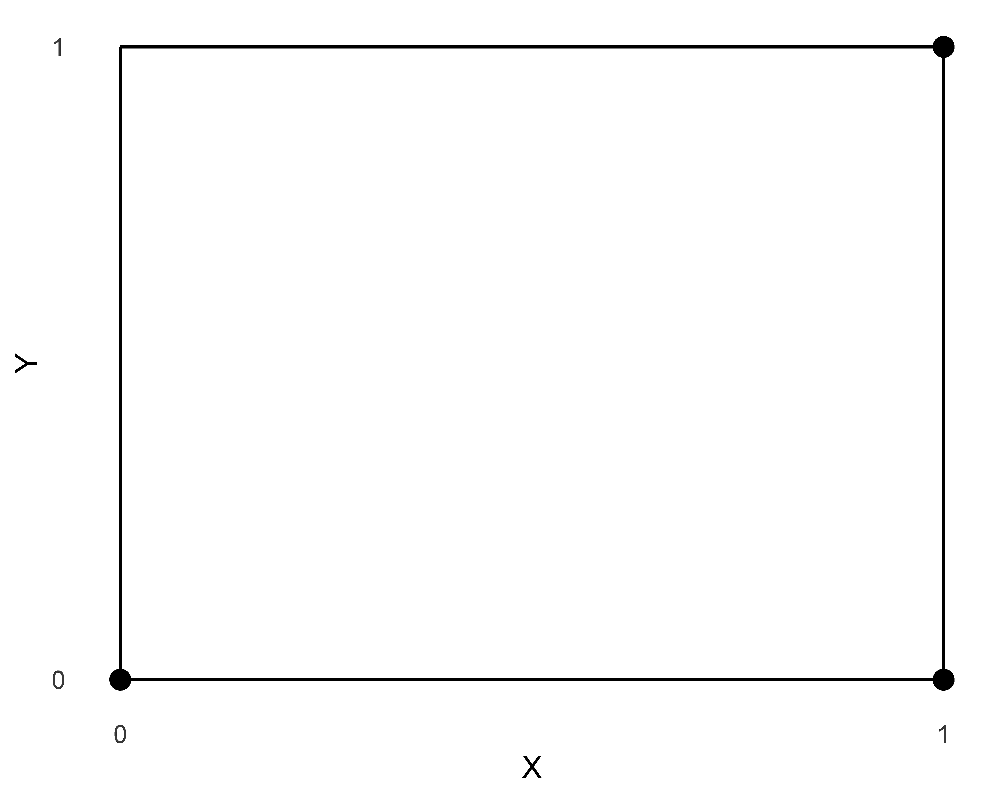
 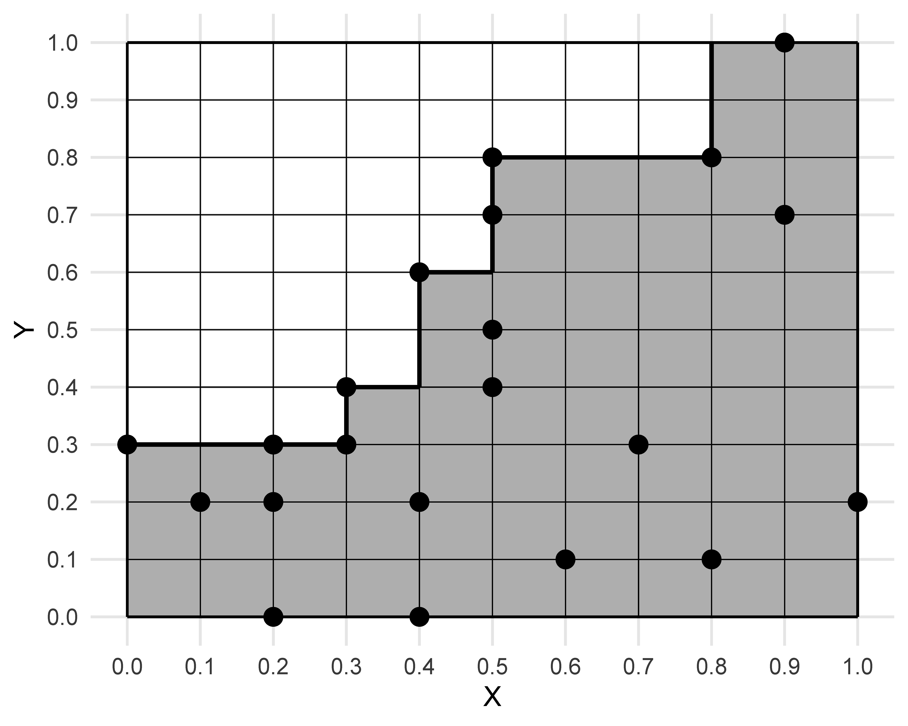
 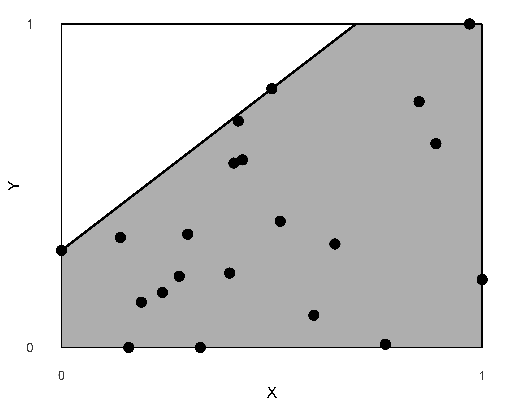
```

Instead of mapping observations on the cells of the $XY$-table, observations are now mapped on a 2D Euclidean coordinate system. The bounds of $X$ and $Y$ are again 0 and 1, but could be any other minimum and maximum values. The bounds on $X$ and $Y$ create a *bounding box* (Section \@ref(formalexpression)). In a *dichotomous necessity relationship* where both the condition and the outcome are binary, the observations are mapped at corners of the $XY$-plot (Figure \@ref(fig:dichdisconxyplotfig)-left). When necessity applies, no observations are possible in the upper-left corner [0,1]. In a *discrete necessity relationship* observations can be on the intersections of a grid representing the possible discrete values of $X$ and $Y$ (Figure \@ref(fig:dichdisconxyplotfig)-middle), and in a *continuous necessity relationship* observations can exist anywhere in the unit square (Figure \@ref(fig:dichdisconxyplotfig)-right), but not in the upper-left corner. Combinations of dichotomous, discrete and continuous values are also possible in NCA. This is shown in Figure \@ref(fig:dichdisconxyplottotfig).


```{r dichdisconxyplottotfig, echo=FALSE, fig.show="hold", out.width='90%', fig.align = "center", fig.cap="$XY$-plot with combinations of dichotomous, discrete, and continuous values of condition $X$ and outcome $Y$. The upper-left corner is empty if the presence/high value of $X$ is necessary for the presence/high value of $Y$."}
 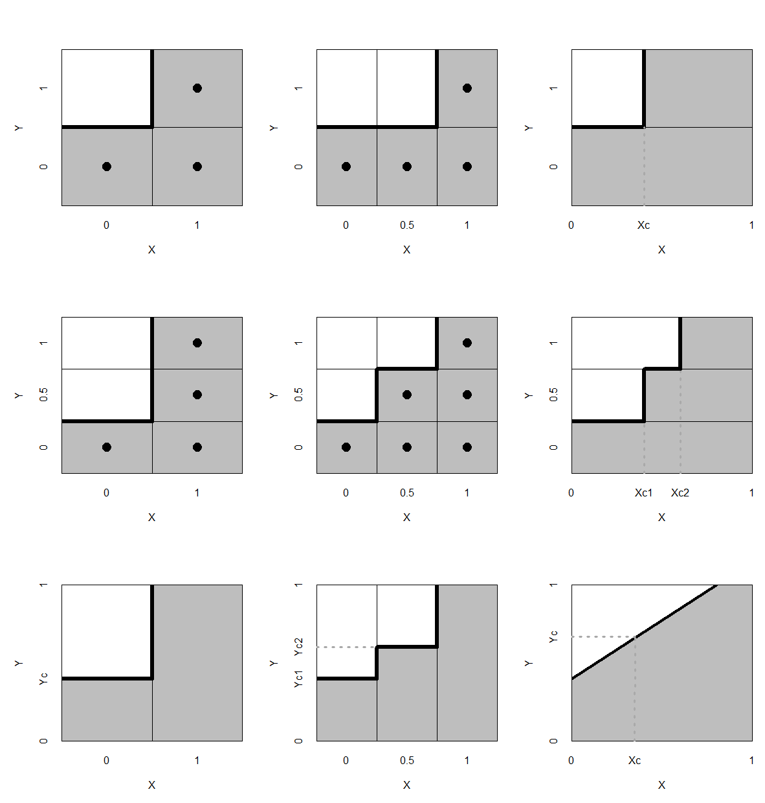
```


```{r dichotomousxyplotallcode, echo = FALSE, eval = FALSE, warning=FALSE, message=FALSE, include=FALSE, cache=TRUE}
#adapted 18 march 2025
#Figure 2.4; Dul, J. (2020). Conducting necessary condition analysis. London: Sage Publications.
par(mar=c(5,5,4,1))
# 9 figures arranged in 3 rows and 3 columns
par(mfrow=c(3,3))

#Figure 2.4A
#delete '#' in the next line to make a pdf
#pdf("Figure 2.4A.pdf", 6.5,5)  
X<- c(0.25, 0.75, 0.75) #2-2
Y<- c(0.25, 0.25, 0.75) #2-2
plot (X,Y, xlab="X", ylab="Y", xlim = c(0,1), ylim=c(0,1), pch=19, cex=2, axes = F, yaxs="i", xaxs="i", type="n") #3-3
axis(1, at = c(0,0.25,0.75,1.25), pos=0, tck=0, labels=rep(c("","0", "1", ""))) #X2
axis(2, at = c(0,0.25,0.75,1.25), pos=0, tck=0, labels=rep(c("","0", "1", ""))) #y2
abline(v=c(0.5,1), h=c(0.5,1)) #2-2
rect(0,0,0.5,0.5,  col = "grey") # 1-1
rect(0.5,0,1,0.5,  col = "grey") # 2-1
rect(0.5,0.5,1,1,  col = "grey") # 2-2
points(X,Y, pch=19, cex=2)
segments(0,0.5,0.5,0.5, lty=1, col="black", lwd = 4) #horizontal part 1 ceiling line
segments(0.5,0.5,0.5,1, lty=1, col="black", lwd = 4) #vertical part 1 ceiling line
#delete '#' in the next line to make a pdf
#dev.off()

#Figure 2.4B
#delete '#' in the next line to make a pdf
#pdf("Figure 2.4B.pdf", 6.5,5)
X<- c(0.25, 0.75, 1.25, 1.25) #3-2
Y<- c(0.25, 0.25, 0.25, 0.75) #3-2
plot (X,Y, xlab="X", ylab="Y", xlim = c(0,1.5), ylim=c(0,1), pch=19, cex=2, axes = F, yaxs="i", xaxs="i", type="n") #3-2
axis(1, at = c(0,0.25,0.75,1.25, 1.5), pos=0, tck=0, labels=rep(c("","0", "0.5", "1",""))) #X3
axis(2, at = c(0,0.25,0.75,1.25), pos=0, tck=0, labels=rep(c("","0", "1", ""))) #Y2
abline(v=c(0.5,1,1.5), h=c(0.5,1)) #3-2
rect(0,0,0.5,0.5,  col = "grey") # 1-1
rect(0.5,0,1,0.5,  col = "grey") # 2-1
rect(1,0, 1.5,0.5,  col = "grey") # 3-1
rect(1,0.5,1.5,1,  col = "grey") # 3-2
points(X,Y, pch=19, cex=2)
segments(0,0.5,1,0.5, lty=1, col="black", lwd = 4) #horizontal part 1 ceiling line
segments(1,0.5,1,1.5, lty=1, col="black", lwd = 4) #vertical part 1 ceiling line
#delete '#' in the next line to make a pdf
#dev.off()

#Figure 2.4C
#delete '#' in the next line to make a pdf
#pdf("Figure 2.4C.pdf", 6.5, 5) 
plot (X,Y, xlab="X", ylab="Y", xlim = c(0,1.5), ylim=c(0,1.), pch=19, cex=2, axes = F, yaxs="i", xaxs="i", type="n") #3-3
axis(1, at = c(0,0.6,1.5), pos=0, tck=0, labels=rep(c("0","Xc","1"))) #X=c
axis(2, at = c(0,0.25,0.75,1.25), pos=0, tck=0, labels=rep(c("","0", "1", ""))) #X=2
abline(h=c(0,0.5,1, 1.5), v=c(0, 1.5))
rect(0,0,1.5,0.5,  col = "grey") # 1-1
rect(0.6,0.5,1.5,1,  col = "grey") # 1-2
segments(0,0.5,0.6,0.5, lty=1, col="black", lwd = 4) #horizontal part 1 ceiling line
segments(0.6,0.5,0.6,1.5, lty=1, col="black", lwd = 4) #vertical part 1 ceiling line
segments(0.6,0, 0.6, 0.5, lty=3, lwd=2, col="dark grey") #dashed line for Yc2
#delete '#' in the next line to make a pdf
#dev.off()

#Figure 2.4
#delete '#' in the next line to make a pdf
#pdf("Figure 2.4D.pdf", 5,7.5) 
X<- c(0.25, 0.75, 0.75, 0.75) #2-3
Y<- c(0.25, 0.25, 0.75, 1.25) #2-3
plot (X,Y, xlab="X", ylab="Y", xlim = c(0,1), ylim=c(0,1.5), pch=19, cex=2, axes = F, yaxs="i", xaxs="i", type="n") #2-3
axis(1, at = c(0,0.25,0.75,1.25), pos=0, tck=0, labels=rep(c("","0", "1", ""))) #X2
axis(2, at = c(0,0.25,0.75,1.25, 1.5), pos=0, tck=0, labels=rep(c("","0", "0.5", "1", ""))) #Y3
abline(v=c(0.5,1), h=c(0.5,1, 1.5)) #2-3
rect(0,0,0.5,0.5,  col = "grey") # 1-1
rect(0.5,0,1,0.5,  col = "grey") # 2-1
rect(0.5,0.5,1,1,  col = "grey") # 2-2
rect(0.5,1,1,1.5,  col = "grey") # 2-3
points(X,Y, pch=19, cex=2)
segments(0,0.5,0.5,0.5, lty=1, col="black", lwd = 4) #horizontal part 1 ceiling line
segments(0.5,0.5,0.5,1.5, lty=1, col="black", lwd = 4) #vertical part 1 ceiling line
#delete '#' in the next line to make a pdf
#dev.off()

#Figure 2.4E
#delete '#' in the next line to make a pdf
#pdf("Figure 2.4E.pdf", 5,5)
X<- c(0.25, 0.75, 0.75, 1.25, 1.25, 1.25) #3-3
Y<- c(0.25, 0.25, 0.75, 0.25, 0.75, 1.25) #3-3
plot (X,Y, xlab="X", ylab="Y", xlim = c(0,1.5), ylim=c(0,1.5), pch=19, cex=2, axes = F, yaxs="i", xaxs="i", type="n") #3-3
axis(1, at = c(0,0.25,0.75,1.25, 1.5), pos=0, tck=0, labels=rep(c("","0", "0.5", "1",""))) #X3
axis(2, at = c(0,0.25,0.75,1.25, 1.5), pos=0, tck=0, labels=rep(c("","0", "0.5", "1", ""))) #Y3
abline(v=c(0.5,1,1.5), h=c(0.5,1, 1.5)) #3-3
rect(0,0,0.5,0.5,  col = "grey") # 1-1
rect(0.5,0,1,0.5,  col = "grey") # 2-1
rect(0.5,0.5,1,1,  col = "grey") # 2-2
rect(1,0, 1.5,0.5,  col = "grey") # 3-1
rect(1,0.5,1.5,1,  col = "grey") # 3-2
rect(1,1,1.5,1.5,  col = "grey") # 3-3
points(X,Y, pch=19, cex=2)
segments(0,0.5,0.5,0.5, lty=1, col="black", lwd = 4) #horizontal part 1 ceiling line
segments(0.5,0.5,0.5,1, lty=1, col="black", lwd = 4) #vertical part 1 ceiling line
segments(0.5,1,1.0,1, lty=1, col="black", lwd = 4) #horizontal part 2ceiling line
segments(1,1,1,1.5, lty=1, col="black", lwd = 4) #vertical part 1 ceiling line
#delete '#' in the next line to make a pdf
#dev.off()

#Figure 2.4F
#delete '#' in the next line to make a pdf
#pdf("Figure 2.4F.pdf", 6.5, 5) 
plot (X,Y, xlab="X", ylab="Y", xlim = c(0,1.5), ylim=c(0,1.5), pch=19, cex=2, axes = F, yaxs="i", xaxs="i", type="n") #3-3
axis(1, at = c(0,0.6,0.9,1.5), pos=0, tck=0, labels=rep(c("0","Xc1","Xc2","1"))) #X=c
axis(2, at = c(0,0.25,0.75,1.25, 1.5), pos=0, tck=0, labels=rep(c("","0", "0.5", "1", ""))) #Y=3
abline(h=c(0,0.5,1, 1.5), v=c(0, 1.5))
rect(0,0,1.5,0.5,  col = "grey") # 1-1
rect(0.6,0.5,1.5,1,  col = "grey") # 1-2
rect(0.9,1,1.5,1.5,  col = "grey") # 1-2
segments(0.6,0,0.6,0.5, lty=3, lwd=2, col="dark grey") #dashed line for Xc1
segments(0.9,0,0.9,1, lty=3, lwd=2, col="dark grey") #dashed line for Xc2
segments(0,0.5,0.6,0.5, lty=1, col="black", lwd = 4) #horizontal part 1 ceiling line
segments(0.6,0.5,0.6,1, lty=1, col="black", lwd = 4) #vertical part 1 ceiling line
segments(0.6,1,0.9,1, lty=1, col="black", lwd = 4) #horizontal part 2ceiling line
segments(0.9,1,0.9,1.5, lty=1, col="black", lwd = 4) #vertical part 1 ceiling line
#delete '#' in the next line to make a pdf
#dev.off()

#Figure 2.4G
#delete '#' in the next line to make a pdf
#pdf("Figure 2.4G.pdf", 5, 6.5) # make the vertical axis larger 
plot (X,Y, xlab="X", ylab="Y", xlim = c(0,1), ylim=c(0,1.5), pch=19, cex=2, axes = F, yaxs="i", xaxs="i", type="n") #3-3
axis(1, at = c(0,0.25,0.75,1.25), pos=0, tck=0, labels=rep(c("","0", "1", ""))) #X=2
axis(2, at = c(0,0.6,1.5), pos=0, tck=0, labels=rep(c("0","Yc","1"))) #Y=c
abline(v=c(0,0.5,1, 1.5), h=c(0, 1.5))
rect(0,0,0.5,0.6,  col = "grey") # 1-1
rect(0.5,0,1,1.5,  col = "grey") # 1-2
segments(0,0.6,0.5,0.6, lty=1, col="black", lwd = 4) #horizontal part 1 ceiling line
segments(0.5,0.6,0.5,1.5, lty=1, col="black", lwd = 4) #vertical part 1 ceiling line
#delete '#' in the next line to make a pdf
#dev.off()

#Figure 2.4H
#delete '#' in the next line to make a pdf
#pdf("Figure 2.4H.pdf", 5, 5) 
plot (X,Y, xlab="X", ylab="Y", xlim = c(0,1.5), ylim=c(0,1.5), pch=19, cex=2, axes = F, yaxs="i", xaxs="i", type="n") #3-3
axis(1, at = c(0,0.25,0.75,1.25, 1.5), pos=0, tck=0, labels=rep(c("","0", "0.5", "1", ""))) #X=3
axis(2, at = c(0,0.6,0.9,1.5), pos=0, tck=0, labels=rep(c("0","Yc1","Yc2","1"))) #Y=c
abline(v=c(0,0.5,1, 1.5), h=c(0, 1.5))
rect(0,0,0.5,0.6,  col = "grey") # 1-1
rect(0.5,0,1,0.9,  col = "grey") # 1-2
rect(1,0,1.5,1.5,  col = "grey") # 1-2
segments(0,0.9,0.5,0.9, lty=3, lwd=2, col="dark grey") #dashed line for Yc2
segments(0,0.6,0.5,0.6, lty=1, col="black", lwd = 4) #horizontal part 1 ceiling line
segments(0.5,0.6,0.5,0.9, lty=1, col="black", lwd = 4) #vertical part 1 ceiling line
segments(0.5,0.9,1.0,0.9, lty=1, col="black", lwd = 4) #horizontal part 2ceiling line
segments(1,0.9,1,1.5, lty=1, col="black", lwd = 4) #vertical part 1 ceiling line
#delete '#' in the next line to make a pdf
#dev.off()

#Figure 2.4I
#delete '#' in the next line to make a pdf
#pdf("Figure 2.4I.pdf", 5, 5)  
plot (X,Y, xlab="X", ylab="Y", xlim = c(0,1.5), ylim=c(0,1.5), pch=19, cex=2, axes = F, yaxs="i", xaxs="i", type="n") #3-3
# add grey area
x<-c(0,1.2,1.5)
y.low<-c(0,0,0)
y.high<-c(0.6,1.5,1.5)        
polygon(c(x, rev(x)), c(y.high, rev(y.low)),col = "grey", border = NA)
axis(1, at = c(0,0.53,1.5), pos=0, tck=0, labels=rep(c("0", "Xc","1"))) #X=c
axis(2, at = c(0,1,1.5), pos=0, tck=0, labels=rep(c("0","Yc","1"))) #Y=c
abline(v=c(0,1.5), h=c(0, 1.5))
segments(0,0.6,1.2,1.5, lty=1, col="black", lwd = 3) #ceiling line
segments(0,1,0.53,1, lty=3, lwd=2,col="dark grey") #horizontal dashed line for Yc
segments(0.52,0,0.53,1, lty=3, lwd=2, col="dark grey") #vertical dashed line for Xc
#delete '#' in the next line to make a pdf
#dev.off()
```

Second, whereas in the dichotomous situation the bounding box can be either full or empty, in the discrete and continuous situation it can be partly empty. The size of the empty space may vary, depending on the location of the observations. A border line (*ceiling line*) separates the empty space (*ceiling zone*) from the area where observations are possible (*feasible area*). Referring to the $XY$-plot in Figure \@ref(fig:dichdisconxyplotfig) where both the condition and the outcome are dichotomous, the ceiling line between empty and feasible area is predefined: the step line connecting the observations [0,0], [0,1], and [1,1] is always the same. The full bounding box (unit square) is empty, such that points can be only on the ceiling line. No observations can be above or to the left of the ceiling line.  In the discrete and continuous situations, the location of the ceiling line depends on the location of the observations in the unit square. This means that the location of the ceiling line and the size of the empty space vary. In any case, there can be no points above or to the left of the ceiling line. If necessity applies, points can only be on, below, or to the right of the ceiling: the feasible area. The ceiling line can be assumed (predefined) or estimated from data. In all situations, the assumption is that the ceiling line represents the sharp border between the empty space and the feasible area to represent deterministic necessity (see model fit measure *Sharpness* discussed in Section \@ref(sharpness)). When a relevant empty space exists that is caused by necessity, the necessary condition is formulated qualitatively as necessity-in-kind (NiK): $X$ is necessary for $Y$. 

Third, the discrete and continuous situation adds the possibility of a quantitative formulation of a necessary condition statement: *level of* $X$ is necessary for *level of* $Y$. This is called *necessity-in-degree* (NiD) and is shown for the continuous situation in Figure \@ref(fig:ncainshort). Any observation $C$ on the ceiling line defines a specific necessity-in-degree: level $X = x_c$ is necessary for level $Y = y_c$. Assuming an increasing ceiling line, the condition must have at least level $x_c$ for outcome level $y_c$. If the condition is less than $x_c$, the outcome will be less than $y_c$. If $X = x_c$, it cannot be concluded that $Y = y_c$, but only that $Y \leq y_c$. This situation can be described by level $x_c$ of $X$ is *necessary but not sufficient* for level $y_c$ of $Y$ (Section \@ref(necessarybutnotsufficient) for a further discussion on the meaning of necessary but not sufficient). 


```{r ncainshort, echo=FALSE, fig.show="hold", out.width='45%', fig.align="center", fig.cap="$XY$-plot illustrating necessity causality when $X$ and $Y$ are continuous (necessity-in-degree, NiD)."}

 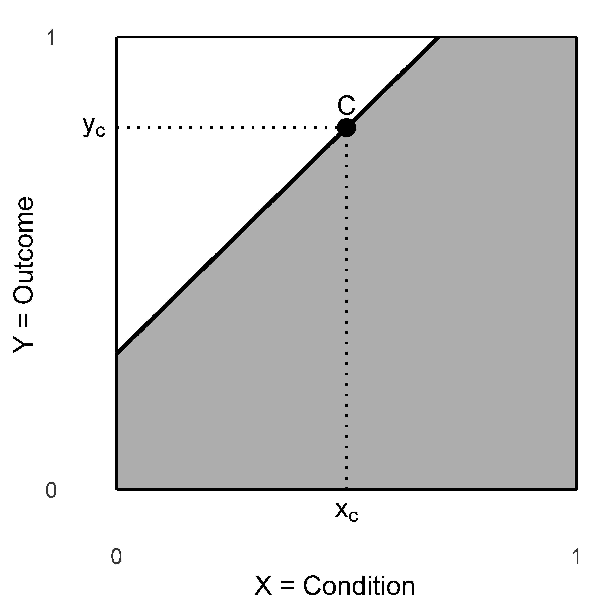 
```

<!-- ## Causal underdetermination {#underdetermination} -->
<!-- A causal relation cannot be directly observed. What can be observed are only sequences and patterns. For example, when a glass falls from the table, we see the motion of the hand, the contact with the glass, the glass's acceleration, and its eventual impact on the ground. Nowhere in this stream of sensory data is there an observable entity called "causation". The causal link must instead be *inferred*. Was the push responsible for the fall, was the table moved at the same moment, or did the glass fall by  coincidence?  -->
<!-- Because causality cannot be observed, the same observational data can support multiple causal explanations. This is the phenomenon known as *causal underdetermination* [e.g, @stanford2023underdetermination]. An observed relation between $X$ and $Y$ may reflect that $X$ causes $Y$, $Y$ causes $X$, an unobserved cause or mere chance. Underdetermination implies that a single dataset can be explained by different causal models whether framed in terms of necessity, sufficiency, probabilistic tendencies, or typicality. -->

<!-- Given the inherent underdetermination of causal claims by data, theory becomes indispensable. Theory provides the assumptions and background knowledge needed to distinguish among causal models that are all consistent with the same observations. Without such guiding principles, data remain compatible with infinitely many interpretations. Theory specifies, for example, which mechanisms are plausible and which temporal order is even possible. -->

<!-- Some causal theories may be more plausible than others. For example, if we observe that plants exposed to more sunlight grow more, the explanation that sunlight causes plant growth is far more credible than the idea that plant growth causes sunlight. An observed relation is considered *spurious* when an alternative explanation is clearly more credible because the theory is more plausible or because of better model fit.^[Model fit refers to how well a model captures the pattern in the data. Section \@ref(modelfit) discusses model fit in the context of NCA.] -->

<!-- However, several causal theories may also be equally credible. This is the situation known as *causal pluralism*: different causal perspectives may each illuminate different aspects of the same phenomenon. (see Section \@ref(methodtriangulationversuscausalpluralism)). Causal pluralism can help to better understand the phenomenon of interest.  If several causal theories are equally credible it is also possible to select one theory for pragmatic reasons. Such reasons could be simplicity (see Section \@ref(parsimonious)), usefulness for prediction, computational elegance, compatibility with other accepted theories, interpretability, or practical actionability.  -->

<!-- This book is about the use of the necessity causal perspective when interpreting phenomena. It therefore follows that a necessity-based theoretical framework is essential for describing such phenomena coherently. What constitutes such a necessity theory is discussed in the next chapter. -->


## Causal underdetermination {#underdetermination}

A causal relationship cannot be directly observed. What can be observed are only sequences and patterns. For example, when a glass falls from the table, we see the motion of the hand, the contact with the glass, the glass’s acceleration, and its eventual impact on the ground. Nowhere in this stream of sensory data is there an observable entity called “causation”. The causal link must instead be *inferred*. Was the push responsible for the fall, was the table moved at the same moment, or did the glass fall by coincidence? 

Because causality cannot be observed, a human interpretation of observed data must be made. The same observational data can support multiple causal explanations. This is the phenomenon known as *causal underdetermination* [e.g., @stanford2023underdetermination]. An observed relationship between $X$ and $Y$ may reflect that $X$ causes $Y$, $Y$ causes $X$, an unobserved cause, or mere chance. Underdetermination implies that a single dataset can be explained by different causal models, whether framed in terms of necessity, sufficiency, probabilistic tendencies, or typicality.


The idea that the same evidence can be “seen” differently is illustrated by the classic ambiguous picture below. Some viewers immediately see a young woman, while others see an old woman, and it can be hard to switch between the two. Likewise, the same data can support different causal interpretations, and once someone becomes familiar with one perspective, it may be difficult to adopt another.


```{r youngold, echo=FALSE, fig.show="hold", out.width='50%', fig.align='center', fig.cap ="The same image can be seen in different ways. Likewise, the same data can be viewed through different causal lenses. From: My wife and my mother-in-law. They are both in this picture – find them. Prints \\& Photographs Online Catalog, Library of Congress.  https://www.loc.gov/pictures/item/2010652001/. Retrieved 1 October 2025."}
#knitr::include_graphics("youngold2.jpg")
#knitr::include_graphics("master-pnp-ds-00100-00175u.png")
knitr::include_graphics("master-pnp-ds-00100-00175uFLATGREYSCALE.png")
```


A related implication is the problem of non-identifiability (or observational equivalence): distinct models can generate the same observable data patterns and therefore fit the data equally well, even though they imply different underlying structures [e.g., @rothenberg1971identification]. When this happens, the evidence cannot distinguish between these competing explanations. For example, when a correlation between $X$ and $Y$ is observed, this could be interpreted as a result of a probabilistic sufficiency relationship, or as a result of a necessity relationship (Appendix \@ref(appendixc)). In principle, both interpretations are possible. 

Given the inherent underdetermination of causal claims by data, theory becomes indispensable. Theory provides the assumptions and background knowledge needed to justify a causal model that is consistent with the observations. Without such guiding principles, data remain compatible with infinitely many interpretations. Theory specifies, for example, which mechanisms are plausible or which temporal order is even possible. The central role of theory in data analysis for causal inference is illustrated by Nancy Cartwright's slogan:

 
> “No causes in, no causes out” [@cartwrightnature, pp. 39-90]. 

Some causal theories may be more plausible than others. For example, if we observe that plants exposed to more sunlight grow more, the explanation that sunlight causes plant growth is far more credible than the idea that plant growth causes sunlight. An observed relationship is considered spurious when an alternative explanation is clearly more credible because the theory is more plausible or because of better model fit.^[Section \@ref(modelfit1) discusses model fit in the context of NCA.]

However, several causal theories may also be equally credible. This is the situation known as causal pluralism: different causal perspectives may each illuminate different aspects of the same phenomenon (Section \@ref(methodtriangulationversuscausalpluralism)). Causal pluralism can help to better understand the underlying causal mechanisms of the phenomenon of interest. If several causal theories are equally credible, it is also possible to select one theory for pragmatic reasons. Such reasons could be simplicity (Section \@ref(parsimonious)), usefulness for prediction, computational elegance, compatibility with other accepted theories, interpretability, or practical actionability. A necessity theory could be a candidate.

Underdetermination and pluralism imply that no single causal perspective is inherently the “proper” one for every study question. In particular, commonly used probabilistic sufficiency perspectives and their associated regression tools are not inherently preferred. It is the analyst’s freedom to select an appropriate perspective and tools, and the analyst’s responsibility to justify the corresponding hypothesis and interpretation (Chapter \@ref(hypothesisformulation)).

This book is about the use of the necessity causal perspective and tools when studying phenomena. It therefore follows that a necessity-based theoretical framework is essential for describing such phenomena coherently. What constitutes such a necessity theory is discussed in the next chapter.

<!-- #####################HERE IS THE CODE OF THE FIGURES IN THIS CHAPTER####################### -->

```{r suffciencynecessitycode,echo=FALSE, eval=FALSE}

#make empty 2x2 contingency table
X<- c(0.25, 0.75) #X-values center of cell
Y<- c(0.25, 0.25) #Y-values center of cell

th = 3 #thickness of lines lwd
th1 = 5 #horizontal vertical axes
th2 = 10 #thickness of points

#give names to axes
xname = "X"
yname = "Y"

#give labels to axis values
xlabel = rep(c("","Absent", "Present", ""))
ylabel = rep(c("","Absent", "Present", ""))

#Fig1
#pdf("sufficiency.pdf")
#par after calling pdf
#set positions of labels and axes names
par(mar=c(5,5,4,2)+0.1) # order: bottom, left, top, right: increase left margin from 4 to 5, rest defaults 
par(mgp = c(3, 1, 0)) # default distance between label (axis name) and axis: decrease first to get label closer to axis 
#cex.lab is size of the label = axis name
plot (X,Y, xlab=xname, ylab=yname, xlim = c(0,1), ylim=c(0,1), pch=19, cex.lab=2, axes = F, yaxs="i", xaxs="i", type="n")
#cex.axis is size of the values at the axes
axis(1, at = c(0, 0.25, 0.75, 1.25), pos=0, tck=0, lwd = th, cex.axis = 2, labels=xlabel) #X has two values
axis(2, at = c(0, 0.25, 0.75, 1.25), pos=0, tck=0,lwd = th,  cex.axis = 2, labels=ylabel) #Y has two values
abline(v=0.5, h=0.5, lwd = th)
abline(v=1, h = 1, lwd = th1)
#fill cells
rect(0, 0.5, 0.5, 1,  col = "grey", lwd = th) #corner 1
rect(0.5, 0.5, 1, 1,  col = "grey", lwd = th) #corner 2
rect(0, 0, 0.5, 0.5,  col = "grey", lwd = th) #corner 3
#rect(0.5, 0, 1, 0.5,  col = "grey", lwd = th) #corern 4


#add points in cells
# points(0.25, 0.75, pch = 19, col = "black", lwd = th2) #corner 1
# points(0.75, 0.75, pch = 19, col = "black", lwd = th2) #corner 2
# points(0.25, 0.25, pch = 19, col = "black", lwd = th2) #corner 3
# points(0.75, 0.25, pch = 19, col = "black", lwd = th2) #corner 4

#add text in cells
fontsize <- 2
text(0.25,0.75,"corner 1", cex=fontsize) #corner 1 
text(0.75,0.75,"corner 2", cex=fontsize) #corner 2
text(0.25,0.25,"corner 3", cex=fontsize) #corner 3
text(0.75,0.25,"corner 4", cex=fontsize) #corner 4

#dev.off()

#Fig2
#pdf("necessity.pdf")
par(mar=c(5,5,4,2)+0.1) 

# Create the plot with square aspect ratio
plot (X,Y, xlab=xname, ylab=yname, xlim = c(0,1), ylim=c(0,1), pch=19, cex.lab=2, axes = F, yaxs="i", xaxs="i", type="n")

axis(1, at = c(0, 0.25, 0.75, 1.25), pos=0, tck=0, lwd = th, cex.axis = 2, labels=xlabel) #X has two values
axis(2, at = c(0, 0.25, 0.75, 1.25), pos=0, tck=0, lwd = th, cex.axis = 2, labels=ylabel) #Y has two values
abline(v=0.5, h=0.5, lwd = th)
abline(v=1, h = 1, lwd = th1)
#fill cells
#rect(0, 0.5, 0.5, 1,  col = "grey", lwd = th) #corner 1
rect(0.5, 0.5, 1, 1,  col = "grey", lwd = th) #corner 2
rect(0, 0, 0.5, 0.5,  col = "grey", lwd = th) #corner 3
rect(0.5, 0, 1, 0.5,  col = "grey", lwd = th) #corner 4

#add points
# points(0.25, 0.75, pch = 19, col = "black", lwd = th2) #corner 1
# points(0.75, 0.75, pch = 19, col = "black", lwd = th2) #corner 2
# points(0.25, 0.25, pch = 19, col = "black", lwd = th2) #corner 3
# points(0.75, 0.25, pch = 19, col = "black", lwd = th2) #corner 4

#add text in cells
fontsize <- 2
text(0.25,0.75,"corner 1", cex=fontsize) #corner 1 
text(0.75,0.75,"corner 2", cex=fontsize) #corner 2
text(0.25,0.25,"corner 3", cex=fontsize) #corner 3
text(0.75,0.25,"corner 4", cex=fontsize) #corner 4

#dev.off()


# #Fig3
# pdf("sufficiencynecessity.pdf")
# par(mar=c(5,5,4,2)+0.1) 
# 
# # Create the plot with square aspect ratio
# plot (X,Y, xlab=xname, ylab=yname, xlim = c(0,1), ylim=c(0,1), pch=19, cex.lab=2, axes = F, yaxs="i", xaxs="i", type="n")
# 
# axis(1, at = c(0, 0.25, 0.75, 1.25), pos=0, tck=0, lwd = th, cex.axis = 2, labels=xlabel) #X has two values
# axis(2, at = c(0, 0.25, 0.75, 1.25), pos=0, tck=0, lwd = th, cex.axis = 2, labels=ylabel) #Y has two values
# abline(v=0.5, h=0.5, lwd = th)
# abline(v=1, h = 1, lwd = th1)
# #fill cells
# #rect(0, 0.5, 0.5, 1,  col = "grey", lwd = th) #corner 1
# rect(0.5, 0.5, 1, 1,  col = "grey", lwd = th) #corner 2
# rect(0, 0, 0.5, 0.5,  col = "grey", lwd = th) #corner 3
# #rect(0.5, 0, 1, 0.5,  col = "grey", lwd = th) #corner 4
# 
# #add points
# # points(0.25, 0.75, pch = 19, col = "black", lwd = th2) #corner 1
# # points(0.75, 0.75, pch = 19, col = "black", lwd = th2) #corner 2
# # points(0.25, 0.25, pch = 19, col = "black", lwd = th2) #corner 3
# # points(0.75, 0.25, pch = 19, col = "black", lwd = th2) #corner 4
# 
# #add text in cells
# fontsize <- 1.2
# text(0.25,0.75,"corner 1", cex=fontsize) #corner 1 
# text(0.75,0.75,"corner 2", cex=fontsize) #corner 2
# text(0.25,0.25,"corner 3", cex=fontsize) #corner 3
# text(0.75,0.25,"corner 4", cex=fontsize) #corner 4
# 
# dev.off()


#make in adobe png: file/export to/image/png settings 1200 dpi
```


```{r dichotomousxyplotcode, echo = FALSE, eval = FALSE, warning=FALSE, message=FALSE, include=FALSE, cache=TRUE}

library(ggplot2)

# Create a grid of points at intersections
x <- c(0, 1, 1)
y <- c(0, 0, 1)
random_points <- data.frame(x, y)

# Create the ggplot
gg0 <- ggplot() +
  geom_segment(aes(x = 0, y = 0, xend = 0, yend = 1), color = "black", linetype = 'solid') +
  geom_segment(aes(x = 0, y = 1, xend = 1, yend = 1), color = "black", linetype = 'solid') +
  geom_segment(aes(x = 0, y = 0, xend = 1, yend = 0), color = "black") +
  geom_segment(aes(x = 1, y = 0, xend = 1, yend = 1), color = "black") +
  
  # Plot the valid random points
  geom_point(data = random_points, aes(x = x, y = y), color = "black", size = 3) +
  
  # Change labels of axes
  labs(x = "X", y = "Y") +  # Axis labels

  # Set the x and y limits to [0, 1] and show only ticks at 0 and 1
  scale_x_continuous(breaks = c(0, 1), limits = c(0, 1)) +
  scale_y_continuous(breaks = c(0, 1), limits = c(0, 1)) +
  
  # Customize theme
  theme_minimal() +
  theme(
    panel.grid.major = element_blank(),  # No major grid lines
    panel.grid.minor = element_blank(),  # No minor grid lines
    panel.background = element_blank(),   # Ensure no background is drawn
    panel.border = element_blank(),       # Remove the outer box
    axis.line = element_blank()           # Remove axis lines
  )

# Save the plot as a PDF
#ggsave("dichotomousXYplot.pdf", plot = gg0, width = 5, height = 4, dpi = 600)

# Display the ggplot
print(gg0)
```


```{r discretexyplotcode, echo = FALSE, eval = FALSE, warning=FALSE, message=FALSE, include=FALSE, cache=TRUE}

library(ggplot2)

# Create a data frame with the ceiling line intercept = 0.3 and slope 1
ceiling_data <- data.frame(x = c(0, 1), y = c(0.3, 1.3))

# Calculate coordinates of point S2
S2_x <- (1 - 0.3) / 1.0
S2_y <- 1

# Calculate coordinates of point S1
S1_x <- 0
S1_y <- 0.3

# Define the coordinates of point C and Xc, Yc values
C_x <- 0.5
C_y <- 0.8
Xc <- C_x
Yc <- C_y

# Create a grid of points at intersections
grid_points <- expand.grid(x = seq(0, 1, by = 0.1), y = seq(0, 1, by = 0.1))

# Calculate ceiling function for filtering points below the ceiling line
ceiling_func <- function(x) { 1 - x + 0.3 }

# Filter points that are inside the polygon and below the ceiling line
valid_points <- grid_points[grid_points$y < ceiling_func(grid_points$x) & grid_points$y < 1 - grid_points$x + 0.3, ]

# Randomly select 20 points from the valid grid points
set.seed(42)  # Setting seed for reproducibility
random_points <- valid_points[sample(nrow(valid_points), 20), ]

# Create a data frame of additional random points
x <- c(0.5, 0.4, 0.2, 0.8, 0.6, 0.9, 0.3, 0.1, 0.9, 0.3, 0.8, 1.0, 0.2, 0.7, 0.4, 0.2, 0.4, 0.0, 0.5, 0.5, Xc)
y <- c(0.4, 0.6, 0.2, 0.8, 0.1, 1.0, 0.4, 0.2, 0.7, 0.3, 0.1, 0.2, 0.0, 0.3, 0.2, 0.3, 0.0, 0.3, 0.7, 0.5, Yc)
random_points <- data.frame(x, y)

# Create the ggplot
gg1 <- ggplot() +
  geom_polygon(data = data.frame(x = c(0, 1, 1, 0), y = c(0, 0, 0.3, 0.3)),
               aes(x, y), fill = "grey", alpha = 1) +  # Grey rectangle below the steps
  geom_polygon(data = data.frame(x = c(0.3, 1, 1, 0.3), y = c(0.3, 0.3, 0.4, 0.4)),
               aes(x, y), fill = "grey", alpha = 1) +  # Grey rectangle below the steps
  geom_polygon(data = data.frame(x = c(0.4, 1, 1, 0.4), y = c(0.4, 0.4, 0.6, 0.6)),
               aes(x, y), fill = "grey", alpha = 1) +  # Grey rectangle below the steps
  
  geom_polygon(data = data.frame(x = c(0.5, 1, 1, 0.5), y = c(0.6, 0.6, 0.8, 0.8)),
               aes(x, y), fill = "grey", alpha = 1) +  # Grey rectangle below the steps
  geom_polygon(data = data.frame(x = c(0.8, 1, 1, 0.8), y = c(0.8, 0.8, 1.0, 1.0)),
               aes(x, y), fill = "grey", alpha = 1) +  # Grey rectangle below the steps
  
  
  geom_segment(aes(x = 0, y = 0.3, xend = 0.3, yend = 0.3), color = "black", linetype = 'solid', lwd = 0.8) +
  geom_segment(aes(x = 0.3, y = 0.3, xend = 0.3, yend = 0.4), color = "black", linetype = 'solid', lwd = 0.8) +
  geom_segment(aes(x = 0.3, y = 0.4, xend = 0.4, yend = 0.4), color = "black", linetype = 'solid', lwd = 0.8) +
  geom_segment(aes(x = 0.4, y = 0.4, xend = 0.4, yend = 0.6), color = "black", linetype = 'solid', lwd = 0.8) +
  geom_segment(aes(x = 0.4, y = 0.6, xend = 0.5, yend = 0.6), color = "black", linetype = 'solid', lwd = 0.8) +
  geom_segment(aes(x = 0.5, y = 0.6, xend = 0.5, yend = 0.8), color = "black", linetype = 'solid', lwd = 0.8) +
  geom_segment(aes(x = 0.5, y = 0.8, xend = 0.8, yend = 0.8), color = "black", linetype = 'solid', lwd = 0.8) +
  geom_segment(aes(x = 0.8, y = 0.8, xend = 0.8, yend = 1.0), color = "black", linetype = 'solid', lwd = 0.8) +
  #geom_segment(aes(x = 0.5, y = 0.8, xend = 0.8, yend = 0.8), color = "black", linetype = 'solid', lwd = 0.8) +
  
  
  
  geom_segment(aes(x = 0, y = 0, xend = 0, yend = 1), color = "black", linetype = 'solid') +
  geom_segment(aes(x = 0, y = 1, xend = 1, yend = 1), color = "black", linetype = 'solid') +
  geom_segment(aes(x = 0, y = 0, xend = 1, yend = 0), color = "black") +
  geom_segment(aes(x = 1, y = 0, xend = 1, yend = 1), color = "black") +
  #geom_segment(aes(x = S1_x, y = S1_y, xend = S2_x, yend = S2_y), color = "black", lwd = 0.8) +
  
  # Plot the valid random points
  geom_point(data = random_points, aes(x = x, y = y), color = "black", size = 3) +
  
  # Change labels of axes
  labs(x = "X", y = "Y") +  # Axis labels
  
  # Set the x and y limits to [0, 1] and show only ticks at 0.1 etc
  scale_x_continuous(breaks = seq(0, 1, by = 0.1), limits = c(0, 1)) +
  scale_y_continuous(breaks = seq(0, 1, by = 0.1), limits = c(0, 1)) +
  
  # # Add consistent grid lines
  # geom_hline(yintercept = seq(0, 1, by = 0.1), color = "black", size = 0.2) +
  # geom_vline(xintercept = seq(0, 1, by = 0.1), color = "black", size = 0.2) +
  
  # Add consistent grid lines (avoid crossing axes)
  annotate("segment", x = 0, xend = 1, y = seq(0.1, 0.9, by = 0.1), yend = seq(0.1, 0.9, by = 0.1), color = "black", size = 0.2) +
  annotate("segment", x = seq(0.1, 0.9, by = 0.1), xend = seq(0.1, 0.9, by = 0.1), y = 0, yend = 1, color = "black", size = 0.2) +
  
  
  # Customize theme
  theme_minimal() +
  theme(
    panel.grid.minor = element_blank(),                # No minor grid lines
    panel.background = element_blank(),                # Ensure no background is drawn
    panel.border = element_blank(),                    # Remove the outer box
    axis.line = element_blank()                        # Remove axis lines
  ) 

# Save the plot as a PDF
#ggsave("discreteXYplot.pdf", plot = gg1, width = 5, height = 4, dpi = 600)

# Display the ggplot
print(gg1)

```


```{r continuousxyplotcode, echo = FALSE, eval = FALSE, warning=FALSE, message=FALSE, include=FALSE, cache=TRUE}

library(ggplot2)

# Create a data frame with the ceiling line intercept = 0.3 and slope 1
ceiling_data <- data.frame(x = c(0, 1), y = c(0.3, 1.3))

# Calculate coordinates of point S2
S2_x <- (1 - 0.3) / 1.0
S2_y <- 1

# Calculate coordinates of point S1
S1_x <- 0
S1_y <- 0.3

# Define the coordinates of point C and Xc, Yc values
C_x <- 0.5
C_y <- 0.8
Xc <- C_x
Yc <- C_y

x <- c(0.52, 0.43, 0.24, 0.85, 0.6, 0.97, 0.3, 0.19, 0.89, 0.28, 0.77, 1.0, 0.16, 0.65, 0.4, 0.14, 0.33, 0.0, 0.42, 0.41, Xc)
y <- c(0.39, 0.58, 0.17, 0.76, 0.1, 1.0, 0.35, 0.14, 0.63, 0.22, 0.01, 0.21, 0.0, 0.32, 0.23, 0.34, 0.0, 0.30, 0.7, 0.57, Yc)
random_points <- data.frame(x,y)

# Create the ggplot
gg2 <- ggplot() +
  geom_polygon(data = data.frame(x = c(0, S1_x, S2_x, 1, 1), y = c(0, S1_y, S2_y, 1, 0)),
               aes(x, y), fill = "grey") +
  geom_segment(aes(x = 0, y = 0, xend = 0, yend = 1), color = "black", linetype = 'solid') +
  geom_segment(aes(x = 0, y = 1, xend = 1, yend = 1), color = "black", linetype = 'solid') +
  geom_segment(aes(x = 0, y = 0, xend = 1, yend = 0), color = "black") +
  geom_segment(aes(x = 1, y = 0, xend = 1, yend = 1), color = "black") +
  geom_segment(aes(x = S1_x, y = S1_y, xend = S2_x, yend = S2_y), color = "black", lwd = 0.8) +

  # Plot the valid random points
  geom_point(data = random_points, aes(x = x, y = y), color = "black", size = 3) +
  
  # Change labels of axes
  labs(x = "X", y = "Y") +  # Axis labels
  
  # Set the x and y limits to [0, 1] and show only ticks at 0 and 1
  scale_x_continuous(breaks = c(0, 1), limits = c(0, 1)) +
  scale_y_continuous(breaks = c(0, 1), limits = c(0, 1)) +
  
  # Customize theme
  theme_minimal() +
  theme(
    panel.grid.major = element_blank(),  # No major grid lines
    panel.grid.minor = element_blank(),  # No minor grid lines
    panel.background = element_blank(),   # Ensure no background is drawn
    panel.border = element_blank(),       # Remove the outer box
    axis.line = element_blank()           # Remove axis lines
  )

# Save the plot as a PDF
#ggsave("continuousXYplot.pdf", plot = gg2, width = 5, height = 4, dpi = 600)

# Display the ggplot
print(gg2)
```


```{r ncainshortcode, echo = FALSE, eval = FALSE, warning=FALSE, message=FALSE, include=FALSE, cache=TRUE}

library("ggplot2")

# Create a data frame with the ceiling line intercept = 0.3 and slope 1
ceiling_data <- data.frame(x = c(0, 1), y = c(0.3, 1.3))

# Calculate coordinates of point S2
S2_x <- (1 - 0.3) / 1.0
S2_y <- 1

# Calculate coordinates of point S1
S1_x <- 0
S1_y <- 0.3

# Define the coordinates of point C and Xc, Yc values
C_x <- 0.5
C_y <- 0.8
Xc <- C_x
Yc <- C_y

# Create the ggplot
#pdf("NCAinShort.pdf", height = 3.5, width = 3.5)
gg <- ggplot() +
  # geom_segment(aes(x = 0, y = 0, xend = 0, yend = 1), color = "black", linetype = 'dashed') +
  # geom_segment(aes(x = 0, y = 1, xend = 1, yend = 1), color = "black", linetype = 'dashed') +
  geom_polygon(data = data.frame(x = c(0, S1_x, S2_x, 1, 1), y = c(0, S1_y, S2_y, 1, 0)),
               aes(x, y), fill = "grey") +
  geom_segment(aes(x = 0, y = 0, xend = 0, yend = 1), color = "black", linetype = 'solid') +
  geom_segment(aes(x = 0, y = 1, xend = 1, yend = 1), color = "black", linetype = 'solid') +
  # geom_segment(aes(x = 0, y = 0, xend = 1, yend = 0), color = "black", lwd = 0.8) +
  # geom_segment(aes(x = 1, y = 0, xend = 1, yend = 1), color = "black", lwd = 0.8) +
  geom_segment(aes(x = 0, y = 0, xend = 1, yend = 0), color = "black") +
  geom_segment(aes(x = 1, y = 0, xend = 1, yend = 1), color = "black") +
  # geom_segment(aes(x = S2_x, y = S2_y, xend = 1, yend = 1), color = "black", lwd = 0.8) +
  # geom_segment(aes(x = S1_x, y = S1_y, xend = 0, yend = 0), color = "black", lwd = 0.8) +
  geom_segment(aes(x = S1_x, y = S1_y, xend = S2_x, yend = S2_y), color = "black", lwd = 0.8) +
  
  geom_point(aes(x = C_x, y = C_y), color = "black", size = 3) +  # Add point C
  geom_segment(aes(x = C_x, y = 0, xend = Xc, yend = Yc), color = "black", linetype = "dotted") +  # Connect C to Xc
  geom_segment(aes(x = C_x, y = C_y, xend = Xc, yend = Yc), color = "black", linetype = "dotted") +  # Connect C to Xc
  geom_segment(aes(x = 0, y = Yc, xend = Xc, yend = Yc), color = "black", linetype = "dotted") +  # Horizontal dotted line at Yc
  
  annotate("text", x = C_x, y = C_y + 0.05, label = "C", color = "black", size = 4) +  # Label "C" above the line
  annotate("text", x = Xc, y = -0.05, label = expression(x[c]), color = "black", size = 4) +  # Label for Xc
  annotate("text", x = -0.05, y = Yc, label = expression(y[c]), color = "black", size = 4) +  # Label for Yc
  
  
  xlim(0, 1) +
  ylim(0, 1) +
  xlab("X = Condition") +
  ylab("Y = Outcome") +
  scale_x_continuous(breaks = c(0, 1)) +
  scale_y_continuous(breaks = c(0, 1)) +
  theme_minimal() +
  theme(panel.grid = element_blank(),
        #panel.background = element_rect(fill = "transparent"))
        panel.background = element_blank(),      # Ensure no background is drawn
        panel.border = element_blank(),          # Remove the outer box
        axis.line = element_blank())             # Remove axis lines

# Display the ggplot
print(gg)
#dev.off()
```


<!-- necessity-in-kind -->
<!-- necessity-in-degree -->

<!-- ## The meaning of necessary but not sufficient -->
<!-- - binary - qualitative -->
<!-- - continuous -quantitative. -->

<!-- ## Causality -->

<!-- Causality cannot be directly observed. It is a human interpretation of something (the cause) affecting something else (the effect). There is an ongoing debate in philosophy and elsewhere about what is causality and what is a cause. In this section NCA's interpretation of causality is explained. -->

<!-- ### Determinstic causality  -->
<!-- The discussion about causality often starts with David Hume's definition of a cause^[The quote is from the final edition of "Enquiry of Human Understanding" @hume1777enquiry. The second sentence was missing in the first edition [@hume1748enquiry] and was added in the third edition of 1756 [@Falkenstein2013].] represents a deterministic view on causality:  -->

<!-- > "We may define a cause to be an object, followed by another, and where all the objects, similar to the first, are followed by objects, similar to the second. Or in other words, where, if the first had not been, the second never had existed." -->

<!-- ### Probabilistic causality -->


<!-- ### Necessity "in kind" and "in degree" -->
<!-- Rather than the two values 'true' or 'false', in NCA $X$ and $Y$ usually have the values 'presence' or 'absence' (e.g., the presence/absence of $X$ is necessary for the presence/absence of $Y$). Such qualitative statement is called necessity 'in kind'. NCA also allows that $X$ and $Y$ have certain specific levels (e.g., 'level $X=X_c$ is a necessary for level $Y = Y_c$'). Such quantitative necessity statement is called necessity-in-degree.  -->

<!-- ### Exceptions:  "almost always necessary" -->


<!-- ```{r} -->
<!-- chunk_names -->
<!-- ``` -->


<!--chapter:end:020-causalityJO.Rmd-->

# Theory {#theory}

## Summary of this chapter {#summarytheory}

This chapter discusses causal theory in general and necessity theory in particular. A causal theory helps us understand phenomena, predict effects, and explain empirical findings. The chapter begins (Section \@ref(definitionnecessitytheory)) by discussing the four fundamental elements of a theory: (1) focal unit (e.g., person, organization, country), (2) concepts (varying characteristics of the focal unit), (3) propositions (causal relationships between the concepts), and (4) theoretical domain (generalization to where the theory holds). This is followed by a discussion of parsimonious necessity theories (Section \@ref(parsimonious)) and types of necessity theories (Section \@ref(theorytypes)), for example a pure necessity theory where all relationships between the concepts are described in terms of necessity, and an embedded necessity theory, where part of the theory has one or more necessity relationships. Next, the direction of a necessity proposition is discussed (Section \@ref(direction)), which depends on whether $X$ and $Y$ are present/have high value or are absent/have low value. The most common direction is that the presence or high value of $X$ is necessary for the presence or high value of $Y$ (high-high direction), which is the default when the direction is not specified. Other possible directions are high-low, low-high, and low-low. The following section (Section \@ref(expectedemptycorner)) discusses the expected data pattern when necessity holds. A consequence of a high-high necessary condition is that the upper-left corner in an $XY$-plot is expected to be empty. The next section (Section \@ref(morecorners)) discusses the possibility of having double necessity when multiple corners are expected to be empty. The chapter finishes with a discussion of the theoretical meaning of 'necessary but not sufficient' (Section \@ref(necessarybutnotsufficient)).

## Main elements of a theory {#definitionnecessitytheory}
Because there are multiple ways to conceptualize theory, there is no consensus on what a theory is. This book adopts the 'four elements' approach to theory [@dul2008case], which enables straightforward empirical testing. It uses a broad and inclusive definition of what constitutes a theory, ranging from established theories that are broadly accepted to theoretical assertions by an analyst made in a specific study. Not only academic theories but also 'theories-in-use' qualify as a theory. At a minimum, a theory must have four fundamental elements: focal unit, concepts, propositions, and theoretical domain. The *focal unit* is the object to which the theory applies: country, person, firm, project, etc. The *concepts* are the variant characteristics of the focal unit representing properties of a phenomenon that can increase or decrease. In NCA, a concept that is the cause is called the 'condition' and a concept that is the effect is called the 'outcome'. The *proposition* describes the relationship between cause and effect, including the causal explanation. In NCA, the causal relationship is a necessity relationship: $X$ is necessary for $Y$, meaning that $X$ is (almost always) necessary for $Y$ [@dul2024different]. The words 'almost always' may be omitted from the necessity proposition, allowing both a deterministic and a typicality perspective. As theories in the social sciences are usually semantic (expressed in words), specific levels of the condition (cause) and the outcome (effect) are not specified. The *theoretical domain* is the set of cases of the focal unit where the theory is supposed to hold, and is defined by the boundary conditions of the theory. A *case* is one particular example of the focal unit: a specific country, a specific person, etc. For example, a theory that proposes a relationship between physical exercise and stress might be applicable to working adults, but not to children. In that case, the theoretical domain includes only working adults.

For example, the established Theory of Planned Behavior (TPB) explains how an individual's intention for a specific non-habitual behavior relates to the performance of that behavior [@ajzen1991theory]. The *focal unit* is 'individual' or 'person', two of its *concepts* are 'Intention for the behavior' (the cause) and 'Performing the behavior' (the effect), the *proposition* describes the causal relationship between these concepts, and one possible *theoretical domain* is 'all people in the world'.

<!-- ######################## -->
<!-- Bagozzi, R. P. (1992). The self-regulation of attitudes, intentions, and behavior. Social -->
<!-- psychology quarterly, 178-204. -->
<!-- Bentler, P. M., & Speckart, G. (1979). Models of attitude–behavior relations. Psychological -->
<!-- review, 86(5), 452. -->
<!-- Chien-Chi, C., Sun, B., Yang, H., Zheng, M., & Li, B. (2020). Emotional competence, -->
<!-- entrepreneurial self-efficacy, and entrepreneurial intention: A study based on China -->
<!-- college students’ social entrepreneurship project. Frontiers in psychology, 11, 547627. -->

<!-- Here, we explain that “While the TPB has been -->
<!-- widely applied based on probabilistic -->
<!-- sufficiency logic in the residential water -->
<!-- conservation domain, scholars such as -->
<!-- Baggozzi (1992) and Conner and Armitage -->
<!-- (1998) suggest the existence of necessity -->
<!-- relationships. Baggozzi (1992) surmised that -->
<!-- the theoretical components of the TPB are -->
<!-- necessary determinants of behaviour. -->
<!-- Specifically, the author emphasises that selfefficacy -->
<!-- and outcome beliefs are pre-requisite -->
<!-- conditions for the explanation and -->
<!-- achievement of behaviour. Similarly, Bentler -->
<!-- and Speckart (1979) posit that the TPB -->
<!-- emphasises the necessity of attitude-intention, -->
<!-- subjective norm-intention, and intentionbehaviour -->
<!-- relationships. These assertions -->
<!-- aligning with Ajzen's (1991) emphasis that -->
<!-- intention will not become behaviour if there is -->
<!-- no volitional control, indicate the existence of -->
<!-- necessity relationships among the theoretical -->
<!-- constructs. -->
<!-- Adding to this, Frommeyer et al. (2022) and -->
<!-- Chien-Chi et al. (2020) confirm that -->
<!-- behavioural intention is a necessary -->
<!-- prerequisite for behaviour performance. This -->
<!-- is logical in that an individual who lacks a -->
<!-- certain level of intention towards a behaviour -->
<!-- will not engage in the behaviour. Similarly, Di -->
<!-- Maio et al. (2021) and Newby et al. (2021) -->
<!-- posit that self-efficacy is required and -->
<!-- necessary when aiming for higher action -->
<!-- planning and sustaining health behaviour, -->
<!-- respectively. Dira (2021) highlight that -->
<!-- perception of oneself is an essential -->
<!-- precondition that determines intentions -->
<!-- towards behaviour. These assertions align with -->
<!-- our view that if an individual lacks a certain -->
<!-- level of belief about his/her efficacy towards -->
<!-- water conservation behaviour then that -->
<!-- individual’s intention to execute the behaviour -->
<!-- will be constrained. -->
<!-- Rozenkowska (2023) in a literature review -->
<!-- elucidated that to understand behaviour, -->
<!-- attitude and subjective norms are necessary -->
<!-- factors to consider. Frommeyer et al. (2022) -->
<!-- also confirmed that subjective norms are -->
<!-- critical factors in sustainable clothing -->
<!-- consumption behaviour. This suggests that -->
<!-- social observations and validations have -->
<!-- critical influences on behaviour and as such -->
<!-- individuals will engage in behaviours that -->
<!-- align with societal expectations, especially -->
<!-- from close social references. Concerning -->
<!-- attitude, Aliabadi et al. (2020) explain that to -->
<!-- promote and achieve water conservation and -->
<!-- sustainable behaviours, the critical factor of -->
<!-- attitude must be understood. Adding to this, -->
<!-- Aznar-Sanchez et al. (2021) investigating -->
<!-- farmer’s adoption of desalinated seawater for -->
<!-- irrigation, found that attitude and preferences -->
<!-- are critical and necessary factors that condition -->
<!-- acceptance behaviour. Similarly, we argue that -->
<!-- attitude is a necessary condition for residential -->
<!-- water conservation because if an individual -->
<!-- has no positive attitudes or lacks a certain level -->
<!-- of it, then the intention to execute water -->
<!-- conservation behaviours will not exist or be -->
<!-- realised. Based on the discourse, we -->
<!-- hypothesise that: -->


<!-- <!-- ########################## --> 

The relationship between the two TPB concepts is usually specified as a *probabilistic sufficiency relationship*, for example 'Intention to perform a behavior likely to result in Performing the behavior', or, as the founder of TPB  puts it: "As a general rule, the stronger the intention to engage in a behavior, the more likely should be its performance" [@ajzen1991theory, p. 181]. Recent interpretations of TPB suggest formulating the relationship between the two concepts in terms of *necessity* [e.g., @frommeyer2022utility; @rozenkowska2023theory; @eccarius2024examining]: for example 'Intention to perform a behavior is necessary for Performing the behavior'. The key difference between a conventional (probabilistic sufficiency) theory and a necessity theory is the difference in specification of the causal relationship, in other words the *causal perspective* [@dul2024different] that is used to describe the relationship between the concepts (i.e., the proposition).

A theory is only complete if it is accompanied by a plausible substantive explanation of why the cause affects the outcome. For a necessity proposition, the theory should explain (1) why all cases from the theoretical domain with the outcome have the condition, (2) why without the condition, the outcome does not exist, (3) why the absence of the condition is not compensable by other factors (no possibility of substitution), and (4) that the condition precedes the outcome (fulfilling the temporality requirement of causality). Details about how to formulate a formal necessity hypothesis embedded in a necessity theory are explained in Chapter \@ref(hypothesisformulation). When applying NCA, a necessity theory that causally explains the necessity relationship is essential.

## Parsimonious necessity theories {#parsimonious}
Necessity theories are inherently parsimonious: single concepts make a strong, actionable prediction: the absence of a necessary condition perfectly predicts the absence of the outcome. Starting with William of Ockham's parsimony principle^[An important element of parsimony is that theories should be simple: "*... frustra fit per plura, quod potest fieri per pauciora*." (it is pointless to do with more what can be done with fewer) [@ockham1323summa].] (also known as Occam's Razor), many famous scholars including Newton^[ "*Causas rerum naturalium non plures admitti debere, quam quae & vera sint & earum phaenomenis explicandis sufficiunt*." (The causes of natural things should not be multiplied beyond what is true and sufficient to explain their appearances) [@newton1687principia].], Einstein^[ "*It can scarcely be denied that the supreme goal of all theory is to make the irreducible basic elements as simple and as few as possible without having to surrender the adequate representation of a single datum of experience*." [@einstein1934method].], Popper^[ "*We do not seek highly probable theories, but explanations; and the best explanations are often simple explanations.*" [@popper1959logic].], and Simon^[ "*Simplicity is not an optional accessory in human thought and action; it is a necessity*." [@simon1957models].] emphasized the importance of keeping theories simple, such that they are understandable, practically useful, and falsifiable.

Because necessary conditions operate in isolation from the rest of the causal structure (see Section \@ref(multipleconditions)), even the simplest necessity theory with only one or a few necessary conditions can be actionable. Figure \@ref(fig:fig1model) shows a necessity theory with two concepts: one condition $X$ and one outcome $Y$. To emphasize the necessity perspective used to describe the relationship, nc (necessary cause or necessary condition) is placed above the arrow.


<!-- It can range be a formal, generally accepted theory in the literature [such as the Theory of Planned Behavior @ajzen1991theory], or an emerging theory that has been proposed in the literature but is not (yet) broadly accepted, for example as part of a specific theory testing empirical study.  -->

<!-- As a minimum, a theory must have four fundamental components.  -->

<!-- In the context of a necessity theory, an additional requirement is that the theory should not be refuted or invalidated by a thought experiment (see section \@ref(thoughtexperiment)). -->

<!--  necessity causal relationship is -->

<!-- The four fundamental components of a theory --including a necessity theory-- are: -->


<!-- ^[As another illustration, the four characteristics of the necessity theory in `nca.example` of the `NCA` software are: Focal unit = country; Independent concepts (conditions) = Individualism and Risk taking; Dependent concept (outcome) = Innovation performance; Propositions = Individualism is necessary for Innovation performance, Risk taking is necessary for Innovation performance; Theoretical domain: Western countries.] ^[In theory testing research the four elements of a theory (concepts, focal unit, propositions and theoretical domain) are operationalized: concepts are operationalized into *variables* that can be measured, propositions are operationalized into *hypotheses* with relations between variables, focal unit becomes the *unit of analysis*, and the theoretical domain becomes the *study domain* from which the cases for the study are selected. For case selection usually a *population* of cases is identified in the theoretical domain and a *sample* is taken from this population, but purposive selection of cases is possible as well [@dul2024how]. From the sample a *dataset* is obtained with variables scores of the cases. See also section \@ref(datacollection).]  -->

```{r fig1model, echo=FALSE, message=FALSE, out.width = "45%", fig.align = 'center', fig.cap= "Conceptual model of a necessity theory with one condition and one outcome."}
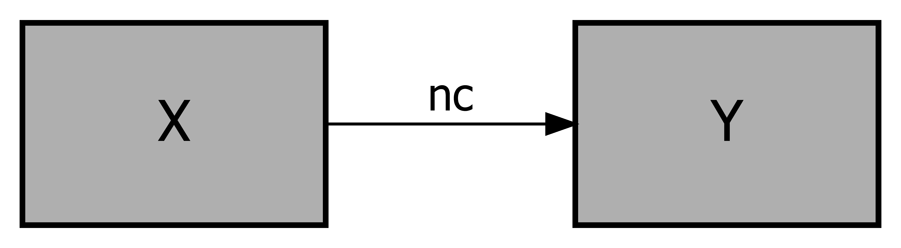
```

It is also possible that multiple concepts (e.g., $X_1$, $X_2$, $X_3$) are necessary for the same outcome ($Y$) as shown in Figure \@ref(fig:fig2model)-left, or that one or more conditions are necessary for several outcomes (e.g., $Y_1$, $Y_2$, $Y_3$), which is shown in Figure \@ref(fig:fig2model)-right. Note that conditions $X_1$, $X_2$, and $X_3$ are all individual necessary conditions. If any one condition is missing (below its required level) the outcome cannot occur (at its target level), while the presence of all conditions is normally not sufficient for the outcome because other contributing factors must be in place as well.


```{r fig2model, echo=FALSE, message=FALSE, fig.show="hold", fig.align = 'center', out.width = "45%", fig.cap= "Conceptual models of a necessity theory with three conditions and one outcome (Left), and of a theory with one condition and three outcomes (Right)."}
#par(mfrow = c(1,2))
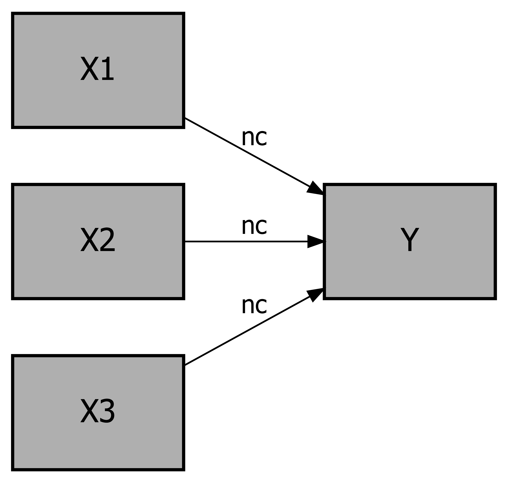
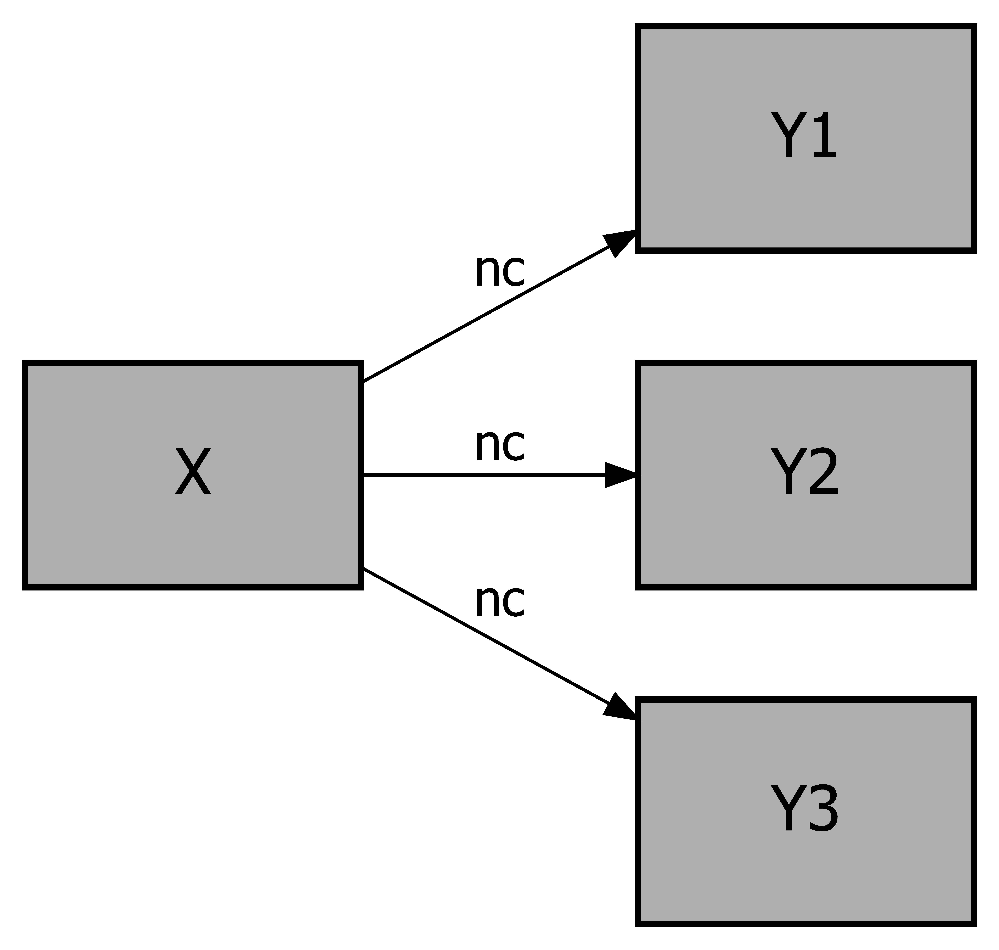
```

<!-- ```{r fig3model, echo=FALSE, message=FALSE, out.width = "50%", fig.align = 'center', fig.cap= "Conceptual model of a necessity theory with one condition and three outcomes."} -->
<!--  -->
<!-- ```  -->

Furthermore, several necessary conditions can combine into a necessity causal chain where $X_1$ is necessary for $X_2$, and $X_2$ is necessary for $Y$. This situation is shown in Figure \@ref(fig:fig4model) and is called 'chain necessity' of $X_1$ for $Y$. Chain necessity differs from 'direct necessity' as shown in Figure \@ref(fig:fig1model). In the dichotomous necessity-in-kind (NiK) situation, the necessity of $X_1$ for $X_2$ and of $X_2$ for $Y$ implies the necessity of $X_1$ for $Y$. However, in the necessity-in-degree (NiD) situation it is possible that the chain necessity of $X_1$ for $Y$ is absent despite the necessity between the elements of the chain ($X_1$ for $X_2$ and $X_2$ for $Y$), as discussed in Section \@ref(chain).

```{r fig4model, echo=FALSE, message=FALSE, out.width = "90%", fig.align = 'center', fig.cap= "Conceptual model of a chain of necessary conditions. $X_1$ is necessary for $X_2$ and $X_2$ is necessary for $Y$."}
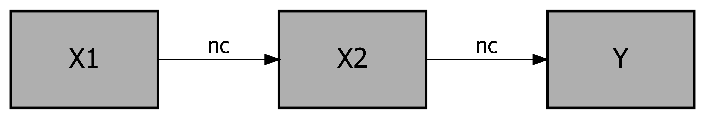
```

<!-- An essential part of a necessity theory is the specification of the theoretical domain where the necessity claim is expected to hold. For example if the claim holds for people, it may or may not hold for females, or if it does not hold for people it may hold for female. . , it also applies to a specific part of that theoretical domain. For example when the theoretical domain is defined as all people from the world, all cases are in the feasible space and no cases are in the empty space of Figure \@ref(fig:cornerssufficiencynecessity) Right for binary concepts and Figure \@ref(fig: ncainshort) for continuous concepts. Removing a selection of cases from the feasible space, will not change the empty space in the binary situation, and will not decrease the empty space in the continuous situation. However, in the continuous situation is it possible the the empty space increases when a specific selection of cases based on a certain characteristic (e.g. female) is removed and all cases near the ceiling have that characteristic, which results in lowering the ceiling and increasing the empty space. .  are all theses cases turn out to be all near the ceiling: removing them  , namely (cases near the ceiling) are removed, which may increase necessity. This indicates that the removed  In the binary case  However, it may increase the empty space, for example when alHowever, by taking  a *new* theory may de defined with where the theoretical domain is smaller than the origical domain and for that subdomain there may be more necessity.   (This means that the idea of 'necessity moderation' does not exist in necessity theories.      -->

Necessity models are inherently parsimonious. A single necessary condition can stop the outcome, independently of other conditions and other contributing factors. However, in sufficiency-based perspectives, a single factor is seldom enough to produce the outcome. For a probabilistic or configurational sufficiency model, a series of factors are included to model causal complexity. This applies to both probabilistic sufficiency (e.g., structural causal models) and configurational sufficiency (e.g., as in QCA). Parts of the relationships of sufficiency models could (also) be necessity relationships. For the necessity analysis these parts can be isolated (as in Figure \@ref(fig:fig1model)) from the rest of the causal structure and independently be analyzed for necessity (Chapter \@ref(multimethodstudies)).


## Types of necessity theories {#theorytypes}
In addition to the established/emerging distinction, necessity theories can also be classified according to the extent to which necessity propositions are part of the theory. @bokrantz2022building distinguish between *pure necessity theories*, which are theories that consist only of necessity relationships between the concepts and *embedded necessity theories*, which are theories that consist of a mix of necessity relationships and other relationships (e.g., probabilistic sufficiency or configurational sufficiency). In embedded necessity theories, some of the relationships may be necessity relationships (e.g., $X_1 \xrightarrow{nc\ } Y$), whereas others may be probabilistically sufficient relationships ($X_2 \xrightarrow{+\ } Y$). It is also possible that one condition has both causal roles in a model such that the presence of $X$ is necessary for the presence of $Y$, but also that $X$ likely increases $Y$ ($X \xrightarrow{nc\ ,\ +} Y$).^[See also Section \@ref(direction) for various possible directions of necessity and probabilistic sufficiency relationships and their notation. It is possible that $X$ is necessary for $Y$ with or without being also probabilistically sufficient for $Y$. NCA only considers the necessity role of the concept. Assuming a double role of a concept is commonplace in theories that are analyzed both by NCA and a regression-based model (see Section \@ref(ncawithregressionbasedmethods)).] 


<!-- (ref:caption1) Typology of necessity theories with examples. Established Pure necessity theories: Intelligence-Creativity theory [@guilford1967nature]; AMO = Ability-Motivation-Opportunity framework [@van2017limiting; @hauff2021hrm; @tuuli2021ability]. Established Embedded necessity theories: TPB = Theory of Planned Behavior [e.g., @frommeyer2022utility; @rozenkowskatheory; @eccarius2024examining]; TAM = Technology Acceptance Model [e.g., @richter2020predictors; @low2023isn; @kopplin2023chatbots; @su2023identifying]; SDT = Self Determination Theory [e.g.,@ding2023using; @cassia2024value]; Emerging Pure necessity theories: theories in theory testing/building NCA studies; Emerging Embedded necessity theories: theories in theory testing/building combines NCA-regression studies or combined NCA-QCA studies.  -->


<!-- ```{r typestheory, echo=FALSE, message=FALSE, out.width = "75%", fig.align = 'center', fig.cap="Typology of necessity theories with examples. Established–Pure necessity theories: Intelligence–Creativity theory; AMO = Ability–Motivation–Opportunity framework. Established–Embedded necessity theories: TPB = Theory of Planned Behavior, TAM = Technology Acceptance Model, SDT = Self-Determination Theory. Emerging–Pure necessity theories: NCA alone studies (see Appendix~\\ref{appendixncaalone}). Emerging–Embedded necessity theories: NCA–regression studies (see Appendix~\\ref{appendixncamlr}, Appendix~\\ref{appendixncasem}, Appendix~\\ref{appendixncaplssem}) or NCA–QCA studies (see Appendix~\\ref{appendixncaqca})."} -->
<!-- knitr::include_graphics('types_necessity_theoriesa.png') -->
<!-- ``` -->

```{r typestheory, echo=FALSE, message=FALSE, out.width = "75%", fig.align = 'center', fig.cap="Typology of necessity theories with examples. AMO = Ability-Motivation-Opportunity. TPB = Theory of Planned Behavior. TAM = Technology Acceptance Model. SDT = Self-Determination Theory."}
knitr::include_graphics('types_necessity_theoriesa.png')
```

<!-- for HTML -->

<!-- ```{r typestheory, echo=FALSE, message=FALSE, out.width = "75%", fig.align = 'center', fig.cap="Typology of necessity theories with examples. Established-Pure necessity theories: Intelligence-Creativity theory; AMO = Ability-Motivation-Opportunity framework. Established-Embedded necessity theories: TPB = Theory of Planned Behavior TAM = Technology Acceptance Model; SDT = Self Determiniation Theory; Emerging-Pure necessity theories: NCA alone studies (see Appendix\\@ref(appendixncaalone)); Emerging-Embedded necessity theories: NCA-regression studies (see Appendix \\@ref(appendixncamlr), Appendix \\@ref(appendixncasem), Appendix \\@ref(appendixncaplssem)) or NCA-QCA studies (see Appendix \\@ref(appendixncaqca))."} -->
<!-- knitr::include_graphics('types_necessity_theoriesa.png') -->
<!-- ``` -->

Figure \@ref(fig:typestheory) shows the four possible types of necessity theories by also considering if the necessity theory is established or new.  \
*Established pure necessity theories*, where all relationships in the theory are necessity relationships as in Figures \@ref(fig:fig1model), \@ref(fig:fig2model), and \@ref(fig:fig4model) in Section \@ref(definitionnecessitytheory) are relatively scarce. One example is the early theory of @guilford1967nature that intelligence is necessary for creativity. Shortly after NCA was introduced [@dul2016orm], this theory was empirically tested with NCA and supported [@karwowski2016intellligence]. Another established pure necessity theory is the original Ability, Motivation, Opportunity model (AMO) or Motivation, Opportunity, Ability (MOA) model of human behavior. Necessity lies at the core of this theory assuming that A, M, and O are single necessary conditions for behavior.^[In this framework it is also assumed that the three necessary conditions are jointly sufficient. Referring to the origins of the AMO model, it has recently been analyzed as a pure necessity theory [@van2017limiting; @hauff2021hrm; @tuuli2021ability] although AMO studies until then (re)formulated the original necessity relationships as probabilistic sufficiency relationships and used regression analyses for testing them [e.g., @siemsen2008motivation].] 

*Established embedded necessity theories* are broadly accepted theories consisting of both necessity and probabilistic sufficiency relationships. Often, these theories are originally formulated as probabilistic sufficiency theories for all their relationships, and revisited to suggest a necessity perspective for one or more relationships. An example is @frommeyer2022utility's interpretation of one relationship of the Theory of Planned Behavior (TPB):  Intention of the behavior is necessary for Performance of the behavior, while keeping the other relationships as probabilistic sufficiency.^[In another example, @eccarius2024examining added Trust to the TPB model as a necessary antecedent of the drivers of Intention.] Another example is the Technology Acceptance Model (TAM) that is usually interpreted and studied as a probabilistic sufficiency theory and that was recently revisited with a necessity causal perspective for all relationships while maintaining also the probabilistic sufficiency perspective  [e.g., @richter2020predictors; @low2023isn; @kopplin2023chatbots; @su2023identifying; @erdmann2025influence; @hassan2025decentralized].^[These are examples of 'causal pluralism' studies where both perspectives are studied at the same time, see Chapter \@ref(multimethodstudies).] Also the Self-Determination Theory (SDT) was recently revisited from the perspective of necessity only [@ding2023using; @ding2025exploring] or in combination with the probabilistic sufficiency perspective [@cassia2024value]. SDT suggests that humans have three basic psychological needs (motivation, competence, relatedness) that must be satisfied for optimal human development and well-being.

Many established theories exist (not shown in Figure \@ref(fig:typestheory)) that *could be* revisited from a necessity perspective to develop pure or embedded necessity theories because their founders clearly employed necessity causal reasoning to formulate these theories. Examples include Porter’s theory on competitive advantage of nations [@porter1985competitive], Wernerfelt’s resource-based view of the firm [@wernerfelt1984resource], Teece’s theory on dynamic capabilities [@teece1997dynamic; @teece2007explicating], Rogers’ theory on person-centered psychotherapy [@rogers1957necessary], Turner’s framework for project management success [@turner2009handbook], and Meehl's concept of 'specific etiology' in medicine [@meehl1962schizotaxia]. Until recently, such theories were mostly tested using regression-based methods that implicitly assume probabilistic sufficiency, suggesting theory-method misfit (Table \@ref(tab:theorymethodfit)). With NCA available, testing necessity with a dedicated methodology becomes possible.

<!-- Also several other established theories that have been extensively studied from the perspective of probabilistic sufficiency have been revisited from the necessity perspective. For example Van Rhee and colleagues [@van2017limiting; @hauff2021hrm; @tuuli2021ability] revisited the Ability Motivation, Opportunity model (AMO) or Motivation, Opportunity, Ability (MOA) model of human behavior. They redefined the relationship between A, M and O as being necessary for behavior, assuming that all three must be present to show a specific behavior. -->

<!-- @frommeyer2022utility revisited the Theory of Planned Behavior (TPB) and formulated this theory as a necessity theory by redefining the relationships between Intention and Behavior from a necessity causal perspective^[The theory was tested with NCA showing that Intention is a necessary condition for Behavior. @rozenkowskatheory suggests to use the necessity perspective and NCA in future TPB studies.].  -->

<!-- Another example is the Technology Acceptance Model (TAM) that is studies as a probabilistic theory and was recently revisited with a necessity causal perspective [e.g., @richter2020predictors; @low2023isn; @kopplin2023chatbots; @su2023identifying]. The proposed necessity theories state that Usefulness and Ease of use and similar concepts are necessary for Intention to use and Technology use^[The studies test the necessity theory with NCA and most show that Ease of use and Usefulness are necessary conditions.]. -->

Since the introduction of NCA, the number of *emerging pure necessity theories* has risen. Appendix \@ref(appendixncaalone) includes examples of NCA studies in which only necessity relationships are theoretically formulated and tested with NCA. After replication and further theorizing, these emerging necessity theories may become established necessity theories.  An example of an *empirical* study with an emerging pure necessity theory is a study by @yanmatters that proposes and finds four necessary conditions for a country's high level of early COVID-19 mortality rate: high levels of a delayed first response, political decentralization, elderly populations, and urbanization. An example of a *theoretical* study with an emerging pure necessity theory is the study by @andrevski2022forbearance about defining the concept 'strategic forbearance'. When firms are attacked by competitors, forbearance is defined by three necessary conditions: the presence of awareness of the attack, the presence of capabilities to react, and the absence of a motivation to react. 

Many studies formulate *emerging embedded necessity theories*. Such studies often start with a probabilistic sufficiency theory based on earlier empirical regression-based studies and then suggest that one or more of the relationships could (also) be formulated as necessity relationships. In an *empirical* study @lee2021distinctive propose an emerging embedded necessity theory in which two dimensions of tourist happiness experience (Hedonic enjoyment and Personal expressiveness) are related to Satisfaction (customer’s judgment about their fulfillment with a product or service) and Place attachment (bonding between individuals and places). This is shown in the conceptual model of Figure \@ref(fig:FigLeeb). By conducting both NCA  and structural equation modeling (SEM), they conclude that Hedonic enjoyment (pleasure, comfort) has both a necessity relationship and a probabilistic sufficiency relationship with Satisfaction, but only a necessity relationship with Place attachment. Furthermore, they conclude that Personal expressiveness (a subjective experience of self-realization that one is acting in such a way that one is truly being oneself) has no probabilistic sufficiency relationship with Satisfaction, and both a necessity relationship and a probabilistic sufficiency relationship with Place attachment. Other examples of emerging embedded necessity theories may be found in empirical studies that apply NCA in combination with regression-based methods (Tables \@ref(tab:pubstablemlr), \@ref(tab:pubstablesem), and \@ref(tab:pubstableplssem) in Appendix \@ref(appendixa)). @liehr2022must propose in a *theoretical* study an emerging embedded necessity theory about leadership competencies for employee innovative behavior. They review a large number of competencies that contribute to innovative behavior and conclude that three competencies (according to the literature) have a probabilistic sufficiency relationship with innovative behavior but are not necessary (rewards, sharing expertise, resource management) and four competencies are (also) necessary: providing support, communicating a vision, granting autonomy and discretion, and providing feedback.

(ref:caption2)  Example of an emerging embedded necessity theory for the effect of two dimensions of happiness experiences (Hedonic enjoyment and Personal expressiveness) on two outcomes (Satisfaction and Place attachment). The symbols + represents a positive probabilistic relationship and the symbol nc represents a necessity relationship with high-high direction [After @lee2021distinctive].

```{r FigLeeb, echo=FALSE, fig.show="hold", message=FALSE, out.width = "90%", fig.align = 'center', fig.cap= "(ref:caption2)"}
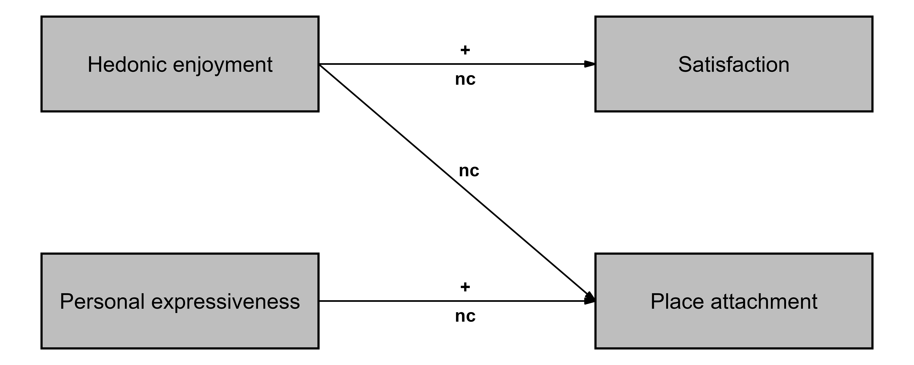
```

<!-- In addition, researchers often propose a pure necessity theory as part of a specific study in which NCA is used to test the theory. Examples of such necessity theories are a theory for lean manufacturing [@knol2018implementing], a theory for workplace spirituality [@garg2017workplace], and a theory for innovation in buyer-supply relationships [@van2016contracts].  -->

<!-- Other examples can be found in Table \@ref(tab:pubstablealone) in the Appendix.   -->

<!-- Second, _embedded necessity theories_ are theories that consist of a mix of necessity relations and other (e.g., probabilistic sufficiency) relations. For example, a theory may not only assume that certain concepts are probabilistic sufficiency causes that contribute on average to the outcome, but also that some concepts (additionally) are necessity causes. These theories are usually complex as their main goal is to describe how the outcome is produced (probabilistic sufficiency).  -->

<!-- @richter2020predictors's illustration of combining Partial Least Squares Structural Equation Modeling (PLS-SEM) with NCA could be seen as an example of an embedded necessity theory. Their extended  Technology Acceptance Model (TAM) was first formulated as a conventional structural model with probabilistic sufficiency relations that was tested with PLS-SEM and next they explored each relationship of the structural model from the perspective of necessity using NCA. The PLS-SEM results show that not all relationships of the TAM model were significant from the perspective of probabilistic sufficiency. Intention to use is related on average with Technology use, Usefulness is related on average with Intention to use, but not with Technology use, and Ease of use is neither related with Intention to use nor with Technological use. However, the NCA results show that all relationships of the TAM model were significant from the perspective of necessity. Based on these empirical results the embedded necessity TAM theory as shown in Figure \@ref(fig:fig5model) could be formulated. -->

<!-- ```{r fig5model, echo=FALSE, message=FALSE, out.width = "80%", fig.align = 'center', fig.cap= "Example of a conceptual model of an embedded necessity theory for the Technology Acceptance Model (TAM). A solid arrow with 'nc' represents a necessity relationship. A dashed arrows with '+' represents a probabilistic sufficiency relationship."} -->
<!-- knitr::include_graphics('Fig5model.png') -->
<!-- ```  -->

<!-- This theory states, for instance, that Intention to use not only helps to produce the Technology use on average (probabilistic sufficiency), but it is also necessary for it. -->

## Direction of a necessity relationship {#direction}
In Figure \@ref(fig:FigLeeb) the direction of the probabilistic sufficiency relationship is given by a + symbol above the arrow. This convention indicates a positive effect: $X$ increases $Y$ or $X$ has a positive effect on $Y$ or more precisely, that a higher value of $X$ increases the probability of a higher value of $Y$. Similarly, a – symbol indicates a negative effect: $X$ decreases or has a negative effect on $Y$: a higher value of $X$ decreases the probability of a higher value of $Y$.

Such single symbols do not convey meaning for a necessity relationship. In a necessity proposition the direction is not described by a verb as in $X$ *increases* $Y$ or $X$ *has* a positive effect on $Y$. For a necessity proposition a noun or adverb (or a combination) is used to describe relationships between levels of $X$ and $Y$. For example, in the dichotomous situation *absence* of $X$ is necessary for *presence* of $Y$ or in the continuous situation *low* level of $X$ is necessary for *high* level of $Y$. For a necessity relationship four possible directions exist (Figure \@ref(fig:direction1)). 

First, for a necessary condition with a *high-high* direction, the presence/high value of $X$ is necessary for presence/high value of $Y$. This is symbolized as \mbox{\text{+ nc +}} (see Figure \@ref(fig:direction1)- top-left). For example, high level of Urbanization is necessary for a high level of Early COVID-19 mortality [@yanmatters]. 

Second, for a necessary condition with a *low-high* direction, the absence/low value of $X$ is necessary for the presence/high value of $Y$ (\mbox{\text{- nc +}}). For example, low Intensity of production is necessary for high Environmental sustainability in agriculture [@lankoski2023environmental].

Third, for a necessary condition with a *high-low* direction, the presence/high value of $X$ is necessary for the absence/low value of $Y$ (\mbox{\text{+ nc -}}). For example, the presence/high value of social support is necessary for the absence/low value of stress. 

Fourth, for a necessary condition with a *low-low* direction, the absence/low value of $X$ is necessary for the absence/low value of $Y$ (\mbox{\text{- nc -}}). For example, the absence of rain is necessary for the absence of a wet surface. 

The third and fourth formulations of a necessary condition are less common than the first and second. Often the absence/low value of the outcome is redefined as the presence/high level of the opposite of the outcome. For example, the presence/high value of social support is necessary for the presence/high value of relaxation or the absence of rain is necessary for the presence of a dry surface. Thus, the direction of the necessary condition depends on the definition of the concepts that are part of the proposition.
 
In the absence of a specified direction, the implied direction is \mbox{\text{+ nc +}}, as shown in Figure \@ref(fig:FigLeeb). Throughout this book, the default assumption is the \mbox{\text{+ nc +}} direction, unless stated otherwise.

Figure \@ref(fig:direction1) shows the four possible conceptual models depending on the direction of the necessary condition.

```{r direction1, echo=FALSE, fig.show="hold", out.width='45%', fig.align="center", fig.cap="Conceptual models for necessary conditions. Top-Left: high-high = presence/high value of $X$ is necessary for presence/high value of $Y$. Top-Right: low-high = absence/low value of $X$ is necessary for presence/high value of $Y$. Bottom-Left: high-low = presence/high value of $X$ is necessary for absence/low value of $Y$. Bottom-Right: low-low = absence/low value of $X$ is necessary for absence/low value of $Y$."}
 par(mfrow = c(2,2))
 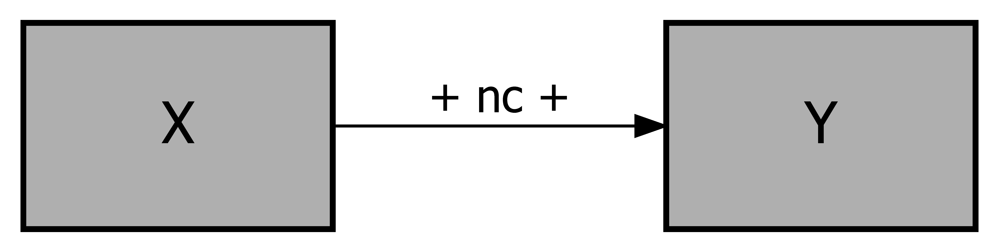
 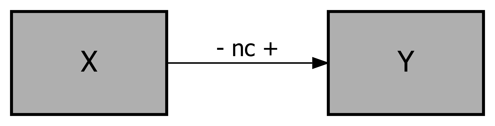
 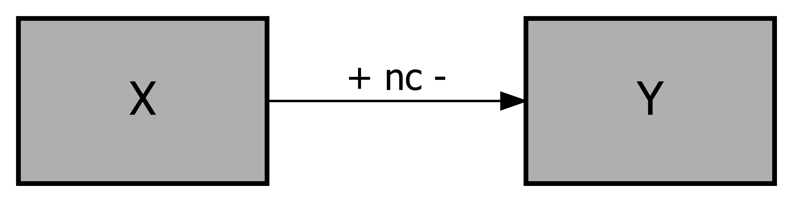
 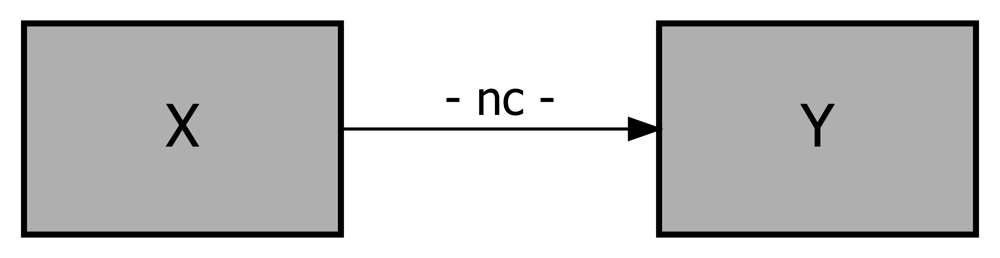
```


```{r direction2, echo=FALSE, fig.show="hold", out.width='45%', fig.align='center', fig.cap="$XY$-tables showing empty corners without observations depending on the direction of the necessity relationship. Top-Left: high-high = presence of $X$ is necessary for presence of $Y$. Top-Right: low-high = absence of $X$ is necessary for presence of $Y$. Bottom-Left: high-low = presence of $X$ is necessary for absence of $Y$. Bottom-Right: low-low = absence of $X$ is necessary for absence of $Y$."}
 par(mfrow = c(2,2))
 knitr::include_graphics("Fig1emptydich.png")
 knitr::include_graphics("Fig2emptydich.png")
 knitr::include_graphics("Fig3emptydich.png")
 knitr::include_graphics("Fig4emptydich.png")
```


## Expected empty corner {#expectedemptycorner}
Depending on the direction of necessity, different corners in the $XY$-table or $XY$-plot are expected to be empty. For the *dichotomous situation*, the $XY$-table of Figure \@ref(fig:cornerssufficiencynecessity)-right illustrates necessity causality when the presence of $X$ is necessary for the presence of $Y$. Corner 1 cannot have observations (points, cases) whereas the other corners may have observations. This is also shown in Figure \@ref(fig:direction2)-top-left. In Figure \@ref(fig:direction2) rows represent the two values of the outcome $Y$ (Absent/Present), and columns the two values of the condition $X$. The condition $X$ increases to the right, and the outcome $Y$ increases upward. Each corner in the table represents a certain combination of $X$ and $Y$. For example, the upper-left corner represents absence of $X$ and presence of $Y$. A gray corner with a black dot indicates that the corner may contain observations. A white corner without dots indicates that no observations are possible.
<!-- While a Venn diagram is commonly employed to illustrate a necessary condition, it cannot visualize necessity "in degree" (see Section \@ref(necessityindegree)). On the other hand, a contingency table can be expanded to accommodate various discrete levels of variables $X$ and $Y$.  -->

When the presence of $X$ is necessary for the presence of $Y$, the upper-left corner is empty. This corresponds to the necessity statement 'if not $X$, then not $Y$' (see the necessity statement of expression \@ref(eq:necnec) in Chapter \@ref(causality)). The outcome is absent when the condition is absent. This means that the upper-left corner does not have observations, and that the lower-left corner has observations. Similarly, when the outcome is present, the condition must also be present: the upper-right corner has observations. The content of the lower-right corner is irrelevant for \mbox{\text{+ nc +}} necessity:  this corner may or may not have observations when the necessary condition applies. For \mbox{\text{+ nc +}} necessity, the emptiness of the upper-left corner is essential.

For other directions of the necessary condition, other corners in the $XY$-table remain empty when necessity applies. When \mbox{\text{- nc +}} necessity is valid, the upper-right corner remains empty. Similarly, for \mbox{\text{+ nc -}} necessity, the lower-left corner is empty, and for \mbox{\text{- nc -}} necessity, the lower-right corner stays unoccupied. Therefore, the empty corner depends on how the necessary condition is formulated in the theory (and how the direction of the axes and the concepts are defined). Each formulation of the necessity proposition results in a specific corner of the $XY$-table being empty, referred to as the *expected empty corner*.

For the continuous situation, Figure \@ref(fig:corners) shows the four directions and corresponding empty corners. Here an $XY$-plot instead of a $XY$-table is used as a visualization method for representing that a low/high value of the condition is necessary for a low/high value of the outcome. The condition $X$ increases to the right, and the outcome $Y$ increases upward. Each corner in the plot represents a certain combination of low/high $X$- and $Y$-values. For example, the upper-left corner represents low level of $X$ and high level of $Y$. A gray area indicates that the area may contain observations.


```{r corners, echo=FALSE, fig.show="hold", out.width='50%', fig.cap="$XY$-plots showing the direction of a necessity relationship. Top-Left: a high value of $X$ is necessary for a high value of $Y$ (+ nc +,  high-high). Top-Right: a low value of $X$ is necessary for a high value of $Y$ (- nc +, low-high). Bottom-Left: a high value of $X$ is necessary for a low value of $Y$ (+ nc -, high-low). Bottom-Right: a low value of $X$ is necessary for a low value of $Y$ (- nc -, low-low)."}
 #par(mar = c(4, 4, .1, .1))
 par(mfrow = c(2,2))
 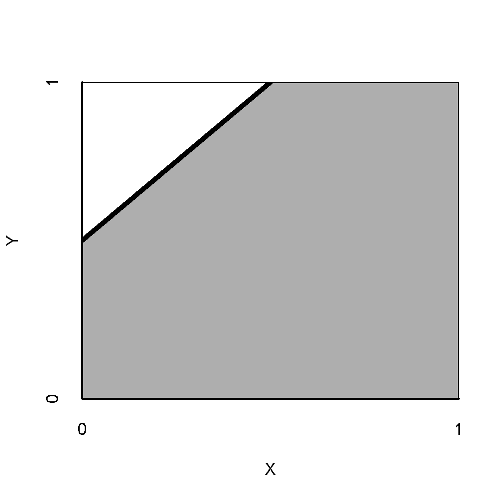
 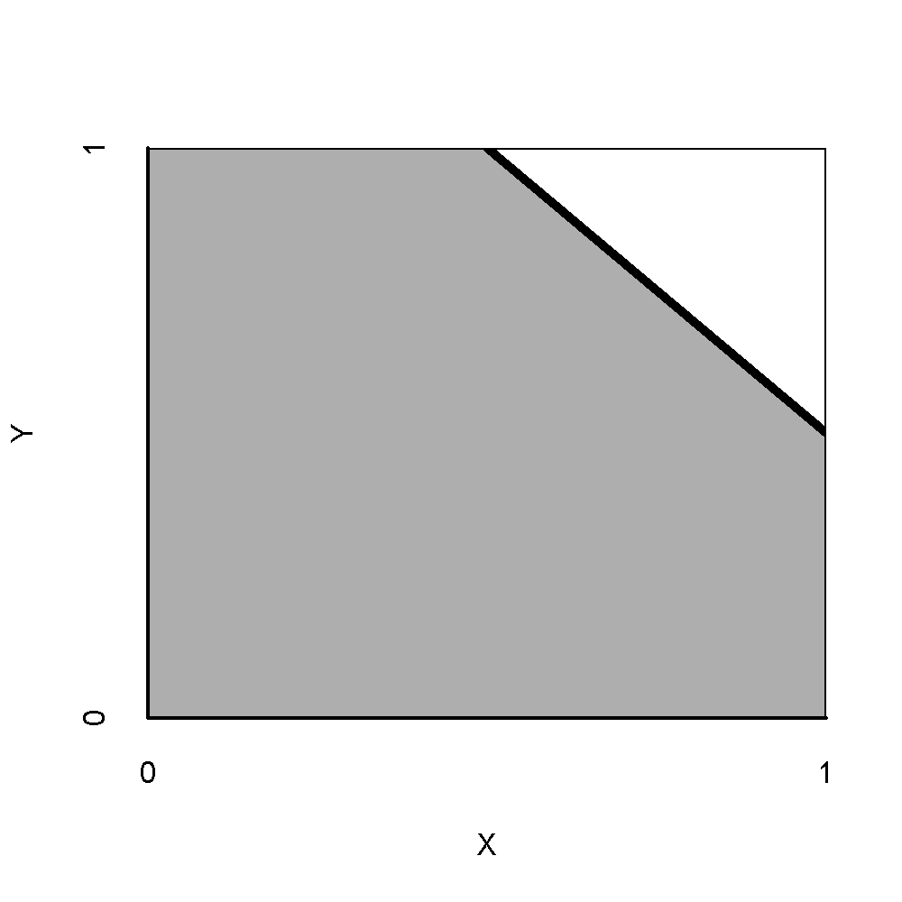
 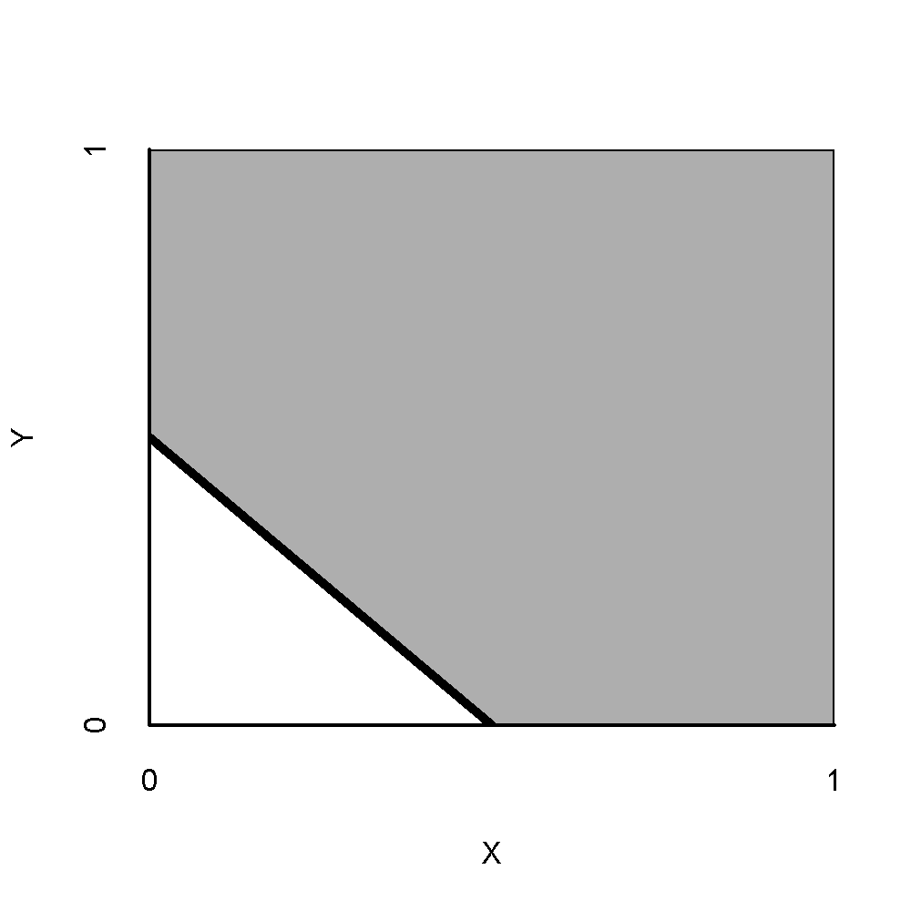
 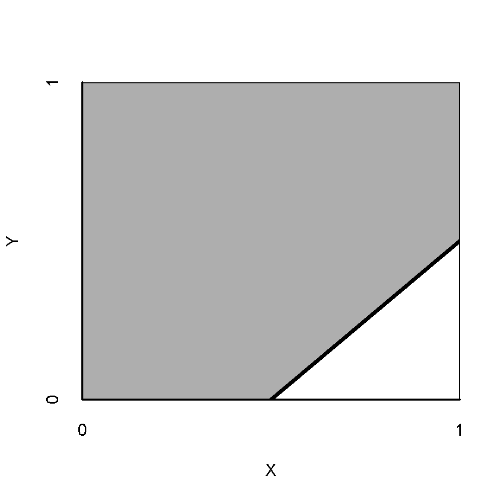
```


## Double necessity {#morecorners} 
It is possible that a single factor has two necessity relationships with the outcome at the same time, implying that more than one corner is expected to be empty. When the concepts are continuous, it is possible that two *adjacent* corners are empty. This allows theorizing that an *optimum* (not low, not high) level of $X$ is necessary for a *high* level of $Y$, implying that the upper-left *and* the upper-right corners are expected to be empty (Figure \@ref(fig:corners1234)-left). For example, in team performance, moderate levels of conflict ($X$) may be necessary for high team innovation performance ($Y$). Low conflict leads to group think, which may limit performance; high conflict leads to dysfunction, which also limits team innovation performance. Therefore, a moderate level of conflict enables teams to challenge each other productively, providing the possibility for high innovation performance.  
Similarly, it may be theorized that an *optimum* (not low, not high) level of $X$ is necessary for a *low* level of $Y$, implying that the lower-left and lower-right corners are expected to be empty (Figure \@ref(fig:corners1234)-right). For example, in stress management, moderate levels of workload ($X$) may be necessary for low employee burnout ($Y$). Low workload can result in boredom and lack of purpose, which may limit the possibility of low burnout; high workload can cause stress and exhaustion, which also limits the possibility of low burnout. Therefore, a moderate workload is necessary for low burnout because both too low and too high workload create psychological strain that prevents burnout from remaining low.


```{r corners1234, echo=FALSE, fig.show="hold", out.width='45%', fig.align='center', fig.cap="$XY$-plot showing an optimum level of the necessary condition. Left: An optimum level of $x_{c1} <x < x_{c2}$ is necessary for a high level of $y = y_c$. Right: An optimum level of $x_{c1} < x < x_{c2}$ is necessary for a low level of $y = y_c$."}
 par(mfrow = c(1,2))
 knitr::include_graphics("corners12.png")
 knitr::include_graphics("corners34.png")
```

It is also possible to theorize that a *high* level of $X$ is necessary for an *extreme* (low or high) level of $Y$. Then the upper-left and the lower-left corners are expected to be empty (Figure \@ref(fig:corners1324)-left). Similarly, it may be theorized that a *low* level of $X$ is necessary for an *extreme* (low or high) level of $Y$. Then the upper-right and the lower-right corners are expected to be empty (Figure \@ref(fig:corners1324)-right).


```{r corners1324, echo=FALSE, fig.show="hold", out.width='45%', fig.align='center', fig.cap="$XY$-plot showing necessity for an extreme level of the outcome. Left: A high level of $x > x_c$ is necessary for an extreme (low or high) level of $y = y_{c1}$ or $y = y_{c2}$. Right: A low level of $x < x_c$ is necessary for an extreme (low or high) level of $y = y_{c1}$ or $y = y_{c2}$."}
 par(mfrow = c(1,2))
 knitr::include_graphics("corners13.png")
 knitr::include_graphics("corners24.png")
```


The situations shown in Figures \@ref(fig:corners1234) and \@ref(fig:corners1324) do not have dichotomous equivalents, as this would imply that the outcome or the condition is always absent (Figure \@ref(fig:adjacenttwocorners)-top-left) or always present (Figure \@ref(fig:adjacenttwocorners)- top-right), or that the condition is always present (Figure \@ref(fig:adjacenttwocorners)-bottom-left), or always absent (Figure \@ref(fig:adjacenttwocorners)-bottom-right).

```{r adjacenttwocorners, echo=FALSE, fig.show="hold", out.width='40%', fig.align='center', fig.cap="$XY$-tables showing two adjacent empty corners without observations. Top-Left: presence of $Y$ is not possible. Top-Right: absence of $Y$ is not possible. Bottom-Left: absence of $X$ is not possible. Bottom-Right: presence of $X$ is not possible."}
 par(mfrow = c(2,2))
 knitr::include_graphics("Fig1two_emptydich.png")
 knitr::include_graphics("Fig2two_emptydich.png")
 knitr::include_graphics("Fig3two_emptydich.png")
 knitr::include_graphics("Fig4two_emptydich.png")
```


When two *opposite* corners are empty, as shown in Figure \@ref(fig:corners1423)-left, two claims apply: the *presence/high level* of $X$ is necessary for the *presence/high level* of $Y$ (empty upper-left corner) and that the *absence/low level* of $X$ is necessary for the *absence/low level* of $Y$ (empty lower-right corner). Similarly, it may be theorized that the *absence/low level* of $X$ is necessary for the *presence/high level* of $Y$ (empty upper-right corner) and that the *presence/high level* of $X$ is necessary for the *absence/low level* of $Y$ (empty lower-left corner). This is shown in Figure \@ref(fig:corners1423)-right. This situation has dichotomous equivalents, as shown in Figure \@ref(fig:oppositetwocorners).


```{r corners1423, echo=FALSE, fig.show="hold", out.width='45%', fig.align='center', fig.cap="Double necessity. Left: A high level of $x > x_{c1}$ is necessary for a high level of $y = y_{c1}$, and a low level of $x < x_{c2}$ is necessary for a low level of $y = y_{c2}$. Right: A low level of $x < x_{c1}$ is necessary for a high level of $y = y_{c1}$, and a high level of $x > x_{c2}$ is necessary for a low level of $y = y_{c2}$."}
 par(mfrow = c(1,2))
 knitr::include_graphics("corners14.png")
 knitr::include_graphics("corners23.png")
```


```{r oppositetwocorners, echo=FALSE, fig.show="hold", out.width='45%', fig.align='center', fig.cap="$XY$-tables showing two opposite empty corners without observations. Left: the presence of $X$ is necessary for the presence of $Y$ and the absence of $X$ is necessary for the absence of $Y$. Right: the absence of $X$ is necessary for the presence of $Y$ and the presence of $X$ is necessary for the absence of $Y$."}
 par(mfrow = c(1,2))
 knitr::include_graphics("Fig1two_opposite_emptydich.png")
 knitr::include_graphics("Fig2two_opposite_emptydich.png")

```


<!-- The final possible situation with two empty corners is that a researcher theorizes that a *high* level of $X$ is necessary for a *high* level of $Y$ and a *low* level of $X$ is necessary for a *low* level of $Y$ (Figure \@ref(fig:corners1423), left). Similarly, a researcher may theorize that a *low* level of $X$ is necessary for a *high* level of $Y$ and that a *high* level of $X$ is necessary for a *low* level of $Y$. Then two opposite corners are empty (Figure \@ref(fig:corners1423), right). -->

<!-- In the ```NCA``` software, it is possible to do a combined statistical test of the two necessity relations of a single factor by using the argument ```effect_aggregation``` in the ```nca_analysis``` function. The software estimates the aggregate effect size, which is the sum of the effect sizes of the separate empty spaces, and its $p$-value. This can be illustrated with the example that a country's high level of Risk taking is necessary for a high level and sufficient for a low level of a country's Innovation performance. -->


<!-- ```{r, warning=FALSE, message=FALSE,  eval=FALSE, echo=FALSE, include=FALSE} -->
<!-- library(NCA) -->
<!-- data(nca.example) -->
<!-- #High Risk taking is necessary for High Innovation performance -->
<!-- model1 <- nca_analysis(nca.example, -->
<!--                        2,3, -->
<!--                        corner = 1, -->
<!--                        ceilings = "ce_fdh", -->
<!--                        test.rep = 10000) -->
<!-- model1 -->
<!-- nca_output(model1, plots = T, summaries = F) -->

<!-- #High Risk taking is sufficient for low Innovation performance -->
<!-- model2 <- nca_analysis(nca.example -->
<!--                        ,2,3, -->
<!--                        corner = 4, -->
<!--                        ceilings = "ce_fdh", -->
<!--                        test.rep = 10000) -->
<!-- model2 -->
<!-- nca_output(model2, plots = T, summaries = F) -->

<!-- #High Risk taking is necessary for high Innovation performance and sufficient for low Innovation performance -->
<!-- model3 <- nca_analysis(nca.example, -->
<!--                        2,3, -->
<!--                        effect_aggregation = c(4), -->
<!--                        ceilings = "ce_fdh", -->
<!--                        test.rep = 10000) -->
<!-- model3 -->
<!-- ``` -->

<!-- Model 1 tests the emptiness of the upper-left corner; model 2 of the lower-right corner and model 3 is the aggregate test. The results of the latter test shows that the combined necessity/sufficiency relationship of Risk taking for Innovation performance is not rejected. -->


## The meaning of 'necessary but not sufficient' {#necessarybutnotsufficient}
To understand what is necessary *but not* sufficient, this section first explains what is meant by necessary *and* sufficient. In the dichotomous situation, 'necessary *and* sufficient' means that the upper-left corner and the lower-right corner of the $XY$-plot are both empty. This is shown in Figure \@ref(fig:oppositetwocorners), which is interpreted as a *double necessity* relationship of $X$ for $Y$: a necessity relationship where the presence of $X$ is necessary for the presence of $Y$ (upper-left corner empty) and a necessity relationship where the absence of $X$ is necessary for the absence of $Y$ (lower-right corner empty). By logic, in the dichotomous situation the second relationship can be reformulated as a *sufficiency* relationship where the presence of $X$ is sufficient for the presence of $Y$, as shown in Figure \@ref(fig:cornerssufficiencynecessity)-left. The first relationship (necessity) and the second relationship (sufficiency) now have the same $X$-value (presence) and the same $Y$-value (presence). This allows a single statement that the presence of $X$ is necessary *and* sufficient for the presence of $Y$. If the sufficiency relationship does not hold, the formulation of the combined relationship would be: the presence of $X$ is necessary *but not* sufficient for the presence of $Y$. This means that the lower-right corner is not empty.

In discrete and continuous situations, necessity *and* sufficiency are more complex. Like in the dichotomous situation, the upper-left corner and the lower-right corner are both empty. This is shown in Figure \@ref(fig:corners1423)-left, which is interpreted as a double necessity relationship of $X$ for $Y$: a necessity relationship where a high level of $X$ is necessary for a high level of $Y$ (upper-left corner empty) and a necessity relationship where a low level of $X$ is necessary for a low level of $Y$ (lower-right corner empty). By logic, the second relationship can again be reformulated as a sufficiency relationship: a not-low level of $X$ is sufficient for a not-low level of $Y$. However, a 'not-low' level is usually not the same as a 'high' level. For example, in Figure \@ref(fig:corners1423)-left, level $X = x_{c1}$ is necessary for level $Y = y_{c1}$, whereas level $X = x_{c2}$ is sufficient for level $Y = y_{c2}$. There are no common $X$-levels and common $Y$-levels that would allow a single statement that level $X = x_{c}$ is necessary *and* sufficient for level $Y = y_{c}$, unless the upper ceiling line and the lower ceiling line (floor line) overlap or intersect at the point (1,1). If the lines overlap there are only observations on the ceiling line and the necessity *and* sufficiency statement holds for all observations. If the lines intersect at point [1,1], only at that point the necessity *and* sufficiency statement holds. Both situations are, however, exceptional. 

In all other situations the statement that level $X = x_{c}$ is necessary *but not* sufficient for level $Y = y_{c}$ has a broader meaning than that the lower-right corner is not empty. If the lower-right corner can have observations, observations are normally possible in the entire area below the ceiling line, not just in the lower-right corner. This allows a single statement that $X = x_{c}$ is necessary *but not* sufficient for $Y = y_{c}$. When $X = x_{c}$, no observations are above point $C$ on the ceiling line, whereas observations below point $C_1$ are possible. In other words, for a given level $X = x_{c}$, it is not possible to have values of $Y > y_{c}$ (necessity applies) but it is possible to have values $Y \leq y_{c}$ ("non-sufficiency" applies). Consequently, where in the dichotomous situation the statement $X$ is necessary *but not* sufficient for $Y$ means that observations are possible in the lower-right corner, in the discrete and continuous situations it means that there are observations below the ceiling line. 
NCA focuses on the identification of necessity (rather than on the identification of non-sufficiency) in any corner of the $XY$-table or the $XY$-plot. If the focus is on the lower-right corner, the emptiness of this corner is interpreted as indicating that the absence or a low level of $X$ is necessary for the absence or a low level of $Y$.

<!-- such that it is not possible to formulate one statement that a given level of $X$is necessary and sufficient for a particular level of $Y$   -->

<!-- the present of $X$ is necessary for the presence of $Y$, as shown in Figure \@ref(fig:corners1423)-left.    -->


<!-- two meanings depening on wheter the relationship is approach 'in kind' or 'in degree' For necessity in kind degree,  -->

<!-- depending on that the upper-left and the lower-right corner of the XY plot are both empty. This is shown in Figure \@ref(fig:oppositetwocorners) and can be interpreted as a double necessity relationship of $X$ for $Y$: a necessity relationship where the presence of $X$ is necessary for the presence of $Y$ (upper-left corner empty) and a necessity relationship where the absence of $X$ is necessary for the absence of $Y$ (lower-right corner empty). The second relationship can be reformulated as a sufficiency relationship where the present of $X$ is necessary for the presence of $Y$, as shown in Figure \@ref(fig:corners1423)-Left.   -->


<!-- the condition (the presence of $X$) and the presence of $Y$ has both a necessity and a sufficiency relations      -->

<!-- means that there are two necessity relationships as s  Left this is formul  -->

<!-- It is the combination of the two XY tables that are shown in Figure \@ref(fig:cornerssufficiencynecessity),  -->

<!-- resulting in the XY plot shown in -->
<!-- . $X$ has two separate necessity relationships with $Y$: . The second relationship can be reformulated as a sufficiency relationship where the present of $X$ is necessary for the presence of $Y$ (lower-right corner empty). The second relationship  -->

<!-- oppositetwocorners -->
<!-- Figure \@ref(fig:corners1423) Left. , and that the other two corners have points.  -->

<!-- Often the phrase ‘necessary but not sufficient’ is used. To understand this expression in the context of NCA two situations should be distinguished: the qualitative approach of necessity ‘in kind’, and the quantitative approach of necessity ‘in degree’ (see section \@ref(binarytocontinuous)).  In the context of necessity in kind ($X$ is necessary for $Y$), the focus is on the location and size of the empty space. An empty space in the upper-left corner in the $XY$-table or $XY$-plot suggests that the presence/high value of $X$ is necessary for the presence/high value of $Y$. Similarly, an empty space in the lower-right corner in the $XY$-table or XY plot suggests that the absence/low value of $X$ is necessary for the absence/low value of $Y$. When $X$ and $Y$ are dichotomous, an empty space in the lower-right corner can also be interpreted as a sufficient condition: the presence of $X$ is sufficient for the presence of $Y$. When both the upper-left and the upper-right corners are empty, the statement could be that $X$ is necessary *and* sufficient for $Y$. When the upper-left corner is empty while the lower-right corners may have points, the statement could be that the presence of $X$ is necessary *but not* sufficient for the presence $Y$. -->

<!-- The context of necessity-in-degree (level $X$ is necessary for level $Y$ is somethat more complex. An empty space in both the upper-left and lower-right corners should be interpreted as $X$ having two distinct relationships with $Y$. As discussed in section \@ref(morecorners), particularly Figure \@ref(fig:r corners1423) Left, in necessity-in-degree an empty space in the upper-left corner means that  level $X > X_{c1}$ is necessary for level  $Y = Y_{c1}$ and an empty space in the lower-right corner of the $XY$-plot means that level $X < X_{c2}$ is necessary for level $Y = Y_{c2}$. Although the the latter expression can be reformulated as:  level $X > X_{c2}$ is sufficient for level $Y = Y_{c2}$, there is no level of $X$ taht is necessary *and* $sufficient$ for a given level of $Y$,  unless the ceiling line in the upper-left corner and the line in the lower-right corner ('floor line') overlap.  However, this is an exceptional situation that hardly exits in reality. Normally, the floor line is below the ceiling line, which means that level  $X > X_{c}$ is necessary *but not* sufficient for level $Y = Y_{c2}$. It is therefore not uncommon that a necessary condition in degree is almos 'automatically' necessary *but not* sufficient. -->


<!-- Figure \@ref(fig:corners) shows a single factor with a one necessity relationship, and Figures \@ref(fig:corners1234), \@ref(fig:corners1324), and \@ref(fig:corners1423) show a single factor with two necessity relationships. In all figures, consistent with necessity, there are no observations in the empty space, whereas observations are possible in the gray area. If the necessity relationship holds, and also no observations were in the gray area, all observations would be exactly on the border line. Then, the necessary condition is also a sufficient conditions. However, this is not realistic as single necessary conditions are seldom also sufficient. This implies that the words 'but not sufficient' can normally be added to all necessity statements. For example, Figure \@ref(fig:corners) (Top-Left), shows a single factor with one necessary condition: only the upper-left corner is empty. This corresponds to the statement "a high level of $X$ is necessary for a high level of $Y$". If all points were on the border line (ceiling line) the condition is also sufficient. This results in the statement: 'a high level of $X$ is necessary *and sufficient* for a high level of $Y$'. In practice, observations will appear below the ceiling line. This justifies the statement that 'a high level of $X$ is necessary *but not sufficient* for a high level of $Y$'. -->

<!-- Figure \@ref(fig:corners1234) (Left) is an example of a factor with two necessity relations, 'a high level of $X$ is necessary for a high level of $Y$' and 'a low level of $X$ is necessary for a high level of $Y$'. This can be reformuled as: 'an optimum level of $X$ is necessary for a high level of $Y$'. If all observations were on the two ceiling lines, the words 'and sufficient' can be added: 'an optimum level of $X$ is necessary and sufficient for $Y$'. Again, in practice observations show up below the border lines such that the words 'but not sufficient' can be added: 'an optimum level of $X$ is necessary but not sufficient for $Y$'. Similar formulations are possible for Figures \@ref(fig:corners1324): a high level of $X$ (Figure \@ref(fig:corners1324), Left) or a low level of $X$ (Figure \@ref(fig:corners1324), Right) is necessary but not sufficient for an extreme (low or high) level of $Y$. The comparable formulations related to Figure \@ref(fig:corners1423) are: '    -->


<!-- ######### -->
<!-- In the dichotomous case this means that it is expected that the presence of a single condition is both necessary and sufficient for the presence of the outcome. In the continuous case it means that it is expected a high level of a single condition is necessary for a high level of the outcome and sufficient for a "not so high" level of the outcome -->

<!-- In the dichotomous case this means that it is expected that the absence of a single condition is both necessary and sufficient for the presence of the outcome. In the continuous case it means that it is expected the low level of single condition is necessary for a *high* level of the outcome and sufficient for a "not so high" level of the outcome  (Figure \@ref(fig:corners1423), Right). -->
<!-- ############# -->


<!-- Comparable formulation   -->

<!-- The same holds for any other necessity relationship shown in Figures \@ref(fig:corners), \@ref(fig:corners1234), \@ref(fig:corners1324), and \@ref(fig:corners1423). -->

<!-- Any necessity statement can be rephrased as a sufficiency statement by formulating its logical complement. For example, the upper-left corner of Figure \@ref(fig:corners1234) (Left) (ignoring the upper-right corner) indicates that a high level of $X$ is necessary but not sufficient for a high value of $Y$. This can be reformulated as 'the absence of a high level of $X$ is sufficient but not necessary for the absence of a high value of $Y$'. This means that a level of $X < X_{c1}$ guarantees (is sufficient for) $Y < Y_c$. Similarly, the lower-right corner of Figure \@ref(fig:corners1234) (Right) (ignoring the lower-left corner) indicates that a low level of $X$ is necessary but not sufficient for a low value of $Y$. This can be reformulated as: 'the absence of a low level of $X$ is sufficient but not necessary for the absence of a high level of $Y$'. A value of $X > X_{c2}$ guarantees that $Y > Y_c$.  -->

<!-- When a single factor has two necessary relationships, it is possible to use the necessity formulation for one necessary condition, and the sufficiency formulation for the other. For example, in Figure \@ref(fig:corners1423), (Left) the double necessity formulation is: 'a high level of $X \geq\ X_{1c}$ is necessary but not sufficient for a high level of $Y = Y_{c1}$', and 'the absence or low level of $X \leq  X_{c2}$ is necessary but not sufficient for the absence or low level of $Y = Y_{2c}$'. When the necessity formulation is used for the upper-left necessity relation, and the sufficiency formulation for the lower-right necessity relation, the new equivalent statement is: 'a high level of $X \geq X_{1c}$ is necessary but not sufficient for a high level of $Y = Y_{c1}$', and 'a high level of $X \leq X_{c2}$ is sufficient but not necessary for a high level of $Y = Y_{2c}$'.  -->


<!-- Note that dual statements cannot be combined into a single statement, because the two border lines have a different location. This means that for a given $Y$ there are different levels of $X$ (see Figures \@ref(fig:corners1234), and \@ref(fig:corners1423)) and for a given $X$ there different levels of $Y$ (see Figures \@ref(fig:corners1324), and \@ref(fig:corners1423)). -->

<!-- Sometimes, like for the situation in Figure \@ref(fig:corners1423) (Left),  double necessity can be formulated 'in kind' as '$X$ is necessary and sufficient for $Y$', which implies that the upper-left necessity relationship is formulated in terms of necessity, and the lower-right in terms of sufficiency. However, this formulation is problematic when the actual necessity relationships are 'in degree'. The 'in degree' formulation of the situation is *not*: 'a high level of $X$ is necessary and sufficient for a high level of $Y$', but instead: '$X > X_{c1}$ is necessary for $Y = Y_{c1}$ and $X > X_{c2}$ is sufficient for $Y = Y_{c2}$'. There is no common $X$ that is necessary and sufficient for a common $Y$ and no common $Y$ for which a common $X$ is necessary and sufficient. -->

<!-- Only when the two borderlines overlap, the 'in kind' statement also holds in an 'in degree' situation: 'a certain level of $X$ is necessary and sufficient for a certain level of $Y$'. At best, the 'in kind' formulation could be re-formulated as 'a high level of $X$ is necessary for a high level of $Y$ and sufficient for a not so high level of $Y$', or similar. The theoretical meaning is that a high level of $X$ is necessary for (enables) a high level of $Y$ (border line = ceiling line) and is sufficient for (ensures) a lower level of $Y$ (border line = floor line).    -->

<!-- XXXXXXXXXXXXXXXXXXXXXXX -->

<!-- For example, a theory that assumes probabilistic sufficiency causal relationship between certain concepts, can additionally assume a typicality necessity relationship between these or other concepts of the theory. -->

<!-- on a for some of the relationship   perspective,  some of the relations when NCA is combined with a regression-based analysis, some relations are only combines with  dbetween concepts are also considered but also this way, wherease other are condiealso other types of relationships       -->


<!-- s between all or a selection of the concepts of a theory [@bokrantz2022building]. Necessity *theorizing* is formulating necessity theory using necessity logic when describing causal relationships between concepts.   -->


<!-- One  theory about the necessary conditions for success of start-up firms was developed based on literature and common beliefs, but this necessity theory was rejected after empirical testing with NCA [@arenius2017no].  -->

<!-- ^[A moderator in a probabilistic theory is a concept that influences the average *relationship* between other concepts. A moderator  does not exist in a necessity theory, as the necessity relationship can only exist between concepts] -->


<!-- XXXXXXXXXXXXXXXXXXXXXX START OF THE CODE FOR THIS CHAPTER XXXXXXXXXXXXXXXX -->
```{r figs123theorycode, echo=FALSE, include=FALSE, eval = FALSE}
library(DiagrammeR)
library(DiagrammeRsvg)
library(rsvg)

# Function to export a figure as a PDF
export_figure_to_pdf <- function(fig, filename) {
  svg_content <- fig %>% DiagrammeRsvg::export_svg()
  pdf_content <- charToRaw(svg_content) %>% rsvg::rsvg_pdf()
  writeBin(pdf_content, filename)
}

# Fig1
Fig1 <- grViz('
  digraph {
    # Set graph properties for horizontal layout
    graph [layout = dot, rankdir = LR]

    # Set node properties with font family "Helvetica"
    node [shape = box, style = filled, fillcolor = grey, fontname = "Helvetica", fontsize = 10]

    # Define nodes with font family "sans"
    X [label = "X"] # Box labeled "X"
    Y [label = "Y"]

    # Define edges and arrow properties
    X -> Y [dir = forward, arrowhead = normal, arrowsize = 0.5, penwidth = 0.5, label = "nc", fontname = "Helvetica", fontsize = 8] # Connect the new box above X2 to X2 with a transparent arrow
  }')
#plot Fig1
Fig1

# Uncomment and use the following lines to create a PDF and high-resolution PNG for Fig1
 export_figure_to_pdf(Fig1, "Fig1model.pdf")


# Fig2
Fig2 <- grViz('
  digraph {
    # Set graph properties for horizontal layout
    graph [layout = dot, rankdir = LR]

    # Set node properties with font family "Helvetica"
    node [shape = box, style = filled, fillcolor = grey, fontname = "Helvetica", fontsize = 10]

    # Define nodes with font family "sans"
    X1 [label = "X1"] # Box labeled "X1"
    Y [label = "Y"]

    # Add a new node
    X2 [label = "X2", shape = box, style = filled, fillcolor = grey, fontname = "Helvetica", fontsize = 10]

   # Add a new node
    X3 [label = "X3", shape = box, style = filled, fillcolor = grey, fontname = "Helvetica", fontsize = 10]

    # Define edges and arrow properties
    X1 -> Y [dir = forward, arrowhead = normal, arrowsize = 0.5, penwidth = 0.5, label = "nc", fontname = "Helvetica", fontsize = 8] # Connect the new box above X2 to X2 with a transparent arrow
    X2 -> Y [dir = forward, arrowhead = normal, arrowsize = 0.5, penwidth = 0.5, label = "nc", fontname = "Helvetica", fontsize = 8] # Connect X2 to Y with a straight arrow
    X3 -> Y [dir = forward, arrowhead = normal, arrowsize = 0.5, penwidth = 0.5, label = "nc", fontname = "Helvetica", fontsize = 8] # Connect X2 to Y with a straight arrow
  }')
#plot Fig2
Fig2

# Uncomment and use the following lines to create a PDF and high-resolution PNG for Fig2
 export_figure_to_pdf(Fig2, "Fig2model.pdf")

# Fig3
Fig3 <- grViz('
  digraph {
    # Set graph properties for horizontal layout
    graph [layout = dot, rankdir = LR]

    # Set node properties with font family "Helvetica"
    node [shape = box, style = filled, fillcolor = grey, fontname = "Helvetica", fontsize = 10]

    # Define nodes with font family "sans"
    X [label = "X"] # Box labeled "X"
    Y1 [label = "Y1"]

    # Add a new node
    Y2 [label = "Y2", shape = box, style = filled, fillcolor = grey, fontname = "Helvetica", fontsize = 10]

   # Add a new node
    Y3 [label = "Y3", shape = box, style = filled, fillcolor = grey, fontname = "Helvetica", fontsize = 10]

    # Define edges and arrow properties
    X -> Y1 [dir = forward, arrowhead = normal, arrowsize = 0.5, penwidth = 0.5, label = "nc", fontname = "Helvetica", fontsize = 8] # Connect the new box above X2 to X2 with a transparent arrow
    X -> Y2 [dir = forward, arrowhead = normal, arrowsize = 0.5, penwidth = 0.5, label = "nc", fontname = "Helvetica", fontsize = 8] # Connect X2 to Y with a straight arrow
    X -> Y3 [dir = forward, arrowhead = normal, arrowsize = 0.5, penwidth = 0.5, label = "nc", fontname = "Helvetica", fontsize = 8] # Connect X2 to Y with a straight arrow
  }')
#plot Fig3
Fig3

# Uncomment and use the following lines to create a PDF and high-resolution PNG for Fig3
 export_figure_to_pdf(Fig3, "Fig3model.pdf")

# Fig4
Fig4 <- grViz('
  digraph {
    # Set graph properties for horizontal layout
    graph [layout = dot, rankdir = LR]

    # Set node properties with font family "Helvetica"
    node [shape = box, style = filled, fillcolor = grey, fontname = "Helvetica", fontsize = 10]

    # Define nodes with font family "sans"
    X1 [label = "X1"] # Box labeled "X1"
    Y [label = "Y"]

    # Add a new node
    X2 [label = "X2", shape = box, style = filled, fillcolor = grey, fontname = "Helvetica", fontsize = 10]

    # Define edges and arrow properties
    X1 -> X2 [dir = forward, arrowhead = normal, arrowsize = 0.5, penwidth = 0.5, label = "nc", fontname = "Helvetica", fontsize = 8] # Connect the new box above X2 to X2 with a transparent arrow
    X2 -> Y [dir = forward, arrowhead = normal, arrowsize = 0.5, penwidth = 0.5, label = "nc", fontname = "Helvetica", fontsize = 8] # Connect X2 to Y with a straight arrow
  }')
#plot Fig4
Fig4

# Uncomment and use the following lines to create a PDF and high-resolution PNG for Fig4
 export_figure_to_pdf(Fig4, "Fig4model.pdf")
```
 
```{r figtamcode, echo=FALSE, include=FALSE, eval = FALSE}
library(DiagrammeR)
library(DiagrammeRsvg)
library(rsvg)

 # FigTAM
 FigTAM <- grViz('
  digraph {
    # Set graph properties for horizontal layout
    graph [layout = dot, rankdir = LR]

    # Set node properties with font family "Helvetica"
    node [shape = box, style = filled, fillcolor = grey, fontname = "Helvetica", fontsize = 10]

    # Define nodes with font family "sans"
    X1 [label = "Usefulness"] # 
    X2 [label = "Ease of use"] # 
    Y [label = "Technolology Use "]

    # Add a new node
    M [label = "Intention to use", shape = box, style = filled, fillcolor = grey, fontname = "Helvetica", fontsize = 10]

    # Define edges and arrow properties
    X1 -> M [dir = forward, arrowhead = normal, arrowsize = 0.5, penwidth = 0.5, label = "nc", fontname = "Helvetica", fontsize = 8] # Connect the new box above X2 to X2 with a transparent arrow
    X2 -> M [dir = forward, arrowhead = normal, arrowsize = 0.5, penwidth = 0.5, label = "nc", fontname = "Helvetica", fontsize = 8] # Connect the new box above X2 to X2 with a transparent arrow
    M -> Y [dir = forward, arrowhead = normal, arrowsize = 0.5, penwidth = 0.5, label = "nc", fontname = "Helvetica", fontsize = 8] # Connect X2 to Y with a straight arrow
    X1 -> Y [dir = forward, arrowhead = normal, arrowsize = 0.5, penwidth = 0.5, label = "nc", fontname = "Helvetica", fontsize = 8] # Connect the new box above X2 to X2 with a transparent arrow
    X2 -> Y [dir = forward, arrowhead = normal, arrowsize = 0.5, penwidth = 0.5, label = "nc", fontname = "Helvetica", fontsize = 8] # Connect the new box above X2 to X2 with a transparent arrow
    M -> Y [dir = forward, arrowhead = normal, arrowsize = 0.5, penwidth = 0.5, label = "+", fontname = "Helvetica", fontsize = 8, style = "dashed"] # Connect X2 to Y with a straight arrow
    X1 -> M [dir = forward, arrowhead = normal, arrowsize = 0.5, penwidth = 0.5, label = "+", fontname = "Helvetica", fontsize = 8, style = "dashed"] # 
  }')
 #plot FigTAM
 FigTAM
 
 # Uncomment and use the following lines to create a PDF and high-resolution PNG for Fig5
 export_figure_to_pdf(FigTAM, "FigTAM.pdf") 
```


```{r figleeb_code, echo=FALSE, include=FALSE, eval = FALSE}
library(ggplot2)
library(grid)

# Define node positions (center point of box)
x_offset_right <- 3

nodes <- data.frame(
  name = c("Hedonic enjoyment", "Personal expressiveness", "Satisfaction", "Place attachment"),
  x = c(1, 1, x_offset_right, x_offset_right),
  y = c(1.5, 1, 1.5, 1)
)

# Arrow data
n_arrows <- 5
arrows <- data.frame(
  from_x = c(1, 1, 1, 1, 1),
  from_y = c(1.5, 1.5, 1.5, 1, 1),
  to_x = rep(x_offset_right, n_arrows),
  to_y = c(1.55, 1.45, 1, 1.05, 0.95),
  label = c("+", "nc", "nc", "+", "nc"),
  linetype = c("dashed", "solid", "solid", "dashed", "solid"),
  color = c("black", "black", "black", "black", "black")
)

# Box size
box_width <- 1
box_height <- 0.2

# Arrow geometry
start_x <- arrows$from_x + box_width / 2
start_y <- arrows$from_y
end_x <- arrows$to_x - box_width / 2
end_y <- arrows$to_y

mid_x <- (start_x + end_x) / 2
mid_y <- (start_y + end_y) / 2
dx <- end_x - start_x
dy <- end_y - start_y
len <- sqrt(dx^2 + dy^2)
len[len == 0] <- 1

# Label positioning
offset <- 0.02
label_offset_x <- 0.03
perp_dx <- -dy / len * offset
perp_dy <- dx / len * offset
label_x <- mid_x + perp_dx + label_offset_x
label_y <- mid_y + perp_dy

# Update arrows data
arrows$start_x <- start_x
arrows$start_y <- start_y
arrows$end_x <- end_x
arrows$end_y <- end_y
arrows$label_x <- label_x
arrows$label_y <- label_y

# Split dashed vs solid arrows
arrows_dashed <- subset(arrows, linetype == "dashed")
arrows_solid  <- subset(arrows, linetype == "solid")

# Calculate short solid segment for arrowheads only
arrow_frac <- 0.95
arrows_dashed$arrow_xend <- arrows_dashed$start_x + (arrows_dashed$end_x - arrows_dashed$start_x) * arrow_frac
arrows_dashed$arrow_yend <- arrows_dashed$start_y + (arrows_dashed$end_y - arrows_dashed$start_y) * arrow_frac

# Build plot
p <- ggplot() +
  # Dashed lines (body only)
  geom_segment(data = arrows_dashed,
               aes(x = start_x, y = start_y, xend = end_x, yend = end_y, color = color),
               linetype = "dashed", size = 0.6) +
  
  # Arrowheads as solid overlays
  geom_segment(data = arrows_dashed,
               aes(x = arrow_xend, y = arrow_yend, xend = end_x, yend = end_y),
               arrow = arrow(length = unit(0.3, "cm"), type = "closed", angle = 15),
               size = 0.6, color = "black", linetype = "solid") +
  
  # Solid arrows
  geom_segment(data = arrows_solid,
               aes(x = start_x, y = start_y, xend = end_x, yend = end_y,
                   linetype = linetype, color = color),
               arrow = arrow(length = unit(0.3, "cm"), type = "closed", angle = 15),
               size = 0.6) +
  
  # Arrow labels
  geom_text(data = arrows,
            aes(x = label_x, y = label_y, label = label),
            size = 5, color = "black", fontface = "bold") +
  
  # Node boxes
  geom_rect(data = nodes,
            aes(xmin = x - box_width / 2, xmax = x + box_width / 2,
                ymin = y - box_height / 2, ymax = y + box_height / 2),
            fill = "grey", color = "black", size = 0.8) +
  
  # Node labels
  geom_text(data = nodes,
            aes(x = x, y = y, label = name),
            size = 6, fontface = "plain") +
  
  # Styling
  scale_color_manual(values = c("black" = "black")) +
  scale_linetype_manual(values = c("solid" = "solid", "dashed" = "dashed")) +
  theme_void() +
  theme(
    legend.position = "none",
    plot.margin = unit(c(0, 0, 0, 0), "cm"),  # Remove white margins
    plot.background = element_rect(fill = "white", color = NA),
    panel.background = element_rect(fill = "white", color = NA)
  ) #+
  # xlim(0, 5) +
  # ylim(0, 4)

# Display
print(p)

# Save as PDF
ggsave("FigLeeb.pdf", plot = p, width = 10, height = 4, dpi = 600, bg = "white", units = "in", limitsize = FALSE)

# Save as PNG without white margins
ggsave("FigLeeb.png", plot = p, width = 10, height = 4, dpi = 600, bg = "white", units = "in", limitsize = FALSE)

print("Saved as 'FigLeeb.pdf' and 'FigLeeb.png'")
###########################################################
library(ggplot2)
library(grid)

# Define node positions (center point of box)
x_offset_right <- 3

nodes <- data.frame(
  name = c("Hedonic enjoyment", "Personal expressiveness", "Satisfaction", "Place attachment"),
  x = c(1, 1, x_offset_right, x_offset_right),
  y = c(1.5, 1, 1.5, 1)
)

# Arrow data
n_arrows <- 3
arrows <- data.frame(
  from_x = c(1, 1, 1),
  from_y = c(1.5, 1.5, 1),
  to_x = rep(x_offset_right, n_arrows),
  to_y = c(1.5,
           1,
           1),
  label_reg = c("+","nc", "+"),
  
  label_nec = c("nc", "", "nc"), 
  linetype = c("solid", "solid", "solid"),
  color = c("black", "black", "black")
)

# Box size
box_width <- 1
box_height <- 0.2

# Arrow geometry
start_x <- arrows$from_x + box_width / 2
start_y <- arrows$from_y
end_x <- arrows$to_x - box_width / 2
end_y <- arrows$to_y

mid_x <- (start_x + end_x) / 2
mid_y <- (start_y + end_y) / 2
dx <- end_x - start_x
dy <- end_y - start_y
len <- sqrt(dx^2 + dy^2)
len[len == 0] <- 1

# Label positioning
offset <- 0.03
label_offset_x <- 0.03
perp_dx <- -dy / len * offset
perp_dy <- dx / len * offset
label_reg_x <- mid_x + perp_dx + label_offset_x
label_reg_y <- mid_y + perp_dy
label_nec_x <- mid_x - perp_dx + label_offset_x
label_nec_y <- mid_y - perp_dy


# Update arrows data
arrows$start_x <- start_x
arrows$start_y <- start_y
arrows$end_x <- end_x
arrows$end_y <- end_y
arrows$label_reg_x <- label_reg_x
arrows$label_reg_y <- label_reg_y
arrows$label_nec_x <- label_nec_x
arrows$label_nec_y <- label_nec_y

# Split dashed vs solid arrows
arrows_dashed <- subset(arrows, linetype == "dashed")
arrows_solid  <- subset(arrows, linetype == "solid")

# Calculate short solid segment for arrowheads only
arrow_frac <- 0.95
arrows_dashed$arrow_xend <- arrows_dashed$start_x + (arrows_dashed$end_x - arrows_dashed$start_x) * arrow_frac
arrows_dashed$arrow_yend <- arrows_dashed$start_y + (arrows_dashed$end_y - arrows_dashed$start_y) * arrow_frac

# Build plot
p <- ggplot() +
  # Dashed lines (body only)
  geom_segment(data = arrows_dashed,
               aes(x = start_x, y = start_y, xend = end_x, yend = end_y, color = color),
               linetype = "dashed", size = 0.6) +
  
  # Arrowheads as solid overlays
  geom_segment(data = arrows_dashed,
               aes(x = arrow_xend, y = arrow_yend, xend = end_x, yend = end_y),
               arrow = arrow(length = unit(0.3, "cm"), type = "closed", angle = 15),
               size = 0.6, color = "black", linetype = "solid") +
  
  # Solid arrows
  geom_segment(data = arrows_solid,
               aes(x = start_x, y = start_y, xend = end_x, yend = end_y,
                   linetype = linetype, color = color),
               arrow = arrow(length = unit(0.3, "cm"), type = "closed", angle = 15),
               size = 0.6) +
  
  # Arrow labels reg
  geom_text(data = arrows,
            aes(x = label_reg_x, y = label_reg_y, label = label_reg),
            size = 5, color = "black", fontface = "bold") +
  
  # Arrow labels nec
  geom_text(data = arrows,
            aes(x = label_nec_x, y = label_nec_y, label = label_nec),
            size = 5, color = "black", fontface = "bold") +
  
  # Node boxes
  geom_rect(data = nodes,
            aes(xmin = x - box_width / 2, xmax = x + box_width / 2,
                ymin = y - box_height / 2, ymax = y + box_height / 2),
            fill = "grey", color = "black", size = 0.8) +
  
  # Node labels
  geom_text(data = nodes,
            aes(x = x, y = y, label = name),
            size = 6, fontface = "plain") +
  
  # Styling
  scale_color_manual(values = c("black" = "black")) +
  scale_linetype_manual(values = c("solid" = "solid", "dashed" = "dashed")) +
  theme_void() +
  theme(
    legend.position = "none",
    plot.margin = unit(c(0, 0, 0, 0), "cm"),  # Remove white margins
    plot.background = element_rect(fill = "white", color = NA),
    panel.background = element_rect(fill = "white", color = NA)
  ) #+
# xlim(0, 5) +
# ylim(0, 4)

# Display
print(p)

# Save as PDF
ggsave("FigLeeb2.pdf", plot = p, width = 10, height = 4, dpi = 600, bg = "white", units = "in", limitsize = FALSE)

# Save as PNG without white margins
ggsave("FigLeeb2.png", plot = p, width = 10, height = 4, dpi = 600, bg = "white", units = "in", limitsize = FALSE)

print("Saved as 'FigLeeb2.pdf' and 'FigLeeb2.png'")


```


```{r figlee_code, echo=FALSE, include=FALSE, eval = FALSE}
library(DiagrammeR)
library(DiagrammeRsvg)
library(rsvg)

# Function to export a figure as a PDF
export_figure_to_pdf <- function(fig, filename) {
  svg_content <- fig %>% DiagrammeRsvg::export_svg()
  pdf_content <- charToRaw(svg_content) %>% rsvg::rsvg_pdf()
  writeBin(pdf_content, filename)
}

FigLee <- grViz('
  digraph {
    # Set graph properties for horizontal layout
    graph [layout = dot, rankdir = LR] 

    # Set node properties with font family "Helvetica" and fixed width and height for equal-sized boxes
    node [shape = box, style = filled, fillcolor = grey, fontname = "Helvetica", fontsize = 10, fixedsize = true]

    # Define nodes with equal width and height for X1 and X2
    X1 [label = "Hedonic enjoyment", width = 1.7, height = 0.6]  
    X2 [label = "Personal expressiveness", width = 1.7, height = 0.6] 

    # Define nodes with equal width and height for Y1 and Y2
    Y1 [label = "Satisfaction", width = 1.2, height = 0.6]
    Y2 [label = "Place attachment", width = 1.2, height = 0.6]

    # # # Align nodes horizontally #vertically
    #  {rank = same; X1; X2}
    #  {rank = same; Y1; Y2}

    # Invisible node to raise X1 and X2
    invisible_node [style=invis, width=0, height=0]

    {rank = same; invisible_node; X1; X2}
    {rank = same; Y1; Y2}


    # Define edges and arrow properties
    X1 -> Y1 [dir = forward, arrowhead = normal, arrowsize = 0.5, penwidth = 0.5, label = "nc", fontname = "Helvetica", fontsize = 8]  
    X2 -> Y2 [dir = forward, arrowhead = normal, arrowsize = 0.5, penwidth = 0.5, label = "nc", fontname = "Helvetica", fontsize = 8]  
    X1 -> Y2 [dir = forward, arrowhead = normal, arrowsize = 0.5, penwidth = 0.5, label = "nc", fontname = "Helvetica", fontsize = 8]  
    #X2 -> Y1 [dir = forward, arrowhead = normal, arrowsize = 0.5, penwidth = 0.5, label = "nc", fontname = "Helvetica", fontsize = 8]  
    X1 -> Y1 [dir = forward, arrowhead = normal, arrowsize = 0.5, penwidth = 0.5, label = "+", fontname = "Helvetica", fontsize = 8, style = "dashed", labeldistance = 1.5, labelangle = -90]  
    X2 -> Y2 [dir = forward, arrowhead = normal, arrowsize = 0.5, penwidth = 0.5, label = "+", fontname = "Helvetica", fontsize = 8, style = "dashed", labeldistance = 1.5, labelangle = -90]  
    #X1 -> Y2 [dir = forward, arrowhead = normal, arrowsize = 0.5, penwidth = 0.5, label = "+", fontname = "Helvetica", fontsize = 8, style = "dashed", labeldistance = 1.2, labelangle = -90]  
    #X2 -> Y1 [dir = forward, arrowhead = normal, arrowsize = 0.5, penwidth = 0.5, label = "+", fontname = "Helvetica", fontsize = 8, style = "dashed", labeldistance = 1.2, labelangle = 45]  

  }')

# Uncomment for plot FigLee in screen
#FigLee
 # Uncomment and use the following lines to create a PDF and high-resolution PNG for Fig5
 export_figure_to_pdf(FigLee, "FigLee.pdf") 
```

```{r typestheorycode, echo=FALSE, out.width="100%", out.height="100%",fig.align ='center', results='hide', message=FALSE, warning=FALSE, eval=FALSE}

#make empty 2x2 contingency table
X<- c(0.25, 0.75) #X-values center of cell
Y<- c(0.25, 0.25) #Y-values center of cell

# make plot window square and set size of the axes and labels
par(pty = "s", cex.axis = 0.8, cex.lab = 1.5)

#give names to axes
xname = "Necessity theory"
yname = "Status"

#give names to axis labels
# xlabel = rep(c("","0", "1", ""))
# ylabel = rep(c("","0", "1", ""))
xlabel = rep(c("","Pure", "Embedded", ""))
ylabel = rep(c("","Emerging", "Established", ""))

# Create the plot with square aspect ratio
#pdf("types_necessity_theoriesa.pdf")
plot (X,Y, xlab=xname, ylab=yname, xlim = c(0,1), ylim=c(0,1), pch=19, cex=2, axes = F, yaxs="i", xaxs="i", type="n", cex.lab=1.5) 
axis(1, at = c(0, 0.25, 0.75, 1.25), pos=0, tck=0, labels=xlabel, cex.axis = 1.2) #X has two values
axis(2, at = c(0, 0.25, 0.75, 1.25), pos=0, tck=0, labels=ylabel, cex.axis = 1.2) #Y has two values
abline(v=c(0.5,1), h=c(0.5,1))

#fill cells
# rect(0, 0.5, 0.5, 1,  col = "grey")
# rect(0, 0, 0.5, 0.5,  col = "grey")
# rect(0.5, 0, 1, 0.5,  col = "grey")
# rect(0.5, 0.5, 1, 1,  col = "grey")

#add points in cells
#points(X,Y, pch=19, cex=2)

fontsize <- 1.2

#add text in cells
text(0.25,0.30,"Emerging-Pure", cex=fontsize) #left low
text(0.25,0.25,"(NCA alone studies; see Appendix)", cex=0.75*fontsize) #left low

text(0.25,0.80,"Established-Pure", cex=fontsize) #left high 
text(0.25,0.75,"(Intelligence-Creativity; AMO)", cex=0.75*fontsize) #left high 

text(0.75,0.30,"Emerging-Embedded", cex=fontsize) #right low
text(0.75,0.25,"(NCA-regression studies; see Appendix)", cex=0.75*fontsize) #right low
#text(0.75,0.20,"(NCA-QCA studies; see Appendix)", cex=0.75*fontsize) #right low

text(0.75,0.80,"Established-Embedded", cex=fontsize) #right high 
text(0.75,0.75,"(TPB, TAM, SDT)", cex=0.75*fontsize) #right high


#add ceiling line
# segments(0,0.5,0.5,0.5, lty=1, col="black", lwd = 3) #horizontal part of ceiling line
# segments(0.5,0.5,0.5,1, lty=1, col="black", lwd = 3) #vertical part of ceiling line
#dev.off()
```

```{r directionconceptualcode, eval= FALSE, echo=FALSE, include=FALSE}
library(DiagrammeR)
library(DiagrammeRsvg)
library(rsvg)

# Function to export a figure as a PDF
export_figure_to_pdf <- function(fig, filename) {
  svg_content <- fig %>% DiagrammeRsvg::export_svg()
  pdf_content <- charToRaw(svg_content) %>% rsvg::rsvg_pdf()
  writeBin(pdf_content, filename)
}


# Fig1
Fig1 <- grViz('
  digraph {
    # Set graph properties for horizontal layout
    graph [layout = dot, rankdir = LR]

    # Set node properties with font family "Helvetica"
    node [shape = box, style = filled, fillcolor = grey, fontname = "Helvetica", fontsize = 10]

    # Define nodes with font family "sans"
    X [label = "X"] # Box labeled "X"
    Y [label = "Y"]

    # Define edges and arrow properties
    X -> Y [dir = forward, arrowhead = normal, arrowsize = 0.5, penwidth = 0.5, label = "+ nc +", fontname = "Helvetica", fontsize = 8]
  }')
#plot Fig1
Fig1

# Fig2
Fig2 <- grViz('
  digraph {
    # Set graph properties for horizontal layout
    graph [layout = dot, rankdir = LR]

    # Set node properties with font family "Helvetica"
    node [shape = box, style = filled, fillcolor = grey, fontname = "Helvetica", fontsize = 10]

    # Define nodes with font family "sans"
    X [label = "X"] # Box labeled "X"
    Y [label = "Y"]

    # Define edges and arrow properties
    X -> Y [dir = forward, arrowhead = normal, arrowsize = 0.5, penwidth = 0.5, label = "- nc +", fontname = "Helvetica", fontsize = 8]
  }')
#plot Fig2
Fig2

# Fig3
Fig3 <- grViz('
  digraph {
    # Set graph properties for horizontal layout
    graph [layout = dot, rankdir = LR]

    # Set node properties with font family "Helvetica"
    node [shape = box, style = filled, fillcolor = grey, fontname = "Helvetica", fontsize = 10]

    # Define nodes with font family "sans"
    X [label = "X"] # Box labeled "X"
    Y [label = "Y"]

    # Define edges and arrow properties
    X -> Y [dir = forward, arrowhead = normal, arrowsize = 0.5, penwidth = 0.5, label = "+ nc -", fontname = "Helvetica", fontsize = 8]
  }')
#plot Fig3
Fig3

# Fig4
Fig4 <- grViz('
  digraph {
    # Set graph properties for horizontal layout
    graph [layout = dot, rankdir = LR]

    # Set node properties with font family "Helvetica"
    node [shape = box, style = filled, fillcolor = grey, fontname = "Helvetica", fontsize = 10]

    # Define nodes with font family "sans"
    X [label = "X"] # Box labeled "X"
    Y [label = "Y"]

    # Define edges and arrow properties
    X -> Y [dir = forward, arrowhead = normal, arrowsize = 0.5, penwidth = 0.5, label = "- nc -", fontname = "Helvetica", fontsize = 8]
  }')
#plot Fig4
Fig4

# Uncomment and use the following lines to create a PDF and high-resolution PNG for Fig1
export_figure_to_pdf(Fig1, "Fig1modelDIRECTION.pdf")
export_figure_to_pdf(Fig2, "Fig2modelDIRECTION.pdf")
export_figure_to_pdf(Fig3, "Fig3modelDIRECTION.pdf")
export_figure_to_pdf(Fig4, "Fig4modelDIRECTION.pdf")

# save as high resolution (Settings) png in acrobat
# inmport in PPT, rearragen in grid and save as png picture
```

```{r oneemptycornercontingencycode,echo=FALSE, eval=FALSE}
# code for four empty corners contingency table

#make empty 2x2 contingency table
X<- c(0.25, 0.75) #X-values center of cell
Y<- c(0.25, 0.25) #Y-values center of cell

th = 3 #thickness of lines lwd
th1 = 5 #horizontal vertical axes
th2 = 10 #thickness of points

#give names to axes
xname = "X"
yname = "Y"

#give labels to axis values
xlabel = rep(c("","Absent", "Present", ""))
ylabel = rep(c("","Absent", "Present", ""))

#Fig1
##pdf("Fig1emptydich.pdf")
#par after calling pdf
#set positions of labels and axes names
par(mar=c(5,5,4,2)+0.1) # order: bottom, left, top, right: increase left margin from 4 to 5, rest defaults 
par(mgp = c(3, 1, 0)) # default distance between label (axis name) and axis: decrease first to get label closer to axis 
#cex.lab is size of the label = axis name
plot (X,Y, xlab=xname, ylab=yname, xlim = c(0,1), ylim=c(0,1), pch=19, cex.lab=2, axes = F, yaxs="i", xaxs="i", type="n")
#cex.axis is size of the values at the axes
axis(1, at = c(0, 0.25, 0.75, 1.25), pos=0, tck=0, lwd = th, cex.axis = 2, labels=xlabel) #X has two values
axis(2, at = c(0, 0.25, 0.75, 1.25), pos=0, tck=0,lwd = th,  cex.axis = 2, labels=ylabel) #Y has two values
abline(v=0.5, h=0.5, lwd = th)
#fill cells
#rect(0, 0.5, 0.5, 1,  col = "grey", lwd = th)
rect(0, 0, 0.5, 0.5,  col = "grey", lwd = th)
rect(0.5, 0, 1, 0.5,  col = "grey", lwd = th)
rect(0.5, 0.5, 1, 1,  col = "grey", lwd = th)
abline(v=1, h = 1, lwd = th1)
#add points
#points(0.25, 0.75, pch = 19, col = "black", lwd = th2)
points(0.25, 0.25, pch = 19, col = "black", lwd = th2)
points(0.75, 0.25, pch = 19, col = "black", lwd = th2)
points(0.75, 0.75, pch = 19, col = "black", lwd = th2)
##dev.off()

#Fig2
##pdf("Fig2emptydich.pdf")
par(mar=c(5,5,4,2)+0.1) 
# Create the plot with square aspect ratio
plot (X,Y, xlab=xname, ylab=yname, xlim = c(0,1), ylim=c(0,1), pch=19, cex.lab=2, axes = F, yaxs="i", xaxs="i", type="n")
axis(1, at = c(0, 0.25, 0.75, 1.25), pos=0, tck=0, lwd = th, cex.axis = 2, labels=xlabel) #X has two values
axis(2, at = c(0, 0.25, 0.75, 1.25), pos=0, tck=0, lwd = th, cex.axis = 2, labels=ylabel) #Y has two values
abline(v=0.5, h=0.5, lwd = th)
#fill cells
rect(0, 0.5, 0.5, 1,  col = "grey", lwd = th)
rect(0, 0, 0.5, 0.5,  col = "grey", lwd = th)
rect(0.5, 0, 1, 0.5,  col = "grey", lwd = th)
#rect(0.5, 0.5, 1, 1,  col = "grey", lwd = th)
abline(v=1, h = 1, lwd = th1)
#add points
points(0.25, 0.75, pch = 19, col = "black", lwd = th2)
points(0.25, 0.25, pch = 19, col = "black", lwd = th2)
points(0.75, 0.25, pch = 19, col = "black", lwd = th2)
#points(0.75, 0.75, pch = 19, col = "black", lwd = th2)
##dev.off()

#Fig3
##pdf("Fig3emptydich.pdf")
par(mar=c(5,5,4,2)+0.1) 
# Create the plot with square aspect ratio
plot (X,Y, xlab=xname, ylab=yname, xlim = c(0,1), ylim=c(0,1), pch=19, cex.lab=2, axes = F, yaxs="i", xaxs="i", type="n")
axis(1, at = c(0, 0.25, 0.75, 1.25), pos=0, tck=0, lwd = th, cex.axis = 2, labels=xlabel) #X has two values
axis(2, at = c(0, 0.25, 0.75, 1.25), pos=0, tck=0, lwd = th, cex.axis = 2, labels=ylabel) #Y has two values
abline(v=0.5, h=0.5, lwd = th)
#fill cells
rect(0, 0.5, 0.5, 1,  col = "grey", lwd = th)
#rect(0, 0, 0.5, 0.5,  col = "grey", lwd = th)
rect(0.5, 0, 1, 0.5,  col = "grey", lwd = th)
rect(0.5, 0.5, 1, 1,  col = "grey", lwd = th)
abline(v=1, h = 1, lwd = th1)
#add points
points(0.25, 0.75, pch = 19, col = "black", lwd = th2)
#points(0.25, 0.25, pch = 19, col = "black", lwd = th2)
points(0.75, 0.25, pch = 19, col = "black", lwd = th2)
points(0.75, 0.75, pch = 19, col = "black", lwd = th2)
##dev.off()

#Fig4
##pdf("Fig4emptydich.pdf")
par(mar=c(5,5,4,2)+0.1) 
# Create the plot with square aspect ratio
plot (X,Y, xlab=xname, ylab=yname, xlim = c(0,1), ylim=c(0,1), pch=19, cex.lab=2, axes = F, yaxs="i", xaxs="i", type="n")
axis(1, at = c(0, 0.25, 0.75, 1.25), pos=0, tck=0, lwd = th, cex.axis = 2, labels=xlabel) #X has two values
axis(2, at = c(0, 0.25, 0.75, 1.25), pos=0, tck=0, lwd = th, cex.axis = 2, labels=ylabel) #Y has two values
abline(v=0.5, h=0.5, lwd = th)
#fill cells
rect(0, 0.5, 0.5, 1,  col = "grey", lwd = th)
rect(0, 0, 0.5, 0.5,  col = "grey", lwd = th)
#rect(0.5, 0, 1, 0.5,  col = "grey", lwd = th)
rect(0.5, 0.5, 1, 1,  col = "grey", lwd = th)
abline(v=1, h = 1, lwd = th1)
#add points
points(0.25, 0.75, pch = 19, col = "black", lwd = th2)
points(0.25, 0.25, pch = 19, col = "black", lwd = th2)
#points(0.75, 0.25, pch = 19, col = "black", lwd = th2)
points(0.75, 0.75, pch = 19, col = "black", lwd = th2)
##dev.off()

#make in adobe png: file/export to/image/png settings 1200 dpi
```


```{r contcornercode,echo=FALSE, eval=FALSE}
library("ggplot2")
# Example
corner1 = 1
slope1 = 1
effect1 = 0.1
if (corner1 == 1) {intercept1 <- 1 - sqrt(2 * effect1 * slope1)}
if (corner1 == 2) {intercept1 <- 1 + abs(slope1) - sqrt(2 * effect1 * abs(slope1))}
if (corner1 == 3) {intercept1 <- sqrt(2 * effect1 * abs(slope1))}
if (corner1 == 4) {intercept1 <- -1 * (slope1 - sqrt(2 * effect1 * slope1))}
int <- intercept1

#ceiling directions #####
xbox <- c(0,1,0,1)
ybox <- c(0,0,1,1)
box <- data.frame (xbox, ybox)

#all corners based on corner1
true.effect <- c(0.05, 0.05, 0.05, 0.05)
true.slope <- c(1,-1,-1,1)
true.intercept <- c(int, 1 + int, 1 - int, -int )
coefs <- data.frame(true.intercept,true.slope)


lwdceil <- 1.5
lwdcorner <- 5

#Fig1 corner 1
fill_polygon <- data.frame(
  x = c(0, 1, 1, 1-int, 0),
  y = c(0, 0, 1, 1, int)
)
p1 <- ggplot(box, aes(x = xbox, y=ybox)) +
  geom_blank() + 
  geom_polygon(data = fill_polygon, aes(x = x, y = y), fill = "grey", alpha = 1) +  # Fill the area with grey
  geom_hline(aes(yintercept = 0.0), linetype = 'solid', size = 1.2) + 
  geom_hline(aes(yintercept = 1.0), linetype = 'solid', size = 1.2) +
  geom_vline(aes(xintercept = 0.0), linetype = 'solid', size = 1.2) +
  geom_vline(aes(xintercept = 1.0), linetype = 'solid', size = 1.2) +
  #geom_abline(data=coefs, aes(intercept=true.intercept, slope=true.slope), lwd = lwdceil) +
   geom_abline(aes(intercept=true.intercept[1], slope=true.slope[1]), lwd = lwdceil) + #corner 1
  #geom_abline(aes(intercept=true.intercept[2], slope=true.slope[2]), lwd = lwdceil) + #corner 2
  # geom_abline(aes(intercept=true.intercept[3], slope=true.slope[3]), lwd = lwdceil) + #corner 3
  # geom_abline(aes(intercept=true.intercept[4], slope=true.slope[4]), lwd = lwdceil) + #corner 4
  
  #ggtitle("ceiling direction = 'diagonal'") +
  annotate("text", x = 0, y = 0.85, label = "corner = 1", hjust = -0.1, vjust = 0, size = lwdcorner) +
  #annotate("text", x = 0.75, y = 0.85, label = "corner = 2", hjust = 0, vjust = 0, size = lwdcorner) +
  # annotate("text", x = 0, y = 0.07, label = "corner = 3", hjust = -0.1, vjust = 0, size = 6) +
  # annotate("text", x = 0.8, y = 0.07, label = "corner = 4", hjust = 0, vjust = 0, size = 6) +
  labs(x = 'X', y = 'Y') +
  scale_x_continuous(limits = c(0, 1), expand = c(0, 0), breaks = c(0, 1)) +  # Set X-axis limits and breaks
  scale_y_continuous(limits = c(0, 1), expand = c(0, 0), breaks = c(0, 1)) +  # Set Y-axis limits and breaks
  coord_fixed(ratio = 1) +  # Ensures that axes are equal in length
  theme_minimal() +
  theme(
    panel.grid.major = element_blank(),  # Remove major grid lines
    panel.grid.minor = element_blank(),  # Remove minor grid lines
    axis.text = element_text(size = 14, color = "black"),  # Increase size of axis labels
    axis.title = element_text(size = 16, color = "black"), # Increase size of axis titles
    #axis.line = element_line(size = 1.2,color = "black"),  # Make the axis lines thicker
    #plot.background = element_rect(fill = "white"),  # Set the background color
    plot.margin = margin(20, 20, 20, 20)  # Set the margin around the plot
  )

# Save the plot as a PDF
#ggsave("contcorner1.pdf", plot = p1, width = 5, height = 5, dpi = 600)
print(p1)

#Fig2 corner 2
fill_polygon <- data.frame(
  x = c(0, 1, 1, int, 0),
  y = c(0, 0, int, 1, 1)
)
p2 <- ggplot(box, aes(x = xbox, y=ybox)) +
  geom_blank() + 
  geom_polygon(data = fill_polygon, aes(x = x, y = y), fill = "grey", alpha = 1) +  # Fill the area with grey
  geom_hline(aes(yintercept = 0.0), linetype = 'solid', size = 1.2) + 
  geom_hline(aes(yintercept = 1.0), linetype = 'solid', size = 1.2) +
  geom_vline(aes(xintercept = 0.0), linetype = 'solid', size = 1.2) +
  geom_vline(aes(xintercept = 1.0), linetype = 'solid', size = 1.2) +
  #geom_abline(data=coefs, aes(intercept=true.intercept, slope=true.slope), lwd = lwdceil) +
  # geom_abline(aes(intercept=true.intercept[1], slope=true.slope[1]), lwd = lwdceil) + #corner 1
  geom_abline(aes(intercept=true.intercept[2], slope=true.slope[2]), lwd = lwdceil) + #corner 2
  # geom_abline(aes(intercept=true.intercept[3], slope=true.slope[3]), lwd = lwdceil) + #corner 3
  # geom_abline(aes(intercept=true.intercept[4], slope=true.slope[4]), lwd = lwdceil) + #corner 4

  #ggtitle("ceiling direction = 'diagonal'") +
  #annotate("text", x = 0, y = 0.85, label = "corner = 1", hjust = -0.1, vjust = 0, size = lwdcorner) +
  annotate("text", x = 0.75, y = 0.85, label = "corner = 2", hjust = 0, vjust = 0, size = lwdcorner) +
  # annotate("text", x = 0, y = 0.07, label = "corner = 3", hjust = -0.1, vjust = 0, size = 6) +
  # annotate("text", x = 0.8, y = 0.07, label = "corner = 4", hjust = 0, vjust = 0, size = 6) +
  labs(x = 'X', y = 'Y') +
  scale_x_continuous(limits = c(0, 1), expand = c(0, 0), breaks = c(0, 1)) +  # Set X-axis limits and breaks
  scale_y_continuous(limits = c(0, 1), expand = c(0, 0), breaks = c(0, 1)) +  # Set Y-axis limits and breaks
  coord_fixed(ratio = 1) +  # Ensures that axes are equal in length
  theme_minimal() +
  theme(
    panel.grid.major = element_blank(),  # Remove major grid lines
    panel.grid.minor = element_blank(),  # Remove minor grid lines
    axis.text = element_text(size = 14, color = "black"),  # Increase size of axis labels
    axis.title = element_text(size = 16, color = "black"), # Increase size of axis titles
    #axis.line = element_line(size = 1.2,color = "black"),  # Make the axis lines thicker
    #plot.background = element_rect(fill = "white"),  # Set the background color
    plot.margin = margin(20, 20, 20, 20)  # Set the margin around the plot
  )

# Save the plot as a PDF
#ggsave("contcorner2.pdf", plot = p2, width = 5, height = 5, dpi = 600)

print(p2)

#Fig3 corner 3
fill_polygon <- data.frame(
  x = c(1-int, 1, 1, 0, 0),
  y = c(0,     0, 1, 1, 1 -int)
)
p3 <- ggplot(box, aes(x = xbox, y=ybox)) +
  geom_blank() + 
  geom_polygon(data = fill_polygon, aes(x = x, y = y), fill = "grey", alpha = 1) +  # Fill the area with grey
  geom_hline(aes(yintercept = 0.0), linetype = 'solid', size = 1.2) + 
  geom_hline(aes(yintercept = 1.0), linetype = 'solid', size = 1.2) +
  geom_vline(aes(xintercept = 0.0), linetype = 'solid', size = 1.2) +
  geom_vline(aes(xintercept = 1.0), linetype = 'solid', size = 1.2) +
  #geom_abline(data=coefs, aes(intercept=true.intercept, slope=true.slope), lwd = lwdceil) +
  #geom_abline(data=coefs[1,], aes(intercept=true.intercept[1], slope=true.slope[1]), lwd = lwdceil) + #corner 1
  #geom_abline(aes(intercept=true.intercept[2], slope=true.slope[2]), lwd = lwdceil) + #corner 2
   geom_abline(aes(intercept=true.intercept[3], slope=true.slope[3]), lwd = lwdceil) + #corner 3
  # geom_abline(aes(intercept=true.intercept[4], slope=true.slope[4]), lwd = lwdceil) + #corner 4
  # geom_abline(data=coefs, aes(intercept=true.intercept, slope=true.slope), lwd = 2) +
  # geom_abline(data=coefs, aes(intercept=true.intercept, slope=true.slope), lwd = 2) +
  # geom_abline(data=coefs, aes(intercept=true.intercept, slope=true.slope), lwd = 2) +
  #ggtitle("ceiling direction = 'diagonal'") +
  #annotate("text", x = 0, y = 0.85, label = "corner = 1", hjust = -0.1, vjust = 0, size = lwdcorner) +
  #annotate("text", x = 0.75, y = 0.85, label = "corner = 2", hjust = 0, vjust = 0, size = lwdcorner) +
   annotate("text", x = 0, y = 0.12, label = "corner = 3", hjust = -0.1, vjust = 0, size = lwdcorner) +
  # annotate("text", x = 0.8, y = 0.07, label = "corner = 4", hjust = 0, vjust = 0, size = lwdcorner) +
  labs(x = 'X', y = 'Y') +
  scale_x_continuous(limits = c(0, 1), expand = c(0, 0), breaks = c(0, 1)) +  # Set X-axis limits and breaks
  scale_y_continuous(limits = c(0, 1), expand = c(0, 0), breaks = c(0, 1)) +  # Set Y-axis limits and breaks
  coord_fixed(ratio = 1) +  # Ensures that axes are equal in length
  theme_minimal() +
  theme(
    panel.grid.major = element_blank(),  # Remove major grid lines
    panel.grid.minor = element_blank(),  # Remove minor grid lines
    axis.text = element_text(size = 14, color = "black"),  # Increase size of axis labels
    axis.title = element_text(size = 16, color = "black"), # Increase size of axis titles
    #axis.line = element_line(size = 1.2,color = "black"),  # Make the axis lines thicker
    #plot.background = element_rect(fill = "white"),  # Set the background color
    plot.margin = margin(20, 20, 20, 20)  # Set the margin around the plot
  )

# Save the plot as a PDF
#ggsave("contcorner3.pdf", plot = p3, width = 5, height = 5, dpi = 600)

print(p3)

#Fig4 corner 4
fill_polygon <- data.frame(
  x = c(0, int, 1    , 1, 0),
  y = c(0, 0  , 1-int, 1, 1)
)
p4 <- ggplot(box, aes(x = xbox, y=ybox)) +
  geom_blank() + 
  geom_polygon(data = fill_polygon, aes(x = x, y = y), fill = "grey", alpha = 1) +  # Fill the area with grey
  geom_hline(aes(yintercept = 0.0), linetype = 'solid', size = 1.2) + 
  geom_hline(aes(yintercept = 1.0), linetype = 'solid', size = 1.2) +
  geom_vline(aes(xintercept = 0.0), linetype = 'solid', size = 1.2) +
  geom_vline(aes(xintercept = 1.0), linetype = 'solid', size = 1.2) +
  
  #geom_abline(data=coefs, aes(intercept=true.intercept, slope=true.slope), lwd = lwdceil) +
  #geom_abline(data=coefs[1,], aes(intercept=true.intercept[1], slope=true.slope[1]), lwd = lwdceil) + #corner 1
  #geom_abline(aes(intercept=true.intercept[2], slope=true.slope[2]), lwd = lwdceil) + #corner 2
  #geom_abline(aes(intercept=true.intercept[3], slope=true.slope[3]), lwd = lwdceil) + #corner 3
   geom_abline(aes(intercept=true.intercept[4], slope=true.slope[4]), lwd = lwdceil) + #corner 4
  
  #ggtitle("ceiling direction = 'diagonal'") +
  #annotate("text", x = 0, y = 0.85, label = "corner = 1", hjust = -0.1, vjust = 0, size = lwdcorner) +
  #annotate("text", x = 0.75, y = 0.85, label = "corner = 2", hjust = 0, vjust = 0, size = lwdcorner) +
  #annotate("text", x = 0, y = 0.12, label = "corner = 3", hjust = -0.1, vjust = 0, size = lwdcorner) +
   annotate("text", x = 0.75, y = 0.12, label = "corner = 4", hjust = 0, vjust = 0, size = lwdcorner) +
  labs(x = 'X', y = 'Y') +
  scale_x_continuous(limits = c(0, 1), expand = c(0, 0), breaks = c(0, 1)) +  # Set X-axis limits and breaks
  scale_y_continuous(limits = c(0, 1), expand = c(0, 0), breaks = c(0, 1)) +  # Set Y-axis limits and breaks
  coord_fixed(ratio = 1) +  # Ensures that axes are equal in length
  theme_minimal() +
  theme(
    panel.grid.major = element_blank(),  # Remove major grid lines
    panel.grid.minor = element_blank(),  # Remove minor grid lines
    axis.text = element_text(size = 14, color = "black"),  # Increase size of axis labels
    axis.title = element_text(size = 16, color = "black"), # Increase size of axis titles
    #axis.line = element_line(size = 1.2,color = "black"),  # Make the axis lines thicker
    #plot.background = element_rect(fill = "white"),  # Set the background color
    plot.margin = margin(20, 20, 20, 20)  # Set the margin around the plot
  )

# Save the plot as a PDF
#ggsave("contcorner4.pdf", plot = p4, width = 5, height = 5, dpi = 600)

print(p4)


#general figure with four empty corners
# Create the polygon to fill the center area (excluding corners)
fill_polygon <- data.frame(
  x = c(0, 1-int, int, 1, 1, int, 1-int, 0),
  y = c(1-int, 0, 0, 1-int, int, 1, 1, int)
)


p <- ggplot(box, aes(x = xbox, y=ybox)) +
  geom_blank() + 
  geom_polygon(data = fill_polygon, aes(x = x, y = y), fill = "grey", alpha = 1) +  # Fill the area with grey
  geom_hline(aes(yintercept = 0.0), linetype = 'solid') + 
  geom_hline(aes(yintercept = 1.0), linetype = 'solid') +
  geom_vline(aes(xintercept = 0.0), linetype = 'solid') +
  geom_vline(aes(xintercept = 1.0), linetype = 'solid') +
  geom_abline(data=coefs, aes(intercept=true.intercept, slope=true.slope), lwd = 2) +
  #ggtitle("ceiling direction = 'diagonal'") +
  annotate("text", x = 0, y = 0.9, label = "corner = 1", hjust = -0.1, vjust = 0, size = 6) +
  annotate("text", x = 0.8, y = 0.9, label = "corner = 2", hjust = 0, vjust = 0, size = 6) +
  annotate("text", x = 0, y = 0.07, label = "corner = 3", hjust = -0.1, vjust = 0, size = 6) +
  annotate("text", x = 0.8, y = 0.07, label = "corner = 4", hjust = 0, vjust = 0, size = 6) +
  labs(x = 'X', y = 'Y') +
  scale_x_continuous(limits = c(0, 1), expand = c(0, 0)) +  # Set X-axis limits and expand
  scale_y_continuous(limits = c(0, 1), expand = c(0, 0)) +  # Set Y-axis limits and expand
  
  theme_minimal() +
  theme(
    panel.grid.major = element_blank(),  # Remove major grid lines
    panel.grid.minor = element_blank(),  # Remove minor grid lines
    axis.text = element_text(size = 14),  # Increase size of axis labels
    axis.title = element_text(size = 16), # Increase size of axis titles
    axis.line = element_line(size = 1.2),  # Make the axis lines thicker
    #plot.background = element_rect(fill = "white"),  # Set the background color
    plot.margin = margin(20, 20, 20, 20)  # Set the margin around the plot
  )
print(p)
#ggsave("unitbox_with_corners_no_grid.png", plot = p, width = 5, height = 4, dpi =600)

# Save the plot as a PDF
#ggsave("unitbox_with_corners_no_grid.pdf", plot = p, width = 5, height = 4, dpi = 600)
```


``` {r doubleadjacenttopdowncode, echo=FALSE, eval=FALSE}
pdf("corners12.pdf")
X= NULL
Y= NULL
#set positions of labels and axes names
par(mar=c(5,5,4,2)+0.1) # order: bottom, left, top, right: increase left margin from 4 to 5, rest defaults 
par(mgp = c(3, 1, 0)) # default distance between label (axis name) and axis: decrease first to get label closer to axis 
plot (X,Y, xlab="X", ylab="Y", xlim = c(0,1), ylim=c(0,1), pch=19, cex.lab=2, axes = F, yaxs="i", xaxs="i", type="n")

polygon (x = c(0,0,0.4,0.6,1, 1), 
         y = c(0,0.6,1,1,0.6,0),
         col = "grey",
         border = NA)

axis(1, at = c(0,1), pos=0, tck=0, cex.axis = 2, labels=rep(c("0","1")))
axis(2, at = c(0,1), pos=0, tck=0, cex.axis = 2, labels=rep(c("0", "1")))

abline(v=c(0,1), h=c(0,1))
segments(0,0.6,0.4,1, lty=1, col="black", lwd = 4) #ceiling line
segments(0.6,1,1,0.6, lty=1, col="black", lwd = 4) #ceiling line
abline(h=0.8, col="black", lty =2)
abline(v=0.2, col="black", lty =2)
abline(v=0.8, col="black", lty =2)
# text(0.03,0.83, expression(y[c]))
# text(0.17,0.03, expression(x[c1]))
# text(0.77,0.03, expression(x[c2]))

text(0.05,0.83, expression(y[c]), cex = 2)
text(0.15,0.03, expression(x[c1]), cex = 2)
text(0.75,0.03, expression(x[c2]), cex = 2)

dev.off()

pdf("corners34.pdf")
#set positions of labels and axes names
par(mar=c(5,5,4,2)+0.1) # order: bottom, left, top, right: increase left margin from 4 to 5, rest defaults 
par(mgp = c(3, 1, 0)) # default distance between label (axis name) and axis: decrease first to get label closer to axis 
plot (X,Y, xlab="X", ylab="Y", xlim = c(0,1), ylim=c(0,1), pch=19, cex.lab=2, axes = F, yaxs="i", xaxs="i", type="n")

polygon (x = c(0,0,0.4,0.6,1, 1), 
         y = c(1,0.4,0,0,0.4,1),
         col = "grey",
         border = NA)

axis(1, at = c(0,1), pos=0, tck=0, cex.axis = 2, labels=rep(c("0","1")))
axis(2, at = c(0,1), pos=0, tck=0, cex.axis = 2, labels=rep(c("0", "1")))

abline(v=c(0,1), h=c(0,1))
segments(1,0.4,0.6,0, lty=1, col="black", lwd = 4) #ceiling line
segments(0.4,0,0,0.4, lty=1, col="black", lwd = 4) #ceiling line
abline(h=0.2, col="black", lty =2)
abline(v=0.2, col="black", lty =2)
abline(v=0.8, col="black", lty =2)
# text(0.03,0.23, expression(y[c]))
# text(0.17,0.03, expression(x[c1]))
# text(0.77,0.03, expression(x[c2]))

text(0.05,0.23, expression(y[c]), cex = 2)
text(0.15,0.03, expression(x[c1]), cex = 2)
text(0.75,0.03, expression(x[c2]), cex = 2)

dev.off()
```


``` {r doubleadjacentleftrightcode,echo=FALSE, eval=FALSE}
pdf("corners13.pdf")
X= NULL
Y= NULL

#set positions of labels and axes names
par(mar=c(5,5,4,2)+0.1) # order: bottom, left, top, right: increase left margin from 4 to 5, rest defaults 
par(mgp = c(3, 1, 0)) # default distance between label (axis name) and axis: decrease first to get label closer to axis 
plot (X,Y, xlab="X", ylab="Y", xlim = c(0,1), ylim=c(0,1), pch=19, cex.lab=2, axes = F, yaxs="i", xaxs="i", type="n")

polygon (x = c(0,0,0.4,0.6,1, 1, 0.4), 
         y = c(0.4,0.6,1,1,1,0,0),
         col = "grey",
         border = NA)

axis(1, at = c(0,1), pos=0, tck=0, cex.axis = 2, labels=rep(c("0","1")))
axis(2, at = c(0,1), pos=0, tck=0, cex.axis = 2, labels=rep(c("0", "1")))

abline(v=c(0,1), h=c(0,1))

segments(0,0.6,0.4,1, lty=1, col="black", lwd = 4) #ceiling line
segments(0,0.4,0.4,0, lty=1, col="black", lwd = 4) #ceiling line
abline(h=0.8, col="black", lty =2)
abline(v=0.2, col="black", lty =2)
abline(h=0.2, col="black", lty =2)
# text(0.065,0.83, expression(y[c1]))
# text(0.17,0.03, expression(x[c]))
# text(0.06,0.23, expression(y[c2]))

text(0.05,0.83, expression(y[c1]), cex = 2)
text(0.16,0.03, expression(x[c]), cex = 2)
text(0.05,0.23, expression(y[c2]), cex = 2)


dev.off()

pdf("corners24.pdf")
#set positions of labels and axes names
par(mar=c(5,5,4,2)+0.1) # order: bottom, left, top, right: increase left margin from 4 to 5, rest defaults 
par(mgp = c(3, 1, 0)) # default distance between label (axis name) and axis: decrease first to get label closer to axis 

plot (X,Y, xlab="X", ylab="Y", xlim = c(0,1), ylim=c(0,1), pch=19, cex.lab=2, axes = F, yaxs="i", xaxs="i", type="n")

polygon (x = c(0,
                0.6,
                1,
                1,
                0.6,
                0), 
         y = c(0,
               0,
               0.4,
               0.6,
               1,
               1),
         col = "grey",
         border = NA)

axis(1, at = c(0,1), pos=0, tck=0, cex.axis = 2, labels=rep(c("0","1")))
axis(2, at = c(0,1), pos=0, tck=0, cex.axis = 2, labels=rep(c("0", "1")))

abline(v=c(0,1), h=c(0,1))

segments(0.6,0,1,0.4,lty=1, col="black", lwd = 4) #ceiling line
segments(1,0.6,0.6,1,lty=1, col="black", lwd = 4) #ceiling line
abline(h=0.8, col="black", lty =2)
abline(v=0.8, col="black", lty =2)
abline(h=0.2, col="black", lty =2)
# text(0.065,0.83, expression(y[c1]))
# text(0.77,0.03, expression(x[c]))
# text(0.06, 0.23, expression(y[c2]))

text(0.05,0.83, expression(y[c1]), cex = 2)
text(0.76,0.03, expression(x[c]), cex = 2)
text(0.05,0.23, expression(y[c2]), cex = 2)

dev.off()
```


``` {r doubleoppositeleftright,echo=FALSE, eval=FALSE}
pdf("corners14.pdf")
X= NULL
Y= NULL
#set positions of labels and axes names
par(mar=c(5,5,4,2)+0.1) # order: bottom, left, top, right: increase left margin from 4 to 5, rest defaults 
par(mgp = c(3, 1, 0)) # default distance between label (axis name) and axis: decrease first to get label closer to axis 

plot (X,Y, xlab="X", ylab="Y", xlim = c(0,1), ylim=c(0,1), pch=19, cex.lab=2, axes = F, yaxs="i", xaxs="i", type="n")

polygon (x = c(0,
               0.6,
               1,
               1,
               0.4,
               0), 
         y = c(0,
               0,
               0.4,
               1,
               1,
               0.6),
         col = "grey",
         border = NA)

axis(1, at = c(0,1), pos=0, tck=0, cex.axis = 2, labels=rep(c("0","1")))
axis(2, at = c(0,1), pos=0, tck=0, cex.axis = 2, labels=rep(c("0", "1")))

abline(v=c(0,1), h=c(0,1))

segments(0.6,0,1,0.4,lty=1, col="black", lwd = 4) #ceiling line
segments(0,0.6,0.4,1, lty=1, col="black", lwd = 4) #ceiling line
abline(h=0.8, col="black", lty =2)
abline(v=0.8, col="black", lty =2)
abline(v=0.2, col="black", lty =2)
abline(h=0.2, col="black", lty =2)
# text(0.065,0.83, expression(y[c1]))
# text(0.77,0.03, expression(x[c2]))
# text(0.06,0.23, expression(y[c2]))
# text(0.17,0.03, expression(x[c1]))

text(0.05,0.83, expression(y[c1]), cex = 2)
text(0.75,0.03, expression(x[c2]), cex = 2)
text(0.05,0.23, expression(y[c2]), cex = 2)
text(0.15,0.03, expression(x[c1]), cex = 2)

dev.off()

pdf("corners23.pdf")
#set positions of labels and axes names
par(mar=c(5,5,4,2)+0.1) # order: bottom, left, top, right: increase left margin from 4 to 5, rest defaults 
par(mgp = c(3, 1, 0)) # default distance between label (axis name) and axis: decrease first to get label closer to axis 

plot (X,Y, xlab="X", ylab="Y", xlim = c(0,1), ylim=c(0,1), pch=19, cex.lab=2, axes = F, yaxs="i", xaxs="i", type="n")

polygon (x = c(0,
               0.4,
               1,
               1,
               0.6,
               0), 
         y = c(0.4,
               0,
               0,
               0.6,
               1,
               1),
         col = "grey",
         border = NA)

axis(1, at = c(0,1), pos=0, tck=0, cex.axis = 2, labels=rep(c("0","1")))
axis(2, at = c(0,1), pos=0, tck=0, cex.axis = 2, labels=rep(c("0", "1")))

abline(v=c(0,1), h=c(0,1))

segments(0.6,1,1,0.6, lty=1, col="black", lwd = 4) #ceiling line
segments(0.4,0,0,0.4, lty=1, col="black", lwd = 4) #ceiling line
abline(h=0.8, col="black", lty =2)
abline(v=0.8, col="black", lty =2)
abline(v=0.2, col="black", lty =2)
abline(h=0.2, col="black", lty =2)
text(0.05,0.83, expression(y[c1]), cex = 2)
text(0.75,0.03, expression(x[c1]), cex = 2)
text(0.05,0.23, expression(y[c2]), cex = 2)
text(0.15,0.03, expression(x[c2]), cex = 2)
dev.off()
```

```{r twoadjacentemptycornersdichcode,echo=FALSE, eval=FALSE}

# code for two adjacent empty corners per contingency table

#make empty 2x2 contingency table
X<- c(0.25, 0.75) #X-values center of cell
Y<- c(0.25, 0.25) #Y-values center of cell

th = 3 #thickness of lines lwd
th1 = 5 #horizontal vertical axes
th2 = 10 #thickness of points

#give names to axes
xname = "X"
yname = "Y"

#give labels to axis values
xlabel = rep(c("","Absent", "Present", ""))
ylabel = rep(c("","Absent", "Present", ""))

#Fig1
##pdf("Fig1two_emptydich.pdf")
#par after calling pdf
#set positions of labels and axes names
par(mar=c(5,5,4,2)+0.1) # order: bottom, left, top, right: increase left margin from 4 to 5, rest defaults 
par(mgp = c(3, 1, 0)) # default distance between label (axis name) and axis: decrease first to get label closer to axis 
#cex.lab is size of the label = axis name
plot (X,Y, xlab=xname, ylab=yname, xlim = c(0,1), ylim=c(0,1), pch=19, cex.lab=2, axes = F, yaxs="i", xaxs="i", type="n")
#cex.axis is size of the values at the axes
axis(1, at = c(0, 0.25, 0.75, 1.25), pos=0, tck=0, lwd = th, cex.axis = 2, labels=xlabel) #X has two values
axis(2, at = c(0, 0.25, 0.75, 1.25), pos=0, tck=0,lwd = th,  cex.axis = 2, labels=ylabel) #Y has two values
abline(v=0.5, h=0.5, lwd = th)
abline(v=1, h = 1, lwd = th1)
#fill cells
#rect(0, 0.5, 0.5, 1,  col = "grey", lwd = th) #corner 1
#rect(0.5, 0.5, 1, 1,  col = "grey", lwd = th) #corner 2
rect(0, 0, 0.5, 0.5,  col = "grey", lwd = th) #corner 3
rect(0.5, 0, 1, 0.5,  col = "grey", lwd = th) #corern 4


#add points
#points(0.25, 0.75, pch = 19, col = "black", lwd = th2) #corner 1
#points(0.75, 0.75, pch = 19, col = "black", lwd = th2) #corner 2
points(0.25, 0.25, pch = 19, col = "black", lwd = th2) #corner 3
points(0.75, 0.25, pch = 19, col = "black", lwd = th2) #corner 4

##dev.off()

#Fig2
##pdf("Fig2two_emptydich.pdf")
par(mar=c(5,5,4,2)+0.1) 
# Create the plot with square aspect ratio
plot (X,Y, xlab=xname, ylab=yname, xlim = c(0,1), ylim=c(0,1), pch=19, cex.lab=2, axes = F, yaxs="i", xaxs="i", type="n")
axis(1, at = c(0, 0.25, 0.75, 1.25), pos=0, tck=0, lwd = th, cex.axis = 2, labels=xlabel) #X has two values
axis(2, at = c(0, 0.25, 0.75, 1.25), pos=0, tck=0, lwd = th, cex.axis = 2, labels=ylabel) #Y has two values
abline(v=0.5, h=0.5, lwd = th)
abline(v=1, h = 1, lwd = th1)
#fill cells
rect(0, 0.5, 0.5, 1,  col = "grey", lwd = th) #corner 1
rect(0.5, 0.5, 1, 1,  col = "grey", lwd = th) #corner 2
#rect(0, 0, 0.5, 0.5,  col = "grey", lwd = th) #corner 3
#rect(0.5, 0, 1, 0.5,  col = "grey", lwd = th) #corner 4


#add points
points(0.25, 0.75, pch = 19, col = "black", lwd = th2) #corner 1
points(0.75, 0.75, pch = 19, col = "black", lwd = th2) #corner 2
#points(0.25, 0.25, pch = 19, col = "black", lwd = th2) #corner 3
#points(0.75, 0.25, pch = 19, col = "black", lwd = th2) #corner 4

##dev.off()

#Fig3
##pdf("Fig3two_emptydich.pdf")
par(mar=c(5,5,4,2)+0.1) 
# Create the plot with square aspect ratio
plot (X,Y, xlab=xname, ylab=yname, xlim = c(0,1), ylim=c(0,1), pch=19, cex.lab=2, axes = F, yaxs="i", xaxs="i", type="n")
axis(1, at = c(0, 0.25, 0.75, 1.25), pos=0, tck=0, lwd = th, cex.axis = 2, labels=xlabel) #X has two values
axis(2, at = c(0, 0.25, 0.75, 1.25), pos=0, tck=0, lwd = th, cex.axis = 2, labels=ylabel) #Y has two values
abline(v=0.5, h=0.5, lwd = th)
abline(v=1, h = 1, lwd = th1)
#fill cells
#rect(0, 0.5, 0.5, 1,  col = "grey", lwd = th) #corner 1
rect(0.5, 0.5, 1, 1,  col = "grey", lwd = th) #corner 2
#rect(0, 0, 0.5, 0.5,  col = "grey", lwd = th) #corner 3
rect(0.5, 0, 1, 0.5,  col = "grey", lwd = th) #corern 4


#add points
#points(0.25, 0.75, pch = 19, col = "black", lwd = th2) #corner 1
points(0.75, 0.75, pch = 19, col = "black", lwd = th2) #corner 2
#points(0.25, 0.25, pch = 19, col = "black", lwd = th2) #corner 3
points(0.75, 0.25, pch = 19, col = "black", lwd = th2) #corner 4

##dev.off()

#Fig4
##pdf("Fig4two_emptydich.pdf")
par(mar=c(5,5,4,2)+0.1) 
# Create the plot with square aspect ratio
plot (X,Y, xlab=xname, ylab=yname, xlim = c(0,1), ylim=c(0,1), pch=19, cex.lab=2, axes = F, yaxs="i", xaxs="i", type="n")
axis(1, at = c(0, 0.25, 0.75, 1.25), pos=0, tck=0, lwd = th, cex.axis = 2, labels=xlabel) #X has two values
axis(2, at = c(0, 0.25, 0.75, 1.25), pos=0, tck=0, lwd = th, cex.axis = 2, labels=ylabel) #Y has two values
abline(v=0.5, h=0.5, lwd = th)
abline(v=1, h = 1, lwd = th1)
#fill cells
rect(0, 0.5, 0.5, 1,  col = "grey", lwd = th) #corner 1
#rect(0.5, 0.5, 1, 1,  col = "grey", lwd = th) #corner 2
rect(0, 0, 0.5, 0.5,  col = "grey", lwd = th) #corner 3
#rect(0.5, 0, 1, 0.5,  col = "grey", lwd = th) #corern 4


#add points
points(0.25, 0.75, pch = 19, col = "black", lwd = th2) #corner 1
#points(0.75, 0.75, pch = 19, col = "black", lwd = th2) #corner 2
points(0.25, 0.25, pch = 19, col = "black", lwd = th2) #corner 3
#points(0.75, 0.25, pch = 19, col = "black", lwd = th2) #corner 4

##dev.off()

#make in adobe png: file/export to/image/png settings 1200 dpi
```


```{r twooppositeemptycornersdichcode,echo=FALSE, eval=FALSE}
# code for two opposite empty corners per contingency table

#make empty 2x2 contingency table
X<- c(0.25, 0.75) #X-values center of cell
Y<- c(0.25, 0.25) #Y-values center of cell

th = 3 #thickness of lines lwd
th1 = 5 #horizontal vertical axes
th2 = 10 #thickness of points

#give names to axes
xname = "X"
yname = "Y"

#give labels to axis values
xlabel = rep(c("","Absent", "Present", ""))
ylabel = rep(c("","Absent", "Present", ""))

#Fig1
##pdf("Fig1two_opposite_emptydich.pdf")
#par after calling pdf
#set positions of labels and axes names
par(mar=c(5,5,4,2)+0.1) # order: bottom, left, top, right: increase left margin from 4 to 5, rest defaults 
par(mgp = c(3, 1, 0)) # default distance between label (axis name) and axis: decrease first to get label closer to axis 
#cex.lab is size of the label = axis name
plot (X,Y, xlab=xname, ylab=yname, xlim = c(0,1), ylim=c(0,1), pch=19, cex.lab=2, axes = F, yaxs="i", xaxs="i", type="n")
#cex.axis is size of the values at the axes
axis(1, at = c(0, 0.25, 0.75, 1.25), pos=0, tck=0, lwd = th, cex.axis = 2, labels=xlabel) #X has two values
axis(2, at = c(0, 0.25, 0.75, 1.25), pos=0, tck=0,lwd = th,  cex.axis = 2, labels=ylabel) #Y has two values
abline(v=0.5, h=0.5, lwd = th)
abline(v=1, h = 1, lwd = th1)
#fill cells
#rect(0, 0.5, 0.5, 1,  col = "grey", lwd = th) #corner 1
rect(0.5, 0.5, 1, 1,  col = "grey", lwd = th) #corner 2
rect(0, 0, 0.5, 0.5,  col = "grey", lwd = th) #corner 3
#rect(0.5, 0, 1, 0.5,  col = "grey", lwd = th) #corern 4


#add points
#points(0.25, 0.75, pch = 19, col = "black", lwd = th2) #corner 1
points(0.75, 0.75, pch = 19, col = "black", lwd = th2) #corner 2
points(0.25, 0.25, pch = 19, col = "black", lwd = th2) #corner 3
#points(0.75, 0.25, pch = 19, col = "black", lwd = th2) #corner 4

##dev.off()

#Fig2
##pdf("Fig2two_opposite_emptydich.pdf")
par(mar=c(5,5,4,2)+0.1) 
# Create the plot with square aspect ratio
plot (X,Y, xlab=xname, ylab=yname, xlim = c(0,1), ylim=c(0,1), pch=19, cex.lab=2, axes = F, yaxs="i", xaxs="i", type="n")
axis(1, at = c(0, 0.25, 0.75, 1.25), pos=0, tck=0, lwd = th, cex.axis = 2, labels=xlabel) #X has two values
axis(2, at = c(0, 0.25, 0.75, 1.25), pos=0, tck=0, lwd = th, cex.axis = 2, labels=ylabel) #Y has two values
abline(v=0.5, h=0.5, lwd = th)
abline(v=1, h = 1, lwd = th1)
#fill cells
rect(0, 0.5, 0.5, 1,  col = "grey", lwd = th) #corner 1
#rect(0.5, 0.5, 1, 1,  col = "grey", lwd = th) #corner 2
#rect(0, 0, 0.5, 0.5,  col = "grey", lwd = th) #corner 3
rect(0.5, 0, 1, 0.5,  col = "grey", lwd = th) #corner 4


#add points
points(0.25, 0.75, pch = 19, col = "black", lwd = th2) #corner 1
#points(0.75, 0.75, pch = 19, col = "black", lwd = th2) #corner 2
#points(0.25, 0.25, pch = 19, col = "black", lwd = th2) #corner 3
points(0.75, 0.25, pch = 19, col = "black", lwd = th2) #corner 4

##dev.off()

#make in adobe png: file/export to/image/png settings 1200 dpi
```


<!-- <!-- ###############USED ELSEWHERE #################### -->

<!-- ```{r cornernumbers1,include = FALSE, echo = FALSE, warning=FALSE, message=FALSE, out.width='45%', fig.align = "center", fig.cap= "Numbering of corners in an $XY$-plot."} -->
<!-- knitr:: 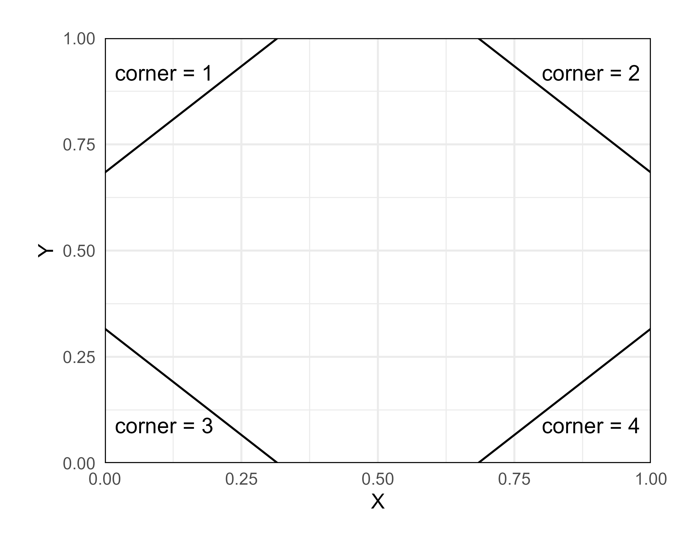 -->
<!-- ``` -->
<!-- <br> -->

<!-- ```{r unitbox, echo = FALSE, eval = FALSE, warning=FALSE, message=FALSE, include=FALSE, cache=TRUE} -->
<!-- library("ggplot2") -->
<!-- # Example -->
<!-- corner1 = 1 -->
<!-- slope1 = 1 -->
<!-- effect1 = 0.05 -->
<!-- if (corner1 == 1) {intercept1 <- 1 - sqrt(2 * effect1 * slope1)} -->
<!-- if (corner1 == 2) {intercept1 <- 1 + abs(slope1) - sqrt(2 * effect1 * abs(slope1))} -->
<!-- if (corner1 == 3) {intercept1 <- sqrt(2 * effect1 * abs(slope1))} -->
<!-- if (corner1 == 4) {intercept1 <- -1 * (slope1 - sqrt(2 * effect1 * slope1))} -->
<!-- int <- intercept1 -->
<!-- int -->

<!-- #ceiling directions ##### -->
<!-- xbox <- c(0,1,0,1) -->
<!-- ybox <- c(0,0,1,1) -->
<!-- box <- data.frame (xbox, ybox) -->

<!-- #all corners based on corner1 -->
<!-- true.effect <- c(0.05, 0.05, 0.05, 0.05) -->
<!-- true.slope <- c(1,-1,-1,1) -->
<!-- true.intercept <- c(int, 1 + int, 1 - int, -int ) -->
<!-- coefs <- data.frame(true.intercept,true.slope) -->
<!-- p <- ggplot(box, aes(x = xbox, y=ybox)) + -->
<!--   geom_blank() +  -->
<!--   geom_hline(aes(yintercept = 0.0), linetype = 'solid') +  -->
<!--   geom_hline(aes(yintercept = 1.0), linetype = 'solid') + -->
<!--   geom_vline(aes(xintercept = 0.0), linetype = 'solid') + -->
<!--   geom_vline(aes(xintercept = 1.0), linetype = 'solid') + -->
<!--   geom_abline(data=coefs, aes(intercept=true.intercept, slope=true.slope)) + -->
<!--   #ggtitle("ceiling direction = 'diagonal'") + -->
<!--   annotate("text", x = 0, y = 0.9, label = "corner = 1", hjust = -0.1, vjust = 0, size = 4) + -->
<!--   annotate("text", x = 0.8, y = 0.9, label = "corner = 2", hjust = 0, vjust = 0, size = 4) + -->
<!--   annotate("text", x = 0, y = 0.07, label = "corner = 3", hjust = -0.1, vjust = 0, size = 4) + -->
<!--   annotate("text", x = 0.8, y = 0.07, label = "corner = 4", hjust = 0, vjust = 0, size = 4) + -->
<!--   labs(x = 'X', y = 'Y') + -->
<!--   scale_x_continuous(limits = c(0, 1), expand = c(0, 0)) +  # Set X-axis limits and expand -->
<!--   scale_y_continuous(limits = c(0, 1), expand = c(0, 0)) +  # Set Y-axis limits and expand -->
<!--   theme_minimal() + -->
<!--   theme( -->
<!--     panel.grid.major = element_blank(),  # Remove major grid lines -->
<!--     panel.grid.minor = element_blank(),  # Remove minor grid lines -->
<!--     #plot.background = element_rect(fill = "white"),  # Set the background color -->
<!--     plot.margin = margin(20, 20, 20, 20)  # Set the margin around the plot -->
<!--   ) -->
<!-- p -->
<!-- #ggsave("unitbox_with_corners_no_grid.png", plot = p, width = 5, height = 4, dpi =600) -->

<!-- # Save the plot as a PDF -->
<!-- ggsave("unitbox_with_corners_no_grid.pdf", plot = p, width = 5, height = 4, dpi = 600) -->

<!-- ``` -->


```{r cornernumbers1,include = FALSE, echo = FALSE, warning=FALSE, message=FALSE, out.width='90%', fig.align = "center", fig.cap= "Numbering of corners in an $XY$-plot."}
knitr:: 
```
<br>

```{r cornerscode, echo = FALSE, eval = FALSE, warning=FALSE, message=FALSE, include=FALSE, cache=TRUE}
library("ggplot2")
# Example
corner1 = 1
slope1 = 1
effect1 = 0.05
if (corner1 == 1) {intercept1 <- 1 - sqrt(2 * effect1 * slope1)}
if (corner1 == 2) {intercept1 <- 1 + abs(slope1) - sqrt(2 * effect1 * abs(slope1))}
if (corner1 == 3) {intercept1 <- sqrt(2 * effect1 * abs(slope1))}
if (corner1 == 4) {intercept1 <- -1 * (slope1 - sqrt(2 * effect1 * slope1))}
int <- intercept1
int

#ceiling directions #####
xbox <- c(0,1,0,1)
ybox <- c(0,0,1,1)
box <- data.frame (xbox, ybox)

#all corners based on corner1
true.effect <- c(0.05, 0.05, 0.05, 0.05)
true.slope <- c(1,-1,-1,1)
true.intercept <- c(int, 1 + int, 1 - int, -int )
coefs <- data.frame(true.intercept,true.slope)
p <- ggplot(box, aes(x = xbox, y=ybox)) +
  geom_blank() +
  geom_hline(aes(yintercept = 0.0), linetype = 'solid') +
  geom_hline(aes(yintercept = 1.0), linetype = 'solid') +
  geom_vline(aes(xintercept = 0.0), linetype = 'solid') +
  geom_vline(aes(xintercept = 1.0), linetype = 'solid') +
  geom_abline(data=coefs, aes(intercept=true.intercept, slope=true.slope)) +
  #ggtitle("ceiling direction = 'diagonal'") +
  annotate("text", x = 0, y = 0.9, label = "corner = 1", hjust = -0.1, vjust = 0, size = 4) +
  annotate("text", x = 0.8, y = 0.9, label = "corner = 2", hjust = 0, vjust = 0, size = 4) +
  annotate("text", x = 0, y = 0.07, label = "corner = 3", hjust = -0.1, vjust = 0, size = 4) +
  annotate("text", x = 0.8, y = 0.07, label = "corner = 4", hjust = 0, vjust = 0, size = 4) +
  labs(x = 'X', y = 'Y') +
  scale_x_continuous(limits = c(0, 1), expand = c(0, 0)) +  # Set X-axis limits and expand
  scale_y_continuous(limits = c(0, 1), expand = c(0, 0)) +  # Set Y-axis limits and expand
  theme_minimal() +
  theme(
    panel.grid.major = element_blank(),  # Remove major grid lines
    panel.grid.minor = element_blank(),  # Remove minor grid lines
    #plot.background = element_rect(fill = "white"),  # Set the background color
    plot.margin = margin(20, 20, 20, 20)  # Set the margin around the plot
  )
print(p)
#ggsave("unitbox_with_corners_no_grid.png", plot = p, width = 5, height = 4, dpi =600)

# Save the plot as a PDF
#ggsave("unitbox_with_corners_no_grid.pdf", plot = p, width = 5, height = 4, dpi = 600)
```


<!-- ```{r contcorners, echo=FALSE, fig.show="hold", out.width='45%', fig.align="center", fig.cap="'Direction' of necessary conditions. Top-Left: a high value of $X$ is necessary for a high value of $Y$ \mbox{(*+ nc +*)}. Top-Right: a low value of $X$ is necessary for a high value of $Y$ \mbox{(*- nc +*)} . Bottom-Left: a high value of $X$ is necessary for a low value of $Y$ \mbox{(*+ nc -*)} . Bottom-Right: a low value of $X$ is necessary for a low value of $Y$ \mbox{(*- nc -*)} ."} -->
<!--  #par(mar = c(4, 4, .1, .1)) -->
<!--  par(mfrow = c(2,2)) -->
<!--  knitr::include_graphics("contcorner1.png") -->
<!--  knitr::include_graphics("contcorner2.png") -->
<!--  knitr::include_graphics("contcorner3.png") -->
<!--  knitr::include_graphics("contcorner4.png") -->
<!-- ``` -->


```{r direction, echo=FALSE, eval=FALSE, message=FALSE, out.width = "80%", fig.align = 'center', fig.cap= "Directions of necessary conditions. From left to right and from top to bottom: presence of $X$ is necessary for presence of $Y$, absence of $X$ is necessary for presence of $Y$, presence of $X$ is necessary for absence of $Y$, absence of $X$ is necessary for absence of $Y$."}
knitr::include_graphics('Direction.png')
```


<!--chapter:end:030-theoryJO.Rmd-->

---
output:
  pdf_document: default
  html_document: default
---
```{r setup, include=FALSE}
knitr::opts_chunk$set(warning = FALSE, message = FALSE)
options(warn = -1)  # Suppress all warnings
```

# Mathematics {#mathematics}

## Summary of this chapter {#summarymathematics}

This chapter describes the mathematics of a necessity relationship between a pair of variables: $X$ is necessary for $Y$. The chapter focuses on necessity-in-degree (NiD) that describes the general situation of two continuous variables with an empty space in the upper-left corner of the $XY$-plot. Using a conventional Euclidean coordinate system where the $X$-axis runs horizontally with increasing values from left to right, and the $Y$-axis runs vertically with increasing values from bottom to top, this indicates that a high level of $X$ is necessary for a high level of $Y$. The mathematical approach described here can be extended to situations with dichotomous or discrete variables, or to analyzing other corners, though this is not addressed in this chapter. The chapter first presents the branches of mathematics applied in NCA (Section \@ref(branchesofmathematics)). In the subsequent section NCA's mathematical model specification is presented (Section \@ref(formalexpression)). It includes the specification of the bounding box, the ceiling line, and the model's degrees of freedom. This is followed by a discussion on how to estimate a necessity model by estimating parameters related to the necessity effect size  and model fit. Next, the situation of multiple necessary conditions is discussed, explaining why NCA considers multiple $X_jY$-planes (multiple projections), rather than one multidimensional space, and explaining how a chain of necessity can be analyzed (Section \@ref(multipleconditions)).

<!-- This concept of necessity is one of NCA's extensions of the conventional binary approach to necessity (see Chapter \@ref(causality)).  -->
<!-- The theoretical meaning of the emptiness of different corners were discussed in Chapter \@ref(theory) (Figures \@ref(fig:contcorners), \@ref(fig:corners1234), \@ref(fig:corners1324), \@ref(fig:corners1423)). -->

<!-- In this chapter several mathematical aspects of NCA are discussed including the analysis if the two dimensional analysis of the $XY$-plane, the used if bounded variables and related scope- the definition of the ceiling line separating the space without points (empty area or ceiling zone) from the space with points (full space or feasible area), the definition the NCA parameters necessity effect size, necessity inefficiency, and parameters related to imperfect necessity such as ceiling accuracy, (in)purity and (in)solidity. The chapter ends with an explanation why NCA is a (multiple) two-dimensional rather that a multi-dimensional analysis.   -->

## Branches of mathematics {#branchesofmathematics}
Rather than relying on statistics and probability theory, NCA employs two branches of mathematics: geometry and algebra. Geometry describes relationships between objects and spaces including points, lines, angles, and planes. NCA focuses on points in the two-dimensional space ($XY$-plane), describes relationships between points (e.g., ceiling line) and considers the size of an area (e.g., effect size). Algebra uses symbols, letters, and numbers and describes their relationships and operations including variables, constants, functions, equations, and inequalities. NCA uses functions to describe the ceiling line with constants and variables, uses equations to calculate effect size, and uses inequalities to specify (in)feasible areas. When describing NCA, geometry and algebra are intertwined. NCA is not a statistical data analysis method per se, although it uses tools from statistics (Chapter \@ref(statistics)).  

<!-- ## Two-dimensional analysis {#twodimensional} -->
## Model specification {#formalexpression}
In NCA, variables $X$ and $Y$ can be dichotomous (two possible levels), discrete (more than two possible levels) or continuous variables (infinite number of possible levels). With numeric variables (including ratio- and interval-scale variables), effect size and other necessity parameters can be calculated. With categorical variables, these calculations are not possible unless equal distances between ordered categories are assumed (e.g., “low”, “medium”, “high”). NCA can handle both non-random and random variables. When NCA uses random variables for $X$ and $Y$, NCA only assumes that the univariate distributions are bounded, but no assumption is needed about the shape of the distribution.^[Also, NCA's null hypothesis tests for estimation of the $p$-value do not make assumptions about distributions (non-parametric tests, see Section \@ref(permutationtest)). However, when statistical simulations are done with NCA such as in Monte Carlo simulations for conducting NCA's power analysis, the analyst must assume variable distributions including the shape. Any bounded distribution could be selected, for example uniform or truncated normal (Chapters \@ref(statistics) and \@ref(sensitivityspecificity)).]


NCA's model specification consists of specifying the bounding box and the ceiling line. 

### Bounding box {#formalboundingbox}
NCA assumes that the condition and the outcome are bounded. There are two reasons for this. First, variables represent properties of phenomena. Many properties are finite, represented by minimum and maximum values of the variables, rather than being infinite (e.g., height of people). Second, the assumption that $X$ and $Y$ are bounded allows the definition and calculation of the necessity effect size (Section \@ref(effectsize)) and other NCA parameters (Sections \@ref(inefficiency) and \@ref(modelfit)). Assuming bounds on $(X,Y)$ means that there are four constants that define the ranges of the condition $X$ and the outcome $Y$: 

\begin{equation} 
(\#eq:mathscope1)
x_{\min} \leq x \leq x_{\max}\quad \text{ and } \quad y_{\min} \leq y \leq y_{\max}
\end{equation}

These bounds define the bounding box in an $XY$-plot. The *bounding box* is defined by the minimum and maximum values of $X$ and $Y$, that is $[x_{\min}, x_{\max}] \times [y_{\min}, y_{\max}]$.  The feasible and empty areas, as well as the ceiling line and its extensions, are defined relative to this bounding box.

The *scope* ($S$) is the area of the bounding box and is mathematically expressed as:

\begin{equation} 
(\#eq:mathscope1a)
S = {(x_{\max} - x_{\min})}\cdot{(y_{\max} - y_{\min})}
\end{equation}


The bounding box can be constructed in two ways: theoretically and empirically. The *theoretical scope* is defined by theoretical bounds of $X$ and $Y$ when the theoretical bounds are known or presumed.^[A theoretical scope may apply, for example, when points are obtained from scales with meaningful minimum and maximum values, such as percentage scales, or Likert scales.] The *empirical scope* is defined by the observed minimum and maximum values of $X$ and $Y$. This option is often selected when theoretical bounds are unknown.


Without loss of generality (for the purpose of NCA), the variables can be linearly transformed to the unit square $[0,1]\times[0,1]$ to obtain a scope value of 1 (Section \@ref(transformation)).^[A proof of the acceptability of an affine transformation including linear transformation is presented in Appendix \@ref(appendixd).] Then a point $(x,y)$ gets transformed by min-max normalization into $(x',y')$ as follows:

\begin{equation}
(\#eq:transform)
x' = \frac{x - x_{\min}}{x_{\max} - x_{\min}} \quad \text{ and } \quad y' = \frac{y - y_{\min}}{y_{\max} - y_{\min}}
\end{equation} 


### Ceiling line {#mathceiling}
When necessity exists, the bounding box has an area where points are possible (*feasible area*) and an area where points are impossible (*empty space* or *ceiling zone*). The ceiling line^[Although in mathematics the term line is usually reserved for a straight line and curve for a non-straight one, line is used here in the broader, graphical sense to refer to both. Specific shapes of ceiling lines are distinguished with adjectives, such as linear, stepwise linear, or concave piecewise linear.] is a line within the bounding box that separates these two areas.  Specifying the ceiling line involves choosing its *location* (in which corner) and its *form*. 

The *location* depends on the direction of the hypothesis (Section \@ref(direction)), which defines the *expected empty corner*. For a high-high hypothesis (presence/high value of $X$ is necessary for presence/high value of $Y$), the expected empty corner is the upper-left corner of the $XY$-plot (corner 1).^[For a low-high hypothesis (the absence/low value of $X$ is necessary for the presence/high value of $Y$) the expected empty corner is the upper-right corner (corner 2), etc.]

To specify the *form* of the ceiling line, several options exist.  Figure \@ref(fig:classfig) shows three classes of non-decreasing ceiling lines in a bounding box. The first class is the Ceiling Envelopment Free Disposal Hull (CE-FDH), which is a stepwise linear ceiling line consisting of several horizontal and vertical line segments (Figure \@ref(fig:classfig)-top-left), the second class is Ceiling Envelopment Variable Returns to Scale (CE-VRS), which is a concave piecewise linear ceiling consisting of several oblique line segments (Figure \@ref(fig:classfig)-top-right),  and the final one is a linear ceiling line consisting of one segment (Figure \@ref(fig:classfig)-bottom). The ceiling line represents an upper bound on the outcome in the feasible area (the gray area). The ceiling line is considered a part of the feasible area.


```{r classfig, echo=FALSE, fig.show="hold", fig.cap="Three classes of ceiling lines within a bounding box for high-high necessity. Top-Left: stepwise linear. Top-Right: concave piecewise linear. Bottom: linear. White: ceiling zone. Gray: feasible area. Numbered points are peers (dominant point with no cases above and to the left of it) connected by solid line segments constructing the ceiling line. The dashed lines are extensions such that the ceiling line envelopes the feasible area.", out.width='49%', fig.align='center'}
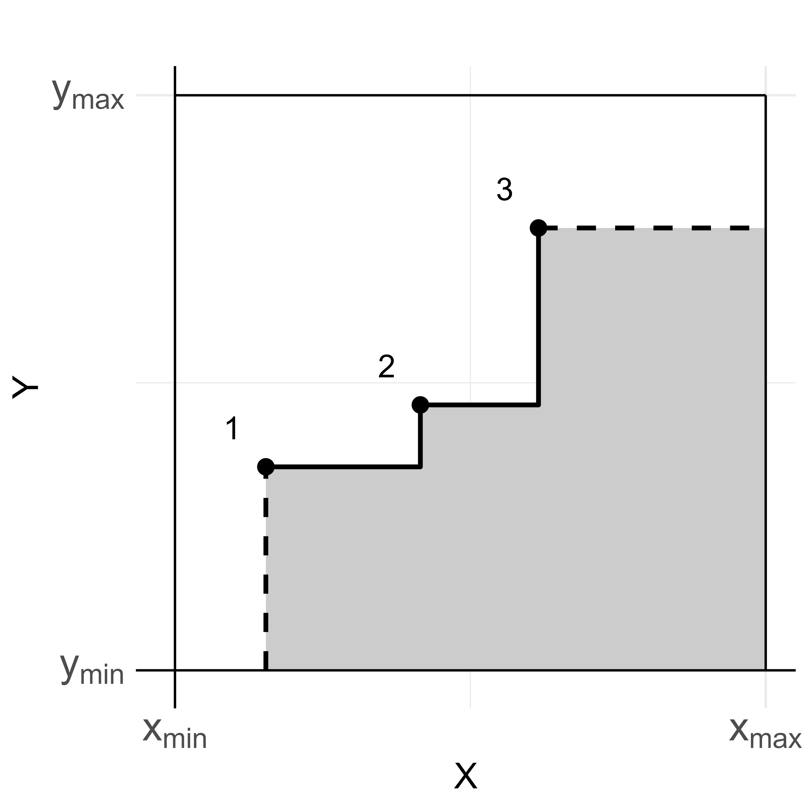
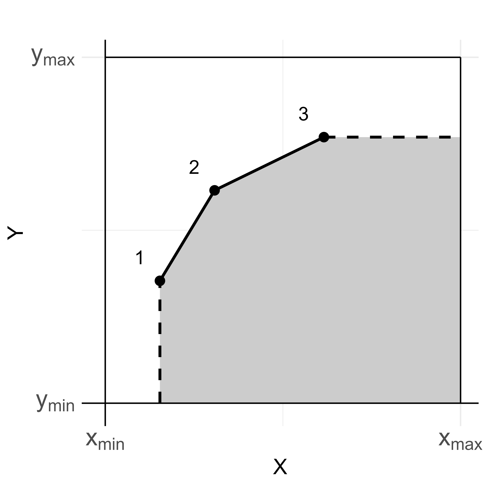
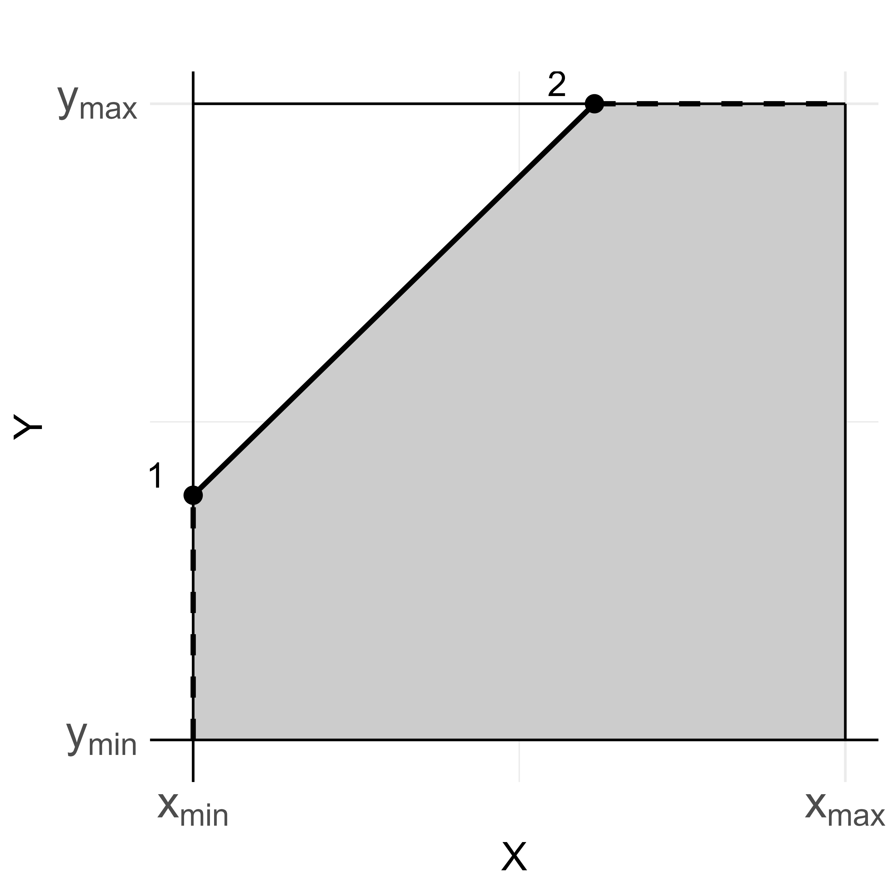
```

```{r, echo = FALSE, eval = FALSE}
library(ggplot2)


# ----------------------------
# Bounding box
# ----------------------------
xmin <- 0; xmax <- 6.5
ymin <- 0; ymax <- 6.5

# ----------------------------
# Line segment AB: y = a + b*x (clipped to bounding box)
# ----------------------------
a <- 2.5
b <- 1

x_from_ymin <- (ymin - a) / b
x_from_ymax <- (ymax - a) / b

xA <- max(xmin, min(x_from_ymin, x_from_ymax))
xB <- min(xmax, max(x_from_ymin, x_from_ymax))

yA <- a + b * xA
yB <- a + b * xB


# ----------------------------
# Feasible area (your example polygon)
# ----------------------------
feasible_area <- data.frame(
  x = c(0, xA, xB,   6.5, 6.5, 0),
  y = c(0, yA, yB,   6.5,   0, 0)
)

#

AB_pts <- data.frame(
  x = c(xA, xB),
  y = c(yA, yB),
  label = c("1", "2")
)

AB_seg <- data.frame(
  x = xA, y = yA,
  xend = xB, yend = yB
)

# ----------------------------
# Plot
# ----------------------------
p_ab <- ggplot() +
  # feasible area
  geom_polygon(data = feasible_area, aes(x = x, y = y), fill = "gray80") +
  
  # AB segment
  geom_segment(
    data = AB_seg,
    aes(x = x, y = y, xend = xend, yend = yend),
    color = "black",
    linewidth = 1
    # linetype = "dashed"   # uncomment if you want dashed
  ) +
  
  # A and B points
  geom_point(data = AB_pts, aes(x = x, y = y), color = "black", size = 3) +
  geom_text(
    data = AB_pts,
    aes(x = x, y = y, label = label),
    hjust = 2.4, vjust = -0.3, size = 5
  ) +
  
  # axes at origin
  geom_hline(yintercept = 0, color = "black") +
  geom_vline(xintercept = 0, color = "black") +
  
  # bounding box top and right edges
  geom_segment(aes(x = xmax, y = ymax, xend = xmax, yend = ymin), color = "black") +
  geom_segment(aes(x = xmax, y = ymax, xend = xmin, yend = ymax), color = "black") +
  
  geom_segment(aes(x = 0, y = 0, xend = 0, yend = yA), color = "black", linewidth = 1, linetype = "dashed") +
  geom_segment(aes(x = xB, y = yB, xend = 6.5, yend = yB), color = "black", linewidth = 1, linetype = "dashed") +  # 
  
  
  # axis labels at min/max
  scale_x_continuous(
    breaks = c(xmin, xmax),
    labels = c(expression(x[min]), expression(x[max]))
  ) +
  scale_y_continuous(
    breaks = c(ymin, ymax),
    labels = c(expression(y[min]), expression(y[max]))
  ) +
  
  coord_cartesian(xlim = c(xmin - 0.1, xmax), ylim = c(ymin - 0.1, ymax)) +
  theme_minimal() +
  theme(
    text = element_text(size = 16),
    axis.text = element_text(size = 18)
  ) +
  labs(x = "X", y = "Y", title = "")

p_ab

#  Save the plot as a PDF
ggsave("dflin1.pdf", plot = p_ab, width = 5, height = 5, dpi = 600)
ggsave("dflin1.png", plot = p_ab, width = 5, height = 5, dpi = 600, bg = "white", units = "in", limitsize = FALSE)


########################3

library(ggplot2)

# Step function data (manually defining steps from LaTeX code)
step_data <- data.frame(
  x = c( 1, 2.7, 2.7, 4, 4 ),
  y = c( 2.3, 2.3, 3, 3, 5 )
)


# Feasible area (shaded region)
feasible_area <- data.frame(
  x = c(1,   1,   2.7, 2.7,  4,   4,  5, 6.5, 6.5, 1),
  y = c(1.5, 2.3, 2.3, 3,    3,   5, 5, 5,   0, 0)
)

# Step points (manually defining key step function points)
step_points_peers <- data.frame(
  x = c(1,   2.7, 4),
  y = c(2.3, 3,   5),
  label = c( "1", "2", "3")
)


#bounding box
xmin = 0; xmax = 6.5
ymin = 0; ymax = 6.5


# Create the plot
#pdf("dffdh.pdf")
p3 <- ggplot() +
  # Fill feasible area (gray)
  geom_polygon(data = feasible_area, aes(x = x, y = y), fill = "gray80") +
  
  # Step function (thick black line)
  geom_step(data = step_data, aes(x = x, y = y), color = "black", linewidth = 1) +
  
  # Step points
  geom_point(data = step_points_peers, aes(x = x, y = y), color = "black", size = 3) +
  geom_text(data = step_points_peers, aes(x = x, y = y, label = label), hjust = 2.4, vjust = -1.2, size = 5) +
  #geom_point(data = step_points_other, aes(x = x, y = y), color = "black", size = 2) +
  #geom_text(data = step_points_other, aes(x = x, y = y, label = label), hjust = -0.6, vjust = 1.2, size = 4) +
  
  # Ceiling line label f_c
  # annotate("text", x = 5.5, y = 6.5, label = "italic(f)[c]", vjust = -0.25, size = 6, parse = TRUE) +
  #annotate("text", x = 5, y = 5.5, label = "italic(f)", vjust = -0.25, size = 6, parse = TRUE) +
  # Axes
  geom_hline(yintercept = 0, color = "black") +
  geom_vline(xintercept = 0, color = "black") +
  geom_segment(aes(x = 6.5, y = 6.5, xend = 6.5, yend = 0), color = "black") +  # xmax line
  geom_segment(aes(x = 6.5, y = 6.5, xend = 0, yend = 6.5), color = "black") +  # ymax line
  
  geom_segment(aes(x = 1, y = 0,  xend = 1, yend = 2.3),
               color = "black", 
               linewidth = 1,
               linetype = "dashed"
               ) +  # ymax line
  
  geom_segment(aes(x = 4, y = 5,  xend = 6.5, yend = 5),
               color = "black", 
               linewidth = 1,
               linetype = "dashed"
  ) +  # ymax line
  
  # Axis labels
  scale_x_continuous(breaks = c(0, 6.5), 
                     labels = c(expression(x[min]), expression(x[max]))) +
  scale_y_continuous(breaks = c(0, 6.5), 
                     labels = c(expression(y[min]), expression(y[max]))) +
  
  # Adjust coordinate limits
  #coord_cartesian(xlim = c(-0.5, 7), ylim = c(-0.5, 7)) +
  coord_cartesian(xlim = c(xmin-0.1, xmax), ylim = c(ymin-0.1, ymax)) +
  # Theme customization
  theme_minimal() +
  theme(
    text = element_text(size = 16),
    axis.title.x = element_text(size = 16),
    axis.title.y = element_text(size = 16),
    axis.text.x = element_text(size = 18),
    axis.text.y = element_text(size = 18),
    plot.title = element_text(size = 20)
  ) +
  
  labs(x = "X", y = "Y", title = "")

#p3

#  Save the plot as a PDF
ggsave("dffdh1.pdf", plot = p3, width = 5, height = 5, dpi = 600)
ggsave("dffdh1.png", plot = p3, width = 5, height = 5, dpi = 600, bg = "white", units = "in", limitsize = FALSE)

#dev.off()

####################################

library(ggplot2)
        
        # Step function data (manually defining steps from LaTeX code)
        step_data <- data.frame(
          x = c(1, 2.7, 2.7, 4, 4),
          y = c(2.3, 2.3, 3, 3, 5)
        )
        
        # Feasible area (shaded region)
        feasible_area <- data.frame(
          x = c(1,   1,   2,   4,  5, 6.5, 6.5, 1),
          y = c(1.5, 2.3, 4,   5, 5, 5,   0, 0)
        )
        
        # Step points (manually defining key step function points)
        step_points_peers <- data.frame(
          x = c(1,  2,  4),
          y = c(2.3, 4,  5),
          label = c( "1","2", "3")
        )
        
        # step_points_other <- data.frame(
        #   x = c( 1, 2.2, 2.7, 4, 5.5, 4.5),
        #   y = c( 1.5,  2.3, 3, 3.6, 5, 2),
        #   label = c( "a", "b", "", "c", "d", "e")
        # )
        
        #bounding box
        xmin = 0; xmax = 6.5
        ymin = 0; ymax = 6.5
        
        
        #df
        # Create the plot
        #pdf("dfvrs.pdf")
        p4 <- ggplot() +
          # Fill feasible area (gray)
          geom_polygon(data = feasible_area, aes(x = x, y = y), fill = "gray80") +
          
          # Step function (thick black line)
          #geom_step(data = step_data, aes(x = x, y = y), color = "black", linewidth = 1) +
          geom_segment(aes(x = 1, y = 0, xend = 1, yend = 2.3), color = "black", linewidth = 1, linetype = "dashed") +  # vrs line
          geom_segment(aes(x = 1, y = 2.3, xend = 2, yend = 4), color = "black", linewidth = 1) +  # vrs line
          geom_segment(aes(x = 2, y = 4, xend = 4, yend = 5), color = "black", linewidth = 1) +  # vrs line
          geom_segment(aes(x = 4, y = 5, xend = 6.5, yend = 5), color = "black", linewidth = 1, linetype = "dashed") +  # vrs line
          # Step points
          geom_point(data = step_points_peers, aes(x = x, y = y), color = "black", size = 3) +
          geom_text(data = step_points_peers, aes(x = x, y = y, label = label), hjust = 2.4, vjust = -1.2, size = 5) +
          #geom_point(data = step_points_other, aes(x = x, y = y), color = "black", size = 2) +
          #geom_text(data = step_points_other, aes(x = x, y = y, label = label), hjust = -0.6, vjust = 1.2, size = 4) +
          
          # Ceiling line label f_c
          # annotate("text", x = 5.5, y = 6.5, label = "italic(f)[c]", vjust = -0.25, size = 6, parse = TRUE) +
          #annotate("text", x = 5, y = 5.5, label = "italic(f)", vjust = -0.25, size = 6, parse = TRUE) +
          # Axes
          geom_hline(yintercept = 0, color = "black") +
          geom_vline(xintercept = 0, color = "black") +
          geom_segment(aes(x = 6.5, y = 6.5, xend = 6.5, yend = 0), color = "black") +  # xmax line
          geom_segment(aes(x = 6.5, y = 6.5, xend = 0, yend = 6.5), color = "black") +  # ymax line
          
          # Axis labels
          scale_x_continuous(breaks = c(0, 6.5), 
                             labels = c(expression(x[min]), expression(x[max]))) +
          scale_y_continuous(breaks = c(0, 6.5), 
                             labels = c(expression(y[min]), expression(y[max]))) +
          
          # Adjust coordinate limits
          #coord_cartesian(xlim = c(-0.5, 7), ylim = c(-0.5, 7)) +
          coord_cartesian(xlim = c(xmin-0.1, xmax), ylim = c(ymin-0.1, ymax)) +
          # Theme customization
          theme_minimal() +
          theme(
            text = element_text(size = 16),
            axis.title.x = element_text(size = 16),
            axis.title.y = element_text(size = 16),
            axis.text.x = element_text(size = 18),
            axis.text.y = element_text(size = 18),
            plot.title = element_text(size = 20)
          ) +
          
          labs(x = "X", y = "Y", title = "")
        
        #p4
        
        #  Save the plot as a PDF
        ggsave("dfvrs1.pdf", plot = p4, width = 5, height = 5, dpi = 600)
        ggsave("dfvrs1.png", plot = p4, width = 5, height = 5, dpi = 600, bg = "white", units = "in", limitsize = FALSE)
        
        #dev.off()

```

A ceiling line is assumed to be *non-decreasing* for two reasons.^[When a ceiling line has increasing and decreasing parts as for a parabolic ceiling, multiple analyses can be done for each increasing and decreasing part separately. For the increasing part,  the  empty area is in the upper-left corner, whereas it is in the upper-right corner for the decreasing part. With a parabola-shaped ceiling, an optimum (rather than just low or high) level of $X$ is necessary for a high level of $Y$ (Section \@ref(morecorners)).] First, it allows the expression that *at least* a certain level of $X$ is necessary for a certain level of $Y$. Second, a non-decreasing ceiling line has the *‘no-reversal’* (no change of direction) property. This means that if a point $(x,y)$ is in the ceiling zone, then any point $(x',y')$ to the left or above it (a point with $x'\leq x$ and $y'\geq y$) and within the bounding box is also in the ceiling zone. Similarly, if a point  $(x,y)$ is in the feasible area, then any point $(x',y')$ in the bounding box with $x' \geq x$ and $y' \leq y$  is also in the feasible area. This property is used for the mathematical expression of the ceiling line (see below) and for two measures of imperfect necessity, namely purity and solidity (Sections \@ref(purity) and \@ref(solidity), respectively).

#### Stepwise linear ceiling line {#mathcefdh} 

NCA uses the stepwise linear ceiling line (CE-FDH) as the base ceiling model. It refers to the Free Disposal Hull (FDH) technique [@deprins1984measuring] that originates in production economics. This application of FDH identifies the efficiency of decision-making units (DMUs) with a certain production input ($X$) and output ($Y$). The technique assumes the free disposability property meaning that if a DMU can produce a certain output, it can also reduce the amount of output without using additional input, and use more input without increasing output. FDH identifies the most efficient DMUs (points with maximum output for a given input and minimum input for a given output). The outer boundary of the hull  ('envelope' or 'frontier') connects the most efficient points (called 'peers'). Points below the frontier are considered inefficient. 

NCA uses the FDH technique in 2D. In NCA's context, the hull is called the feasible area, and the disposability property is called the no-reversal property. The feasible area is the smallest area defined by *peers*: a strictly increasing set of points, $(x_i,y_i)_{i=1,\ldots,P}$ for which

\begin{equation}
(\#eq:peersdef)
x_i<x_{i+1}\quad\text{and}\quad y_i<y_{i+1}\quad\text{for}\quad i=1,\ldots,P-1
\end{equation}

Where $P$ is the number of peers. Peers are points that dominate other points. When the upper-left corner is the expected empty corner (as in Figure \@ref(fig:classfig)), no points exist to the left and above the peers.  

A class of ceiling lines is defined by the way that peers are defined and connected. The CE-FDH-class of ceiling lines consists of all models with a feasible area generated by a set of $P$ peers connected by horizontal and vertical line segments (Figure \@ref(fig:classfig)-top-left).

Let the peers be $(x_i,y_i)_{i=1,\ldots,P}$. The feasible space generated by these peers is the hypograph^[A hypograph is the set of all points that lie on or below the graph of a function.] of the ceiling function $f(x)$, defined for $x\in[x_1,x_{\max}]$ by

\begin{equation}
(\#eq:fdh-ceiling)
f_{\mathrm{CE-FDH}}(x)=
\begin{cases}
y_i & \text{if } x_i\le x<x_{i+1}\quad (i=1,\ldots,P-1),\\
y_P & \text{if } x_P\le x\le x_{\max}
\end{cases}
\end{equation}

and $f_{\mathrm{CE-FDH}}(x)$ is not defined for $x<x_1$.

<!-- The ceiling line is given by the sequence of line segments -->
<!-- from $(x_1,y_{\min})$ to $(x_1,y_1)$, to $(x_2,y_1)$, to $(x_2,y_2)$, and so on, ending at $(x_P,y_P)$ and $(x_{\max},y_P)$. -->
<!-- Possibly, the first segment from $(x_1,y_{\min})$ to $(x_1,y_1)$ and/or the last segment from $(x_P,y_P)$ to $(x_{\max},y_P)$ has length equal to zero (starts and ends at the bounding box). When the first peer starts at $x = x_{min}$ and the last peer ends at $y = y_{max}$ the bounding box is called a *tight* bounding box.  -->

The generalized inverse is:

\begin{equation}
(\#eq:fdh-inverse)
\begin{aligned}
f_{\mathrm{CE-FDH}}^{-}(y) &= \inf\{x\mid f_{\mathrm{CE-FDH}}(x)\ge y\}\\
&= \begin{cases}
x_1 & \text{if } y\le y_1,\\
x_{i+1} & \text{if } y_i<y\le y_{i+1}\quad (i=1,\ldots,P-1)
\end{cases}
\end{aligned}
\end{equation}

and $f_{\mathrm{CE-FDH}}^{-}(y)$ is undefined (infeasible) if $y>y_P$.

The associated feasible space is generated by all points on the line segments from $(x_i,y_i)$ to $(x_{i+1},y_{i+1})$ for $i=1,\ldots,P-1$.

The ceiling line is given by the sequence of line segments
from $(x_1,y_{\min})$ to $(x_1,y_1)$, to $(x_2,y_1)$, to $(x_2,y_2)$, and so on, ending at $(x_P,y_P)$ and $(x_{\max},y_P)$.
Possibly, the first segment from $(x_1,y_{\min})$ to $(x_1,y_1)$ and/or the last segment from $(x_P,y_P)$ to $(x_{\max},y_P)$ has length equal to zero (starts and ends at the bounding box). When the first peer starts at $x = x_{min}$ and the last peer ends at $y = y_{max}$ the bounding box is called a *tight* bounding box. 

#### Concave piecewise linear (CE-VRS) ceiling line {#mathcevrs}

The CE-VRS-class of ceiling line consists of all models with a set of $P$ peers such that the sequence of peers forms a concave sequence, i.e. the slopes between consecutive peers strictly decrease:

\begin{equation}
(\#eq:vrs-concavity)
\frac{y_{i+1}-y_i}{x_{i+1}-x_i}
>
\frac{y_{i+2}-y_{i+1}}{x_{i+2}-x_{i+1}}
\quad\text{for}\quad i=1,\ldots,P-2
\end{equation}

The ceiling function is given by linear interpolation between consecutive peers:

\begin{equation}
(\#eq:vrs-ceiling)
f_{\mathrm{CE-VRS}}(x)=y_{i-1}+\frac{y_i-y_{i-1}}{x_i-x_{i-1}}(x-x_{i-1})
\quad\text{if}\quad x_{i-1}\le x\le x_i\quad (i=2,\ldots,P)
\end{equation}

and $f_{\mathrm{CE-VRS}}(x)=y_P$ if $x\ge x_P$, while $f_{\mathrm{CE-VRS}}(x)$ is not defined for $x<x_1$.

The generalized inverse is:

\begin{equation}
(\#eq:vrs-inverse)
\begin{aligned}
f_{\mathrm{CE-VRS}}^{-}(y) &= \inf\{x\mid f_{\mathrm{CE-VRS}}(x)\ge y\}\\
&= \begin{cases}
x_1 & \text{if } y\le y_1,\\[2mm]
x_i+\dfrac{x_{i+1}-x_i}{y_{i+1}-y_i}(y-y_i) & \text{if } y_i<y\le y_{i+1}\\
& \quad (i=1,\ldots,P-1)
\end{cases}
\end{aligned}
\end{equation}

and $f_{\mathrm{CE-VRS}}^{-}(y)$ is undefined (infeasible) if $y>y_P$.

The associated feasible space is generated by all points on the line segments from $(x_i,y_i)$ to $(x_{i+1},y_{i+1})$ for $i=1,\ldots,P-1$.

The ceiling line follows the linear segments from $(x_1,y_{\min})$ to $(x_1,y_1)$, then to $(x_2,y_2)$, and so on, ending at $(x_P,y_P)$ and $(x_{\max},y_P)$. Possibly, the first and/or last segment has length equal to zero.


#### Linear ceiling line {#mathlinear}

The class of linear ceiling lines consists of models with a ceiling that is a (positive-length) segment of a line. The ceiling function is

\begin{equation}
(\#eq:lin-ceiling-clipped)
f_{\mathrm{LIN}}(x)=\max\{y_{\min},\min\{y_{\max},a+bx\}\}
\end{equation}

with $b>0$ to ensure the line is strictly increasing and with
$(a+bx_{\min},\,a+bx_{\max}]\cap[y_{\min},y_{\max}]$ to ensure the line intersects the bounding box with a segment of positive length. This is equivalent to

\begin{equation}
(\#eq:lin-intersect-ineq)
a+bx_{\max}>y_{\min}\quad\text{and}\quad a+bx_{\min}<y_{\max}
\end{equation}

which in turn is equivalent to

\begin{equation}
(\#eq:lin-a-range)
y_{\min}-bx_{\max}<a<y_{\max}-bx_{\min}.
\end{equation}

The line $y=a+bx$ intersects the boundary of the bounding box in two points $(x_1,y_1)$ and $(x_2,y_2)$ with

\begin{equation}
(\#eq:lin-peers1)
(x_1,y_1)=\big(\max\{x_{\min},(y_{\min}-a)/b\},\ \max\{y_{\min},a+bx_{\min}\}\big)
\end{equation}

and

\begin{equation}
(\#eq:lin-peers2)
(x_2,y_2)=\big(\min\{x_{\max},(y_{\max}-a)/b\},\ \min\{y_{\max},a+bx_{\max}\}\big).
\end{equation}

The set of two points $(x_1,y_1)$ and $(x_2,y_2)$ forms a set of peers. In terms of these peers, the ceiling can be written as

\begin{equation}
(\#eq:lin-ceiling-peers)
f_{\mathrm{LIN}}(x)=
\begin{cases}
y_1+\dfrac{y_2-y_1}{x_2-x_1}(x-x_1)=a+bx & \text{if } x_1\le x\le x_2,\\
y_2 & \text{if } x\ge x_2
\end{cases}
\end{equation}

with $f_{\mathrm{LIN}}(x)$ not defined for $x<x_1$.

The generalized inverse is:

\begin{equation}
(\#eq:lin-inverse)
f_{\mathrm{LIN}}^{-}(y)=\inf\{x\mid f_{\mathrm{LIN}}(x)\ge y\}=
\begin{cases}
x_1 & \text{if } y\le y_1,\\[2mm]
x_1+\dfrac{x_2-x_1}{y_2-y_1}(y-y_1)=\dfrac{y-a}{b} & \text{if } y_1<y\le y_2
\end{cases}
\end{equation}

and $f_{\mathrm{LIN}}^{-}(y)$ is undefined (infeasible) if $y>y_2$.

The ceiling line consists of the line segments from $(x_1,y_{\min})$ to $(x_1,y_1)$, then to $(x_2,y_2)$, and finally to $(x_{\max},y_2)$. Possibly, the first and/or last segment has length equal to zero.

### Model degrees of freedom {#modeldf}
A necessity model specifies the bounding box with the ceiling line that is inside it. The ceiling line is assumed not to be outside the bounding box. Model degrees of freedom refers to the minimum number of parameters that are needed to describe the necessity model. The bounding box has $4$ degrees of freedom. It can be described by, for example, the coordinates of the lower-left and the upper right corner points: $x_{\min}, y_{\min}, x_{\max}, y_{\max}$. 

Since a sequence of peers in the two classes of segmented ceiling lines (CE-FDH and CE-VRS) is defined in terms of strict inequalities, each peer can change position slightly without violating the conditions. Hence, the degrees of freedom of each of the CE-FDH and CE-VRS classes is $2P$.

Since the class of linear ceiling lines only imposes restrictions on $a$ and $b$ through strict inequalities, the degrees of freedom equals $2$. 

Therefore the general expression for the degrees of freedom of a necessity model is: 

\begin{equation}
(\#eq:df-nontight)
df_{\text{model}} =
\begin{cases}
6,       & \text{linear ceiling line}. \\
2P + 4,  & \text{segmented ceiling line}. 
\end{cases}
\end{equation}

where $P$ is the number of peers of the segmented ceiling lines (CE-FDH and CE-VRS).

<!-- ## Mathematical model specification {#mathematicalexpression} -->

<!-- The general mathematical expression of a necessity model consists of the specification of the *inner ceiling line* and the *bounding box* within which the ceiling is defined, and specifies that only points are possible in the feasible area.  -->
<!-- <!-- The inner ceiling line separates the feasible area from the empty area inside the bounding box and expresses the maximum possible value of $Y$ for a given value of $X$. -->

<!-- <!-- Throughout this section, uppercase letters ($X, Y$) denote variables, while lowercase letters with subscripts ($x_{\min}, x_{\max}, y_{\min}, y_{\max}$) denote fixed bounds or constants. -->


<!-- ### linear inner ceiling line -->


<!-- The mathematical specifications of the inner ceiling line are consistent with the general expressions for the model degrees of freedom of Equation \@ref(eq:df-ceiling) for the case of a tight bounding box. A linear inner ceiling line consists of a single oblique segment, that is, $S = 1$. According to Equation \@ref(eq:df-ceiling), for a tight bounding box and free slopes, the model degrees of freedom equals $df_{\text{model}} = 2S + 4 = 2 \cdot 1 + 4 = 6$. In the mathematical specification, these six degrees of freedom correspond to two parameters describing the inner ceiling line (intercept $a$ and slope $b$), and four parameters describing the bounding box ($x_{\min}, x_{\max}, y_{\min}, y_{\max}$). -->

<!-- Thus, the direct and inverse formulations of the linear ceiling line use exactly the parameters implied by the degrees-of-freedom count and do not introduce any additional parameters. -->


<!-- ### CE-FDH: stepwise inner ceiling line via peers {#ce-fdh} -->

<!-- The CE-FDH ceiling belongs to the *free-disposal hull (FDH)* class. It can be characterized by a set of *peers* (strictly increasing boundary points). The resulting ceiling is stepwise: it is constant over ranges of \(X\) and jumps upward at peer locations. This corresponds to a feasible space generated by free disposal below the step ceiling. -->
<!-- When the inner ceiling line is piecewise linear with horizontal and vertical segments, it is represented as a step function defined only by its *inner* segments. When the inner ceiling line consists of $M$ steps defined by points $\{(x_i, y_i)\}_{i=0}^{M}$ such that $x_0 = x_{\min}$, $x_M = x_{\max}$, $y_0 = y_{\min}$, and $y_M = y_{\max}$, with $x_i$ non-decreasing and $y_i$ non-decreasing. -->

<!-- The inner step ceiling function is defined as: -->

<!-- \begin{equation} -->
<!-- (\#eq:step-direct) -->
<!-- f_j(X) = \sum_{i=1}^{M} y_i \, I_i(X) -->
<!-- \end{equation} -->

<!-- with indicator function: -->

<!-- \begin{equation} -->
<!-- (\#eq:indicator-step) -->
<!-- I_i(X) = -->
<!-- \begin{cases} -->
<!-- 1 & \text{if } x_{i-1} \le X < x_i \\ -->
<!-- 0 & \text{otherwise} -->
<!-- \end{cases} -->
<!-- \end{equation} -->

<!-- The necessity constraint is $Y \le f_j(X)$. Within each interval $[x_{i-1}, x_i)$ the ceiling value is constant.   -->

<!-- The vertical segments of the ceiling line do not correspond to function values, since a function assigns a single value of $Y$ to each value of $X$. Because the stepwise ceiling line is non-decreasing but not strictly increasing, its inverse is defined as a *generalized inverse*. Formally, the generalized inverse of a non-decreasing function $f_j$ is defined as: -->

<!-- \begin{equation} -->
<!-- f_j^{-1}(Y) = \inf \{ X \in [x_{\min}, x_{\max}] : f_j(X) \ge Y \} -->
<!-- \end{equation} -->

<!-- where $inf$ is the infimum, which is the smallest possible $X$ that satisfies   -->
<!-- $f_j(X) \ge Y$. -->

<!-- For the stepwise inner ceiling line, this inverse can be written explicitly as: -->

<!-- \begin{equation} -->
<!-- (\#eq:step-inverse) -->
<!-- f_j^{-1}(Y) = \sum_{i=1}^{M} x_{i-1} \, J_i(Y) -->
<!-- \end{equation} -->

<!-- with indicator function: -->

<!-- \begin{equation} -->
<!-- (\#eq:indicator-inverse-step) -->
<!-- J_i(Y) = -->
<!-- \begin{cases} -->
<!-- 1 & \text{if } y_{i-1} < Y \le y_i \\ -->
<!-- 0 & \text{otherwise} -->
<!-- \end{cases} -->
<!-- \end{equation} -->

<!-- Thus, for achieving $Y = y_c$, the minimum necessary value of $X$ is: -->

<!-- \begin{equation} -->
<!-- X \ge f_j^{-1}(y_c) -->
<!-- \end{equation} -->

<!-- A stepwise inner ceiling line consists of $S$ horizontal and vertical segments. According to Equation \@ref(eq:df-ceiling), for a tight bounding box and horizontal–vertical segments, the model degrees of freedom is $df_{\text{model}} = S + 4$. In the mathematical specification, the $S$ degrees of freedom for the ceiling line are represented by the $S$ independent step heights or widths encoded by the inner ceiling points $\{(x_i, y_i)\}_{i=0}^{M}$, subject to monotonicity. The remaining four degrees of freedom are given by the bounds of the tight bounding box. The stepwise ceiling function and its generalized inverse are therefore alternative parameterizations of the same inner ceiling polyline and do not change the number of degrees of freedom. In particular, defining the inverse via the generalized inverse of the inner ceiling line introduces no additional parameters. Different functional representations describe the same underlying model complexity. -->

<!-- For both linear and stepwise ceiling lines, the *inner ceiling line* expresses the maximum attainable level of $Y$ for a given $X$, while the inverse ceiling line expresses the minimum required level of $X$ for a given $Y$. In both cases, the ceiling function represents a *necessary but not sufficient* relationship:  $X = x_c$ is necessary for $Y = y_c$, but generally not sufficient, because points usually exist below the ceiling line. -->


<!-- ### CE-VRS: concave piecewise-linear ceiling via peers {#ce-vrs} -->

<!-- The CE-VRS ceiling belongs to the *variable returns to scale (VRS)* class. Like CE-FDH, it is defined by a set of peers \(\{(x_i,y_i)\}_{i=1,\dots,P}\) that satisfy strict monotonicity: -->
<!-- \[ -->
<!-- x_i < x_{i+1} \quad \text{and} \quad y_i < y_{i+1} \quad \text{for } i=1,\dots,P-1. -->
<!-- \] -->

<!-- In addition, VRS imposes concavity on the peer sequence: slopes between consecutive peers decrease as \(x\) increases: -->
<!-- \[ -->
<!-- \frac{y_{i+1}-y_i}{x_{i+1}-x_i} -->
<!-- > -->
<!-- \frac{y_{i+2}-y_{i+1}}{x_{i+2}-x_{i+1}} -->
<!-- \quad \text{for } i=1,\dots,P-2. -->
<!-- \] -->

<!-- The resulting inner ceiling is piecewise linear: it connects peers with linear line segments and forms a concave (nondecreasing) envelope. As with other nondecreasing ceilings, the inverse requirement for a target \(Y\) is expressed using a generalized inverse. -->

## Mathematical estimation {#mathematicalestimation}
<!-- The ceiling line as defined above separated the area in the $XY$-plot where cases are possible (gray) from the area where cases are not possible (white) as in Figures \@ref(fig:mathematics1INNEREXTENDEDfig) and \@ref(fig:mathematics2INNEREXTENDEDfig). The ceiling line marks this sharp border. The parameters of the mathematical necessity model can be theoretically proposed, or estimated from data.  -->

<!-- For the mathematical estimation of the ceiling from data, the  information about the ceiling is in the datapoints near the ceiling. A ceiling can be estimated statistically (using distribution information) or mathematically.  -->

<!-- NCA uses the step function as the base model. In particular, the Free Disposal Hull (FDH) technique [@deprins1984measuring] that originates in production economics is used. This application identifies the efficiency of decision-making units (DMUs) with a certain production input ($X$) and output ($Y$). The technique assumes the free disposability property meaning that if a DMU can produce a certain output, it can also reduce the amount of output without using additional input, and use more input without increasing output. FDH identifies the most efficient DMUs (points with maximum output for a given input and minimum input for a given output). The outer boundary of the hull  ('envelope' or 'frontier') connects the most efficient points. Points below the frontier are considered inefficient.  -->

<!-- NCA uses the FDH technique in a different way. NCA's ‘no-reversal’ property of the ceiling line corresponds to the 'free disposal' property of the FDH. In 2D, the hull corresponds to NCA's feasible area with the stepwise linear step function with horizontal and vertical segments (Figure \@ref(fig:mathematics2INNEREXTENDEDfig)) as the boundary. In NCA, this line is called the Ceiling Envelopment Free Disposal Hull (CE-FDH). Whereas FDH focuses on the *presence* of points on and *below* the ceiling (the points in what NCA calls the feasible area), NCA focuses on the *absence* of points on and *above* the ceiling. Furthermore, for reasons explained in Section \@ref(multipleconditions), NCA considers projections of points in the two-dimensional plane whereas FDH focuses on points in the multidimensional space. In addition, FDH does not include points of the form (0,y) for y > 0 (no output without input). -->

<!-- For a given set of points the ```NCA```^[The typewriter font is used to refer to software (functions), for example the function ```nca_analysis``` that is part of the ```NCA``` software in ```R```.] software (Appendix \@ref(appendixb)) estimates the parameters of CE-FDH step function and connects the upper-left points of the steps using horizontal and vertical line segments (see the stepwise linear step function in Figure \@ref(fig:estimationceilingfig)).    -->


```{r estimationceilingfig, echo=FALSE, fig.show="hold", out.width="99%", fig.align="center", fig.cap= "Mathematical estimation techniques using different ceiling lines. CE-FDH: stepwise linear ceiling line. CR-FDH: linear ceiling line (shown as the lower solid line). C-LP: linear ceiling line (shown as dashed line). CE-VRS: concave piecewise linear ceiling line (shown as segments passing through A, B, C, D, and E). CR-VRS: linear ceiling line (shown as the upper solid line). QR (Quantile Regression): linear ceiling line (shown as the dashed-dotted line in the middle). Population ceiling line: Y = 0.3 + X. Population effect size = 0.25. 50 points randomly selected from the population."}
#knitr::include_graphics("estimationceilingBW.png")
#knitr::include_graphics("estimationceilingNEW BWcool.png")
knitr::include_graphics("estimationceilingNEW.png")
```

The mathematical estimation of the necessity model consists of estimating the parameters of the bounding box and the  ceiling line from data. This can be done with the NCA software (Appendix \@ref(appendixb)).

The estimation of the bounding box requires that the analyst selects the type of bounding box (defined by the theoretical or empirical scope). For the theoretical scope, the analyst specifies $x_{min}$, $y_{min}$,  $x_{max}$ and $y_{max}$. For the empirical scope the software estimates these values by taking the observed extremes. 

The estimation of the ceiling line requires that the analyst selects the form of the ceiling line. If a segmented ceiling line is selected (CE-FDH or CE-VRS), the software provides the estimated $x$- and $y$-coordinates of the peers. To select a linear ceiling line there are several options for this line. The Ceiling Regression Free Disposal Hull ceiling line (CR-FDH) is a trend line through the CE-FDH peers using least squares optimization. The Ceiling Regression Variable Returns to Scale (CR-VRS) ceiling line is the trend line through the CE-VRS peers using least squares optimization. The Ceiling - Linear Programming (C-LP) ceiling line is the line that is tight to the CE-FDH peers such that the sum of heights of the CE-FDH peers is minimized ("least sum"). The different lines are shown in Figure \@ref(fig:estimationceilingfig),^[For better visibility, the plot can be produced by the ``` NCA``` software in ```R``` as follows: ```library(NCA); set.seed(123); data <- nca_random (50, 0.3, 1); model <- nca_analysis(data, "X", "Y", ceilings = c("ce_fdh", "cr_fdh", "c_lp", "ce_vrs", "cr_vrs", "QR")); nca_output(model, summaries = FALSE, pdf = TRUE)```.] 

After selecting form of the line, the software provides the values of the parameters to describe the ceiling line (e.g., intercept and slope for the linear ceiling line). Criteria for selecting the type of bounding box and form of the ceiling line are discussed in Section \@ref(modelspecification).


<!-- For the three straight ceiling lines (CR-FDH, CR-VRS, C-LP) two parameters are estimated (ceiling intercept and slope). The segmented ceiling lines (CE-FDH, CE-VRS) require more parameters depending on the number of lpeers. Whereas CE-FDH, CR-FDH and C-LP do not have points above the ceiling, the trend ceiling lines (CR-FDH and CR-VRS) may have points in the ceiling zone (the area above the ceiling). In NCA, the default ceiling lines are CE-FDH and CR-FDH. CE-FDH can be used when $X$ or $Y$ are discrete or when the border is "irregular" (non-linear). The straight lines can be used when both variables are continuous or the border is "smooth" (linear). CE-VRS may be appropriate when the border is concave, and C-LP may be appropriate if measurement error is negligible (see Section \@ref(ceilingquality) on the statistical quality of several ceiling lines).  -->

NCA's mathematical estimations with the above ceiling techniques are based on the location of the peers. CE-FDH and CE-VRS use peers directly, while the linear ceiling lines CR-FDH, CR-VRS and C-LP ceiling line use them indirectly. The use of only points near the border is motivated by several fundamental considerations.^[It is also possible as an option in the ```NCA``` software that the analyst selects a custom line using a theoretical intercept and the slope.] First, NCA's primary object of interest is the *empty space* above the ceiling: the region where observations are impossible. This follows necessity logic: if not $X$, then not $Y$. The ceiling zone is the complement of the feasible area in the bounding box. NCA quantifies the size of this  zone and relates it to the size of the bounding box, which requires knowing the maximum feasible area but does not require modeling how points are distributed within that feasible area. Consequently, only points close to the ceiling are informative for locating the boundary. Points far below it do not contribute to identifying the boundary.

Second, conceptually, in NCA's deterministic logic, the ceiling is an abrupt transition from a region that can contain points to a region that cannot, more like a cliff edge than a gradual slope. The characteristic feature of a ceiling is thus a *sharp boundary* between feasibility and infeasibility. Methods that estimate the ceiling indirectly via a gradual (non-abrupt) distributional model of all data risk misrepresenting this discontinuity. A gradual model can blur the boundary and thereby estimate a “soft” transition that is not characteristic of a true ceiling.

Third, ceiling estimates should be *insensitive to data far below the ceiling*. For example, increasing the density of points in the lower-right corner should not have an effect on how the ceiling is constructed. Such points would pull the estimated ceiling estimates downward. This inflates the estimated empty space and thus overstates the true effect size. For this reason, ceiling estimation techniques that rely on fitting the full distribution under the ceiling are generally risky and should be applied with caution.^[Early NCA work proposed quantile regression and stochastic frontier analysis as statistical ceiling estimators [@goertz2013ceilings; @dul2016orm]. Since these approaches lower the ceiling line when more cases appear below the ceiling they are no longer recommended. Stochastic frontier analysis has not been adopted in practice of NCA and is deprecated in the `NCA` software. Quantile regression remains available, but is rarely used in NCA [for an exception see, @chen2026entrepreneurial].]
 This is illustrated with the distribution-based  Quantile Regression (QR) ceiling line. In Figure \@ref(fig:estimationceilingfig), this line lies among the other ceilings (that all only use points near the ceiling) and approximates the true ceiling line well. However, after altering the distribution of points by adding observations in the lower-right corner, the QR-based ceiling becomes biased, whereas ceilings estimated from on upper points remain stable (\@ref(fig:estimationceilingQRfig)). Broader evidence from Monte Carlo simulations likewise suggests that a distribution-based method like QR can exhibit bias, even at larger sample sizes, warranting prudence in their use (Section \@ref(ceilingquality)).

<!-- ################ -->
<!-- NCA choice to use mathematical estimation of the ceiling based on the points near the ceiling (the envelop), rather than statistical estimation based on the distribution of all data under the ceiling has several fundamental reasons.  -->
<!-- First, NCA estimates a ceiling line because of the interest in the area above it where points are impossible (empty space), not in the area where points are possible (feasible area) following necessity logic: if not $X$, then not $Y$. NCA quantifies this area (ceiling zone) and compares it with the  size of the bounding box for which the *size* of the feasible area must be known. This is independent of the data distribution within it. Only the points near the ceiling are used for defining the ceiling.  -->
<!-- Second, the very nature of the presence of an empty area versus a full  implies that a sharp border exists between the two aras. The ceiling represents the abrupt transition from an area with points to an area without points, like a cliff. This transition is not smooth such that estimating it with a smooth distribution function representing the data under the ceiling (e.g. normal distribution) does not represent the true characteristic of a ceiling. Third, a ceiling that is estimated with all data under the ceiling is sensitive to the distribution of these data. For example if the density of points near the lower-right corner is increased, the estimated ceiling with the distribution function would make it lower, this over estimating the effect size. A mathematically estimated ceiling is only sensitive to changes of the distribution of points near the ceiling, and not by changes of the distribution elsewhere in the feasible area. A last reason is that statistical stimation usually relies (implicitly) on smootheness assumptions.  This lack of smoothnees for estimating ceiling lines may introduce uncontrolled bias.   -->

<!-- Therefore, statistical estimation techniques for the ceiling and its uncertainty that use the full distribution under the ceiling are generally risky.  -->

```{r estimationceilingQRfig, echo=FALSE, fig.show="hold", out.width="99%", fig.align="center", fig.cap= "Comparison of an estimation techniques based on the distribution of all data below the ceiling: QR = Quantile Regression (shown as the near-horizontal dash-dotted line) and based on upper peers (the other lines). Population ceiling line = $Y = 0.3 + X$. Population effect size is 0.25. First 50 points randomly selected from the population, next 50 points added in the lower-right corner."}
#knitr::include_graphics("estimationceilingQR BWcool.png")
#knitr::include_graphics("estimationceilingQRextra BWcool.png")
knitr::include_graphics("estimationceilingQRextra.png")
```

``` {r estimationceilingQRcode, echo = FALSE, eval = FALSE}
library(NCA)
set.seed(123)
data_r <- nca_random (50, 0.3, 1)
colnames(data_r) <- c("X", "Y")

# --- Add 75 points in the lower-right corner ---
extra <- data.frame(
  X = runif(75, 0.75, 1.00),
  Y = runif(75, 0.00, 0.25)
)

data_r$source <- "nca_random"
extra$source <- "added_lower_right"

data <- data_r  # select random
model <- nca_analysis(data, "X", "Y", ceilings = c("ce_fdh", "cr_fdh", "c_lp", "ce_vrs", "cr_vrs", "qr"))
#pdf("estimationceilingQR.pdf")
nca_output(model, summaries = FALSE)
#dev.off()

data <- rbind(data_r, extra)   # select random + extra
model <- nca_analysis(data, "X", "Y", ceilings = c("ce_fdh", "cr_fdh", "c_lp", "ce_vrs", "cr_vrs", "qr"))
#pdf("estimationceilingQRextra.pdf")
nca_output(model, summaries = FALSE)
#dev.off()

```


<!-- This is illustrated in Figure \@ref(estimationceilingQRfig), where the Quantile Regression (QR) estimation techniques (and the other techniques from  \@ref(estimationceilingQRfig)) are used to estimate the ceiling line and its effect size. In Figure \@ref(estimationceilingQRfig) Left the QR-line is in the center of the other lines and estimates the true ceiling line adequately. However, after changing the distribution by adding points to the lower-right corner of the $XY$-plot, the results of the QR technique is biased whereas those of the mathematical techniques remain stable. Also, a broader Monte-Carlo simulation of the quality of ceiling line estimation techniques  suggests bias even for larger sample sizes, which warants prudence in applying such distibution based methods (\Section \@ref(ceilingquality)).^[In early applications of NCA, quantile regression and stochastic frontier analysis were suggested as a statistic ceiling estimation technique [@dul2616orm; @goertz2013ceilings]. However, for above reasons these and similar techniques are not recommended anymore. The SFA technique has not been used in practice and is deprevated from the ```NCA```software. The QR-ceiling technique is rarely used in prachtice and is still part of the NCA-software, but not recommended as a default.]  -->

<!-- This unwanted sensitivity of ceiling-line estimation to the distribution of points below the ceiling supports the use of an envelope-based approach that relies only on points near the ceiling. In this context, a lack of observations close to the true ceiling is generally a more serious concern than a small sample size per se (Section \@ref(samplingandselection)). Accordingly, NCA’s model-fit measures (Section \@ref(modelfit)) focus explicitly on the availability and quality of ceiling points, using metrics such as support (number of points close below the ceiling), noise (number of points close above the ceiling), sharpness (contrast between support and noise), and spread (coverage of points along the ceiling). Outlier points far above the ceiling are treated as unusual irregularities that are not part of the phenomenon of interest ("exceptions"), and not as observations in the tail of a distribution that describes the phenomenon. -->


<!-- ## General areas and effect size (scope is the full bounding box) -->

<!-- Let the bounding box be $B=[x_{\min},x_{\max}]\times[y_{\min},y_{\max}]$ with $x_{\max}>x_{\min}$ and $y_{\max}>y_{\min}$ and let $c(x)$ be the ceiling value defined on $[x_s,x_{\max}]$ (with $x_s$ the leftmost $x$ where the ceiling is defined). -->

<!-- The **scope** $S$ is the area of the full bounding box: -->

<!-- \begin{equation} -->
<!-- (\#eq:scope) -->
<!-- S=(x_{\max}-x_{\min})(y_{\max}-y_{\min}) -->
<!-- \end{equation} -->

<!-- The feasible area is the area under the ceiling line (only for $x\in[x_s,x_{\max}]$): -->

<!-- \begin{equation} -->
<!-- (\#eq:afeas) -->
<!-- A_{\mathrm{feas}}=\int_{x_s}^{x_{\max}}\big(c(x)-y_{\min}\big)\,dx -->
<!-- \end{equation} -->

<!-- The ceiling zone $C$ is the complement of the feasible area within the full scope: -->

<!-- \begin{equation} -->
<!-- (\#eq:aceilcomplement) -->
<!-- C=S-A_{\mathrm{feas}} -->
<!-- \end{equation} -->

<!-- Equivalently, $C$ can be written as the sum of the left strip (where the ceiling is undefined) and the area above the ceiling for $x\in[x_s,x_{\max}]$: -->

<!-- \begin{equation} -->
<!-- (\#eq:aceil) -->
<!-- C=(x_s-x_{\min})(y_{\max}-y_{\min})+\int_{x_s}^{x_{\max}}\big(y_{\max}-c(x)\big)\,dx -->
<!-- \end{equation} -->

<!-- Consequently the effect size $d$ is: -->

<!-- \begin{equation} -->
<!-- (\#eq:effectsizegeneral) -->
<!-- d=\frac{C}{S}=1-\frac{A_{\mathrm{feas}}}{S} -->
<!-- \end{equation} -->

<!-- --- -->


### Effect size {#effectsize}
When a high value of $X$ is necessary for a high value of $Y$, the ceiling line determines the maximum possible $y$-value ($y$ = $y_{c}$) for a given $x$-value, while the bounding box determines the absolute maximum possible $y$-value ($y=y_{\max}$). The difference between the two can be considered the *constraint* that $X$ puts on $Y$. The increase of the ceiling line expresses the change in constraint under varying values of $X$. The maximum constraint occurs for $x = x_{\min}$. The effect builds up with increasing $x$ at a rate determined by the increase in the ceiling line. The total effect is then the area between the ceiling line and the maximum possible $y = y_{\max}$.

Referring to Figure \@ref(fig:classfig), the general expression for the necessity effect size is as follows. Let the bounding box be $B=[x_{\min},x_{\max}]\times[y_{\min},y_{\max}]$ with $x_{\max}>x_{\min}$ and $y_{\max}>y_{\min}$ and let $c(x)$ be the ceiling value of defined on $[x_1,x_{\max}]$ (with $x_1$ the leftmost $x$ where the ceiling is defined). 

The *scope* $S$ is the area of the bounding box:

\begin{equation}
(\#eq:scope)
S=(x_{\max}-x_{\min})(y_{\max}-y_{\min})
\end{equation}

The feasible area is the area under the ceiling line $f(x)$ (only for $x\in[x_1,x_{\max}]$):

\begin{equation}
(\#eq:afeas)
F=\int_{x_1}^{x_{\max}}\big(f(x)-y_{\min}\big)\,dx
\end{equation}

The ceiling zone $C$ is the complement of the feasible area within the bounding box:

\begin{equation}
(\#eq:aceil-complement)
C=S-F
\end{equation}

Equivalently, $C$ can be written as the sum of the left strip (where the ceiling is undefined) and the area above the ceiling for $x\in[x_1,x_{\max}]$:

\begin{equation}
(\#eq:aceil)
C=(x_1-x_{\min})(y_{\max}-y_{\min})+\int_{x_1}^{x_{\max}}\big(y_{\max}-f(x)\big)\,dx
\end{equation}

Consequently the effect size $d$ is: 

\begin{equation} 
(\#eq:effectsizegeneral) 
\begin{aligned}
d &= \frac{C}{S}\\
&= 1-\frac{F}{S}
\end{aligned}
\end{equation}

The effect size for the different ceiling classes can be derived from the ceiling line equations.

#### Class of stepwise linear ceiling lines {#effectcefdh}
<!-- , let the CE-FDH peers be $\{(x_i,y_i)\}_{i=1}^P$ with $x_1<x_2<\cdots<x_P$ -->
<!-- The CE-FDH ceiling is": -->

<!-- \begin{equation} -->
<!-- (\#eq:fdhceiling) -->
<!-- f(x)=y_i \ \text{for } x_i\le x < x_{i+1}\ (i=1,\dots,P-1), -->
<!-- \qquad -->
<!-- f(x)=y_P \ \text{for } x_P\le x\le x_{\max} -->
<!-- \end{equation} -->
For the CE-FDH class of ceiling line Equation \@ref(eq:fdh-ceiling), the feasible area is:

\begin{equation}
(\#eq:afeasfdh)
F_{\mathrm{CE-FDH}}
=\sum_{i=1}^{P-1}(x_{i+1}-x_i)(y_i-y_{\min})
+(x_{\max}-x_P)(y_P-y_{\min})
\end{equation}

Therefore, the effect size is:

\begin{equation}
(\#eq:effectsizefdh)
\begin{aligned}
d_{\mathrm{CE-FDH}}
&= 1-\frac{F_{\mathrm{CE-FDH}}}{S}\\
&= 1-\frac{
\sum_{i=1}^{P-1}(x_{i+1}-x_i)(y_i-y_{\min})
+(x_{\max}-x_P)(y_P-y_{\min})
}{
(x_{\max}-x_{\min})(y_{\max}-y_{\min})
}
\end{aligned}
\end{equation}

<!-- Using \@ref(eq:afeas) with $c(x)=f(x)$ and $x_s=x_1$, the feasible area is -->

<!-- \begin{equation} -->
<!-- (\#eq:afeasfdh) -->
<!-- A_{\mathrm{feas}}^{\mathrm{FDH}} -->
<!-- =\sum_{i=1}^{P-1}(x_{i+1}-x_i)(y_i-y_{\min}) -->
<!-- +(x_{\max}-x_P)(y_P-y_{\min}) -->
<!-- \end{equation} -->

<!-- With full-box scope \@ref(eq:scope), the FDH effect size is -->

<!-- \begin{equation} -->
<!-- (\#eq:effectsizefdh) -->
<!-- d_{\mathrm{FDH}} -->
<!-- =1-\frac{A_{\mathrm{feas}}^{\mathrm{FDH}}}{S} -->
<!-- =1-\frac{ -->
<!-- \sum_{i=1}^{P-1}(x_{i+1}-x_i)(y_i-y_{\min}) -->
<!-- +(x_{\max}-x_P)(y_P-y_{\min}) -->
<!-- }{ -->
<!-- (x_{\max}-x_{\min})(y_{\max}-y_{\min}) -->
<!-- } -->
<!-- \end{equation} -->

#### Class of concave piecewise linear ceiling lines {#effectcevrs}
<!-- For the CE-VRS class of ceiling line, let the CE-VRS peers be $\{(x_i,y_i)\}_{i=1}^P$ with $x_1<x_2<\cdots<x_P$.  The feasible area is: -->
For the CE-VRS class of ceiling line Equation \@ref(eq:vrs-ceiling), the feasible area is:

\begin{equation}
(\#eq:afeasvrs)
F_{\mathrm{CE-VRS}}
=\sum_{i=1}^{P-1}(x_{i+1}-x_i)\left(\frac{y_i+y_{i+1}}{2}-y_{\min}\right)
+(x_{\max}-x_P)(y_P-y_{\min}).
\end{equation}

Therefore, the effect size is:
\begin{equation}
(\#eq:effectsizevrs)
d_{\mathrm{CE-VRS}}
=1-\frac{F_{\mathrm{CE-VRS}}}{S}
=1-\frac{
\sum_{i=1}^{P-1}(x_{i+1}-x_i)\left(\frac{y_i+y_{i+1}}{2}-y_{\min}\right)
+(x_{\max}-x_P)(y_P-y_{\min})
}{
(x_{\max}-x_{\min})(y_{\max}-y_{\min})
}.
\end{equation}

<!-- Using \@ref(eq:afeas) with $c(x)=g(x)$ and $x_s=x_1$, the feasible area is -->

<!-- \begin{equation} -->
<!-- (\#eq:afeasvrs) -->
<!-- A_{\mathrm{feas}}^{\mathrm{VRS}} -->
<!-- =\sum_{i=1}^{P-1}(x_{i+1}-x_i)\left(\frac{y_i+y_{i+1}}{2}-y_{\min}\right) -->
<!-- +(x_{\max}-x_P)(y_P-y_{\min}) -->
<!-- \end{equation} -->

<!-- With full-box scope \@ref(eq:scope), the VRS effect size is -->

<!-- \begin{equation} -->
<!-- (\#eq:effectsizevrs) -->
<!-- d_{\mathrm{VRS}} -->
<!-- =1-\frac{A_{\mathrm{feas}}^{\mathrm{VRS}}}{S} -->
<!-- =1-\frac{ -->
<!-- \sum_{i=1}^{P-1}(x_{i+1}-x_i)\left(\frac{y_i+y_{i+1}}{2}-y_{\min}\right) -->
<!-- +(x_{\max}-x_P)(y_P-y_{\min}) -->
<!-- }{ -->
<!-- (x_{\max}-x_{\min})(y_{\max}-y_{\min}) -->
<!-- } -->
<!-- \end{equation} -->

####  Class of linear ceiling lines {#effectlinear}
For the class of linear ceiling line, let the ceiling line intersect the bounding box at two points $(x_1,y_1)$ and $(x_2,y_2)$ with $x_{\min}\le x_1 < x_2 \le x_{\max}$. The feasible area under the ceiling within the bounding box is:

(#eq:afeaslinear)
\begin{equation}
F_{\mathrm{LIN}}
=(x_2-x_1)\left(\frac{y_1+y_2}{2}-y_{\min}\right)
+(x_{\max}-x_2)(y_{\max}-y_{\min})
\end{equation}

<!-- The ceiling zone area is: -->

<!-- (#eq:ceilingzonelinear) -->
<!-- \begin{equation} -->
<!-- C_{\mathrm{LIN}} -->
<!-- =(x_1-x_{\min})(y_{\max}-y_{\min}) -->
<!-- +(x_2-x_1)\left(y_{\max}-\frac{y_1+y_2}{2}\right) -->
<!-- \end{equation} -->

<!-- It holds that the feasible area plus the ceiling zone area equals the scope area $S=(x_{\max}-x_{\min})(y_{\max}-y_{\min})$: -->

<!-- (#eq:checklinear) -->
<!-- \begin{equation} -->
<!-- F_{\mathrm{LIN}} + C^{\mathrm{LIN}} -->
<!-- =(x_{\max}-x_{\min})(y_{\max}-y_{\min}) -->
<!-- \end{equation} -->

Therefore, the effect size is:

(#eq:effectsizelinear)
\begin{equation}
d_{\mathrm{LIN}}
=1-\frac{F_{\mathrm{LIN}}}{S}
=1-\frac{
(x_2-x_1)\left(\frac{y_1+y_2}{2}-y_{\min}\right)
+(x_{\max}-x_2)(y_{\max}-y_{\min})
}{
(x_{\max}-x_{\min})(y_{\max}-y_{\min})
}
\end{equation}


<!-- ##############3 -->

<!-- For the class of straight ceiling lines, the two peers correspond to the intersection points of the line with the bounding box such that $x_1=x_{\min}$ and $y_2=y_{\max}$). Let the ceiling be the line segment from $(x_{\min},y_1)$ to $(x_2,y_{\max})$, and equals $y_{\max}$ for $x\in[x_2,x_{\max}]$. -->

<!-- The feasible area decomposes into a trapezoid on $[x_{\min},x_2]$ plus a full-height rectangle on $[x_2,x_{\max}]$: -->

<!-- \begin{equation} -->
<!-- (\#eq:afeaslin) -->
<!-- A_{\mathrm{feas}}^{\mathrm{LIN}} -->
<!-- =\int_{x_{\min}}^{x_2}\big(c(x)-y_{\min}\big)\,dx -->
<!-- +\int_{x_2}^{x_{\max}}(y_{\max}-y_{\min})\,dx. -->
<!-- \end{equation} -->

<!-- Evaluating gives -->

<!-- \begin{equation} -->
<!-- (\#eq:afeaslin-closed) -->
<!-- A_{\mathrm{feas}}^{\mathrm{LIN}} -->
<!-- =(x_2-x_{\min})\left(\frac{y_1+y_{\max}}{2}-y_{\min}\right) -->
<!-- +(x_{\max}-x_2)(y_{\max}-y_{\min}). -->
<!-- \end{equation} -->

<!-- The ceiling zone is the complement in the bounding box:  -->

<!-- \begin{equation} -->
<!-- (\#eq:ceillin) -->
<!-- C^{\mathrm{LIN}}=S-A_{\mathrm{feas}}^{\mathrm{LIN}}. -->
<!-- \end{equation} -->

<!-- Equivalently, because $c(x)=y_{\max}$ for $x\in[x_2,x_{\max}]$, the ceiling zone has zero area on the right strip and is only the triangle above the line on $[x_{\min},x_2]$: -->

<!-- \begin{equation} -->
<!-- (\#eq:ceillin-triangle) -->
<!-- C^{\mathrm{STR}} -->
<!-- =\int_{x_{\min}}^{x_2}\big(y_{\max}-c(x)\big)\,dx -->
<!-- =\frac{(x_2-x_{\min})(y_{\max}-y_1)}{2}. -->
<!-- \end{equation} -->

<!-- Therefore the straight-class effect size is -->

<!-- \begin{equation} -->
<!-- (\#eq:effectsizelin) -->
<!-- d_{\mathrm{STR}} -->
<!-- =\frac{C^{\mathrm{STR}}}{S} -->
<!-- =\frac{(x_2-x_{\min})(y_{\max}-y_1)}{2\,(x_{\max}-x_{\min})(y_{\max}-y_{\min})}. -->
<!-- \end{equation} -->

<!-- Using \@ref(eq:afeas) with $c(x)=\ell(x)$ and $x_s=x_1$, the feasible area is -->

<!-- \begin{equation} -->
<!-- (\#eq:afeaslin) -->
<!-- A_{\mathrm{feas}}^{\mathrm{LIN}} -->
<!-- =\int_{x_1}^{x_2}\big(\ell(x)-y_{\min}\big)\,dx+\int_{x_2}^{x_{\max}}(y_2-y_{\min})\,dx -->
<!-- \end{equation} -->

<!-- and evaluating gives -->

<!-- \begin{equation} -->
<!-- (\#eq:afeaslin-closed) -->
<!-- A_{\mathrm{feas}}^{\mathrm{LIN}} -->
<!-- =(x_2-x_1)\left(\frac{y_1+y_2}{2}-y_{\min}\right) -->
<!-- +(x_{\max}-x_2)(y_2-y_{\min}) -->
<!-- \end{equation} -->

<!-- With full-box scope \@ref(eq:scope), the linear-class effect size is -->

<!-- \begin{equation} -->
<!-- (\#eq:effectsizelin) -->
<!-- d_{\mathrm{LIN}} -->
<!-- =1-\frac{A_{\mathrm{feas}}^{\mathrm{LIN}}}{S} -->
<!-- =1-\frac{ -->
<!-- (x_2-x_1)\left(\frac{y_1+y_2}{2}-y_{\min}\right) -->
<!-- +(x_{\max}-x_2)(y_2-y_{\min}) -->
<!-- }{ -->
<!-- (x_{\max}-x_{\min})(y_{\max}-y_{\min}) -->
<!-- } -->
<!-- \end{equation} -->


<!-- ################# -->
<!-- . When the ceiling line is a straight line (within the bounding box and on or above the diagonal^[For a bounding box $[0,1] \times [0,1]$, this requires that $0 \leq a <  1$ and $a +  b = 1$.] with parameters intercept and slope, as per equation \@ref(eq:mathscope1), the expression for the effect size is:  -->

<!-- \begin{equation}  -->
<!-- (\#eq:effectsize1) -->
<!-- d = \frac{(1 - a')^2}{2b'} -->
<!-- \end{equation} -->

<!-- with: -->

<!-- \begin{equation}  -->
<!-- (\#eq:transformed) -->
<!-- a' = \frac{b x_{\min} + a - y_{\min}}{y_{\max} - y_{\min}} \quad \quad -->
<!-- b' = \frac{b (x_{\max} - x_{\min})}{y_{\max} - y_{\min}} -->
<!-- \end{equation} -->

<!-- where $a$ and $b$ are the original intercept and slope and $x_{\min}$, $x_{\max}$, $y_{\min}$, $y_{\max}$ the original minimum and maximum $X$- and $Y$-values, and $a'$ and $b'$ are the transformed intercept and the slope of the ceiling line in the unit square $[0,1] × [0,1]$. -->

<!-- <!-- When the ceiling line is a step function with horizontal van vertical line segments   -->
<!-- <!-- \begin{equation} -->
<!-- <!-- (\#eq:effectsizestep) -->
<!-- <!-- d = \sum_{i=1}^{M} (x_i - x_{i-1})(1 - I_i(x)) -->
<!-- <!-- \end{equation} -->

<!-- When the ceiling line is a step function with vertical and horizontal line segments, the effect size is:  -->

<!-- \begin{equation} -->
<!-- (\#eq:effectsizestep3a) -->
<!-- d = 1 - \sum_{i=1}^{M} v'_i \cdot h'_i -->
<!-- \end{equation} -->

<!-- with: -->


<!-- \begin{equation} -->
<!-- (\#eq:effectsizestep3b) -->
<!-- v'_i = \frac{v_i}{y_{\max} - y_{\min}} \quad \quad -->
<!-- h'_i = \frac{h_i}{x_{\max} - x_{\min}} -->
<!-- \end{equation} -->

<!-- where $M$ is the total number of steps, and $v_i$ and $h_i$ are the original vertical and horizontal segments of the i-th step, and $v'_i$ and $h'_i$ are the transformed vertical and horizontal segments of the $i$-th step in the unit square $[0,1] × [0,1]$. -->


<!-- When the ceiling line is a step function with horizontal and vertical line segments, the total area ($C$ is 'ceiling zone') above the step function up to \( y_{\max} \) and is given by: -->

<!-- \begin{equation} -->
<!-- (\#eq:effectsizestep2) -->
<!-- C = y_{\max} (x_{\max} - x_{\min}) - \sum_{i=1}^{M} v'_i (h'_i - h'_{i-1}) -->
<!-- \end{equation} -->

<!-- where $M$ is the total number of steps, \( v'_i \) is the vertical segment of each step and \( x'_i - x'_{i-1} \) the horizontal segment of each step. \( x_{\min} \) and \( x_{\max} \) define the total width of the step function and \( y_{\max} \) is the last horizontal segment. -->

<!-- The corresponding effect size is: -->
<!-- \begin{equation} -->
<!-- (\#eq:effectsizestep2a) -->
<!-- d = C / S -->
<!-- \end{equation} -->

<!-- where $C$ is the ceilning zone and $S$ is the scope. For a scope corresponding to the unit square the effect size formula is: -->

<!-- \begin{equation} -->
<!-- (\#eq:effectsizestep3) -->
<!-- d = 1 - \sum_{i=1}^{M} v_i (x_i - x_{i-1}) -->
<!-- \end{equation} -->

<!-- where $M$ is the total number of steps, the first term \( 1 \) represents the total area of the unit square, and the second term subtracts the feasible area, leaving the empty area above the steps. -->

<!-- CHECK!!!!!!! -->

<!-- and a the feasible area (the area below the ceiling).  -->

<!-- divided  Because $X$ and $Y$ are bounded, it is possible to define the effect size of a necessary condition. In Figure \@ref(fig:formalmodel) the lines $x=x_{{\min}}$, $x=x_{{\max}}$, $y=y_{\min}$ and $y=y_{{\max}}$ define the space of possible values for $X$ and $Y$. The area between these lines is called the *scope*.  -->
<!-- The difference between the absolute maximum possible $x$-value ($y=y_{\max}$) and the maximum possible $y$-value for a given $x$ ($y=y_{c}$) can be considered as the *constraint* that $X$ puts on $Y$. The slope of the line expresses the change in constraint under varying $X=x$. The maximum constraint for absence of values of $Y$ occurs for $x = x_{\min}$. The effect builds up with increasing $X$ at a rate determined by the slope of the ceiling line. The total effect is then the surface area between the ceiling line and the maximum possible $Y$. This area is called the *ceiling zone*. The effect size of a necessary condition is the ceiling zone divided by the scope, which takes values between 0 and 1.  -->

### Necessity inefficiency {#inefficiency}
As illustrated in Figure \@ref(fig:inefficiencyfig), for the standard case of a linear ceiling line above the diagonal, $X$ may not constrain $Y$ over the entire ranges of $X$ and $Y$ within the bounding box. The ceiling line intersects with the bounding box: $[x_{\min}, y_{\operatorname{cmin}}]$ and $[x_{\operatorname{cmax}}, y_{\max}]$. The vertical extension is the distance $y_{\operatorname{1}} - y_{\min}$, and the horizontal extension  $x_{\max} - x_{\operatorname{2}}$.


```{r inefficiencyfig, echo=FALSE, fig.show="hold", out.width="70%", fig.align="center", fig.cap="Necessity inefficiency refers to the part of the feasible area where $Y$ is not constrained by $X$ in the area $[x_{min}, x_{max}]\\times[y_{min}, y_{1}]$ (outcome inefficiency), and to the part of the feasible area where $X$ does not constrain $Y$ in the area $[x_{2}, x_{max}] \\times [y_{min}, y_{max}]$ (condition inefficiency)."}
#knitr::include_graphics("Figure inefficiency.png")
knitr::include_graphics("Figure 3 mathematics Ra.png")
```


When $(x_c,y_c)$ is a point on the ceiling line and $x < x_{c}$, then $x$ is a bottleneck for $y = y_{c}$. Only an increased value of $x$ such that $x\geq x_{c}$ enables a value $y = y_{c}$. For reaching the value of $y = y_{\max}$ it is necessary to have a value of  $x\geq x_{\operatorname{2}}$, where $x_{\operatorname{2}}$ is the value of $x$ of the point where the ceiling line crosses the $y = y_{\max}$ line. Thus, for enabling the maximum possible value $y_{\max}$, $x$ should be at least $x = x_{\operatorname{2}}$. Increasing $x$ beyond $x = x_{\operatorname{2}}$ for enabling $y = y_{\max}$ is not needed as $y$ is no longer constrained. This is called 'inefficiency' regarding enabling the maximum outcome.   

*Condition inefficiency* specifies the extent to which $x$ does not constrain $y$ for levels of $x_{\operatorname{2}}\leq x\leq x_{\max}$. Only for $x_{\min}\leq x\leq\ x_{\operatorname{2}}$, $x$ constrains $y$ (ceiling line exists for $x_{\min} \leq x\leq x_{\operatorname{2}}$). Condition inefficiency is expressed as a percentage: 

\begin{equation}
(\#eq:conditioninefficiency)
\text{condition inefficiency}  = \frac{x_{\max} - x_{\operatorname{2}}}{x_{\max} - x_{\min}} * 100\% \end{equation}

where $x_{\max}$ and $x_{\min}$ are the minimum and maximum values of $x$ (bounds) and $x_{\operatorname{2}}$ is the value of $x$ of the point where the ceiling line crosses the $y = y_{\max}$ line.

Similarly, *outcome inefficiency* specifies the extent to which $Y$ is not constrained by $X$ for lower levels of $y_{\min}\leq y\leq y_{\operatorname{1}}$, where $y_{\operatorname{1}}$ is the value of $y$ of the point where the ceiling line crosses the $x = x_{\min}$ line. Only for $y_{\operatorname{1}}\leq y\leq y_{\max}$, $y$ is constrained by $X$ (ceiling line exists for $y_{\operatorname{1}}\leq y\leq y_{\max}$). Outcome inefficiency is expressed as a percentage: 

\begin{equation}
(\#eq:outcomeinefficiency)
\text{outcome inefficiency}  = \frac{y_{\operatorname{1}} - y_{\min}}{y_{\max} - y_{\min}} * 100\% \end{equation}

where $y_{\min}$ and $y_{\max}$ are the minimum and maximum values of $Y$ (bounds), and $y_{\operatorname{1}}$ is the value of $y$ of the point where the ceiling line crosses the $x = x_{\min}$ line. Outcome inefficiency is 0\% if $X$ constrains $Y$ for all values of $Y$; outcome inefficiency is 100\% if $Y$ is not constrained for any value of $X$.   
    
    
## Model fit {#modelfit}
NCA's *mathematical* model specification differs from a *statistical* model specification. The latter includes a random term called the error term or disturbance ($\varepsilon$) representing the variation in the data. NCA does not specify the distribution of data under the ceiling and therefore the model does not include the random term. Thus, NCA's model consists of a bounding box with a ceiling line and is deterministic (possibly with noise and exceptions, see Section below, not probabilistic. 

Since NCA cannot rely on statistical (distribution-based) approaches for evaluating model fit, NCA-specific metrics of model fit are developed to quantify how well an NCA model captures the underlying necessity pattern in the data, and how closely the model's predicted values match observed values. In this section eight metrics of model fit are presented: complexity, fit, ceiling accuracy, exceptions, noise, support, spread, and sharpness.  

### Complexity {#complexity}
The *complexity* metric ($cp$)  can be used to balance parsimony against accuracy. A complex model fits data well (accuracy) but needs more parameters, whereas the model with low complexity is attractive for generalization and practical usefulness, but may lack accuracy.

The proposed complexity measure relates to the model degrees of freedom (Section \@ref(modeldf)). When the degrees of freedom for the bounding box are fixed at four, the model degrees of freedom depend only on the ceiling line. The ceiling line degrees of freedom equal the model degrees of freedom minus 4. That is:

\begin{equation}
(\#eq:df-nontightceiling)
df_{\text{ceiling}} =
\begin{cases}
2,       & \text{linear ceiling line} \\
2P,  & \text{segmented ceiling line} 
\end{cases}
\end{equation}

where $P$ is the number of peers on the piecewise linear ceiling as defined in Section \@ref(modeldf).
 
The more degrees of freedom, the more complex the ceiling is. The linear ceiling line has the lowest complexity. This base level is set at 1 (degrees of freedom divided by 2) and represents 1 pair of parameters needed for describing a linear ceiling line (intercept, slope). The complexity of a segmented ceiling line can be described by the number of peers. Each peer can be described by 1 pair of parameters ($x$-coordinate and $y$-coordinate). Therefore, complexity is defined as:

\begin{equation}
(\#eq:complexity)
complextity_{\text{}} =
\begin{cases}
1,       & \text{linear ceiling line} \\
P,       & \text{segmented ceiling line} 
\end{cases}
\end{equation}

where $P$ is the number of peers.

<!-- When the complexity of the considering this level complexity level and can be considered the standard with which other  Assuming that the bounding box is known  the ceiling line (e.g., estimated from the data), the model complexity is directly related to the degrees of freedom of the ceiling line (Equation \@ref(eq:df-ceiling)). More precisely, the complextity metric is half of the degrees of freedom of the ceiling line.    as follows: -->

<!-- \begin{equation} -->
<!-- (\#eq:df-ceiling2) -->
<!-- complexity = 0.5 df_{\text{ceiling}} = -->
<!-- \begin{cases} -->
<!-- S , & \text{horizontal and vertical segments} \\ -->
<!-- 2S , & \text{oblique segments}. -->
<!-- \end{cases} -->
<!-- \end{equation} -->

<!-- where $S$ represents the number of segments of the inner ceiling polyline. -->

<!-- The complexity of a necessity model with a linear ceiling line (one single line segment) equals 2. This applies to, for example, the linear ceiling lines include C-LP, CR-FDH and CR-VRS. The complexity of a necessity model that consists of multiple line segments depends on the number of segments and whether the segments are only horizontal and vertical (step function) or have a free slope (oblique). This applies to for example the CE-FDH ceiling line with multiple horizontal and vertical line segments, and the CE-VRS ceiling line with multiple oblique segments. -->

<!-- The ceiling line C-LP uses two points to estimate the two ceiling parameters (e.g., intercept and slope) from the data. The other two ceiling lines use more than two points of the polyline to estimate the two parameters from the data. The CR-FHD and CR-VRS estimate ceiling slope and intercept by OLS regression to obtain a trend line through multiple points from the polyline.  -->

<!-- The CE-FDH line is a piecewise linear ceiling line with horizontal and vertical segments (staircase). A selection the polyline points can be used for defining the line. These points are called CE-FDH-peers ($peers_{cefdh}$) where $P_{cefdh} = 2\cdot peers_{cefdh} -  1$. According to Equation \@ref(eq:df-ceiling2), the complexity of the CE-FDH line is therefore $2\cdot peers_{cefdh} -  2$.  -->

<!-- The CE-VRS line is a piecewise linear ceiling line with oblique segments such that the polyline is concave. CE-VRS  uses all its polyline points, called CE-VRS-peers ($peers_{cevrs}$) for defining the line, where $P_{cevrs} = peers_{cevrs}$. The complexity of the CE-VRS line is therefore $2\cdot peers_{cevrs} - 2$.  -->

<!-- Whereas only the complexity of the linear ceiling lines (C-LP, CR-FDH and CR-VRS) is fixed at 1, the complexity of the piecewise linear lines (CE-FDH and CE-VRS) is larger depending on the number of peers. Low complexity models are attractive for generalization but may miss boundary detail. High complexity models can fit the boundary closely and may adequately estimate the effect size, but risk overfitting and poor generalization (e.g., when used for necessity-in-degree).      -->

### Fit {#fit}
The model fit metric *fit* ($ft$) compares a selected ceiling line with the CE-FDH ceiling line. CE-FDH follows the border closely and gives the maximum possible effect size under strict necessity (no cases above the ceiling). By definition, fit of CE-FDH equals 100%. For other selected ceiling lines, fit is usually lower. The fit metric indicates how closely the selected ceiling line follows the pattern of the boundary like the CE-FDH does.^[A low fit value (e.g., < 80%) suggests that the selected ceiling line does not closely follow the boundary.]

Fit can be expressed as follows:

\begin{equation}
(\#eq:fit)
fit =
\begin{cases}
\frac{d_{\text{ceiling}}}{d_{\text{CE-FDH}}} \times 100\% & \text{if } d_{\text{ceiling}} \leq d_{\text{CE-FDH}} \\
\text{undefined} & \text{if } d_{\text{ceiling}} > d_{\text{CE-FDH}}
\end{cases}
\end{equation}

where $d_{ceiling}$ is the effect size of the selected ceiling line and $d_{CE-FDH}$ is the effect size of the CE-FDH ceiling line. Fit is undefined when the effect size of the selected ceiling line exceeds that of the CE-FDH ceiling line, to avoid interpretational issues. 

### Ceiling accuracy {#ceilingaccuracy}
Model fit metric *ceiling accuracy* ($ca$) refers to the emptiness of the ceiling zone. It quantifies the degree to which the expected empty corner is indeed empty. A selected ceiling line defines the ceiling zone. With a strict interpretation of necessity, the ceiling zone should not have points, and all points should be in the feasible area. Figure \@ref(fig:overundershootfig)-left shows an example of two points being in the ceiling zone. The presence of points in the ceiling zone may have several explanations. First, the point can be an observation (case) from an empirical study with measurement error or sampling error (Section \@ref(outliers)). Second, the selected ceiling line may be too low, resulting in points above it.^[A ceiling line can be selected theoretically or estimated from the data. A *theoretically* selected ceiling line means that the parameters of the ceiling equation are selected a priori, for example, based on previous studies (e.g., in replication studies). It may be that the ceiling line is too low when applied to a new dataset. This would result in having points in the ceiling zone. An *estimated* ceiling line means that the parameters of the ceiling equation are estimated from the current data. For example, when the CR-FDH technique (Section \@ref(mathematicalestimation)) is used, normally some points will be in the ceiling zone.] Third, from the typicality perspective of necessity (Section \@ref(typicalitynecessity)), the point might represent a rare permissible exception, transforming the expression '$X$ is *always* necessary for $Y$' into '$X$ is *typically* necessary for $Y$'. 

```{r overundershootfig, echo=FALSE, fig.show="hold", out.width='45%', fig.cap='Overshoot and undershoot in estimation of the ceiling line. Left: points in the ceiling zone. Right: no points in the ceiling zone and no points just below the ceiling line.', fig.align='center'}
par(mfrow = c(1,2))
knitr::include_graphics(c("Figure overshoot R.png","Figure undershoot R.png"))
```

For good model fit nearly all points are in the feasible area. Ceiling accuracy is the percentage of points in the feasible area (on or below the ceiling line): 

\begin{equation}
(\#eq:caccuracy)
Ceiling\,accuracy = \left( 1 - \frac{n_{\text{ceiling zone}}}{n}\right) \times 100\%
\end{equation}

where $n_{ceiling\,zone}$ is the number of points in the ceiling zone, and $n$ is the total number of points.^[For the dichotomous situation @ragin1987comparative suggested at least 80% of points should be in the feasible area for support of necessity. In a prototype version of NCA, @dul2010necessary suggested at least 95% should be in the feasible area. A lower ceiling accuracy score than for example 95% classifies several cases as not being compatible with strict necessity, which requires further investigation of these cases or a reconsideration of the selection of the ceiling line.] 

### Purity - noise and exceptions {#purity}
A disadvantage of the model fit metric ceiling accuracy is that it does not account for the distance between the point and the ceiling line. Points in the ceiling zone that are farther from the ceiling line present a greater challenge to necessity than points that are closer. The *purity* measure of a point captures the proximity of a point to the ceiling line (Figure \@ref(fig:imperfectveracityfig)). 

```{r imperfectveracityfig, echo=FALSE, fig.show="hold", out.width='45%', fig.align='center', fig.cap='Purity: capturing the proximity of a point in the ceiling zone to the ceiling line. $P$ = general point in the ceiling zone; $P_e$ = extreme point in the low-purity part of the ceiling zone. $P_p$ = point in the medium-purity part of the ceiling zone. See the text for an explanation of A and B.'}
par(mfrow = c(1,2))
#knitr::include_graphics(c("Figure veracity imperfect.png", "Figure solidity imperfect.png"))
#knitr::include_graphics(c("Figure veracity R.png","Figure solidity R.png"))
knitr::include_graphics(c("Figure veracity R.png","Figure iso veracity R.png"))

#Rcode: Figure veracity R.R
#R code: Figure iso veracity R.R

```

Purity is a measure of closeness of a point P in the ceiling zone to the ceiling. Referring to Figure \@ref(fig:imperfectveracityfig)-left, it is defined as:

\begin{equation}
(\#eq:veracity0)
purity\,(P) = \frac{\text{size of area of F} \,{\cap}\, \text{LR(P)}} {\text{size of area of LR(P)}}
\end{equation}

where F is the feasible area, and LR(P) is the area at the lower-right side of point P within the bounding box. 
Referring to the linear ceiling line in Figure \@ref(fig:imperfectveracityfig)-left,  the numerator of Equation \@ref(eq:veracity0) is A and the denominator A + B. Therefore, the purity of a point P for a linear ceiling line is:

\begin{equation}
(\#eq:veracity)
purity\,(P) = \frac{A}{A+B}
\end{equation}

<!-- v(P) = \frac{A}{A+B} #\quad or \quad 1- \frac{B}{A+B} -->

where the dark-gray area A is the intersection between the feasible area and the LR(P) area, and the dotted area B is the intersection between the ceiling zone and the LR(P) area. 

The highest purity value of 1 refers to a point on or below the ceiling line (B = 0, point is not in the ceiling zone). A point above the ceiling line has a purity value < 1. A point in the upper-left corner of the ceiling zone is furthest from the ceiling line, and has the lowest purity value, which equals $1 - d$ where $d$ is the effect size. 

Figure \@ref(fig:imperfectveracityfig)-right shows a dotted line representing points with the same purity value, here 0.9. This line is called the *iso-purity* line. For a linear ceiling line the iso-purity line is part of an ellipse^[The conic segment arises from calculations with areas.] and for a stepwise linear function with horizontal and vertical parts it consists of a combination of elliptic and linear segments. The iso-purity line and the ceiling line divide the bounding box into three zones. The  *low-purity zone* is the area above the iso-purity line and within the box where the points are far from the ceiling line. Here the purity is low (purity < 0.9 in Figure \@ref(fig:imperfectveracityfig)-right). The *medium-purity zone* is the area between the iso-purity line and the ceiling line, where the points are close to the ceiling (0.9 $\leq$ purity < 1 in Figure \@ref(fig:imperfectveracityfig)-right). The *saturated-purity zone* consists of the feasible area including the ceiling line where purity = 1.

Two model fit metrics are derived from the purity measure: noise  and exceptions. 

The metric *noise* ($ns$) quantifies uncertainty around the ceiling line due to minor deviations. For good model fit there should be only a limited percentage of points in the *medium-purity zone*.^[For example, not more than 5% of points may be tolerable Noise for a medium-purity zone corresponding to 0.9 iso-purity (in this zone the points have a purity of 0.9 $\leq$ purity < 1).]  

The model fit metric *exceptions* ($ex$) quantifies violations in the ceiling zone far from the ceiling line, indicating how strict (or tolerant) the necessity claim is. With a deterministic perspective on necessity no cases are allowed in the *low-purity zone*. If a rare point exists in the low-purity zone, this point may be considered an exception. For a typicality perspective, rare exceptions may be permitted in this zone. The proposed model fit metric  exceptions captures the number of cases in the low-purity zone.^[Exceptions should be rare (e.g., ~ 0 in the ceiling zone corresponding to purity < 0.9) to justify a typicality causal perspective. No strict rules exist for what number should be considered as "rare". What matters is that, unlike noise, an exception-case represents a different causal process not captured by necessity, which may be studied separately.]

### Solidity - support and spread {#solidity}
To ensure high levels of ceiling accuracy and low levels of noise, a high ceiling line well above the points may be selected as illustrated in Figure \@ref(fig:overundershootfig)-right. However, when the selected ceiling line is far away from points under the ceiling, it may not be informative in the sense that no or only a few points are constrained by the condition, which can make the necessary condition trivial. When more points are close to the ceiling, more points are constrained by the condition and the necessity of the condition becomes more relevant. *Solidity* is a measure of closeness of a point P in the feasible area to the ceiling as illustrated in Figure \@ref(fig:imperfectsolidityfig).

```{r imperfectsolidityfig, echo=FALSE, fig.show="hold", out.width='45%', fig.align='center', fig.cap='Solidity: capturing the proximity of a point in the feasible area to the ceiling line. $P$ = general point in the feasible area. $P_s$ = point in the medium-solidity part of the ceiling zone. See the text for an explanation of A and B.'}
par(mfrow = c(1,2))
#knitr::include_graphics(c("Figure veracity imperfect.png", "Figure solidity imperfect.png"))
#knitr::include_graphics(c("Figure veracity R.png","Figure solidity R.png"))
knitr::include_graphics(c("Figure solidity R.png","Figure iso solidity R.png"))

#R code: Figure solidity R.R
#R code: Figure iso solidity R.R

```

Referring to Figure \@ref(fig:imperfectsolidityfig)-left, it is defined as:

\begin{equation}
(\#eq:solidity0)
solidity(P) = \frac{\text{size of area of C} \,{\cap}\, \text{UL(P)}} {\text{size of area of UL(P)}}
\end{equation}

where C is the ceiling zone, and UL(P) is the area at the upper-left side of point P within the bounding  box. Referring to the linear ceiling line in Figure \@ref(fig:imperfectsolidityfig)-left,  the numerator of Equation \@ref(eq:solidity0) is A and the denominator A + B. Therefore, the solidity equation for a linear ceiling line is:

\begin{equation}
(\#eq:solidity)
solidity\,(P) = \frac{A}{A+B}
\end{equation}

<!-- v(P) = \frac{A}{A+B} #\quad or \quad 1- \frac{B}{A+B} -->

where the dark-gray area A is the intersection between the ceiling zone and the UL(P) area, and the dotted area B is the intersection between the feasible area and the UL(P) area. The highest solidity value of 1 refers to a point on or above the ceiling line (B = 0, point is not in the feasible area). A point below the ceiling line has a solidity value < 1. A point in the lower-right corner of the feasible area is furthest from the ceiling line, and has the lowest solidity value.

<!-- Solidity is defined as: -->

<!-- \begin{equation} -->
<!-- (\#eq:solidity) -->
<!-- \text{solidity} = 1 - \frac{A}{A+B} -->
<!-- \end{equation} -->

<!-- where, referring to Figure \@ref(fig:imperfectsolidityfig) (Left) $A$ is the size of the dark-grey area, and $B$ is the size of the dotted area. A solidity value of 0 refers to a point in the lower-right corner (in the feasible area furthest from the ceiling). A solidity value of 1 refers to a point on or above the ceiling line.  -->

Figure \@ref(fig:imperfectsolidityfig)-right shows a dotted line representing points with the same solidity value, here 0.8. For a linear ceiling line the *iso-solidity* line is part of an ellipse. The iso-solidity line and the ceiling line divide the bounding box into three zones. The  *low-solidity zone* is the area below the iso-solidity line and within the bounding box where the points are far from the ceiling line. Here the solidity is low (< 0.8 in Figure \@ref(fig:imperfectsolidityfig)-right). The *medium-solidity zone* is the area between the iso-solidity line and the ceiling line, where the points are close to the ceiling. Here the solidity is high, though not perfect (0.8 $\leq$ solidity < 1 in Figure \@ref(fig:imperfectsolidityfig)-right). The *saturated-solidity zone* consists of the ceiling zone and the ceiling line where the solidity = 1. 
 
Details of the rationale for selecting the specific distance measure for purity and solidity can be found in [@kuikveracity2025].^[Various other distance measures such as horizontal, vertical, or perpendicular distance to the ceiling line  could be used as a proximity measure, but each has limitations. When using horizontal or vertical distance of point $P$ to the ceiling,  the variation in the other direction is ignored, which is problematic when the ceiling line is non-linear. Perpendicular distance could solve this but this distance measure loses its orthogonality under affine transformations (e.g., normalization) of the scope. To address these issues, a proximity measure based on the area between the point's horizontal and vertical distances and the ceiling line is used. Assuming that the ceiling line is non-decreasing, this area-based measure has several desirable properties: continuity meaning that it varies smoothly with the point's location, monotonicity meaning that the value increases as the point moves farther from the ceiling line, and invariance meaning that it remains invariant under affine transformations of the scope.]

For good model fit there should be at least a certain percentage of points on the ceiling line or in the medium-solidity zone, which may represent support for necessity. Model fit metric *support* ($su$) quantifies how strongly the data in the feasible area support the ceiling.^[For example, at least 5% of points could be considered acceptable support with a medium-solidity zone corresponding to 0.8 iso-solidity (in this zone the points have a solidity of 0.8 $\leq$ solidity $\leq$ 1.).The proposed suggestion for iso-solidity is less strict than that for iso-purity. The reason is that purity < 1 violates strict necessity. However, solidity < 1 does not violate necessity. Solidity < 1 implies that the single necessary condition is only less informative for sufficiency. If solidity = 1 all points are on or above the ceiling, which makes the necessary conditions also sufficient. However, assessing the necessity of a single condition is not a goal of NCA, which focuses on single factors being necessary. Low solidity may affect  sharpness, see Section \@ref(sharpness).]

While the model fit metric support evaluates the percentage of points on and just below the ceiling to support the ceiling, those points may be clustered and only support certain parts of the line. Preferably all parts of the ceiling are supported. The model fit metric *spread* ($sp$) indicates how evenly the $x$-positions of the supporting points cover the range ($x_{\min},x_{\max}$). To compute spread, the number of points on the ceiling line ($satS$) and in the medium-solidity zone ($medS$) are selected, and their $X$-values ($x_i$ for $i=1,\ldots,n$) are obtained. For this set of $n$ points the coefficient of variation ($CV$) is calculated by dividing the standard deviation ($sd$) by the mean ($\bar{x}$) as follows:

\begin{equation}
(\#eq:spread1)
\bar{x} = \frac{1}{n}\sum_{i=1}^n x_i
\end{equation}

\begin{equation}
(\#eq:spread2)
sd = \sqrt{\frac{1}{n-1}\sum_{i=1}^n (x_i - \bar{x})^2}
\end{equation}

\begin{equation}
(\#eq:spread3)
CV = \frac{sd}{\bar{x}}
\end{equation}


To obtain a metric of evenness,  the coefficient of variation is transformed as follows:   
\begin{equation}
(\#eq:spread4)
spread = \frac{1}{1 + \frac{sd}{\bar{x}}}
\end{equation}

The spread metric ranges from 0 to 1. High spread values (e.g., $\ge$ 0.5) are favored over low spread values. Spread is undefined if the value of $X$ equals zero.


### Sharpness {#sharpness}
The ceiling line serves as a clear boundary that distinguishes the ceiling zone from the feasible area. *Sharpness* ($sh$) refers to the abrupt change in point density when transitioning between the ceiling zone and the feasible area, and vice versa. Sharpness implies that the density of points in the medium-purity zone (*medP*; the area between the iso-purity line and the ceiling line) excluding the points on the ceiling line, is much lower than the density of points in the medium-solidity zone (*medS*; the area between the iso-solidity line and the ceiling line) excluding the points on the ceiling line, as illustrated in Figure \@ref(fig:isofig).

```{r isofig, echo=FALSE, fig.show="hold", out.width='45%', fig.align='center', fig.cap='Point $P_s$ is in the medium-solidity zone of the feasible area between ceiling line and iso-solidity line (dotted). Point $P_p$ is in the medium-purity zone of the ceiling zone between ceiling line and iso-purity line (dotted). Point $P_e$ is in the low-purity (empty) zone of the ceiling zone outside and may be considered an exception.'}
knitr::include_graphics("Figure iso veracity solidity R.png")

#Rcode Figure iso veracity solidity R.R
```

sharpness is defined as:

\begin{equation}
(\#eq:sharpness)
sharpness = 
\begin{cases}
\frac{medS}{medS+medP} & \text{if } medS + medP \neq 0 \\
\text{NA} & \text{otherwise} \\
\end{cases} 
\end{equation}

where *medS* is the number of points in the medium-solidity zone excluding the points on the ceiling line, *medP* is the number of points in the medium-purity zone excluding the points on the ceiling line, and NA indicates that a value is not available. Sharpness defines among the cases that lie close to the ceiling (in the ribbon, see below), what fraction are on the “correct” side (below the ceiling) rather than violating it (above the ceiling).
Sharpness has a value between 0 and 1. A  sharpness value of 0.5 means that there is no distinction in density of points close above and close below the ceiling line. Positive  sharpness indicates that there are more points close below the ceiling line than close above the ceiling line (as intended). 

Table \@ref(tab:sharpnessvalues) shows  sharpness values for different values of *medP* and *medS*.^[For good model fit the  sharpness should be for example at least 0.8 such that from all points in the ribbon 80% is on the 'correct' side.]

``` {r sharpnessvalues, message = FALSE, warnings = FALSE, echo = FALSE}
# Load required packages

library(kableExtra)
library(tidyr)
library(dplyr)
library(knitr)

# Generate values
S_vals <- seq(0.1, 1.0, by = 0.1) # solidity
P_vals <- seq(0.1, 1.0, by = 0.1) # purity
# grid <- expand.grid(S = S_vals, P = P_vals)
# grid$y <- round((grid$S - grid$P) / (grid$S + grid$P), 2)

grid <- expand.grid(S = S_vals, P = P_vals) %>%
  filter(S >= P) %>%  # Only keep cases where S >= P
  mutate(y = round((S) / (S + P), 2)) #corrected sharpness S = (1+S_old)/2 (Al)

# Pivot wider: P as rows, S as columns
table_wide <- pivot_wider(grid, names_from = S, values_from = y)

# Format: bold if y > 0.8 or y < -0.8
table_bolded <- table_wide
table_bolded[-1] <- lapply(table_bolded[-1], function(col) {
  sapply(col, function(x) {
    if (!is.na(x)) {
      if (x > 0.8 || x < -0.8) {
        #paste0("\\textbf{", x, "}")
        paste0("<strong>", x, "</strong>")  # HTML bold instead of \textbf{}
      } else {
        as.character(x)
      }
    } else {
      ""
    }
  })
})

colnames(table_bolded)[1] <- "" #Avoid P in the upper-left corner of the table

# Generate LaTeX-compatible kable output
kable(
  table_bolded,
  format = "html",
  booktabs = TRUE,
  escape = FALSE,
  caption = "Sharpness values for different combinations of points in the medium-purity zone (rows) and medium-solidity zone (columns). Sharpness > 0.8 is shown in bold."
) %>%
kable_styling(full_width = FALSE) %>%
  scroll_box(width = "100%")
```


### NCA ribbon
The NCA ribbon is the combination of the *medium-purity zone* and the *medium-solidity zone*. It represents a type of  *uncertainty area* around the ceiling line. It differs from a confidence interval in statistics but serves a similar goal to capture precision. The  ribbon is the geometric area calculated from the ceiling line with specified medium-purity and medium-solidity zones (e.g., 0.9-iso and 0.8-iso, respectively), where a specified maximum (purity) or minimum (solidity) number of points (cases, observations) are located. Few points in the medium-purity zone and many points in the medium-solidity zone means high precision; more points in the medium-purity zone and fewer points in the medium-solidity zone means lower precision.

### Summary model fit metrics
The eight metrics of NCA's model fit with example guidelines are summarized in Table \@ref(tab:modelfittab). The model fit metrics are part of the broader concept of *credibility*. NCA's credibility for identifying necessary conditions is discussed in Chapter \@ref(sensitivityspecificity).

 \
```{r modelfittab, echo = FALSE, warning=FALSE, message=FALSE, include=TRUE, cache=FALSE}

# # Load necessary libraries
# library(kableExtra)
# library(readr)
# library(dplyr)
# library(stringr)
# 
# # OPTION 1
# 
# # Define character vectors
# Measure <- c("fit", "c-accuracy", "veracity", "solidity", "sharpness")
# Goal <- c("Ceiling line selection", "Cases in feasible area", "Dividing ceiling zone", "Dividing feasible area", "Sharpness of ceiling")
# Symbol <- c("fit", "c-accuracy", "lowV , medV", "medS", "s")
# 
# # Define the Guideline column with correct UTF-8 encoding
# Guideline <- c(
#   "fit ≥ 80%",
#   "c-accuracy ≥ 95%",
#   "lowV ~ 0; medV ≥ 5% (0.9 iso line)",
#   "medS ≥ 5 (0.8 iso line)",
#   "s > 0.5"  # This was incorrectly stored as "I" instead of "s"
# )
# 
# # Step 1: Force UTF-8 Encoding for the Whole Vector
# Guideline <- iconv(Guideline, from = "", to = "UTF-8", sub = "")
# 
# # Step 2: Replace Incorrect "I" with "s" in the Fifth Row
# Guideline[5] <- gsub("^I", "s", Guideline[5])  # Correct the misinterpreted character
# 
# # Function to clean and properly format LaTeX special characters
# clean_encoding <- function(x) {
#   x <- iconv(x, from = "", to = "UTF-8", sub = "")  # Convert encoding
#   x <- gsub("≥", "$\\\\geq$", x)  # Correct LaTeX greater-than-equal
#   x <- gsub("≤", "$\\\\leq$", x)  # Correct LaTeX less-than-equal
#   x <- gsub("~", "$\\\\sim$", x)  # Approximate (~) symbol in LaTeX
#   x <- gsub("%", "\\\\%", x)  # Escape percentage (%)
#   x <- gsub("&", "\\\\&", x)  # Escape ampersand (&) ####NOTE 4 \\\\
#   x <- gsub("_", "\\\\_", x)  # Escape underscore (_)
#   x <- str_trim(x)  # Trim spaces
#   return(x)
# }
# 
# # Apply cleaning function to all text columns
# Measure <- sapply(Measure, clean_encoding)
# Goal <- sapply(Goal, clean_encoding)
# Symbol <- sapply(Symbol, clean_encoding)
# Guideline <- sapply(Guideline, clean_encoding)
# 
# # Create Data Frame Without Row Names
# modelfit <- data.frame(Measure, Goal, Symbol, Guideline, stringsAsFactors = FALSE)
# rownames(modelfit) <- NULL  #  This ensures no implicit index column


#OPTION 2
# Load required libraries
library(kableExtra)
library(readr)
library(dplyr)
library(stringr)

# Read CSV file
modelfit <- read.csv("Modelfit1.csv", stringsAsFactors = FALSE)

# Function to clean and properly format LaTeX special characters
clean_encoding <- function(x) {
  x <- iconv(x, from = "", to = "UTF-8", sub = "")  # Convert encoding
  x <- gsub("≥", "$\\\\geq$", x)  # Correct LaTeX greater-than-equal
  x <- gsub("≤", "$\\\\leq$", x)  # Correct LaTeX less-than-equal
  x <- gsub("~", "$\\\\sim$", x)  # Approximate (~) symbol in LaTeX
  x <- gsub("%", "\\\\%", x)  # Escape percentage (%)
  x <- gsub("&", "\\&", x)  # Escape ampersand (&)
  x <- gsub("_", "\\\\_", x)  # Escape underscore (_)
  x <- str_trim(x)  # Trim spaces
  return(x)
}

# Apply cleaning function to all character columns
modelfit <- modelfit %>%
  mutate(across(where(is.character), clean_encoding))

#MAKE LATEX TABLE
# # Generate LaTeX Table with Correct Formatting
# library(kableExtra)
# 
# mfit <- kbl(modelfit,
#     col.names = c("Metric", "Description", "Symbol", "Guideline"),  # Explicitly define 4 columns
#     caption = "Model fit metrics for NCA.",
#     booktabs = TRUE,
#     longtable = FALSE,  # Keep longtable for multi-page tables
#     #align = "p{3cm}p{3cm}p{2cm}p{3cm}",  # Correct column widths instead of "lccc"
#     align = c("l", "l", "c", "l"),
#     format = "latex",
#     escape = FALSE # Prevent escaping of LaTeX special characters
# 
# ) %>%
#   kable_styling(latex_options = c("HOLD_position"),
#                   full_width = FALSE,
#                   font_size = 9,
#                   position = "center") %>%
#                 
#   column_spec(1, width = "2cm") %>%  # Adjust the width for the first column
#   column_spec(2, width = "5cm") %>%  # Adjust the width for the second column
#   column_spec(3, width = "1.5cm") %>%  # Adjust the width for the second column
#   column_spec(4, width = "4cm")     # Adjust the width for the third column
# 
# # footnote(general = "¹For perfect necessity: ca = 100%, ns = 0; ex = 0.",
# #   fixed_small_size = TRUE,
# #     threeparttable = TRUE
# #   )
# 
# # # Force removal of extra column if still present
# # mfit <- gsub("c}$", "}", mfit, fixed = TRUE)  # Remove last "c" if it exists
# # mfit <- gsub("c\\}$", "}", mfit, fixed = TRUE)  # More robust for escaping cases
# # mfit <- gsub("p{6cm}c}", "p{6cm}}", mfit, fixed = TRUE)  # Final removal in case of forced extra column
# 
# # Print the corrected LaTeX table
# mfit

 
# MAKE HTML TABLE
library("kableExtra")
modelfit <- read.csv("Modelfit1.csv")
mfit <- kbl(modelfit,
    col.names = gsub("[.]", " ", names(modelfit)),
    caption = "Model fit measures for NCA",
    booktabs = TRUE,
    longtable = TRUE,
    align = c("l")) %>%
  kable_styling(latex_options = c("HOLD_position", "scale_down"),
                  full_width = FALSE,
                  font_size = 9) %>%
  #kableExtra::kable_styling(latex_options = c("HOLD_position", "scale_down"), full_width = FALSE)
  column_spec(1, width = "3cm") %>%  # Adjust the width for the first column
  column_spec(2, width = "3cm") %>%  # Adjust the width for the second column
  column_spec(3, width = "2cm") %>%  # Adjust the width for the second column
  column_spec(4, width = "4cm") %>%     # Adjust the width for the third column
  scroll_box(width = "100%")
mfit

```
 \


<!-- The ceiling line is assumed to be a *sharp* border between ceiling zone (white) and feasible area (gray). When imperfect necessity exists (see Sections \@ref(inefficiency), \@ref(ceilingaccuracy), \@ref(veracity), and \@ref(solidity)), there may be some points in the ceiling zone due to some noise or as exceptions according to the typicality perspective of necessity described in Section \@ref(typicalitynecessity).  -->


<!-- or as exceptions according to the typicality perspective of necessity described in Section \@ref(typicalitynecessity).  -->


<!-- It should be emphasized that these thresholds values are arbitrary numbers, and that other values could be selected as well. More strict values could be selected when the cost of credence absence is high, for example when the results are used for essential decision-making, and looser value could be selected when the cost of credence absence is low, example when it is explored wheter necessity could be present. -->


<!-- For credence of necessity, the necessary condition should have a minimum number of points close to the ceiling. Like purity, *solidity* is a proximity measure of a point to the ceiling with desirable properties. The difference with purity is that the point is in the feasible zone, as illustrated in Figure \@ref(fig:imperfectsolidityfig). -->

<!-- Solidity is a measure of imperfect necessity when an area below the ceiling line has no or a few cases, as shown in Figure \@ref(fig:overundershootfig) (Right). -->


<!-- Referring to Figure \@ref(fig:isofig) the following recommendations could be made for the credence of necessity:  -->

<!-- - Maximum 5% of all points are in the ceiling zone (ceiling accuracy at least 95%). -->
<!-- - Nearly all points in the ceiling zone are in the 0.9 purity zone. -->
<!-- - Points in the ceiling zone but outside the 0.9 purity zone may be considered as exceptions ('typicality' perspective of necessity). -->
<!-- - At least 5% of the points below the ceiling (in the feasible area but not on the ceiling line) are in the 0.8 solidity zone. -->


<!-- ## Imperfect necessity -->
<!-- In the deterministic view of necessity, no points should exist within the ceiling zone. However, in practice, points may appear in this zone. An example of imperfect necessity, where points  exists in the ceiling zone, is illustrated in Figure \@ref(fig:overundershootfig)-Left. -->


<!-- In addition to imperfect necessity arising from a ceiling line that is too low, it is also possible for imperfect necessity to occur due to a ceiling line that is too high. This can create an empty area beneath the ceiling line where no points exist (see Figure \@ref(fig:overundershootfig) (Right)), making the ceiling line less informative for necessity. -->
<!-- This section introduces three measures for evaluating imperfect necessity.  -->


<!-- <!-- %%START FIGURE in LATEX --> 
<!-- \begin{figure}[ht] -->
<!-- \centering -->
<!-- \begin{tikzpicture}[domain=0:4.5,scale=1.0] -->
<!-- %% define Y values of points on ceiling line -->
<!-- \pgfmathsetmacro{\myvalue}{0.8 + 1.0 * 3}%f(X) = 0.8 + 0.7 *X -->
<!-- \pgfmathsetmacro{\highvalue}{0.8 + 1.0 * 4.5} -->
<!-- %% fill feasible area -->
<!-- \fill[green!20] (0.2,0) -- (0.2,0.8) -- (1.0, 0.8) -- (1, 0); -->
<!-- %%%%\fill[green!20] (4.5,0) -- (4.5,\highvalue) -- (6.5, \highvalue) -- (6.5,0); -->
<!-- %% coordinate system -->
<!-- \draw[->] (-0.2,0) -- (7.5,0) node[right] {$X$}; -->
<!-- \draw[->] (0,-0.2) -- (0,6) node[above] {$Y$}; -->
<!-- %% draw xmax and ymax -->
<!-- \draw (6.5,\highvalue) -- (0,\highvalue); %% y=ymax -->
<!-- \draw (6.5,\highvalue) -- (6.5,0); %% x=xmax -->
<!-- %% ceiling line -->
<!-- \draw[color=blue,thick] plot (\x,{0.8 + 1.0* \x})node[above] {$f_{c}$}; -->
<!-- %%\draw[color=blue,thick](4.5,\highvalue) -- (6.5,\highvalue); -->
<!-- %% define point P on ceiling line -->
<!-- \coordinate (p) at (3,\myvalue); -->
<!-- \coordinate (x) at (3,0); -->
<!-- \coordinate (px) at (3,-0.2); -->
<!-- \coordinate (xp) at (4.1,0); -->
<!-- \coordinate (y) at (0,\myvalue); -->
<!-- \coordinate (py) at (-0.2,\myvalue); -->
<!-- \coordinate (yp) at (0,\myvalue+1.15); -->
<!-- \draw[->] (0,-0.2) -- (0,6); -->
<!-- %% add labels -->
<!-- \draw (6.5,0) -- node[at end, below=1mm] {$x_{\text{\max}}$} (6.5,-0.2); %% label xmax -->
<!-- \draw (0,\highvalue) -- node[at end, left=1mm] {$y_{\text{\max}}$} (-0.2,\highvalue); %% label ymax -->
<!-- \draw (0,0) -- node[at end, below=1mm] {$x_{\text{\min}}$} (0,-0.2); %% xmin -->
<!-- %% draw xc and yc and labels -->
<!-- \draw[color=red,very thin,dashed] (x) -- (p) (p) -- (y); -->
<!-- \draw (x) -- node[at end, below=1mm] {$x_{\text{c}}$} (px); -->
<!-- \draw (y) -- node[at end, left=1mm] {$y_{\text{c}}$} (py); -->
<!-- \end{tikzpicture} -->
<!-- \caption{Illustration of a necessary condition. The ceiling line $f_{c}$ separates the feasible area where points/cases are possible (gray) from the empty area/ceiling zone where cases are not possible (white). For observing a value of $Y$ greater than or equal to $y_{c}$, it is necessary to have a value of $X$ greater than or equal to $x_{c}=f_{c}^{-1}(y)$.} -->
<!-- \label{fig:veracity} -->
<!-- \end{figure} -->
<!-- <!-- %%END FIGURE in LATEX --> 


<!-- ```{r mathveracity, echo=FALSE, fig.cap='Expansive inpurity of a point $\U03C0$  as a  measure of inconsistency with necessity: the area of the green triangle above the ceiling divided by the total green area.', out.width='100%', fig.align='center'} -->
<!-- knitr::include_graphics("math veracity.png") -->
<!-- ``` -->

<!-- In analogy with NCA's effect size defined as an 'empty' area above the ceiling divided by the total area of the scope, expansive inpurity of a point $\pi$ is defined as an area above the ceiling (green triangle in Figure \@ref(fig:mathveracity)) divided by the total area of potential points in the $XY$-plot (green square). Expansive inpurity can have values between 0 and 1. If the point's expansive inconsistency is 0, the point is fully consistent with necessity and is below the ceiling. If the point's expansive inconsistency is 1, the point is far above the ceiling in the upper-left corner of the $XY$-plot. For a group of points the total inpurity is computed as .... -->
<!-- With a pragmatic view on necessity the researcher must decide which maximum level of inconsistency is acceptable for describing a relationship as "almost always necessary". Similar to selection of threshold values for the p-value, there are no objective criteria for selecting a threshold inconsistency levels.  Researchers may choose their preferred threshold level and in due time conventions may develop. An  example of an arbitrary guidelines is: ceiling accuracy > 0.95 and mean expansive purity > 0.95, but these valuea are debatable.      -->


<!-- In fsQCA the diagonal is used as the reference line for necessity and this can be considered as a special case of NCA's ceiling line (intercept a = 0, and slope b = 1).  -->

## Multiple necessary conditions {#multipleconditions}

Until now the mathematics of necessity has been evaluated by analyzing a single pair of variables: one condition ($X$) and one outcome ($Y$). $X$ and $Y$ represent two (related) properties of the phenomenon of interest, and the relationship between these two properties is analyzed using geometry and algebra in the $XY$-plane. This is NCA's basic approach, which analyzes necessary conditions one by one. This section first formalizes NCA's basic approach of analyzing single necessary conditions.  Subsequently, it illustrates this reasoning with an example and gives the arguments for it. Finally, the section shows how several linked necessary conditions can be analyzed as a chain of necessity.

### Formalization of single condition approach

NCA intentionally reduces causal complexity by reducing a multidimensional constraint structure to single-condition necessity relations by projection, and assumes that these overall necessity constraints manifest as observable ceilings in the empirical (natural) distribution.

The formalization is as follows.^[The specification of the bounding box is tacitly assumed for simplification.] Let $Y \in \mathbb{R}$ denote an outcome variable and let  
$\mathbf{X} = (X_1, \ldots, X_J)$ denote a vector of $J$ conditions. Assume that the data-generating process implies an upper bound on $Y$ given by a (possibly unknown and complex) function:

\begin{equation}
Y \le f(\mathbf{X})
\end{equation}

where $\mathbf{X}$ is a vector of conditions and $f$ defines a multidimensional ceiling surface.

NCA does not attempt to model or estimate $f(\mathbf{X})$. Instead, for each condition $X_j$, NCA considers the projection of the feasible set onto the $(X_jY)$-plane:
  
\begin{equation}
{(x_j, y) : \exists \mathbf{x}_{-j}\ \text{such that}\ y \le f(x_j, \mathbf{x}_{-j})}.
\end{equation}

This projection induces a bivariate model with a ceiling function:
  
\begin{equation}
Y \le f_j(X_j),
\end{equation}

where
\begin{equation}
f_j(x_j) = sup_{\mathbf{x}_{-j}} f(x_j, \mathbf{x}_{-j}),
\end{equation}

and $\mathbf{x}_{-j}$ denotes all conditions except $X_j$.

The function $f_j(x_j)$ defines the *projected ceiling* for condition $X_j$. The function $f(x_j, \mathbf{x}_{-j})$ represents the *multidimensional ceiling*, that is, the maximum attainable value of $Y$ for a given combination of all conditions. For a fixed value $x_j$, the supremum operator $\sup_{\mathbf{x}_{-j}}$ takes the least upper bound of the ceiling $f(x_j, \mathbf{x}_{-j})$ across all admissible values of the remaining conditions. Thus, $f_j(x_j)$ is the highest outcome level that can be achieved at condition level $x_j$ under the most permissive setting of the other conditions. Thus, even if all other conditions take their most lenient possible values, the outcome $Y$ cannot exceed the ceiling value $f_j(x_j)$.

In the context of necessity analysis, this construction ensures that the ceiling function $f_j$ captures the *overall necessity constraint* imposed by $X_j$: regardless of how the other conditions are configured, the outcome $Y$ cannot exceed $f_j(x_j)$. The empty space above the ceiling is NCA's key interest, not the feasible area below the ceiling. Assuming a well-covered sample, meaning that for each $x_j$ the data include sufficiently permissive realizations of the unobserved conditions so that the upper boundary is observed, the estimated ceiling line is not biased by third variables that are omitted from the analysis. Conversely, insufficient boundary coverage (e.g., due to limited sampling or selection that removes near-boundary cases) may lead to underestimation of the ceiling (the true ceiling is higher) and thus overestimation of the effect size (the true effect size is smaller).

In other words, NCA assumes that the projected ceiling $f_j$ is recoverable from the empirical joint distribution of ($X_j,Y$), generated under real-world conditions (the *natural distribution*) and incorporating all interactions, dependencies, and selection mechanisms among the conditions. Under this coverage assumption, the observed data exhibit an empty region above $f_j(X_j)$, making the estimated ceiling a candidate for causal interpretation with additional theory.


<!-- For causal interpretation, it is assumed that any intervention distribution is part of the natural distribution (no violation of positivity), which excludes the possibility that interventions generate cases beyond the natural distribution that cannot be observed in the real world. Accordingly, the ceiling line estimated in the $(X_jY)$-plane is interpreted as a population-level necessity relationship that holds regardless of values of other conditions and of the detailed causal structure governing $Y$. -->

### Illustration

Section \@ref(parsimonious) discusses a necessity theory with multiple necessary conditions (Figure \@ref(fig:fig2model)). For example, Figure \@ref(fig:fig2model) -left shows a theory that includes three properties of the phenomena (three conditions). In mathematical terms, each condition is a dimension of the multi-dimensional space that models the phenomena. Thus, a model with two conditions $X_1$ and $X_2$, and one outcome $Y$ results in a three-dimensional space. The $XY$-plot becomes a three-dimensional $X_1X_2Y$-space. 

NCA's overall (projected) necessity property is illustrated in Figure \@ref(fig:multivariatenonlinearfig), which shows a volcano mountain where $X_1$ is the horizontal location in one direction, $X_2$ the horizontal location in another direction, and $Y$ the vertical elevation.^[Data are from the Maungawhau volcano in Auckland, New Zealand and were obtained from the \texttt{R} package \texttt{volcano}.]


```{r, multivariatenonlinearfig, echo=FALSE, fig.cap='A nonlinear three-dimensional ceiling (surface) and its projections on the $X_1Y$ and $X_2Y$-planes (non-linear ceiling lines).', out.width='99%', fig.align='center'}
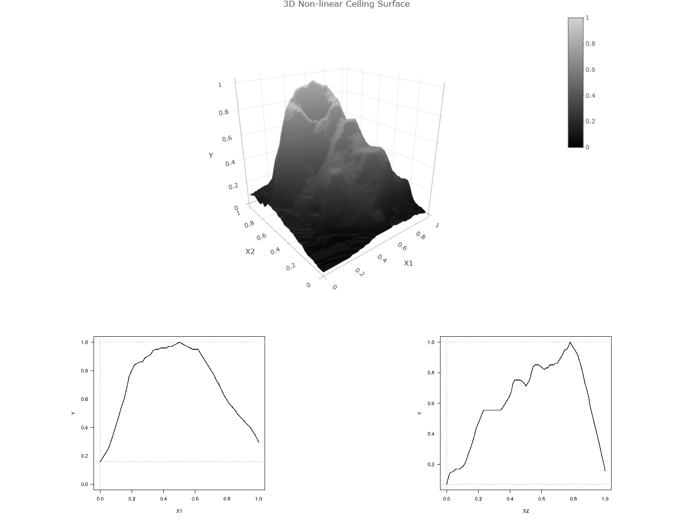
```
<br>  
  
<!-- The global maximum value of $Y$ is the height of the mountain, which depends on the two horizontal locations ($X_1$, $X_2$).   -->
  
For example, a point within the mountain can be identified by specific values of $X_1$, $X_2$ and $Y$. The height of the mountain is a *ceiling surface*, which is the set of points representing different mountain heights depending on specific values of $X_1$, $X_2$. The ceiling surface is a very complex function. NCA is not interested in modeling or estimating the multidimensional ceiling (maximum value of the outcome for given combinations of values of the conditions). In contrast, NCA takes the projection of a multidimensional ceiling onto each $X_jY$-plane, resulting in separate ceiling lines for each condition. This projected overall ceiling line in an $X_jY$-plane represents the global necessity of the single condition $X_j$ for outcome $Y$ and is interpreted independently of other conditions and the rest of the causal structure. It is assumed that this global necessity (overall ceiling line) manifests in the real world and can be observed in the empirical (natural) distribution.

The projections of the three-dimensional ceiling surface of the volcano mountain on the $XY$-planes result in non-linear ceiling lines (Figure \@ref(fig:multivariatenonlinearfig)). When the three-dimensional ceiling surface is linear (e.g., $Y = X_1 + X_2$), the projections result in linear ceiling lines, as shown in Figure \@ref(fig:multivariatelinearfig).

```{r multivariatelinearfig, echo=FALSE, fig.cap='A linear multivariate three-dimensional ceiling ($Y = X_1 + X_2$) and its projections on the $X_1Y$- and $X_2Y$-planes (linear ceiling lines).', out.width='99%', fig.align='center'}
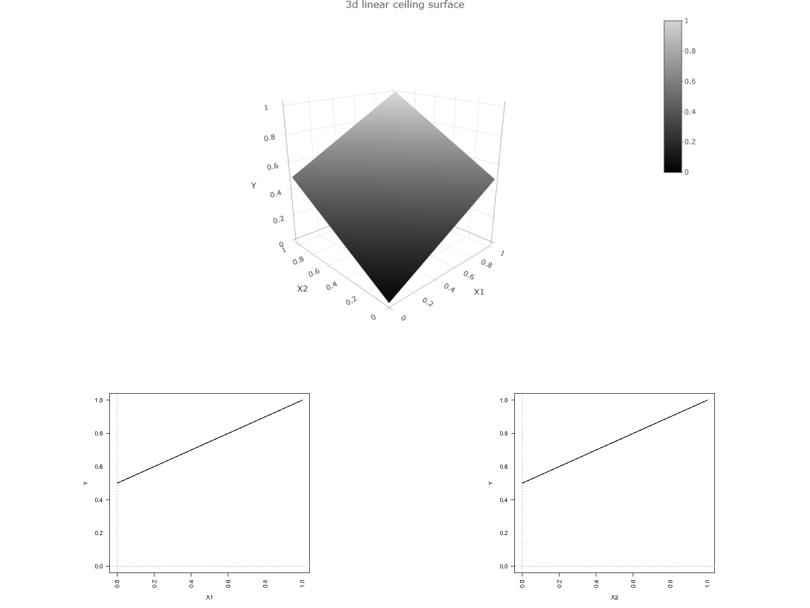
```


In a multidimensional space, NCA considers one projection at a time and therefore one condition at a time. With several conditions, NCA conducts successive analyses by considering the ceilings in the separate $X_jY$-planes. For example, with two conditions ($X_1$ and $X_2$), two separate analyses are performed: one in the $X_1Y$-plane and one in the $X_2Y$-plane. In geometric terms, NCA places a ceiling surface over the data and takes its orthogonal projections onto the $X_1Y$- and $X_2Y$-planes. Each condition thus has its own ceiling line, $f_1(X_1)$ and $f_2(X_2)$. Consequently, for a given value $Y = y_c$ two conditions must be satisfied: $X_1 \geq x_{1c}$ AND $X_2 \geq x_{2c}$. Therefore, the maximum possible $Y = y_c$ for given values $X_1 = x_{1c}$, and $X_2= x_{2c}$ is

\begin{equation} 
(\#eq:math2)
y_c = min \{f_1(x_{1c}), f_2(x_{2c})\} 
\end{equation}

where $y_c$ is a particular outcome value, $x_{jc}$ is the necessary value of the $j$-th condition, and $f_j$ is the ceiling line of condition $X_j$.

With more than two conditions, there is a multidimensional ceiling with projections $f_j(X_j)$. 

The mathematical description of a necessity AND-combination of multiple necessary conditions is as follows: for achieving an outcome level $Y = y_c$, all conditions must satisfy $X_j \geq x_{jc}$. The maximum possible value of the outcome $Y = y_c$ for given values $X_j = x_{jc}$ is

\begin{equation} 
(\#eq:math3)
y_c = min_{j=1,\ldots,J} \{ f_j(x_{jc}) \}
\end{equation}


Here, $y_c$ is a particular outcome value, $x_{jc}$ is the necessary value of the $j$-th condition, and $f_j$ is the ceiling line associated with condition $X_j$.

Although NCA performs separate analyses for each condition, these analyses are combined and considered jointly in NCA’s bottleneck table (Section \@ref(bottleneck)). This allows answering questions such as: “What levels $x_{jc}$ of $X_j$ are necessary for a particular level $Y = y_c$?” and “For given levels $x_{jc}$ of $X_j$, what is the maximum possible level $y_c$ of $Y$?”

### Arguments for single condition analyses

There are several reasons why NCA analyzes projections of the multidimensional ceiling.

* The _first_ reason is the fundamental choice to focus on single factors that are necessary for an outcome. This distinguishes NCA from conventional analyses that study multi-causal phenomena by considering combinations of factors and their joint effects. A multivariate analysis is the realistic option for predicting the presence of an outcome, because often only a combination of factors (and not a single factor) can produce the outcome. In the case of necessity, however, it is realistic and often theoretically sound to propose that a single factor (a necessary condition as a bottleneck) can prevent the outcome from occurring. Therefore, it is possible and useful to study the necessity of single factors for an outcome using projections.

* The _second_ reason is that NCA makes statements about single factors that are necessary independently of other factors in the natural distribution. Thus, the global necessity (with overall ceiling line) of a single factor does not depend on the level of other factors.^[When subsamples are drawn it is possible that the ceiling for the subgroup is lower than the ceiling of the total group, but the ceiling can never be higher. This subgroup ceiling may represent a different necessity theory with a different theoretical domain, see Section \@ref(confounding) and Chapter \@ref(hypothesisformulation).] This allows for a “pure” and straightforward interpretation of necessity: “the factor is necessary” rather than “the factor is necessary depending on other factors.” Such pure necessity statements hold independently of other factors. However, the context in which a necessity statement holds is usually not unlimited. The domain in which the necessary condition is assumed to apply must be defined as the *theoretical domain* of the necessity theory (Chapter \@ref(theory)). Such a specification of the theoretical domain must be part of any necessity theory and related formal hypotheses (Chapter \@ref(hypothesisformulation)).

* A _third_ reason is that NCA aims to contribute to parsimonious (simple) theories by avoiding complexity that makes theories difficult to understand and less useful. This is a general goal of theory building in applied sciences. NCA provides an elegant way of reducing complexity, particularly in situations where it is hard or impossible to predict the outcome (e.g., when the explained variances of regression models are low or when accurate prediction require very complex models).

* The _fourth_ reason is that practical recommendations derived from single necessary conditions are immediately clear and useful: to achieve a target outcome, all necessary conditions must be satisfied; otherwise, failure of this outcome is guaranteed. The absence of a necessary condition cannot be compensated by other factors, including other necessary conditions.

* The _final_ reason is that identifying single necessary conditions is more efficient when using multiple analyses of planes (i.e., several ceiling lines) than when conducting a single analysis of a multidimensional space (i.e., one multidimensional ceiling) followed by projection. Modeling and describing a multidimensional ceiling can be complex (e.g., Figure \@ref(fig:multivariatenonlinearfig)). Such a modeling corresponds to *frontier analysis* (Section \@ref(mathematicalestimation)), which aims to predict the maximum outcome for a given combination of factors. In contrast, NCA describes the maximum possible outcome for a single condition and can therefore focus *directly* on the $XY$-planes and their ceiling lines.

<!-- With more than two conditions there is a multidimensional ceiling with projections $f_j(X_j)$.  -->

<!-- The mathematical description of a necessity AND-combination of multiple necessary conditions is: $X_j \geq x_{jc}$ for $Y = y_c$ and the maximum possible  $Y = y_c$ for given values of $X_j = x_{jc}$  is   -->


<!-- \begin{equation}  -->
<!-- (\#eq:math3) -->
<!-- y_c =  min \{f_j(X_j)\} -->
<!-- \end{equation} -->

<!-- where $y_c$ is a particular outcome value, $x_{jc}$ is the necessary $X$-value of the j-th condition, $f_j$ is the ceiling line of the j-th condition and $C$ is a point on the ceiling line. -->

<!-- Although NCA performs separate analyses for each condition, in NCA’s bottleneck table (see Section  \@ref(bottleneck)), the separate analyses are combined and considered in combination. This allows answering the question: “What levels $x_{jc}$ of $X_j$ are necessary for a particular level $Y = y_c$”? or “For given levels $x_{jc}$ of $X_j$ what is the maximum possible level $y_c$ of $Y$”? -->

<!-- There are several reasons why NCA analyses projections of the multidimensional ceiling.  -->

<!-- * The _first_ reason is the fundamental choice to focus on single factors that are necessary for an outcome. This makes NCA different from conventional analyses. Conventional approaches study multi-causal phenomena by considering a combination of factors and their interplay as a whole. A multivariate analysis is the realistic option for predicting the presence of an outcome, because normally only a combination of factors and not a single factor can produce the outcome. In the case of necessity, however, it is realistic and (often) theoretically sound to propose that a single factor (the necessary condition or bottleneck) can prevent the outcome to occur. Therefore, it is possible and useful to study the necessity of single factors for an outcome with projections. -->

<!-- * The _second_ reason is that NCA makes statements about single factors that are necessary independently of other factors. Thus, the necessity of a single factor does not depend on the level of other factors. This allows for a “pure” and straightforward interpretation of necessity: “the factor is necessary” rather than “the factor is necessary depending on other factors”. Such pure necessity statement holds independently of other factors. However, the context where a necessity statement holds is usually not unlimited. The domain where the generic necessary condition is supposed to hold must be defined as the ‘theoretical domain’ of the necessity theory (see Chapter \@ref(theory)). Such specification of the theoretical domain (sometime called “scope conditions”) must be part of any theory and related hypotheses (for further discussion and examples, see @dul2020book).  -->

<!-- * A _third_ reason is that NCA wants to contribute to parsimonious (simple) theories: avoiding that theories become complex, not understandable and (thus) less useful. This is a general goal of theory building in applied sciences. NCA is an elegant way of reducing complexity, in particular in situations where it is hard or impossible to predict the outcome (e.g., when the explained variance of regression models is low) or when a good prediction is only possible with a very complex model.  -->

<!-- * The _fourth_ reason is that practical recommendations from identified single necessary conditions are immediately clear and useful: for having a certain outcome always satisfy all necessary conditions otherwise there is guaranteed failure of the outcome. The absence of a necessary conditions cannot be compensated by other factors, including other necessary conditions. -->

<!-- * The _final_ reason is that the search for single necessary conditions is more efficient with a multiple analyses of planes (several ceiling lines) than with a single analysis of a multidimensional space (one multidimensional ceiling) followed by taking the projections on the planes. Modeling and describing a multidimensional ceiling may be complex (e.g., Figure \@ref(fig:multivariatenonlinearfig)). Describing a multidimensional ceiling is doing ‘frontier analysis’ (for an explanation see Section \@ref(mathematicalestimation)): predicting the maximum outcome for a given combination of factors. NCA describes the maximum possible outcome for a single condition and therefore can focus *directly* on the $XY$-planes and the ceiling line. -->

<!-- When NCA was introduced [@dul2016orm] the term _multivariate NCA_ was used for a necessary condition analysis with more than one condition. However recently [@dul2020book] this term was replaced by _multiple NCA_ or _multiple bivariate NCA_ to avoid confusion about the interpretation of ‘multivariate’. The term multivariate is somewhat loosely used in statistics. The Cambridge Dictionary of Statistics [@everitt2010encyclopedia, pp. 293-294]  gives a broad definition, stating that a multivariate analysis is a ‘generic term for the many methods of analysis important in investigating multivariate data’, and that multivariate data are ‘data for which each point consists of values for more than one random variable.’ Following this definition, a univariate analysis is an analysis with one variable, and a bivariate analysis is a special case of multivariate analysis with two variables. In the 2016 article [@dul2020book] the term bivariate NCA was used for an analysis with one condition (and one outcome) and the term ‘multivariate NCA’ for an analysis with more than one condition (and one outcome). This terminology fits the above definition of multivariate. In the article multivariate NCA was presented as an analysis of several conditions one by one.  -->

<!-- The ceiling line for each condition is analysed separately in its two-dimensional plane (e.g., $X_1Y$, $X_2,Y$, $X_3Y$, etc.).  For example, with two conditions and assuming straight ceiling lines the ceiling line for $X_1$ is $Y = a_1 + b_1X_1$ (in the $X_1Y$-plane) and the ceiling line for $X_2$ is $Y = a_2 + b_2X_2$ (in the $X_2Y$-plane). Because each ceiling line is analysed separately the scatter plots of $X_1Y$ and $X_2Y$ can be used to conduct NCA. In NCA’s bottleneck table, the two separate analyses and ceiling lines are considered in combination when answering the question: “What levels of $X_1$ and $X_2$ are necessary for a given level of $Y$”? or “For given levels of $X_1$ and $X_2$ what is the maximum possible level of $Y$”. -->

<!-- ‘Multivariate NCA is often interpreted as a single analysis with several variables at the same time. For example, in regression analysis a ‘multivariate analysis’ is understood as an analysis of multiple variables at the same time in one model (e.g., regression surface: $Y = a + b_1*X_1 + b_2*X_2+ ….b_i*X_i + \epsilon)$. However, such combined analysis is not used in NCA.  -->

<!-- NCA does not analyse a multi-dimensional ceiling in the multidimensional space (e.g., ceiling surface $Y = a + b_1X_1 + b_2X_2  + ….b_iX_i )$. NCA analyses single ceiling lines in multiple two dimensional planes (e.g., ceiling line 1:  $Y = a_1 + b_1X_1$  and ceiling line 2:  $Y = a_2 + b_2X_2$, ceiling line i:  $Y = a_i + b_iX_i$) . As shown in Figure \@ref(fig:multivariatelinear), with two conditions there is a 3D ceiling surface in the three-dimensional space (X1,X2,Y, Figure \@ref(fig:multivariatelinear), left) and NCA analyses the corresponding two ceiling lines in the two two-dimensional planes ($X_1Y$ and $X_2Y$, Figure \@ref(fig:multivariatelinear1, right. -->

<!-- ```{r multivariatelinear, echo=FALSE, fig.cap='A linear multivariate three-dimensional ceiling ($Y = X_1 + X_2$) and its projection on the two two-dimensional $XY$-planes (ceiling lines in $X_1Y$-plane and in $X_2Y$-plane).', out.width='100%', fig.align='center'} -->
<!--  knitr::include_graphics("multivariate linear.png") -->
<!-- ``` -->


<!-- %%START FIGURE mathematics1 in LATEX -->
<!-- \begin{figure}[ht] -->
<!-- \centering -->
<!-- \begin{tikzpicture}[domain=0:4.5,scale=1.0] -->

<!-- %% define Y values of points on ceiling line -->
<!-- \pgfmathsetmacro{\myvalue}{0.8 + 1.0 * 3}%f(X) = 0.8 + 0.7 *X -->
<!-- \pgfmathsetmacro{\highvalue}{0.8 + 1.0 * 4.5} -->

<!-- %% fill feasible area -->
<!-- \fill[gray!20] (0,0) -- (0,0.8) -- (4.5, \highvalue) -- (4.5, 0); -->
<!-- \fill[gray!20] (4.5,0) -- (4.5,\highvalue) -- (6.5, \highvalue) -- (6.5,0); -->

<!-- %% coordinate system -->
<!-- \draw[->] (-0.2,0) -- (7.5,0) node[right] {$X$}; -->
<!-- \draw[->] (0,-0.2) -- (0,6) node[above] {$Y$}; -->

<!-- %% draw xmax and ymax -->
<!-- \draw (6.5,\highvalue) -- (0,\highvalue); %% y=ymax -->
<!-- \draw (6.5,\highvalue) -- (6.5,0); %% x=xmax -->

<!-- %% ceiling line -->
<!-- \draw[color=black,thick] plot (\x,{0.8 + 1.0* \x})node[above] {$f_{c}$}; -->

<!-- %%\draw[color=black,thick](4.5,\highvalue) -- (6.5,\highvalue); -->

<!-- %% define point P on ceiling line -->
<!-- \coordinate (p) at (3,\myvalue); -->
<!-- \coordinate (x) at (3,0); -->
<!-- \coordinate (px) at (3,-0.2); -->
<!-- \coordinate (xp) at (4.1,0); -->
<!-- \coordinate (y) at (0,\myvalue); -->
<!-- \coordinate (py) at (-0.2,\myvalue); -->
<!-- \coordinate (yp) at (0,\myvalue+1.15); -->
<!-- \draw[->] (0,-0.2) -- (0,6); -->

<!-- %% add labels  -->
<!-- \draw (6.5,0) -- node[at end, below=1mm] {$x_{\text{\max}}$} (6.5,-0.2); %% label xmax -->
<!-- \draw (0,\highvalue) -- node[at end, left=1mm] {$y_{\text{\max}}$} (-0.2,\highvalue); %% label ymax -->
<!-- \draw (0,0) -- node[at end, below=1mm] {$x_{\text{\min}}$} (0,-0.2); %% xmin -->
<!-- \draw (0,0) -- node[at end, left=1mm] {$y_{\text{\min}}$} (-0.2,0); %% label ymin -->

<!-- %% draw xc and yc and labels -->
<!-- \draw[color=black,very thin,dashed] (x) -- (p) (p) -- (y); -->
<!-- \draw (x) -- node[at end, below=1mm] {$x_{\text{c}}$} (px); -->
<!-- \draw (y) -- node[at end, left=1mm] {$y_{\text{c}}$} (py); -->

<!-- \filldraw[black] (p) circle (2pt) node[above left] {$C$}; -->

<!-- \end{tikzpicture} -->
<!-- \caption{Linear ceiling line $f_{c}$. The line divides the feasible area (gray) from the empty area (white). $C$ is a point on the ceiling line: $Y = y_c$ is only possible if $X \geq x_c$.} -->
<!-- \label{fig:mathematics1fig} -->
<!-- \end{figure} -->
<!-- END FIGURE in LATEX -->

<!-- ####START ADD LATEX FIGURE mathematics2 STEP FUNCTION --> 
<!-- \begin{document} -->

<!-- \begin{figure}[ht] -->
<!-- \centering -->
<!-- \begin{tikzpicture}[domain=0:4.5,scale=1.0] -->

<!-- %% fill feasible area (gray area under the step function). This code first to avoid gray area to overlap axes -->
<!-- \fill[gray!20](0,0) -- (0,1.5) -- (1,1.5) -- (1,2.3) -- (2.7,2.3) -- (2.7,3) -- (4,3) -- (4,5) -- (5.5,5) -- (5.5,6) -- (6.5,6) -- (6.5,0); -->

<!-- %% coordinate axes with arrows -->
<!-- \draw[->] (-0.2,0) -- (7.5,0) node[right] {$X$}; %% from left to right -->
<!-- \draw[->] (0,0) -- (0,7) node[above] {$Y$}; %% from bottom to top -->

<!-- %% draw vertical line at x = xmax and horizontal line at y = ymax [highvalue = 6] -->
<!-- \draw (6.5,6) -- (6.5,0); %% x=xmax from top to bottom -->
<!-- \draw (6.5,6) -- (0,6); %% y=ymax from right to left -->

<!-- %% add axis labels xmin xmax ymin ymax -->
<!-- \draw (0,0) -- node[at end, below=1mm] {$x_{\text{\min}}$} (0,-0.2); %% xmin -->
<!-- \draw (6.5,0) -- node[at end, below=1mm] {$x_{\text{\max}}$} (6.5,-0.2); %% label xmax -->
<!-- \draw (0,6) -- node[at end, left=1mm] {$y_{\text{\max}}$} (-0.2,6); %% label ymax -->
<!-- \draw (0,0) -- node[at end, left=1mm] {$y_{\text{\min}}$} (-0.2,0); %% label ymin -->

<!-- %% ceiling line (dashed, stepwise linear connecting the steps) -->
<!-- %%%%\draw[color=black,dashed] (0,0.2) -- (0.25,0.5) -- (0.5,0.75) -- (0.75,1) -- (1,1); -->

<!-- %% add ceiling line name fc -->
<!-- \draw[color=black,thick] plot (5.5,6)node[above] {$f_{c}$}; -->

<!-- %% step function -->
<!-- \draw[color=black,thick] (0,0) -- (0,1.5) -- (1,1.5) -- (1,2.3) -- (2.7,2.3) -- (2.7,3) -- (4,3) -- (4,5) -- (5.5,5) -- (5.5,6); -->

<!-- %% draw xc and yc and labels -->
<!-- \draw[color=black,very thin,dashed] (0,4.5) -- (4,4.5) -- (4,0); -->
<!-- \draw[color=black,thick] plot (-0.2,4.5)node[left=1mm] {$y_{\text{c}}$}; %% label yc -->
<!-- \draw (4,0) -- node[at end, below=1mm] {$x_{\text{c}}$} (4,-0.2); %% alternative: add small vertical segment as tick CHECK   -->
<!-- \filldraw[black] (4,4.5) circle (2pt) node[above left] {$C$}; -->

<!-- %% draw points at the steps for better visibility -->
<!-- \filldraw[black] (0,1.5) circle (1.2pt) node[below right] {\scriptsize $0$}; -->
<!-- \filldraw[black] (1,1.5) circle (1.2pt) node[below right ] {\scriptsize $1$}; -->
<!-- \filldraw[black] (1,2.3) circle (1.2pt) node[below right] {\scriptsize $1a$}; -->
<!-- \filldraw[black] (2.7,2.3) circle (1.2pt) node[below right] {\scriptsize $2$}; -->
<!-- \filldraw[black] (2.7,3) circle (1.2pt) node[below right] {\scriptsize $2a$}; -->
<!-- \filldraw[black] (4,3) circle (1.2pt) node[below right] {\scriptsize $3$}; -->
<!-- \filldraw[black] (4,5) circle (1.2pt) node[below right] {\scriptsize $3a$}; -->
<!-- \filldraw[black] (5.5,5) circle (1.2pt) node[below right] {\scriptsize $4$}; -->
<!-- \filldraw[black] (5.5,6) circle (1.2pt) node[below right] {\scriptsize $4a$}; -->
<!-- %%\draw[color=black,thick] plot (6.5,6)node[below right] {\scriptsize $5$}; -->

<!-- \end{tikzpicture} -->
<!-- \caption{stepwise linear ceiling line $f_{c}$ connects the edges of a step function from point 0 to point 4a. The line divides the feasible area (gray) from the empty area (white). $C$ is a point on the ceiling line: $Y = y_c$ is only possible if $X \geq x_c$.} -->
<!-- \label{fig:mathematics2} -->
<!-- \end{figure} -->

<!-- ####END ADD LATEX FIGURE STEP FUNCTION --> 


``` {r 3dlinearcode, warning=FALSE, message=FALSE,  eval=FALSE, echo=FALSE, include=FALSE}
#3D surface plot and ceiling lines
library("plotly")
library(ggplot2)
library("NCA")


################ Figure 1 Linear
# define x and y axes
x <- y <- seq(0, 1, length= 20)

#define 3D surface function
d3 <- function(x, y){
  #equation for surface
  (x + y)/2 #this is used in book
  #x^2 + y^2
  #x^2 + y^2 +x*y
  #sqrt(y)+x # 
  #sqrt(x)-y^2
  #sqrt(x)-y^2 - x*y
  #(x - x^2 + y - 0.5*y^2) + x*y
  #x^2 +y #
  #sqrt(x^2+y^2) #cone
  #a <- 0.25; x^a*y^(1-a) # Cobb-Douglas
  #x^2 + y - 0.5*x*y
}

# Generate z values based on the surface equation
z <- outer(x, y, d3)
# data <- data.frame (x,y,z) 
# model <- nca_analysis (data, 1:2,3) 
# model
# nca_output(model, plots=T, plotly = T)

#change surface locally; may be seen or not in xz or yz-plane 
#z[c(5:10),10:17] <- z[c(5:10),10:17]-0.3
#z[c(5:10),10:17] <- z[c(5:10),10:17]+0.3 
#z[c(5:10),10:17] <- z[c(5:10),10:17]+0.5 
#z[c(10:15),10:17] <- z[c(10:15),10:17]+0.3 

#plot 3D surface using plotly
persp(x, y, z)
#fig <- plot_ly(x = x, y = y, z = z, type = "surface", width = 600, height = 600)
#fig <- plot_ly(x = x, y = y, z = z, type = "surface")
fig <- plot_ly(x = x, y = y, z = z, type = "surface",
                colorscale = list(
                  list(0, "black"),
                  list(1, "lightgray")
                ))

fig <- fig %>% layout(
  title = "3d linear ceiling surface",
  scene = list(
    xaxis = list(title = "X1"),
    yaxis = list(title = "X2"),
    zaxis = list(title = "Y")
  ))

#resize
m <- list(
  l = 50,
  r = 50,
  b = 100,
  t = 100,
  pad = 4
)
#fig <- fig %>% layout(autosize = F, width = 300, height = 400, margin = m)

# Helper function to launch HTML widget
print.htmlwidget <- function(widget){
  temp_file <- paste(tempfile('widget'), 'html', sep = '.')
  htmlwidgets::saveWidget(widget, temp_file, selfcontained = FALSE)
  shell(sprintf("start chrome -app=file://%s", temp_file))
}

fig

#find ceiling lines in xz and yz-planes
#xz projection
c1 = NULL
for(i in 1:ncol(z)) {c1[i]=max(z[,i])}
c1
pdf("xz projection_linear.pdf")
plot(x,c1,xlab = "X1", ylab="Y",col = "white", xaxt="n", yaxt="n", ylim = c(0,1))
axis(1, at = seq(0, 1, by = 0.2), las=2)
axis(2, at = seq(0, 2, by = 0.2), las=2)
abline(v=c(0,1), col=c("grey", "grey"), lty=c(2,2))
abline(h=c(0,2), col=c("grey", "grey"), lty=c(2,2))
#fit <- lm(c1 ~ x^2)
#abline(fit)
lines(x[order(x)], c1[order(x)], xlim=range(x), ylim=range(c1), pch=16,, lwd = 2)
dev.off()

#yz projection
c2 = NULL
for(i in 1:nrow(z)) {c2[i]=max(z[i,])}
c2
pdf("yz projection_linear.pdf")
plot(x,c2,xlab = "X2", ylab="Y",col = "white", xaxt="n", yaxt="n", ylim = c(0,1))
axis(1, at = seq(0, 1, by = 0.2), las=2)
axis(2, at = seq(0, 2, by = 0.2), las=2)
abline(v=c(0,1), col=c("grey", "grey"), lty=c(2,2))
abline(h=c(0,2), col=c("grey", "grey"), lty=c(2,2))
# fit <- lm(c2 ~ x )
# abline(fit)
lines(x[order(x)], c2[order(x)], xlim=range(x), ylim=range(c2), pch=16, , lwd = 2)
dev.off()
```

``` {r 3dnonlinearcode, warning=FALSE, message=FALSE,  eval=FALSE, echo=FALSE, include=FALSE}
#Combine the three plots

library(grid)
library(png)

# Function to read and rasterize PNG images
read_png_grob <- function(filename) {
  img <- readPNG(filename)
  rasterGrob(img, interpolate = TRUE)
}

# Create a layout for the plots with the first row higher than the second row
grid.newpage()
pushViewport(viewport(layout = grid.layout(2, 2, heights = unit(c(2, 1), "null"))))  # First row 2x the height of the second row

# Assign each plot to a layout cell
# Top plot (spans across both columns)
pushViewport(viewport(layout.pos.row = 1, layout.pos.col = 1:2))  # Span the top plot across both columns
grid.draw(read_png_grob("3Dlinear.png"))
popViewport()

# Bottom left plot
pushViewport(viewport(layout.pos.row = 2, layout.pos.col = 1))
grid.draw(read_png_grob("xz projection_linear.png"))
popViewport()

# Bottom right plot
pushViewport(viewport(layout.pos.row = 2, layout.pos.col = 2))
grid.draw(read_png_grob("yz projection_linear.png"))
popViewport()

# Save the combined plot with the adjusted layout and higher quality
png("combined_plot_linear.png", width = 1600, height = 1200, res = 300)  # Increase dimensions and set resolution
grid.newpage()  # Start a new page for the grid
pushViewport(viewport(layout = grid.layout(2, 2, heights = unit(c(1.5, 1), "null"))))  # First row 2x the height of the second row

# Redraw the plots for saving
pushViewport(viewport(layout.pos.row = 1, layout.pos.col = 1:2))  # Span the top plot across both columns
grid.draw(read_png_grob("3Dlinear.png"))
popViewport()

pushViewport(viewport(layout.pos.row = 2, layout.pos.col = 1))
grid.draw(read_png_grob("xz projection_linear.png"))
popViewport()

pushViewport(viewport(layout.pos.row = 2, layout.pos.col = 2))
grid.draw(read_png_grob("yz projection_linear.png"))
popViewport()

dev.off()  # Close the device
```


<!-- The _ceiling line_ is a line on top of the data in a $XY$-scatter plot (in a two-dimensional $XY$-plane. The ceiling line represents the maximum possible value of $Y$ for a given $X$.  A _multidimensional ceiling_ in the three-dimensional space is a ‘blanket’ on top of the data. The three-dimensional ceiling represents the maximum possible $Y$ for a given combination of $X_1$ and $X_2$. In a multidimensional space with more than two conditions, the multidimensional ceiling represents the maximum possible $Y$ for a given combination of all $X$’s, which cannot be graphically imagined. NCA’s ceiling lines are the projections of a multidimensional ceiling on the respective two-dimensional $XY$-planes.--> 


<!-- ```{r multivariatenonlinear, echo=FALSE, fig.cap='A nonlinear three-dimensional ceiling (mountain surface) and its projection (“shadow”) on two two-dimensional $XY$-planes (non-linear ceiling lines). ', out.width='100%', fig.align='center'} -->
<!-- knitr::include_graphics("multivariate nonlinear.png") -->
<!-- ``` -->

``` {r 3dnonlinearcode1, warning=FALSE, message=FALSE,  eval=FALSE, echo=FALSE, include=FALSE}

# Load volcano dataset
data("volcano")

# Normalize the volcano data (Z values) between 0 and 1
volcano_normalized <- (volcano - min(volcano)) / (max(volcano) - min(volcano))

# Rename matrix
data <- volcano_normalized

# Flip the columns (reverse column order)
datav <- data[, ncol(data):1]

# Flip the rows (reverse row order)
datavv <- datav[nrow(datav):1, ]

# Find the absolute minimum value in datavv
abs_min_z <- min(datavv)
abs_min_z  # Display the minimum value

# Subtract the minimum value from each element in datavv to create datavvv
datavvv <- datavv - abs_min_z
```


``` {r 3dnonlinearcode2, warning=FALSE, message=FALSE,  eval=FALSE, echo=FALSE, include=FALSE}
# Sample points below the 3D surface
set.seed(123)

# Number of random samples
n_samples <- 100

# Generate random x and y coordinates
random_x <- sample(1:ncol(datavvv), n_samples, replace = TRUE)  # Random x between 1 and number of columns
random_y <- sample(1:nrow(datavvv), n_samples, replace = TRUE)  # Random y between 1 and number of rows

# Get corresponding maximum z values from the surface
max_z <- datavvv[cbind(random_y, random_x)]  # Use matrix indexing to get the max z at (x, y)

# Generate random z values below the surface
random_z <- runif(n_samples, min = 0, max = max_z)  # Ensure z is below the surface

# Combine into a data frame
sampled_data <- data.frame(x = random_x, y = random_y, z = random_z)
colnames(sampled_data) <- c("X1" , "X2", "Y")
```

``` {r 3dnonlinearcode3, warning=FALSE, message=FALSE,  eval=FALSE, echo=FALSE, include=FALSE}
# Create z, x, and y for the 3D surface plot
z <- datavvv
x <- seq(1, ncol(z), by = 1) #61 values
y <- seq(1, nrow(z), by = 1) #87 values

# Normalize X and Y coordinates between 0 and 1
x_normalized <- (x - min(x)) / (max(x) - min(x))
y_normalized <- (y - min(y)) / (max(y) - min(y))

# Create 3D surface plot using plotly
library(plotly)
library(ggplot2)
figv <- plot_ly(x = x_normalized, y = y_normalized, z = z, type = "surface",
                colorscale = list(
                  list(0, "black"),
                  list(1, "lightgray")
                ))

# Customize layout with axis titles
figv <- figv %>% layout(
  title = "3D Non-linear Ceiling Surface",
  scene = list(
    xaxis = list(title = "X1"),
    yaxis = list(title = "X2"),
    zaxis = list(title = "Y")
  ))

# Display the plot
figv

#Manually rotate and save the plot as .png. (Download under camera pictogram)

# Helper function to launch HTML widget
print.htmlwidget <- function(widget){
  temp_file <- paste(tempfile('widget'), 'html', sep = '.')
  htmlwidgets::saveWidget(widget, temp_file, selfcontained = FALSE)
  shell(sprintf("start chrome -app=file://%s", temp_file))
}

figv
```

``` {r 3dnonlinearcode4, warning=FALSE, message=FALSE,  eval=FALSE, echo=FALSE, include=FALSE}
# XZ projection
zx1 <- apply(z, 2, max)  # Maximum z-values for each x
pdf("xz projection_nonlinear.pdf")
plot(x_normalized, zx1, xlab = "X1", ylab = "Y", col = "white", xaxt = "n", yaxt = "n", xlim = c(0, 1), ylim = c(0, 1))
axis(1, at = seq(0, 1, by = 0.2), las = 0)
axis(2, at = seq(0, 1, by = 0.2), las = 2)
abline(v = c(min(x_normalized), max(x_normalized)), col = "grey", lty = 2)
abline(h = c(min(zx1), max(zx1)), col = "grey", lty = 2)
lines(x_normalized[order(x_normalized)], zx1[order(x_normalized)], col = "black", lwd = 2)
dev.off()

# # Add sampled points to the XZ projection
# points(sampled_data$X1, sampled_data$Y, col = "blue", pch = 16)
# labels <- paste("", seq_len(n_samples))  # Generate case labels
# #text(sampled_data$X1, sampled_data$Y, labels = labels, pos = 3, cex = 0.7, col = "blue")

# YZ projection
zx2 <- apply(z, 1, max)  # Maximum z-values for each y
pdf("yz projection_nonlinear.pdf")
plot(y_normalized, zx2, xlab = "X2", ylab = "Y", col = "white", xaxt = "n", yaxt = "n")
axis(1, at = seq(0, 1, by = 0.2), las = 0)
axis(2, at = seq(0, 1, by = 0.2), las = 2)
abline(v = c(min(y_normalized), max(y_normalized)), col = "grey", lty = 2)
abline(h = c(min(zx2), max(zx2)), col = "grey", lty = 2)
lines(y_normalized[order(y_normalized)], zx2[order(y_normalized)], col = "black", lwd = 2)
dev.off()

# # Add sampled points to the YZ projection
# points(sampled_data$X2, sampled_data$Y, col = "blue", pch = 16)
# labels <- paste("", seq_len(n_samples))  # Generate case labels
# #text(sampled_data$X1, sampled_data$Y, labels = labels, pos = 3, cex = 0.7, col = "blue")
```

``` {r 3dnonlinearcode5, warning=FALSE, message=FALSE,  eval=FALSE, echo=FALSE, include=FALSE}
#Combine the three plots

library(grid)
library(png)

# Function to read and rasterize PNG images
read_png_grob <- function(filename) {
  img <- readPNG(filename)
  rasterGrob(img, interpolate = TRUE)
}

# Create a layout for the plots with the first row higher than the second row
grid.newpage()
pushViewport(viewport(layout = grid.layout(2, 2, heights = unit(c(2, 1), "null"))))  # First row 2x the height of the second row

# Assign each plot to a layout cell
# Top plot (spans across both columns)
pushViewport(viewport(layout.pos.row = 1, layout.pos.col = 1:2))  # Span the top plot across both columns
grid.draw(read_png_grob("3Dsurface_nonlinear.png"))
popViewport()

# Bottom left plot
pushViewport(viewport(layout.pos.row = 2, layout.pos.col = 1))
grid.draw(read_png_grob("xz projection_nonlinear.png"))
popViewport()

# Bottom right plot
pushViewport(viewport(layout.pos.row = 2, layout.pos.col = 2))
grid.draw(read_png_grob("yz projection_nonlinear.png"))
popViewport()

# Save the combined plot with the adjusted layout and higher quality
png("combined_plot_nonlinear.png", width = 1600, height = 1200, res = 300)  # Increase dimensions and set resolution
grid.newpage()  # Start a new page for the grid
pushViewport(viewport(layout = grid.layout(2, 2, heights = unit(c(1.5, 1), "null"))))  # First row 2x the height of the second row

# Redraw the plots for saving
pushViewport(viewport(layout.pos.row = 1, layout.pos.col = 1:2))  # Span the top plot across both columns
grid.draw(read_png_grob("3Dsurface_nonlinear.png"))
popViewport()

pushViewport(viewport(layout.pos.row = 2, layout.pos.col = 1))
grid.draw(read_png_grob("xz projection_nonlinear.png"))
popViewport()

pushViewport(viewport(layout.pos.row = 2, layout.pos.col = 2))
grid.draw(read_png_grob("yz projection_nonlinear.png"))
popViewport()

dev.off()  # Close the device
```

``` {r 3dnonlinearcodesampling, warning=FALSE, message=FALSE,  eval=FALSE, echo=FALSE, include=FALSE}
#Conduct NCA on the sampled data under the 3D surface
library(NCA)
model1 <- nca_analysis(sampled_data, c("X1" ,"X2"), "Y", corner = 1)
nca_output(model1)
model2 <- nca_analysis(sampled_data, c("X1" ,"X2"), "Y", corner = 2)
nca_output(model2)
```


<!-- NCA is not designed as a multivariate technique for analysing the multidimensional ceiling but as a method of analysing the bivariate ceiling lines. This has several related reasons.  -->


<!-- NCA is a an analysis of the two-dimensional plane of condition $X$ and outcome $Y$. In this book capital letters are used for (random) variables and lower case letters for specific values of the variables. When several condition are necessary for an outcome, NCA does a two-dimensional analysis for each necessary condition separately. The reason for this approach is explained in Section \@ref(multipleconditions).   -->
<!-- Figure \@ref(fig:formalmodel) shows the two-dimensional plane of condition $X$ and outcome $Y$.  -->


<!-- The basic mathematical expression of NCA is therefore: -->

<!-- \begin{equation}  -->
<!-- (\#eq:math0) -->
<!-- Y \leq f_c(x)  -->
<!-- \end{equation} -->
<!-- where $f_c(x)$ is the ceiling function.  -->


### Chain of necessity {#chain}

Normally, a necessary condition is hypothesized (Chapter \@ref(hypothesisformulation)) and analyzed (Chapter \@ref(dataanalysis)) as a necessity relationship between $X$ and $Y$. When multiple necessary conditions are proposed, several overall necessity relationships between $X_j$ and $Y$ may be hypothesized. In addition to such parallel necessary conditions, a serial system—a chain of necessity conditions—can also be hypothesized. In that case, an overall relationship $X_1 \rightarrow Y$ (if present) still holds, but it may be (partly) explained by an indirect chain $X_1 \rightarrow \cdots \rightarrow Y$.

Section \@ref(parsimonious) discussed, in general terms, a necessity theory consisting of a chain of necessary conditions (Figure \@ref(fig:fig4model)). For example, a certain amount of study time may be necessary for a certain level of knowledge retention (quiz score), which in turn may be necessary for a high exam grade. This section analyzes such a chain algebraically. Numerical examples are provided for a chain with two links.

#### Analysis of chain necessity

A general necessity chain consists of a sequence of necessary conditions: the first condition $X_1$, intermediate conditions $X_2, X_3, \ldots, X_J$, and the outcome $Y$:

(\#eq:ch1)
\begin{equation}
X_1 \rightarrow X_2 \rightarrow X_3 \rightarrow \cdots \rightarrow X_J \rightarrow Y
\end{equation}

Here, $J$ is the number of necessary conditions (and thus the chain has $J$ links ending in $Y$). For example, an additional intermediate necessary condition between study hours and quiz score could be active class participation (engagement, asking questions).

For each link, a ceiling function bounds the subsequent variable:

(\#eq:ch2)
\begin{equation}
X_{j+1} \le f_j(X_j), \quad j = 1,\ldots,J-1, \qquad
Y \le f_J(X_J).
\end{equation}

The chain ceiling $f_{\mathrm{chain}}(X_1)$ expresses the implied necessity of $X_1$ for $Y$ through the chain. It is defined as the composition of the link-specific ceiling functions:

(\#eq:ch3)
\begin{equation}
Y \le f_J\!\big(f_{J-1}(\cdots f_1(X_1)\cdots)\big)
= f_{\mathrm{chain}}(X_1).
\end{equation}

Here, $f_J(X_J)$ is the ceiling function of the last link.

The phrase “a chain is as strong as its weakest link” also applies to a necessity chain. If any link fails to represent a necessity relationship, the chain collapses, and $X_1$ is not necessary for $Y$ through the chain. This situation can occur, for example, when a link is sufficient but not necessary, or when a link is described only by an average effect or correlation without necessity.

Throughout, all variables are assumed to be min–max normalized, and all ceilings are defined within the same bounding box.

In the linear case with the unit square bounding box ($[0,1] \times [0,1]$), each link is described by a truncated linear ceiling:

(\#eq:effectsizechainceilinglinear1)
\begin{equation}
f_j(X_j) = \min(a_j + b_j X_j,\,1), \qquad j=1,\ldots,J.
\end{equation}

Here, $a_j$ is the intercept and $b_j$ is the slope. Assume that each link represents the standard case of necessity (a ceiling line on or above the diagonal in the unit square), i.e., $0<a_j<1$ and $1<a_j+b_j$.

The resulting chained ceiling is again linear:

(\#eq:effectsizechainceilinglinear2)
\begin{equation}
Y \le f_{\mathrm{chain}}(X_1) = a_{\mathrm{chain}} + b_{\mathrm{chain}}\,X_1.
\end{equation}

The chain intercept and slope are:

(\#eq:effectsizeachain)
\begin{equation}
a_{\mathrm{chain}} =
\sum_{j=1}^{J}
\left( a_j \prod_{k=j+1}^{J} b_k \right),
\end{equation}

(\#eq:effectsizebchain)
\begin{equation}
b_{\mathrm{chain}} = \prod_{j=1}^{J} b_j,
\end{equation}

with the convention that an empty product equals $1$.

For ceilings on or above the diagonal, $a_{\mathrm{chain}} \ge 1-b_{\mathrm{chain}}$, which implies $d_{\mathrm{chain}} \le \tfrac{1}{2}b_{\mathrm{chain}}$. In the unit square bounding box $[0,1]\times[0,1]$, the effect size of the (linear) chain ceiling $Y \le a_{\mathrm{chain}} + b_{\mathrm{chain}}X_1$ is:

(\#eq:effectsizechain)
\begin{equation}
d_{\mathrm{chain}} =
\begin{cases}
\dfrac{(1-a_{\mathrm{chain}})^2}{2\,b_{\mathrm{chain}}}, & \text{if } a_{\mathrm{chain}} < 1,\\[6pt]
0, & \text{otherwise.}
\end{cases}
\end{equation}

As shown in Equations \@ref(eq:effectsizeachain) and \@ref(eq:effectsizebchain), each intercept $a_j$ is weighted by the product of downstream slopes $b_{j+1},\ldots,b_J$, and the total intercept $a_{\mathrm{chain}}$ accumulates across the chain. As a result, composing multiple necessary conditions can shift the chain ceiling upward relative to a single link with a comparable slope. Consequently, the chain constraint can become less stringent and may even become non-binding. This explains why, even when each link has a positive effect size, the overall chain can yield a null effect of $X_1$ on $Y$ through the chain.

In other words, for ceilings on or above the diagonal within the bounding box, the “weakest link” principle extends to effect size: the chain effect size is less than or equal to the smallest link effect size.


<!-- ######################## -->
<!-- Normally, a necessary condition is hypothesized (Chapter \@ref(hypothesisformulation)) and analyzed (Chapter \@ref(dataanalysis)) as the necessity relationship between $X$ and $Y$. For multiple necessary conditions, multiple overall necessity relationships between $X_j$ and $Y$ are hypothesized. However, next to parallel necessary conditions, a serial system consisting of  a chain of necessity conditions can also be hypothesized. The overall $X_1 \rightarrow Y$ relationship (if present) always holds, but it may be (partly) explained by a chain of necessity $X_1 \rightarrow \cdots \rightarrow Y$. -->

<!-- Section \@ref(parsimonious) has discussed, in general terms, a necessity theory consisting of a chain of necessary conditions (Figure \@ref(fig:fig4model)). For example, a certain amount of study time is necessary for a certain level of knowledge retention (good quiz score), which in turn is necessary for a high exam grade. This section analyzes the chain of necessity algebraically for a chain of necessary conditions. Numerical examples are shown for a chain with two links. -->

<!-- <!-- (a  of $X$ on $Y$ could be explained by an indirect effect via a chain of necessary conditions,  . effect of $X$ on $Y$ where the chain   can be used to evaluate if a observed direct necessity of of direct a direct effect of the first condition on the outcome is added to the indirect effect via the chain. -->

<!-- #### Analysis of chain necessity -->
<!-- The general necessity chain consists of a series of necessary conditions: the first necessary condition $X_1$, then intermediate necessary conditions $X_2, X_3, \ldots, X_J$, and finally the outcome $Y$, with the sequence: -->

<!-- \begin{equation} -->
<!-- (\#eq:ch1) -->
<!-- X_1 \rightarrow X_2 \rightarrow X_3 \rightarrow \cdots \rightarrow X_J \rightarrow Y -->
<!-- \end{equation}  -->

<!-- where $J$ is the number of necessary conditions (and this the chain has $J$ links ending in $Y$). -->
<!-- For example, an additional intermediate necessary condition between study hours and quiz score could be active class participation (engagement, asking questions).  -->

<!-- For each link, a ceiling function bounds the subsequent variable: -->

<!-- <!-- \begin{equation} -->
<!-- <!-- (\#eq:ch2) -->
<!-- <!-- X_{j+1} \;\le\; f_j(X_j), \qquad j=1,2,\ldots,J-1, -->
<!-- <!-- \end{equation} -->

<!-- (\#eq:ch2) -->
<!-- \begin{equation} -->
<!-- X_{j+1} \le f_j(X_j), \quad j = 1,\ldots,J-1, \qquad -->
<!-- Y \le f_J(X_J). -->
<!-- \end{equation} -->


<!-- The chain ceiling $f_{\mathrm{chain}}(X_1)$ is the necessity of $X_1$ for $Y$ via the chain. It is the composition: -->

<!-- \begin{equation} -->
<!-- (\#eq:ch3) -->
<!-- Y \;\le\; f_J\!\big(f_{J-1}(\cdots f_1(X_1)\cdots)\big) -->
<!-- \;\;=\;\; f_{\mathrm{chain}}(X_1). -->
<!-- \end{equation} -->

<!-- where $f_J(X_J)$ is the ceiling function of the last link. -->

<!-- The general phrase "the chain is as strong as the weakest link" applies also to the necessity chain. If one of the links is not necessary, the necessity chain collapses and $X_1$ is not necessary for $Y$ via the chain. This applies, for example, when one link is sufficient but not necessary, or when a link is described as an average effect or a correlation without necessity.   -->
<!-- It is assumed that all variables are min–max normalized and all ceilings are in the same bounding box. -->

<!-- In the linear case with the unit square bounding box ($[0,1] \times [0,1]$): -->

<!-- <!-- \begin{equation} -->
<!-- <!-- (\#eq:effectsizechainceilinglinear1) -->
<!-- <!-- f_j(X_j) \;=\; \min(a_j + b_j X_j,1),  -->
<!-- <!-- \qquad Y\le \min(a_j + b_j X_j,1),  -->
<!-- <!-- \qquad j=1,\ldots,J, -->
<!-- <!-- \end{equation} -->

<!-- (\#eq:effectsizechainceilinglinear1) -->
<!-- \begin{equation} -->
<!-- f_j(X_j) \;=\; \min(a_j + b_j X_j,\,1), \qquad j=1,\ldots,J, -->
<!-- \end{equation} -->


<!-- where $a_j$ is the intercept and $b_j$ is the slope.  -->

<!-- Assuming that  each link is the standard case of necessity (ceiling line above the diagonal in the unit square), i.e., $0<a_j<1$ and $1 <a_j+b_j$ -->

<!-- The chained ceiling is again linear: -->

<!-- \begin{equation} -->
<!-- (\#eq:effectsizechainceilinglinear2) -->
<!-- Y \;\le\; f_{\mathrm{chain}}(X_1) \;=\; a_{\mathrm{chain}} + b_{\mathrm{chain}}\,X_1, -->
<!-- \end{equation} -->

<!-- where -->
<!-- \begin{equation} -->
<!-- (\#eq:effectsizeachain) -->
<!-- a_{\mathrm{chain}} \;=\;  -->
<!-- \sum_{j=1}^{J}  -->
<!-- \Bigg( a_j \prod_{k=j+1}^{J} b_k \Bigg), -->
<!-- \end{equation} -->
<!-- \begin{equation} -->
<!-- (\#eq:effectsizebchain) -->
<!-- b_{\mathrm{chain}} \;=\; \prod_{j=1}^{J} b_j, -->
<!-- \end{equation} -->

<!-- with the convention that an empty product equals $1$. -->


<!-- For ceilings on or above the diagonal, $a_{\mathrm{chain}} \ge 1-b_{\mathrm{chain}}$, which implies -->
<!-- $d_{\mathrm{chain}} \le \tfrac{1}{2}b_{\mathrm{chain}}$ and with a unit square $[0,1]\times[0,1]$, bounding box, the effect size of the (linear) chain ceiling -->
<!-- $Y \le a_{\mathrm{chain}} + b_{\mathrm{chain}}X_1$ is: -->

<!-- (\#eq:effectsizechain) -->
<!-- \begin{equation} -->
<!-- d_{\mathrm{chain}} = -->
<!-- \begin{cases} -->
<!-- \dfrac{(1-a_{\mathrm{chain}})^2}{2\,b_{\mathrm{chain}}}, & \text{if } a_{\mathrm{chain}} < 1,\\[6pt] -->
<!-- 0, & \text{otherwise.} -->
<!-- \end{cases} -->
<!-- \end{equation} -->


<!-- In the common situation that each ceiling line is within the bounding box and on or above the diagonal (starting on the left bound and ending on the right bound), with the bounding box min-max normalized to the unit square $[0,1] \times [0,1]$ such that $0 \le b_j \le 1$ and $a_j \ge 1-b_j$, the chain ceiling is also on or above the diagonal: -->

<!-- \begin{equation} -->
<!-- (\#eq:effectsizeachainx) -->
<!-- a_{\mathrm{chain}} \;\ge\; 1 - b_{\mathrm{chain}}. -->
<!-- \end{equation} -->


<!-- In this situation the chain effect size is:  -->

<!-- \begin{equation} -->
<!-- (\#eq:effectsizeachainxx) -->
<!-- d_{\mathrm{chain}} \;\le\; \tfrac{1}{2}\,b_{\mathrm{chain}} \;\le\; \min_j \tfrac{1}{2}\,b_j -->
<!-- \;\;\Rightarrow\;\; -->
<!-- d_{\mathrm{chain}} \;\le\; \min(d_1,\ldots,d_J). -->
<!-- \end{equation} -->

<!-- where \( d_j \) is the effect size of the \( j \)-th link in the chain.  -->

<!-- As shown in Equations \@ref(eq:effectsizeachain) and \@ref(eq:effectsizebchain), each intercept \( a_j \) is amplified by the product of the downstream slopes \( b_{j+1} \), and the total intercept \( a_{\text{chain}} \) accumulates across the entire chain. This composition can push the chain ceiling function upward relative to what would be expected from a single link with comparable slope. In effect, the composition of multiple necessary conditions in a chain creates a less stringent, and possibly non-binding, constraint. This explains why even when each link has an effect size, the overall chain can result in a null effect of $X_1$ on $Y$ via the chain.  -->

<!-- This means that in the situation of ceiling lines on or above the diagonal within the bounding box, the general phrase "the chain is as strong as the weakest link" is extended to the chain effect size: The chain effect size is less than or equal to the smallest effect size in the chain.  -->

<!-- A simulation without restriction on the location of the ceiling line within the bounding box, assuming two links with ceiling line intercepts $0 \leq a_j \leq 0.6$ and slopes of $0 \leq b_j \leq 1.2$, shows that 38% of chain effect sizes satisfy $d_{chain} < \min(d_1,d_2)$ (including 2% with $d_{chain}=0$), 54% lie between the $\min(d_1,d_2)$ and $\max(d_1,d_2)$, and 8% exceed both ($d_{chain} > \max(d_1,d_2)$). -->


<!-- xxxxxh -->

<!-- ing between 0 and 1 on the vertical axis and ending between 0 and 1 on the right edge, without clipping the top or bottom. (``Case A'', where $0 \le a_{\mathrm{chain}} \le 1$ and  -->
<!-- $0 \le a_{\mathrm{chain}} + b_{\mathrm{chain}} \le 1$), the effect size is -->
<!-- \begin{equation} -->
<!-- \label{eq:effectsizechain} -->
<!-- d_{\mathrm{chain}} \;=\; 1 - a_{\mathrm{chain}} - \tfrac{1}{2}\,b_{\mathrm{chain}}. -->
<!-- \end{equation} -->

<!-- % Above-diagonal property -->
<!-- If each link is above the diagonal (that is, $0 \le b_i \le 1$ and $a_i \ge 1-b_i$ for all $i$), -->
<!-- then the chain ceiling is also above the diagonal: -->
<!-- \begin{equation} -->
<!-- a_{\mathrm{chain}} \;\ge\; 1 - b_{\mathrm{chain}}. -->
<!-- \end{equation} -->

<!-- % Bound on effect size -->
<!-- In this regime the chain effect size satisfies -->
<!-- \begin{equation} -->
<!-- d_{\mathrm{chain}} \;\le\; \tfrac{1}{2}\,b_{\mathrm{chain}} \;\le\; \min_i \tfrac{1}{2}\,b_i -->
<!-- \;\;\Rightarrow\;\; -->
<!-- d_{\mathrm{chain}} \;\le\; \min(d_1,\ldots,d_k). -->
<!-- \end{equation} -->

<!-- xxxxx -->
<!-- It is assumed that the ceiling line is within the same bounding box and above the diagonal, which means that the ceiling line crosses the left and upper bounds of the bounding box: -->
<!-- \begin{equation}  -->
<!-- (\#eq:ch3x) -->
<!-- a_c \;=\; \sum_{i=1}^{m} a_i \prod_{k=i+1}^{m} b_k  -->
<!-- \;\;\ge\;\; \sum_{i=1}^{m} (1-b_i)\prod_{k=i+1}^{m} b_k -->
<!-- \;=\; 1 - \prod_{i=1}^{m} b_i  -->
<!-- \;=\; 1 - b_c. -->
<!-- \end{equation}  -->

<!-- To express the *chain necessity* of \( X_1 \) for \( Y \) (the necessity of $X_1$ for $Y$ via the chain), the ceiling functions are composed recursively as follows: -->

<!-- \begin{equation}  -->
<!-- (\#eq:ch3) -->
<!-- Y \leq f_k(f_{k-1}(\cdots f_1(X_1))) -->
<!-- \end{equation}  -->

<!-- where $f_k$ is the ceiling function of the last link. -->

<!-- Suppose that each ceiling function is linear within the same bounding box: -->

<!-- \begin{equation} -->
<!-- (\#eq:effectsizechainceilinglinear1) -->
<!-- X_{i+1} \leq f_i(X_i) = a_i + b_i X_i, \quad \text{for } i = 1, 2, \ldots, k -->
<!-- \end{equation} -->

<!-- where $a_i$ is the ceiling intercept, $b_i$ is the ceiling slope, and $X_{k+1} = Y$. -->

<!-- Then the ceiling function of the chain necessity \( X_1 \) for \( Y \) is: -->

<!-- \begin{equation}  -->
<!-- (\#eq:effectsizechainceilinglinear2) -->
<!-- Y \leq f_{\text{chain}}(X_1) = a_{\text{chain}} + b_{\text{chain}} X_1 -->
<!-- \end{equation} -->

<!-- where: -->

<!-- \begin{equation}  -->
<!-- (\#eq:effectsizeachain) -->
<!-- a_{\text{chain}} = \sum_{i=1}^k \left( a_i \cdot \prod_{j=i+1}^k b_j \right) -->
<!-- \end{equation} -->

<!-- \begin{equation}  -->
<!-- (\#eq:effectsizebchain) -->
<!-- b_{\text{chain}} = \prod_{i=1}^k b_i -->
<!-- \end{equation} -->

<!-- (with the convention that an empty product like \( \prod_{j=k+1}^k b_j \) equals 1) -->


<!-- The phrase "the  chain is as strong as the weakest link: applies to the necessity chain as well. If one of the links is not necessary ($a_i \geq  1$) the necessity chain collapses and $X_1$ is not necessary for $Y$ via the chain. This applies for example when one link is sufficient but not necessary, or that the links describes an average effect  without necessity    -->


Since 'a chain is as strong as its weakest link', the effect size $d_{chain}$ is less than or equal to the effect sizes of all links:

\begin{equation}
(\#eq:ch4)
d_{\text{chain}} \leq \min(d_1, d_2, \ldots, d_k)
\end{equation}

where \( d_i \) is the effect size of the \( i \)-th link in the chain.

<!-- This phenomenon follows directly from the mathematical structure of the chain ceiling function in Equation \@ref(eq:ch3), which recursively composes the individual ceiling functions of each link.  -->


```{r chainsimulatin, echo=FALSE, eval = FALSE}
# --- NCA chain effect size simulation in normalized space --------------------
set.seed(42)

# Settings
N        <- 200000           # number of simulated cases
eps      <- 1e-9             # tolerance for equality
grid_n   <- 801              # resolution for numerical integration on [0,1]

# Sample intercepts and slopes (normalized space)
# Intercepts a1,a2 ~ Uniform(0, 0.6)
# Slopes     b1,b2 ~ Uniform(0, 1.2)  (allows >1 as well)
a1 <- runif(N, 0, 0.6)
b1 <- runif(N, 0, 1.2)
a2 <- runif(N, 0, 0.6)
b2 <- runif(N, 0, 1.2)

# Chain parameters in normalized space (valid with global normalization)
ac <- a2 + b2 * a1
bc <- b1 * b2

# Effect size function on the unit square:
# d = area above the line y' = a + b x', clipped to [0,1]
effect_size <- function(a, b, grid_n = 801) {
  x  <- seq(0, 1, length.out = grid_n)
  y  <- a + b * x
  y  <- pmin(1, pmax(0, y))          # clip to [0,1]
  h  <- pmax(0, 1 - y)               # height of ceiling zone
  # Trapezoidal integration over x
  dx <- (1 - 0) / (grid_n - 1)
  area <- sum((head(h, -1) + tail(h, -1)) * 0.5) * dx
  area
}

# Vectorized wrapper to compute d for vectors of (a,b)
effect_vec <- function(a, b) {
  vapply(seq_along(a), function(i) effect_size(a[i], b[i], grid_n), numeric(1))
}

# Compute effect sizes
d1 <- effect_vec(a1, b1)   # for Step 1
d2 <- effect_vec(a2, b2)   # for Step 2
dc <- effect_vec(ac, bc)   # for Chain

# Categorize per your request
lt_both        <- sum(dc < pmin(d1, d2) - eps)
eq_zero        <- sum(dc <= eps)
between_excl   <- sum((dc > pmin(d1, d2) + eps) & (dc < pmax(d1, d2) - eps))
gt_both        <- sum(dc > pmax(d1, d2) + eps)

d1_lt_dc_lt_d2 <- sum((d1 + eps < dc) & (dc + eps < d2))
d2_lt_dc_lt_d1 <- sum((d2 + eps < dc) & (dc + eps < d1))

# Summaries
summary_tbl <- data.frame(
  Category = c("d_chain < both",
               "d_chain = 0",
               "min(d1,d2) < d_chain < max(d1,d2)",
               "d_chain > both",
               "d1 < d_chain < d2",
               "d2 < d_chain < d1"),
  Count = c(lt_both, eq_zero, between_excl, gt_both, d1_lt_dc_lt_d2, d2_lt_dc_lt_d1)
)
summary_tbl$Proportion <- round(summary_tbl$Count / N, 4)

means_tbl <- data.frame(
  Metric = c("mean d1", "mean d2", "mean d_chain"),
  Value  = round(c(mean(d1), mean(d2), mean(dc)), 4)
)

print(summary_tbl, row.names = FALSE)
print(means_tbl,    row.names = FALSE)

#Optional: quick visuals (uncomment if you want plots)
# library(ggplot2)
# df_plot <- data.frame(d1 = d1, d2 = d2, dc = dc, d_max = pmax(d1,d2))
# ggplot(df_plot, aes(x = d_max, y = dc)) +
#   geom_point(alpha = 0.2, size = 0.5) +
#   geom_abline(slope = 1, intercept = 0, linetype = "dashed") +
#   labs(title = "Chain effect size vs max(d1, d2)",
#        x = "max(d1, d2)", y = "d_chain") +
#   theme_minimal()
# ggplot(data.frame(diff = dc - pmax(d1, d2)), aes(x = diff)) +
#   geom_histogram(bins = 60) +
#   geom_vline(xintercept = 0, linetype = "dashed") +
#   labs(title = "Distribution of d_chain - max(d1, d2)",
#        x = "difference", y = "count") +
#   theme_minimal()

```

#### Numeric examples {#numericexamples}

When the chain consists of two links and assuming ceiling lines above the diagonal, the intercept and slope of the chain necessity function of Equations \@ref(eq:effectsizeachain) and \@ref(eq:effectsizebchain), reduce to:

\begin{equation} 
(\#eq:effectsizebchaintwolinks)
a_{\text{chain}} = a_1b_2 + a_2
\end{equation}

\begin{equation} 
(\#eq:effectsizeachaintwolinks)
b_{\text{chain}} = b_1b_2
\end{equation}

If all variables are min-max normalized to \([0,1]\), the effect size of each link is, according to Equation \@ref(eq:effectsize1): 

\begin{equation} 
(\#eq:effectsizechain)
d_j = \frac{(1 - a_j)^2}{2b_j}
\end{equation}

The equation for effect size $d_{chain}$ of the chain necessity of $X_1$ for $Y$ is:

\begin{equation} 
(\#eq:ch5)
d_{\text{chain}} = 
\begin{cases}
\displaystyle \frac{(1 - a_{\text{chain}})^2}{2b_{\text{chain}}}, & \text{if } a_{\text{chain}} < 1 \\
0, & \text{otherwise}
\end{cases}
\end{equation} 

Two numeric examples of a chain consisting of two links (with ceiling lines above the diagonal) illustrate the behavior that the chain is as strong as its weakest link. In the first example, the two ceiling functions are:

\begin{align*}
f_1(X_1) = 0.4 + 2.0 \cdot X_1 \\
f_2(X_2) = 0.2 + 1.0 \cdot X_2
\end{align*}

According to Equations \@ref(eq:effectsizeachaintwolinks) and \@ref(eq:effectsizebchaintwolinks) the intercept and slope for the chain ceiling line are:

\begin{align*}
a_{chain} = 0.6  \\
b_{chain} = 2.0
\end{align*}

Following Equation \@ref(eq:effectsizechain), the two effect sizes $d_1$ and $d_2$ are:

\begin{align*}
d_1 = \frac{(1 - 0.4)^2}{2 \cdot 2.0} = \frac{0.36}{4.0} = 0.09  \\
d_2 = \frac{(1 - 0.2)^2}{2 \cdot 1.0} = \frac{0.64}{2.0} = 0.32
\end{align*}

According to Equation \@ref(eq:ch5) the chain effect size is:

\begin{equation}
(\#eq:effectsize1)
d_{chain} = \frac{(1 - 0.6)^2}{2 \cdot 2.0} = \frac{0.16}{4} = 0.04
\end{equation} 

The three $XY$-plots are shown in Figure \@ref(fig:chaineffect1).

```{r chaineffect1, echo=FALSE, fig.show="hold", message=FALSE, out.width = "30%", fig.align = 'center', fig.cap= "Example of a necessity chain. The effect sizes of the links are: $X_1 \\rightarrow X_2$ = 0.09, $X_2 \\rightarrow Y$ = 0.32, $X_1 \\rightarrow Y$ = 0.04."}
par(mfrow = c(1,3))
knitr::include_graphics(c("chaineffect1A.png", "chaineffect1B.png", "chaineffect1C.png"))
```


```{r chaineffect1code, echo=FALSE, warning=FALSE, message=FALSE,  eval=FALSE, include=FALSE, fig.width=14, fig.height=4}
library(ggplot2)
#library(dplyr)
#library(tidyr)
#library(patchwork)

a1 = 0.4; b1 = 2.0 #X1-X2
a2 = 0.2; b2 = 1.0 #X2-Y
ac = 0.6; bc = 2.0 #X1-Y via chain

plot_ceiling <- function(a, b, xlab, ylab, title) {
  x_vals <- seq(0, 1, length.out = 100)
  y_vals <- a + b * x_vals
  y_vals <- pmin(1, pmax(0, y_vals)) # clip to [0, 1]

# Value of y when x = 0
  y0 <- pmin(1, pmax(0, a))  # ensures it stays in [0,1]  
  
  df <- data.frame(x = x_vals, y = y_vals)
  
  ggplot(df, aes(x = x)) +
    geom_ribbon(aes(ymin = y, ymax = 1), fill = "white", alpha = 0.6) +
    geom_ribbon(aes(ymin = 0, ymax = y), fill = "grey", alpha = 0.6) +
    geom_line(aes(y = y), color = "black", linewidth = 1) +
    # vertical segment at x = 0 from (0,0) to (0,y0)
    geom_segment(aes(x = 0, xend = 0, y = 0, yend = y0),
                 linewidth = 1, color = "black") +
    coord_cartesian(xlim = c(0,1), ylim = c(0,1)) +
    labs(x = xlab, y = ylab, title = title) +
    theme_minimal()
}

# Plot 1: X1 → X2
p1 <- plot_ceiling(a = a1, b = b1, xlab = "X1", ylab = "X2", title = "X1 → X2")

# Plot 2: X2 → Y
p2 <- plot_ceiling(a = a2, b = b2, xlab = "X2", ylab = "Y",  title = "X2 → Y")

# Plot 3: X1 → Y (chain)
p3 <- plot_ceiling(a = ac, b = bc, xlab = "X1", ylab = "Y",  title = "X1 → Y via chain")

# # Save the plot as a PDF
# ggsave("chaineffect1A.pdf", plot = p1, width = 5, height = 5, dpi = 600)
# ggsave("chaineffect1B.pdf", plot = p2, width = 5, height = 5, dpi = 600)
# ggsave("chaineffect1C.pdf", plot = p3, width = 5, height = 5, dpi = 600)

# Combine
#print(p1 + p2 + p3)

```
The second example is an example where chain necessity vanishes. Two ceiling functions are:
\begin{align*}
f_1(X_1) = 0.4 + 0.7 \cdot X_1 \\  
f_2(X_2) = 0.7 + 0.8 \cdot X_2
\end{align*}

According to Equations \@ref(eq:effectsizeachaintwolinks) and \@ref(eq:effectsizebchaintwolinks), the intercept and slope for the composite ceiling lines are:
\begin{align*}
a_{chain} = 1.02  \\
b_{chain} = 0.56
\end{align*}

According to Equation \@ref(eq:effectsizechain), the two effect sizes $d_1$ and $d_2$ are:
\begin{align*}
d_1 = \frac{(1 - 0.4)^2}{2 \cdot 0.7} = \frac{0.36}{1.4} \approx 0.26 \\
d_2 = \frac{(1 - 0.7)^2}{2 \cdot 0.8} = \frac{0.09}{1.6} \approx 0.06
\end{align*}

Referring to Equation \@ref(eq:ch5), the chain effect size is:
\begin{equation}
d_{chain} = 0
\end{equation}

The three $XY$-plots are shown in Figure \@ref(fig:chaineffect2).

```{r chaineffect2, echo=FALSE, fig.show="hold", message=FALSE, out.width = "30%", fig.align = 'center', fig.cap= "Example of a necessity chain. The effect sizes of the links are: $X_1 \\rightarrow X_2$ = 0.26, $X_2 \\rightarrow Y$ = 0.06, $X_1 \\rightarrow Y$ = 0."}
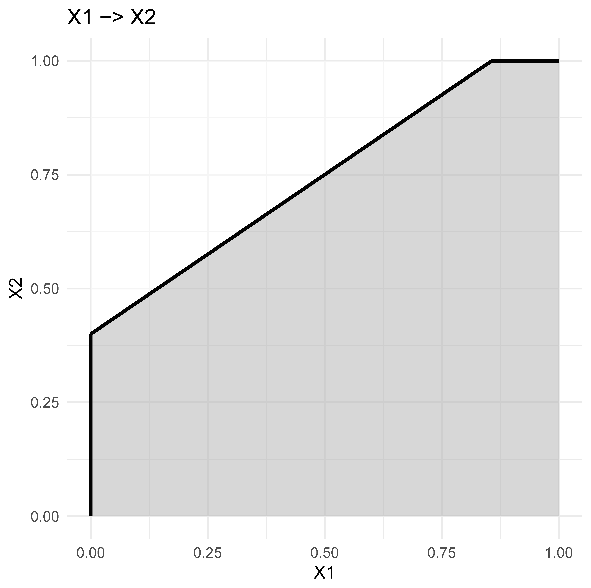
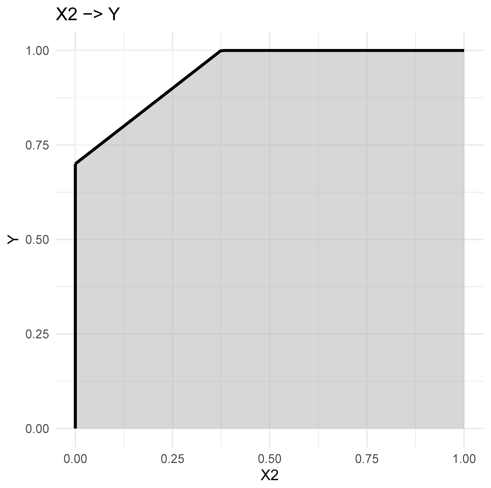
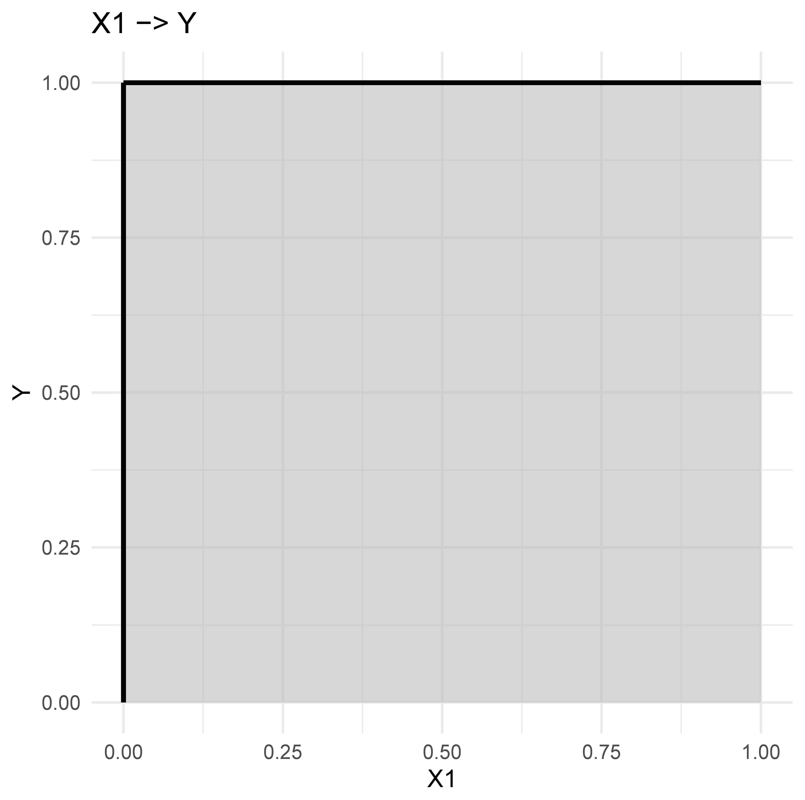
```

```{r chaineffect2code, , echo=FALSE, warning=FALSE, message=FALSE,  eval=FALSE, include=FALSE, fig.width=14, fig.height=4}
library(ggplot2)

a1 = 0.4; b1 = 0.7
a2 = 0.7; b2 = 0.8
ac = 1.02; bc = 0.56

plot_ceiling <- function(a, b, xlab, ylab, title) {
  x_vals <- seq(0, 1, length.out = 100)
  y_vals <- a + b * x_vals
  y_vals <- pmin(1, pmax(0, y_vals)) # clip to [0, 1]
  
  
# Value of y when x = 0
  y0 <- pmin(1, pmax(0, a))  # ensures it stays in [0,1]  
  
  df <- data.frame(x = x_vals, y = y_vals)
  
  ggplot(df, aes(x = x)) +
    geom_ribbon(aes(ymin = y, ymax = 1), fill = "white", alpha = 0.6) +
    geom_ribbon(aes(ymin = 0, ymax = y), fill = "grey", alpha = 0.6) +
    geom_line(aes(y = y), color = "black", linewidth = 1) +
    # vertical segment at x = 0 from (0,0) to (0,y0)
    geom_segment(aes(x = 0, xend = 0, y = 0, yend = y0),
                 linewidth = 1, color = "black") +
    coord_cartesian(xlim = c(0,1), ylim = c(0,1)) +
    labs(x = xlab, y = ylab, title = title) +
    theme_minimal()
}

# Plot 1: X1 → X2
p1 <- plot_ceiling(a = a1, b = b1, xlab = "X1", ylab = "X2", title = "X1 → X2")

# Plot 2: X2 → Y
p2 <- plot_ceiling(a = a2, b = b2, xlab = "X2", ylab = "Y",  title = "X2 → Y")

# Plot 3: X1 → Y (chain)
p3 <- plot_ceiling(a = ac, b = bc, xlab = "X1", ylab = "Y",  title = "X1 → Y")

# Save the plot as a PDF
 # ggsave("chaineffect2A.pdf", plot = p1, width = 5, height = 5, dpi = 600)
 # ggsave("chaineffect2B.pdf", plot = p2, width = 5, height = 5, dpi = 600)
 # ggsave("chaineffect2C.pdf", plot = p3, width = 5, height = 5, dpi = 600)

# Combine
# print(p1 + p2 + p3)

```

The examples illustrate that the chain effect size is smaller than the link effect sizes, and that the chain effect size can be zero while those of the links are not.

<!-- ### Necessity chain rules {#necessitychainrules} -->

<!-- In the previous section it was shown that a necessity chain is broken if one link is not necessary. Therefore the first rule for a necessity chain reads: -->

<!-- > **Rule 1. A necessity chain is broken if a link is broken.** -->

<!-- It may be that the link is sufficient (but not necessary) or that it contributes on average (but is not necessary). -->

<!-- > **Rule 2. The position of conditions in the necessity chain matters.** -->

<!-- A condition early in the chain gets its contribution dampened through all later links, while a condition late in the chain affects the ceiling almost directly.  -->


<!-- This is the reason that in the direct link, the necessary condition is most pronounced compared when it is part of a necessity chain.   -->
<!-- When there are $J+1$ variables (multiple necessary conditions and one outcome) then there are $J - 1$ intermediate conditions. When the first condition and the outcome are fixed while the intermediates have an arbitrary order, there are the following number of permutations of intermediates (and number of chains):  -->

<!-- \begin{equation}  -->
<!-- (\#eq:ch10) -->
<!-- \text{chains} \;=\; \sum_{Q=0}^{\,J-1} \binom{\,J-1\,}{Q}\; Q!  -->
<!-- \end{equation}  -->


<!-- where $Q$ is the number of selected intermediates in the chain. -->

<!-- According to this rule one of many potential necessity chains could exist for a specific $XY$-relationship. For example, according to Equation \@ref(eq:ch10), with four conditions and one outcome (J+1 = 5), there are 16 possible chains for the necessity of a given $X$ (here $X_1$) for $Y$: -->

<!-- *Direct:* -->
<!-- 1. $X_1 \rightarrow Y$ -->

<!-- *Single-intermediate:*   -->
<!-- 2. $X_1 \rightarrow X_2 \rightarrow Y$   -->
<!-- 3. $X_1 \rightarrow X_3 \rightarrow Y$   -->
<!-- 4. $X_1 \rightarrow X_4 \rightarrow Y$   -->

<!-- *Two intermediates:*   -->
<!-- 5.  $X_1 \rightarrow X_2 \rightarrow X_3 \rightarrow Y$   -->
<!-- 6.  $X_1 \rightarrow X_3 \rightarrow X_2 \rightarrow Y$   -->
<!-- 7.  $X_1 \rightarrow X_2 \rightarrow X_4 \rightarrow Y$   -->
<!-- 8.  $X_1 \rightarrow X_4 \rightarrow X_2 \rightarrow Y$   -->
<!-- 9.  $X_1 \rightarrow X_3 \rightarrow X_4 \rightarrow Y$   -->
<!-- 10. $X_1 \rightarrow X_4 \rightarrow X_3 \rightarrow Y$   -->

<!-- *All three intermediates:*   -->
<!-- 11. $X_1 \rightarrow X_2 \rightarrow X_3 \rightarrow X_4 \rightarrow Y$   -->
<!-- 12. $X_1 \rightarrow X_2 \rightarrow X_4 \rightarrow X_3 \rightarrow Y$   -->
<!-- 13. $X_1 \rightarrow X_3 \rightarrow X_2 \rightarrow X_4 \rightarrow Y$   -->
<!-- 14. $X_1 \rightarrow X_3 \rightarrow X_4 \rightarrow X_2 \rightarrow Y$   -->
<!-- 15. $X_1 \rightarrow X_4 \rightarrow X_2 \rightarrow X_3 \rightarrow Y$   -->
<!-- 16. $X_1 \rightarrow X_4 \rightarrow X_3 \rightarrow X_2 \rightarrow Y$ -->

<!-- A similar set of chains are possible when $X_2$ is the first (fixed condition) -->

<!-- According to Chain Rule 1, only one of the chain options can be necessary (if necessity holds). Normally, necessary conditions are hypothesized (see Chapter \@ref(hypothesisformulation)) and analysed (see Chapter \@ref(dataanalysis) as the direct link between $X$ and $Y$. Often there is no theoretical rationale for all chains, but i may be that a the necessity between one or more conditions is theoretically justified. -->

<!-- > **Rule 3. The necessity between $X$ and $Y$ via a chain is only plausible if there is theoretical support for all necessity links in the chain.** -->

<!-- This is a consequence of Rule 1, which states that without necessity in a link, chain necessity does not exist.  -->

<!-- > **Rule 4. A theoretically supported  necessity chain is only plausible if the effect size of the chain is considerably larger than the effect size of the direct link.** -->

<!-- Empirical results often show that the direct effect size is larger than the chain effect, see Rule 3. However, if such theoretically and empirically supported chain exists, Rule 1 implies that observed direct effects (and other chain effects) are spurious.  -->


<!-- For example, with two necessary conditions the possible chains could be: -->

<!-- $X_1 \rightarrow X_2 \rightarrow Y$  -->

<!-- $X_2 \rightarrow X_1 \rightarrow Y$  -->

<!-- When data are available, the chain effect sizes $d_{X_1Y}$ and $d_{X_1Y}$ -->


<!-- Then it cn -->


<!-- It is possible that $X_1$ has not only a *chain effect* (*indirect effect*) on $Y$ , but also a *direct effect* or an effect via *another necessity chain* on $Y$. -->
<!-- For example, consider a chain $X_1 \rightarrow X_2 \rightarrow Y$ consisting and a direct effect $X_1 \rightarrow Y$.  -->
<!-- b -->

<!-- \begin{equation} -->
<!-- \begin{cases} -->
<!-- \displaystyle X_1 \rightarrow Y, & \text{direct effect} \\ -->
<!-- X_1 \rightarrow X_2 \rightarrow Y, & \text{chain effect (indirect effect)} -->
<!-- \end{cases} -->
<!-- \end{equation}  -->

<!-- Suppose all necessity effects are observed: $X_1 \rightarrow Y$ (direct), $X_2 \rightarrow Y$, $X_1 \rightarrow X_2$. -->

<!-- When comparing the chain (indirect) effect of $X_1$ on $Y$ with its direct effect, the three possible outcomes are: -->

<!-- 1. The direct effect is considerably larger than the chain effect. This suggests that the direct necessity effect dominates. The indirect necessity effect may still exists but is weaker or redundant. -->
<!-- 2. The direct effect is about the same as the chain effect. This suggests that the necessity effect could be explained either way.      -->
<!-- 3. The direct effect is considerably smaller than the chain effect effect. This suggests the observed direct effect come originates from the necessity chain.   -->


<!-- ### Testing spuriousness -->
<!-- To guard against spuriousness necessity relations, NCA starts with theorizing causal necessity relationships (see Chapter \@ref(hypothesisformulation)). Without a necessity theory, analysing pointal data bear the risk that one or more observed $XY$ necessity patterns may be spurious. When two relations $X_1 \rightarrow Y$  and $X_2 \rightarrow Y$  suggest support for necessity because the $X_1Y$, $X_2Y$ plots have empty spaces in the upper-left corner, the true necessity may come from a chain of necessity between the variables. To empirically test if an observed necessity relationship may be (partly) compatible with spuriousness, the necessity effect sizes of a direct relation is compared with the necessity effect sizes of a chain.  -->
<!-- Large direct effect size relative to chain effect size support for the direct effect; small direct effect size relative to chain effect could give support for the chain effect. -->
<!-- size could be a byproduct of the chain such that spuriousness in possible. Therefore the following additional data analyses can be done to evaluate potential spuriousness (it is assumed that all variables are normalized using the same bounding box). -->


<!-- ### Comparing global and chain necessity {#testingnecessitychains} -->
<!-- When a necessity chain is theoretical plausible the necessity effect size of the chain necessity may be compared with the global necessity of the condition. -->

<!-- When the ceiling lines of all condition of a chain are straight and above the diagonal, and the variables are normalized with the same bounding box, the estimated ceiling intercepts and slopes of the conditions can be used as input to Equations \@ref(eq:effectsizeachain) and \@ref(eq:effectsizebchain) to obtain the chain effect size. -->

<!-- The test is illustrated with an example of two necessary conditions and one outcome ($n = 3$). It is assumed  that all variables are normalized using the same bounding box. It is also assumed that all possible chains are theoretical supported (which is normally unlikely).  -->

<!-- For analyzing the necessity effect of the first condition ($X_1$), according to Equation \@ref(eq:ch10) the following chains can theoretically exist: -->


<!-- 1. Specify potential direct and indirect relations -->
<!--     - Direct $X_1Y$ : $X_1 \rightarrow Y$ -->
<!--     - Indirect $X_1Y$: $X_1 \rightarrow X_2 \rightarrow Y$ -->

<!-- 2. Estimate the necessity effect sizes (observed) -->
<!--     - $d_{X_1Y}$ -->
<!--     - $d_{X_2Y}$ -->

<!-- 3. Estimate  necessity effect size of relations between the necessary conditions (observed) -->
<!--     - $d_{X_1X_2}$ -->

<!-- 4. Calculate chain necessity effect size -->
<!--     - $d_{X_1X_2Y}$ -->

<!-- 5. Compare effect sizes: -->
<!--     - if  $d_{X_1Y}$ >> $d_{X_1X_2Y}$ the direct effect is empirically plausible -->
<!--     - if  $d_{X_1Y}$ << $d_{X_1X_2Y}$ the chain effect is empirically plausible -->

<!-- ```{r, echo = FALSE, eval = FALSE} -->
<!-- library(NCA) -->
<!-- data(nca.example) -->
<!-- data <- nca.example -->
<!-- dataW <- data[-c(14,22,26),] -->

<!-- #normalize -->
<!-- min_max_normalize <- function(data, theoretical_min, theoretical_max, scale) { -->
<!--   if (!is.numeric(scale) || length(scale) != 2) { -->
<!--     stop("Scale must be a numeric vector with two elements (e.g., c(0, 100)).") -->
<!--   } -->
<!--   if (!is.numeric(theoretical_min) || !is.numeric(theoretical_max)) { -->
<!--     stop("Theoretical min and max must be numeric vectors.") -->
<!--   } -->
<!--   new_min <- scale[1]; new_max <- scale[2] -->

<!--   normalized_data <- data -->
<!--   for (i in seq_along(data)) { -->
<!--     if (is.numeric(data[[i]])) { -->
<!--       min_val <- theoretical_min[i] -->
<!--       max_val <- theoretical_max[i] -->
<!--       if (is.na(min_val) || is.na(max_val) || max_val == min_val) { -->
<!--         normalized_data[[i]] <- NA_real_ -->
<!--       } else { -->
<!--         norm_values <- ((data[[i]] - min_val) / (max_val - min_val)) * -->
<!--           (new_max - new_min) + new_min -->
<!--         tol <- sqrt(.Machine$double.eps) * abs(new_max - new_min) -->
<!--         if (new_min == 0) norm_values[data[[i]] == 0] <- 0 -->
<!--         norm_values[abs(norm_values - new_min) < tol] <- new_min -->
<!--         norm_values[abs(norm_values - new_max) < tol] <- new_max -->
<!--         norm_values <- pmax(new_min, pmin(new_max, norm_values)) -->
<!--         normalized_data[[i]] <- norm_values -->
<!--       } -->
<!--     } -->
<!--   } -->
<!--   normalized_data -->
<!-- } -->

<!-- empirical_min <- sapply(dataW, min, na.rm = TRUE) -->
<!-- empirical_max <- sapply(dataW, max, na.rm = TRUE) -->
<!-- theoretical_min <- empirical_min -->
<!-- theoretical_max <- empirical_max -->
<!-- scale <- c(0,1) -->

<!-- dataWN <- min_max_normalize(data=dataW,  -->
<!--                   theoretical_min = theoretical_min,  -->
<!--                   theoretical_max = theoretical_max, -->
<!--                   scale = scale) -->

<!-- modelWN <- nca_analysis(dataWN, 1:2,3, ceilings = "c_lp", test.rep = 10000) -->
<!-- modelWN -->
<!-- # Link1 -->
<!-- dX1Y <- modelWN$summaries$Individualism$params[[2]] -->
<!-- aX1Y <- modelWN$summaries$Individualism$params[[10]] -->
<!-- bX1Y <- modelWN$summaries$Individualism$params[[9]] -->

<!-- #Link 2 -->
<!-- dX2Y <- modelWN$summaries$`Risk taking`$params[[2]] -->
<!-- aX2Y <- modelWN$summaries$`Risk taking`$params[[10]] -->
<!-- bX2Y <- modelWN$summaries$`Risk taking`$params[[9]] -->


<!-- #Chain -->
<!-- aX1X2Y <- aX1X2 * bX2Y  + aX2Y -->
<!-- bX1X2Y <- bX1X2 * bX2Y   -->
<!-- dX1X2Y <- (1 - aX1X2Y)^2 / (2 * bX1X2Y) -->


<!-- ``` -->


<!-- The empirical example discussed in Section \@ref(necessityinkind) with two necessary conditions $X_1$ and $X_2$ is used as an illustration.  -->

<!-- 1. Specify potential direct and indirect relations -->
<!--     - Direct $X_1Y$ : $X_1 \rightarrow Y$ -->
<!--     - Indirect $X_1Y$ : $X_1 \rightarrow X_2 \rightarrow Y$ -->

<!-- 2. Estimate the necessity effect sizes (observed) -->
<!--     - $d_{X_1Y}$ -->

<!-- In this example the observed necessity effect sizes of the first condition $X_1$ is $d_{X_1Y}$ = 0.34 ($p$ = 0.018).  -->


<!-- 3. Estimate  necessity effect size of relations between the necessary conditions (observed) -->
<!--     - $d_{X_1X_2}$ -->

<!-- The observed necessity effect size of the necessity relation between $X_1$ and $X_2$ is 0.27 (p = 0.002).  -->

<!-- 4. Calculate chain necessity effect size -->
<!--     - $d_{X_1X_2Y}$ -->

<!-- The intercept and slope of the ceiling of the first link $X_1X_2$ are 0.328 and 0.915, respectively. The intercept and slope of the ceiling of the second link $X_2Y$ are 0.102 and 1.211, respectively. These ceiling lines are above the diagonal.  -->

<!-- The intercept and slope of the chain ceiling line $X_1X_2Y$ are 0.499 and 1.109, respectively. Also this ceiling lines is above the diagonal.  -->

<!-- The $X_1X_2Y$ chain effect size calculated with Equation \@ref(eq:effectsizechain) is $d_{X_1X_2Y}$ = 0.113.  -->

<!-- 5. Compare effect sizes: -->
<!--     - if  $d_{X_1Y}$ >> $d_{X_1X_2Y}$ the direct effect is empirically plausible -->
<!--     - if  $d_{X_1Y}$ << $d_{X_1X_2Y}$ the chain effect is empirically plausible -->

<!-- The observed effect size $d_{X_1Y}$ is 0.337. The effect size of $d_{X_1X_2Y}$ = 0.113.The effect size of the direct effect is considerably larger than the effect size of the indirect effect via the chain. This means that the direct necessity effect of $X_1$ on $Y$ is plausible.   -->


<!-- The same approach can be used for the second necessary condition ($X_2$).  -->

<!-- 1. Specify potential direct and indirect relations -->
<!--     - Direct $X_2Y$: $X_2 \rightarrow Y$ -->
<!--     - Indirect $X_2Y$: $X_2X_1Y$ -->

<!-- 2. Estimate the necessity effect sizes (observed) -->
<!--     - $d_{X_2Y}$ -->

<!-- In this example the observed necessity effect sizes of the second condition $X_2$ is $d_{X_2Y}$ = 0.33 ($p$ = 0.003).  -->

<!-- 3. Estimate  necessity effect size of relations between the necessary conditions (observed) -->
<!--     - $d_{X_2X_1}$ -->

<!-- The observed  necessity effect size of the necessity relation between $X_2$ and $X_1$ is 0.12 (p = 0.027).  -->

<!-- 4. Calculate chain necessity effect size -->
<!--     - $d_{X_2X_1Y}$ -->

<!-- The intercept and slope of the ceiling of the first link $X_2X_1$ are 0.677 and 0.449, respectively. The intercept and slope of the ceiling of the second link $X_1Y$ are 0.046 and 1.351, respectively. These ceiling lines are above the diagonal.  -->

<!-- The intercept and slope of the chain ceiling line $X_2X_1Y$ are 0.961 and 0.606, respectively. Also this ceiling lines is above the diagonal.  -->

<!-- The $X_2X_1Y)$ chain effect size calculated with Equation \@ref(eq:effectsizechain) is $d_{X_2X_1Y}$ = 0.001.  -->

<!-- 5. Compare effect sizes: -->
<!--     - if  $d_{X_2Y}$ >> $d_{X_2X_1Y}$ the direct effect is empirically plausible -->
<!--     - if  $d_{X_2Y}$ << $d_{X_2X_1Y}$ the chain effect is empirically plausible -->


<!-- The observed effect size $d_{X_2Y}$ is 0.33. The effect size of the direct effect $d_{2Y}$ = 0.33 is considerably larger than the effect size of the indirect effect via the chain ($d_{X_2X_1}$ = 0.001).  -->

<!-- This means that the direct necessity effect of $X_2$ on $Y$ is plausible.^[Note that a *sufficiency* relationship between two conditions (e.g., $X_2$ is sufficient for $X_1)$ can be modeled in the necessity chain by reversing the order of the $X$'s. For description, the sufficiency of $X_2$ for $X_1$ equals the necessity of $X_1$ for $X_2$, such that this relationship is modeled in the $X_1X_2Y$  chain and not in the $X_2X_1Y$ chain.] -->


 <!-- - *Direct $X_2Y$*<br>$X_2 \rightarrow Y$ -->

  <!-- - *Indirect $X_2Y$*<br>$X_2 \rightarrow X_1 \rightarrow Y$ -->


 <!-- - $d_{X_2 \rightarrow X_1 \rightarrow Y}$ -->
 <!--   - if  $d_2$ >> $d_{(X_2 \rightarrow X_1 \rightarrow Y)}$ $\Rightarrow$ $X_2 \rightarrow Y$ direct effect empirically plausible -->
 <!--    - if  $d_2$ << $d_{(X_2 \rightarrow X_1 \rightarrow Y)}$ $\Rightarrow$ $X_2 \rightarrow Y$ indirect empirically plausible -->


``` {r, echo=FALSE, eval= FALSE }
# Spuriousness test from effect sizes only
# d1  = ES(X1 -> Y), d2 = ES(X2 -> Y)
# d12 = ES(X1 -> X2), d21 = ES(X2 -> X1)
# dch1 = ES(chain X1 -> X2 -> Y)   [optional; if unknown, set to min(d12,d2)]
# dch2 = ES(chain X2 -> X1 -> Y)   [optional; if unknown, set to min(d21,d1)]
# tau = ratio threshold; e.g., tau=2/3 means "A << B" if A/B <= 2/3 and "A >> B" if A/B >= 1/(2/3)=1.5

spurious_from_effects <- function(d1, d2, d12, d21, dch1 = NULL, dch2 = NULL, tau = 2/3) {
  # 1) Fill chain effect sizes if not provided (coherent upper bounds)
  if (is.null(dch1)) dch1 <- min(d12, d2)
  if (is.null(dch2)) dch2 <- min(d21, d1)
  
  # 2) Coherence checks (chains shouldn't exceed their weakest link)
  coh1 <- dch1 <= min(d12, d2) + 1e-12
  coh2 <- dch2 <= min(d21, d1) + 1e-12
  
  # 3) Ratios for comparisons (guard zeros)
  r1 <- if (dch1 > 0) d1 / dch1 else Inf
  r2 <- if (dch2 > 0) d2 / dch2 else Inf
  big <- 1 / tau
  
  # 4) Spuriousness flags (effect-size only)
  sp_X1Y <- coh1 && (r1 <= tau)   # X1->Y potentially spurious if << chain12
  sp_X2Y <- coh2 && (r2 <= tau)   # X2->Y potentially spurious if << chain21
  need_X1Y <- r1 >= big           # direct X1->Y needed (>> chain12)
  need_X2Y <- r2 >= big           # direct X2->Y needed (>> chain21)
  ambig_X1Y <- !sp_X1Y && !need_X1Y
  ambig_X2Y <- !sp_X2Y && !need_X2Y
  
  # 5) Model scores (higher = stronger overall necessity)
  score_parallel <- min(d1, d2)
  score_chain12  <- if (coh1) dch1 else -Inf
  score_chain21  <- if (coh2) dch2 else -Inf
  score_chain12_plus_X1 <- if (coh1) min(dch1, d1) else -Inf
  score_chain21_plus_X2 <- if (coh2) min(dch2, d2) else -Inf
  
  scores <- c(
    Parallel = score_parallel,
    `Chain X1->X2->Y` = score_chain12,
    `Chain X2->X1->Y` = score_chain21,
    `Chain X1->X2->Y + X1->Y` = score_chain12_plus_X1,
    `Chain X2->X1->Y + X2->Y` = score_chain21_plus_X2
  )
  best_idx <- which.max(scores)
  winner <- names(scores)[best_idx]
  
  list(
    input = c(d1 = d1, d2 = d2, d12 = d12, d21 = d21, dch1 = dch1, dch2 = dch2, tau = tau),
    coherence = c(chain12 = coh1, chain21 = coh2),
    ratios = c(d1_over_ch1 = r1, d2_over_ch2 = r2),
    spurious_flags = c(X1_to_Y = sp_X1Y, X2_to_Y = sp_X2Y),
    needed_flags = c(X1_to_Y = need_X1Y, X2_to_Y = need_X2Y),
    ambiguous_flags = c(X1_to_Y = ambig_X1Y, X2_to_Y = ambig_X2Y),
    scores = scores,
    best_model = winner
  )
}


res <- spurious_from_effects(
  d1 = 0.15,  # X1->Y
  d2 = 0.40,  # X2->Y
  d12 = 0.41, # X1->X2
  d21 = 0.23  # X2->X1
  # dch1/dch2 omitted -> will use min bounds
)
res$spurious_flags
res$best_model
round(res$scores, 3)


library(NCA)
data(nca.example)
data <- nca.example
dataN <- data[-14,]
modelN <- nca_analysis(data, 1:2,3, ceilings = "c_lp")
modelN
d1 <- modelN$summaries$Individualism$params[[2]]
d2 <- modelN$summaries$`Risk taking`$params[[2]]
modelN1 <- nca_analysis(data, 1,2, ceilings = "c_lp")
modelN1
d12 <- modelN1$summaries$Individualism$params[[2]]
modelN2 <- nca_analysis(data, 2,1, ceilings = "c_lp")
modelN2
d21 <- modelN2$summaries$`Risk taking`$params[[2]]

res <- spurious_from_effects(
  d1,  # X1->Y
  d2,  # X2->Y
  d12, # X1->X2
  d21  # X2->X1
)
res$spurious_flags
res$best_model
round(res$scores, 3)

```

<!-- Model 1: Parallel: -->
<!-- $X_1 \rightarrow Y$  -->
<!-- $X_2 \rightarrow Y$  -->

<!-- Model 2: Chain 1 -->
<!-- $X_1 \rightarrow X_2 \rightarrow Y$   -->

<!-- Model 3: Chain 2 -->
<!-- $X_2 \rightarrow X_1 \rightarrow Y$   -->

<!-- Model 4: Direct-indirect 1 -->
<!-- $X_1 \rightarrow Y$  -->
<!-- $X_1 \rightarrow X_2 \rightarrow Y$   -->

<!-- Model 5: Direct-indirect 2 -->
<!-- $X_2 \rightarrow Y$  -->
<!-- $X_2 \rightarrow X_1 \rightarrow Y$  -->


<!-- \begin{equation}  -->
<!-- \begin{cases} -->
<!-- \displaystyle X_1 \rightarrow Y, & \text{direct effect} \\ -->
<!-- X_1 \rightarrow X_2 \rightarrow Y, & \text{chain effect (indirect effect)} -->
<!-- \end{cases} -->
<!-- \end{equation}  -->


<!-- To illustrate the last possibility, the example that "storks bring babies" is revisited (refs). Observational data from a village in a rural area suggest a positive correlation between  the population of stork nesting pair ($X_1$) and urban development ($X_2$):  -->

<!-- $X_1 \leftrightarrow  X_2$.  -->
<!-- $X_1 \rightarrow  Y$.  -->
<!-- $X_1 \rightarrow  Y$.  -->

<!-- Additionally, two direct necessity effect are observed. A high number of stork nesting pairs ($X_1$) is necessary for high birth rate ($Y$) and a high urban development ($X_2$ is necessary for high birth rate ($Y$).  Additionally is is   The indirect effect assumes that  -->


<!-- If the *observed* effect size for $X_1 \rightarrow Y$ is *larger* than the *computed* chain effect size (based on the composition of the two links), this suggests the presence of *additional necessity paths* from $X_1$ to $Y$. -->

<!-- These additional paths may include: -->

<!-- A *direct necessity* from $X_1 \rightarrow Y$   -->
<!-- An *alternative chain* not involving $X_2$ -->


<!-- ############################## -->
<!-- The general mathematical expression for a  necessity relationship for condition $X_j$: -->

<!-- \begin{equation} -->
<!-- (\#eq:math-general) -->
<!-- Y \le f_j(X_j), -->
<!-- \qquad -->
<!-- X_j \in [x_{j\min}, x_{j\max}], \; -->
<!-- Y \in [y_{\min}, y_{\max}] -->
<!-- \end{equation} -->

<!-- where $f_j(X_j)$ is the  *ceiling line* in the $X_jY$-plane ($j = 1, \dots, J$). -->

<!-- The ceiling line represent the maximum attainable value of $Y$ given $X_j$. Note that this equation is deterministic: no points are possible above the maximum value. ^[If an empirical study nevertheless observed points above the ceiling, this implies in principle a rejection of the hypothesis, unless the points are errors (measurement error, points not from the theoretical domain where the necessity is supposed to hold). If the typicality perspective is adopted *rare* points may be allowed in the ceiling zone as exceptions to the rule: these points do not belong to the phenomenon that is studied for unknown reasons. Allowing too many exceptions above the ceiling indicates model misfit. It questions the credibility of the ceiling line and its necessity claim (Section \@ref(modelfit)). The ceiling line may be too low and overestimate necessity effect size. This happens, for example, when the analyst selects a ceiling line that inherently allows points above the ceiling, such as ceiling methods like QR, as discussed in Section \@ref(mathematicalestimation)).]  -->

<!-- Since the ceiling line is assumed to be non-decreasing, it admits an inverse that expresses the minimum required value of $X_j$ for a given value of $Y$: -->

<!-- \begin{equation} -->
<!-- (\#eq:inversegeneral) -->
<!-- X_j \ge f_j^{-1}(Y) -->
<!-- \end{equation} -->

<!-- The inverse ceiling function $f_j^{-1}(Y)$ indicates that for achieving a certain level $Y = y_c$, it is necessary to have $X_j \ge x_{jc}$, where $x_{jc} = f_j^{-1}(y_c)$. If $X_j < x_{jc}$, then $Y = y_c$ is not possible, where $c$ refers to a point $C$ on the ceiling line. -->

<!-- This corresponds to NCA’s necessity statements: -->

<!-- - Necessity-in-kind (NiK): *if not $X$, then not $Y$*   -->

<!-- - Necessity-in-degree (NiD): *if not $x_c$, then not $y_c$* -->

<!-- Three classes of ceiling lines are distinguished:  (1) stepwise (CE-FDH), (2) concave piecewise linear (CE-VRS), and (3) straight  (Figure \@ref(fig:classfig)). Each class is described below in detail. -->


<!-- ################################ -->
<!-- In other words: -->

<!-- The peers are connected horizontal and vertical line segments that form the ceiling line. Figure \@ref(classfig)-top-left shows three such points. In NCA, this line is called the Ceiling Envelopment Free Disposal Hull (CE-FDH). Whereas FDH focuses on the *presence* of points on and *below* the ceiling (the points in what NCA calls the feasible area), NCA's main interest is the *absence* of points on and *above* the ceiling. Furthermore, for reasons explained in Section \@ref(multipleconditions), NCA considers projections of points in the two-dimensional plane whereas FDH focuses on points in the multidimensional space. In addition, FDH does not include points of the form (0,y) for y > 0 (no output without input). A free disposal that is the smallest disposal hull that contains a given set of points is said to be generated by that set of points. -->

<!-- ############################################ -->

<!-- ## Note on overlap of classes -->

<!-- The classes may have some overlap. In particular, an instance of a model with a linear inner ceiling can be considered as part of the linear class of models and as part of the VRS class with two peers. Degree of freedom is a property of a class of models, not of an instance of a model. -->


<!-- ######################## -->
<!-- #### Straight ceiling line -->


<!-- The *straight* class of ceiling lines has two degrees of freedom and can be described the line's: intercept and slope (Figure \@ref(fig:linfig)). Since a bounding box exists, the inner ceiling line is a segment with endpoints corresponding to the intersection points of the line with the bounding box. If the empty space is in the upper-left corner, the feasible area where points are possible is to the right and below the ceiling line (the gray area). The ceiling line is part of the feasible area. The area above and to the left of the ceiling line is the ceiling zone where points are not possible (white area). To ensure that the ceiling line envelopes the feasible area, it has extensions as shown by the dashed segments in Figure \@ref(fig:linfig). The extended ceiling line is the inner ceiling line (the segement) plus extensions.    -->

<!-- ```{r linfig, echo=FALSE, fig.show="hold", fig.cap="Straight  ceiling line within the bounding box. A and B are intersection points with the bounding box" , out.width='49%', fig.align='center'} -->
<!--  -->
<!-- ``` -->

<!-- For a straight linear ceiling line, the ceiling function is: -->

<!-- \begin{equation} -->
<!-- (\#eq:math-linear) -->
<!-- Y \le a + bX, -->
<!-- \qquad b > 0 -->
<!-- \end{equation} -->

<!-- where $a$ is the ceiling intercept and $b$ is the ceiling slope. The function is defined on -->
<!-- $X \in [x_{\min}, x_{\max}]$ and satisfies -->
<!-- $y_{\min} \le a + bX \le y_{\max}$ within this domain. -->

<!-- Because the straight ceiling line is strictly increasing, its inverse is uniquely defined: -->

<!-- \begin{equation} -->
<!-- (\#eq:inverse-linear) -->
<!-- f_j^{-1}(Y) = \frac{Y - a}{b} -->
<!-- \end{equation} -->

<!-- Thus, for having $Y = y_c$, it is necessary that: -->

<!-- \begin{equation} -->
<!-- X \ge \frac{y_c - a}{b} -->
<!-- \end{equation} -->

<!-- #### Stepwise linear ceiling line -->

<!-- The *stepwise linear* class of ceiling lines consist of a ceiling line with *horizontal* and *vertical* stragit line segments (Figure \@ref(fig:fdhfig)-left). If the empty space is in the upper-left corner, the the upper-left edges of the ceiling (*peers*) define the feasible area: points are only possible below and to the right of the peers. Figure \@ref(fig:fdhfig)-left shows three peers (1, 2, 3) and the corresponding feasible area in gray. The ceiling line is the line consisting of horizontal and vertical line segments connecting the peers. To envelop the entire feasible area, vertical extension from the first peers to the bounding box and the horizontal extension from the last peer to the bounding box are added.  The set of peers describe the feasible area with its envelop (the ceiling line). This class of ceiling line has 2P degrees of freedom: each peer can be described by its $x$- and $y$-coordinates. The ceiling zone consist of the area of the bounding box to the left and above the ceiling line. -->

<!-- The stepwise linear ceiling line for set of peers $(x_i, y_i)_{i = 1 \cdots P}$  can be mathematically expressed as follows: -->

<!-- $$ -->
<!-- f(x) = y_{i-1} \quad \text{if} \quad x_{i-1} \le x < x_i \quad (i=2,\ldots,P), -->
<!-- $$ -->

<!-- and -->

<!-- $$ -->
<!-- f(x) = y_P \quad \text{if} \quad x_P \le x \le x_{\max}, -->
<!-- $$ -->

<!-- while \(f(x)\) is not defined for \(x < x_1\). -->

<!-- Geometrically, the corresponding ceiling line is the stepwise path consisting of the line segments -->

<!-- $$ -->
<!-- (x_1,y_{\min})  \to  (x_1,y_1)  \to  (x_2,y_1)  \to  (x_2,y_2)  \to  \cdots  \to  (x_P,y_P)  \to  (x_{\max},y_P), -->
<!-- $$ -->

<!-- where possibly the first segment \((x_1,y_{\min}) \to (x_1,y_1)\) and/or the last segment \((x_P,y_P) \to (x_{\max},y_P)\) has length zero. -->


<!-- ```{r fdhfig, echo=FALSE, fig.show="hold", fig.cap="Step ceiling line within the bounding box. The points 1,2,and 3 are the peers of the ceiling line (upper-left edges). Left: step ceiling (CE-FDH). Right: piecewise concave ceiling (CE-VRS) " , out.width='49%', fig.align='center'} -->
<!--  -->
<!--  -->
<!-- ``` -->

<!-- #### Concave piecewise linear ceiling line -->

<!-- The *concave piecewise linear* class of ceiling lines consist of of *oblique* straight line segments such that the line is concave (Figure \@ref(fig:fdhfig)-right). If the empty space is in the upper-left corner, the feasible area is below and the the right of the peers. Figure \@ref(fig:fdhfig)-right shows three peers (1, 2, and 3) and the corresponding feasible area in gray. The ceiling line is the line consisting of the oblique line segment segments connecting the peers. To envelop the entire feasible area the vertical extensions from the first peers to the bounding box and the horizontal extension from the last peer to the bounding box are added. This class of ceiling line also has 2P degrees of freedom: each peer can be described by its $x$- and $y$-coordinates. The ceiling zone consist of the area of the bounding box to the left and above the ceiling line. -->

<!-- The concave piecewise linear ceiling line for set of peers $(x_i, y_i)_{i = 1 \cdots P}$  can be mathematically expressed as follows: -->
<!-- The ceiling function is given by the piecewise-linear expression -->

<!-- $$ -->
<!-- f(x)= y_{i-1} + \frac{y_i-y_{i-1}}{x_i-x_{i-1}}(x-x_{i-1}) -->
<!-- \quad \text{if} \quad x_{i-1}\le x \le x_i, -->
<!-- $$ -->

<!-- and \(f(x)=y_P\) if \(x \ge x_P\), while \(f(x)\) is not defined for \(x < x_1\). -->

<!-- The associated feasible space is generated by all points on the line segments from \((x_i,y_i)\) to \((x_{i+1}, y_{i+1})\) for \(i=1,\ldots,P-1\). -->

<!-- Geometrically, the corresponding ceiling line is the polyline consisting of the sequence of line segments: -->

<!-- $$ -->
<!-- (x_1,y_{\min})  \to  (x_1,y_1)  \to  (x_2,y_2)  \to  \cdots  \to  (x_P,y_P)  \to  (x_{\max},y_P), -->
<!-- $$ -->

<!-- where the length of the first segment \((x_1,y_{\min}) \to (x_1,y_1)\) and/or the last segment \((x_P,y_P) \to (x_{\max},y_P)\) may be zero. -->


<!--chapter:end:040-mathematicsJO.Rmd-->

# Statistics {#statistics}

## Summary of this chapter {#summarystatistics}
This chapter discusses several statistical topics relevant to NCA. Although NCA is primarily a (quasi-)deterministic mathematical (geometric) method rather than a statistical method based on probabilities, several statistical approaches and tools are still relevant for NCA. First, the chapter discusses the use of sampling logic in quantitative (large-n) NCA studies (Section \@ref(samplinglogic)). Second, four specific statistical tools and approaches for NCA are presented. These are a set of permutation tests for testing null hypotheses (Section \@ref(permutationtest)), statistical modeling with NCA in particular for Monte Carlo simulation studies (Section \@ref(statisticalmodeling)), and the use of these simulations for evaluating the statistical quality of ceiling lines (Section \@ref(ceilingquality)) and for conducting power analyses (Section \@ref(statisticspower)). Finally, the chapter discusses how three common problems in inferential statistics apply to NCA: reverse causality (Section \@ref(reversecausality)), measurement error (Section \@ref(measurementerror)) and spuriousness (Section \@ref(spurious)).

<!-- and NCA estimates the ceiling line and its effect size from a sample of the population (inferential statistics) and conducts a statistical test to test the randomness of the effect size. This section discusses several backgrounds of these statistical approaches: NCA's statistical equation, requirements for conducting statistical simulation studies with NCA, conducting simulations for establishing the quality of NCA's effect size estimation, the interpretation and power of NCA's statistical test, and the relationship between  NCA and correlation. -->

<!-- ## Statistical tools {#statisticsexplanation} DEZE SECTIE MISSCHIEN NIET NODIG -->
<!-- <!-- to evaluate randomness of the empty area with NCA's statistical test or for simulations to evaluate the power of this test     --> 
<!-- <!-- NCA is not a statistical method perse. For drawing the ceiling line, calculating the effect size and quantifying exceptions, NCA does not rely on assumptions about the Data Generation Process (DGP) and probability distributions. Nevertheless, several statistical tools can be used to evaluate NCA results.  --> 
<!-- <!-- Rather than using probability theory,  Still, NCA is not at odds with assumptions from probability theory. Extending NCA with such assumptions allows the use of statistical techniques into the analysis. --> 

<!-- 1 not estimating the regression equation -->


<!-- the first section (\@ref(statisticsexplanation)) discusses the role of statistics in NCA. In thhe second Section NCA's statistical significance test is presented. This is a null hypothesis test that evaluates if an effect size could be compatible with effect sizes produced by two unrelated variables, thus could be a random result. The test rejects the null hypothesis when there is a low probability that the observed effect is a random result of unrelated variables (e.g., $p < 0.05$). Next three sections discuss the use of Monte Carlo simulations in NCA. A Monte Carlo simulation is a computational technique used to model the probability of results. In the third section, the requirements for a Monte Carlo simulation with NCA are outlined. These requirements include a proper NCA model specification (definition of the ceiling line and the scope of bounded variables) and the researcher's choice for the distribution of data below the ceiling line, within the scope. In the fourth section, Monte Carlo simulation is used for evaluating the power of NCA's statistical test. The power depends on several assumptions about population parameters (ceiling line, scope, data distribution, effect size), and selection of threshold $p$-value (e.g., p = 0.05) and sample size. A pre-study power analysis can assist researchers to select a proper sample size for being able to reject the null hypothesis when necessity is true. The fifth section uses Monte Carlo simulation to assess the quality of several NCA ceiling lines: CE-FDH, CR-FDH and LP. The next section discusses how a necessity relation can produce a correlation between the variables. If a correlation is observed this could be the result of a necessity relationship between the variables. The final section discusses why endogeneity, which is a serious issue in regression analysis, is less problematic in NCA: NCA results are not affected by confounding variables, do not require control variables, and do not suffer from omitted-variable-bias. -->


<!-- NCA bases its analysis on deterministic and typicality causal logics (the ceiling zone may be empty or may contain a few exceptions). Consequently, cardinality measures (e.g., number of data points in the empty and full areas), and geometry measures (relations between data points in terms of distances and areas) are used for notions of strength of the necessity relationship (through calculation of an effect size) and credence of necessity (through measures such as ceiling accuracy, veracity and solidity).  -->


## Sampling logic {#samplinglogic} 

In large-n quantitative studies, NCA uses a sampling approach that is aligned with common practices in inferential statistics.^[In qualitative (small-n) applications of NCA, such as case studies, purposive case selection can be used without conducting statistical tests, see Section \@ref(casestudy).]
<!-- Assuming that $X$ and $Y$ are dichotomous (e.g., 'absent' and 'present' or 'low' and 'high') a case where the outcome is present can be selected to observe if the condition is absent or present. An absent condition suggests that the necessary condition hypothesis should be rejected (in the deterministic perspective on necessity). Similarly, a case without the condition can be selected and it is observed if the outcome is absent. If not, the necessary condition hypothesis is rejected. When cases are purposively selected, NCA's statistical tests to obtain a p-value cannot be used, since it violates the tests' assumption about exchangeability.   -->
<!-- the cases are not randomly selected.  -->
<!-- , NCA assumes that the data constitute an independent sample drawn from a well-defined population, allowing inference about necessity relationships in that population. -->

For valid statistical inference, the sample should be representative of the population. Representativeness in NCA is especially important with respect to adequate coverage of cases with high values of $Y$ and varying levels of $X$ and combinations of $X$ with other variables. General information on sampling logic in NCA is provided in @dul2024how and sampling for NCA's statistical testing is discussed in Section \@ref(samplingandselection). Usually, random sampling satisfies the requirements.  
<!-- In large-N quantitative studies, NCA uses a sampling approach that is aligned with the common approaches of inferential statistics. NCA assumes drawing a sample that is -->
<!-- independent (random) sample from a population to infer conclusions about necessity in the population. For proper inference, such sample is required. This can be obtained by randomly sampling cases from a defined population. This allows the statistical generalization of an observed necessity relationship (ceiling line and empty space) that is observed in the sample towards necessity in the population. In NCA the requirements for a good sample are not different from the standard requirements of good sampling. It is essential that the sample is  -->
<!-- "representative" of the population, in particular that the sample has good coverage of values of potential factors that can influence the highest levels of the outcome of interest. Large-N random sampling may ensure such representativeness. -->


<!-- ## Endogeneity and confounding {#endogeneity} -->
<!-- <!-- Endogeneity and confounding are a major concern in studies about the average effect between variable (regression-based studies), but less so in studies about ceiling effects between variables. Assuming that a representative sample from a population is available and that an outcome of interest $Y$ depends on a variable $X$ of interest and other variable including the third variable $Z$. A produced $XY$ plot will have a data cloud and if a ceiling is present in the population, the plot will have a zone of no data. Since a representative  sample is drawn from the population a variety of cases with different values of $X$, $Y$, and $Z$ are part of the data cloud. This means that above the ceiling, no cases can exist (apart from possible sampling errors). All cases are below the ceiling. T The form of the data cloud changes when cases are considered for a certain Z value compared to cases with another Z value. This means that the average effect between $X$ and $Y$ (represented by for example a regression line) depends on values of Z. This dependency of the mean on the value of $Z$ is confounding. However, the ceiling and its empty space space above its will stay the same for any value of Z. The ceuiling already includes all possible values of Z and other potentila confounder. This can be ullustrated with an example of school children. --> 

<!-- <!-- all other poteta   in an $XY$ plot highly depends on third variables. Cases with different values of a third variable may have different locations in the cloud. in the cloud are unevenly distribute The with a data cloud   --> 


<!-- Endogeneity refers to potential biases introduced by interdependence among variables. In a regression context endogeneity refers to a situation where an independent variable in a regression model is correlated with the error term of the model. Endogeneity is one of the major challenges in regression analysis as it violates a key assumption of a regression model, which is that the independent variables should be exogenous in order to admit interpretation and proper estimation, meaning they are not influenced by the error term. Endogeneity leads to biased estimation of regression coefficients. Three common sources of endogeneity are omitted variables, reverse causality, and measurement error.  -->

<!-- ### Endogeneity in regression analysis {#endogeneityinregression} -->
<!-- *Omitted variables* are variables that are correlated with both the independent and dependent variables and that are left out from the regression model. Omitting these variable from the model will bias the estimates of the regression coefficients. For example, when studying the effect of education on income, a person's intelligence is a variable that it is correlated with both education and income. When this variable is not included as a 'control variable' in the regression equation, the estimated regression coefficient of education is biased (omitted-variable-bias). -->

<!-- *Reverse causality* refers to the causal effect of the dependent variable on one or more of the independent variables. If reverse causality occurs, not only will the independent variable cause the dependent variable, but also will the dependent variable cause the independent variable. Such reverse causality biases the estimated regression coefficient of the independent variable. For example, when studying the effect of education on income, not only education will have an effect on income but also will higher income individuals tend to invest more in education, which biases the regression coefficient of education.  -->

<!-- Although random *measurement error* may not have a large effect on the estimation of the regression coefficient, measurement error that correlates with a variable may cause bias. For example, when studying the effect of education on income, individuals with lower education levels round up their education level due to aspiration. This creates a correlation between the measurement error in education and the error term, and thus biases the regression coefficient of education. -->

<!-- Only when all variables that a correlated with other variables in the regression equation as included in the equation as control variables, and when other sources of endogeneity are absent or controlled for, the observed relationship between the independent and dependent variables may be causally interpreted. An additional requirement is that the temporal order (first $X$, then $Y$) is assured or theoretically assumed (e.g., in the hypothesis X has an average effect on Y). -->

<!-- ### 'Endogeneity' in NCA {#ncaendogeneity} -->
<!-- In NCA, endogeneity as defined in regression analysis does not exist. The simplest explanation is that NCA's mathematical model does not have an error term, see Equations \@ref(eq:math0a), \@ref(eq:math0), \@ref(eq:step). An error term represents the scatter of observations below the ceiling line, but NCA does not model this. Nevertheless, two of the three underlying  sources of endogeneity in regression analysis also affect NCA. omitted-variable-bias does not apply to NCA, but reverse causality and measurement error may be an issue. -->
<!-- <!-- Estimates of NCA (e.g., effect size) are not or less vulnerable to biases introduced by interdependence among variables. This is illustrated by evaluating the effect of the three common sources of endogeneity in regression analysis, on NCA's estimation of the effect size. --> 

<!-- Leaving out *variables that are correlated* with both the condition and the outcome do not affect the estimates of NCA and therefore do not need to be added as 'control variables'. First, NCA always analyses a pair of variables corresponding to an XY projection the multidimensional space (see Section \@ref(multipleconditions)). Although NCA can analyse several projections successively (multiple NCA, see Equations \@ref(eq:math2) and \@ref(eq:math3)), the result of the analysis of one condition does not affect the result of another condition. In other words, not having correlated variables in an NCA model does not bias the estimated ceiling line and effect size, such that omitted-variable-bias is non existing^[Variables that are not considered in NCA may still be important. They could be other necessary conditions, or could have an probabilist sufficiency (average) causal effect on the outcome. Variables will usually correlate with other variables. NCA focuses on the variables of interest for which a theoretical causal necessity relationship can be expected. NCA does not focus on other variables that correlate with the variable of interest.].  -->

## Permutation tests {#permutationtest}

<div style="text-align: left; font-style: italic; margin: 2em 0;">
  Part of this section is under construction.
</div>

<!-- NCA’s set of statistical tests consists of permutation tests to estimate the $p$-value for evaluating effect sizes and differences between effect sizes. NCA's original test (called "Null" here) evaluates if the observed effect size differs from 0. The other tests are called: -->

<!-- - "Contrast", to evaluate if two conditions for the same $Y$ have different effect sizes,  -->

<!-- - "Independent", to evaluate if two independent groups of cases have different effect sizes,  -->

<!-- - "Paired", to evaluate if effect sizes at two time points are different.  -->

<!-- First, the general principles of the $p$-value and the permutation test are discussed, followed by a description of each test. The three newer tests are available in the ```NCA``` software in ```R``` from version 5.0.0. -->

### General

According to the American Statistical Association (ASA), in statistical null hypothesis testing the $p$-value is a measure that helps assess the strength of evidence *against a null hypothesis* [@wasserstein2016asa]. In its 2016 statement on $p$-values, the ASA discusses what the $p$-value is, and what it is not. Essentially, the $p$-value indicates the compatibility of the data with the null hypothesis. 

NCA tests the compatibility of the observed necessity effect size with the null hypothesis of no relationship. The unique feature of NCA's null hypothesis tests is that it uses the necessity effect size as the test statistic. Note that no null hypothesis test can test an alternative hypothesis. If the null hypothesis is rejected, this does not imply that a specific alternative hypothesis is correct. A small $p$-value only suggests that the observed effect size  is unlikely under the null hypothesis. 

Scientific conclusions about the hypothesis of interest (the alternative hypothesis) should not be based solely on whether a $p$-value is below a threshold level (e.g., 0.05). For this reason, in concluding that a necessity hypothesis is supported,^[In the context of statistical testing, this book may use the term "support" of a hypothesis in the meaning of "non-rejection"] NCA not only requires a low $p$-value but also the presence of theoretical support and a practically relevant effect size. These are three minimum requirements for concluding about necessity. Together they protect the analyst against making false positive or false negative conclusions (Chapter \@ref(sensitivityspecificity)).

NCA does not make an assumption about the type of distribution of the data (e.g., normality). The permutation test is a valid statistical approach for testing the randomness of effect size  that does not rely on assumptions about the distribution of the data (like normality in t-tests or ANOVA). The permutation test constructs a null distribution empirically by resampling in a specific way from observed data. First, the test statistic, NCA's effect size, is computed using the original data. Next, resamples with the same sample size and the same sets of $X$- and $Y$-values are validly created by a specific type of permutation assuming that the null hypothesis of no relationship (or same distribution) applies. By rearranging the data randomly through permutations, any systematic relationship between $X$ and $Y$ is broken. This is done differently for each test (see below). For the resample (permutation), the effect size is recomputed, and this is repeated many times (e.g., 10,000) to obtain a null distribution of values for the effect size. Finally, to compute the $p$-value, the observed effect size is compared with the effect sizes obtained under the null distribution. The $p$-value is the proportion of permuted effect size under the null that are as extreme or more extreme than the observed effect size.

The validity of NCA's four permutation tests (Null, Contrast, Independent, Paired) is based on a theorem [@hoeffding1952; @kennedy1995; @lehmann2005]. The justification of the test rests on the so-called Randomization Hypothesis being true. The Randomization Hypothesis states:

>Under the null hypothesis, the distribution of the dataset $D$ is invariant under the transformation $p$, that is, for every transformation $p \in \mathcal{P}$, $pD$ and $D$ have the same distribution whenever $D$ has distribution $P$ in $H_0$ [@lehmann2005, p. 633].

Here, $D$ denotes the observed dataset (all cases and variables used in the test). The symbol $p$ denotes one admissible randomization operation from the permutation scheme (e.g., a particular shuffling/relabeling/reassignment as defined by the test), and $\mathcal{P}$ denotes the set of all admissible operations of that type. The expression $pD$ denotes the transformed dataset obtained by applying $p$ to $D$ (e.g., shuffling $Y$ across cases while keeping $X$ fixed, swapping within-case labels such as $X_1$ and $X_2$, reassigning cases to groups while preserving group sizes, or swapping time labels within a case). Finally, $D \sim P \in H_0$ means that the original dataset $D$ is assumed to be generated from some distribution $P$ that satisfies the null hypothesis $H_0$; invariance then states that $pD$ is distributed the same way as $D$ under $H_0$.
<!-- The Randomization Hypothesis ensures that the permutation procedure generates valid samples from the same distribution. $\mathcal{T}$ is the group of permutations. The transformation of the sample data $S$ under a permutation $t$ in  $\mathcal{T}$ is here $S \mapsto tS$ and the Randomization Hypothesis is that $S$ and $tS$ have the same distribution when $S$ has been sampled from a $H0$ distribution.  -->

<!-- In other words, under the Randomization Hypothesis, repeated sampling of $S$, with each time making $tS$, the distributions of $S$ and $tS$ should be the same. This means that the validity of NCA's permutation test comes from the fact that, under $H0$, permuting labels/assignments across all cases does not change the data’s distribution. Each test simply uses a different set of allowable transformations  $\mathcal{T}$ (the group of permutations) appropriate to its hypothesis: -->

<!-- In other words, the validity of the permutation test rests on the fact that, under $H_0$, applying any admissible transformation $p \in \mathcal{P}$ produces a dataset $pD$ that is distributed like the original dataset $D$. Thus, random draws of $p$ generate valid “null” replicates of the data. Each test simply uses a different admissible transformation set $\mathcal{P}$ (i.e., different permissible relabelings/assignments) corresponding to the hypothesis and the design: -->


<!-- - Null: $H_0^{\text{}}:\; d_{X \rightarrow Y}=0$. -->

<!-- - Contrast: $H_0^{\text{}}:\; d_{X_1 \rightarrow Y}-d_{X_2 \rightarrow Y}=0$. -->

<!-- - Independent: $H_0^{\text{}}:\; d_{G_1(X \rightarrow Y)} -d_{G_2(X \rightarrow Y)}=0$. -->

<!-- - Paired: $H_0^{\text{}}:\; d_{T_1(X \rightarrow Y)} -d_{T_2(X \rightarrow Y)}=0$. -->

<!-- where $d$ is the effect size, and $X_1$ and $X_2$ are two different conditions, $G_1$ and $G_2$ two different groups, and $T_1$ and $T_2$ two different time points. The differences between the four tests are shown in Table \@ref(tab:permutationtests).  \ -->

<!-- ```{r permutationtests, echo = FALSE, warning=FALSE, message=FALSE, out.width='99%', cache=FALSE} -->

<!-- library(kableExtra) -->

<!-- st <- data.frame( -->
<!--   `Test name` = c("Null", "Contrast", "Independent", "Paired"), -->
<!--   `Sample(s)` = c("One", "One", "Two (Groups)", "Two (Times)"), -->
<!--   `Question` = c( -->
<!--     "Does $X$ constrain $Y$ at all?", -->
<!--     "Which condition ($X_1,X_2$) constrains $Y$ more?", -->
<!--     "In which group ($G_1, G_2$) does $X$ constrain $Y$ more?", -->
<!--     "Does the constraint of $X$ on $Y$ change over time ($T_1, T_2$)?" -->
<!--   ), -->
<!--   `Permutation logic` = c( -->
<!--     "Randomly shuffle $Y$ across cases while keeping $X$ fixed.", -->
<!--     "For each case, randomly switch the labels $X_1$ and $X_2$ with 50/50 probability.", -->
<!--     "Pool both groups ($G_1$ and $G_2$), randomly reassign cases to two groups of the same sizes.", -->
<!--     "For each case, randomly decide whether to switch the time labels ($T_1,T_2$)." -->
<!--   ), -->
<!--   check.names = FALSE -->
<!-- ) -->

<!-- kbl( -->
<!--   st, -->
<!--   booktabs = TRUE, -->
<!--   caption = "Comparison of NCA's permutation tests", -->
<!--   align = "l", -->
<!--   escape = FALSE -->
<!-- ) %>% -->
<!--   kable_styling( -->
<!--     full_width = FALSE, -->
<!--     latex_options = c("hold_position", "scale_down"),  -->
<!--     font_size = 15 -->
<!--   ) %>% -->
<!--   column_spec(1, width = "2.5cm") %>% -->
<!--   column_spec(2, width = "3cm")   %>% -->
<!--   column_spec(3, width = "5.5cm") %>% -->
<!--   column_spec(4, width = "7cm") -->

<!-- #  -->
<!-- #  -->
<!-- # library(kableExtra) -->
<!-- #  -->
<!-- # st <- data.frame( -->
<!-- #  -->
<!-- #   #columns and values -->
<!-- #   `Test name` = c("Null", "Contrast", "Independent", "Paired"), -->
<!-- #   `Sample(s)` = c("One", "One", "Two (Groups)", "Two (Times)"), -->
<!-- #   `Question` = c("Does $X$ constrains $Y$ at all?", -->
<!-- #                  "Which condition constrains $Y$ more?", -->
<!-- #                  "In which group does $X$ constrain $Y$ more?", -->
<!-- #                  "Does the contraint of $X$ on $Y$ changes over time?" -->
<!-- #                  ), -->
<!-- #   `Permutation logic` = c("Randomly shuffle $Y$ across cases while keeping $X$ fixed.", -->
<!-- #                           "For each case, randomly swap the labels $X_1$ and $X_2$ with 50/50 probability.", -->
<!-- #                           "Pool both groups, randomly reassign cases to two groups of the same sizes.", -->
<!-- #                             "For each case, randomly decide whether to swap the time labels." -->
<!-- #                           ), -->
<!-- #   check.names = FALSE -->
<!-- # ) -->
<!-- #  -->
<!-- # # Bold the row labels -->
<!-- # #mmt$Row <- cell_spec(mmt$Row, bold = TRUE, align = "left") -->
<!-- #  -->
<!-- # kbl( -->
<!-- #   st, -->
<!-- #   booktabs = TRUE, -->
<!-- #   caption = "Comparison of NCA's permutation tests", -->
<!-- #   col.names = c("Test name", "Sample(s)", "Question", "Permutation logic"), -->
<!-- #   align = c("l", "l", "l", "l"), -->
<!-- #   escape = FALSE     # <- needed so cell_spec markup is interpreted -->
<!-- # ) %>% -->
<!-- #   kable_styling(full_width = FALSE, -->
<!-- #                 latex_options = c("hold_position", -->
<!-- #                                   "scale_down"), -->
<!-- #                 font_size = 9, -->
<!-- #                 ) %>% -->
<!-- #   column_spec(1, width = "8em") %>% -->
<!-- #    column_spec(1, width = "8em") %>% -->
<!-- #    column_spec(1, width = "8em") %>% -->
<!-- #   column_spec(2, width = "8em")  -->

<!-- ``` -->

<!-- The observed effect size is compared with the null distribution. The $p$-value is the probability of obtaining an effect size equal to or more extreme than the observed one, assuming the null hypothesis is true. In other words, how compatible the observed $p$-value is with the null of no effect size (difference).  -->


<!-- Since NCA does Advantages of Permutation Tests -->
<!-- No reliance on parametric assumptions (e.g., normality, equal variance). -->
<!-- More accurate Type I error control when distributions are unknown or complex. -->
<!-- Directly applicable to complex data structures, such as NCA effect sizes, panel data, or mixed designs. -->


<!-- (NCA's statistical test {#permutationtest}) -->
<!--  NCA's statistical test discussed in Section \@ref(permutationtest)) is therefore non-parametric. For using statistical tools based on Monte Carlo simulations (power analysis, quality of ceiling lines), the researcher must make an assumption about the probability distribution under the ceiling line within the scope: the 'data generation process' using a statistical model. Monte Carlo simulation is a helpful statistical tool for NCA because it allows for evaluations of   -->


<!-- Given the fit of interpreting the $p$-value, different views exist about the value of the $p$-value in research: -->

<!-- - The $p$-value should be abandoned because the $p$-value is misinterpreted and misused, e.g. [@trafimow2015editorial] -->

<!-- - The $p$-value can only be used in combination with other evidence (e.g., effect size)  -->

<!-- @article{american2010publication, -->
<!--   title={Publication manual of the American}, -->
<!--   author={American Psychological Association and others}, -->
<!--   year={2010} -->
<!-- } -->


<!-- APA (2010). Publication Manual of the American Psychological Association, Sixth Edition American Psychological Association, Washington, DC. -->
<!-- 3. -->

<!-- Only a very low $p$-value ($p < 0.005$) signals a “discovery” -->
<!-- Benjamin, D. J., Berger, J., Johannesson, M., Nosek, B. A., Wagenmakers, E. J., Johnson, V., ... et al. (2017). Redef -->

<!-- large-n random sampling from the population may help to achieve such representativeness. However, representativeness in NCA is not only a matter of marginal distributions or averages, but also of sufficient coverage of the space where necessity is evaluated, particularly near the ceiling line. As in standard statistical inference, violations of representativeness may limit the generalizability of observed necessity relationships from the sample to the population. -->


<!-- In large-n quantitative studies, NCA uses a sampling approach that is aligned with the common approaches of inferential statistics. NCA assumes drawing a sample that is representative of a population in order to infer conclusions about necessity in that population. For proper statistical inference, such a sample is required. This can be obtained by randomly sampling cases from a clearly defined population. Random sampling supports statistical generalization of an observed necessity relationship (i.e., a ceiling line and associated empty space) from the sample to the population. -->

### Assumptions for NCA's permutation tests
Beyond representativeness, NCA’s permutation tests additionally rely on the assumption of *exchangeability* under the null hypothesis. Exchangeability means that, under $H_0$, the joint distribution of the observed data is invariant under the admissible permutations (i.e., relabelings/reassignments) specified by the test’s permutation scheme. In practical terms, this implies that no case has a special status with respect to the tested relationship once the null hypothesis of no necessity holds. When this condition is met, applying the test-specific permutations (permuting $X$-$Y$ pairings, swapping within-case condition or time labels, or reassigning group labels) generates valid resamples from the same null distribution.

Representativeness and exchangeability are related but distinct requirements. Representativeness concerns the external validity of the sample (whether conclusions can be generalized to the population), whereas exchangeability concerns the internal validity of the permutation test (whether the permutation distribution correctly reflects $H_0$). Exchangeability is in general satisfied when the relevant units are independent and identically distributed under $H_0$, 
and when the sampling or measurement design does not introduce systematic differences that are not respected by the permutation scheme.

<!-- In addition, for NCA it is particularly important that the sample provides sufficient coverage of values of potential conditions, especially at high levels of the outcome variable $Y$. Adequate coverage increases the likelihood that necessary conditions for achieving high $Y$ can be detected. large-n random sampling typically helps to achieve both representativeness and exchangeability, thereby supporting valid statistical inference using NCA’s permutation tests. -->

### Null test: effect size difference from 0 {#null}
In the *Null* test, the observed effect size of a single sample is compared with the null of no relationship. This is the standard NCA null test described in detail elsewhere [@dul2020orm]. The test addresses whether $X$ affects $Y$ at all, operationalized as whether effect size $d$ > 0. The permutation logic is to generate the null distribution by randomly shuffling $Y$-values across cases while keeping $X$-values fixed.  This breaks the pairing of $X$- and $Y$-values, which is admissible under the null of no relationship.

The transformation set $\mathcal{P}$ (see the Randomization Hypothesis) contains all possible transformations (permutations) of the data under the null; for $n$ cases this corresponds to $n!$ permutations of $Y$-values across cases (permutations of case labels applied to $Y$). Under $H_0$, shuffling $Y$ does not change the joint distribution of the data, so the permuted datasets are valid null replicates. The test statistic is the $XY$ effect size $d$. 
The Null test is one-sided.

<!-- >Under the null hypothesis, the distribution of the data $X$ is invariant under the transformation $g$, that is, for every transformation $g$ in $G$, $gX$ and $X$ have the same distribution whenever $X$ has distribution $P$ in H0.[@lehmann2005, p. 633]. -->
<!-- In this context $G$ is the group of permutations of $n$ elements. The transformation of the sample data $S$ under a permutation $g$ in $G$ is here $S \mapsto gS$ and the Randomization Hypothesis is that $S$ and $gS$ have the same distribution when $S$ has been sampled from a distribution in NCA's H0 (variables are independent). In other words, under the Randomization Hypothesis, repeated sampling of $S$, with each time making $gS$, the distributions of $S$ and $gS$ should be the same. For NCA's statistical test this condition is satisfied.  -->
<!-- NCA’s statistical test is a part of an entire NCA approach consisting of (1) formulating necessity theory, (2) calculating necessity effect size (relative size of empty area in $XY$-plot) and (3) performing a statistical test.  Within this context the test has a specific purpose of testing the randomness of the empty area when $X$ and $Y$ are unrelated. Therefore, a test result of a large $p$-value (e.g., $p > 0.05$) means that the empty area is compatible with randomness of unrelated variables. A test result of a small $p$-value (e.g., $p < 0.05$) means that the empty area is not compatible with randomness of unrelated variables. Again, falsifying H0 does not mean that a specific H1 is accepted. The goal of a null-hypothesis test is to test the null (H0), not a specific alternative (H1). The $p$-value is only defined when the null is true. However, the $p$-value is not defined when a specific H1 is true. Therefore, the $p$-value is not informative about which H1 applies. This is a general characteristic of the $p$-value that is often misunderstood. “A widespread misconception … is that rejecting H0 allows for accepting a specific H1. This is what most practicing analysts do in practice when they reject H0 and argue for their specific H1 in turn” [@szucs2017h1, p8].  -->

<!-- The permutation test helps to protect the analyst from making a false positive conclusion, namely that necessity is supported when the empty area is likely a random result of two unrelated variables. It should be emphasized that NCA’s statistical test is only a part of the entire NCA approach for identifying necessity. The credibility of an NCA finding depends on more criteria (see Chapter \@ref(sensitivityspecificity)). With a high $p$-value, the tests accepts the null, and rejects any H1 (including necessity). With a low $p$-value the test rejects the null, but does not accept any specific H1, thus also not necessity. It depends on the results of the entire NCA approach (including theoretical justification and effect size), as well as the evaluation of several other credibility aspects as discussed in Chapter \@ref(sensitivityspecificity), including robustness checks and model fit evaluations whether the analyst’s conclusion of necessity is plausible. -->

<!-- Therefore, NCA’s test result of a low $p$-value is a ‘necessary but not sufficient condition’ for concluding that an empty area be considered to be caused by necessity [@dul2020orm].  -->

<!-- ### Contrast test: effect size difference between two conditions {#contrast} -->
<!-- In the *Contrast* test, two observed effect sizes from the same sample are compared with the null of no difference between them. The test addresses which condition, $X_1$ or $X_2$, constrains $Y$ more within the same sample. The permutation logic is to generate the null distribution by, for each case, randomly swapping the condition labels 1 and 2 with 0.5 probability. This preserves each case's observed part of $X$-values and its $Y$-value, but randomizes which $X$-value is labeled $X_1$ versus $X_2$, thereby removing any systematic difference between the conditions under the null. -->

<!-- The transformation set $\mathcal{P}$ of admissible permutations under the null consists of all possible within-case label swaps of $X_1,X_2$ across the $n$ cases (i.e., $2^n$ possible swap patterns). The null hypothesis is that the joint distribution is invariant to exchanging the labels $1$ and $2$, implying that $X_1$ and $X_2$ constrain $Y$ equally. The test statistic is the difference in necessity effect sizes, $d_{X_1\rightarrow Y}-d_{X_2\rightarrow Y}$. The Contrast test is two-sided. -->


<!-- ### Independent test: effect size difference between two groups {#independent} -->
<!-- In the *Independent test*, the observed effect sizes from two independent samples (group $G_1$ and group $G_2$) are compared. The test addresses in which group $X$ constrains $Y$ more. The permutation logic is to generate the null distribution by pooling cases from both groups and randomly reassigning them to two groups of the same sizes (i.e., permuting the group labels $G_1$ and $G_2$). This removes any systematic group difference under $H_0$ while preserving the observed $(X,Y)$ pairs. -->

<!-- The transformation set $\mathcal{P}$ of admissible permutations under the null consists of all reallocations of cases to $G_1$ and $G_2$ that preserve the original group sizes. The null hypothesis is that the joint distribution of $(X,Y)$ is the same in both groups, so group membership is exchangeable; consequently, reassigning cases to groups does not change the distribution under $H_0$. The test statistic is the difference in necessity effect sizes, $d_{G_1(X\rightarrow Y)}-d_{G_2(X\rightarrow Y)}$. The Independent test is a two-sided test. -->


<!-- ### Paired test: effect size difference between two time points {#paired} -->
<!-- In the *Paired* test, the observed effect size difference between two dependent (paired) samples (e.g., repeated measures) is compared with the null hypothesis of no effect size difference. In this design, the same cases are measured twice (e.g., at $T_1$ and $T_2$ on the same $X$ and $Y$). The test addresses whether the constraint of $X$ on $Y$ changes over time. The permutation logic is to generate the null distribution by, for each case, randomly deciding whether to swap the time labels $T_1$ and $T_2$ (i.e., swapping the paired observations) with probability 0.5. -->

<!-- The transformation set $\mathcal{P}$ of admissible permutations under the null consists of all within-case time-label swaps across the $n$ cases (i.e., $2^n$ possible swap patterns). The null hypothesis is that the $(X,Y)$ observations at both time points are drawn from the same distribution, so swapping the time labels within cases leaves the joint distribution unchanged. The test statistic is the difference in necessity effect sizes, $d_{T_1(X\rightarrow Y)}-d_{T_2(X\rightarrow Y)}$. The Paired test is a two-sided test. -->

## Statistical modeling {#statisticalmodeling}
As mentioned earlier, NCA is primarily a (quasi-)deterministic mathematical (geometric) method rather than a statistical method based on probabilities. For a given $XY$-pair, the maximum value of $Y$ for a given value of $X$ can be expressed as the inequality: 


\begin{equation}
(\#eq:math00)
Y \le f_j(X_j),
\qquad
X_j \in [x_{j\min}, x_{j\max}], \;
Y \in [y_{\min}, y_{\max}]
\end{equation}

where $f_j(X_j)$ is the ceiling line in the $X_jY$-plane ($j = 1, \dots, J$) within the bounding box.

<!-- \begin{equation}  -->
<!-- (\#eq:math00) -->
<!-- Y \leq f_j(X)  -->
<!-- \end{equation} -->

<!-- where the function $f_j(X)$ represents the ceiling line of the $j$-th condition in the $X_jY$ plane.  -->

In statistical terms, NCA is a 'semi-parametric' approach that only specifies particular features of the distribution [@greene2012econometric, p.482]. In NCA, these specified features are the ceiling lines $f_j(X)$ and the bounding boxes. It is assumed that there are no errors of measurement in variables $X$ and $Y$. In NCA the distribution under the ceiling is not specified. This is inherent to NCA's goal of analyzing necessary *but not sufficient* conditions: a certain level of $X$ is required for having a certain level of $Y$ but it does not automatically produce that level of $Y$. In other words, the aim of NCA is not to predict the presence of $Y$ below the ceiling, but to predict the absence of $Y$ above the ceiling.

For some applications with NCA (e.g., Monte Carlo simulations), it is needed to specify the full data generation process (DGP) and to make assumptions about the distribution of data under the ceiling. In that case the analyst must make such an assumption, and Equation \@ref(eq:math00) must be extended with an error term, representing the distribution below the ceiling line: 

\begin{equation} 
(\#eq:stat1)
Y = f_j(X) - \varepsilon_{j}
\qquad
X_j \in [x_{j\min}, x_{j\max}], \;
Y \in [y_{\min}, y_{\max}]
\end{equation}

where $f_j(X_j)$ is the ceiling line in the $X_jY$-plane ($j = 1, \dots, J$) within the bounding box, and $\varepsilon_j$ is a non-negative random variable representing the distance of an observation below the ceiling.^[NCA's statistical model differs from a regression model. The regression model is discussed in Section \@ref(principlesofregression), see Equation \@ref(eq:ols1).] When the border line is a ceiling line (i.e., when the upper-left or the upper-right corner of the $X_jY$-plot is empty), $\varepsilon_j$  takes non-negative values only. When the border line is a floor line (i.e., when the lower-left or lower-right corner is empty), $\varepsilon_j$ takes only non-positive values. Depending on the application, the error term is specified.
 
Thus, for conducting Monte Carlo simulations with NCA not only the NCA model (Section \@ref(formalexpression)) but also the distribution of the data under the ceiling must be specified. This means that the analyst must make choices about:

1. The bounding box (bounded variables).

2. The ceiling line.

3. The distribution of the data.

Examples of bounded variable distributions are the uniform distribution and the truncated normal distribution. The uniform distribution can be considered a distribution with minimum assumptions: only two parameters must be assumed, namely the variable's upper and lower bound. The truncated normal distribution needs two additional parameters (mean and standard deviation). To obtain a bivariate distribution for $X$ and $Y$ while ensuring an empty space above the true ceiling, the selected univariate distributions for $X$ and $Y$ (e.g., both uniform, or one uniform and the other truncated normal) within the bounding box $[0,1] \times [0,1]$ are combined by removing points above the true ceiling line. Figure \@ref(fig:random) shows typical random samples of n = 100 drawn from the two bivariate population distributions using the ```nca_random``` function of the ```NCA``` software in ```R```. In Figure \@ref(fig:random)-left  both $X$ and $Y$ have uniform-based distributions and in Figure \@ref(fig:random)-right both distributions are truncated normal-based.^[The ```nca_random``` function in the ```NCA``` software can be used to generate data from a population with a specified linear ceiling line (intercept and slope) for two types of distributions (uniform-based and truncated normal-based).]


<!-- [@greene2012econometric, p.482].  -->
<!-- Thus, NCA does not require making other assumptions about the distributions of $X$, $Y$ and $\epsilon_x$. Thus, NCA only specifies a part of the Data Generation Process (DGP): the ceiling function of bounded variables within the scope. NCA does not specify how the data below the ceiling are generated, thus no further specification of $\epsilon_x$ is needed.  -->

<!-- ### Interpretation of NCA's statistical test and $p$-value
<!-- NCA’s statistical test is a part of an entire NCA method consisting of (1) formulating necessity theory, (2) calculating necessity effect size, and (3) performing a statistical test.  Within this context the statistical test has the specific purpose of testing the randomness of the empty area when $X$ and $Y$ are unrelated. Therefore,
A test result with a large $p$-value (e.g., $p > 0.05$) means that the empty area is compatible with randomness of unrelated variables. With a high $p$-value, the tests accepts the null, and rejects any H1 (including necessity). A test result of a small $p$-value (e.g., p $\leq 0.05$) is a "statistically significant" result, which means that the empty area is not compatible with randomness of unrelated variables. However, falsifying H0 does not mean that a specific H1, such as necessity, is accepted. The goal of any null-hypothesis test is to test the null (H0), not a specific alternative (H1). The $p$-value is only defined when the null is true and not defined when a specific H1 is true. Therefore, the $p$-value is not informative about which H1 applies. This is a general characteristic of the $p$-value that is often misunderstood. According to @szucs2017h1, p.8:

> A widespread misconception … is that rejecting H0 allows for accepting a specific H1.…This is what most practicing researchers do in practice when they reject H0 and argue for their specific H1 in turn.

Because NCA’s statistical test is only a part of the entire NCA method, a "statistically significant result" alone is not enough for concluding about necessity. With a low $p$-value the test rejects the null and makes an alternative hypothesis more plausible and in combination with other evidence (theoretical support, substantive significance)  the researcher may argue that necessity was detected. However, a low $p$-value alone does not accept any specific H1, thus also not necessity. It depends on the results of the entire NCA method (including theory and effect size) is the necessity is a plausible alternative. Ultimately is is the researcher’s judgment whether or not necessity is plausible, considering all evidence. Therefore, NCA’s statistical test result of a low $p$-value is a ‘necessary but not sufficient condition’ for concluding that an empty area be considered to be caused by necessity [@dul2020orm]. The test protects the researcher from making the false positive conclusion that necessity is supported when the empty area is likely a random result of two unrelated variables. Additionally having theoretical support and having a reasonably large effect protects the researcher from making a false positive conclusion about necessity when and alternative hypothesis is true. NCA states that necessity, even with a small $p$-value, is *not* supported if theoretical support for necessity is missing *or* if a threshold level of effect size is not reached.


```{r echo = FALSE, eval = FALSE}
# Load necessary libraries
library(truncnorm)
library(ggplot2)

# Function to generate random data points
getRandomData <- function(N, slope, intercept, type = "uniform") {
  # Helper function to sort x's and y's
  collectXY <- function(x, y) {
    temp <- cbind(x, y)
    temp <- temp[order(temp[, 1]), ]
    return(data.frame(x = temp[, 1], y = temp[, 2]))  # Return as data frame
  }

  if (type == "uniform") {
    # Function to generate uniform random data
    uniformRandomData <- function(N, slope, intercept) {
      xdata <- ydata <- rep(NA, N)
      for (i in 1:N) {
        reject <- TRUE
        while (reject) {
          # Generate random points within [0, 1]
          xtry <- runif(1, 0, 1)
          ytry <- runif(1, 0, 1)

          # Check if point is below the line
          if (ytry <= min(1, (intercept + slope * xtry))) {
            reject <- FALSE
          }
        }
        ydata[i] <- ytry
        xdata[i] <- xtry
      }
      return(collectXY(xdata, ydata))
    }
    return(uniformRandomData(N, slope, intercept))
  } else if (type == "normal") {
    # Function to generate normally distributed random data
    normalRandomData <- function(N, slope, intercept) {
      xdata <- ydata <- rep(NA, N)
      for (i in 1:N) {
        reject <- TRUE
        while (reject) {
          # Generate random points using truncated normal distribution
          xtry <- rtruncnorm(1, a = 0, b = 1, mean = 0.5, sd = 0.2)
          ytry <- rtruncnorm(1, a = 0, b = 1, mean = 0.5, sd = 0.2)

          # Check if point is below the line
          if (ytry <= min(1, (intercept + slope * xtry))) {
            reject <- FALSE
          }
        }
        ydata[i] <- ytry
        xdata[i] <- xtry
      }
      return(collectXY(xdata, ydata))
    }
    return(normalRandomData(N, slope, intercept))
  }
}

#### Example scatter plots with simulated X and Y distributions
exampleplot <- function (n, effect, distribution, direction){
  if (distribution == 'uniform') {
    type <- "uniform"
  }
  if (distribution == 'normal') {
    type <- "normal"
  }
  if (direction == "diagonal") {
    true.slope <- 1
    true.intercept <- 1 - sqrt(2*effect)
  }
  if (direction == "horizontal") {
    true.intercept <- 1- 2*effect
    true.slope <- 1 - true.intercept
  }
  if (direction == "vertical") {
    true.intercept <- 0
    true.slope <- ((1 - true.intercept)^2) / (2*effect)
  }
  set.seed(123)
  df <- data.frame(getRandomData(n, slope=true.slope, intercept=true.intercept, type=type))
  x <- df$x
  y <- df$y
  ggplot(df, aes(x, y)) +
    #geom_blank() +
    geom_point() +
    geom_hline(aes(yintercept = 0.0), linetype = 'dashed') +
    geom_hline(aes(yintercept = 1.0), linetype = 'dashed') +
    geom_vline(aes(xintercept = 0.0), linetype = 'dashed') +
    geom_vline(aes(xintercept = 1.0), linetype = 'dashed') +
    geom_abline(aes(intercept=true.intercept, slope=true.slope)) +
    #geom_smooth(method=lm, formula = y~x, se=FALSE, lwd = 0.5, lty = 1, color = "green") +
    #ggtitle(paste (type, x.shape1, x.shape2, y.shape1, y.shape2)) +
    labs(x = 'X', y = 'Y') +
    scale_x_continuous(limits = c(0, 1), expand = c(0, 0)) +
    scale_y_continuous(limits = c(0, 1), expand = c(0, 0)) +
    theme_minimal() +
    theme(
      plot.background = element_rect(fill = "white"),  # Set the background color
      plot.margin = margin(20, 20, 20, 20)  # Set the margin around the plot
    )
} #end of exampleplot function

n = 100
effect = 0.2
p <- exampleplot(n = n, effect = effect, distribution = 'uniform', direction = 'diagonal')
q <- exampleplot(n = n, effect = effect, distribution = 'normal', direction = 'diagonal')

library(ggpubr)
#pdf("powerdistributions2.pdf", height = 3.5)
figure <- ggarrange(p, q,
                    labels = c("A", "B"),
                    ncol = 2, nrow = 1,
                    common.legend = TRUE,
                    legend = "right"
)
figure
#dev.off()
```


<!-- # ```{r echo = FALSE, eval = FALSE} -->
<!-- # # Load necessary libraries -->
<!-- # library(truncnorm) -->
<!-- # library(ggplot2) -->
<!-- # -->
<!-- # # Function to generate random data points -->
<!-- # getRandomData <- function(N, slope, intercept, type = "uniform") { -->
<!-- #   # Helper function to sort x's and y's -->
<!-- #   collectXY <- function(x, y) { -->
<!-- #     temp <- cbind(x, y) -->
<!-- #     temp <- temp[order(temp[, 1]), ] -->
<!-- #     return(data.frame(x = temp[, 1], y = temp[, 2]))  # Return as data frame -->
<!-- #   } -->
<!-- # -->
<!-- #   if (type == "uniform") { -->
<!-- #     # Function to generate uniform random data -->
<!-- #     uniformRandomData <- function(N, slope, intercept) { -->
<!-- #       xdata <- ydata <- rep(NA, N) -->
<!-- #       for (i in 1:N) { -->
<!-- #         reject <- TRUE -->
<!-- #         while (reject) { -->
<!-- #           # Generate random points within [0, 1] -->
<!-- #           xtry <- runif(1, 0, 1) -->
<!-- #           ytry <- runif(1, 0, 1) -->
<!-- # -->
<!-- #           # Check if point is below the line -->
<!-- #           if (ytry <= min(1, (intercept + slope * xtry))) { -->
<!-- #             reject <- FALSE -->
<!-- #           } -->
<!-- #         } -->
<!-- #         ydata[i] <- ytry -->
<!-- #         xdata[i] <- xtry -->
<!-- #       } -->
<!-- #       return(collectXY(xdata, ydata)) -->
<!-- #     } -->
<!-- #     return(uniformRandomData(N, slope, intercept)) -->
<!-- #   } else if (type == "normal") { -->
<!-- #     # Function to generate normally distributed random data -->
<!-- #     normalRandomData <- function(N, slope, intercept) { -->
<!-- #       xdata <- ydata <- rep(NA, N) -->
<!-- #       for (i in 1:N) { -->
<!-- #         reject <- TRUE -->
<!-- #         while (reject) { -->
<!-- #           # Generate random points using truncated normal distribution -->
<!-- #           xtry <- rtruncnorm(1, a = 0, b = 1, mean = 0.5, sd = 0.2) -->
<!-- #           ytry <- rtruncnorm(1, a = 0, b = 1, mean = 0.5, sd = 0.2) -->
<!-- # -->
<!-- #           # Check if point is below the line -->
<!-- #           if (ytry <= min(1, (intercept + slope * xtry))) { -->
<!-- #             reject <- FALSE -->
<!-- #           } -->
<!-- #         } -->
<!-- #         ydata[i] <- ytry -->
<!-- #         xdata[i] <- xtry -->
<!-- #       } -->
<!-- #       return(collectXY(xdata, ydata)) -->
<!-- #     } -->
<!-- #     return(normalRandomData(N, slope, intercept)) -->
<!-- #   } -->
<!-- # } -->
<!-- # -->
<!-- # #### Example scatter plots with simulated X and Y distributions -->
<!-- # exampleplot <- function (n, effect, distribution, direction){ -->
<!-- #   if (distribution == 'uniform') { -->
<!-- #     type <- "uniform" -->
<!-- #   } -->
<!-- #   if (distribution == 'normal') { -->
<!-- #     type <- "normal" -->
<!-- #   } -->
<!-- #   if (direction == "diagonal") { -->
<!-- #     true.slope <- 1 -->
<!-- #     true.intercept <- 1 - sqrt(2*effect) -->
<!-- #   } -->
<!-- #   if (direction == "horizontal") { -->
<!-- #     true.intercept <- 1- 2*effect -->
<!-- #     true.slope <- 1 - true.intercept -->
<!-- #   } -->
<!-- #   if (direction == "vertical") { -->
<!-- #     true.intercept <- 0 -->
<!-- #     true.slope <- ((1 - true.intercept)^2) / (2*effect) -->
<!-- #   } -->
<!-- #   set.seed(123) -->
<!-- #   df <- data.frame(getRandomData(n, slope=true.slope, intercept=true.intercept, type=type)) -->
<!-- #   x <- df$x -->
<!-- #   y <- df$y -->
<!-- #   ggplot(df, aes(x, y)) + -->
<!-- #     #geom_blank() + -->
<!-- #     geom_point() + -->
<!-- #     geom_hline(aes(yintercept = 0.0), linetype = 'dashed') + -->
<!-- #     geom_hline(aes(yintercept = 1.0), linetype = 'dashed') + -->
<!-- #     geom_vline(aes(xintercept = 0.0), linetype = 'dashed') + -->
<!-- #     geom_vline(aes(xintercept = 1.0), linetype = 'dashed') + -->
<!-- #     geom_abline(aes(intercept=true.intercept, slope=true.slope)) + -->
<!-- #     #geom_smooth(method=lm, formula = y~x, se=FALSE, lwd = 0.5, lty = 1, color = "green") + -->
<!-- #     #ggtitle(paste (type, x.shape1, x.shape2, y.shape1, y.shape2)) + -->
<!-- #     labs(x = 'X', y = 'Y') -->
<!-- # } #end of exampleplot function -->
<!-- # -->
<!-- # n = 100 -->
<!-- # effect = 0.2 -->
<!-- # p <- exampleplot(n = n, effect = effect, distribution = 'uniform', direction = 'diagonal') -->
<!-- # q <- exampleplot(n = n, effect = effect, distribution = 'normal', direction = 'diagonal') -->
<!-- # -->
<!-- # library(ggpubr) -->
<!-- # #pdf("powerdistributions2.pdf", height = 3.5) -->
<!-- # figure <- ggarrange(p, q, -->
<!-- #                     labels = c("A", "B"), -->
<!-- #                     ncol = 2, nrow = 1, -->
<!-- #                     common.legend = TRUE, -->
<!-- #                     legend = "right" -->
<!-- # ) -->
<!-- # figure -->
<!-- # #dev.off() -->
<!-- # ``` -->


In most applications of NCA, the ceiling line is estimated from the data, rather than being determined in advance (e.g., theoretically or based on earlier studies). For estimating the ceiling line with empirical data, the techniques mentioned in Section \@ref(mathematicalestimation) could be used. 


<!-- estimation techniques are available.  -->
<!-- The first default technique is *Ceiling Envelopment - Free Disposal Hull (CE-FDH)*, which is a local support boundary curve estimation technique. The free disposal hull (FDH) constructs a area (the hull) encompassing the observations. The FDH is the smallest area encompassing the data points that has the free disposal property. A area is said to have the free disposal property [e.g.,@simar2008], if having a particular point implies that it also includes the points at the lower-right of that point. -->
<!-- <!-- , more formally, if --> 
<!-- <!-- 	\[ ((x,y) \in {\cal S}  \text{ and } (x',y') \in \mathbb{R}_+^2  \text{ with } x' \geq x \text{ and } y'\leq y ) \Rightarrow (x',y') \in {\cal S} \] --> 
<!-- The boundary of the FDH hull is a non-decreasing step function, which can serve as an estimate of the ceiling line, in particular when $X$ or $Y$ are discrete, or when the ceiling line is not linear.  -->

<!-- The second default technique is *Ceiling Regression - Free Disposal Hull (CR-FDH)*, which is a global support boundary, frontier function and curve estimation technique. The CR-FDH ceiling line is a linear trend line through upper-left points of the CE-FDH line using OLS regression. Consequently, the CR-FDH ceiling line allows some observations in the otherwise empty area. Therefore, in contrast to CE-FDH, the *ceiling accuracy* of CR-FDH is usually below 100 percent.   -->

<!-- In addition to the two default ceiling lines, another linear line ceiling technique that is available in the ```NCA``` software is *Ceiling - Linear Programming (C-LP)*. This estimation approach uses linear programming; a technique that optimizes a linear goal function under a number of linear constraints. When applied to NCA the technique draws a linear line through two corner points of CE-FDH such that the area under the line is minimized. -->


<!-- Below, an example script is shown for a DGP that represents necessity. This function called ```getRandomData``` can be used in NCA simulations. Input variables are the number of observations (N), the slope and intercept of the ceiling line, and the type of distribution under the ceiling (uniform-based or truncated normal-based).  -->

<!-- ```{r simulation, echo=FALSE, eval=FALSE, tidy=TRUE} -->
<!-- # Load necessary libraries -->
<!-- library(truncnorm) -->
<!-- library(ggplot2) -->

<!-- # Function to generate random data points -->
<!-- getRandomData <- function(N, slope, intercept, type = "uniform") { -->
<!--   # Helper function to sort x's and y's -->
<!--   collectXY <- function(x, y) { -->
<!--     temp <- cbind(x, y) -->
<!--     temp <- temp[order(temp[, 1]), ] -->
<!--     return(data.frame(x = temp[, 1], y = temp[, 2]))  # Return as data frame -->
<!--   } -->

<!--   if (type == "uniform") { -->
<!--     # Function to generate uniform random data -->
<!--     uniformRandomData <- function(N, slope, intercept) { -->
<!--       xdata <- ydata <- rep(NA, N) -->
<!--       for (i in 1:N) { -->
<!--         reject <- TRUE -->
<!--         while (reject) { -->
<!--           # Generate random points within [0, 1] -->
<!--           xtry <- runif(1, 0, 1) -->
<!--           ytry <- runif(1, 0, 1) -->

<!--           # Check if point is below the line -->
<!--           if (ytry <= min(1, (intercept + slope * xtry))) { -->
<!--             reject <- FALSE -->
<!--           } -->
<!--         } -->
<!--         ydata[i] <- ytry -->
<!--         xdata[i] <- xtry -->
<!--       } -->
<!--       return(collectXY(xdata, ydata)) -->
<!--     } -->
<!--     return(uniformRandomData(N, slope, intercept)) -->
<!--   } else if (type == "normal") { -->
<!--     # Function to generate normally distributed random data -->
<!--     normalRandomData <- function(N, slope, intercept) { -->
<!--       xdata <- ydata <- rep(NA, N) -->
<!--       for (i in 1:N) { -->
<!--         reject <- TRUE -->
<!--         while (reject) { -->
<!--           # Generate random points using truncated normal distribution -->
<!--           xtry <- rtruncnorm(1, a = 0, b = 1, mean = 0.5, sd = 0.2) -->
<!--           ytry <- rtruncnorm(1, a = 0, b = 1, mean = 0.5, sd = 0.2) -->

<!--           # Check if point is below the line -->
<!--           if (ytry <= min(1, (intercept + slope * xtry))) { -->
<!--             reject <- FALSE -->
<!--           } -->
<!--         } -->
<!--         ydata[i] <- ytry -->
<!--         xdata[i] <- xtry -->
<!--       } -->
<!--       return(collectXY(xdata, ydata)) -->
<!--     } -->
<!--     return(normalRandomData(N, slope, intercept)) -->
<!--   } -->
<!-- } -->
<!-- ``` -->
 <!-- ``` {r simulation, echo=TRUE, eval=FALSE, tidy=TRUE} -->
<!-- # library (truncnorm) --> 
<!-- # library(ggplot2) -->
<!-- #  -->
<!-- # #data -->
<!-- # getRandomData <- function(N, -->
<!-- #                           slope, -->
<!-- #                           intercept, -->
<!-- #                           type= "uniform"){ -->
<!-- #    -->
<!-- #   collectXY<- function(x,y){ # helper function: sort x's and y's -->
<!-- #     temp <- cbind(x, y) -->
<!-- #     temp <- temp[order(temp[, 1]),] # sort data points on x values -->
<!-- #     return(list(x = temp[, 1], y = temp[, 2])) -->
<!-- #   } -->
<!-- #    -->
<!-- #   if (type == "uniform") {   -->
<!-- #     uniformRandomData <- function(N, slope, intercept) { -->
<!-- #       xdata <- ydata <- rep(NA, N) -->
<!-- #       for (i in 1:N) { -->
<!-- #         reject <- TRUE -->
<!-- #         while (reject) { # check if is below line -->
<!-- #           xtry <- runif(1,0,1); -->
<!-- #           ytry <- runif(1,0,1) -->
<!-- #           if (ytry <= min(1, (intercept + slope * xtry))) { -->
<!-- #             reject<-FALSE -->
<!-- #           } -->
<!-- #         } -->
<!-- #         ydata[i] <- ytry ; -->
<!-- #         xdata[i] <- xtry -->
<!-- #       } -->
<!-- #       return(collectXY(xdata, ydata)) -->
<!-- #     } -->
<!-- #   } -->
<!-- #    -->
<!-- #   if (type == "normal") { -->
<!-- #     normalRandomData <- function(N, slope, intercept) { -->
<!-- #       xdata <- ydata <- rep(NA, N) -->
<!-- #       for (i in 1:N) { -->
<!-- #         reject <- TRUE -->
<!-- #         while (reject) { # check if is below line -->
<!-- #           xtry <- rtruncnorm(1, a=0, b=1, mean = 0.5, sd = 0.2); -->
<!-- #           ytry <- rtruncnorm(1, a=0, b=1, mean = 0.5, sd = 0.2) -->
<!-- #           if (ytry <= min(1, (intercept + slope * xtry))) { -->
<!-- #             reject<-FALSE -->
<!-- #           } -->
<!-- #         } -->
<!-- #         ydata[i] <- ytry ; -->
<!-- #         xdata[i] <- xtry -->
<!-- #       } -->
<!-- #       return(collectXY(xdata, ydata)) -->
<!-- #     } -->
<!-- #   } -->
<!-- #    -->
<!-- #    -->
<!-- #   if (type == "uniform") { -->
<!-- #     return (uniformRandomData(N, slope, intercept) ) -->
<!-- #   } -->
<!-- #   else if (type == "normal") { -->
<!-- #     return (normalRandomData(N, slope, intercept)) -->
<!-- #   } -->
<!-- # } -->
<!-- # ``` -->


<!-- The ```getRandomData``` function produces a bivariate distribution of $X$ and $Y$ by first assuming univariate distributions for $X$ and $Y$ separately (uniform or truncated normal, respetively) and then combine them into one bivariate distribution by removing  points above the ceiling line.  -->

<!-- Figure \@ref(fig:random) shows two typical random samples of  100 data poinr, one drawn from the uniform-based bivariate distribution (A), and one from the truncated normal-based bivariate distribution (B). In this example, the true ceiling line in the populations has a slope of 1 and an intercept of 0.367544468, resulting in a true necessity effect size of 0.2.  -->


```{r random, echo = FALSE, warning=FALSE, message=FALSE,  fig.show="hold", out.width='45%', fig.align = "center", fig.cap= "Random sample (n = 100) from a population with a true linear ceiling line with a uniform-based distribution (Left) and a truncated normal-based distribution (Right)."}
#par(mfrow = c(1,2))
knitr:: include_graphics("randomuniform.png")
knitr:: include_graphics("randomnormal.png")
```
<br>


<!-- ```{r powerdistributions, echo = FALSE, warning=FALSE, message=FALSE, out.width='90%', fig.align = "center", fig.cap= "Typical sample (n = 100) from a population with true linear ceiling line and effect size = 0.2 with a uniform-based distribution (A) and a truncated normal-based distribution (B)."} -->
<!-- knitr:: include_graphics("powerdistributions2.png") -->
<!-- ``` -->
<!-- <br> -->


Note that a necessity relationship cannot be simulated with unbounded distributions in both directions, such as the normal distribution. With unbounded variables a necessity effect size cannot exist in the population. The reason is the following. In NCA, a necessity effect is defined by the presence of an empty ceiling zone where no observations occur because they are impossible due to a necessity constraint. This ceiling zone is bounded by the ceiling line and the bounding box. Together, the ceiling line and the bounding box define the feasible area which is the region where observations can occur. If cases are drawn from unbounded distributions, the assumptions needed for a true necessity effect are violated. With an assumption of unbounded distributions, both $X$ and $Y$ can take arbitrarily large (or small) values. As sample size increases, the maximum and minimum values increase, and the observed bounding box expands. There is no natural bound to define a fixed box for the ceiling zone. In a population with an unbounded distribution in both directions of $X$ and $Y$, there is always a non-zero probability that any combination of $X,Y$ occurs, even values far above a supposed ceiling line. Therefore, no region of the space is guaranteed to be empty, and no necessity effect can exist in the population. Because in this situation the ceiling zone is never truly empty in the population, the true necessity effect size that is defined as the proportion of the bounding box that is unpopulated is exactly zero. Any non-zero effect size seen in a sample is an artifact. Even when the population has no necessity constraint, a finite sample will always have a maximum observed value of $X$ and $Y$, a finite bounding box (scope), and an empirical ceiling line that appears to limit the upper boundary of observations. This may give the illusion of a ceiling zone. NCA may then calculate a non-zero necessity effect size, but this is due to sampling limits not a true structural constraint. 

For example, suppose $X$ and $Y$ are drawn from a bivariate normal distribution $X, Y \sim \mathcal{N}(0, 1)$. In a sample of n = 100, the observed range might be approximately [-3, 3] for both $X$ and $Y$. A ceiling line (e.g., $y = 2 + 0.5x$) may appear to bound the upper edge of the $XY$-plot. NCA would calculate a non-zero effect size based on the empty region above this line. However, in the full population, values of $Y$ above this line still occur with non-zero probability. As $n \to \infty$, the observed maxima increase and the ceiling zone fills in, causing the effect size to converge to zero. 

When NCA calculates an effect size from sample data, it estimates a property of the population. But in the case of unbounded distributions of $X$ and $Y$, no necessity property exists to estimate. The observed sample statistic does not reflect a meaningful necessity effect in the population. When unbounded variables are used in Monte Carlo simulations it is inherently assumed that necessity does not exist for the phenomenon that is simulated. An analyst's choice to use a distribution with unbounded variables therefore implies the analyst's  theoretical expectation that necessity does not exist in the population and that any observed empty space is an artifact. Note that even if a statistically significant empty space would have been detected, NCA does not support necessity if there is no theoretical justification for it (Chapters \@ref(sensitivityspecificity) and \@ref(hypothesisformulation)). 

<!-- Given the fundamental problem that in observational studies the underlying DGP is unknown as well as  the fundamental problem of causal underdetermination principle discussed in Section \@ref(underdetermination) the analyst can not claim what is the "correct" distribution. -->

<!-- For example, NCA's necessity effect size for bivariate normal variables is zero in the population. If a ceiling zone exists in a sample of such a population, it is not the result of a necessity effect but rather one of finite sampling. With unbounded distributions, a finite sample always leads to a finite (empirical) scope that allows the computation of an 'effect size'. But, such quantity is not related to necessity as defined in NCA.  Producing a number out of a sample is an estimate of some property in the population, but the question is what estimand/property of the population distribution it corresponds to. With population data assumed to be generated from an unbounded distribution,  empirical scopes would grow beyond any bound with growing size of the sample. -->

In the remainder of this chapter, two applications of NCA with specification of the full data generation process that include a ceiling line, are presented: the use of Monte Carlo simulation for evaluating the quality of NCA's ceiling lines, and the use of Monte Carlo simulation for conducting a power analysis for NCA. Another application of Monte Carlo simulations for evaluating the statistical credibility of NCA in terms of True Positive Rate (sensitivity) and True Negative Rate (specificity) is presented in Chapter \@ref(sensitivityspecificity) about the credibility of NCA.

## Quality of ceiling lines {#ceilingquality}

When a necessity relationship is present in the population, an empty area in a sample is a manifestation of the necessity effect in the population. To identify this necessity effect, NCA estimates the ceiling line, the bounding box, and the related effect size. 

### Statistical quality criteria 
When analyzing sample data for statistical inference, the calculated statistic (in NCA the ceiling line's effect size) is an  *estimator* of the true parameter in the population. An estimator is considered to be a good estimator when for finite (small) samples the estimator is *unbiased* and *efficient*, and for infinite (large) samples the estimator is *consistent*. Unbiasedness indicates that the mean of the estimator for repeated samples approximates the true parameter value; efficiency indicates that the variance of the estimator for repeated samples is small compared to other estimators of the population parameter. Consistency indicates that as sample size increases, the mean of the estimator approaches the true value of the parameter and the variance approaches zero. When the latter applies, the estimator is called *asymptotically unbiased*, even if the estimator is biased in finite (small) samples. An estimator is *asymptotically efficient* if the estimate converges relatively fast to the true population value when the sample size increases.

There are two ways to determine the unbiasedness, efficiency and consistency of estimators: *analytically* and by *simulation*. In the analytic approach the properties are mathematically derived. This is possible when certain assumptions are made. For example, the OLS regression estimator of a linear relationship in the population is 'BLUE' (Best Linear Unbiased Estimator) when the Gauss-Markov assumptions hold (the dependent variable is unbounded, homoskedasticity, error term unrelated to predictors, etc.). 

In the simulation approach, a Monte Carlo simulation is conducted by first specifying the true population parameters (variables and distributions). Repeated random samples are drawn from this population, and the estimator is computed for each sample. This yields a sampling distribution of the estimator, which is then compared to the known population parameter.

Both analytic and simulation approaches generally assume an idealized scenario: an infinite population, random sampling, known distributions, and no measurement error. Deviations from these assumptions substantially increase analytic and computational complexity. 

<!-- (see section \@ref(simulations)) -->
<!-- a Monte Carlo simulation is performed in which the true parameters (of variables and distributions) in the population are first defined, repeated random samples are then drawn from this population, and the estimator is calculated then for each sample. Finally, the sampling distribution of the estimator is determined and compared with the true parameter value in the population. -->

<!-- For both approaches the following 'ideal' situation is usually assumed: the population is infinite, the samples are drawn randomly, the distributions of the variable or estimates are known (e.g., normal distribution), and there is no measurement error. Without these assumptions the analysis and simulations get very complex. -->

<!-- For NCA, no analytical approach exists (yet) to determine bias, efficiency and consistency of its estimators (ceiling lines and their effect sizes) so currently NCA relies on simulations to evaluate the quality of its estimates. -->

Data transformations are not uncommon, for example, to ensure normal distributions or meeting assumptions. However, data transformation may change the nature and content of the theory. In NCA data transformation can change the bounding box, and if not affine, these transformations are likely to change the value of the necessary condition effect size, thereby introducing spurious effect sizes. For example, if $X$ is necessary for $Y$, then $\log(X)$ may not be necessary for $\log(Y)$ and vice versa (Appendix \@ref(appendixd)). In NCA, the analysis is therefore always conducted with data that represent the theoretical meaning of the concepts in the necessity hypothesis.


<!-- ``` r -->
<!-- data("nca.example") -->
<!-- df <- nca.example -->
<!-- model <- nca_analysis(df,2,3, test.rep = 10000) -->
<!-- model -->
<!-- nca_output(model, plots = TRUE, summaries = FALSE) -->

<!-- dflog <- log(df) -->
<!-- modellog <- nca_analysis(dflog, 2,3, test.rep = 10000) -->
<!-- modellog -->
<!-- nca_output(modellog, plots = TRUE, summaries = FALSE) -->
<!-- ``` -->

### Simulation results for NCA's effect size {#simulationeffect}
For NCA, currently no analytic approach to determine bias, efficiency, and consistency exists. However, NCA can rely on simulations to evaluate the quality of its estimates. In this section, Monte Carlo simulation is used for estimating the true effect size in a population using four types of ceiling line estimation techniques. These ceiling lines are the stepwise ceiling line CE-FDH, and three linear ceiling lines CR-FDH, C-LP and QR. The QR-ceiling line is not recommended (Section \@ref(mathematicalestimation)), but is added for comparison. The theoretical scope (unit box) is selected to make the results comparable. 

In Monte Carlo simulation, the full DGP needs to be specified. It is assumed that a high-high direction of necessity exists in the population (high $X$ is necessary for high $Y$), with a true linear ceiling line $Y = 0.4 + X$. The bounding box is assumed to be the unit box. The corresponding true effect size is 0.18. Next to the specification of the true ceiling line and bounding box, a Monte Carlo simulation also requires a specification of the true distribution of the data under the ceiling line. Three distributions are considered: uniform distribution, symmetric truncated normal distribution with equal means of $X$ and $Y$ (0.5), and left-skewed truncated normal distribution with high mean for $X$ (0.75) and low mean for $Y$ (0.25). The standard deviation of all truncated normal distributions is 0.2. 

The simulation draws samples from these predefined population characteristics. The seven sample sizes that are selected vary between 20 and 5000. One hundred samples are drawn per sample size.  This is repeated for each form of the ceiling line.^[Additional simulations have been done with different distributions [@Massu2020] but these results are similar and are not reported here.] Figure \@ref(fig:sim0) shows a typical sample selected from each distribution, also showing the four ceiling lines that were tested.

```{r sim0, out.width = "49%" , echo=FALSE, warning=FALSE, message=FALSE, , fig.show="hold", fig.align = "center", fig.cap="Random samples with uniform, truncated normal and skewed truncated normal joint distribution with four ceiling lines estimation techniques. True ceiling line = $Y = 0.4 + X$. True effect size is 0.18."}
#knitr::include_graphics('simuniform BWcool.png')
#knitr::include_graphics('simnormal BWcool.png')
#knitr::include_graphics('simskewed BWcool.png')
knitr::include_graphics('simuniform.png')
knitr::include_graphics('simnormal.png')
knitr::include_graphics('simskewed.png')
```


```{r sim, echo = FALSE, eval= FALSE, warning=FALSE, message=FALSE, out.width='100%', fig.align = "center", fig.cap="Monte Carlo simulation results for the effect size of three ceiling lines. True ceiling line = $Y = 0.4 + X$. True effect size is 0.18."}
knitr:: include_graphics("box2.png")
```


```{r sim2, out.width = "49%" , echo=FALSE, warning=FALSE, message=FALSE, , fig.show="hold", fig.align = "center", fig.cap="Monte Carlo simulation results for the effect size of four ceiling line estimation techniques. True ceiling line = $Y = 0.4 + X$. True effect size is 0.18. Uniform distribution."}
knitr::include_graphics('CE-FDH2.png')
knitr::include_graphics('CR-FDH2.png')
knitr::include_graphics('C-LP2.png')
knitr::include_graphics('QR.png')
```


```{r sim3, out.width = "49%" , echo=FALSE, warning=FALSE, message=FALSE, , fig.show="hold", fig.align = "center", fig.cap="Monte Carlo simulation results for the effect size of four ceiling line estimation techniques. True ceiling line = $Y = 0.4 + X$. True effect size is 0.18. Truncated normal distribution x-mean = 0.5, y-mean = 0.5."}
knitr::include_graphics('CE-FDH2nomal.png')
knitr::include_graphics('CR-FDH2normal.png')
knitr::include_graphics('C-LP2normal.png')
knitr::include_graphics('QRnormal.png')
```

```{r sim4, out.width = "49%" , echo=FALSE, warning=FALSE, message=FALSE, , fig.show="hold", fig.align = "center", fig.cap="Monte Carlo simulation results for the effect size of four ceiling line estimation techniques. True ceiling line = $Y = 0.4 + X$. True effect size is 0.18. Skewed truncated normal distribution x-mean = 0.75, y-mean = 0.25."}
knitr::include_graphics('CE-FDH2leftskewed.png')
knitr::include_graphics('CR-FDH2leftskewed.png')
knitr::include_graphics('C-LP2leftskewed.png')
knitr::include_graphics('QRskewed.png')
```


```{r Simulation-quality-ceiling-lines, echo = FALSE, eval= FALSE}

#Simulation of quality of ceiling lines 
library(NCA)

slope <-1 #slope of the ceiling line
intercept <- 0.4 #intercept of the ceiling line
TYPE = "uniform"
ES <- ((1 - intercept) ^ 2) / (2 * slope) # true effect size for scope =1

get_output <- function() {
  return (data.frame(
    SLOPE = integer(),
    INTERCEPT = integer(),
    N = integer(),
    TYPE = character(),
    ES = double(),
    # effectCE = double(),
    # effectCR = double(),
    # effectCLP = double(),
    # effectCEVRS = double(),
    # effectCRVRS = double(),
    effectQR = double(),
    stringsAsFactors=FALSE
  ))
}

output <- get_output()

get_tmp <- function() {
  return (data.frame(
    SLOPE = integer(),
    INTERCEPT = integer(),
    N = integer(),
    TYPE = character(),
    ES = double(),
    # effectCE = double(),
    # effectCR = double(),
    # effectCLP = double(),
    # effectCEVRS = double(),
    # effectCRVRS = double(),
    effectQR = double(),
    stringsAsFactors=FALSE
  ))
}

#abline (intercept,slope, col = 'red', lwd = 2)
set.seed(12345)
Ns <- c(20, 50, 100, 200, 500, 1000, 3000, 5000) 
ITERATIONS = 100
for (n in Ns) {
  tmp <- get_tmp()
  for (i in 1:ITERATIONS) {
    set.seed(i)

    #select
    #data <- nca_random(n, intercepts = intercept, slopes = slope) #uniform
    # data <- nca_random(n, intercepts = intercept, slopes = slope,
    #                    distribution.x = "normal",
    #                    distribution.y = "normal") #normal
    data <- nca_random (n,
                        intercepts = intercept, slopes = slope,
                        distribution.x = "normal",
                        distribution.y = "normal",
                        mean.x = 0.75,
                        mean.y = 0.25)  #left skewed
    
    model <- nca_analysis(data, 1, 2, 
                          #ceilings = c('ce_fdh','cr_fdh', 'c_lp', 'ce_vrs', 'cr_vrs', "qr"), 
                          ceilings = "qr", 
                          scope = c(0,1,0,1)) # theoretical scope
    # effectCE <- model$summaries[[colnames(data)[1]]]$params[2, 1] # effect size CE-FDH
    # effectCR <- model$summaries[[colnames(data)[1]]]$params[2, 2] # effect size CR-FDH
    # effectCLP <- model$summaries[[colnames(data)[1]]]$params[2, 3] # effect size C-LP
    # effectCEVRS <- model$summaries[[colnames(data)[1]]]$params[2, 4] # effect size CEVRS
    # effectCRVRS <- model$summaries[[colnames(data)[1]]]$params[2, 5] # effect size CRVRS
    effectQR <- model$summaries[[colnames(data)[1]]]$params[2, 1] # effect size QR
    new_row <- list(
      slope,
      intercept,
      n,
      TYPE,
      ES,
      # effectCE,
      # effectCR,
      # effectCLP,
      # effectCEVRS,
      # effectCRVRS,
      effectQR) 
    output[nrow(output) + 1, ] <- new_row 
  }  
}
par(mfrow=c(1,1))

#watch out overwrite
pdf("CE-FDH2leftskewed.pdf")
boxplot(output$effectCE~N,data=output, main="CE-FDH", xlab="Sample size", ylab="Estimated effect size", ylim=c(0.0,1), cex.axis=1)
abline (h=ES, col='black')
dev.off()
pdf("CR-FDH2leftskewed.pdf")
boxplot(output$effectCR~N,data=output, main="CR-FDH", xlab="Sample size", ylab="Estimated effect size", ylim=c(0.0,1), cex.axis=1)
abline (h=ES, col='black')
dev.off()
pdf("C-LP2leftskewed.pdf")
boxplot(output$effectCLP~N,data=output, main="C-LP", xlab="Sample size", ylab="Estimated effect size", ylim=c(0.0,1), cex.axis=1)
abline (h=ES, col='black')
dev.off()
pdf("CE-VRS2leftskewed.pdf")
boxplot(output$effectCEVRS~N,data=output, main="CE-VRS", xlab="Sample size", ylab="Estimated effect size", ylim=c(0.0,1), cex.axis=0.6)
abline (h=ES, col='black')
dev.off()
pdf("CR-VRS2leftskewed.pdf")
boxplot(output$effectCRVRS~N,data=output, main="CR-VRS", xlab="Sample size", ylab="Estimated effect size", ylim=c(0.0,1), cex.axis=0.6)
abline (h=ES, col='black')
dev.off()
pdf("QRskewed.pdf")
boxplot(output$effectQR~N,data=output, main="QR", xlab="Sample size", ylab="Estimated effect size", ylim=c(0.0,1), cex.axis=0.6)
abline (h=ES, col='black')
dev.off()
```

Figures \@ref(fig:sim2), \@ref(fig:sim3), and \@ref(fig:sim4) show the results for the uniform, truncated normal and skewed distributions, respectively. For small samples, the effect sizes the results are upward biased (the true effect size is smaller) for all estimation techniques. The bias of the estimated effect sizes can be large with the truncated normal and skewed distributions, caused by the limited number of points near the ceiling. These are the only points that are informative for the ceiling line in the population. 

When sample size increases, the bias and the variance decrease for all estimation techniques.  With increasing sample size, the effect size approaches the true effect size for three ceiling techniques: CE-FDH, CR-FDH and C-LP. This means that these techniques are asymptotically unbiased and that the three estimators are consistent. Of these ceiling lines, C-LP seems more efficient, reaching the true ceiling line more quickly and with the least variation. With increasing sample size, the QR estimation technique does not approach the true effect size and remains asymptotically biased. Possible reasons are discussed in Section \@ref(mathematicalestimation). 

These results only apply to the investigated situations with a true ceiling line that is linear, and data that have no measurement error. 
Therefore, in this situation the C-LP line may be a preferred technique. Such 'ideal' circumstances may apply in simulation studies, but seldom apply in reality. When the true ceiling line is linear but cases have measurement error, the CR-FDH line may perform better because measurement error usually reduces the effect size (ceiling line moves upwards). When the true ceiling line is not linear, CE-FDH may perform better because this line can better follow the non-linearity of the border (Figure \@ref(fig:pooled)). Further simulations need to be done to clarify the different statistical properties of the ceiling lines under different circumstances. In these simulations the effects of different population parameters (effect size, ceiling slope, ceiling intercept, non-linearity of the ceiling, distribution under the ceiling), and of measurement error (error-in-variable  models) on the quality of the estimations could be studied.

<!-- The results show that the default ceiling lines CE-FDH (step line) and CR-FDH (straight line) seem to be acceptable in terms of  *consistency*. COLS and LH seem not acceptable as they are *inconsistent*. The LP line could be an alternative for CR-FDH for the default straight ceiling lines; -->
<!-- The advantages and disavantages of LP and CR-FDH are as follows. -->

<!-- |Line      |      Advantages      |  Disadvantages | -->
<!-- |:----------:|:-------------:|:------:| -->
<!-- | CR-FDH |  Current default line | Statistically not the best (under ideal circumstances) | -->
<!-- |CR-FDH  |   Already used in publications|   Not 100% accurate (ceiling accuracy)| -->
<!-- | CR-FDH  | May accommodate measurement error  |    Not the best for simulation studies| -->
<!-- | LP | Statistically better (under ideal circumstances)  |    New | -->
<!-- | LP | 100% accurate (ceiling accuracy)|    Probably not the final best | -->
<!-- |LP  | Useful in simulation studies |    | -->

<!-- Further simulations are needed in which the effects of different population parameters (effect size, ceiling slope, ceiling intercept, distribution under the ceiling), and of measurement error (error-in-variable  models) on the quality of the estimations are studied. -->
<!-- Other topics for further simulation studies are the estimation of confidence intervals, the introduction of non-linear ceiling lines (e.g., polynomial with degrees other than 1), the effects of outliers, etc. -->


<!-- ## NCA's statistical test {#permutationtest} -->
<!-- NCA’s statistical test is a *null hypothesis test* that estimates a $p$-value for the effect size using a permutation approach [@dul2020book; @dul2020orm]. Mathematical proofs and simulations have shown [@dul2020orm] that the estimated $p$-value of NCA’ statistical test is valid. Indeed, the validity of the permutation test on which NCA is based is a theorem [@hoeffding1952; @kennedy1995; @lehmann2005]. NCA's statistical test can be classified as a permutation and randomization test in the terminology of @lehmann2005. The justification of the test rests on the so-called Randomization Hypothesis being true. The Randomization Hypothesis states [@lehmann2005, p. 633]: -->

<!-- > Under the null hypothesis, the distribution of the data $X$ is invariant under the transformation $g$, that is, for every transformation $g$ in $G$, $gX$ and $X$ have the same distribution whenever $X$ has distribution $P$ in H0. -->

<!-- In this context $G$ is the group of permutations of $n$ elements. The transformation of the sample data $S$ under a permutation $g$ in $G$ is here $S \mapsto gS$ and the Randomization Hypothesis is that $S$ and $gS$ have the same distribution when $S$ has been sampled from a distribution in NCA's H0 (variables are independent). In other words, under the Randomization Hypothesis, repeated sampling of $S$, with each time making $gS$, the distributions of $S$ and $gS$ should be the same. For NCA's statistical test this condition is satisfied.  -->


<!-- ### Interpretation of NCA's statistical test and $p$-value -->
<!-- NCA’s statistical test is a part of an entire NCA method consisting of (1) formulating necessity theory, (2) calculating necessity effect size, and (3) performing a statistical test.  Within this context the statistical test has the specific purpose of testing the randomness of the empty area when $X$ and $Y$ are unrelated. Therefore, a test result of a large $p$-value (e.g., $p > 0.05$) means that the empty area is compatible with randomness of unrelated variables. With a high $p$-value, the tests accepts the null, and rejects any H1 (including necessity). A test result of a small $p$-value (e.g., p $\leq 0.05$) is a "statistically significant" result, which means that the empty area is not compatible with randomness of unrelated variables. However, falsifying H0 does not mean that a specific H1, such as necessity, is accepted. The goal of any null-hypothesis test is to test the null (H0), not a specific alternative (H1). The $p$-value is only defined when the null is true and not defined when a specific H1 is true. Therefore, the $p$-value is not informative about which H1 applies. This is a general characteristic of the $p$-value that is often misunderstood. According to @szucs2017h1, p.8: -->

<!-- > A widespread misconception … is that rejecting H0 allows for accepting a specific H1.…This is what most practicing researchers do in practice when they reject H0 and argue for their specific H1 in turn.  -->

<!-- Because NCA’s statistical test is only a part of the entire NCA method, a "statistically significant result" alone is not enough for concluding about necessity. With a low $p$-value the test rejects the null and makes an alternative hypothesis more plausible and in combination with other evidence (theoretical support, substantive significance)  the researcher may argue that necessity was detected. However, a low $p$-value alone does not accept any specific H1, thus also not necessity. It depends on the results of the entire NCA method (including theory and effect size) is the necessity is a plausible alternative. Ultimately is is the researcher’s judgment whether or not necessity is plausible, considering all evidence. Therefore, NCA’s statistical test result of a low $p$-value is a ‘necessary but not sufficient condition’ for concluding that an empty area be considered to be caused by necessity [@dul2020orm]. The test protects the researcher from making the false positive conclusion that necessity is supported when the empty area is likely a random result of two unrelated variables. Additionally having theoretical support and having a reasonably large effect protects the researcher from making a false positive conclusion about necessity when and alternative hypothesis is true. NCA states that necessity, even with a small $p$-value, is *not* supported if theoretical support for necessity is missing *or* if a threshold level of effect size is not reached.     -->


## Power analysis {#statisticspower}

"The power of a test to detect a correct alternative hypothesis is the pre-study probability that the test will reject the test hypothesis (the probability that $p$ will not exceed a pre-specified cut-off such as 0.05)" [@greenland2016statistical, p. 345]. The higher the power of the test, the more sensitive the test is to reject the null hypothesis (and to accept the assumed alternative necessity hypothesis) if necessity exists in the population. Knowledge about the power of NCA's statistical test is useful for planning an NCA study. It can help to establish the minimum required sample size for being able to detect, with a high probability (e.g., 0.8), an existing necessity effect size that is considered relevant (e.g., for the Null test effect size = 0.10). Note that a post-hoc power calculation as part of the data analysis of a specific study does not make sense [e.g., @zhang2019post; @christogiannis2022self; @lenth2001some]. In a specific study, power does not add new information to the $p$-value. Because power is a *pre-study* probability, a study with low power (e.g., with a small sample size) can still produce a small $p$-value and conclude that a necessary condition exists, although the probability of identifying this necessity effect is less than with a high-powered study (e.g., with a large sample size).

<!-- However, when the $p$-value is high (e.g., $p > 0.05)$ the null hypothesis is not rejected, and two interpretations are possible. The first interpretation is that the variables are unrelated and that the observed necessity effect is a random result. The second interpretation is that the test had insufficient statistical power to detect an existing necessity relationship in the population. When a necessity relationship exists and the test has enough power, a low $p$-value suggests that the null hypothesis is correctly rejected. To ensure that a study has enough power to detect a true necessity relationship a power analysis may be done before the study is designed^[Note that post hoc power analysis makes no sense, see for example, @zhang2019post, @christogiannis2022self.].    -->

Statistical power increases when effect size and sample size increase. For a given expected necessity effect size in the population, the probability of not rejecting the null hypothesis when necessity is true can therefore be reduced by increasing the sample size. 


<!-- The simulation presented here estimates the probability (power) that the null is rejected when the necessity relationship exists for different sample sizes and different effect sizes. -->


<!-- The simulation study is performed for dichotomous and continuous variables.  In the dichotomous situation the condition and outcome have only two levels and the only possible necessity effect size is 1.00. In the continuous situation the condition and outcome can have an infinite number of levels, and an infinite number of effect sizes between 0 and 1 is possible.  -->

<!-- #### Dichotomous -->
<!-- In the dichotomous situation the effect size of a necessary condition equals 1.  Figure \@(fig:powerdichotomous) shows the relationship between sample size and power. From sample size of 25 the power is about 0.8, and from sample size of 50 it is about 1. This means that NCA necessity test has a high power when the sample size is above 25. -->

<!-- ```{r powerdichotomous, echo = FALSE, warning=FALSE, message=FALSE, out.width='90%', fig.align = "center", fig.cap="Power of NCA's statistical test for dichotomous necessary condition (effect size = 1)."} -->
<!-- knitr:: include_graphics("power dichotomous.png") -->
<!-- ``` -->

Power of NCA’s statistical test can be evaluated by simulation.^[A pre-study power analysis for the Null test can be done with the ```nca_power``` function in the ```NCA``` software.] The simulation presented evaluates the power of NCA's Null test. The simulation includes five population effect sizes ranging from 0.10 (small) to 0.50 (large) (Figure \@ref(fig:powerslopes1)). The population effect size is the result of a linear population ceiling line with slope = 1 and an intercept that corresponds to the given population effect size. 

```{r echo = FALSE, eval = FALSE}
#### plot simulated true ceiling lines ####
pdf("trueceilinglines.pdf")

#ceiling directions
xbox <- c(0,1,0,1)
ybox <- c(0,0,1,1)
box <- data.frame (xbox, ybox)

#diagonal
true.effect <- c(0.1, 0.2, 0.3, 0.4, 0.5)
true.slope <- rep(1,length(true.effect))
true.intercept <- 1 - sqrt(2*true.effect)
coefs <- data.frame(true.intercept,true.slope)
ggplot(box, aes(x = xbox, y=ybox)) +
  geom_blank() + 
  geom_hline(aes(yintercept = 0.0), linetype = 'dashed') + 
  geom_hline(aes(yintercept = 1.0), linetype = 'dashed') +
  geom_vline(aes(xintercept = 0.0), linetype = 'dashed') +
  geom_vline(aes(xintercept = 1.0), linetype = 'dashed') +
  geom_abline(data=coefs, aes(intercept=true.intercept, slope=true.slope,)) +
  #ggtitle("ceiling direction = 'diagonal'") +
  labs(x = 'X', y = 'Y') +
  scale_x_continuous(limits = c(0, 1), expand = c(0, 0)) +  # Set X-axis limits and expand
  scale_y_continuous(limits = c(0, 1), expand = c(0, 0)) +  # Set Y-axis limits and expand
  theme_minimal() +
  theme(
    plot.background = element_rect(fill = "white"),  # Set the background color
    plot.margin = margin(20, 20, 20, 20),  # Set the margin around the plot
  axis.text = element_text(size = 14),   # <- axis numbers bigger
  axis.title = element_text(size = 16)   # <- axis titles bigger (optional)
  )
dev.off()

```


```{r powerslopes1, echo = FALSE, warning=FALSE, message=FALSE, out.width='60%', fig.align = "center", fig.cap="Five ceiling lines (slope = 1) with corresponding effect sizes of 0.10, 0.20, 0.30, 0.40, and 0.50."}
knitr:: include_graphics("trueceilinglines.png")
```


For the simulations, bivariate population distributions are obtained with the procedure as described in Section \@ref(statisticalmodeling). A large number of samples (500) of a given sample size are randomly drawn from the bivariate population distribution. This is done for 2 × 5 × 11 = 100 situations: two bivariate distributions (uniform-based or truncated normal-based), five effect sizes (0.10, 0.20, 0.30, 0.40, 0.50), and 11 sample sizes (5, 10, 20, 30, 40, 50, 100, 200, 500, 1000, 5000). In each situation, NCA's $p$-value is estimated for all 500 samples. The power is calculated as the proportion of samples with estimated $p$-value less than or equal to the selected threshold level of 0.05. This means that if, for example, 400 out of 500 samples have $p < 0.05$, the power of the test in that situation is 0.8. A power value of 0.8 is a commonly used benchmark for a high-powered study.^[To keep computation time reasonable, the number of permutations to estimate NCA's $p$-value for a given sample is limited to 200, and the number of resamples is set to 500; more accurate power estimations are possible with more permutations and more resamples.]


<!-- The details of the simulation are as follows: -->
<!-- ```{r powernca, eval=FALSE, tidy=TRUE, tidy.opts=list(width.cutoff=60)} -->
<!-- library (NCA) -->
<!-- library(truncnorm) -->
<!-- library(ggplot2) -->

<!-- #load getRandomData function -->

<!-- #simulation parameters -->
<!-- rep = 500  #number of datasets (repetitions, iterations) -->
<!-- test.rep = 200 #number of permutations -->
<!-- p.Threshold = 0.05 #pvalue threshold alpha -->
<!-- distribution = c("uniform", "normal") -->
<!-- ns <- c(5, 10, 20, 30, 40, 50, 100, 200, 500, 1000, 5000) #sample sizes -->
<!-- true.effect <- c(0.05, 0.1, 0.2, 0.3, 0.4, 0.5) #true effect sizes -->
<!-- true.slope <- rep(1,length(true.effect)) #true slope -->
<!-- results <- matrix(nrow = 0,ncol = 5) # for storing simulation result -->
<!-- count <- 0 #counter of iterations (single samples) -->
<!-- n_iterations <- rep * length(distribution) * length(ns) * length(true.effect) -->

<!-- #simulation -->
<!-- set.seed(123) -->
<!-- for (d in distribution) { #start loop distributions -->
<!--   type <- d -->
<!--   for (i in 1:length(ns)) { #start loop sample sizes -->
<!--     sample_size <- ns[i] -->
<!--     for (j in 1: length(true.effect)) { #start loop effect sizes -->
<!--       effect <- true.effect[j] -->
<!--       intercept <- 1 - sqrt(2*effect)  -->
<!--       slope <- true.slope[j] -->
<!--       pval <- c() -->
<!--       sig_results <- c() -->
<!--       for (r in 1:rep) { #start loop repeated datasets -->
<!--         df1 <- data.frame(getRandomData(sample_size, -->
<!--                                         slope, -->
<!--                                         intercept, -->
<!--                                         type)) -->
<!--         #nca -->
<!--         model1 <- nca_analysis(df1, -->
<!--                                1, -->
<!--                                2, -->
<!--                                ceilings = "ce_fdh", -->
<!--                                test.rep = test.rep, -->
<!--                                scope = c(0,1,0,1)) -->
<!--         count <- count + 1 -->
<!--         print(paste0(count, " of ",n_iterations, " iterations")) -->
<!--         pval[r] <- model1$summaries$x$params[6] #estimated $p$-value -->
<!--         sig_results[r] <- (pval[r] <= p.Threshold) #power -->
<!--         } -->
<!--       results <- rbind(results, c(type, -->
<!--                                   effect, -->
<!--                                   sample_size, -->
<!--                                   mean(pval), -->
<!--                                   mean(sig_results))) -->
<!--     } -->
<!--   } -->
<!-- }                   -->

<!-- #numeric results #### -->
<!-- resultsdf <- data.frame(results) -->
<!-- colnames(resultsdf) <- c("distr.", "ES", "n", "p", "power") -->

<!-- #powerplots:  x axis is sample size; y axis is power -->
<!-- for (i in 1: length(distribution)) {  -->
<!--   dfs<-subset(resultsdf, resultsdf$distr.== distribution[i]) -->
<!--   dfs$ES <- as.factor(dfs$ES) -->
<!--   dfs$n <- factor(dfs$n, levels = ns) -->
<!--   dfs$power <- as.numeric(dfs$power) -->
<!--   p <- ggplot(dfs, aes(x = n, y = power, group = ES, color = ES)) + -->
<!--   geom_line() + -->
<!--   ylim(0, 1) + -->
<!--   geom_hline(aes(yintercept = .8), linetype = 'dashed') + -->
<!--   theme_minimal() + -->
<!--   labs(color = "Effect size") + -->
<!--   ggtitle(paste(dfs[1,1])) + -->
<!--   labs(color = "Effect size") + -->
<!--   labs(x = 'Sample size', y = 'Power') -->
<!--   print(p) -->
<!-- }        -->
<!-- ``` -->
<!-- <br> -->
<!-- <br> -->


The relationship between sample size and power for different population necessity effect sizes is shown in Figure \@ref(fig:powercontinuousa) for the uniform distribution and in Figure \@ref(fig:powercontinuousb) for the truncated normal distribution. The figures show that when the effect size to be detected is large, the power increases rapidly with increasing sample size. A large necessity effect of about 0.50 can almost always be detected (power ~ 1.0) with a sample size of about 30. However, to obtain a high power of 0.8 for a small effect size of about 0.1, the sample size  needs to be doubled (to about 60) with a uniform distribution, and to more than 10 times larger (to about 300) with a truncated normal distribution. 

In general, the minimum required sample size to detect a necessary condition is larger for a truncated normal distribution than for a uniform distribution. The reason is that the truncated normal distribution has a lower density of cases in the lower-left and upper-right corners of the $XY$-plot, such that the empty space in the upper-left corner is less frequently challenged during the permutation test (Figure \@ref(fig:random)). Additional simulations indicate that sample sizes must be larger when the density of observations near the ceiling is smaller, in particular when there are few cases in the upper-right or lower-right corners under the ceiling. Also, larger samples are usually needed when the ceiling line is more horizontal and to a lesser extent when it is more vertical. On the other hand, when sample sizes are large even very small effect sizes (e.g., 0.05) can be detected. 
Note that a high-powered study only increases the *probability* of detecting a necessity effect when it exists. Low-powered studies (e.g., with a small sample size) can still detect necessity ($p < 0.05$), but have a higher risk of false negative results: concluding that necessity is not supported, when it actually does exist. Note that in small-n studies a dichotomous necessary condition where $X$ and $Y$ can have only two values, can be easily falsified when necessity does not exist in the population using purposive case selection (Section \@ref(smallncaseselection)).

```{r powercontinuousa, echo = FALSE, warning=FALSE, message=FALSE, out.width='90%', fig.align = "center", fig.cap="Power as a function of sample size and effect size for a uniform-based distribution. Curves for effect size: from right the left = from 0.1 to 0.5 effect size."}
knitr:: 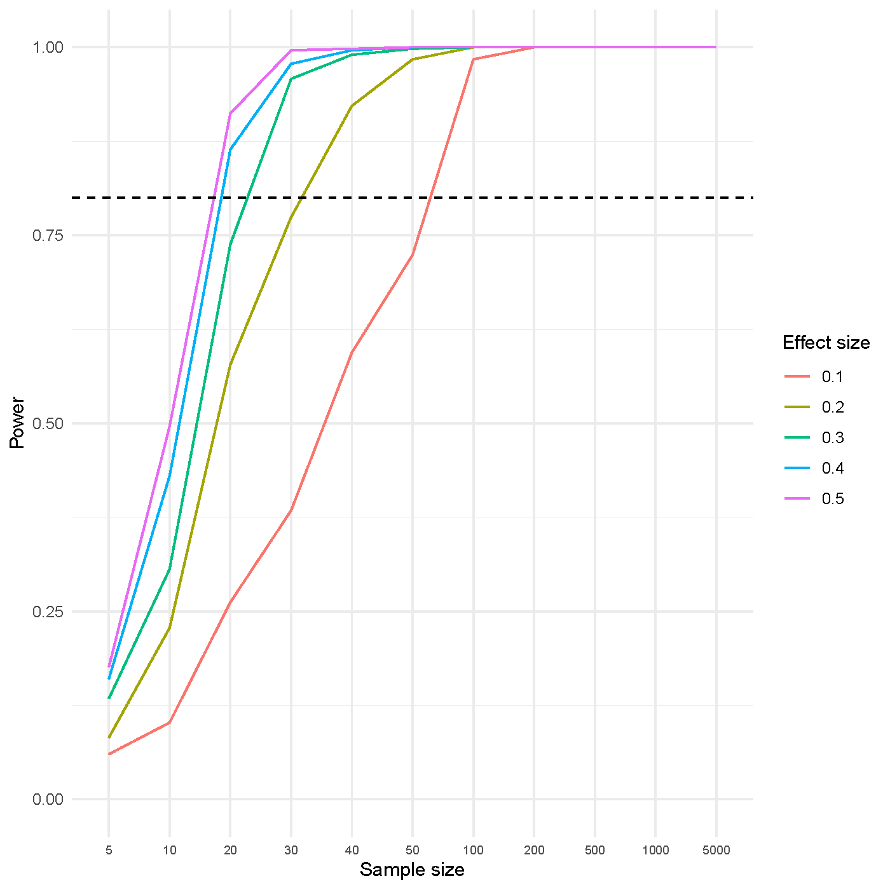
#knitr:: include_graphics("powerplotbook2A BWcool.png")
```


```{r powercontinuousb, echo = FALSE, warning=FALSE, message=FALSE, out.width='90%', fig.align = "center", fig.cap="Power as a function of sample size and effect size for a truncated normal-based distribution. Curves for effect size: from right the left = from 0.1 to 0.5 effect size."}
knitr:: 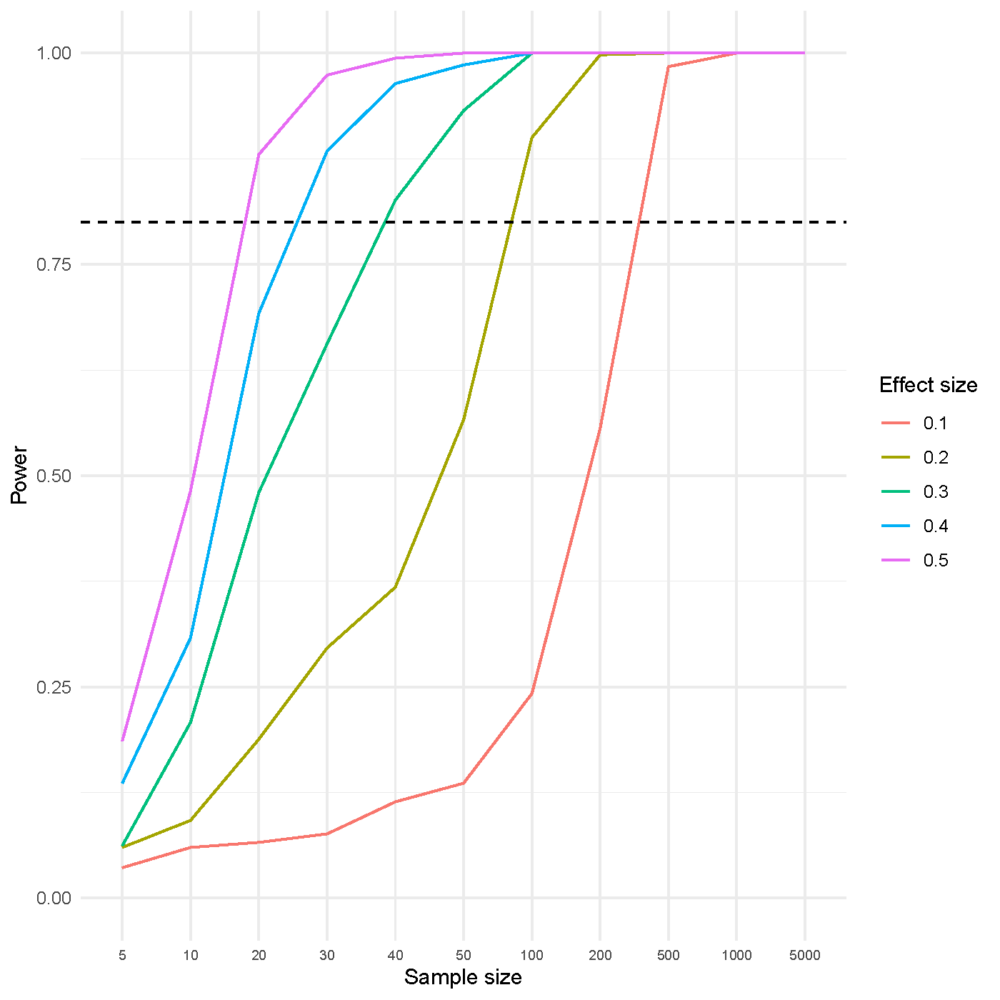
#knitr:: include_graphics("powerplotbook2B BWcool.png")
```

<!-- These results can be compared with a power analysis of simple linear regression analysis (with one predictor $X$) with normally distributed $X$ and $Y$ (mean = 0, standard deviation = 1). In this case the correlation coefficient equals the regression coefficient and is a relevant effect size measure. The relationship between sample size and power for given effect sizes (correlation coefficients of 0.05, 0.1,  0.2, 0.3, 0.4 and 0.5.) is shown in Figure \@ref(fig:powerregressionn).  -->

<!-- ```{r,powerrho, echo = FALSE, eval=FALSE} -->
<!-- library(broom) -->
<!-- #set simulation parameters -->
<!-- ns <- c(5, 10, 20, 30, 40, 50, 100, 200, 500) -->
<!-- true.rho <- c(0.05, 0.1, 0.2, 0.3, 0.4, 0.5) -->
<!-- rep = 500 -->
<!-- #simulation -->
<!-- set.seed(123) -->
<!-- results <- matrix(nrow = 0,ncol = 7) -->
<!-- for (i in 1:length(ns)) { -->
<!--   sample_size <- ns[i] -->
<!--   for (j in 1:length(true.rho)) { -->
<!--     rho <- true.rho[j] -->
<!--     sig_results <- c() -->
<!--     corr <- c() -->
<!--     beta <- c() -->
<!--     stbeta <- c() -->
<!--     sig <- c() -->
<!--     for (r in 1:rep) { -->
<!--       X = rnorm(n = sample_size, mean = 0, sd = 1) -->
<!--       Y = (rho * X) + sqrt(1 - rho*rho) * rnorm(n = sample_size, mean = 0, sd = 1) -->
<!--       df1 <- data.frame(cbind(X,Y)) -->
<!--       model <- lm(Y ~ X, data = df1) -->
<!--       beta[r] <- (model$coefficients[2]) -->
<!--       stmodel <- lm(data.frame(scale(model$model))) -->
<!--       corr[r] <- (cor(X,Y)) -->
<!--       sig[r] <- tidy(model)$p.value[2] -->
<!-- # plot(X,Y) -->
<!-- # abline(0, true.rho) -->
<!--       stbeta[r] <- (stmodel$coefficients[2]) -->
<!--       sig_results[r] <- tidy(model)$p.value[2] <= .05 -->
<!--     } -->

<!--     results <- rbind(results, -->
<!--                      c(mean(sig_results), -->
<!--                        sample_size, -->
<!--                        rho, -->
<!--                        mean(corr), -->
<!--                        mean(beta), -->
<!--                        mean(stbeta), -->
<!--                        mean(sig))) -->
<!--   } -->
<!-- } -->
<!-- resultsdf <- data.frame(results) -->

<!-- names(resultsdf) <- c("power", "n", "rho", "corr", "beta", "stbeta", "sig") -->

<!-- #plot:  x axis is effect size -->
<!-- resultsdf$n <- as.factor(resultsdf$n) -->
<!-- #png("powerregressionrho.png") -->
<!-- ggplot(resultsdf, -->
<!--        aes(x = rho, y = power, group = n, color = n)) + -->
<!--   geom_line() + -->
<!--   geom_hline(aes(yintercept = .8), linetype = 'dashed') + -->
<!--   theme_minimal()+ -->
<!--   labs(color = "Sample size") + -->
<!--   labs(x = 'Effect Size (\U03C1)', y = 'Power') -->
<!-- #dev.off() -->
<!-- #plot:  x axis is sample size -->
<!-- resultsdf$rho <- as.factor(resultsdf$rho) -->
<!-- resultsdf -->
<!-- #png("powerregressionn.png") -->
<!-- ggplot(resultsdf, -->
<!--        aes(x = n, y = power, group = rho, color = rho)) + -->
<!--   geom_line() + -->
<!--   #ylim(0, 100) + -->
<!--   geom_hline(aes(yintercept = 0.8), linetype = 'dashed') + -->
<!--   theme_minimal()+ -->
<!--   labs(color = "Effect size (\U03C1)") + -->
<!--   labs(x = 'Sample size', y = 'Power') -->
<!-- #dev.off() -->

<!-- ``` -->

<!-- ```{r powerregressionn, echo = FALSE, warning=FALSE, message=FALSE, out.width='90%', fig.align = "center", fig.cap="Relationship between effect size (correlation coefficient) and power of simple linear regression for different true effect sizes (correlation coefficients)."} -->
<!-- knitr:: include_graphics("powerregressionn.png") -->
<!-- ``` -->

<!-- Following arbitrary guidelines suggested by @cohen1977statistical, effect sizes of 0.1, 0.3 and 0.5 are often considered small, medium and large, respectively. The power analysis for this case of simple linear regression analysis (one predictor) shows that for larger effect sizes of 0.3-0.5, a power of more than 0.8 can be achieved with sample sizes of about 30-100. For smaller effect sizes (0.1-0.3) the required sample size is more than 100, and small effect sizes (0-0.1) require more than 500 cases. -->

<!-- In general, the minimum required sample size for a good powered NCA study, appears to be considerably smaller than the minimum required sample size for a good powered regression analysis, although specific power requirements depend on specific situations.   -->

## Reverse causality {#reversecausality}
*Reverse causality* occurs when the direction of cause and effect between two variables is the opposite of what is assumed or hypothesized. It may invalidate causal interpretations in observational studies. Reverse causality may also be a concern in NCA. When a hypothesis is formulated in NCA, it is expected that $X$ causes $Y$ and not that $Y$ causes $X$: first $X$, then $Y$ and not first $Y$, then $X$. NCA requires having a theoretical expectation (formal necessity hypothesis, see Chapter \@ref(hypothesisformulation)) that defines the causal direction. For example, if it is hypothesized that the presence or high level of $X$ is necessary for the presence or high level of $Y$, with $X$ on the horizontal axis and $Y$ on the vertical axis, the upper-left corner of the $XY$-plot is the *expected empty corner* (Section \@ref(direction) and Chapter \@ref(hypothesisformulation)). 

If the temporal order is not guaranteed by the study design (Section \@ref(observationalstudy)), and if it cannot be theoretically excluded, an observed empty area in the upper-left corner could not only represent high-high $X \rightarrow Y$-necessity (presence of high level of $X$ is necessary for presence or high level of $Y$), but could also represent low-low $Y \rightarrow X$-necessity (absence or low level of $Y$ is necessary for absence or low level of $X$), thus implying that $Y$ is a necessary cause of $X$ (low-low-necessity). This is illustrated in Figure \@ref(fig:reversefig) where the hypothesized causal condition is shown on the left and the alternative causal direction on the right. In Figure \@ref(fig:reversefig)-right the $XY$-plot is rotated 180 degrees in the vertical and horizontal directions, such that the empty corner appears in the lower-right corner. $Y$ is now on the horizontal axis and $X$ on the vertical axis. This visualizes that a high level of condition $Y$ *ensures* (is sufficient for) a certain minimum level of outcome $X$, and the 'ceiling line' becomes a 'floor line'. If such an effect can be theoretically justified (namely that a *single* cause ensures a certain minimum level of the outcome), the observed empty area in the upper-left corner (Figure \@ref(fig:reversefig)-left) has an alternative causal interpretation: $Y$ is a low-low necessary cause of $X$: absence of $Y$ is necessary for absence of $X$. Testing 'forward' necessity causality ($X \rightarrow Y$) in the true presence of reverse causality ($Y \rightarrow X$) may lead to false positive conclusions. However, this risk may be absent or low when reverse necessity causality is unrealistic (e.g., human life does not cause oxygen) or when, in multicausal phenomena, a *single* variable is unlikely to *produce* the outcome at a certain level. When reverse causality is not excluded by study design or theoretically, potential reverse causality should be considered.^[The uncertainty about the temporal order between $X$ and $Y$ could be a reason for doing time-lagged study or a necessity experiment. See Section \@ref(researchdesign).]

``` {r reversefigcode, echo = FALSE, eval = FALSE}
library("ggplot2")
# Example
corner1 = 1
slope1 = 1
effect1 = 0.1
if (corner1 == 1) {intercept1 <- 1 - sqrt(2 * effect1 * slope1)}
if (corner1 == 2) {intercept1 <- 1 + abs(slope1) - sqrt(2 * effect1 * abs(slope1))}
if (corner1 == 3) {intercept1 <- sqrt(2 * effect1 * abs(slope1))}
if (corner1 == 4) {intercept1 <- -1 * (slope1 - sqrt(2 * effect1 * slope1))}
int <- intercept1

#ceiling directions #####
xbox <- c(0,1,0,1)
ybox <- c(0,0,1,1)
box <- data.frame (xbox, ybox)

#all corners based on corner1
true.effect <- c(0.05, 0.05, 0.05, 0.05)
true.slope <- c(1,-1,-1,1)
true.intercept <- c(int, 1 + int, 1 - int, -int )
coefs <- data.frame(true.intercept,true.slope)


# Create the polygon to fill the center area (excluding corners)
fill_polygon <- data.frame(
  x = c(0, 1-int, int, 1, 1, int, 1-int, 0),
  y = c(1-int, 0, 0, 1-int, int, 1, 1, int)
)


lwdceil <- 1.5
lwdcorner <- 5

#Fig LEFT corner 1
fill_polygon <- data.frame(
  x = c(0, 1, 1, 1-int, 0),
  y = c(0, 0, 1, 1, int)
)

p1 <- ggplot(box, aes(x = xbox, y=ybox)) +
  geom_blank() + 
  geom_polygon(data = fill_polygon, aes(x = x, y = y), fill = "grey", alpha = 1) +  # Fill the area with grey
  geom_hline(aes(yintercept = 0.0), linetype = 'solid', size = 1.2) + 
  geom_hline(aes(yintercept = 1.0), linetype = 'solid', size = 1.2) +
  geom_vline(aes(xintercept = 0.0), linetype = 'solid', size = 1.2) +
  geom_vline(aes(xintercept = 1.0), linetype = 'solid', size = 1.2) +
  #geom_abline(data=coefs, aes(intercept=true.intercept, slope=true.slope), lwd = lwdceil) +
   geom_abline(aes(intercept=true.intercept[1], slope=true.slope[1]), lwd = lwdceil) + #corner 1
  #geom_abline(aes(intercept=true.intercept[2], slope=true.slope[2]), lwd = lwdceil) + #corner 2
  # geom_abline(aes(intercept=true.intercept[3], slope=true.slope[3]), lwd = lwdceil) + #corner 3
  # geom_abline(aes(intercept=true.intercept[4], slope=true.slope[4]), lwd = lwdceil) + #corner 4
  
  #ggtitle("ceiling direction = 'diagonal'") +
  annotate("text", x = 0, y = 0.85, label = "", hjust = -0.1, vjust = 0, size = lwdcorner) +
  #annotate("text", x = 0.75, y = 0.85, label = "corner = 2", hjust = 0, vjust = 0, size = lwdcorner) +
  # annotate("text", x = 0, y = 0.07, label = "corner = 3", hjust = -0.1, vjust = 0, size = 6) +
  # annotate("text", x = 0.8, y = 0.07, label = "corner = 4", hjust = 0, vjust = 0, size = 6) +
  labs(x = 'cause X', y = 'effect Y') +
  scale_x_continuous(limits = c(0, 1), expand = c(0, 0), breaks = c(0, 1)) +  # Set X-axis limits and breaks
  scale_y_continuous(limits = c(0, 1), expand = c(0, 0), breaks = c(0, 1)) +  # Set Y-axis limits and breaks
  coord_fixed(ratio = 1) +  # Ensures that axes are equal in length
  theme_minimal() +
  theme(
    panel.grid.major = element_blank(),  # Remove major grid lines
    panel.grid.minor = element_blank(),  # Remove minor grid lines
    axis.text = element_text(size = 14, color = "black"),  # Increase size of axis labels
    axis.title = element_text(size = 16, color = "black"), # Increase size of axis titles
    #axis.line = element_line(size = 1.2,color = "black"),  # Make the axis lines thicker
    #plot.background = element_rect(fill = "white"),  # Set the background color
    plot.margin = margin(20, 20, 20, 20)  # Set the margin around the plot
  )

# Save the plot as a PDF
#ggsave("reverse1.pdf", plot = p1, width = 5, height = 5, dpi = 600)
print(p1)


#Fig RIGHT corner 4
fill_polygon <- data.frame(
  x = c(0, int, 1    , 1, 0),
  y = c(0, 0  , 1-int, 1, 1)
)
p4 <- ggplot(box, aes(x = xbox, y=ybox)) +
  geom_blank() + 
  geom_polygon(data = fill_polygon, aes(x = x, y = y), fill = "grey", alpha = 1) +  # Fill the area with grey
  geom_hline(aes(yintercept = 0.0), linetype = 'solid', size = 1.2) + 
  geom_hline(aes(yintercept = 1.0), linetype = 'solid', size = 1.2) +
  geom_vline(aes(xintercept = 0.0), linetype = 'solid', size = 1.2) +
  geom_vline(aes(xintercept = 1.0), linetype = 'solid', size = 1.2) +
  
  #geom_abline(data=coefs, aes(intercept=true.intercept, slope=true.slope), lwd = lwdceil) +
  #geom_abline(data=coefs[1,], aes(intercept=true.intercept[1], slope=true.slope[1]), lwd = lwdceil) + #corner 1
  #geom_abline(aes(intercept=true.intercept[2], slope=true.slope[2]), lwd = lwdceil) + #corner 2
  #geom_abline(aes(intercept=true.intercept[3], slope=true.slope[3]), lwd = lwdceil) + #corner 3
   geom_abline(aes(intercept=true.intercept[4], slope=true.slope[4]), lwd = lwdceil) + #corner 4
  
  #ggtitle("ceiling direction = 'diagonal'") +
  #annotate("text", x = 0, y = 0.85, label = "corner = 1", hjust = -0.1, vjust = 0, size = lwdcorner) +
  #annotate("text", x = 0.75, y = 0.85, label = "corner = 2", hjust = 0, vjust = 0, size = lwdcorner) +
  #annotate("text", x = 0, y = 0.12, label = "corner = 3", hjust = -0.1, vjust = 0, size = lwdcorner) +
   annotate("text", x = 0.75, y = 0.12, label = "", hjust = 0, vjust = 0, size = lwdcorner) +
  labs(x = 'cause Y', y = 'effect X') +
  scale_x_continuous(limits = c(0, 1), expand = c(0, 0), breaks = c(0, 1)) +  # Set X-axis limits and breaks
  scale_y_continuous(limits = c(0, 1), expand = c(0, 0), breaks = c(0, 1)) +  # Set Y-axis limits and breaks
  coord_fixed(ratio = 1) +  # Ensures that axes are equal in length
  theme_minimal() +
  theme(
    panel.grid.major = element_blank(),  # Remove major grid lines
    panel.grid.minor = element_blank(),  # Remove minor grid lines
    axis.text = element_text(size = 14, color = "black"),  # Increase size of axis labels
    axis.title = element_text(size = 16, color = "black"), # Increase size of axis titles
    #axis.line = element_line(size = 1.2,color = "black"),  # Make the axis lines thicker
    #plot.background = element_rect(fill = "white"),  # Set the background color
    plot.margin = margin(20, 20, 20, 20)  # Set the margin around the plot
  )

# Save the plot as a PDF
#ggsave("reverse4.pdf", plot = p4, width = 5, height = 5, dpi = 600)

print(p4)
```

```{r reversefig, echo = FALSE, warning=FALSE, message=FALSE,  fig.show="hold", out.width='45%', fig.align = "center", fig.cap= "Reverse causality in NCA. Left: Expected empty area: X causes Y. Right: Possibility of reverse causality: Y causes X."}
#par(mfrow = c(1,2))
knitr:: 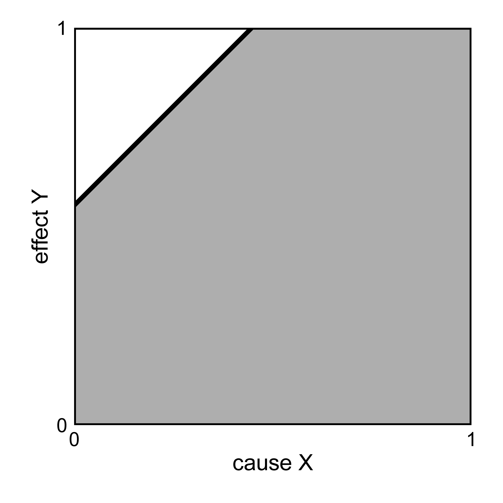
knitr:: 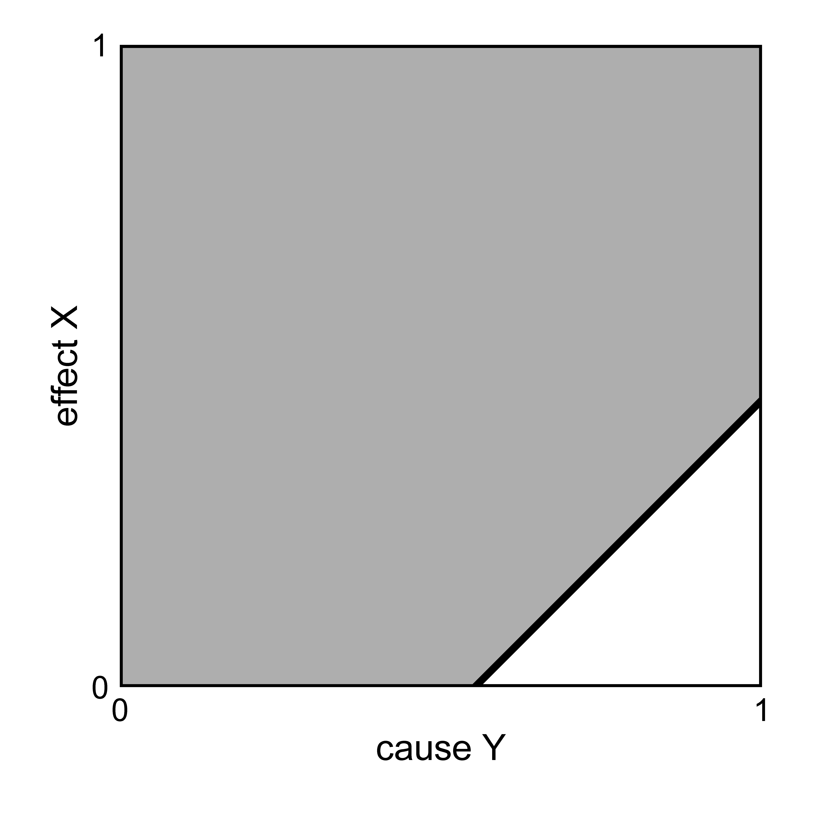
```

## Measurement error {#measurementerror}
For valid estimations, many methods assume no measurement error in the data; NCA is no different. Measurement error may occur in practice and this affects the findings. In NCA, the effect of measurement error depends on the location of the affected cases. Cases with measurement error that are near the ceiling zone can have a strong influence on the effect size. A case with measurement error may be in the otherwise empty area. This would result in an underestimation of the effect size. Measurement error in cases that are far below the ceiling line generally do not influence the effect size (depending on the size of the measurement error). When the  analysis is done with the empirical rather than theoretical scope (Section \@ref(formalexpression)), cases with measurement error that are near the borders of the bounding box can affect the size of the box and thus the necessity effect size. 
Cases with measurement error that can have a large influence on the effect size, are treated in NCA as *potential* ceiling or scope outliers that can be analyzed separately (Section \@ref(outliers)).

## Spuriousness {#spurious}

An observed relationship is spurious when an alternative causal explanation is clearly more credible, either because it is theoretically more plausible or it fits the empirical evidence better. In NCA, an apparent effect size may be spurious for several reasons.

### Lack of theoretical support
The first important reason is the lack of theoretical support: the absence of a convincing necessity hypothesis. During the development of a formal hypothesis, thought experiments are used to make plausible that without $X$ it is not possible to obtain $Y$. (Chapter \@ref(hypothesisformulation)). Empty spaces in an $XY$-plot can arise from many reasons other than necessity. The importance of a strong theoretical justification is illustrated by the fact that NCA rejects necessity when such a hypothesis is not available (Section \@ref(corecriteria)). 

This is also important because NCA lacks a diagnostic signal in the data indicating that a relationship could be spurious. In particular, the observed effect size is insensitive to including or excluding third variables in the analysis.^[This is also an attractive feature when interpreting observational data causally.] This contrasts with regression analysis, where adding a third variable, such as a confounder that causes both $X$ and $Y$, as a control variable will often change the regression coefficient of the hypothesized $XY$ relationship (omitted variable bias when the third variable is excluded). This signals that the original $XY$-relationship may be  spurious.^[Regression models describe the conditional expectation $E[Y\mid X]$, i.e., the central trend of $Y$ given $X$. In a two-dimensional $XY$-plot, a fitted line shows the *unadjusted* bivariate association between $X$ and $Y$. When potential confounders are included in a multiple regression model, the *conditional* (adjusted) trend may differ from the unadjusted line, often with different intercepts and slopes. The unadjusted relationship is sometimes referred to as  *total (bivariate) effect* (including the influence of confounders), whereas the adjusted relationship corresponds to the *net effect*, isolating the association between $X$ and $Y$ after accounting for confounding. The difference between adjusted and unadjusted association can be used as a diagnostic tool for potentially spurious relationships.]

In the context of NCA, a third variable $Z$ that is considered a *sufficiency* cause for $X$ (produces $X$) and a *necessity* cause for $Y$, may be a better causal explanation for the observed empty space in the $XY$-relationship than the necessity of $X$ for $Y$. If so, the original hypothesis that the $XY$-relationship may be considered spurious. Considering a third variable $Z$ (provided that theoretical support is available for it) as being sufficient for $X$ and necessary for $Y$ allows conducting a multiple NCA in which both $X$ and $Z$ are evaluated as potentially necessary conditions. However, including the third variable in the analysis  does not change the effect size of the $XY$ necessity relationship; instead it can add an additional explanation of what enables $Y$.

For example, for driving a non-automatic electric car, having the handle in the Drive position ($X$) is necessary for the car to drive ($Y$). Furthermore, a driver ($Z$) is sufficient for positioning the handle in the Drive position (but not necessary as the handle may already be in the Drive position or another person may place it there). A driver is also necessary for the car to drive (but not sufficient, because $X$ and many other conditions must also be satisfied). NCA would identify both $X$ and $Z$ as necessary conditions if the necessity pattern is observed and theoretical support is available. The estimated effect size for the $XY$ relationship is not affected by the presence or absence of $Z$ in the analysis. Moreover, $Z$ does not make the $XY$ relationship spurious.

Only when theoretical support for the $XY$-relationship is lacking or weak can it be helpful to consider an alternative necessary condition $Z$ that is also sufficient for $X$, to assess theoretically whether the observed $XY$ effect size may be attributable to that causal structure. For example, based on an example presented by @mahoney2007elaboration, suppose the situation that an analyst proposes a weak hypothesis that having no beard ($X$) is necessary for pregnancy ($Y$), and observes a statistically significant necessity effect size that meets NCA's criteria for non-rejection. A more credible alternative explanation is that oestrogen ($Z$) is necessary for pregnancy, and sufficient for having no beard. This theoretical reasoning reveals that the original hypothesis is not defensible. Thus, possible spuriousness in NCA lies not in the data pattern but in the theory attached to it. Claiming that a theoretically justified $XY$ necessity relationship is spurious due to a third variable $Z$ that is sufficient for $X$ and necessary for $Y$, amounts to proposing a competing *theoretically justified* and *empirically supported* explanation in which $Z$ is a sufficient cause for $X$ and a necessary cause for $Y$ and that this alternative explanation is more credible.

In general, it is not easy to find theoretically justified sufficiency relationships involving a single sufficiency cause, except when variables are conceptually very similar. Potential sufficiency relationships of $ZX$ can be analyzed with NCA by analyzing the lower-right corner of the $ZX$-plot (or the lower-right corner of the $XZ$-plot when $X$ is considered as a sufficient cause for $Z$ and a necessary cause for $Y$).

### Low-quality data
The second important reason is inadequate data. For estimating necessity from sample data, it is essential that the sample represents the population *of interest*. This target population must be part of the theoretical domain, which is the universe of cases where the theory (formal necessity hypothesis) is expected to hold (also called boundary conditions, scope conditions, range of applicability, contextual constraints, etc.). 

When the sample is drawn from a population that is (partly) outside the theoretical domain, the sample is not representative and existing necessity may not be identified; in that case the observed "non-necessity" relationship is spurious (a false negative conclusion). The same holds for samples that are too small to identify an existing necessity relationship in the population (lack of power, see Section \@ref(statisticspower)). Similarly, with a sample from outside the theoretical domain, a non-existing necessity relationship may be observed but is spurious (a false positive conclusion).

An additional requirement is that the sample covers all possible combinations of variables, such that cases near the expected empty corner are included. Because population characteristics are normally unknown, adequate coverage can be achieved through random sampling  (also needed to meet the requirements for NCA's statistical test) to obtain a large-n sample, or through replication studies with new samples from the same population. If these requirements are not met, the identified empty space (or non-empty space) may be spurious (Section \@ref(samplinglogic)).

Unreliable or invalid measurement of $X$ or $Y$ (Section \@ref(measurementerror)) may also result in spuriousness. The same applies to inappropriate data transformations (e.g., nonlinear transformations) that distort the data pattern (Section \@ref(transformation)).

With a well-specified necessity theory (Chapter \@ref(hypothesisformulation)) and adequate data (Chapter \@ref(datacollection)), the risk of spurious necessity relationships can be substantially reduced, though never fully eliminated.

<!-- NCA's formal necessity hypothesis and requirement for theoretical justification should limit the risk that an observed empirical necessity pattern is misinteterpreted, for example when $Z$ is sufficient for $X$ and necessary for $Y$, $Z$ rather than $X$ may be the causal factor and $X$ is a proxy of it ['redundant necessary cause', @mahoney2007elaboration]. -->

<!-- ### Confounding in regression and NCA -->

<!-- As noted in Section \@ref(endogeneityinregression), endogeneity occurs in regression when an explanatory variable $X$ is correlated with the error term $\varepsilon$ (the part of $Y$ not explained by the model), with the three main sources of endogeneity: omitted variables (missing variables that affect both $X$ and $Y$), simultaneity ($X$ and $Y$ influence each other) and measurement error (errors in measuring $X$ that induce correlation with the residual).   -->

<!-- Confounding in regression typically means omitted-variable-bias: a missing variable that affects both $X$ and $Y$, creating biased estimates of regression coefficients. This corresponds to what is called here *quantitative confounding*. Because omitted-variable-bias directly threatens causal interpretation, there is no need to distinguish between “quantitative” and “qualitative” confounding in regression. If confounding exists, it always biases estimation and invalidates causal claims.   -->

<!-- In NCA, the situation is different. By construction, NCA effect sizes are not biased by omitted variables in the same way regression coefficients are. That is, quantitative confounding (in the sense of omitted-variable-bias) does not exist in NCA. However, NCA can still face *qualitative confounding*, which refers to a threat to causal explanation even when the effect size itself is unbiased.   Qualitative confounding in NCA occurs when another condition $Z$:   -->

<!-- 1. is itself necessary for $Y$, and   -->
<!-- 2. is also sufficient for $X$ (or equivalently, $X$ is necessary for $Z$).   -->

<!-- In this case, the observed necessity effect of $X$ for $Y$ may in fact be explained entirely by the necessity of $Z$ for $Y$. Suppose $X =$ “leadership quality” appears to be necessary for $Y =$ “team success.” However, if $Z =$ “organizational culture” is necessary for team success and sufficient for leadership quality, then the apparent necessity of leadership may simply be a reflection of culture. In this case, $X$’s observed necessity effect is confounded by $Z$.   -->

<!-- Therefore, in NCA it is important to 'theorize away' mutual sufficiency relationships between necessary conditions in order to exclude qualitative confounding. Therefore, the theoretical justification of the necessity hypothesis includes an evaluation that it is implausible that a second necessary conditions is sufficient for the necessary condition of interest and eliminates it. Chapter \@ref(hypothesisformulation) presents a theoretical approach to formulate a *true necessary condition*, a condition whose necessity cannot be explained by another necessary condition. Note that sufficiency causal relationships ($X$ always produces $Y$, independent of other variables) are not very common. Note also that simple probabilistic correlations (or probabilistic sufficiency) between necessary conditions do not by themselves qualify as sufficiency relationships. If, however it cannot be excluded that another necessary condition for $Y$ is also sufficient for $X$, it may be also possible to 'empirically test away' mutual sufficiency relationships between necessary conditions. Chapter \@ref(dataanalysis) discusses an empirical approach to evaluate whether an observed necessary condition could in fact be explained by another observed necessary condition. -->

<!-- Therefore, in NCA it is important to *theorize away* mutual sufficiency relationships between necessary conditions in order to exclude qualitative confounding. The theoretical justification of a necessity hypothesis should therefore include an evaluation of whether it is implausible that a second necessary condition is sufficient for the necessary condition of interest.  -->

<!-- Chapter \@ref(hypothesisformulation) presents a theoretical approach to formulate a *true necessary condition*, which is a condition whose necessity cannot be explained by another necessary condition. Note that sufficiency causal relationships ($X$ always produces $Y$, independent of other variables) are not very common. Also note that simple probabilistic correlations (or probabilistic sufficiency) between necessary conditions do not by themselves qualify as sufficiency relationships. -->

<!-- If, however, it cannot be theretically excluded that another necessary condition for $Y$ is also sufficient for $X$, it may be possible to *empirically test away* mutual sufficiency relationships between observed necessary conditions. Chapter \@ref(dataanalysis) discusses an empirical approach to evaluate whether an observed necessary condition could in fact be explained by another observed necessary condition. Uncertainty about potential qualitative confounding could be a reason for doing a randomized necessity experiment. See Section \@ref(researchdesign). -->


 

<!-- ``` {r} -->
<!-- # Load required libraries -->
<!-- library(ggplot2) -->
<!-- library(NCA) -->

<!-- N = 100 -->
<!-- # Set random seed for reproducibility -->
<!-- set.seed(123) -->

<!-- # Simulated true relationship between x and y -->
<!-- true_x <- seq(1, 10, length.out = N) -->
<!-- true_y <- 2 * true_x + rnorm(N, mean = 0, sd = 2) -->

<!-- # Simulated measured x variable (with uncorrelated measurement error) -->
<!-- measured_x_uncorr <- true_x + rnorm(N, mean = 0, sd = 1) -->

<!-- # Simulated measured x variable (with correlated measurement error) -->
<!-- measured_x_corr <- true_x + rnorm(N, mean = 0, sd = 1) + true_x * 0.3 -->

<!-- # Create a data frame -->
<!-- data_uncorr <- data.frame(x = measured_x_uncorr, y = true_y) -->
<!-- data_corr <- data.frame(x = measured_x_corr, y = true_y) -->

<!-- # Plot the data and regression lines with legends -->
<!-- ggplot() + -->
<!--   geom_point(data = data_uncorr, aes(x = x, y = y), color = "blue") + -->
<!--   geom_smooth(data = data_uncorr, aes(x = x, y = y), method = "lm", se = FALSE, linetype = "dashed", color = "blue") + -->
<!--   geom_point(data = data_corr, aes(x = x, y = y), color = "red") + -->
<!--   geom_smooth(data = data_corr, aes(x = x, y = y), method = "lm", se = FALSE, linetype = "dashed", color = "red") + -->
<!--   geom_abline(intercept = 0, slope = 2, linetype = "solid", color = "black", size = 1) + -->
<!--   labs(title = "Measurement Error in x", -->
<!--        subtitle = "Blue: Uncorrelated\nRed: Correlated\nBlack: True Relationship", -->
<!--        x = "Measured x", -->
<!--        y = "y") + -->
<!--   theme_minimal() -->

<!-- #now for NCA -->

<!-- # Simulated true relationship between x and y -->
<!-- intercept = 0.3 -->
<!-- slope = 1 -->
<!-- ES = ((1-intercept)^2)/(2*slope) -->
<!-- ES -->
<!-- true_x <- true_y <- numeric(N) -->

<!-- for (i in 1:N) { -->
<!--   reject <- TRUE -->
<!--   while (reject) { # Check if point is below line -->
<!--     xtry <- runif(1, 0, 1) -->
<!--     ytry <- runif(1, 0, 1)  -->
<!--     #ytry <- 2 * xtry + rnorm(1, mean = 0, sd = 0.5) #xy correlated -->
<!--     if (ytry <= min(1, (intercept + slope * xtry)) & ytry >= 0) { -->
<!--       reject <- FALSE -->
<!--     } -->
<!--   } -->
<!--   true_y[i] <- ytry -->
<!--   true_x[i] <- xtry -->
<!-- } -->

<!-- # Create a data frame -->
<!-- data_true_nca <- data.frame(x = true_x, y = true_y) -->
<!-- model_true <- nca_analysis(data_true_nca,1,2, ceilings = 'cr_fdh') -->
<!-- model_true -->
<!-- nca_output(model_true, summaries = FALSE) -->
<!-- abline(intercept,slope) -->

<!-- # Simulated measured x variable (with uncorrelated measurement error) -->
<!-- measured_x_uncorr <- numeric(N) -->
<!-- for (i in 1:N) { -->
<!--   reject <- TRUE -->
<!--   while (reject) { # Check if point is below line -->
<!--     xtry <- true_x[i] -->
<!--     trymeasured_x_uncorr <- xtry + rnorm(1, mean = 0.5, sd = 0.5) -->
<!--     if (trymeasured_x_uncorr <= 1 & trymeasured_x_uncorr >= 0) { -->
<!--       reject <- FALSE -->
<!--     } -->
<!--   } -->
<!--   measured_x_uncorr[i] <- trymeasured_x_uncorr -->
<!-- } -->
<!-- data_measured_x_uncorr_nca <- data.frame(x = measured_x_uncorr, y = true_y) -->
<!-- model_measured_x_uncorr <- nca_analysis(data_measured_x_uncorr_nca,1,2, ceilings = 'cr_fdh') -->
<!-- model_measured_x_uncorr -->
<!-- nca_output(model_measured_x_uncorr, summaries = FALSE) -->
<!-- abline(intercept,slope) -->

<!-- # Simulated measured x variable (with correlated measurement error) -->
<!-- measured_x_corr <- numeric(N) -->
<!-- for (i in 1:N) { -->
<!--   reject <- TRUE -->
<!--   while (reject) { # Check if point is below line -->
<!--     xtry <- true_x[i] -->
<!--     trymeasured_x_corr <- xtry + rnorm(1, mean = 0.5, sd = 0.5 + true_x *0.3) -->
<!--     if (trymeasured_x_corr <= 1 & trymeasured_x_corr >= 0) { -->
<!--       reject <- FALSE -->
<!--     } -->
<!--   } -->
<!--   measured_x_corr[i] <- trymeasured_x_corr -->
<!-- } -->
<!-- data_measured_x_corr_nca <- data.frame(x = measured_x_corr, y = true_y) -->
<!-- model_measured_x_corr <- nca_analysis(data_measured_x_corr_nca,1,2, ceilings = 'cr_fdh') -->
<!-- model_measured_x_corr -->
<!-- nca_output(model_measured_x_corr, summaries = FALSE) -->
<!-- abline(intercept,slope) -->
<!-- ``` -->


 
<!-- $$\begin{aligned} -->
<!-- \small\frac{\frac{1}{4C_{a,b}} \left( 1 -x_0 - \tfrac{1}{3}ax_0 + (x_0 + \tfrac{1}{3}ax_0) C_{a,b} \right)- \frac{1}{2C_{a,b}} \left(  1- \tfrac{2}{3} x_0  + \tfrac{2}{3} x_0 C_{a,b} \right)\frac{1}{2C_{a,b}} \left( 1 - \tfrac{2}{3}(a+2)  +   \tfrac{2}{3}(a+2)  C_{a,b} \right)}{\sqrt{\frac{1}{3C_{a,b}} \left( (1 - \tfrac{1}{2} x_0^2) +  \tfrac{1}{2} x_0^2 C_{a,b}  \right)- \left( \frac{1}{2C_{a,b}} \left(  1- \tfrac{2}{3} x_0  + \tfrac{2}{3} x_0 C_{a,b} \right)\right)^2} \sqrt{\frac{1}{3C_{a,b}} \left( -\tfrac{1}{2} (1+a)^2  +  (1 + \tfrac{1}{2} (1+a)^2) C_{a,b})  \right)- \left( \frac{1}{2C_{a,b}} \left( 1 - \tfrac{2}{3}(a+2)  +   \tfrac{2}{3}(a+2)  C_{a,b} \right)\right)^2}} -->
<!-- \end{aligned}$$ -->

<!-- where $C_{a,b}$ is the area below the ceiling and within the scope,  $a$ is the intercept of the ceiling line, and $x_0 = (1-a)/b$ is the $x$-value of the intersection between the ceiling line and the line $y = 1$. -->


<!-- : Y = a + bX + e, where a is the intercept, b is the slope and e representing all other causes of Y. This equation represents _additive_ causal logic because X or e can produce Y and the equation represents an _average effect_ of X on Y when the average value of e is assumed zero. These _assumptions_ about truth in the population correspond to the assumptions for applying OLS regression analysis and justifies drawing a regression line through the middle of the data. -->


<!-- The regression line illustrates the correlation _only_ when it is caused by the linear average relationship in the population.  -->
<!-- It would be _wrong_ to describe correlation with a regression line if the correlation is not caused by a corresponding linear relationship in the population, like in the first example where the correlation is caused by chance. A necessity causal relationship between X and Y can also and only be produced by a correlation between X and Y. In that case the correlation should not be represented by a regression line.   -->

<!-- Note that it is often assumed that e is normally distributed and thus can have any value between -Inf and + Inf. As a consequence also Y can have any value between -Inf and + Inf. Moreover, the additive equation indicates that X is not a necessary cause of Y because a certain value of e can compensate for it. The linear equation indicates that X is a sufficient but not necessary cause of Y. -->


<!-- ## \textcolor{gray}{NCA’s Data Generation Process} -->
<!-- ## <span style="color: #D3D3D3">NCA’s Data Generation Process</span> -->
<!-- under construction -->

<!-- ## \textcolor{gray}{The absence of assumptions about the distribution of the data} -->
<!-- ## <span style="color: #D3D3D3">The absence of assumptions about the distribution of the data</span> -->
<!-- under construction -->


<!-- ## \textcolor{gray}{How to perform simulations with NCA} -->
<!-- ## <span style="color: #D3D3D3">How to perform simulations with NCA</span {#simulations} -->
<!-- ## How to perform simulations with NCA {#simulations} -->
<!-- For designing a proper simulation with NCA  a researcher must make several design decisions for the simulation. Here it is assumed that the simulation is done in the context of theory testing research where a hypothesis is formulated and tested with (simulated) data. These data are assumed to be obtained by random sampling from a population with a known causal relation between $X$ and $Y$ and known population parameters. This section discusses how a proper simulation with NCA differs from common simulations with regression analysis. -->

<!-- A simulation with regression is used in the context of testing an *additive* theory. Such theory assumes that $X$ produces $Y$ ($X$ is sufficient for $Y$) and that also other factors can produce $Y$. The other factors are unknown and collected in a variable epsilon ($\epsilon$). This theory can be expressed for example as the linear relationship: $Y = a + bX + \epsilon$, where $a$ and $b$ are the population parameters to be estimated. This equation also represents the Data Generation Process (i.e., how $Y$ is generated from $X$, $\epsilon$, $a$ and $b$). The factors in the equation can compensate for each other. For example, when $X$ is absent, $\epsilon$ can produce any value of Y the outcome.  -->

<!-- When regression analysis is used for estimating the population parameters, several assumptions have to be made [@berry1993understanding]. One assumption is that $\epsilon$ is a random variable with average value zero. Another assumption is that $Y$ is unbounded (i.e., has values between minus infinity and plus infinity). To satisfy these assumptions, $\epsilon$ is usually defined as a *normally* distributed random variable (which is unbounded between -Inf and +Inf) with zero mean. This ensures that also $Y$ is unbounded (and thus can have values between -Inf and +Inf). -->

<!-- A simulation with NCA in the context of a necessity theory starts with defining the ceiling line. For example, a linear ceiling line is $Y = a_c + b_cX$. The ceiling line defines the effect size $d$, which is the main parameter to be estimated. The ceiling line can be reformulated as in \@ref(eq:stat1), where $\epsilon \geq 0$. NCA requires that both $X$ and $Y$ are bounded, which allows the calculation of the scope and the effect size. NCA does not put  other requirements on the distribution other then that the data must be under the ceiling and withing the scope.  -->

<!-- Consequently, for a proper simulation with NCA the DGP can only use a bounded distribution for $\epsilon$ (e.g., a beta distribution). Using a normal or other *unbounded* distribution to define the population is incorrect. With an unbounded distribution (independently if or how $X$ and $Y$ are related), the scope, ceiling line and effect size do not exist in the population, so it makes no sense to estimate these parameters with NCA (the theoretical scope is infinite). In a finite sample there may be an empirical scope and an empty area but estimated 'effect sizes' and other NCA parameters are then flawed. Similarly, using an *bounded* distribution for evaluating the quality of regression estimators is incorrect and gives flawed results.  -->


<!-- ### From necessity to correlation^{This section was prepared by Roelof Kuik} -->

<!-- #### Situation -->

<!-- <figure id="fig:boundingline"> -->

<!-- <figcaption>Parameters: <span -->
<!-- class="math inline">0 &lt; <em>a</em> &lt; 1</span> and <span -->
<!-- class="math inline">1 − <em>a</em> &lt; <em>b</em></span>.</figcaption> -->
<!-- </figure> -->

<!-- Define $L(x) = \min\{1,a+bx\}$. $$\begin{aligned} -->
<!--  C_{a,b} & \equiv \int_0^1 L(x) \mathop{}\!\mathrm{d}x = \text{surface area below red line} \\ -->
<!--    & = 1 - \text{surface area above red line} \\ -->
<!--    & = 1 - \tfrac{1}{2} (1-a) x_0 = 1 - \frac{(1-a)^2}{2b} -->
<!-- \end{aligned}$$ Uniform distribution $(X,Y)$ below red line: -->
<!-- $$\begin{aligned} -->
<!-- X & \propto \frac{1}{C_{a,b}} L(x) \mathop{}\!\mathrm{d}x \\ -->
<!-- Y|X & \propto \frac{I_{[0,L(x)]}(y)}{L(x)}  \mathop{}\!\mathrm{d}y -->
<!-- \end{aligned}$$ where $X$ is a random variable, $Y|X$ is a random -->
<!-- variable $Y$ conditioned on $X$ and $\propto$ means 'distributed with a -->
<!-- density function given as'. Further, $I_{[0,L(x)]}$ is the indicator -->
<!-- function for the interval $[0,L(x)]$. Note that -->
<!-- $$(X,Y) \propto \frac{1}{C_{a,b}} I_{[0,L(x)]}(y) \mathop{}\!\mathrm{d}x \, \mathop{}\!\mathrm{d}y$$ -->
<!-- is indeed the (normalized) uniform distribution below the line. -->

<!-- The text below uses four values, $a$, $b$, $x_0$, and $C_{a,b}$ to -->
<!-- formulate expressions. Two are all that are needed. Indeed, for example, -->
<!-- $$\begin{aligned} -->
<!-- \frac{1-C_{a,b}}{x_0} & = \frac{\frac{(1-a)^2}{2b}}{(1-a)/b} = \tfrac{1}{2} (1-a) -->
<!-- \end{aligned}$$ and so -->
<!-- $$a =  1- 2 \frac{1-C_{a,b}}{x_0} \quad \text{or} \quad x_0 = 2 \frac{1-C_{a,b}}{1-a} \quad \text{or} \quad C_{a,b} = 1 - x_0 (1-a)/2 \; .$$ -->
<!-- Likewise -->
<!-- $$b = (1-a)/x_0 = \left( \frac{1- 2 \frac{1-C_{a,b}}{x_0}}{x_0}  \right) \; .$$ -->

<!-- #### Symmetry transformation -->

<!-- Consider the 'double flip + transposition' transformation: -->
<!-- $$(x,y) \mapsto (\alpha,\beta) \equiv (1-y,1-x) \; .$$ In $\alpha\beta$ -->
<!-- coordinates Figure [1](#fig:boundingline){reference-type="ref" -->
<!-- reference="fig:boundingline"} presents itself as -->

<!-- <figure id="fig:flipboundingline"> -->

<!-- <figcaption>Parameters: <span -->
<!-- class="math inline"><em>â</em> = 1 − <em>a</em></span> with <span -->
<!-- class="math inline">0 &lt; <em>â</em> &lt; 1</span> and <span -->
<!-- class="math inline">0 &lt; <em>x</em><sub>0</sub> &lt; 1</span>.</figcaption> -->
<!-- </figure> -->

<!-- Now -->
<!-- $${{E}}{Y} = {{E}}(1-\alpha) = 1 - {{E}}(\alpha)$$ -->
<!-- where, by symmetry, -->
<!-- $${{E}}(\alpha) = {{E}}(X)[\text{where $x_0 \leftrightarrow \hat{a}$}] \; .$$ -->
<!-- Note that under the symmetry $x_0 \leftrightarrow \hat{a}$ the value of -->
<!-- $C_{a,b} = 1 - \tfrac{1}{2} x_0 \hat{a}$ is evidently invariant. -->

<!-- #### Correlation -->

<!-- $$\rho_{XY} = \frac{{{E}}(XY) - {{E}}(X) {{E}}(Y)}{\sigma_X \sigma_Y}$$ -->
<!-- Five integrals: -->

<!-- 1.  Expectation of $X$. $$\begin{aligned} -->
<!--      {{E}}(X) & = \frac{1}{C_{a,b}} \int_0^1 x L(x) \mathop{}\!\mathrm{d}x = = \frac{1}{C_{a,b}} \int_0^1 x \min\{1,a+bx\} \mathop{}\!\mathrm{d}x\\ -->
<!--                            & = \frac{1}{C_{a,b}} \left( \int_0^{(1-a)/b} (ax + bx^2) \mathop{}\!\mathrm{d}x + \int_{(1-a)/b}^1 x \mathop{}\!\mathrm{d}x \right) \\ -->
<!--                            & = \frac{1}{C_{a,b}} \left( \left.{(\tfrac{1}{2}ax^2 + \tfrac{1}{3}bx^3)}\right\rvert_{0}^{(1-a)/b} + \left.{\tfrac{1}{2} x^{2}}\right\rvert_{(1-a)/b}^{1} \right) \\ -->
<!--                            & = \frac{1}{C_{a,b}} \left( \tfrac{1}{2}a \left(\frac{1-a}{b}\right)^2 + \tfrac{1}{3}b\left(\frac{1-a}{b}\right)^3 + \tfrac{1}{2} - \tfrac{1}{2} \left(\frac{1-a}{b}\right)^{2} \right)\\ -->
<!--                            & = \frac{1}{2C_{a,b}} \left( 1 + (a + \tfrac{2}{3} (1-a) + 1) \left(\frac{1-a}{b}\right)^2\right) \\ -->
<!--                            & = \frac{1}{2C_{a,b}} \left( 1 - \tfrac{1}{3} (1-a) \left(\frac{1-a}{b}\right)^2\right) \\ -->
<!--                            & = \frac{1}{2C_{a,b}} \left( \tfrac{2}{3}\frac{(1-a)}{b} - \tfrac{2}{3} \frac{(1-a)}{b} \frac{(1-a)^2}{2b} +  1- \tfrac{2}{3}\frac{(1-a)}{b} \right) \\ -->
<!--                            & = \frac{1}{2C_{a,b}} \left( \tfrac{2}{3}\frac{(1-a)}{b} C_{a,b} +  1- \tfrac{2}{3}\frac{(1-a)}{b} \right) \\ -->
<!--                            & = \tfrac{1}{2} \left( \tfrac{2}{3}\frac{(1-a)}{b} +  \left( 1- \tfrac{2}{3}\frac{(1-a)}{b} \right) \frac{1}{C_{a,b}} \right) \\ -->
<!--                            & = \tfrac{1}{2} \left( \tfrac{2}{3} x_0 +  \left( 1- \tfrac{2}{3} x_0  \right) \frac{1}{C_{a,b}} \right)\\ -->
<!--                            & = \frac{1}{2C_{a,b}} \left(  1- \tfrac{2}{3} x_0  + \tfrac{2}{3} x_0 C_{a,b} \right) -->
<!--     \end{aligned}$$ Note. As $\frac{1}{C_{a,b}} \geq 1$ we have -->
<!--     $${{E}}(X) = \tfrac{1}{2} \left( \tfrac{2}{3} x_0 +  \left( 1- \tfrac{2}{3} x_0  \right) \frac{1}{C_{a,b}} \right) \geq  \tfrac{1}{2} \left( \tfrac{2}{3} x_0 +  1- \tfrac{2}{3} x_0   \right) = \tfrac{1}{2}$$ -->
<!--     as is evident from -->
<!--     Figure [1](#fig:boundingline){reference-type="ref" -->
<!--     reference="fig:boundingline"}. -->

<!--     Reworking ${{E}}(X)$ (into $\hat{a}$ and $x_0$) -->
<!--     $$\begin{aligned} -->
<!--     {{E}}(X) & = \frac{1}{2C_{a,b}} \left(  1- \tfrac{2}{3} x_0  + \tfrac{2}{3} x_0 C_{a,b} \right) \\ -->
<!--     & = \frac{1}{2C_{a,b}} \left(  1- \tfrac{2}{3} x_0  + \tfrac{2}{3} x_0 (1-\tfrac{1}{2} \hat{a} x_0) \right) \\ -->
<!--     & = \frac{1}{2C_{a,b}} \left(  1 - \tfrac{1}{3} \hat{a} \, (x_0)^2 \right) -->
<!--     \end{aligned}$$ -->

<!-- 2.  Expectation of $Y$. Note that -->
<!--     ${{E}}(Y) = {{E}}({{E}}(Y|X))$. -->
<!--     Step 1: $$\begin{aligned} -->
<!--     {{E}}(Y|X=x) & = \int_0^{L(x)} y \frac{I_{[0,L(x)]}(y)}{L(x)}  \mathop{}\!\mathrm{d}y \\ -->
<!--      & = \left.{\tfrac{1}{2}\frac{y^2}{L(x)}}\right\rvert_{0}^{L(x)} \\ -->
<!--      & = \tfrac{1}{2} L(x) -->
<!--     \end{aligned}$$ Step 2: $$\begin{aligned} -->
<!--     {{E}}(Y) & = \int_0^{1} \tfrac{1}{2} L(x)  \frac{L(x)}{C_{a,b}} \mathop{}\!\mathrm{d}x  \\ -->
<!--       & = \frac{1}{2C_{a,b}} \left( \int_0^{(1-a)/b} (a+bx)^2 \mathop{}\!\mathrm{d}x + \int_{(1-a)/b}^1 \mathop{}\!\mathrm{d}x \right) \\ -->
<!--       & = \frac{1}{2C_{a,b}} \left( \int_0^{(1-a)/b} (a^2 + 2abx + b^2x^2) \mathop{}\!\mathrm{d}x + \int_{(1-a)/b}^1 \mathop{}\!\mathrm{d}x \right) \\ -->
<!--       & = \frac{1}{2C_{a,b}} \left( \left.{(a^2 x + abx^2 + \tfrac{1}{3} b^2x^3)}\right\rvert_{0}^{(1-a)/b}  + \left.{x}\right\rvert_{(1-a)/b}^{1} \right) \\ -->
<!--       & = \frac{1}{2C_{a,b}} \left( a^2 \frac{1-a}{b} + ab\left(\frac{1-a}{b}\right)^2 + \tfrac{1}{3} b^2\left(\frac{1-a}{b}\right)^3  + 1 - \frac{1-a}{b} \right) \\ -->
<!--       & = \frac{1}{2C_{a,b}} \left( a^2 x_0 + 2a \frac{(1-a)^2}{2b} + \tfrac{2}{3} (1-a) \frac{(1-a)^2}{2b}  + 1 - x_0 \right) \\ -->
<!--       & = \frac{1}{2C_{a,b}} \left( a^2 x_0 + (2a + \tfrac{2}{3} (1-a)) (1 - C_{a,b})  + 1 - x_0 \right) \\ -->
<!--       & = \frac{1}{2C_{a,b}} \left( 1 - x_0 + a^2 x_0 + \tfrac{2}{3} (2a +  1) (1 - C_{a,b})  \right) \\ -->
<!--       & = \frac{1}{2C_{a,b}} \left( 1 + (a-1)(a+1)x_0 + \tfrac{2}{3} (2a +  1) (1 - C_{a,b})  \right) \\ -->
<!--       & = \frac{1}{2C_{a,b}} \left( 1 - 2(a+1) (1-C_{a,b}) + \tfrac{2}{3} (2a +  1) (1 - C_{a,b})  \right) \\ -->
<!--       & = \frac{1}{2C_{a,b}} \left( 1 - \tfrac{2}{3}(a+2) (1-C_{a,b})  \right) \\ -->
<!--       & = \frac{1}{2C_{a,b}} \left( 1 - \tfrac{2}{3}(a+2)  +   \tfrac{2}{3}(a+2)  C_{a,b} \right) -->
<!--     \end{aligned}$$ -->

<!--     Set $\theta(a) = \tfrac{1}{3}(a+2) \leq \tfrac{1}{3} (1+2) = 1$. -->
<!--     Also, evidently $\theta(a) \geq \tfrac{2}{3}$. Now $$\begin{aligned} -->
<!--      {{E}}(Y) & = \frac{1}{2C_{a,b}} ( 1 -  2\theta(a) +  2 \theta(a) C_{a,b} ) \\ -->
<!--     & = \frac{1}{2C_{a,b}} \left( 1 - 2\theta(a) ( 1 -  C_{a,b} ) \right) \\ -->
<!--     & \leq \frac{1}{2C_{a,b}} \left( 1 - \tfrac{4}{3} ( 1 -  C_{a,b} ) \right) \\ -->
<!--     & =  \frac{1}{2C_{a,b}} \left( - \tfrac{1}{3} + \tfrac{4}{3} C_{a,b} ) \right) \\ -->
<!--     & =  \frac{1}{2} \left( - \tfrac{1}{3}\frac{1}{C_{a,b}} + \tfrac{1}{3} + 1 ) \right) \leq  \frac{1}{2} -->

<!--     \end{aligned}$$ Note that the final inequality is strict for -->
<!--     $C_{a,b} < 1$. The inequality -->
<!--     ${{E}}(Y) \leq \tfrac{1}{2}$ is evident from -->
<!--     Figure [1](#fig:boundingline){reference-type="ref" -->
<!--     reference="fig:boundingline"}. -->

<!--     *Alternative calculation*. $$\begin{aligned} -->
<!--     {{E}}(Y) & = \int_0^{1} \tfrac{1}{2} L(x)  \frac{L(x)}{C_{a,b}} \mathop{}\!\mathrm{d}x  \\ -->
<!--       & = \frac{1}{2C_{a,b}} \left( \int_0^{(1-a)/b} (a+bx)^2 \mathop{}\!\mathrm{d}x + \int_{(1-a)/b}^1 \mathop{}\!\mathrm{d}x \right) \\ -->
<!--       & = \frac{1}{2C_{a,b}} \left( \frac{1}{b} \int_a^{1} z^2 \mathop{}\!\mathrm{d}z + \left.{x}\right\rvert_{(1-a)/b}^{1} \right) \\ -->
<!--       & = \frac{1}{2C_{a,b}} \left( \frac{1}{3b} \left.{z^3}\right\rvert_{a}^{1} + \left.{x}\right\rvert_{(1-a)/b}^{1} \right) \\ -->
<!--       & = \frac{1}{2C_{a,b}} \left( \frac{1}{3b} (1-a^3) + 1 - \frac{1-a}{b} \right) -->
<!--     \end{aligned}$$ Note that $$\begin{aligned} -->
<!--      a^2 (1-a) + a(1-a)^2 + \tfrac{1}{3} (1-a)^3 & = a^2-a^3 + a(1-2a+a^2) + \tfrac{1}{3} (1-a)(1-2a+a^2) \\ -->
<!--     & = a - a^2 + \tfrac{1}{3} (1-2a+a^2-a+2a^2-a^3) \\ -->
<!--     & = a - a^2 + \tfrac{1}{3} (1-a^3) - a + a^2 = \tfrac{1}{3} (1-a^3) \; . -->
<!--     \end{aligned}$$ Also note -->
<!--     $$(1-a^3) = (1-a) (3a + (1-a)^2) = (1-a) (3a + 1-2a + a^2)= (1-a) (1 + a + a^2) \; .$$ -->

<!--     Reworking ${{E}}(Y)$ (into $\hat{a}$ and $x_0$) -->
<!--     using the symmetry $$\begin{aligned} -->
<!--     {{E}}(Y) & = \frac{1}{2C_{a,b}} \left( 1 - \tfrac{2}{3}(a+2)  +   \tfrac{2}{3}(a+2)  C_{a,b} \right) \\ -->
<!--      & =  \frac{1}{2C_{a,b}} \left( 1 - \tfrac{2}{3}(1-\hat{a}+2)  +   \tfrac{2}{3}(1-\hat{a}+2)  (1-\tfrac{1}{2} x_0 \hat{a} )  \right) \\ -->
<!--      & = \frac{1}{2C_{a,b}} \left( 1 -   \tfrac{1}{3}(3-\hat{a}) x_0 \hat{a}   \right) \\ -->
<!--      & = 1 - \frac{1}{2C_{a,b}} \left(-1 + 2 C_{a,b} +   \tfrac{1}{3}(3-\hat{a}) x_0 \hat{a}   \right) \\ -->
<!--      & = 1 - \frac{1}{2C_{a,b}} \left(-1 + 2 - x_0 \hat{a} +   \tfrac{1}{3}(3-\hat{a}) x_0 \hat{a}   \right) \\ -->
<!--      & = 1 - \frac{1}{2C_{a,b}} \left(1 -   \tfrac{1}{3} x_0 \hat{a}^2   \right) = 1 - {{E}}(X)[\text{where $x_0 \leftrightarrow \hat{a}$}] -->
<!--     \end{aligned}$$ -->

<!-- 3.  Second moment of $X$. $$\begin{aligned} -->
<!--      {{E}}(X^2) & = \frac{1}{C_{a,b}} \int_0^1 x^2 L(x) \mathop{}\!\mathrm{d}x = = \frac{1}{C_{a,b}} \int_0^1 x^2 \min\{1,a+bx\} \mathop{}\!\mathrm{d}x\\ -->
<!--                            & = \frac{1}{C_{a,b}} \left( \int_0^{(1-a)/b} (ax^2 + bx^3) \mathop{}\!\mathrm{d}x + \int_{(1-a)/b}^1 x^2 \mathop{}\!\mathrm{d}x \right) \\ -->
<!--                            & = \frac{1}{C_{a,b}} \left( \left.{(\tfrac{1}{3}ax^3 + \tfrac{1}{4}bx^4)}\right\rvert_{0}^{(1-a)/b} + \left.{\tfrac{1}{3} x^{3}}\right\rvert_{(1-a)/b}^{1} \right) \\ -->
<!--                            & = \frac{1}{C_{a,b}} \left( \tfrac{1}{3}a \left(\frac{1-a}{b}\right)^3 + \tfrac{1}{4}b\left(\frac{1-a}{b}\right)^4 + \tfrac{1}{3} - \tfrac{1}{3} \left(\frac{1-a}{b}\right)^{3} \right)\\ -->
<!--                            & = \frac{1}{C_{a,b}} \left( \tfrac{1}{3} - \tfrac{8}{3} (1-a) \left(\frac{1-a}{2b}\right)^3 + 2(1-a) \left(\frac{1-a}{2b}\right)^3  \right)\\ -->
<!--                            & = \frac{1}{C_{a,b}} \left( \tfrac{1}{3} - \tfrac{8}{3} \left(\frac{(1-a)}{2b}\right)^2 \left(\frac{(1-a)^2}{2b}\right) + 2\left(\frac{(1-a)}{2b}\right)^2 \left(\frac{(1-a)^2}{2b}\right)  \right)\\ -->
<!--                            & = \frac{1}{C_{a,b}} \left( \tfrac{1}{3} - \tfrac{2}{3} x_0^2 (1-C_{a,b}) + \tfrac{1}{2} x_0^2 \left(1-C_{a,b}\right)  \right) \\ -->
<!--                            & = \frac{1}{C_{a,b}} \left( \tfrac{1}{3} - \tfrac{1}{6} x_0^2 (1-C_{a,b})  \right) \\ -->
<!--                            & = \frac{1}{3C_{a,b}} \left( (1 - \tfrac{1}{2} x_0^2) +  \tfrac{1}{2} x_0^2 C_{a,b}  \right) -->
<!--     \end{aligned}$$ -->

<!-- 4.  Second moment of $Y$. Note -->
<!--     ${{E}}(Y^2) = {{E}}({{E}}(Y^2|X))$. -->

<!--     Step 1: -->
<!--     $${{E}}(Y^2|X=x) = \int_0^{L(x)} y^2 \frac{I_{[0,L(x)]}(y)}{L(x)}  \mathop{}\!\mathrm{d}y  = \left.{\tfrac{1}{3}\frac{y^3}{L(x)}}\right\rvert_{0}^{L(x)} = \tfrac{1}{3} (L(x))^2$$ -->
<!--     Step 2: $$\begin{aligned} -->
<!--     {{E}}(Y^2) & = \int_0^{1} \tfrac{1}{3} (L(x))^2  \frac{L(x)}{C_{a,b}} \mathop{}\!\mathrm{d}x  \\ -->
<!--       & = \frac{1}{3C_{a,b}} \left( \int_0^{(1-a)/b} (a+bx)^3 \mathop{}\!\mathrm{d}x + \int_{(1-a)/b}^1 \mathop{}\!\mathrm{d}x \right) \\ -->
<!--       & = \frac{1}{3C_{a,b}} \left( \int_a^{1} z^3 \frac{1}{b} \mathop{}\!\mathrm{d}z + \left.{x}\right\rvert_{(1-a)/b}^{1} \right) \\ -->
<!--       & = \frac{1}{3C_{a,b}} \left( \frac{1}{b} \left.{\tfrac{1}{4}z^4}\right\rvert_{a}^{1} + 1 - \frac{1-a}{b} \right) \\ -->
<!--       & =  \frac{1}{3C_{a,b}} \left( \frac{1}{4b} (1-a^4) + 1 - \frac{1-a}{b} \right) -->
<!--     \end{aligned}$$ Note that -->
<!--     $1-a^4 = (1-a)(1+a+a^2+a^3)=(1-a^3)+(1-a)a^3$. Also, -->
<!--     $1-a^4 = (1-a^2)(1+a^2) = (1-a)(1+a)(1+a^2)$. We continue: -->
<!--     $$\begin{aligned} -->
<!--     {{E}}(Y^2) & = \frac{1}{3C_{a,b}} \left( \frac{1}{4b} (1-a)(1+a)(1+a^2)) + 1 - \frac{1-a}{b} \right) \\ -->
<!--     & = -->
<!--     \end{aligned}$$ -->

<!--     Alternative: $$\begin{aligned} -->
<!--     {{E}}(Y^2) & = \int_0^{1} \tfrac{1}{3} (L(x))^2  \frac{L(x)}{C_{a,b}} \mathop{}\!\mathrm{d}x  \\ -->
<!--       & = \frac{1}{3C_{a,b}} \left( \int_0^{(1-a)/b} (a+bx)^3 \mathop{}\!\mathrm{d}x + \int_{(1-a)/b}^1 \mathop{}\!\mathrm{d}x \right) \\ -->
<!--       & = \frac{1}{3C_{a,b}} \left( \int_0^{(1-a)/b} (a^3 + 3a^2bx + 3ab^2x^2 +b^3x^3) \mathop{}\!\mathrm{d}x + \left.{x}\right\rvert_{(1-a)/b}^{1} \right) \\ -->
<!--       & = \frac{1}{3C_{a,b}} \left( \left.{a^3x + \tfrac{1}{2} 3a^2bx^2 + ab^2x^3 + \tfrac{1}{4}b^3x^4}\right\rvert_{0}^{(1-a)/b} + 1 - \frac{1-a}{b} \right)  \\ -->
<!--       & = \frac{1}{3C_{a,b}} \left( a^3\frac{1-a}{b} + \tfrac{3}{2} a^2b\left(\frac{1-a}{b}\right)^2 + ab^2\left(\frac{1-a}{b}\right)^3 + \tfrac{1}{4}b^3\left(\frac{1-a}{b}\right)^4 + 1 - \frac{1-a}{b} \right) \\ -->
<!--       & = \frac{1}{3C_{a,b}} \left( a^3 x_0 + 3 a^2 (1-C_{a,b}) + 2a(1-a) (1-C_{a,b}) + \tfrac{1}{2} (1-a)^2 (1-C_{a,b}) + 1 - x_0 \right) \\ -->
<!--       & = \frac{1}{3C_{a,b}} \left(1 - (1 - a^3) x_0 + \left(3 a^2 + 2a(1-a) + \tfrac{1}{2} (1-a)^2 \right) (1-C_{a,b}) \right) \\ -->
<!--       & = \frac{1}{3C_{a,b}} \left(1 - (1 - a^3) x_0 + \left(3a^2 + 2a-2a^2 + \tfrac{1}{2} - a + \tfrac{1}{2} a^2 \right) (1-C_{a,b}) \right) -->
<!--     \end{aligned}$$ Continuing: $$\begin{aligned} -->
<!--     {{E}}(Y^2) & = \frac{1}{3C_{a,b}} \left(1 - (1 - a^3) x_0 + \left(\tfrac{1}{2} + a + \tfrac{3}{2} a^2 \right) (1-C_{a,b}) \right) \\ -->
<!--       & = \frac{1}{3C_{a,b}} \left(1 - (1 - a)(1+a+a^2) \frac{1-a}{b} + \left(\tfrac{1}{2} + a + \tfrac{3}{2} a^2 \right) (1-C_{a,b}) \right) \\ -->
<!--       & = \frac{1}{3C_{a,b}} \left(1 - 2(1+a+a^2) (1-C_{a,b})  + \left(\tfrac{1}{2} + a + \tfrac{3}{2} a^2 \right) (1-C_{a,b}) \right) \\ -->
<!--       & = \frac{1}{3C_{a,b}} \left(1 - \tfrac{1}{2} (3 +2a + a^2) (1-C_{a,b})  \right) \\ -->
<!--       & = \frac{1}{3C_{a,b}} \left(- \tfrac{1}{2} - a - \tfrac{1}{2}a^2 + \tfrac{1}{2} (3 + 2a + a^2)C_{a,b})  \right) \\ -->
<!--       & = \frac{1}{3C_{a,b}} \left( -\tfrac{1}{2} (1+a)^2  +  (1 + \tfrac{1}{2} (1+a)^2) C_{a,b})  \right) \\ -->
<!--       & = \frac{1}{3C_{a,b}} \left( -\tfrac{1}{2} (2-\hat{a})^2  +  (1 + \tfrac{1}{2} (2-\hat{a})^2) C_{a,b})  \right) -->
<!--     \end{aligned}$$ Verification via symmetry: $$\begin{aligned} -->
<!--     {{E}}(Y^2) & = {{E}}((1-\alpha)^2) =  1 - 2 {{E}}(\alpha) + {{E}}(\alpha^2) \\ -->
<!--     & = 1 - 2 {{E}}(X)[\text{where $x_0 \leftrightarrow \hat{a}$}] + {{E}}(X^2)[\text{where $x_0 \leftrightarrow \hat{a}$}] \\ -->
<!--     & = 1 - \frac{1}{C_{a,b}} (1- \tfrac{1}{3} x_0 \hat{a}^2) + \frac{1}{3C_{a,b}} (1- \tfrac{1}{2}\hat{a}^2 + \frac{1}{2}\hat{a}^2 C_{a,b}) \\ -->
<!--     & = \frac{1}{3C_{a,b}} \left( 3 C - 3(1- \tfrac{1}{3} x_0 \hat{a}^2) + 1- \tfrac{1}{2}\hat{a}^2 + \frac{1}{2}\hat{a}^2 C_{a,b} \right) \\ -->
<!--     & = \frac{1}{3C_{a,b}} \left( - 2 - \tfrac{1}{2}\hat{a}^2 + x_0 \hat{a}^2 + ( 3 + \tfrac{1}{2}\hat{a}^2) C_{a,b} \right) \\ -->
<!--     & = \frac{1}{3C_{a,b}} \left( - 2 - \tfrac{1}{2}\hat{a}^2 + 2 \hat{a} (1-C_{a,b}) + ( 3 + \tfrac{1}{2}\hat{a}^2) C_{a,b} \right) \\ -->
<!--     & = \frac{1}{3C_{a,b}} \left( - 2 + 2 \hat{a} - \tfrac{1}{2}\hat{a}^2 + (1+ 2 - 2 \hat{a} + \tfrac{1}{2}\hat{a}^2) C_{a,b} \right) \\ -->
<!--     & = \frac{1}{3C_{a,b}} \left( - \tfrac{1}{2} (2 -\hat{a})^2 + (1+ \tfrac{1}{2} (2 - \hat{a})^2) C_{a,b} \right) -->
<!--     \end{aligned}$$ -->

<!-- 5.  Inner product ${{E}}(XY)$. We have -->
<!--     ${{E}}(XY) = {{E}}({{E}}(XY|X=x))$.\ -->
<!--     Step 1: $$\begin{aligned} -->
<!--      {{E}}(XY|X=x) & = x \int_0^{L(x)} y \frac{I_{[0,L(x)]}}{L(x)}(y) \mathop{}\!\mathrm{d}y = \frac{x}{L(x)} \left.{\tfrac{1}{2} y^2}\right\rvert_{0}^{L(x)} = \tfrac{1}{2} x L(x) -->
<!--     \end{aligned}$$ Step 2: $$\begin{aligned} -->
<!--     {{E}}(XY) & = \frac{1}{C_{a,b}} \int_0^1 \tfrac{1}{2} x (L(x))^2 \mathop{}\!\mathrm{d}x \\ -->
<!--      & = \frac{1}{2C_{a,b}} \left( \int_0^{(1-a)/b} x(a+bx)^2 \mathop{}\!\mathrm{d}x + \int_{(1-a)/b}^1 x \mathop{}\!\mathrm{d}x \right) \\ -->
<!--      & = \frac{1}{2C_{a,b}} \left( \int_0^{(1-a)/b} (a^2x + 2abx^2 + b^2x^3) \mathop{}\!\mathrm{d}x + \tfrac{1}{2} \left.{x^2}\right\rvert_{(1-a)/b}^{1} \right) \\ -->
<!--      & = \frac{1}{2C_{a,b}} \left( \left.{(\tfrac{1}{2}a^2x^2 + \tfrac{2}{3}abx^3 + \tfrac{1}{4}b^2x^4)}\right\rvert_{0}^{(1-a)/b} + \tfrac{1}{2} \left( 1 - \left(\frac{1-a}{b} \right)^2 \right) \right) \\ -->
<!--      & = \frac{1}{4C_{a,b}} \left( 1 - \left(\frac{1-a}{b} \right)^2 + a^2\left(\frac{1-a}{b}\right)^2 + \tfrac{4}{3}ab\left(\frac{1-a}{b}\right)^3 + \tfrac{1}{2}b^2\left(\frac{1-a}{b}\right)^4 \right)\\ -->
<!--      & = \frac{1}{4C_{a,b}} \left( 1 - (1+a) \frac{(1-a)^3}{b^2} + \tfrac{4}{3}a(1-a)/b \frac{(1-a)^2}{b} + \tfrac{1}{2}(1-a)^2/b \frac{(1-a)^2}{b} \right)\\ -->
<!--      & = \frac{1}{4C_{a,b}} \left( 1 + \left(-2(1+a)x_0 + \tfrac{8}{3}ax_0 + (1-a)x_0  \right) (1-C_{a,b}) \right)\\ -->
<!--      & = \frac{1}{4C_{a,b}} \left( 1 + \left( -x_0 - \tfrac{1}{3}ax_0 \right) (1-C_{a,b}) \right) \\ -->
<!--      & = \frac{1}{4C_{a,b}} \left( 1 -x_0 - \tfrac{1}{3}ax_0 + (x_0 + \tfrac{1}{3}ax_0) C_{a,b} \right) -->
<!--     \end{aligned}$$ Note that -->
<!--     $$x_0 + \tfrac{1}{3}ax_0 = x_0 + \tfrac{1}{3} (1-\hat{a}) x_0 = \tfrac{2}{3} (2 x_0 - 1 + C_{a,b})$$ -->
<!--     and so $$\begin{aligned} -->
<!--      {{E}}(XY)  & = \frac{1}{4C_{a,b}} \left( 1 + \tfrac{2}{3} (1 - 2 x_0 - C_{a,b}) -  \tfrac{2}{3} (1 - 2 x_0 - C_{a,b}) C_{a,b} \right) \\ -->
<!--     & = \frac{1}{4C_{a,b}} \left( 1 - \tfrac{2}{3} ( 2 x_0 + C_{a,b}) +  \tfrac{2}{3} (2 x_0 + C_{a,b}) C_{a,b} \right) \\ & = \frac{1}{4C_{a,b}} \left( 1 - \tfrac{2}{3} ( 2 x_0 + C_{a,b}) (1 - C_{a,b}) \right) \\ -->
<!--     & = -->

<!--     \end{aligned}$$ -->

<!-- ::: sideways -->
<!-- Correlation. -->

<!-- $$\begin{aligned} -->
<!-- \fontsize{6}{6} \selectfont -->
<!-- \vspace*{1cm} \rho_{XY} & = \frac{{{E}}(XY) - {{E}}(X) {{E}}(Y)}{\sqrt{{{E}}(X^2) - {{E}}(X)^2} \sqrt{{{E}}(Y^2) - {{E}}(Y)^2}} \\ -->
<!-- & = \frac{\frac{1}{4C_{a,b}} \left( 1 -x_0 - \tfrac{1}{3}ax_0 + (x_0 + \tfrac{1}{3}ax_0) C_{a,b} \right)- \frac{1}{2C_{a,b}} \left(  1- \tfrac{2}{3} x_0  + \tfrac{2}{3} x_0 C_{a,b} \right)\frac{1}{2C_{a,b}} \left( 1 - \tfrac{2}{3}(a+2)  +   \tfrac{2}{3}(a+2)  C_{a,b} \right)}{\sqrt{\frac{1}{3C_{a,b}} \left( (1 - \tfrac{1}{2} x_0^2) +  \tfrac{1}{2} x_0^2 C_{a,b}  \right)- \left( \frac{1}{2C_{a,b}} \left(  1- \tfrac{2}{3} x_0  + \tfrac{2}{3} x_0 C_{a,b} \right)\right)^2} \sqrt{\frac{1}{3C_{a,b}} \left( -\tfrac{1}{2} (1+a)^2  +  (1 + \tfrac{1}{2} (1+a)^2) C_{a,b})  \right)- \left( \frac{1}{2C_{a,b}} \left( 1 - \tfrac{2}{3}(a+2)  +   \tfrac{2}{3}(a+2)  C_{a,b} \right)\right)^2}} -->
<!-- \end{aligned}$$ -->
<!-- ::: -->
<!-- pandoc version 3.1.2 -->


<!--chapter:end:050-statisticsJO1.Rmd-->

# Credibility {#sensitivityspecificity}

## Summary of this chapter {#summarysensitivityspecificity}
This chapter evaluates the credibility of NCA to identify necessity from data. In the context of NCA, credibility refers to the trustworthiness of conclusions about necessity from data^[Credibility in NCA is conceptually unrelated to the same term as used in Bayesian statistics, where it denotes probabilistic confidence in parameter estimates.]. The chapter starts by discussing the core criteria to draw conclusions about necessity: there must be a theoretically justified necessity hypothesis, the effect size must be practically relevant (high $d$-value), and the observed empty space must be unlikely to be compatible with no relationship (low $p$-value) (Section \@ref(corecriteria)). A positive conclusion that necessity is supported requires that all three of these criteria are met. A negative conclusion that necessity does not exist is drawn if any of the three is not satisfied. Next, the chapter evaluates the statistical credibility of NCA using Monte Carlo simulations to analyze how well NCA detects necessity when it is present in the population (True Positive Rate-TPR, sensitivity) and how well NCA avoids detecting necessity when it is absent in the population (True Negative Rate-TNR, specificity) (Section \@ref(statisticalcredibility)). Subsequently, the empirical credibility of a specific NCA study is evaluated focusing on robustness checks (the extent to which the findings are not dependent on the analyst's choices) and model fit metrics (the extent to which the necessity model matches the data) (Section \@ref(empiricalcredibility)). Finally, recommendations are given on how to evaluate the credibility of a specific study (Section \@ref(credibilitysummary)).

## Core criteria for necessity {#corecriteria}
<!-- The goal of NCA is to identify necessity in a dataset. In a quantitative NCA study, a sample is drawn from a population and the goal is to draw a conclusion about necessity in the population by analyzing the sample. Two credibility criteria apply: how well can NCA identify necessity if it exists in the population (True Positive Rate—TPR or sensitivity), and how well will NCA not identify necessity if it does not exist in the population (True Negative Rate—TNR or specificity)? NCA draws a positive conclusion of having identified a necessary condition in the population if three requirements are jointly satisfied: there is theoretical support for necessity, there is a reasonably large effect size (e.g., $d \geq 0.10$), and there is a reasonably small $p$-value (e.g., $p < 0.05$). NCA draws a negative conclusion of having identified a necessary condition in the population if one or more of these three requirements are not met. The requirement for theoretical support directs the analysis to the corner in the  plot where necessity is expected, the requirement for a minimum necessity effect size (relative size of the empty corner of interest) ensures practical significance of necessity, and the requirement for a maximum $p$-value ensures statistical significance of the finding that the empty space in the corner of interest is unlikely the result of randomness. xxxx -->
NCA draws a positive conclusion about necessity if three requirements are jointly satisfied: there is theoretical support for necessity (a formal necessity hypothesis), there is a reasonably large effect size (e.g., $d \geq 0.10$), and there is a reasonably small $p$-value (e.g., $p < 0.05$). NCA draws a negative conclusion about necessity if one or more of these requirements are not met. 

To meet the requirement of *theoretical support*, the analyst formulates and theoretically justifies that $X$ and $Y$ are causally related by necessity as outlined in Chapter \@ref(hypothesisformulation). One implication is that the analyst expects emptiness of a specific corner in the $XY$-plot. For example, if it is expected that a high level of $X$ is necessary for a high level of $Y$, no high values of $Y$ are expected when $X$ is low. Therefore, the upper-left corner of the $XY$-plot is expected to be empty. If no theoretical support for necessity is provided, NCA draws a negative conclusion about necessity, even if effect size and $p$-value satisfy the criteria. 

<!-- NCA tests the emptiness of this corner. In theory/hypothesis testing studies the theoretical support is formulated before NCA is applied, and in theory/hypothesis building or exploratory studies the support is formulated after NCA is applied. If in either study the requirement for theoretical support (explaining why a specific corner is expected to be empty) is not met, NCA draws a negative conclusion about having identified a necessary condition in the population, independent of the effect size and the $p$-value. In other words, NCA is not intended for data analysis without theorizing before or after the data analysis: a significant empty space is not enough to conclude about necessity.  -->

To meet the requirement of a *minimum effect size*, NCA estimates the size of the empty space in the expected empty corner of the sample’s $XY$-plot ($d$-value) and judges whether this size is relevant by comparing it with the selected threshold $d$-value (e.g., $d \geq 0.10$). If this requirement for a relevant $d$-value is not met, NCA draws a negative conclusion about necessity even if there is theoretical support and the $p$-value is below the threshold $p$-value.

To meet the requirement of a *maximum $p$-value*, NCA’s statistical test is conducted to estimate the $p$-value of the estimated necessity effect size, and a comparison is made with the selected threshold $p$-value (e.g., $\alpha = 0.05$). One unique feature of this test is that it uses the size of the expected empty space as the test statistic, thus testing the randomness of this specific emptiness when $X$ and $Y$ are unrelated, rather than being a *general* randomness test (Section \@ref(permutationtest)). If the requirement for a small $p$-value (e.g., $p < 0.05$) is not met, NCA draws a negative conclusion about necessity.^[This requirement does not apply in a small-n study with purposeful rather than random selection of cases.] 

Only if all requirements are met, NCA draws a positive conclusion about necessity in the population (within the common limitations of a study design, and acknowledging the need for replications). If one of them is not met, NCA draws a negative conclusion about necessity in the population. This set of requirements for drawing a conclusion about necessity in the population shows that NCA is more than just a statistical model and that evaluating necessity with just the $p$-values is not enough. NCA’s statistical test and $p$-value are only one part of the process of making a conclusion about necessity. This fits the commonly accepted view that conclusions about empirically observed effects should not be solely based on the $p$-value, but also on effect size and theoretical argumentation [see for instance, @cohen1994earth; @cumming2013understanding; @greenland1986identifiability; @rothman2005causation; @wasserstein2016asa]. Although isolated statistical null hypothesis tests are usually evaluated with concepts like type I error, type II error and power, these concepts are not enough for evaluating the credibility of the NCA approach as a whole, where other non-statistical criteria are also relevant (theoretical support, effect size). 

## Statistical credibility {#statisticalcredibility}
To evaluate the credibility of a binary classification like NCA’s positive or negative conclusion about necessity in the population, the True Positive Rate (TPR or sensitivity) and True Negative Rate (TNR or specificity) can be used. Applied to NCA, TPR is the ability of the approach to correctly identify that necessity exists in a population, and TNR is the ability of the approach to correctly identify that necessity is absent in a population. ‘Rate’ refers to the proportion of randomly drawn samples from that population that were correctly evaluated regarding the presence or absence of necessity.

For testing the credibility of NCA with these evaluation criteria, a Monte Carlo simulation is performed. The simulation evaluates TPR and TNR based on the analysis of samples from two populations: one with the necessary condition (for evaluating TPR), and one without it (for evaluating TNR), and using the three criteria to identify necessity or not. The simulation assumes that the requirement of ‘theoretical support’ is satisfied. This implies that it is clear which corner of the sample $XY$-plot is the expected empty corner and must be analyzed. Here the theoretical expectation is that a high value of $X$ is necessary for a high value of $Y$, resulting in the upper-left corner as the expected empty corner (corner 1; Section \@ref(expectedemptycorner)). As a reminder, the numbering of the corners is shown in Figure \@ref(fig:cornernumbers).

```{r cornernumbers, echo = FALSE, warning=FALSE, message=FALSE, out.width='90%', fig.align = "center", fig.cap= "Numbering of corners in an $XY$-plot."}
knitr:: 
```
<br>

```{r echo = FALSE, eval = FALSE, warning=FALSE, message=FALSE, include=FALSE, cache=TRUE}
library("ggplot2")
# Example
corner1 = 1
slope1 = 1
effect1 = 0.05
if (corner1 == 1) {intercept1 <- 1 - sqrt(2 * effect1 * slope1)}
if (corner1 == 2) {intercept1 <- 1 + abs(slope1) - sqrt(2 * effect1 * abs(slope1))}
if (corner1 == 3) {intercept1 <- sqrt(2 * effect1 * abs(slope1))}
if (corner1 == 4) {intercept1 <- -1 * (slope1 - sqrt(2 * effect1 * slope1))}
int <- intercept1
int

#ceiling directions #####
xbox <- c(0,1,0,1)
ybox <- c(0,0,1,1)
box <- data.frame (xbox, ybox)

#all corners based on corner1
true.effect <- c(0.05, 0.05, 0.05, 0.05)
true.slope <- c(1,-1,-1,1)
true.intercept <- c(int, 1 + int, 1 - int, -int )
coefs <- data.frame(true.intercept,true.slope)
p <- ggplot(box, aes(x = xbox, y=ybox)) +
  geom_blank() + 
  geom_hline(aes(yintercept = 0.0), linetype = 'solid') + 
  geom_hline(aes(yintercept = 1.0), linetype = 'solid') +
  geom_vline(aes(xintercept = 0.0), linetype = 'solid') +
  geom_vline(aes(xintercept = 1.0), linetype = 'solid') +
  geom_abline(data=coefs, aes(intercept=true.intercept, slope=true.slope)) +
  #ggtitle("ceiling direction = 'diagonal'") +
  annotate("text", x = 0, y = 0.9, label = "corner = 1", hjust = -0.1, vjust = 0, size = 4) +
  annotate("text", x = 0.8, y = 0.9, label = "corner = 2", hjust = 0, vjust = 0, size = 4) +
  annotate("text", x = 0, y = 0.07, label = "corner = 3", hjust = -0.1, vjust = 0, size = 4) +
  annotate("text", x = 0.8, y = 0.07, label = "corner = 4", hjust = 0, vjust = 0, size = 4) +
  labs(x = 'X', y = 'Y') +
  scale_x_continuous(limits = c(0, 1), expand = c(0, 0)) +  # Set X-axis limits and expand
  scale_y_continuous(limits = c(0, 1), expand = c(0, 0)) +  # Set Y-axis limits and expand
  theme_minimal() +
  theme(
    #plot.background = element_rect(fill = "white"),  # Set the background color
    plot.margin = margin(20, 20, 20, 20)  # Set the margin around the plot
  )
p
ggsave("unitbox_with_corners.png", plot = p, width = 5, height = 4, dpi =600)

```

For testing the TPR, the simulation must ensure that necessity is present in the upper-left corner of the population $XY$-plot, so that this corner is empty. Since for testing TPR all samples are drawn from a population where necessity is always present (rather than being present with a certain probability), the False Negative Rate (FNR) equals 1 - TPR. Similarly, for testing TNR, the simulation must ensure that necessity is absent in the upper-left corner in the population $XY$-plot, thus that this corner is not empty. Since for testing TNR all samples are drawn from a population where necessity is not present, the False Positive Rate (FPR) equals 1 - TNR. Together with the True Positive Rate (TPR), these two measures reflect the model’s ability to correctly classify both presence and absence of necessity.

For both tests (TPR and TNR) four scenarios are simulated. In scenario A, $X$ and $Y$ are only related by necessity in the expected empty corner (for testing TPR), or are not related by necessity in the expected empty corner (for testing TNR). In this scenario no other relationships exist between $X$ and $Y$. In the other scenarios (scenarios B, C, and D) it is assumed that other relationships exist as well. Although an infinite number of types of relationships (bivariate distributions) could exist, here the focus is on other necessity relationships than the one in the upper-left corner. The other relationships produce emptiness in other corners than the corner of interest. However, none of the other relationships are hypothesized and are not tested. The only goal of additional empty corners in the simulation is to challenge NCA's credibility regarding necessity related to the hypothesized empty corner, when other relationships are also present. The four simulation scenarios about necessity and other relationships in the population are therefore:

A. Necessity (TPR) or non-necessity (TNR) in corner 1. No other relationships.

B. Necessity (TPR) or non-necessity (TNR) in corner 1. Other relationship in corner 2.

C. Necessity (TPR) or non-necessity (TNR) in corner 1. Other relationship in corner 3.

D. Necessity (TPR) or non-necessity (TNR) in corner 1. Other relationship in corner 4.

In all scenarios $X$ and $Y$ are related (TPR) or unrelated (TNR) by necessity in the upper-left corner. In scenario A there is no other relationship. In the other scenarios $X$ and $Y$ are (also) otherwise related because one of the other corners than the expected empty corner of interest is empty^[The results remain the same if the simulations are done with a different expected empty corner and corresponding other corners.]. 

The technical details of the Monte Carlo simulation are as follows. Since NCA requires bounded variables, the bounding box (\@ref(formalboundingbox)) in the population where cases could exist is defined by the unit box in which $X$ and $Y$-values can range from 0 to 1 (scope = 1). The true feasible area of the population (within the bounding box) is the entire unit box when $X$ and $Y$ are unrelated and is a part of the unit box when $X$ and $Y$ have the necessity relationship. The empty corner is assumed to be a triangle consisting of the area between a linear ceiling line (corners 1 and 2) or a linear floor line (corners 3 and 4) and the borders of the unit box. The slopes of the ceiling and floor lines are 1 for corners 1 and 4 and -1 for corners 2 and 3. The sizes of the empty corner range from 0 to a maximum of 0.50. The combination of slope and empty area determines the intercepts of the lines as follows:

corner 1: $a_1 = 1 - \sqrt{2e_1 b_1}$.	

corner 2: $a_2 = 1 + |b_2| - \sqrt{2e_2 |b_2|}$.

corner 3: $a_3 = \sqrt{2e_3 |b_3|}$. 

corner 4: $a_4 = 0 - (b_4 - \sqrt{2e_4 b_4})$.

where $a$ is the intercept and $b$ is the slope of the line, and $e$ is the size of the empty space. The subscripts indicate the corresponding corner. For the expected empty corner, the size of the empty space equals the necessity effect size ($d$) since the scope equals 1. When two opposite corners are empty, the two lines are parallel and when two adjacent corners are empty, the two lines intersect. In the latter situation it is possible that for larger necessity effect sizes and empty space sizes the two lines intersect within the bounding box (Figure \@ref(fig:intersection)). This reduces the intended necessity effect size, empty space size and scope. In the simulation this situation is avoided to keep the results comparable. Consequently, higher sizes of adjacent empty corners are not evaluated.

```{r intersection, echo = FALSE, warning=FALSE, message=FALSE, out.width='90%', fig.align = "center", fig.cap= "Intersection of two adjacent empty corners. Left: The lines intersect outside the bounding box. Necessity effect size of corner 1 is 0.1. Size of empty corner 2 is 0.1. Scope = 1. Right: The lines intersect inside the bounding box. Intended necessity effect size is 0.1. Reduced necessity effect size is < 0.1. Intended size of empty corner 2 is 0.2. Reduced size of empty corner 2 is < 0.2. Reduced scope < 1."}
knitr:: 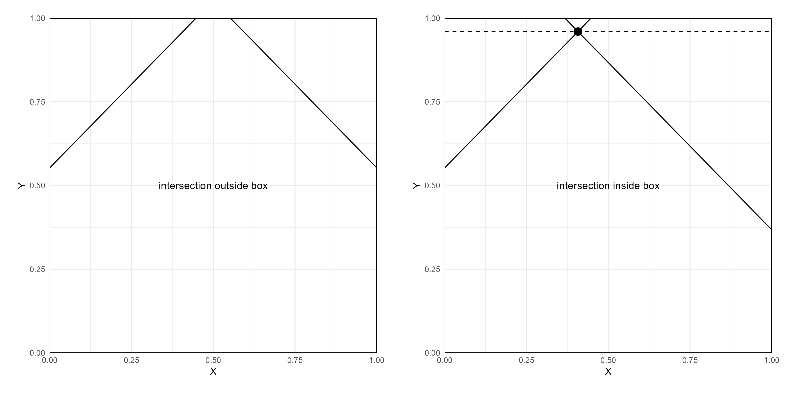
```

```{r echo = FALSE, warning=FALSE, message=FALSE, include=FALSE, cache=TRUE}
library("ggplot2")
library("gridExtra")

# Example a. intersection outside box
corner1 = 1
slope1 = 1
effect1 = 0.1
if (corner1 == 1) {intercept1 <- 1 - sqrt(2 * effect1 * slope1)}
if (corner1 == 2) {intercept1 <- 1 + abs(slope1) - sqrt(2 * effect1 * abs(slope1))}
if (corner1 == 3) {intercept1 <- sqrt(2 * effect1 * abs(slope1))}
if (corner1 == 4) {intercept1 <- -1 * (slope1 - sqrt(2 * effect1 * slope1))}

corner2 = 2 
slope2 <- -1      # Slope of line 2
effect2 = 0.1
if (corner2 == 1) {intercept2 <- 1 - sqrt(2 * effect2 * slope2)}
if (corner2 == 2) {intercept2 <- 1 + abs(slope2) - sqrt(2 * effect2 * abs(slope2))}
if (corner2 == 3) {intercept2 <- sqrt(2 * effect2 * abs(slope2))}
if (corner2 == 4) {intercept2 <- -1 * (slope2 - sqrt(2 * effect2 * slope2))}
intercept2 # Intercept of line 2

# Function to find the intersection point of two lines

line_intersection <- function(slope1, intercept1, slope2, intercept2) {
  x_intersect <- (intercept2 - intercept1) / (slope1 - slope2)
  y_intersect <- slope1 * x_intersect + intercept1
  return(c(x_intersect, y_intersect))
}

# Function to check if a point lies within the unit box
point_within_unit_box <- function(x, y) {
  if (x > 0 && x < 1 && y > 0 && y < 1) { #no equal signs: on the box is allowed
    return(TRUE)
  } else {
    return(FALSE)
  }
}

# Find the intersection point
intersection_point <- line_intersection(slope1, intercept1, slope2, intercept2)
x_intersect <- intersection_point[1]
y_intersect <- intersection_point[2]

# Check if the intersection point is within the unit box
intersection_within_unit_box <- point_within_unit_box(x_intersect, y_intersect)

# Print message depending on the intersection
if (intersection_within_unit_box) {
  print("The lines intersect within the unit box.")
} else {
  print("The lines intersect outside the unit box.")
}

#plot
xbox <- c(0,1,0,1)
ybox <- c(0,0,1,1)
box <- data.frame (xbox, ybox)

true.slope <- c(slope1, slope2)
true.intercept <- c(intercept1, intercept2)
coefs <- data.frame(true.intercept,true.slope)

plot1 <- ggplot(box, aes(x = xbox, y=ybox)) +
  geom_blank() + 
  geom_hline(aes(yintercept = 0.0), linetype = 'solid') + 
  geom_hline(aes(yintercept = 1.0), linetype = 'solid') +
  geom_vline(aes(xintercept = 0.0), linetype = 'solid') +
  geom_vline(aes(xintercept = 1.0), linetype = 'solid') +
  geom_abline(data=coefs, aes(intercept=true.intercept, slope=true.slope)) +
  geom_point(data = data.frame(x = x_intersect, y = y_intersect), aes(x, y), shape = 16, size = 4, color = "black") +
  #geom_hline(aes(yintercept = y_intersect), linetype = 'dashed') +
  annotate("text", x = 0.5, y = 0.5, label = ifelse(intersection_within_unit_box, "intersection inside box", "intersection outside box"), color = ifelse(intersection_within_unit_box, "black", "black"), size = 4) +
  labs(x = 'X', y = 'Y') +
  scale_x_continuous(limits = c(0, 1), expand = c(0, 0)) +  # Set X-axis limits and expand
  scale_y_continuous(limits = c(0, 1), expand = c(0, 0)) +  # Set Y-axis limits and expand
  theme_minimal() +
  theme(plot.margin = margin(20, 20, 20, 20))  # Set the margin around the plot


# Example intersection inside box
corner1 = 1
slope1 = 1
effect1 = 0.1
if (corner1 == 1) {intercept1 <- 1 - sqrt(2 * effect1 * slope1)}
if (corner1 == 2) {intercept1 <- 1 + abs(slope1) - sqrt(2 * effect1 * abs(slope1))}
if (corner1 == 3) {intercept1 <- sqrt(2 * effect1 * abs(slope1))}
if (corner1 == 4) {intercept1 <- -1 * (slope1 - sqrt(2 * effect1 * slope1))}
corner2 = 2 
slope2 <- -1      # Slope of line 2
effect2 = 0.2
if (corner2 == 1) {intercept2 <- 1 - sqrt(2 * effect2 * slope2)}
if (corner2 == 2) {intercept2 <- 1 + abs(slope2) - sqrt(2 * effect2 * abs(slope2))}
if (corner2 == 3) {intercept2 <- sqrt(2 * effect2 * abs(slope2))}
if (corner2 == 4) {intercept2 <- -1 * (slope2 - sqrt(2 * effect2 * slope2))}

# Find the intersection point
intersection_point <- line_intersection(slope1, intercept1, slope2, intercept2)
x_intersect <- intersection_point[1]
y_intersect <- intersection_point[2]

# Check if the intersection point is within the unit box
intersection_within_unit_box <- point_within_unit_box(x_intersect, y_intersect)

# Print message depending on the intersection
if (intersection_within_unit_box) {
  print("The lines intersect within the unit box.")
} else {
  print("The lines intersect outside the unit box.")
}

#plot
xbox <- c(0,1,0,1)
ybox <- c(0,0,1,1)
box <- data.frame (xbox, ybox)

true.slope <- c(slope1, slope2)
true.intercept <- c(intercept1, intercept2)
coefs <- data.frame(true.intercept,true.slope)

plot2 <- ggplot(box, aes(x = xbox, y=ybox)) +
  geom_blank() + 
  geom_hline(aes(yintercept = 0.0), linetype = 'solid') + 
  geom_hline(aes(yintercept = 1.0), linetype = 'solid') +
  geom_vline(aes(xintercept = 0.0), linetype = 'solid') +
  geom_vline(aes(xintercept = 1.0), linetype = 'solid') +
  geom_abline(data=coefs, aes(intercept=true.intercept, slope=true.slope)) +
  geom_point(data = data.frame(x = x_intersect, y = y_intersect), aes(x, y), shape = 16, size = 4, color = "black") +
  geom_hline(aes(yintercept = y_intersect), linetype = 'dashed') +
  annotate("text", x = 0.5, y = 0.5, label = ifelse(intersection_within_unit_box, "intersection inside box", "intersection outside box"), color = ifelse(intersection_within_unit_box, "black", "black"), size = 4) +
  labs(x = 'X', y = 'Y') +
  scale_x_continuous(limits = c(0, 1), expand = c(0, 0)) +  # Set X-axis limits and expand
  scale_y_continuous(limits = c(0, 1), expand = c(0, 0)) +  # Set Y-axis limits and expand
  theme_minimal() +
  theme(plot.margin = margin(20, 20, 20, 20))  # Set the margin around the plot

# Arrange the plots side by side
combined_plot <- grid.arrange(plot1, plot2, ncol = 2)
ggsave(filename = "intersection_plot.png", plot = combined_plot, width = 12, height = 6)
```

It is assumed that within the non-empty area of the bounding box the cases have a uniform distribution (Section \@ref(statisticalmodeling)). The ```nca_random``` function of the NCA software in ```R``` is used to create such a distribution in the presence of a ceiling line. From this defined population, 1000 random samples are drawn. Subsequently, for each sample the size of the expected empty corner (necessity effect size) is estimated with the CE-FDH ceiling line (with empirical scope). The $p$-value for each sample is estimated using 1000 random samples from the permutation distribution. The threshold $p$-value is set at 0.05. This means that necessity is considered not supported (negative conclusion) if the $p$-value is 0.05 or larger. If the $p$-value is below 0.05, necessity is considered supported (positive conclusion) only if the other two criteria (theoretical support and effect size) are also met. The theoretical support is assumed to be met. For the effect size the threshold $d$-value is 0.10. If applicable and possible, the tested sizes of the other empty corner are 0.05, 0.10, 0.20, 0.30, and 0.50.

### True Positive Rate (TPR, sensitivity) {#sensitivity}

Figure \@ref(fig:tpr01) shows the results of the evaluation of TPR for a true necessity effect size of $d$ = 0.1 in corner 1, the expected empty corner (called *necessity corner* in the figure), and with different sizes of other empty corner 2 (Figure \@ref(fig:tpr01)-top-right), other empty corner 3 (Figure \@ref(fig:tpr01)-bottom-left) and other empty corner 4 (Figure \@ref(fig:tpr01)-bottom-right). 

```{r tpr01, fig.pos='t' , echo = FALSE, warning=FALSE, message=FALSE, out.width='90%', fig.align = "center", fig.cap= "True Positive Rate (TPR, sensitivity) of the NCA approach for identifying necessity in the population. True necessity effect size in corner 1 = 0.1. Slopes of ceiling/floor lines are 1 (corners 1 and 4) or -1 (corners 2 and 3). Top-Right: other empty corner = 2. Bottom-Left: other empty corner = 3. Bottom-Right: other empty corner = 4."}
knitr:: include_graphics("tpr01.png")
#knitr:: include_graphics("tpr01BWcool.png")
```

In all three graphs,^[The Top-Left graph is a reminder of the definition of the corner numbers.] the necessity effect size (the size of the expected empty corner 1) is 0.10, and the size of another empty corner ranges from 0 to 0.50, where possible. A TPR value of 0.80 is added as a benchmark, meaning that for 80 percent of the samples a correct decision is made, namely concluding that necessity is present in the population. This selected value is inspired by the commonly used target of 0.80 for statistical power. NCA draws a *positive* conclusion about necessity if $p < 0.05$ *and* $d\geq 0.1$ (assuming theoretical support).

Scenario A applies when the other corners are *not* empty. The corresponding TPR curve is the same in each TPR graph (empty corner size = 0). This curve is the upper curve in the Top-Right and Bottom-Left graphs, and the lower curve in the Bottom-Right graph. In scenario A, TPR increases with sample size and the benchmark value of 0.80 (80% correct decisions when necessity is present in the population) is reached for a sample size of about 60 (note that horizontal axis is piecewise-linear: only linear between two adjacent ticks but not across ticks). 

Table \@ref(tab:tabTPRA-HTML) shows for scenario A the fraction of samples where $p < 0.05$ ($p$-based TPR) and the fraction of samples where $d \geq 0.1$ ($d$-based TPR). Considering both criteria, TPR is the *minimum* of $p$-based TPR and $d$-based TPR. It turns out that for scenario A, the $p$-value criterion ($p < 0.05$) is critical for the TPR conclusion. Consequently, TPR corresponds to the power of NCA’s statistical test in this simulation scenario. 

```{r tabtprB, echo = FALSE, warning=FALSE, message=FALSE, include=TRUE, cache=TRUE}
tabTPRA <- read.csv("tabTPRA.csv")
tabTPRB <- read.csv("tabTPRB.csv")
tabTPRC <- read.csv("tabTPRC.csv")
tabTPRD <- read.csv("tabTPRD.csv")
knitr::kable(
  list(tabTPRA, tabTPRB, tabTPRC, tabTPRD),
  col.names = c("n", "\\emph{p}-based", "\\emph{d}-based", "TPR"),
  caption = "Fraction of samples that correctly identify necessity: $p$-based, $d$-based, TPR (True Positive Rate). Necessity effect size = 0.10 (corner 1 empty) with ceiling slope = 1. Top-Left table: Scenario A - no other corner empty.  Top-Right table: Scenario B - corner 2 also empty. Bottom-Left table: Scenario C - corner 3 also empty. Bottom-Right table: Scenario D - corner 4 also empty.",
  format = "latex",
  escape = FALSE, # Prevent escaping of LaTeX special characters 
  align = c("r"),
   booktabs = TRUE
   #placement = "H"
)
```


```{r tabtprA, echo = FALSE, eval = FALSE, warning=FALSE, message=FALSE, include=TRUE, cache=FALSE}
library("kableExtra")
tabTPRA <- read.csv("tabTPRA.csv")
t1 <- kbl(tabTPRA, 
    col.names = c("n", "\\emph{p}-based", "\\emph{d}-based", "TPR"),
     caption = "Scenario A. Fraction of samples that correctly identify necessity: $p$-based, $d$-based, TPR (True Positive Rate). Necessity effect size = 0.10 with ceiling slope = 1",
    format = "latex",
    escape = FALSE, # Prevent escaping of LaTeX special characters
    booktabs = TRUE,
    align = c("r")) %>%
    kable_styling(latex_options = "HOLD_position") %>%
    column_spec(1, width = "0cm") %>%  # Adjust the width for the first column
    column_spec(2, width = "3cm") %>%  # Adjust the width for the second column
    column_spec(3, width = "3cm") %>%     # Adjust the width for the third column
    column_spec(4, width = "3cm")      # Adjust the width for the third column
t1
```


```{r tabTPRA-HTML, echo=FALSE, warning=FALSE, message=FALSE, include=TRUE, cache=TRUE}
library(kableExtra)

tabTPRA <- read.csv("tabTPRA.csv")

kbl(
  tabTPRA,
  col.names = c("n", "<i>p</i>-based", "<i>d</i>-based", "TPR"),
  caption = "Scenario A. Fraction of samples that correctly identify necessity: <i>p</i>-based, <i>d</i>-based, and TPR (True Positive Rate). Necessity effect size = 0.10 (corner 1 empty) with ceiling slope = 1. No other corner is empty.",
  format = "html",
  escape = FALSE,
  align = "r"
) %>%
  kable_styling(full_width = FALSE)
```


<!-- For all sample sizes the $p$-based TPR is less than or equal to the $d$-based TPR in Scenario A, and therefore the $p$-value determines the overall TPR. -->
<!-- Table 1. Comparison of the TPR based on the $p$-value (pTPR) and $d$-value (dTPR) for scenario A for different sample sizes (n) with necessity effect size = 0.1 in corner 1, and other corner size = 0  see Figure \@ref(fig:tpr01)) .  -->


<!-- n	pTPR	dTPR -->
<!-- 5	0.077	0.801 -->
<!-- 10	0.130	0.890 -->
<!-- 20	0.271	0.971 -->
<!-- 50	0.743	0.995 -->
<!-- 100	0.991	0.999 -->
<!-- 200	1.000	1.000 -->
<!-- 500	1.000	1.000 -->
<!-- 1000	1.000	1.000 -->
		

Scenario B applies when corner 2 (upper-right corner) is also empty (empty corner size = 0.05 or 0.10, see Figure \@ref(fig:tpr01)-top-right). It turns out that the TPR curve shifts to the right with increasing emptiness of corner 2, meaning that for a given sample size the TPR credibility decreases when the emptiness of corner 2 increases. Consequently, higher sample sizes are required to be able to identify necessity in corner 1 if this exists in the population. 
<!-- Table \@ref(tab:tabtpr01A). Comparison of the TPR based on the $p$-value (pTPR) and $d$-value (dTPR) for scenario B for different sample sizes (n) with necessity effect size = 0.1 in corner 1, and other corner size = 0.1 (see Figure \@ref(fig:tpr01)) .  -->
When the emptiness of corner 2 increases, relatively fewer cases are available to statistically test the emptiness of corner 1. NCA’s statistical test uses a permutation procedure (Section \@ref(permutationtest)) that creates new cases by allocating $Y$-values of observed cases randomly to $X$-values of other observed cases, and random samples are drawn from the obtained permutation distribution (= null distribution). High $Y$-values of cases allocated to low $X$-values of other cases can challenge the emptiness of corner 1. If relatively fewer high $Y$-values are available, the sample size must be larger to have enough high $Y$-values for the test. For achieving a TPR of 0.80, the required sample size is about 75 if the size of the empty corner 2 is 0.05 and about 140 if this size is 0.10. 

Table \@ref(tab:tabTPRB-HTML) shows that also in scenario B the $p$-value criterion ($p < 0.05$) and not the $d$-value criterion ($d \geq 0.10$) is critical for the TPR conclusion (with one exception for n = 500 where the $d$-based TPR is smaller than the $p$-based TPR).


```{r tabTPRB-HTML, echo=FALSE, warning=FALSE, message=FALSE, include=TRUE, cache=TRUE}
library(kableExtra)

tabTPRB <- read.csv("tabTPRB.csv")

kbl(
  tabTPRB,
  col.names = c("n", "<i>p</i>-based", "<i>d</i>-based", "TPR"),
  caption = "Scenario B. Fraction of samples that correctly identify necessity: <i>p</i>-based, <i>d</i>-based, and TPR (True Positive Rate). Necessity effect size = 0.10 (corner 1 empty) with ceiling slope = 1. Corner 2 is also empty.",
  format = "html",
  escape = FALSE,
  align = "r"
) %>%
  kable_styling(full_width = FALSE)
```

Scenario C (Figure \@ref(fig:tpr01)-bottom-left) applies when corner 3 (lower-left corner) is also empty (empty corner size = 0.05 or 0.10). The graph is very similar to the one of scenario B, with some minor differences at lower values of sample size. Also in this scenario higher sample sizes are required to be able to identify necessity in corner 1 when corner 3 is more empty. For achieving a TPR of 0.80, the required sample size is also about 75 if the size of the empty corner 3 is 0.05 and about 140 if this size is 0.1. 

Table \@ref(tab:tabTPRC-HTML) shows that also in scenario C the $p$-value criterion ($p < 0.05$) is dominant.


```{r tabTPRC-HTML, echo=FALSE, warning=FALSE, message=FALSE, include=TRUE, cache=TRUE}
library(kableExtra)

tabTPRC <- read.csv("tabTPRC.csv")

kbl(
  tabTPRC,
  col.names = c("n", "<i>p</i>-based", "<i>d</i>-based", "TPR"),
  caption = "Scenario C. Fraction of samples that correctly identify necessity: <i>p</i>-based, <i>d</i>-based, and TPR (True Positive Rate). Necessity effect size = 0.10 (corner 1 empty) with ceiling slope = 1. Corner 3 is also empty.",
  format = "html",
  escape = FALSE,
  align = "r"
) %>%
  kable_styling(full_width = FALSE)
```

However, in scenario D the results are very different (Figure \@ref(fig:tpr01)-bottom-right). In this scenario,  corner 4 (lower-right corner) is also empty (empty corner size ranges from 0.05 to 0.50). Now the TPR curve shifts to the *left* with increasing emptiness of corner 4, meaning that for a given sample size the TPR credibility of the NCA approach *increases*. This means that *smaller* sample sizes can be used to identify necessity in corner 1. When corner 4 is empty (and corners 2 and 3 are not empty) relatively more cases are available to test the emptiness of corner 1 such that the sample size can be smaller for the permutation test. For achieving a TPR of 0.80 the required sample size can be less than 50 when the corner size is 0.05 and even less than 10 when the corner 4 size is 0.5. However, the possibility of using relatively small sample sizes for identifying necessity has a price in terms of TNR (see below).

Table \@ref(tab:tabTPRD-HTML) shows that also in scenario D the $p$-value criterion ($p < 0.05$) is dominant.


```{r tabTPRD-HTML, echo=FALSE, warning=FALSE, message=FALSE, include=TRUE, cache=TRUE}
library(kableExtra)

tabTPRD <- read.csv("tabTPRD.csv")

kbl(
  tabTPRD,
  col.names = c("n", "<i>p</i>-based", "<i>d</i>-based", "TPR"),
  caption = "Scenario D. Fraction of samples that correctly identify necessity: <i>p</i>-based, <i>d</i>-based, and TPR (True Positive Rate). Necessity effect size = 0.10 (corner 1 empty) with ceiling slope = 1. Corner 4 is also empty.",
  format = "html",
  escape = FALSE,
  align = "r"
) %>%
  kable_styling(full_width = FALSE)
```

Additional TPR simulations with a different necessity effect size (0.20), and different ceiling slopes (0.6, 1.67) in the expected empty corner can be found in Appendix \@ref(appendixtprtnr). These simulations show similar TPR patterns.

### True Negative Rate (TNR, specificity) {#specificity}
Figure \@ref(fig:tnruniform) shows the results of the evaluation of TNR. 
```{r tnruniform, echo = FALSE, warning=FALSE, message=FALSE, out.width='90%', fig.align = "center", fig.cap= "True Negative Rate (TNR, specificity) of the NCA approach for identifying non-necessity in the population. True necessity effect size in corner 1 = 0 for different sizes of other empty corners.  Top-Right: other empty corner = 2. Bottom-Left: other empty corner = 3. Bottom-Right: other empty corner = 4."}
knitr:: include_graphics("tnruniform.png")
#knitr:: include_graphics("tnruniformBWcool.png")
```
<!-- Figure 7. True Negative Rate (TNR, specificity) of the NCA approach for identifying necessity in the population. True necessity effect size in corner 1 = 0 for different other empty corner sizes.  Panel a: other empty corner = 2; Panel b: other empty corner = 3; Panel c: other empty corner = 4.  -->
In all three graphs (Top-Right, Bottom-Left, Bottom-Right) the expected empty corner is not empty (necessity effect size = 0), while the other corners are empty with sizes ranging from 0 to 0.50. A TNR value of 0.95 is added as a benchmark, meaning that the rate of correct decisions confirming the absence of necessity in the population is 0.95. This selected value is inspired by the commonly selected threshold $p$-value of 0.05 for the false positive rate of a statistical test. NCA draws a *negative* conclusion about necessity if $p \ge 0.05$ *or* $d < 0.10$. 

In the TNR evaluation, scenario A applies when not only the expected corner is not empty (necessity effect size = 0) but also the other corners are not empty (empty corner size = 0), such that no relationship exists in the population. The corresponding TNR curves in Figure \@ref(fig:tnruniform) are the same, which are the lowest curves for the Top-Right and Bottom-Left graphs and the highest curve for the Bottom-Right graph. The curve shows that for all sample sizes the TNR is at least 0.95. Up to a sample size of 50, TNR is constant at 0.95 and when the sample size increases the TNR curve moves upward toward 1. The reason is that as long as the $p$-value is critical, 1 - TNR = FNR corresponds to the $p$-value of NCA’s statistical test: 5% of the samples drawn from a population where $X$ and $Y$ are unrelated (corresponding to scenario A in the TNR test) are false positives, and 95% are true negatives.

```{r tabtnrA, echo = FALSE, eval = FALSE, warning=FALSE, message=FALSE, include=TRUE, include = FALSE , cache=TRUE}
library("kableExtra")
tabTNRA <- read.csv("tabTNRA.csv")
t1 <- kbl(tabTNRA, 
    col.names = c("n", "\\emph{p}-based", "\\emph{d}-based"),
    caption = "Scenario A. Comparison $p$-based and $d$-based True Negative Rate (TNR) for different sample sizes with necessity effect size = 0 in corner 1, and other corner sizes = 0.",
    format = "latex",
    escape = FALSE, # Prevent escaping of LaTeX special characters
    booktabs = TRUE,
    align = c("r")) %>%
    kable_styling(latex_options = "HOLD_position") %>%
    column_spec(1, width = "0cm") %>%  # Adjust the width for the first column
    column_spec(2, width = "3cm") %>%  # Adjust the width for the second column
    column_spec(3, width = "3cm")      # Adjust the width for the third column
t1
```


```{r tabtnrB, echo = FALSE, warning=FALSE, message=FALSE, include=FALSE, cache=TRUE}
tabTNRA <- read.csv("tabTNRA.csv")
tabTNRB <- read.csv("tabTNRB.csv")
tabTNRC <- read.csv("tabTNRC.csv")
tabTNRD <- read.csv("tabTNRD.csv")
knitr::kable(
  list(tabTNRA, tabTNRB, tabTNRC, tabTNRD),
  col.names = c("n", "\\emph{p}-based", "\\emph{d}-based", "TNR"),
  caption =  "Fraction of samples that correctly identify the absence of necessity: $p$-based, $d$-based, TNR (True Negative Rate). Corner 1 is tested for necessity (corner 1 not empty). Top-Left table: Scenario A - no other corner empty.  Top-Right table: Scenario B - corner 2 empty. Bottom-Left table: Scenario C - corner 3 empty. Bottom-Right table: Scenario D - corner 4 empty.", 
  format = "latex",
  escape = FALSE, # Prevent escaping of LaTeX special characters
   align = c("r"),
   booktabs = TRUE
   #placement = "H"
)
```

Table \@ref(tab:tabTNRA-HTML) shows the fraction of samples where $p \ge 0.05$ ($p$-based TNR), and Table \@ref(tab:tabTNRB-HTML) the fraction of samples where $d < 0.10$ ($d$-based TNR). 

```{r tabTNRA-HTML, echo=FALSE, warning=FALSE, message=FALSE, include=TRUE, cache=TRUE}
library(kableExtra)

tabTNRA <- read.csv("tabTNRA.csv")

kbl(
  tabTNRA,
  col.names = c("n", "<i>p</i>-based", "<i>d</i>-based", "TNR"),
  caption="Scenario A. Fraction of samples that correctly identify the absence of necessity: <i>p</i>-based, <i>d</i>-based, and TNR (True Negative Rate). Corner 1 is tested for necessity (corner 1 not empty). No other corner is empty.", 
  format = "html",
  escape = FALSE,
  align = "r"
) %>%
  kable_styling(full_width = FALSE)
```

<br>

```{r tabTNRB-HTML, echo=FALSE, warning=FALSE, message=FALSE, include=TRUE, cache=TRUE}
library(kableExtra)

tabTNRB <- read.csv("tabTNRB.csv")

kbl(
  tabTNRB,
  col.names = c("n", "<i>p</i>-based", "<i>d</i>-based", "TNR"),
caption="Scenario B. Fraction of samples that correctly identify the absence of necessity: <i>p</i>-based, <i>d</i>-based, and TNR (True Negative Rate). Corner 1 is tested for necessity (corner 1 not empty). Corner 2 is empty.",
  format = "html",
  escape = FALSE,
  align = "r"
) %>%
  kable_styling(full_width = FALSE)
```

Since for each sample NCA draws a *negative* conclusion about necessity if $p \geq 0.05$ *or* $d \leq 0.10$, TNR is the *maximum* of $p$-based TNR and $d$-based TNR. 

Table \@ref(tab:tabTNRA-HTML) for scenario A indicates that up to sample size 50 the $p$-value TNR dominates and when the sample size increases, the TNR is based on the $d$-value. In other words, nearly all samples are correctly evaluated when necessity is absent in the population and other corners are not empty.

Scenario B for TNR (Figure \@ref(fig:tnruniform)-top-right) applies when necessity is absent while corner 2 (upper-right corner) is empty (empty corner effect size = 0.05 – 0.50). It turns out that the TNR curves are above the 0.95 benchmark for all sample sizes. Nearly all samples are correctly evaluated when necessity is absent in the population and corner 2 is empty. 

Table \@ref(tab:tabTNRB-HTML) top-right shows that for smaller sample sizes the $p$-value TNR is dominant, whereas for larger sample sizes the $d$-value TNR dominates, although the differences are small.

The situation for scenario C for TNR (Figure \@ref(fig:tnruniform)-bottom-left) when necessity is absent while corner 3 is empty (empty corner effect size = 0.05 - 0.50) is very similar to scenario B.  In this scenario, nearly all samples are correctly evaluated when necessity is absent in the population and corner 3 is empty, and the $p$-value is the primary limiting factor for TNR (Table \@ref(tab:tabTNRC-HTML)).


```{r tabTNRC-HTML, echo=FALSE, warning=FALSE, message=FALSE, include=TRUE, cache=TRUE}
library(kableExtra)

tabTNRC <- read.csv("tabTNRC.csv")

kbl(
  tabTNRC,
  col.names = c("n", "<i>p</i>-based", "<i>d</i>-based", "TNR"),
  caption="Scenario C. Fraction of samples that correctly identify the absence of necessity: <i>p</i>-based, <i>d</i>-based, and TNR (True Negative Rate). Corner 1 is tested for necessity (corner 1 not empty). Corner 3 is empty.",
  format = "html",
  escape = FALSE,
  align = "r"
) %>%
  kable_styling(full_width = FALSE)
```

In scenario D for TNR (Figure \@ref(fig:tnruniform)-bottom-right), necessity is absent while corner 4 is empty (empty corner effect size ranges from 0.05 to 0.50). The results are now very different. The TNR curves start below the 0.95 benchmark and with increasing sample size move first downward and then upward and end up above the 0.95 benchmark while moving toward 1. This means that only for a sample size of more than about 50, nearly all samples are correctly evaluated. The pattern of the TNR curve can be explained by the fact that first the $p$-value is the limiting factor, and subsequently the $d$-value (Table \@ref(tab:tabTNRD-HTML)).


```{r tabTNRD-HTML, echo=FALSE, warning=FALSE, message=FALSE, include=TRUE, cache=TRUE}
library(kableExtra)

tabTNRD <- read.csv("tabTNRD.csv")

kbl(
  tabTNRD,
  col.names = c("n", "<i>p</i>-based", "<i>d</i>-based", "TNR"),
  caption="Scenario D. Fraction of samples that correctly identify the absence of necessity: <i>p</i>-based, <i>d</i>-based, and TNR (True Negative Rate). Corner 1 is tested for necessity (corner 1 not empty). Corner 4 is empty.",
  format = "html",
  escape = FALSE,
  align = "r"
) %>%
  kable_styling(full_width = FALSE)
```

Similar patterns of the TNR curves can be observed when the distribution in the feasible space is based on a normal rather than uniform distribution of the cases (Appendix \@ref(appendixtprtnr)).

If the $d$-value were not included as decision criterion for necessity, TNR would have been considerably lower for scenario D. This is shown in Figure \@ref(fig:tnruniformponly) where the TNR decision is only based on the $p$-value. Figure \@ref(fig:tnruniformponly)-bottom-right shows that TNR decreases with increasing sample size and increasing size of empty corner 4.^[All simulations show again that when scenario A applies in Figures \@ref(fig:tnruniform) and \@ref(fig:tnrnormal) with the curves for other corner size = 0 and in Table \@ref(tab:tabtnrB)-top-left, and when the $p$-value is dominant, NCA's statistical test is valid [@dul2020orm].]

```{r tnruniformponly, echo = FALSE, warning=FALSE, message=FALSE, out.width='90%', fig.align = "center", fig.cap= "True Negative Rate (TNR, specificity) of the NCA approach for identifying necessity in the population with only the $p$-value criterion. True necessity effect size in corner 1 = 0 for different other empty corner sizes. Top-Right: empty corner = 2. Bottom-Left: empty corner = 3. Bottom-Right: empty corner = 4."}
knitr:: include_graphics("tnruniform_ponly.png")
#knitr:: include_graphics("tnruniform_ponlyBWwarm.png")
#knitr:: include_graphics("tnruniform_ponlyBWcool.png")

```

<!-- Figure 8. True Negative Rate (TNR, specificity) of the NCA approach for identifying necessity in the population with only the $p$-value criterion. True necessity effect size in corner 1 = 0 for different other empty corner sizes.  Panel a: other empty corner = 2; Panel b: other empty corner = 3; Panel c: other empty corner = 4.  -->

<!-- Figure 9. True Negative Rate (TNR, specificity) of the NCA approach for identifying necessity in the population with the $p$ and $d$-value criterion, with normal distribution of cases in the feasible space. True necessity effect size in corner 1 = 0 for different other empty corner sizes.  Panel a: other empty corner = 2; Panel b: other empty corner = 3; Panel c: other empty corner = 4.  -->

Because NCA bases its judgement about necessity not only on the $p$-value but also on the $d$-value (and on the availability of theoretical support), the methodology has credibility regarding both TPR and TNR, and the analyst is reasonably protected against making both false positive and false negative conclusions. 

## Empirical credibility {#empiricalcredibility}
The previous results show that it is possible to identify necessary conditions when they exist, and to correctly determine when they do not exist. Nevertheless, even when the criteria for necessity (theoretical support, large $d$-value, low $p$-value) are satisfied, the TPR and TNR results also show that there is still a possibility that necessary conditions are not identified when they exist, or that they are identified when they do not exist. This can also happen when limitations exist regarding the quality of model specification (Section \@ref(formalexpression)), study design, sampling, and measurement (Chapter \@ref(datacollection)), or data analysis (Chapter \@ref(dataanalysis)). To further evaluate the credibility of an NCA finding, several empirical credibility approaches may be considered.

### Robustness 
When conducting an empirical study, the analyst must make various theoretical and methodological choices to obtain results. Often, other plausible choices could also have been made. In a robustness check, the sensitivity of the results to other plausible choices is evaluated. The check focuses on the sensitivity of the main estimates and the analyst’s main conclusion. 

In NCA, the effect size and the $p$-value are two main estimates for concluding whether a necessity relationship is credible. These estimates can be sensitive to several choices. Some choices are outside the realm of NCA, for example choices related to the data that are used as input to NCA (see Chapter \@ref(datacollection) about study design, sampling, measurement) or the threshold level of statistical significance. Other choices are NCA-specific, such as the choice of the ceiling line (Section \@ref(mathceiling)) and the bounding box (Section \@ref(formalexpression)), the threshold level of the necessity effect size (Section \@ref(effectsize)), and the handling of NCA-relevant outliers (Section \@ref(outliers)). The credibility of support for necessity increases when the results are robust. Section (\@ref(robustnesschecks)) provides further details of NCA's robustness checks. 

### Model fit {#modelfit1}
Section \@ref(modelfit) introduced eight model fit metrics: complexity, fit, ceiling accuracy, noise, exceptions, support, spread, and sharpness.  The credibility of the evidence for necessity increases when the model better fits the data. 

## Recommendations for evaluating credibility {#credibilitysummary}
The three core criteria for establishing necessity (theoretical support, practical relevance in terms of large effect size, and statistical relevance in terms of small $p$-value), the robustness check requirement, and the eight model-fit metrics are summarized in Table \@ref(tab:credibilitytab). The table provides examples of numerical guidelines, but these should not be interpreted as strict decision rules. Ultimately, credibility is a matter of informed judgment and optimization by the analyst and other stakeholders after considering all credibility aspects. In an empirical study, it is rare for all credibility aspects to be fully satisfied.
<!-- A *robustness check* (see Section \@ref(robustness)) can help evaluate the sensitivity of the conclusions for choices made by the analyst (e.g., regarding ceiling line, scope, threshold levels for effect size and $p$-value, including/exclusion of outliers). Several aspects of *model fit*, as discussed in Section \@ref(modelfit) could be considered as well. -->

<!-- ## Conclusion -->
<!-- A correct interpretation, application and simulation of the NCA approach for identifying necessity implies:  -->

<!-- 1. using three criteria for testing necessity: theoretical support, effect size $d$, $p$-value (and not just the $p$-value);  -->

<!-- 2. using NCA’s statistical as a test of the randomness of the necessity empty space, not a general randomness test;  -->

<!-- 3. doing simulations with bounded variables, not with unbounded (for instance  normal distributed) variables. -->

<!-- The Monte Carlo simulations conducted this way show that the True Positive Rate (TPR) and the True Negative Rate (TNR) are high, and consequently that the False Negative Rate (FNR)  and the False Positive Rate (FPR) are low.  Particularly for larger sample sizes, the TPR results show that NCA has high sensitivity (hit rate, probability of detection), and the TNR results show that NCA has high specificity (selectivity, correct rejection rate). The corresponding FNR shows that NCA has low miss rates, false dismissal,and the corresponding FPR shows that NCA has low false alarm, fall-out. This means that in the investigated scenarios NCA performs well regarding the desired qualities for identifying necessity, and gives confidence in applying the approach, which will be discussed in the next part of this book.  -->


```{r credibilitytab, echo = FALSE, warning=FALSE, message=FALSE, include=TRUE, cache=FALSE}
library(knitr)
library(kableExtra)
library(tidyverse)
library(openxlsx)
# Read CSV file
credibility <- read.csv("Credibility1.csv", stringsAsFactors = FALSE)

# Function to clean and properly format LaTeX special characters
clean_encoding <- function(x) {
  x <- iconv(x, from = "", to = "UTF-8", sub = "")  # Convert encoding
  x <- gsub("Δ", "$\\\\Delta$", x)  # Correct LaTeX greater-than-equal
  x <- gsub("≥", "$\\\\geq$", x)  # Correct LaTeX greater-than-equal
  x <- gsub("≤", "$\\\\leq$", x)  # Correct LaTeX less-than-equal
  x <- gsub("~", "$\\\\sim$", x)  # Approximate (~) symbol in LaTeX
  x <- gsub("%", "\\\\%", x)  # Escape percentage (%)
  x <- gsub("&", "\\&", x)  # Escape ampersand (&)
  x <- gsub("_", "\\\\_", x)  # Escape underscore (_)
  #x <- gsub("☐", "\\\\☐", x)  # Escape or replace checkbox symbol (☐)
  x <- str_trim(x)  # Trim spaces
  return(x)
}

# Apply cleaning function to all character columns
credibility <- credibility %>%
  mutate(across(where(is.character), clean_encoding))

# #MAKE LATEX TABLE
# # Generate LaTeX Table with Correct Formatting
# cred <- kbl(credibility,
#     col.names = c("Credibility aspect", "Goal", "Description", "Symbol", "Guideline"),  # Explicitly define 5 columns
#     caption = "Credibility aspects of NCA.",
#     booktabs = TRUE,
#     longtable = FALSE,  # TRUE: Keep longtable for multi-page tables; FALSE prevent splitting over pages.
#     #align = "p{3cm}p{3cm}p{2cm}p{3cm}",  # Correct column widths instead of "lccc"
#     align = c("l", "l", "l", "c", "l"),
#     format = "latex",
#     escape = FALSE # Prevent escaping of LaTeX special characters
# 
# ) %>%
#   kable_styling(latex_options = c("HOLD_position"),
#                   full_width = FALSE,
#                   font_size = 9,
#                   position = "center") %>%
#                 
#   column_spec(1, width = "1.9cm") %>%  # Adjust the width for the first column
#   column_spec(2, width = "3.5cm") %>%  # Adjust the width for the second column
#   column_spec(3, width = "3cm") %>%  # Adjust the width for the second column
#   column_spec(4, width = "1.5cm") %>%  # Adjust the width for the second column
#   column_spec(5, width = "3cm")     # Adjust the width for the third column
# # footnote(general = "¹For deterministic necessity: lowP = 0",
# #   fixed_small_size = TRUE,
# #     threeparttable = TRUE
# #   )
# # Print the LaTeX table
# cred


#FOR HTML
# library("kableExtra")
# credibility <- read.csv("Credibility1.csv")
cred <- kbl(credibility,
    col.names = gsub("[.]", " ", names(credibility)),
    caption = "Credibility aspects of NCA",
    booktabs = TRUE,
    longtable = TRUE,
    align = c("l")) %>%
  kable_styling(latex_options = c("HOLD_position", "scale_down"),
                  full_width = FALSE,
                  font_size = 9) %>%
  #kableExtra::kable_styling(latex_options = c("HOLD_position", "scale_down"), full_width = FALSE)
  column_spec(1, width = "2cm") %>%  # Adjust the width for the first column
  column_spec(2, width = "2cm") %>%  # Adjust the width for the second column
  column_spec(3, width = "2.5cm") %>%  # Adjust the width for the second column
  column_spec(4, width = "2cm") %>%  # Adjust the width for the second column
  column_spec(5, width = "3cm")      # Adjust the width for the third column
cred

#FOR PDF


#footnote(cnec, c("NCA = Necessary Condition Analysis"),fixed_small_size = TRUE)
```

<br/>

In the following Part II of the book, the principles of NCA as discussed in Part I are applied to empirical studies.


<!-- ### Informedness: Definition and Explanation -->

<!-- **Informedness** is a metric used in classification models to evaluate the **discriminative power** of a model. It measures how well the model distinguishes between the **positive** and **negative** classes. -->

<!-- #### 1. Mathematical Formula for Informedness -->
<!-- Informedness is based on the **true positive rate (TPR)** and **true negative rate (TNR)**: -->

<!-- \[ -->
<!-- \text{Informedness} = \text{TPR} + \text{TNR} - 1 -->
<!-- \] -->

<!-- where: -->
<!-- - **True Positive Rate (TPR) / Sensitivity / Recall**: -->

<!--   \[ -->
<!--   \text{TPR} = \frac{\text{TP}}{\text{TP} + \text{FN}} -->
<!--   \] -->

<!-- - **True Negative Rate (TNR) / Specificity**: -->

<!--   \[ -->
<!--   \text{TNR} = \frac{\text{TN}}{\text{TN} + \text{FP}} -->
<!--   \] -->

<!-- Thus, **Informedness** can also be rewritten as: -->

<!-- \[ -->
<!-- \text{Informedness} = \left(\frac{\text{TP}}{\text{TP} + \text{FN}}\right) + \left(\frac{\text{TN}}{\text{TN} + \text{FP}}\right) - 1 -->
<!-- \] -->

<!-- #### 2. Interpretation -->
<!-- - **Range:**   -->
<!--   \[ -->
<!--   -1 \leq \text{Informedness} \leq 1 -->
<!--   \] -->
<!-- - **Perfect Model:** \( \text{Informedness} = 1 \) (perfect classification, no errors). -->
<!-- - **Random Guessing:** \( \text{Informedness} = 0 \) (model has no discrimination ability). -->
<!-- - **Worst Model:** \( \text{Informedness} = -1 \) (model is always wrong). -->

<!-- #### 3. Relationship to Other Metrics -->
<!-- - **Informedness is also known as "Youden’s J statistic"** in medical testing. -->
<!-- - Unlike **Accuracy**, Informedness considers both **false positives and false negatives**, making it useful for **imbalanced datasets**. -->
<!-- - It is closely related to **Balanced Accuracy**, defined as: -->

<!--   \[ -->
<!--   \text{Balanced Accuracy} = \frac{1}{2} (\text{TPR} + \text{TNR}) -->
<!--   \] -->

<!--   which simplifies to: -->

<!--   \[ -->
<!--   \text{Balanced Accuracy} = \frac{\text{Informedness} + 1}{2} -->
<!--   \] -->

<!-- #### 4. Why Use Informedness? -->
<!-- - **Handles class imbalance better than accuracy** (since it considers both sensitivity and specificity). -->
<!-- - **Good for medical tests and fraud detection** where both false positives and false negatives matter. -->
<!-- - **Useful when evaluating a binary classifier** across different decision thresholds. -->

<!-- #### 5. Example Calculation -->

<!-- | Class | Predicted Positive | Predicted Negative | Total | -->
<!-- |-------|------------------|------------------|------| -->
<!-- | **Actual Positive (P)** | TP = 80 | FN = 20 | 100 | -->
<!-- | **Actual Negative (N)** | FP = 30 | TN = 70 | 100 | -->

<!-- ##### **Step 1: Compute TPR and TNR** -->
<!-- \[ -->
<!-- \text{TPR} = \frac{80}{80 + 20} = 0.8 -->
<!-- \] -->
<!-- \[ -->
<!-- \text{TNR} = \frac{70}{70 + 30} = 0.7 -->
<!-- \] -->

<!-- ##### **Step 2: Compute Informedness** -->
<!-- \[ -->
<!-- \text{Informedness} = 0.8 + 0.7 - 1 = 0.5 -->
<!-- \] -->

<!-- #### **Final Summary** -->
<!-- - **Informedness measures how well a classifier differentiates between classes.** -->
<!-- - **It considers both true positives and true negatives**, making it more reliable than accuracy in imbalanced datasets. -->
<!-- - **Higher values indicate better discrimination**, while **zero** means the classifier is no better than random guessing. -->


``` {r, eval=FALSE, echo = FALSE}
#R code for the Monte Carlo simulations for Simulations for sensitivity
#April-May 2024 (original filename: TESTnca_randomPARALELtest.R)
library(parallel)
library(doParallel)
library(foreach)
library(ggplot2)
library(truncnorm)

#EXAMPLE ####
#n <- c(5, 10, 20, 50, 100, 200, 500, 1000)
n <- c(10)
corner1 <- 1
effect1 <- 0.1
slope1 <- 1
corner2 <- 4
slope2 <- 1
#effect2 <- c(0, 0.05, 0.1, 0.2, 0.3, 0.5)
effect2 <- c(0.1)
ceiling <- 'cr_fdh'
p_threshold <- 0.05
d_threshold <- 0.10
distribution <- 'uniform'
rep <- 100
test.rep <- 200
num_cores = detectCores()
num_cores = 1

if (corner1 == 1) {intercept1 <- 1 - sqrt(2 * effect1 * slope1)}
if (corner1 == 2) {intercept1 <- 1 + abs(slope1) - sqrt(2 * effect1 * abs(slope1))}
if (corner1 == 3) {intercept1 <- sqrt(2 * effect1 * abs(slope1))}
if (corner1 == 4) {intercept1 <- -1 * (slope1 - sqrt(2 * effect1 * slope1))}

if (corner1 == 1) {intercept2 <- 1 - sqrt(2 * effect2 * slope2)}
if (corner1 == 2) {intercept2 <- 1 + abs(slope2) - sqrt(2 * effect2 * abs(slope2))}
if (corner1 == 3) {intercept2 <- sqrt(2 * effect2 * abs(slope2))}
if (corner1 == 4) {intercept2 <- -1 * (slope2 - sqrt(2 * effect2 * slope2))}


distribution.x = distribution
distribution.y = distribution
mean.x = 0.5 
mean.y = 0.5 
sd.x = 0.2 
sd.y = 0.2

nca_randomTEST(10)

library(NCA)
nca_random(100,intercept1,slope1)

#run
Sys.time()
output_explorationTEST <- nca_exploreTEST(n = n, 
                                          corner1 = corner1,
                                          effect1 = effect1,
                                          slope1 = slope1,
                                          corner2 = corner2,
                                          effect2 = effect2,
                                          slope2 = slope2,
                                          ceiling = ceiling,
                                          p_threshold = p_threshold,
                                          d_threshold = d_threshold,
                                          distribution = distribution,
                                          rep = rep, 
                                          test.rep = test.rep,
                                          num_cores=num_cores)
Sys.time()


#the function
nca_exploreTEST <- function(n,
                            corner1,
                            effect1, 
                            slope1, 
                            corner2,
                            effect2, 
                            slope2, 
                            ceiling = ceiling,
                            p_threshold = p_threshold, 
                            d_threshold = d_threshold,
                            distribution = distribution, 
                            rep = rep, 
                            test.rep = rep,
                            num_cores = num_cores) {
  
  #helper function to define the base distributions of X and Y
  dis <- function (distribution, mean, sd)
  {
    if (distribution == "uniform") {
      return(runif(1, 0, 1))
    }
    else {
      return(rtruncnorm(1, a = 0, b = 1, mean = mean, sd = sd))
    }
  }
  
  set.seed(123)  # set seed for replication
  
  # Integrate data generation with nca_randomTEST function here
  nca_randomTEST <- function (n = 100, #with default values that can be overrun
                              corner1 = 1,
                              intercept1 = 0.2,
                              slope1 = 1,
                              corner2 = 4,
                              intercept2 = 0.2,
                              slope2 = 1,
                              distribution.x = "uniform",
                              distribution.y = "uniform",
                              mean.x = 0.5, 
                              mean.y = 0.5, 
                              sd.x = 0.2, 
                              sd.y = 0.2) {
    
    if (is.na(corner2)) {
      slope2 <- NA
      intercept2 <- NA
    }  
    
    data <- data.frame(X = NA, Y = NA)
    
    for (idx in 1:n) {
      while (TRUE) {
        # Generate random point within [0, 1], check if they conform to the line
        y.value <- dis(distribution.y, mean.y, sd.y)
        data[idx, 2] <- y.value
        
        all.good <- TRUE
        
        x.value <- dis(distribution.x, mean.x, sd.x)
        data[idx, 1] <- x.value
        
        if (corner1 %in% c(1, 2) && y.value > min(1, (intercept1 + slope1 * x.value))) {
          all.good <- FALSE
        }
        if (corner1 %in% c(3, 4) && y.value < max(0, (intercept1 + slope1 * x.value))) {
          all.good <- FALSE
        }
        if (corner2 %in% c(1, 2) && y.value > min(1, (intercept2 + slope2 * x.value))) {
          all.good <- FALSE
        }
        if (corner2 %in% c(3, 4) && y.value < max(0, (intercept2 + slope2 * x.value))) {
          all.good <- FALSE
        }
        
        if (all.good) {
          break
        }
      }
    }
    data <- data[order(data$Y),] # Corrected the assignment to keep the sorting
    rownames(data) <- 1:n
    
    attr(data, "distribution.x") <- distribution.x
    attr(data, "distribution.y") <- distribution.y
    if (distribution.x == "normal") {
      attr(data, "mean.x") <- mean.x
      attr(data, "sd.x") <- sd.x
    }
    if (distribution.y == "normal") {
      attr(data, "mean.y") <- mean.y
      attr(data, "sd.y") <- sd.y
    }
    
    return(data)
  }
  
  # Integrate nca_analysis function here
  nca_analysis1 <- function(data, x, y, ceilings, test.rep = test.rep) {
    # Confidence Ellipse
    library(NCA)
    mod <- nca_analysis(data, x, y, ceilings = ceiling, test.rep=test.rep)
    return(mod)
  }
  
  # Define the variables that will store results
  results <- data.frame(n = numeric(), 
                        corner1 = numeric(), 
                        effect1 = numeric(), 
                        slope1 = numeric(), 
                        effect2 = numeric(), 
                        corner2 = numeric(), 
                        slope2 = numeric(), 
                        ceiling = character(), 
                        p = numeric(),
                        d = numeric(),
                        distr. = character(),
                        epower = numeric(),
                        dpower = numeric(),
                        reject = numeric())
  
  # Calculate intercepts
  #calculatecalculate intercept of corner of interest (corner1)
  if (is.na(corner2))  { #only one empty space in corner1
    effect2 <- NA
    slope2 <- NA
    intercept2  <- NA
  } 
  else {  
    if (corner2 == 1) {intercept2 <- 1 - sqrt(2 * effect2 * slope2)}
    if (corner2 == 2) {intercept2 <- 1 + abs(slope2) - sqrt(2 * effect2 * abs(slope2))}
    if (corner2 == 3) {intercept2 <- sqrt(2 * effect2 * abs(slope2))}
    if (corner2 == 4) {intercept2 <- -1 * (slope2 - sqrt(2 * effect2 * slope2))}
  }
  #calculate intercept of corner of interest (corner1)
  #effect1 is constant (reference effect size)
  if (corner1 == 1) {intercept1 <- 1 - sqrt(2 * effect1 * slope1)}
  if (corner1 == 2) {intercept1 <- 1 + abs(slope1) - sqrt(2 * effect1 * abs(slope1))}
  if (corner1 == 3) {intercept1 <- sqrt(2 * effect1 * abs(slope1))}
  if (corner1 == 4) {intercept1 <- -1 * (slope1 - sqrt(2 * effect1 * slope1))}
  
  # Start parallel computing
  registerDoParallel(num_cores)
  
  output <- foreach(d = distribution, .combine = rbind) %:% 
    foreach(sample_size = n, .combine = rbind) %:% 
    foreach(effect_size = effect2, .combine = rbind) %dopar% {
      
      pval <- numeric(rep)  # Initialize vectors to store p and d values and epower results
      dval <- numeric(rep)
      sig_results <- numeric(rep) # fraction of samples with p <= 0.05
      dsig_results <- numeric(rep) # fraction of samples with d >= 0.10
      reject_results <- numeric(rep)
      
        effect_size <- effect2
        slope2 <- NA
        intercept2 <- NA
        
        for (r in 1:rep) {
          df <- nca_randomTEST(n = sample_size, #iteration run
                               corner1 = 1,
                               intercept1 = intercept1,
                               slope1 = slope1,
                               corner2 = corner2, 
                               intercept2 = intercept2, #iteration run #varies because effect2 varies
                               slope2 = slope2,
                               distribution.x = d, #iteration run
                               distribution.y = d, #iteration run
                               mean.x = 0.5, 
                               mean.y = 0.5, 
                               sd.x = 0.2, 
                               sd.y = 0.2)
          #library(NCA)
          capture.output(model <- nca_analysis1(df, 1, 2, 
                                               ceilings = ceiling, 
                                               test.rep = test.rep))
          pval[r] <- model$summaries$X$params[6]  # Estimated p-value
          dval[r] <- model$summaries$X$params[2]  # Estimated effect size in upper-left corner
          
          sig_results[r] <- pval[r] <= p_threshold  # epower fraction of samples with p <= threshold (0.05)
          dsig_results[r] <- dval[r] >= d_threshold # dpower = fraction of samples with d >= 0.10 
          reject_results[r] <- (pval[r] > p_threshold | dval[r] < d_threshold)
        }

      
      # Store the results for this iteration
      data.frame(n = sample_size,
                 corner1 = corner1,
                 effect1 = effect1,
                 slope1 = slope1,
                 corner2 = corner2,
                 effect2 = effect_size,
                 slope2 = slope2,
                 ceiling = ceiling,
                 p = mean(pval),
                 d = mean(dval), 
                 distr. = d, 
                 epower = mean(sig_results),
                 dpower = mean(dsig_results),
                 reject = mean(reject_results))
      
    }# End effect size
  
  stopImplicitCluster()
  
  return(output)
}

#EXAMPLE ####
n <- c(5, 10, 20, 50, 100, 200, 500, 1000)
#n <- c(200, 500, 1000)
corner1 <- 1
effect1 <- 0
slope1 <- 1
corner2 <- 4
slope2 <- 1
effect2 <- c(0, 0.05, 0.1, 0.2, 0.3, 0.5)
#effect2 <- 0.05
#effect2 <- c(0,0.05, 0.1, 0.2)
ceiling <- 'cr_fdh'
p_threshold <- 0.05
d_threshold <- 0.10
distribution <- 'uniform'
rep <- 1000
test.rep <- 1000


output_explorationTEST
#filename <- paste0("output_explorationPAR", format(Sys.time(), "%Y-%m-%d_%H-%M-%S"), ".csv")
if (effect1 == 0) {
  filename <- paste0("TNR", ceiling, "_c1=", corner1, "_es1=", effect1, "_sl1=",slope1, "_c2=",corner2,"_sl2=", slope2, "_", format(Sys.time(), "%Y-%m-%d_%H-%M-%S"), ".csv")
} else {
  filename <- paste0("TPR", ceiling, "_c1=", corner1, "_es1=", effect1, "_sl1=",slope1, "_c2=",corner2,"_sl2=", slope2, "_", format(Sys.time(), "%Y-%m-%d_%H-%M-%S"), ".csv")
}
#write.csv(output_explorationTEST, filename, row.names = FALSE)

# #REJECTION PLOT
# dfp <- output_explorationTEST
# #dfp <- read.csv("output_explorationPAR2024-04-24_07-06-57.csv")
# #dfp <- read.csv("FALSE POSITIVE CE.csv")
# dfp$n <- factor(dfp$n, levels = n)
# dfp$effect2 <- factor(dfp$effect2, levels = effect2)
# 
# # p-based rejection rate 
# g1 <- ggplot(dfp, aes(x = n, y = 1-epower, group = effect2, color = effect2)) +
#   geom_line() +
#   ylim(0, 1) +
#   geom_hline(aes(yintercept = .95), linetype = 'dashed') +
#   theme_minimal() +
#   labs(color = "Emtpy corner size") +
#   scale_color_discrete() + # Use default color palette
#   ggtitle(paste("Necessity corner =", dfp[1,2],"; Empty corner =", dfp[1,5])) +
#   labs(x = 'Sample size', y = 'Necessity rejection rate (p-based)') +
#   labs(subtitle = paste("(Necessity effect size =", dfp[1,3],")")) +
#   theme(
#     plot.title = element_text(hjust = 0.5), # Center the title
#     plot.subtitle = element_text(hjust = 0.5) # Center the subtitle
#   )
# print(g1)
# filenameg1 <- paste0("output_explorationPAR_pbased", format(Sys.time(), "%Y-%m-%d_%H-%M-%S"), ".png")
# ggsave(filenameg1, plot = g1, width = 5, height = 4, dpi =600)
# 
# #p and d-based rejection rate 
# g2 <- ggplot(dfp, aes(x = n, y = reject, group = effect2, color = effect2)) +
#   geom_line() +
#   ylim(0, 1) +
#   geom_hline(aes(yintercept = .95), linetype = 'dashed') +
#   theme_minimal() +
#   scale_color_discrete() + # Use default color palette
#   labs(color = "Empty corner size") +
#   ggtitle(paste("Necessity corner =", dfp[1,2],"; Empty corner =", dfp[1,5])) +
#   labs(x = 'Sample size', y = 'Necessity rejection rate (p and d-based)') +
#   labs(subtitle = paste("(Necessity effect size =", dfp[1,3],")")) +
#   theme(
#     plot.title = element_text(hjust = 0.5), # Center the title
#     plot.subtitle = element_text(hjust = 0.5) # Center the subtitle
#   )
# print(g2)
# filenameg2 <- paste0("output_explorationPAR_pdbased", format(Sys.time(), "%Y-%m-%d_%H-%M-%S"), ".png")
# ggsave(filenameg2, plot = g2, width = 5, height = 4, dpi =600)
# 
# #POWER PLOT
# # p-based rejection rate 
# dfp <- output_explorationTEST
# #dfp <- read.csv("output_explorationPAR2024-04-24_07-06-57.csv")
# dfp$n <- factor(dfp$n, levels = n)
# dfp$effect2 <- factor(dfp$effect2, levels = effect2)
# g3 <- ggplot(dfp, aes(x = n, y = epower, group = effect2, color = effect2)) +
#   geom_line() +
#   ylim(0, 1) +
#   geom_hline(aes(yintercept = .80), linetype = 'dashed') +
#   theme_minimal() +
#   ggtitle(paste("Necessity corner =", dfp[1,2],"; Empty corner =", dfp[1,5])) +
#   labs(x = 'Sample size', y = 'Power (p-based)', color = "Empty corner size") +
#   labs(subtitle = paste("(Necessity effect size =", dfp[1,3],")")) +
#   theme(
#     plot.title = element_text(hjust = 0.5), # Center the title
#     plot.subtitle = element_text(hjust = 0.5) # Center the subtitle
#   )
# print(g3)
# filenameg3 <- paste0("output_explorationPAR_POWER_pbased", format(Sys.time(), "%Y-%m-%d_%H-%M-%S"), ".png")
# ggsave(filenameg3, plot = g3, width = 5, height = 4, dpi =600)
# 
# #p and d-based rejection rate 
# accept <- pmin (dfp$epower,dfp$dpower)
# g4 <- ggplot(dfp, aes(x = n, y = pmin(epower, dpower), group = effect2, color = effect2)) +
#   geom_line() +
#   ylim(0, 1) +
#   geom_hline(aes(yintercept = .80), linetype = 'dashed') +
#   theme_minimal() +
#   ggtitle(paste("Necessity corner =", dfp[1,2],"; Empty corner =", dfp[1,5])) +
#   labs(x = 'Sample size', y = 'Power (p and d-based)', color = "Empty corner size") +
#   labs(subtitle = paste("(Necessity effect size =", dfp[1,3],")")) +
#   theme(
#     plot.title = element_text(hjust = 0.5), # Center the title
#     plot.subtitle = element_text(hjust = 0.5) # Center the subtitle
#   )
# print(g4)
# filenameg4 <- paste0("output_explorationPAR_POWER_pdbased", format(Sys.time(), "%Y-%m-%d_%H-%M-%S"), ".png")
# ggsave(filenameg4, plot = g4, width = 5, height = 4, dpi =600)

### T PLOTS ####
#TNR PLOT
dfp <- output_explorationTEST
#dfp <- read.csv("output_explorationPAR2024-04-24_07-06-57.csv")
#dfp <- read.csv("TNRCE0corner4.csv")
dfp$n <- factor(dfp$n, levels = n)
dfp$effect2 <- factor(dfp$effect2, levels = effect2)

# p-based TNR 
g1T <- ggplot(dfp, aes(x = n, y = 1-epower, group = effect2, color = effect2)) +
  geom_line() +
  ylim(0, 1) +
  geom_hline(aes(yintercept = .95), linetype = 'dashed') +
  theme_minimal() +
  labs(color = "Emtpy corner size") +
  scale_color_discrete() + # Use default color palette
  ggtitle(paste("Necessity corner =", dfp[1,2],"; Empty corner =", dfp[1,5])) +
  labs(x = 'Sample size', y = 'True Negative Rate ($p$-based)') +
  labs(subtitle = paste("(Necessity effect size =", dfp[1,3],")")) +
  theme(
    plot.title = element_text(hjust = 0.5), # Center the title
    plot.subtitle = element_text(hjust = 0.5) # Center the subtitle
  )
print(g1T)
filenameg1T <- paste0("TNR",ceiling, distribution, "_c1=",corner1, "_es1=", effect1, "_sl1=",slope1, "_c2=",corner2,"_sl2=", slope2, "_pbased", format(Sys.time(), "%Y-%m-%d_%H-%M-%S"), ".png")
ggsave(filenameg1T, plot = g1T, width = 5, height = 4, dpi =600)

#p and d-based TNR
g2T <- ggplot(dfp, aes(x = n, y = reject, group = effect2, color = effect2)) +
  geom_line() +
  ylim(0, 1) +
  geom_hline(aes(yintercept = .95), linetype = 'dashed') +
  theme_minimal() +
  scale_color_discrete() + # Use default color palette
  labs(color = "Empty corner size") +
  ggtitle(paste("Necessity corner =", dfp[1,2],"; Empty corner =", dfp[1,5])) +
  labs(x = 'Sample size', y = 'True Negative Rate ($p$ and $d$-based)') +
  labs(subtitle = paste("(Necessity effect size =", dfp[1,3],")")) +
  theme(
    plot.title = element_text(hjust = 0.5), # Center the title
    plot.subtitle = element_text(hjust = 0.5) # Center the subtitle
  )
print(g2T)
filenameg2T <- paste0("TNR",ceiling, distribution, "_c1=",corner1, "_es1=", effect1, "_sl1=",slope1, "_c2=",corner2,"_sl2=", slope2, "_pdbased", format(Sys.time(), "%Y-%m-%d_%H-%M-%S"), ".png")
ggsave(filenameg2T, plot = g2T, width = 5, height = 4, dpi =600)

#TPR PLOT
# p-based TPR 
dfp <- output_explorationTEST
#dfp <- read.csv("TPRCE01corner4.csv")
#dfp <- read.csv("TPRce_fdh_corner1=1_effect1=0.2_corner2=2_2024-05-02_01-12-05.csv")
dfp$n <- factor(dfp$n, levels = n)
dfp$effect2 <- factor(dfp$effect2, levels = effect2)

# Format levels of effect2 with two decimals
dfp$effect2 <- factor(format(dfp$effect2, nsmall = 2))
# Reorder levels-based on the numeric values
dfp$effect2 <- factor(dfp$effect2, levels = unique(dfp$effect2))

g3T <- ggplot(dfp, aes(x = n, y = epower, group = effect2, color = effect2)) +
  geom_line() +
  ylim(0, 1) +
  geom_hline(aes(yintercept = .80), linetype = 'dashed') +
  theme_minimal() +
  ggtitle(paste("Necessity corner =", dfp[1,2],"; Empty corner =", dfp[1,5])) +
  labs(x = 'Sample size', y = 'True Positive Rate ($p$-based)', color = "Empty corner size") +
  labs(subtitle = paste("(Necessity effect size =",dfp[1,3],")")) +
  theme(
    plot.title = element_text(hjust = 0.5), # Center the title
    plot.subtitle = element_text(hjust = 0.5) # Center the subtitle
  )
print(g3T)
#filenameg3T <- paste0("output_explorationTPR_pbased", format(Sys.time(), "%Y-%m-%d_%H-%M-%S"), ".png")
filenameg3T <- paste0("TPR",ceiling, distribution, "_c1=",corner1, "_es1=", effect1, "_sl1=",slope1, "_c2=",corner2,"_sl2=", slope2, "_pbased", format(Sys.time(), "%Y-%m-%d_%H-%M-%S"), ".png")
ggsave(filenameg3T, plot = g3T, width = 5, height = 4, dpi =600)

#p and d-based TPR 
g4T <- ggplot(dfp, aes(x = n, y = pmin(epower, dpower), group = effect2, color = effect2)) +
  geom_line() +
  ylim(0, 1) +
  geom_hline(aes(yintercept = .80), linetype = 'dashed') +
  theme_minimal() +
  ggtitle(paste("Necessity corner =", dfp[1,2],"; Empty corner =", dfp[1,5])) +
  labs(x = 'Sample size', y = 'True Positive Rate ($p$ and $d$-based)', color = "Empty corner size") +
  labs(subtitle = paste("(Necessity effect size =",dfp[1,3],")")) +
  theme(
    plot.title = element_text(hjust = 0.5), # Center the title
    plot.subtitle = element_text(hjust = 0.5) # Center the subtitle
  )
print(g4T)
filenameg4T <- paste0("TPR",ceiling, distribution, "_c1=",corner1, "_es1=", effect1, "_sl1=",slope1, "_c2=",corner2,"_sl2=", slope2, "_pdbased", format(Sys.time(), "%Y-%m-%d_%H-%M-%S"), ".png")
ggsave(filenameg4T, plot = g4T, width = 5, height = 4, dpi =600)
```

<!--chapter:end:060-credibilityJO.Rmd-->

# Part II. Application {-}
Part II of the book about Application demonstrates how to apply the principles of NCA in an empirical study, whether in research or in a practice setting. The primary aim of an NCA study is to identify conditions $X$ (e.g., actionable factors) that enable or constrain an outcome $Y$, which may be either desirable (e.g., performance) or undesirable (e.g., disease). Identifying necessary conditions rather than average contributing factors provides novel insights in research and opens new possibilities for effective action in practice. Once the specific goal of the empirical study is defined, the NCA method involves formulating a formal necessity hypothesis ($X$ is necessary for $Y$) and testing this hypothesis using empirical data.

After establishing the goal, the application of NCA consists of four stages:

1. Formulate the necessary condition hypothesis.
2. Collect the data.
3. Analyze the data.
4. Report the results.

The first chapter (Chapter \@ref(hypothesisformulation)) discusses the steps that are needed for developing a formal necessity hypothesis. The next chapter (Chapter \@ref(datacollection)) discusses data collection in terms of the selection of study design (observational study, longitudinal study, case study, experimental study), sampling and selection of cases, measurement (getting scores for $X$ and $Y$), and the dataset. This is followed by Chapter \@ref(dataanalysis), which discusses NCA's data analysis. Chapter \@ref(reporting) provides guidance on reporting an NCA study. Chapter \@ref(multimethodstudies) illustrates the use of NCA in multimethod studies (NCA with regression and NCA with QCA) and Chapter \@ref(practice) describes the application of NCA in practice. This part ends with a summary and personal reflections. 

# Hypothesis {#hypothesisformulation}

<!-- ::: {.textbox} -->
<!-- RUNNING EXAMPLE NCA2 zie summary online boek? -->
<!-- ::: -->

## Summary of this chapter {#summaryhypothesisformulation}
This chapter presents the development of a formal necessary condition hypothesis. It is part of a necessity theory and should be testable, non-trivial, plausible, and accompanied by a causal explanation. First, it is explained why NCA adopts a hypothesis formulation-and-testing approach to answer research and practice questions (Section \@ref(hypothesistesting)). The next section (Section \@ref(whynecessityhypothesis)) clarifies why the hypothesis development process differs from usual practice (e.g., lack of past research on necessary conditions). This is followed in Section \@ref(sources) by an overview of knowledge sources that can be used to develop necessity hypotheses (explicit and tacit knowledge from academia and practice). Subsequently, the three steps for developing a formal hypothesis are presented, including decision tools to support this process (Section \@ref(developingformaltheory)). Step 1 establishes a preliminary necessity theory that consists of selecting a "best guess" necessity hypothesis from available sources of information that is embedded in theory. Step 2 uses thought experiments to challenge the hypothesis and, if needed, refine it. Step 3 deepens the causal explanation, and formulates the final formal hypothesis to be tested with empirical data. 

<!-- ## The validity of the necessity perspective {#thevalidityofthenecessitylens} -->
<!-- Analysts often assume that causality should be understood in terms of probabilistic sufficiency: if $X$, then probably $Y$. Regression naturally captures such relationships by estimating averages and probabilities. Influential traditions in statistics, including the work of Fisher, Neyman, Rubin, and Pearl, have further reinforced the close link between causality and probability. At the same time, journals and reviewers frequently expect regression-based evidence as a marker of methodological rigor. This combination of theory, practice, and institutional norms has led many analysts to view causal analysis primarily with the probabilistic perspective, with regression serving as its natural method. Such alignment makes regression appear to be the “proper” way of testing causal hypotheses. -->

<!-- However, this is only one possible perspective for studying causality (Figure \@ref(fig:youngold)). -->


<!-- <!-- ```{r theorydecisiontreeSTEP1fig, echo=FALSE, fig.show="hold", out.width='90%', fig.align='center', fig.cap="Hypothesis development tool for Step 1 of the development process of a formal necessity hypothesis: Defining a preliminary necessity theory."} -->
<!-- <!-- 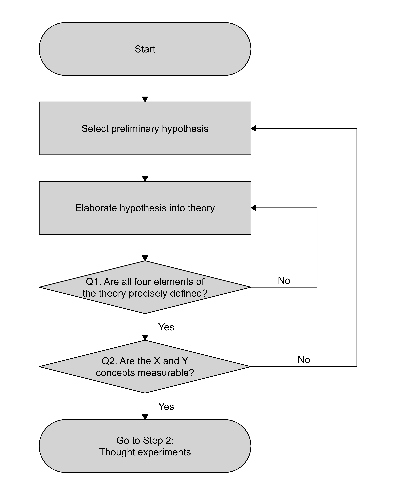 --> 
<!-- <!-- ``` --> 


<!-- ```{r youngold, echo=FALSE, fig.show="hold", out.width='50%', fig.align='center', fig.cap ="Studying phenomena from different perspectives. From: My wife and my mother-in-law. They are both in this picture – find them. Prints \\& Photographs Online Catalog, Library of Congress. Retrieved 1 October 2025, from \\url{https://www.loc.gov/pictures/item/2010652001/}."} -->
<!-- #knitr::include_graphics("youngold2.jpg") -->
<!-- #knitr::include_graphics("master-pnp-ds-00100-00175u.png") -->
<!-- knitr::include_graphics("master-pnp-ds-00100-00175uFLATGREYSCALE.png") -->
<!-- ``` -->

<!-- As discussed in Section \@ref(underdetermination), in philosophy of science, *underdetermination* means that the available evidence (data, observations) is not enough to determine uniquely which of several competing theories or hypotheses should be accepted [e.g., @stanford2023underdetermination]. This relates to what is known in statistics as the *non-identifiability* problem where evidence cannot distinguish between multiple models that could explain the data [e.g., @rothenberg1971identification]. Different models can equally well fit the data. -->
<!-- This implies that any dataset with an unknown data-generating process can be analyzed with different causal perspectives, including necessity (with its NCA tool). The commonly used probabilistic sufficiency perspective and its regression tools are not inherently the preferred approaches. It is the analyst’s choice to select an appropriate perspective, and the analyst’s responsibility to justify the corresponding hypothesis. -->

## Hypothesis formulation and testing {#hypothesistesting}
After the theoretical or practical goal is set, and it is decided to apply NCA, often the question of interest is: "Is $X$ necessary for $Y$"? or "Which factors are necessary for $Y$? 

NCA advocates starting the study by providing a preliminary answer to the question before collecting empirical data. Such an answer can be based on existing sources of knowledge. NCA is an approach in which the hypothesis is first formulated and subsequently tested with empirical data. In this deductive approach, the hypothesis can have three states: ‘preliminary’, ‘formal’ and ‘tested’. A *preliminary necessity hypothesis* is a ‘best guess’ answer to the above questions based on existing sources of knowledge and, for example, abductive reasoning. A *formal necessity hypothesis* is a deepened preliminary hypothesis that is embedded in theory and that was challenged by thought experiments regarding testability, triviality, plausibility, and completeness. A *tested necessity hypothesis* is a formal hypothesis that was subjected to tests using empirical data, where the outcome of the test is that the hypothesis is rejected or not-rejected (supported) by the observed evidence. In this book, a hypothesis is considered supported or plausible when it is not rejected after being challenged empirically. Rejection may arise from the absence of a plausible causal explanation, a very small necessity effect size, or a large $p$-value. However, support for, or plausibility of, a necessary condition does not automatically establish its truth. Greater confidence requires, for example, support from replication studies. Even then, alternative causal explanations for the observed empty corner are possible (Section \@ref(underdetermination)). Ultimately, any conclusion about a hypothesis involves human judgment, as discussed in Sections \@ref(underdetermination) and \@ref(credibilitysummary). Such a judgment may persist only briefly or endure for a long time until rejection.

As discussed below, a formal hypothesis specifies the expected necessity relationship, provides a causal explanation, and specifies the domain where it is expected to hold, among others. This is also helpful in different subsequent stages of an empirical study:

1. Study design: It helps to focus the study based on existing knowledge (Section \@ref(researchdesign)).

2. Sampling or case selection: It specifies from which theoretical domain cases must be sampled or selected (Section \@ref(samplingandselection)).

3. Results: It satisfies NCA's requirement for theoretical support for a decision about (non-)rejection of the hypothesis (Sections \@ref(corecriteria) and \@ref(necessityinkind)).

4. Discussion: It helps to interpret why the hypothesis is rejected or not, and what the theoretical and practical consequences are (Chapters \@ref(reporting) and \@ref(practice)).

In principle, NCA can also be used in a hypothesis-building (inductive) approach.
In situations where the phenomenon of interest is novel or poorly understood and
existing knowledge is not available, empirical data may be collected to extract a
preliminary necessity hypothesis from data (exploratory or theory-building study).
Such a situation is further discussed in Section \@ref(smallncaseselection). However, this book focuses on using empirical data only for hypothesis-testing and not for exploration/hypothesis-building for two reasons:

1. It is normally possible to formulate a preliminary necessity hypothesis
from existing knowledge (Section \@ref(whynecessityhypothesis)) without collecting new empirical
data.

2. To obtain an empirically tested hypothesis, it is more efficient to formulate a hypothesis first, even if existing knowledge is scarce, followed
by one round of data collection for testing, compared to first having a
round of data collection for empirically observing a preliminary hypothesis,
followed by a second round of data collection with new data for
empirically testing this hypothesis. Without testing the hypothesis with
new data, the hypothesis remains untested, even if it is formalized and
refined afterwards. According to a basic principle of the
scientific methodology, using the same data for building and testing does
not qualify for a proper empirical test of the hypothesis. This 'predesignation' principle was articulated in the Neyman–Pearson framework of hypothesis testing [@neyman1933efficient] and has an analogue in modern machine learning, where one dataset is used for training and another for testing. In other words, “It is never OK to snoop at the data before formulating a hypothesis—at least not if the same data are to be used in testing that hypothesis” [@mayo1996hunting].

As theories in the social sciences are usually semantic (expressed in words), a necessity hypothesis is formulated qualitatively as $X$ is necessary for $Y$ without specifying
the exact levels of $X$ and $Y$, other than the possibility to specify presence/high level or absence/low level of $X$ and $Y$ (Chapter \@ref(theory)). Therefore, in this chapter only the *in kind* dichotomous version of the necessary condition (necessity-in-kind, NiK) is considered, where the presence/absence of $X$ is necessary for the presence/absence of $Y$ (Figure \@ref(fig:direction1)).

## Why developing necessity hypotheses is different {#whynecessityhypothesis}
Developing a necessity hypothesis differs from developing a conventional probabilistic sufficiency hypothesis. Conventional hypothesis development draws on a wealth of existing knowledge about average effects. Reviewing established theories, causal explanations, and prior empirical studies is usually a central part of this process. In such cases, a literature review provides the main justification for the hypothesis, demonstrating that it is plausible, theoretically grounded, and worth (re)testing with empirical data.

In contrast, the current body of knowledge about necessity is still limited. Theoretical frameworks and empirical studies specifically addressing necessity are not yet widespread, and the traditional literature on probabilistic sufficiency offers little direct guidance. That literature hints at important factors that potentially could be necessary conditions, but usually provides no evidence. It may also contain indirect hints or isolated statements about necessity logic and causality. Although this can serve as inspiration or secondary support for developing necessity hypotheses, more is needed for to develop well-grounded necessity hypotheses.

Because a cumulative body of theory and evidence on necessity causality is often lacking, developing necessity hypotheses requires an approach that relies more heavily on the analyst’s creativity, critical reasoning, and substantive expertise. By integrating solid knowledge of necessity logic and necessity causal reasoning with substantive domain knowledge, and by engaging in discussions with peers, analysts can formulate convincing and meaningful necessity hypotheses. It is often surprising how quickly a relevant preliminary necessity hypothesis can emerge once this reasoning process is clear.

Whereas developing an average-effect hypothesis generally involves dedicating most effort to the literature review, developing a necessity hypothesis centers on conceptual reasoning and logical argumentation. The goal is to construct a coherent narrative that justifies why a given condition must be present for the outcome to occur, and why the outcome will not occur if the condition is absent, and no compensation is possible.

Generally, such a narrative starts with identifying an important factor (known or presumed) that contributes to a desired outcome but is not the only factor that helps to produce the outcome. Conventional literature often establishes that such a factor is important on average.^[Factors that are not important on average may still be necessary (Table \@ref(tab:multimethodregressionncaresults)).] The next step is crucial for necessity reasoning: it formulates the expectation that the presence of a high level of the outcome will disappear if the condition is absent or is reduced, corresponding to necessity logic: if not $X$, then not $Y$. The narrative then explains why this disappearance occurs, for example, through what mechanisms the absence of $X$ undermines $Y$. This is followed by an argument that other factors cannot compensate for this absence: no substitute can replace the missing necessary condition; the outcome will not be possible without it. Finally, the narrative specifies the domain of applicability. This is the boundary within which the necessity claim holds. It clarifies whether it applies universally (e.g., oxygen is necessary for human life) or only within a specific group or context (e.g., being pregnant is necessary for having a child).

For example, it may be assumed that class attendance is necessary for school performance. A minimal narrative could be formulated as follows:
*Class attendance is widely recognized as an important determinant of school performance. Meta-analyses show that students who attend classes more regularly tend to achieve higher grades on average. Attendance is not the only factor: intelligence, motivation, prior preparation, and study habits also matter. However, class attendance is crucial, as it provides the behavioral foundation through which learning processes operate effectively. If class attendance is withdrawn, school performance deteriorates—a pattern consistent with necessity logic. This disappearance occurs for several reasons. Students who skip classes miss essential explanations, examples, and discussions on which exams and assignments depend. Absence removes opportunities for immediate correction and reinforcement, allowing misconceptions to persist. Reduced attendance may also weaken motivation and belonging, leading to further reductions in performance. Other factors cannot replace the absence of class attendance. Digital resources or peer notes can alleviate short-term gaps but do not replicate the real-time cognitive and social engagement that in-class participation provides. This necessity relationship applies primarily to students in traditional, face-to-face courses where class sessions deliver core content and interactive learning is integral to success. It may not apply universally, for example, in fully online, asynchronous courses where students can compensate for absence through other structured forms of engagement. Within the conventional classroom teaching format, however, attendance remains a necessary condition for school performance.*^[Elements of such a reasoning can be found in @tynan2020education. In this study the necessity-in-kind analysis showed that class attendance is necessary for high grades ($d$ = 0.28, $p$ < 0.001), and the subsequent necessity-in-degree analysis found that students needed to attend at least 50% of classes to achieve a grade of 90% or higher.]

This narrative defines not only the hypothesis (Class attendance is necessary for high school performance), but gives also a causal explanation (student miss essential learning elements, lack of interactions and motivation, no compensation possible by digital resources) and defines the theoretical domain (conventional classroom teaching).

While creativity is central for formulating the narrative, existing information sources can help generate, sharpen and justifying hypotheses about necessary conditions. This chapter provides a detailed plan and practical tools for this process. While it may appear complex at first, it soon becomes almost automatic once one becomes familiar with the reasoning steps involved.

## Knowledge sources for developing necessity hypotheses {#sources}
The development of a formal necessity hypothesis begins with the selection of a preliminary hypothesis, based on existing knowledge. Various sources such as academic literature, practical insights, and expert judgment can inform this selection. To ensure the relevance of the necessity hypothesis for both theory and practice, knowledge from scholarly research, real-world experience, and the expertise of the analyst can be combined. Since formulating a necessity hypothesis is primarily a creative process it can rely both on explicit knowledge (documented knowledge from academia and practice) and on tacit knowledge (undocumented expert knowledge from scholars and practitioners). This process may be iterative and involve people with different knowledge backgrounds. The result is a defensible claim made by the analyst (and others), which requires a test with empirical data to be (non-)rejected. Or, according to Popper: 
```{=tex}
\vspace{3\baselineskip}
```

>"[Great scientists] are men\footnote{In Popper’s time, the terms `man' and `mankind' were commonly used in academic writing to refer to humans in general, not just males.} of bold ideas, but highly critical of their own ideas; they try to find whether their ideas are right by trying first to find whether they are not perhaps wrong." [@Popper1985, p. 119].

<!-- >“[Great scientists] are men^[In Popper’s time, the terms ‘man’ and ‘mankind’ were commonly used in academic writing to refer to humans in general, not just males.] of bold ideas, but highly critical ofmtheir own ideas; they try to find whether their ideas are right by trying first to find whether they are not perhaps wrong.” [@Popper1985, p. 119]. -->

This section elaborates on the two sources of information for selecting a preliminary
necessity hypothesis: explicit knowledge and tacit knowledge.

### Explicit knowledge {#explicit}
Explicit knowledge is documented in the academic literature (e.g., books, journal articles)
and practice literature (e.g., best practice documents, manuals). Since practice
is more focused on ‘doing’ than on ‘documenting’, less explicit knowledge is available
from practice than from academia. Practice documents could contain know-how
and statements that refer to necessity using terms like ‘requirements’, ‘must have’,
‘critical success factors’, or ‘bottlenecks’, etc.
This section focuses on academic literature since it contains much information
that can be used to formulate a preliminary necessity hypothesis. Four approaches for
identifying them can be distinguished: 

1. Sometimes the academic literature includes explicit *necessity theories*, whose necessity hypotheses may need to be (re)tested;

2. The literature may also contain *statements* referring to necessity.

3. The literature contains *causal models*, which are formal models primarily developed for probabilistic sufficiency causality, but elements may be useful for necessity causality as well.

4. The literature contains *causal narratives* for describing probabilistic sufficiency relationships or more general causes that contribute to the outcome that can inspire necessity reasoning.

These sources of explicit scholarly knowledge can be used to derive a *preliminary necessity hypothesis*. Each source is discussed below in more detail.

#### Necessity theories {#necessitytheories}
As discussed in Section \@ref(theorytypes), some theories explicitly state necessity relationships. Such theories can be established or emerging, and may be 'pure' necessity theories consisting only of necessity relationships, or 'embedded' necessity theories consisting of a combination of necessity relationship and other relationships.
As the examples in Section \@ref(theorytypes) show, often, necessity theories have not been (extensively) tested empirically. (Re)testing selected necessity relationships from these theories can provide valuable insights into their empirical support and generalizability.

#### Necessity statements {#necessitystatements}
Phrases using terms like 'necessary' or 'necessary but not sufficient' are very common in the academic literature (and in practice). Although several statements may
use the word necessity loosely as a synonym for important, many refer explicitly to necessity logic and causality, in particular when it is stated ‘for what’ the condition is necessary. For example, in the field of supply chain management, @bokrantz2022building systematically reviewed necessity statements in major journals and identified 157 statements that can be considered theoretical necessity claims. Most of these statements have not been tested at all, or not been tested properly for necessity (e.g., using regression analysis). A similar result was found by @richter2022necessary when analyzing necessity statements in the field of international business. The literature also uses terms that are directly related to necessity, without using the words 'necessity' or 'necessary'. Examples of such words are listed in Table \@ref(tab:wordsnecessity). Several terms reflect that the necessary condition must be present to have the outcome (enablers); others reflect that the absence of the necessary conditions guarantees the absence of the outcome (constraints). Existing necessity or equivalent statements can be reviewed, and selected statements can be candidates for a preliminary necessity hypothesis.

```{r wordsnecessity, echo = FALSE, warning=FALSE, message=FALSE, include=TRUE, cache=TRUE}

# Load data
Wordsleft <- read.csv("Wordsleft.csv")
Wordsright <- read.csv("Wordsright.csv")

# Combine into a data frame #add spaces to make column length left-right equal
df <- data.frame(
  `Enablers (The presence of X ...)` = Wordsleft[[1]],
  `Constraints (The absence of X ...)` = Wordsright[[1]]
)

# Render LaTeX table
knitr::kable(
  df,
  col.names = c("Enablers (The presence of X …)", "Constraints (The absence of X …)"),
  caption = "Equivalent terms for $X$ is necessary for $Y$. Left: Enablers. Right: Constraints.",
  align = c("l", "l"),
  booktabs = TRUE,
  longtable = FALSE, # FALSE prevents the table splits over pages in pdf
  linesep = "" # This removes the space after 5th row if bookdtabs = TRUE
)

##FOR HTML
# 
# library(knitr)
# library(kableExtra)
# library(tidyverse)
# library(xlsx)
# pub <- read.xlsx("Words.xlsx", sheetIndex = 1)
# pubs <- pub[,c(1,2)]
# colnames(pubs) <- c("Enablers (The presence of X …)", "Constraints (The absence of X …)")
# 
# kbl(
#   pubs,
#   #format = "latex"#,
#   booktabs = TRUE,
#   #escape = FALSE,
#   longtable = TRUE,
#   col.names = colnames(pubs),
#   align = c("l", "l"),
#   caption = "Words representing necessity"  ,
#   format = "html",
#   table.attr = "style='width:30%;'"
#   ) %>%
#   kable_styling(font_size =15, full_width = F) %>%
#   kable_paper()
#   #scroll_box(width = "100%", height = "300px")
# 
# #column_spec(x, column = 2, width = "2em")
```
<br>

#### Causal models {#causalmodels}
The academic literature contains numerous causal models based on probabilistic sufficiency relationships between variables. Such models are generally evaluated through regression-based methods. All or some of the relationships in the models could be revisited with a necessity perspective on the relationship. Revisiting the relationship with a new causal perspective is *not* a replication or robustness test of the existing model. It yields a new necessity model or theory that provides new insights.

An example of a probabilistic sufficiency model is shown in Figure \@ref(fig:examplecausalmodelfig) about nine factors that contribute to academic achievement. While these factors have only been modeled as having an average effects on the outcome and were tested with regression-based studies, some studies literature refer to these factor as critical [e.g., @ma2001confirmatory], in the meaning of 'highly influential'. This model could be revisited from the perspective of necessity causality thereby re-interpreting the word critical as necessary. 
<br>
<!-- (ref:caption21) Example of a causal model (originally for describing probabilistic sufficiency) for academic achievement with 9 factors that contribute to academic achievement. After: @walberg1984improving. -->
```{r examplecausalmodelfig, echo=FALSE, out.width='99%', fig.align='center', fig.cap="Example of a causal model (originally for describing probabilistic sufficiency) for academic achievement with 9 factors that contribute to academic achievement. After: @walberg1984improving."}
 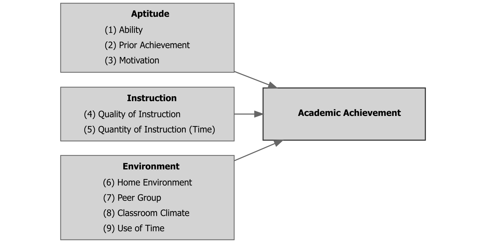
```


```{r, echo = FALSE, eval =FALSE}

library(DiagrammeR)
library(DiagrammeRsvg)
library(rsvg)

walberg_graph <- grViz("
digraph walberg {

  graph [layout = dot, rankdir = LR, fontsize = 10]

  node [shape = rectangle, style = filled, color = gray40,
        fontname = Helvetica, fontsize = 11, fillcolor = \"#D3D3D3\"]

  # --- Nodes with centered titles + left-aligned indicators ---------------
  Aptitude [
    label = <
      <TABLE BORDER='0' CELLBORDER='0' CELLPADDING='2'>
        <TR><TD ALIGN='CENTER'><B>Aptitude</B></TD></TR>
        <TR><TD ALIGN='LEFT'>(1) Ability</TD></TR>
        <TR><TD ALIGN='LEFT'>(2) Prior Achievement</TD></TR>
        <TR><TD ALIGN='LEFT'>(3) Motivation</TD></TR>
      </TABLE>
    >, width = 3.0
  ]

  Instruction [
    label = <
      <TABLE BORDER='0' CELLBORDER='0' CELLPADDING='2'>
        <TR><TD ALIGN='CENTER'><B>Instruction</B></TD></TR>
        <TR><TD ALIGN='LEFT'>(4) Quality of Instruction</TD></TR>
        <TR><TD ALIGN='LEFT'>(5) Quantity of Instruction (Time)</TD></TR>
      </TABLE>
    >, width = 3.0
  ]

  Environment [
    label = <
      <TABLE BORDER='0' CELLBORDER='0' CELLPADDING='2'>
        <TR><TD ALIGN='CENTER'><B>Environment</B></TD></TR>
        <TR><TD ALIGN='LEFT'>(6) Home Environment</TD></TR>
        <TR><TD ALIGN='LEFT'>(7) Peer Group</TD></TR>
        <TR><TD ALIGN='LEFT'>(8) Classroom Climate</TD></TR>
        <TR><TD ALIGN='LEFT'>(9) Use of Time</TD></TR>
      </TABLE>
    >, width = 3.0
  ]
  
  Achievement [
    label = <<B>Academic Achievement</B>>,
    fillcolor = '#D3D3D3',
    color = gray20, penwidth = 1.3,
    width = 2.8, height = 0.9
  ]

  # --- Edges --------------------------------------------------------------
  Aptitude    -> Achievement [color = gray40, penwidth = 1.3]
  Instruction -> Achievement [color = gray40, penwidth = 1.3]
  Environment -> Achievement [color = gray40, penwidth = 1.3]

  # --- Layout -------------------------------------------------------------
  {rank = same; Aptitude; Instruction; Environment}
}
")

# Render in RStudio viewer
walberg_graph

# --- Export: SVG and PDF --------------------------------------------------
svg_txt <- export_svg(walberg_graph)
writeLines(svg_txt, "walberg_model_gray.svg")

# Convert SVG to PNG and PDF
#rsvg_png("walberg_model_gray.svg", "walberg_model_gray.png", width = 1400, height = 700)
#rsvg_pdf("walberg_model_gray.svg", "walberg_model_gray.pdf", width = 14, height = 7)


```


It is also possible that two concepts that were not (directly) related in a probabilistic sufficiency-based model, are related in a necessity model. The original role of a concept (e.g., independent, dependent, mediator, moderator, control) is not relevant for formulating a new role for the concept in a different causal model (condition or outcome in a necessity model).

An additional possibility is to evaluate suggestions for future studies that are made in a study based on average effects. It is not uncommon that a publication about a model suggests to apply NCA in future studies to (also) investigate the phenomena from a necessity perspective. Likewise, literature reviews of studies with regression-based causal models and thus probabilistic sufficiency perspectives often suggest exploring the phenomenon with NCA and thus with a necessity perspective as well to further enrich the state of knowledge. Chapter \@ref(introduction) gives examples of publications that suggest using NCA in future research.  

<!-- [e.g., @aguinis2020methodological; @boon2019systematic; @crede2021should; @dabic202140; @delios2023reconsidering; @frazier2017psychological;  @gajda2017creativity; @hauff2021analytical; @klimas2023attributes; @linder2022necessary; @richter2022use; @zahoor2023international]. -->

<!-- These approaches to analyses causal models can lead to the formulation of a preliminary necessity hypothesis.   -->

<!-- A substantive part of the academic literature uses Structural Equation Modeling (SEM) to describe probabilistic sufficiency causal models, and analyse them with a  regression-based method. Particularly when SEM is used with the Partial Least Squares algorithm (PLS-SEM) is has become a standard to use NCA. A majority of studies, however, explore the necessity of all relationships from the structural model without theoretical justification, risking having found a trivial or implausible results. As explained in Section \@ref(developingformaltheory), rather than exploring all SEM relationship for necessity, the preferred approach is to first formulate a formal necessity hypotheses, and then to select concepts from the SEM model to test these hypotheses. (see Section \@ref(plssem)). -->

#### Causal narratives {#causalnarratives}
<!-- In theory and discussion sections in the academic literature, authors frequently highlight causal factors and causal relationships. Although the type of causality is often not explicitly stated, various terms are used to highlight to highlight the importance of certain causes, suggesting potential necessity. Examples of terms that hint to necessity (enablers or constraints) are listed in \@ref(tab:wordsnecessity).  -->
When proposing or justifying hypotheses, academic publications often use causal narratives: stories with explanations that connect causes to effects. For example, in describing probabilistic sufficiency relations, the narrative outlines the mechanism through which a cause contributes to an effect. These causal mechanisms can be critically evaluated by assessing whether the absence of a particular factor disrupts the mechanism. By systematically analyzing causal terminology (Table \@ref(tab:wordsnecessity)), and identifying factors that could break the mechanism (potential necessary conditions) it may be possible to formulate a preliminary necessity hypothesis. For example, @hausknecht2008work argue that organizational commitment has a negative effect on absenteeism as follows:  

> [...] [O]rganizational commitment is defined as a collective
sense of affective or emotional attachment to
an organization [...]. Employees
are thought to develop organizational attachments
via experiences in the unit where they work [...]. For example, employees of
high-commitment units may engage in more community
maintenance behaviors, including regular
attendance at work. Thus, high-commitment work
units are likely to be associated with stricter attendance
norms [...]. At the individual level, meta-analytic evidence
has supported the negative relationship
between commitment and absenteeism [...]. In view of these findings,
and the premise that high commitment reflects
a strong collective attachment to organizational
values and goals, including attendance at work,
we expect that at the unit level of analysis, organizational
commitment is negatively related to
absenteeism. [@hausknecht2008work, p.1255].

Although in this quote the relationship between organizational commitment and absenteeism is clearly described as a probabilistic sufficiency relationship, such a causal narrative could be approached from the perspective of necessity as well. It could be wondered if the absence of organizational commitment would stop low absenteeism. In this example, the authors themselves explicitly suggest this by stating:   

> When the level of analysis is the work unit, organizational commitment may be a necessary but insufficient condition for low absenteeism. (p. 1225)

and after conducting a regression analysis they conclude (although this cannot be supported by a regression-based analysis):

> Taken together, the findings [...] show that
high organizational commitment is necessary to
avoid high levels of absenteeism. [@hausknecht2008work, p. 1239]

Explicit statements about necessity on causal reasoning in the literature may support the necessity argument, even though necessity was not tested in the original study (Section \@ref(necessitystatements)).

### Tacit knowledge {#tacit}
Undocumented expert knowledge can be used to formulate a preliminary necessity hypothesis. Experts often possess theoretical or practical insights that can be interpreted in terms of necessity, in particular when these insights are described with words from Table \@ref(tab:wordsnecessity). This approach is especially useful in fields where explicit knowledge is scarce, while experts believe necessity relationships exist.

Two types of experts can be distinguished: academic experts (scholars) and practitioner experts (practitioners). *Scholars* are persons with deep theoretical or empirical knowledge developed through research. Drawing upon their expertise, comprehensive understanding of the academic literature, and possibly practical experience, they may identify potential necessary conditions either directly by recognizing explicit hypotheses, or indirectly, by recognizing important factors for an outcome that could also be interpreted as necessary conditions. *Practitioners*  are professionals with hands-on experience in a field outside academia (e.g., consultants, managers, employees, engineers, policy-makers, educators, designers). While they may not articulate their knowledge as hypotheses, they often operate based on an implicit "theory in use" [@dul2008case], a solid belief grounded in practice and experience that explains why a certain factor causes a certain effect. These informal theories may include necessity logic. This is not unlikely as practitioners commonly focus on factors that are required for success ('critical success factors'), or on fail factors that prevent success by identifying and addressing 'bottlenecks'. Their practical insights can be systematically translated into preliminary necessity hypotheses.

An array of qualitative methods exists to capture experts' tacit knowledge, ranging from informal conversations, in-depth interviews, and creative group sessions to more structured approaches such as think-aloud protocols, and Delphi studies. However, tacit knowledge has a complex status in academia. It is often valued implicitly (many scholars  rely on it), but devalued explicitly when used as evidence or justification, because it does not fit the norms of transparency, replicability, and formal theorizing that define "scientific" knowledge. If a hypothesis is (partly) developed based on tacit practitioner knowledge, the approach used for obtaining this knowledge can be reported and it can be justified that such knowledge is not anecdotal, but accumulated through extensive experience with the practice, system, or process, thus empirically grounded.

## Developing a formal necessity hypothesis {#developingformaltheory}
A formal necessity hypothesis has five characteristics:

*Theory-grounded*: the hypothesis is embedded in a necessity theory. According to Chapter \@ref(theory), a theory is defined when four elements are defined: focal unit, concepts (condition and outcome), (direction of) the hypothesis^[In the context of formulating a formal hypothesis for testing, the term 'hypothesis' instead of 'proposition' (Chapter \@ref(theory)) is used to describe the relationship between the theory's concepts.], and theoretical domain.

*Testable*. A hypothesis is empirically testable if the concepts $X$ and $Y$ can be operationalized into measurable variables.  

*Non-trivial*. A hypothesis is non-trivial when both the  absence of the condition and presence of the outcome are possible, otherwise it is trivial.  

*Plausible*. A hypothesis is plausible when virtually no cases are reasonably expected in the empty corner.

*Complete*. A hypothesis is complete  when a plausible explanation for *why* condition $X$ is necessary for outcome $Y$ is available.   

<!-- Having a formal necessity hypothesis serves several goals. First, it provides the 'theoretical justification' of the necessary condition, which is one of the requirements of concluding necessity from data (see Section \@ref(corecriteria)). Second, it guides the data collection process such that proper cases are sampled or selected. Third, in the data analysis it specifies which empty corner in the $XY$-plot is expected to be empty and must be analysed for emptiness ("expected empty corner"). A formal necessity hypothesis also helps the causal interpretation of the empirical results. -->

The development process of a formal necessity hypothesis consists of three steps that are shown in Figures \@ref(fig:theorydecisiontreeSTEP1fig), \@ref(fig:theorydecisiontreeSTEP2fig), and \@ref(fig:theorydecisiontreeSTEP3fig), respectively. 

In the first step (Figure \@ref(fig:theorydecisiontreeSTEP1fig)), a preliminary necessity hypothesis is selected based on the available sources of information (Section \@ref(sources)), and is embedded in a *preliminary necessity theory* by defining focal unit, concepts, (direction of) the hypothesis, and theoretical domain. Concepts are defined such that they are measurable and the hypothesis becomes testable. After this step the hypothesis is *theory-grounded* and *testable*. 

In the second step (Figure \@ref(fig:theorydecisiontreeSTEP2fig)) a *thought experiment* is conducted in which the preliminary necessity theory is challenged and possibly revised. After this step the hypothesis is also *non-trivial* and *plausible*. 

In the third step (Figure \@ref(fig:theorydecisiontreeSTEP3fig)) a detailed *causal explanation* for the hypothesis is given (Chapter \@ref(causality)). This final step makes the hypothesis *complete*. The formal hypothesis is now ready to be tested with empirical data.

Below, each step is discussed in more detail and illustrated with an example of the preliminary hypothesis that ‘An internet connection is necessary for attending an online meeting’.

<!-- <br> -->
<!-- ```{r theorydecisiontreefig, echo=FALSE, fig.show="hold", out.width='90%', fig.align='center', fig.cap="Development process of a formal necessity hypothesis. Step 1: Defining a preliminary necessity theory (until Q3). Step 2: Using thought experiments to challenge the preliminary theory (from Q3 until Q10). Step 3. Adding a causal explanation to obtain the hypothesis that can be tested with empirial data (from Q10)."} -->
<!--  #par(mfrow = c(1,2)) -->
<!--  knitr::include_graphics("theory_decision_tree.pdf") -->
<!--  #knitr::include_graphics("Fig1emptydichInternet.png") -->
<!-- ``` -->


<!-- ```{r theorydecisiontreecode, eval = FALSE, echo=FALSE, message=FALSE, warning=FALSE} -->
<!-- # Load required libraries -->
<!-- library(DiagrammeR) -->
<!-- library(DiagrammeRsvg) -->
<!-- library(rsvg) -->

<!-- # Create the diagram -->
<!-- graph <- grViz(" -->
<!-- digraph theory_decision_tree { -->
<!--   graph [layout = dot, rankdir = TB, ranksep=0.2] -->
<!--   node [shape = rectangle, style=filled, color=lightgray, fontname=Helvetica, fontsize=10] -->
<!--   A0 [label='Select preliminary hypothesis'] -->

<!--   A01 [label='Embed hypothesis in theory'] -->

<!--   A1 [label='Q1. Are all four elements of the theory precisely defined?'] -->
<!--   A_N [label='Define theory.\\nReturn to Q1.'] -->

<!--   A02 [label='Q2. Are the X and Y concepts measurable?'] -->
<!--   A02_N [label='Make concepts measurable.\\nReturn to Q2.'] -->


<!--   B2 [label='Q3. Do cases exist\\nwith the outcome?'] -->

<!--   // Force A02_N and B2 to be on same rank -->
<!--   // { rank=same; A02_N; B2 } -->

<!--   // Force A02_N and B2 to be vertically aliged -->
<!--   A02_N -> B2 [style=invis, weight=10] -->

<!--   B2_N [label='Hypothesis is trivial:\\nStop'] -->

<!--   B3 [label='Q4. Do cases exist\\nwithout the condition?'] -->


<!--   C4 [label='Q5. Do all cases with the outcome\\nhave the condition?'] -->

<!--   D6 [label='Q7. Are counterexamples rare?'] -->
<!--   D6_N [label='Hypothesis rejected:\\nStop'] -->

<!--   E7 [label='Q6. Do all cases without the condition\\nlack the outcome?'] -->

<!--   F9 [label='Q8. Can exceptions be handled\\nby redefining concepts/domain?'] -->

<!--   F10 [label='Q9. Is the typicality perspective adopted?'] -->

<!--   G11 [label='Q10. Is it explained why the condition\\nis necessary for the outcome?'] -->
<!--     // Force D6_N and G11 to be vertically aliged -->
<!--   D6_N -> G11 [style=invis, weight=10] -->

<!--   G11_Y [label='Hypothesis is ready for testing:\\nEnd'] -->
<!--   G11_N [label='Provide causal explanation.\\nReturn to Q10.'] -->

<!--   // Connections -->
<!--   A0 -> A01 -->
<!--   A01 -> A1 -->

<!--   A1 -> A_N [label='No'] -->
<!--   A_N -> A1 -->

<!--   A1 -> A02 [label='Yes'] -->
<!--   A02 -> A02_N [label='No'] -->
<!--   A02_N -> A02 -->

<!--   A02 -> B2 [label='Yes'] -->

<!--   B2 -> B3 [label='Yes'] -->
<!--   B2 -> B2_N [label='No'] -->
<!--   B3 -> C4 [label='Yes'] -->
<!--   B3 -> B2_N [label='No'] -->
<!--   C4 -> E7 [label='Yes'] -->
<!--   C4 -> D6 [label='No'] -->
<!--   D6 -> F9 [label='Yes'] -->
<!--   D6 -> D6_N [label='No'] -->
<!--   E7 -> D6 [label='No'] -->
<!--   E7 -> G11 [label='Yes'] -->
<!--   F9 -> A1 [label='Yes'] -->
<!--   F9 -> F10 [label='No'] -->
<!--   F10 -> G11 [label='Yes'] -->
<!--   F10 -> D6_N [label='No'] -->
<!--   G11 -> G11_N [label='No'] -->
<!--   G11_N -> G11 -->
<!--   G11 -> G11_Y [label='Yes'] -->
<!-- } -->
<!-- ") -->

<!-- # Export the graph as SVG -->
<!-- #svg <- export_svg(graph) -->
<!-- # # Render SVG as a raster image -->
<!-- # bitmap <- rsvg::rsvg_png(charToRaw(svg)) -->

<!-- # Display the bitmap in the plot window -->
<!-- # grid::grid.raster(png::readPNG(bitmap)) -->

<!-- #rsvg_pdf(charToRaw(svg), file = "theory_decision_tree.pdf", width = 2000, height = 3000) -->
<!-- # rsvg_png(charToRaw(svg), file = "theory_decision_tree.png", width = 2000, height = 3000) -->

<!-- ``` -->


### Step 1: Define a preliminary necessity theory {#preliminarytheory}
The first step transforms the preliminary *hypothesis* into a preliminary necessity *theory*. This is a theory that has measurable concepts, a hypothesis describing the expected necessity relationship between the concepts, and a description of the theory's focal unit and theoretical domain (Chapter \@ref(theory)). However, this theory is not yet challenged in a thought experiment, which is the topic of Step 2. Figure \@ref(fig:theorydecisiontreeSTEP1fig) shows the hypothesis development tool for Step 1 of the development process.

```{r theorydecisiontreeSTEP1fig, echo=FALSE, fig.show="hold", out.width='90%', fig.align='center', fig.cap="Hypothesis development tool for Step 1 of the development process of a formal necessity hypothesis: Defining a preliminary necessity theory."}
 #par(mfrow = c(1,2))
 #knitr::include_graphics("theory_decision_treeSTEP1.pdf")
 
```

```{r theorydecisiontreeSTEP1code, eval = FALSE, echo=FALSE, message=FALSE, warning=FALSE}
library(ggplot2)
library(grid)

# === Layout parameters ===
box_height <- 0.1
box_width  <- 0.4
text_size  <- 5
spacing <- 0.3  # Vertical distance between boxes

# Arrow layout
box_right_x <- 0 + box_width
arrow_buffer <- 0.25
arrow_out_x_cb <- box_right_x + 0.25  # for C → B
arrow_out_x_da <- box_right_x + 0.4   # for D → A

# Dynamic vertical y positions (added Start above A)
y_positions <- setNames(seq(from = spacing * 5, to = 0, by = -spacing),
                        c("Start", "A", "B", "C", "D", "E"))

# === Nodes ===
nodes <- data.frame(
  id = names(y_positions),
  label = c(
    "Start",
    "Select preliminary hypothesis",
    "Elaborate hypothesis into theory",
    "Q1. Are all four elements of\nthe theory precisely defined?",
    "Q2. Are the X and Y\nconcepts measurable?",
    "Go to Step 2:\nThought experiments"
  ),
  x = 0,
  y = y_positions,
  stringsAsFactors = FALSE
)

# Identify shapes: diamonds for questions, rounded rectangles for Start and E only, regular boxes for A and B
nodes$shape <- ifelse(grepl("^Q[0-9]+", nodes$label), "diamond", 
                      ifelse(nodes$id %in% c("Start", "E"), "rounded", "box"))

# === Forward arrows (Yes) ===
edges <- data.frame(
  x = rep(0, 5),
  y = y_positions[c("Start", "A", "B", "C", "D")],
  xend = rep(0, 5),
  yend = y_positions[c("A", "B", "C", "D", "E")] + box_height,
  label = c(NA, NA, NA, "Yes", "Yes"),
  labx = c(NA, NA, NA, 0.05, 0.05),
  laby = c(NA, NA, NA, (y_positions["C"] + y_positions["D"])/2, (y_positions["D"] + y_positions["E"])/2),
  stringsAsFactors = FALSE
)

# === "No" arrow: C → B ===
no_C_B_segments <- data.frame(
  x    = c(box_right_x, arrow_out_x_cb, arrow_out_x_cb, box_right_x + arrow_buffer),
  y    = c(y_positions["C"], y_positions["C"], y_positions["B"], y_positions["B"]),
  xend = c(arrow_out_x_cb, arrow_out_x_cb, box_right_x + arrow_buffer, box_right_x),
  yend = c(y_positions["C"], y_positions["B"], y_positions["B"], y_positions["B"])
)

# === "No" arrow: D → A ===
no_D_A_segments <- data.frame(
  x    = c(box_right_x, arrow_out_x_da, arrow_out_x_da, box_right_x + arrow_buffer),
  y    = c(y_positions["D"], y_positions["D"], y_positions["A"], y_positions["A"]),
  xend = c(arrow_out_x_da, arrow_out_x_da, box_right_x + arrow_buffer, box_right_x),
  yend = c(y_positions["D"], y_positions["A"], y_positions["A"], y_positions["A"])
)

# === Diamond coordinates ===
get_diamond_coords <- function(x, y) {
  data.frame(
    x = c(x, x + box_width, x, x - box_width),
    y = c(y + box_height, y, y - box_height, y),
    group = paste0("g", x, y)
  )
}

diamond_coords <- do.call(rbind, lapply(1:nrow(nodes), function(i) {
  if (nodes$shape[i] == "diamond") {
    coords <- get_diamond_coords(nodes$x[i], nodes$y[i])
    coords$id <- nodes$id[i]
    return(coords)
  } else {
    return(NULL)
  }
}))

# === Rounded rectangle coordinates (individual shapes) ===
get_rounded_rect_coords <- function(x, y, width, height, n_points = 50) {
  # Radius equals box height, ensures left and right are semicircles
  radius <- height
  
  # No flat top/bottom lines — just left and right half-circles joined
  left_angles <- seq(pi/2, 3*pi/2, length.out = n_points/2)
  right_angles <- seq(-pi/2, pi/2, length.out = n_points/2)
  
  # Left semicircle (top to bottom)
  left_center_x <- x - width + radius
  left_center_y <- y
  left_x <- left_center_x + radius * cos(left_angles)
  left_y <- left_center_y + radius * sin(left_angles)
  
  # Right semicircle (bottom to top)
  right_center_x <- x + width - radius
  right_center_y <- y
  right_x <- right_center_x + radius * cos(right_angles)
  right_y <- right_center_y + radius * sin(right_angles)
  
  # Combine in order: left half-circle, right half-circle
  coords_x <- c(left_x, right_x)
  coords_y <- c(left_y, right_y)
  
  data.frame(x = coords_x, y = coords_y)
}


# Create individual rounded rectangles
rounded_coords <- do.call(rbind, lapply(which(nodes$shape == "rounded"), function(i) {
  coords <- get_rounded_rect_coords(nodes$x[i], nodes$y[i], box_width, box_height)
  coords$id <- nodes$id[i]
  coords$group <- paste0("rounded_", nodes$id[i])
  return(coords)
}))

# === Plot ===
p <- ggplot() +
  # Forward arrows (Yes)
  geom_segment(data = edges,
               aes(x = x, y = y, xend = xend, yend = yend),
               arrow = arrow(length = unit(0.3, "cm"), type = "closed"),
               linewidth = 0.4) +
  
  # Yes labels
  geom_text(data = subset(edges, !is.na(label)),
            aes(x = labx, y = laby, label = label),
            size = text_size, hjust = 0) +
  
  # No arrow: C → B
  geom_segment(data = no_C_B_segments[1:3, ],
               aes(x = x, y = y, xend = xend, yend = yend),
               linewidth = 0.4) +
  geom_segment(data = no_C_B_segments[4, , drop = FALSE],
               aes(x = x, y = y, xend = xend, yend = yend),
               arrow = arrow(length = unit(0.3, "cm"), type = "closed"),
               linewidth = 0.4) +
  geom_text(aes(x = (box_right_x + arrow_out_x_cb)/2, y = y_positions["C"], label = "No"),
            size = text_size, vjust = -0.5) +
  
  # No arrow: D → A
  geom_segment(data = no_D_A_segments[1:3, ],
               aes(x = x, y = y, xend = xend, yend = yend),
               linewidth = 0.4) +
  geom_segment(data = no_D_A_segments[4, , drop = FALSE],
               aes(x = x, y = y, xend = xend, yend = yend),
               arrow = arrow(length = unit(0.3, "cm"), type = "closed"),
               linewidth = 0.4) +
  geom_text(aes(x = (box_right_x + arrow_out_x_da)/2, y = y_positions["D"], label = "No"),
            size = text_size, vjust = -0.5) +
  
  # Regular boxes for non-question, non-rounded nodes (now includes A and B)
  geom_rect(data = nodes[nodes$shape == "box", ],
            aes(xmin = x - box_width, xmax = x + box_width,
                ymin = y - box_height, ymax = y + box_height),
            fill = "lightgray", color = "black") +
  
  # Rounded rectangles for Start and E only
  geom_polygon(data = rounded_coords,
               aes(x = x, y = y, group = group),
               fill = "lightgray", color = "black") +
  
  # Diamonds for question nodes
  geom_polygon(data = diamond_coords,
               aes(x = x, y = y, group = id),
               fill = "lightgray", color = "black") +
  
  # Node labels
  geom_text(data = nodes,
            aes(x = x, y = y, label = label),
            size = text_size, lineheight = 1) +
  
  theme_void() +
  coord_fixed()

# === Export ===
print(p)
ggsave("theory_decision_treeSTEP1.png", p, width = 8, height = 10, dpi = 600)
ggsave("theory_decision_treeSTEP1.pdf", p, width = 8, height = 10, device = cairo_pdf)

```


<!-- ```{r theorydecisiontree1code, eval = FALSE, echo=FALSE, message=FALSE, warning=FALSE} -->
<!-- # Load required libraries -->
<!-- library(DiagrammeR) -->
<!-- library(DiagrammeRsvg) -->
<!-- library(rsvg) -->

<!-- # Create the diagram -->
<!-- graph1 <- grViz(" -->
<!-- digraph theory_decision_tree { -->
<!--   graph [layout = dot, rankdir = TB, ranksep=0.2] -->
<!--   node [shape = rectangle, style=filled, color=lightgray, fontname=Helvetica, fontsize=10] -->
<!--   A0 [label='Select preliminary hypothesis'] -->

<!--   A01 [label='Embed hypothesis in theory'] -->

<!--   A1 [label='Q1. Are all four elements of the theory precisely defined?'] -->
<!--   A_N [label='Define theory.\\nReturn to Q1.'] -->

<!--   A02 [label='Q2. Are the X and Y concepts measurable?'] -->
<!--   A02_N [label='Make concepts measurable.\\nReturn to Q2.'] -->


<!--   B2 [label='Go to Step 2:\\nThought experiments'] -->

<!--   // Force A02_N and B2 to be on same rank -->
<!--   // { rank=same; A02_N; B2 } -->

<!--   // Force A02_N and B2 to be vertically aliged -->
<!--   A02_N -> B2 [style=invis, weight=10] -->


<!--   // Connections -->
<!--   A0 -> A01 -->
<!--   A01 -> A1 -->

<!--   A1 -> A_N [label='No'] -->
<!--   A_N -> A1 -->

<!--   A1 -> A02 [label='Yes'] -->
<!--   A02 -> A02_N [label='No'] -->
<!--   A02_N -> A02 -->

<!--   A02 -> B2 [label='Yes'] -->


<!-- } -->
<!-- ") -->

<!-- # Export the graph as SVG -->
<!-- svg1 <- export_svg(graph1) -->
<!-- # Render SVG as a raster image -->
<!-- bitmap1 <- rsvg::rsvg_png(charToRaw(svg1)) -->

<!-- # Display the bitmap in the plot window -->
<!--  grid::grid.raster(png::readPNG(bitmap1)) -->

<!-- rsvg_pdf(charToRaw(svg1), file = "theory_decision_tree1.pdf") -->
<!-- rsvg_png(charToRaw(svg1), file = "theory_decision_tree1.png", width = 2000, height = 3000) -->

<!-- ``` -->

To begin, a preliminary hypothesis is formulated based on existing knowledge (Section \@ref(sources)). This hypothesis is then elaborated into a preliminary necessity theory by precisely defining the four constituent elements of a necessity theory:

- Precise definition of *focal unit*. The focal unit is the entity of the theory to which the theory applies (e.g., person, team, country, project, etc.). 

Sometimes, defining the focal unit is simple. For example, the Theory of Planned Behavior [TPB, @ajzen1991theory] is a theory about individual behavior. The focal unit is evident: 'individual' or 'person'. Other times, the focal unit may not be immediately clear, for example, when theorizing the relationship between parent height and child height [@galton1886regression].^[This example is discussed in Section \@ref(ncawithregressionbasedmethods).] The focal unit is neither parent nor child but 'parent-child pair'. The focal unit is expressed as a singular noun, not a plural noun.  Specification is important because cases to be sampled or selected for testing the hypothesis must be specific units/examples of the focal unit (e.g., a person, a parent-child pair). Additionally, the concepts of the theory are characteristics of the focal unit.

- Precise definition of the *concepts*. The concepts are the varying characteristics that are relevant for the theory. For a necessity theory, the concepts are condition $X$ and outcome $Y$. The outcome often represents something either desirable or undesirable. Desirable outcomes include, health, well-being, performance, innovation, success, etc. Undesirable outcomes may be sickness, risk, disease, failure, etc. The condition is the concept that must be present to have the outcome. 

In the TPB example the condition is *Intention for the behavior* (of a person), and the outcome is *Performance of the behavior* (of a person). In the body height example the condition is *Parent body height* (of a parent-child pair) and the outcome is *Child body height* (of a parent-child pair).

- Precise specification of the *hypothesis*. Once the concepts are defined, the hypothesis can be formulated as $X$ is necessary for $Y$. If the condition is desirable, the  hypothesis could be formulated using one of the enabling terms of Table \@ref(tab:wordsnecessity) to indicate that the necessary condition supports the outcome. If the condition is undesirable, the  hypothesis could be formulated using one of the constraining terms of Table \@ref(tab:wordsnecessity) to indicate that the absence of the necessary condition prevents the outcome.  \
Usually, theories in the social sciences are semantic, such that levels of its concepts are only expressed in binary terms and qualitatively (e.g., in terms of absence/presence, or low/high), without giving exact levels. For example, the presence of $X$ is necessary for the presence of $Y$, or high $X$ is necessary for high $Y$. This is the implicit meaning of $X$ is necessary for $Y$. The conceptual model of this hypothesis is shown in Figure \@ref(fig:direction1)-top-left.  This figure shows a specification of the direction of necessity as \mbox{\text{+ nc +}} or high-high (Section \@ref(direction)): presence/high $X$ is necessary for presence/high $Y$. Other possible directions are absence/low $X$ is necessary for presence/high $Y$ (\mbox{\text{- nc +}}; low-high), presence/high $X$ is necessary for absence/low $Y$ (\mbox{\text{+ nc -}}; high-low), and absence/low $X$ is necessary for absence/low $Y$ (\mbox{\text{- nc -}}; low-low) (see the other conceptual models in Figure \@ref(fig:direction1)). The specified direction of the hypothesis defines the *expected empty corner*: which corner of an $XY$-plot is expected to be empty if the hypothesis holds (Figures \@ref(fig:direction2) and \@ref(fig:corners)).

For the TPB example, the preliminary hypothesis is the 'presence of *intention for the behavior* is necessary for the presence of *performance of the specific behavior*. For the body height example, the preliminary hypothesis is a high *parent body height* is necessary for a high *child body height*. In both hypotheses, the direction is high-high.

- Precise definition of the *theoretical domain*. The theoretical domain specifies the universe of units (cases) of the focal unit to which the hypothesis is expected to apply. This universe can be defined in various ways, such as temporally (e.g., a specific time period), geographically (e.g., a region, country, or global context), demographically (e.g., age group, profession), or conceptually (e.g., type of organization or system). The specified theoretical domain determines which cases must be sampled (from a population in the theoretical domain) or selected (directly from the theoretical domain).

For the TPB example, the theoretical domain is 'All adults in the world'. For the body height example, the theoretical domain is 'All adult parent-child pairs in the world, when children have reached adulthood'.

After the preliminary hypothesis is embedded in theory, the first question (Q1) of Figure \@ref(fig:theorydecisiontreeSTEP1fig) checks if precise definitions are available for four elements of the theory: focal unit, concepts, hypothesis and theoretical domain.

**➔ Q1: Are all four elements of the necessity theory precisely defined?**
When all elements of a necessity theory are specified, the hypothesis is considered to be embedded in theory. 

**➔ Q2: Are the $X$ and $Y$ concepts measurable?**
This question checks whether the concepts can be transformed into measurable variables. When concepts cannot be measured directly, substitute measurements (proxies) can be considered, such as measuring an informant’s perception or belief about an otherwise unmeasurable behavior or event, although this approach may compromise measurement validity. NCA accepts any meaningful, valid, and reliable scores of $X$ and $Y$ as input (Chapter \@ref(datacollection)). When the $X$ and $Y$ concepts of the necessity theory can be operationalized into measurable variables, the hypothesis is considered testable. 

#### Example Step 1 {#examplestep1}
The hypothesis development tool for Step 1 (Figure \@ref(fig:theorydecisiontreeSTEP1fig)) can be applied to the example about the necessity of an Internet connection for attending an online meeting. First the preliminary necessity hypothesis that is formulated based on expert knowledge is selected.

*Select preliminary hypothesis*:
Internet connection is necessary for Online meeting attendance. 

Next, the hypothesis is embedded in theory. 

*Elaborate hypothesis into theory*: 

**➔ Q1: Are all four elements of the necessity theory precisely defined?**
<!-- The first question (Q1) of Step 1 checks if precise definitions are available for the four elements of the theory: focal unit, concepts, hypothesis and theoretical domain. -->
- *Focal unit*: 'Person'. A person may or may not have an Internet connection and the person may or may not attend an online meeting. 

- *Condition concept $X$*: Internet connection, defined as 'the communication pathway between a device such as a computer or smartphone and the global network known as the Internet'. This concept can be absent (no Internet connection) or present (Internet connection).

- *Outcome concept: $Y$*: Online meeting attendance. This concept is defined as 'being part of a real-time, multimedia interaction among multiple participants'. This concept can also be absent (no Online meeting attendance) or present (Online meeting attendance). 

- *Direction of the hypothesis*: the *presence* of an Internet connection is necessary for the *presence* of an Online meeting attendance (high-high).

- *Theoretical domain*: All persons in the world 

Answer: $\rightarrow$ yes.

**➔ Q2: Are the concepts Internet connection ($X$) and Online meeting attendance ($Y$) measurable?** 
<!-- Now Q2 checks whether the $X$ and $Y$ concepts can be transformed into measurable variables.  -->
The presence or absence of a person's Internet connection, and the presence or absence of a person's online meeting attendance can be measured in different ways such as by analyzing the platform and network information, user activity logs, observations, questionnaires, and other data sources. This makes the hypothesis testable. $\rightarrow$ yes.

Figure \@ref(fig:internet) shows the conceptual model and the expected empty corner for this preliminary theory. The preliminary hypothesis predicts that all persons that do not have an Internet connection also do not attend an online meeting, and that all persons that attend an online meeting have an Internet connection.

<!-- Thus the four elements of the example theory are: -->

<!-- *Hypothesis*: Internet connection is necessary for Online meeting attendance.   -->
<!-- *Focal unit*: Person.   -->
<!-- *Condition $X$*: Condition concept: Internet connection: the link or communication pathway between a devices such as a computer or smartphone and the global network known as internet.   -->
<!-- *Outcome $Y$*: Outcome concept: Online meeting attendance: real-time, multimedia interaction among multiple participants.   -->
<!-- *Theoretical domain*: All persons in the world. -->

```{r, echo=FALSE, include=FALSE, eval = FALSE}
library(DiagrammeR)
library(DiagrammeRsvg)
library(rsvg)

# Function to export a figure as a PDF
export_figure_to_pdf <- function(fig, filename) {
  svg_content <- fig %>% DiagrammeRsvg::export_svg()
  pdf_content <- charToRaw(svg_content) %>% rsvg::rsvg_pdf()
  writeBin(pdf_content, filename)
}

# Fig1
Fig1 <- grViz('
  digraph {
    # Set graph properties for horizontal layout
    graph [layout = dot, rankdir = LR]

    # Set node properties with font family "Helvetica"
    node [shape = box, style = filled, fillcolor = grey, fontname = "Helvetica", fontsize = 10]

    # Define nodes with font family "sans"
    X [label = "Internet connection"] # Box labeled "X"
    Y [label = "Online meeting attendance"]

    # Define edges and arrow properties
    X -> Y [dir = forward, arrowhead = normal, arrowsize = 0.5, penwidth = 0.5, label = "nc", fontname = "Helvetica", fontsize = 8] # Connect the new box above X2 to X2 with a transparent arrow
  }')
#plot Fig1
#Fig1

# Uncomment and use the following lines to create a PDF and high-resolution PNG for Fig1
# export_figure_to_pdf(Fig1, "Fig1modelInternet.pdf")
```


```{r,echo=FALSE, eval=FALSE}
# code for four empty corners contingency table

#make empty 2x2 contingency table
X<- c(0.25, 0.75) #X-values center of cell
Y<- c(0.25, 0.25) #Y-values center of cell

th = 3 #thickness of lines lwd
th1 = 5 #horizontal vertical axes
th2 = 10 #thickness of points

#give names to axes
xname = "Internet connection"
yname = "Online meeting attendance"

#give labels to axis values
xlabel = rep(c("","No", "Yes", ""))
ylabel = rep(c("","No", "Yes", ""))

#Fig1
#pdf("Fig1emptydichInternet.pdf")
#par after calling pdf
#set positions of labels and axes names
par(mar=c(5,5,4,2)+0.1) # order: bottom, left, top, right: increase left margin from 4 to 5, rest defaults 
par(mgp = c(3, 1, 0)) # default distance between label (axis name) and axis: decrease first to get label closer to axis 
#cex.lab is size of the label = axis name
plot (X,Y, xlab=xname, ylab=yname, xlim = c(0,1), ylim=c(0,1), pch=19, cex.lab=2, axes = F, yaxs="i", xaxs="i", type="n")
#cex.axis is size of the values at the axes
axis(1, at = c(0, 0.25, 0.75, 1.25), pos=0, tck=0, lwd = th, cex.axis = 2, labels=xlabel) #X has two values
axis(2, at = c(0, 0.25, 0.75, 1.25), pos=0, tck=0,lwd = th,  cex.axis = 2, labels=ylabel) #Y has two values
abline(v=0.5, h=0.5, lwd = th)
#fill cells
#rect(0, 0.5, 0.5, 1,  col = "grey", lwd = th)
rect(0, 0, 0.5, 0.5,  col = "grey", lwd = th)
rect(0.5, 0, 1, 0.5,  col = "grey", lwd = th)
rect(0.5, 0.5, 1, 1,  col = "grey", lwd = th)
abline(v=1, h = 1, lwd = th1)
#add points
#points(0.25, 0.75, pch = 19, col = "black", lwd = th2)
points(0.25, 0.25, pch = 19, col = "black", lwd = th2)
points(0.75, 0.25, pch = 19, col = "black", lwd = th2)
points(0.75, 0.75, pch = 19, col = "black", lwd = th2)
#dev.off()
```

<br>
```{r internet, echo=FALSE, fig.show="hold", out.width='60%', fig.align='center', fig.cap="Conceptual model and $XY$-table with expected empty corner when the necessity proposition: having an Internet connection is necessary for Online meeting attendance."}
 par(mfrow = c(1,2))
 
 knitr::include_graphics("Fig1emptydichInternet.png")
```

### Step 2: Conduct thought experiments {#thoughtexperiments}
The second step of the development process of a formal necessity hypothesis consists of conducting thought experiments with the preliminary theory including its hypothesis, which is now elaborated into theory and is testable. Figure \@ref(fig:theorydecisiontreeSTEP2fig) shows Step 2 of the development process.

<br>

```{r theorydecisiontreeSTEP2fig, echo=FALSE, fig.align = 'left', out.width='120%', fig.cap="Step 2 of the development process of a formal necessity theory: using thought experiments to challenge the preliminary theory."}
 #par(mfrow = c(1,2))
 #knitr::include_graphics("theory_decision_treeSTEP2.pdf")
 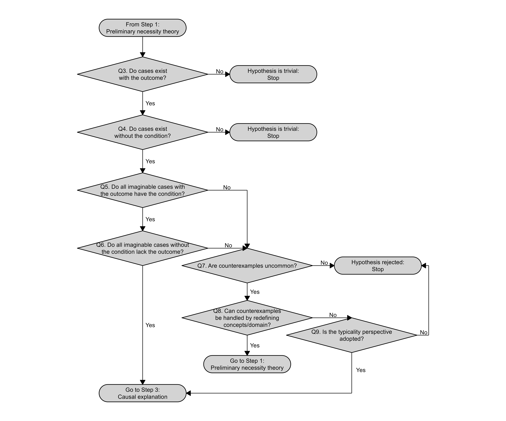
```


<!-- ```{r, echo=FALSE, results='asis', eval=knitr::is_latex_output()} -->
<!-- cat("\\begin{figure}[H]\n") -->
<!-- cat("\\centering\n") -->
<!-- cat("\\includegraphics[width=1.5\\linewidth]{theory_decision_treeSTEP2.pdf}\n") -->
<!-- cat("\\caption{Step 2 of the development process of a formal necessity hypothesis: Using thought experiments to challenge the preliminary theory.}\n") -->
<!-- cat("\\label{fig:theorydecisiontreeSTEP2fig}\n") -->
<!-- cat("\\end{figure}\n") -->
<!-- ``` -->


```{r theorydecisiontreeSTEP2code, eval = FALSE, echo=FALSE, message=FALSE, warning=FALSE}
library(ggplot2)

# === Layout parameters ===
box_width <- 1.5
box_height <- 0.3
text_size <- 3.5
spacing_y <- 2
spacing_x <- 3.5
side_spacing <- 4.5

diamond_width_scale <- 1.5
diamond_height_scale <- 2

# === Node positions ===
nodes <- data.frame(
  id = c("From1", "Step1", "Q3", "Stop1", "Q4", "Q5", "Stop2", "Q7", "Reject1", "Q6", "Q8", "Q9", "Step3"),
  label = c(
    "From Step 1:\nPreliminary necessity theory", 
    "Go to Step 1:\nPreliminary necessity theory",
    "Q3. Do cases exist\nwith the outcome?",
    "Hypothesis is trivial:\nStop",
    "Q4. Do cases exist\nwithout the condition?",
    "Q5. Do all imaginable cases with\nthe outcome have the condition?",
    "Hypothesis is trivial:\nStop",
    "Q7. Are counterexamples uncommon?",
    "Hypothesis rejected:\nStop",
    "Q6. Do all imaginable cases without\nthe condition lack the outcome?",
    "Q8. Can counterexamples\nbe handled by redefining\nconcepts/domain?",
    "Q9. Is the typicality perspective\nadopted?",
    "Go to Step 3:\nCausal explanation"
  ),
  x = c(0, 0.8*side_spacing, 0, side_spacing, 0, 0, side_spacing, 0.8*side_spacing, 1.8 * side_spacing, 0, 0.8*side_spacing, 1.6 * side_spacing, 0),
  y = spacing_y * c(9.8, 4, 9, 9, 8, 7, 8, 5.7, 5.7, 6, 4.8, 4.5, 3.5),
  stringsAsFactors = FALSE
)

# === Identify diamonds and rounded rectangles ===
diamond_ids <- grep("^Q[0-9]+", nodes$id, value = TRUE)
rounded_rect_ids <- c("From1", "Step1", "Step3", "Stop1", "Stop2", "Reject1")
nodes$shape <- ifelse(nodes$id %in% diamond_ids, "diamond", 
                      ifelse(nodes$id %in% rounded_rect_ids, "rounded_rect", "rect"))

# Let's check what shapes are assigned
print("Node shapes:")
print(nodes[, c("id", "shape")])

# === Function to create rounded rectangle coordinates ===
get_rounded_rect_coords <- function(x, y, width, height) {
  radius <- height  # Make the vertical sides full semi-circles
  n_points <- 20    # More points = smoother curves
  
  # Angle sequences for each corner (in radians)
  tr_angles <- seq(0, pi/2, length.out = n_points)
  tl_angles <- seq(pi/2, pi, length.out = n_points)
  bl_angles <- seq(pi, 3*pi/2, length.out = n_points)
  br_angles <- seq(3*pi/2, 2*pi, length.out = n_points)
  
  # Calculate points around each corner
  tr_x <- x + width - radius + radius * cos(tr_angles)
  tr_y <- y + height - radius + radius * sin(tr_angles)
  
  tl_x <- x - width + radius + radius * cos(tl_angles)
  tl_y <- y + height - radius + radius * sin(tl_angles)
  
  bl_x <- x - width + radius + radius * cos(bl_angles)
  bl_y <- y - height + radius + radius * sin(bl_angles)
  
  br_x <- x + width - radius + radius * cos(br_angles)
  br_y <- y - height + radius + radius * sin(br_angles)
  
  # Combine all points in clockwise order
  data.frame(
    x = c(tr_x, tl_x, bl_x, br_x),
    y = c(tr_y, tl_y, bl_y, br_y)
  )
}


# === Arrow definitions + label shift ===
edges <- data.frame(
  from =     c("From1", "Q3", "Q3",    "Q4",  "Q4",    "Q7",  "Q6", "Q6",    "Q8",    "Q8", "Q5", "Q7"),
  to   =     c("Q3",    "Q4", "Stop1", "Q5",  "Stop2", "Q8",  "Q7", "Step3", "Step1", "Q9", "Q6", "Reject1"),
  label =    c(NA,     "Yes","No",    "Yes", "No",    "Yes", "No", "Yes",   "Yes",   "No", "Yes", "No"),
  label_dx = c(NA,      0.1, -0.1,    0.1,  -0.1,    0.1,  -0.1, 0.1,     0.1,    -0.1, 0.1, -0.1),
  label_dy = c(NA,      0.0,  0.1,     0.0,   0.1,     0.0,   0.1,  0.0,     0.0,     0.1,  0.0,  0.1),
  stringsAsFactors = FALSE
)

# === Merge coordinates ===
edges <- merge(edges, nodes[, c("id", "x", "y", "shape")], by.x = "from", by.y = "id")
edges <- merge(edges, nodes[, c("id", "x", "y", "shape")], by.x = "to", by.y = "id", suffixes = c("", "_end"))

# Custom routing: force direction for specific edges
edges$from_dir <- ifelse(edges$from %in% c("Q5", "Q6", "Q8") & edges$to %in% c("Q7", "Q9"), "right", NA)
edges$to_dir   <- ifelse(edges$from %in% c("Q5", "Q6", "Q8") & edges$to %in% c("Q7", "Q9"), "top", NA)

# === Connection function ===
get_offset <- function(shape, direction) {
  if (shape == "diamond") {
    if (direction %in% c("top", "bottom")) return(box_height * diamond_height_scale)
    else return(box_width * diamond_width_scale)
  } else {
    if (direction %in% c("top", "bottom")) return(box_height)
    else return(box_width)
  }
}

# === Calculate arrow endpoints ===
# Calculate connection points with manual override support
edges$start_x <- mapply(function(f_shape, fx, tx, ty, fy, dir_override) {
  dir <- if (!is.na(dir_override)) dir_override else if (tx > fx) "right" else if (tx < fx) "left" else if (ty > fy) "top" else "bottom"
  fx + switch(dir,
              right  =  get_offset(f_shape, "right"),
              left   = -get_offset(f_shape, "left"),
              0)
}, edges$shape, edges$x, edges$x_end, edges$y_end, edges$y, edges$from_dir)

edges$start_y <- mapply(function(f_shape, fy, tx, ty, fx, dir_override) {
  dir <- if (!is.na(dir_override)) dir_override else if (tx > fx) "right" else if (tx < fx) "left" else if (ty > fy) "top" else "bottom"
  fy + switch(dir,
              top    =  get_offset(f_shape, "top"),
              bottom = -get_offset(f_shape, "bottom"),
              0)
}, edges$shape, edges$y, edges$x_end, edges$y_end, edges$x, edges$from_dir)

edges$end_x <- mapply(function(t_shape, tx, fx, fy, ty, dir_override) {
  dir <- if (!is.na(dir_override)) dir_override else if (fx > tx) "right" else if (fx < tx) "left" else if (fy > ty) "top" else "bottom"
  tx + switch(dir,
              right  =  get_offset(t_shape, "right"),
              left   = -get_offset(t_shape, "left"),
              0)
}, edges$shape_end, edges$x_end, edges$x, edges$y, edges$y_end, edges$to_dir)

edges$end_y <- mapply(function(t_shape, ty, fx, fy, tx, dir_override) {
  dir <- if (!is.na(dir_override)) dir_override else if (fx > tx) "right" else if (fx < tx) "left" else if (fy > ty) "top" else "bottom"
  ty + switch(dir,
              top    =  get_offset(t_shape, "top"),
              bottom = -get_offset(t_shape, "bottom"),
              0)
}, edges$shape_end, edges$y_end, edges$x, edges$y, edges$x_end, edges$to_dir)

# === Label positions ===
edges$x_label <- (edges$start_x + edges$end_x) / 2 + edges$label_dx
edges$y_label <- (edges$start_y + edges$end_y) / 2 + edges$label_dy

# === Diamonds ===
get_diamond_coords <- function(x, y) {
  data.frame(
    x = c(x, x + box_width * diamond_width_scale, x, x - box_width * diamond_width_scale),
    y = c(y + box_height * diamond_height_scale, y, y - box_height * diamond_height_scale, y)
  )
}
diamond_coords <- do.call(rbind, lapply(diamond_ids, function(id) {
  coords <- get_diamond_coords(nodes$x[nodes$id == id], nodes$y[nodes$id == id])
  coords$id <- id
  coords$group <- id
  coords
}))

# === Rounded rectangles ===
rounded_rect_coords <- do.call(rbind, lapply(rounded_rect_ids, function(id) {
  node_data <- nodes[nodes$id == id, ]
  coords <- get_rounded_rect_coords(node_data$x, node_data$y, box_width, box_height)
  coords$id <- id
  coords$group <- id
  coords
}))

# Let's check what rounded rectangles are being created
print("Rounded rectangle IDs:")
print(unique(rounded_rect_coords$id))

# Special Arrow: Q5 -> Q7 (L-shape)
q5_x <- nodes$x[nodes$id == "Q5"]
q5_y <- nodes$y[nodes$id == "Q5"]
q7_x <- nodes$x[nodes$id == "Q7"]
q7_y <- nodes$y[nodes$id == "Q7"]

arrow_q5_q7 <- data.frame(
  x = c(q5_x + box_width*diamond_width_scale, q7_x),
  y = c(q5_y, q5_y),
  xend = c(q7_x, q7_x),
  yend = c(q5_y, q7_y + box_height * diamond_height_scale),
  label = c("No", NA)
)

# Special Arrow: Q9 -> Step3 (L-shape)
q9_x <- nodes$x[nodes$id == "Q9"]
q9_y <- nodes$y[nodes$id == "Q9"]
step3_x <- nodes$x[nodes$id == "Step3"]
step3_y <- nodes$y[nodes$id == "Step3"]

arrow_q9_step3 <- data.frame(
  x = c(q9_x, q9_x),
  y = c(q9_y - box_height * diamond_height_scale, step3_y),
  xend = c(q9_x, step3_x + box_width),
  yend = c(step3_y, step3_y),
  label = c("Yes", NA)
)

# Special Arrow: Q9 -> Reject1 (L-shape)
q9_x <- nodes$x[nodes$id == "Q9"]
q9_y <- nodes$y[nodes$id == "Q9"]
reject1_x <- nodes$x[nodes$id == "Reject1"]
reject1_y <- nodes$y[nodes$id == "Reject1"]

arrow_q9_reject1 <- data.frame(
  x = c(q9_x + box_width * diamond_width_scale, q9_x + box_width * diamond_width_scale + 0.4, q9_x + box_width * diamond_width_scale + 0.4),
  y = c(q9_y,q9_y, reject1_y),
  xend = c(q9_x + box_width * diamond_width_scale + 0.4, q9_x + box_width* diamond_width_scale + 0.4, reject1_x + box_width),
  yend = c(q9_y, reject1_y, reject1_y),
  label = c("No", NA, NA)
)

# === Plot ===
p <- ggplot() +
  # Regular rectangles
  geom_rect(data = subset(nodes, shape == "rect"),
            aes(xmin = x - box_width, xmax = x + box_width,
                ymin = y - box_height, ymax = y + box_height),
            fill = "lightgray", color = "black") +
  
  # Rounded rectangles
  geom_polygon(data = rounded_rect_coords,
               aes(x = x, y = y, group = id),
               fill = "lightgray", color = "black") +
  
  # Diamonds
  geom_polygon(data = diamond_coords,
               aes(x = x, y = y, group = group),
               fill = "lightgray", color = "black") +
  
  # Text
  geom_text(data = nodes,
            aes(x = x, y = y, label = label),
            size = text_size, lineheight = 1) +
  
  # Arrows
  geom_segment(data = edges,
               aes(x = start_x, y = start_y, xend = end_x, yend = end_y),
               arrow = arrow(length = unit(0.3, "cm"), type = "closed"),
               linewidth = 0.4) +
  
  # Arrow from Q5 to  Q7 (L-shape)
  # First segment (no arrowhead)
  geom_segment(data = arrow_q5_q7[1, ],
               aes(x = x, y = y, xend = xend, yend = yend),
               linewidth = 0.4) +
  
  # Second segment (with arrowhead)
  geom_segment(data = arrow_q5_q7[2, ],
               aes(x = x, y = y, xend = xend, yend = yend),
               arrow = arrow(length = unit(0.3, "cm"), type = "closed"),
               linewidth = 0.4) +
  
  # Arrow label Q5 near horizontal arrow
  geom_text(data = arrow_q5_q7[1,],
            aes(x = (x + xend) / 2 - 0.15,
                y = (y + yend) / 2 + 0.1,
                label = label),
            size = text_size * 1.0, hjust = 0) +
  
  
  # Arrow from Q9 to  Step3 (L-shape)
  # First segment (no arrowhead)
  geom_segment(data = arrow_q9_step3[1, ],
               aes(x = x, y = y, xend = xend, yend = yend),
               linewidth = 0.4) +
  
  # Second segment (with arrowhead)
  geom_segment(data = arrow_q9_step3[2, ],
               aes(x = x, y = y, xend = xend, yend = yend),
               arrow = arrow(length = unit(0.3, "cm"), type = "closed"),
               linewidth = 0.4) +
  
  # Arrow label Q9 near vertical arrow
  geom_text(data = subset(arrow_q9_step3, !is.na(label)),
            aes(x = (x + xend) / 2 + 0.15,
                y = (y + yend) / 2 + 0.1,
                label = label),
            size = text_size * 1.0, hjust = 0) +
  
  # Arrow from Q9 to  Reject1 (L-shape)
  # First segment (no arrowhead)
  geom_segment(data = arrow_q9_reject1[1, ],
               aes(x = x, y = y, xend = xend, yend = yend),
               linewidth = 0.4) +
  
  # Second segment (no arrowhead)
  geom_segment(data = arrow_q9_reject1[2, ],
               aes(x = x, y = y, xend = xend, yend = yend),
               linewidth = 0.4) +
  
  # Third segment (with arrowhead)
  geom_segment(data = arrow_q9_reject1[3, ],
               aes(x = x, y = y, xend = xend, yend = yend),
               arrow = arrow(length = unit(0.3, "cm"), type = "closed"),
               linewidth = 0.4) +
  
  # Arrow label Q9 near horizontal arrow
  geom_text(data = subset(arrow_q9_reject1, !is.na(label)),
            aes(x = (x + xend) / 2 - 0.1,
                y = (y + yend) / 2 + 0.1,
                label = label),
            size = text_size * 1.0, hjust = 0) +
  
  # Arrow labels
  geom_text(data = subset(edges, !is.na(label)),
            aes(x = x_label, y = y_label, label = label),
            size = text_size * 1.0, hjust = 0) +
  
  theme_void() +
  theme(plot.margin = unit(c(0.0, 0.0, 0.0, 0.0), "cm")) +  # top, right, bottom, left
  coord_fixed()

# === Save ===
print(p)
ggsave("theory_decision_treeSTEP2.png", p, width = 12, height = 10, dpi = 600)
ggsave("theory_decision_treeSTEP2.pdf", p, width = 12, height = 10, dpi = 600, device = cairo_pdf, limitsize = FALSE)

```


<!-- ```{r theorydecisiontree2code, eval = FALSE, echo=FALSE, message=FALSE, warning=FALSE} -->
<!-- # Load required libraries -->
<!-- library(DiagrammeR) -->
<!-- library(DiagrammeRsvg) -->
<!-- library(rsvg) -->

<!-- # Create the diagram -->
<!-- graph2 <- grViz(" -->
<!-- digraph theory_decision_tree { -->
<!--   graph [layout = dot, rankdir = TB, ranksep=0.2] -->
<!--   node [shape = rectangle, style=filled, color=lightgray, fontname=Helvetica, fontsize=10] -->

<!--   A1 [label='Go to Step 1:\\nPreliminary necessity theory'] -->

<!--   B2 [label='Q3. Do cases exist\\nwith the outcome?'] -->

<!--   B2_N [label='Hypothesis is trivial:\\nStop'] -->

<!--   B3 [label='Q4. Do cases exist\\nwithout the condition?'] -->


<!--   C4 [label='Q5. Do all cases with the outcome\\nhave the condition?'] -->

<!--   D6 [label='Q7. Are counterexamples rare?'] -->
<!--   D6_N [label='Hypothesis rejected:\\nStop'] -->

<!--   E7 [label='Q6. Do all cases without the condition\\nlack the outcome?'] -->

<!--   F9 [label='Q8. Can exceptions be handled\\nby redefining concepts/domain?'] -->

<!--   F10 [label='Q9. Is the typicality perspective adopted?'] -->

<!--   G11 [label='Go to Step 3:\\nCausal explanation'] -->
<!--     // Force D6_N and G11 to be vertically aliged -->
<!--   D6_N -> G11 [style=invis, weight=10] -->


<!--   // Connections -->

<!--   B2 -> B3 [label='Yes'] -->
<!--   B2 -> B2_N [label='No'] -->
<!--   B3 -> C4 [label='Yes'] -->
<!--   B3 -> B2_N [label='No'] -->
<!--   C4 -> E7 [label='Yes'] -->
<!--   C4 -> D6 [label='No'] -->
<!--   D6 -> F9 [label='Yes'] -->
<!--   D6 -> D6_N [label='No'] -->
<!--   E7 -> D6 [label='No'] -->
<!--   E7 -> G11 [label='Yes'] -->
<!--   F9 -> A1 [label='Yes'] -->
<!--   F9 -> F10 [label='No'] -->
<!--   F10 -> G11 [label='Yes'] -->
<!--   F10 -> D6_N [label='No'] -->

<!-- } -->
<!-- ") -->

<!-- # Export the graph as SVG -->
<!-- svg2 <- export_svg(graph2) -->
<!-- # Render SVG as a raster image -->
<!-- bitmap2 <- rsvg::rsvg_png(charToRaw(svg2)) -->

<!-- # Display the bitmap in the plot window -->
<!--  grid::grid.raster(png::readPNG(bitmap2)) -->

<!-- rsvg_pdf(charToRaw(svg)2, file = "theory_decision_tree2.pdf") -->
<!-- rsvg_png(charToRaw(svg)2, file = "theory_decision_tree2.png", width = 2000, height = 3000) -->

<!-- ``` -->


A *thought experiment* in NCA is a mental evaluation to check the validity of the necessity theory and its hypothesis. Since a necessity hypothesis has only one $X$ and one $Y$, the prediction of the necessity theory is straightforward: the outcome is absent if the condition is absent, and the condition is present if the outcome is present. Therefore it is usually easy to evaluate the hypothesis mentally. The basic idea is to evaluate if the expected empty corner is indeed empty. Assuming that presence/high $X$ is necessary for presence/high $Y$, the expected empty corner is the upper-left corner.
<!-- After the theory is defined it needs to be challenged and refined using thought experiments.  -->

A thought experiment can help to check if the preliminary theory may be trivial or implausible. Testing trivial or implausible hypotheses with empirical data is not interesting and a waste of resources. Furthermore, if the thought experiment shows that many counterexamples exist (the expected empty space is not empty) the hypothesis should be rejected. With a few counterexamples, further evaluation is needed and the theory may be refined by redefining the concepts or the theoretical domain, such that the (revised) hypothesis of the revised theory is plausible. 
Three thought experiments can be done (references to the questions in Figure \@ref(fig:theorydecisiontreeSTEP2fig) are given in brackets): 

- Thought experiment for non-triviality (Q3, Q4).

- Thought experiment for plausibility (Q5, Q6).

- Thought experiment for counterexamples and exceptions (Q7, Q8, Q9).


#### Non-triviality {#trivialness} 
A trivial necessity hypothesis is a hypothesis that is expected to hold, but is not informative because the condition or the outcome is nearly (constant) in the situation of interest (i.e., in the theoretical domain where the hypothesis is supposed to hold). Triviality applies when the condition is virtually always present, or the outcome is virtually always absent. The first type of triviality where the condition is constant (always present) and the outcome varies, is depicted in Figure \@ref(fig:adjacenttwocorners)-bottom-left. An example is the hypothesis that oxygen ($X$) is necessary for attending an online meeting ($Y$). This hypothesis holds because when an online meeting is held ($Y$ is present), oxygen ($X$) is present and needed for the participants to have the meeting. The hypothesis is trivial because oxygen is virtually never absent. The second type of triviality where the outcome is constant (always absent) and the condition varies, is depicted in Figure \@ref(fig:adjacenttwocorners)-top-left. An example is the hypothesis that having good food during lifetime ($X$) is necessary for a human to reach age 125. The necessity claim of this hypothesis is reasonable, but it is trivial because reaching age 125 is rare.

The situation of a constant condition that is always absent and an outcome that varies (Figure \@ref(fig:adjacenttwocorners)-bottom-right) and the situation of a constant outcome that is always present and a condition that varies (Figure \@ref(fig:adjacenttwocorners)-top-right) both result in a clear rejection because the outcome can be present when the condition is absent. In these situations the necessary condition hypothesis is immediately rejected, not because it is trivial but because it is not necessary.

Therefore, there are two questions to be raised and answered in a thought experiment for checking triviality of the theory and its hypothesis (Figure \@ref(fig:theorydecisiontreeSTEP2fig)):

**➔ Q3. Do cases exist with the outcome?**
This question checks if the outcome is virtually always absent. If not, the theory is trivial.

**➔ Q4. Do cases exist without the condition?**
This question checks if the condition is virtually always present. If not, the theory is trivial.

If either of these questions is answered negatively, the theory and its hypothesis can be considered trivial and not worth testing with empirical data. 


#### Plausibility {#plausibility}
A plausible hypothesis is a non-trivial hypothesis (both the condition and outcome can vary) that cannot be rejected in a thought experiment. The goal of this thought experiment is to consider condition and outcome together to find supportive cases for the hypothesis, and in particular possible counterexamples that challenge the hypothesis. This thought experiment for plausibility resembles an empirical test of a necessity hypothesis using a small number of cases (Section \@ref(smallncaseselection)). 

To find supportive cases, two questions can be asked:

**➔ Q5. Do all imaginable cases with the outcome have the condition?**
If the answer yes, this is an indication that the hypothesis may hold.

**➔ Q6. Do all imaginable cases without the condition lack the outcome?**
If the answer yes, this is another indication that the hypothesis may hold.

If the answer to both questions is affirmative, all cases from the theoretical domain that can be imagined are *supportive cases* for the hypothesis. When only supportive cases and no counterexamples can be imagined, the hypothesis is plausible. 
If the answer to one or both questions is negative, *counterexamples* are identified.
These counterexamples need further evaluation before a decision can be made about the plausibility of the hypothesis.


<!-- For finding supportive cases: -->
<!-- 1. Can I imagine people attending an online meeting that have an Internet connection? The answer is clearly 'yes'. -->
<!-- 2. Can I imagine people without Internept connection not attending an online meeting. Again, the answer is clearly 'yes'. -->
<!-- For finding counterexamples: -->
<!-- 1. Can I imagine people attending an online meeting without an Internet connection? This situation is more difficult to imagine, but it is possible to have an online meting in a Local Area Network (LAN), for example at home or in an organization. -->
<!-- 2. Can I imagine people without an Internet connection attending and online meeting? In addition to the previous counterexample, another counterexample is that a person without Internet connection joins the workplace of another person with an internet connection to share the facilities for an online meeting. -->
<!-- In this example there are both supportive cases and counterexamples. -->
<!--  However finding counterexamples may indicate that the hypothesis must be  -->
<!-- refined to holds (see below).  -->
<!-- Without supportive cases, the hypothesis is implausable. -->
<!-- With both supportive case and counterexamples the counterexamples need to be evaluated before a decision can be made about the plausibility of the hypothesis. -->

#### Counterexamples and exceptions {#counterexamplesexceptions}
When counterexamples outnumber supportive cases, it is clear that the hypothesis needs to be rejected. However, when there is a limited number of counterexamples compared to supportive cases an additional evaluation is needed. Therefore, when counterexamples exist, the following question is answered first:

**➔ Q7: Are counterexamples uncommon**
If counterexamples are not uncommon, the theory should be rejected. If counterexamples are uncommon, they need further evaluation before the analyst makes a decision to reject or keep the hypothesis, possibly after refinement of the theory or adoption of the typicality perspective (see below).

The further analysis consists of considering the possibility of incorporating or excluding counterexamples in the theory by redefining the condition $X$, the outcome $Y$, or the theoretical domain. *Broadening the condition* $X$ or *narrowing the outcome* $Y$ can make counterexamples become supportive cases within the redefined theory. *Narrowing the theoretical domain* excludes the counterexamples from the redefined theory.^[Narrowing the condition $X$	weakens the theory because it applies to fewer cases from reality. Broadening the outcome $Y$ and broadening the theoretical domain adds new counterexamples.]

Therefore, the analyst has three options to handle counterexamples: (1) broadening the condition, (2) narrowing the outcome, and (3) narrowing the theoretical domain. It is the analyst’s choice which option to adopt. Option 1 broadens the ways in which the condition can allow the outcome. Often, the broader condition is a higher-order concept that integrates the original concept and the counterexample concept. By broadening the condition, counterexamples that previously displayed an absence of the condition now display a presence of the condition, and become supportive cases under the refined theory. However, this risks making the condition too broad and weakening its explanatory power: almost any facilitating mechanism could then be considered part of the condition. Option 2 narrows the outcome to a more specific form, reducing the scope of what is being explained. With the redefined outcome concept, the exception becomes a supportive case that does not violate the hypothesis. However, this risks excluding cases that are theoretically relevant. Option 3 restricts the theoretical domain by focusing only on a subset of cases where necessity holds. With a new definition of the theoretical domain, the exception should not have been selected for testing the hypothesis because the claim of the hypothesis is only valid in a defined theoretical domain. While this approach preserves the original concepts and hypothesis, it reduces the generalizability of the theory. Nevertheless, it seems reasonable to adopt option 3 since a theoretical domain is seldom homogeneous and universal. In option 3, the original hypothesis is maintained, but the theoretical domain is narrowed. This strategy preserves the preliminary hypothesis, with more clearly specifying the scope of its application, while no known counterexamples exist.

If any of the options for handling counterexamples is selected, it is assumed that the redefined theory holds for all imaginable cases selected from the theoretical domain.^[It is, of course, possible that during empirical testing, counterexamples emerge that were not anticipated during the thought experiment. In the NCA method, counterexamples are empirically defined as uncommon cases in the expected empty space, far from the ceiling, see Section \@ref(purity). Such findings result in an empirical rejection of deterministic necessity. After reporting this result, the analyst may then reflect on whether the original deterministic interpretation of necessity was overly strict. However, adopting the typicality perspective after the results are known, and suggesting that this causal perspective was adopted before the results were known, should be avoided [HARKING, see @hollenbeck2017harking].]

If counterexamples exist the following question needs to be answered: 


**➔ Q8. Can counterexamples be handled by redefining concepts/domain?**
If the answer is yes, the theory is adjusted, so that there are no more counterexamples.
After the counterexamples are handled by redefining the necessity theory (concepts or domain) it is assumed that the hypothesis holds for all imaginable cases of the theoretical domain, such that the testing of the hypothesis can start with a deterministic view on necessity (Section \@ref(deterministicnecessity)).

If the answer to Q8 is no, it may be that (some) counterexamples remain. The analyst has now two options to proceed:

1. Adopting the *deterministic perspective* of necessity, single counterexamples reject the hypothesis (Section \@ref(deterministicnecessity)).

2. Adopting the *typicality perspective* of necessity. The counterexamples are *rare* and cannot be explained or handled. They are considered *exceptions* that are not driven by necessity and do not reject necessity the hypothesis (Section \@ref(typicalitynecessity)). If counterexamples are not rare, the hypothesis should be rejected. Note the difference between exceptions and noise (Section \@ref(purity)).

Adopting either perspective is a matter of analyst judgment. The *deterministic perspective* may be adopted when strict logical necessity is required without exceptions, when the theoretical domain contains few cases, or when logical rigor is prioritized. The *typicality* perspective may be adopted when it is recognized that rare exceptions can exist that cannot be explained with necessity logic. 

Therefore, if counterexamples remain the following question needs to be answered: 

**➔ Q9. Is the typicality perspective adopted?**
If the answer is no, the theory's hypothesis is rejected; if yes, it is plausible and (rare) exceptions are allowed.

#### Example Step 2 {#examplestep2}
The development tool for Step 2 (Figure \@ref(fig:theorydecisiontreeSTEP2fig)) can be applied to the example about the necessity of an Internet connection for attending an online meeting. First, the  preliminary necessity theory from Step 1 is selected. The first question for the triviality check is:

 **➔ Q3. Do people exist who attend an online meeting?**
In 2021, about 500 million people daily had online meetings. Since then the number of daily users presumably has considerably increased $\rightarrow$ yes.

The second question of the triviality check is:

**➔ Q4. Do people exist without an Internet connection?**
In 2025, about one-third of the world population had no access to the Internet $\rightarrow$ yes.

Since both questions are answered affirmatively, the hypothesis is non-trivial for the selected theoretical domain (all people in the world). To check for the plausibility of the hypothesis, another two questions are raised: 

**➔ Q5. Do all imaginable persons attending an online meeting have an Internet connection?**

**➔ Q6. Do all imaginable persons without Internet connection not attend an online meeting?** 
The answer to both questions is no. It is possible that persons attending an online meeting at home or in an organization in a Local Area Network (LAN). These persons attend an online meeting without being connected to the Internet. Both questions Q5 and Q6 are therefore answered negatively, indicating that counterexamples exist. Trying to find counterexamples, even if they seem uncommon, is an essential part of conducting a thought experiment to test plausibility of a necessity hypothesis $\rightarrow$ no.

Since counterexamples exist, the next step is to evaluate if they are uncommon:

**➔ Q7: Are people with LAN connections uncommon?**
For the online meeting example, the number of persons attending an online meeting with a LAN connection compared to the number of persons attending an online meeting with an Internet connection is relatively small. Attending an online meeting with a LAN connection is relatively uncommon, suggesting further analysis of these cases is needed to refine the theory $\rightarrow$ yes.

**➔ Q8: Can counterexamples be handled by redefining concepts/domain?**
The three options to handling counterexamples are:

 *Broadening the condition* means that the original definition of Internet connection (the communication pathway of devices such as computer or smartphone to the global network known as Internet) is broadened such that it incorporates LAN networks. The concept *Internet connection* could be broadened to the concept *Digital network connection* defined as the communication pathway of devices such as computer or smartphone to a digital network. 'Digital network' now includes Internet and LAN. 

<!-- Outcome $Y$: Online meeting attendance: presence of a person in a virtual meeting conducted through a digital network.  -->
*Narrowing the outcome* means that the original definition of the outcome $Y$ (Online meeting attendance: being part of a real-time, multimedia interaction among multiple participants) is narrowed such that it incorporates the exception. For example, *Online meeting attendance* could be narrowed to *Public online meeting attendance* defined as being part of a real-time, multimedia interaction among multiple participants from the general public, excluding private online meetings (that use LAN) from the definition. For the cases that were previously counterexamples, the condition 'Internet connection' is absent (though LAN is present), and the redefined outcome concept 'Public online meeting attendance' is also absent (because the LAN meeting is considered a private meeting). 

The third way to handle an exception is to *exclude counterexamples* from the theory by *narrowing the theoretical domain*. In the online meeting example, narrowing the theoretical domain means that the original definition, 'all persons in the world', would be revised such that it excludes people that use a LAN network in a private meeting. For example, the domain *All persons in the world* could be narrowed to *All persons who are geographically distant from each other*, which would exclude in a local gathering (home, organization) from the theoretical domain.

In summary, for the example the three possible ways to handle the exception by redefining concepts/domain are:

Option 1 (broadening condition):

*Hypothesis*: Digital network connection is necessary for Online meeting attendance. 
*Focal unit*: Person. 
*Condition $X$*: **Digital network connection: the communication pathway of devices such as computer or smartphone to a digital network**. 
*Outcome $Y$*: Online meeting attendance: real-time, multimedia interaction among multiple participants. 
*Theoretical domain*: All persons in the world.

Option 2 (narrowing the outcome):

*Hypothesis*: Internet connection is necessary for Public online meeting attendance. 
*Focal unit*: Person. 
*Condition $X$*: Internet connection: the communication pathway of devices such as computer or smartphone to the global network known as Internet. 
*Outcome $Y$*: **Public online meeting attendance defined as a real-time, multimedia interaction among multiple participants from the general public**. 
*Theoretical domain*: All persons in the world.

Option 3 (narrowing the theoretical domain):

*Hypothesis*: Internet connection is necessary for Online meeting attendance. 
*Focal unit*: Person. 
*Condition $X$*: Internet connection: the communication pathway of devices such as computer or smartphone to the global network known as Internet. 
*Outcome $Y$*: Online meeting attendance: real-time, multimedia interaction among multiple participants. 
*Theoretical domain*: **All persons who are geographically distant from each other**.

It is supposed that the second option is selected for further development in Step 3 (Section \@ref(examplecausalexplanation)) $\rightarrow$ yes.

### Step 3: Provide causal explanation {#causalexplanation}
In the previous step, the preliminary necessity theory including its hypothesis was either rejected or accepted during a thought experiment, possibly after revision of concepts or theoretical domain, or by adopting the typicality perspective. If accepted, the next step is to explain *why* $X$ is necessary for $Y$. This involves developing a causal explanation. During the formulation of the preliminary necessity theory including its hypothesis and during the process of conducting thought experiments, the analyst implicitly used a causal reasoning about necessity. In the last step before empirical testing of the hypothesis, the causal reasoning is explicitly articulated and further deepened. Since causality is a human interpretation rather than a directly observable phenomenon (Chapter \@ref(causality)), the analyst must construct a plausible and coherent narrative to justify the proposed necessity-based causal link. 

Thus, describing the causal explanation is a creative process that can be based on insights obtained during the thought experiments, and can be enriched with causal reasoning from the academic literature, from practice, and from the analyst's own experience (Sections \@ref(explicit) and \@ref(tacit)).

The causal narrative can be inspired by answering three questions that are positioned in the $XY$-plot shown in Figure \@ref(fig:mechanismfig):

1. Explaining why $X$ is an *enabler* for $Y$ (why the presence of $X$ allows the presence of $Y$).

2. Explaining why $X$ is a *constraint* for $Y$ (why the absence of $X$ leads to the absence of $Y$).

3. Explaining why there is *no substitute* for the absence of $X$ (why no other paths without $X$ can lead to the outcome $Y$).

The first question builds on conventional causal reasoning—exploring how one factor allows an outcome and in this way helps to produce it. The second and third, however, go beyond standard approaches: they introduce the need to reason counterfactually and to explore the uniqueness of $X$ in the causal structure. These perspectives encourage creative and rigorous thinking about necessity and irreplaceability.

One core idea of necessity causality is that the absence of $X$ causes the absence of $Y$. More precisely, if the necessity cause is reduced or removed, the present or high outcome should disappear. This thought experiment resembles a true 'loss of function', see the necessity experiment discussed in Section \@ref(experiment).
  \

<!-- ^[The approach proposed here also resembles @pearl2009causality's do-operator approach to evaluate structural models using Directed Acyclic Graphs (DAG's). The do-operator represents a hypothetical intervention in which the causal system is “frozen,” one variable is set to a fixed value, and the resulting changes are evaluated as they propagate through the rest of the system according to the proposed causal structure.]  -->
<!-- see Appenndix \@ref(appendixe)).    -->


```{r mechanismcode, echo=FALSE, eval=FALSE, out.width="100%", out.height="100%",fig.align ='center', results='hide', message=FALSE, warning=FALSE}

#Figure 
#delete '#' in the next line to make a pdf
#pdf("mechanism2.pdf", 5,5)

#make empty 2x2 contingency table
X<- c(0.25, 0.75) #X-values center of cell
Y<- c(0.25, 0.25) #Y-values center of cell

# make plot window square and set size of the axes and labels
par(pty = "s", cex.axis = 0.8, cex.lab = 0.8)

#give names to axes
xname = "X"
yname = "Y"

#give names to axis labels
# xlabel = rep(c("","0", "1", ""))
# ylabel = rep(c("","0", "1", ""))
xlabel = rep(c("","Absent", "Present", ""))
ylabel = rep(c("","Absent", "Present", ""))

# Create the plot with square aspect ratio
plot (X,Y, xlab=xname, ylab=yname, xlim = c(0,1), ylim=c(0,1), pch=19, cex=2, axes = F, yaxs="i", xaxs="i", type="n") 
axis(1, at = c(0, 0.25, 0.75, 1.25), pos=0, tck=0, labels=xlabel) #X has two values
axis(2, at = c(0, 0.25, 0.75, 1.25), pos=0, tck=0, labels=ylabel) #Y has two values
abline(v=c(0.5,1), h=c(0.5,1))

#fill cells
#rect(0, 0.5, 0.5, 1,  col = "grey") #corner 1
rect(0.5, 0.5, 1, 1,  col = "grey") #corner 2
rect(0, 0, 0.5, 0.5,  col = "grey") #corner 3
rect(0.5, 0, 1, 0.5,  col = "grey") #corner 4

#add points in cells
#points(X,Y, pch=19, cex=2)

#add text in cells
# corner1
text(0.25, 0.81, "No Substitute", cex = 1.0)
#text(0.25, 0.72, expression(paste("Why is ~",  X , " not compensable?")), cex = 0.7)
text(0.25, 0.72, expression(paste("Why is \u00AC", X," not compensable?")), cex = 0.7)

# corner 2
text(0.75, 0.81, "Enabler", cex = 1.0)
text(0.75, 0.72, expression(paste("Why does ", X, " enable ", Y, " ?")), cex = 0.7)


# corner 3
text(0.25, 0.31, "Constraint", cex = 1.0)
text(0.25, 0.22, expression(paste("Why does \u00AC", X, " lead to \u00AC", Y, " ?")), cex = 0.7)


# corner4
text(0.75, 0.31, "Not informative", cex = 1.0)
text(0.75, 0.22, expression(paste("for necessity")), cex = 1.0)

# text(0.25, 0.81, "Constraint", cex = 1.0)
# text(0.25, 0.72, expression(paste("Why ", $\\sim X$ ~X, " leads to ", ~Y, " ?")), cex = 0.7)
# 
# text(0.75, 0.75, "Enabler:\nWhy $X$ enables $Y$", cex = 1.0) # corner2Y, " ?"
# text(0.25, 0.25, "Constraint:\nWhy $\\sim X$ leads to $\\sim Y$", cex = 1.0) # corner3
# text(0.75, 0.25, "Not informative\nfor necessity", cex = 1.0) # corner4


#add ceiling line
# segments(0,0.5,0.5,0.5, lty=1, col="black", lwd = 3) #horizontal part of ceiling line
# segments(0.5,0.5,0.5,1, lty=1, col="black", lwd = 3) #vertical part of ceiling line

#delete '#' in the next line to make a pdf
#dev.off()
```


```{r mechanismfig, echo=FALSE, message=FALSE, out.width = "100%", fig.cap= "Questions for explanation why $X$ is necessary for $Y$. $\\neg X$ and $\\neg Y$  mean absence of $X$ and $Y$."}
#knitr::include_graphics('mechanism1.pdf')
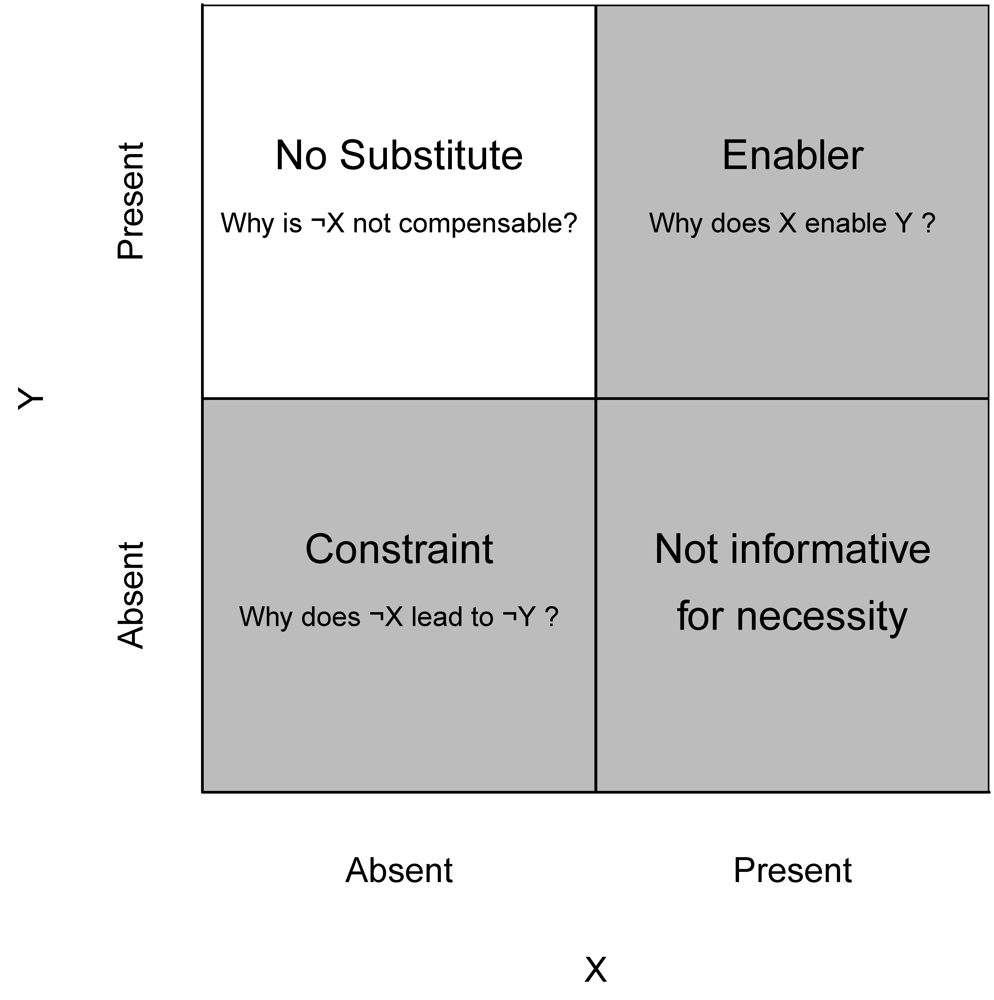
``` 

The three guiding questions are part of Step 3 of the hypothesis development tool (Figure \@ref(fig:theorydecisiontreeSTEP3fig)).

<br>
```{r theorydecisiontreeSTEP3fig, echo=FALSE, fig.show="hold", out.width='90%', fig.align='center', fig.cap="Hypothesis development tool for Step 3 of the development process of a formal necessity hypothesis: Adding a causal explanation."}
 #par(mfrow = c(1,2))
 #knitr::include_graphics("theory_decision_treeSTEP3.pdf")
 #knitr::include_graphics("theory_decision_treeSTEP3.png")
 #knitr::include_graphics("Figure7.5_Gijs_v1.1.png")
 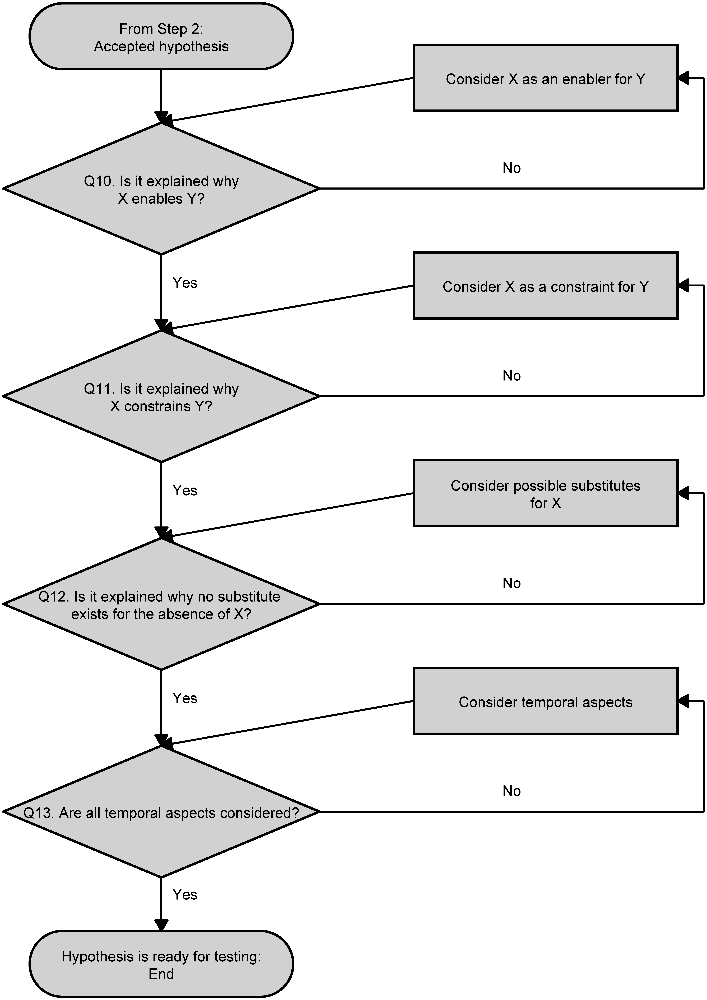
```

``` {r theory_decisiontreeSTEP3figG, echo = FALSE, eval = FALSE}
library(ggplot2)

# === Layout parameters ===
box_width <- 1.2
box_height <- 0.3
text_size <- 2.4
spacing_y <- 1.4
spacing_x <- 3.5
side_spacing <- 4.5

diamond_height <- 2
diamond_width <- 1.2

# === Node positions ===
nodes <- data.frame(
  id = c("From2", "Enabler", "Q10", "Constraint", "Q11", "Sustitute", "Q12", "Temporal", "Q13", "Ready"),
  label = c(
    "From Step 2:\nAccepted hypothesis", 
    "Consider X as an enabler for Y",
    "Q10. Is it explained why\nX enables Y?",
    "Consider X as a constraint for Y",
    "Q11. Is it explained why\nX constrains Y?",
    "Consider possible substitutes\nfor X",
    "Q12. Is it explained why no substitute \nexists for the absence of X?",
    "Consider temporal aspects",
    "Q13. Are all temporal aspects considered?",
    "Hypothesis is ready for testing:\nEnd"
  ),
  x = c(0, 3.5, 0, 3.5, 0, 3.5, 0, 3.5 ,0 ,0),
  y = spacing_y * c(7.1, 6.8, 6, 5.3, 4.5, 3.8, 3, 2.3 ,1.5 ,0.4),
  stringsAsFactors = FALSE
)

nodes$y <- nodes$y *0.9

# === Arrow definitions + label shift control (dx, dy) ===
edges <- data.frame(
  from =     c( "From2",   "Enabler", "Q10",        "Constraint", "Q11",       "Sustitute", "Q12",      "Temporal", "Q13"),
  to   =     c( "Q10",     "Q10",     "Q11",        "Q11",        "Q12",        "Q12",       "Q13",     "Q13",      "Ready"),
  label =    c(  NA,       NA,        "Yes",        NA,           "Yes",       NA,          "Yes",       NA,         "Yes"),
  label_dx = c(  NA,       NA,        0.1,          NA,           0.1,         NA,          0.1,         NA,         0.1),
  label_dy = c(  NA,       NA,        0.1,          NA,           0.1,         NA,          0.1,         NA,         0.1),
  stringsAsFactors = FALSE
)

# Merge coordinates
edges <- merge(edges, nodes[, c("id", "x", "y")], by.x = "from", by.y = "id")
edges <- merge(edges, nodes[, c("id", "x", "y")], by.x = "to", by.y = "id", suffixes = c("", "end"))

# Adjust connection points to diamonds
diamond_ids <- c("Q10", "Q11", "Q12", "Q13")
get_connection_offset <- function(id, direction) {
  if (length(id) != 1) stop("get_connection_offset expects a single ID")
  if (id %in% diamond_ids) {
    if (direction %in% c("top", "bottom")) {
      return(box_height * diamond_height)
    } else {
      return(box_width * diamond_width)
    }
  } else {
    if (direction %in% c("top", "bottom")) {
      return(box_height)
    } else {
      return(box_width)
    }
  }
}

edges$start_x <- ifelse(edges$x != edges$xend & edges$y == edges$yend, edges$x + mapply(get_connection_offset, edges$from, MoreArgs = list(direction = "right")), edges$x)
edges$start_y <- ifelse(edges$x != edges$xend & edges$y == edges$yend, edges$y, edges$y - mapply(get_connection_offset, edges$from, MoreArgs = list(direction = "bottom")))
edges$end_x   <- ifelse(edges$x != edges$xend & edges$y == edges$yend, edges$xend - mapply(get_connection_offset, edges$to, MoreArgs = list(direction = "left")), edges$xend)
edges$end_y   <- ifelse(edges$x != edges$xend & edges$y == edges$yend, edges$yend, edges$yend + mapply(get_connection_offset, edges$to, MoreArgs = list(direction = "top")))


#manually adjusting returning arrows
edges$start_x[1] <- edges$start_x[1] - box_width
edges$start_y[1] <- edges$start_y[1] + box_height
edges$start_x[3] <- edges$start_x[3] - box_width
edges$start_y[3] <- edges$start_y[3] + box_height
edges$start_x[6] <- edges$start_x[6] - box_width
edges$start_y[6] <- edges$start_y[6] + box_height
edges$start_x[8] <- edges$start_x[8] - box_width
edges$start_y[8] <- edges$start_y[8] + box_height

# Label positions
edges$x_label <- (edges$start_x + edges$end_x) / 2 + edges$label_dx
edges$y_label <- (edges$start_y + edges$end_y) / 2 + edges$label_dy


# === Feedback arrows ("no") ===
feedback <- data.frame(
  from = c("Q10", "Q11", "Q12", "Q13"), 
  to = c("Enabler", "Constraint", "Sustitute", "Temporal"),
  offset = rep(3.5, 4),   #Parameter changes offset of "no" arrows
  stringsAsFactors = FALSE
)

o_segments <- data.frame()
o_arrowheads <- data.frame()
o_labels <- data.frame()

for (i in 1:nrow(feedback)) {
  from_node <- nodes[nodes$id == feedback$from[i], ]
  to_node <- nodes[nodes$id == feedback$to[i], ]
  offset <- feedback$offset[i]
  from_offset <- get_connection_offset(feedback$from[i], "right") #Gijs: The "right" here does nothing. It isn't specified anywhere in the "get_connection_offset function
  to_offset <- get_connection_offset(feedback$to[i], "right") #Gijs: The "right" here does nothing. It isn't specified anywhere in the "get_connection_offset function
  mid_x <- from_node$x + from_offset + offset
  
  o_segments <- rbind(o_segments,
                      data.frame(x = from_node$x + from_offset, y = from_node$y,
                                 xend = mid_x, yend = from_node$y))
  o_segments <- rbind(o_segments,
                      data.frame(x = mid_x, y = from_node$y,
                                 xend = mid_x, yend = to_node$y))
  o_arrowheads <- rbind(o_arrowheads,
                        data.frame(x = mid_x, y = to_node$y,
                                   xend = to_node$x + to_offset, yend = to_node$y))
  o_labels <- rbind(o_labels,
                    data.frame(x = (from_node$x + from_offset + mid_x) / 2,
                               y = from_node$y + 0.2,
                               label = "No")
  )
}

# === Diamond nodes ===
diamonds <- nodes[nodes$id %in% diamond_ids, ]
get_diamond_coords <- function(x, y) {
  data.frame(
    x = c(x, x + box_width * diamond_width, x, x - box_width * diamond_width),
    y = c(y + box_height * diamond_height, y, y - box_height * diamond_height, y),
    group = paste0("g", x, y)
  )
}
diamond_coords <- do.call(rbind, lapply(1:nrow(diamonds), function(i) {
  coords <- get_diamond_coords(diamonds$x[i], diamonds$y[i])
  coords$id <- diamonds$id[i]
  coords
}))

# === Rounded rectangles for From2 and Ready ===
get_rounded_rect_coords <- function(x, y, width, height, n_points = 100) {
  radius <- height
  left_angles <- seq(pi / 2, 3 * pi / 2, length.out = n_points / 2)
  right_angles <- seq(3 * pi / 2, pi / 2 + 2 * pi, length.out = n_points / 2)
  left_center_x <- x - width + radius
  right_center_x <- x + width - radius
  left_x <- left_center_x + radius * cos(left_angles)
  left_y <- y + radius * sin(left_angles)
  right_x <- right_center_x + radius * cos(right_angles)
  right_y <- y + radius * sin(right_angles)
  data.frame(x = c(left_x, right_x), y = c(left_y, right_y))
}
rounded_ids <- c("From2", "Ready")
rounded_nodes <- nodes[nodes$id %in% rounded_ids, ]
rounded_coords <- do.call(rbind, lapply(1:nrow(rounded_nodes), function(i) {
  coords <- get_rounded_rect_coords(rounded_nodes$x[i], rounded_nodes$y[i], box_width, box_height)
  coords$id <- rounded_nodes$id[i]
  coords$group <- paste0("rounded_", rounded_nodes$id[i])
  coords
}))


#Arrow data for return arrows


# === Plot ===
p <- ggplot() +
  geom_rect(data = nodes[!nodes$id %in% c(diamond_ids, rounded_ids), ],
            aes(xmin = x - box_width, xmax = x + box_width,
                ymin = y - box_height, ymax = y + box_height),
            fill = "lightgray", color = "black") +
  geom_polygon(data = rounded_coords,
               aes(x = x, y = y, group = group),
               fill = "lightgray", color = "black") +
  geom_polygon(data = diamond_coords,
               aes(x = x, y = y, group = id),
               fill = "lightgray", color = "black") +
  geom_text(data = nodes,
            aes(x = x, y = y, label = label),
            size = text_size, lineheight = 1) +
  geom_segment(data = edges,
               aes(x = start_x, y = start_y, xend = end_x, yend = end_y),
               arrow = arrow(length = unit(0.2, "cm"), type = "closed"),
               linewidth = 0.4) +
  geom_text(data = subset(edges, !is.na(label)),
            aes(x = x_label, y = y_label, label = label),
            size = text_size * 1.0, hjust = 0) +
  geom_segment(data = o_segments,
               aes(x = x, y = y, xend = xend, yend = yend),
               linewidth = 0.4) +
  geom_segment(data = o_arrowheads,
               aes(x = x, y = y, xend = xend, yend = yend),
               arrow = arrow(length = unit(0.2, "cm"), type = "closed"),
               linewidth = 0.4) +
  geom_text(data = o_labels,
            aes(x = x, y = y, label = label),
            size = text_size * 1.0, hjust = 0.5) +
  theme_void() +
  coord_fixed()

# === Export ===
#print(p)
#ggsave("theory_decision_treeSTEP3_G.png", p, width = 5, height = 10, dpi = 600)
ggsave("theory_decision_treeSTEP3_G.pdf", p, width = 5, height = 10, dpi = 600, device = cairo_pdf)
``` 


```{r theorydecisiontreeSTEP3code, eval = FALSE, echo=FALSE, message=FALSE, warning=FALSE}
library(ggplot2)

# === Layout parameters ===
box_width <- 1.5
box_height <- 0.3
text_size <- 3.0
spacing_y <- 1.5
spacing_x <- 3.5
side_spacing <- 4.5

diamond_height <- 2
diamond_width <- 1.5 

# === Node positions ===
nodes <- data.frame(
  id = c("From2", "Enabler", "Q10", "Constraint", "Q11", "Sustitute", "Q12", "Temporal", "Q13", "Ready"),
  label = c(
    "From Step 2:\nAccepted hypothesis", 
    "Consider X as an enabler for Y",
    "Q10. Is it explained why\nX enables Y?",
    "Consider X as a constraint for Y",
    "Q11. Is it explaine why\nX constrains Y?",
    "Consider possible substitutes\nfor X",
    "Q12. Is it explained why no substitute \nexists for the absence of X?",
    "Consider temporal aspects",
    "Q13. Are all temporal aspects considered?",
    "Hypothesis is ready for testing:\nEnd"
  ),
  x = 0,
  y = spacing_y * c(10, 9, 8, 7, 6, 5, 4, 3 ,2 ,1),
  stringsAsFactors = FALSE
)

# === Arrow definitions + label shift control (dx, dy) ===
edges <- data.frame(
  from =     c( "From2",   "Enabler", "Q10",        "Constraint", "Q11",       "Sustitute", "Q12",      "Temporal", "Q13"),
  to   =     c( "Enabler", "Q10",     "Constraint", "Q11",        "Sustitute", "Q12",       "Temporal", "Q13",      "Ready"),
  label =    c(  NA,       NA,        "Yes",        NA,           "Yes",       NA,          "Yes",       NA,         "Yes"),
  label_dx = c(  NA,       NA,        0.1,          NA,           0.1,         NA,          0.1,         NA,         0.1),
  label_dy = c(  NA,       NA,        0.0,          NA,           0.0,         NA,          0.0,         NA,         0.0),
  stringsAsFactors = FALSE
)

# Merge coordinates
edges <- merge(edges, nodes[, c("id", "x", "y")], by.x = "from", by.y = "id")
edges <- merge(edges, nodes[, c("id", "x", "y")], by.x = "to", by.y = "id", suffixes = c("", "end"))

# Adjust connection points to diamonds
diamond_ids <- c("Q10", "Q11", "Q12", "Q13")
get_connection_offset <- function(id, direction) {
  if (length(id) != 1) stop("get_connection_offset expects a single ID")
  if (id %in% diamond_ids) {
    if (direction %in% c("top", "bottom")) {
      return(box_height * diamond_height)
    } else {
      return(box_width * diamond_width)
    }
  } else {
    if (direction %in% c("top", "bottom")) {
      return(box_height)
    } else {
      return(box_width)
    }
  }
}

edges$start_x <- ifelse(edges$x != edges$xend & edges$y == edges$yend, edges$x + mapply(get_connection_offset, edges$from, MoreArgs = list(direction = "right")), edges$x)
edges$start_y <- ifelse(edges$x != edges$xend & edges$y == edges$yend, edges$y, edges$y - mapply(get_connection_offset, edges$from, MoreArgs = list(direction = "bottom")))
edges$end_x   <- ifelse(edges$x != edges$xend & edges$y == edges$yend, edges$xend - mapply(get_connection_offset, edges$to, MoreArgs = list(direction = "left")), edges$xend)
edges$end_y   <- ifelse(edges$x != edges$xend & edges$y == edges$yend, edges$yend, edges$yend + mapply(get_connection_offset, edges$to, MoreArgs = list(direction = "top")))

# Label positions
edges$x_label <- (edges$start_x + edges$end_x) / 2 + edges$label_dx
edges$y_label <- (edges$start_y + edges$end_y) / 2 + edges$label_dy

# === Feedback arrows ===
feedback <- data.frame(
  from = c("Q10", "Q11", "Q12", "Q13"),
  to = c("Enabler", "Constraint", "Sustitute", "Temporal"),
  offset = rep(0.5, 4),
  stringsAsFactors = FALSE
)

o_segments <- data.frame()
o_arrowheads <- data.frame()
o_labels <- data.frame()

for (i in 1:nrow(feedback)) {
  from_node <- nodes[nodes$id == feedback$from[i], ]
  to_node <- nodes[nodes$id == feedback$to[i], ]
  offset <- feedback$offset[i]
  from_offset <- get_connection_offset(feedback$from[i], "right")
  to_offset <- get_connection_offset(feedback$to[i], "right")
  mid_x <- from_node$x + from_offset + offset
  
  o_segments <- rbind(o_segments,
                      data.frame(x = from_node$x + from_offset, y = from_node$y,
                                 xend = mid_x, yend = from_node$y))
  o_segments <- rbind(o_segments,
                      data.frame(x = mid_x, y = from_node$y,
                                 xend = mid_x, yend = to_node$y))
  o_arrowheads <- rbind(o_arrowheads,
                        data.frame(x = mid_x, y = to_node$y,
                                   xend = to_node$x + to_offset, yend = to_node$y))
  o_labels <- rbind(o_labels,
                    data.frame(x = (from_node$x + from_offset + mid_x) / 2,
                               y = from_node$y + 0.2,
                               label = "No")
  )
}

# === Diamond nodes ===
diamonds <- nodes[nodes$id %in% diamond_ids, ]
get_diamond_coords <- function(x, y) {
  data.frame(
    x = c(x, x + box_width * diamond_width, x, x - box_width * diamond_width),
    y = c(y + box_height * diamond_height, y, y - box_height * diamond_height, y),
    group = paste0("g", x, y)
  )
}
diamond_coords <- do.call(rbind, lapply(1:nrow(diamonds), function(i) {
  coords <- get_diamond_coords(diamonds$x[i], diamonds$y[i])
  coords$id <- diamonds$id[i]
  coords
}))

# === Rounded rectangles for From2 and Ready ===
get_rounded_rect_coords <- function(x, y, width, height, n_points = 100) {
  radius <- height
  left_angles <- seq(pi / 2, 3 * pi / 2, length.out = n_points / 2)
  right_angles <- seq(3 * pi / 2, pi / 2 + 2 * pi, length.out = n_points / 2)
  left_center_x <- x - width + radius
  right_center_x <- x + width - radius
  left_x <- left_center_x + radius * cos(left_angles)
  left_y <- y + radius * sin(left_angles)
  right_x <- right_center_x + radius * cos(right_angles)
  right_y <- y + radius * sin(right_angles)
  data.frame(x = c(left_x, right_x), y = c(left_y, right_y))
}
rounded_ids <- c("From2", "Ready")
rounded_nodes <- nodes[nodes$id %in% rounded_ids, ]
rounded_coords <- do.call(rbind, lapply(1:nrow(rounded_nodes), function(i) {
  coords <- get_rounded_rect_coords(rounded_nodes$x[i], rounded_nodes$y[i], box_width, box_height)
  coords$id <- rounded_nodes$id[i]
  coords$group <- paste0("rounded_", rounded_nodes$id[i])
  coords
}))

# === Plot ===
p <- ggplot() +
  geom_rect(data = nodes[!nodes$id %in% c(diamond_ids, rounded_ids), ],
            aes(xmin = x - box_width, xmax = x + box_width,
                ymin = y - box_height, ymax = y + box_height),
            fill = "lightgray", color = "black") +
  geom_polygon(data = rounded_coords,
               aes(x = x, y = y, group = group),
               fill = "lightgray", color = "black") +
  geom_polygon(data = diamond_coords,
               aes(x = x, y = y, group = id),
               fill = "lightgray", color = "black") +
  geom_text(data = nodes,
            aes(x = x, y = y, label = label),
            size = text_size, lineheight = 1) +
  geom_segment(data = edges,
               aes(x = start_x, y = start_y, xend = end_x, yend = end_y),
               arrow = arrow(length = unit(0.2, "cm"), type = "closed"),
               linewidth = 0.4) +
  geom_text(data = subset(edges, !is.na(label)),
            aes(x = x_label, y = y_label, label = label),
            size = text_size * 1.0, hjust = 0) +
  geom_segment(data = o_segments,
               aes(x = x, y = y, xend = xend, yend = yend),
               linewidth = 0.4) +
  geom_segment(data = o_arrowheads,
               aes(x = x, y = y, xend = xend, yend = yend),
               arrow = arrow(length = unit(0.2, "cm"), type = "closed"),
               linewidth = 0.4) +
  geom_text(data = o_labels,
            aes(x = x, y = y, label = label),
            size = text_size * 1.0, hjust = 0.5) +
  theme_void() +
  coord_fixed()

# === Export ===
print(p)
ggsave("theory_decision_treeSTEP3.png", p, width = 5, height = 10, dpi = 600)
ggsave("theory_decision_treeSTEP3.pdf", p, width = 5, height = 10, dpi = 600, device = cairo_pdf)

```


<!-- ```{r theorydecisiontree3code, eval = FALSE, echo=FALSE, message=FALSE, warning=FALSE} -->
<!-- # Load required libraries -->
<!-- library(DiagrammeR) -->
<!-- library(DiagrammeRsvg) -->
<!-- library(rsvg) -->

<!-- # Create the diagram -->
<!-- graph3 <- grViz(" -->
<!-- digraph theory_decision_tree { -->
<!--   graph [layout = dot, rankdir = TB, ranksep=0.2] -->
<!--   node [shape = rectangle, style=filled, color=lightgray, fontname=Helvetica, fontsize=10] -->

<!--   G11a [label='Q10. Is it explained why\\nX enables Y?'] -->
<!--   G11a_N [label='Explain enabler role of X\\nReturn to Q10.'] -->

<!--   G11b [label='Q11. Is it explained why\\nX constrains Y?'] -->
<!--   G11b_N [label='Explain constraining role of X\\nReturn to Q11.'] -->

<!--   G11c [label='Q12. Is it explained why\\n there is no substitute \\n for the absence of X?'] -->
<!--   G11c_N [label='Explain absence of a substitute\\nReturn to Q12.'] -->

<!--   G11d [label='Q13. Are temporal aspects considered?'] -->
<!--   G11d_N [label='Consider temporal aspects\\nReturn to Q13.'] -->

<!--   G11d_Y [label='Hypothesis is ready for testing:\\nEnd'] -->

<!-- // Force G11a and G11b to be vertically aliged -->
<!-- G11a -> G11b [style=invis, weight=10] -->
<!-- // Force G11b and G11c to be vertically aliged -->
<!-- G11b -> G11c [style=invis, weight=10] -->
<!-- // Force G11c and G11d to be vertically aliged -->
<!-- G11c -> G11d [style=invis, weight=10] -->
<!-- // Force G11d and G11d_Y to be vertically aliged -->
<!-- G11d -> G11d_Y [style=invis, weight=10] -->

<!--   // Connections -->

<!--   G11a -> G11a_N [label='No'] -->
<!--   G11a_N -> G11a -->
<!--   G11a -> G11b [label='Yes'] -->

<!--   G11b -> G11b_N [label='No'] -->
<!--   G11b_N -> G11b -->
<!--   G11b -> G11c [label='Yes'] -->

<!--   G11c -> G11c_N [label='No'] -->
<!--   G11c_N -> G11c -->
<!--   G11c -> G11d [label='Yes'] -->

<!--   G11d -> G11d_N [label='No'] -->
<!--   G11d_N -> G11d -->
<!--   G11d -> G11d_Y [label='Yes'] -->

<!-- } -->
<!-- ") -->

<!-- # Export the graph as SVG -->
<!-- svg3 <- export_svg(graph3) -->
<!-- # Render SVG as a raster image -->
<!-- bitmap3 <- rsvg::rsvg_png(charToRaw(svg3)) -->

<!-- # Display the bitmap in the plot window -->
<!-- grid::grid.raster(png::readPNG(bitmap3)) -->

<!-- rsvg_pdf(charToRaw(svg3), file = "theory_decision_tree3.pdf") -->
<!-- rsvg_png(charToRaw(svg3), file = "theory_decision_tree3.png", width = 2000, height = 3000) -->

<!-- ``` -->


**➔ Q10. Is it explained why $X$ enables $Y$?**
The accepted hypothesis from the thought experiments is first considered from the perspective that $X$ is an enabler for $Y$. To explain why a condition *enables* an outcome, the starting point is the *presence* of $X$. The explanation then focuses on how this presence can plausibly contribute to producing the outcome, possibly through a chain of necessity (Sections \@ref(parsimonious) and \@ref(chain)). Common narratives about the causal mechanisms through which $X$ contributes to $Y$ can support this explanation. While such narratives are used to describe probabilistic sufficiency where the presence of $X$ increases the likelihood of $Y$, the same reasoning can be used to illustrate $X$'s role as a contributor: when $X$ is present, $Y$ *may* occur, but it is not guaranteed; $Y$ may still be absent. The contributor becomes only an enabler when also the next two questions apply: if $X$ is absent, $Y$ will not occur. 

**➔ Q11 Is it explained why $X$ constrains $Y$?**
Now $X$ is considered from the perspective of being a constraint for $Y$. To explain why a condition *constrains* an outcome, the starting point is the *absence* of $X$. The explanation then focuses on how this absence disrupts the causal mechanism through which $X$ contributes to the outcome as described in the answer to Q10, thereby preventing the outcome from occurring.

**➔ Q12. Is it explained why there is no substitute for the absence of $X$?**
But even if $X$ is not present, it may be that its absence is compensable by another factor or path. Therefore, the hypothesis is considered from the perspective of the possibility of substitutes. To explain why there is *no substitute* for the absence of a condition, the starting point is again the *absence* of $X$. The explanation then focuses on whether any alternative path (mechanism) could plausibly exist to still produce the outcome. If no viable substitutes exist, the absence of $X$ guarantees the absence of $Y$. If an alternative path is discovered that was not identified in Step 2, the analyst may return to Q7 of step 2.

<!-- Describing the causal mechanism is often difficult. It is a creative process inspired by the three questions. The answers can be based on exploring and combining knowledge from the literature, from practice and from the researcher's own experience. In the literature, researchers may partly use necessity arguments when describing the causal mechanism why an 'important' factor produces an outcome. Practitioners may tell stories why a 'must have' factor is 'critical' or a 'bottleneck' for the outcome and why he acts upon them for getting the outcome. -->

**➔ Q13. Are temporal aspects considered?**
If Q10-Q12 are answered affirmatively, the three components (enabler, constraint, substitute) provide the basis for a narrative for explaining why $X$ is a necessary cause for $Y$. In addition to the explanation that $X$ is essential to produce $Y$, and that its absence cannot be substituted, also three temporal aspects need to be considered. First, one fundamental requirement for establishing causality is *temporal order*: $X$ must precede $Y$. If this sequence is not self-evident, the expected temporal ordering should be explicitly stated and justified. Doing so helps to address the risk of reverse causality (Section \@ref(reversecausality)). Second, it is important to clarify whether $X$ is necessary for the *onset* of $Y$ or for its *continuation*. For instance, a match is necessary to ignite a fire (onset), but not to keep it burning (continuation). In contrast, oxygen is necessary for both the onset and continuation of the fire. This distinction can be incorporated into the causal explanation or into the definition of the outcome concept itself. Third, the necessity of $X$ for $Y$ may be *time-dependent*. That is, $X$ may only be necessary during certain time periods. For example, in the past, attention to sustainability may not have been necessary for a company's success, whereas it may be essential today. This time-sensitive aspect of necessity can be included either in the causal narrative or in the specification of the theoretical domain.  

After providing the temporal aspects, the hypothesis is complete. The
formal hypothesis is now fully specified and is ready for empirical testing: 

*Hypothesis*: $X$ is necessary for $Y$. (add direction if needed)

*Focal unit* = ... 

*Concept $X$* = ... 

*Concept $Y$* = ... 

*Theoretical domain* = ... 

*Causal explanation* = ...


#### Example Step 3 {#examplecausalexplanation}
The hypothesis development tool for Step 3 (Figure \@ref(fig:theorydecisiontreeSTEP3fig)) can be applied to the example about the necessity of an Internet connection for attending an online meeting. The accepted hypothesis after the thought experiments is 'Internet connection is necessary for Public online meeting attendance'. 

**➔ Q10. Is it explained why Internet connection enables Online meeting attendance?** 
First, it is evaluated if an Internet connection can be considered as an enabler for Public online meeting attendance. This enabling role can be explained as follows: the presence of a communication pathway makes it possible for a participant to connect to a platform and to communicate remotely. The platform provides the necessary technical infrastructure for video, audio, and chat functionalities that allow a public online meeting to occur.^[However, the mere presence of the Internet connection does not guarantee that the meeting will be attended. Other conditions must also be met, such as the participant’s willingness to join, availability, and the scheduling of the meeting itself. Thus, the Internet connection enables the possibility of the outcome (a public online meeting), but it does not ensure its occurrence. Ensuring the outcome would mean that corner 4 is also empty. However, the hypothesis is only about necessity, and does not make a statement whether or not the condition is also sufficient. For the hypothesized necessity, corner 4 is not relevant.] $\rightarrow$ yes.

**➔ Q11 Is it explained why Internet connection constrains Public online meeting attendance?**
Next, it is considered if an Internet connection is a constraint for a public online meeting. The constraining role of an Internet connection can be explained as follows. Without a communication pathway it is also not possible to connect to a digital platform, such that participants are unable to connect remotely. The essential infrastructure for real-time communication is missing. As a result, the conditions required for a public online meeting are not met, and the person cannot attend the meeting. The absence of the communication pathway thus blocks the occurrence of the outcome $\rightarrow$ yes.

**➔ Q12. Is it explained why there is no substitute for the absence of $X$?**
Next, it is considered if, when a digital platform is absent, other technologies for example, email or satellite communication could serve as substitutes. Email is an asynchronous communication tool that may support collaboration in a broader sense, but does not enable the real-time interaction required for a public online meeting. Satellite communication may offer connectivity for specific groups or in remote areas, but does not facilitate general public online meetings. If no substitute exists in the theoretical domain, with the absence of an Internet connection the outcome cannot be achieved, confirming that $X$ is irreplaceable in this context $\rightarrow$ yes.

**➔ Q13. Are temporal aspects considered?**
An online meeting cannot begin without a working Internet connection already in place. Thus, the Internet connection must exist before or at least at the onset of the meeting. The Internet connection is necessary both for the onset of the online meeting (to initiate the call or session), and the continuation of the meeting (to maintain the live connection throughout). The necessity of an Internet connection for an online meeting is time-dependent in a technological sense: Before Internet-based communication tools existed (e.g., before the 1990s), an Internet connection was not necessary — online meetings didn’t exist as a concept, so only after 1990 the hypothesis is non-trivial. In the future, alternative technologies might make traditional Internet connections obsolete and become substitutes $\rightarrow$ yes.

If so, the hypothesis is now a formal necessity hypothesis, and is ready to be tested with empirical data.


<!-- XXXXXXXXXXXXXXXXXXXXXXXXXXXXXXXXXXXXXXXXXXXXXXXXXXXXXXX -->


<!-- examples -->


<!-- 3. Can I find cases where the absence of the condition is substituted ( compensated by another factor to allow the outcome)? -->

<!-- For the first question, cases with the outcome present are evaluated: -->

<!-- - Select imaginary cases (i.e., instances of the focal unit from the theoretical domain) where the outcome occurs. -->

<!-- - Check whether the condition is also present. -->

<!-- - Try to find exceptions where the condition is absent. -->

<!-- For the second question, cases without the condition are evaluated: -->
<!-- - Select imaginary cases (i.e., instances of the focal unit from the theoretical domain) without the condition. -->
<!-- - Check whether the outcome is absent. -->
<!-- - Try to find exceptions where the outcome is present. -->

<!-- For the third question, cases without the condition and with the outcome are evaluated: -->
<!-- - Select imaginary cases (i.e., instances of the focal unit from the theoretical domaain) without the condition and with the outcome. -->
<!-- - Identify substitutes for the absence of the condition. -->

<!-- For answering the first question for the Internet example, any person in the world who attends an online meeting can be selected. Most likely, the selected person has an internet connection. However, exceptions can be imagined: A person attending an online meeting may have an meeting with someone in the same organization an their computers may be connected by a LAN network (Local Area Network). Such local network does not utilizes the public Internet. This falsifying case can be considered an exception. A second type of exception is that a person without Internet can physically join the workplace of someone who is in the meeting.   -->

<!-- For answering the second question for the Internet example, any person in the world who does not have an Internet connection can be selected. Most likely, the selected person is not attending an online meeting. Again the two types of exceptions bould be identified this way as well. -->

<!-- For answering the third question of the Internet example, any person in the world who does not have an internet connection, but is attending an online meeting  can be selected. This is possible when the person has one of the above mentioned substitutes for an internet connection: a LAN network (if the meeting is with other persons connected with the same network) or access to the workplace of another person with a Internet connection.  -->


<!-- ### Handling exceptions and substitutes  -->
<!-- If exceptions and substitutes exist four different approaches can be used: -->

<!-- Eliminate the exceptions -->
<!-- 1. Redefine concepts to include/exclude exceptions   -->
<!-- The exception 'LAN network' can be included by redefining the condition 'internet connection' as 'network connection' defined as *the link or communication pathway between a devices such as a computer or smartphone and the global or local network known as Internet or LAN*. This means that the exception does not exist anymore as all people that have an online meeting have a network connection.   -->

<!-- The exception 'LAN network' can be excluded  by redefining the condition 'internet connection' as *the link or communication pathway between a devices such as a computer or smartphone and the global network known a Internet or LAN*.  This means that the exception does not exist anymore as all people that do not have an global Internet connection meeting have a network connection.   -->

<!-- and the global public network of interconnected computers known as the Internet* or to exclude LAN networks as:  -->


<!-- Which choice is made depends on the goal. depending on the intentions.  -->

<!-- . It can be excluded by redefining the   redefine X from internet to to mean *public* internet access. -->

<!-- 1. Reject the hypothesis following the deterministic necessity perspective. -->


<!-- 2. Accept the hypotheses with a few exceptions using the typicality necessity perspective. -->

<!-- 3. Redefine concepts to include/exclude exceptions   -->
<!-- redefine X from internet to to mean *public* internet access. -->


<!-- 4. Redefine the theoretical domain to include/exclude. -->


<!-- For example  -->

<!-- explore whether the condition was poorly defined or if the domain was too broad. -->


<!-- ### Handling substitutes -->
<!-- Some exceptions may reveal that the condition or outcome was defined too narrowly or broadly. For example, a person without a public internet connection attending a meeting via a private LAN might necessitate refining “internet connection” to mean *public* internet access. -->

<!-- Experimenting with Plausibility -->

<!-- - **Remove the condition**: Would the outcome still happen? (e.g., Can someone attend a meeting without internet?) -->
<!-- - **Add a substitute**: Could another factor compensate for the condition’s absence? (If not, the condition is likely necessary.) -->

<!-- ### Revise, Reject, or Confirm -->
<!-- Use the thought experiment to: -->
<!-- - **Reject** the hypothesis if counterexamples are convincing. -->
<!-- - Typicality: few exeption allow -->
<!-- - **Adapt** the hypothesis by refining the concepts or limiting the domain. -->
<!-- - **Confirm** the hypothesis if no credible exceptions exist. -->

<!-- ### Describe mechanism and Specify the temporal order -->

<!-- ## Step 3: Final necessity theory and hypothesis -->

<!-- Hypothesis is formulated  -->
<!-- repeated for a theory with multiple necessary conditions (see Chapter \@ref(theory)). -->

<!-- ################################# -->


<!-- testing two: improve the quality of the hypothesis. not well embedded  -->

<!-- complete interm of the  -->

<!-- why: -->
<!-- 1. theoretical support is requirement -->
<!-- 2. spe -->

<!-- - precise definition of concepts: valid measurement of related variables, part of porposition.  -->
<!-- - precise definition of focal unit: unit of analysis,  case examples of the focal unit, selection , measurement  -->
<!-- - precise definition of theoretical domain: samples from it -->
<!-- - precise specification of proposition: direction, empty corner -->

<!-- add mechanism -->

<!-- result:  -->
<!-- H1: X is necessary for Y  -->
<!-- X = ..  -->
<!-- Y = .. -->
<!-- focal unit = -->
<!-- theoretical domain =  -->


<!-- As discussed in part I of the book, NCA adopts a unique causal perspective that emphasizes what level of the condition must be present for a certain target level of the outcome to occur.  -->
<!-- Unlike probabilistic theories that focus on average effects (i.e., “X increases Y”), necessity theories ask whether *the absence of a certain level of X* guarantees *the absence of a certain level of Y*.  -->
<!-- A necessity theory (Chapter \@ref(theory)) describes the relationship between $X$ and $Y$ using necessity logic. A necessary theory can be an academic theory or a 'theory in use' that is or used in practice.  A necessity theory includes the following four core elements: -->

<!-- - **Focal Unit**: The entity being studied (e.g., person, team, organization). -->
<!-- - **Concepts**: Attributes or characteristics of the focal unit (e.g., intelligence, creativity of a person). -->
<!-- - **Proposition**: Theoretical statements that specify a necessity relationship between concepts. -->
<!-- - **Theoretical Domain**: The universe of cases (the context) in which the theory is assumed to hold. -->

<!-- The development of a necessity theory implies the specification of these core elements and consists of three steps. In the first step a *preliminary necessity theory* is formulated by specifying the focal unit, the concepts (condition $X$ and outcome $Y$), the proposition and the theoretical domain. The second step *challenges and refines* the preliminary theory using a thought experiment. The third step is the specification of the *final necessity theory* and formulates  the necessity hypothesis to be tested with empirical data. -->


<!-- 1. Specify the focal unit -->

<!-- 2. Specify the target Y -->

<!-- 3. Specify the X or X's -->

<!-- 4. Specify the preliminary proposition -->

<!-- 5. Specify the preliminary theoretical domain -->

<!-- 6. Challenge and refine -->
<!-- - conduct though experiment -->
<!-- - describe the mechanism -->
<!-- - specify the temporal order -->
<!-- - handling exceptions -->

<!-- 7. Specify the final theory -->

<!-- ### Step 1 Specify concepts and focal unit -->

<!-- In a necessity theory the concepts are the condition $X$ and and the outcome $Y$ which both are characteristics of the focal unit. A common starting point for formulating a necessity theory is to specify the target outcome $Y$. The outcome is often the main characteristic of interest. It can vary and is explained by necessity logic. The target $Y$ can be a desirable, undesirable, or neutral characteristic. Desirable outcomes include, for example, health, well-being, performance, innovation, and success. Undesirable outcomes may be sickness, risk, or failure. Neutral outcomes are those that are neither inherently good nor bad, such as body height, age, weight, temperature, or population size.  -->

<!-- After the outcome is specified, the potential necessary condition $X$. for this outcome needs to be formulated. -->


<!-- Next to the concept itself, it may be needed also to specify the target level of the outcome, for example if the interest is in high outcome or low outcome. In the theory such level is only expressed qualitatively. For example, 'presence of $Y$', 'absence of $Y$', 'low $Y$', 'high $Y$', etc. and this can be visualized by XY  (see Figure \@ref(fig:direction2)). -->


<!-- In the two above examples the target $Y$'s are presence of *specific behavior* (of a person) and high *child body height* (of a parent-child pair).  -->

<!-- Since the target outcome is a specific characteristic of the focal unit, specifying $Y$ often immediately reveals what the focal unit is. For example, if a person's intelligence is the target outcome, then 'person' is the focal unit. Similarly, if a firm's innovation performance is the target outcome, then 'firm' is the focal unit. However, sometimes this is less clear, for example when the child height is the target $Y$ of interest,   -->

<!-- Since the target outcome is a certain characteristic of the focal unit, from specifying the $Y$ it the focal unit s immediately clear. For example, when a person's intelligence is the target outcome, 'person' is the focal unit, or when a firm's innovation performance is the target outcome 'firm' is the focal unit.          -->
<!-- Step 1.1 Specify the focal unit -->

<!-- In the first step the focal unit of the theory is specified. Sometimes this is simple, for example when the existing Theory of Planned Behavior [TPB, @ajzen1991theory] is reformulated as a necessity theory. TPB is a well-known theory about individuals, thus the focal unit is 'individual' or 'person'. Other times the focal unit may be not immediately clear, for example when theorizing the relationship between parent height an child height [@galton1886regression]. Here the focal unit is 'parent-child pair'. Note that the focal unit should be expressed as a singular, not a plural, noun.      -->

<!-- Step 1.2 Specify the target $Y$ -->

<!-- The target $Y$ represents the outcome concept of interest. The target $Y$ is a characteristic of the focal unit that can vary. A target level of $Y$ will be absent if a necessary condition for the presence of the target level is absent. The target $Y$ can be desirable or undesirable. Desirable outcomes are for example, health, well-being, performance, innovation, success, etc. Undesirable outcomes may be sickness, risk, failure, etc. Usually, levels of concepts of a theory are only expressed qualitatively. This means that the the target $Y$ is expressed for example as 'present/absent' or 'low/high'.  In the two above examples the target $Y$'s are presence of *specific behavior* (of a person) and high *child body height* (of a parent-child combination).  -->

<!-- Step 1.3 Specify the $X$ or $X$'s -->
<!-- The $X$ or $X$'s represent the condition(s) that must be present to have the target $Y$. Similar to the target $Y$, a condition $X$ is another characteristic of the focal unit that can vary. Also the levels of condition concepts of a theory are usually expressed qualitatively. In the two above examples, a possible $X$ is presence of *intention for a specific behavior* (of a person) and a high *parent body height* (of a parent-child combination).  -->

<!-- ### Step 2 Specify the preliminary proposition -->
<!-- Since the $X$ (Step 2) and $Y$ (Step 3) are now formulated as characteristic of the same focal unit (Step 1), the preliminary proposition can be formulated as "X is necessary for Y" assuming presence/high $X$ is necessary for the presence/high $Y$ (\mbox{\textbf{+ nc +}} relationship). Other 'directions' of the necessity relationship are possible as well (see Section \@ref(direction)): absence/low $X$ is necessary for presence/high $Y$ (\mbox{\textbf{- nc +}}), presence/high $X$ is necessary for absence/low $Y$ (\mbox{\textbf{+ nc -}}), absence/low $X$ is necessary for presence/high $Y$ (\mbox{\textbf{- nc +}}), absence/low $X$ is necessary absence/low $Y$ (\mbox{\textbf{- nc -}}). For the two examples, the preliminary propositions are " the presence of *intention for a specific behavior* is necessary for the presence of *the specific behavior*"  and "a high *parent body height* is necessary for a high *child body height*". -->


<!-- Step 1.5 Specify the preliminary theoretical domain -->
<!-- The theoretical domain specifies the universe of units (cases) of the focal unit to which the proposition is intended to apply. This universe can be defined in various ways, such as temporally (e.g., a specific time period or era), geographically (e.g., a region, country, or global context), demographically (e.g., age group, profession, or population segment), or conceptually (e.g., type of organization or system). For the two examples the theoretical domains are for example 'all adults in the world', and 'all adult parent-child combinations in the world' (adult parents and children after reaching adulthood), respectively. -->


<!-- ## 2. What Is a Hypothesis and Why Do We Need It? -->

<!-- A hypothesis is a testable expectation about the causal relationship between variables. In the context of necessity theory, a **necessity hypothesis** articulates that one variable (the condition) is necessary for another (the outcome).  -->

<!-- Formulating such hypotheses is essential because it allows researchers to operationalize abstract theoretical propositions and test them empirically. The process of hypothesis development, refinement, and testing not only challenges theoretical claims but also builds scientific confidence in their validity. -->

<!-- ## 3. What Is a Necessity Hypothesis? -->

<!-- A necessity hypothesis expresses the belief that the absence of a certain condition prevents the outcome from occurring. The standard form is: -->

<!-- > **X is necessary for Y** -->

<!-- Alternative phrasings might include: -->
<!-- - "Low X is necessary for high Y" -->
<!-- - "The absence of X prevents Y" -->
<!-- - "Without X, Y cannot occur" -->

<!-- Unlike typical causal statements like "X increases Y," necessity hypotheses avoid verbs like *increase* or *influence*, and instead use terms referring to presence or absence (e.g., low, high, none, some). The implication is clear: the absence of the condition X *creates a boundary* beyond which Y cannot occur. This is visually represented as an **empty corner** in a scatter plot of X and Y — a signature pattern in Necessary Condition Analysis (NCA). -->

<!-- ## 4. How to Formulate a Necessity Hypothesis -->

<!-- ### Step 1: Preliminary Proposition -->
<!-- Start with an initial proposition based on the academic literature and expert insights. This proposition assumes that one concept is necessary for another within a defined context. -->
<!-- Where Do Necessity Hypotheses Come From? -->


<!-- ### Step 2: Thought Experiment -->
<!-- Mentally test the proposition by imagining real-world or hypothetical cases. Ask: Can I think of any cases where Y is present but X is absent? If yes, the proposition might need revision. If not, it holds as a potential necessity. -->

<!-- Evaluating Hypotheses Using Thought Experiments -->

<!-- A **thought experiment** is a mental simulation used to test the plausibility of a necessity hypothesis. This involves two stages: -->

<!-- Justifying the Necessity Proposition -->

<!-- To strengthen your necessity hypothesis, answer these three questions: -->

<!-- 1. **Why does Y not occur without X?** -->
<!-- 2. **Why is X always present when Y is present?** -->
<!-- 3. **Why can’t any other variable compensate for the absence of X?** -->

<!-- This causal reasoning helps explain the mechanism behind the necessity and builds theoretical credibility. -->

<!-- A. Evaluating Cases with the Outcome Present -->

<!-- - Select cases where the outcome occurs. -->
<!-- - Check whether the condition is also present. -->
<!-- - Try to find edge cases or exceptions. -->
<!-- - If exceptions exist, they may help redefine the concepts or theoretical scope. -->

<!-- B. Evaluating Cases with the Condition Absent -->

<!-- - Select cases without the condition. -->
<!-- - Check whether the outcome is absent. -->
<!-- - If exceptions exist, explore whether the condition was poorly defined or if the domain was too broad. -->

<!-- Handling Exceptions -->

<!-- Some exceptions may reveal that the condition or outcome was defined too narrowly or broadly. For example, a person without a public internet connection attending a meeting via a private LAN might necessitate refining “internet connection” to mean *public* internet access. -->

<!-- Experimenting with Plausibility -->

<!-- - **Remove the condition**: Would the outcome still happen? (e.g., Can someone attend a meeting without internet?) -->
<!-- - **Add a substitute**: Could another factor compensate for the condition’s absence? (If not, the condition is likely necessary.) -->


<!-- ### Step 3: Revise, Reject, or Confirm -->
<!-- Use the thought experiment to: -->
<!-- - **Reject** the hypothesis if counterexamples are convincing. -->
<!-- - **Adapt** the hypothesis by refining the concepts or limiting the domain. -->
<!-- - **Confirm** the hypothesis if no credible exceptions exist. -->

<!-- ### Step 4: Completing the Necessity Theory -->

<!-- To formalize a necessity theory, clearly define: -->
<!-- - **Focal Unit**: Who or what is being studied? -->
<!-- - **Condition and Outcome**: Which concepts are being related? -->
<!-- - **Theoretical Domain**: In which context(s) does the relationship hold? -->

<!-- If the hypothesis survives this scrutiny, it is ready for empirical testing. -->


<!-- **Example**:   -->
<!-- > *“A connection to the internet is necessary for attending an online meeting.”*   -->
<!-- - Focal unit: Person   -->
<!-- - Condition: Internet connection   -->
<!-- - Outcome: Online meeting attendance   -->
<!-- - Theoretical domain: All individuals attempting to join virtual meetings across the globe -->

<!-- This proposition implies that no person without an internet connection attends an online meeting — creating an *empty upper-left corner* in the X–Y data space. -->


<!-- ############################## -->
<!-- ## Summary of this chapter -->


<!-- In Chapter \@ref(theory) of Part I of this book, a necessity theory was defined as a theory that employs a necessity causal perspective for describing relationships between concepts (propositions). Four fundamental elements of a necessity theory were identified: (1) focal unit (e.g., person, organization, country), (2) concepts (variable characteristic of focal unit), (3) propositions (causal relations between concepts), and (4) theoretical domain (generalization to where the theory holds).  -->

<!-- Testing a causal theory starts with operationalizing the theory such that theoretical *concepts* become measurable *variables* (that can be qualitatively or quantitatively scored), and theoretical *propositions* become testable *hypotheses*.  -->

<!-- In this chapter a necessity hypothesis is defined as a statement that expresses a causal relationship between the variables $X$ (the condition) and $Y$ (the outcome). It is a claim made by the researcher or data analyst  which needs to be challenged and tested with empirical data to build confidence. Just like a theory, the hypothesis has a focal unit and a theoretical domain where it is supposed to hold. -->

<!-- A necessity hypothesis can be developed in three steps.  -->

<!-- 1. A preliminary necessity proposition is formulated based on existing knowledge from academic or practical literature and expert opinion -->

<!-- 2. The hypothesis is mentally evaluated using a thought experiment.  -->

<!-- 3. The results of the thought experiment are used to either: -->

<!--     - Reject the preliminary necessity hypothesis. -->

<!--     - Adapt the preliminary necessity hypothesis (by refinement of variable definitions and/or theoretical domain). -->

<!--     - Keep the preliminary hypothesis.  -->

<!-- If a (revised) hypothesis survives after the thought experiment, it is ready for empirical testing.  -->


<!-- ##	What is a hypothesis and why do we need it? -->

<!-- A hypothesis is an expectation about a causal relationship between variables.  -->

<!-- ##	What is a necessity hypothesis? -->

<!-- ##  How to formulate a necessity hypothesis? -->

<!-- ##  How to test a necessity hypothesis? -->


<!-- 1. Strategic goals -->
<!-- 2. Target Y's -->
<!-- 3. Target Y levels -->
<!-- 4. X's for target Y -->


<!-- hypothesis including mechanism, theoretical justification -->
<!-- Three goals: -->
<!-- 1. theoretically possible (not just random result)  -->
<!-- 2. temporal order (causal interpretability) -->
<!-- 3. direct the attention to the right expected empty corner -->


<!-- In a specific empirical study theoretical propositions are operationalized into hypotheses that describe the expected causal relationships that is studies. A hypothesis is usually a qualitative statement about this expected relationship. NCA starts with formulating a hypothesis that a condition is a necessary cause for the outcome. The basic format is: -->

<!-- \begin{equation}  -->
<!-- X is necessary for Y   -->
<!-- \end{equation} -->

<!-- Alternative wording can be used to express the same thing, for example:  -->

<!-- -  -->


<!-- In this formulation a 'positive' direction is assumed:  -->

<!-- If the direction is not specified, the **+ +** direction is implied.  -->

<!-- Also posible: negative -->

<!-- Note that in NCA the hypothesis is not described by a verb like in '$X$ *increases* $Y$' or '$X$ *has* a positive effect on $Y$', which are common formulations to express average effect relationships. In NCA a noun or adverb is used to  describe levels of $X$ and $Y$ as for example in '*the absence* of $X$ is necessary for *the presence* of $Y$' or '*low* $X$ is necessary for *high* $Y$'. Note also that the two 'ceiling lines' in the lower part of the plot can be considered as 'floor lines' suggesting the *sufficiency* of a condition $X$ for for a 'not so high' $Y$. An empty space in the lower-left corner represents that a high value of $X$ is necessary for a low value of $Y$. This is logically equivalent to the statement that a not-high level of $X$ is *sufficient* for a not-low level of $Y$. The floor line in this corner suggests therefore that a low level of $X$ is *sufficient* for a not so high level of $Y$. Similarly, an empty space in the lower-right corner suggests that a high level of $X$ is *sufficient* for a not so high level of $Y$. In situations that the empty space is in a lower corner, the sufficiency formulation of the necessary condition and the floor line may be helpful for theorizing about the relationship between $X$ and $Y$ [@goertz2013ceilings].       -->


<!-- where does the hypothesis comes from? new or existing  -->

<!-- In some fields the existence of a causal necessity relationship is widely known and accepted. An example is the psychological theory that intelligence is necessary for creativity. This hypothesis was proposed in the 1960's [@guilford1967nature] and is still widely around. Until recently, this theory could not be tested with a specific necessity method. When NCA became available it was possible to ensure theory-method fit by testing the hypothesis with NCA, as was done by @karwowski2016intellligence.  -->

<!-- In other fields, theories that are broadly accepted include systematic formulations of necessity. Yet, this specific causality is not widely recognized and when these theories are being tested generic causality is (implicitly) assumed. An example is the theory about micro-foundations of firm performance [@teece2007explicating]. NCA gives the opportunity to test such theories while ensuring theory-method fit. -->

<!-- In most research fields necessity formulations of the relationships of interest are scattered around in the literature. Although necessity causality exists in virtually all research areas, and necessity statements are commonly made, the necessity statements are usually not part of the theories. NCA gives the researcher an opportunity to formalize the theoretical necessity statements and test them with an appropriate method. -->

<!-- Three complementary approaches can be used for formulating necessary condition hypotheses. First, existing *necessity statements in the literature* can be identified. Although several necessity statements may use the word 'necessity' rather loosely as synonym for 'important',  many necessity statements refer to necessity logic and causality.  -->

<!-- Second, when *'important' contributing causal factors* for a outcome of interest have been identified with conventional methods, several of them could also be necessary conditions. For example, when a researcher formulates an additive theory with generic causes (to be analysed with regression analysis) arguments are provided why a concept is an important contributor to an outcome. As a standard, the arguments imply sufficiency logic ('$X$ produces $Y$'), but as an alternative, the relationship could also be described with necessity logic: an important factor that cannot be compensated for. Not only independent concepts but also mediator and moderator concepts in additive theories could be candidate necessary conditions. In other words, when current additive theories state that concepts are 'important' contributing concepts they may or may not (also) be necessary. But also contributing concepts that are considered 'unimportant' according to additive theories could be necessary. -->

<!-- Third, *'critical' and 'bottleneck' factors in practice* could be candidate necessary conditions to be included in the theory. Practitioners commonly act upon 'critical success factors' or 'must have' factors (versus 'nice to have' factors). When such factor does not have the required level it can become a bottleneck on which the practitioner must act to ensure a desired outcome. Practitioners often have a 'theory in use' [@dul2008case] in which they argue why a factor is related to an outcome. Often the arguments imply necessity logic. -->


<!-- ## Theoretical contribution {#theoreticalcontribution} -->

<!-- According to @campbell2022rejected scholars are expected to contribute the a 'conversation' about a certain topic in the academic literature. Based on @lange2017editors,  -->
<!-- suggestions can be made for formulating a contribution with a necessity theory. The conversation starts with a 'common ground'. The primary literature with the ongoing conversation about the problem/topic, and to which new insights with NCA will contribute, is identified (i.e., what do we know?).  Next, an interesting 'complication' in the literature is highlighted. This can be a missing element or failure in the literature, something that is missing in the conversation, or how the conversation falling short (i.e., what we don’t know?). Afterwards, it should be explained why this complication is a 'concern' (i.e., so what?). Next, in the 	'course of action' it is explained how the complication is addressed with NCA. Finally, the 'contribution' is described showing how and why the new insights are now part of the ongoing conversation. -->

<!-- I give three examples of possible formulations of a contribution with NCA: -->

<!-- * A contribution to a conversation on causal relationships of a phenomenon [e.g., @knoldissertation]. -->
<!-- * A contribution to a conversation on whether factors are complements or substitutes [e.g., @van2016contracts]. -->
<!-- * A contribution to conversation on a necessity relationship of a phenomenon [e.g., @karwowski2016intellligence]. -->

<!-- Tables \@ref(tab:contr1x), \@ref(tab:contr2x) and \@ref(tab:contr3x) provide details about how these contributions can be formulated. -->
<!-- <br/> -->
<!-- <br/> -->


<!-- ```{r contr1x, echo = FALSE, warning=FALSE, message=FALSE, include=TRUE, cache=TRUE} -->
<!-- library("kableExtra") -->
<!-- g1 <- read.csv("Theoretical contribution1.csv")  -->
<!-- kbl(g1,  -->
<!--     caption = "Theoretical contribution with NCA: necessity causal relationships of a phenomenon.", -->
<!--     booktabs = TRUE, -->
<!--     longtable = TRUE, -->
<!--     align = c("l")) %>% -->
<!--   kableExtra::kable_styling(latex_options = "HOLD_position") %>% -->
<!--   column_spec(1, width = "30em") %>% -->
<!--   #kable_paper("striped", full_width = F) %>% -->
<!--   pack_rows("Common Ground (What do we know?)", 1,1) %>% -->
<!--   pack_rows("Complication (What don't we know?)", 2, 2) %>% -->
<!--   pack_rows("Concern (So what?)", 3, 3) %>% -->
<!--   pack_rows("Course of action", 4, 4) %>% -->
<!--   pack_rows("Contribution", 5, 5) -->
<!-- ``` -->
<!-- <br/> -->

<!-- ```{r contr2x, echo = FALSE, warning=FALSE, message=FALSE, include=TRUE, cache=TRUE} -->
<!-- library("kableExtra") -->
<!-- g2 <- read.csv("Theoretical contribution2a.csv")  -->
<!-- kbl(g2,  -->
<!--     caption = "Theoretical contribution with NCA: are factors complements or substitutes?", -->
<!--     booktabs = TRUE, -->
<!--     longtable = TRUE, -->
<!--     align = c("l")) %>% -->
<!--   kableExtra::kable_styling(latex_options = "HOLD_position") %>% -->
<!--   column_spec(1, width = "30em") %>% -->
<!--   #kable_paper("striped", full_width = F) %>% -->
<!--   pack_rows("Common Ground (What do we know?)", 1,1) %>% -->
<!--   pack_rows("Complication (What don't we know?)", 2, 2) %>% -->
<!--   pack_rows("Concern (So what?)", 3, 3) %>% -->
<!--   pack_rows("Course of action", 4, 4) %>% -->
<!--   pack_rows("Contribution", 5, 5) -->
<!-- ``` -->
<!-- <br/> -->


<!-- ```{r contr3x, echo = FALSE, warning=FALSE, message=FALSE, include=TRUE, cache=TRUE, eval=TRUE} -->
<!-- library("kableExtra") -->
<!-- g3 <- read.csv("Theoretical contribution3a.csv") -->
<!-- kbl(g3, -->
<!--     caption = "Theoretical contribution with NCA: Add to the conversation on a necessity relationship of a phenomenon.", -->
<!--     booktabs = TRUE, -->
<!--     longtable = TRUE, -->
<!--     align = c("l")) %>% -->
<!--   kableExtra::kable_styling(latex_options = "HOLD_position") %>% -->
<!--   column_spec(1, width = "30em") %>% -->
<!--   #kable_paper("striped", full_width = F) %>% -->
<!--   pack_rows("Common Ground (What do we know?)", 1,1) %>% -->
<!--   pack_rows("Complication (What don't we know?)", 2, 2) %>% -->
<!--   pack_rows("Concern (So what?)", 3, 3) %>% -->
<!--   pack_rows("Course of action", 4, 4) %>% -->
<!--   pack_rows("Contribution", 5, 5) -->
<!-- ``` -->


<!-- ## Developing a necessity theory {#developingnecessitytheory} -->

<!-- A necessity theory can be developed in three steps. First, a preliminary necessity proposition is formulated based on the literature or on the researcher's own ideas. Second, the proposition is mentally evaluated using a thought experiment. Third, the results of the thought experiment are used to (1) reject the preliminary necessity proposition, (2) adapts the preliminary necessity proposition (by refinement of concept definitions and/or theoretical domain) or (3) keeps the preliminary proposition. If a (revised) proposition survives after the thought experiment, it is ready for empirical testing with NCA. Testing a causal theory starts with operationalizing the theory such that theoretical concepts become measurable variables, and theoretical propositions become testable hypotheses (see chapter \@ref(hypothesisformulation)).  -->

<!-- Propositions are the core elements of a theory. They describe the expected causal relationships between the concepts. Whereas most theories use a probabilistic perspective on causality (if $X$ then probably $Y$), NCA uses a typicality perspective on causality (if $X$ then almost always $Y$). This section explains how the necessity proposition can be developed by first formulating the necessity proposition based the literature or the researcher's own ideas, and subsequently testing and refining these propositions using a thought experiment. -->

<!-- This section begins by exploring the process of formulating the core of a necessity theory, which are the necessary condition propositions. These propositions can be derived through an examination of existing literature or by innovative insights of researchers. To complete the theory, it is essential to define the focal unit, the concepts, and the theoretical domain within which the theory operates. Additionally, the theory can be refined and justified through the application of a thought experiment. -->

<!-- Necessity theory could also be developed in a specific theory building empirical study. In such exploratory stydy, data are collected from one or more cases (or a sample of cases) and data pattern are observed and analysed to formulate propositions to be tested in subsequent empirical research. An approach for theory building/exploratory study  for building necessity theory has been developed [e.g., @dul2008case; @hak2009theory; @dul2010necessary]. However, as empirical research is often expensive and time consuming, and since necessary condition propositions can often be formulated solely based on existing literature and the researcher's expertise, this book focuses on formulating necessary condition theory with literature and researcher's expertise, while using empirical data for testing rather than building theory^[Note that the results of a theory building/explorative empirical study also requires a post hoc theoretical justification of identified necessary propositions, using literature and the researcher's expertise, see chapter \@ref(empiricalresearch)].     -->


<!-- kwalitatieve formulering? -->

<!-- ### Literature review -->

<!-- The academic literature provides a wealth of information about potential necessary conditions in a certain field. Four approaches for identifying them can be distinguished: -->

<!--  - Necessity theories. -->

<!--  - Necessity statements. -->

<!--  - Causal models. -->

<!--  - Causal descriptions. -->

<!-- First, in some fields explicit *necessity theories* may already exist, but most likely have not been empirically tested extensively with an appropriate method. An example is the psychological theory that intelligence is necessary for creativity. This proposition was suggested in the 1960's [@guilford1967nature] and is still widely around. Until recently, this theory was only tested with regression-based methods, in particular segmented regression. However, regression-based methods inherently assume a probabilistic relationship rather than a necessity relationship, which results in theory-method misfit when testing necessity. After NCA became available it was possible to ensure theory-method fit by testing the necessity proposition with NCA, as was done for example by @karwowski2016intellligence and @shi2017relationship. Explicit necessary theories are still relatively uncommon. -->

<!-- Second, while explicit necessity theories are not prevalent in the literature, one can find numerous *necessity statements* throughout various fields. Although several statements may use the word 'necessity' loosely as synonym for 'important', many necessity statements are theoretical statements and refer to necessity logic and causality. For example, in the field of supply change management, @bokrantz2022building systematically reviewed necessity statements in the major journals and identified 157 statements that can be considered theoretical necessity claims. Most of these statements were not empirically tested, and if tested, all but four were tested with an improper (regression-based) method. It is highly probable that the situation is similar in other fields. Existing necessity statements in the literature can be reviewed, and selected statements can be elevated as propositions for a necessity theory, which can be subsequently tested with NCA. -->

<!-- Third, there is a plethora of studies with *causal models* that are tested with a regression-based method. Similar to formal theories such as the Technology Acceptance model (TAM) or the Theory of Planned Behavior (TPB), also causal models in specific studies assume probabilistic sufficiency causality. Therefore, these models could be revisited with a necessity perspective. Revisiting a causal model with a new causal lens is not a replication or robustness test of the existing model. It is a proposal for a new model or theory for obtaining additional insights. For formulating a necessity theory it is possible to revisit the entire model (see the TAM and TPB examples in section \@ref(theorytypes)), select only specific relations from the model, or select concepts that were not related in the model, but could have a necessity relationship. Hence, the original role of the concepts (e.g., independent, dependent, mediator, moderator, control) is not relevant for formulating a new causal model with these concepts. It is not uncommon that the article where the study is published suggests in the discussion section or conclusions to apply NCA for future research, and thus investigate the phenomena from a necessity perspective [e.g., @schmuck2022turning; @de2021european; @ogundipe2022interfirm]. Likewise, literature reviews of studies with regression-based methods and thus probabilistic sufficiency perspectives often propose exploring the phenomenon with NCA, hence from the necessity perspective as well [e.g., @delios2023reconsidering; @linder2022necessary; @aguinis2020methodological; @boon2019systematic; @dabic202140; @frazier2017psychological; @hauff2021analytical; @klimas2023attributes; @gajda2017creativity; @crede2021should; @zahoor2023international; @richter2022use]. -->

<!-- Fourth, in the literature, there are numerous *causal descriptions*, such as those found in theory and discussion sections of journal articles. In these descriptions, the type of causality is not explicitly stated, but various words are employed to underscore the importance of certain causes ($X$), potentially indicating necessity causality (only $Y$ if $X$). Examples of words for important (necessary?) causes are vital, crucial, significant, essential, key, fundamental, critical, indispensable, pivotal, imperative, required, etc.  The causal description may also include statements about the negative impact when important (necessary?) causes are absent (no $Y$ without $X$). The absence of the important cause may hinder, limit, reduce, block the desired outcome, such that the important cause becomes a bottleneck, barrier, constraint, hurdle for the desired effect. Concepts that are labeled this way may be necessary causes for a necessity theory. -->


<!-- ### Researcher's expertise. -->
<!-- The *researcher's expertise* can be an important source for formulating a necessity theory. It is assumed that the researcher is knowledgeable about the literature on the phenomenon of interest, and may also have practical knowledge or access to practitioners who have knowledge about the phenomenon.  Drawing upon the researcher's comprehensive understanding of the literature and possibly practical experience in a specific field, important factors that could be deemed necessary may be recognized. Frequently, based on this expertise, researchers can readily formulate necessity propositions. Practitioners can be an important source of information. They often have a 'theory in use' [@dul2008case] in which they argue why a factor is related to an outcome. Often the arguments imply necessity logic. Practitioners commonly act upon 'critical success factors' or 'must have' factors (versus 'nice to have' factors). The goal is to avoid failure when the factor does not have the required level and thus becomes a bottleneck on which the practitioner must act to ensure a desired outcome.  -->

<!-- ### Completing the theory -->
<!-- After using one or more of the above or alternative approaches to formulate a necessary condition proposition, the necessity theory can be made complete by explicitly defining its focal unit, its concepts (condition(s) and outcome(s)), and its theoretical domain.  -->
<!-- The next step is to evaluate and improve the necessity theory by using a thought experiment.  -->

<!-- ### Thought experiment {#thoughtexperiment} -->
<!-- In thought experiments researchers "manipulate independent variables in imagined scenarios" [@aguinis2023thought, p. 546]. The thought experiment for a necessity theory is meant to challenge, refine and justify the formulated the theory.  -->
<!-- The thought experiment can lead to various outcomes, such as providing support for the theory, redefining its concepts, propositions, or theoretical scope, getting more insights into why the relationship exists, or ultimately refuting the theory.  -->

<!-- The thought experiment for a necessity consists of several steps and is illustrated with the internet example.  -->

<!-- Describe and challenge -->

<!-- Challenging the necessity theory:  -->
<!-- Evaluating cases with outcome present: -->
<!-- Step 1. Select several cases (i.e., instances of the focal unit) from the theoretical domain that have the outcome. In the internet example the focal unit is 'person', the theoretical domain is 'all persons in the world' and presence of the outcome is 'attending an online meeting'. Thus, you can select any person in the world that attends an online meeting.  -->

<!-- Step 2. For each selected case with the outcome, evaluate whether or not the necessary condition in place. In the internet example it is evaluated whether all selected persons are connected with internet.  If yes continue with 3; if no, continue with Handling exceptions. -->

<!-- Step 3. Challenge the proposition by expanding the number of selected cases with the outcome, by selecting extreme cases or by selecting potential exceptions. Evaluate again whether or not the necessary condition is in place for these selected cases. If yes, continue with Evaluating cases with conditions absent; if no, continue with Handling exceptions. -->


<!-- Evaluating cases with condition absent: -->
<!-- Step 4 Select several cases from the theoretical domain that do not have the condition. In the internet example can select any person in the world that is not connected with internet.  -->

<!-- Step 5 For each selected case without the condition, evaluate whether or not the outcome is in place. In the internet example it is evaluated whether all selected persons that are not connected with internet also do not attend an online meeting.  If yes continue with 6; if no, continue with Handling exceptions. -->

<!-- Step 6. Challenge the proposition by expanding the number of selected cases without the condition, by selecting extreme cases or by selecting potential exceptions. Evaluate again whether or not the outcome is in place for these selected cases. If yes, continue with Experimentation and justification; if no, continue with Handling exceptions. -->


<!-- Refining the necessity theory -->
<!-- In Steps 2,3, 5 or 6 cases in the expected empty corner were identified, this potentially rejecting the necessity theory. -->
<!-- These cases can help to refine the necessity theory by re-defining the concepts (condition or outcome), or re-defining the theoretical scope. For example a person may have been identified who is in an online meeting with a colleague in the same organization both using computers that are connected by a LAN network. Such local network is local (e.g., within an organization, and does not utiflizes the public internet. Such falsifying case can be used toe redefine the condition sich that it is excluded from the theory meking the theoretical claim more precise. For example, the concept Connection to internet is defined as Connection to the public internet, this not to a private local network).      -->


<!-- meeting of people on different locations including different countires.  -->

<!-- within a limited geographical area, such as an office building, school campus, or home. It is typically used for local communication and sharing resources among devices within the same physical area. In a LAN-based meeting, participants must be physically connected to the same local network to communicate with each other. -->


<!-- Justifying the necessity theory -->
<!-- Now all imaginary cases with the outcome have the necessary condition in place, and all imaginary cases without the condition do not have the outcome. This supports the emptiness of the expected empty corner and thus the necessary condition proposition. -->

<!-- Experiment cases with outcome present: -->
<!-- Step 7. Select cases with the condition present and with the outcome present (upper right corner), for example the cases that were selected in 1 and 3.  -->
<!-- Step 8. Imagine to remove the condition, and explain why the outcome disappears.  -->
<!-- in the internect example) -->


<!-- Experiment cases with condition absent: -->
<!-- Step 9. Select cases with the condition absent abd the outcome absent (upper-left corner), for example the cases that were selected in 2 and 4.  -->
<!-- Step 10.Imagine to add potential compensating factors that could produce the outcome (e.g.. factors that have an average effect on the outcome), but fail to do so produce the outcome when the condition is absent. Thus explain why the absence of a necessary condition cannot be compensated by another factor. -->

<!-- Conclusion: When 8 and 10 are convincing stories the necessity theory is justified.  -->


<!-- yes select other cases, also extreme cases, from the theoretical domain that have the outcome   -->
<!-- one case is you, the reader. Any other cases could be selected as well because the theory is . all cases with the outcome  -->


<!-- Challenging -->
<!-- Select cases: -->


<!-- The proposition predicts that nearly all cases with the outcome also have the condition, and that nearly all cases without the condition do not have the outcome. This is shown in the contingency table of Table xx where all cells except the upper-left cell can have cases when (necessity applies.  -->
<!-- The though experiment challenges the emptiness of the upper-left cell.  -->

<!-- 1. define the theoretical domain where  -->

<!-- 1. Select cases from the theoretic that have the outcome (Y =1) -->
<!-- Do all cases have the condition? YES/NO -->
<!-- - if YES: go to 2  -->
<!-- - if NO: go to 2. -->
<!-- 2.Imagine removing the condition -->
<!-- Does the outcome disappear in all cases? -->
<!-- - if YES: for to 3  -->
<!-- - if NO: go to 4 -->

<!-- 3. Try to explain why the cases disappear.  -->

<!-- Scope: -->
<!-- 3.Try to find exceptions where  -->
<!-- What would happen if the condition   -->
<!-- 5. is this an exceptional case.  -->

<!-- nt . When necessity applies, the upper-left cell must be empty. cannot have   the t -->

<!-- having access to an electronic device (laptop, smartphone, table, etc.) -->
<!-- able to communicate -->
<!-- Technical skills to operate to electronic device. s -->

<!-- with a screen display (e.g. computer, tablet, smartphone)  -->
<!-- include generative AI ChatGPT -->

<!-- When a potential necessary condition is selected in one of the above scenarios, the researcher can do a *'thought-experiment'* to test if necessity is possible. She can ask the question "Can I imagine cases _with_ outcome $Y$, but _without_ condition $X$?". When such cases are relatively common, the conclusion is that the condition is _not_ necessary. When cases with the outcome $Y$ and without the condition $X$ are impossible or uncommon, the hypothesis may generally hold. The rare cases can be used to define the context where the hypothesis holds and where not, and thus to define the _theoretical domain_ of the theory. Defining the theoretical domain --where the theory is supposed to hold-- is important for all theories, because theories do rarely hold universally. -->

<!-- To illustrate the thought-experiment and the process of defining the theoretical domain, assume that a researcher wants to test the hypothesis 'understanding English is necessary for reading this book'. This statement is generally correct, but it is possible to imagine cases (persons) _with_ the outcome (reading the book) but _without_ the condition (not mastering English). Such exception is possible when someone translates the book in the language other than English, such that a reader who does not master English can read the translated book. This exception helps to specify the theoretical domain of the hypothesis: 'persons reading the original version of book'. Further exploration of exceptions can help to specify the theoretical domain. This process continues until the theoretical domain is precisely specified where the hypotheses is expected to hold virtually always. For testing this hypothesis, cases are selected from this specified theoretical domain. This can help to avoid sampling error (see section \@ref(outliers)). -->

<!-- It is also possible that the necessary condition is rejected in the thought experiment because the condition is formulated too narrow. For example, 'green apple' is not necessary for an apple pie, and also red apple is not necessary for an apple pie. However, the higher-order construct (apple) is necessary. Then it would make sense to formulate the necessary condition hypothesis with the higher order concept. In general, attractive theories are supposed to be valid in a broad set of contexts, not only in very specific situations.     -->

<!-- A hypothesis is usually only generally and semantically described as a theoretical statement. In NCA the common hypothesis is a qualitative theoretical statement like "X is necessary for Y" (in kind). A hypothesis usually is not described as a quantitative statement like "a specific level of X is necessary for a specific level of Y" (in degree).  -->

<!-- Experimenting with Plausibility -->

<!-- - **Remove the condition**: Would the outcome still happen? (e.g., Can someone attend a meeting without internet?) -->
<!-- - **Add a substitute**: Could another factor compensate for the condition’s absence? (If not, the condition is likely necessary.) -->

<!-- To strengthen your necessity hypothesis, answer these three questions: -->

<!-- 1. **Why does Y not occur without X?** -->
<!-- 2. **Why is X always present when Y is present?** -->
<!-- 3. **Why can’t any other variable compensate for the absence of X?** -->


<!-- ### Justification of the necessity proposition -->
<!-- A theory is more than a set of hypotheses. It is also important to describe the mechanism *why* $X$ is necessary for $Y$.  -->
<!-- A first requirement for claiming causality is that condition occurs before the outcome: first the condition, then the outcome. Furthermore, the necessity relationship can be argued by answering three why questions: -->

<!-- * Why if $X$ is absent also $Y$ is absent? This can be done by imagining a case without $X$ and without $Y$ and describing why without $X$, $Y$ cannot be produced.  -->
<!-- * Why if $Y$ is present also $X$ is present? This can be done by imagining a case with $X$ and with $Y$ and describing why $Y$ would disappear when $X$ disappears, thus why $Y$ could not have happened without $X$? -->
<!-- * Why the absence of $X$ cannot be compensated by another concept? This can be done by imagining a case without $X$ and with $Y$. If this case can exist, what is the consequence for the theory’s domain (smaller?) or for the concept $X$ (higher level concept?). -->

<!-- ```{r contingency0, echo=FALSE, out.width="100%", out.height="100%",fig.align ='center', results='hide', message=FALSE, warning=FALSE} -->

<!-- #make empty 2x2 contingency table -->
<!-- X<- c(0.25, 0.75) #X-values center of cell -->
<!-- Y<- c(0.25, 0.25) #Y-values center of cell -->

<!-- # make plot window square and set size of the axes and labels -->
<!-- par(pty = "s", cex.axis = 0.8, cex.lab = 0.8) -->

<!-- #give names to axes -->
<!-- xname = "X" -->
<!-- yname = "Y" -->

<!-- #give names to axis labels -->
<!-- xlabel = rep(c("","0", "1", "")) -->
<!-- ylabel = rep(c("","0", "1", "")) -->
<!-- # xlabel = rep(c("","Absent", "Present", "")) -->
<!-- # ylabel = rep(c("","Absent", "Present", "")) -->

<!-- # Create the plot with square aspect ratio -->
<!-- plot (X,Y, xlab=xname, ylab=yname, xlim = c(0,1), ylim=c(0,1), pch=19, cex=2, axes = F, yaxs="i", xaxs="i", type="n")  -->
<!-- axis(1, at = c(0, 0.25, 0.75, 1.25), pos=0, tck=0, labels=xlabel) #X has two values -->
<!-- axis(2, at = c(0, 0.25, 0.75, 1.25), pos=0, tck=0, labels=ylabel) #Y has two values -->
<!-- abline(v=c(0.5,1), h=c(0.5,1)) -->

<!-- #fill cells -->
<!-- rect(0, 0.5, 0.5, 1,  col = "grey") -->
<!-- rect(0, 0, 0.5, 0.5,  col = "grey") -->
<!-- rect(0.5, 0, 1, 0.5,  col = "grey") -->
<!-- rect(0.5, 0.5, 1, 1,  col = "grey") -->

<!-- #add points in cells -->
<!-- #points(X,Y, pch=19, cex=2) -->

<!-- #add text in cells -->
<!-- text(0.25,0.25,"6", cex=1.2) -->
<!-- text(0.25,0.75,"8", cex=1.2) -->
<!-- text(0.75,0.25,"3", cex=1.2) -->
<!-- text(0.75,0.75,"2", cex=1.2) -->

<!-- #add ceiling line -->
<!-- # segments(0,0.5,0.5,0.5, lty=1, col="black", lwd = 3) #horizontal part of ceiling line -->
<!-- # segments(0.5,0.5,0.5,1, lty=1, col="black", lwd = 3) #vertical part of ceiling line -->
<!-- ``` -->


<!-- ```{r theory0, echo=FALSE, message=FALSE, out.width = "100%", fig.cap= "Questions to justify a necessity hypothesis."} -->
<!-- knitr::include_graphics('theory-formulation.png') -->
<!-- ```  -->

<!-- Figure \@ref(fig:theory) shows that these questions relate to three cells of the 2x2 contingency table that are compatible with the necessary condition hypothesis: where cases are possible or impossible when the necessary condition 'the presence of $X$ is necessary for the presence of $Y$' holds. Note that the lower right cell is not informative about necessity.   -->

<!-- Describing the causal mechanism is often difficult. It is a creative process inspired by the three questions. The answers can be based on exploring and combining knowledge from the literature, from practice and from the researcher's own experience. In the literature, researchers may partly use necessity arguments when describing the causal mechanism why an 'important' factor produces an outcome. Practitioners may tell stories why a 'must have' factor is 'critical' or a 'bottleneck' for the outcome and why he acts upon them for getting the outcome.  -->

<!-- ## Theoretical contribution {#theoreticalcontribution} -->

<!-- According to @campbell2022rejected scholars are expected to contribute the a 'conversation' about a certain topic in the academic literature. Based on @lange2017editors,  -->
<!-- suggestions can be made for formulating a contribution with a necessity theory. The conversation starts with a 'common ground'. The primary literature with the ongoing conversation about the problem/topic, and to which new insights with NCA will contribute, is identified (i.e., what do we know?).  Next, an interesting 'complication' in the literature is highlighted. This can be a missing element or failure in the literature, something that is missing in the conversation, or how the conversation falling short (i.e., what we don’t know?). Afterwards, it should be explained why this complication is a 'concern' (i.e., so what?). Next, in the 	'course of action' it is explained how the complication is addressed with NCA. Finally, the 'contribution' is described showing how and why the new insights are now part of the ongoing conversation. -->

<!-- I give three examples of possible formulations of a contribution with NCA: -->

<!-- * A contribution to a conversation on causal relationships of a phenomenon [e.g., @knoldissertation]. -->
<!-- * A contribution to a conversation on whether factors are complements or substitutes [e.g., @van2016contracts]. -->
<!-- * A contribution to conversation on a necessity relationship of a phenomenon [e.g., @karwowski2016intellligence]. -->

<!-- Tables \@ref(tab:contr1), \@ref(tab:contr2) and \@ref(tab:contr3) provide details about how these contributions can be formulated. -->
<!-- <br/> -->
<!-- <br/> -->


<!-- ```{r contr1, echo = FALSE, warning=FALSE, message=FALSE, include=TRUE, cache=TRUE} -->
<!-- library("kableExtra") -->
<!-- g1 <- read.csv("Theoretical contribution1.csv")  -->
<!-- kbl(g1,  -->
<!--     caption = "Theoretical contribution with NCA: necessity causal relationships of a phenomenon.", -->
<!--     booktabs = TRUE, -->
<!--     longtable = TRUE, -->
<!--     align = c("l")) %>% -->
<!--   kableExtra::kable_styling(latex_options = "HOLD_position") %>% -->
<!--   column_spec(1, width = "30em") %>% -->
<!--   #kable_paper("striped", full_width = F) %>% -->
<!--   pack_rows("Common Ground (What do we know?)", 1,1) %>% -->
<!--   pack_rows("Complication (What don't we know?)", 2, 2) %>% -->
<!--   pack_rows("Concern (So what?)", 3, 3) %>% -->
<!--   pack_rows("Course of action", 4, 4) %>% -->
<!--   pack_rows("Contribution", 5, 5) -->
<!-- ``` -->
<!-- <br/> -->

<!-- ```{r contr2, echo = FALSE, warning=FALSE, message=FALSE, include=TRUE, cache=TRUE} -->
<!-- library("kableExtra") -->
<!-- g2 <- read.csv("Theoretical contribution2a.csv")  -->
<!-- kbl(g2,  -->
<!--     caption = "Theoretical contribution with NCA: are factors complements or substitutes?", -->
<!--     booktabs = TRUE, -->
<!--     longtable = TRUE, -->
<!--     align = c("l")) %>% -->
<!--   kableExtra::kable_styling(latex_options = "HOLD_position") %>% -->
<!--   column_spec(1, width = "30em") %>% -->
<!--   #kable_paper("striped", full_width = F) %>% -->
<!--   pack_rows("Common Ground (What do we know?)", 1,1) %>% -->
<!--   pack_rows("Complication (What don't we know?)", 2, 2) %>% -->
<!--   pack_rows("Concern (So what?)", 3, 3) %>% -->
<!--   pack_rows("Course of action", 4, 4) %>% -->
<!--   pack_rows("Contribution", 5, 5) -->
<!-- ``` -->
<!-- <br/> -->


<!-- ```{r contr3, echo = FALSE, warning=FALSE, message=FALSE, include=TRUE, cache=TRUE, eval=TRUE} -->
<!-- library("kableExtra") -->
<!-- g3 <- read.csv("Theoretical contribution3a.csv") -->
<!-- kbl(g3, -->
<!--     caption = "Theoretical contribution with NCA: Add to the conversation on a necessity relationship of a phenomenon.", -->
<!--     booktabs = TRUE, -->
<!--     longtable = TRUE, -->
<!--     align = c("l")) %>% -->
<!--   kableExtra::kable_styling(latex_options = "HOLD_position") %>% -->
<!--   column_spec(1, width = "30em") %>% -->
<!--   #kable_paper("striped", full_width = F) %>% -->
<!--   pack_rows("Common Ground (What do we know?)", 1,1) %>% -->
<!--   pack_rows("Complication (What don't we know?)", 2, 2) %>% -->
<!--   pack_rows("Concern (So what?)", 3, 3) %>% -->
<!--   pack_rows("Course of action", 4, 4) %>% -->
<!--   pack_rows("Contribution", 5, 5) -->
<!-- ``` -->

<!-- ## Necessity in degree {#necessityindegree} -->

<!-- Upto know in kind -->
<!-- theories in the social science are verbal, qualitative  -->
<!-- same for propositions  -->

<!-- next chapter (in degree) -->

<!-- zzzzzzzzzzzzzzzzzzzzzzzzzzzzzzzzzzzzzz--- -->

<!-- A. Theory -->

<!-- 1. Are all elements of the theory (focal unit, condition, outcome, and theoretical domain) defined? -->

<!-- - Yes → go to B. triviality -->
<!-- - No → Undefined theory: define and return to A. Theory -->

<!-- B. triviality -->

<!-- 2. Do cases exist with the outcome? -->

<!-- - Yes → go to 3   -->
<!-- - No → Theory is trivial: Stop (reverse theory) -->

<!-- 3. Do cases exist without the condition? -->

<!-- - Yes → go to C. Challenge 1   -->
<!-- - No → Theory is trivial: Stop (reverse theory) -->

<!-- C. Challenge 1 -->

<!-- 4. Select cases with the outcome. Do all cases have the condition? -->

<!-- - Yes → Supportive cases: go to 5 -->
<!-- - No → Counterexamples: go to D. Counterexamples -->

<!-- 5. Is it possible to find counterexamples with the outcome and without the condition? -->

<!-- - Yes → Counterexamples: go to D. Counterexamples   -->
<!-- - No → Theory not rejected: go to E. Challenge 2 -->

<!-- D. Counterexamples -->

<!-- 6. Are the counterexamples rare? -->

<!-- - Yes → Exceptions: go to F. Exceptions   -->
<!-- - No → Theory rejected: make new theory and return to A. Theory -->

<!-- E. Challenge 2 -->

<!-- 7. Select cases without the condition. Do all cases lack the outcome? -->

<!-- - Yes → Supportive cases: go to 8 -->
<!-- - No → Counterexamples: go to D. Counterexamples -->

<!-- 8. Is it possible to find counterexamples without the condition and with the outcome? -->

<!-- - Yes → Counterexamples: go to D. Counterexamples   -->
<!-- - No → Theory not rejected: go to G. Finalize Theory -->

<!-- F. Exceptions -->

<!-- 9. Is it possible to exclude exceptions by redefining the concepts and theoretical domain? -->

<!-- - Yes → Refine theory: return to B. triviality   -->
<!-- - No → go to 10 -->

<!-- 10. Do you wish to adopt the typicality perspective on necessity? -->

<!-- - Yes → Theory not rejected: go to G. Finalize Theory   -->
<!-- - No → Theory rejected: make new theory and return to A. Theory -->

<!-- G. Finalize Theory -->

<!-- 11. Is it explained: -->

<!--   - Why in cases with the outcome (typically) the condition is present; -->
<!--   - Why in cases without the condition (typically) the outcome is absent; -->
<!--   - Why in cases without the condition (typically) the absence of the condition cannot be compensated? -->

<!-- - Yes → Theory is testable: End   -->
<!-- - No → Explain the theoretical necessity mechanism and return to G. Finalize Theory -->


<!--chapter:end:070-hypothesis-formulationJO.Rmd-->

# Data {#datacollection}

## Summary of this chapter
This chapter describes the steps between the hypothesis and data analysis that are needed to obtain empirical data for testing a formal necessity hypothesis. The hypothesis discussed in the previous chapter (Chapter \@ref(hypothesisformulation)) guides which data should be collected. The hypothesis has precise definitions of (1) the focal unit, (2) the concepts $X$ and $Y$, (3) the direction of necessity and a causal explanation, and (4) the theoretical domain where the hypothesis is supposed to hold. Empirical data refer to observed $x$- and $y$-scores (values or levels) of variables that represent the concepts $X$ and $Y$. These scores are measured on cases selected from the theoretical domain. To collect high-quality empirical data for testing the necessity hypothesis, three key decisions must be made: (1) selection of study design,  which is the type of study (observational study, longitudinal study, case study, or experimental study discussed in Section \@ref(researchdesign)), (2) sampling or selection of cases from the theoretical domain: random sampling and  purposive case selection (Section \@ref(samplingandselection)), and (3) conducting the measurement to obtain valid and reliable $x$ and $y$ scores (e.g., qualitative or quantitative data; archival or new data) for each case (Section \@ref(measurement)). Section \@ref(dataset) discusses the format of a useful dataset.  \
While NCA does not impose new requirements on data collection and treats empirical data as input to NCA rather than as part of NCA, some choices must be tailored to fit the logic of necessity. This applies, for example, to the study design when a necessity experiment is done (Section \@ref(necessityexperiment)), or to the use of purposive case selection in a small-n qualitative study (Section \@ref(smallncaseselection)).


<!-- Empirical research {#empiricalresearch} -->


<!-- ## AANPASSINGEN DOEN -->
<!-- Hier alles meteen in degree -->

<!-- 4 stappen: eerste stap hypothese, geoperationaliseerde propositie uit een theorie.  -->

<!-- Theorie is leidend: -->
<!-- 1. porpositie - hypotheses -->
<!-- 2. data/ -->
<!--   sample: zie focal unit en theoretical domain  -->
<!--   concepts - variabelen die worden gemeten -->
<!-- 3.  -->

<!-- expected empty corner volgt uit hypothese: directions: -->
<!-- meerder corners empty is mogelijk bij degree -->


<!-- , where the empty space is in different corners. -->

<!--  ```{r cornersxxxx, echo=FALSE, fig.show="hold", out.width='50%', fig.cap="'Direction' of necessary conditions. upper-left: a high value of $X$ is necessary for a high value of $Y$ (**+ +**). Upper-right: a low value of $X$ is necessary for a high value of $Y$ (**- +**). Lower-left: a high value of $X$ is necessary for a low value of $Y$ (**+ -**). Lower-right: a low value of $X$ is necessary for a low value of $Y$ (**- -**)."} -->
<!--  #par(mar = c(4, 4, .1, .1)) -->
<!--  par(mfrow = c(2,2)) -->
<!--   -->
<!--   -->
<!--   -->
<!--   -->
<!--  ``` -->


<!-- Note also that the two 'ceiling lines' in the lower part of the plot can be considered as 'floor lines' suggesting the *sufficiency* of a condition $X$ for for a 'not so high' $Y$. An empty space in the lower-left corner represents that a high value of $X$ is necessary for a low value of $Y$. This is logically equivalent to the statement that a not-high level of $X$ is *sufficient* for a not-low level of $Y$. The floor line in this corner suggests therefore that a low level of $X$ is *sufficient* for a not so high level of $Y$. Similarly, an empty space in the lower-right corner suggests that a high level of $X$ is *sufficient* for a not so high level of $Y$. In situations that the empty space is in a lower corner, the sufficiency formulation of the necessary condition and the floor line may be helpful for theorizing about the relationship between $X$ and $Y$ [@goertz2013ceilings]. -->


<!-- ## Two empty corners {#morecorners}  -->
<!-- It is possible that a researcher formulates a theory that a single factor has two necessity relations with the outcome at the same time, implying that more than one corner is empty. -->

<!-- First, a researcher may theorize that an *optimum* (not low, not high) level of $X$ is necessary for a *high* level of $Y$. Then the upper-left *and* the upper-right corners are expected to be empty (Figure \@ref(fig:corners1234), left). Similarly, a researcher may theorize that an *optimum* (not low, not high) level of $X$ is necessary for a *low* level of $Y$. Then the lower-left and the lower-right corners are expected to be empty (Figure \@ref(fig:corners1234), right). -->

<!--  ```{r corners1234xxx, echo=FALSE, fig.show="hold", out.width='50%', fig.cap="Left: The necessity of an *optimum* level of $X_{c1} < X < X_{c2}$ for a *high* level of $Y = Y_c$. Right: The necessity of an *optimum* level of $X_{c1} < X < X_{c2}$ for a *low* level of $Y = Y_c$."} -->
<!--  par(mfrow = c(1,2)) -->
<!--  knitr::include_graphics("corners12.png") -->
<!--  knitr::include_graphics("corners34.png") -->
<!--  ``` -->

<!-- It is also possible that a researcher theorizes that a *high* level of $X$ is necessary for an *extreme* (low or high) level of $Y$. Then the upper-left and the lower-left corners are expected to be empty (Figure \@ref(fig:corners1324), left). Similarly, a researcher may theorize that a *low* level of $X$ is necessary for an *extreme* (low or high) level of $Y$. Then the upper-right and the lower-right corners are expected to be empty (Figure \@ref(fig:corners1324), right). -->


<!--  ```{r corners1324xxx, echo=FALSE, fig.show="hold", out.width='50%', fig.cap="Left: The necessity of a *high* level of $X > X_c$ for an *extreme* (low or high) level of $Y = Y_{c1}$ or $Y = Y_{c2}$. Right: The necessity of a *low* level of $X < X_c$ for an *extreme* (low or high) level of $Y = Y_{c1}$ or $Y = Y_{c2}$."} -->
<!--  par(mfrow = c(1,2)) -->
<!--  knitr::include_graphics("corners13.png") -->
<!--  knitr::include_graphics("corners24.png") -->
<!--  ``` -->

<!-- The final possible situation with two empty corners is that a researcher theorizes that a *high* level of $X$ is necessary for a *high* level of $Y$ and a *low* level of $X$ is necessary for a *low* level of $Y$ (Figure \@ref(fig:corners1423), left). Similarly, a researcher may theorize that a *low* level of $X$ is necessary for a *high* level of $Y$ and that a *high* level of $X$ is necessary for a *low* level of $Y$. Then two opposite corners are empty (Figure \@ref(fig:corners1423), right). -->

<!--  ```{r corners1423xxx, echo=FALSE, fig.show="hold", out.width='50%', fig.cap="Left: The necessity of a *high* level of $X > X_{c1}$ for a *high* level of $Y = Y_{c1}$, and the necessity of *low* level of $X < X_{c2}$ for a *low* level of $Y = Y_{c2}$. Right: The necessity of *low* level of $X < X_{c1}$ for a *high* level of $Y = Y_{c1}$, and the necessity of *high* level of $X > X_{c2}$ for a *low* level of $Y = Y_{c2}$."} -->
<!--  par(mfrow = c(1,2)) -->
<!--  knitr::include_graphics("corners14.png") -->
<!--  knitr::include_graphics("corners23.png") -->
<!--  ``` -->
<!-- In the ```NCA``` software, it is possible to do a combined statistical  test of the two necessity relations of a single factor by using the argument ```effect_aggregation``` in the ```nca_analysis``` function. The software estimates the aggregate effect size, which is the sum of the effect sizes of the separate empty spaces, and its $p$-value. This can be illustrated with the example that a country's high level of Risk taking is necessary for a high level and sufficient for a low level of a country's Innovation performance. -->

<!-- ```{r, warning=FALSE, message=FALSE,  eval=FALSE} -->
<!-- library(NCA) -->
<!-- data(nca.example) -->
<!-- #High Risk taking is necessary for High Innovation performance -->
<!-- model1 <- nca_analysis(nca.example, -->
<!--                        2,3, -->
<!--                        corner = 1, -->
<!--                        ceilings = "ce_fdh", -->
<!--                        test.rep = 10000) -->
<!-- model1 -->
<!-- nca_output(model1, plots = T, summaries = F) -->

<!-- #High Risk taking is sufficient for low Innovation performance -->
<!-- model2 <- nca_analysis(nca.example -->
<!--                        ,2,3, -->
<!--                        corner = 4, -->
<!--                        ceilings = "ce_fdh", -->
<!--                        test.rep = 10000) -->
<!-- model2 -->
<!-- nca_output(model2, plots = T, summaries = F) -->

<!-- #High Risk taking is necessary for high Innovation performance and sufficient for low Innovation performance -->
<!-- model3 <- nca_analysis(nca.example, -->
<!--                        2,3, -->
<!--                        effect_aggregation = c(4), -->
<!--                        ceilings = "ce_fdh", -->
<!--                        test.rep = 10000) -->
<!-- model3 -->
<!-- ``` -->

<!-- Model 1 tests the emptiness of the upper-left corner; model 2 of the lower-right corner and model 3 is the aggregate test. The results of the latter test shows that the combined necessity/sufficiency relationship of Risk taking for Innovation performance is not rejected. -->


<!-- ## The meaning of 'necessary but not sufficient' {#necessarybutnotsufficient} -->
<!-- Figure \@ref(fig:corners) shows a single factor with a one necessity relationship, and Figures \@ref(fig:corners1234), \@ref(fig:corners1324), and \@ref(fig:corners1423) show a single factor with two necessity relationships. In all figures, consistent with necessity, there are no observations in the empty space and observations in the grey area. If the necessity relationship holds, and no observations were in the grey area, all observations would be exactly on the border line. Then, the necessary condition is also a sufficient conditions. However this is not realistic as single necessary conditions are seldom also sufficient. This implies that the words 'but not sufficient' can normally be added to all necessity statements. -->

<!-- For example, upper-left Figure \@ref(fig:corners), shows a single factor with one necessary condition: only the upper-left corner is empty. This corresponds to the statement "a high level of $X$ is necessary for a high level of $Y$". If all points were on the border line (ceiling line) the condition is also sufficient resulting in the statement: "a high level of $X$ is necessary *and sufficient* for a high level of $Y$". In practice, observations will appear below the ceiling line. This justifies the statement that "a high level of $X$ is necessary *but not sufficient* for a high level of $Y$". -->

<!-- Figure \@ref(fig:corners1234), left is an example of a factor with two necessity relations, "a high level of $X$ is necessary for a high level of $Y$" and "a low level of $X$ is necessary for a high level of $Y$" (thus an optimum level of $X$ is necessary for a high level of $Y$). If all observations were on the two ceiling lines, the words 'and sufficient' could be added to the word 'necessary'. Again, in practice observations show up below the border lines such that the words "but not sufficient" can be added to the word 'necessary'. The same holds for any other necessity relationship shown in Figures \@ref(fig:corners), \@ref(fig:corners1234), \@ref(fig:corners1324), and \@ref(fig:corners1423). -->

<!-- Any necessity statement can be rephrased as a sufficiency statement by formulating its logical complement. For example, the upper-left corner of Figure \@ref(fig:corners1234) left (ignoring the upper-right corner) indicates that a high level of $X$ is necessary but not sufficient for a high value of $Y$. This can be reformulated as 'the absence of a high level of $X$ is sufficient but not necessary for the absence of a high value of $Y$'. This means that a level of $X < X_{c1}$ guarantees (is sufficient for) $Y < Y_c$. -->

<!-- Similarly, the lower-right corner of Figure \@ref(fig:corners1234) right (ignoring the lower-left corner) indicates that a low level of $X$ is necessary but not sufficient for a low value of $Y$. This can be reformulated as: 'the absence of a low level of $X$ is sufficient but not necessary for the absence of a high level of $Y$'. A value of $X > X_{c2}$ guarantees that $Y > Y_c$.  -->

<!-- When a single factor has two necessary relationships, it is possible to use the necessity formulation for one necessary condition, and the sufficiency formulation for the other. For example, in Figure \@ref(fig:corners1423), left the double necessity formulation is: 'a high level of $X > X_{1c}$ is necessary but not sufficient for a high level of $Y = Y_{c1}$', and 'the absence or low level of $X < X_{c2}$ is necessary but not sufficient for the absence or low level of $Y = Y_{2c}$'. When the necessity formulation is used for the upper-left necessity relation, and the sufficiency formulation for the lower-right necessity relation, the new equivalent statement is: 'a high level of $X > X_{1c}$ is necessary but not sufficient for a high level of $Y = Y_{c1}$', and 'a high level of $X < X_{c2}$ is sufficient but not necessary for a high level of $Y = Y_{2c}$'. -->

<!-- Note that dual statements cannot be combined into a single statement, because the two border lines have a different location. This means that for a given $Y$ there are different levels of $X$ (see Figures \@ref(fig:corners1234), and \@ref(fig:corners1423)) and for a given $X$ there different levels of $Y$ (see Figures \@ref(fig:corners1324), and \@ref(fig:corners1423)). -->

<!-- Sometimes, the situation in Figure \@ref(fig:corners1423), left is formulated 'in kind' as '$X$ is necessary and sufficient for $Y$', which implies that the upper-left necessity relationship is formulated in terms of necessity, and the lower-right in terms of sufficiency. However, this formulation is problematic when the actual necessity relationships are 'in degree'. The 'in degree' formulation of the situation is *not*: 'a high level of $X$ is necessary and sufficient for a high level of $Y$', but instead: '$X > X_{c1}$ is necessary for $Y = Y_{c1}$ and $X > X_{c2}$ is sufficient for $Y = Y_{c2}$'. There is no common $X$ that is necessary and sufficient for a common $Y$ and no common $Y$ for which a common $X$ is necessary and sufficient.  -->

<!-- Only when the two borderlines overlap, the 'in kind' statement also holds in an 'in degree' situation: 'a certain level of $X$ is necessary and sufficient for a certain level of $Y$'. At best, the 'in kind' formulation could be re-formulated as 'a high level of $X$ is necessary for a high level of $Y$ and sufficient for a not so high level of $Y$', or similar. The theoretical meaning is that a high level of $X$ is necessary for (enables) a high level of $Y$ (border line = ceiling line) and is sufficient for (ensures) a low level of $Y$ (border line = floor line).    -->


<!-- For example, a theory that assumes probabilistic sufficiency causal relationship between certain concepts, can additionally assume a typicality necessity relationship between theses or other concepts of the theory. -->

<!-- on a for some of the relationship   perspective,  some of the relations when NCA is combined with a regression-based analysis, some relations are only combines with  dbetween concepts are also considered but also this way, wherease other are condiealso other types of relationships       -->


<!-- s between all or a selection of the concepts of a theory [@bokrantz2022building]. Necessity *theorizing* is formulating necessity theory using necessity logic when describing causal relationships between concepts.   -->


<!-- One  theory about the necessary conditions for success of start-up firms was developed based on literature and common beliefs, but this necessity theory was rejected after empirical testing with NCA [@arenius2017no].  -->

<!-- ^[A moderator in a probabilistic theory is a concept that influences the average *relationship* between other concepts. A moderator  does not exist in a necessity theory, as the necessity relationship can only exist between concepts] -->


<!-- One of the goals of empirical research is to built and test theories. One of the main advantage of a good theory is that prediction can be made beyond the situation where the theory is tested.  -->

<!-- Theory building and theory testing empirical research is done to obtain a good theory. Theory testing empirical research starts with formulating the theoretical expectation (hypothesis) drawn from a theory, and subsequently test the hypothesis data from reality. In a empirical single study, the hypothesis is tested once. After several replications (repeated single studies), confidence may be gained (or not) that the hypothesis is plausible, giving support to the theory. A single study cannot be conclusive about a hypothesis or a theory.  -->

<!-- In this book I focus on theory testing research in which a hypothesis is formulated and tested with data. A general research approach consists of the following part: -->

<!-- 1. Formulate theoretical expectation (hypothesis)  -->

<!-- 2. Collect data -->

<!--   * select research design -->

<!--   * select cases (sampling) -->

<!--   * measure concepts -->

<!-- 5. analyse data -->

<!-- 6. report results -->


 

<!-- ## Theory testing and exploration -->

<!-- ## Stepwise approach -->
<!-- Experiment is done for determining the temporal direction not for controlling the confounders/  -->

<!-- ## Research design {#researchdesign} -->


<!-- ## Data collection {#datacollection} -->

<!-- ## Observational Study -->

<!-- ###  -->
<!-- ### Endogeneity -->

<!-- #### Confounders/omitted variable bias/ control variables -->
<!-- Confounders are variables that can influence both the independent variable (condition) and the dependent variable (outcome) in a study. In a regression-based analysis they can create a biased regression coefficient between the condition and the outcome when they are omitted from the regression equation (omitted variable bias), leading to incorrect conclusions about causality.  -->
<!-- When all confounders are included in the regression equation as control variables, the observed relationship between the condition and the outcome can be causally interpreted when also the temporal order requirement (first the condition then the outcome) is assured or theoretically assumed.  -->

<!-- However, in NCA confounding is not an issue... -->


<!-- ### Reverse causality -->

<!-- In observational studies, causality and the ‘direction’ of the necessary condition must be assumed theoretically. in the formulated necessity hypothesis ‘X is a necessary cause of Y’. Maybe there it can be stressed that it is unthinkable/unlikely that X comes after the Y. Another argument is that the observed pattern may not only fit that “X is a necessary cause of Y” (left) but also “Y is a sufficient cause of X” (right). However, the later is unlikely. It is only common that a single factor is necessary for an outcome, but it is very rare (and practically impossible  in the social sciences) that a single factor is sufficient for (produces) the outcome (reverse causality is therefore not a big issue in NCA).   -->

## Study design {#researchdesign}

Study design refers to the type of study that is done to test the hypothesis. This book distinguishes between the *observational study*, which is a study that analyzes  a large number of cases in the natural environment (e.g., large-n quantitative study), the *longitudinal study*, which is an observational study where cases are studied at different time points, the *case study*, which is an observational study with a small number of cases in the natural environment (e.g., small-n qualitative study), and the *experimental study*, which is a study in which the condition $X$ is manipulated and the outcome $Y$ is observed. This section discusses each of these four study designs in the context of NCA.

### Observational study {#observationalstudy}
The most common design of an NCA study is the observational study. The analyst observes the phenomena of interest in the natural setting without manipulating $X$ and $Y$. Such studies are often cross-sectional, meaning that $X$ and $Y$ are observed at a single point in time. The observational study is usually associated with a large-n *quantitative study* where many cases are sampled (Section \@ref(largensampling)), and scores of $X$ and $Y$ are numeric (Section \@ref(quantitativedata)).

The popularity of this design in NCA can be explained not only by the popularity of quantitative studies in general, but also because the method is not vulnerable to omitted variable bias. This is one reason in regression-based studies for conducting randomized experiments (see Section \@ref(principlesofregression)). The absence of omitted variable bias allows findings from an observational NCA study to be readily interpreted causally without taking special measures to control for other variables, assuming that an adequate sample (Section \@ref(samplinglogic)) and a solid necessity theory (Chapter \@ref(hypothesisformulation)) are available. Thus, the observational study is particularly useful when the hypothesis is well-developed with a plausible causal explanation that also specifies the temporal aspect (first $X$ then $Y$) with a proper sample that adequately covers the population of interest. NCA does not impose new requirements for designing a good observational study.

### Longitudinal study {#longitudinal}

In this book, a longitudinal study (common name in statistics) and a panel study (common name in econometrics) are treated as synonyms, and the term longitudinal study is used. A longitudinal study is an observational study in which the same cases are followed over time and $X$ and $Y$ are measured at different time points.

When a necessity hypothesis includes an expectation about differences of necessity over time, or when the analyst is unsure about the possibility of reverse causality (see Section \@ref(reversecausality)), a longitudinal study may be appropriate. It may be that the analyst expects that necessity exists at one time point but not at another or that the necessity between time points differs in strength (effect size).

Three types of longitudinal study are discussed here. First, it may be that data at different time points are available, but that the analyst is not interested in time per se. Then these data can be pooled together, resulting in a design that corresponds to the single cross-sectional observational study [e.g., @jaiswal2021drivers]. Second, if the analyst is interested in time trends, NCA can be applied for each time point separately. This corresponds to a multiple cross-sectional observational study. Third, if the analyst wants to avoid a reverse causality interpretation of the findings, $X$-scores are selected from a point in time before the $Y$-score is selected. Such a time-lagged study ensures that the condition $X$ existed before the occurrence of the outcome $Y$. NCA does not impose new requirements for designing a good longitudinal study.

Below, the longitudinal study is illustrated with an example of the hypothesis that a country's economic prosperity is necessary for a country's average life expectancy:

- *Focal unit*: Country.

- *Condition concept $X$*: Economic prosperity.

- *Outcome concept: $Y$*: Live Expectancy.

- *Hypothesis*: A high level of Economic prosperity is necessary for a high level of Live expectancy (high-high).

- *Theoretical domain*: All countries in the world.

Economic prosperity captured by log GDP per capita and Life expectancy by Life expectancy at birth, expressed in years. The data are archival data from the World Bank. The data span a period of 64 years between 1960 and 2023, for 211 countries. Data are available for 11,020 country-years.

#### Pooled data {#pooled}
```{r pooled, echo=FALSE, out.width='99%', fig.align = "center", fig.cap="$XY$-plot of Economic prosperity and Life expectancy with two ceiling lines (Pooled World Bank data from 1960 to 2023 for all countries/years).", cache=TRUE}
#knitr::include_graphics('plot.Economic.prosperity..log.GDP.per.capita.-Life.expectancy..years..jpg')
knitr::include_graphics('plot.Economic_prosperity_(log_GDP_per_capita)-Life_expectancy_(years)1.png')
#knitr::include_graphics('plot.Economic_prosperity_(log_GDP_per_capita)-Life_expectancy_(years)1 BWcool.png')
```

``` {r pooledfig, eval = FALSE, warning=FALSE, echo=FALSE}
data <- read.csv("dfTOT_GDP-Life-expectancy-1960-2023.csv", check.names = FALSE)
head(data)
colnames(data)
library(NCA)
model <- nca_analysis(data,3,4, ceilings = c("c_lp", "ce_fdh"))
nca_output(model, pdf = TRUE)
```

In the first illustration, the data are pooled to test the hypothesis. Figure \@ref(fig:pooled) shows the  $XY$-plot. Each data point is a country-year combination. The plot shows a clear empty space in the upper-left corner as expected. This suggests that a *necessity* relationship exists between Economic prosperity and Life expectancy^[The NCA analysis is done with the C-LP ceiling line (Section \@ref(mathematicalestimation)), which is a linear ceiling line that has no observations above it. The effect sizes for the pooled data with the two ceiling techniques are 0.10 (p \< 0.001) and 0.14 (p \< 0.001), respectively.]. This indicates that a certain level of life expectancy is not possible without a certain level of economic prosperity. For example, for a country's life expectancy of 75 years, an economic prosperity of about 3 ($10^3$ = 1,000 equivalent US dollars) is necessary. Such a level of economic prosperity is not sufficient as many cases with an Economic prosperity level of 3 have a lower level of Life expectancy^[There is also a well-known positive *average* relationship (imaginary line through the middle of the data), but this average trend is not considered here. Furthermore, the lower-right corner is empty as well. This suggests that a low level of Economic prosperity is necessary for a low level of Life expectancy. However, this low-low necessity relationship was not claimed in the hypothesis that is tested  here. The necessity of low $X$ for low $Y$ can be evaluated with the ```corner = 4``` argument in the ```nca_analysis``` function of the ```NCA``` software (Appendix \@ref(appendixb))].

#### Time trends {#timetrends}
In the second illustration, the data for the different time points are used to test expected time trends regarding the necessity of high Economic prosperity for high Life expectancy^[The time trend expectation can be included in the causal explanation of the hypothesis, see Section \@ref(causalexplanation).]. Table \@ref(tab:years) shows the NCA parameters for each separate year.^[Only the C-LP ceiling technique is used. For making the NCA results comparable per year, the theoretical scope for each year is the scope of the pooled data (based on the absolute minima and maxima of empirically observed Economic prosperity and Life expectancy in the data).]

```{r years, echo = FALSE, warning=FALSE, message=FALSE, cache=TRUE}
library(knitr)
library(kableExtra)
library(tidyverse)
data.ceil <- read.csv("ceilingGDP-Life-expectancy-1960-2023.csv") #data for all years available 
colnames(data.ceil) <- c("Year", "Ceiling intercept", "Ceiling slope", "Effect size", "\\emph{p}-value")

#ensure fixed decimals
data.ceil <- data.ceil %>%
  mutate(
    `Ceiling intercept` = sprintf("%.1f", `Ceiling intercept`),
    `Ceiling slope`     = sprintf("%.1f", `Ceiling slope`),
    `Effect size`       = sprintf("%.2f", `Effect size`),
    `\\emph{p}-value`   = sprintf("%.3f", `\\emph{p}-value`)
  )

kbl(
  data.ceil,
  #format = "latex"#,
  escape = FALSE, # Prevent escaping of LaTeX special characters
  booktabs = TRUE,
  #escape = FALSE,
  longtable = TRUE,
  col.names = colnames(data.ceil),
  align = c("l", "c", "c", "c", "c"),
  caption = "NCA parameters per year."
)%>%
  kable_styling(full_width = F)  %>%
  kableExtra::kable_styling(latex_options = "HOLD_position") %>%
  column_spec(1, width = "2em")  %>%
  column_spec(2, width = "5em") %>%
  column_spec(3, width = "5em")%>%
  column_spec(4, width = "5em") %>%
  column_spec(5, width = "5em")

```


``` {r animation2, echo = FALSE, eval = FALSE}
#Prepare for animation
df <- read.csv("dfTOT_GDP-Life-expectancy-1960-2023.csv", check.names = FALSE)
library(ggplot2) 
g <- ggplot(df, aes(x = df[,3], y = df[,4], 
                    size = df[,5], #size of point is population size
                    colour = region)) + #color of points is country regions 
  geom_point(show.legend = FALSE, alpha = 0.7) + #show legend of point size and point color 
  labs(x = colnames(df)[3], y = colnames(df)[4]) + 
  ###add country names or codes: 
  # geom_text(data = ds %>% filter(country %in% c("Netherlands")), 
  # mapping = aes(label = country), 
  # # geom_text(data = ds %>% filter(iso2c %in% c("JP","HK")), 
  # # mapping = aes(label = iso2c), 
  # color = "black", 
  # vjust = -0.75, 
  # show.legend = FALSE) + #add labels of countries
  scale_color_viridis_d() + 
  scale_size(range = c(2, 12)) +
  scale_y_continuous(breaks = seq(0, 100, by = 10))

g1 <- g + 
  geom_abline(aes(intercept = `ceiling intercept`, slope = `ceiling slope`), 
              color ='red')

# ceiling line animations per year
library(gganimate)
g2 <- g1 +
  transition_time(year) +
  labs(title = "Year: {frame_time}",
       subtitle = 'Frame {frame} of {nframes}'
  )

anim <- animate(
  g2,
  nframes = 60,
  fps = 5,
  width = 600,
  height = 600,
  renderer = gifski_renderer()
)

anim_save("animation2.gif", animation = anim)
```


\newpage

```{r animation2FIG, include = TRUE, fig.align="center", out.width='90%', fig.cap="Animation with countries per year with the ceiling line in red.", echo=FALSE, cache=TRUE}
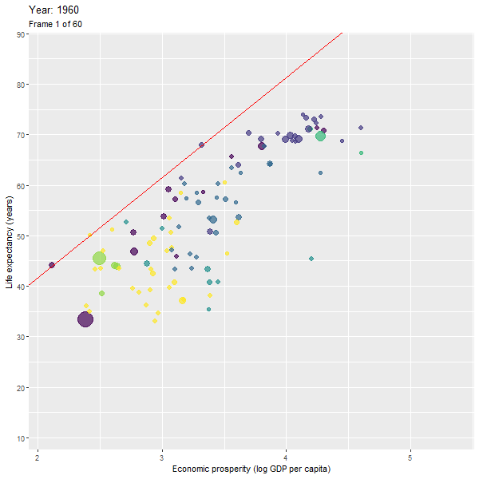 # this is an empty file (for making the caption)
```


<!--- comment this can be deleted [animation](https://www.erim.eur.nl/fileadmin/centre_content/necessary_condition_analysis/Prosperity-Life-expectancy.gif) -->

Figure \@ref(fig:animation2FIG) is an animated figure showing the time trends. In the figure, each data point is a country.
The size of a data point refers to the country's population size, and
the color to the geographic region to which it belongs, e.g., yellow for
the Sub-Saharan region, and violet for East Asian and Pacific region.

The interpretation of time trends focuses on the change of necessity effect size, ceiling line intercept and ceiling line slope over time. Table \@ref(tab:years) and Figure \@ref(fig:trend)-top-left show the clear trend that necessity effect size reduces over time. This indicates that, over the years, Economic prosperity has become less of a bottleneck for high Life expectancy. Figures \@ref(fig:trend)-top-right and \@ref(fig:trend)-bottom show that this decrease of effect size is due to the increase of the intercept (upward moving ceiling line) and decrease of the slope (ceiling line flattens).


```{r trend, echo=FALSE, fig.show="hold", fig.align = "center",  out.width='49%', fig.cap="Time trends of NCA parameters for the necessity of Economic prosperity for Life expectancy. Top-Left: necessity effect size. Top-Right: ceiling intercept. Bottom: ceiling slope.", cache=TRUE}
#knitr::include_graphics("trend_effect_size.pdf")
#knitr::include_graphics("trend_intercept.pdf")
#knitr::include_graphics("trend_slope.pdf")
knitr::include_graphics(c("trend_effect_size.png", "trend_intercept.png", "trend_slope.png"))
```
Figure \@ref(fig:compar) compares the $XY$-plots for the first (1960) and last (2023) year in the dataset and shows that the effect size in 1960 was higher than in 2023.
```{r compar, echo=FALSE, fig.show="hold", out.width='49%', fig.align = "center", fig.cap="$XY$-plot of Economic prosperity and Life expectancy for 1960 (Left) and 2023 (Right).", cache=TRUE}
#par(mar = c(4, 4, .1, .1))
#knitr::include_graphics("1960.png")
#knitr::include_graphics("2019.png")
knitr::include_graphics("plot.Economic_prosperity_(log_GDP_per_capita)-Life_expectancy_(years)19601.png")
knitr::include_graphics("plot.Economic_prosperity_(log_GDP_per_capita)-Life_expectancy_(years)20231.png")
#knitr::include_graphics("plot.Economic_prosperity_(log_GDP_per_capita)-Life_expectancy_(years)19601 BWcool.png")
#knitr::include_graphics("plot.Economic_prosperity_(log_GDP_per_capita)-Life_expectancy_(years)20231 BWcool.png")
```
NCA's statistical difference test for paired observations (Section \@ref(paired)) shows that the 0.08 difference between the effect sizes of 1960 and 2023 (0.19 and 0.11, respectively) is statistically significant ($p$ < 0.001).

In 1960 the maximum life expectancy for an Economic prosperity of 3 ($10^3$ = 1000 equivalent US dollars) was about 60 years, and in 2023 it was about 75 years. In 2023 compared to 1960, the countries are more clustered near the ceiling, indicating that the difference in Life expectancy between countries diminished, but that a hard border of maximum possible Life expectancy for a given Economic prosperity level remains. 

```{r differencelifeexpectancy, echo = FALSE, eval = FALSE}
# NCA statistical difference test applied to Life expectancy example
# Comparing 1960 with 2023

# Data
df <- read.csv("df_GDP-Life-expectancy-1960-2023.csv")

# Select variables
x <- colnames(df)[3] # Economic prosperity
y <- colnames(df)[4] # Life expectancy

#theoretical scope corresponding to the pooled min and max X and Y
scope <- c(min(df[,3],na.rm = TRUE),
           max(df[,3],na.rm = TRUE), 
           min(df[,4],na.rm = TRUE), 
           max(df[,4],na.rm = TRUE))

# Select years
df1 <- df[df$year == 1960, ]
df2 <- df[df$year == 2023, ]

# Select df's with same rows (needed for paired analysis)
common <- intersect(df1$country, df2$country)
df1_common <- df1[df1$country %in% common, ]
df2_common <- df2[df2$country %in% common, ]

# Conduct NCA difference test (paired)
library(NCA)
dif <- nca_difference(data1 = df1_common,
                      data2 = df2_common, 
                      x = x,
                      y = y,
                      ceilings = c("c_lp"),
                      scope =  scope,
                      test.rep = 1000,
                      test.type = "paired")
dif

# Check
model1 <- nca_analysis(df1_common,
                       x = x,
                       y = y,
                       ceilings = c("c_lp"),
                       scope =  scope,
                       test.rep = 1000)
model1
nca_output(model1, summaries = F)

model2 <- nca_analysis(df2_common,
                       x = x,
                       y = y,
                       ceilings = c("c_lp"),
                       scope =  scope,
                       test.rep = 1000)
model2
nca_output(model2, summaries = F)
```

<!-- In 1960 countries with prosperity of 3 (1000 dollar) had a maximum possible life expectancy of 60 that was 10 years less than that for countries with prosperity of 4 (25000 dollar): (65 versus 75). However, in 2019 countries with prosperity of 3.4 (2500 dollar) had a maximum possible life expectancy that was only 5 years less  than that for countries with prosperity of 4.4 (25000 dollar).(75 versus 80). -->

<!-- <!-- start html: -->
<!-- Figure \@ref(fig:compar) shows that in 1960 the maximum life expectancy for a prosperity -->
<!-- of 3.4 (10<sup>3.4</sup> = 2500 equivalent US dollars) was about 65 years, and in 2019 it was about 75 years. The reduction of necessity is also partly due to the flattening of the -->
<!-- ceiling line, indicating that the difference between the best performing -->
<!-- less prosperous countries, and the best performing more prosperous -->
<!-- countries, is diminishing. In 1960 countries with prosperity of -->
<!-- 3.4 (2500 dollar) had a maximum possible life expectancy that was 10 -->
<!-- years less than that for countries with prosperity of 4.4 -->
<!-- (25000 dollar): 65 versus 75 years. However, in 2019 countries with prosperity of 3.4 (2500 dollar) -->
<!-- had a maximum possible life expectancy that was only 5 years less  than that for countries with prosperity of 4.4 (25000 -->
<!-- dollar): 75 versus 80 years. -->
<!-- <!--  end html: -->

<!-- Another observation is that the density of countries near the ceiling -->
<!-- line has increased over the years. This indicates that the relative -->
<!-- differences in life expectancy between the more and less performing -->
<!-- countries has reduced. -->

Socio-economic policy practitioners could make new interpretations from these necessity time-trends. For example, in the past,
economic prosperity was a major bottleneck for high life expectancy.
Currently, most countries are economically prosperous enough for
having the possibility of a decent life expectancy of 75 years; if these countries do not reach that level of life expectancy, other factors than economic prosperity are the reason for it. If the trend continues, in the future Economic prosperity may not be a limiting factor for high Life expectancy, because the empty space in the upper-left corner disappears.

#### Time-lagged study
The observed empty space in the upper-left corner could also be the results of reverse causality. In reverse causality $Y$ existed before $X$. An empty space in the upper-left corner could then also indicate that a low level of $Y$ is  necessary for a low level of $X$. This would mean that a low level of Life expectancy is necessary ($Y$) for a low level of Economic prosperity $X$. When forward necessity makes sense, the argument for reverse causality is often weaker but cannot be excluded.
With a time-lagged study, reverse causality is less likely when an empty space in the upper-left corner is observed while the $X$-score is obtained at time point ($T_1$) before the time point ($T_2$) of the $Y$-score. The lag should be long enough for $Y$ to develop in the presence of $X$ and other causal factors. For example, by using a 5-year time-lag the analysis with Economic prosperity in 2018 and Life expectancy in 2023  has a similar empty space in the upper-left corner (Figure \@ref(fig:compar-timelagged)).


```{r compar-timelagged, echo=FALSE, fig.show="hold", out.width='49%', fig.align = "center", fig.cap="$XY$-plot of Economic prosperity in 2018 and Life expectancy in 2023.", cache=TRUE}
#knitr::include_graphics("plot.Economic_prosperity_(log_GDP_per_capita)-Life_expectancy_(years)1960.pdf")
knitr::include_graphics("plot_Economic_prosperity_prev_(log_GDP_per_capita)-Life_expectancy_(years)2023.png")
#knitr::include_graphics("plot_Economic_prosperity_prev_(log_GDP_per_capita)-Life_expectancy_(years)2023 BWcool.png")
```

```{r, echo = FALSE, eval = FALSE} 
#TIME LAGGED STUDY
df <- read.csv("df_prev_GDP-Life-expectancy-1960-2023.csv") # SELECT fOR TIME-LAGGED
head(df)

#ceiling line for a particular year
yr <- 2023
df_year <- subset (df, df$year == yr)
model_year <- nca_analysis(df_year, 3,4, test.rep = 10000, ceilings = c("c_lp", "ce_fdh"), scope = scope) #change to 10000 for final analysis
model_year
nca_output(model_year)
#nca_output(model_year, summaries = F, pdf = T) #save plot; watch out overwrite
```
The differences between Figures \@ref(fig:compar-timelagged) and \@ref(fig:compar)-right are minor.

### Case study {#casestudy}
The case study investigates the phenomena in a small number of cases in their natural environment. Such a design is associated with a small-n qualitative study that allows a rich description of the phenomena. In such a study, relationships are often described in words rather than numerically. 

NCA can be applied to a case study design in two ways. First, NCA's methodology provides the causal logic to describe phenomena. Case studies are often used to explore complex causal relationships within specific contexts, and NCA complements this by introducing the idea that some factors may be necessary (but not sufficient) for an outcome to occur. In this way, NCA helps case investigators to move beyond traditional probabilistic sufficiency cause-effect explanations toward identifying the minimal requirements that must be present for a phenomenon to manifest. 

Second, NCA's data analytic method provides the tools to analyze qualitative data within or across cases. In multiple-case designs, coded evidence from interviews, documents, or observations can be transformed into ordinal or categorical indicators of conditions and outcomes. These can then be used as input scores for NCA to identify which conditions consistently act as enablers or bottlenecks across cases. The results can be interpreted to explain how and why these conditions function as necessary conditions.

<!-- Often, the goal of a case study is to explore phenomena and build hypotheses (induction) rather than testing them [deduction; see for examples @dul2008case and @eisenhardt1989building]. An inductive case study specific for NCA may be useful when a phenomenon is poorly understood and the inductive case study could help to describe the necessity relationship in the selected cases [e.g., @harding2002studying]. In other situations a thought experiment may serve as an alternative approach to develop a necessity hypothesis (Section \@ref(developingformaltheory)).  -->

If a necessity hypothesis already exists, the case study design can be used to test this hypothesis with the small number of cases. Case studies explicitly designed for testing necessity hypotheses are rare, but implicitly many studies do test such a hypothesis given the way the cases are selected [e.g., @fujita2020denial; @harding2002studying, see Section \@ref(smallncaseselection) for more details]. However, testing necessity hypothesis as part of an existing case study design, possibly originally aimed at exploration and theory building, offers a new opportunity for many qualitative studies [e.g., @novales2025realizing]. 

When testing a necessity hypothesis with a small number of cases selected from the theoretical domain (deductive case study), a rich description of the context is not required, although it is not objectionable either. The only requirement is that the qualitative data can be scored into levels of the condition and the outcome (e.g., in terms of low, medium, high). Because necessity is independent of other variables, scoring the concepts $X$ and $Y$ is enough for testing the hypothesis. Given the small number of cases and their non-random selection, an estimation of $p$-values is not feasible. However, the reduced data requirements often allow the analyst to a dive deeper into the cases for better understanding the necessity mechanisms, or selecting more than a few cases, bringing the design closer to an observational study (Section \@ref(observationalstudy)). Case selection for testing necessity hypotheses is discussed in Section \@ref(samplingandselection).

### Experimental study  {#experiment}
In an experimental study design, $X$ is first manipulated and afterwards the effect on $Y$ is observed, such that the required causal direction is ensured: first $X$ then $Y$. This excludes the possibility of reverse causality that $Y$ occurs before $X$ (Section \@ref(reversecausality)). Whereas uncertainty about the causal direction could be handled with a time-lagged longitudinal study, where the condition is measured at $T_1$ and the outcome at $T_2$, such a study can only detect necessity if the outcome has developed during this time period. To have more control, the necessity experiment is an alternative approach for establishing the causal direction when the analyst is uncertain about reverse causality. With this goal in mind, the experiment is useful for testing a necessity hypothesis in the situation that reverse necessity is theoretically plausible.

The experimental setup for a necessity experiment differs from the traditional probabilistic sufficiency experiment is several ways. Whereas in a common experiment $X$ is manipulated (increased) to produce the *presence* of $Y$ on average, in a necessity experiment $X$ is manipulated (decreased) to produce *absence* of $Y$ (assuming a high-high hypothesis or more precisely: assuming that for a desired level of $y = y_c$,  $x$ must be equal to or larger than $x_c$). 

The necessity experiment starts with cases _with_ high outcome ($y ≥ y_c$) and _with_ high condition ($y ≥ x_c$), then the condition is _removed or reduced_ ($x < x_c$), and it is observed if the outcome has _disappeared or reduced_ ($y < y_c$). This contrasts the traditional "average treatment effect" experiment in which the research starts with cases with low outcome ($y < y_c$) and with low condition ($x < x_c$), then the condition is _added or increased_ ($x ≥ x_c$), and it is observed if the outcome has _appeared or increased_ ($ ≥ y_c$).

The necessity experiment is conducted as follows:


1. Obtain a *representative sample* from the population.

2. Check the expected empty corner. 

3. Select the entire sample or part of  it.

4. Divide this sample randomly into two groups (treatment and control group).

5. Remove ($x \rightarrow 0$) or reduce ($x \rightarrow low$) the condition in the treatment group.

6. Observe: (1) whether the effect size does not disappear; and (2) whether the outcome reduction in the treatment group is larger than the outcome reduction in the control group. If both are true, necessity is supported.

This necessity experiment ensures the causal direction (first $X$, then $Y$). The randomization between groups ensures that the group constitutions are similar, and that possible time effects (effect of other disappearing necessary conditions) are controlled for. The possible disappearance/reduction of the outcome due to other necessary conditions happens in both groups; the treatment group must have more outcome disappearance/reduction than the control group.

Below several types of necessity experiments depending on whether $X$ and $Y$ are dichotomous or continuous are discussed. 
<!-- A comparison can be made with conventional sufficiency experiments that are described in Appendix \@ref(appendixaa).  -->

#### Necessity experiment: dichotomous $X$ and dichotomous $Y$ {#necessityexperiment}

``` {r necessity1befaft, warning=FALSE, echo=FALSE, eval= FALSE, out.width='99%', fig.dim = c(9,5), fig.align = "center", fig.cap= "$XY$-table of the necessity experiment before (Left) and after (Right) manipulation. $X$  = Condition (0 = no; 1 = yes). $Y$ = Outcome (0 = no; 1 = yes). \\caseabsent{}  = control group. × = treatment group.", cache=TRUE}
#safe pdf
save_pdf = T
if (save_pdf) {
  pdf("Necessity-experiment dichotomous dichotomous COLOR.pdf", width = 7, height = 10, onefile = TRUE)
}

par(mar=c(5,5,4,1))
par(mfrow=c(1,2))
par(pty = "s")  # ensures square plot region regardless of device size

#2x2 contingency table
X<- c(0.25, 0.75, 0.75) #2-2
Y<- c(0.25, 0.25, 0.75) #2-2
plot (X,Y, xlab="X = Condition", ylab="Y = Outcome", xlim = c(0,1), ylim=c(0,1), pch=19, cex=2, axes = F, yaxs="i", xaxs="i", type="n")
axis(1, at = c(0,0.25,0.75,1.25), pos=0, tck=0, labels=rep(c("","0", "1", ""))) #X2
axis(2, at = c(0,0.25,0.75,1.25), pos=0, tck=0, labels=rep(c("","0", "1", ""))) #Y2
abline(v=c(0.5,1), h=c(0.5,1))

cex <- 0.8 #(or 1.2)

#before manipulation
#control nc = 50
nc = 50
nc1 = 0
nc2 = 50
nc3 = 0
nc4 = 0

#treatment nt = 50
nt = 50
nt1 = 0
nt2 = 50
nt3 = 0
nt4 = 0

# cell 2
c2x.control <- runif(nc2, 0.6, 0.9)
c2y.control <- runif(nc2, 0.6, 0.9)
c2x.treatment <- runif(nt2, 0.6, 0.9)
c2y.treatment <- runif(nt2, 0.6, 0.9)
points(c2x.control,c2y.control, pch=1, cex=cex, col = "blue")
points(c2x.treatment,c2y.treatment, pch=4, cex=cex, col = "red")
text(0.75,0.95,paste0("n=", nc2+nt2), cex=0.8)

#after manipulation
set.seed(123)
X<- c(0.25, 0.75, 0.75) #2-2
Y<- c(0.25, 0.25, 0.75) #2-2
plot (X,Y, xlab="X = Condition", ylab="Y = Outcome", xlim = c(0,1), ylim=c(0,1), pch=19, cex=2, axes = F, yaxs="i", xaxs="i", type="n")
axis(1, at = c(0,0,1,1), pos=0, tck=0, labels=rep(c("0","0", "1", ""))) #X
axis(2, at = c(0,0.25,0.75,1.25), pos=0, tck=0, labels=rep(c("","0", "1", ""))) #Y
abline(v=c(0.5,1), h=c(0.5,1))

#control nc = 50
nc = 50
nc1 = 0
nc2 = 40
nc3 = 0
nc4 = 10

#treatment nt = 50
nt = 50
nt1 = 0
nt2 = 0
nt3 = 50
nt4 = 0

# cell 1
text(0.25,0.95,paste0("n=", nc1+nt1), cex=0.8)

# cell 2
c2x.control <- runif(nc2, 0.6, 0.9)
c2y.control <- runif(nc2, 0.6, 0.9)
points(c2x.control,c2y.control, pch=1, cex=cex, col = "blue")
text(0.75,0.95,paste0("n=", nc2+nt2), cex=0.8)

# cell 3
c3x.treatment <- runif(nt3, 0.1, 0.4)
c3y.treatment <- runif(nt3, 0.1, 0.4)
points(c3x.treatment,c3y.treatment, pch=4, cex=cex, col = "red")
text(0.25,0.45,paste0("n=", nc3 + nt3), cex=0.8)

#cell 4
c4x.control <- runif(nc4, 0.6 , 0.9)
c4y.control <- runif(nc4, 0.1, 0.4)
points(c4x.control,c4y.control, pch=1, cex=cex, col = "blue")
text(0.75,0.45,paste0("n=", nc4 + nt4), cex=0.8)

odd <- ((nc2+nt2)/(nc4+nt4))/((nc1+nt1)/(nc3+nt3)) #odds ratio
#odd

if (save_pdf) {
  dev.off()
}

```

```{r necessity1befaftFIG, warning=FALSE, echo=FALSE, out.width='99%', fig.dim = c(9,5), fig.align = "center", fig.cap= "$XY$-table of the necessity experiment before (Left) and after (Right) manipulation. $X$  = Condition (0 = no; 1 = yes). $Y$ = Outcome (0 = no; 1 = yes). \\caseabsent{}  = control group. × = treatment group.", cache=FALSE}
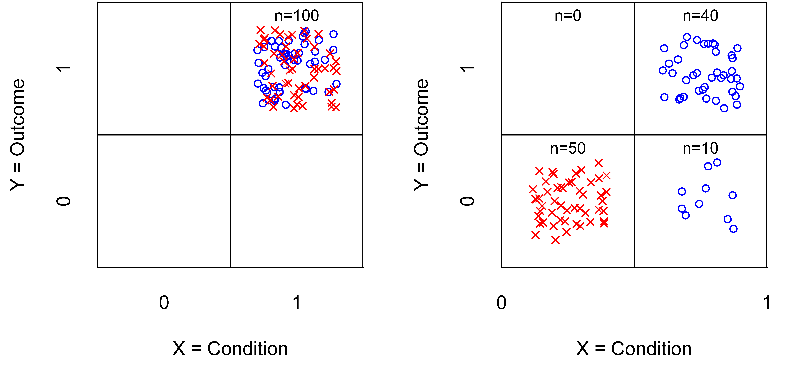
```


For dichotomous variables the experiment to evaluate a high-high necessity hypothesis the steps are conducted as follows:^[Convention in this book for corner numbers: 1 = upper-left; 2 = upper-right; 3 = lower-left; 4 - lower-right.] 

1. Obtain a *representative sample* from the population.

2. Observe that *expected corner* is empty (corner 1).
<!-- In the dichotomous situation the effect size is 1, using the theoretical scope of [(0,1) $\times$ (0,1)] and based on the possible $X$ and $Y$ values. -->

3. Select the cases of corner 2. The experiment is done with these cases. In Figure \@ref(fig:necessity1befaftFIG)-left it is assumed that 100 cases are available for the experiment.

4. *Randomly assign* these cases into two groups:
   - Treatment group (symbol ×).
   - Control group (symbol \caseabsent{}). 
<!-- for html just use symbol ○ -->

5. *Apply the treatment*:
   - Treatment group: Remove the condition: $x\rightarrow$ 0.
   - Control group: Keep the condition: $x = 1$.

6. *Observe* the outcome $Y$ in both groups (Figure \@ref(fig:necessity1befaftFIG)-right):
   - Treatment group: number of cases that move to corner 1.
   - Treatment group: number of cases that move to corner 3.
   - Control group: number of cases that move to corner 4.
   - Control group: number of cases that remain in corner 2.

If all treatment cases have moved from corner 2 to corner 3, but not to corner 1, and if not all control cases have moved from corner 2 to corner 4 (because another necessary condition disappeared during the manipulation) there is evidence that $X$ is necessary for $Y$.
If treatment cases have moved from corner 2 to corner 1, this indicates that $Y$ can occur without $X$ and that $X$ is not necessary for $Y$.
If control cases have moved from corner 2 to corner 4, this suggests that there is a time effect. This is not a problem for concluding that $X$ is necessary for $Y$ as long as not all control cases have moved to corner 4.^[Note that an odds ratio (OR) is often used to estimate the average effect when $X$ and $Y$ are dichotomous. The odds ratio summarizes how much more likely (in terms of odds) the outcome is to be absent in the treatment group (where $X$ is removed) compared to the control group (where $X$ is retained). The mathematical formula for the odds ratio in $OR = \frac{c3 / c1}{c4 / c2} = \frac{c3 \cdot c2}{c1 \cdot c4}$ where $c1$, $c2$, $c3$, and $c4$ refer to the number of cases in corner 1, corner 2, corner 3, and corner 4, respectively. After the treatment, $c2$ is the number of cases in the control group with outcome success, $c4$ is the number of cases in the control group with outcome failure (spontaneous decay), $c1$ is the number of cases in the treatment group with outcome success (success remains after removing $X$), and $c3$ is the number of cases in the treatment group with outcome failure. With an observed data pattern of an empty space in corner 1, the odds ratio is infinite, regardless of the distribution of the cases in the control group: $(50/0)/(10/40) = \infty$. This situation is called "perfect separation" and is considered a problem for average effect statistical analysis. A common advice is to remove the $X$ from further analysis. However, $X$ is a very important predictor of the outcome: the perfect predictor ensures absence of the outcome when $X$ is absent: a necessary condition.] 

#### Necessity experiment: dichotomous $X$ and continuous $Y$
Figure \@ref(fig:necessitybefaft1dichotomouscontinuousFIG) illustrates the situation when the condition is dichotomous and the outcome is continuous. Before the manipulation the condition is present ($x$ = 1). The $y$-values include the *maximum value* of the outcome ($y$ = 1). Necessity is supported when after the manipulation ($x \rightarrow 0$) the maximum value in the treatment group is reduced to a value of $y = y_c$, resulting in an empty upper-left corner of the $XY$-plot. The necessary condition can be formulated as $x = 1$ is necessary for $y \geq y_c$. The necessity effect size is the empty area divided by the scope. In this example the effect size = 0.18. 


``` {r necessitybefaft1dichotomouscontinuous, warning=FALSE, echo=FALSE, eval=FALSE, out.width='99%', fig.dim = c(9,5), fig.align = "center", fig.cap= "$XY$-plot of the necessity experiment with a continuous outcome and a dichotomous condition before (Left) and after (Right) manipulation. $X$ = Condition (0 = no, 1 = yes). Y = Outcome between 0 and 1. \\caseabsent{} = control group. × = treatment group. $y_c$ is the ceiling value of $Y$ for $x$ = 0.", cache=TRUE}

set.seed(123)
#safe pdf 
pdf = T
if (pdf) {
  pdf("Necessity-experiment dichotomous continuous COLOR.pdf")
}
par(mar=c(5,5,4,1))
par(mfrow=c(1,2))
par(pty = "s")  # ensures square plot region regardless of device size

X<- c(0.25, 0.75, 0.75) #2-2
Y<- c(0.25, 0.25, 0.75) #2-2
plot (X,Y, xlab="X = Condition", ylab="Y = Outcome", xlim = c(0,1), ylim=c(0,1), pch=19, cex=2, axes = F, yaxs="i", xaxs="i", type="n")
axis(1, at = c(0,0.25,0.75,1.25), pos=0, tck=0, labels=rep(c("","0", "1", ""))) #X
axis(2, at = c(0,0,1,1), pos=0, tck=0, labels=rep(c("0","0", "1", ""))) #Y
abline(v=c(0.5,1), h = 1)

cex <- 0.8 #(or 1.2)
x1 = 0.1
x2 = 0.4
x3 = 0.6
x4 = 0.9
y1 = 0.1
y2 = 0.4
y3 = 0.6
y4 = 0.9

n = 100

#before manipulation
n2 = n
for (i in n2) {
  c2x.control <- runif(n2, x3, x4)
  c2y.control <- runif(n2-1, 0, 1) #ensure that 1 is maximum
  c2y.control <- c(c2y.control, 1)
  c2x.treatment <- runif(n2, x3, x4)
  c2y.treatment <- runif(n2, 0, 1)
  points(c2x.control,c2y.control, pch=1, cex=cex, col = "blue")
  points(c2x.treatment,c2y.treatment, pch=4, cex=cex, col = "red")
  #text(c3x,c3y,"x", cex=cex, col = "green", pch = 1)
}
text(0.9,0.5,paste0("n=", n2), cex=cex)

#after manipulation
n1 = 0*n
n3 = 0.5*n - n1
n2 = 0.3*n
n4 = 0.5*n -n2

X<- c(0.25, 0.75, 0.75) #2-2
Y<- c(0.25, 0.25, 0.75) #2-2
plot (X,Y, xlab="X = Condition", ylab="Y = Outcome", xlim = c(0,1), ylim=c(0,1), pch=19, cex=2, axes = F, yaxs="i", xaxs="i", type="n")
axis(1, at = c(0,0.25,0.75,1.25), pos=0, tck=0, labels=rep(c("","0", "1", ""))) #X
axis(2, at = c(0,0,1,1), pos=0, tck=0, labels=rep(c("0","0", "1", ""))) #Y
abline(v=c(0.5,1), h = 1)

n3 = 0.5*n
max1 = 0.65
segments(0,max1,0.5,max1, lty=2, col="black", lwd = 1) #horizontal part 1 ceiling line
#segments(0,0.5,0.5,0.5, lty=1, col="black", lwd = 4) #horizontal part 1 ceiling line
for (i in n3) {
  c3x.control <- runif(n3, x3, x4)
  c3y.control <- runif(n3-1, 0, 1)
  c3y.control <- c(c3y.control, 1) 
  c3x.treatment <- runif(n3, x1, x2)
  c3y.treatment <- runif(n3-1, 0, max1)
  c3y.treatment <- c(c3y.treatment, max1) 
  points(c3x.control,c3y.control, pch=1, cex=cex, col = "blue")
  points(c3x.treatment,c3y.treatment, pch=4, cex=cex, col = "red")
  #text(c3x,c3y,"x", cex=cex, col = "green", pch = 1)
}
text(0.1,0.5*max1,paste0("n=", n3), cex=cex)
text(0.9,0.5,paste0("n=", n3), cex=cex)
text(0.1, max1 + 0.05, bquote(y[c] ~ "=" ~ .(max1)), cex = cex)
#text(0.1,max1+0.05, paste0("Yc = ", max1), cex=cex)

#safe pdf 
if (pdf) {
dev.off()
}
```

```{r necessitybefaft1dichotomouscontinuousFIG, warning=FALSE, echo=FALSE, out.width='99%', fig.dim = c(9,5), fig.align = "center", fig.cap= "$XY$-plot of the necessity experiment with a continuous outcome and a dichotomous condition before (Left) and after (Right) manipulation. $X$ = Condition (0 = no, 1 = yes). Y = Outcome between 0 and 1. \\caseabsent{} = control group. × = treatment group. $y_c$ is the ceiling value of $Y$ for $x$ = 0.", cache=TRUE}
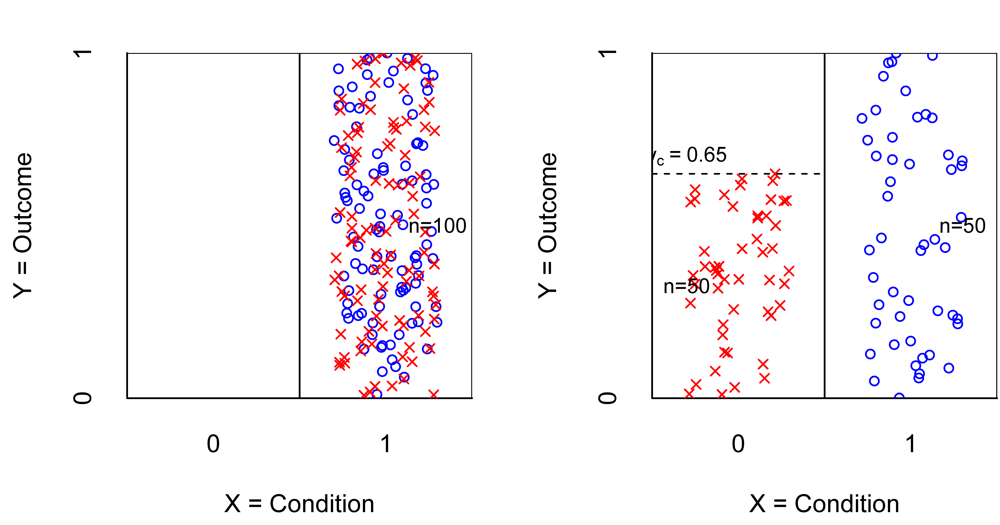
```


#### Necessity experiment: continuous $X$ and dichotomous $Y$
Figure \@ref(fig:necessitybefaft1continuousdichotomousFIG) illustrates the situation when the condition is continuous and the outcome is dichotomous. Before the manipulation, the condition is present: $x \geq x_{high}$, where $x_{high}$ is a value  above the presumed necessity level $x = x_c$. The treatment reduces the value of $X$ of all treatment cases. Some cases may end below $x = x_{high}$ but above $X = x_{c}$. Since the bottleneck value $x_c$ is not reached, these cases have $y$ = 1. Other treatment cases have new $x$-values below the necessity value $x$ = $x_c$. The latter group of cases will then end up in the lower-left corner with  $y = 0$. Necessity is supported when after manipulation no cases with $Y = 1$ exist with $x < x_c$. In other words, all cases with $x < x_c$ should be located in the lower-left corner. The necessary condition can be formulated as $x \geq x_c$ is necessary for $y = 1$. 


``` {r necessitybefaft1continuousdichotomous, warning=FALSE, echo=FALSE, eval = FALSE, out.width='99%', fig.dim = c(9,5), fig.align = "center", fig.cap= "$XY$-plot of the necessity experiment with a continuous condition and a dichotomous outcome before (Left) and after (Right) manipulation. $X$  = Condition (0 = no, 1 = yes). $Y$ = Outcome between 0 and 1. \\caseabsent{} = control group. × = treatment group. $x_c$ is ceiling value of $x$-value for $y$ = 1. $x_{high}$ is the minimum $x$-value for selecting cases with $y$ = 1.", cache=TRUE}


#safe pdf 
pdf = T
if (pdf) {
  pdf("Necessity-experiment continuous dichotomous COLOR.pdf")
  #grDevices::pdf("Necessity-experiment_fixed.pdf", width = 7, height = 10, onefile = TRUE)
}

par(mar=c(5,5,4,1))
par(mfrow=c(1,2))
par(pty = "s")  # ensures square plot region regardless of device size

X<- c(0.25, 0.75, 0.75) #2-2
Y<- c(0.25, 0.25, 0.75) #2-2
plot (X,Y, xlab="X = Condition", ylab="Y = Outcome", xlim = c(0,1), ylim=c(0,1), pch=19, cex=2, axes = F, yaxs="i", xaxs="i", type="n")
axis(1, at = c(0,0,1,1), pos=0, tck=0, labels=rep(c("0","0", "1", ""))) #X
axis(2, at = c(0,0.25,0.75,1.25), pos=0, tck=0, labels=rep(c("","0", "1", ""))) #Y

abline(h=c(0.5,1), v = 1)
cex = 0.8 #size of points

n = 100 #equal number of cases in control and treatment groups n  100 
nc = 50 
nt = 50 #all points of control and treatment in cell 2

#before manipulation
set.seed(123)
x_high <- 0.6
abline(v = x_high, lty = 3)
text(0.6,-0.05, expression(x[high]), cex=1.2, xpd = TRUE)

c2x.control <- runif(nc, x_high + 0.1, 0.9)
c2y.control <- runif(nc, 0.6, 0.9)
c2x.treatment <- runif(nt, x_high + 0.1, 0.9)
c2y.treatment <- runif(nt, 0.6, 0.9)
points(c2x.control,c2y.control, pch=1, cex=cex, col = "blue")
points(c2x.treatment,c2y.treatment, pch=4, cex=cex, col = "red")
text(0.8,0.95,paste0("n=", nc+nt), cex=0.8)

###################
#after manipulation
set.seed(123)
X<- c(0.25, 0.75, 0.75) #2-2
Y<- c(0.25, 0.25, 0.75) #2-2
plot (X,Y, xlab="X = Condition", ylab="Y = Outcome", xlim = c(0,1), ylim=c(0,1), pch=19, cex=2, axes = F, yaxs="i", xaxs="i", type="n")
axis(1, at = c(0,0,1,1), pos=0, tck=0, labels=rep(c("0","0", "1", ""))) #X
axis(2, at = c(0,0.25,0.75,1.25), pos=0, tck=0, labels=rep(c("","0", "1", ""))) #Y
abline(h=c(0.5,1), v = 1)
x_high <- 0.6
abline(v = x_high, lty = 3)
text(0.6,-0.05, expression(x[high]), cex=1, xpd = TRUE)

x_c <- 0.4
abline(v = x_c, lty = 3)
text(0.4,-0.05, expression(x[c]), cex=1, xpd = TRUE)
#control nc = 50
nc = 50
nc1 = 0
nc2 = 40
nc3 = 0
nc4 = 10

#treatment nt = 50
nt = 50
nt1 = 0
nt2 = 0
nt2a = 15  
nt3 = 35
nt4 = 0

# cell 2
c2x.control <- runif(nc2, x_high, 0.9)
c2y.control <- runif(nc2, 0.6, 0.9)
points(c2x.control,c2y.control, pch=1, cex=cex, col = "blue")
text(0.8,0.95,paste0("n=", nc2+nt2), cex=0.8)

# cell 2a
c2ax.treatment <- runif(nt2a, x_c, x_high)
c2ay.treatment <- runif(nt2a, 0.6, 0.9)
points(c2ax.treatment,c2ay.treatment, pch=4, cex=cex, col = "red")
text(0.5,0.95,paste0("n=", nt2a), cex=0.8)

# cell 3
c3x.treatment <- runif(nt3, 0.1, x_c)
c3y.treatment <- runif(nt3, 0.1, 0.4)
points(c3x.treatment,c3y.treatment, pch=4, cex=cex, col = "red")
text(0.25,0.45,paste0("n=", nc3 + nt3), cex=0.8)

#cell 4
c4x.control <- runif(nc4, x_high, 0.9)
c4y.control <- runif(nc4, 0.1, 0.4)

points(c4x.control,c4y.control, pch=1, cex=cex, col = "blue")
text(0.80,0.45,paste0("n=", nc4 + nt4), cex=0.8)

if (pdf) {
dev.off()
}

```
``` {r necessitybefaft1continuousdichotomousFIG, warning=FALSE, echo=FALSE, out.width='99%', fig.dim = c(9,5), fig.align = "center", fig.cap= "$XY$-plot of the necessity experiment with a continuous condition and a dichotomous outcome before (Left) and after (Right) manipulation. $X$  = Condition (0 = no, 1 = yes). $Y$ = Outcome between 0 and 1. \\caseabsent{} = control group. × = treatment group. $x_c$ is ceiling value of $x$-value for $y$ = 1. $x_{high}$ is the minimum $x$-value for selecting cases with $y$ = 1.", cache=TRUE}
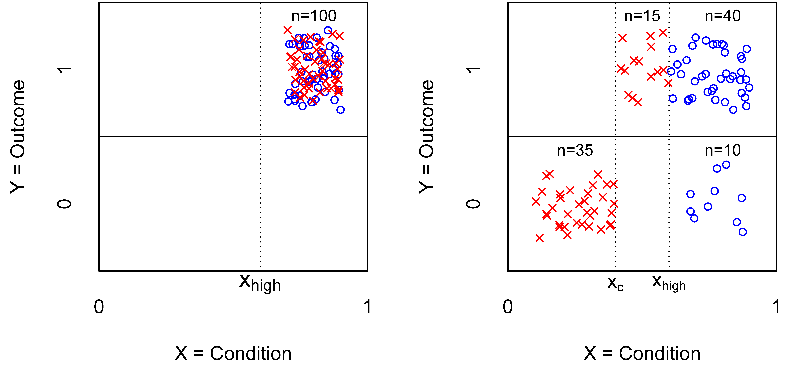
```

#### Necessity experiment: continuous $X$ and continuous $Y$
In a necessity experiment with a continuous condition and a continuous outcome, the starting point is the existence of an empty area in the upper-left corner of the $XY$-plot (Figure \@ref(fig:necessitybefaft1continuouscontinuousintactFIG)-left). The manipulation consists of reducing the level of the condition in the treatment group but not in the control group. Necessity is supported when after the manipulation no cases enter the empty zone. This is shown in  Figure \@ref(fig:necessitybefaft1continuouscontinuousintactFIG)-right, where the necessity effect size before manipulation (0.25) stays intact after manipulation. 


``` {r necessitybefaft1continuouscontinuousintact, warning=FALSE, echo=FALSE, eval = FALSE, out.width='99%', fig.dim = c(9,5), fig.align = "center", fig.cap= "$XY$-plot of a necessity experiment with a continuous condition and outcome before (Left) and after (Right) manipulation (reducing $X$). Effect size remains after manipulation.  \\caseabsent{} = control group. × = treatment group.", cache=TRUE}
library (truncnorm)

#data
getRandomData <- function(N,
                          slope,
                          intercept,
                          type= "uniform"){
  
  collectXY<- function(x,y){ # helper function: sort x's and y's
    temp <- cbind(x, y)
    temp <- temp[order(temp[, 1]),] # sort data points on x values
    return(list(x = temp[, 1], y = temp[, 2]))
  }
  
  if (type == "uniform") {  
    uniformRandomData <- function(N, slope, intercept) {
      xdata <- ydata <- rep(NA, N)
      for (i in 1:N) {
        reject <- TRUE
        while (reject) { # check if is below line
          xtry <- runif(1,0,1);
          ytry <- runif(1,0,1)
          if (ytry <= min(1, (intercept + slope * xtry))) {
            reject<-FALSE
          }
        }
        ydata[i] <- ytry ;
        xdata[i] <- xtry
      }
      return(collectXY(xdata, ydata))
    }
  }
  
  if (type == "normal") {
    normalRandomData <- function(N, slope, intercept) {
      xdata <- ydata <- rep(NA, N)
      for (i in 1:N) {
        reject <- TRUE
        while (reject) { # check if is below line
          xtry <- rtruncnorm(1, a=0, b=1, mean = 0.5, sd = 0.2);
          ytry <- rtruncnorm(1, a=0, b=1, mean = 0.5, sd = 0.2)
          if (ytry <= min(1, (intercept + slope * xtry))) {
            reject<-FALSE
          }
        }
        ydata[i] <- ytry ;
        xdata[i] <- xtry
      }
      return(collectXY(xdata, ydata))
    }
  }
  
  
  if (type == "uniform") {
    return (uniformRandomData(N, slope, intercept) )
  }
  else if (type == "normal") {
    return (normalRandomData(N, slope, intercept))
  }
}

set.seed(123)

#safe pdf 
pdf = T
if (pdf) {
  pdf("Necessity-experiment continuous continuous COLOR.pdf")
}

cex <- 0.8 #(or 1.2)
par(mar=c(5,5,4,1))
par(mfrow=c(1,2))
par(pty = "s")  # ensures square plot region regardless of device size

X = NULL
Y = NULL
#before manipulation
plot (X,Y, xlab="X = Condition", ylab="Y = Outcome", xlim = c(0,1), ylim=c(0,1), pch=19, cex=2, axes = F, yaxs="i", xaxs="i", type="n")
axis(1, at = c(0,0,1,1), pos=0, tck=0, labels=rep(c("0","0", "1", ""))) #X
axis(2, at = c(0,0,1,1), pos=0, tck=0, labels=rep(c("0","0", "1", ""))) #Y
abline(v=1, h = 1)
abline(0.3,1)

n  = 50 #per group: treatment and control
a = 0.3 #ceiling intercept
b = 1 #ceiling slope

df.control <- data.frame(getRandomData(n, b, a, "uniform"))
c2x.control <- df.control$x
c2y.control <- df.control$y

df.treatment <- data.frame(getRandomData(n, b, a,"uniform"))
c2x.treatment <- df.treatment$x
c2y.treatment <-df.treatment$y

points(c2x.control,c2y.control, pch=1, cex=cex, col = "blue")
points(c2x.treatment,c2y.treatment, pch=4, cex=cex, col = "red")
#text(c3x,c3y,"x", cex=cex, col = "green", pch = 1)
  
text(0.6,0.5,paste0("n=", 2*n), cex=cex)

#after manipulation
plot (X,Y, xlab="X = Condition", ylab="Y = Outcome", xlim = c(0,1), ylim=c(0,1), pch=19, cex=2, axes = F, yaxs="i", xaxs="i", type="n")
axis(1, at = c(0,0,1,1), pos=0, tck=0, labels=rep(c("0","0", "1", ""))) #X
axis(2, at = c(0,0,1,1), pos=0, tck=0, labels=rep(c("0","0", "1", ""))) #Y
abline(v=1, h = 1)
abline(0.3,1)

n  = 50 #per group: treatment and control
a = 0.3 #ceiling intercept
b = 1 #ceiling slope

df.treatment$xt <- df.treatment$x - 0.3* runif(n, 0, 1) # treatment: reduce x
c2x.treatment <- df.treatment$xt 
c2x.treatment <- pmax(c2x.treatment, (c2y.treatment -a)/b)
points(c2x.control,c2y.control, pch=1, cex=cex, col = "blue")
points(c2x.treatment,c2y.treatment, pch=4, cex=cex, col = "red")
#text(c3x,c3y,"x", cex=cex, col = "green", pch = 1)

text(0.6,0.5,paste0("n=", 2*n), cex=cex)
```

``` {r necessitybefaft1continuouscontinuousintactFIG, warning=FALSE, echo=FALSE, out.width='99%', fig.dim = c(9,5), fig.align = "center", fig.cap= "$XY$-plot of a necessity experiment with a continuous condition and outcome before (Left) and after (Right) manipulation (reducing $X$). Effect size remains after manipulation.  \\caseabsent{} = control group. × = treatment group.", cache=TRUE}
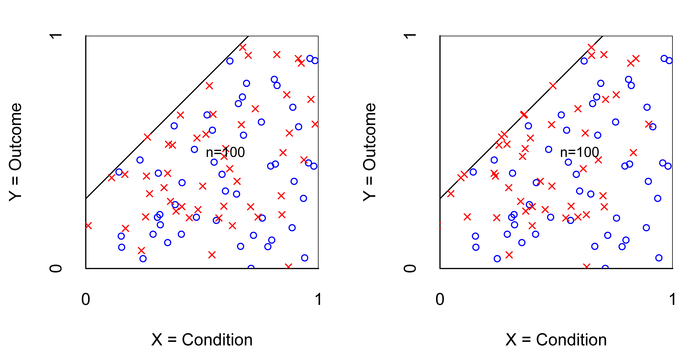
```


However, when cases enter the empty zone, the necessity is reduced (smaller effect size) or rejected (no empty space). Figure \@ref(fig:necessitybefaft1continuouscontinuoussmallerFIG)-right shows an example of a reduction of the necessity effect size from 0.25 to 0.15.


``` {r necessitybefaft1continuouscontinuoussmaller, message=FALSE, warning=FALSE, eval = FALSE, echo=FALSE, out.width='99%', fig.dim = c(9,5), fig.align = "center", fig.cap= "$XY$-plot of a necessity experiment with continuous conditions and outcome before (Left) and after (Right) manipulation (reducing $X$). Effect size reduces after manipulation. \\caseabsent{} = control group. × = treatment group.", cache=TRUE}
library (truncnorm)

#data
getRandomData <- function(N,
                          slope,
                          intercept,
                          type= "uniform"){
  
  collectXY<- function(x,y){ # helper function: sort x's and y's
    temp <- cbind(x, y)
    temp <- temp[order(temp[, 1]),] # sort data points on x values
    return(list(x = temp[, 1], y = temp[, 2]))
  }
  
  if (type == "uniform") {  
    uniformRandomData <- function(N, slope, intercept) {
      xdata <- ydata <- rep(NA, N)
      for (i in 1:N) {
        reject <- TRUE
        while (reject) { # check if is below line
          xtry <- runif(1,0,1);
          ytry <- runif(1,0,1)
          if (ytry <= min(1, (intercept + slope * xtry))) {
            reject<-FALSE
          }
        }
        ydata[i] <- ytry ;
        xdata[i] <- xtry
      }
      return(collectXY(xdata, ydata))
    }
  }
  
  if (type == "normal") {
    normalRandomData <- function(N, slope, intercept) {
      xdata <- ydata <- rep(NA, N)
      for (i in 1:N) {
        reject <- TRUE
        while (reject) { # check if is below line
          xtry <- rtruncnorm(1, a=0, b=1, mean = 0.5, sd = 0.2);
          ytry <- rtruncnorm(1, a=0, b=1, mean = 0.5, sd = 0.2)
          if (ytry <= min(1, (intercept + slope * xtry))) {
            reject<-FALSE
          }
        }
        ydata[i] <- ytry ;
        xdata[i] <- xtry
      }
      return(collectXY(xdata, ydata))
    }
  }
  
  
  if (type == "uniform") {
    return (uniformRandomData(N, slope, intercept) )
  }
  else if (type == "normal") {
    return (normalRandomData(N, slope, intercept))
  }
}


set.seed(123)

#safe pdf 
pdf = T
if (pdf) {
  pdf("Necessity-experiment continuous continuous smaller.pdf")
}

cex <- 0.8 #(or 1.2)
par(mar=c(5,5,4,1))
par(mfrow=c(1,2))
par(pty = "s")  # ensures square plot region regardless of device size

X = NULL
Y = NULL
#before manipulation
plot (X,Y, xlab="X = Condition", ylab="Y = Outcome", xlim = c(0,1), ylim=c(0,1), pch=19, cex=2, axes = F, yaxs="i", xaxs="i", type="n")
axis(1, at = c(0,0,1,1), pos=0, tck=0, labels=rep(c("0","0", "1", ""))) #X
axis(2, at = c(0,0,1,1), pos=0, tck=0, labels=rep(c("0","0", "1", ""))) #Y
abline(v=1, h = 1)
abline(0.3,1)

n  = 50 #per group: treatment and control
a = 0.3 #ceiling intercept
b = 1 #ceiling slope

df.control <- data.frame(getRandomData(n, b, a, "uniform"))
c2x.control <- df.control$x
c2y.control <- df.control$y

df.treatment <- data.frame(getRandomData(n, b, a,"uniform"))
c2x.treatment <- df.treatment$x
c2y.treatment <-df.treatment$y

points(c2x.control,c2y.control, pch=1, cex=cex, col = "blue")
points(c2x.treatment,c2y.treatment, pch=4, cex=cex, col = "red")
#text(c3x,c3y,"x", cex=cex, col = "green", pch = 1)

text(0.6,0.5,paste0("n=", 2*n), cex=cex)

#after manipulation
plot (X,Y, xlab="X = Condition", ylab="Y = Outcome", xlim = c(0,1), ylim=c(0,1), pch=19, cex=2, axes = F, yaxs="i", xaxs="i", type="n")
axis(1, at = c(0,0,1,1), pos=0, tck=0, labels=rep(c("0","0", "1", ""))) #X
axis(2, at = c(0,0,1,1), pos=0, tck=0, labels=rep(c("0","0", "1", ""))) #Y
abline(v=1, h = 1)
abline(0.3,1, lty = 3)

n  = 50 #per group: treatment and control
a = 0.3 #ceiling intercept
b = 1 #ceiling slope

df.treatment$xt <- df.treatment$x - 0.5* runif(n, 0, 1) # treatment: reduce x
c2x.treatment <- df.treatment$xt 
#c2x.treatment <- pmax(c2x.treatment, (c2y.treatment -a)/b)
points(c2x.control,c2y.control, pch=1, cex=cex, col = "blue")
points(c2x.treatment,c2y.treatment, pch=4, cex=cex, col = "red")
#text(c3x,c3y,"x", cex=cex, col = "green", pch = 1)

text(0.6,0.5,paste0("n=", 2*n), cex=cex)

#check new effect size
library(NCA)
model <- nca_analysis(df.treatment, 3, 2, ceilings = "c_lp") 
ceiling.slope <- nca_extract(model, 'xt', 'c_lp', 'Slope')
ceiling.intercept <- nca_extract(model, 'xt', 'c_lp', 'Intercept')
abline(ceiling.intercept,ceiling.slope, col = "black")
ES <- model$summaries$xt$params[2]
abline(ceiling.intercept,ceiling.slope)

```

``` {r necessitybefaft1continuouscontinuoussmallerFIG, message=FALSE, warning=FALSE, echo=FALSE, out.width='99%', fig.dim = c(9,5), fig.align = "center", fig.cap= "$XY$-plot of a necessity experiment with continuous conditions and outcome before (Left) and after (Right) manipulation (reducing $X$). Effect size reduces after manipulation. \\caseabsent{} = control group. × = treatment group.", cache=TRUE}
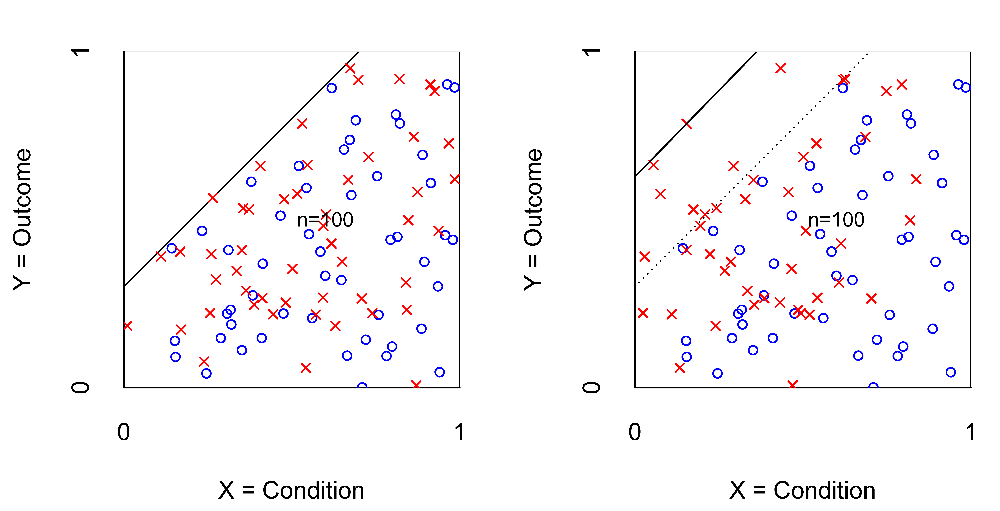
```


Figure \@ref(fig:necessitybefaft1continuouscontinuousrejectedFIG) displays an example of an experiment in which a necessity effect disappears after experimental manipulation. In such cases, the necessary condition should be rejected.

``` {r necessitybefaft1continuouscontinuousrejected, message=FALSE, warning=FALSE, echo=FALSE, eval = FALSE, out.width='99%', fig.dim = c(9,5), fig.align = "center", fig.cap= "$XY$-plot of an experiment to challenge necessity with continuous condition and outcome before (Left) and after (Right) manipulation of reducing $X$. Effect size disappears after manipulation. \\caseabsent{} = control group. × = treatment group.", cache=TRUE}

library(NCA)
library (truncnorm)
#data
getRandomData <- function(N,
                          slope,
                          intercept,
                          type= "uniform"){
  
  collectXY<- function(x,y){ # helper function: sort x's and y's
    temp <- cbind(x, y)
    temp <- temp[order(temp[, 1]),] # sort data points on x values
    return(list(x = temp[, 1], y = temp[, 2]))
  }
  
  if (type == "uniform") {  
    uniformRandomData <- function(N, slope, intercept) {
      xdata <- ydata <- rep(NA, N)
      for (i in 1:N) {
        reject <- TRUE
        while (reject) { # check if is below line
          xtry <- runif(1,0,1);
          ytry <- runif(1,0,1)
          if (ytry <= min(1, (intercept + slope * xtry))) {
            reject<-FALSE
          }
        }
        ydata[i] <- ytry ;
        xdata[i] <- xtry
      }
      return(collectXY(xdata, ydata))
    }
  }
  
  if (type == "normal") {
    normalRandomData <- function(N, slope, intercept) {
      xdata <- ydata <- rep(NA, N)
      for (i in 1:N) {
        reject <- TRUE
        while (reject) { # check if is below line
          xtry <- rtruncnorm(1, a=0, b=1, mean = 0.5, sd = 0.2);
          ytry <- rtruncnorm(1, a=0, b=1, mean = 0.5, sd = 0.2)
          if (ytry <= min(1, (intercept + slope * xtry))) {
            reject<-FALSE
          }
        }
        ydata[i] <- ytry ;
        xdata[i] <- xtry
      }
      return(collectXY(xdata, ydata))
    }
  }
  
  
  if (type == "uniform") {
    return (uniformRandomData(N, slope, intercept) )
  }
  else if (type == "normal") {
    return (normalRandomData(N, slope, intercept))
  }
}


set.seed(123)


#safe pdf 
pdf = T
if (pdf) {
  pdf("Necessity-experiment continuous continuous smaller rejected.pdf")
}

cex <- 0.8 #(or 1.2)
par(mar=c(5,5,4,1))
par(mfrow=c(1,2))
par(pty = "s")  # ensures square plot region regardless of device size

X = NULL
Y = NULL
#before manipulation
plot (X,Y, xlab="X = Condition", ylab="Y = Outcome", xlim = c(0,1), ylim=c(0,1), pch=19, cex=2, axes = F, yaxs="i", xaxs="i", type="n")
axis(1, at = c(0,0,1,1), pos=0, tck=0, labels=rep(c("0","0", "1", ""))) #X
axis(2, at = c(0,0,1,1), pos=0, tck=0, labels=rep(c("0","0", "1", ""))) #Y
abline(v=1, h = 1)
abline(0.3,1)

n  = 50 #per group: treatment and control
a = 0.3 #ceiling intercept
b = 1 #ceiling slope

df.control <- data.frame(getRandomData(n, b, a, "uniform"))
# df.control <- nca_random(n, a, b)
# colnames(df.control) <- c("x","y")
c2x.control <- df.control$x
c2y.control <- df.control$y

df.treatment <- data.frame(getRandomData(n, b, a,"uniform")) 
# df.treatment <- nca_random(n, a, b)
# colnames(df.treatment) <- c("x","y")
c2x.treatment <- df.treatment$x
c2y.treatment <-df.treatment$y

points(c2x.control,c2y.control, pch=1, cex=cex, col = "blue")
points(c2x.treatment,c2y.treatment, pch=4, cex=cex, col = "red")
#text(c3x,c3y,"x", cex=cex, col = "green", pch = 1)

text(0.6,0.5,paste0("n=", 2*n), cex=cex)

#after manipulation
plot (X,Y, xlab="X = Condition", ylab="Y = Outcome", xlim = c(0,1), ylim=c(0,1), pch=19, cex=2, axes = F, yaxs="i", xaxs="i", type="n")
axis(1, at = c(0,0,1,1), pos=0, tck=0, labels=rep(c("0","0", "1", ""))) #X
axis(2, at = c(0,0,1,1), pos=0, tck=0, labels=rep(c("0","0", "1", ""))) #Y
abline(v=1, h = 1)
abline(0.3,1, lty=3)

n  = 50 #per group: treatment and control
a = 0.3 #ceiling intercept
b = 1 #ceiling slope

df.treatment$xt <- df.treatment$x - 0.6* runif(n, 0, 1) # treatment: reduce x
c2x.treatment <- df.treatment$xt 
#c2x.treatment <- pmax(c2x.treatment, (c2y.treatment -a)/b)
points(c2x.control,c2y.control, pch=1, cex=cex, col = "blue")
points(c2x.treatment,c2y.treatment, pch=4, cex=cex, col = "red")
points(0.05,0.95, cex=cex, pch=4, col = "black") # add point in upper-left corner


text(0.6,0.5,paste0("n=", 2*n), cex=cex)

```

``` {r necessitybefaft1continuouscontinuousrejectedFIG, message=FALSE, warning=FALSE, echo=FALSE, out.width='99%', fig.dim = c(9,5), fig.align = "center", fig.cap= "$XY$-plot of an experiment to challenge necessity with continuous condition and outcome before (Left) and after (Right) manipulation of reducing $X$. Effect size disappears after manipulation. \\caseabsent{} = control group. × = treatment group.", cache=TRUE}
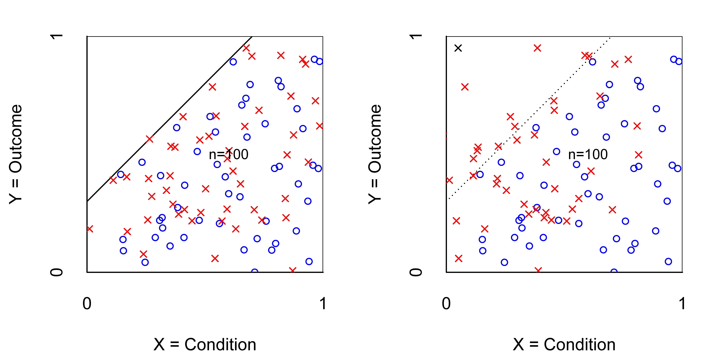
```

In situations with a poorly covered sample, before manipulation the necessary condition may not be visible as an empty space in the upper-left corner because only cases are selected where the conditions are satisfied. After manipulation, the new scope (empirical or theoretical) is extended and a hidden empty space becomes visible. (Figure  \@ref(fig:necessitybefaft1continuouscontinuousrareFIG)).


``` {r necessitybefaft1continuouscontinuousrare, warning=FALSE, echo=FALSE, eval=FALSE, out.width='99%', fig.dim = c(9,5), fig.align = "center", fig.cap= "$XY$-plot of a necessity experiment with a continuous condition and outcome before (Left) and after (Right) manipulation (reducing $X$). Effect size appears after manipulation. \\caseabsent{} = control group. × = treatment group.", cache=TRUE}
cex <- 0.8 #(or 1.2)
n  = 50 #per group: treatment and control


set.seed(123)

#safe pdf 
pdf = T
if (pdf) {
  pdf("Necessity-experiment continuous continuous rare rejected.pdf")
}

par(mar=c(5,5,4,1))
par(mfrow=c(1,2))
par(pty = "s")  # ensures square plot region regardless of device size

X = NULL
Y = NULL
#before manipulation
plot (X,Y, xlab="X = Condition", ylab="Y = Outcome", xlim = c(0,1), ylim=c(0,1), pch=19, cex=2, axes = F, yaxs="i", xaxs="i", type="n")
axis(1, at = c(0,0,1,1), pos=0, tck=0, labels=rep(c("0","0", "1", ""))) #X
axis(2, at = c(0,0,1,1), pos=0, tck=0, labels=rep(c("0","0", "1", ""))) #Y
abline(v=1, h = 1)
abline(0.3,1, lty=3)

#before manipulation

for (i in n) {
  c2x.control <- runif(n, 0.7, 1)
  c2y.control <- runif(n, 0, 1)
  c2x.treatment <- runif(n, 0.7,1)
  c2y.treatment <- runif(n, 0, 1)
  points(c2x.control,c2y.control, pch=1, cex=cex, col = "blue")
  points(c2x.treatment,c2y.treatment, pch=4, cex=cex, col = "red")
}
text(0.6,0.5,paste0("n=", 2*n), cex=cex)


library (truncnorm)
#data
getRandomData <- function(N,
                          slope,
                          intercept,
                          type= "uniform"){
  
  collectXY<- function(x,y){ # helper function: sort x's and y's
    temp <- cbind(x, y)
    temp <- temp[order(temp[, 1]),] # sort data points on x values
    return(list(x = temp[, 1], y = temp[, 2]))
  }
  
  if (type == "uniform") {  
    uniformRandomData <- function(N, slope, intercept) {
      xdata <- ydata <- rep(NA, N)
      for (i in 1:N) {
        reject <- TRUE
        while (reject) { # check if is below line
          xtry <- runif(1,0,1);
          ytry <- runif(1,0,1)
          if (ytry <= min(1, (intercept + slope * xtry))) {
            reject<-FALSE
          }
        }
        ydata[i] <- ytry ;
        xdata[i] <- xtry
      }
      return(collectXY(xdata, ydata))
    }
  }
  
  if (type == "normal") {
    normalRandomData <- function(N, slope, intercept) {
      xdata <- ydata <- rep(NA, N)
      for (i in 1:N) {
        reject <- TRUE
        while (reject) { # check if is below line
          xtry <- rtruncnorm(1, a=0, b=1, mean = 0.5, sd = 0.2);
          ytry <- rtruncnorm(1, a=0, b=1, mean = 0.5, sd = 0.2)
          if (ytry <= min(1, (intercept + slope * xtry))) {
            reject<-FALSE
          }
        }
        ydata[i] <- ytry ;
        xdata[i] <- xtry
      }
      return(collectXY(xdata, ydata))
    }
  }
  
  
  if (type == "uniform") {
    return (uniformRandomData(N, slope, intercept) )
  }
  else if (type == "normal") {
    return (normalRandomData(N, slope, intercept))
  }
}

#after manipulation
plot (X,Y, xlab="X = Condition", ylab="Y = Outcome", xlim = c(0,1), ylim=c(0,1), pch=19, cex=2, axes = F, yaxs="i", xaxs="i", type="n")
axis(1, at = c(0,0,1,1), pos=0, tck=0, labels=rep(c("0","0", "1", ""))) #X
axis(2, at = c(0,0,1,1), pos=0, tck=0, labels=rep(c("0","0", "1", ""))) #Y
abline(v=1, h = 1)
abline(0.3,1)

a = 0.3
b = 1
c2x.treatment <- c2x.treatment - 0.5* runif(n, 0, 1) # treatment: reduce x
c2x.treatment <- pmax(c2x.treatment, (c2y.treatment -a)/b)
points(c2x.control,c2y.control, pch=1, cex=cex, col = "blue")
points(c2x.treatment,c2y.treatment, pch=4, cex=cex, col = "red")

text(0.6,0.5,paste0("n=", 2*n), cex=cex)

```

``` {r necessitybefaft1continuouscontinuousrareFIG, warning=FALSE, echo=FALSE, out.width='99%', fig.dim = c(9,5), fig.align = "center", fig.cap= "$XY$-plot of a necessity experiment with a continuous condition and outcome before (Left) and after (Right) manipulation (reducing $X$). Effect size appears after manipulation. \\caseabsent{} = control group. × = treatment group.", cache=TRUE}
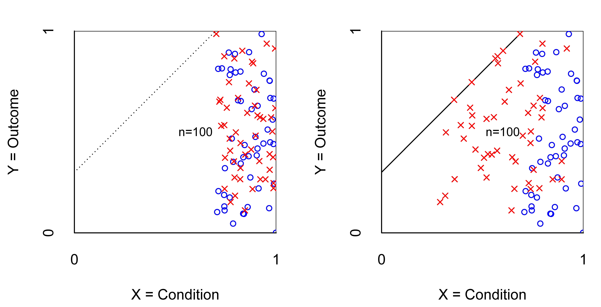
```

## Sampling and selection of cases {#samplingandselection} 

After the choice of the type of study design, cases must be obtained from the theoretical domain where the necessity hypothesis is supposed to hold. The cases are used to test the hypothesis. In general it is a good strategy to select as many cases as possible. However, necessity theory may be broadly applicable in the theoretical domain consisting of many cases. If not all cases can be selected, a thoughtful selection must be done. NCA offers two types of case selection: large-n sampling for a quantitative study and  small-n case selection for a qualitative study. 

### Large-n sampling {#largensampling}
The goal of large-n sampling for a quantitative NCA study is to have a sample that is representative of a defined population from the theoretical domain. Usually, different populations where the cases have some relevant common characteristic (e.g., from the same country) could be selected. Since the theoretical domain may not be homogeneous, different populations could have different effect sizes, although the hypothesis claims that overall necessity exists for all cases.  The selection of the population itself is not guided by statistical principles and can often be done for convenience. However, after the population is selected from the theoretical domain, *random sampling* of a large sample helps to ensure that the population is well-covered in the sample and that findings based on the sample can be statistically generalized to the population (inferential statistics). A possible approach to achieve this is to have a sampling frame (list of cases) of the population and to select cases randomly from this list. This ideal sampling approach contrasts with the more common approach of *convenience sampling* where cases are selected from the population for the analyst's convenience, for example because the analyst has easy access to the cases. With such a sampling procedure, the sample may not be representative of the population, which can lead to biased effect size estimates and invalid $p$-values. The decision on the size of the sample depends on available resources and other practical factors. The minimum required sample size can be guided by the expected power of the study. Power refers to the minimum required sample size such that an existing relevant necessity effect size can be detected with high probability (Section \@ref(statisticspower)).

### Small-n case selection {#smallncaseselection}
It is possible to test a necessity hypothesis with a small number of cases, even with one case [e.g., @dul2008case]. In qualitative studies, usually a small number of cases is selected with a certain purpose in mind.^[For example *typical cases* that represent a wider population of cases, *deviant cases* that are unusual, or  *maximum variation cases* to ensure maximum variation of a certain characteristic.] For testing a necessity hypothesis, the purpose of sampling is to have cases where the outcome is present ($Y = 1$) or the condition is absent ($X = 0$). After selecting such cases, it is observed if the condition is present ($X = 1$) or the outcome is absent ($Y = 0$), respectively. If the condition is absent in cases where the outcome is present, or the outcome is present in cases where the condition is absent, the necessary condition hypothesis is rejected for these cases. This type of purposive sampling in small-n studies is possible with a deterministic view on necessity (no exceptions) and when the conditions and the outcome have dichotomous scores (e.g., absent/present, low/high). Since according to the hypothesis necessity applies to each single case in the theoretical domain, a single case can be selected for the test. If necessity is rejected in that single case, the deterministic version of the necessity hypothesis is rejected. However, support for necessity based on only one or a few cases is often not convincing for a conclusion about the entire theoretical domain. Other cases that falsify the necessary condition hypothesis may not have been selected. Following replication logic, the confidence in a hypothesis increases when more cases do not falsify the hypothesis.

Purposive selection of cases for testing a necessity hypothesis was used implicitly in a study by @fujita2020denial of highly controversial visits by Japanese Prime Ministers (PM’s) to the Yasukuni Shrine. Three necessary conditions were expected:  a conservative ruling party, a government enjoying high popularity, and Japan’s perception of a Chinese threat. They tested these hypotheses by selecting all five cases where the outcome was present ($Y = 1$, PM’s who visited the shrine) from all 22 cabinets between 1986 and 2014. They found that the three conditions were present in all cases ($X = 1$) suggesting support for necessity, at least no rejection. Additionally, they selected the 17 cases where at least one potential necessary condition was absent ($X = 0$) and found that in these cases no visit occurred ($Y = 0$), giving further support for necessity. 

In another small-n qualitative study, @harding2002studying studied rampage school shootings in the USA. They first identified five potential necessary conditions: gun availability, cultural script (a model why the shooting solves a problem), perceived marginal social position, personal trauma, and failure of a social support system.^[They identified these five potential necessary conditions not by using existing knowledge (Section \@ref(hypothesistesting)) but by first conducting an inductive case study. The authors selected two cases where the outcome was present (school shooting) and observed common factors. The two cases were different from the cases used for testing the hypothesis. Identifying "important" factors in this way has a long tradition in explorative and theory-building case study designs. For example, @znaniecki1934method introduced ‘analytic induction’ for finding causal relationships. This method identifies common characteristics in cases where the outcome is present, thus identifies potential necessary conditions [@robinson1951logical; @katz2001analytic].] Subsequently, they tested the necessary conditions with two cases of school shooting ($Y = 1$) and found support for necessity (non-rejection) because the five conditions were present in these cases ($X = 1$).

Note that this approach of selecting a small number of cases for testing a necessity hypothesis is used in Chapter \@ref(hypothesisformulation) as part of thought experiments to evaluate a preliminary necessity hypothesis based on existing knowledge (Section \@ref(thoughtexperiments)).

### Replication 
Since the necessity hypothesis is assumed to hold for all cases in the entire theoretical domain and the samples or selected cases that are used for testing the hypothesis are only a subset of the theoretical domain, replication studies with other cases are needed. Replication is re-testing the hypothesis with new data [@kohler2023constructive]. A single shot study is not conclusive about a hypothesis in the entire theoretical domain. A next study should select cases from other parts of the theoretical domain, i.e. other samples from the sample population and samples from other populations for large-n sampling, or other cases for small-n case selection. Although a hypothesis can never be proven correct, the confidence in its correctness increases if repeated tests with different samples/cases fail to falsify the hypothesis.   

## Measurement {#measurement}
After the cases are sampled/selected, the $X$ and $Y$ characteristics of each case must be measured. In NCA the scores are often numeric (numbers, quantitative data) but also words or letters (qualitative data) can be used to represent levels of concepts (e.g., high or low). The goal of measurement is to obtain valid and reliable scores of the concepts $X$ (the conditions) and $Y$ (the outcome) that are defined in the necessity hypothesis. Scores are valid when they represent the value of a concept (measuring what you want to measure) and reliable when they are consistent under identical circumstances.

<!-- NCA is versatile regarding the type of scores to be used as input for the analysis. NCA can use (quantitative) variable scores, aggregated scores (e.g., latent concept scores), set membership scores (e.g.,  as used in QCA), and qualitative scores (e.g., "low", "high"). The only requirement is that the scores are valid and reliable. NCA does not pose new requirements on data or measurement. -->

### Quantitative data {#quantitativedata}
<!-- ## <span style="color: #D3D3D3">Quantitative data</span> {#quantitative} -->
<!-- <!--- ### \textcolor{gray}{Quantitative data}-->
<!-- under construction -->
Quantitative data are data expressed by numbers where the numbers are scores (values or levels) with a meaningful order and meaningful distance. Scores can have two levels (dichotomous, e.g., 0 and 1 ), a finite number of levels (discrete, e.g., 1,2,3,4,5) or an infinite number of levels (continuous, e.g., 1.8,  9.546, 306.22).

NCA can be used with any type of quantitative data. 
It is possible that a *single indicator*  represents an $X$ or $Y$ concept. Then this indicator score is used to score the concept. For example, in a questionnaire study where a subject or informant is asked to score conditions and outcomes with seven-point Likert scales, the scores are one of seven possible (discrete) scores. 

It is also possible that a *construct* that is built from several indicators is used to represent the concept of interest. Separate indicator scores are then summed, averaged or otherwise combined (aggregated), for example for scoring a formative index. It is also possible to combine several indicator scores statistically, for example by using the factor scores resulting from factor analysis, or construct scores of latent variables resulting from a measurement model.

<!-- Quantitative data can be analysed with NCA's 'scatter plot approach' and with ````NCA```'s software for ```R```. When the number of variable levels is small  (e.g., less than 5) it is also possible to use NCA's contingency table approach.   -->
<!-- ### <span style="color: #D3D3D3">Single indicators</span>  -->
<!-- <!---#### \textcolor{gray}{Single indicators}-->
<!-- under construction -->
<!-- ### <span style="color: #D3D3D3">Constructs</span>  -->
<!-- <!---#### \textcolor{gray}{Constructs}-->
<!-- under construction -->

### Qualitative data {#qualitativedata}

 <!-- In quantitative studies NCA uses quantitative data (numbers), in qualitative studies NCA uses qualitative data (letters, words or numbers without a quantitative meaning), and is set theoretical studies (like Qualitative Comparative Analysis-QCA) NCA uses set membership scores. NCA can use any type of data. For example, NCA can handle new or archival data and can handle indicator (item) scores or aggregated scores (e.g, latent variables).  -->
<!-- the experiment (section \@ref(experiment)), sample size (section \@ref(samplesize)), -->
<!-- , and how to handle outliers (section \@ref(outliers)).  -->


<!-- ## Sample size {#samplesize}  -->
<!-- A frequently asked question is "What is the required sample size for NCA". The short answer is: "The more the better, but at least n  1". This is explained below. -->


Qualitative data are data expressed by names, letters or numbers without a quantitative meaning. For example, gender can be expressed with names (male, female, other), letters (m, f, o) or numbers (1, 2, 3). Qualitative data are discrete and usually have no order between the scores (e.g., names of people) or if there is an order, the distances between the scores are unspecified (e.g., low, medium, high). Although with qualitative data a quantitative NCA (with the `NCA` software for R) is not possible, it is still possible to apply NCA in a qualitative way using visual inspection of the $XY$-table or plot. 

When $X$ and $Y$ of cases are scored qualitatively, for example $X$ = A,B, or C, and $Y$ = no or yes,  the corresponding $XY$-table has 6 cells where a case has a position in one of the cells. The hypothesis may be that B is necessary for yes. The analyst can inspect which $X$-score can reach that $Y$-score. When the logical order of the condition is absent, the position of the empty space can be in any upper cell (left corner, middle or right; assuming the hypotheses that high $X$ is necessary for high $Y$). When a logical order exists between the qualitative $X$-scores, the empty space is in the upper-left corner. In both cases the size of the empty space is arbitrary and no meaningful effect size can be calculated. However, when $Y$ is quantitative, the distance between the highest observed $Y$-score and the next-highest observed $Y$ score could be an indication of the constraint of $X$ on $Y$.  
<!---currenlty less than 0.1 seconds. The effect size itself cannot be calculated because the values of $X$ and therefore the values of the empty space are meaningless.-->

### Set membership data {#setmembership}
NCA can be used with set membership scores. This is often done when NCA is combined with QCA (Section \@ref(ncaqca)). In QCA 'raw' variable scores are 'calibrated' into set membership scores with values between 0 and 1. A set membership score indicates to what extent a case belongs to the set of cases that have a given characteristic. In crisp set QCA the scores are dichotomous (0 or 1), and in fuzzy set QCA the scores are discrete or continuous between 0 and 1. 

<!-- Several studies have been published that use NCA with set membership data [e.g., @torres2021levels]. These studies combine NCA with QCA for gaining additional insights (in degree) about the conditions that must be present in all sufficient configurations. -->
<!-- Section \@ref(ncaqca) discusses how NCA can be combined with QCA -->

## Dataset
After the measurements are done, the $X$- and $Y$-scores are integrated into a dataset. An appropriate format is having cases as rows and conditions and outcome as columns, where the first row (header) consists of the names of the conditions and outcome, and the first column the names of the cases.

Table \@ref(tab:dataset) shows the dataset of the example used in Chapter \@ref(dataanalysis) that is part of the ```NCA``` software. 


```{r dataset, echo=FALSE, warning=FALSE, message=FALSE}
library(NCA)
data(nca.example)
#rownames(nca.example) <- seq_len(nrow(nca.example))

library(knitr)
library(kableExtra)

is_latex <- knitr::is_latex_output()
cap <- if (is_latex) {
  #"Example dataset (from: \\citealp{van2016contracts})."
    "An example dataset that is part of the NCA software in R."
} else {
  #"Example dataset [from: @van2016contracts]."
     "Example dataset nca.example from the NCA software in R."
}

fmt <- if (is_latex) "latex" else "html"

tab <- kbl(
  nca.example,
  #format = "latex", # change if needed
  longtable = FALSE, # FALSE prevents the table splits over pages in pdf
  linesep = "", # This removes the space after 5th row if bookdtabs = TRUE
  escape = FALSE, # Prevent escaping of LaTeX special characters
  booktabs = is_latex,
  #longtable = is_latex,
  row.names = TRUE,
  #col.names = colnames(nca.example2),
  #align = c("c", "c", "c", "c"),
    align = c("c", "c", "c"),
  caption = cap
)
 
if (is_latex) {
  tab <- tab %>% kable_styling(full_width = FALSE, latex_options = "HOLD_position")
} else {
  tab <- tab %>% kable_styling(full_width = FALSE, bootstrap_options = c("striped","hover"))
}

tab

```

### Archival data {#archivaldata}
NCA needs a dataset with $X$- and $Y$-values as input to empirically test the hypothesis that $X$ is necessary for $Y$. Often, new data on $X$ and $Y$ are gathered for conducting such a test. This requires a decision about the study design, the sampling/selection of cases, and the measurement of $X$ and $Y$. The quality of NCA depends on the quality of conducting these steps. However, it is also possible that an existing dataset is used. It may be that data on $X$ and $Y$ have already been tested for other purposes in previous studies. For example, a large number of datasets have been used with the goal of testing probabilistic sufficiency relationships (e.g., average effect of $X$ on $Y$ using regression analysis). If existing datasets contain $X$- and $Y$-scores of cases that are part of the theoretical domain, and if study design, sampling/case selection and measurement meet the quality criteria, the datasets from earlier studies may be useful for testing the necessity hypothesis. Given the trends towards open science, relevant datasets for testing necessity hypotheses are available, for example the World Bank dataset used in Section \@ref(longitudinal).When using archival data, the origins of the data should be evaluated and acknowledged, possible adaptations of $X$- and $Y$-scores should be justified and reported, and relevant earlier studies that use the same data should be evaluated and referenced to ensure accumulation of knowledge [@dul2024advancing]. In a multimethod study that combines NCA with other methods (Chapter \@ref(multimethodstudies)), data that were collected for the other method may be re-used for NCA.

### Data transformation {#transformation}
In quantitative (statistical) studies, data are often transformed before the actual analysis is done. For example, in machine learning, cluster analysis and multiple regression analysis, data are often standardized. The sample mean is subtracted from the original score and divided by the sample standard deviation to obtain the *z-score*: $X_{new} = (X — X_{mean}) / SD$. This allows, for example, a comparison of the regression coefficients of the variables, independently of the variable scale. Min-max normalization is another type of data transformation: $X_{new} = (X — X_{min}) / (X_{max} — X_{min})$. Such normalized variables have scores between 0 and 1. Transforming original scores into z-scores or min-max normalized scores are both examples of a *linear* transformation. 

In principle, NCA does not need data transformation. The effect size is already normalized between 0 and 1 and allows comparison of effect sizes of different variables. Also, NCA does not make assumptions about the distribution of the data. Furthermore, interpretation of the results with original data is often easier than the interpretation of the results with transformed data as the original data may have a more direct meaning than the transformed data.  If, nevertheless, the analyst wishes to transform data, a linear transformation (or in general an affine transformation) does not affect NCA's estimation of the effect size or the $p$-value (Appendix \@ref(appendixd)). 

However a *non-linear* data transformation as is often done in quantitative (statistical) studies affects NCA's estimation of effect size and $p$-value and  is normally not acceptable for NCA. The transformation may change the cases that are used to establish the ceiling line, and this will affect the effect size. This can happen, for example, when data with a skewed distributed are log-transformed to obtain more normally distributed data. This is relevant when a statistical approach assumes normally distributed data, but this is not a requirement in NCA. Calibration in QCA is another example of a non-linear transformation. Original variable scores ('raw scores') are transformed into set membership scores, often using a logistic function ('s-curve'). Calibration is needed in QCA as a set-theoretic method, but not in NCA, that can also handle raw scores.

Non-linear transformations should be avoided in NCA, unless there is a good reason for it. Such a good reason can be that a non-linear transformed original score is the valid representation of the concept of interest ($X$ or $Y$ in the necessity hypothesis). For example, the concept of a country's economic prosperity  may be expressed as the log-transformed GDP (Section \@ref(pooled)). In QCA, the calibration process can justify the non-linear transformation of the original data. However, the general advice is to refrain from non-linear data transformation when the original data represent the concepts of interest, and only to transform data non-linearly when this is needed to validly capture the concept of interest.

<!-- #### Linear transformation -->

<!-- 333333333333333 -->
<!-- NCA allows that scores are linearly transformed for convenience (min-max normalization such as 0-1 or 0-100% or standardization with mean = 0 and sd = 1). Non-linear  -->
<!-- ation and can be applied with new data or archival data. -->
<!-- 33333333333333333333 -->

<!-- A linear data transformation does not affect the results of NCA. This is shown in the following example: -->

<!-- ```{r, echo=T, warning=F, message = F, cache=TRUE, results='hide', eval=FALSE} -->
<!-- library(NCA) -->
<!-- library(dplyr) -->

<!-- #original data -->
<!-- data (nca.example) -->
<!-- data <- nca.example -->

<!-- #linear: standardized data (z scores) -->
<!-- datas <- data %>% mutate_all(~(scale(.) %>% as.vector)) -->

<!-- #linear: min-max normalized data (0,1; scope) -->
<!-- minMax <- function(x) {(x - min(x)) / (max(x) - min(x))} -->
<!-- datan <- as.data.frame(lapply(data, minMax)) -->

<!-- #conduct NCA  with original data -->
<!-- model <- nca_analysis(data, -->
<!--                       1,3, -->
<!--                       test.rep = 10000, -->
<!--                       ceilings = 'ce_fdh')  -->
<!-- #conduct NCA  with standardized data -->
<!-- models <- nca_analysis(datas, -->
<!--                        1,3, -->
<!--                        test.rep = 10000, -->
<!--                        ceilings = 'ce_fdh') -->
<!-- #conduct NCA  with normalized data -->
<!-- modeln <- nca_analysis(datan, -->
<!--                        1,3, -->
<!--                        test.rep = 10000, -->
<!--                        ceilings = 'ce_fdh') -->
<!-- model -->
<!-- models -->
<!-- modeln -->
<!-- ``` -->
<!-- <br> -->

<!-- The results of the analysis with the original data, the linear standardized data and the linear normalized data are exactly the same: effect size = 0.42 and $p$-value = 0.080. -->

<!-- Linear transformation does not effect the estimations of the effect size and the $p$-value. Interpretation of the results with *original* data is often easier than the interpretation of the results with transformed data. The original data may have a more direct meaning than the transformed data. -->

<!-- #### Non-linear transformation -->

<!-- In contrast with linear transformations, non-linear transformations will change the effect size and $p$-value, as shown in this example:  -->

<!-- ```{r, echo=TRUE, warning=FALSE, message = FALSE, cache=TRUE, results='hide', eval=FALSE} -->
<!-- library(NCA) -->
<!-- library(QCA) -->

<!-- #original data -->
<!-- data (nca.example) -->
<!-- data <- nca.example -->

<!-- #non-linear transformation: log -->
<!-- datal <- log(data) -->

<!-- #non-linear transformation:  -->
<!-- #calibrated set membership scores (logistic function) -->
<!-- #example thresholds -->
<!-- thx1 <- quantile(data[,1], c(0.10,0.50,0.90)) -->
<!-- thx2 <- quantile(data[,2], c(0.10,0.50,0.90)) -->
<!-- thy <- quantile(data[,3], c(0.10,0.50,0.90)) -->
<!-- x1T <- calibrate(data[,1], -->
<!--                  type="fuzzy", -->
<!--                  thresholds= c(thx1[1], thx1[2], thx1[3]), -->
<!--                  logistic = TRUE, -->
<!--                  idm = 0.953) -->
<!-- x2T <- calibrate(data[,2], -->
<!--                  type="fuzzy", -->
<!--                  thresholds = c(thx2[1], thx2[2], thx2[3]), -->
<!--                  logistic = TRUE, -->
<!--                  idm = 0.953) -->
<!-- yT <- calibrate(data[,3], -->
<!--                 type="fuzzy", -->
<!--                 thresholds = c(thy[1], thy[2], thy[3]), -->
<!--                 logistic = TRUE, -->
<!--                 idm = 0.953) -->
<!-- datac <- cbind (x1T,x2T,yT) -->
<!-- rownames(datac) <- rownames(data) -->
<!-- colnames(datac) <- colnames(data) -->
<!-- datac <- as.data.frame(datac) -->

<!-- #conduct NCA -->
<!-- #conduct NCA  with original data -->
<!-- model <- nca_analysis(data,  -->
<!--                       1,3, -->
<!--                       test.rep = 10000, -->
<!--                       ceilings = 'ce_fdh')  -->
<!-- #conduct NCA  with log transformed data -->
<!-- modell <- nca_analysis(datal, -->
<!--                        1,3, -->
<!--                        test.rep = 10000, -->
<!--                        ceilings = 'ce_fdh') -->
<!-- #conduct NCA  with calibrated data -->
<!-- modelc <- nca_analysis(datac, -->
<!--                        1,3, -->
<!--                        test.rep = 10000, -->
<!--                        ceilings = 'ce_fdh') -->
<!-- model -->
<!-- modell -->
<!-- modelc -->
<!-- ``` -->
<!-- <br> -->
<!-- The results of the analysis with the original data are again: effect size = 0.42 and $p$-value = 0.080. However, the results with non-linear log transformed data are: effect size = 0.20 and $p$-value = 0.275 and the results with with non- linear calibrated data are: effect size = 0.11 and $p$-value = 0.094. -->

<!-- Non-linear transformations affect the estimations of the effect size and the $p$-value. Non-linear transformations should be avoided in NCA, unless there is a good reason for it. A non-linear transformed original score can be a valid representation of the concept of interest (the $X$ or $Y$ in the necessity hypothesis). For example, the concept of a country's economic prosperity can be expressed by log(GDP). In this case a log transformation of GDP data is justified (e.g., see section \@ref(pooled)). Also in QCA data are often non-linearly transformed to obtain calibrated scores from the original scores.  -->

<!-- The general advice is to refrain from non-linear data transformation when the original data represent the concepts of interest, and only to transform data non-linearly when this is needed to validly capture the concept of interest. -->


<!--chapter:end:080-dataJO.Rmd-->

---
output:
  pdf_document: default
  html_document: default
---

<!-- Aanzetten rood = zwart DO NOT USE MESSAGE=FALSE-->
<!-- ```{=latex} -->
<!-- \begingroup -->
<!-- \colorlet{red}{black} -->
<!-- ``` -->

<!-- Alternative   -->
```{r include=FALSE}
knitr::opts_chunk$set(highlight = FALSE)
```


# Data analysis {#dataanalysis}

<!-- \textcolor{red}{change 13 into 10000} -->

## Summary of this chapter
In the previous chapters, the formal hypothesis was developed (Chapter \@ref(hypothesisformulation)) and the dataset with scores of condition(s) $X$ and outcome $Y$ became available (Chapter \@ref(datacollection)). This chapter focuses on testing the hypothesis quantitatively by analyzing the data using the ```NCA``` software in ```R```. First, the example that is used to illustrate the analysis is presented (Section \@ref(illustrativeexample)). After the hypotheses are formulated, the steps for testing them with the data are: (1) Model specification (Section \@ref(modelspecification)); (2) Selection of model evaluation criteria (Section \@ref(selectionevaluationcriteria)); (3) Visual inspection of the $XY$-plot (Section \@ref(visualinspection)); (4) Ceiling line estimation (Section \@ref(ceilinglineestimation)); (5) Effect size and $p$-value estimation (Section \@ref(effectsizeestimation)); (6) Outlier analysis (Section \@ref(outliers)); (7) Model fit metrics calculation (Section \@ref(modelfit2)); (8) Necessity-in-kind decision (Section \@ref(necessityinkind)); (9) Bottleneck analysis for necessity-in-degree (Section \@ref(bottleneck)); (10) Robustness checks to evaluate the sensitivity of the findings for choices made in steps (1) and (2) (Section \@ref(robustnesschecks)).

## Illustrative example {#illustrativeexample}

In this chapter, the elements of NCA's data analysis are illustrated with the example called `nca.example` that is part of the ```NCA``` software (Appendix \@ref(appendixb)). Before any data analysis with NCA can start, a *formal* necessity hypothesis (Chapter \@ref(hypothesisformulation)) and an adequate dataset (Chapter \@ref(datacollection)) must be available. 

The  *formal necessity hypothesis*  for the illustrative example is as follows:

- *Hypothesis*: Individualism is necessary for Innovation performance (high-high).

- *Focal unit* = Country.

- *Concept $X$* = Individualism: the extent to which a country's people feel independent, as opposed to being interdependent as members of larger wholes.

- *Concept $Y$* = Innovation: the country's transformation of knowledge into new products, processes, and services.

- *Theoretical domain* = All countries in the world.

- *Causal explanation* = (Summary) Enabler: In highly individualistic societies, individuals have greater freedom to experiment and propose disruptive ideas, which contributes to producing innovative products and services. Constraint: Without enough individualism, potential innovators lack the autonomy and psychological safety to transform ideas into innovations, such that high levels of a country's innovation are not achievable. No substitute: R&D infrastructure, financial resources, or government policies or other known contributing factors to innovation cannot compensate for the absence of an individualistic mindset. Temporal aspects: Individualism must be present before innovation is possible, must stay present to maintain innovation and is needed in all time periods.

The example's *data* consists of archival data (Section \@ref(archivaldata)), collected from two different sources. Data on cultural dimensions were obtained from @Hofstede1980CulturesConsequences's country cultures study. The value for a country's Risk taking was obtained by subtracting the country's Uncertainty avoidance from 135. Data on Innovation performance are from a study by @gans2003assessing on innovation differences between countries. Both studies are large-n observational studies. By combining the datasets, a convenience sample of 28 countries with information on the three variables was obtained. Scores for the cultural variables are aggregated questionnaire item scores [for details see @Hofstede1980CulturesConsequences]. Scores for Innovation performance equal the country's innovation index [@gans2003assessing]. 
The data and how they were obtained have the following characteristics: 

- *Study design* = observational study.

- *Sampling* = convenience sampling (two different sources); n = 28 countries.

- *Measurement* = Individualism by questionnaires; Innovation performance by document analysis.

- *Dataset* = ```nca.example``` (part of the ```NCA``` software for ```R```).


## Model specification  {#modelspecification}
NCA's model specification consists of specifying the bounding box and the ceiling line (Section \@ref(formalexpression)). 

### Bounding box specification {#scopespecification}
NCA assumes that $X$ and $Y$ are bounded variables $(x_{min}, x_{max}, y_{min}, y_{max})$ (Section \@ref(formalexpression)). The bounds define the bounding box where observations could be possible given the extreme values of $X$ and $Y$. Two types of bounding boxes can be distinguished.
<!-- This area is also called the *scope*.^[Note that depending on the context, *scope* may have two meanings: the *bounding rectangle* itself [xmin,xmax] × [ymin,ymax] or the *area* of the bounding rectangle.]  Two options for specifying the scope are available.  -->

The bounding box with a *theoretical scope* is defined by theoretical bounds of $X$ and $Y$.^[The scope is the area of the bounding box.] It may be that theoretical limits exist, such as for human body temperature $(27^\circ{C} \le T \le 44^\circ{C}$). The theoretical bounds may be known or approximated (e.g., from previous empirical studies). It is also possible that $X$ and $Y$ are measured on scales with known minimum and maximum values, such as Likert scales or percentage scales.

The bounding box with an *empirical scope* is defined by the minimum and maximum values of $X$ and $Y$ that are observed (in the dataset). This option is often selected when theoretical bounds are unknown. It can also be selected to avoid overestimation of the effect size. In a situation where groups of similar cases are compared (e.g., measured at different time points in a longitudinal study), the observed minimum and maximum values of the pooled dataset may be selected as the theoretical scope of each single group for comparability (Section \@ref(timetrends)).

In the illustrative example, the empirical scope is selected. The scales used for collecting the data do not have minimum and maximum values and no strong theoretical rationale exists for selecting other extreme values for $X$ and $Y$ than those observed in the dataset.

### Ceiling line specification {#ceilinglinespecification}
Specifying the ceiling line involves choosing the *location* (relative to an empty corner) and the *form*. 

The *location* depends on the direction of the hypothesis (Section \@ref(direction)), which defines the *expected empty corner*. The proposed hypothesis of the illustrative example is a high-high hypothesis where presence/high value of $X$ is necessary for presence/high value of $Y$. Therefore, the expected empty corner is the upper-left corner of the $XY$-plot (corner 1).
<!-- ^[For a low-high hypothesis (the absence/low value of $X$ is necessary for the presence/high value of $Y$) the expected empty corner is the upper-right corner (corner 2), etc.] -->

Next to the location, also the *form* of the ceiling line needs to be specified (Sections \@ref(mathceiling) and \@ref(mathematicalestimation)). NCA assumes that the ceiling line is non-decreasing. A *linear* ceiling line (e.g., CR-FDH or C-LP) may be specified when the border between the area with and without cases is theoretically assumed to be linear, which is the most common assumption. The CR-FDH ceiling allows some noise above the ceiling such that the ceiling zone is not perfectly empty near the ceiling line (see model fit metric *noise*, Section \@ref(purity)). This line may be selected when noise exists in the data such as measurement error. The C-LP line may be selected when the data are obtained from high-quality measurement approaches, or are perfect as for example in simulated data. This line may also be selected to ensure that the linear ceiling line has no cases in the ceiling zone. The default CR-FDH ceiling is often selected when the condition and outcome have many levels (e.g., are continuous).

For modeling purposes, a linear ceiling line may be attractive (Sections \@ref(mathlinear) and \@ref(effectlinear)). For a given bounding box, it requires only two parameters such as ceiling intercept and ceiling slope. These parameters may be theoretically decided (e.g., based on earlier data or other knowledge) or empirically estimated with the data. The latter is most commonly used.^[Note that in fsQCA the 'ceiling line' is always predefined as the diagonal of the bounding box $[0,1]×[0,1]$, with ceiling intercept = 0 and ceiling slope = 1. In NCA it is also possible to pre-define the ceiling line. This option is integrated in NCA's software package for ```R``` from version 5.0.0.] Although estimation of a ceiling line and effect size are not needed when the ceiling line and scope are predefined, the other steps of the data analysis are still relevant.  

A *segmented linear* (non-decreasing) ceiling line (e.g., CE-FDH or CE-VRS) may be specified when the border is non-linear (but non-decreasing). The CE-FDH ceiling is a piecewise linear function where peers (dominant points) are connected by line segments (Sections \@ref(mathcefdh) and \@ref(effectcefdh)). CE-FDH is a stepwise linear ceiling line that connects peers with horizontal and vertical line segments. The CE-VRS is a concave piecewise linear ceiling with linear segments that connect a selection of the CE-FDH peers such that the ceiling is concave (Sections \@ref(mathcevrs) and \@ref(effectcevrs)). When estimated from data, both lines do not have points in the ceiling zone. CE-FDH may also be selected when the condition or outcome have few levels (e.g., are discrete) or when the ceiling line is irregular or non-linear. When the non-linearity is concave, the CE-VRS line may be an option. The default segmented ceiling line is CE-FDH.

For modeling purposes, a piecewise linear ceiling line may be attractive for an irregular border between feasible area and ceiling zone because it can better follow the non-linearity (though non-decreasing) of the border than a linear ceiling line. It is less attractive when the number of line segments is large. This requires a large number of parameters to specify the model, which makes the model complex (see the model fit metric *complexity* Section \@ref(complexity)) and has the risk of overfitting (Section \@ref(complexity2)).  
<!-- A chain of $k$ linear segments must be described by k - 2  Each segment is determined the ceiling intercept ($a_c$) and the ceiling slope ($b_c$). These parameters can be theoretically determined or estimated with the data.  -->
<!-- Xnodig hierna? -->
<!-- The two default ceiling lines are linear (straight line CR-FDH) and piece-wise linear (step function CE-FDH) serve most study goals. The analyst usually selects the ceiling line based on the type of data (discrete or continuous) or on whether the expected or observed pattern of the border between the area with and without data is linear or non-linear. For example, when the data has a small number of discrete levels with a jumpy border, the analyst may decide to select the CE-FDH ceiling line. When the analyst assumes a linear ceiling line in the population, the straight ceiling line CR-FDH may be selected. Another reason for selecting a straight line is that this line is rather than a line consisting of line segments is  -->
Analysts should critically reflect on the choice of ceiling line prior to conducting the analysis, and aim to select a ceiling line that is expected to best suit the study (Section \@ref(ceilingquality)). The most commonly used ceiling lines are the default lines CE-FDH for non-linear ceilings and discrete variables, and CR-FDH for linear ceilings and continuous variables.

<!-- When the decision about the form of the ceiling line is not made *a priori*,  the ceiling line can be selected after visual inspection of the $XY$-plot (see below Section \@ref(visualinspection)). When de border looks linear, a straight linear ceiling line may be selected, and when it looks non-linear or irregular a piece-wise linear the line may be a good choice.  -->

<!-- Once the location and type of ceiling line are specified, the ceiling line parameters can theoretically determined or estimated with the data. For example, the straight ceiling line within a given theoretically or empirically given scope is determined by the ceiling intercept ($a_c$) and the ceiling slope ($b_c$).  -->

<!-- Estimation of the ceiling line parameters from data is the most common approach in NCA. However, it is also possible that the parameters are predefined and not estimated. For example, the ceiling intercept and slope may be selected based on theoretical considerations or selected from previous studies. -->

In the illustrative example, the ceiling line is specified in two steps. Since the $X$- and $Y$-data are continuous and it is not expected a priori that the border is non-linear, the linear default ceiling line (CR-FDH) is provisionally selected. After exploration of outliers (Section \@ref(outliers) and model fit (Section \@ref(modelfit2)), a better ceiling line may be selected (if available) to test the hypothesis.

## Selection of evaluation criteria {#selectionevaluationcriteria}
NCA applies three main criteria for a binary decision to reject or non-reject (support) a necessary condition hypothesis: adequate theoretical support, a sufficiently large effect size, and a low $p$-value.^[For small-n case studies with purposive selection of cases rather than random sampling (Section \@ref(smallncaseselection)),  the $p$-value is not informative, and the selection is only based on effect size and theoretical support.] For non-rejection all three criteria must be satisfied: theoretical support, a large effect size ($d$) and a small $p$-value (Section \@ref(corecriteria)). If any of these criteria is not satisfied, the hypothesis is rejected. The first requirement can be satisfied if a formal necessity hypothesis is available that gives the required theoretical support. The process of developing a formal necessity hypothesis is discussed in  Chapter \@ref(hypothesisformulation).^[Note that just formulating a necessity hypothesis without challenging it with thought experiments, without specifying the theoretical domain, or without providing a causal explanation for necessity does not qualify as a *formal* necessity hypothesis.] The other two criteria are discussed below. 

### Effect size threshold {#effectsizethreshold}
Generally, the larger the effect size, the more practically relevant the necessary condition. For the binary decision about the hypothesis, a threshold level must be selected. Ideally, the selection is based on practical considerations: the minimum level of $d$ that is considered relevant for practice. Since such a consideration may be difficult, analysts often select the arbitrary benchmark suggested in @dul2016orm: $d$ = 0.10. However, in situations where a weak constraint can have significant consequences, a lower threshold level may be selected; when consequences are costly or critical, a higher threshold may be needed. 

In the illustrative example, the selected effect size threshold is $d$ = 0.10.

### **$p$**-value threshold {#pvaluethreshold}
The $p$-value is meant to reduce the risk of false positive conclusions: concluding that a non-existing necessary condition exists. A high $p$-value suggests that the observed data are compatible with the null of no relationship (Section \@ref(permutationtest)). For this purpose, a threshold $p$-value ($\alpha$) is selected to evaluate if the observed effect size is statistically significant, meaning that the data are not compatible with the null hypothesis (the data may be compatible with an alternative hypothesis). The threshold $p$-value must be small enough to make it plausible that the observed effect size is not compatible with the situation of no effect between $X$ and $Y$. Often, $\alpha$ = 0.05 is selected. For exploration, a higher threshold level ($\alpha$ = 0.10) is sometimes applied. For claims of new discoveries, @benjamin2018redefine suggest using $\alpha$ = 0.005.

In the illustrative example, the selected $p$-value threshold is $\alpha$ = 0.05, which is commonly used.

### Selection of target outcome {#targetoutcome}
For the practical application of NCA results, it is (optionally) possible to specify the target outcome $y_c$, which is a specific level of $Y$ that is considered relevant for practical action. The model estimates the corresponding target condition level $x_c$ that is necessary for achieving the target outcome. If necessity-in-kind (NiK) is supported and a bottleneck analysis of necessity-in-degree (NiD) is warranted (see below Sections \@ref(necessityinkind) and \@ref(bottleneck)), NCA identifies the condition target level required to make the desired target outcome possible. A *bottleneck case* is a case that does not satisfy the necessary level $x_c$ for achieving the target level $y_c$. Bottleneck cases may be the focus for practical action based on NCA results (Chapter \@ref(practice)).  

If the outcome is *desirable* (e.g., performance), the target outcome is the minimum performance level that must be achieved. If the outcome is *undesirable* (e.g., disease), the target outcome is the maximum level of the condition below which the undesired target outcome will not occur. These "rules" apply to all cases.

<!-- ## \textcolor{gray}{The absence of control variables} -->
<!-- ## <span style="color: #D3D3D3">The absence of control variables</span> -->
<!-- Under construction -->

In the illustrative example, the outcome is desired (innovation performance). The selected target outcome is "very good innovation performance", defined as the level corresponding to the 90th percentile in the dataset, that is, being part of the top 10% performers.

## Visual inspection of the $XY$-plot {#visualinspection}
After hypothesis formulation, data collection, model specification and selection of evaluation criteria, the starting point for NCA’s data analysis is a visual inspection of the $XY$-plot. This is a qualitative examination of the data pattern. By visual inspection the following questions can be answered:

-	Is the expected corner of the $XY$-plot empty?
-	Is the selected ceiling line appropriate (or if the ceiling line is not specified: what is an appropriate ceiling line)? 
-	Which cases are possibly outliers?
-	What is the data pattern in the rest of plot?

<!-- #XXXXXX deze plek goed?. -->
<!-- Note that the two 'ceiling lines' in the lower part of the plot can be considered as 'floor lines' suggesting the *sufficiency* of a condition $X$ for a 'not so high' $Y$. An empty space in the lower-left corner represents that a high value of $X$ is necessary for a low value of $Y$. This is logically equivalent to the statement that a not-high level of $X$ is *sufficient* for a not-low level of $Y$. The floor line in this corner suggests therefore that a low level of $X$ is *sufficient* for a not so high level of $Y$. Similarly, an empty space in the lower-right corner suggests that a high level of $X$ is *sufficient* for a not so high level of $Y$. In situations that the empty space is in a lower corner, the sufficiency formulation of the necessary condition and the floor line may be helpful for theorizing about the relationship between $X$ and $Y$ [@goertz2013ceilings]. -->
<!-- #XXXXXX -->

An $XY$-plot for the illustrative example can be produced using the ```NCA``` software for ```R``` as follows:^[Appendix \@ref(appendixb) for a description and demonstration of the ```NCA``` software for ```R```.]
<!-- ```{r, echo=FALSE, message=FALSE, warning=FALSE} -->
<!-- suppressPackageStartupMessages(library(NCA)) -->
<!-- ``` -->

```{r ncaexampleplot, echo = TRUE,, warnings = FALSE, eval=FALSE}
# Load the NCA package and the example
library(NCA)
data(nca.example)

# Run the NCA analysis
model <- nca_analysis(nca.example, 1, 3, ceilings = "cr_fdh")
nca_output(model, summaries = FALSE)
```

```{r ncalibrary, echo = FALSE, warnings = FALSE, eval=TRUE}
# Load the NCA package and the example
library(NCA)
```

```{r ncaexampleplotfigLEFTdirect, echo = FALSE, eval=FALSE}
library(NCA)
data("nca.example")
model <- nca_analysis(nca.example, 1,3)
nca_output(model, summaries = FALSE, pdf = TRUE)
#rename file visualinspection3LEFT.pdf
```
With this code the $XY$-plot is displayed where $X$ = Individualism and $Y$ = Innovation performance. All 28 cases are shown as dots (Figure \@ref(fig:visualinspection)-left). The plot also shows the selected ceiling line (CR-FDH).^[It may be that the ceiling line was not yet selected during the model specification (Section \@ref(modelspecification)). Then the two default ceiling lines or another line may be displayed (by using the ```ceilings``` argument in the ```nca_analysis``` function of the ```NCA``` software) to select the 'best' ceiling line after visual inspection.] Figure \@ref(fig:visualinspection)-right shows the same plot and now with annotations for the visual inspection.^[The annotations are not produced by the ```NCA``` software but added manually for illustration.] 

```{r ncaexampleplotfigLEFTviacode1, echo = FALSE, eval=FALSE}
library(NCA)
data("nca.example")
model <- nca_analysis(nca.example, 1,3, ceilings = 'cr_fdh')
nca_output(model, pdf =TRUE)
```

```{r ncaexampleplotfigLEFTviacode, echo = FALSE, eval=FALSE}
library(NCA)
data("nca.example")
model <- nca_analysis(nca.example, 1,3, ceilings = 'cr_fdh')

# Default values copied from p_constants
line_colors <- list(ols="green",        lh="red3",            cols="darkgreen",
                    qr="blue",          ce_vrs="orchid4",     cr_vrs="violet",
                    ce_fdh="red",       cr_fdh="orange",      sfa="darkgoldenrod",
                    c_lp="blue")
line_types  <- list(ols=1,              lh=2,                 cols=3,
                    qr=4,               ce_vrs=5,             cr_vrs=1,
                    ce_fdh=6,           cr_fdh=1,             sfa=7,
                    c_lp=2)
line_width  <- 1.5
point_type  <- 1
point_color <- 'blue'

display_plot <-
  function (plot) {
    flip.x <- plot$flip.x
    flip.y <- plot$flip.y
    
    # Determine the bounds of the plot based on the scope
    xlim <- c(plot$scope.theo[1 + flip.x], plot$scope.theo[2 - flip.x])
    ylim <- c(plot$scope.theo[3 + flip.y], plot$scope.theo[4 - flip.y])
    
    # Reset/append colors etc. if needed
    for (method in names(line_types)) {
      line.types[[method]] <- line_types[[method]]
    }
    if (is.numeric(line_width)) {
      line.width <- line_width
    }
    if (is.numeric(point_type)) {
      point.type <- point_type
    }
    if (point_color %in% colors()) {
      point.color <- point_color
    }
    # Only needed until the next release (3.0.2)
    if (!exists("point.color")) {
      point.color <- "blue"
    }
    
    # Plot the data points
    plot (plot$x, plot$y, pch=point.type, col=point.color, bg=point.color,
          xlim=xlim, ylim=ylim, xlab=colnames(plot$x), ylab=tail(plot$names, n=1))
    
    # Plot the scope outline
    abline(v=plot$scope.theo[1], lty=2, col="grey")
    abline(v=plot$scope.theo[2], lty=2, col="grey")
    abline(h=plot$scope.theo[3], lty=2, col="grey")
    abline(h=plot$scope.theo[4], lty=2, col="grey")
    
    # Plot the legend before adding the clipping area
    legendParams = list()
    for (method in plot$methods) {
      line.color <- line.colors[[method]]
      line.type  <- line.types[[method]]
      
      name <- gsub("_", "-", toupper(method))
      legendParams$names  = append(legendParams$names, name)
      legendParams$types  = append(legendParams$types, line.type)
      legendParams$colors = append(legendParams$colors, line.color)
    }
    if (length(legendParams) > 0) {
      legend("topleft", cex=0.7, legendParams$names,
             lty=legendParams$types, col=legendParams$colors, bg=NA)
    }
    
    # Apply clipping to the lines
    clip(xlim[1], xlim[2], ylim[1], ylim[2])
    
    # Plot the lines
    for (method in plot$methods) {
      line <- plot$lines[[method]]
      line.color <- line.colors[[method]]
      line.type  <- line.types[[method]]
      
      if (method %in% c("lh", "ce_vrs", "ce_fdh")) {
        lines(line[[1]], line[[2]], type="l",
              lty=line.type, col=line.color, lwd=line.width)
      } else {
        abline(line, lty=line.type, col=line.color, lwd=line.width)
      }
    }
    
    # Plot the title
    title(paste0("NCA Plot : ", plot$title), cex.main=1)
  }

#pdf("visualinspection3LEFT.pdf")

# draw
display_plot(model$plots[[1]])

#dev.off()

```

```{r ncaexampleplotfigRIGHT, echo = FALSE, eval=FALSE}
library(NCA)
library(plotrix)

data("nca.example")
model <- nca_analysis(nca.example, 1, 3, ceilings = "cr_fdh")
nca_output(model)

# --- styling (same as yours) ---
line_colors <- list(ols="green",        lh="red3",            cols="darkgreen",
                    qr="blue",          ce_vrs="orchid4",     cr_vrs="violet",
                    ce_fdh="red",       cr_fdh="orange",      sfa="darkgoldenrod",
                    c_lp="blue")
line_types  <- list(ols=1,              lh=2,                 cols=3,
                    qr=4,               ce_vrs=5,             cr_vrs=1,
                    ce_fdh=6,           cr_fdh=1,             sfa=7,
                    c_lp=2)
line_width  <- 1.5
point_type  <- 1
point_color <- "blue"

display_plot <- function(plot) {
  flip.x <- plot$flip.x
  flip.y <- plot$flip.y
  
  # bounds of the plot
  xlim <- c(plot$scope.theo[1 + flip.x], plot$scope.theo[2 - flip.x])
  ylim <- c(plot$scope.theo[3 + flip.y], plot$scope.theo[4 - flip.y])
  
  # reset/append styles
  for (method in names(line_types)) line.types[[method]] <- line_types[[method]]
  if (is.numeric(line_width))  line.width  <- line_width
  if (is.numeric(point_type))  point.type  <- point_type
  if (point_color %in% colors()) point.color <- point_color
  if (!exists("point.color")) point.color <- "blue"
  
  # points
  plot(plot$x, plot$y, pch=point.type, col=point.color, bg=point.color,
       xlim=xlim, ylim=ylim, xlab=colnames(plot$x), ylab=tail(plot$names, n=1))
  
  # scope
  abline(v=plot$scope.theo[1], lty=2, col="grey")
  abline(v=plot$scope.theo[2], lty=2, col="grey")
  abline(h=plot$scope.theo[3], lty=2, col="grey")
  abline(h=plot$scope.theo[4], lty=2, col="grey")
  
  # legend
  legendParams <- list()
  for (method in plot$methods) {
    line.color <- line.colors[[method]]
    line.type  <- line.types[[method]]
    name <- gsub("_", "-", toupper(method))
    legendParams$names  <- append(legendParams$names,  name)
    legendParams$types  <- append(legendParams$types,  line.type)
    legendParams$colors <- append(legendParams$colors, line.color)
  }
  if (length(legendParams) > 0) {
    legend("topleft", cex=0.7, legendParams$names,
           lty=legendParams$types, col=legendParams$colors, bg=NA)
  }
  
  # clip the lines to the axes
  clip(xlim[1], xlim[2], ylim[1], ylim[2])
  
  # NCA lines
  for (method in plot$methods) {
    line <- plot$lines[[method]]
    line.color <- line.colors[[method]]
    line.type  <- line.types[[method]]
    if (method %in% c("lh", "ce_vrs", "ce_fdh")) {
      lines(line[[1]], line[[2]], type="l",
            lty=line.type, col=line.color, lwd=line.width)
    } else {
      abline(line, lty=line.type, col=line.color, lwd=line.width)
    }
  }
  
  ## ---- extras: labels and rotated ellipses ----
  #par(xpd=NA)  # allow drawing outside plot region
  
  # convenience
  xC <- plot$scope.theo[2]
  yC <- plot$scope.theo[4]
  
  # axis labels xC / yC
  text(xC,  yC + 12, expression(x[C]), cex=0.9)
  text(xlim[1] - 2, 55, expression(y[C]), cex=0.9)  # left side label position
  
  # “outlier?” arrow + text (near the high red step)
  segments(46, 172, 43.5, 180, lwd = 1.5)
  text(38, 183, "outlier ?", pos=4)
  
  # “noise?” arrow + text (near the high red step)
  segments(63, 173, 64, 182, lwd = 1.5)
  text(61, 185, "noise ?", pos=4)
  
  
  # ---- BLUE dashed ellipses (rotated) ----
  # draw.ellipse(22, 47, a=17, b=28, angle=40, lty=2, border="red"")  # bottom-left density
  # text(15, 110, "empty space?", col="blue", cex=0.95)
  
  # draw.ellipse(90, 212, a=10, b=12, angle=15, lty=2, border="blue") # top-right small density
  # text(94, 210, "density?", col="blue", cex=0.95, pos=4)
  # 
  # draw.ellipse(93, 140, a=10, b=30, angle=65, lty=2, border="blue") # right vertical density
  # text(96, 140, "density?", col="blue", cex=0.95, pos=4)
  # 
  # draw.ellipse(84, 20, a=18, b=30, angle=25, lty=2, border="blue")  # bottom-right density
  # text(86, 20, "density?", col="blue", cex=0.95, pos=4)
  
  # EMPTY SPACE
  draw.ellipse(30, 200, a=30, b=100, angle=170, lty=2, lwd = 2, border="black")
  
  # SOLIDITY
  draw.ellipse(55, 128, a=10, b=100, angle=157, lty=3, lwd = 2, border="black")
  text(50, 125, "density ?", col="black", cex=0.95, pos=4)
  
  # draw.ellipse(56, 15, a=22, b=10, angle=10, lty=3, border="darkgreen")
  # text(58, 15, "density ?", col="darkgreen", cex=0.95, pos=4)
  # LOWER LEFT DENSITY 
  draw.ellipse(10, 0, a=30, b=70, angle=0, lty=3, lwd = 2, border="black")
  text(25, 27, "density ?", col="black", cex=0.95, pos=4)
  
  #UPPER RIGHT DENSITY
  draw.ellipse(110, 200, a=30, b=70, angle=0, lty=3, lwd = 2, border="black")
  text(92.5, 174, "density ?", col="black", cex=0.95, pos=2)
  
  ## ---- title ----
  title(paste0("NCA Plot : ", plot$title), cex.main = 1)
  #par(xpd=FALSE)
}

#pdf("visualinspection3RIGHT.pdf")

# draw
display_plot(model$plots[[1]])

#dev.off()
```

```{r visualinspection, echo=FALSE, fig.align ='center', fig.show="hold", out.width='49%', fig.cap="Visual inspection of the $XY$-plot of the illustrative example. Left: output from the NCA in R package. Right: same output with annotations."}
# knitr::include_graphics('visualinspection3LEFT.png')
# knitr::include_graphics('visualinspection3RIGHT.png')
# knitr::include_graphics('visualinspection3LEFT1 BWcool.png')
# knitr::include_graphics('visualinspection3RIGHT BWcool.png')
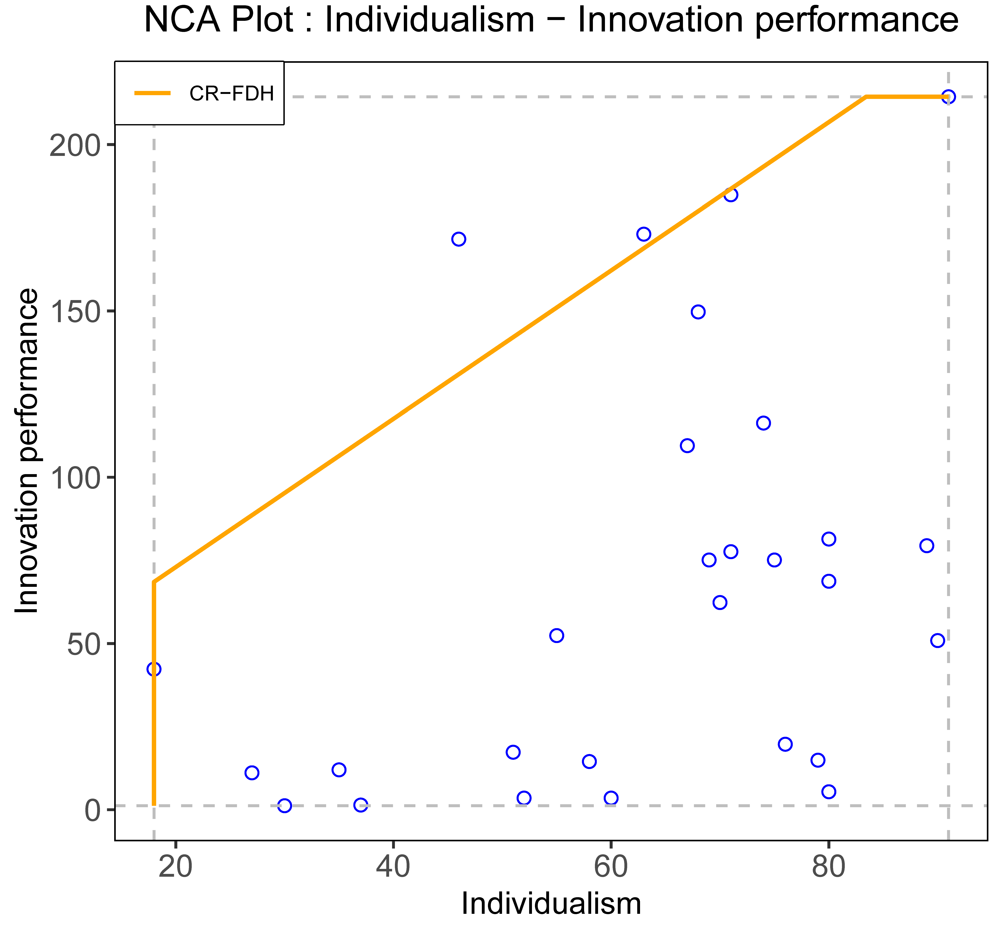
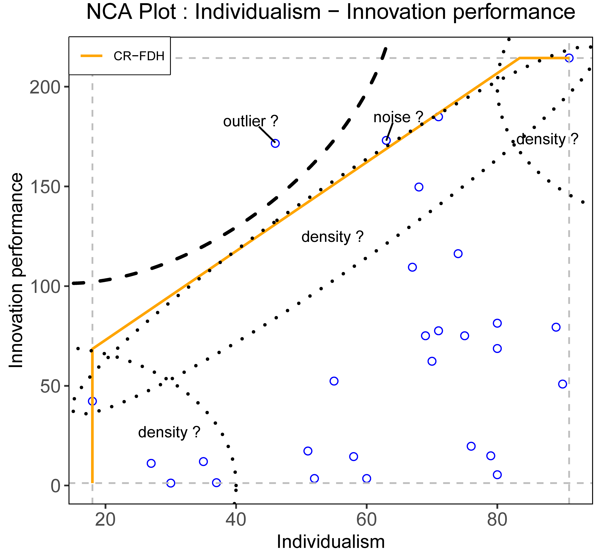
# knitr::include_graphics('non-annotated1 BWcool.png')
# knitr::include_graphics('annotated1 BWcool.png')
```

``` {r annotationcode, echo = FALSE, eval = FALSE}
# Annotation for visual inspection
library(NCA)
library(ggplot2)
library(ggforce)

data(nca.example)
# Run the NCA analysis
model <- nca_analysis(nca.example, 1, 3, ceilings = "cr_fdh")
out <- nca_output(model, summaries = FALSE)
plot <- out$plots[["Individualism"]]
ggplot2::ggsave(
  filename = "NCA_Individualism.png",
  plot = plot,
  width = 10, height = 10, units = "in",
  dpi = 300,
  bg = "white"
)

nca_output(model, summaries = FALSE, pdf = TRUE)

add_nca_annotations <- function(p) {
  if (!requireNamespace("ggforce", quietly = TRUE)) {
    stop("Package 'ggforce' is required. Install with: install.packages('ggforce')")
  }
  
  p +
    # EMPTY SPACE
    ggforce::geom_ellipse(
      aes(x0 = 30, y0 = 200, a = 30, b = 100, angle = 170 * pi/180),
      inherit.aes = FALSE, linetype = 2, linewidth = 1,
      colour = "black", fill = NA
    ) +
    
    # SOLIDITY
    ggforce::geom_ellipse(
      aes(x0 = 55, y0 = 128, a = 10, b = 100, angle = 157 * pi/180),
      inherit.aes = FALSE, linetype = 3, linewidth = 1,
      colour = "black", fill = NA
    ) +
    annotate("text", x = 50, y = 125, label = "density ?", hjust = 0, size = 3.6) +
    
    # LOWER LEFT DENSITY
    ggforce::geom_ellipse(
      aes(x0 = 10, y0 = 0, a = 30, b = 70, angle = 0),
      inherit.aes = FALSE, linetype = 3, linewidth = 1,
      colour = "black", fill = NA
    ) +
    annotate("text", x = 25, y = 27, label = "density ?", hjust = 0, size = 3.6) +
    
    # UPPER RIGHT DENSITY
    ggforce::geom_ellipse(
      aes(x0 = 110, y0 = 200, a = 30, b = 70, angle = 0),
      inherit.aes = FALSE, linetype = 3, linewidth = 1,
      colour = "black", fill = NA
    ) +
    annotate("text", x = 92.5, y = 174, label = "density ?", hjust = 1, size = 3.6) +
    
    # thin line (no arrowhead) + text: outlier
    annotate(
      "segment",
      x = 46, y = 172, xend = 43.5, yend = 180,
      linewidth = 0.5, colour = "black"
    ) +
    annotate("text", x = 38, y = 183, label = "outlier ?", hjust = 0, size = 3.6) +
    
    # thin line (no arrowhead) + text: noise
    annotate(
      "segment",
      x = 63, y = 173, xend = 64, yend = 182,
      linewidth = 0.5, colour = "black"
    ) +
    annotate("text", x = 61, y = 185, label = "noise ?", hjust = 0, size = 3.6)
}

# Use:
plot <- add_nca_annotations(out$plots[["Individualism"]])
print(plot)
#ggplot2::ggsave(
  filename = "NCA_Individualism.png",
  plot = plot,
  width = 10, height = 10, units = "in",
  dpi = 300,
  bg = "white"
)
#ggsave("annotations.pdf", plot, width = 10, height = 15, dpi = 600, device = cairo_pdf)

#plotted and Rstudio and then saved as pdf and subsequently changed into png and bw
```


### Is the expected corner empty?
According to the hypothesis, a high level of $X$ is necessary for a high level of $Y$ such that the upper-left corner is expected to be empty. Figure \@ref(fig:visualinspection) shows, generally, that cases with a low value of $X$ have a low value of $Y$, and that cases with a high value of $Y$ have a high value of $X$. The upper-left corner is indeed empty. A non-empty  expected empty corner with cases near the geometrical corner would have indicated that the hypothesis should be rejected, unless only a few  cases are located there without cases in the surrounding empty area; such cases could be outliers and would need further inspection. One case could be a candidate outlier, see below Section \@ref(exampleoutliers).

<!-- NCA’s effect size quantifies the  size of the empty area in the scatter plot. After visual inspection the size of the empty space can be obtained with the `NCA` software by using the `summaries` argument of the `nca_output ` function. -->
 
### Is the selected ceiling line appropriate? 
In the illustrative example the border is assumed to be linear, and the CR-FDH ceiling line is (provisionally) selected during the model specification. However, the $XY$-plot shows that the border is somewhat irregular. This suggests that representing the border by a linear ceiling may not be optimal, causing model fit issues. This will be evaluated in more detail using model fit metrics (Section \@ref(modelfit2)). 

<!-- After visual inspection the appropriateness of the ceiling line may be verified with the NCA's ceiling accuracty and fit measures. Ceiling accuracy is the percentage of cases on or below the ceiling line. The ceiling accuracy of an appropriate ceiling line is close to 100%. NCA's fit measure is the effect size of a selected ceiling as a percentage of the effect size of the CE-FDH line. The selected ceiling line fits well when this percentage is close to 100%. The selected ceiling line may be inappropriate when fit deviates considerably from 100% or when the effect size of the selected ceiling line is greater than the effect size of the CE-FDH line, indicating that the ceiling is non-linear. Ceiling accuracy and fit can be obtained with the `NCA` software by using the `summaries` argument of `nca_output ` function. A fit output of $NA$ indicates that the effect size of the selected ceiling line is greater than the effect size of the CE-FDH line. -->

### Which cases are possible outliers? {#exampleoutliers}
Outliers are cases that are relatively ‘far away’ from other cases. NCA defines an outlier as a case that has a large influence on the effect size when removed (Section \@ref(outliers)). This means that cases that help to produce the ceiling line (peers) and cases that define the empirical bounding box (observed minimum and maximum values of $X$ and $Y$) are potential outliers. Isolated potential outliers may be identified by visual inspection of the $XY$-plot and may give rise to conducting a formal outlier analysis (Section \@ref(outliers)).

In the illustrative example, one point is located in the apparent ceiling zone relatively far away from other points and from the ceiling line (Figure \@ref(fig:visualinspection)). This point is a candidate for being an outlier case, and an outlier analysis is therefore warranted. The other points in the ceiling zone (above the ceiling) also contradict strict necessity, but may not be considered an outlier but rather noise because the point is closer to other points and to the apparent ceiling line. Noise may, for example be due to measurement error, and can be captured with the model fit metric *noise* (Section \@ref(purity)).

<!-- In NCA potential outliers are the cases that construct the ceiling line (‘ceiling outliers’) and the cases that construct the scope (‘scope outliers’). -->


<!-- After visual inspection, potential outliers can be verified with the `NCA` software by using the `nca_outlier` function.   -->

### What is the data pattern in the rest of plot?
Although NCA focuses on the analysis of the expected empty corner and the ceiling line, the distribution of cases in the rest of the $XY$-plot can also  be informative for the credibility of necessity (Chapter \@ref(sensitivityspecificity)). In particular, the density of cases near the ceiling line and density of cases in adjacent corners to the empty corner (upper-right and lower-left) may contain information that is relevant for necessity.

#### Density of cases near the ceiling line
Cases just below the ceiling line 'support’ the ceiling line. With no or very few cases just below the ceiling line, the line may not be informative. The informativeness of the ceiling line is captured with NCA's model fit metric called *support* (Section \@ref(solidity)).^[Note that cases near the ceiling line can be considered as best cases or innovators (assuming that the outcome is desirable, and the condition is an effort). For a given level of the condition they have the maximum possible outcome compared to other cases.] 

The cases near the ceiling should not be clustered but preferably spread along the ceiling line. The spread of the ceiling line is captured with NCA's model fit metric *spread* (Section \@ref(solidity)). In the illustrative example, the cases near the ceiling line do not seem to be clustered and are reasonably spread.

Theoretically, the ceiling line represents a sharp border between the area with and the area without cases. This means that the densities just below and just above the ceiling should be different with considerably more cases just below the ceiling compared to just above the ceiling. This feature of the ceiling line is captured in NCA's *sharpness* metric (Section \@ref(sharpness)). 

In the illustrative example, few cases are present just below the ceiling and the densities just below and just above the ceiling are not very different, such that the ceiling is not a sharp border.

#### Density of cases in adjacent corners
The presence of many cases in the lower-left corner, and/or in the upper-right corner, may be supportive for the non-randomness of the necessary condition. If only a few cases are present in these corners, the emptiness of the upper-left corner could be a random effect. To mimic the null-distribution where $X$ and $Y$ are unrelated, NCA's permutation test re-samples from the observed sample while shuffling labels of observations (see NCA's null hypothesis test, Section \@ref(null)). To challenge randomness, it is important that enough cases are in the upper-right or lower-left corners. If these cases do not exist, the $p$-value will be high, resulting in a rejection of the necessity hypothesis, despite the presence of an expected empty corner and possibly despite presence of a necessary condition in the population (false negative conclusion). 

In the illustrative example, it appears that a reasonable fraction of cases is present in the lower-left corner, suggesting that the $p$-value may be small such that the necessity explanation of the observed empty corner is not rejected. Section \@ref(effectsizeestimation) presents the formal evaluation of the effect size regarding statistical significance.
<!-- could be large.  .  the randomness of the empty space (when the variables are unrelated) is identified with NCA’s statistical test that is part of the `NCA` software. The NCA's $p$-value can be obtained by using the `test.rep` argument in the `nca_analysis` function and by subsequently by using the `summaries` argument in the `nca_output` function. -->
   
<!-- Although NCA focuses on the emptiness of the corner that is expected to be empty according to the hypothesis, it is also possible to explore the *emptiness* of other corners. When theoretical support is available, the emptiness of another corner could be formulated as an additional necessary condition hypothesis. Such hypothesis is formulated in terms of the absence or a low value of $X$ or $Y$ (Section \@ref(morecorners)). After visual inspection, any corner in the scatter plot can be evaluated with the NCA software by using the `corner` argument in the `nca_analysis` function.   -->

<!-- #### Density of cases near the scope limits -->
<!-- Cases near the scope limit of $X = X_{max}$ have met the necessary condition of a high level of $X$ being necessary for a high level of $Y$. For certain levels of $X > X_c$, where $X_c$ is the intersection between the ceiling line and the line $Y = Y_{max}$, $X$ is not necessary for $Y$ (‘condition inefficiency’). When most cases are in the condition inefficiency area $X_c < X < X_{max}$, the necessary condition could be considered as ‘trivial’. Most cases have met the necessary condition, whereas only a few cases have not.  -->
<!-- Cases near the scope limit of $Y = Y_{min}$ have a low level of the outcome. Up to a level $Y = Y_c$, where $Y_c$ is the intersection between the ceiling line and the line $X = X_{min}$, $Y$ is not constrained by  $X$ (‘outcome inefficiency’). When most cases are in the outcome inefficiency area $Y_{min} < Y < Y_c$, the necessary condition could be considered ‘irrelevant’; the condition is not constraining the outcome in that area. The condition and outcome inefficiencies can be obstained with the `NCA` software by using the `summaries` argument of `nca_output` function.  -->

## Ceiling line estimation {#ceilinglineestimation}
During model specification (or after visual inspection of the $XY$-plot) the location and form of the ceiling line are specified. When the specific ceiling parameters (Section \@ref(modeldf)) are not yet available (the most common situation) NCA estimates these parameters. For a linear ceiling line these are the intercept and the slope, for a segmented linear ceiling line these are the coordinates of the peers. For most types of ceiling lines (CE-FDH, CR-FDH, CE-VRS, CR-VRS, C-LP) this is done by first estimating the Free Disposal Hull (Section \@ref(mathematicalestimation)). The CE-FDH ceiling line corresponds to this line, whereas the other ceiling lines  are derived from this line by using all or a selection of peers or otherwise based on the peers (C-LP) as explained in Section \@ref(mathceiling).  

In the illustrative example, the CR-FDH ceiling line is selected (Figure \@ref(fig:visualinspection)-left), but without specifying its parameters (ceiling line intercept and ceiling line slope). The ceiling line parameters can be estimated with the ```NCA``` software for ```R``` as follows:
  
```{r ncaexampleceilingestimation, echo = TRUE, warnings= FALSE}
library(NCA)
data(nca.example)

# Run the NCA analysis with the specified ceiling line
model <- nca_analysis(nca.example, 1, 3, ceilings = "cr_fdh")

# Extract intercept & slope
Intercept <- nca_extract(model = model, 
                         x = "Individualism", 
                         ceiling = "cr_fdh",
                         param = "Intercept")
Slope     <- nca_extract(model = model, 
                         x = "Individualism", 
                         ceiling = "cr_fdh",
                         param = "Slope")

# Print the ceiling line equation
cat(
  "Ceiling line equation (CR-FDH):  Y =",
  round(Intercept, 3), "+",
  round(Slope, 3), "* X", "\n"
)
```
  
The estimated ceiling intercept is 28.353 and the estimated ceiling slope is 2.23.

## Effect size and $p$-value estimation {#effectsizeestimation}
The effect size (Section \@ref(effectsize)) can be calculated from the ceiling zone (Section \@ref(mathceiling)) and the scope (Section \@ref(formalexpression)).  The ceiling zone is calculated from the (estimated) parameters of the ceiling line. The scope is calculated from the observed or theoretically determined minimum and maximum values of $X$ and $Y$. The effect size is the test statistic for NCA's permutation test to estimate the $p$-value (Section \@ref(permutationtest)). 

For the illustrative example, the calculations and estimations can be done with the ```NCA``` software for ```R```. The number of repetitions for obtaining the permutation distribution for estimating the $p$-value is set at 10,000. This number generally balances accuracy and computation time.
  
```{r ncaexampleeffectsizeandpvalue, echo = TRUE, message=TRUE,  warnings= FALSE}
library(NCA)
data(nca.example)

# Run the NCA analysis with the specified ceiling line
# 10,000 repetitions for estimating the p-value
set.seed(123) # for reproducibility of the estimated p-value
model <- nca_analysis(nca.example, 1, 3, 
                      ceilings = "cr_fdh", 
                      test.rep = 10000)
# Show the results
print(model) 
```
  
During the computation a message "Do test for: ..." appears when the analysis is running, which changes into "Done" when the analysis is finished. The results show that the effect size $d$ = 0.31, which is greater than the selected threshold level of $d$ = 0.10. However, this result is not statistically significant given the estimated $p$-value of 0.165 for the selected threshold level of $\alpha$ = 0.05. Therefore, the initial conclusion is that the hypothesis is rejected.^[Note that a rejection of a necessity hypothesis (if robust) can be an important result: the condition may be important, but is not necessary, and thus compensable if absent or low.]

## Outlier analysis {#outliers}

Including or excluding outliers from a data analysis can change the results. This applies to any data analysis method, and also to NCA. In NCA, an outlier is an 'influential' case that has a large influence on the necessity effect size when removed. 

### Outlier types {#outliertypes}

Because the effect size is calculated by dividing a numerator (*ceiling zone*) by a denominator (*scope*), and an outlier is defined by its influence on this division (effect size), two types of outliers can exist in NCA: *ceiling outliers* and *scope outliers*.

A *ceiling outlier* is a case that helps to determine the position of the ceiling line and that largely changes the effect size if it is removed from the dataset. Since the peers determine the ceiling line, they are potential ceiling outliers.  When a ceiling outlier is removed, it usually increases the ceiling zone and thus *increases* the necessity effect size. A *scope outlier* is a case that determines the empirical scope and that largely changes the effect size if it is removed.  When a scope outlier is removed, it usually decreases the scope and thus *increases* the effect size. When a case is both a ceiling outlier and a scope outlier, it determines not only the position of the ceiling but also the size of the scope. When such a case is removed it simultaneously decreases the ceiling zone and the scope. The net effect is often a *decrease* of the necessity effect size.

Duplicate cases are cases with exactly the same $X$- and $Y$-values. They are possible when the variable scores are discrete, for example when measured with a Likert scale. When duplicate cases determine the ceiling line or scope, the effect size will not change when only one of the duplicates is removed. Therefore, single cases that have a duplicate have no influence on the effect size when removed, and cannot be outliers. A set of duplicate cases can be outliers and can be removed as a set. Cases that are below the ceiling line and have no extreme values of  $X$ or $Y$ cannot be outliers.

### Outlier identification {#outlieridentification}
There are no scientific rules for deciding if a case is an outlier. The decision depends primarily on a  judgment by the analyst. For a first impression of possible outliers, the analyst may visually inspect the $XY$-plot as discussed in Section \@ref(exampleoutliers). In the literature, rules of thumb are used for identifying outliers. For example, a variable score is an outlier score 'if it deviates more than three standard deviations from the mean', or 'if 1.5 interquartile ranges is above the third quartile or below the first quartile'. These pragmatic rules address only one variable ($X$ or $Y$) at a time. Such single variable rules of thumb may be used for identifying potential scope outliers (unusual minimum and maximum values of condition or outcome), but they are not suitable for the identification of potential ceiling outliers. The reason is that ceiling outliers depend on the *combination* of $X$- and $Y$-values. For example, a case with a non-extreme $Y$-value may be a regular case when it has a large $X$-value, because it does not define the ceiling. Then removing the case does not change the effect size. However, when $X$ is small, the case may define the ceiling; removing the case may change the effect size considerably. This means that both $X$ and $Y$ must be considered when identifying ceiling outliers in NCA.

All potential ceiling outliers and potential scope outliers can be evaluated one by one by calculating the  absolute and relative effect size changes when the case is removed (with replacement). 
<!-- An outlier may be identified if the change is 'large'  according to the judgment of the analyst. Again, no scientific rules exist for what can be considered as a 'large' effect size change.  -->
<!-- It is possible that single cases that change the effect size more than for example 30% or 50% could be considered serious outliers, worth for a detailed further assessment. This does not mean that these cases *are* outliers, nor that single cases that change the effect size less than 30%, 50%, or ... *are not* outliers. -->
Such an outlier analysis can be done with the ```NCA``` software for ```R``` using the ```nca_outliers``` function. The output is a list of potential outliers, ranked by how much the effect size decreases when the outlier is removed.^[Note that for brevity *potential outliers* are called *outliers* in printed and plotted output. The analyst judges if a potential outlier is a true outlier or not.] For the illustrative example, the outlier analysis can be done as follows:
  
```{r ncaexampleoutliers, echo = TRUE, message=TRUE, warnings= FALSE}
library(NCA)
data(nca.example)

# Run the NCA outlier analysis 
outliers <- nca_outliers (nca.example, 1, 3, ceiling = 'cr_fdh') 

# Show the results
print(outliers) 
```

<!-- For each potential outlier several measures are provided. *eff.or* is the original estimated effect size, *eff.nw* is the new effect size when the case is removed, *dif.abs* is the absolute different between the new and the original effect size. A negative sign means that the new effect size is smaller thatn the orginan effect size. *dif.rel* is the relative difference between the new and original effect sizes expressed as a percentage. -->
<!-- Therefore, potential *ceiling outliers* could be selected by evaluating all peers. The peers are the upper-left corner points of the CE-FDH ceiling line (step function).  They can be found with the  argument`peers` of the `NCA`software as follows (assuming that the `nca_analysis` of `nca.example` is named 'model'): -->
<!-- ```{r echo = TRUE,results=TRUE} -->
<!-- ceiling.zone.outliers <- model$peers -->
<!-- print(ceiling.zone.outliers) -->
<!-- ``` -->
<!-- The output is a list names of the peers (countries) and their $X$ and $Y$ coordinates. -->
<!-- Next, potential *scope outliers* could be selected by evaluating the cases that have the minimum or maximum value of $X$ and $Y$. This can be done with the following script (assuming that `nca_analysis` of `nca.example` is named 'model').  -->
<!-- ```{r echo = TRUE,results=TRUE} -->
<!-- Xmin <- as.numeric(unlist(model$summaries, use.names = F)[3]) -->
<!-- Xmax <- as.numeric(unlist(model$summaries, use.names = F)[4]) -->
<!-- Ymin <- as.numeric(unlist(model$summaries, use.names = F)[5]) -->
<!-- Ymax <- as.numeric(unlist(model$summaries, use.names = F)[6]) -->
<!-- Cases.Xmin <- row.names(nca.example)[which (nca.example[,1] == Xmin)] -->
<!-- Cases.Xmax <- row.names(nca.example)[which (nca.example[,1] == Xmax)] -->
<!-- Cases.Ymin <- row.names(nca.example)[which (nca.example[,3] == Ymin)] -->
<!-- Cases.Ymax <- row.names(nca.example)[which (nca.example[,3] == Ymax)] -->
<!-- scope.outliers <- rbind(Cases.Xmin,Cases.Xmax,Cases.Ymin,Cases.Ymax)  -->
<!-- print(scope.outliers) -->
<!-- ``` -->
<!-- It turns out that South Korea defines the minimum $X$, USA the maximum $X$ and the maximum $Y$, and Mexico the minimum $Y$. -->
<!-- This means that South Korea and USA are not only potential ceiling outliers but also potential scope outliers.  -->
<!-- Finding potential ceiling outliers and potential scope outliers can be combined in the folowing user-defined function.  -->
<!-- The function selects the cases that are peers and the cases that have minimum and maximum values and evaluates their individual influences  on the effect size by removing each cases one by one (with replacement). -->
<!-- The function needs 5 inputs: the name of the data set, a specification of $X$ and  $Y$, the ceiling line, and whether or not all cases should be considered potential outliers.    -->
<!-- ```{r, warning=FALSE, message=FALSE} -->
<!-- nca_outliers <- function (data, xvar, yvar, ceiling = "cr_fdh", all = FALSE){ -->
<!--   library(NCA) -->
<!--   modelA <- nca_analysis(data, xvar,yvar, ceilings = ceiling)  -->
<!--   eff.or <- as.numeric(unlist(modelA$summaries, use.names = F)[8])  -->
<!--   #select potential ceiling outliers: peers -->
<!--   peers<- as.data.frame(modelA$peers) # peers -->
<!--   #select potential scope outliers: minimum/maximum -->
<!--   Xmin <- as.numeric(unlist(modelA$summaries, use.names = F)[3]) -->
<!--   Xmax <- as.numeric(unlist(modelA$summaries, use.names = F)[4]) -->
<!--   Ymin <- as.numeric(unlist(modelA$summaries, use.names = F)[5]) -->
<!--   Ymax <- as.numeric(unlist(modelA$summaries, use.names = F)[6]) -->
<!--   Cases.Xmin <- row.names(data)[which (data[,1] == Xmin)] -->
<!--   Cases.Xmax <- row.names(data)[which (data[,1] == Xmax)] -->
<!--   Cases.Ymin <- row.names(data)[which (data[,3] == Ymin)] -->
<!--   Cases.Ymax <- row.names(data)[which (data[,3] == Ymax)] -->
<!--   #unique potential outliers -->
<!--   if (all) {outl <- rownames(data)} else { -->
<!--   outl <- unique (c(row.names(peers), Cases.Xmin, Cases.Xmax, Cases.Ymin, Cases.Ymax))  -->
<!--   }  -->
<!--   #evaluate potential outliers -->
<!--   #remove outliers one by one (with replacement) and calculate effect size (difference) -->
<!--   cnt = 0  -->
<!--   dif.abs = NULL -->
<!--   dif.rel = NULL -->
<!--   eff.nw = NULL -->
<!--   for (i in 1:length(outl)){  -->
<!--     cnt <- cnt +1 -->
<!--     dataR <- data[-which(row.names(data)== outl[i]),] -->
<!--     modelR <- nca_analysis(dataR, xvar, yvar, ceilings=ceiling) -->
<!--     eff.nw[i] <- as.numeric(unlist(modelR$summaries, use.names = F)[8]) -->
<!--     dif.abs[i] <- (eff.nw[i] - eff.or) -->
<!--     dif.rel[i] <- (eff.nw[i] - eff.or)/(eff.or)*100 -->
<!--   } -->
<!--   eff.or <- round(eff.or, digits = 2) -->
<!--   eff.nw <- round(eff.nw, digits = 2) -->
<!--   dif.abs <- round(dif.abs, digits = 2) -->
<!--   dif.rel <- round(dif.rel, digits = 1) -->
<!--   potential.outliers <- data.frame(outl, eff.or, eff.nw, dif.abs, dif.rel) -->
<!--   return(potential.outliers) -->
<!-- } -->
<!-- ``` -->
<!-- The function can be applied to the `nca.example` data set, with the `ce_fdh` ceiling line as follows: -->
<!-- ```{r, warning=FALSE, message=FALSE} -->
<!-- nca_outliers(nca.example,1,3, ceiling = "ce_fdh", all = FALSE) -->
<!-- ``` -->
The table shows in the first column the case names of the potential outliers. The second column displays the original effect size when no cases are removed (*eff.or*) and the third column displays the new effect size when the outlier is removed (*eff.nw*). The fourth column shows the absolute difference (*dif.abs*) between the new and the original effect sizes, and the fifth column the relative difference (*dif.rel*) between the new and the original effect sizes expressed as a percentage. A negative sign means that the new effect size is smaller than the original effect size. 

The output shows six potential outliers. The new effect sizes range from 0.22 to 0.44, absolute differences range from -0.08 to +0.13, and relative differences range from -26.8% to +44%. Three outliers are just ceiling outliers (Japan, Finland, Sweden), one is just a scope outlier (Mexico), and two cases are both ceiling and scope outlier (USA and South Korea). South Korea defines the ceiling line and the minimum $X$ of the scope. USA defines the ceiling line and maximum $X$ and maximum $Y$ of the scope. Mexico does not define the ceiling line but defines the minimum $Y$.

For an inspection of the cases in the $XY$-plot, the ```plotly = TRUE``` argument in the ```nca_outliers``` function can be used to display an interactive plot with highlighted potential outliers (the static version is shown in Figure \@ref(fig:outlierplotly)).

```{r echo = TRUE, eval= FALSE, cache=TRUE}
library(NCA)
data(nca.example)

nca_outliers (nca.example, 1, 3, ceiling = 'cr_fdh' , plotly = TRUE) 
```  

```{r outlierplotly, echo=FALSE, fig.align ='center', fig.cap='Plotly plot with potential ceiling and scope outliers distinguished from other observations.', out.width='75%', fig.align='center'}
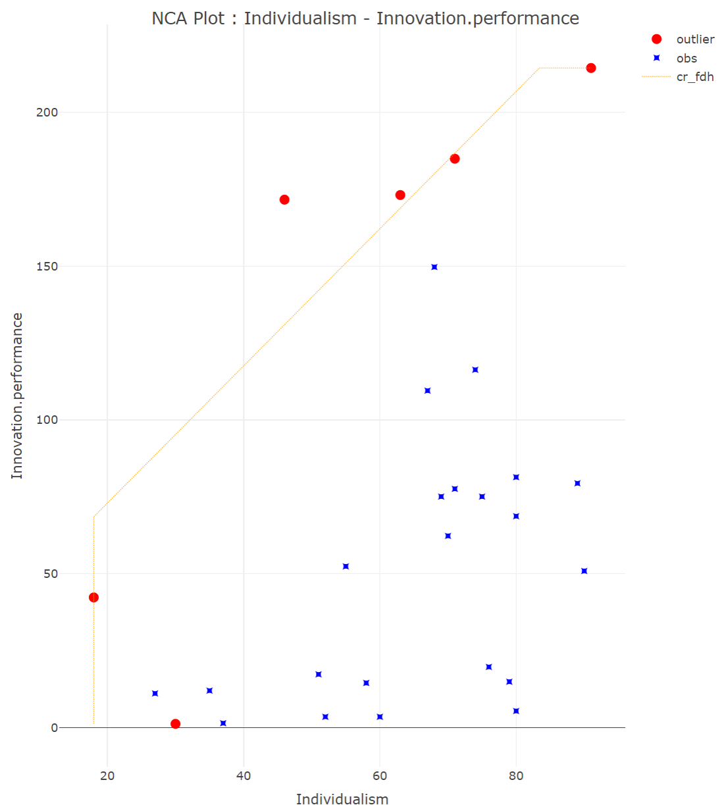
#knitr::include_graphics("outlierplotly1 BWcool.png")
```

From the three potential *ceiling outliers* that are not also a scope outlier (Japan, Finland, Sweden) are in the center of the plot (Figure \@ref(fig:outlierplotly)), two cases increase the effect size when removed, and one decreases it. The relative effect size differences when cases are removed range from -0.6% to 44.0%.[In the software, small changes in effect size can be ignored. By default, combinations that change the effect size by less than 0.01 are left out.] The potential *scope outlier* that is not also a ceiling outlier (Mexico) increases the effect size when removed, but its influence is marginal. The two potential *ceiling outliers* that are also potential *scope outliers*, USA and South Korea, change the effect size when removed with relative effect size differences of -26.8% and 18.2%, respectively. 

All other cases are no potential outliers because they have no influence on the effect size when removed. Note that after a potential outlier is removed and the effect size difference is calculated, the case is added again to the dataset before another potential outlier is evaluated (removing with replacement). 
<!-- This can be evaluated with the ```use.all = TRUE``` argument in the ```nca_outliers``` function as follows: -->
<!-- ```{r echo = TRUE,results=TRUE} -->
<!-- outliers <- nca_outliers (nca.example, 1, 3, use.all = TRUE)  -->
<!-- print(outliers) -->
<!-- ``` -->
<!-- The two default ceiling lines CE-FDH and CR-FDH have the same potential outliers. For other ceiling lines the outliers can be different. For example, the C-LP ceiling technique selects two cases for drawing the ceiling line, and therefore only these two cases can be potential ceiling outliers. The ceiling line can be specified with the ```ceiling``` argument in the ```nca_outliers``` function as follows: -->
<!-- ```{r echo = TRUE,results=TRUE, cache=TRUE} -->
<!-- library(NCA) -->
<!-- data(nca.example) -->
<!-- outliers <- nca_outliers (nca.example, 1, 3, ceiling = 'c_lp')  -->
<!-- print(outliers) -->
<!-- ``` -->

In the ```nca_outlier``` function it is also possible to evaluate two or more potential outliers at once by specifying $k$ = number of potential outliers. This evaluates the change of effect size when $k$ potential outliers are removed as a group (and replaced as a group). Evaluating multiple outliers is useful in the following situations:^[For $k$ > 1 the number of combinations of potential outlier cases can be large. The selection of combinations of two potential outliers is as follows. First, all potential single-case outliers (ceiling and scope outliers) in the original dataset are identified (List1). Next, all cases from List1 are removed from the dataset and new single-case outliers are identified in the remaining dataset (List2). Then both lists are combined into one set of outliers. The effect size changes of all combinations of two outliers are evaluated by comparing the effect size without the pair with the effect size with the pair (the original dataset).]

- Existence of duplicate cases that are far from the other cases.

- Existence of a cluster of cases that is far from the other cases.

- Existence of multiple single cases that are not near each other, but far from the other cases.


Sometimes, removing more outliers does not lead to a larger change in effect size compared to removing just one or two of them. When the argument ```condensed = TRUE``` is used, these larger combinations are normally hidden from the results. However, a combination is still shown if it produces a larger effect size change than any other combination that does not include one of the cases in that combination. In other words, even with ```condensed = TRUE```, a combination remains visible when it adds meaningful new information that cannot be explained by smaller or unrelated combinations. 

The remaining combinations are sorted by how much they change the effect size (from largest to smallest). This is the absolute value of the difference between the original effect size and the new effect size. If several combinations cause the same change, smaller combinations are listed first. Only the top combinations are shown, up to the user-specified limit (default = 25).

For $k$ > 2 the procedure repeats with a next round of identifying new outliers. In general, all possible $\binom{n}{k} = \frac{n!}{k!(n-k)!}$ outlier combinations are evaluated, where $k$ is the combination size and $n$ is the total number of outliers found so far. 
<!-- > outliers <- nca_outliers(nca.example, 1, 3, ceiling= 'cr_fdh',  k = 2, condensed = T, min.dif = 0.00, max.results = 50) -->
<!-- > outliers -->

In the illustrative example, the results for $k$ = 2 potential outliers is:
  
```{r echo = TRUE,results=TRUE, cache=FALSE, message=TRUE, warnings= FALSE}
library(NCA)
data(nca.example)

outliers <- nca_outliers (nca.example, 1, 3, ceiling = 'cr_fdh', k = 2,
                          condensed = TRUE) 
print(outliers)
```

The output shows 25 combinations of potential outliers with the largest influence on the effect size when a combination of two outliers or a single outlier is removed (see *dif.abs* and *dif.rel* for the absolute and relative differences, respectively). A potential outlier combination consists always of at least one single outlier. Removing Japan in combination with South Korea, Finland, Sweden or Mexico, increases the effect size change. When Japan is removed in combination with other countries, the change of the effect is less than when only Japan is removed.^[Note that for  $k > 1$ the `plotly` $XY$-plot only shows the single potential outliers as for $k = 1$.]

From the example it appears that Japan is the most serious potential single outlier.

### Outlier decision approach {#outlierdecisionmaking}
After potential outliers are identified, the next question is what to do with them. NCA suggests a two-step approach for making a decision about an outlier. In the first step, it is evaluated whether the outlier is caused by a sampling or case-selection error, or a measurement error. In the second step, it is decided if an 'outlier for unknown reasons' should be part of the phenomenon (using the deterministic perspective on necessity) or if it should be considered an *exception*. 

<!-- the outlier should be deleted from further analysis. If the error can be corrected  a mechanistic outlier rule could be applied  to decide whether the outlier should be removed (although this is generally not recommended). In the second step an outlier that is not removed in the first step  or .  and foan accepted rule for NCA   the case   The second step handles the remaining outliers, which are 'outliers for unknown reasons'. Here the  analyst has the option to keep the outlier or to remove it.      -->
<!-- : remove or keep. Because removing outliers has a large effect on the outcome (see the definition of outlier), removing a case from the data set  without further judgment is not recommended. In general, the recommendation is to keep a potential outlier, unless there is a good reason to remove it (thus "keep unless", instead of "remove unless"). When an outlier is removed it is important to report that it was removed and why.  -->
  
```{r outlierdecision1, echo=FALSE, fig.align ='center', fig.cap='Outlier decision tree for Step 1 of the outlier decision approach.', out.width='99%', fig.align='center'}
knitr::include_graphics("outlier2_1GJ.png")
```

```{r outlier2_1G, echo = FALSE, eval=FALSE}
library(ggplot2)  
library(dplyr)
library(ggforce)


# === Layout parameters ===
box_width <- 1
box_height <- 0.5
text_size <- 3
spacing_y <- 0.9
spacing_x <- 1.6
side_spacing <- 4.5

diamond_multiplier <- 1.3
diamond_height <- box_height * diamond_multiplier
diamond_width <- box_width * diamond_multiplier


# === Node positions ===

nodes <- data.frame(
  id = c("select",  "sampling", "remove", "measurement", "corrected", "correct", "apply",   "rule",    "remove2", "keep"),
  shape = c("rounded", "diamond",  "rounded",   "diamond",     "diamond",   "rect",    "diamond", "diamond", "rounded",    "rounded"),
  label = c(
    "Select potential \noutlier case", 
    "Sampling error?",
    "Remove \noutlier case",
    "Measurement \nerror?",
    "Can error \nbe corrected?",
    "Correct \noutlier error",
    "Apply an \noutlier rule?",
    "Does the rule \nsuggest removal?",
    "Remove outlier case.\nDo robustness check\nwith/without outliers.",
    "Keep outlier case \nand go to Step 2"
  ),
  x = spacing_x * c(1, 1, 1, 3, 3, 3, 5, 5 ,5 ,7),
  y = spacing_y * c(10, 8, 6, 8, 6, 4, 8, 6 , 4 , 8),
  stringsAsFactors = FALSE
)

# === Arrow definitions + label shift control (dx, dy) ===
arrows <- data.frame(
  from =     c( "select",       "sampling", "sampling",     "measurement",  "measurement",   "corrected",   "apply", "rule",    "corrected",  "apply"),
  to   =     c( "sampling",     "remove",   "measurement",  "corrected",    "apply",         "correct",     "keep",  "remove2", "remove",    "rule"),
  label =    c(  NA,            "Yes",      "No",           "Yes",          "No",            "Yes",          "No",    "Yes",    "No",     "Yes"),
  label_dx = c(  NA,            0.2,         0,            0.2,             0,             0.2,          0,         0.2,         0,   0.2),
  label_dy = c(  NA,            NA,         0.2,            NA,             0.2,             NA,          0.2,         NA,         0.2, NA),
  start_dir = c("b",            "b",        "r",            "b",            "r",             "b",           "r",      "b",       "l",          "b"),
  end_dir = c("t",            "t",        "l",            "t",            "l",             "t",           "l",      "t",       "r",          "t"),
  stringsAsFactors = FALSE
)


#retrieving basis for X and Y start/end points
arrows <- arrows %>%
  left_join(nodes %>% select(id, x, y), by = c("from" = "id")) %>%
  rename(start_x = x, start_y = y) %>%
  left_join(nodes %>% select(id, x, y), by = c("to" = "id")) %>%
  rename(end_x = x, end_y = y)


#offsetting the arrows
get_start_x <- function(start_x, start_dir, box_width) {
  start_x + ifelse(
    start_dir == "r",  box_width,
    ifelse(start_dir == "l", -box_width, 0)
  )
}

get_start_y <- function(start_y, start_dir, box_height) {
  start_y + ifelse(
    start_dir == "t",  box_height,
    ifelse(start_dir == "b", -box_height, 0)
  )
}

get_end_x <- function(end_x, end_dir, box_width) {
  end_x + ifelse(
    end_dir == "r",  box_width,
    ifelse(end_dir == "l", -box_width, 0)
  )
}

get_end_y <- function(end_y, end_dir, box_height) {
  end_y + ifelse(
    end_dir == "t",  box_height,
    ifelse(end_dir == "b", -box_height, 0)
  )
}


#creating offset data
arrows$offset_start_x <- with(arrows, get_start_x(start_x, start_dir, box_width))
arrows$offset_start_y <- with(arrows, get_start_y(start_y, start_dir, box_height))
arrows$offset_end_x <- with(arrows, get_end_x(end_x, end_dir, box_width))
arrows$offset_end_y <- with(arrows, get_end_y(end_y, end_dir, box_height))


#Adjusting offset data for diamonds
#creating from/to shape columns
arrows <- arrows %>%
  left_join(nodes %>% select(id, shape), by = c("from" = "id")) %>%
  rename(from_shape = shape) %>%
  left_join(nodes %>% select(id, shape), by = c("to" = "id")) %>%
  rename(to_shape = shape)

#multiplying diamond offsets
arrows <- arrows %>%
  mutate(
    offset_start_x = ifelse(from_shape == "diamond", 
                            start_x + (offset_start_x - start_x) * diamond_multiplier, 
                            offset_start_x),
    offset_start_y = ifelse(from_shape == "diamond", 
                            start_y + (offset_start_y - start_y) * diamond_multiplier, 
                            offset_start_y),
    offset_end_x = ifelse(to_shape == "diamond", 
                          end_x + (offset_end_x - end_x) * diamond_multiplier, 
                          offset_end_x),
    offset_end_y = ifelse(to_shape == "diamond", 
                          end_y + (offset_end_y - end_y) * diamond_multiplier, 
                          offset_end_y)
  )

#Positioning the arrow labels

arrows <- arrows %>%
  mutate(
    label_x = (offset_start_x + offset_end_x) / 2 + coalesce(label_dx, 0),
    label_y = (offset_start_y + offset_end_y) / 2 + coalesce(label_dy, 0)
  )


#rounded rectangles - creating entire roudned dataframe to later only select the rounded boxes
get_rounded_rect_coords <- function(x, y, width, height, n_points = 100) {
  radius <- height
  left_angles <- seq(pi / 2, 3 * pi / 2, length.out = n_points / 2)
  right_angles <- seq(3 * pi / 2, pi / 2 + 2 * pi, length.out = n_points / 2)
  left_center_x <- x - width + radius
  right_center_x <- x + width - radius
  left_x <- left_center_x + radius * cos(left_angles)
  left_y <- y + radius * sin(left_angles)
  right_x <- right_center_x + radius * cos(right_angles)
  right_y <- y + radius * sin(right_angles)
  data.frame(x = c(left_x, right_x), y = c(left_y, right_y))
}
#retrieves rounded coordinates and turns it into a new dataframe with all nodes as roudned rectanges
rounded_coords <- do.call(rbind, lapply(1:nrow(nodes), function(i) {
  coords <- get_rounded_rect_coords(nodes$x[i], nodes$y[i], box_width, box_height)
  coords$id <- nodes$id[i]
  coords$group <- paste0("rounded_", nodes$id[i])
  coords
}))
#Add "shape" values to new rounded rectangle df - to be used to index these shapes later
rounded_coords <- left_join(rounded_coords, nodes[c("id", "shape")], by = "id", keep = F)


#plot
p <-  ggplot() +
  #rectangles
  geom_rect(data = filter(nodes, shape == "rect"),
            aes(
              xmin = x - box_width,
              xmax = x + box_width,
              ymin = y - box_height,
              ymax = y + box_height 
            ),
            fill = "lightgray",
            color = "black",
            linewidth = 0.6
  ) +
  
  #diamonds
  geom_polygon(
    data = filter(nodes, shape == "diamond") %>%
      rowwise() %>%
      mutate(
        coords = list(data.frame(
          x_d = x + c(0, diamond_width , 0, -diamond_width),
          y_d = y + c(diamond_height, 0, -diamond_height, 0)
        ))
      ) %>%
      tidyr::unnest(coords),
    aes(x = x_d, y = y_d, group = id),
    fill = "lightgray", color = "black") +
  
  #Rounded rectangle
  geom_polygon(data = filter(rounded_coords, shape == "rounded"),
               aes(x = x, y = y, group = group),
               fill = "lightgray", color = "black") +
  
  #lines
  geom_segment(data = arrows,
               aes(x = offset_start_x, y = offset_start_y, xend = offset_end_x , yend = offset_end_y),
               arrow = arrow(length = unit(0.2, "cm"), type = "closed"),
               linewidth = 0.4) +
  
  
  
  geom_text(
    data = filter(arrows, !is.na(label)),
    aes(x = label_x, y = label_y, label = label),
    size = 2.5,
    color = "black"
  ) + 
  
  #labels
  geom_text(data = nodes,
            aes(x = x, y = y, label = label),
            size = text_size,
            lineheight = 0.9
  ) +
  
  ##INSERTING FINAL DETAILS
  #halfway intersecting arrow from correct to measurement-apply arrow
  geom_segment(aes(x = 4 * spacing_x, y = 4 * spacing_y, xend = 4 * spacing_x, yend = 8 * spacing_y),
               arrow = arrow(length = unit(0.2, "cm"), type = "closed"),
               linewidth = 0.4) +
  
  geom_segment(aes(x = 3 * spacing_x + box_width, y = 4 * spacing_y, xend = 4 * spacing_x, yend = 4 * spacing_y),
               linewidth = 0.4) +
  #right-hand 90-degree arrow
  geom_segment(aes(x = 7 * spacing_x, y = 6 * spacing_y, xend = 7 * spacing_x, yend = 8 * spacing_y - box_height),
               arrow = arrow(length = unit(0.2, "cm"), type = "closed"),
               linewidth = 0.4) +
  geom_segment(aes(x = 5 * spacing_x + diamond_width, y = 6 * spacing_y, xend = 7 * spacing_x, yend = 6 * spacing_y),
               linewidth = 0.4) +
  
  #style
  coord_equal() +
  theme_void() +
  theme(
    plot.margin = margin(20, 20, 20, 20)
  )


# print(p)
# 
# ggsave("outlier2_1GJ.png", p, width = 10, height = 15, dpi = 600)
# ggsave("outlier2_1GJ.pdf", p, width = 10, height = 15, dpi = 600, device = cairo_pdf)
 
```

```{r outlier2_2Gcode, echo = FALSE, eval = FALSE}
library(ggplot2)
library(dplyr)
library(ggplotify)
library(tidyr)
library(grid)

# === Layout parameters ===
box_width <- 1
box_height <- 0.5
text_size <- 3
spacing_y <- 0.9
spacing_x <- 1.6

diamond_multiplier <- 1.3
diamond_height <- box_height * diamond_multiplier
diamond_width  <- box_width  * diamond_multiplier

# === Node positions (REMOVED: "decide") ===
nodes <- data.frame(
  id = c("keep", "deterministic", "typicality", "with", "without", "part", "exception", "report"),
  shape = c("rect", "diamond", "diamond", "rect", "rect", "rect", "rect", "rounded"),
  label = c(
    "Keep outlier \ncase",
    "Deterministic \nperspective?",
    "Typicality \nperspective?",
    "Conduct NCA \nwith outlier",
    "Conduct NCA \nwithout outlier",
    "Consider outlier \npart of the \nphenomenon",
    "Consider outlier\nan exception\nDo robustness check\nwith/without outlier.",
    "Report results"
  ),
  x = spacing_x * c(1, 1, 1, 3, 3, 5, 5, 7),
  y = spacing_y * c(10, 8, 6, 8, 6, 8, 6, 7),
  stringsAsFactors = FALSE
)

# === Arrow definitions ===
# NOTE: typicality -> with ("No") will be drawn as a custom multi-segment path later.
arrows <- data.frame(
  from =      c("keep",          "deterministic", "typicality", "deterministic", "typicality", "with",   "without",   "part",   "exception"),
  to   =      c("deterministic", "typicality",    "with",       "with",          "without",    "part",   "exception",  "report", "report"),
  label =     c( NA,             "No",            "No",         "Yes",           "Yes",        NA,       NA,           NA,       NA),
  label_dx =  c( NA,              0.2,             0.2,         -0.1,            -0.1,         NA,       0,            NA,       0),
  label_dy =  c( NA,              0.1,             0.1,          0.2,             0.2,         NA,       0.2,          NA,       0.2),
  start_dir = c("b",             "b",             "b",          "r",             "r",          "r",      "r",          "r",      "r"),
  end_dir   = c("t",             "t",             "l",          "l",             "l",          "l",      "l",          "l",      "l"),
  stringsAsFactors = FALSE
)

# === Retrieve basis for X and Y start/end points ===
arrows <- arrows %>%
  left_join(nodes %>% select(id, x, y), by = c("from" = "id")) %>%
  rename(start_x = x, start_y = y) %>%
  left_join(nodes %>% select(id, x, y), by = c("to" = "id")) %>%
  rename(end_x = x, end_y = y)

# === Offsetting the arrows ===
get_start_x <- function(start_x, start_dir, box_width) {
  start_x + ifelse(start_dir == "r", box_width,
                   ifelse(start_dir == "l", -box_width, 0))
}
get_start_y <- function(start_y, start_dir, box_height) {
  start_y + ifelse(start_dir == "t", box_height,
                   ifelse(start_dir == "b", -box_height, 0))
}
get_end_x <- function(end_x, end_dir, box_width) {
  end_x + ifelse(end_dir == "r", box_width,
                 ifelse(end_dir == "l", -box_width, 0))
}
get_end_y <- function(end_y, end_dir, box_height) {
  end_y + ifelse(end_dir == "t", box_height,
                 ifelse(end_dir == "b", -box_height, 0))
}

arrows$offset_start_x <- with(arrows, get_start_x(start_x, start_dir, box_width))
arrows$offset_start_y <- with(arrows, get_start_y(start_y, start_dir, box_height))
arrows$offset_end_x   <- with(arrows, get_end_x(end_x, end_dir, box_width))
arrows$offset_end_y   <- with(arrows, get_end_y(end_y, end_dir, box_height))

# === Adjusting offset data for diamonds ===
arrows <- arrows %>%
  left_join(nodes %>% select(id, shape), by = c("from" = "id")) %>%
  rename(from_shape = shape) %>%
  left_join(nodes %>% select(id, shape), by = c("to" = "id")) %>%
  rename(to_shape = shape) %>%
  mutate(
    offset_start_x = ifelse(from_shape == "diamond",
                            start_x + (offset_start_x - start_x) * diamond_multiplier,
                            offset_start_x),
    offset_start_y = ifelse(from_shape == "diamond",
                            start_y + (offset_start_y - start_y) * diamond_multiplier,
                            offset_start_y),
    offset_end_x = ifelse(to_shape == "diamond",
                          end_x + (offset_end_x - end_x) * diamond_multiplier,
                          offset_end_x),
    offset_end_y = ifelse(to_shape == "diamond",
                          end_y + (offset_end_y - end_y) * diamond_multiplier,
                          offset_end_y)
  )

# === Positioning arrow labels (default) ===
arrows <- arrows %>%
  mutate(
    label_x = (offset_start_x + offset_end_x) / 2 + coalesce(label_dx, 0),
    label_y = (offset_start_y + offset_end_y) / 2 + coalesce(label_dy, 0)
  )

# === Custom “No” polyline: typicality -> with
# Shape requested: down -> horizontal -> up (stop before other arrow) -> right into box
no_row <- arrows %>% filter(from == "typicality", to == "with", label == "No") %>% slice(1)

drop <- 0.5         # how far down first
gap_y <- 0.35        # stay below the other arrow into the "with" box
gap_x <- 0.35        # stop just before entering, then final short step right

sx <- no_row$offset_start_x
sy <- no_row$offset_start_y
ex <- no_row$offset_end_x
ey <- no_row$offset_end_y

target_y <- ey - gap_y
pre_end_x <- ex - gap_x

# pick a horizontal “corridor” x (to the left of the other incoming arrow)
mid_x <- pre_end_x

no_path <- data.frame(
  x = c(sx, sx, mid_x, mid_x, pre_end_x, ex),
  y = c(sy, sy - drop, sy - drop, target_y, target_y, target_y),
  group = "no_path"
)

# Put the "No" label on the horizontal segment (down+horizontal)
no_label <- data.frame(
  x = (sx + mid_x) / 2 + 0.1,
  y = (sy - drop) + 0.15,
  label = "No"
)

# Remove the default straight segment for this arrow (we draw it ourselves)
arrows_straight <- arrows %>% filter(!(from == "typicality" & to == "with" & label == "No"))

# === Rounded rectangles helper ===
get_rounded_rect_coords <- function(x, y, width, height, n_points = 100) {
  radius <- height
  left_angles  <- seq(pi / 2, 3 * pi / 2, length.out = n_points / 2)
  right_angles <- seq(3 * pi / 2, pi / 2 + 2 * pi, length.out = n_points / 2)
  
  left_center_x  <- x - width + radius
  right_center_x <- x + width - radius
  
  left_x  <- left_center_x  + radius * cos(left_angles)
  left_y  <- y + radius * sin(left_angles)
  right_x <- right_center_x + radius * cos(right_angles)
  right_y <- y + radius * sin(right_angles)
  
  data.frame(x = c(left_x, right_x), y = c(left_y, right_y))
}

rounded_coords <- do.call(rbind, lapply(1:nrow(nodes), function(i) {
  coords <- get_rounded_rect_coords(nodes$x[i], nodes$y[i], box_width, box_height)
  coords$id <- nodes$id[i]
  coords$group <- paste0("rounded_", nodes$id[i])
  coords
}))
rounded_coords <- left_join(rounded_coords, nodes[c("id", "shape")], by = "id", keep = FALSE)

# === Plot ===
p <- ggplot() +
  # rectangles
  geom_rect(
    data = filter(nodes, shape == "rect"),
    aes(
      xmin = x - box_width, xmax = x + box_width,
      ymin = y - box_height, ymax = y + box_height
    ),
    fill = "lightgray", color = "black", linewidth = 0.6
  ) +
  # diamonds
  geom_polygon(
    data = filter(nodes, shape == "diamond") %>%
      rowwise() %>%
      mutate(coords = list(data.frame(
        x_d = x + c(0, diamond_width, 0, -diamond_width),
        y_d = y + c(diamond_height, 0, -diamond_height, 0)
      ))) %>%
      tidyr::unnest(coords),
    aes(x = x_d, y = y_d, group = id),
    fill = "lightgray", color = "black"
  ) +
  # rounded rectangles
  geom_polygon(
    data = filter(rounded_coords, shape == "rounded"),
    aes(x = x, y = y, group = group),
    fill = "lightgray", color = "black"
  ) +
  
  # straight arrows (all except the custom “No”)
  geom_segment(
    data = arrows_straight,
    aes(x = offset_start_x, y = offset_start_y, xend = offset_end_x, yend = offset_end_y),
    arrow = arrow(length = unit(0.2, "cm"), type = "closed"),
    linewidth = 0.4
  ) +
  
  # custom “No” polyline arrow
  geom_path(
    data = no_path,
    aes(x = x, y = y, group = group),
    linewidth = 0.4,
    lineend = "butt",
    arrow = arrow(length = unit(0.2, "cm"), type = "closed")
  ) +
  
  # arrow labels (all except the custom “No”)
  geom_text(
    data = filter(arrows_straight, !is.na(label)),
    aes(x = label_x, y = label_y, label = label),
    size = 2.5,
    color = "black"
  ) +
  # custom “No” label
  geom_text(
    data = no_label,
    aes(x = x, y = y, label = label),
    size = 2.5,
    color = "black"
  ) +
  
  # node labels
  geom_text(
    data = nodes,
    aes(x = x, y = y, label = label),
    size = text_size,
    lineheight = 0.9
  ) +
  
  coord_equal() +
  theme_void() +
  theme(plot.margin = margin(20, 20, 20, 20))

print(p)

# Save (optional)
# ggsave("outlier2_2GJ.png", p, width = 10, height = 15, dpi = 600)
# ggsave("outlier2_2GJ.pdf", p, width = 10, height = 15, device = cairo_pdf)
 

```  

In the first step of NCA's outlier decision approach, the potential outlier case is selected. Next, it is evaluated is the case is sampling or case selection error. This refers to a case not being part of the theoretical domain of the *formal* necessity hypothesis. For example, the case may be a large company, whereas the necessity theory applies to small companies only. An outlier case due to sampling or case selection error should be removed from further analysis. If the case is not an outlier because of sampling or selection error, it should be evaluated if the case may have measurement error. The condition or the outcome may have been incorrectly scored, which could happen for a variety of reasons. If the case has measurement error and this error can be corrected, the outlier case becomes a regular case and is kept for the analyses. 

If the measurement error cannot be corrected, two situations may apply. If the measurement error occurs in the outcome score, the case should be removed from further analysis of all necessary conditions (if there are multiple necessary conditions). If the measurement error occurs in the condition score, the case should be removed from further analysis of that condition, but the analyst must decide to keep it or the remove it for the analysis of other conditions. This depends on the analyst's judgement if the case is generally problematic, or only regarding the specific condition where it was identified as an outlier case (the case may not be an outlier case for other conditions). 

If the outlier is not caused by sampling/selection error or measurement error or no information about sampling error or measurement error is available, the outlier may be considered an 'outlier for unknown reasons'. The analyst may then decide to apply an outlier rule that is justifiable and convincing. A mechanistic outlier rule (e.g., based on percentages) to decide whether the case should be kept or removed is usually not desirable. Such rules are arbitrary but their consequences on the results are usually large. Therefore, applying a mechanistic outlier rule is generally not advised. If it is used anyway and outliers are removed mechanistically, it should be reported and justified, and a robustness check should be done comparing the results with and without applying the outlier rule (Section \@ref(robustnesschecks)).  
<!-- For example, a case may be considered an outlier if it is three standard deviations away from the mean, but that may affect the scope and thus the effect size considerably. For bivariate ceiling outliers no statistically and generally accepted outlier rule exists. Such a rule may therefore be stated by the analyst and be based on, for example, the magnitude of the absolute or relative effect size changes when the case is removed (Section \@ref(outlieridentification)).  -->
<!-- However, mechanistic outlier rules should be specified and justified. If an outlier rule is applied, a robustness check with and without using the outlier rule is recommended. -->
Note that concluding that necessity is rejected because of presence of outliers may be an important result. The condition may on average influence the outcome, but apparently it is not essential as cases exist that can compensate the absence or a low value of the condition. The outliers that reject necessity may be best or innovative cases that are able to achieve a desired outcome without or with a low level of the condition. If the outcome is undesirable, outlier cases may need different action to reduce the outcome than standard actions focused on the condition. In other words, outliers may be informative rather than being errors. *Rejecting* necessity due to outliers and discussing outliers may be a more valuable result than *accepting* necessity after removal of outliers. If no outlier rule is applied (the preferred approach), the potential outlier case is kept, and the next step of NCA's outlier decision approach begins.
  
```{r outlierdecision2, echo=FALSE, fig.align ='center', fig.cap='Outlier decision tree for Step 2 of the outlier decision approach.', out.width='99%', fig.align='center'}

```

The decision tree for the second step is illustrated in Figure \@ref(fig:outlierdecision2). This picks up from the decision to keep the outlier case because the case has no known error, and no outlier rule is applied.
To continue the analysis two perspectives are distinguished for necessity causality: the *deterministic perspective*, and the *typicality perspective* [Section \@ref(typicalitynecessity) and @dul2024different]. The  deterministic perspective, in principle, does not allow points above the ceiling. However, some noise may be tolerated, namely when the case is close to the ceiling in the medium purity ceiling zone (Section \@ref(purity)). If this perspective is adopted the analysis continues with the outlier. 

The typicality perspective, in principle, allows outlier cases that are further away from the ceiling, but only if they are rare. These outliers are called *exceptions*. Accepting the typicality perspective means accepting that the outlier is not an error but behaves differently than other cases with another (unknown) explanation than necessity. 
Thus, the typicality perspective can only be adopted if the case:

- is a rare exception.

- is (presumably) not an error.

- is isolated and far from the ceiling (not noise).

- behaves different than other cases for unknown reasons. 

If the typicality perspective is adopted, the analysis continues without the outlier. because it does not represent the necessity phenomenon that is studied. It can however be studied separately because of the unusual characteristic. Since a case without an error is removed from the analysis, a robustness check should be done with and without the exception to change how it affects the results.

If the typicality perspective is not adopted, the analysis continues with the outlier.^[Note that the typicality perspective can only be used when *rare* exceptions exist. Having many points far above the ceiling or having points that are not isolated from the rest of the points, do not qualify for adopting the typicality perspective. The typicality perspective is only meant for a very limited number of isolated points that represent another (unknown) explanation than necessity. Typicality is about "rare exceptions" [@goldstein2012typicality] and applied to NCA's deterministic causal logic (Chapter \@ref(causality)),  deterministic necessity  becomes "deterministic with exceptions" [@dul2024different], not probabilistic necessity. Also see Section \@ref(counterexamplesexceptions) on how to deal with exceptions during the development of a formal necessity hypothesis.] 

In general, the handling of outliers (keep or remove) relies on a series of decisions made by the analyst. It is advised to perform robustness checks to evaluate the sensitivity of the results to specific outlier decisions and to report the results (Section \@ref(robustnesschecks)).

<!-- and is far from the ceiling. If such exception is identified, the analyst may adopt the typicality perspective on necessity, see Section \@ref(typicalitynecessity). Sections \@ref(purity) and \@ref(purity3) shows how exceptions can be identified using the model fit measures is *exceptions*. -->

<!-- If the outlier is far from the ceiling and rare, the typicality perspective may be adopted.  -->

<!-- ) that ar not allow points above the ceiling. However, some noise may be tolerated, namely when the case is close to the ceiling in the medium purity ceiling zone (Section \@ref(purity)).  -->


<!-- If this perspective is adopted the analysis continues with the outlier.  -->

<!-- above the ceiling  are near above the ceiling.The model fit metric noise  but above the ceiling. the points are close to the ceiling (in the medithis is considered not to violated outliers above  -->

<!-- exceptions. An outlier for unknown reasons is then considered to be part of the phenomenon of interest, and the analysis includes the outlier. This is the default approach. Some outliers close to the ceiling may reflect noise. Other outliers may be real  -->


<!-- The outlier decision tree of Figure \@ref(fig:outlierdecision1) reflects this perspective. -->

<!-- The *typicality perspective* can be formulated as 'if $X$ then typically $Y$'. This perspective does allow rare exceptions. An outlier for unknown reasons is then considered to be an *exception*. The analysis itself is done without the exception, but it is shown in the $XY$-plot, and exceptions are discussed separately in the report of the study. -->

<!-- If such exception is identified, the analyst may adopt the typicality perspective on necessity, see Section \@ref(typicalitynecessity). Sections \@ref(purity) and \@ref(purity3) shows how exceptions can be identified using the model fit measures is *exceptions*.^[Note that the typicality perspective can only be used when *rare* exceptions exist. Having many points above the ceiling (e.g., because of noisy data) or having points that are not isolated from the rest of the points, do not qualify for adopting the typicality perspective. The typicality perspective is only meant for a very limited number of isolated points that represent another (unknown) explanation than necessity. Typicality is about "rare exceptions" [@goldstein2012typicality] and applied to NCA's deterministic causal logic (Chapter \@ref(causality)),  deterministic necessity  becomes "deterministic with exceptions" [@dul2024different], not probabilistic necessity. Also see Section \@ref(counterexamplesexceptions) on how to deal with exceptions in NCA during the development of a formal necessity hypothesis.] -->

<!-- The outlier decision tree of Figure \@ref(fig:outlierdecision1) reflects this perspective. -->

In the illustrative example, the outlier approach is applied as follows. The case Japan is the only potential outlier to be considered. The first step of the outlier decision approach (Figure \@ref(fig:outlierdecision1)) is the evaluation of whether Japan could be an outlier case because of sampling/selection error. The theoretical domain of the hypothesis was defined as "all countries in the world" (Section \@ref(illustrativeexample)). Japan is one of these countries, so sampling/selection error does not apply. 

Next, the question is whether Japan's scores for $X$ and/or $Y$ could have measurement error. This seems unlikely as these scores are obtained from a reputable archival dataset that has been widely used elsewhere, and discussions of measurement error specifically for Japan have not emerged before. The next consideration is to apply an outlier rule for Japan. 

Since a mechanistic outlier rule is not preferred, and Japan is a ceiling outlier for which no generally accepted outlier rules are available, the result of the first step of the outlier decision approach is to keep Japan as outlier case for further consideration.

In the second step of the outlier approach (Figure \@ref(fig:outlierdecision2)) it is decided to consider Japan as an exception for unknown reasons. One speculation may be that Japan's high level of innovation is focused more on incremental innovation of systems than on disruptive start-up style of innovation based on high-risk and high failure entrepreneurship of individuals. Despite the relatively small number of cases in the dataset (28) the illustrative example considers Japan a rare exception. This means that the full analysis must be re-done to obtain an estimate of the main necessity effect without Japan, and that Japan is considered an exception, to be discussed separately in the report. Additionally, a robustness check in which the results with and without the exception should be conducted and reported.

<!-- the which could be speculated ), heeping it in the phenomenin  -->
<!-- ### Outlier decision approach {#outlierdecisionmaking2} -->
<!-- After potential outliers are identified, the next question is what to do with them: remove or keep. Because removing outliers has a large effect on the outcome (see the definition of outlier), removing a case from the data set  without further judgment is not recommended. In general, the recommendation is to keep a potential outlier, unless there is a good reason to remove it (thus "keep unless", instead of "remove unless"). When an outlier is removed it is important to report that it was removed and why.  -->

<!-- Figure \@ref(fig:outlierdecision) shows a decision tree to assist analysts in deciding about keeping or removing a potential outlier. -->

<!-- ```{r outlierdecision, echo=FALSE, fig.cap='Outlier decision tree.', out.width='100%', fig.align='center'} -->
<!-- knitr::include_graphics("outlier2.png") -->
<!-- ``` -->

<!-- First, the potential outlier case is selected. It is then evaluated for sampling error. Sampling error refers a case that does not represent the theoretical domain of the theory that is tested or to which the analyst wants to generalize the results. For example, the case may be a large company, whereas the theory applies to small companies only. This is a reason to remove the outlier case.  -->

<!-- If there is no sampling error, the potential outlier case may have measurement error. The condition or the outcome may have been incorrectly scored, which could happen for a variety of reasons. If there is measurement error, and the error can be corrected then the outlier case may become a regular case and can stay in the dataset. If the measurement error cannot be corrected the case can be removed from the dataset and this reason is reported.  -->

<!-- If there is no information about sampling error or measurement error, the analyst can decide to apply an outlier rule.  If the analyst applies an outlier rule, for example based on the magnitude of the absolute or relative effect size changes when the case is removed (see section \@ref(outlieridentification)). Such rule should be specified and justified. The outlier rule decides whether the case is kept or removed. If no outlier rule is applied the potential outlier case remains in the data set.  -->

<!-- When a potential outlier case has a large influence the necessity effect size if removed, but stays in the dataset, a *sensitivity analysis* can be done. In this analysis the analyst explores the influence of the potential outlier case not only on the effect size (see above), but also the $p$-value of the effect size to judge if (lack of) evidence of necessity in the data remains approximately the same or not.  -->

<!-- Furthermore, when a potential outlier case has a large influence the necessity effect size if removed, but stays in the dataset, the analyst might consider taking a 'probabilistic view' on necessary. In this view necessity is considered to be present, even if outlier cases do not support it. The necessity analysis is done with the data set without the outliers (e.g., NCA is done with the incomplete dataset) and the outliers are added afterwards again. The analyst should be reluctant to use this approach, in particularly for ceiling outliers, because ignoring such outlier usually results in an increase of the effect size.  -->

In the following analysis, Japan is removed from the `nca.example` dataset, followed by re-doing the data analysis: 

```{r echo = TRUE, eval = TRUE, cache=TRUE, message=TRUE, warnings= FALSE}
library(NCA)
data(nca.example)

nca.exampleN <- nca.example[-14,] #exclude Japan
set.seed(123) # for replicability of estimated  p-value
modelN <- nca_analysis(nca.exampleN, 1,3, 
                       ceilings = 'cr_fdh', 
                       test.rep = 10000)
modelN
```
<!-- ```{r ncaexamplenojapan, echo = FALSE, eval=FALSE} -->
<!-- library(NCA) -->
<!-- data("nca.example") -->
<!-- model <- nca_analysis(nca.example, 1,3, ceilings = 'cr_fdh') -->
<!-- nca.exampleN <- nca.example[-14,] -->
<!-- modelN <- nca_analysis(nca.exampleN, 1,3, ceilings = 'cr_fdh') -->
<!-- #nca_output(modelN, summaries = FALSE, pdf = TRUE) #rename file noJapan.pdf -->

<!-- # Default values copied from p_constants -->
<!-- line_colors <- list(ols="green",        lh="red3",            cols="darkgreen", -->
<!--                     qr="blue",          ce_vrs="orchid4",     cr_vrs="violet", -->
<!--                     ce_fdh="red",       cr_fdh="orange",      sfa="darkgoldenrod", -->
<!--                     c_lp="blue") -->
<!-- line_types  <- list(ols=1,              lh=2,                 cols=3, -->
<!--                     qr=4,               ce_vrs=5,             cr_vrs=1, -->
<!--                     ce_fdh=6,           cr_fdh=1,             sfa=7, -->
<!--                     c_lp=2) -->
<!-- line_width  <- 1.5 -->
<!-- point_type  <- 1 -->
<!-- point_color <- 'blue' -->

<!-- display_plot <- -->
<!--   function (plot) { -->
<!--     flip.x <- plot$flip.x -->
<!--     flip.y <- plot$flip.y -->

<!--     # Determine the bounds of the plot based on the scope -->
<!--     xlim <- c(plot$scope.theo[1 + flip.x], plot$scope.theo[2 - flip.x]) -->
<!--     ylim <- c(plot$scope.theo[3 + flip.y], plot$scope.theo[4 - flip.y]) -->

<!--     # Reset/append colors etc. if needed -->
<!--     for (method in names(line_types)) { -->
<!--       line.types[[method]] <- line_types[[method]] -->
<!--     } -->
<!--     if (is.numeric(line_width)) { -->
<!--       line.width <- line_width -->
<!--     } -->
<!--     if (is.numeric(point_type)) { -->
<!--       point.type <- point_type -->
<!--     } -->
<!--     if (point_color %in% colors()) { -->
<!--       point.color <- point_color -->
<!--     } -->
<!--     # Only needed until the next release (3.0.2) -->
<!--     if (!exists("point.color")) { -->
<!--       point.color <- "blue" -->
<!--     } -->

<!--     # Plot the data points -->
<!--     plot (plot$x, plot$y, pch=point.type, col=point.color, bg=point.color, -->
<!--           xlim=xlim, ylim=ylim, xlab=colnames(plot$x), ylab=tail(plot$names, n=1)) -->

<!--     # Plot the scope outline -->
<!--     abline(v=plot$scope.theo[1], lty=2, col="grey") -->
<!--     abline(v=plot$scope.theo[2], lty=2, col="grey") -->
<!--     abline(h=plot$scope.theo[3], lty=2, col="grey") -->
<!--     abline(h=plot$scope.theo[4], lty=2, col="grey") -->

<!--     # Plot the legend before adding the clipping area -->
<!--     legendParams = list() -->
<!--     for (method in plot$methods) { -->
<!--       line.color <- line.colors[[method]] -->
<!--       line.type  <- line.types[[method]] -->

<!--       name <- gsub("_", "-", toupper(method)) -->
<!--       legendParams$names  = append(legendParams$names, name) -->
<!--       legendParams$types  = append(legendParams$types, line.type) -->
<!--       legendParams$colors = append(legendParams$colors, line.color) -->
<!--     } -->
<!--     if (length(legendParams) > 0) { -->
<!--       legend("topleft", cex=0.7, legendParams$names, -->
<!--              lty=legendParams$types, col=legendParams$colors, bg=NA) -->
<!--     } -->

<!--     # Apply clipping to the lines -->
<!--     clip(xlim[1], xlim[2], ylim[1], ylim[2]) -->

<!--     # Plot the lines -->
<!--     for (method in plot$methods) { -->
<!--       line <- plot$lines[[method]] -->
<!--       line.color <- line.colors[[method]] -->
<!--       line.type  <- line.types[[method]] -->

<!--       if (method %in% c("lh", "ce_vrs", "ce_fdh")) { -->
<!--         lines(line[[1]], line[[2]], type="l", -->
<!--               lty=line.type, col=line.color, lwd=line.width) -->
<!--       } else { -->
<!--         abline(line, lty=line.type, col=line.color, lwd=line.width) -->
<!--       } -->
<!--     } -->

<!--     # Plot the title -->
<!--     title(paste0("NCA Plot : ", plot$title), cex.main=1) -->
<!--   } -->

<!-- pdf("noJapan.pdf") -->
<!-- display_plot(modelN$plots[[1]]) -->
<!-- # Regular blue point -->
<!-- points(nca.example[14, 1], nca.example[14, 3], pch=1, col=point.color, bg=point.color) -->
<!-- # Red cross -->
<!-- points(nca.example[14, 1], nca.example[14, 3], pch=4, cex=1.3, col="red", lwd=2) -->

<!-- ## --- OLD CEILING (dashed), clipped to empirical data bounds --- -->
<!-- xlim <- range(modelN$plots[[1]]$x) -->
<!-- ylim <- range(modelN$plots[[1]]$y) -->
<!-- ac <- model$summaries$Individualism$params[10] # intercept -->
<!-- bc <- model$summaries$Individualism$params[9]  # slope -->

<!-- # Get empirical bounds from actual data (including the excluded point) -->
<!-- x_emp_min <- min(nca.example[, 1]) -->
<!-- x_emp_max <- max(nca.example[, 1]) -->
<!-- y_emp_min <- min(nca.example[, 3]) -->
<!-- y_emp_max <- max(nca.example[, 3]) -->

<!-- # Temporarily override clipping to restrict abline to empirical data only -->
<!-- clip(x_emp_min, x_emp_max, y_emp_min, y_emp_max) -->

<!-- # Add old ceiling -->
<!-- abline(a = ac, b = bc, lty = 2, lwd = line_width, col = line_colors$cr_fdh) -->
<!-- dev.off() -->

<!-- # Restore the clipping region back to the theoretical limits -->
<!-- clip(xlim[1], xlim[2], ylim[1], ylim[2]) -->

<!-- ``` -->

The result show that the effect size $d$ = 0.44 and the $p$-value = 0.023. Both values meet the selected threshold levels of $d$ = 0.10 and $\alpha$ = 0.05 such that the necessity hypothesis is not rejected (see however Section \@ref(modelfit2) about model fit and Section \@ref(robustnesschecks) about robustness checks). 

To compare the results with and without the exceptions, it is possible to extract the $XY$-plot of this analysis that is done without the exception, and then to add the exception back to show its original position, and to include the original ceiling line as well using the following script.

```{r ncaexamplenojapanshow, echo = TRUE, eval = FALSE, cache=TRUE, message=TRUE, warnings= FALSE}
library(NCA)
library(ggplot2)
data(nca.example)
# Coordinates of the exception
x <- nca.example["Japan", "Individualism"]
y <- nca.example["Japan", "Innovation performance"]

# Intercept and slope of original ceiling line 
model <- nca_analysis(nca.example, 1, 3, ceilings = "cr_fdh")
model
a <- nca_extract(model, x = "Individualism", 
                 ceiling = "cr_fdh", 
                 param = "Intercept")
b <- nca_extract(model, x = "Individualism", 
                 ceiling = "cr_fdh", 
                 param = "Slope")

#2 NCA without exception
modelN <- nca_analysis(
  nca.example[row.names(nca.example) != "Japan", ], 1, 3, 
  ceilings = "cr_fdh", custom = c(a,b) )
modelN

# XY plot for comparison
out <- nca_output(modelN, plots = TRUE, summaries = FALSE)
p <- out$plots[["Individualism"]] +
  geom_point(aes(x = x, y = y), shape = 1, colour = "blue") +
  geom_point(aes(x = x, y = y), shape = 4, colour = "red",
             size = 2, stroke = 1.2)
print(p)
```

```{r ncaexamplenojapanrun, echo = FALSE, eval = FALSE, cache=TRUE, message=TRUE, warnings= FALSE}
library(NCA)
library(ggplot2)
data(nca.example)
# Coordinates of the exception
x <- nca.example["Japan", "Individualism"]
y <- nca.example["Japan", "Innovation performance"]

# Intercept and slope of original ceiling line 
model <- nca_analysis(nca.example, 1, 3, ceilings = "cr_fdh")
model
a <- nca_extract(model, x = "Individualism", ceiling = "cr_fdh", param = "Intercept")
b <- nca_extract(model, x = "Individualism", ceiling = "cr_fdh", param = "Slope")

#2 NCA without exception
modelN <- nca_analysis(
  nca.example[row.names(nca.example) != "Japan", ], 1, 3, ceilings = "cr_fdh", custom = c(a,b) )
modelN

# XY plot for comparison
out <- nca_output(modelN, plots = TRUE, summaries = FALSE)
p <- out$plots[["Individualism"]] +
  geom_point(aes(x = x, y = y), shape = 1, colour = "blue") +
  geom_point(aes(x = x, y = y), shape = 4, colour = "red", size = 2, stroke = 1.2)
print(p)
ggsave("Individualism_Japan.pdf", plot = p, width = 15, height = 15, units = "cm")

```{r ncaexample4, echo=FALSE, fig.cap='$XY$-plot of illustrative example with one exception (crossed out). Solid line: ceiling line after removal of the exception. Dashed line: ceiling line before removal of the exception.', out.width='75%', fig.align='center', cache=TRUE}
#knitr::include_graphics("noJapan.png")
#knitr::include_graphics("noJapan BWcool.png")
knitr::include_graphics("Individualism_Japan.png")
#knitr::include_graphics("Individualism_Japan BWcool.png")
```

Figure \@ref(fig:ncaexample4) shows the $XY$-plot with the outlier case, the original ceiling line and the new ceiling line.
The above procedures are for one outlier at a time. The judgment becomes more complex when the analyst considers removing more than one outlier one by one or at the same time. For example, after removing the first outlier, a case that was originally not part of the first set of single potential outliers, may be identified as a new potential outlier, etc. Generally, removing outliers is not advised unless the analyst has very good reasons for it.    

## Model fit {#modelfit2}
In Chapter \@ref(mathematics), specific model fit metrics for NCA were introduced to evaluate how well the chosen necessity model (bounding box and ceiling line) represents the necessity relationship suggested by the data. Since NCA's model is mathematical and not statistical (no error term), common statistical model fit metrics such as R$^2$ or likelihood-based fit metrics are not applicable. To illustrate the use of NCA's model  fit metrics, they are applied to the illustrative example. In the ```NCA``` software for ```R```, the values of the model fit metrics can be obtained using ```summaries = TRUE``` in the ```nca_output``` function as follows:
  
```{r echo = TRUE, eval= TRUE, cache=TRUE, warnings= FALSE}
library(NCA)
data(nca.example)

nca.exampleN <- nca.example[-14,] #exclude Japan
set.seed(123) # for replicability of estimated  p-value
modelN <- nca_analysis(nca.exampleN, 1,3, 
                       ceilings = 'cr_fdh', 
                       test.rep = 10000)
nca_output(modelN, plots = FALSE, summaries = TRUE)
```

<!-- ```{r , echo=FALSE, out.width='99%', fig.align='left', cache=TRUE} -->
<!-- #knitr::include_graphics("outputmodelfit.png") -->
<!-- #knitr::include_graphics("Output summary with model fit3.png") -->
<!-- knitr::include_graphics("Output summary with model fit4CR.png") -->
<!-- ``` -->

```{r puritysoliditycode, echo=FALSE, eval= FALSE}
# ceiling: iso solidity/veracity -- 06-02-2025 - Main
#Revised 24 September 2025
#revised 5 January 2026 (sharpness 1 is different now)
#combined soveV44JD.R and soveHlpV44JD.R

####################### START HELPER FUNCTIONS ##################### (from soveV44JD.R) 

markInputData <- function(theD, caseIdNo = NULL, caseDesc = NULL){
  # theD <- test; caseDesc <- "caseDescriptor"
  
  caseDescriptor <- "caseDescriptor"
  if (is.null(caseDesc)){ caseDesc <- "caseDescriptor"}  # go for default
  cn <- colnames(theD)
  if (is.element(caseDesc, cn)) { # variable caseDesc exists already
    if (!is_tibble(theD)) {
      theD <- as_tibble(rownames_to_column(theD, var = "rowDesciptor"))
    } 
  } else { # we work with a tibble
    if (!is_tibble(theD)) { # create from column
      theD <- as_tibble(rownames_to_column(theD, var = caseDesc))
    } else { # is already a tibble, so create it
      theD %<>% mutate("{caseDesc}" = paste0(caseDesc, "_", row_number() ))
    } 
  }
  # if not NULL add a case number, overwriting any existing variable of the same name
  if (!is.null(caseIdNo)) theD %<>% mutate(!!caseIdNo := row_number(), .before = 1)
  return(theD)
} # markInputData 

addColRow2xyPoints <- function(xy) {# xy: points
  
  crRank <- function(x) { # x: numericals to be ranked in col/row
    d <- x %>% sort() %>% diff()
    d <- case_when(d == 0 ~ 0, .default = 1) # 0 stays 0, non-zeros become 1
    cd <- cumsum(d)   # my rank: cumulative sum
    r <- c(1, 1 + cd) # compensate for the one value lost due to differing
  }
  
  xy %>% arrange(x, y) # possibly changes order of rows
  
  if (nrow(xy) > 0) {
    xy %<>% arrange(x) %>% mutate(col = crRank(x)) # add column data
    xy %<>% arrange(y) %>% mutate(row = crRank(y)) # add row data
  } else {
    xy <- NULL
  }
  
  return(xy) # Warning: the order of rows possibly changed
} # addColRow2xyPoints

reduceX2Ceil <- function(xceil, br) { # go from extended ceiling to ceiling
  xceil %<>% arrange(x, y)
  ceil_south <- filter(xceil, y == br$y.low)
  ceil_west <- filter(xceil, x == br$x.low)
  if ((nrow(ceil_south) == 2) | (nrow(ceil_west) == 2)) {#delete south-west (1st_pnt)
    ceil <- xceil[-1, ]
  } else {
    ceil <- xceil
  }
  ceil_north <- filter(ceil, y == br$y.high)
  ceil_east <- filter(ceil, x == br$x.high)
  if ((nrow(ceil_north) == 2) | (nrow(ceil_east) == 2)) {#delete north-east
    ceil %<>% head(-1)
  }
  if (nrow(ceil) == 1) {
    if ((ceil$x == br$x.low) & (ceil$y == br$y.high)) {
      ceil <- NULL # there is no ceiling (a very degenerate case)
    }
  }
  return(ceil)
} #  reduceX2Ceil

closing2BR <- function(xyP,  br) {
  # Extend the points in xyP with tips/ends towards sw and ne of bounding rectangle
  # (while keeping the feasible space (space in br below/right of the points in xyP) 
  # to a minimum).
  
  # xyP <- hn
  
  br_xyP <- xyP %>% select(x, y) %>% 
    summarize(across(everything(), 
                     .fns = list(low = min, high = max), 
                     .names = "{.col}.{.fn}"))
  ceil <- xceil <- xyP
  # projections
  #if ((br_xyP$y.low > br$y.low) & (br_xyP$y.low > br$y.low)){ 
  if (br_xyP$y.low > br$y.low) {
    # xyP does not meet the bottom (south side) of br
    xceil %<>% add_row(x = br_xyP$x.low, y = br$y.low, .before = .1) 
    if (br_xyP$x.low > br$x.low) {
      ceil %<>% add_row(x = br_xyP$x.low, y = br$y.low, .before = .1) 
    }
  }
  if (br_xyP$x.high < br$x.high) { # xyP does not meet the east side of bb
    xceil %<>% add_row(x = br$x.high, y = br_xyP$y.high) 
    if (br_xyP$y.high < br$y.high) {
      ceil %<>% add_row(x = br$x.high, y = br_xyP$y.high)
    } 
  }
  # add sw and ne corners of br (if not already there):
  if (nrow(filter(xceil, x == br$x.low, y == br$y.low)) == 0) { # no sw so add
    xceil %<>% add_row(x = br$x.low, y = br$y.low, .before = 1)
  }
  if (nrow(filter(xceil, x == br$x.high, y == br$y.high)) == 0) { # no ne so add
    xceil %<>% add_row(x = br$x.high, y = br$y.high)
  }
  return(list(ceil = ceil, xceil = xceil))
} # closing2BR

cornerCalcs <- function(D) { # D = data (tibble) with xy variables
  # adds north-west corners to the tibble
  # D <- theData
  
  D %<>% 
    dplyr::mutate(igo = row_number()) %>% # igo: initially given order in D  
    dplyr::arrange(x, y)%>% # order data, first on x-value, then on y-value
    dplyr::mutate(xysi = row_number(), .before = 1) # xysi = xy-sorted index 
  
  nData <-  nrow(D)  # number of data points 
  corners <- NULL    # nwCorners[j] is the xysi-index for the j-th NW-corner
  i <- 1             # dummy index for current data point (an xysi-index)
  
  while (i <= nData) { # i is potential NW-corner as y-value has just risen
    ymax <- D$y[i]     # maximum y-value encountered (thus far)
    while ((D$x[i] == D$x[i + 1]) & (i < nData)) { # vertical data: keep going up
      i <- i + 1
      ymax <- max(ymax, D$y[i])
    }
    corners <- c(corners, i) # expand identified corners
    while ((i <= nData) & (D$y[i] <= ymax)) {i <- i + 1} # go2 next y-jump   
  }  
  
  icolStart <- rep(NA, length(corners))
  for (j in seq_along(corners)) { 
    sel <- filter(D, x == x[corners[j]]) # vertical: points with same x
    icolStart[j] <- min(sel$xysi)        # first xysi that is dominated by j-th corner
  }
  xcolStart <- c(icolStart, nData + 1) # new column after end of data (for convenience)
  
  pr <- rep(NA, nData)      # will, for each case, identify (corner) peers (by xysi)
  colSize <- rep(NA, nData) # number in columns (for corner points)
  for (k in seq_along(icolStart)) { # k <- 1
    pr[xcolStart[k]: (xcolStart[k+1]-1)] <- corners[k]
    colSize[corners[k]] <- length(xcolStart[k]: (xcolStart[k+1]-1))
  }
  
  # look up peer indices in initially given order (in stead of xysi):
  prigo <- pr # will hold initially given indices for the peers
  for (u in unique(pr)){# remember that D has been sorted by (unique) xysi
    prigo[pr == u] <- slice(D, u)$igo # u (xysi) --> ..$igo (original index) 
  }
  
  nw <- tibble(igo = D$igo, corner = D$xysi %in% corners, 
               start = D$xysi %in% icolStart,
               peer = prigo,
               size = colSize) # the [NW or SE] corner points (peers)
  # Restore original order of rows:
  nw %<>% arrange(igo) %>% select(-c("igo")) # sort by igo and then loose igo
  
  return(nw) 
} # cornerCalcs 

# Constructions ----
# calculations
new_xyCorners <- function(xyD,  sides = c("nw_corners", "se_corners", "both_corners")) {
  # xyD: a frame with x and y variables
  xyD %<>% select(x, y)
  sides <- match.arg(sides, c("nw_corners", "se_corners", "both_corners"))
  
  if (sides == "nw_corners" | sides == "both_corners"){
    nwCorn <- cornerCalcs(xyD) %>% rename_with(~ paste0("nw_", .))
  } else {nwCorn <- NULL}
  if (sides == "se_corners" | sides == "both_corners"){
    seD <- xyD %>% mutate(x = -x, y = -y)
    # Results (used) will remain the same upon constant shifts of seD. 
    # So, offsetx - x, offsety - y would work for any choice of 
    # fixed values offsetx, and offsety. Here we take both values equal zero.
    seCorn <- cornerCalcs(seD) %>% rename_with(~ paste0("se_", .))
  } else {seCorn <- NULL}
  xyD <- bind_cols(xyD, nwCorn, seCorn)
  # as a subclass
  class(xyD) <- c("xyCorners", class(xyD)) # not really used
  attr(xyD, "sides") <- sides
  
  return(xyD)
} # new_xyCorners

addNooks <- function(xys) {
  xys %<>% select(x, y) %>% arrange(x, y)
  if (nrow(xys) > 1) { # add nooks via (inefficient) add_row
    for (i in (1: (nrow(xys) - 1))) { 
      xys %<>% add_row(x = xys$x[i + 1], y = xys$y[i]) }
  }
  xys %<>% distinct()
  return(xys)
}

makeStp <- function(xyH, br) {
  #' Construct step ceiling from hooks (= nw corners) and bounding rectangle (br) such that 
  #' feasible space is minimum (and empty space is maximum).
  #' xyH (hooks): variables x and y with x increasing => y increasing
  
  # xyH <- filter(prongs$xyO, nw_corner); br <- prongs$br
  
  hn <- xyH %>% select(x, y) %>% arrange(x, y) 
  
  if (nrow(hn) == 0){ # trivial cases
    if (is.null(br)) {
      return(NULL)
    } else {
      ceilings <- lists(ceil = NULL,
                        xceil = tibble(x = c(br$x.low, br$x.low, br$x.high),
                                       y = c(br$y.low, br$y.high, br$y.high)))
      return(ceilings)
    }
  } # trivial cases
  
  hn <- addNooks(hn)
  
  ceilings <- closing2BR(hn, br) # extending to the south/east to touch the BR
  
  # adding column and row information (by ranking): 
  
  ceil <- addColRow2xyPoints(ceilings$ceil) %>% arrange(x, y)
  ceil <- reduceX2Ceil(ceil, br)
  xceil <-  addColRow2xyPoints(ceilings$xceil) %>% arrange(x, y)
  
  # Note. The curve traced out by the (x, y) points in the final hn 
  # consists of alternating horizontal (h) - vertical (v) line segments 
  # from the sw-point of the rectangle br to the ne-point of the rectangle bb. 
  # There are a priori two patterns depending on whether departure from 
  # the se-point is horizontal or vertical. So we can have, a priori,
  # sw - h - v - h - v - ... - ne  or  sw - v - h - v - h ... - ne.
  # Note that hn in this way cements the information on 
  # the feasible space: (inner) ceiling + box.
  # As a consequence, hn has precisely two points with 
  # the same value for x or with the same value for y, unless for tips.
  
  return(list(ceil = ceil, xceil = xceil))
} # makeStp

makeVrs <- function(xyD, br){
  # xyD <- nwCorners; br <- prongs$br
  
  findExtremeNW <- function(xyData, br){ # variable return to scale (concave hull) + support lines
    # uses package `rstackdeque'
    
    xyData %<>% 
      arrange(x, y) %>% mutate(xysi = row_number(), .before = 1) # xysi = xy-sorted
    xysi <- pull(xyData, xysi)
    NW <- as.matrix(select(xyData, c(x, y)))
    
    outCross <- function(p1, p2, p3){ # z-component of outer product (p2 - p1) x (p3 - p1)
      (p2[1]-p1[1]) * (p3[2] - p1[2]) - (p2[2] - p1[2]) * (p3[1] - p1[1])
    }
    
    if (nrow(NW) > 2) {
      U <- rstack()
      U <- insert_top(U, 1)
      U <- insert_top(U, 2)
      for (k in (3:nrow(NW))) {# k <- 3
        p3 <- NW[k, ]
        p2 <- NW[peek_top(U), ]
        V <- without_top(U)
        p1 <- NW[peek_top(V), ]
        onLeft <- outCross(p1, p2, p3) > 0 # p3 on the left of line p1 --> p2 
        while (onLeft & ((length(U) > 1))) {
          U <- V
          if (length(U) > 1) {
            p2 <- NW[peek_top(U), ]
            V <- without_top(U)
            p1 <- NW[peek_top(V), ]
            onLeft <- outCross(p1, p2, p3) > 0
          }
        }
        U <- insert_top(U, k)
      }
      idx <- xysi[unlist(as.list(U))]
    } else { # fewer than three points in xyData
      idx <- xysi
    }
    
    xyData <- mutate(xyData, ext = xysi %in% idx)
    extremes <- filter(xyData, ext)
    
    supporting_lines <- NULL
    if (nrow(extremes) > 1) {
      for (k in (1 : (nrow(extremes) - 1))) { # k <- 1; k <- k + 1
        p1 <- extremes[k, ]
        p2 <- extremes[k+1, ]
        b <- (p1$y - p2$y)/(p1$x - p2$x)
        a <- p2$y - p2$x * b
        tmp <- tibble(xysi1 = p1$xysi, xysi2 = p2$xysi, 
                      a = a, b = b, 
                      x1 = p1$x, y1 = p1$y, x2 = p2$x, y2 = p2$y)
        supporting_lines <- bind_rows(supporting_lines, tmp)
      }
    } else { # only single point in vrs (concave hull)
      supporting_lines <- tibble(xysi1 = as.numeric(NA), xysi2 =  as.numeric(NA), 
                                 a = 1, b = 0, 
                                 # x1 = extCeil[1,]$x, y1 = extCeil[1,]$y, ##########################
                                 # x2 = extCeil[1,]$x, y2 = extCeil[1,]$y) ########################
      x1 = xyData[1,]$x, y1 = xyData[1,]$y, #######################
      x2 = xyData[1,]$x, y2 = xyData[1,]$y) ######################
      
    }
    
    return(list(extremes = extremes, supporting_lines = supporting_lines))
  } # findExtremeNW
  
  if (is.null(br)) { # go for empirical box:
    br <- xyD %>% select(x,y) %>% 
      summarize(across(everything(), .fns = list(low = min, high = max), 
                       .names = "{.col}.{.fn}")) 
  } else { # use the given br as selector for the data
    xyD %<>% filter(between(x, br$x.low, br$x.high) & between(y, br$y.low, br$y.high))
  }
  
  extData <- findExtremeNW(xyD, br) # Note. Supporting lines will remain unused here. ##############added ,br
  # Now close the line formed by extData$extremes towards the br (in south-east directions):
  ceilings <- closing2BR(extData$extremes, br) # no hooks allowed
  ceil <- addColRow2xyPoints(ceilings$ceil)
  ceil <- reduceX2Ceil(ceil, br)
  xceil <- addColRow2xyPoints(ceilings$xceil)
  
  return(list(ceil = ceil, xceil = xceil))
} # makeVrs

findProngs <- function(tb, sides = c("nw_corners", "se_corners", "both_corners"),
                       monikers = list(xn = "x", yn = "y"), 
                       br = NULL, naremove = TRUE){ 
  # Finding the north-west disposal hull (having free disposal to the south-east)
  
  # tb <- ncaX1; sides <- c("nw_corners", "se_corners", "both_corners")
  # monikers <- list(xn = "Individualism", yn = "Innovation performance")
  # br <- NULL; naremove <- TRUE
  
  # preparations
  # oriD <- markInputData(tb, caseIdNo = "caNo") # add "caNo" and caseDescription
  oriD <- tb
  sides <- match.arg(sides, c("nw_corners", "se_corners", "both_corners"))
  
  xyD <- rename(oriD, !!!list(x = monikers$xn, y = monikers$yn)) # working with x and y
  if (naremove) xyD %<>% filter(if_all(c(x, y), complete.cases))
  
  xyObj <- new_xyCorners(xyD,  sides = sides)
  xyNO <- xyD %>% select(!c(x, y))
  xyD <- bind_cols(xyObj, xyNO)
  
  if (is.null(br)) { # go for empirical box:
    br <- xyD %>% select(x,y) %>% 
      summarize(across(everything(), .fns = list(low = min, high = max), 
                       .names = "{.col}.{.fn}")) 
  } else { # use the given br as selector for the data
    xyD %<>% filter(between(x, br$x.low, br$x.high) & between(y, br$y.low, br$y.high))
  }
  
  
  
  

  
  
  
  
  res <- list(xyObj = xyObj, xyD = xyD, oriD = oriD, monikers = monikers, br = br)
  return(res)
} # findProngs

abCeil4Data <- function(xyP, ilk = "RG") {
  
  performLP <- function(xyP, weights = NULL, hallObjective = FALSE) {
    # xyP <- nwCorners ; weights <- NULL; hallObjective <- FALSE
    # note: a >= 0; so (possibly) need to shift data (for using lpSolve)
    # Weights = objective weights, possibly: weights <- NULL or weights <- "col"
    
    mini <- xyP %>% # minimums of inputs
      summarize(across(c(x,y), .fns = list(low = min), .names = "{.col}.{.fn}"))
    xyP %<>% mutate(x = x - mini$x.low, y = y - mini$y.low) # shifts
    numRows <- nrow(xyP)
    sway <- rep(1, numRows) # leads to equal weights
    if (!(is.null(weights))) { # so we are weighing the points
      sway <- xyP[, weights]   # the weights = data in column/mast
    }
    
    if (hallObjective){
      obj <- c(1, 1/2) # the Hall objective
    } else {
      obj <- c(sum(sway), sum(sway * xyP$x))   # "ordinary" objective coefficients 
    }
    leftside <- cbind(rep(1, numRows), xyP$x)  # lhs of constraints (maybe weighted)
    inEq <- rep(">=", numRows)                 # direction of constraint(s)
    rightside  <- xyP$y                        # rhs of constraints 
    
    LP_ <- lp("min", obj, leftside, inEq, rightside) # LP with shifted data inputs
    a_ <- LP_$solution[1];  b_ <- LP_$solution[2]    # coefficients wrt shifted data
    a <- a_ - b_ * mini$x.low + mini$y.low           # nb: a gets measured at x = 0!
    
    return(c(a = a, b = b_)) # line: y = a + b x, so raw ab
  } # performLP
  
  performRG <- function(xyP) { # do regression of y on x
    
    ab <- c(a = 0, b = 1) 
    if (nrow(xyP) > 1)  {
      LM <- lm(y ~ x, data = xyP)
      ab <- c(a = unname(LM$coefficients[1]), b = unname(LM$coefficients[2]))
    } else {print(glue_col("{red Single-point regression!? Diagonal: a = 0 and b = 1.}"))}
    
    return(ab)
  } # performRG
  
  if (ilk == "RG") {ab <- performRG(xyP)} else {ab <- performLP(xyP)}
  if (ab["b"] <= 0) { ab["b"] <- 10^{-12}} # no horizontal or downward slope
  
  return(ab) # raw ab
} # abCeil4Data

intersectLineBox <- function(ab, br = unitBox){ # crossings of box with line and es
  
  dx <- br$x.high - br$x.low; dy <- br$y.high - br$y.low
  a <- ab[1]; b <- ab[2]
  
  if (dx * dy <= 0) {
    print("Not a true box! Surface <= 0.")
    return(NULL)}
  if (b <= 0) {
    print("Need positive slope!")
    return(NULL)}
  
  miss <- FALSE # does the ab-line miss the box?
  # intersection y = a + b x with x = bb$x.low:
  wi <- c(br$x.low, a + b * br$x.low) # west intersection
  # intersection y = a + b x with y = bb$y.low:
  si <- c((br$y.low - a)/b, br$y.low) # south intersection
  if (wi[1] < si[1]) {swi <- si} else {swi <- wi} # pick most eastern point
  if (swi[1] > br$x.high) {miss <- TRUE; es <- 1} # box to north-west of line
  if (swi[2] > br$y.high) {miss <- TRUE; es <- 0} # box to south-east of line
  
  # intersection y = a + b x with x = bb$x.high: 
  ei <- c(br$x.high, a + b * br$x.high) # east intersection
  # intersection y = a + b x with y = bb$y.high:
  ni <- c((br$y.high - a)/b, br$y.high) # north intersection
  # pick most western point
  if (br$x.high > (br$y.high - a)/b) {nei <- ni} else {nei <- ei}
  if (nei[1] < br$x.low) {miss <- TRUE; es <- 0} # box to south-east of line
  if (nei[2] < br$y.low) {miss <- TRUE; es <- 1} # box (unreasonably) to north-west of line 
  
  if (!miss) {# regular case: no miss and two intersections swi and nei with box's boundary
    es <- (swi[1] - br$x.low) * dy
    es <- es + (1/2) * (nei[1] - swi[1]) * (2 * br$y.high - swi[2] - nei[2])
  }
  
  blis <- list(wi = wi, si = si, ei = ei, ni = ni) # "box-line" intersections
  
  return(list(es = es/(dx * dy), swi = swi, nei = nei, blis = blis, 
              inline = c(a = a, b = b), inbox = br))
}# intersectLineBox

doLinCeil <- function(xyP, br, ilk = "RG"){ 
  # determine line and bounding rectangle from xy points in xyP
  
  # xyP <- nwCorners; br <- prongs$br; ilk <- "RG"
  
  ab <- abCeil4Data(xyP, ilk = ilk) # we now have the raw values for a and b
  # BR <- summarize(xyP, across(c(x,y), .fns = list(low = min, high = max), 
  #                            .names = "{.col}.{.fn}"))
  iLB <- intersectLineBox(ab, br = br) # non-inflated
  # intersections: south-west (swi) and north-east (nei) intersections
  swi <- unname(iLB$swi) # on boundary of BB as both ab and BR derive from the same data
  nei <- unname(iLB$nei) # on boundary of BB as both ab and BR derive from the same data
  xyP <- tibble(x = c(swi[1], nei[1]), y = c(swi[2], nei[2]))
  xyP %<>% distinct()
  ceilings <- closing2BR(xyP, br)
  # Note. For received linear cases the extended ceiling gets traced out by 4 points.
  
  # add col/row information on the points in the (x)ceiling:
  ceil <- addColRow2xyPoints(ceilings$ceil) 
  ceil <- reduceX2Ceil(ceil, br)
  xceil <- addColRow2xyPoints(ceilings$xceil)
  
  deltay <- br$y.high - br$y.low
  a1 <- (ab["a"] - br$y.low + ab["b"] * br$x.low) / deltay
  b1 <- (br$x.high - br$x.low) * ab["b"] / deltay
  nrm <- c(a = a1, b = b1)
  
  return(ceilings = list(ceil = ceil, xceil = xceil, ab = list(raw = ab, nrm = nrm)))
} # doLinCeil

make2SidedWeb <- function(ceilings, enlargement = 0){ 
  #' compute on meshes formed by the extended ceiling's break-points
  #' Meshes (maze) form a partition of the bounding rectangle based on the breakpoints 
  #' in the extended ceiling.
  #' 
  #' ceilings <- stpceil; xceil <- ceilings$xceil; enlargement <- 10^-10
  #' ceilings <- myStpCeils
  
  do2SidedRaster <- function(xyCR) {# raster from xy-column-rows (later the meshes)
    # xyCR <- enlceil
    
    Mcol <- pull(xyCR, col) %>% max # note that minimum is 1
    Mrow <- pull(xyCR, row) %>% max # note that minimum is 1
    colx <- select(xyCR, col, x, strain) %>% rename(strainx = strain)
    distinct_col <- distinct(colx, col, .keep_all = TRUE)
    distinct_col %<>% mutate(cardDirEW = case_when(col == Mcol ~ "east",
                                                   col == 1 ~ "west",
                                                   .default = "inner"))
    rowy <- select(xyCR, row, y, strain) %>% rename(strainy = strain)
    distinct_row <- distinct(rowy, row, .keep_all = TRUE)
    distinct_row %<>% mutate(cardDirNS = case_when(row == Mrow ~ "north",
                                                   row == 1 ~ "south",
                                                   .default = "inner"))
    pnts <- expand_grid(distinct_col, distinct_row)
    
    mincol <- pnts %>% filter(col == 1) %>% rename_with(~paste0("m", .x))
    maxcol <- pnts %>% filter(col == max(col)) %>% rename_with(~paste0("M", .x))
    horiz <- left_join(mincol, maxcol, by = join_by(mrow == Mrow))
    
    minrow <- pnts %>% filter(row == 1) %>% rename_with(~paste0("m", .x))
    maxrow <- pnts %>% filter(row == Mrow) %>% rename_with(~paste0("M", .x))
    verti <- left_join(minrow, maxrow, by = join_by(mcol == Mcol))
    # Note. horiz and verti will only be used for producing a grid in plots.
    
    
    # Note. When applied to (x)ceiling the "..rangeby.." yield two consecutive points max.
    colrangebyrow <- xyCR %>% select(col, x, row) %>% group_by(row) %>% 
      summarize(across(everything(), .fns = list(low = min, high = max), 
                       .names = "{.col}.{.fn}")) 
    rowrangebycol <- xyCR %>% select(col, y, row) %>% group_by(col) %>% 
      summarize(across(everything(), .fns = list(low = min, high = max), 
                       .names = "{.col}.{.fn}"))
    
    pnts %<>% # Note. We could alternatively work with "rowrangebycolumn".
      mutate(hpos = case_when(between(col, colrangebyrow$col.low[row], 
                                      colrangebyrow$col.high[row]) ~ "on",
                              col < colrangebyrow$col.low[row] ~ "nw",
                              .default = "se"))
    # Note. hpos gives position of points with respect to ceiling (xyCR)
    
    return(list(pnts = pnts, 
                colrangebyrow = colrangebyrow, 
                rowrangebycol = rowrangebycol,
                horiz = horiz,
                verti = verti,
                Mcol = Mcol,
                Mrow = Mrow))
  } # do2SidedRaster
  
  #cat("Info (of make2SidedWeb): ", red("Enlargement"), " = ", enlargement, "\n") ###################################
  # ceil <- ceilings$ceil (our example case)
  xceil <- ceilings$xceil %>% mutate(strain = "regular") # pre-enlargement
  obr <- xceil %>%  # original, un-inflated ("pre-enlargement") bounding rectangle
    summarize(across(c(x, y), .fns = list(low = min, high = max) , 
                     .names = "{.col}.{.fn}")) 
  
  enlceil <- xceil  # start with pre-enlargement
  # if enlargement then add points to xceil to enlarge it and obtain enlceil
  enlarged <- FALSE
  if (enlargement > 0) {
    enlarged <- TRUE
    dx <- obr$x.high - obr$x.low
    dy <- obr$y.high - obr$y.low
    enlceil %<>% 
      add_row(x = obr$x.low - enlargement * dx / 2, 
              y = obr$y.low - enlargement * dy / 2, strain = "enlarged", .before = 1)
    enlceil %<>% 
      add_row(x = obr$x.high + enlargement * dx / 2, y = obr$y.high + enlargement * dy / 2,
              strain = "enlarged")
    # and redo column and row numbering:
    enlceil %<>% addColRow2xyPoints()
  }
  
  ceilings$enlceil <- enlceil
  ras <- do2SidedRaster(enlceil) # xy (and col-row) raster with info 
  rp <- ras$pnts # raster points
  
  rp %<>% arrange(col, row) 
  sw <- rp %>% slice(1)        # first row identifies the south-west of br
  ne <- rp %>% tail(1)         # last row identifies the north-east of br
  # bounding rectangle coordinates from xyCR (= xceil):
  br <- tibble(x.low = sw$x, y.low = sw$y, x.high = ne$x, y.high = ne$y) # enlarged!
  
  BRs <- list(obr = obr, br = br)
  
  # Out of the raster points we build the mesh (= partition by mazes = rectangles)
  # Meshes: raster points (x, y) are considered as south-east points in a mesh
  # below procedure may give at first some incomplete/degenerate/non-existing 
  # nw points/meshes which subsequently get removed
  rp %<>% rename(se_x = x, se_y = y, se_pos = hpos) 
  # Now compute the meshes with current points in rp considered as se-points.
  r1 <- rp %>% # A copy of rp used to find (potential) nw points of meshes.
    mutate(row_ = row - 1, col_ = col + 1) %>% 
    rename(nw_x = se_x, nw_y = se_y, nw_pos = se_pos)
  # Note. nw_pos 'inherits' thru se_pos which 'inherits' thru hpos
  mesh <- 
    dplyr::left_join(rp, r1, join_by(row == row_, col == col_), keep = NULL)
  
  # Remove "invalid" meshes - having corners or row-col with NA-values:
  mesh %<>% drop_na(c("row.y", "col.y", "col", "row", "nw_x")) 
  
  # fixing up remaining, valid, meshes, such as
  # using only the 4 ordinal directions (e, w, s, n) for the mesh: 
  maze <- rename(mesh, w_x = nw_x, w_col = col.y, e_x = se_x, e_col = col, 
                 s_y = se_y, s_row = row, n_y = nw_y, n_row = row.y)
  
  maze %<>% rowwise %>%
    mutate(onEdge = is.element("enlarged", c(strainx.x, strainx.y, strainy.x, strainy.y)))
  
  maze %<>% mutate(strainx.x = NULL, strainx.y = NULL, strainy.x = NULL, strainy.y = NULL)
  
  # Note. Points (e_x, s_y) are south and east lines in their maze (cell) 
  # and (w_x, n_y) are the north and west lines in that maze, and so on.
  # Note that we only track positions on the nw and se intersection points. 
  # Such is sufficient (for our purposes) as the ceiling runs sw-ne.
  # w_x ~ x.low; e_x ~ x.high; s_y ~y.low; n_y ~ y.high
  
  # some additional info on mazes for easy identification:
  maze %<>% ungroup %>%
    arrange(e_x, s_y) %>% 
    mutate(mazeID = paste0("maze_", row_number()), .before = 1)
  
  # position (stance), south-east or north-west, or bisected, of meshes wrt ceiling:
  maze %<>% 
    mutate(stance = case_when((nw_pos == "nw" & se_pos == "se") ~ "bisect",
                              (nw_pos == "on" | nw_pos == "se") ~ "se",
                              .default = "nw" ) )
  # Areas of meshes (with bi-sect counting for half):
  maze %<>% mutate(area = ifelse(stance == "bisect", 
                                 (e_x - w_x) * (n_y - s_y) / 2,
                                 (e_x - w_x) * (n_y - s_y)) )
  
  # Do away with irrelevant 0-area meshes:
  maze %<>% filter(area > 0) # probably redundant, but ... safety first
  
  # Unconditional areas to north-west (for each of the 4 corners of a mesh)
  # Note. The same point, when a corner in 4 meshes, gets calculated 4 times
  maze %<>% 
    mutate(se_NW_den = (e_x - br$x.low) * (br$y.high - s_y), 
           nw_NW_den = (w_x - br$x.low) * (br$y.high - n_y),
           sw_NW_den = (w_x - br$x.low) * (br$y.high - s_y),
           ne_NW_den = (e_x - br$x.low) * (br$y.high - n_y))
  # and total (unconditional) area to the south-east of each point in a mesh:
  maze %<>% 
    mutate(se_SE_den = (br$x.high - e_x) * (s_y - br$y.low), 
           nw_SE_den = (br$x.high - w_x) * (n_y - br$y.low),
           sw_SE_den = (br$x.high - w_x) * (s_y - br$y.low),
           ne_SE_den = (br$x.high - e_x) * (n_y - br$y.low))
  
  # Now for in-solidity numerators (num) for each of the 4 corners of a mesh:
  maze %<>% 
    mutate(se_NW_num = NA, nw_NW_num = NA, sw_NW_num = NA, ne_NW_num = NA)
  # Deviance areas to north-west (for each of the 4 corners of a mesh)
  # Deviance = from what is expected for a point on the ceiling 
  # (here the feasible area is to the NW of the point under consideration) 
  # Note: inefficiency of a point may get (re-)calculated up to 4 times
  for (i in (1: nrow(maze))) { # stance in "se, bisect": 100%/50% in feas. space
    # i <- 1
    cl <- maze$e_col[i]; rw <- maze$s_row[i] 
    maze$se_NW_num[i] <- 
      filter(maze, e_col <= cl, s_row >= rw, stance %in% c("bisect", "se")) %>%
      summarize(across(.cols = area, sum)) %>% .$area
    cl <- maze$w_col[i]; rw <- maze$n_row[i] 
    maze$nw_NW_num[i] <- 
      filter(maze, e_col <= cl, s_row >= rw, stance %in% c("bisect", "se")) %>%
      summarize(across(.cols = area, sum)) %>% .$area
    rw <- maze$s_row[i]; cl <- maze$w_col[i]
    maze$sw_NW_num[i] <- 
      filter(maze, e_col <= cl, s_row >= rw, stance %in% c("bisect", "se")) %>%
      summarize(across(.cols = area, sum)) %>% .$area
    rw <- maze$n_row[i]; cl <- maze$e_col[i]
    maze$ne_NW_num[i] <- 
      filter(maze, e_col <= cl, s_row >= rw, stance %in% c("bisect", "se")) %>%
      summarize(across(.cols = area, sum)) %>% .$area
  }
  
  # Now then for in-veracity numerators for each of the 4 corners of a maze:
  maze %<>% 
    mutate(se_SE_num = NA, nw_SE_num = NA, sw_SE_num = NA, ne_SE_num = NA)
  # Deviance areas to south-east (for each of the 4 corners of a maze)
  # Deviance from what is expected for a point on the ceiling 
  # (here the feasible area is to the SE) 
  # inefficient calculation: a point/value may get (re-)calculated up to 4 times
  for (i in (1: nrow(maze))) { # i <- 2
    rw <- maze$s_row[i]; cl <- maze$e_col[i]
    maze$se_SE_num[i] <- 
      filter(maze, w_col >= cl, n_row <= rw, stance %in% c("bisect", "nw")) %>%
      summarize(across(.cols = area, sum)) %>% .$area
    rw <- maze$n_row[i]; cl <- maze$w_col[i]
    maze$nw_SE_num[i] <-  
      filter(maze, w_col >= cl, n_row <= rw, stance %in% c("bisect", "nw")) %>%
      summarize(across(.cols = area, sum)) %>% .$area
    rw <- maze$s_row[i]; cl <- maze$w_col[i]
    maze$sw_SE_num[i] <- 
      filter(maze, w_col >= cl, n_row <= rw, stance %in% c("bisect", "nw")) %>%
      summarize(across(.cols = area, sum)) %>% .$area
    rw <- maze$n_row[i]; cl <- maze$e_col[i]
    # alternative: rw<- maze$ne_row[i]; cl <- maze$ne_col[i]
    maze$ne_SE_num[i] <- 
      filter(maze, w_col >= cl, n_row <= rw, stance %in% c("bisect", "nw")) %>%
      summarize(across(.cols = area, sum)) %>% .$area
  }
  
  # Finished with areas, now for the deviance calculations.
  # In-solidity and in-veracity ratios: circumvent division by zero.
  # As an in-solidity involves the north&west of the br, special care 
  # (to avoid cancellation/division by zero) is needed for meshes 
  # touching (osculating) the west- or north-side of the br
  maze %<>% # do meshes touch the bounding box in the north or west?
    mutate(nw_loc = 
             ifelse((w_x == br$x.low) & (n_y == br$y.high), "north-west",
                    case_when(w_x == br$x.low ~ "west",
                              n_y == br$y.high ~ "north",
                              .default = "other")))
  maze %<>% # do meshes touch the bounding box in the south or east?
    mutate(se_loc = 
             ifelse((e_x == br$x.high) & (s_y == br$y.low), "south-east",
                    case_when(e_x == br$x.high ~ "east",
                              s_y == br$y.low ~ "south",
                              .default = "other")))
  
  # vx: west-east x-value of up-going (going north(-east) ~ vertical) ceiling 
  # per mesh, id-ed thru south (se-sw) row: vx = x where the ceiling crosses to ne. 
  lookup_vx <- ras$colrangebyrow %>% 
    select(row, x.high, col.high) %>% rename(vx = x.high, vc = col.high)
  maze <- left_join(maze, lookup_vx, by = join_by(s_row == row), keep = NULL)
  # the point (s_row,vc) is where the ceiling crosses the line determined
  # by the south of the mesh towards the line determined by the north of the mesh,
  # in particular (se_row,vc) is on the ceiling.
  
  # we need the slope for the ceiling running from the south-line to the north-line of mesh
  # if the point (se_row,vc) is on the east of the bb the slope, vs, is infinite,
  # meaning the slope is vertical, otherwise (se_row,vc) is the sw-point of a mesh in which
  # the ceiling can be assumed to run for the south-line to the north-line.
  # Search for the mesh with sw-corner (vc, se_row = sw_row):
  lookup_maze <- 
    maze %>% select(w_col, w_x, s_row, s_y, e_col, e_x, n_row, n_y, stance) 
  
  xmaze <- 
    dplyr::left_join(maze, lookup_maze, suffix = c("", ".v"),
                     by = join_by(vc == w_col, s_row == s_row))
  
  xmaze %<>% 
    mutate(vslope = 
             case_when(stance.v == "bisect" ~ (n_y.v - s_y.v) / (e_x.v - w_x.v),
                       is.na(stance.v) ~ Inf,
                       .default = Inf))
  # cleaning up superfluous values (for efficiency):
  xmaze %<>% select(!ends_with(".v"))
  
  # Now, the analogous computation in the y-direction:
  # horizontal ceiling in south-north (hy) of maze:
  # Note. We will use south-west [] as (join_by) reference point.
  lookup_hy <- ras$rowrangebycol %>% 
    select(col, y.high, row.high) %>% rename(hy = y.high, hr = row.high)
  xmaze <- left_join(xmaze, lookup_hy, by = join_by(w_col == col), keep = NULL)
  
  xymaze <- dplyr::left_join(xmaze, lookup_maze, suffix = c("",".h"),
                             by = join_by(hr == s_row, w_col == w_col))
  xymaze %<>% 
    mutate(hslope = 
             case_when(stance.h == "bisect" ~ (n_y.h - s_y.h) / (e_x.h - w_x.h), 
                       is.na(stance.h) ~ 0,
                       .default = 0))
  # cleaning up superfluous values (for efficiency):
  xymaze %<>% select(!ends_with(".h"))
  
  # Note. Computing (in-)solidity: looking for feasible space to nw.
  # So, of special concern are meshes touching the bb on the north and/or west.
  # Note: when !(stance %in% c("bisect", "nw") it has to be "se".
  # So, fall-through cases stance %in% c("bisect", "nw") are "se" cases.
  xymaze %<>% # [special: mesh touching west or north of bb] cases of in-solidity: 
    mutate(sw_insol = 
             case_when(stance %in% c("bisect", "nw") ~ 0,
                       nw_loc == "west" ~ (hy - s_y)/(br$y.high - s_y),
                       .default = sw_NW_num/sw_NW_den),
           ne_insol = 
             case_when(stance %in% c("bisect", "nw") ~ 0,
                       nw_loc == "north" ~ (e_x - w_x)/(e_x - br$x.low),
                       .default = ne_NW_num/ne_NW_den),
           nw_insol = 
             case_when(((stance %in% c("bisect", "nw")) | (nw_NW_den == 0)) ~ 0,
                       .default = nw_NW_num/nw_NW_den),
           se_insol = se_NW_num/se_NW_den)
  # Note. Computing (in-)veracity: looking for empty space to se.
  # Falling thru stance %in% c("bisect", "se") one arrives at "nw"
  # Note there is at most 1 stance = "nw" mesh with mh = "south" or "east"
  xymaze %<>% # [special: mesh touching east or south of bb] cases of in-veracity:
    mutate(sw_inver = 
             case_when(stance %in% c("bisect", "se") ~ 0,
                       se_loc == "south" ~ (e_x - w_x)/(br$x.high - w_x),
                       .default = sw_SE_num/sw_SE_den),
           ne_inver = 
             case_when(stance %in% c("bisect", "se") ~ 0,
                       se_loc == "east" ~ (n_y - s_y)/(n_y - br$y.low),
                       .default = ne_SE_num/ne_SE_den),
           nw_inver = nw_SE_num/nw_SE_den,
           se_inver = 
             case_when(((stance %in% c("bisect", "se")) | (se_SE_den == 0)) ~ 0,
                       .default = se_SE_num/se_SE_den))
  
  xymaze %<>% rowwise() %>% 
    mutate(se_inacc = max(se_insol, se_inver), 
           sw_inacc = max(sw_insol, sw_inver),
           nw_inacc = max(nw_insol, nw_inver),
           ne_inacc = max(ne_insol, ne_inver)) %>% ungroup()
  
  doInsolInverLookUp <- function(rsp, maz) {# rsp <- ras$pnts; maz <- xymaze
    
    rsp %<>% rowwise %>%
      mutate(insolver 
             = case_when(
               ((cardDirEW != "east")  & (cardDirNS != "north")) ~
                 list(filter(maz, w_x == x, s_y == y) %>% select(sw_insol, sw_inver)),
               ((cardDirEW != "east") & cardDirNS == "north") ~
                 list(filter(maz, w_x == x, n_y == y) %>% select(nw_insol, nw_inver)),
               ((cardDirEW == "east") & (cardDirNS != "south")) ~
                 list(filter(maz, e_x == x, n_y == y) %>% select(ne_insol, ne_inver)),
               ((cardDirEW == "east") & (cardDirNS == "south")) ~ 
                 list(filter(maz, e_x == x, s_y == y) %>% select(se_insol, se_inver)),
               .default = list(c(NA,NA))
             ))
    
    rsp %<>%  # split insolver into insol and inver:
      mutate(insol = insolver[[1]], inver = insolver[[2]]) %>% # loose insolver
      mutate(insolver = NULL)
    
    return(rsp)
  } # doInsolInverLookUp
  
  ras$pnts %<>% doInsolInverLookUp(xymaze)  
  
  # effect size:
  se_maze <- filter(xymaze, s_row == min(s_row), e_col == max(e_col))
  nces <- 1 -  se_maze$se_insol
  
  dossier <- list(message = "", portrayal = "")
  
  if (nrow(xymaze) == 1) { 
    if (xymaze$stance != "bisect") { # ceiling fully in bb boundary
      if (xymaze$stance == "nw") {
        TM1 <- "\n Single mesh: Empty space goes to south-east of bounding rectangle! \n"
        TM2 <- "There is no feasible space: in-veracity equals 1 (except on ceiling). \n"
        TM3 <- "Any iso-(in-)veracity-line will be meaningless! \n \n"
        dossier$message <- red(paste0(TM1, TM2, TM3))
        dossier$portrayal <- "no_feasible_space"
      } else { # xymaze$stance == "se"
        TM1 <- "\n Single mesh: Feasible point at the north-west of bounding rectangle! \n"
        TM2 <- "There is no empty space and in-solidity equals 1 (except on ceiling). \n" 
        TM3 <- "Any iso-(in-)solidity-line will be meaningless! \n \n"
        dossier$message <- red(paste0(TM1, TM2, TM3))
        dossier$portrayal <- "no_empty_space"
      }
    }
  }
  
  # extra detail: filter mazes to se of ceiling (for solidity calculations)
  # Do we have a full (in contrast to bisected)  sw and/or  ne squares?
  xymaze %<>% mutate(nesw_sqr = case_when(
    (w_x == br$x.low) &  (s_y == br$y.low) & (!stance == "bisect") ~ "sw_sqr",
    (e_x == br$x.high) & (n_y == br$y.high) & (!stance == "bisect") ~  "ne_sqr",
    .default = "other"
  ))
  
  return(list(ceilings = ceilings, raster = ras, BRs = BRs, enlarged = enlarged,
              maze = xymaze, nces = nces, dossier = dossier))
} # make2SidedWeb

# helper function: conversion from standard (net) to raw inaccuracy.
nciNorm2Raw <- function(niacc, d, solidity = TRUE) { 
  # niacc = normalized in-accuracy (in-solidity or in-veracity) measure
  # d = effect size; solidity = TRUE: solidity transformation
  
  nacc <- 1 - niacc # is nacc is some (solidity/veracity) normalized measure
  if (solidity) {
    raw <- tibble(rsol = (1 - d) * nacc + d, # raw solidity
                  risol = 1 - rsol )         # raw in-solidity = (1-d)*(1-nacc)
  } else {
    raw = tibble(rver = d * nacc + (1 - d), # raw veracity
                 river = 1 - rver  )        # raw in-veracity
  }
  return(raw)
} # nciNorm2Raw 

nciRaw2Norm <- function(riacc, d, solidity = TRUE) { 
  # riacc = raw in-accuracy (in-solidity or in-veracity) measure
  # d = effect size; solidity = TRUE: solidity transformation
  
  racc <- 1 - riacc # racc is some (solidity/veracity) raw measure
  if (solidity) {
    nrm <- tibble(nsol = (racc - d)/(1 - d), # nrm solidity 
                  nisol = 1 - nsol )         # nrm in-solidity = (1-racc)/(1-d)
  } else {
    nrm = tibble(nver = (racc - (1 - d))/d, # nrm veracity
                 niver = 1 - nver  )        # nrm in-veracity
  }
  return(nrm)
} # nciRaw2Norm 


# ---- Spread Index (helper) ----
spread_index <- function(x, xmin, xmax) {
  stopifnot(is.numeric(x))
  if (!is.finite(xmin) || !is.finite(xmax) || xmax <= xmin) {
    stop("xmax must be > xmin, both finite.")
  }
  x <- x[is.finite(x)]
  if (length(x) == 0L) return(NA_real_)
  z <- sort((x - xmin) / (xmax - xmin))
  z <- pmin(pmax(z, 0), 1)
  gaps <- diff(c(0, z, 1))
  mean_gap <- mean(gaps)
  if (mean_gap == 0) return(0)
  cv <- stats::sd(gaps) / mean_gap
  1 / (1 + cv)
}#spread


makeIsoCurve <- function(wb, rina, nsam = 100, facet = "se") {
  # rina is a net (normalized) value! ; rina = .2; nsam = 100; facet = "se"
  
  # helper functions: roots and samples (from conic sections)
  iBegFin <- function(x, y, vx, hy, sv, sh, t0, s0, JJ, xx, yy, ex, ny, 
                      bf = "beg", low = TRUE) {
    
    cs_solve4x <- function(a, n, b, h, k, c, valy){ # conic section: x given (val)y
      # Ayoub B. Ayoub. The Central Conic Sections Revisited.
      # ax^2 + (2ny + 2h)x + by^2 + 2ky + c = 0
      # valy = (given) y value ; valy <- 0; valy <- height
      
      solve2 <- function(p, q, r) {
        # p x^2 + q x + r = 0; Note. only after real soloutions
        # solving for x: only applied in cases with 1-2 real solution(s)
        roots <- c(x1 = NA, x2 = NA)
        D <- q^2 - 4 * p * r
        if (p != 0) {
          if (D >= 0) {
            roots <- c(x1 = (- q - sqrt(D))/ (2 * p), 
                       x2 = (- q + sqrt(D))/ (2 * p) )
          }
        } else { # p == 0
          if (q != 0) {roots <- c(x1 = -r/q, x2 = -r/q)} 
        }
        return(roots)
      } # solve2
      
      # p x^2 + q x + r = 0
      p <- a
      q <- 2 * (n * valy + h)
      r <- b * valy^2 + 2 * k * valy + c
      roots <- solve2(p, q, r)
      return(roots)
    } # cs_solve4x: solve conic section for x given valy
    
    # Warning. Use only when knowing that the box is being tapped, so that
    # there is a swi-crossing and a nei-crossing solution.
    # Note. We are not interested in the y-coordinates of crossings.
    delx <- x - vx; Delx <- x - xx; dely <- hy - y; Dely <- yy - y
    a = sh/2
    n = - (1-JJ)/2
    b = (1/sv) / 2 # JJ <- 0.05
    h = (dely - JJ * Dely)/2 
    k = -(delx - JJ * Delx)/2
    c = t0 - JJ * s0 
    width <- ex - x    # width of this (current) box/mesh
    height <- ny - y
    
    # solve for south-west crossing
    if (bf == "beg") {
      rt <- cs_solve4x(a, n, b, h, k, c, 0) # valy = 0
      if (is.na(rt["x1"])) {
        dx <- 0
      } else { 
        rx <- ifelse(low, min(rt["x1"], rt["x2"]), max(rt["x1"], rt["x2"]))
        dx <- ifelse(between(rx, 0, width), rx, NA) # in our application, NA never happens
      }
      crossing <- c(dx = dx, dy = NA)
    } else { # bf = "final"
      # solve for north-east crossing
      rt <- cs_solve4x(a, n, b, h, k, c, height) # height = ny-y is the height of the box
      if (is.na(rt["x1"])) {
        dx <- ex - x
      } else {
        rx <- ifelse(low, min(rt["x1"], rt["x2"]), max(rt["x1"], rt["x2"]))
        dx <- ifelse(between(rx, 0, width), rx, ex - x)
      }
      crossing <- c(dx = dx, dy = NA)
    } 
    return(crossing)
  } # iBegFin
  
  ibfNESW_sol <- function(x, y, vx, hy, sv, sh, JJ, xx, yy, ex, ny, bx, bf) {
    # Find intersections swi and nei for ne/sw boxes/meshes under solidity.
    
    Delx = x - xx ; Dely = yy - y ;dely = hy - y; delx = x - vx;  
    if (bf == "beg") { # xing = swi
      if (bx == "ne_sqr") {# north: dy = hy - y
        # Fun: dy =  2 * s *( 1- JJ) * dx + Dely - 2 * s * JJ * Delx
        # dx = (dy - Dely) / (2 * s (1-JJ)) + (JJ * Delx)/ (1-JJ)
        s <- sv # limit case: s -> infty
        if (is.infinite(s)) {
          xing <- c(dx = max(0, JJ * Delx / (1-JJ)), dy = 0)
        } else {
          xing <- c(dx = max(0, - Dely / (2 * s * (1-JJ)) + JJ * Delx / (1-JJ)),
                    dy = max(0, Dely - 2 * s * JJ * Delx))
        }
      } else { # bx = "sw_sqr"
        # Fun: dy =   (s * dx/2 + (dely - JJ * Dely)) / (1- JJ)
        # dx = 2 * ((1 - JJ) * dy - (dely - JJ * Dely))) / s
        s <- sh # limit case s -> 0
        if (s == 0) {
          xing <- c(dx = 0, dy = max(0, (dely - JJ * Dely)/ (1-JJ)))
        } else {
          xing <- c(dx = max(0, 2 * (JJ * Dely - dely) / s),
                    dy = max(0, (dely - JJ * Dely)/ (1-JJ)))
        }
      } # bx = "sw_bx"
    } else { # bf = "fin" : xing = nei
      if (bx == "ne_sqr") { # north: dy = hy - y
        # Fun: dy =  2 * s *( 1- JJ) * dx + Dely - 2 * s * JJ * Delx
        # dx = (dy - Dely)) / (2 * s (1-JJ)) + (JJ * Delx)/ (1-JJ)
        s <- sv # limit case: s -> infty
        if (is.infinite(s)) {
          xing <- c(dx = min(ex - x, JJ * Delx / (1 - JJ)), dy = min(ny - y))
        } else {
          xing <- c(dx = min(ex - x, JJ * Delx / (1 - JJ)),
                    dy = min(ny - y, 2 * s * ((1 - JJ) * (ex - x) - JJ * Delx) + Dely))
        }
      } else { # bx = "se_sqr"
        # Fun: dy =   (s * dx/2 + (dely - JJ * Dely)) / (1- JJ)
        # dx = 2 * ((1 - JJ) * dy - (dely - JJ * Dely))) / s
        s <- sh # limit case s -> 0
        if (s == 0) {
          xing <- c(dx = ex - x, dy = min(ny - y, (dely - JJ * Dely) / (1- JJ)))
        } else {
          xing <- c(dx = min(ex - x,  2 * JJ * (Dely - dely) / s),
                    dy = min(ny - y,(s * (ex - x) / 2 + (dely - JJ * Dely)) / (1- JJ)))
        }
      }
    } # bf = "fin"
    return(xing) # crossing
  } # ibfNESW_sol
  
  ibfNESW_ver <- function(x, y, vx, hy, sv, sh, JJ, xx, yy, ex, ny, bx, bf) {
    # Find intersections swi and nei for ne/sw boxes/meshes under solidity.
    
    Delx = x - xx ; Dely = yy - y ;dely = hy - y; delx = x - vx
    # Note. The 4 "del"-variables have negative values.
    if (bf == "beg") { # xing = swi
      if (bx == "ne_sqr") {# north: dy = hy - y
        # Fun: dy =  (s * dx + s * Delx - 2 * JJ * Dely) / (2 * (1-JJ))
        # dx = (2 * (1-JJ) * dy - s * Delx + 2 * JJ * Dely) / s
        #    = (2 * (1-JJ) * dy  + 2 * JJ * Dely) / s - Delx
        s <- sh 
        # limit case: s = 0
        if (s == 0) {
          xing <- c(dx = 0, dy = max(0,  - JJ * Dely / (1-JJ)))
        } else {
          xing <- c(dx = max(0, (2 * JJ * Dely)/s - Delx),
                    dy = max(0, (s * Delx - 2 * JJ * Dely) / (2 * (1-JJ))))
        }
      } else { # bx = "sw_sqr"
        # Fun: dy =  2 * s * ((1-JJ) * dx + (delx - JJ * Delx)) 
        # dx = (dy + 2 * s * (JJ * Delx - delx)) / (2 * s * (1-JJ))
        #    = (dy / (2*s) + (JJ * Delx - delx)) / (1-JJ)
        s <- sv 
        # limit case: s = infty and JJ Delx = delx
        if (is.infinite(s)){
          xing <- c(dx = max(0, (JJ * Delx - delx) / (1-JJ)), 
                    dy = 0)
        } else {
          xing <- c(dx = max(0, (JJ * Delx - delx) / (1-JJ)), 
                    dy = max(0, 2 * s * (delx - JJ * Delx)))
        }
      } # bx is south-west
    } else { # bf = "fin" : xing = nei
      if (bx == "ne_sqr") { # north: dy = hy - y
        # Fun: dy =  (s * dx + s * Delx - 2 * JJ * Dely) / (2 * (1-JJ))
        # dx = (2 * (1-JJ) * dy - s * Delx + 2 * JJ * Dely) / s
        #    = (2 * (1-JJ) * dy  + 2 * JJ * Dely) / s - Delx
        s <- sh # s * dely = Delx (= x - vx); n_y = yM
        # limit case: s = 0
        if (s == 0) {
          xing <- c(dx = ex - x, dy = min(ny - y,  - JJ * Dely) / (1-JJ))
        } else {
          xing <- c(dx = min(ex - x, 2 * ((1-JJ) * (ny - y) + JJ * Dely) / s - Delx ),
                    dy = min(ny - y, 
                             (s * (ex - x) + s * Delx - 2 * JJ * Dely) / (2 * (1 - JJ))))
        }
      } else { # bx = "sw_sqr"
        # Fun: dy =  2 * s * ((1-JJ) * dx + (delx - JJ * Delx)) 
        # dx = (dy + 2 * s * (JJ * Delx - delx)) / (2 * s * (1 - JJ))
        #    = (dy / (2 * s)) + (JJ * Delx - delx))/ (1 - JJ)
        s <- sv 
        # limit case: s = infty and JJ Delx = delx
        if (is.infinite(s)){
          xing <- c(dx = min(ex - x, (JJ * Delx - delx) / (1-JJ)), dy = ny - y)
        } else {
          xing <- c(dx = min(ex - x, ((ny - y) / (2 * s) + (JJ * Delx - delx)) / (1 - JJ)),
                    dy = min(ny - y, 2 * s * ((1 - JJ) * (ex - x) + (delx - JJ * Delx))))
        }
      }
    } # bf = "fin"
    return(xing) # crossing
  } # ibfNESW_ver
  
  funSamps <- function(dxs, x, y, vx, hy, sv, sh, t0, s0, JJ, xx, yy, low = TRUE){
    #  A conic section ax^2 + 2nxy + by^2 + 2hx + 2ky + c = 0
    #' arises from iso-equation (in-solidity)
    #' dx^2 sv/2 - (1-JJ) dx dy + dy^2/(2 sv) + dx (hy - y0  - JJ (hy -yM)) -
    #'     dy (x - vx - JJ (x - xm)) + t0 - JJ s0 = 0
    #' where dx = x - x0 and dy = y - y0 are local coordinates wrt to 
    #' the south-west point (x0,y0) of the mesh/box under consideration 
    #' and where t0 and s0 are numerator and denominator of 
    #' the (in-solidity) inaccuracy measure.
    #' Further, for in-solidity, xm = bb$x.low and yM = bb$y.high.
    #  Special case 1: a = 0 = b, then (x + k/n) (y + h/n) = (hk/n - c/2)/n
    #' Special case 2: north-east box (mesh), then
    #' t0 = s0/2; s0 = delx Dely with 
    #' delx=x0 - vx = x0 - vx and dely= hy - y0 = yM - y0 = Dely
    #' and sh = 0 ; sv = b and Dy = b delx. Tedious algebra yields the conic 
    #' becoming (dy - b ((1-JJ) dx + delx - JJ Delx)))^2 = 
    #'                           (b ((1-JJ)dx+ delx - JJ Delx) - Dely)^2 or 
    #' (judiciously) choosing signs for roots:
    #'  dy = 2 b ((1-JJ) dx + delx - J Delx) - Dely 
    #'  or, as b delx = Dely
    #'  dy = 2b (1-JJ) dx + Dely - 2 JJ Dely
    #'  Special case 3: delx = 0 = Delx and t0 = 0 = s0 and 1/(2 sv) = 0
    #'  results in 
    #'  dy = (sh/ (2 (1-JJ))) dx + (delx - JJ Delx) / (1-JJ) 
    # NB. Below, dxs (multiple dx) can be vector. all other values are scalars.
    # Samples (dys) are obtained as function (of dxs).
    
    delx <- x - vx; Delx <- x - xx
    dely <- hy - y; Dely <- yy - y
    a = sh/2
    n = - (1-JJ)/2
    b = (1/sv) / 2
    # a * b 
    h = (dely - JJ * Dely)/2
    k = -(delx - JJ * Delx)/2
    c = t0 - JJ * s0 
    # same conic section as before but now solving for dys as function of dxs
    # our application: one real solution at least
    p <- b # scalar
    q <- 2 * (n * dxs + k) # vector 
    r <- a * dxs^2 + 2 * h * dxs + c # vector
    
    D <- q^2 - 4 * p * r ; # D <- 0
    dy <- rep(NA, length(dxs))
    if (p != 0) {
      # D < 0 cannot happen for the application in mind! So set D to zero.
      # Despite use of "case_when" roots of negative values still get computed.
      x1 <- suppressWarnings(case_when(D > 0 ~ (- q + sqrt(D))/ (2 * p), 
                                       .default = - q / (2*p)))
      x2 <- suppressWarnings( case_when(D > 0 ~ (- q - sqrt(D))/ (2 * p), 
                                        .default = - q / (2*p)))
      if (low) dy = pmin(x1, x2) else dy = pmax(x1, x2)
    } else { # p == 0
      dy <- case_when(q != 0 ~ -r/q, .default = NA)
    }
    return(dy) # dys
  } # funSamps
  
  # wb <- stpweb; facet <- "nw";  nsam <- 101;  rina <- 0.05
  # maze <- wb$maze # but, pick the squares/mazes that are on relevant  side  of ceiling
  # Start of body: first, make any facet specification other than "nw" equal "se"
  if (facet != "nw") facet <- "se" # from se of ceiling looking to nw: solidity
  
  br <- wb$BRs$br # expanded (inflated) bounding rectangle
  nces <- wb$nces
  samps <- seq(from = 0, to = 1, length.out = nsam + 1)
  if (facet == "se") { # measure = in-solidity
    rina <- nciNorm2Raw(rina, nces, solidity = TRUE) %>% pull(risol) # always realistic
    
    staz <- wb$maze %>% filter((stance == "se") | (stance == "bisect"))
    if (wb$enlarged) { # only do interesting rectangles (not onEdge)
      staz %<>% filter(onEdge == FALSE)
    }
    # mazes tapped by the iso-line:
    staz %<>% rowwise() %>% filter(between(rina, nw_insol, se_insol)) 
    # Remember: the in-solidity iso-line runs south-west to north-east
    staz %<>% # sides (south-west, and north-east) of intersections
      mutate(swi = ifelse(between(rina, sw_insol, se_insol), "s", "w")) %>%
      mutate(nei = ifelse(between(rina, ne_insol, se_insol), "e", "n")) %>%
      ungroup() 
    # Note. Avoiding (for in-solidity) north and west if possible: 
    # "between" includes equality.
    
    # calcs per value of nw_
    
    other <- filter(staz, nesw_sqr == "other")
    if (nrow(other) > 0) {
      other %<>% rowwise() %>% # x begins (on west or south)
        mutate(beg = case_when(swi == "w" ~ list(c(dx = 0, dy = NA)),
                               .default = list(iBegFin(w_x, s_y, vx, hy, vslope, hslope, sw_NW_num, 
                                                       sw_NW_den, rina, br$x.low, br$y.high, e_x, n_y, "beg", low = FALSE))),
               xbeg = beg["dx"],
               fin = case_when(nei == "e" ~ list(c(dx = e_x - w_x, dy = NA)),
                               .default = list(iBegFin(w_x, s_y, vx, hy, vslope, hslope, sw_NW_num, 
                                                       sw_NW_den, rina, br$x.low, br$y.high, e_x, n_y, "fin", low = FALSE))),
               xfin = fin["dx"])
      # We have the x-interval [xbeg - xfin], NEXT: do the sampling!
      other %<>% mutate(dxs = list(xbeg + samps * (xfin - xbeg)))
      other %<>% 
        mutate(dys = list(funSamps(dxs, w_x, s_y, vx, hy, vslope, hslope, 
                                   sw_NW_num, sw_NW_den, rina, 
                                   br$x.low, br$y.high, low = TRUE)))
    } else {other <- NULL}
    
    nesw_bx <- filter(staz, (nesw_sqr != "other"))
    if (nrow(nesw_bx) > 0) {
      nesw_bx %<>% rowwise %>%
        mutate(beg = list(ibfNESW_sol(w_x, s_y, vx, hy, vslope, hslope, rina, 
                                      br$x.low, br$y.high, e_x, n_y, nesw_sqr, "beg")),
               xbeg = beg["dx"],
               fin = list(ibfNESW_sol(w_x, s_y, vx, hy, vslope, hslope, rina, 
                                      br$x.low, br$y.high, e_x, n_y, nesw_sqr, "fin")),
               xfin = fin["dx"])
      # We have the x-interval [xbeg - xfin], NEXT: do the sampling
      nesw_bx %<>% mutate(dxs = list(xbeg + samps * (xfin - xbeg)))
      nesw_bx %<>% 
        mutate(dys = list(beg["dy"] + samps * (fin["dy"] - beg["dy"])))
    } else {nesw_bx <- NULL}
    
    tapped <- bind_rows(nesw_bx, other) %>% arrange(w_col, s_row) 
    
  } else { # facet != "se": take facet to be "nw" -> inveracity
    rina <- nciNorm2Raw(rina, nces, solidity = FALSE) %>% pull(river) # always realistic
    staz <- wb$maze %>% filter((stance == "nw") | (stance == "bisect"))
    if (wb$enlarged) { # only do interesting rectangles (not onEdge)
      staz %<>% filter(onEdge == FALSE)
    }
    # select mazes tapped by the iso-line
    staz %<>% rowwise() %>% filter(between(rina, se_inver, nw_inver)) 
    # Remember: the in-veracity iso-line runs (also) south-west to north-east
    staz %<>% # sides (south-west, and north-east) of intersections
      mutate(swi = ifelse(between(rina, sw_inver, nw_inver), "w", "s")) %>%
      mutate(nei = ifelse(between(rina, ne_inver, nw_inver), "n", "e")) %>%
      ungroup()
    # Note. Avoiding (for in-veracity) south and east if possible: 
    # "between" includes equality.
    
    # calcs per value of nw_
    other <- filter(staz, nesw_sqr == "other")
    if (nrow(other) > 0) {
      other %<>% rowwise() %>% # x begins (on west or south)
        mutate(beg = case_when(swi == "w" ~ list(c(dx = 0, dy = NA)),
                               .default = list(iBegFin(w_x, s_y, vx, hy, vslope, hslope, sw_SE_num,
                                                       sw_SE_den, rina, br$x.high, br$y.low, e_x, n_y, "beg", low = TRUE))),
               xbeg = beg["dx"],
               fin = case_when(nei == "e" ~ list(c(dx = e_x - w_x, dy = NA)),
                               .default = list(iBegFin(w_x, s_y, vx, hy, vslope, hslope, sw_SE_num,
                                                       sw_SE_den, rina, br$x.high, br$y.low, e_x, n_y, "fin", low = TRUE))),
               xfin = fin["dx"])
      # We have the x-interval [xbeg - xfin], NEXT: do the sampling!
      other %<>% mutate(dxs = list(xbeg + samps * (xfin - xbeg)))
      other %<>% 
        mutate(dys = list(funSamps(dxs, w_x, s_y, vx, hy, vslope, hslope, 
                                   sw_SE_num, sw_SE_den, rina, 
                                   br$x.high, br$y.low, low = FALSE)))
    } else {other <- NULL}
    
    nesw_bx <- filter(staz, nesw_sqr != "other")
    if (nrow(nesw_bx) > 0) {
      nesw_bx %<>% rowwise %>%
        mutate(beg = list(ibfNESW_ver(w_x, s_y, vx, hy, vslope, hslope, rina, 
                                      br$x.high, br$y.low, e_x, n_y, nesw_sqr, "beg")),
               xbeg = beg["dx"])
      nesw_bx %<>% rowwise %>%
        mutate(fin = list(ibfNESW_ver(w_x, s_y, vx, hy, vslope, hslope, rina, 
                                      br$x.high, br$y.low, e_x, n_y, nesw_sqr, "fin")),
               xfin = fin["dx"])
      # We have the x-interval [xbeg - xfin], NEXT: do the sampling
      nesw_bx %<>% mutate(dxs = list(xbeg + samps * (xfin - xbeg)))
      nesw_bx %<>% 
        mutate(dys = list(beg["dy"] + samps * (fin["dy"] - beg["dy"])))
    } else {nesw_bx <- NULL}
    
    tapped <- bind_rows(nesw_bx, other) %>% arrange(w_col, s_row) 
  }
  tapped %<>% mutate(xs = list(w_x + dxs), ys = list(s_y + dys)) %>% ungroup
  
  return(tapped)
} # makeIsoCurve

growIsoSamples <- function(wb, isos){ # wb <- web; isos <- isoLevs1
  # wb <- stpweb; isos <- isoLevs
  # wb <- linweb; isos <- isoLevs
  
  isol <- isos$insolLevs; iver <- isos$inverLevs
  
  solL <- NULL; verL <- NULL
  # collect in-solidity:
  if (wb$dossier$portrayal == "" ) {
    if (length(isol) > 0)  { 
      solL <- vector(mode = "list", length = length(isol))
      for (i in seq_along(isol)) { # i <- 3
        solL[[i]] <- 
          makeIsoCurve(wb, rina =  isol[i], nsam = 100, facet = "se")
      }
      #names(solL) <- paste("Solidity", sub('^(-)?0[.]', '\\1.', round(isol, 2))) ####################
      names(solL) <- paste("solidity =", formatC(1 - isol, format = "f", digits = 2)) #######################
      
    } 
    # collect in-veracity:
    if (length(iver) > 0)  { 
      verL <- vector(mode = "list", length = length(iver))
      for (i in seq_along(iver)){ # i <- 1
        verL[[i]] <- makeIsoCurve(wb, rina =  iver[i], nsam = 100, facet = "nw")
      }
      #names(verL) <- paste("purity =", sub('^(-)?0[.]', '\\1.', round(iver, 2))) ##########################
      names(verL) <- paste("purity =", formatC(1 - iver, format = "f", digits = 2)) #####################
    } 
  } else { # trivial cases: only single mesh
    cat(wb$dossier$message)
  }
  
  # solidity iso-lines: the samples into tibbles
  Nam <- names(solL)
  equalSol <- 
    map2(solL, Nam, \(u,v) 
         tibble(xs = u$xs %>% unlist, ys = u$ys %>% unlist, deviance = v)) %>% 
    list_rbind()
  # veracity iso-lines: the samples into tibbles
  Nam <- names(verL)
  equalVer <- 
    map2(verL, Nam, \(u,v) 
         tibble(xs = u$xs %>% unlist, ys = u$ys %>% unlist, deviance = v)) %>% 
    list_rbind()
  
  isoTibble <- bind_rows(equalSol, equalVer)
  
  return(list(isam = list(isolsam = solL, iversam = verL),
              devs = list(isol = isol, iver = iver),
              itib = isoTibble))
} #growIsoSamples

getIsoPlot <- function(wb, isamples, data = NULL, pP = NULL,
                       monikers = list(xn = "x", yn = "y")) {
  
  # flags
  if (is.null(pP)) {
    showceiling  <- FALSE
    showdata     <- FALSE
    showlabel    <- FALSE
    showiso      <- FALSE
    mirrorcolors <- FALSE
    slack        <- 0
  } else {
    showceiling  <- isTRUE(pP$showceiling)
    showdata     <- isTRUE(pP$showdata) && !is.null(data)
    showlabel    <- isTRUE(pP$showlabel) && showdata
    showiso      <- isTRUE(pP$showiso)
    mirrorcolors <- isTRUE(pP$mirrorcolors)  # not used when no color mapping
    slack        <- if (!is.null(pP$slack)) pP$slack else 0
  }
  
  obr <- wb$BRs$obr
  swne <- tibble::tibble(x = c(obr$x.low, obr$x.high),
                         y = c(obr$y.low, obr$y.high))
  
  vlinesegs <- wb$raster$verti
  hlinesegs <- wb$raster$horiz
  
  thePlot <- ggplot2::ggplot(swne, ggplot2::aes(x, y)) +
    ggplot2::xlim(obr$x.low - slack, obr$x.high + slack) +
    ggplot2::annotate("rect",
                      xmin = obr$x.low, xmax = obr$x.high,
                      ymin = obr$y.low, ymax = obr$y.high,
                      alpha = 0.032, color = "grey81", fill = "yellow", linewidth = 1.2
    ) +
    ggplot2::ylim(obr$y.low - slack, obr$y.high + slack) +
    ggplot2::geom_segment(
      data = vlinesegs,
      ggplot2::aes(x = mx, y = my, xend = Mx, yend = My),
      color = "cornsilk3"
    ) +
    ggplot2::geom_segment(
      data = hlinesegs,
      ggplot2::aes(x = mx, y = my, xend = Mx, yend = My),
      color = "grey69"
    ) +
    ggplot2::labs(y = monikers$yn, x = monikers$xn)
  
  if (!is.null(pP) && !is.null(pP$title) && nzchar(pP$title)) {
    thePlot <- thePlot +
      ggplot2::ggtitle(pP$title) +
      ggplot2::theme(plot.title = ggplot2::element_text(hjust = 0, size = 6, face = "bold"))
  }
  
  if (showceiling) {
    ceiling <- if (isTRUE(wb$enlarged)) wb$ceilings$xceil else wb$ceilings$ceil
    thePlot <- thePlot +
      ggplot2::geom_line(
        data = ceiling,
        ggplot2::aes(x = x, y = y),
        linetype = "solid", color = "orange", linewidth = 1.1
      )
  }
  
  # --- ISO LINES (no color mapping) ---
  if (showiso && !is.null(isamples$itib) && nrow(isamples$itib) > 0) {
    thePlot <- thePlot +
      ggplot2::geom_path(
        data = isamples$itib,
        ggplot2::aes(x = xs, y = ys, group = deviance),
        color = "black",
        linetype = 3,
        linewidth = 0.8
      )
  }
  
  if (showdata) {
    thePlot <- thePlot + ggplot2::geom_point(data = data, ggplot2::aes(x = x, y = y))
    if (showlabel && "caseNo" %in% names(data)) {
      thePlot <- thePlot + ggplot2::geom_text(
        data = data,
        ggplot2::aes(x = x, y = y, label = caseNo),
        hjust = 1.6, size = 2
      )
    }
  }
  
  # IMPORTANT: do NOT add labs(color=...) when you don’t map color
  #dev.new()
  print(thePlot)
  return(thePlot)
} # getIsoPlot


# CONVERSE ----
sv4Points <- function(xyP, wb) {# compute sv (raw + normalized (net)) for points
  # wb <- stpweb; xyP <- tribble(~x, ~y, 25, 50, 65, 140); xyP <- xyD
  # wb <- linweb; xyP <- isoLinPoints; xyP <- xyO
  
  Devi <- function(x, y, x0, y0, vx, hy, sv, sh, t0, s0, ny, ex,
                   br, sqr, ilk = "insol") {
    
    numden <- function(x, y, x0, y0, vx, hy, sv, sh, t0, s0,  xx, yy, ny, ex){
      
      #' num and den: ratio = num/den
      #' At mesh with sw-point = (x0,y0), in local coordinates (dx = x - x0, dy = y - y0),
      #' numerator = dx^2 sh/2 - dx dy + dy^2/(2 sv) + dx (hy - y0) - dy (x0 - vx) + t0
      #' denominator = - dx dy + dx (ym -y0)- dy (x0 - vx) + s0
      #' For iso this leads to a conic section ax^2 + 2nxy + by^2 + 2hx + 2ky + c = 0
      #' reading (for in-solidity)
      #' dx^2 sh/2 - (1-JJ) dx dy + dy^2/(2 sv) + dx (hy - y0  - JJ (hy -yM)) -
      #'     dy (x - vx - JJ (x - xm)) + t0 - JJ s0 = 0
      #' where t0 and s0 are numerator and denominator of 
      #' the (in-solidity) inaccuracy measure at the sw-point (x0,y0).
      dx <- x - x0; dy <- y - y0 # local coordinates 
      num <- dx^2 * sh/2 - dx * dy + dy^2/(2 * sv) + dx * (hy - y0) - dy * (x0 - vx) + t0
      den <- - dx * dy + dx * (yy - y0) - dy * (x0 - xx) + s0
      return(list(num = num, den = den))
    } # numden
    
    dev <- 0
    dx <- x - x0; dy <- y - y0 # local coordinates 
    if (ilk == "insol"){
      xx <- br$x.low; yy <- br$y.high # reference values 
      if (x == xx) { # west - in-solidity, in the feasible space
        dev <- (hy - y)/(yy - y) # yy - y is not zero unless we deal with a trivial case
      }
      if (y == yy) { # north - in-solidity, in the feasible space
        dev <- (x - vx)/(xx - x) # xx - x is not zero unless we deal with a trivial case
      }
      if ((x != xx) & (y != yy)) {
        nd <- numden(x, y, x0, y0, vx, hy, sv, sh, t0, s0, xx, yy, ny, ex)
        dev <- case_when((sqr == "ne_sqr") & (nd$den == 0) ~ dx/(x - xx),  
                         (sqr == "sw_sqr") & (nd$den == 0) ~ (ny - y)/(br$y.high - y), 
                         .default = nd$num/nd$den)
      }
    } else { # ilk = inver
      xx <- br$x.high; yy <- br$y.low # reference values 
      if (x == xx) { # east - in-veracity, in the in-feasible space
        dev <- (y - hy)/(y - yy) # y - yy is not zero unless we deal with a trivial case
      }
      if (y == yy) { # south - in-veracity, in the in-feasible space
        dev <- (vx - x)/(xx - x) # x - xx != 0 unless we deal with a trivial case
      }
      if ((x != xx) & (y != yy)) {
        nd <- numden(x, y, x0, y0, vx, hy, sv, sh, t0, s0, xx, yy, ny, ex)
        dev <- case_when((sqr == "ne_sqr") & (nd$den == 0) ~ dy/(y - yy),  
                         (sqr == "sw_sqr") & (nd$den == 0) ~ (ex - x)/(br$x.high - x), 
                         .default = nd$num/nd$den)
      } # ilk = inver
    }
    return(dev)
  } # Devi
  
  soveLookupComps <- function(x, y, rp, mz, br) {# sove by lookup and comps
    # wb <- linweb; x <- 91; y <- 214.4
    # x <- 67; y <- 109.5
    
    luRP <- filter(rp, rx == x, ry == y) %>% select(insol, inver)
    if (nrow(luRP) == 0) { # Note. We can only find 0 or 1 fitting raster point.
      insol <- NA
      inver <- NA
    } else { # we found a fitting raster point 
      insol <- luRP$insol
      inver <- luRP$inver
    }
    
    xyS <- mz %>% 
      rowwise() %>% 
      filter(between(x, w_x, e_x), between(y, s_y, n_y)) %>%
      arrange(x, y) # sort according to east and then south
    Stands <- pull(xyS, stance)
    nw <- is.element("nw", Stands)
    se <- is.element("se", Stands)
    
    E1 <- xyS %>% arrange(desc(x), y) %>% ungroup() %>% slice(1)
    feas <- case_when(se ~ TRUE,
                      E1$stance == "bisect" ~ with(E1, (y - s_y) * (e_x - w_x) <= 
                                                     (x - w_x) * (n_y - s_y)),
                      .default = FALSE)
    
    inver <- ifelse(!is.na(inver), inver, 
                    ifelse(feas, 0, with(E1, Devi(x, y, w_x, s_y, vx, hy, vslope, hslope, 
                                                  sw_SE_num, sw_SE_den, n_y, e_x, br, 
                                                  nesw_sqr, ilk = "inver"))))
    
    # E1 probably remains valid, however ... will use W1: 
    W1 <- xyS %>% ungroup %>% slice(1) # single out 1 rectangle (from 1 ... 4)
    ezon <- case_when(nw ~ TRUE,
                      W1$stance == "bisect" ~ with(W1, (y - s_y) * (e_x - w_x) >= 
                                                     (x - w_x) * (n_y - s_y)),
                      .default = FALSE)
    insol <- ifelse(!is.na(insol), insol,
                    ifelse(ezon, 0, with(W1, Devi(x, y, w_x, s_y, vx, hy, vslope, hslope, 
                                                  sw_NW_num, sw_NW_den, n_y, e_x, br, 
                                                  nesw_sqr, ilk = "insol"))))
    
    return(list(idRectE = E1$mazeID, idRectW = W1$mazeID,
                feas = feas, insol = insol, ezon = ezon, inver = inver))
  } # soveLookupComps
  
  # ceil <- wb$ceilings$ceil %>% rename(cx = x, cy = y) # avoid mixing with x and y in xyP
  mz <- wb$maze 
  br <- wb$BRs$br # (possibly) inflated bounding rectangle
  rp <- wb$raster$pnts %>% rename(rx = x, ry = y) # no mixing with x and y in xyP
  
  # We cannot rely on xyP having caseNo as a variable identifying a row.
  xyP %<>% ungroup %>% mutate(pointID = paste0("point_", row_number()), .before = 1)
  xyOri <- xyP # keep (almost) original input data in xyO
  xyP %<>% rowwise %>% mutate(svLC = list(soveLookupComps(x, y, rp, mz, br)))
  xyP %<>% 
    mutate(idRE = svLC$idRectE, idRW = svLC$idRectW, 
           feas = svLC$feas, insol = svLC$insol,
           ezon = svLC$ezon, inver = svLC$inver) %>% 
    mutate(svLC = NULL) # and remove
  xyP %<>% select(!c(starts_with("cardDir"))) # unnecessary?
  
  # keep only the interesting/relevant stuff:
  if (is.element("caseNo", colnames(xyP))) {
    xyQ <- xyP %>% select(caseNo, pointID, x, y, ezon, feas, idRE, idRW, insol, inver)
  } else {
    xyQ <- xyP %>% select(pointID, x, y, ezon, feas, idRE, idRW, insol, inver)
  }
  
  # add normalized (in-)solidity / (in-)veracity
  nces <- wb$nces
  xyQ %<>% rowwise() %>% 
    mutate(insol_net = nciRaw2Norm(insol, nces)$nisol,
           inver_net = nciRaw2Norm(inver, nces, solidity = FALSE)$niver) %>%
    mutate(sol_net = 1 - insol_net, ver_net = 1 - inver_net)
  
  xyOri %<>% ungroup; xyQ %<>% ungroup # lest we do not run into trouble with left_join
  
  xyR <- left_join(xyOri, xyQ, by = "pointID") %>% ungroup # add results to input data
  
  res <- list(compacts = xyQ, specifics = xyR)
  
  return(res)
} # sv4Points

#Metrics based on counts of points in areas
svGauge <- function(svP, critLevs = c(cris = .2, criv = .1)) {
  stopifnot(all(c("insol_net","inver_net") %in% names(svP)))
  
  # Flags
  satS <- svP$insol_net == 0
  medS <- dplyr::between(svP$insol_net, 0, critLevs[["cris"]]) & !satS
  lowS <- !medS & !satS
  
  satP <- svP$inver_net == 0
  medP <- dplyr::between(svP$inver_net, 0, critLevs[["criv"]]) & !satP
  lowP <- !medP & !satP
  
  # NA-safe combos
  satD     <- tidyr::replace_na(satS, FALSE) & tidyr::replace_na(satP, FALSE)
  medSsatD <- tidyr::replace_na(medS, FALSE) | satD
  
  # Counts
  cnt <- function(x) sum(tidyr::replace_na(x, FALSE))
  gauge <- tibble::tibble(
    satD = cnt(satD),
    medS = cnt(medS),
    medP = cnt(medP),
    lowS = cnt(lowS),
    lowP = cnt(lowP),
    satS = cnt(satS),
    satP = cnt(satP),
    medSsatD = cnt(medSsatD)
  )
  
  # Sharpness
  denom0 <- gauge$satD + gauge$medS + gauge$medP
  sharp0 <- if (denom0 != 0) (gauge$satD + gauge$medS - gauge$medP) / denom0 else NA_real_
  denom1 <- gauge$medS + gauge$medP
  #sharp1 <- if (denom1 != 0) (gauge$medS - gauge$medP) / denom1 else NA_real_
  sharp1 <- if (denom1 != 0) (gauge$medS) / denom1 else NA_real_
  

  # Percentages & totals
  numC <- nrow(svP)
  gauge <- gauge %>%
    dplyr::mutate(
      numC        = numC,
      medSpct     = if (numC > 0) 100 * medS      / numC else NA_real_,
      medPpct     = if (numC > 0) 100 * medP      / numC else NA_real_,
      medSsatDpct = if (numC > 0) 100 * medSsatD  / numC else NA_real_,
      nribbon     = medSsatD + medP, # number of points in ribbon
      sharp0 = sharp0,
      sharp1 = sharp1
    )
  
  # Return flags attached to svP (useful downstream)
  svP <- dplyr::mutate(
    svP,
    satS = satS, 
    medS = medS, 
    lowS = lowS,
    satP = satP, 
    medP = medP, 
    lowP = lowP,
    satD = satD,
    medSsatD = medSsatD
  )
  
  list(svP = svP, gauge = gauge)
}# svGauge

####################### END HELPER FUNCTIONS


  
  
  
  
  
  
  
  
  
  ############################## MAIN SCRIPT ################################
  # Packages ----------------------------------------------------------------
  library(pacman)
  p_load(
    crayon, glue, lpSolve, magrittr, NCA, purrr, RColorBrewer, rstackdeque,
    tidyverse, tikzDevice, viridis, xtable
  )

  ############################ START MAIN FUNCTION ############################
  purity_solidity <- function(
    df,
    condition,
    outcome,
    ceiling,
    purity,
    solidity,
    showlabel,
    save_table  = FALSE,
    out_dir     = "."
  ) {
    # ---------------------- basic checks ------------------------------------
    stopifnot(is.data.frame(df))
    if (!all(c(condition, outcome) %in% names(df))) {
      stop("`df` must contain columns: ", condition, " and ", outcome, call. = FALSE)
    }
    if (!dir.exists(out_dir)) dir.create(out_dir, recursive = TRUE)
    
    # ---------------------- controls & display ------------------------------
    inver <- 1 - purity
    insol <- 1 - solidity
    
    ENLARGEMENT_CONSTANT <- 1e-10
    isoLevs <- list(insolLevs = c(insol), inverLevs = c(inver))
    plotPars <- list(
      showceiling  = TRUE,
      showdata     = TRUE,
      showlabel    = isTRUE(showlabel),
      showiso      = TRUE,
      mirrorcolors = FALSE,
      slack        = 0.4
    )
    monikers <- list(xn = condition, yn = outcome)
    
    # ---------------------- prep data & prongs ------------------------------
    theData  <- markInputData(df, caseIdNo = "caseNo")
    prongs   <- findProngs(theData, sides = "nw_corners", monikers, br = NULL)
    nwCorners <- dplyr::filter(prongs$xyD, nw_corner)
    data_xy  <- prongs$xyD
    xyO      <- prongs$xyD %>% dplyr::select(caseNo, x, y)
    
    # ---------------------- ceilings (objects) ------------------------------
    stpceil <- makeStp(nwCorners, prongs$br)                # CE-FDH (step)
    vrsceil <- makeVrs(nwCorners, prongs$br)                # CE-VRS (concave hull)
    linceil <- doLinCeil(nwCorners, prongs$br, ilk = "RG")  # CR-FDH (linear)
    elpceil <- doLinCeil(nwCorners, prongs$br, ilk = "LP")  # LP-FDH (linear)
    
    # ---------------------- webs (meshes) -----------------------------------
    stpweb <- make2SidedWeb(stpceil, enlargement = ENLARGEMENT_CONSTANT)
    vrsweb <- make2SidedWeb(vrsceil, enlargement = ENLARGEMENT_CONSTANT)
    linweb <- make2SidedWeb(linceil, enlargement = ENLARGEMENT_CONSTANT)
    elpweb <- make2SidedWeb(elpceil, enlargement = ENLARGEMENT_CONSTANT)
    
    # ---------------------- choose ceilings to run --------------------------
    allowed <- c("ce_fdh", "ce_vrs", "cr_fdh", "c_lp")
    if (length(ceiling) == 1 && identical(tolower(ceiling), "all")) {
      requested <- allowed
    } else {
      requested <- tolower(ceiling)
      bad <- setdiff(requested, allowed)
      if (length(bad)) stop("Unknown `ceiling` value(s): ",
                            paste(bad, collapse = ", "), call. = FALSE)
    }
    
    # Pretty names for the table
    label_map <- c(
      ce_fdh = "CE-FDH",  # step
      ce_vrs = "CE-VRS",  # concave
      cr_fdh = "CR-FDH",  # regression linear
      c_lp = "C-LP"   # envelop linear
    )
    
    ensure_pct_cols <- function(g, n_points = NULL) {
      if ((!("numC" %in% names(g)) || is.na(g$numC)) && !is.null(n_points)) {
        g$numC <- n_points
      }
      if (!("medSpct" %in% names(g)) && "medS" %in% names(g) && !is.na(g$numC) && g$numC > 0) {
        g$medSpct <- 100 * g$medS / g$numC
      }
      if (!("medSsatDpct" %in% names(g)) && "medSsatD" %in% names(g) && !is.na(g$numC) && g$numC > 0) {
        g$medSsatDpct <- 100 * g$medSsatD / g$numC   # <- was using medS by mistake
      }
      if (!("medPpct" %in% names(g)) && "medP" %in% names(g) && !is.na(g$numC) && g$numC > 0) {
        g$medPpct <- 100 * g$medP / g$numC
      }
      g
    }
    
    # ===== Plot-title helpers (inequalities) =====
    #sharp_limit  <- 0.5   # target: sharp ≤ 0.5
    sharp_limit  <- 0.8   # target: sharp ≤ 0.8
    
    spread_limit <- 0.5   # target: spread ≥ 0.5
    
    # ----- value-only formatter for plot titles (no inequality symbols) -----
    format_value_title <- function(value, digits = 2, label = "metric", suffix = "") {
      vtxt <- if (is.finite(value)) sprintf(paste0("%.", digits, "f"), value) else "NA"
      paste0(label, ": ", vtxt, suffix)
    }
    
    # ---- inequality formatting helpers (put above the loop) ----
    sym_of <- function(dir) switch(
      dir,
      le = "≤", ge = "≥", lt = "<", gt = ">", eq = "=", approx = "~"
    )
    
    # label ⟂ limit/value formatter. Use dir="approx" for "~".
    format_limit_title <- function(
    value, limit = NULL,
    dir    = c("le","ge","lt","gt","eq","approx"),
    digits = 2, label = "metric", suffix = ""
    ) {
      dir <- match.arg(dir)
      if (dir == "approx") {
        vtxt <- if (is.finite(value)) sprintf(paste0("%.", digits, "f"), value) else "NA"
        return(paste0(label, " ~ ", vtxt, suffix))
      }
      sym  <- sym_of(dir)
      vtxt <- if (is.finite(value)) sprintf(paste0("%.", digits, "f"), value) else "NA"
      ltxt <- sprintf(paste0("%.", digits, "f"), limit)
      # add "~" in front of value when it rounds to the limit
      if (is.finite(value) && round(value, digits) == round(limit, digits)) vtxt <- paste0("~", vtxt)
      paste0(label, " ", sym, " ", ltxt, suffix, ": ", vtxt, suffix)
    }
    
 
    # ---------------------- title builder helper -----------------------------
    make_title_txt <- function(
    gauge, effect_size, p_value, fit, c_accuracy,
    pur, sharp_val, spread, complexity
    ) {
      txt <- paste(
        format_value_title(gauge$numC,        digits = 0, label = "n ="),
        format_value_title(effect_size,       digits = 2, label = "d ="),
        format_value_title(p_value,           digits = 3, label = "p ="),
        format_value_title(fit,               digits = 1, label = "Fit =",       suffix = "%"),
        format_value_title(c_accuracy,        digits = 1, label = "Ceil.acc. =", suffix = "%"),
        format_value_title(gauge$lowP,        digits = 0, label = "Exc. ="),
        format_value_title(pur,               digits = 1, label = "Purity =",    suffix = "%"),
        format_value_title(gauge$medSsatDpct, digits = 1, label = "Solidity =",  suffix = "%"),
        format_value_title(sharp_val,         digits = 2, label = "Sharpness ="),
        format_value_title(spread,            digits = 2, label = "Spread ="),
        format_value_title(gauge$nribbon,     digits = 0, label = "Nribbon ="),
        format_value_title(complexity,        digits = 0, label = "Complexity ="),
        sep = "   |   "
      )
      gsub(": ", " ", txt, fixed = TRUE)
    }
    
    
    # ---------------------- NCA metrics helper ---------------------------------
    get_nca_metrics <- function(df, condition, outcome, ceiling, test_rep = 1000) {
      if (!requireNamespace("NCA", quietly = TRUE)) {
        stop("Package 'NCA' is required but not installed. Please install.packages('NCA').", call. = FALSE)
      }
      model <- NCA::nca_analysis(df, condition, outcome, ceilings = ceiling, test.rep = test_rep)
      
      # npeers: number of peers for making the ceiling
      npeers <- tryCatch(
        nrow(model$peers[[1]][[1]]),
        error = function(e) NA_integer_
      )
      
      
      list(
        effect_size = sapply(condition, function(e) model$summaries[[e]][[2]][[2]]),
        p_value     = sapply(condition, function(p) model$summaries[[p]][[2]][[6]]),
        fit         = sapply(condition, function(f) model$summaries[[f]][[2]][[5]]),
        c_accuracy  = sapply(condition, function(c) model$summaries[[c]][[2]][[4]]),
        npeers      = npeers
        )
    }
    
    
    # ---------------------- spread helper --------------------------------------
    compute_spread <- function(svP_flags, web) {
      # x-range from the original BR (outer bounding range)
      br   <- web$BRs$obr
      xmin <- br$x.low
      xmax <- br$x.high
      
      # x for rows in the ribbon: medS ∪ satD  (NA-safe)
      in_ribbon <- tidyr::replace_na(svP_flags$medSsatD, FALSE)
      x_med     <- svP_flags$x[in_ribbon]
      
      if (length(x_med) > 0L) spread_index(x_med, xmin, xmax) else NA_real_
    }
    
    
    
    
    # ---------------------- compute ONLY requested ceilings ------------------
    out_rows   <- list()
    out_plots  <- list()
    out_gauges <- list()

    requested <- unique(requested)  # before the loop
    for (cc in requested) {
      
      if (cc == "ce_fdh") {
        print("ce")
        meas  <- sv4Points(xyO, stpweb)
        g_res <- svGauge(meas$compacts)
        gauge <- g_res$gauge %>% ensure_pct_cols(n_points = nrow(xyO))
        lab   <- label_map[["ce_fdh"]]
        
        spread <- compute_spread(g_res$svP, stpweb)
        
        # values for the title
        #sharp_val <- gauge$sharp0
        sharp_val <- gauge$sharp1
        metrics <- get_nca_metrics(df, condition, outcome, ceiling = cc)
        pur <- 100 - gauge$medPpct
        
        #With known scope (df: - 4)
        #FDH ceiling df = P+1 (horizontal and vertical segments)
        #Number of segment points = P (9)
        #Number of peers = npeers (5)
        #P = npeers + npeers - 1  = 2*npeers -1 (9)
        #FDH ceiling df =  2*npeers -1 + 1 = = 2*npeers (10)
        #bounding rectangle = tide - 2 df
        #df_tide = 2*npeers - 2 (8)
        par <- if (is.finite(metrics$npeers)) 2L * metrics$npeers - 2L else NA_integer_
        
        nribbon <- gauge$nribbon
        
        complexity <- if (!is.na(par)) {
          val <- par
          } else {
          NA_real_
        }
        
        # complexity <- if (!is.na(nribbon) && nribbon > 2 && !is.na(par)) {
        #   val <- (par - 2) / (nribbon - 2)
        #   pmin(1, pmax(0, val))   # clamp to [0,1]; gives 0 when par == 2
        # } else {
        #   NA_real_
        # }
        # 
        title_txt <- make_title_txt(
          gauge, metrics$effect_size, metrics$p_value,
          metrics$fit, metrics$c_accuracy,
          pur, sharp_val, spread, complexity
        )
        
        
        isoStpSamples <- growIsoSamples(stpweb, isoLevs)
        # >>> CHANGE pP to include the title <<<
        isoStpPlot <- getIsoPlot(
          stpweb, isoStpSamples,
          data = data_xy,
          pP = modifyList(plotPars, list(title = title_txt)),
          monikers = monikers
        )
        ggplot2::ggsave(file.path(out_dir, "isoCE-FDH.png"),
                        plot = isoStpPlot, width = 6, height = 4, dpi = 300)
        
        out_plots[[lab]]  <- isoStpPlot
        out_gauges[[lab]] <- gauge
        
        out_rows[[length(out_rows) + 1]] <- gauge %>%
          dplyr::transmute(
            ceiling = lab,
            lowP,
            medP,
            medP_pct = round(medPpct, 1),
            lowS,
            medS,
            medS_pct = round(medSpct, 1),
            #sharp = round(sharp0, 2),
            sharp = round(sharp1, 2),
            satD,
            medSsatD,
            medSsatD_pct = round(medSsatDpct, 1),
            spread = round(spread, 2),
            nribbon = nribbon, 
            complexity = complexity
          )
      }
      

      if (cc == "ce_vrs") {
        print("vrs")
        meas  <- sv4Points(xyO, vrsweb)
        g_res <- svGauge(meas$compacts)
        gauge <- g_res$gauge %>% ensure_pct_cols(n_points = nrow(xyO))
        lab   <- label_map[["ce_vrs"]]
        
        spread <- compute_spread(g_res$svP, vrsweb)
        
        # values for the title
        #sharp_val <- gauge$sharp0
        sharp_val <- gauge$sharp1
        metrics <- get_nca_metrics(df, condition, outcome, ceiling = cc)
        pur <- 100 - gauge$medPpct
        
        #With known scope
        #VRS ceiling df = 2*P (oblique segments) (8)
        #Number of points = P (4)
        #Number of peers = npeers (4)
        #P = npeers (4)
        #VRS ceiling df =  2 * npeers (8) 
        #bounding rectangle = tide: - 2 df
        #df_tide = 2*npeers - 2 (6)

        par <- if (is.finite(metrics$npeers)) 2L * metrics$npeers - 2L else NA_integer_
        nribbon <- gauge$nribbon
        # complexity <- if (!is.na(nribbon) && nribbon > 2 && !is.na(par)) {
        #   val <- (par - 2) / (nribbon - 2)
        #   pmin(1, pmax(0, val))   # clamp to [0,1]; gives 0 when par == 2
        # } else {
        #   NA_real_
        # }        
        complexity <- if (!is.na(par)) {
        val <- par
      } else {
        NA_real_
      }

                title_txt <- make_title_txt(
          gauge, metrics$effect_size, metrics$p_value,
          metrics$fit, metrics$c_accuracy,
          pur, sharp_val, spread, complexity
        )
        
        isoVrsSamples <- growIsoSamples(vrsweb, isoLevs)
        isoVrsPlot <- getIsoPlot(
          vrsweb, isoVrsSamples,
          data = data_xy,
          pP = modifyList(plotPars, list(title = title_txt)),
          monikers = monikers
        )
        ggplot2::ggsave(file.path(out_dir, "isoCE-VRS.png"),
                        plot = isoVrsPlot, width = 6, height = 4, dpi = 300)
        
        out_plots[[lab]]  <- isoVrsPlot
        out_gauges[[lab]] <- gauge
        
        out_rows[[length(out_rows) + 1]] <- gauge %>%
          dplyr::transmute(
            ceiling = lab,
            lowP, medP, medP_pct = round(medPpct, 1),
            lowS, medS, medS_pct = round(medSpct, 1),
            #sharp = round(sharp0, 2),
            sharp = round(sharp1, 2),
            satD,  medSsatD,  medSsatD_pct = round(medSsatDpct, 1),
            spread = round(spread, 2),
            nribbon = nribbon, 
            complexity = complexity 
          )
      }
      
      
      if (cc == "cr_fdh") {
        print("cr")
        meas  <- sv4Points(xyO, linweb)
        g_res <- svGauge(meas$compacts)
        gauge <- g_res$gauge %>% ensure_pct_cols(n_points = nrow(xyO))
        lab   <- label_map[["cr_fdh"]]
        
        spread <- compute_spread(g_res$svP, linweb)
        
        # values for the title
        #sharp_val <- gauge$sharp0
        sharp_val <- gauge$sharp1
        metrics <- get_nca_metrics(df, condition, outcome, ceiling = cc)
        pur <- 100 - gauge$medPpct
        
        par <- 2L
        nribbon <- gauge$nribbon
        # complexity <- if (!is.na(nribbon) && nribbon > 2 && !is.na(par)) {
        #   val <- (par - 2) / (nribbon - 2)
        #   pmin(1, pmax(0, val))   # clamp to [0,1]; gives 0 when par == 2
        # } else {
        #   NA_real_
        # }
        
        complexity <- if (!is.na(par)) {
          val <- par
        } else {
          NA_real_
        }
        
        
        title_txt <- make_title_txt(
          gauge, metrics$effect_size, metrics$p_value,
          metrics$fit, metrics$c_accuracy,
          pur, sharp_val, spread, complexity
        )
        
        
        
        isoLinSamples <- growIsoSamples(linweb, isoLevs)
        isoLinPlot <- getIsoPlot(
          linweb, isoLinSamples,
          data = data_xy,
          pP = modifyList(plotPars, list(title = title_txt)),
          monikers = monikers
        )
        ggplot2::ggsave(file.path(out_dir, "isoCR-FDH.png"),
                        plot = isoLinPlot, width = 6, height = 4, dpi = 300)
        
        out_plots[[lab]]  <- isoLinPlot
        out_gauges[[lab]] <- gauge
        
        out_rows[[length(out_rows) + 1]] <- gauge %>%
          dplyr::transmute(
            ceiling = lab,
            lowP, medP, medP_pct = round(medPpct, 1),
            lowS, medS, medS_pct = round(medSpct, 1),
            #sharp = round(sharp0, 2),
            sharp = round(sharp1, 2),
            satD,  medSsatD,  medSsatD_pct = round(medSsatDpct, 1),  # keep your naming consistent here
            spread = round(spread, 2),
            nribbon = nribbon,
            complexity = complexity 
          )
      }
      
      if (cc == "c_lp") {
        print("lp")
        meas  <- sv4Points(xyO, elpweb)
        g_res <- svGauge(meas$compacts)
        gauge <- g_res$gauge %>% ensure_pct_cols(n_points = nrow(xyO))
        lab   <- label_map[["c_lp"]]
        
        spread <- compute_spread(g_res$svP, elpweb)
        
        # values for the title
        #sharp_val <- gauge$sharp0
        sharp_val <- gauge$sharp1
        metrics <- get_nca_metrics(df, condition, outcome, ceiling = cc)
        pur <- 100 - gauge$medPpct
        
        par <- 2L
        nribbon <- gauge$nribbon
        # complexity <- if (!is.na(nribbon) && nribbon > 2 && !is.na(par)) {
        #   val <- (par - 2) / (nribbon - 2)
        #   pmin(1, pmax(0, val))   # clamp to [0,1]; gives 0 when par == 2
        # } else {
        #   NA_real_
        # }
        
        complexity <- if (!is.na(par)) {
          val <- par
        } else {
          NA_real_
        }
        
        
        title_txt <- make_title_txt(
          gauge, metrics$effect_size, metrics$p_value,
          metrics$fit, metrics$c_accuracy,
          pur, sharp_val, spread, complexity
        )
        
        
        
        isoLPSamples <- growIsoSamples(elpweb, isoLevs)
        isoLPPlot <- getIsoPlot(
          elpweb, isoLPSamples,
          data = data_xy,
          pP = modifyList(plotPars, list(title = title_txt)),
          monikers = monikers
        )
        ggplot2::ggsave(file.path(out_dir, "isoC-LP.png"),
                        plot = isoLPPlot, width = 6, height = 4, dpi = 300)
        
        out_plots[[lab]]  <- isoLPPlot
        out_gauges[[lab]] <- gauge
        
        out_rows[[length(out_rows) + 1]] <- gauge %>%
          dplyr::transmute(
            ceiling = lab,
            lowP, medP, medP_pct = round(medPpct, 1),
            lowS, medS, medS_pct = round(medSpct, 1),
            #sharp = round(sharp0, 2),
            sharp = round(sharp1, 2),
            satD,  medSsatD,  medSsatD_pct = round(medSsatDpct, 1),  # keep your naming consistent here
            spread = round(spread, 2),
            nribbon = nribbon,
            complexity = complexity 
          )
      }
      
    }
    
    # ---------------------- combined tidy summary ---------------------------
    # fix order exactly as requested
    requested_labels <- unname(label_map[requested])
    ceiling_lines <- dplyr::bind_rows(out_rows) %>%
      dplyr::mutate(ceiling = factor(ceiling, levels = requested_labels)) %>%
      dplyr::arrange(ceiling)
    
    to_print <- ceiling_lines %>%
      dplyr::rename(
        `lowP (~0)`          = lowP,
        `medP_pct (≤5%)`     = medP_pct,
        `medSsatD (≥5)`      = medSsatD,
        `medSsatD_pct (≥5%)` = medSsatD_pct,
        #`sharp (≥0.5)`       = sharp,
        `sharp (≥0.8)`       = sharp,
        `spread (≥0.5)`      = spread,
        `Nribbon`            = nribbon,
        `Complexity`     = complexity
      ) %>%
      dplyr::select(
        ceiling,
        `lowP (~0)`, medP, `medP_pct (≤5%)`, lowS, medS,
        `medSsatD (≥5)`, `medSsatD_pct (≥5%)`,
        #`sharp (≥0.5)`, satD,
        `sharp (≥0.8)`, satD,
        `spread (≥0.5)`,
        Nribbon, `Complexity`
      ) %>%
      as.data.frame(., check.names = FALSE, stringsAsFactors = FALSE)
    
    print(to_print, row.names = FALSE)
    
    cat("\n")
    
    if (isTRUE(save_table)) {
      fn <- file.path(out_dir, paste0("ceiling_summary_", format(Sys.time(), "%Y%m%d_%H%M%S"), ".csv"))
      write.csv(ceiling_lines, fn, row.names = FALSE)
      message("Summary table saved to: ", fn)
    }
    
    # data.frame
    ceiling_lines_df <- base::data.frame(ceiling_lines, check.names = FALSE, stringsAsFactors = FALSE)
    
    # ---------------------- return bundle -----------------------------------
    res <- list(
      plots  = out_plots,
      gauges = out_gauges,
      lines  = ceiling_lines_df # _df for data frame
    )
    invisible(res)
  }
  ############################ END MAIN FUNCTION ############################
  

  
  ############################## Minimal Example ############################
  # (Run this after sourcing your helpers.)
  library(NCA)
  data("nca.example")
  df <- nca.example[-14, ]
  condition <- "Individualism"
  outcome   <- "Innovation performance"
  
  #pdf("1puritysolidity_cr_fdh_n27.pdf")
  ps1 <- purity_solidity(
    df, condition, outcome,
    ceiling    = "cr_fdh",
    purity   = 0.9,
    solidity   = 0.8,
    showlabel  = FALSE,
    save_table = FALSE,
    out_dir    = "."
  )
  #dev.off()
  
  #pdf("1puritysolidity_c_lp_n27.pdf")
  ps2 <- purity_solidity(
    df, condition, outcome,
    ceiling    = c("c_lp"),
    purity   = 0.9,
    solidity   = 0.8,
    showlabel  = FALSE,
    save_table = FALSE
  )
  #dev.off()

```

### Complexity {#complexity2}
*Complexity* refers to the ceiling degrees of freedom. Linear ceiling lines (C-LP, CR-FDH, CR-VRS) have fixed, low complexity ($cp = 1$), whereas segmented lines, such as CE-FDH (stepwise linear) and CE-VRS (concave linear) have higher complexity which depends on the number of peers that define the ceiling. Complexity is a model fit metric that needs to be balanced between a low score for good generalizability but possibly poor boundary fit, and a high score for good boundary fit but poor generalizability and greater susceptibility to small measurement errors (i.e., risk of overfitting).

For the illustrative example, the complexity is 1 because the selected ceiling line is a linear ceiling line (CR-FDH).


### Fit {#fit2}
As discussed in Section \@ref(fit), *fit* is the percent closeness of a chosen ceiling line’s effect size to the CE-FDH benchmark (100%), expressed as a percentage. This metric indicates how well a ceiling line follows the data border. Low values (e.g., < 80%) suggest poor fit with the irregularity of the boundary.

For the illustrative example, the fit is 80.1%.

### Ceiling accuracy {#ceilingaccuracy2}
*Ceiling accuracy* refers to the number of points on or below the ceiling line  (Section \@ref(ceilingaccuracy)). High ceiling accuracy means the ceiling line correctly separates the ceiling zone from the feasible area. If there are no points above the ceiling, the ceiling accuracy is 100%. A ceiling accuracy below for example 95% suggests that too many cases exist above the ceiling, and that the ceiling line may be too low.   

In the illustrative example, the ceiling accuracy is 88.9%.

### Noise {#purity2}

<!-- Purity  measures how severe violations are when they exist. Two datasets could have the same ceiling accuracy, but in one, violations are just slightly above the ceiling, while in another, they are far above. Purity is a measure of the distance of violations to the ceiling.  -->

<!-- An iso-purity line  connects points with the same purity. The ceiling line is iso-purity = 1 line. An iso-line for As discussed in Section \@ref(fit) a lower level of purity (e.g, 0.9) divides the ceiling zone into a three zones. The high-purity zone is the area where the purity is 1 (ceiling line).  -->

As discussed in Section \@ref(purity), *noise* refers to points just above the ceiling that violate strict necessity. The medium-purity zone is the area of tolerable noise if the percentage of points is low, for example < 5%.

Figure \@ref(fig:puritysoliditycrfdhn27) shows the *NCA ribbon* in the $XY$-plot of the illustrative example. The upper part of the ribbon represents iso-purity = 0.9. It shows that three points are in the medium-purity zone. With N = 27 this implies that *noise* is 11.1%.

```{r puritysoliditycrfdhn27, echo=FALSE, fig.cap="The NCA ribbon in the $XY$-plot of the illustrative example (without outlier) with the preliminary CR-FDH ceiling line. Upper dotted line: iso-purity = 0.9. Lower dotted line: iso-solidity = 0.8.",  out.width='75%', fig.align='center', cache=TRUE}
#knitr::include_graphics("ribbonexample.png")
#knitr::include_graphics("1puritysolidity_cr_fdh_n27.png")
knitr::include_graphics("2puritysolidity_cr_fdh_n27.png")
```


### Exceptions {#purity3}
Section \@ref(purity) discusses the role of *exceptions* in NCA. An exception is a rare case that seriously violates necessity. Exceptions are located in the low-purity zone that is far from the ceiling. No points are allowed in the low-purity zone for deterministic necessity. If a rare point is in the low-purity zone it could be an exception that behaves differently than the entire group and needs to be discussed separately. 
Figure \@ref(fig:puritysoliditycrfdhn27) shows that in the illustrative example there are no points in the low-purity zone, suggesting that there are no exceptions. The case (Japan) that was classified as exception in the outlier analysis is removed from the dataset. This choice is evaluated in the robustness check below (Section \@ref(robustnesschecks)).

### Support {#solidity2}

*Support* Quantifies how strongly the data in the feasible area support the ceiling
line (Section \@ref(solidity)). The points on the ceiling line and in the medium-solidity zone serve this purpose. For good support, at least for example 5% of cases in the feasible area should be located on or near the ceiling line in the medium-solidity zone.

In the illustrative example, one point is on the ceiling line and three points are below it in de medium-solidity zone. This implies that (14.8%) is in on the ceiling line or in the medium-solidity zone (Support = 14.8%). 

### Spread {#spread2}
As discussed in Section \@ref(solidity), *spread* Quantifies the extent to which observations in the feasible area near the ceiling are dispersed, rather than clustered along the ceiling line. Spread is 1 if all points are spaced uniformly, and is close to 0 if the points are clustered. A spread value of for example > 0.5 may be adequate.

In the illustrative example, the spread is 0.42.  

### Sharpness {#sharpness2}

*Sharpness* Quantifies how abrupt the transition in the data is across the boundary between ceiling zone and feasible area (Section \@ref(sharpness)). If there are substantially more points in the medium-solidity zone than in the medium-purity zone, the ceiling is sharp (for example, if *sharpness* > 0.8). 

In the illustrative example, in both the medium-purity zone and in the medium-solidity zone the number of points is 3. Consequently, *sharpness* = 0.5, meaning that the ceiling line does not sharply separate the feasible area from the ceiling zone.


### Evaluation of model fit {#modelfitevaluation}
In summary, the model fit parameters with the CR-FDH ceiling line are:

<!-- - *Complexity*       = 2 -->
<!-- - *Fit*              = 80.1% -->
<!-- - *Ceiling accuracy* = 88.9% -->
<!-- - *Noise*            = 11.1% -->
<!-- - *Exceptions*       = 0 -->
<!-- - *Support*          = 14.8% -->
<!-- - *Spread*           = 0.42 -->
<!-- - *Sharpness*        = 0.50 -->

\[
\begin{aligned}
\textit{Complexity}       & = 1 \\
\textit{Fit}              & = 80.1\% \\
\textit{Ceiling accuracy} & = 88.9\% \\
\textit{Noise}            & = 11.1\% \\
\textit{Exceptions}       & = 0 \\
\textit{Support}          & = 14.8\% \\
\textit{Spread}           & = 0.42 \\
\textit{Sharpness}        & = 0.50
\end{aligned}
\]

In all, the model fit of the illustrative example suggests that, although necessity is not rejected based on the effect size and the $p$-value (and the availability of theoretical support), its support from the perspective of model fit is not strong. Although after removing Japan, no further outliers exist in the low-purity zone of the ceiling zone, relatively many points are just above the ceiling in the medium-purity zone, as indicated by the metrics *ceiling accuracy* (too low) and *noise* (too high). Also, the ceiling line does not provide a clear separation between feasible area and ceiling zone, as indicated by the *sharpness* metric (too low). This suggests that an alternative linear ceiling line that is placed somewhat higher would give a better model fit. The C-LP ceiling line could be a candidate (Section \@ref(mathematicalestimation)). Therefore, the provisional model specification using the default CR-FDH ceiling line may be replaced by a model with a C-LP ceiling line to improve model fit.

```{r final-hide, echo = FALSE, eval=TRUE, cache=FALSE, warnings= FALSE}
library(NCA)
data(nca.example)
nca.exampleN <- nca.example[-14,]

set.seed(123)
modelFINAL <- nca_analysis(nca.exampleN, 1,3, ceilings = 'c_lp', test.rep =10000)
nca_output(modelFINAL, summaries = FALSE, pdf = TRUE)
```

```{r final, echo = TRUE, eval=TRUE, cache=FALSE, warnings= FALSE, fig.show='hide'}
library(NCA)
data(nca.example)
nca.exampleN <- nca.example[-14,]

set.seed(123)
modelFINAL <- nca_analysis(nca.exampleN, 1,3, 
                           ceilings = 'c_lp', 
                           test.rep =10000)
nca_output(modelFINAL, summaries = TRUE)
```

<!-- ```{r fitlp, echo=FALSE, out.width='75%', fig.align='left', cache=TRUE} -->
<!-- knitr::include_graphics("Output summary with model fit2.png") -->
<!-- ``` -->
<!--   \ -->

<!-- ```{r clpplot, echo=FALSE, out.width='75%', fig.align='center', cache=TRUE} -->
<!-- #knitr::include_graphics("clpplot.png") -->
<!-- knitr::include_graphics("clpplot1 BWcool.png") -->
<!-- ``` -->


Figure \@ref(fig:ncaexampleFINAL) shows the $XY$-plot with the C-LP ceiling line.

```{r ncaexampleFINAL, echo=FALSE, fig.cap='$XY$-plot of final results of illustrative example without exception and with the C-LP ceiling line.', out.width='75%', fig.align='center', cache=TRUE}
knitr::include_graphics("final_lp.png")
#knitr::include_graphics("final_lp BWcool.png")
```

The results show that the effect size $d$ = 0.33 is greater than the selected threshold level of $d$ = 0.10 and is statistically significant given the estimated $p$-value of 0.033 and selected threshold level of $p$ = 0.05. Therefore, the initial conclusion that the hypothesis is supported remains.

Figure \@ref(fig:puritysolidityclpn27) shows the C-LP ceiling line with the NCA ribbon. 

```{r puritysolidityclpn27, echo=FALSE, fig.cap="The NCA ribbon in the $XY$-plot of the illustrative example (without outlier) with the final C-LP ceiling line. Upper dotted line: iso-purity = 0.9. Lower dotted line: iso-solidity = 0.8.",  out.width='75%', fig.align='center', cache=TRUE}
#knitr::include_graphics("1puritysolidity_c_lp_n27.png")
knitr::include_graphics("2puritysolidity_c_lp_n27.png")
```

The new model fit parameters are for the C-LP ceiling line are (old values between parentheses):

\[
\begin{aligned}
\textit{Complexity}        & =    1   (1) \\
\textit{Fit}               & = 59.4\% (80.1\%) \\
\textit{Ceiling accuracy}  & =  100\% (88.9\%) \\
\textit{Noise}             & =    0\% (11.1\%) \\
\textit{Exceptions}        & =    0  (0) \\
\textit{Support}           & = 18.5\% (14.8\%) \\
\textit{Spread}            & = 0.41  (0.42) \\
\textit{Sharpness}         & = 1.00  (0.50)
\end{aligned}
\]


All but one model fit metrics are the same or have improved. The *fit* metric has decreased to 59.4%. This indicates that the C-LP line poorly fits the irregular form of the border between the feasible area and the empty space.

The example shows that assessing and achieving model fit is an act of balancing between several indicators of fit, and that it is unlikely that all indicators will reach an optimal level. The analyst must make certain choices that should be justified and reported for transparency.

In the illustrative example the analysis with the C-LP model is selected to evaluate the hypothesis.

## Conclusion about necessity-in-kind {#necessityinkind}
After the analysis, a binary conclusion can be made about the hypothesis. The hypothesis is supported (not rejected) if the observed effect size is equal to or above the effect size threshold, *and* the $p$-value is below the $p$-value threshold, *and* there is theoretical support (the formal hypothesis). The hypothesis is rejected if the observed effect size is below the effect size threshold, *or* the $p$-value is equal to or above the $p$-value threshold, *or* there is no theoretical support (no formal hypothesis).

Given these choices made for the illustrative example, the hypothesis is supported because there is:

- theoretical support (Section \@ref(illustrativeexample)); 
- practical significance: the effect size $d$ = 0.33 is at least $d$ = 0.10;
- statistical significance: the $p$-value $p$ = 0.032 is less than $p$ = 0.05.


<!-- After the final choices are made for the model specification (ceiling line, scope), the evaluation criteria (effect size and $p$-value) and optionally the target outcome, and potential outliers were analyzed, the binary conclusion about the hypothesis can be made. -->


## Bottleneck analysis: necessity-in-degree {#bottleneck}
For additional insights, a supported necessary condition *in kind* can also be formulated quantitatively as a necessary condition *in degree*: *level* $x$ of $X$ is necessary for *level* $y$ of $Y$. 

In the illustrative example a target outcome corresponding to 90th percentile was selected: a performance level that is so high that it can only be achieved by 10 percent of the cases. 

The target condition that is required for the target outcome can be directly observed from the $XY$-plot in which the ceiling line and the target outcome are  drawn. Figure \@ref(fig:targetxy) shows the target outcome level for the illustrative example as a horizontal line $y$ = 159.0, which corresponds to the selected 90th percentile level. This line intersects with the ceiling line at point $x$ = 58.17.^[The target condition for a given target outcome can be computed from the inverse of the ceiling line. For a linear ceiling line like the C-LP, the inverse can be computed from the intercept and slope of the ceiling line according to Equation \@ref(eq:lin-inverse). The bottleneck table presented in Section \@ref(percentile) shows how to obtain the value of the target condition for a target outcome value expressed in percentiles.]

``` {r, echo = FALSE, eval = FALSE}
library(NCA)
data(nca.example)
nca.exampleN <- nca.example[-14,] 
modelFINAL <- nca_analysis(nca.exampleN, 1,3, ceilings = 'c_lp')

# Target Y
y_target <- quantile(nca.exampleN$`Innovation performance`, 0.9)

# Corresponding Target X (via ceiling slope and intercept)
ac <- modelFINAL$summaries$Individualism$params[[10]]
bc <- ceiling_intercept <- modelFINAL$summaries$Individualism$params[[9]]
x_target <- (y_target - ac)/bc

# Add to XY-plot
#png("targetxy1.png", units="cm", 15,15, res=300)
nca_output (modelFINAL, summaries = FALSE)
abline(h=y_target)
abline(v=x_target)
text(30, y_target + 8, paste0("Target Y = ", round(y_target,2)), pos=4, col="black")
text(x_target +0.5, 110, srt = -90,paste0("Target X = ", round(x_target,2)), pos=4, col="black")
#dev.off()
```

<!-- Figure \@ref(fig:targetxy) shows that the 90th percentile target outcome corresponds to an outcome value of 159.60. To make such outcome possible, the target condition must be at least 58.17.  -->
<!-- \textcolor{red}{change ceiling line and BW} -->

```{r targetxy, echo=FALSE, fig.cap="The final $XY$-plot of the illustrative example showing the target outcome for the 90th percentile and the corresponding required target level of the condition.",  out.width='75%', fig.align='center', cache=TRUE}
knitr::include_graphics("targetxy.png")
#knitr::include_graphics("targetxy1 BWcool.png")
```

The *bottleneck table* is a helpful tool for evaluating necessary conditions in degree for any target level of the outcome. The bottleneck table is the tabular representation of the ceiling line, in which the first column represents the outcome and the next columns represent the necessary conditions. The values in the first column are the levels of $Y$, and the values in the next columns are the levels of $X$, corresponding to the ceiling line. By reading the bottleneck table row by row  from left to right, the required threshold level(s) of the condition(s) $X$ for  a particular level of $Y$ can be evaluated.

The bottleneck table can be produced with the ```NCA``` software using the argument ```bottlenecks = 'TRUE'``` in the ```nca_output``` function. For the illustrative example the bottleneck table can be produced as follows:

``` {r, echo = TRUE, eval = TRUE, message=TRUE,warnings= FALSE}
library(NCA)
data(nca.example)
nca.exampleN <- nca.example[-14,]

modelFINAL <- nca_analysis(nca.exampleN, 1,3, ceilings = 'c_lp')
nca_output (modelFINAL, summaries = FALSE, plots = FALSE,
            bottlenecks = TRUE)
```

In the default bottleneck table, the values of the outcome and the condition are expressed as 'percentage range' with 11 levels between 0% and 100%, corresponding to steps of 10%. The 'percentage range' format of the bottleneck table means that the values of $X$ and $Y$ are linearly transformed by min-max normalization (with 0% and 100% bounds) to obtain values between 0 and 100 percent. 0% corresponds to the minimum value, 100% to the maximum value, and 50% to the mid-value between these two extremes. This transformation facilitates the comparison of $X$- and $Y$-values within and between studies. However, as illustrated below, other formats to represent $X$ and $Y$ may be more informative for a specific study.  

The bottleneck table of the illustrative example shows that up to target outcome of 20%, $X$ is not necessary for $Y$ ('NN'). For higher levels of the target outcome, $X$ is necessary. For a target outcome of 50%, at least $x$ = 30.9% is needed, and for 90%, at least $x$ = 71.1% is needed.      

To obtain a more detailed picture, the size of the steps can be adjusted, for example to 5 using the ```step.size``` argument in the ```nca_analysis``` function:

``` {r, echo = TRUE, eval = TRUE, message=TRUE, warnings= FALSE}
library(NCA)
data(nca.example)
nca.exampleN <- nca.example[-14,] 

modelFINAL <- nca_analysis(nca.exampleN, 1,3, ceilings = 'c_lp',
                           step.size = 5)
nca_output (modelFINAL, summaries = FALSE, plots = FALSE,
            bottlenecks = TRUE)
```

<!-- This version of the bottleneck table shows that for a target outcome of  $Y$ = 15  only Individualism is necessary. It is a common observation with multiple necessary conditions that for low levels of the outcome none of the conditions are necessary, a few conditions are necessary for higher levels of the outcome, and for the highest level of the outcome all conditions are necessary.     -->


<!-- Figure \@ref(fig:salesoutput) shows the software output of a particular bottleneck table  [@dul2021marketing] showing two personality traits of sales persons that were identified as necessary conditions for *Sales performance* ($Y$): *Ambition* ($X_1$) and *Sociability* ($X_2$) because there is theoretical support for it, the effect sizes are relatively large (d > 0.10), and the $p$-values are relatively low (p < 0.05). -->

<!-- ```{r salesoutput, echo=FALSE, out.width='100%', fig.align = "center", fig.cap="Bottleneck table with two necessary conditions for sales performance [Adapted from @dul2021marketing]. NN = not necessary.", cache=TRUE} -->
<!-- knitr::include_graphics('sales output.png') -->
<!-- ``` -->

<!-- The example shows that up to level 40 of Sales performance, Ambition and Sociability are *not* necessary (NN). For level 50 and 60 of Sales performance only Ambition is necessary and for higher levels of Sales performance both personality traits are necessary. For example, for a level of 70 of Sales performance,  Ambition must be at least 29.4 and Sociability at least 23.2. If a case (a sales person) has a level of a condition that is lower than the threshold value, this person cannot achieve the corresponding level of Sale performance. The condition is a bottleneck. For the highest level of Sales performance, the required threshold levels of Ambition and Sociability are 66.8 and 98.4 respectively. -->

<!-- ### Levels expressed as percentage of range {#percentagerange} -->
<!-- Figure \@ref(fig:salesoutput) is an example of a default bottleneck table produced by the `NCA` software. This table has 11 rows with levels of $X$ and $Y$ expressed as 'percentage.range'. The _range_ is the maximum level minus the minimal level. A level of  0%  of the range corresponds to the minimum level, 100% the maximum level, and 50% the middle level between these extremes. In the first row, the $Y$ level is 0% of the $Y$ range,  and in the eleventh row it is 100%. In the default bottleneck table the levels of $Y$ and $X$'s are expressed as percentages of their respective ranges. -->

<!-- ### \textcolor{gray}{Levels expressed as actual values} -->
<!-- ### <span style="color: #D3D3D3">Levels expressed as actual values</span> {#actual} -->
<!-- under construction -->

### Levels expressed as actual values {#actual}
The levels of $X$ and $Y$ in the bottleneck table can also be expressed as actual values. Actual values are the values of $X$ and $Y$ as they are in the original dataset (and in the $XY$-plot). This way of expressing the levels can help to compare the bottleneck table results with the original data and with the $XY$-plot results. Expressing the levels of $X$ with actual values can be done with the argument `bottleneck.x = 'actual'` in the `nca_analysis` function, and the actual values of $Y$ can be shown in the bottleneck table with the argument `bottleneck.y = 'actual'` as follows:

``` {r, echo = TRUE, eval = TRUE, message=TRUE, warnings= FALSE}
library(NCA)
data(nca.example)
nca.exampleN <- nca.example[-14,] 

modelFINAL <- nca_analysis(nca.exampleN, 1,3, ceilings = 'c_lp',
                           bottleneck.y = "actual", 
                           bottleneck.x = "actual")
nca_output (modelFINAL, plots = FALSE, summaries = FALSE, 
            bottlenecks = TRUE)
```
  
While the default number of steps remains the same, the scores in which $X$ and $Y$ are expressed has been changed to actual values. 

For practical purposes, specific values for $Y$ can be selected, for example, values that  correspond to the scale for scoring $Y$, or specific target values of interest. The ```steps``` argument in the ```nca_analysis``` function can be used for this purpose. For the illustrative example, the step values may correspond to for example the minimum and maximum $Y$-values and multiples of 10, as follows:

``` {r, echo = TRUE, eval = TRUE, message=TRUE,  warnings= FALSE}
library(NCA)
data(nca.example)
nca.exampleN <- nca.example[-14,] 

min_y <- min(nca.exampleN$`Innovation performance`)
max_y <- max(nca.exampleN$`Innovation performance`) 
modelFINAL <- nca_analysis(nca.exampleN, 1,3, ceilings = 'c_lp',
                           bottleneck.y = "actual",
                           bottleneck.x = "actual",
                           steps = c(min_y, seq(10, 210, by = 10),max_y))
nca_output (modelFINAL, plots = FALSE, summaries = FALSE, 
            bottlenecks = TRUE)
```

<!-- One practical use of a bottleneck table with actual values is illustrated with the example of sales performance. Figure \@ref(fig:sales) combines the bottleneck table with the $XY$-plots. -->

<!-- ```{r sales, echo=FALSE, out.width='100%', fig.align = "center", fig.cap="Left: Bottleneck table with two necessary conditions for sales performance. Right: The red dot is a specific sales person with sales performance = 4, Ambition = 65 and Sociability = 59 [Adapted from @dul2021marketing]. NN = not necessary.", cache=TRUE} -->
<!-- knitr::include_graphics('sales.png') -->
<!-- ``` -->

<!-- The actual values of Sales performance range from 0 to 5.5, and for both conditions from 0 to 100. The left side of Figure \@ref(fig:sales) shows that up to level of 2 of Sales performance, none of the conditions are necessary. The $XY$-plots shows that cases with very low level of Ambition or Sociability still can achieve a level of 2 of Sales performance. However, for level 4 of Sales performance Ambition must be at least 33 and Sociability at least 29. The $XY$-plot shows that several cases have not reached these threshold levels of the conditions. This means that these cases do not reach level 4 of Sales performance. The $XY$-plots also show that cases exist with (much) higher levels of the conditions than these threshold levels and yet do not reach level of 4 of Sales performance: Ambition and Sociability are necessary, but not sufficient for Sales performance.   -->

<!-- The right side of Figure \@ref(fig:sales) shows a particular case with Sales performance level 4, Ambition level 65 and Sociability level 59. For this person Sociability is the bottleneck for moving from level 4 to level 5 of Sales performance. Level 5 of Sales performance requires level 55 of Ambition and this is already achieved by this person. However, the person's level of Sociability is 59 and this is below the threshold level that is required for level 5 of Sales performance. For reaching this level of Sales performance, this person must increase the level of Sociability (e.g., by training). Improving the Ambition without improving Sociability has no effect and is a waste of effort. For other persons, the individual situation might be different (e.g., Ambition but not Sociability is the bottleneck, both are bottlenecks, or none is a bottleneck). This type of bottleneck analysis allows the analyst to better understand the bottlenecks of individual cases and how to act on individual cases. -->


### Levels expressed as percentiles {#percentile}
The levels of $X$ and $Y$ can also be expressed as percentiles. The percentile is a score where a certain percentage of scores fall below that score. For example, the 90th percentile of $X$ is a score of $X$ that is so high that 90% of the observed $X$-scores fall below that $X$-score, and thus only 10% above it. Similarly, the 5th percentile of $X$ is a score of $X$ that is so low that 5% of the observed $X$-scores fall below that $X$-score, and 95% above it. 

The $X$- and $Y$-values in the bottleneck table  can be expressed by percentiles by using the argument ```bottleneck.x = 'percentile'``` and/or ```bottleneck.y = 'percentile'``` in the ```nca_analysis``` function.  

For a given target level of $Y$ that is expressed in percentiles (e.g. the 90th percentile target outcome as pre-defined in the illustrative example), the actual bottleneck value of $X$ can be obtained as follows, which corresponds to the above approach to find the target condition:^[Note that the ```steps``` argument in the ```nca_analysis``` function interprets a single number as the number of steps to be displayed in the bottleneck table, and multiple numbers as specific $Y$-values to be displayed. For displaying a specific $y$-value, it must be accompanied by another (e.g., arbitrary) $y$-value.]  

``` {r, echo = TRUE, eval = TRUE, message=TRUE, warnings= FALSE}
library(NCA)
data(nca.example)
nca.exampleN <- nca.example[-14,] 

modelFINAL <- nca_analysis(nca.exampleN, 1,3, ceilings = 'c_lp',
                           bottleneck.y = "percentile",
                           bottleneck.x = "actual",
                           steps = c(0, 90)) 
nca_output (modelFINAL, plots = FALSE, summaries = FALSE, 
            bottlenecks = TRUE)
```

  
A useful approach is to express $Y$-values as actual values, $X$-values as percentiles, as follows: 

``` {r, echo = TRUE, eval = TRUE, message=TRUE, warnings= FALSE}
library(NCA)
data(nca.example)
nca.exampleN <- nca.example[-14,] 

min_y <- min(nca.exampleN$`Innovation performance`)
max_y <- max(nca.exampleN$`Innovation performance`) 
modelFINAL <- nca_analysis(nca.exampleN, 1,3, ceilings = 'c_lp',
                           bottleneck.y = "actual",
                           bottleneck.x = "percentile")
nca_output (modelFINAL, plots = FALSE, summaries = FALSE, 
            bottlenecks = TRUE)
```

<!-- ```{r salespercentiles, echo=FALSE, out.width='100%', fig.align = "center", fig.cap="Bottleneck table with levels of $Y$ expressed as actual and levels of $X$ as percentiles. Between brackets are the cumulative number of cases that have not reached the threshold levels. The total number of cases is 108. [Adapted from @dul2021marketing].", cache=TRUE} -->
<!-- knitr::include_graphics('salespercentiles.png') -->
<!-- ``` -->

In this format, the bottleneck table can be interpreted as follows. The percentile level of $X$ corresponds to the percentage of cases that are *unable* to reach the threshold level of $X$ that is required for the target level of $Y$ (in the same row). The number between brackets corresponds to the number of cases that were not able to achieve the target outcome.  For example, in the row with target level $Y$ = 150.44, the percentile score of $X$ is 29.6. This means that 29.6% of the cases (= 8 cases) were not able to achieve the required level of $X$ for the target level of $Y$. 

Thus, percentile scores of $X$ provide an indication of the importance of the bottleneck by revealing how many cases in the sample were unable to reach the required level of the necessary condition for a particular level of the outcome.

<!-- : , only a few cases (4 of 108 = 4%)  where not able to reach the required level of $X$ for the corresponding level of $Y$. If the percentile of $X$ is large (e.g., row with $Y$ = 5.5), many cases where not able to reach the required level of $X$ for the corresponding level of $Y$: 68 of 108 = 63% for Ambition and 106 of 108 = 98% for Sociability. Therefore, the percentile for $X$ is an indication of the 'importance' of the necessary conditions: how many cases were unable to reach the required level of the necessary condition for a particular level of the outcome. When several necessary conditions exist, this information may be relevant for prioritizing a collective action on a group of cases by focusing on bottleneck conditions with high percentile values of $X$.     -->

#### Levels expressed as percentage of maximum
The final way of expressing the levels of $X$ and $Y$ is less commonly used: the percentage of their maximum levels. It indicates how far the score is from the maximum score. The bottleneck table can be expressed with percentage of maximum by using the arguments ```bottleneck.x = 'percentage.max'``` or ```bottleneck.y = 'percentage.max'``` in the ```nca_analysis``` function.

### Multiple necessary conditions
The bottleneck table can include multiple necessary conditions for which necessity-in-kind has been established (Section \@ref(multipleconditions)). Conditions that are not necessary (e.g., because theoretical support is missing, the effect size is too small, or the $p$-value is too large), should not be included in the table. For the illustrative example, the bottleneck table can be extended with the condition Risk taking. Theoretical arguments suggest that Risk taking is necessary for Innovation performance, and the criteria for effect size and $p$-value are also satisfied according to the analysis below. For consistency, the same form of the ceiling line (C-LP), type of scope (empirical), and evaluation criteria ($d \geq$ 0.10 and $p$ < 0.05) are used. Again, the outlier that was detected earlier is excluded from the analysis: 

``` {r finalriskshow, echo = TRUE, eval = FALSE, message=TRUE, fig.show = "hide", warnings= FALSE}
library(NCA)
data(nca.example)
nca.exampleN <- nca.example[-14,] 

set.seed(123)
modelFINAL <- nca_analysis(nca.exampleN, 
                           c(1,2),3, 
                           ceilings = 'c_lp', test.rep = 10000,
                           bottleneck.y = "actual",
                           bottleneck.x = "percentile",
                           steps = c(min_y, seq(10, 210, by = 10),max_y))
print(modelFINAL)
nca_output (modelFINAL, summaries = FALSE, 
            bottlenecks = TRUE)
```

``` {r finalriskrun, echo = FALSE, eval = TRUE, message=TRUE,  warnings= FALSE}
library(NCA)
data(nca.example)
nca.exampleN <- nca.example[-14,] 

set.seed(123)
modelFINAL <- nca_analysis(nca.exampleN, 
                           c(1,2),3, 
                           ceilings = 'c_lp', 
                           bottleneck.y = "actual",
                           bottleneck.x = "percentile",
                           steps = c(min_y, seq(10, 210, by = 10),max_y))
print(modelFINAL)
nca_output (modelFINAL, plots = TRUE, summaries = FALSE, 
            bottlenecks = TRUE, pdf=TRUE) #plots = TRUE for pdf
```

```{r ncaexampleFINALmultiple, echo=FALSE, fig.cap='$XY$-plots of final results of illustrative example including a second necessary condition.', out.width='49%', fig.align='center', cache=TRUE, fig.show='hold'}
knitr::include_graphics("final_lp.png")
knitr::include_graphics("final_lp_risk.png")
#knitr::include_graphics("final_lp BWcool.png")
#knitr::include_graphics("final_lp_risk BWcool.png")
```

The results show that the ceiling lines and the effect sizes are similar for the two conditions. Risk taking is necessary with an effect size of $d$ = 0.33 and a $p$-value of $p$ = 0.003. The bottleneck table for the two conditions shows that different values of Individualism and Risk taking  are needed to make the outcome possible. For example, for $Y$ = 30, Individualism is not necessary, but Risk taking is necessary. However this is not a very important bottleneck because only  3.7% (1 case) cannot achieve the required level of $X$ for this target level of $Y$. To be able to achieve a target level of for example $Y$ =  170, both Individualism and Risk taking are necessary. This target outcome cannot be achieved by 37.0% of cases (10 cases) for Individualism, and 51.9% of cases (14 cases) for Risk taking. If for a given case the required level of one of the two conditions is not achieved, the corresponding level of the outcome will not be reachable.

<!-- ### Levels expressed as percentage of maximum {#percentagemax} -->
<!-- The final way of expressing the levels of $X$ and $Y$ is less commonly used. It is possible to express levels of $X$ and $Y$ as percentage of their maximum levels. The bottleneck table can be expressed with percentage of maximum by using the argument `bottleneck.x = 'percentage.max'` or `bottleneck.y = 'percentage.max'` in the `nca_analysis` function of the `NCA` software.   -->

<!-- <!-- ### \textcolor{gray}{Levels expressed as actual values} -->
<!-- ### <span style="color: #D3D3D3">Levels expressed as actual values</span> {#actual} -->
<!-- under construction -->

<!-- Possible interpretation of percentiles in NCA’s the bottleneck table  -->
<!-- Percentile P for X.  -->
<!-- Relevant definition: The percentage P of cases that have not achieved the required score of condition X for the desired score of outcome Y. -->
<!-- If P is relatively small (e.g., 20%) a relatively small percentage of cases (20%) was not able to satisfy the necessary condition. It suggests ‘trivialness’’ of the necessary condition for collective actions for satisfying the necessary condition. -->
<!-- If P is relatively large (e.g., 80%), a relatively large percentage of cases (80%) was not able to satisfy the necessary condition. It suggests ‘importance’ of the necessary condition for collective actions aiming at satisfying the necessary condition. -->
<!-- Percentile P for Y.  -->
<!-- Relevant definition: The percentage 100- P of cases that have achieved the desired score of condition Y. -->
<!-- If P is relatively small (e.g., 20%) a relatively large percentage of cases (100 - 20% = 80%) was able to achieve the outcome. It suggests an ‘ordinary’, unambitious outcome level. -->
<!-- If P is relatively large (e.g., 80%), a relatively small percentage of cases (100-80% = 20%) was able achieve the outcome (20% ‘best cases’) . It suggest an ‘exceptional’, ambitious outcome level. -->


### Interpretation of the bottleneck table for other corners {#bottleneckothercorners}
The above sections refer to analyzing the upper-left corner in the $XY$-plot, corresponding to the situation that the presence or a high value of $X$ is necessary for the presence or a high value of $Y$. As indicated above, in the situation that $X$ is expressed as 'percentage range', 'actual value' or 'percentage maximum' the bottleneck table shows the minimum required level of $X$ for a given value of $Y$. When $X$ is expressed as 'percentiles', the bottleneck table shows the percentage of cases that are unable to reach the required level of $X$ for a given value of $Y$.

However, the interpretation of the bottleneck table is different when other corners than the upper-left corner are analyzed (Figure \@ref(fig:corners)).

#### Bottleneck table for corner = 2
For corner = 2, the upper-right corner is empty suggesting that the absence or low value of $X$ is necessary for the presence or high value of $Y$. This means that for a given value of $Y$, the value of $X$ must be equal to or *lower* than the threshold value according to the ceiling line. When $X$ is expressed as 'percentage range', 'actual value' or 'percentage maximum', the bottleneck table shows the *maximum* required level of $X$ for a given value of $Y$. In other words, for each row in the bottleneck table (representing the target level of $Y$), the corresponding level of $X$ must be *at most* the level mentioned in the bottleneck table.
When $X$ is expressed as 'percentiles', the bottleneck table still shows the percentage and number of cases that are unable to reach the required level of $X$ for a given value of $Y$.  

#### Bottleneck table for corner = 3
For corner = 3, the lower-left corner is empty suggesting that the presence or high value of $X$ is necessary for the absence or low  value of $Y$. This means that for a given value of $Y$, the value of $X$ must be equal to or *higher* than the threshold value according to the 'ceiling line', which is now a floor line. When $X$ is expressed as 'percentage range', 'actual value' or 'percentage maximum' the bottleneck table shows the *minimum* required level of $X$ for a given value of $Y$. In other words, for each row in the bottleneck table (representing the desired level of $Y$), the corresponding level of $X$ must be *at least* the level mentioned in the bottleneck table. However, the first column in the bottleneck table (representing $Y$) is now reversed. The first row has a high $Y$-value and the last row has the low value. When percentage-based scores of Y are used (i.e., percentiles, percentages of the range, and percentages of the maximum), a low percentage now corresponds to a high level of $Y$ and a high percentage to a low level. When $X$ is expressed as 'percentiles', the bottleneck table still shows the percentage and number of cases that are unable to reach the required level of $X$ for a given value of $Y$.  

#### Bottleneck table with corner = 4
For corner = 4, the lower-right corner is empty suggesting that the absence or low value of $X$ is necessary for the absence or low  value of $Y$. This means that for a given value of $Y$, the value of $X$ must be equal to or *lower* than the threshold value according to the 'ceiling line', which is now a floor line. When $X$ is expressed as 'percentage range', 'actual value' or 'percentage maximum' the bottleneck table shows the *maximum* required level of $X$ for a given value of $Y$. For each row in the bottleneck table (representing the desired level of $Y$), the corresponding level of $X$ must be *at most* the level mentioned in the bottleneck table. The first column in the bottleneck table (representing $Y$) is again reversed. The first row has a high $Y$-value and the last row has the low values as the desired outcome is low. Again, when percentages are used for $Y$ (percentile or percentage of maximum) a low percentage corresponds to a high level of $Y$ and a high percentage to a low level of $Y$, and when $X$ is expressed as 'percentiles', the bottleneck table still shows the percentage and number of cases that are unable to reach the required level of $X$ for a given value of $Y$. 

### NN and NA in the bottleneck table {#na}
An NN (Not Necessary) in the bottleneck table means that $X$ is not necessary for $Y$ for the particular level of $Y$. With any value of $X$ it is possible to achieve the particular level of $Y$. 

An NA (Not Applicable) in the bottleneck table is meant to warn that it is impossible to compute a value for $X$. There are two possible reasons: the first of which occurs more often than the second:

1.	The maximum possible value of the condition  for the particular level of $Y$ according to the ceiling line  is lower than the actually observed maximum value. This can happen for example when a CR ceiling (which is a trend line) intersects the right bound ($X$ = $x_{max}$) of the bounding box. If this happens, the analyst can either explain why NA appears in the bottleneck table, or can  change NA into the highest observed level of $X$. The latter can be done with the argument ```cutoff = 1``` in the ```nca_analysis``` function. 

2.	In a bottleneck table with multiple conditions,  one case determines the $y_{max}$-value and that case has a missing value for the condition with the NA (but not for another condition). When all cases are complete (have no missing values) or when at least one case with a complete observation ($x$,$y_{max}$) for the given condition exists, NA will not appear. The analyst can choose to explain why NA appears, or to exclude the incomplete case from the bottleneck table analysis (and accept that the $y_{max}$ in the bottleneck table does not correspond to the actually observed $y_{max}$).

## Robustness checks {#robustnesschecks}
When conducting an empirical study, the analyst must make a variety of theoretical and methodological choices to obtain results. For example, as shown above the choice of the form of the ceiling line was not obvious. Often, plausible alternative choices can be made for several aspects of the analysis. To evaluate the sensitivity of the results to the analyst's choices, robustness checks can be conducted. Typically, the checks focus on the sensitivity of the main estimates and the study's main conclusion (e.g., rejection or non-rejection of the hypothesis based on effect size and $p$-value).^[For example, in regression analysis the regression coefficient and its $p$-value are the main estimates that can be sensitive for the selection of the functional form of the regression equation (e.g., linear or non-linear), or the inclusion or exclusion of control variables in the regression model [@lu2014robustness]. Another example of an analyst’s choice is the threshold $p$-value (e.g., 0.05 or 0.01).] 

In NCA, the effect size and the $p$-value are two main estimates for concluding whether a necessity relationship is credible. These estimates can be sensitive to several choices. Some choices may not be specific for NCA, for example choices related to the data that are used as input to NCA (study design, sampling, measurement, Section \@ref(researchdesign)) or the statistical significance level  ($\alpha$, Section \@ref(pvaluethreshold)). Other choices are NCA-specific, such as the choice of the ceiling line (e.g., CE-FDH or CR-FDH in the model specification, Section \@ref(modelspecification)), the choice of the scope (empirical or theoretical, Section \@ref(scopespecification)), the threshold level of the necessity effect size (e.g., 0.10 or different, Section \@ref(effectsizethreshold)), the target outcome (Section \@ref(targetoutcome)) and the handling of NCA-relevant outliers (inclusion/ exclusion, Section \@ref(outliers)).  

This section discusses  several choices that are candidates for a robustness check in NCA. These choices refer to model specification (ceiling line and scope, Section \@ref(modelspecification)), the selection of evaluation criteria for the hypothesis (threshold levels for $d$, and  $p$-value, level of the target outcome, Section \@ref(selectionevaluationcriteria)), and the handling of outliers (Section \@ref(outliers)). The analyst selects only relevant robustness checks. It makes no sense to do a robustness check for outliers if the visual inspections of the $XY$-plots clearly indicate that there are no outliers, or that a certain ceiling line is clearly the preferred choice for theoretical or empirical reasons. 

For the illustrative example, the effect of the analyst's choices on the conclusion is evaluated. 
The choices made in the illustrative example for the final analysis were:

- *Ceiling line* = C-LP

- *Scope* = empirical

- *Effect size threshold* = 0.10

- *$p$-value threshold* = 0.05

- *Target outcome*: 90th percentile

- *Outliers*: one outlier removed (considered an exception; application of the typicality necessity).  


<!-- This conclusion is based on the following choices: -->

<!-- - *Ceiling line* = C-LP (Sections \@ref(ceilinglinespecification) and \@ref(modelfitevaluation)) -->

<!-- - *Scope* = empirical  (Section \@ref(scopespecification)) -->

<!-- - *Effect size threshold* = 0.10 (Section \@ref(effectsizethreshold)) -->

<!-- - *$p$-value threshold* = 0.05  (Section \@ref(pvaluethreshold)) -->

<!-- - *Target outcome*: 90th percentile  (Section \@ref(targetoutcome)) -->

<!-- - *Outliers*: one outlier detected and removed. The outlier is considered an exception; application of the typicality necessity  (Section \@ref(outliers)).  -->


### Different ceiling line choice 
<!-- In NCA *model specification* refers to the variables that are selected as potential necessary conditions. *Functional form* refers to the form of the ceiling line. In contrast to model specification in regression analysis, where confounders can change the result, NCA is a (multiple) bivariate analysis where the inclusion or exclusion of other variables does not affect the results. However, similar to regression analysis, the functional form of the necessity model may affect the results.  -->

<!-- The two default ceiling lines are linear (linear line CR-FDH) and piece-wise linear (step function CE-FDH) serve most study goals. The analyst usually selects the ceiling line based on the type of data (discrete or continuous) or on whether the expected or observed pattern of the border between the area with and without data is linear or non-linear. For example, when the data has a small number of discrete levels with a jumpy border, the analyst may decide to select the CE-FDH ceiling line. When the analyst assumes a linear ceiling line in the population, the linear ceiling line CR-FDH may be selected. Another reason for selecting a straight line is that this line is rather than a line consisting of line segments is  The choice of the ceiling line is partly subjective because there are no hard criteria for the best ceiling form (see also Section \@ref(ceilingquality)). Therefore, a robustness check with another plausible ceiling line is warranted. -->

In the illustrative example, the final choice was made to conduct the primary analysis with the C-LP ceiling line based on the evaluation of model fit (Section \@ref(modelfitevaluation)). One of the weaknesses of this selection is the low *fit* metric, that suggests that the line does not follow the irregular borderline well. The CE-FDH ceiling line is a reasonable alternative ceiling line that performs better regarding this aspect, although this line is more complex and may risk overfitting (Section \@ref(complexity2)). The analysis with this ceiling line is as follows:
<!-- As explained in Section \@ref(ceilinglineestimation), the straight ceiling line CR-FDH was selected for testing the hypothesis in the illustrative example. The visual inspection of Section \@ref(visualinspection) shows that the border could also be plausibly described by the CE-FDH step function. This ceiling line is selected for doing a robustness check with a different ceiling line.  -->

``` {r, echo=TRUE, cache=TRUE, eval=FALSE, warnings= FALSE}
library (NCA)
data(nca.example)
nca.exampleN <- nca.example[-14,]

#ceiling line change
set.seed(123)
modelN2 <- nca_analysis(nca.exampleN, 1,3, ceilings = 'ce_fdh', test.rep = 10000)
modelN2
nca_output(modelN2, summaries = FALSE)
```

``` {r, echo=FALSE, eval=FALSE, fig.show = 'hide' }
library (NCA)
data(nca.example)
nca.exampleN <- nca.example[-14,]

set.seed(123)
modelN <- nca_analysis(nca.exampleN, 1,3, 
                       ceilings = 'c_lp',
                       test.rep = 10000)
modelN
png("old_ceiling.png", units="cm", 15,15, res=300)
nca_output(modelN, summaries = FALSE)
dev.off()

set.seed(123)
modelN2 <- nca_analysis(nca.exampleN, 1,3, ceilings = 'ce_fdh', test.rep = 10000)
modelN2
png("other_ceiling.png", units="cm", 15,15, res=300)
nca_output(modelN2, summaries = FALSE)
dev.off()
```


```{r otherceiling, echo=FALSE, fig.show='hold', out.width='75%', fig.align ='center', fig.cap="Ceiling robustness check for the illustrative example: Results with CE-FDH ceiling line."}
#knitr::include_graphics('other_ceiling.png')
knitr::include_graphics('other_ceiling1.png')
#knitr::include_graphics('other_ceiling1 BWcool.png')
```


<!-- ```{r puritysoliditycefdhn27, echo=FALSE, fig.cap="The NCA ribbon in the $XY$-plot of the illustrative example (without outlier) using a different ceiling (CE-FDH) than in the original analysis (CR-FDH). Upper dotted line: iso-purity = 0.9. Lower dotted line: iso-solidity = 0.8.",  out.width='75%', fig.align='center', cache=TRUE} -->
<!-- #knitr::include_graphics("ribbonexample.png") -->
<!-- knitr::include_graphics("puritysolidity_ce_fdh_n27.png") -->
<!-- ``` -->

<!-- ```{r differentceiling, echo=FALSE, out.width='100%', fig.cap="Ceiling line robustness check in the illustrative example: Comparing the selected ceiling line (CR-FDH) with a different ceiling line (CE-FDH)."} -->
<!-- #knitr::include_graphics('exampleWestern.png') -->
<!-- knitr::include_graphics('differentceiling.png') -->
<!-- ``` -->

<!-- ``` {r differentceilingcode, echo=FALSE, cache=TRUE, include=FALSE, eval = FALSE} -->
<!-- library (NCA) -->
<!-- data(nca.example) -->
<!-- data <- nca.example[-14,] -->
<!-- model <- nca_analysis (data, 1 ,3, ceilings = c("ce_fdh", "cr_fdh")) -->
<!-- pdf("differentceiling.pdf") -->
<!-- #png("exampleWestern.png", units="cm", 15,15, res=300) -->
<!-- nca_output(model, summaries = FALSE) -->
<!-- dev.off() -->
<!-- ``` -->


<!-- ``` {r, echo=FALSE, cache=TRUE, include=FALSE,eval=FALSE} -->
<!-- library (NCA) -->
<!-- data(nca.example) -->
<!-- data <- nca.example[14,] -->
<!-- model_ceiling <- nca_analysis (data, 1 ,3, ,ceilings = 'ce_fdh', test.rep = 13, scope = c(20,100,0,250)) -->
<!-- model_ceiling -->
<!-- #png("exampleWesternScope.png", units="cm", 15,15, res=300) -->
<!-- nca_output(model_ceiling , summaries = FALSE) -->
<!-- rect(91,0,100,250, density = 15, col = "grey", lty = "dotted") -->
<!-- rect(20,0,27,250, density = 15, col = "grey", lty="dotted") -->
<!-- rect(20,214.4,100, 250, density = 15, col = "grey", lty = "dotted") -->
<!-- #dev.off() -->
<!-- ``` -->

<!-- ```{r exampleWesternScope, echo=FALSE, out.width='100%', fig.cap="Example of a scope robustness check: Comparing the results with the empirical and the theoretical scope (difference is shaded)."} -->
<!-- knitr::include_graphics('exampleWesternScope.png') -->
<!-- ``` -->


<!-- For example, Figure \@ref(fig:exampleWestern) shows the $XY$-plot with the two default ceiling lines for testing the hypothesis that in Western countries a culture of individualism is necessary for innovation performance [@dul2020book].   -->
<!-- ``` {r, echo=FALSE, cache=TRUE, include=FALSE, eval = FALSE} -->
<!-- library (NCA) -->
<!-- data(nca.example) -->
<!-- data <- nca.example  -->
<!-- data <- data[-c(14,22,26),] -->
<!-- model <- nca_analysis (data, 1 ,3, test.rep = 13) -->
<!-- model -->
<!-- #pdf("exampleWestern.pdf") -->
<!-- #png("exampleWestern.png", units="cm", 15,15, res=300) -->
<!-- nca_output(model, summaries = FALSE) -->
<!-- #dev.off() -->
<!-- ``` -->

<!-- ```{r exampleWestern, echo=FALSE, out.width='100%', fig.cap="Example of a ceiling robustness check: Comparing the results of two ceiling lines."} -->
<!-- knitr::include_graphics('exampleWestern.png') -->
<!-- ``` -->


<!-- In this example the choice of the ceiling line is not obvious. As suggested in @dul2020book a robustness check could consist of performing the analysis with both ceiling lines and comparing the results. The results for the CE-FDH ceiling line are $d = 0.58$ and $p = 0.002$, and for the CR-FDH ceiling line are $d = 0.51$ and $p =  0.003$.  Given the analyst’s other choices (e.g., effect size threshold = 0.1; $p$-value threshold = 0.05) the ceiling line robustness check consists of evaluating whether the analyst’s conclusion about the necessity hypothesis remains the same (robust result) or differs (fragile result).  -->

The results with the alternative ceiling line show that the effect size $d$ = 0.55 is larger than the original effect size $d$ = 0.44 and that the $p$-value is smaller (0.006 compared to 0.024). Both ceiling lines produce the same conclusion that necessity is supported, which suggests a robust result. However, given the low fit metric, the bottleneck table analysis would yield different results.

### Different choice of the scope
In the illustrative example the choice was made to use the empirical scope. The reason was that this scope usually avoids overestimation of the effect size, and that the variables have no natural upper or lower bound (unlike, for example, Likert scales or percentage scales). However, it may be possible to assume lower and upper limits for the variables. For example, the minimum and maximum observed values for Individualism in all countries are 6 and 91, respectively [@Hofstede1980CulturesConsequences], whereas the minimum and maximum values in the analyzed dataset of 28 countries are 18 and 91, respectively. Based on this the theoretical bounds for Individualism could be set at [6, 91]. According to Gans and Stern (2003), Innovation performance ranged between 1.2 and 214.4 in the year 2000. They predicted that, by 2005, the maximum innovation performance would be 258.  Assuming that Innovation performance cannot be negative the minimum theoretical value could be set at 0. This means that the theoretical bounds for Innovation performance could be set at [0, 258], resulting in a relevant theoretical scope of [6,91]  $\times$ [0,258].

<!-- Whereas regression analysis assumes that the variables of the regression model are unbounded (can have values between minus and plus infinity, see Section \@ref(ncaregression)), NCA assumes that the variables in the necessity model are bounded (have minimum and maximum values). As a default the NCA selects the bounds based on the *observed* minimum and maximum values of the condition and the outcome to define the ‘empirical scope’. However, it is also possible to conduct NCA with a theoretically defined scope (‘theoretical scope’). The robustness of the result could be checked by selecting another plausible scope ('theoretical scope') than the default empirical scope, or when the original choice was a theoretical scope to select the empirical scope or a different theoretical scope. For example, the analyst may have selected the empirical scope for an analysis with variables measured with a Likert scale, but the scale’s minimum and maximum values are not used.  Then the analyst can conduct a robustness check with a theoretical scope defined with the extreme values of the scale. Changing the scope for a larger theoretical scope generally results in a *larger* effect size. Therefore, such change may affect the analyst’s original conclusion that the hypothesis is rejected, but will not change an original conclusion that the hypothesis is supported. The latter is shown in Figure \@ref(fig:exampleWesternScope). The $XY$-plot  has a theoretical scope that is larger than the empirical scope. The condition ranges from 20 to 100 and the outcome from 0 to 120. The effect size for the CE-FDH ceiling line has increased from $d = 0.58$ ($p = 0.002$) to $d = 0.61$ ($p = 0.002$). Changing a theoretical scope for a smaller scope generally results in a *smaller* effect size. Such change may affect the analyst’s original conclusion that the hypothesis is supported, but will not change an original conclusion that the hypothesis is rejected.  -->


This can be analyzed with the following ```R```-code: 

``` {r, echo=TRUE, eval=TRUE, fig.show = 'hide', warnings= FALSE}
library (NCA)
data(nca.example)
nca.exampleN <- nca.example[-14,]

set.seed(123)
modelN3 <- nca_analysis(nca.exampleN, 1,3, 
                        ceilings = 'c_lp', 
                        test.rep = 10000, 
                        scope = c(6,91,0,258))
modelN3
nca_output(modelN3, summaries = FALSE)
```
  

``` {r, echo=FALSE, cache=TRUE, include=FALSE,eval=FALSE}
library (NCA)
data(nca.example)
nca.exampleN <- nca.example[-14,]
sapply(nca.exampleN, min, na.rm = TRUE)
sapply(nca.exampleN, max, na.rm = TRUE)
modelN3 <- nca_analysis(nca.exampleN, 1,3, 
                        ceilings = 'c_lp', 
                        test.rep = 10000, 
                        scope = c(6,91,0,258))
modelN3
png("other_scope1.png", units="cm", 15,15, res=300)
nca_output(modelN3, summaries = FALSE)
rect(91,0,91,258, density = 15, col = "grey", lty = "dotted") # right rectangle
rect(6,0,91,1.2, density = 15, col = "grey", lty = "dotted") # bottom rectangle
rect(6,0,18,258, density = 15, col = "grey", lty="dotted") #left rectangle
rect(6,214.4,91,258, density = 15, col = "grey", lty = "dotted") #top rectangle
dev.off()
```

```{r otherscope, echo=FALSE, out.width='75%', fig.align ='center', fig.show='hold', fig.cap="Scope robustness check for the illustrative example: Comparing the results with the empirical and with the theoretical scope (difference is shaded)."}
#knitr::include_graphics('other_scope.png')
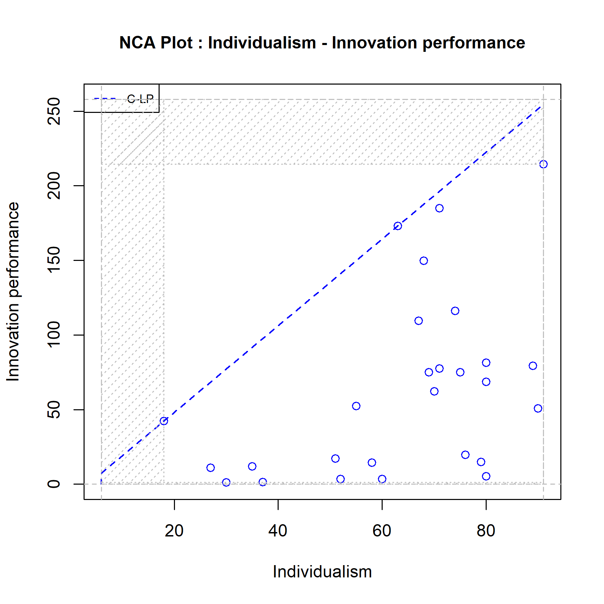
#knitr::include_graphics('other_scope1 BWcool.png')
```

The check reveals that an analysis with the larger theoretical scope yields a larger effect size. In the current example, this does not change the main conclusion. 
<!-- When the analyst would have selected a theoretical scope for the analysis and changes that for a smaller empirical scope, the effect size will be *smaller* and may also affect the analyst’s conclusion about the hypothesis from 'rejected' to 'not rejected'. -->


### Different choice of the threshold level of the effect size
The analyst could also have made another choice for the effect size threshold level. If the threshold level is changed from the common 0.10 value (“small effect”) to a larger value of 0.20 (“medium effect”), the conclusion for the illustrative example about the hypothesis would not change, as the original effect size $d$ = 0.33. The robustness check of effect size threshold suggests a robust result. 


### Different choice of the threshold level of the $p$-value
The analyst could also have made another choice for the $p$-value threshold level ($\alpha$). If the threshold level is changed from the common 0.05 value to a stricter level of $p$ = 0.01, the conclusion in the above example about the hypothesis would change. This robustness check indicates that the statistical significance of the result is fragile. 


### Different outlier choice
The fourth robustness check is the outlier robustness check. NCA results can be sensitive to the handling of outliers as they, by definition, influence the effect size estimate (Section \@ref(outliers)). An earlier decision to include potential outliers could be challenged by excluding one or more potential outliers with the largest influence on the effect size if removed. Similarly, an earlier decision to exclude on or more outlier with relatively large influence on the effect size, could be challenged by including them, or by excluding additional outliers.

In the illustrative example, one single outlier was removed from the analysis. This decision is challenged in two ways: (1) the removed outlier (Japan) is included again in the analysis, (2) an additional outlier that makes a pair with Japan is also excluded (Finland).

The ```R```-code for this robustness check is as follows:
  
``` {r, echo=TRUE,  eval=TRUE, fig.show = 'hide', warnings = FALSE}
library (NCA)
data(nca.example)
nca.exampleN <- nca.example[-14,]

#outlier change 1 (include the earlier removed outlier)
set.seed(123)
modelN4 <- nca_analysis(nca.example, 1,3, ceilings = 'c_lp', test.rep = 10000)
modelN4
nca_output(modelN4, summaries = FALSE)
modelN4b <- nca_analysis(nca.example, 1,3, ceilings = "c_lp", 
                       bottleneck.y = 'percentile',
                       bottleneck.x = 'percentile',
                       steps = c(85,90,95))
nca_output(modelN4b, summaries = FALSE, bottlenecks = T)

#outlier change 2 (remove an additional outlier)
nca_outliers(nca.example, 1,3,
             ceiling = 'c_lp',
             k = 2, 
             condensed = TRUE) #Japan and Finland
nca.exampleN2 <- nca.example[-c(7,14),]

set.seed(123)
modelN5 <- nca_analysis(nca.exampleN2, 1,3,
                        ceilings = 'c_lp',
                        test.rep = 10000)
modelN5
nca_output(modelN5, summaries = FALSE)
modelN5b <- nca_analysis(nca.exampleN2, 1,3, ceilings = "c_lp", 
                       bottleneck.y = 'percentile',
                       bottleneck.x = 'percentile',
                       steps = c(85,90,95))
nca_output(modelN5b, summaries = FALSE, bottlenecks = T)
```
  
``` {r, echo=FALSE, cache=FALSE, eval=FALSE}
library (NCA)
data(nca.example)
nca.exampleN <- nca.example[-14,]

#outlier change 1 (include the earlier removed outlier)
set.seed(123)
modelN4 <- nca_analysis(nca.example, 1,3, 
                        ceilings = 'c_lp',
                        test.rep = 10000)
modelN4
#png("other_outlier11.png", units="cm", 15,15, res=300)
nca_output(modelN4, summaries = FALSE)
#dev.off()

#outlier change 2 (remove an additional outlier)
nca_outliers(nca.example, 1,3, ceiling = 'c_lp', k = 2)
nca.exampleN2 <- nca.example[-c(7,14),]

set.seed(123)
modelN5 <- nca_analysis(nca.exampleN2, 1,3, 
                        ceilings = 'c_lp', 
                        test.rep = 10000)
modelN5
#png("other_outlier21.png", units="cm", 15,15, res=300)
nca_output(modelN5, summaries = FALSE)
#dev.off()
```

```{r otheroutlier, echo=FALSE, out.width='49%', fig.align ='center', fig.show='hold', fig.cap= "Outlier robustness check for the illustrative example: Results with re-including the outlier (Left), and with excluding an additional outlier (Right)."}
#knitr::include_graphics('other_outlier1.png')
#knitr::include_graphics('other_outlier2.png')
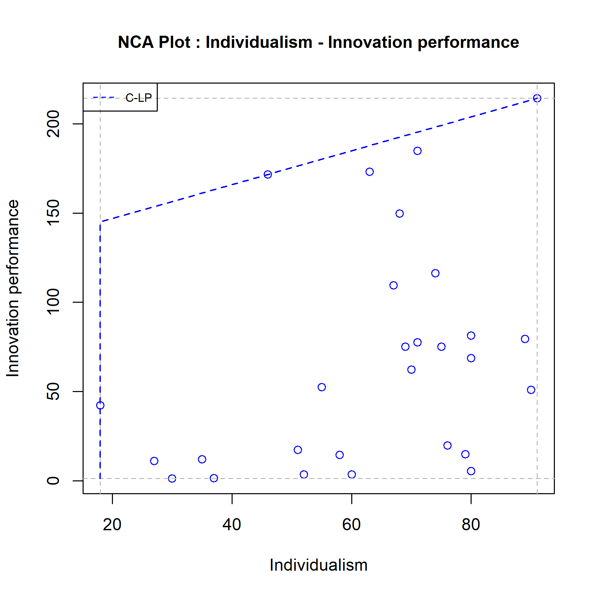

#knitr::include_graphics('other_outlier11 BWcool.png')
#knitr::include_graphics('other_outlier21 BWcool.png')
```

  
The results of these outlier changes are shown in Figure \@ref(fig:otheroutlier). The first outlier change (re-introducing the outlier, Figure \@ref(fig:otheroutlier)-left) reduces the effect size from 0.33 to 0.16 and produces  a statistically non-significant result ($p$ = 0.315). The second outlier change (removing a second outlier, Figure \@ref(fig:otheroutlier)-right) increases the effect size slightly to 0.35 while keeping the results significant ($p$ = 0.028).

The outlier robustness check indicates that the results are sensitive to outliers.


<!-- ``` {r, echo=FALSE, cache=TRUE, include=FALSE, eval = FALSE} -->
<!-- library (NCA) -->
<!-- data(nca.example) -->
<!-- data <- nca.example  -->
<!-- data <- data[-c(14,22,26),] -->
<!-- model2 <- nca_analysis (data, 1 ,3, ceilings = 'ce_fdh', test.rep = 13) -->
<!-- model2 -->
<!-- #png("exampleWesternOutlier.png", units="cm", 15,15, res=300) -->
<!-- nca_output(model2, summaries = FALSE) -->
<!-- text(57,185,'Finland', cex=1,col="red") -->
<!-- segments(30,5,33,50) -->
<!-- text(33,60,'Mexico', cex=1,col="red") -->
<!-- text(88,205,'USA', cex=1,col="red") -->
<!-- #dev.off() -->
<!-- ``` -->

<!-- ```{r exampleWesternOutlier, echo=FALSE, out.width='100%', fig.cap="Example of an outlier robustness check: Comparing the results with and without removing an outlier. Mexico = potential scope outlier; Finland = potential ceiling outlier; USA = potential scope and ceiling outlier."} -->
<!-- knitr::include_graphics('exampleWesternOutlier.png') -->
<!-- ``` -->


### Different choice of the target outcome
The last robustness check explores the stability of the bottleneck analysis in terms of the percentage of cases that cannot achieve the target outcome because the condition is not satisfied. With the 90th percentile specified as the target outcome, one could for example check how the results change if the target outcome is set somewhat lower (85th percentile) or higher (95th percentile).

``` {r, echo=TRUE, eval=TRUE, warnings= FALSE}
library(NCA)
data(nca.example)
nca.exampleN <- nca.example[-14,]

modelN <- nca_analysis(nca.exampleN, 1,3, ceilings = "c_lp", 
                       bottleneck.y = 'percentile',
                       bottleneck.x = 'percentile',
                       steps = c(85,90,95))

nca_output (modelN, plots = FALSE, summaries = FALSE, bottlenecks = TRUE)
```

``` {r, echo=FALSE, eval=FALSE}
library(NCA)
data(nca.example)
nca.exampleN <- nca.example[-14,]

# original
modelN <- nca_analysis(nca.exampleN, 1,3, ceilings = "c_lp", 
                       bottleneck.y = 'percentile',
                       bottleneck.x = 'percentile',
                       steps = c(85,90,95))

#png("other_target_outcome.png", units="cm", 15,15, res=300)
nca_output (modelN, summaries = FALSE, bottlenecks = TRUE)
q85 <- quantile(nca.exampleN$`Innovation performance`, probs = 0.85)
q90 <- quantile(nca.exampleN$`Innovation performance`, probs = 0.90)
q95 <- quantile(nca.exampleN$`Innovation performance`, probs = 0.95)
abline(h=q85,lty = "dashed")
abline(h=q90)
abline(h=q95,lty = "dashed", col="black")
abline(v=44.7, lty = "dotted")
abline(v=58.2, lty = "dotted")
abline(v=66, lty = "dotted")
text(45,128,'85th percentile', cex=1,col="black")
text(45,166,'90th percentile', cex=1,col="black")
text(45,188,'95th percentile', cex=1,col="black")
#dev.off()

```


```{r othertargetoutcome, echo=FALSE, out.width='75%', fig.align ='center', fig.cap="Target outcome robustness check. The effect of changing the target outcome from 90th percentile to 85th and 95th percentile."}
#knitr::include_graphics('other_target_outcome.png')
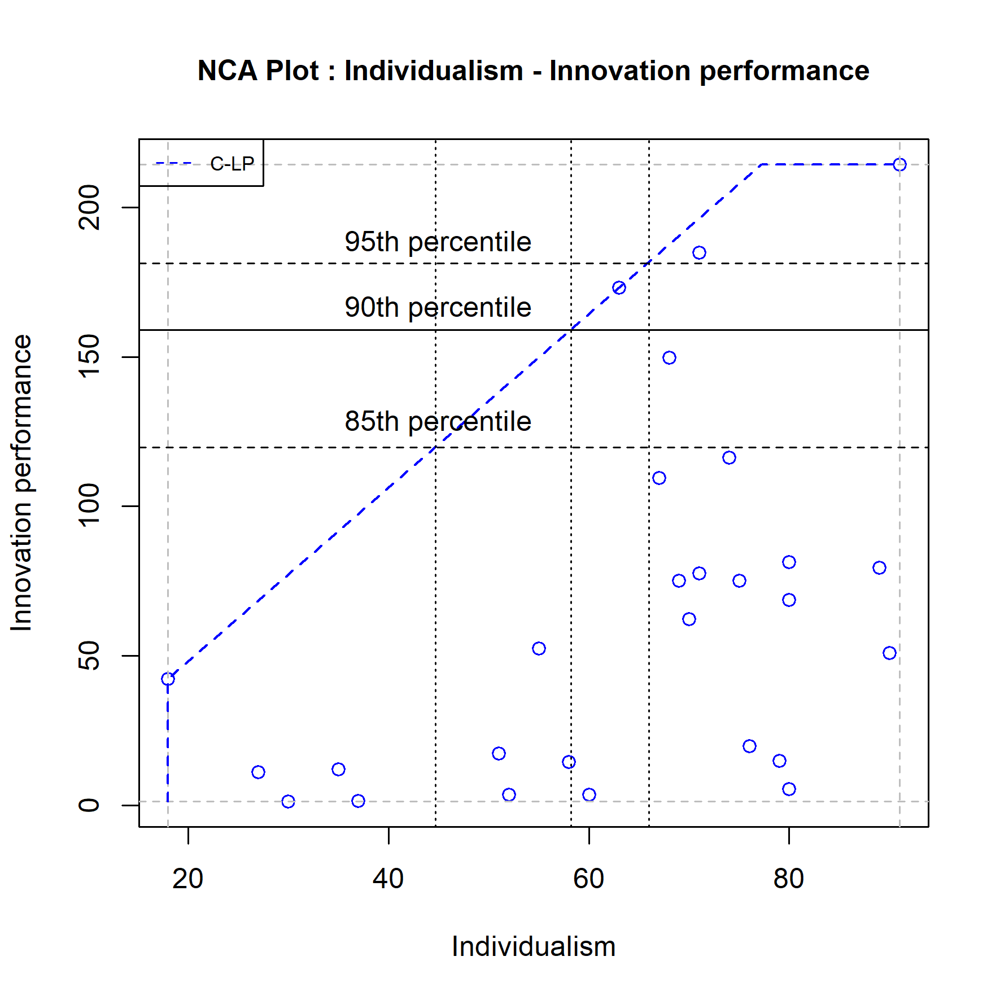
#knitr::include_graphics('other_target_outcome1 BWcool.png')
```

Figure \@ref(fig:othertargetoutcome) shows that for the original target outcome (90th percentile) 33.3% of the cases (9 cases) did not achieve the required minimum level of the condition. For a target outcome of 85th percentile this percentage reduces to 18.5% (5 cases) and for 95th percentile this percentage increases to 40.7% (11 cases).  The percentage of bottleneck cases changes considerably with minor changes of the target outcome.
   
### Robustness table {#robustnesstable}
The results of the robustness checks can be summarized in an NCA robustness table (Table \@ref(tab:robustnesstable)) where the original NCA results are compared with the results when alternative feasible choices are made. The first row shows the original results, and the next rows display the results under alternative choices. To check robustness of *necessity-in-kind*,  the effect size, the $p$-value, and the conclusion about necessity (assuming theoretical support) are presented. To check the robustness of *necessity-in-degree*, the percentage (%) and number (n) of bottleneck cases that are unable to achieve the required level of the condition for a selected target level of the outcome are presented.


<!-- ```{r robustnesstablefig, echo=FALSE, out.width='99%', fig.align ='center', fig.cap="Robustness table with summary of robustness checks."} -->
<!-- knitr::include_graphics('robustness_table.png') -->
<!-- ``` -->


<!-- ```{r robustchecks1, echo = FALSE, eval = FALSE, warning=FALSE} -->

<!-- generate_nca_table <- function(file_path) { -->
<!--   # Load required libraries -->
<!--   library(knitr) -->
<!--   library(kableExtra) -->
<!--   library(tidyverse) -->
<!--   library(openxlsx) -->
<!--   # Read the data from the Excel file -->
<!--   rob <- read.xlsx("robustness_table1.xlsx", sheet = 1) -->
<!--   colnames(rob) <- c("Condition", "Robustness check", "Effect size", "p value", "Necessity", "Bottlenecks(%)", "Bottlenecks(#)") -->

<!--   # Preprocess `robs` and define columns -->
<!--   robs <- rob[, c(2, 3, 4, 5, 6, 7)] -->
<!--   robs$`Bottlenecks(%)` <- round(robs$`Bottlenecks(%)`, 1) -->
<!--   robs$`Effect size` <- sprintf("%.2f", as.numeric(robs$`Effect size`)) -->
<!--   robs$`p value` <- sprintf("%.3f", as.numeric(robs$`p value`)) -->

<!--   # Get the unique conditions to determine the number of blocks -->

<!--   conditions <- unique(rob$Condition) -->

<!--   # Define block size -->
<!--   block_size <- 11  # Number of robustness checks (excluding block name) -->

<!--   # Function to pad or truncate rows to match the block size -->
<!--   adjust_block <- function(block_data, block_size) { -->
<!--     n_rows <- nrow(block_data) -->
<!--     if (n_rows > block_size) { -->
<!--       return(block_data[1:block_size, ]) # Truncate to match block size -->
<!--     } else if (n_rows < block_size) { -->
<!--       padding <- data.frame(matrix("", nrow = block_size - n_rows, ncol = ncol(block_data))) -->
<!--       colnames(padding) <- colnames(block_data) -->
<!--       return(rbind(block_data, padding)) # Add empty rows to match block size -->
<!--     } -->
<!--     return(block_data) # Already matches block size -->
<!--   } -->

<!--   # Create a list to store the adjusted blocks of data -->
<!--   block_data_list <- list() -->
<!--   for (i in 1:length(conditions)) { -->
<!--     start_row <- (i - 1) * block_size + 1 -->
<!--     end_row <- min(i * block_size, nrow(robs)) -->
<!--   # Adjust the block size (pad or truncate) -->
<!--     block_data_list[[i]] <- adjust_block(robs[start_row:end_row, ], block_size) -->
<!--   } -->

<!--   # Combine blocks with titles, dynamically based on the number of conditions -->
<!--   robs_with_titles <- NULL -->
<!--   for (i in 1:length(conditions)) { -->
<!--     block_title <- c(conditions[i], rep("", ncol(robs) - 1)) # Title row for each block -->
<!--     block_data <- block_data_list[[i]] # Select corresponding block data -->

<!--     # Bind title row and block data together -->
<!--     robs_with_titles <- rbind(robs_with_titles, block_title, block_data) -->
<!--   } -->

<!--   # Generate the table with styled rows -->
<!--   kbl( -->
<!--    robs_with_titles, -->
<!--     booktabs = TRUE, -->
<!--     longtable = TRUE, -->
<!--     col.names = colnames(robs), -->
<!--     align = c("l", "l", "r", "r", "r", "r"), -->
<!--     caption = "NCA robustness table", -->
<!--     format = "html", -->
<!--     row.names = FALSE, # Remove row numbers -->
<!--     table.attr = "style='width:30%;'" -->
<!--   ) %>% -->
<!--     kable_styling(font_size = 9, full_width = F) %>% -->
<!--     kable_paper() %>% -->
<!--     scroll_box(width = "100%", height = "400px") %>% -->
<!--     row_spec(0, bold = TRUE, extra_css = "border-bottom: 2px solid black;") %>% # Add a dark line under the header -->
<!--     row_spec(seq(1, nrow(robs_with_titles), by = block_size + 1), bold = TRUE, background = "#f0f0f0") %>% # Highlight all block titles -->
<!--     row_spec(seq(10, nrow(robs_with_titles), by = block_size + 1), extra_css = "border-bottom: 2px solid black;") # Add dark lines after blocks -->
<!-- } -->

<!-- # Example usage: -->
<!-- generate_nca_table("robustness_table1z") -->
<!-- ``` -->

<!-- ```{r echo = FALSE, eval = TRUE, warning=FALSE , message = FALSE, results = 'hide'} -->
<!--   library(knitr) -->
<!--   library(kableExtra) -->
<!--   library(tidyverse) -->
<!--   library(openxlsx) -->
<!-- ``` -->


```{r robustnesstable, echo = FALSE, eval = TRUE, warning=FALSE, out.width='99%', cache=FALSE}
  library(kableExtra)
  library(openxlsx)

  rob <- read.xlsx("robustness_table1.xlsx", sheet = 1)
  
  #plain names
  colnames(rob) <- c("Condition", 
                     "Robustness check",
                     "Effect size", 
                     "p_value",
                     "Necessity",
                     "Bottlenecks_pct",
                     "Bottlenecks_n")

  robs <- rob[, c(2, 3, 4, 5, 6, 7)]

  # Format columns
  robs$Bottlenecks_pct <- round(as.numeric(robs$Bottlenecks_pct), 1)
  robs$`Effect size`   <- sprintf("%.2f", as.numeric(robs$`Effect size`))
  robs$p_value         <- sprintf("%.3f", as.numeric(robs$p_value))

  
  #   robs$`Bottlenecks(\\%)` <- round(robs$`Bottlenecks(\\%)`, 1)
  # robs$`Effect size` <- sprintf("%.2f", as.numeric(robs$`Effect size`))
  # robs$`\\emph{p}-value`     <- sprintf("%.3f", as.numeric(robs$`\\emph{p}-value`))


 tab <-  kbl(
    robs,
    format = "latex", 
    escape = FALSE,  #Prevent escaping of LaTeX special characters 
    booktabs = TRUE,
    linesep= "",
    longtable = FALSE,
    col.names = c("Robustness check",
                  "Effect size",
                  "\\emph{p}-value",
                  "Necessity",
                  "Bottlenecks(\\%)",
                  "Bottlenecks(n)"),
    align = c("l", "l", "r", "r", "r", "r"),
    caption = "NCA robustness table for the illustrative example.",
    #format = "latex",
    row.names = FALSE
  ) |>
    kable_styling(latex_options = "hold", font_size = 9,
    )
tab
``` 


<!-- ```{r theorymethodfit, echo = FALSE, warning=FALSE, message=FALSE, out.width='99%', cache=FALSE} -->

<!-- library("kableExtra") -->
<!-- library(openxlsx) -->
<!-- tmfit <- openxlsx::read.xlsx("theory_method_fit.xlsx", sheet = 1) -->
<!-- colnames(tmfit) <- c("","Probabilistic sufficiency", "Configurational sufficiency", "Necessity (in degree)") -->
<!-- kbl( -->
<!--   tmfit, -->
<!--   longtable = T, #format = "latex", -->
<!--   booktabs = TRUE, -->
<!--   caption = "Theory-method fit." -->
<!-- ) %>% -->
<!--   kable_styling(full_width = F)  %>% -->
<!--   kableExtra::kable_styling(latex_options = "HOLD_position") %>% -->
<!--   column_spec(1, width = "7em") %>% -->
<!--   column_spec(2, width = "7em") %>% -->
<!--   column_spec(3, width = "7em") %>% -->
<!--   column_spec(4, width = "7em") -->

<!-- ``` -->


The robustness checks indicate that the original necessity-in-kind result is sensitive to the exclusion/inclusion of the identified single outlier (Japan). When this outlier is added again to the analysis, the effect size reduces and the statistical significance disappears. Considering a rare single outlier as an exception according to the typicality necessity approach is possible, as the other robustness checks generally show more stable results, with effect sizes well above the threshold level of 0.10. The statistical significance is somewhat fragile as changing the significance threshold level from 0.05 to 0.01 makes the results statistically insignificant. This may be related to the relatively small sample size.

The robustness checks regarding the necessity-in-degree results show that the number of bottleneck cases reduces when outliers are handled differently, or when the selected level of the target outcome is somewhat reduced. This suggests that necessity-in-degree results are fragile, which can be explained by the irregular border between the feasible area and the ceiling zone.

Before the original results can be generalized, replications with other samples are needed. Generalization should only be made when a consistent trend emerges across multiple studies. This is a general principle that applies to any single empirical study, including an NCA study. 

<!-- Uitzetten rood = zwart -->
<!-- ```{=latex} -->
<!-- \endgroup -->
<!-- ``` -->


<!--chapter:end:100-data-analysisJO.Rmd-->

# Reporting {#reporting}

## Summary of this chapter
Previous chapters explained how to develop a formal necessity hypothesis (Chapter 7), and how to subsequently test it using empirical data (Chapter 8) and NCA's data analysis approach (Chapter 9). This chapter describes how to report an NCA study. The goal is to report insights from the study, how these were obtained, and how they contribute to theoretical understanding and practical application. The chapter focuses on a written report for an academic audience (e.g., a journal article), but it can also be the basis for other reporting formats (e.g., presentations) and other audiences (e.g., practitioners, the general public). First, Section \@ref(typesofncapublications) distinguishes between several types of NCA publications (empirical, theoretical, methodological introductions, and practical) and provides examples of publications and recommendations. Second, Section \@ref(review) follows the common format of an academic publication (introduction - theory/hypotheses - methods - results - discussion) to present recommendations for conducting and reporting a high-quality NCA study. This section includes the SCoRe checklist for authors, editors, reviewers, and others to evaluate the quality of an NCA study and its reporting. 

## Types of NCA publications {#typesofncapublications}
NCA publications can be categorized into empirical, theoretical, methodological introductions, and practical publications. In the remainder of this chapter, it is assumed that the reader of the publication is a scholar or an engaged practitioner who is interested in NCA or in the substantive topic to which NCA is applied. While readers may not be experts on NCA, it is likely that they are familiar with the substantive topic.


<!-- In  *empirical* publications, NCA's necessity logic and data analysis approach is applied with empirical (or simulated) data. The distinguishing element compared to other types of NCA publications is the use of data from reality or data that are supposed to represent reality. Empirical NCA publications focus on providing a theoretical contribution to the academic knowledge by testing a necessity hypothesis using a deductive approach.   -->

### Empirical publication {#empiricalpublication}

An empirical NCA study applies NCA's methodology (e.g., necessity logic) and NCA's method (e.g., for data analysis) to data that represent reality. The goal is to obtain a better understanding of a specific phenomenon of interest. In an academic setting, the intention is to contribute to the theoretical understanding of the phenomenon. In a practical setting, the intention is to contribute to solving a practical problem related to the phenomenon. A high-quality empirical NCA publication often has two main parts. The first part uses a *necessity causal perspective* for reframing current understanding of the phenomenon by distinguishing between essential (necessary) and contributing (substitutable) factors. The formulation of one or more formal necessity hypotheses is a central part of it. This implies that a formal hypothesis is formulated before the data analysis is conducted. While it is possible to conduct NCA in an inductive/exploratory manner (i.e., without a predefined hypothesis), this book focuses on the deductive approach for reasons mentioned in Chapter \@ref(hypothesisformulation). The second part is the *empirical testing* of the hypotheses by providing evidence that supports or refutes the expected necessity relationship.

In an academic setting, the empirical publication is intended to provide a *contribution* to the academic knowledge and literature. The report of the study could contribute to a 'conversation' about a certain topic in the academic literature [e.g., @campbell2022rejected; @lange2017editors].^[The ideas presented here are in line with typical approaches for presenting theoretical ideas using the 5 C’s of theory development: Constructs, Connections, Contingencies, Causal mechanisms, and Contributions [@lange2017editors]. However, this is only one way of structuring an academic argument about NCA. Academic writing is, after all, a matter of preference/style.] The conversation starts with a *common ground*. This refers to an ongoing conversation about the problem/topic in the primary literature (i.e., what do we know?), and to which NCA contributes new insights. After that, an interesting *complication* is highlighted. This could, for example, be a missing element or an inconsistency in the academic conversation (i.e., what we don’t know?). Afterwards, it is explained why this complication is a *concern* (i.e., so what?), and it is reported how the *course of action* (i.e., NCA) addresses this complication. Finally, the *contribution* is described by showing how and why the new insights are now part of the ongoing conversation. For an empirical publication, the narrative to report the insights could focus on developing and testing a necessity hypothesis from scratch, or developing and testing an existing suggestion for a necessity relationship. Tables \@ref(tab:contr1) and \@ref(tab:contr3) provide examples of how such contributions could be formulated, respectively.

<br/>
```{r contr1, echo = FALSE, eval = TRUE, warning=FALSE, message=FALSE, include=TRUE, cache= FALSE}
library("kableExtra")
library(openxlsx)
g1 <- openxlsx::read.xlsx("Theoretical contribution1b.xlsx", sheet = 1)

kbl(
  g1,
  longtable = T, #format = "latex",
  booktabs = TRUE,
  linesep = "",
  caption = "Example of the formulation of the contribution of an empirical NCA publication that develops and tests a new necessity hypothesis.",
  ) %>%
  kable_styling(full_width = F)  %>%
  kableExtra::kable_styling(latex_options = "HOLD_position") %>%
  column_spec(1, width = "30em") %>%
  pack_rows("Common Ground (What do we know?)", 1,1) %>%
  pack_rows("Complication (What don't we know?)", 2, 2) %>%
  pack_rows("Concern (So what?)", 3, 3) %>%
  pack_rows("Course of action", 4, 4) %>%
  pack_rows("Contribution", 5, 5)
```
<br/>


<!-- ```{r contr2, echo = FALSE, warning=FALSE, message=FALSE, include=TRUE, cache=FALSE} -->
<!-- library("kableExtra") -->
<!-- g2 <- read.csv("Theoretical contribution2a.csv") -->
<!-- kbl(g2, caption = "Formulating a theoretical contribution with NCA: are factors complements or substitutes.", longtable = TRUE, align = c("l", "c")) %>% -->
<!-- kable_paper("striped", full_width = F) %>% -->
<!-- pack_rows("Common Ground (What do we know?)", 1,1) %>% -->
<!-- pack_rows("Complication (What don't we know?)", 2, 2) %>% -->
<!-- pack_rows("Concern (So what?)", 3, 3) %>% -->
<!-- pack_rows("Course of action", 4, 4) %>% -->
<!-- pack_rows("Contribution", 5, 5) -->
<!-- ``` -->
<!-- <br/> -->


```{r contr3, echo = FALSE, eval=TRUE, warning=FALSE, message=FALSE, include=TRUE, cache=FALSE}
library("kableExtra")

g3 <- read.csv("Theoretical contribution3a.csv", stringsAsFactors = FALSE, check.names = FALSE)

library("kableExtra")
library(openxlsx)
g3 <- openxlsx::read.xlsx("Theoretical contribution3b.xlsx", sheet = 1)

kbl(
  g3,
  longtable = T, #format = "latex",
  booktabs = TRUE,
  linesep = "",
  caption = "Example of the formulation of the contribution of an empirical NCA publication that further develops and tests an existing necessity hypothesis.",
  ) %>%
  kable_styling(full_width = F)  %>%
  kableExtra::kable_styling(latex_options = "HOLD_position") %>%
  column_spec(1, width = "30em") %>%
  pack_rows("Common Ground (What do we know?)", 1,1) %>%
  pack_rows("Complication (What don't we know?)", 2, 2) %>%
  pack_rows("Concern (So what?)", 3, 3) %>%
  pack_rows("Course of action", 4, 4) %>%
  pack_rows("Contribution", 5, 5)
```


In an empirical NCA publication, the following sections (or similar) are often present: 

* Introduction: introduction of necessity logic/theory and description of the contribution.

* Theory/hypotheses: development of (one or more) formal necessity hypotheses using NCA's methodology for necessity causal logic.

* Methods: description of the data analysis approach using the NCA method.

* Results: presentation of NCA's results including the conclusion about (non-)support of the hypotheses.

* Discussion: description of the potential importance of the (non-)support of the hypotheses for theory and practice.

<!-- NCA may be used as stand-alone approach or in combination with other methodological approaches, such as QCA (see Section \@ref(ncaqca)) or regression-based methods (see Section \@ref(ncaregression)). -->

Appendix \@ref(appendixa) provides an overview of empirical journal articles until the end of 2025 that apply NCA. These publications are presented here to illustrate in which fields NCA has been applied. They do not serve as good examples of high-level applications of NCA. Detailed recommendations for conducting and reporting an empirical NCA study at a high level are presented in Section \@ref(review). 
<!-- Similar overviews avaiable for combining NCA with multiple linear regression (Appendix \@ref(appendixncamlr)), with co-variance based structural equation modeling (Appendix \@ref(appendixncasem)), partial-least-squares structural equation modeling (Appendix \@ref(appendixncaplssem)), with QCA (Appendix \@ref(appendixncaqua)), and with other methods (\@ref(appendixncaother)).  -->

<!-- All provided suggestions apply to the NCA-part of the publication. Combining NCA with other methods is no reason to compromise on the quality of the NCA application or its reporting. -->

### Theoretical publication {#theoreticalpublication}

In some cases, the theoretical implications of using necessity theory according to the NCA methodology to describe a phenomenon may be complicated enough to warrant a separate publication. In a *theoretical* NCA publication, the focus can be on formulating necessity theory or defining concepts. The main contribution is the use of necessity logic. In such a publication, attention may be paid to NCA's specific characteristics of this logic, such as conditional logic with a causal assumption, necessity-in-degree, or the typicality necessity perspective. Unlike in an empirical publication, a theoretical publication does not include an analysis of empirical data.

Few examples exist of theoretical publications with NCA (Table \@ref(tab:pubstabletheoretical)).

```{r pubstabletheoretical, echo = FALSE, warning=FALSE, message=FALSE, out.width='99%', cache=FALSE}
library(kableExtra)
library(tidyverse)
library(openxlsx)
pub <- openxlsx::read.xlsx("Publications NCA Theoretical 2016-2025.xlsx", sheet = 1)
pubs <- pub[,c(1,2,3,4)]
colnames(pubs) <- c("Year", "Author(s)", "Journal/Book", "Main contribution")
kbl(
  pubs,
  longtable = T, #format = "latex",
  booktabs = TRUE,
  #align = c("l", "l", "l", "l"),
  caption = "Examples of theoretical journal articles with NCA."
  #table.attr = "style='width:30%;'"
  ) %>%
  kable_styling(full_width = F)  %>%
  kableExtra::kable_styling(latex_options = "HOLD_position") %>%
column_spec(1, width = "2em")  %>%
column_spec(2, width = "10em") %>%
column_spec(3, width = "10em") %>%
column_spec(4, width = "10em")
```


### Methodological introduction publication {#methodologicalcontribution}
The goal of a *methodological introduction publication* about NCA is to introduce NCA in a specific field by explaining its methodology and method.

<!-- Since 2016, several publications about the development of NCA have appeared (see Table \@ref(tab:methodspubstable)).  -->

```{r methodspubstable, echo = FALSE, warning=FALSE, message=FALSE, out.width='99%', eval = FALSE}

library(kableExtra)
library(tidyverse)
library(openxlsx)
pub <- openxlsx::read.xlsx("Publications NCA Methodological 2016-2025.xlsx", sheet = 1)
pubs <- pub[,c(1,2,3,4)]
colnames(pubs) <- c("Year", "Author(s)","Journal/Book", "Main contribution")
kbl(
  pubs,
  longtable = T, #format = "latex",
  booktabs = TRUE,
  linesep = "",
  #align = c("l", "l", "l", "l"),
  caption = "Methodological publications about NCA."
  #table.attr = "style='width:30%;'"
  ) %>%
  kable_styling(full_width = F, latex_options = "HOLD_position") %>%
  pack_rows("NCA", 1,8) %>%
  pack_rows("QCA and NCA", 9, 10) %>%
  pack_rows("PLS-SEM and NCA", 11, 14) %>%

  column_spec(1, width = "2em", latex_valign = "p")  %>%
  column_spec(2, width = "10em", latex_valign = "p") %>%
  column_spec(3, width = "10em",latex_valign = "p") %>%
  column_spec(4, width = "10em", latex_valign = "p")

```

Since the introduction of NCA in 2016, publications have introduced the approach, or part of it, in specific fields, often illustrated with examples from that field. Examples of these publications are shown in Table \@ref(tab:pubstablemethodsintro). 

```{r pubstablemethodsintro, echo = FALSE, warning=FALSE, message=FALSE, out.width='99%', cache=FALSE}
library(kableExtra)
library(tidyverse)
library(openxlsx)
pub <- openxlsx::read.xlsx("Publications NCA Methodological_intro 2016-2025.xlsx", sheet = 1)
pubs <- pub[,c(1,2,3,4)]
colnames(pubs) <- c("Year", "Author(s)","Journal/Book", "Main contribution")
kbl(
  pubs,
  longtable = T, #format = "latex",
  booktabs = TRUE,
  linesep = "",
  #align = c("l", "l", "l", "l"),
  caption = "Examples of publications with methodological introductions of NCA."
  #table.attr = "style='width:30%;'"
  ) %>%
  kable_styling(full_width = F)  %>%
  kableExtra::kable_styling(latex_options = "HOLD_position") %>%
column_spec(1, width = "2em")  %>%
column_spec(2, width = "10em") %>%
column_spec(3, width = "10em") %>%
column_spec(4, width = "10em")
```

As yet, only a small selection of fields has been covered by such publications, while NCA has been applied in many fields and could be applied in even more. This means there is room for more publications introducing NCA to a specific field. Introducing NCA in a new specific field has particular added value if it can be explained that:

* Necessity logic is particularly useful for the field in general or for specific *topics and challenges* (e.g., a list of potential topics/challenges that can benefit from NCA).

* *Necessity thinking* already (often implicitly) exists in the literature of the field (e.g., a list of necessity statements from the field).

* NCA is *different* from conventional methodologies and methods (e.g., by explaining the logic and the steps of NCA using an example from the field).

* NCA brings new *insights* to the field (e.g., an example of applying NCA to a topic from the field).

<!-- ### Referencing publication {#referencingpublication} -->

<!-- \textcolor{red}{De paragraaf gaat weg. De inhoud van de tabellen naar inleiding. Voor 10.7 artikelen uit de beste journals selecteren} -->

<!-- A referencing publication is a publication that discusses the use of NCA but does not apply it and is not a methodological contribution. Often these publications suggest the use of NCA in future studies such as in publications of *reviews* (e.g., systematic review, meta-analysis), or in publications of  *single empirical studies*. Examples of these publications are shown in Tables \@ref(tab:pubstablereferencingoverview) and \@ref(tab:pubstablereferencingfuture), respectively. -->

<!-- ```{r pubstablereferencingoverview, echo = FALSE, warning=FALSE, message=FALSE, out.width='99%', cache=FALSE} -->
<!-- library(kableExtra) -->
<!-- library(tidyverse) -->
<!-- library(openxlsx) -->
<!-- pub <- openxlsx::read.xlsx("Publications NCA Referencing_overview 2016-2025.xlsx", sheet = 1) -->
<!-- pubs <- pub[,c(1,2,3,4)] -->
<!-- colnames(pubs) <- c("Year", "Author(s)","Journal/Book", "Main contribution") -->
<!-- kbl( -->
<!--   pubs, -->
<!--   longtable = T, #format = "latex", -->
<!--   booktabs = TRUE, -->
<!--   linesep = "", -->
<!--   #align = c("l", "l", "l", "l"), -->
<!--   caption = "Examples of review publications suggesting NCA for future studies." -->
<!--   #table.attr = "style='width:30%;'" -->
<!--   ) %>% -->
<!--   kable_styling(full_width = F)  %>% -->
<!--   kableExtra::kable_styling(latex_options = "HOLD_position") %>% -->
<!-- column_spec(1, width = "2em")  %>% -->
<!-- column_spec(2, width = "10em") %>% -->
<!-- column_spec(3, width = "10em") %>% -->
<!-- column_spec(4, width = "10em") -->
<!-- ``` -->


<!-- ```{r pubstablereferencingfuture, echo = FALSE, warning=FALSE, message=FALSE, out.width='99%', cache=FALSE} -->
<!-- library(kableExtra) -->
<!-- library(tidyverse) -->
<!-- library(openxlsx) -->
<!-- pub <- openxlsx::read.xlsx("Publications NCA Referencing_future 2016-2025.xlsx", sheet = 1) -->
<!-- pubs <- pub[,c(1,2,3,4)] -->
<!-- pubs <- pub[1:17,] #DELETE AFTER SELECTION -->
<!-- colnames(pubs) <- c("Year", "Author(s)","Journal/Book", "Main contribution") -->
<!-- kbl( -->
<!--   pubs, -->
<!--   longtable = T, #format = "latex", -->
<!--   booktabs = TRUE, -->
<!--   linesep = "", -->
<!--   #align = c("l", "l", "l", "l"), -->
<!--   caption = "Examples of empirical studies suggesting NCA for future studies." -->
<!--   #table.attr = "style='width:30%;'" -->
<!--   ) %>% -->
<!--   kable_styling(full_width = F)  %>% -->
<!--   kableExtra::kable_styling(latex_options = "HOLD_position") %>% -->
<!-- column_spec(1, width = "2em")  %>% -->
<!-- column_spec(2, width = "10em") %>% -->
<!-- column_spec(3, width = "10em") %>% -->
<!-- column_spec(4, width = "10em") -->
<!-- ``` -->


### Practical publication {#practicalpublication}
A final category of publications is relatively scarce. In the first 10 years of NCA, the focus was on the development of the methodology and the introduction in the academic world. Although academic publications often stress the practical relevance and potential of NCA, its uptake in practice has only just started. Early adopters, innovators and pioneers may have used NCA in their practical settings, but such activities usually do not lead to public publications. Yet, experiences from the use of NCA in practice may help to further develop the method and yield valuable insights for both theory and practice. Some possibilities of using NCA in practice are discussed in Chapter \@ref(practice).

<!-- - Referencing publication: reference to (elements of) NCA, such as referencing (but not using) NCA’s necessity logic or to (elements of) NCA's data analysis approach, or suggesting the use of NCA for future research (for example, in a review article or discussion section of a non-NCA publication). -->


## SCoRe checklist and recommendations {#review}

The publications listed in Appendix \@ref(appendixa) are examples of adoptions of NCA during the first decade of NCA’s existence. Applying an innovative methodological approach is courageous, but it can also be risky. “When an emerging method’s standards of good practice are not yet broadly known, an early and fast adoption of the method without deep understanding of its details may result in incorrect interpretations that depart from the original ones and may result in invalid conclusions” [@dul2022problematic, p. 1]. The advancement of NCA and the availability of tools for applying the method appropriately can help move NCA into the next phase. In light of this, the SCoRe checklist and its recommendations are presented to support application of the method at the highest possible level.   

The checklist and recommendations are meant to stimulate high-quality *empirical* NCA studies and their reporting. The SCoRe checklist is a tool for authors, peers, reviewers, editors, and readers in general to evaluate the quality of the execution and reporting of an NCA study. The acronym refers to the three themes covered in the checklist: **S**trengthening (theoretical rigor),  **Co**nducting (data and analysis quality), and **Re**porting (transparency). The checklist can help to identify study parts that are well developed, and those that need improvement.

The checklist is accompanied by best-practice guidelines. For each checklist item, recommendations are provided that can be used by analysts and authors for conducting their NCA study and for their publication about it. SCoRe can also help reviewers and others to provide constructive feedback.

The checklist and recommendations can be used for any empirical publication that uses NCA, whether NCA is the only method or is combined with other methods. In Sections \@ref(recommendationplssem) and  \@ref(recommendationplsqca), additional recommendations are given for applying NCA in combination with SEM and QCA, respectively.

SCoRe builds on several earlier works with basic guidelines for conducting and reporting NCA studies [@dul2023necessary],  recent developments in NCA reasoning [@dul2024different], necessity theorizing [@bokrantz2022building], sampling for NCA [@dul2024how], the use of archival data in NCA [@dul2024advancing], and the combined application of NCA and QCA [@dul2022problematic] or PLS-SEM [@richter2023apply; @hauff2024importance]. Additionally, it incorporates topics newly introduced in this book, such as the formulation of a formal necessity hypothesis (Chapter \@ref(hypothesisformulation)), the use of robustness checks (Section \@ref(robustnesschecks)) and updated recommendations for the combined application of NCA with SEM (Section \@ref(ncasem)) and NCA with QCA (Section \@ref(ncaqca)). SCoRe is based on current knowledge, but as NCA and its application are continuously developing, the checklist may be updated in the future.

Following the common structure of an empirical publication, the checklist and its recommendations have six parts: Introduction/General, Theory/Hypotheses, Methods – data, Methods – data analysis, Results, Discussion. Each part discusses 5-10 items to be addressed for a high-level empirical NCA publication. The items have different priority levels. Some are essential ('must-haves') that must be addressed in any NCA publication. If any of the must-haves is missing, the quality of the publication should be seriously questioned. Others are important ('should-haves') to increase the quality of the publication, and yet other items are the 'nice-to-haves'. When addressing all items, the publication meets the highest quality standard from the perspective of applying NCA, necessary for publishing in a high-ranking journal. Some items can be easily addressed, others need more reflection. For each item,  requirements, recommendations, and sources for further reading are provided.

Below the checklist items are presented, followed by the recommendations.^[An interactive version of the SCoRe checklist can be accessed via the book-page https://jandul.github.io/NCA/.] 

### Introduction/General {#introductiongeneral}

Table \@ref(tab:reviewchecklistquestionsintroduction) is the checklist for the Introduction/General part of applying and presenting NCA. The introduction should clearly define why NCA is used, describe it correctly, distinguish it from other causal methods, and highlight its role in the study.

```{r reviewchecklistquestionsintroduction, echo = FALSE, warning=FALSE, message=FALSE, eval=TRUE}
library(knitr)
library(kableExtra)
library(tidyverse)
library(openxlsx)

# Read Excel file
reviewer <- openxlsx::read.xlsx("~/AAA WERK IN DEZE VERSIE Book NCA test/bookdown-crc-version2/NCA_Reviewers_Checklist4Introduction3.xlsx", sheet = 1)

# Convert all columns to character
reviewer <- reviewer %>%
  mutate(across(everything(), as.character))

# Select required columns
reviewer <- reviewer[, c(3, 2, 4, 7)]

# Replace checkbox symbols
if (knitr::is_html_output()) {
  reviewer$Check <- gsub("☐", "&#9744;", reviewer$Check)
} else {
  reviewer$Check <- gsub("☐", "$\\square$", reviewer$Check)
}

reviewer1 <- reviewer[c(1:6),]
# group_ranges <- list(1:6, 7:15, 16:20, 21:27, 28:36, 37:42)

# Generate LaTeX Table
rev1 <- kbl(reviewer1,
           colnames = c("Item", "Priority", "Question", "Check"),
           caption = "SCoRe checklist – Questions for Introduction/General.",
           booktabs = TRUE,
           linesep = "",
           longtable = TRUE,
           align = c("l", "l", "l", "c"),
           escape = FALSE #allow special characters
) %>%
  
#for latex
  kable_styling(latex_options = c("HOLD_position"),
                full_width = FALSE,
                font_size = 9,
                position = "center") %>%

  # Define column widths
  column_spec(1, width = "1cm") %>%
  column_spec(2, width = "2cm") %>%
  column_spec(3, width = "6cm") %>%
  column_spec(4, width = "1.5cm")

# Ensure table scales correctly
rev1 <- rev1 %>%
  kable_styling(latex_options = c("scale_down"))

# Print the LaTeX table
rev1
```

The following recommendations help to achieve the goals of the checklist items:

<!-- formulate goals, describe relationships, use terminology, and position NCA theoretically and methodologically: -->

1. State the primary and (possibly) secondary goals and contributions of the empirical NCA study. The study may primarily contribute to theory development by, for example, developing and testing new necessity hypotheses, developing an existing necessity claim further toward a formal necessity hypothesis and testing it with NCA, or replicating results of previously tested necessity hypotheses. Secondary goals could be methodological (e.g., introducing NCA to a new field/phenomenon), or practical (e.g., using results of NCA for practically meaningful recommendations/insights).  
See this book: Chapter \@ref(hypothesisformulation), Section \@ref(typesofncapublications).  
Suggested articles: @bokrantz2022building; @dul2024different; @hollenbeck2017harking; @kohler2023constructive; @bergh2022constitutes.

2. When referring to necessity relationships, use appropriate terminology. In practice, this means using equivalents/derivatives of the statement that $X$ is necessary for $Y$. Avoid ambiguous statements ($X$ causes $Y$, $X$ correlates with $Y$, $X$ is associated with $Y$, $X$ affects $Y$), or incorrect (sufficiency-based) statements such as $X$ produces $Y$, $X$ drives $Y$, $X$ increases/decreases $Y$, etc.  
See this book: Table \@ref(tab:wordsnecessity).

3. Refer to NCA as a methodological approach that combines the theoretical perspective of necessity causality (rather than common probabilistic or configurational causality) with a corresponding data analysis method, ensuring theory-method fit. Emphasize that NCA entails more than just a data analysis or statistical method.  
See this book: Chapters \@ref(introduction), \@ref(causality), \@ref(statistics).  
Suggested article: @dul2024different.

4. When, in the context of an NCA study, a comparison is made between NCA's causal perspective and the causal perspective inferred from conventional regression-based/statistical approaches, use the term probabilistic sufficiency for the latter, and not just sufficiency. The term sufficiency suggests determinism (as applied in QCA's configurational sufficiency logic). This recommendation is often violated in studies that combine NCA with SEM. When NCA is compared with QCA's necessity analysis, use the term necessity analysis of QCA for the latter (and not NCA) and explain the differences between the necessity analysis of QCA (only necessity-in-kind) and that of NCA (also necessity-in-degree).  
See this book: Sections \@ref(sufficiencycausality), \@ref(necessitycausality).  
Suggested articles: @dul2024different; @dul2016jbr; @vis2018analyzing;  @dul2022problematic. 

5. In multimethod studies, use and refer to NCA as an approach with a specific perspective on causality and data analysis, and do not incorrectly refer to it as a robustness check or add-on to other methods (and vice versa). This recommendation is often violated in studies that combine NCA with SEM.  
See this book: Sections \@ref(underdetermination), \@ref(ncasem), \@ref(ncaqca).  
Suggested article: @dul2024different.

6. 	If important parts of the publication and/or its conclusions are based on necessity logic and NCA, ensure that this is reflected in the title and abstract by using words that reflect necessity logic or NCA.  
See this book: Table \@ref(tab:wordsnecessity).

### Theory/Hypotheses {#theoryhypotheses}
Table \@ref(tab:reviewchecklistquestionstheory) is the Theory/Hypothesis part of the checklist. This part is essential as it uses the NCA methodology to develop a formal hypothesis. A causal explanation of the necessity relationship is a central part of it. If it is missing, there is no theoretical justification for the hypothesis and the hypothesis should be rejected, regardless of whether the other criteria (effect size, $p$-value) are satisfied (Chapter \@ref(hypothesisformulation)).

```{r reviewchecklistquestionstheory, echo = FALSE, warning=FALSE, message=FALSE, eval=TRUE}
library(knitr)
library(kableExtra)
library(tidyverse)
library(openxlsx)

# Read Excel file
reviewer <- openxlsx::read.xlsx("~/AAA WERK IN DEZE VERSIE Book NCA test/bookdown-crc-version2/NCA_Reviewers_Checklist4Theory3.xlsx", sheet = 1)

# Convert all columns to character
reviewer <- reviewer %>%
  mutate(across(everything(), as.character))

# Select required columns
reviewer <- reviewer[, c(3, 2, 4, 7)]

# Replace checkbox symbols
if (knitr::is_html_output()) {
  reviewer$Check <- gsub("☐", "&#9744;", reviewer$Check)
} else {
  reviewer$Check <- gsub("☐", "$\\square$", reviewer$Check)
}

reviewer2 <- reviewer[c(1:7),]
# group_ranges <- list(1:6, 7:15, 16:20, 21:27, 28:36, 37:42)

# Generate LaTeX Table
rev2 <- kbl(reviewer2,
           colnames = c("Item", "Priority", "Question", "Check"),
           caption = "SCoRe checklist – Questions for Theory/Hypotheses.",
           booktabs = TRUE, 
           linesep = "",
           longtable = TRUE,
           align = c("l", "l", "l", "c"),
           escape = FALSE #allow special characters
) %>%
  
#for latex
  kable_styling(latex_options = c("HOLD_position"),
                full_width = FALSE,
                font_size = 9,
                position = "center") %>%

  # Define column widths
  column_spec(1, width = "1cm") %>%
  column_spec(2, width = "2cm") %>%
  column_spec(3, width = "6cm") %>%
  column_spec(4, width = "1.5cm")

# Ensure table scales correctly
rev2 <- rev2 %>%
  kable_styling(latex_options = c("scale_down"))

# Print the LaTeX table
rev2
```

7.	Formulate the necessity relationship explicitly as a necessary condition hypothesis: $X$ is necessary for $Y$. For a deductive study, this is done before data analysis; for an explorative study this is done after data analysis when indications for a necessity relationship are found.  
See this book: Section \@ref(developingformaltheory).

8.	To obtain a *formal necessity hypothesis* that is ready for testing, precisely define the four elements of the necessity theory. (1) Define the  concepts $X$ and $Y$ according to their meaning in the hypothesis. (2) Specify the hypothesis and its direction, which indicates which corner of the $XY$-plot is expected to be empty, particularly if the expected corner is not the default upper-left corner. (3) Specify the focal unit of which $X$ and $Y$ of the hypothesis are characteristics. (4) Define the theoretical domain where it is claimed/expected that the hypothesis will hold, given its boundary conditions. Note that the theoretical domain is usually larger than a population from which cases are selected.  
See this book: Section \@ref(definitionnecessitytheory), Chapter \@ref(hypothesisformulation) in particular , Section \@ref(developingformaltheory).

9.	Explain why $X$ is necessary for $Y$ using a causal explanation (narrative) by answering three questions: (1) Why does $X$ enable $Y$ ($X$ is an enabler). The existing literature may be a source of information; (2) Why does the absence of $X$ lead to the absence of $Y$ ($X$ is a constraint); (3) Why is the absence of $X$ not compensable (no substitution for $X$). Making the narrative complete is a creative process, supported by literature and experiences of scholars and practitioners.
See this book: Chapter \@ref(hypothesisformulation) in particular Section \@ref(causalexplanation).

10.	If this is not self-evident, include a plausible explanation of the temporal order (first $X$ then $Y$) in the description of why the necessity causal relationship exists. If the data support $X$ is necessary for $Y$, explain why the alternative reverse explanation, namely that  $Y$ is sufficient for $X$ (or in terms of necessity: absence of $Y$ is necessary for absence of $X$) that would also be consistent with the expected empty space, is not plausible. Also consider other temporal aspects of the hypothesis such as whether $X$ is necessary for the onset or continuation of $Y$, or whether the hypothesis holds in all time periods.  
See this book: Section \@ref(causalversusconditionallogic), Chapter \@ref(hypothesisformulation) in particular Section \@ref(causalexplanation).

11.	Review existing literature (that commonly describes probabilistic relationships between your variables X and Y), to find hints for necessity causality. Avoid just describing,  summarizing, or  referring to  probabilistic findings/ideas. Where possible, include quotes in the literature that hint to necessity logic. Avoid using sufficiency/probabilistic causal logic for making a justification for necessity causal logic. Note that only describing, summarizing, or quoting prior work (often based on probabilistic sufficiency logic) does not constitute a valid theoretical justification of a necessity hypothesis.  
See this book: Section \@ref(explicit), Table \@ref(tab:wordsnecessity).

<!-- 11.	If the direction of the necessity relationship differs from presence/high level of X is necessary for presence/high level of Y, formulate the direction of necessity in the necessary condition hypothesis by adding presence/high level or absence/low level of X and Y.\\ -->
<!-- This book: Section \@ref(direction) -->

12.	In a diagram representing an (expected) necessity relationship between two variables using an arrow, add a relevant symbol (+nc+,-nc+, -nc-, or +nc-) near the arrow to show the direction of necessity.  
See this book: Section \@ref(direction).

<!-- 13.	If this is not obvious from the definition of the X and Y concepts, the formulation of the hypothesis or the theoretical domain, specify the focal unit of the necessity theory/hypothesis (is the necessity theory/hypothesis about a person, team, organization, project, dyad, country, etc.). Note that the X and Y of the hypothesis should be characteristics of the focal unit (possibly after (des)aggregation).   -->
<!-- This book: Section \@ref(partstheory) -->

13.	Explain whether the necessity theory allows for rare exceptions (i.e., a typicality perspective on necessity), or whether any exception leads to a rejection of the theory (i.e., a deterministic perspective on necessity). The typicality perspective is not a solution for poor measurement and should not be used in a probabilistic manner (e.g., ignoring a certain percentage of cases above the ceiling).     
See this book:   Sections \@ref(typicalitynecessity), \@ref(outliers), \@ref(purity).  
Suggested article: @dul2024different.


### Methods – data
Table \@ref(tab:reviewchecklistquestionsmethodsdata) is the Methods – data part of the checklist. Data is input to NCA, and good input is needed for good output. NCA accepts any type for scores of $X$ and $Y$ that are valid (representing the condition and outcome formulated in the hypothesis) reliable and meaningful. The latter refers to the possibility that values are interpretable for theory and practice. 

```{r reviewchecklistquestionsmethodsdata, echo = FALSE, warning=FALSE, message=FALSE, eval=TRUE}
library(knitr)
library(kableExtra)
library(tidyverse)
library(openxlsx)

# Read Excel file
reviewer <- openxlsx::read.xlsx("~/AAA WERK IN DEZE VERSIE Book NCA test/bookdown-crc-version2/NCA_Reviewers_Checklist4Data3.xlsx", sheet = 1)

# Convert all columns to character
reviewer <- reviewer %>%
  mutate(across(everything(), as.character))

# Select required columns
reviewer <- reviewer[, c(3, 2, 4, 7)]

# Replace checkbox symbols
if (knitr::is_html_output()) {
  reviewer$Check <- gsub("☐", "&#9744;", reviewer$Check)
} else {
  reviewer$Check <- gsub("☐", "$\\square$", reviewer$Check)
}

reviewer4 <- reviewer[c(1:6),]
# group_ranges <- list(1:6, 7:15, 16:20, 21:27, 28:36, 37:42)

# Generate LaTeX Table
rev4 <- kbl(reviewer4,
           colnames = c("Item", "Priority", "Question", "Check"),
           caption = "SCoRe checklist – Questions for Methods – data.",
           booktabs = TRUE, 
           linesep = "",
           longtable = TRUE,
           align = c("l", "l", "l", "c"),
           escape = FALSE #allow special characters
) %>%
  
#for latex
  kable_styling(latex_options = c("HOLD_position"),
                full_width = FALSE,
                font_size = 9,
                position = "center") %>%

  # Define column widths
  column_spec(1, width = "1cm") %>%
  column_spec(2, width = "2cm") %>%
  column_spec(3, width = "6cm") %>%
  column_spec(4, width = "1.5cm")

# Ensure table scales correctly
rev4 <- rev4 %>%
  kable_styling(latex_options = c("scale_down"))

# Print the LaTeX table
rev4
```


14.	Possible study designs for NCA include the large-n observational study (both $X$ and $Y$ are observed), the longitudinal study ($X$ and $Y$ data from different time points), the  small-n case study ($X$ and $Y$ are observed), and the experiment ($X$ is manipulated and $Y$ is observed). The general principles for good study design apply. For case selection and experiments, there is an NCA-specific approach.  
See this book: Section \@ref(researchdesign).  

15. For large-n quantitative studies the preferred sampling approach from the theoretical domain is random sampling with good coverage of the population of interest. The general principles for good sampling apply. Report if an NCA-specific pre-study power analysis was done to estimate the required sample size for finding necessity if it exists. Note that doing a post-hoc power analysis makes no sense for the present study, but could inform future studies.  
See this book: Sections \@ref(statisticspower), \@ref(largensampling).  
Suggested article: @dul2024how.

16. For small-n qualitative NCA studies, aim to use purposive selection of cases from the theoretical domain, with cases being selected based on the presence of $Y$ or absence of $X$. Always clearly state how cases were selected. Reflect on, and report the potential limitations when cases were not selected purposively based on the absence of $X$ or presence of $Y$.  
See this book: Sections \@ref(casestudy), \@ref(smallncaseselection).  
Suggested article: @dul2024how.

17. Ensure a proper measurement approach with valid, reliable, and meaningful data (scores of $X$ and $Y$). Data are input to NCA, not part of NCA. General principles for good data (collection) apply to an NCA study. For interpretation of results, it is important that the scores have a practical meaning in terms of the levels of $X$ and $Y$. Data are stored in a dataset. The dataset may consist of archival data.  
See this book: Section \@ref(measurement).  
Suggested article: @dul2024advancing.

18.	For data generated by simulation, ensure that the variables $X$ and $Y$ are bounded (have minimum and maximum values). Simulated data drawn from, for example, a normal distribution would not be eligible whereas data from a uniform or truncated normal distribution would be appropriate.  
See this book: Sections \@ref(formalexpression), \@ref(statisticalmodeling).  

19.	Explain whether and how the data were transformed, and whether the transformation aligns with NCA. Affine transformations (including linear transformation) produces valid results. NCA's data analysis does not require data transformation and non-transformed data are often more meaningful and better interpretable (e.g., levels of a Likert scale) than transformed data. This particularly applies to necessity-in-degree and interpretations of specific levels of $X$ being necessary for specific levels of $Y$. Refrain from conducting non-linear data transformations (e.g., log-transformation, logistic transformation) unless the transformed data represent $X$ and $Y$ as defined in the necessity hypothesis (e.g., log-transformed GDP). This recommendation may be violated in studies that combine NCA with QCA when the logistic transformation (S-curve) is applied mechanistically for calibration purposes. \
See this book: Section \@ref(transformation). \
Appendix \@ref(appendixd).


### Methods – data analysis
The main part of the NCA method is the data analysis which differs from common data analysis approaches. Table \@ref(tab:reviewchecklistquestionsmethodsdataanalysis) is the Methods – data analysis part of the checklist. In multimethod studies where the NCA method is combined with other methods, the analyses are independent. The results are considered in combination only during interpretation and discussion. Therefore, the checklist applies to all types of empirical applications of the NCA method.

```{r reviewchecklistquestionsmethodsdataanalysis, echo = FALSE, warning=FALSE, message=FALSE, eval=TRUE}
library(knitr)
library(kableExtra)
library(tidyverse)
library(openxlsx)

# Read Excel file
reviewer <- openxlsx::read.xlsx("~/AAA WERK IN DEZE VERSIE Book NCA test/bookdown-crc-version2/NCA_Reviewers_Checklist4Data_analysis3.xlsx", sheet = 1)

# Convert all columns to character
reviewer <- reviewer %>%
  mutate(across(everything(), as.character))

# Select required columns
reviewer <- reviewer[, c(3, 2, 4, 7)]

# Replace checkbox symbols
if (knitr::is_html_output()) {
  reviewer$Check <- gsub("☐", "&#9744;", reviewer$Check)
} else {
  reviewer$Check <- gsub("☐", "$\\square$", reviewer$Check)
}

reviewer5 <- reviewer[c(1:9),]
# group_ranges <- list(1:6, 7:15, 16:20, 21:27, 28:36, 37:42)

# Generate LaTeX Table
rev5 <- kbl(reviewer5,
           colnames = c("Item", "Priority", "Question", "Check"),
           caption = "SCoRe checklist – Questions for Methods – data analysis.",
           booktabs = TRUE, 
           longtable = TRUE,
           linesep = "",
           align = c("l", "l", "l", "c"),
           escape = FALSE #allow special characters
) %>%
  
#for latex
  kable_styling(latex_options = c("HOLD_position"),
                full_width = FALSE,
                font_size = 9,
                position = "center") %>%

  # Define column widths
  column_spec(1, width = "1cm") %>%
  column_spec(2, width = "2cm") %>%
  column_spec(3, width = "6cm") %>%
  column_spec(4, width = "1.5cm")

# Ensure table scales correctly
rev5 <- rev5 %>%
  kable_styling(latex_options = c("scale_down"))

# Print the LaTeX table
rev5
```


20.	Specify and justify the selected ceiling line by considering theoretical expectations (border is linear or non-linear), type of data (discrete or continuous), observed border pattern (regular or irregular), balance between accuracy and generalizability (avoiding overfitting), and quality of the data (data with/without measurement error, simulation data).  
See this book: Sections \@ref(mathceiling), \@ref(ceilinglinespecification).

21. Specify and justify the selected scope (empirical or theoretical). Commonly, the empirical scope is selected to avoid over-estimation of the effect size. The theoretical scope can be considered when $X$ and $Y$ are measured on bounded scales (e.g. Likert scales, percentages).  
See this book: Sections \@ref(formalexpression), \@ref(scopespecification).

22.	Specify and justify the selected threshold values for necessity effect size $d$ and $p$-value  for identifying necessity-in-kind. This threshold depends on the specific context of the study. If no argument is available for a specific value, common benchmark values may be used ($d$ = 0.10; $p$ = 0.05 with 10,000 permutations). Optionally, select a target outcome $Y$ to evaluate a specific outcome of necessity-in-degree.  
See this book: Sections \@ref(effectsize), \@ref(permutationtest), \@ref(effectsizethreshold), \@ref(pvaluethreshold), \@ref(targetoutcome).  
Suggested article: @dul2016orm.

23. Conduct the analysis with the selected ceiling line and scope to obtain an $XY$-plot for  visual inspection. Evaluate whether the expected corner is empty, if the selected ceiling line is appropriate, if potential outliers are present, and what the data pattern in the rest of the plot is.  
See this book: Section \@ref(visualinspection).

24. Conduct an outlier analysis with the selected ceiling line and scope to identify potential ceiling and scope outliers. If outliers are removed, report in detail which cases are removed and why, and compare the results with and without removing the outliers (see robustness checks).  
See this book: Section \@ref(outliers).  
Suggested article: @dul2016orm.

25. Conduct the analysis with the selected ceiling line and scope and evaluate the model fit parameters (complexity, fit, ceiling accuracy, noise, exceptions, support, spread, sharpness), and compare it with benchmark values.  
See this book: Sections \@ref(modelfit), \@ref(credibilitysummary), \@ref(modelfit2).

26.	Describe the NCA-related parameters, terms, and concepts properly, including using the term 'permutation test' (*not* terms like bootstrapping, (Monte Carlo) simulation, robustness check, or $t$-test) for NCA's statistical test, and using 'multiple NCA' (*not* multivariate NCA) for analyses with several necessity hypotheses.  
See this book: Appendix \@ref(glossary).  
<!-- 22.	Refer to NCA’s statistical test as a permutation test (avoid incorrect descriptions like bootstrapping, (Monte Carlo) simulation, robustness check, or $t$-test). Specify the number of permutations that were selected from the permutation distribution (commonly 10,000).   -->
<!-- See this book: Section \@ref(permutationtest)   -->
<!-- Suggested article: @dul2020orm; Section \@ref(permutationtest) -->
<!-- 24.	Make sure that the feasible area is described as the area under the ceiling where points/cases are possible. Avoid names such as “full area”. Describe the scope correctly as the area bounded by the minimum and maximum values of X and Y (the bounding rectangle). Specify and justify the selection of the scope. By default, the empirical scope can be used, but reasons may exist to select a theoretical scope (e.g. representing the minimum and maximum values of the scales that are used for scoring X and Y; comparing effect sizes as in simulations).	This book: Section \@ref(formalexpression) -->
<!-- 25.	When several conditions are analyzed, use the name "multiple NCA" rather than "multivariate NCA".	This book: Section \@ref(multiplenca) -->

27.	Specify which software and which version of the software was used to conduct NCA. The version number for the NCA package in ```R``` can be obtained with the command ```packageVersion("NCA")```.  
See this book: Appendix \@ref(appendixb).

28.	Include a brief description of NCA's main logic and data analysis elements (ceiling line, ceiling zone, scope, effect size) so that the study is easier to understand for readers unfamiliar with NCA. Consider adding references for further reading.  
Suggested articles with examples of short descriptions: @dul2024how; @dul2024identifying.

### Results
Table \@ref(tab:reviewchecklistquestionsresults) is the Results part of the checklist where the results of the data analysis are presented, and the (non-)support of the hypothesis is evaluated. 

```{r reviewchecklistquestionsresults, echo = FALSE, warning=FALSE, message=FALSE, eval=TRUE}
library(knitr)
library(kableExtra)
library(tidyverse)
library(openxlsx)

# Read Excel file
reviewer <- openxlsx::read.xlsx("~/AAA WERK IN DEZE VERSIE Book NCA test/bookdown-crc-version2/NCA_Reviewers_Checklist4Results3.xlsx", sheet = 1)

# Convert all columns to character
reviewer <- reviewer %>%
  mutate(across(everything(), as.character))

# Select required columns
reviewer <- reviewer[, c(3, 2, 4, 7)]

# Replace checkbox symbols
if (knitr::is_html_output()) {
  reviewer$Check <- gsub("☐", "&#9744;", reviewer$Check)
} else {
  reviewer$Check <- gsub("☐", "$\\square$", reviewer$Check)
}

reviewer6 <- reviewer[c(1:8),]
# group_ranges <- list(1:6, 7:15, 16:20, 21:27, 28:36, 37:42)

# Generate LaTeX Table
rev6 <- kbl(reviewer6,
           colnames = c("Item", "Priority", "Question", "Check"),
           caption = "SCoRe checklist – Questions for Results.",
           booktabs = TRUE, 
           linesep = "",
           longtable = TRUE,
           align = c("l", "l", "l", "c"),
           escape = FALSE #allow special characters
) %>%
  
#for latex
  kable_styling(latex_options = c("HOLD_position"),
                full_width = FALSE,
                font_size = 9,
                position = "center") %>%

  # Define column widths
  column_spec(1, width = "1cm") %>%
  column_spec(2, width = "2cm") %>%
  column_spec(3, width = "6cm") %>%
  column_spec(4, width = "1.5cm")

# Ensure table scales correctly
rev6 <- rev6 %>%
  kable_styling(latex_options = c("scale_down"))

# Print the LaTeX table
rev6
```


29.	Include the $XY$-tables or $XY$-plots of all tested/explored relationships, preferably in the main text. It is essential that readers are able to inspect them visually.  
See this book: Section \@ref(visualinspection).

30.	In the $XY$-plot(s), include only the ceiling line that is used to draw conclusions about the necessity relationship. Note that the default output of the NCA software in ```R``` includes two ceiling lines, but that only one is usually selected for drawing conclusions about the hypothesis ($XY$-plots with other ceiling lines that were explored before the final selection was made, or that were evaluated during the robustness checks could be provided separately).

31. Report the estimated effect size and its $p$-value. Preferably, report the effect size in two decimal places. This ensures that the result contains meaningful information about the precision, and that there is no unwarranted level of accuracy. Report the estimated $p$-value, preferably with three decimal places for the same reasons. Give exact $p$-values (or if applicable $p$ < 0.001) and do not use inequalities or stars (i.e., not p < 0.05 or *).

32.	Conclude about necessity-in-kind using three criteria: (1) Theoretical justification (the formal hypothesis), (2) Effect size not below the selected threshold value, (3) $p$-value below the selected threshold value. Note that for support all criteria apply and that missing just one of them is enough for a rejection. This implies, for example, that without theoretical justification the claim for a necessity relationship is rejected.   
See this book: Section \@ref(necessityinkind).

33.	Report the bottleneck table only for necessary conditions that were not rejected. This facilitates the evaluation of necessity-in-degree: which level of $X$ is necessary for which level of $Y$.  \
See this book: Section \@ref(bottleneck).

34.	Explain the meaning of NN or NA in the bottleneck table if it appears.  \
See this book: Section \@ref(na).

35.	Justify the type of values for $X$ and $Y$ that are displayed in the bottleneck table (e.g., percentage of range,  actual values, percentiles). In particular, the actual values of $Y$ and percentile values of $X$ might be informative about the percentage or number of cases unable to achieve a target outcome.  \
See this book: Section \@ref(bottleneck).

36.	Conduct robustness checks and summarize the results: is the main conclusion about necessity (support or rejection of the hypothesis) sensitive to choices by the analyst regarding ceiling line, scope, effect size threshold, $p$-value threshold, removing/keeping outliers, different choices for the target outcome? Conclude if the results are robust or fragile.  
See this book: Section \@ref(robustnesschecks).

<!-- Table \@ref(tab:ncaeffecttable) shows an example of a NCA-table that can be used to summarize the results of the data analysis.  -->

<!-- ```{r NCAeffecttable, echo = FALSE, warning=FALSE, message=FALSE, out.width='99%', cache=FALSE} -->

<!-- library(knitr) -->
<!-- library(kableExtra) -->

<!-- mmt <- data.frame( -->
<!--   Row = c("X1", "X2", "X3", "Complexity", "Fit", "Ceiling accuracy", "Noise", "Exceptions", "Support", "Sharpness", "Spread"), -->
<!--   `Effect size (d)` = c("0.20", "0.12", "0.03", "2", "59.4%", "100%", "0%","0%", "18.5%", "1", "0.41"), -->
<!--   `p-value`     =  c("0.33", "< 0.001", "0.016", "", "", "", "", "", "", "", ""), -->
<!--   check.names = FALSE -->
<!-- ) -->

<!-- rows_to_indent <- c(4:11) -->

<!-- mmt$`Effect size (d)` <- gsub("%", "\\\\%", mmt$`Effect size (d)`) -->

<!-- # Bold the row labels -->
<!-- #mmt$Row <- cell_spec(mmt$Row, bold = TRUE, align = "left") -->

<!-- kbl( -->
<!--   mmt, -->
<!--   booktabs = TRUE, -->
<!--   caption = "NCA effect table", -->
<!--   col.names = c("", "Effect size (d)", "p-value"), -->
<!--   align = c("l", "l","l"), -->
<!--   escape = FALSE     # <- needed so cell_spec markup is interpreted -->
<!-- ) %>% -->
<!--   kable_styling(full_width = FALSE, latex_options = c("HOLD_position", "scale_down")) %>% -->
<!--   column_spec(1, width = "12em") %>% -->
<!--   column_spec(2, width = "12em") %>% -->
<!--   column_spec(3, width = "12em") %>% -->
<!--   pack_rows("Conditions", 1,3) %>% -->
<!--   pack_rows("Model fit", 4, 11, hline_before = TRUE) %>% -->
<!--   footnote( -->
<!--     general = "N = 132; Selected ceiling line = CR-FDH; Number of permutations: 10,000." -->
<!--     ) -->
<!-- ``` -->


### Discussion

Table \@ref(tab:reviewchecklistquestionsdiscussion) is the Discussion part of the checklist where the results are interpreted and their consequences for theory and practice and for desired future studies are discussed. 

```{r reviewchecklistquestionsdiscussion, echo = FALSE, warning=FALSE, message=FALSE, eval=TRUE}
library(knitr)
library(kableExtra)
library(tidyverse)
library(openxlsx)

# Read Excel file
reviewer <- openxlsx::read.xlsx("~/AAA WERK IN DEZE VERSIE Book NCA test/bookdown-crc-version2/NCA_Reviewers_Checklist4Discussion3.xlsx", sheet = 1)

# Convert all columns to character
reviewer <- reviewer %>%
  mutate(across(everything(), as.character))

# Select required columns
reviewer <- reviewer[, c(3, 2, 4, 7)]

# Replace checkbox symbols
if (knitr::is_html_output()) {
  reviewer$Check <- gsub("☐", "&#9744;", reviewer$Check)
} else {
  reviewer$Check <- gsub("☐", "$\\square$", reviewer$Check)
}

reviewer7 <- reviewer[c(1:6),]
# group_ranges <- list(1:6, 7:15, 16:20, 21:27, 28:36, 37:42)

# Generate LaTeX Table
rev7 <- kbl(reviewer7,
           colnames = c("Item", "Priority", "Question", "Check"),
           caption = "SCoRe checklist – Questions for Discussion.",
           booktabs = TRUE, 
           linesep = "",
           longtable = TRUE,
           align = c("l", "l", "l", "c"),
           escape = FALSE #allow special characters
) %>%
  
#for latex
  kable_styling(latex_options = c("HOLD_position"),
                full_width = FALSE,
                font_size = 9,
                position = "center") %>%

  # Define column widths
  column_spec(1, width = "1cm") %>%
  column_spec(2, width = "2cm") %>%
  column_spec(3, width = "6cm") %>%
  column_spec(4, width = "1.5cm")

# Ensure table scales correctly
rev7 <- rev7 %>%
  kable_styling(latex_options = c("scale_down"))

# Print the LaTeX table
rev7
```

<!-- NiK are more rib the results are staoutliers.  suggest that the if a necessity hypothesis test refers to the conclusion that the analy -->
<!-- If there were no errors made during data analysis -->
<!-- rejection of hypothesis: -->
<!-- - undiscovered measurement sampling errors -->
<!-- - theory rejected in current domain but may hold in another doamin -->
<!-- - the theory should be rejected : important not necesasary: compensation possible arenius. -->


37.	Summarize the results of using NCA in terms of which necessary conditions were tested/explored, and which were rejected or not rejected. Assuming that (methodological) errors are unlikely, provide theoretical explanations for the results, referring to the necessity theory and hypotheses formulated earlier.   
See this book: Chapter \@ref(causalexplanation).

38.	When NCA is used in a causal-pluralism study by combining it with another method (e.g., regression-based methods or QCA), report how the results of NCA and the other method complement each other using NERT, NEST and BIPMA when applicable. \
See this book: Chapter \@ref(multimethodstudies).

39.	For the primary and possibly secondary goals (see introduction), discuss if the intended contribution is realized and what key insights are gained. \
See this book: Section \@ref(empiricalpublication).

40.	If necessity-in-kind is accepted, provide an interpretation of necessity-in-degree using the results of the bottleneck analysis. For example, explain what level of $X$ is necessary for a given target level of $Y$.  
See this book: Section \@ref(bottleneck).

41.	Mention the study's limitations. Discuss general limitations of NCA (e.g., exclusive focus on necessity; potential sensitivity to outliers), and specific limitations of applying NCA in the current study, and how this may affect the findings.

42.	Discuss potential future studies with NCA, for example conducting studies in other parts of the theoretical domain to assess the generalizability of the current findings,  or  applying NCA in  related substantive areas that could benefit from the necessity causal perspective.  
Suggested article: @kohler2023constructive.


<!-- ## Example of application of 'SCoRe-NCA  -->

<!-- This section illustrates how the SCoRE-NCA checklist can be applied to write an extended abstract for the example used in the previous chapters. The example is provided for illustrative purposes only and does not represent the results of a comprehensive study. The text lacks the depths that is needed for a real article. It is a collection of sentenses that hint to the items of the checklist, annotated above the text. -->

<!-- Is Individualism Necessary for a Country's Innovation Performance? A Necessary Condition Analysis. -->

<!-- Giles Vanbyson and Jane Doe -->

<!-- ### Introduction -->
<!-- $\overset{\text{Items 1,2}}{\text{Countries}}$ seek innovation because it is a core driver of long-term national prosperity, competitiveness, and resilience. Previous studies have shown that countries’ levels of individualism is an important contributor to a country’s innovation rate. A potential explanation for this relationship is that individualism enables individuals to think critically and independently, thereby increasing the likelihood of developing unique innovations. Although many other factor contribute to innovation performance, (refs) suggested that individualism is critical. For example, (ref) states that ..., If this claim is correct, it means that countries with low level of individualism cannot achieve a high level of innovation performance, and that the lack of individualism cannot be compensated by other factors. If true, the only way to proceed is to tackle this bottleneck by making country's culture become more individualistic. This would have huge consequences for a country's innovation policy. -->

<!-- In this study we evaluate if there is empirical evidence (or not) for the claim that countries are not able to achieve high levels of innovation performance without adequate levels of individualism. To do this, we will employ $\overset{\text{Item 3}}{\text{Necessary Condition Analysis (NCA)}}$, a methodology that theoretically approaches causality from the perspective of necessity, and provides the analytical tools required to appropriately study this type of causality.  By using both NCA’s causal perspective and the corresponding NCA data analysis instead of, for example, using regression-based methods to analyse necessity, theory-method fit is ensured. -->

<!-- $\overset{\text{Item 4}}{\text{NCA's perspective}}$ on causality fundamentally differs from conventional approaches to causality, such as the probabilistic sufficiency approach that is embedded in regression-based analyses. Rather than probabilistically predicting average effects of factors, NCA examines whether a condition (X) is necessary for an outcome (Y). When X is a necessary condition, a certain level of X is required for a certain level of Y to be present. Without at least that level of X, Y will not be able to reach values higher than that level. This does not mean, however, that X produces Y in the traditional sense: it is entirely possible that higher values of X do not lead to higher average levels of Y.   -->

<!-- $\overset{\text{Item 5}}{\text{NCA}}$ has been suggested and applied in many research fields related to international innovation, such as international business (ref) and strategy (). Results of NCA may enrich the understanding of a phenomenon and give new insights for practical action. Since NCA and conventional approaches are based on fundamentally different perspectives on causality, these results do not “support” or “substantiate” one another. Rather, they providing qualitatively different insights. -->

<!-- ### Theory/Hypotheses -->

<!-- ### Methods -->

<!-- ### Results -->

<!-- ### Discussion -->


<!-- ```{r reviewchecklistquestion, echo = FALSE, warning=FALSE, message=FALSE, eval=TRUE} -->
<!-- #FOR HTML -->
<!-- library(knitr) -->
<!-- library(kableExtra) -->
<!-- library(tidyverse) -->
<!-- library(openxlsx)  # More reliable than xlsx -->

<!-- # Read the Excel file -->
<!-- revs <- read.xlsx("~/AAA WERK IN DEZE VERSIE Book NCA test/bookdown-crc-version2/NCA_Reviewers_Checklist.xlsx", sheet = 1) -->

<!-- # Rename columns -->
<!-- colnames(revs) <- c("Section", "Priority", "Item", "Question", "Recommendation", "Further reading", "Check") -->

<!-- # Select relevant columns -->
<!-- #revs <- revs[, c(3, 2, 4, 7)] ########################################### -->
<!-- revs <- revs[, c(3, 4)] -->
<!-- # Function to clean and properly format LaTeX special characters -->
<!-- clean_encoding <- function(x) { -->
<!--   x <- iconv(x, from = "", to = "UTF-8", sub = "")  # Convert encoding -->
<!--   x <- gsub("Δ", "$\\\\Delta$", x)  # Correct LaTeX delta -->
<!--   x <- gsub("≥", "$\\\\geq$", x)  # Correct LaTeX greater-than-equal -->
<!--   x <- gsub("≤", "$\\\\leq$", x)  # Correct LaTeX less-than-equal -->
<!--   x <- gsub("~", "$\\\\sim$", x)  # Approximate (~) symbol in LaTeX -->
<!--   x <- gsub("%", "\\\\%", x)  # Escape percentage (%) -->
<!--   x <- gsub("&", "\\&", x)  # Escape ampersand (&) -->
<!--   x <- gsub("_", "\\\\_", x)  # Escape underscore (_) -->
<!--   x <- gsub("☐", "\\\\☐", x)  # Escape or replace checkbox symbol (☐) -->
<!--   x <- str_trim(x)  # Trim spaces -->
<!--   return(x) -->
<!-- } -->

<!-- # Apply cleaning function to all character columns -->
<!-- revs <- revs %>% -->
<!--   mutate(across(where(is.character), clean_encoding)) -->


<!-- # Convert all columns to character to prevent type mismatches -->
<!-- revs <- revs %>% -->
<!--   mutate(across(everything(), as.character)) -->

<!-- # Define group names and ranges -->
<!-- group_names <- c("General", "Introduction", "Theory", "Methods-general", "Methods-data", -->
<!--                  "Methods-data analysis", "Results", "Discussion") -->

<!-- group_ranges <- list(1:6, 7:11, 12:20, 21:25, 26:29, 30:41, 42:51, 52:61) -->

<!-- # Function to insert group headers -->
<!-- insert_group_headers <- function(df, groups, names) { -->
<!--   new_df <- tibble() -->
<!--   current_index <- 1  # Keep track of index shift due to header insertions -->
<!--   header_rows <- c()  # Track indices of header rows for styling -->

<!--   for (i in seq_along(groups)) { -->
<!--     #header_row <- tibble(Item = names[i], Priority = "", Question = "", Check = "") ################################### -->
<!--     header_row <- tibble(Item = names[i], Question = "") -->
<!--     new_df <- bind_rows(new_df, header_row, df[groups[[i]], ]) -->
<!--     header_rows <- c(header_rows, current_index)  # Store header row index -->
<!--     current_index <- nrow(new_df) + 1  # Update index for next header -->
<!--   } -->

<!--   return(list(data = new_df, headers = header_rows)) -->
<!-- } -->

<!-- # Apply function and store header row indices -->
<!-- result <- insert_group_headers(revs, group_ranges, group_names) -->
<!-- revs <- result$data -->
<!-- header_rows <- result$headers -->

<!-- # Create a group-based color mapping (alternating colors per group) -->
<!-- group_colors <- rep(c("white", "#F0F0F0"), length.out = length(group_names))  # Switched order -->

<!-- # Assign background colors to entire groups -->
<!-- group_start_indices <- header_rows + 1  # Start of each group (after header) -->
<!-- group_end_indices <- c(header_rows[-1] - 1, nrow(revs))  # End of each group -->

<!-- # Generate row indices for each group to apply colors -->
<!-- colored_rows <- unlist(mapply(seq, group_start_indices, group_end_indices, SIMPLIFY = FALSE)) -->

<!-- # Create table with group headers and alternating group colors -->
<!-- kbl(revs, -->
<!--     format = "latex", ###################### -->
<!--     longtable = FALSE, -->
<!--     booktabs = TRUE, -->
<!--     #align = c("l", "l", "l", "c"), ######################################### -->
<!--     align = c("l", "l"), -->
<!--     caption = "Reviewing an NCA publication - Questions" -->
<!-- ) %>% -->
<!--   kable_styling(full_width = FALSE, latex_options = "HOLD_position") %>% -->
<!--   row_spec(header_rows, bold = TRUE, background = "#D3D3D3") %>%  # Group headers in darker gray -->
<!--   row_spec(colored_rows, background = rep(group_colors, times = sapply(group_ranges, length))) %>%  # Apply switched group colors -->
<!--   column_spec(1, width = "3cm") %>%  -->
<!--   column_spec(2, width = "3cm") -->
<!--   # column_spec(1, width = "3cm") %>% -->
<!--   # column_spec(2, width = "1cm") %>%  -->
<!--   # column_spec(3, width = "10cm") %>% -->
<!--   # column_spec(4, width = "2cm") ################################# -->


<!-- ``` -->


<!-- ```{r reviewchecklistquestions, echo = FALSE, warning=FALSE, message=FALSE, eval=TRUE} -->
<!-- library(knitr) -->
<!-- library(kableExtra) -->
<!-- library(tidyverse) -->
<!-- library(openxlsx) -->

<!-- # Read Excel file -->
<!-- reviewer <- read.xlsx("~/AAA WERK IN DEZE VERSIE Book NCA test/bookdown-crc-version2/NCA_Reviewers_Checklist3.xlsx", sheet = 1) -->

<!-- # Convert all columns to character -->
<!-- reviewer <- reviewer %>% -->
<!--   mutate(across(everything(), as.character)) -->

<!-- # Select required columns -->
<!-- reviewer <- reviewer[, c(3, 2, 4, 7)] -->

<!-- # Replace checkbox symbols -->
<!-- reviewer$Check <- gsub("☐", "$□$", reviewer$Check) -->

<!-- # Define group names and row ranges -->
<!-- group_names <- c("Introduction/General", "Theory/Hypotheses", "Methods-data", -->
<!--                  "Methods-data analysis", "Results", "Discussion") -->

<!-- group_ranges <- list(1:6, 7:15, 16:20, 21:27, 28:36, 37:42) -->

<!-- # Generate LaTeX Table -->
<!-- rev <- kbl(reviewer, -->
<!--            colnames = c("Item", "Priority", "Question", "Check"), -->
<!--            caption = "Reviewing an NCA publication - Questions", -->
<!--            booktabs = TRUE,  -->
<!--            longtable = TRUE, -->
<!--            align = c("l", "l", "l", "c"), -->
<!--            format = "latex", #select for Latex output -->
<!--            # format ="html", #select if HTML output -->
<!--            escape = FALSE #allow special characters -->
<!-- ) %>% -->

<!-- #for latex -->
<!--   kable_styling(latex_options = c("HOLD_position"), -->
<!--                 full_width = FALSE, -->
<!--                 font_size = 9, -->
<!--                 position = "center") %>% -->

<!--   # Define column widths -->
<!--   column_spec(1, width = "1cm") %>% -->
<!--   column_spec(2, width = "2cm") %>% -->
<!--   column_spec(3, width = "7cm") %>% -->
<!--   column_spec(4, width = "1.5cm") -->

<!-- # #for html -->
<!-- #   kable_styling(bootstrap_options = c("striped", "hover", "condensed", "responsive"),  # ✅ Use Bootstrap for HTML -->
<!-- #                 full_width = FALSE, -->
<!-- #                 font_size = 12, -->
<!-- #                 position = "center") -->


<!-- for (i in seq_along(group_names)) { -->
<!--   if (!is.null(group_ranges[[i]]) && length(group_ranges[[i]]) > 0) { -->
<!--     start_row <- min(group_ranges[[i]])  # First row in the group -->
<!--     end_row <- max(group_ranges[[i]])    # Last row in the group -->

<!--     # Ensure pack_rows is applied correctly -->
<!--     rev <- rev %>% -->
<!--       pack_rows(group_names[i], -->
<!--                 start_row, -->
<!--                 end_row, -->
<!--                 bold = TRUE, -->
<!--                 background = "#D3D3D3") -->
<!--   } -->
<!-- } -->

<!-- # Ensure table scales correctly -->
<!-- rev <- rev %>% -->
<!--   kable_styling(latex_options = c("scale_down")) -->

<!-- # Print the LaTeX table -->
<!-- rev -->
<!-- ``` -->


<!-- Recommendations -->
<!-- ```{r reviewchecklistrecommendations, echo = FALSE, warning=FALSE, message=FALSE, eval=TRUE} -->
<!-- library(knitr) -->
<!-- library(kableExtra) -->
<!-- library(tidyverse) -->
<!-- library(openxlsx) -->

<!-- # Read Excel file -->
<!-- reviewer2 <- read.xlsx("~/AAA WERK IN DEZE VERSIE Book NCA test/bookdown-crc-version2/NCA_Reviewers_Checklist3.xlsx", sheet = 1) -->

<!-- # Convert all columns to character -->
<!-- reviewer2 <- reviewer2 %>% -->
<!--   mutate(across(everything(), as.character)) -->

<!-- # Select required columns -->
<!-- reviewer2 <- reviewer2[, c(3, 5)] -->

<!-- # Define group names and row ranges -->
<!-- group_names <- c("Introduction/General", "Theory/Hypotheses", "Methods-data", -->
<!--                  "Methods-data analysis", "Results", "Discussion") -->

<!-- group_ranges <- list(1:6, 7:15, 16:20, 21:27, 28:36, 37:42) -->

<!-- # Generate LaTeX Table -->
<!-- rev2 <- kbl(reviewer2, -->
<!--            colnames = c("Item", "Recommendation"), -->
<!--            caption = "Reviewing an NCA publication - Recommendations", -->
<!--            booktabs = TRUE, -->
<!--            longtable = TRUE, -->
<!--            align = c("l", "l"), -->
<!--            format = "latex", #select for Latex output  -->
<!--            #format ="html", #select if HTML output -->
<!--            escape = FALSE -->
<!-- ) %>% -->
<!--   kable_styling(latex_options = c("HOLD_position"), -->
<!--                 full_width = FALSE, -->
<!--                 font_size = 9, -->
<!--                 position = "center") %>% -->
<!--   #for latex -->
<!--   #Define column widths -->
<!--   column_spec(1, width = "1cm") %>% -->
<!--   column_spec(2, width = "12cm") -->

<!--   # #for html -->
<!--   # kable_styling(bootstrap_options = c("striped", "hover", "condensed", "responsive"),  # ✅ Use Bootstrap for HTML -->
<!--   #               full_width = FALSE, -->
<!--   #               font_size = 12, -->
<!--   #               position = "center") -->

<!-- for (i in seq_along(group_names)) { -->
<!--   if (!is.null(group_ranges[[i]]) && length(group_ranges[[i]]) > 0) { -->
<!--     start_row <- min(group_ranges[[i]])  # First row in the group -->
<!--     end_row <- max(group_ranges[[i]])    # Last row in the group -->

<!-- rev2 <- rev2 %>% -->
<!--   pack_rows(group_names[i], -->
<!--             start_row, -->
<!--             end_row, -->
<!--             bold = TRUE, -->
<!--             background = "#D3D3D3") -->
<!--   } -->
<!-- } -->

<!-- # Ensure table scales correctly -->
<!-- rev2 <- rev2 %>% -->
<!--   kable_styling(latex_options = c("scale_down")) -->

<!-- # Print the LaTeX table -->
<!-- rev2 -->
<!-- ``` -->

<!--chapter:end:120-reportingJO.Rmd-->

# Multimethod studies {#multimethodstudies}

## Summary of this chapter
The previous chapters focus on NCA as a standalone methodology and method. This chapter explores how NCA can be applied in combination with other methods. First, a distinction is made between method-triangulation studies that use multiple methods with the same causal perspective, and causal-pluralism studies using multiple methods with distinct causal perspectives (Section \@ref(methodtriangulationversuscausalpluralism)). Next, causal-pluralism multimethod studies that combine NCA with regression-based methods are discussed, showing that NCA can provide insights beyond average effects. With the NCA-Extended Regression Table (NERT) tool, the results can be compared (Section \@ref(ncawithregressionbasedmethods)). This is followed by discussing how NCA can be combined with a specific regression-based method, structural equation modeling (SEM). To compare the results, the Bottleneck Importance Performance Map Analysis (BIPMA) tool is provided (Section \@ref(ncasem)). Both tools acknowledge the different causal perspectives, while facilitating the combined interpretation of results. Subsequently, multimethod studies that combine NCA with Qualitative Comparative Analysis (QCA) are discussed (Section \@ref(ncaqca)). This section shows how NCA insights on necessity-in-degree can provide additional insights for QCA's necessity and sufficiency analyses (Section \@ref(combiningncaandqcainamultimethodstudy)). For the combined interpretation of NCA's necessity results and QCA's sufficiency results, the NCA-Extended Solution Table (NEST) tool is provided. 

## Method-triangulation versus causal-pluralism {#methodtriangulationversuscausalpluralism}

Studies that apply multiple methods are commonly praised for their ability to produce deeper or more robust insights than studies that rely on a single method. For example, a qualitative analysis of interview data can enrich a quantitative analysis of questionnaire data, and vice versa, or regression approaches with different model specifications or parameter estimation techniques may make conclusions more robust.

In hypothesis-testing studies with multiple methods, the methods that are used should be consistent with the causal perspective that is expressed or implied in the hypothesis. For example, if the hypothesis is that $X$ likely has a positive effect on $Y$, the methods to test this hypothesis should be based on probabilistic sufficiency (i.e., regression-based methods). Similarly, if the hypothesis is expressed as configurations of $X$s produce $Y$, the methods should be based on configurational sufficiency perspective (i.e., QCA). 

*Theory-method fit* ensures a proper link between the hypothesis and the methods that are applied to test it. Table \@ref(tab:theorymethodfit) shows theory-method (mis)fit depending on causal perspective and type of method. The selected method for a study should be consistent with the causal perspective that is used in that study. Selecting NCA or QCA for a hypothesis that represents probabilistic sufficiency leads to misfit. The same holds for selecting regression-based methods to test necessity or configurational sufficiency hypotheses. 
<!--  \ -->
<!-- ```{r multimethod, echo = FALSE, warning=FALSE, message=FALSE, out.width='99%', cache=FALSE} -->

<!-- library(kableExtra) -->
<!-- library(knitr) -->

<!-- # ---- Build data ---- -->
<!-- mm <- data.frame( -->
<!--   Row = c("Same", "Different"), -->
<!--   `Same` = c("Multi-analytical", "Multi-source"), -->
<!--   `Different` = c("Causal-Pluralism", "Sequential"), -->
<!--   check.names = FALSE -->
<!-- ) -->

<!-- # ---- Make labels bold (works in HTML + LaTeX) ---- -->
<!-- mm$Side <- cell_spec("Data", bold = TRUE, align = "center") -->
<!-- mm$Row  <- cell_spec(mm$Row, bold = TRUE, align = "left") -->

<!-- # ---- Reorder columns ---- -->
<!-- mm <- mm[, c("Side", "Row", "Same", "Different")] -->

<!-- # ---- Create table ---- -->
<!-- kbl( -->
<!--   mm, -->
<!--   booktabs = TRUE, -->
<!--   caption = "Classification of multimethod studies", -->
<!--   col.names = c(" ", " ", "Same", "Different"), -->
<!--   align = c("c","l","l","l"), -->
<!--   escape = FALSE     # <- needed so cell_spec markup is interpreted -->
<!-- ) %>% -->
<!--   add_header_above(c(" " = 2, "Causal perspective" = 2)) %>% -->
<!--   kable_styling(full_width = FALSE, latex_options = "HOLD_position") %>% -->
<!--   column_spec(1, width = "6em") %>% -->
<!--   column_spec(2, width = "10em") %>% -->
<!--   column_spec(3, width = "20em") %>% -->
<!--   column_spec(4, width = "20em") %>% -->
<!--   collapse_rows(columns = 1, valign = "middle") -->

<!-- ``` -->
<!--  \ -->

<!-- In these studies the methods use the same condition and outcome scores, and the data are analyzed independently using their own causal perspectives and quality standards. Only during the interpretation of the results, the findings are combined to obtain a richer understanding the phenomenon of interest.  -->

```{r theorymethodfit, echo = FALSE, warning=FALSE, message=FALSE, out.width='99%', cache=FALSE}

library("kableExtra")
library(openxlsx)
tmfit <- openxlsx::read.xlsx("theory_method_fit.xlsx", sheet = 1)
colnames(tmfit) <- c("","Probabilistic sufficiency", "Configurational sufficiency", "Necessity (in degree)")
kbl(
  tmfit,
  longtable = T, #format = "latex",
  booktabs = TRUE,
  caption = "Theory-method fit."
) %>%
  kable_styling(full_width = F)  %>%
  kableExtra::kable_styling(latex_options = "HOLD_position") %>%
  column_spec(1, width = "7em") %>%
  column_spec(2, width = "7em") %>%
  column_spec(3, width = "7em") %>%
  column_spec(4, width = "7em")%>%
  scroll_box(width = "100%")

```

Terms commonly used for studies with different methods are *multimethod studies*, *multiple method studies* or *mixed method studies*; these terms often refer to studies that use both qualitative and quantitative methods. In this book, however, a multimethod study refers to a hypothesis-testing study that uses different methods with the same or a different causal perspective, and with the same or different data.

Table \@ref(tab:multimethodtypes) distinguishes three types of multimethod studies. A *method-triangulation* multimethod study uses a single underlying causal perspective, but different methods that fit this perspective. The data can be the same or different. A *causal-pluralism* multimethod study analyses the same data with different causal perspectives and uses different methods that fit these perspectives. If in a multimethod study, both the causal perspectives and the data are different, the study effectively consists of *separate studies* analyzing the same phenomenon, while each study has its own data, method and causal perspective.

<!-- describes an average effect between $X$ and $Y$ all methods should fit such causal perspecte  tBecause these studies use multiple data sources and/or multiple analytical approaches to address the same theoretical question, theory–method fit must be ensured. In particular, the underlying theory should be applied within a consistent causal perspective. Such multimethod studies, which combine different analytical or data-collection methods while maintaining a single theoretical and causal framework, can be classified as *method-triangulation* studies. The methods differ but the theory and its causal perspective remain the same.  -->


<!-- However, combining methods consistent with different causal perspective may be  possible in a *causal-pluralism study*. In such study, different theories based on different causal perspectives are developed or tested. Rather than using a single causal perspective, the study uses  -->

<!-- For example, when NCA is used in combination with regression-based methods, two different theories are evaluated with two different types of hypotheses: NCA tests the necessity hypothesis, and regression analysis tests the probabilistic sufficiency hypothesis. Similarly, when NCA is used in combination with QCA, NCA evaluates the necessity theory and QCA the configurational sufficiency theory. This implies that in a causal-pluralism study, one methodological approach is *not* a robustness check of the other methodological approach. -->

```{r multimethodtypes, echo = FALSE, warning=FALSE, message=FALSE, out.width='99%', cache=FALSE}

library(kableExtra)

mmt <- data.frame(
  Row = c("Different causal perspectives", "Different data"),
  `Method-triangulation` = c("No", "Yes or no"),
  `Causal-pluralism`     = c("Yes", "No"),
  `Separate studies`             = c("Yes", "Yes"),
  check.names = FALSE
)

# Bold the row labels
#mmt$Row <- cell_spec(mmt$Row, bold = TRUE, align = "left")

kbl(
  mmt,
  booktabs = TRUE,
  caption = "Classification of multimethod studies",
  col.names = c("", "Method-triangulation", "Causal-pluralism", "Separate studies"),
  align = c("l", "l","l","l"),
  escape = FALSE     # <- needed so cell_spec markup is interpreted
) %>%
  kable_styling(full_width = FALSE, latex_options = c("HOLD_position", "scale_down")) %>%
  column_spec(1, width = "15em") %>%
  column_spec(2, width = "7em") %>%
  column_spec(3, width = "7em") %>%
  column_spec(4, width = "7em")%>%
  scroll_box(width = "100%")

```

A multimethod study with NCA as one of the methodologies can be conducted as follows:

1. Develop the hypotheses
    a. for method-triangulation studies: same hypothesis for NCA and other method(s) for testing necessity.
    b. for causal-pluralism studies: different hypotheses for NCA and for the other method(s) that are based on another causal perspective.

2. Collect data 
    a. for method-triangulation studies: same or different data for NCA and other method(s).
    b. for causal-pluralism studies: same data for NCA and other method(s).

3. Analyze and report the results *separately*, following the guidelines of each method.

4. Combine the findings during interpretation: What are the theoretical and practical implications of the combined results?

<!-- - separate in the analysis own quality standards (Schneider Waagean. Hair etc.)  -->
<!-- - integration in the interpretation -->
<!-- - not robustness checck -->
<!-- - not one hypotheses can vicer both -->
<!-- - zie AOM copenhagen slides -->


## NCA with regression-based methods {#ncawithregressionbasedmethods}
Causal analysis from a probabilistic sufficiency perspective has a long tradition, with regression serving as its natural method. The influential works of Fisher, Neyman, Rubin, and Pearl, have emphasized the close link between causality and probability. Journals and reviewers frequently expect regression-based evidence as a marker of methodological rigor and support for causal claims.

Such an alignment makes regression appear to be the only “proper” way of testing causal hypotheses. However, as discussed in Section \@ref(underdetermination), different views on causality can exist, and a necessity causal analysis of the phenomenon of interest is valuable in itself, or can add unique value to the regression analysis.
<!-- Regression is the mother of all data analyses in the social sciences.  This combination of theory, practice, and institutional norms has led -->

Regression analysis was invented more than 100 years ago when Francis Galton [@galton1886regression] quantified the pattern in the scores of parental height and child height. Figure \@ref(fig:ncaols1)-left shows an original graph.

<!-- the data are displayed in an $XY$-plot produced with the following code: -->
<!-- (ref:caption1) Francis Galton’s (1886-1911) graph with data on Parent height (mid-parents height) and Child height (adult child height). Left: original graph. Right: $XY$-plot with regression line. The plots use different versions of the original dataset [After @galton1886regression]. Data for the right plot were obtained from ```HistData``` package in ```R```. -->
```{r ncaols1, out.width = "45%" , echo=FALSE, fig.show="hold", fig.align = "center", fig.cap="Francis Galton’s (1886-1911) graph with data on Parent height (mid-parents height) and Child height (adult child height). Left: original graph. Right: $XY$-plot with regression line. The plots use different versions of the original dataset [After @galton1886regression]. Data for the right plot were obtained from ```HistData``` package in ```R```.", cache=FALSE}
par(mfrow = c(1, 2))
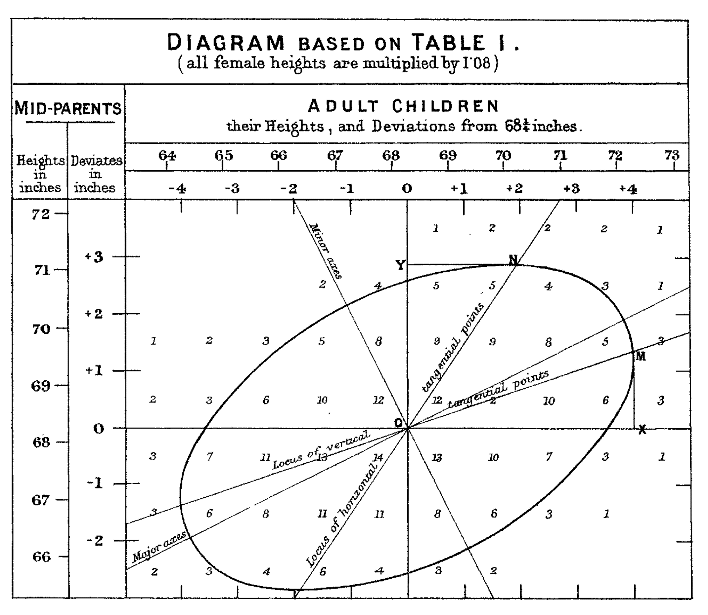
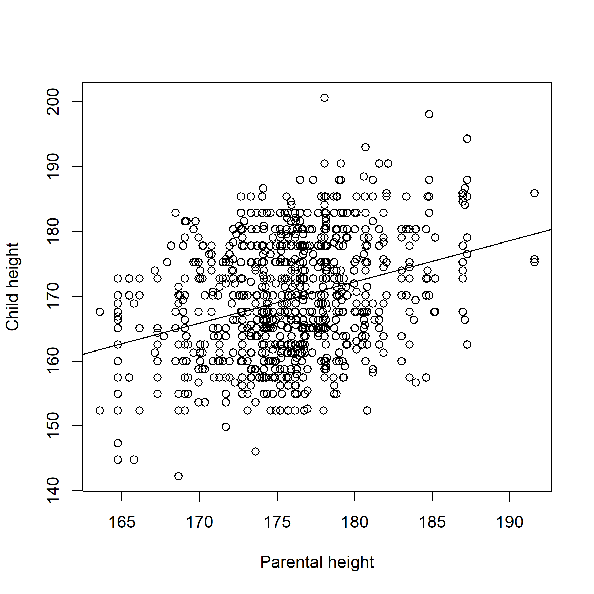
```

``` {r galtonregression, echo = FALSE, eval = FALSE}
#R script for regression analysis of Galton dataset on Parental height and Child height 

library("HistData") # load the package that contains the Galton dataset 
library("NCA") # load the NCA package

# Data
data(GaltonFamilies) # load the data
colnames(GaltonFamilies)[4]<-"Parental height" # change variable name
colnames(GaltonFamilies)[8]<-"Child height" # change variable name

# Change inches into centimeters
GaltonFamilies$"Parental height" <- GaltonFamilies$"Parental height" * 2.54
GaltonFamilies$"Child height" <- GaltonFamilies$"Child height" * 2.54

# Conduct regression analysis
model_regression <- lm(`Child height` ~ `Parental height`, data = GaltonFamilies)
average_intercept <- coef(model_regression)[1]
average_slope <- coef(model_regression)[2]

# Plot data with regression line
plot(GaltonFamilies$`Parental height`, 
     GaltonFamilies$`Child height`,
     xlab = "Parental height", ylab = "Child height")
abline(average_intercept,average_slope)
```

<!-- In Figure \@ref(fig:ncaols2) Galton’s data are shown in two $XY$- plots.  -->

<!-- The plots are produced with the following ```R``` code:  -->

<!-- ``` {r galton, echo = TRUE, eval = FALSE} -->
<!-- #R script for NCA analysis of Galton dataset on Parental height and Child height  -->

<!-- library("HistData") # load the package that contains the Galton dataset  -->
<!-- library("NCA") # load the NCA package -->

<!-- # Data -->
<!-- data(GaltonFamilies) # load the data -->
<!-- colnames(GaltonFamilies)[4]<-"Parental height" # change variable name -->
<!-- colnames(GaltonFamilies)[8]<-"Child height" # change variable name -->
<!-- #change inches into centimeters -->
<!-- GaltonFamilies$"Parental height" <- GaltonFamilies$"Parental height" * 2.54 -->
<!-- GaltonFamilies$"Child height" <- GaltonFamilies$"Child height" * 2.54 -->

<!-- # Conduct regression analysis -->
<!-- model_regression <- lm(`Child height` ~ `Parental height`, data = GaltonFamilies) -->
<!-- average_intercept <- coef(model_regression)[1] -->
<!-- average_slope <- coef(model_regression)[2] -->
<!-- #plot data with regression line -->
<!-- plot(GaltonFamilies$`Parental height`, GaltonFamilies$`Child height`, xlab = "Parental height", ylab = "Child height") -->
<!-- abline(average_intercept,average_slope) -->

<!-- # Conduct NCA -->
<!-- model_nca <-nca_analysis(GaltonFamilies, "Parental height", "Child height", ceilings = c("c_lp")) -->
<!-- ceiling_intercept <- model_nca$summaries[[1]][[2]][10] -->
<!-- ceiling_slope <- model_nca$summaries[[1]][[2]][9] -->
<!-- #plot data with ceiling line -->
<!-- plot(GaltonFamilies$`Parental height`, GaltonFamilies$`Child height`, xlab = "Parental height", ylab = "Child height") -->
<!-- abline(ceiling_intercept,ceiling_slope) -->
<!-- ``` -->

``` {r galtoncode, echo = FALSE, eval = FALSE}
#R script for NCA analysis of Galton dataset on Parental height and Child height 

library("HistData") # load the package that contains the Galton dataset 
library("NCA") # load the NCA package

# Data
data(GaltonFamilies) # load the data
colnames(GaltonFamilies)[4]<-"Parental height" # change variable name
colnames(GaltonFamilies)[8]<-"Child height" # change variable name
#change inches into centimeters
GaltonFamilies$"Parental height" <- GaltonFamilies$"Parental height" * 2.54
GaltonFamilies$"Child height" <- GaltonFamilies$"Child height" * 2.54

# Conduct regression analysis
model_regression <- lm(`Child height` ~ `Parental height`, data = GaltonFamilies)
average_intercept <- coef(model_regression)[1]
average_slope <- coef(model_regression)[2]
#plot data with regression line
png("Galton_regression.png", units="cm", 15,15, res=300)
plot(GaltonFamilies$`Parental height`, GaltonFamilies$`Child height`, xlab = "Parental height", ylab = "Child height")
abline(average_intercept,average_slope)
dev.off()

# Conduct NCA
model_nca <-nca_analysis(GaltonFamilies, "Parental height", "Child height", ceilings = c("c_lp"))
ceiling_intercept <- model_nca$summaries[[1]][[2]][10]
ceiling_slope <- model_nca$summaries[[1]][[2]][9]
#plot data with ceiling line
png("Galton_ceiling.png", units="cm", 15,15, res=300)
plot(GaltonFamilies$`Parental height`, GaltonFamilies$`Child height`, xlab = "Parental height", ylab = "Child height")
abline(ceiling_intercept,ceiling_slope)
dev.off()
```

To describe the observed data pattern, Galton drew lines through the center of the data by eye, describing an average trend between Parental height and Child height and called it the regression line (Figure \@ref(fig:ncaols1)-left). He did not explicitly use the method of least squares that had already existed earlier [@gauss1809theoria; @legendre1805nouvelles]. Karl Pearson formalized Galton’s idea mathematically by regression line equations using the method of least squares. Ordinary Least Squares (OLS) is still one of the most common estimation methods in regression analysis. 

### Principles of regression analysis {#principlesofregression}

Regression analysis is often used to test probabilistic sufficiency hypotheses such as more $X$ likely increases (or decreases) $Y$ or  $X$ has a positive (or negative) effect on $Y$, or similar. The hypothesis is considered to be supported if the regression coefficient is positive (or negative) and statistically significant. 

The standard regression equation represents an additive, average-effect model. The simple linear regression model is expressed as:

\begin{equation}
(\#eq:ols1)
Y = f(X) + \varepsilon
\end{equation}

where the function $f(X)$ represents an additive combination of predictor variables (including, if specified, products if $X$'s  or other transformations), with associated coefficients $\beta_i$ for $i = 1, \dots, k$, where $k$ is the number of terms. The error term $\varepsilon$  represents all remaining influences on $Y$ that are not captured by the model. In OLS, the coefficients are chosen so that 
$f(X)$ is the linear function that best predicts $Y$ in the least-squares sense (minimizing the average squared residual), under the assumption that the predictors are exogenous, meaning that they are uncorrelated with the error term. Measurement error in $X$ is one way this assumption can fail.

Several assumptions are made about the error term. Specifically, it is assumed that $\varepsilon$ has an expected value of zero, that it is uncorrelated with (or independent of) the predictors $X$, and that its variance is constant across all values of $X$ (homoskedasticity). In many applications, it is further assumed that the errors are normally distributed, mainly to justify standard hypothesis tests and confidence intervals. Under this assumption, the conditional distribution of $Y$ given $X$ is normal. Consequently, the model implies an *unbounded* distribution of $Y$, which can, in principle, take any value between minus and plus infinity.

For the parent–child sample, the regression equation is $y = 57.5 + 0.64x + \varepsilon_x$ (Figure \@ref(fig:ncaols1)-right). Since OLS regression assumes that on average $\varepsilon_x = 0$, this equation expresses the average effect. Thus, when $x$ (Parent height) is 175 cm, the estimated average Child height is about 170 cm, but heights between about 140 cm and 200 cm appear to be possible. Given the normality assumption of the error term, very large child heights (e.g., 300 cm) are not observed but are theoretically possible in the population, though unlikely. Because all heights are theoretically possible in such a regression context, an empty space in the upper-left corner (and thus necessity) is theoretically excluded. If an empty space is observed in a sample, the normality assumption implies that this is due to finite sampling, not an indication of necessity.

Most regression models include more than one $X$. The black box of the error term is opened and additional predictors are added to the regression equation (multiple linear regression, MLR). By including more factors that contribute to $Y$ in the regression equation, $Y$ may be better predicted for given combinations of $X$’s. Adding factors to the equation is not limited to simply adding new predictors. Some variables may be transformed, such as squaring a factor ($X_j^2$) to represent a non-linear effect of $X_j$ on $Y$, or taking the product of two factors ($X_1 \cdot X_2$) to represent their interaction. Such transformed or combined factors are added as separate terms in the regression equation. Other regression-based approaches, such as structural equation modeling, also incorporate multiple factors.

The goal of adding more terms to the regression equation is to explain a larger part of the variance (scatter). $R^2$ represents the proportion of variance explained by the regression model and ranges between 0 and 1. By adding more terms, usually more variance is explained, resulting in higher $R^2$-values (but also in risks of overfitting).

Another reason to add more factors is to avoid omitted variable bias, for example, due to confounding. A confounder is a relevant variable that correlates with both $X$ and $Y$, and if excluded from the model may bias the regression coefficient. In regression, it is standard practice to include control variables to reduce omitted variable bias.^[good controls rather than bad controls, see @cinelli2024crash.] By adding more *relevant* factors, the prediction of $Y$ becomes more accurate, and the risk of omitted variable bias is reduced.^[Omitted variable bias does not occur in NCA (see the "projection method" discussed in Section \@ref(multipleconditions)).]

One characteristic of regression logic is that variables are compensable. It is assumed that the outcome $y$ is obtained by addition or multiplication of the variables of the regression equation (multiple regression), including the error term. ^[Also simple regression with one predictor and the error term is an additive model.] As a result, the terms can compensate for each other. For example, when one $x_j$ is low, a high $y$ can still be achieved when other $x$’s is high. Fundamentally, this characteristic therefore implies that any single $x_j$ is not necessary for achieving a certain level of $y$, as it can be compensated for by other factors.

<!-- \begin{equation}  -->
<!-- (\#eq:ols1) -->
<!-- Y = β_0  + β_1 X + \epsilon(X) -->
<!-- \end{equation} -->

<!-- where $X$ is the predictor variable, $Y$ is the predicted variable, $β_0$ is the intercept of the regression line, $β_1$ is the slope of the regression line, and $\epsilon(X)$ is the error term representing the scatter around the regression line for a given $X$ (Figure \@ref(fig:ncaols2)). The regression line  predicts the average $Y$ for a given $X$. Because the cases are scattered, for a given $X$ also higher and lower values of $Y$ than the average value of $Y$ are possible. -->
<!-- <!-- With the OLS technique, the slope of the regression line (regression coefficient) is estimated by minimizing the squared vertical distances between the observed $Y$-values and the regression line (‘least squares’).  -->


<!-- It is assumed that the terms of the regression equation are added. In OLS regression the additive function $f(x_i)$ is assumed to be linear in the coefficients. Also the error term is an additive part of the regression equation. This means that the terms that make up the equation can compensate for each other. For example, when one $x_i$ is low, $y$ can still be achieved when other terms (error term or other $x_i$’s) give a higher contribution to $y$. The additive logic implies that for achieving a certain level $y$, a specific $x_i$ is not  necessary.  -->


<!-- , for example:  -->

<!-- \begin{equation}  -->
<!-- (\#eq:ols2) -->
<!-- Y = β_0 + β_1 X_1 + β_2 X_2 + \epsilon_X -->
<!-- \end{equation} -->

<!-- where $β_1$ and $β_2$ are the regression coefficients.  -->


<!-- ^[Note that confounding does not apply to NCA because the ceiling line is not biased by not considering third variables. The information of other variables is already in the ceiling line, assuming a representative sample. See Section \@ref(confounding) and Appendix \@ref(appendixconfounding).]  -->

<!-- In SEM models factors are 'latent variables' 
of the measurement model of the SEM approach. -->

<!-- A study by @bouquet2008weight is an example of the prediction of an average outcome using MLR by adding many terms including combined factors in the regression equation. This highly cited article in the *Academy of Management Journal* studies multinational enterprises (MNE’s) to predict how subsidiary companies gain attention from their headquarters ($Y$). They use a multiple regression model with 25 terms ($X$’s and combination of $X$’s) and an ‘error’ term $ɛ$. With the regression model the average outcome (average attention) for a group of cases (or for the theoretical ‘the average case’) for given values of the terms can be estimated. The error term represents all unknown factors that have a positive or negative effect on the outcome but are not included in the model, assuming that the average effect of the error term is zero. $β_0$ is a constant and the other $β_i$’s are the regression coefficients of the terms, indicating how strong the term is related to the outcome (when all other terms are constant). The regression model is: -->

<!-- <!-- \begin{equation} -->
<!-- <!-- (\#eq:ols3) --> 
<!-- $Attention = \\ -->
<!-- β_0 \\  -->
<!-- + β_1\ Subsidiary\ size \\  -->
<!-- + β_2\ Subsidiary\ age  \\  -->
<!-- + β_3\ (Subsidiary\ age)^2 \\  -->
<!-- + β_4\ Subsidiary\ autonomy \\ -->
<!-- + β_5\ Subsidiary\ performance \\ -->
<!-- + β_6\ (Subsidiary\ performance)^2 \\ -->
<!-- + β_7\ Subsidiary\ functional\ scope \\ -->
<!-- + β_8\ Subsidiary\ market\ scope \\ -->
<!-- + β_9\ Geographic\ area\ structure \\ -->
<!-- + β_{10}\ Matrix\ structure \\   -->
<!-- + β_{11}\ Geographic\ scope \\ -->
<!-- + β_{12}\ Headquarter\ AsiaPacific\ parentage \\ -->
<!-- + β_{13}\ Headquarter\ NorthAmerican\ parentage \\ -->
<!-- + β_{14}\ Headquarter\ subsidiary\ cultural\ distance \\ -->
<!-- + β_{15}\ Presence\ of\ MNEs\ in\ local\ market \\ -->
<!-- + β_{16}\ Local\ market\ size \\ -->
<!-- + β_{17}\ Subsidiary\ strength\ within\ MNE\ Network \\ -->
<!-- + β_{18}\ Subsidiary\ initiative\ taking \\ -->
<!-- + β_{19}\ Subsidiary\ profile\ building \\ -->
<!-- + β_{20}\ Headquarter\ subsidiary\ geographic\ distance \\ -->
<!-- + β_{21}\ (Initiative\ taking * Geographic\ distance) \\ -->
<!-- + β_{22}\ (Profile\ building * Geographic\ distance) \\ -->
<!-- + β_{23}\ Subsidiary\ downstream\ competence \\ -->
<!-- + β_{24}\ (Initiative\ taking * Downstream\ competence) \\ -->
<!-- + β_{25}\ (Profile\ building * Downstream\ competence) \\ -->
<!-- + \epsilon$ -->

<!-- The 25 terms of single and combined factors in the regression equation explain 27% of the variance (R$^2$ = 0.27). Thus, the error term (representing the not included factors) represent the other 73% percent (unexplained variance). Single terms predict only a small part of the outcome. For example, ‘subsidiary initiative taking’ (term 18) is responsible for 2% to the explained variance. -->

<!-- The example shows that adding more factors makes the model more complex and less understandable and therefore less useful in practice. The contrast with NCA is large. NCA can have a model with only one factor that perfectly explains the absence of a certain level of an outcome when the factor is not present at the right level for that outcome. -->


<!-- ### Similarities regression-based methods and NCA -->
### Comparison NCA and regression-based methods

NCA and regression share several characteristics. Both NCA and regression are variable-based approaches and use linear algebra. Both methods need good (reliable and valid) data without measurement error. For statistical generalization from sample to population, large-n NCA and regression both need to have a sample that is representative for the population; having larger samples usually give more reliable estimations of the population parameters. large-n NCA and regression analysis both use a $p$-value to evaluate statistical significance. For generalization of findings, both methods need replications with different samples. Both methods need theoretical reasoning for making causal interpretations. 
<!-- When a analyst uses NCA or OLS, these common fundamental limitations should be acknowledged. When NCA and OLS are used in combination the fundamental differences between the methods should be acknowledged. It is important to stress that one method is not better than the other. NCA and OLS are different and address different research questions. To ensure theory-method fit, OLS is the preferred method when the analyst is interested in an average effect of $X$ on $Y$, and NCA is the preferred method when the analyst is interested in the necessity effect of $X$ on $Y$.  -->

When data are available that fit both regression analysis and NCA, without knowledge about the underlying causality, it is possible to look at the data from different perspectives (see Section \@ref(underdetermination)). One perspective is not inherently superior to another. This also applies when a correlation is observed between two variables. An observed non-zero correlation can be produced by various relationships between $X$ and $Y$ including an average effect relationship and a necessity relationship (see Appendix \@ref(appendixc)). Both perspectives and methods are possible to study the phenomenon. It is the choice of the analyst to use only regression, only NCA, or both, when both underlying causal perspectives are possible.

<!-- (ref:caption4) $XY$-plots of the relationship between Parent height ($X$) and Child height ($Y$) [after @galton1886regression]. Left: with a regression line. Right: with a ceiling line. -->
```{r ncaols2, echo=FALSE, out.width='45%',  fig.show="hold", fig.align = "center", fig.cap="$XY$-plots of the relationship between Parent height ($X$) and Child height ($Y$) [after @galton1886regression]. Left: with a regression line. Right: with a ceiling line.", cache=FALSE}

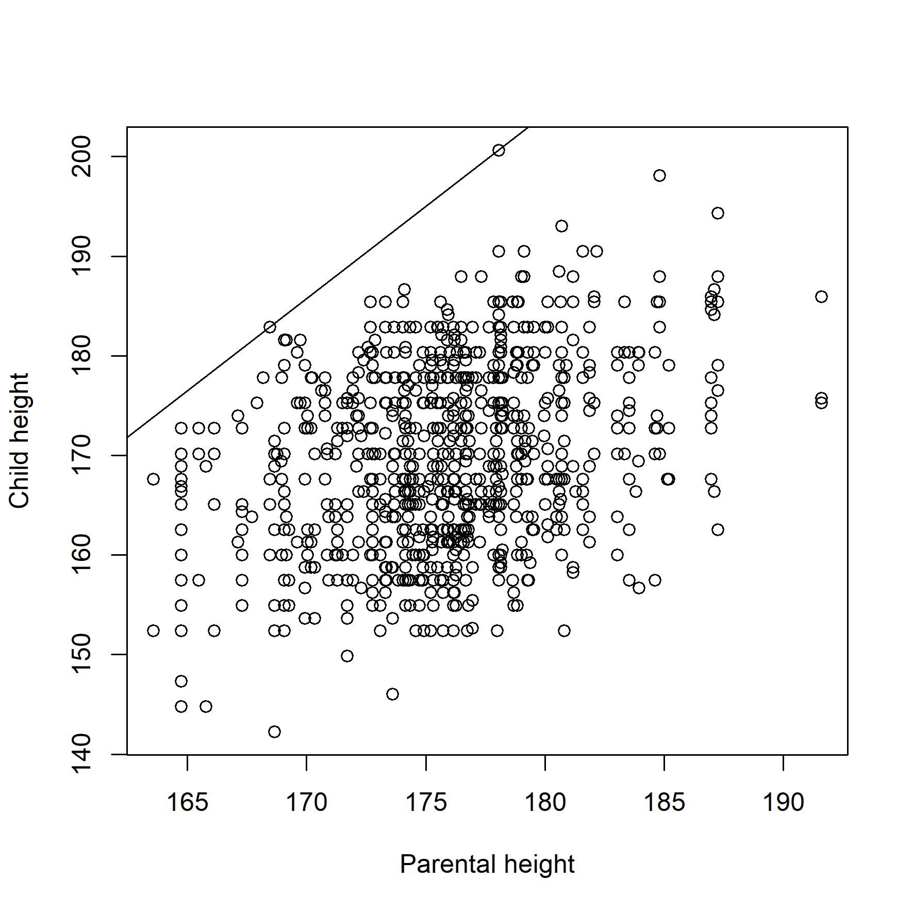
```

This means that Galton could have used his eyes also in a different way, namely drawing a line on top of the data, rather than through the center of the data. Then, he would have drawn the border between an area with data, and an area without data describing a possible necessity relationship between Parent height and Child height: the ceiling line (Figure \@ref(fig:ncaols2)-right). Instead of estimating the average $y$ for a given $x$ he would have  estimated the maximum $y$ for a given $x$. For example, with a Parent height of 175 cm, the estimated maximum possible Child height is about 195 cm. But Galton did not draw a ceiling line, and the social sciences have adopted the average trend line as the basis for many data analysis approaches. Regression analysis has developed over the years and many variants exist.

<!-- Whereas regression models must include factors that correlate with other factors and with the outcome to avoid biased estimation of the regression coefficient, NCA’s effect size for a necessary factor is not influenced by the absence or presence of other factors in the model. This is illustrated with and example about the effect of a sales person’s personality on sales performance using data of 108 cases (sales representatives from a large USA food manufacturer) obtained with The Hogan Personality Inventory (HPI) personality assessment tool for predicting organizational performance [@hogan2002hogan]. Details of the example are in @dul2021marketing. The statistical descriptives of the data (mean, standard deviation, correlation) are shown in Figure \@ref(fig:ncaols3) A. Ambition and Sociability are correlated with $Y$ as well as each other. Hence, if one of them is omitted from the model the regression results may be biased.  -->

<!-- ```{r ncaols3, echo=FALSE, out.width='100%', fig.align = "center", fig.cap="Example of the results of a regression analysis and NCA. Effect of four personality traits of sales persons on sales performance. A. Descriptive statistics. B. Results of regression analysis and NCA for two different models.  Data from @hogan2002hogan", cache=TRUE} -->
<!-- knitr::include_graphics('Figure3ncaols.png') -->
<!-- ``` -->

<!-- <!-- ```{r ncaols3, echo=FALSE, out.width=' 100%', fig.align = "center", fig.cap="Example of the results of a regression analysis and NCA. Effect of four personality traits of sales persons on sales performance. A. Descriptive statistics. B. Results of regression analysis and NCA for two different models.  Data from @hogan2002hogan"} --> 
<!-- <!-- knitr::include_graphics('Figure3ncaols.png') -->
<!-- <!-- ``` --> 

<!-- The omission of one variable is shown in Figure \@ref(fig:ncaols3) B, middle column. The full model (Model 1) includes all four personality factors. The regression results show that Ambition and Sociability have positive average effects on Sales performance (regression coefficients 0.13 and 0.16 respectively, and Learning approach has a negative average effect on Sales performance (regression coefficient -0.11).  Interpersonal sensitivity has virtually no average effect on Sales performance (regression coefficient 0.01).  The $p$-values for Ambition and Sociability are relatively small. Model 2 has only three factors because Sociability is omitted. The regression results show that the regression coefficients of all three remaining factors have changed. The regression coefficient for Ambition has increased to 0.18, and the regression coefficients of the other two factors have minor differences (because these factors are less correlated with the omitted variable). Hence, in a regression model that is not correctly specified because factors that correlate with factors that are included in the model and with the outcome are not included, the regression coefficients of the included factors may be biased (omitted-variable-bias). However, the results of the NCA analysis does not change when a variable is omitted (Figure \@ref(fig:ncaols3) B, right column). This means that an NCA model does not suffer from omitted-variable-bias. -->


<!-- In contrast NCA’s C-LP ceiling line is defined by $Y_c = -129 + 1.85 X$. Thus, when $X$ (Parent height) is 175 cm, the estimated maximum possible Child height is about 195 cm. Normally, in NCA the ceiling line is interpreted inversely (e.g., in the bottleneck table): $X_c = (Y_c + 129)/1.85$ indicating, while assuming a non-decreasing ceiling line, that a minimum level of $X = X_c$ is necessary (but not sufficient) for a desired level of $Y =Y_c$. When parents wish to have a child of 200 cm it is necessary (but not sufficient) that their Parent height is at least about 177 cm. -->


<!-- This additive logic contradicts NCA’s logic that $X$ is necessary: $Y$ cannot be achieved when the necessary factor does not have the right level, and this absence of $X$ cannot be compensated by other factors. -->


<!-- This assumption contradicts NCA’s logic in which $X$ and $Y$ are presumed bounded. $X$ puts a limit on $Y$ and thus there is a border represented by the ceiling line. The limits can be empirically observed in the sample (e.g., the height of the observed tallest person in the sample is 205 cm) for defining NCA’s empirical scope or can be theoretically defined (e.g., the height of the ever-observed tallest person of 272 cm) for defining the NCA’s theoretical scope.  -->


<!-- he results also suggest that a given $X$ is not necessary for producing the outcome $Y$ because other factors in the regression model (other $X$’s and the error term) can compensate for the absence of a low level of $X$. -->

### Regression-based statistical concepts do not (always) apply to NCA {#confounding}
In the development of regression analysis, over the years many regression-based statistical concepts relevant for estimating average effects, have been developed and taught to generations of students. These concepts include mediation, moderation, confounding, omitted variable bias, control variables and endogeneity and spuriousness. However, often these concepts do not apply (directly), or require re-interpretation in the context of NCA.

All differences stem from a fundamental distinction: regression models estimate expected values (average effects), whereas NCA characterizes constraints by estimating an upper boundary (ceiling) in the $XY$-plane and the associated empty space above it. The theoretical ceiling according to Equation \@ref(eq:lin-ceiling-peers) is a *sharp border* between the area where observations are possible (feasible area) and the area where cases are not possible (ceiling zone) within a *bounding box* (bounded variables). Regression is primarily concerned with how observations are distributed (the full space), while NCA is concerned with combinations of $X$ and $Y$ above a ceiling that do not occur (the empty space).^[Information about the ceiling is contained in the upper points (peers), not in the entire distribution below it (Section \@ref(mathceiling)).] Under the assumptions of proper model specification, sound theory, and adequate data, a regression line may be given a causal interpretation in terms of probabilistic sufficiency, and a ceiling line may be given a causal interpretation in terms of necessity.

Table \@ref(tab:statisticsterms) shows several regression-based statistical concepts that are defined for average-effect estimation; in NCA they often have no direct analogue or must be reinterpreted in terms of boundary patterns and constraints. The first column lists concepts that are meaningful in regression analysis. The second column refers to correspondence in NCA. 

```{r statisticsterms, echo = FALSE, warning=FALSE, message=FALSE, out.width='99%', cache=FALSE}

library(kableExtra)

st <- data.frame(

  #columns and values
  `Regression concept` = c("Mediation",
                           "Moderation",
                           "Confounding",
                           "Omitted variable bias",
                           "Control variable",
                           "Endogeneity",
                           "Spuriousness"
                           ),

  `Related NCA concept/analogy` = c("Necessity chain",
                            "Subgroup ceiling (conditional ceiling); may indicate additional necessary condition",
                            "Empty space insensitive for third variables; Multiple necessary conditions; Necessity spuriousness; Formal necessity hypothesis",
                            "-",
                            "-",
                            "Reverse causality; Measurement error",
                            "Necessity spuriousness; Formal necessity hypothesis"
                            ),
  check.names = FALSE
)

# Bold the row labels
#mmt$Row <- cell_spec(mmt$Row, bold = TRUE, align = "left")

kbl(
  st,
  booktabs = TRUE,
  linesep = "",              # <- disables the default addlinespace pattern
  caption = "Common regression-based statistical concepts and NCA corresponding concepts.",
  col.names = c("Regression concept", "NCA corresponding concept(s)"),
  align = c("l", "l"),
  escape = FALSE     # <- needed so cell_spec markup is interpreted
) %>%
  kable_styling(full_width = FALSE, 
                latex_options = c("hold_position", "scale_down")) %>%
  column_spec(1, width = "20em") %>%
  column_spec(2, width = "20em") %>%
  scroll_box(width = "100%")

```

 <!-- not an effect in the regression sense. The overall necessity ceiling is a ceiling in the $XY$-plane, see Section \@ref(multipleconditions). Whereas regression is interested in the space where data are present (if $X$, then probably $Y$), NCA is interested in the space where data are absent (if not $X$, then not $Y$). The regression equation uses an equality equation for estimating the average effect in the population (see Equation \@ref(eq:ols1)), whereas the NCA uses an inequality equation for estimating the maximum possible effect in the population (see Equation \@ref(eq:math-general)) and derive its empty space above it. -->

A necessity effect in NCA is the maximum attainable $Y$ given $X$ (boundary), represented by the equations in Section \@ref(mathceiling). NCA estimates the overall population ceiling line in the $XY$-plane. When a sample is properly drawn from the population, the observed overall ceiling line can be viewed as an unconditional upper envelope across heterogeneous cases, including any third variables that operate in the population insofar as they constrain feasible $XY$-combinations. Consequently, the overall $XY$-ceiling line already reflects information from all possible third variables (both measured and unmeasured). The ceiling pattern is not sensitive to third variables changes within the feasible area. However, the estimated ceiling can still be affected by data limitations such as limited population support, measurement error, and finite-sample sparsity. In other words, the ceiling pattern is robust to distributional changes within the feasible area. 

The average effect, on the other hand, represented the  equality Equation \@ref(eq:ols1) and estimated by a regression line,  is sensitive to third variable changes and must be corrected for their influence in order to make the line  causally interpretable in terms of an average value of $Y$ for a given $X$. All common statistical terms in the left column of Table \@ref(tab:statisticsterms) are defined in a regression context for estimation of the average effect. Note also that a necessity model represented by the ceiling line is deterministic in the sense that is not parameterized with a stochastic error term with information about other variables. 

In regression, a *mediator* is a third variable $Z$ that helps to explain how $X$ influences $Y$. Specifically, $X$ has an average effect on $Z$, and $Z$ has an average effect on $Y$.  \

In NCA, a related concept is the *necessity chain* as discussed in Section \@ref(chain). This represents a sequence of necessity relations: $X$ is necessary for $Z$, and $Z$ is necessary for $Y$. Together, these form a necessity chain ($X \rightarrow Z \rightarrow Y$ necessity), meaning that $X$ is necessary for $Y$ via $Z$. However, the necessity of the chain is covered in the overall necessity ceiling. This overall ceiling line is NCA's main interest as it describes the absolute maximum possible $Y$ for a given $X$, independently of other variables.

<!-- , due to the attenuating effect of the third variable.  This attenuation occurs when the $ZY$ necessity effect is smaller than the $XZ$ necessity effect. However, the chained necessity effect does not become larger when the $ZY$ necessity effect is larger than the $XZ$ necessity effect. The chain is as strong as its weakest link. A third variable does not "explain" an $XY$ necessity effect. The necessity $XY$ effect is independent of whether or not a part of it operates though a chain. -->

In regression, a *moderator* is a third variable $Z$ that changes the strength or direction of the $XY$-relationship. Specifically, the average effect of $X$ on $Y$ may become larger or smaller depending on the value of the third variable.  

In NCA, the corresponding concept is *subgroup ceiling* (conditional ceiling) which may indicate an additional necessary condition. In an $XY$-plot, all cases of the sample lie below the $XY$-ceiling line. Cases with a specific value of a third variable $Z$ also remain below this same ceiling line. Therefore, a third variable cannot raise the ceiling line and cannot reduce the effect size of the overall $XY$-necessity relationship. However, a subset of cases with a specific value of $Z$ may display a lower ceiling line. This occurs if all these cases lie below the overall $XY$-ceiling. Such a pattern indicates that $Z$ itself may also be a necessary condition for $Y$. The lower ceiling, however, does not represent the overall $XY$-ceiling of the population, but only the ceiling of that particular subgroup (thus a different theoretical domain, see Chapters \@ref(theory) and \@ref(hypothesisformulation)). The population ceiling remains unchanged. "Moderation" in NCA indicates the presence of a subset constraint (multiple necessity).

In regression, a *confounder* is a third variable $Z$ that influences both $X$ and $Y$. This dual influence can create or distort the apparent relationship between $X$ and $Y$: $Z \rightarrow X$ and $Z \rightarrow Y$. When a causal model that includes the confounder is more credible than a causal model without the confounder, the $XY$-relationship is considered a spurious association. Unmeasured confounders can bias the regression coefficients.^[This is one of the main reasons why, in a regression context, experiments are often considered the gold standard research design for causal inference. By using randomized experiments, the undesired effects of confounders are mitigated.]

In NCA, the logic of necessity is fundamentally different, and confounding in the regression sense is not a threat in NCA. Confounding redistributes probability within the feasible area (the area below the overall ceiling line) and cannot make the ceiling zone (the area above the overall ceiling line) populated. This means that a causal necessity interpretation of the empty space does not change with or without a confounding variable. Here, the empty space remains empty under the assumption of a good covered sample that is representative of the population: all combinations of variable values that exist in the population can, in principle, appear in the sample. If this assumption is violated, cases might appear in the empty area when new samples are drawn, because the original sample missed certain combinations. Likewise, if the underlying population changes due to structural changes, cases may emerge in what was previously an empty area. These issues reflect sampling or system changes. In other words, confounding can change densities within the feasible region but cannot create overall ceiling violations if the necessity relationship is true.^[Confounding is not a reason for doing an experiment in NCA. A reason could be that the analyst is unsure about the causal direction, and wants to exclude the possibility of reverse causality (Section \@ref(experiment)).]


<!-- Therefore, the empty space above the ceiling stays empty, and the ceiling itself is invariant to confounding, provided the confounder support present in the population is represented in the sample. This means that NCA does not rely on covariance or average effects but on logical constraints between conditions. The $XY$ necessity relation simply states that without enough $X$, $Y$ cannot reach high levels. Although the average $XY$-effect is affected by confounding (because the distribution of cases under the ceiling depends on the third variable $Z$), In NCA the ceiling itself remains unaffected. The ceiling represents a logical boundary in the data, not a statistical dependency. Again, the $XY$-ceiling line already reflects information from all possible third variables, including potential confounders. The sample implicitly reflects the joint influence of all existing variables (measured or unmeasured) that affect what is possible in the $XY$-space. If both $X$ and $Z$ are necessary for $Y$, the data may show that the absence of $Z$ limits the possible level of $X$ or $Y$. However, this is not confounding but an example of multiple necessity (see above under 'Moderation').  -->

In regression, *omitted variable bias* can occurs when a relevant variable $Z$ that affects both $X$ and $Y$ is left out of the regression model. When this happens, the estimated effect of $X$ on $Y$ becomes biased because part of the variation attributed to $X$ is actually due to $Z$: $Z$ causes the estimated average effect. Omitted variable bias is therefore a statistical problem that arises from the covariance structure of the data. 

In NCA, however, the idea of 'leaving out a variable' does not apply. The $XY$-ceiling line already reflects information from other variables. Including or excluding other variables does not affect the overall $XY$-ceiling line. In NCA, a necessity model by definition is a model of a pair of variables ($XY$), and the necessity of this pair is not biased  by analyzing or not analyzing other pairs of variables (e.g., $ZY$) for necessity, also not if this 'omitted' third variable would be a mediator, moderator or confounder in the regression analysis (see mediation, moderation, and confounding as discussed above).

In regression, a *control variable* is a third variable $Z$ that is included in the model to remove the influence of alternative explanations for the $XY$-relationship. This helps to avoid omitted variable bias and to isolate the net average effect of $X$ on $Y$ to find the unique contribution of $X$ to $Y$. 

In NCA, however, the $XY$  necessity effect is the overall effect, which is the necessity effect of interest, and it is independent of other variables. The logic of “controlling for” another variable therefore does not apply. There is nothing to control for (see omitted variable bias as discussed above).

In regression, *endogeneity* occurs when $X$ is correlated with the error term of the regression model. This correlation violates a key assumption of ordinary least squares (OLS) regression, namely that $X$ is exogenous (independent of the error term). When $X$ is endogenous, the estimated average effect of $X$ on $Y$ becomes biased. Endogeneity can arise from several sources such as omitted variable bias, reverse causality, and measurement error. 

In NCA, endogeneity in the regression sense does not exist. NCA does not estimate residual errors, and thus cannot suffer from bias caused by correlations between predictors and error terms. An error term represents the scatter of observations below the ceiling line, but NCA does not model this: the NCA model does not have an error term as shown in Equation \@ref(eq:lin-ceiling-peers). Whereas omitted variable bias does not apply to NCA (see above), the two other underlying sources of endogeneity in regression also affect NCA: reverse causality as discussed in Section \@ref(reversecausality) and measurement error as discussed in Section \@ref(measurementerror).

In regression, *spuriousness* refers to a situation in which an alternative causal explanation is clearly more credible. It often involves confounding, where an apparent average effect between $X$ and $Y$ disappears once a confounder $Z$ is included in the regression model.

In NCA, spuriousness can arise when the underlying necessity theory incorrectly specifies the causal structure (inadequate necessity theory, see Section \@ref(spurious)) and an alternative theory exists where a causal structure with a third variable $Z$ that is sufficient for $X$ and necessary for $Z$ is more convincing, than the original single $XY$ necessity relationship, making the latter theoretically spurious. In the development of a formal necessity theory (Chapter \@ref(hypothesisformulation)) the original and alternative explanations should be evaluated in a thought experiment (Section \@ref(thoughtexperiments)) to decide which model is theoretically justified. Thus, as a theoretical idea, spuriousness exists in NCA when an observed empty space in the $XY$-plot is causally interpreted as necessity, whereas an alternative explanation claims that the empty space is the result of a third variable $Z$ that is *sufficient* for $X$ and *necessary* for $Y$ is stronger. For example, empirical support is available (empty upper-left corner in the $XY$-plot) that supports the (weak) "theory of the stork" [@hofer2004new] claiming that a high number of stork nesting pairs ($X$) is necessary for a high human birth rate ($Y$). The alternative explanation that a third variable $Z$ (Availability of high human-made structures, because people settle in a rural region with storks) is *sufficient* for a high number of stork nesting pairs ($X$) and *necessary* for a high number of human births ($Y$) is more plausible, making the original hypothesis spurious [@dul2016orm]. With a formal necessity hypothesis, spurious, unrealistic $XY$ necessity relationships can be avoided (Chapter \@ref(hypothesisformulation)). 

<!-- Whereas a spuriousness by confounding in regression analysis can cause omitted variable bias when the third variable is excluded from the regression equation, considering  or not considering a third variable that is sufficient for the condition $X$ and necessary for the outcome $Y$ has no effect on the empty space of the $XY$ necessity relationship. -->
<!-- the empirical necessity pattern is uneffected by confounding in a regression sense, unbiased and is not an artifact (see above about Confounding and omitted-variable-bias). A ceiling pattern can support a causal necessity interpretation when there is a credible necessity hypothesis linking $X$ to $Y$ (Chapter \@ref(hypothesisformulation)) and the data cover the relevant population support  and other data requirements such as no measurement error (Chapter \@ref(datacollection)).  -->
<!-- UIT MIJN 2016 artikel: Dit gaat over alternatieve theorieen. DIT IS NIET CONFOUNDING: -->
<!-- *"Figure 6 shows a scatterplot of the relationship between the annual number of white stork nesting pairs and the number of human births in the Oldenburg region in Germany over one decade. The scatterplot shows that there is an empty area in the upper-left corner. The ceiling line is drawn with the CE-FDH rather than with the CR-FDH ceiling technique because the observations along the border between the empty zone and the full zone cannot be well represented by a straight line. The data suggest the existence of a necessary condition with a very large effect size (0.73): A high number of human births in the region is only possible if the number of stork nesting pairs in the region is large. It is clear (unless one believes in fables or in the Theory of the Stork; Ho¨fer & Przyrembel, 2004) that a theoretical explanation is missing in this example. A necessary relationship that is observed between X and Y can be spurious if a variable Z is sufficient for X and necessary for Y (Mahoney, 2007). In the storks example, one could state that when more people (Z) settle in a region  and build houses with chimneys and other high human-made constructions, the number of stork nesting pairs (X) increases because storks favor high nesting places: Z produces X, hence is a sufficient cause of X. Additionally, Z is a necessary cause of Y because a high increase of the number of births is only possible when there are more people. In other words, the variable Z is the reason of the presumed ‘‘necessary’’ relation between storks and births.24 This example shows again that without theoretical support, a necessary condition cannot be presumed from observational data. This is not different from any other data analysis approach using observational data. If the cause can be manipulated, a research design based on randomized experiments may be better equipped to fulfill requirements for causality than an observational study. A potential necessary cause of a multicausal phenomenon (e.g., storks for birth) can be tested in a randomized experiment where instances (cases) with the cause (regions with storks) are selected randomly from a defined population (all regions with storks) and then randomly assigned to the experimental group (regions that get a treatment) or control group (regions that do not get a treatment). In the experimental group, the presumed necessary causal condition is manipulated by taking it away (e.g., storks are chased away), whereas in the control group, the presumed causal condition is unchanged. Then we observe whether the effect disappears in the experimental group (reduction of birth rate) but not in the control group (birth rate constant). Such a design provides strong evidence for the (non)existence of a necessary cause. This type of experiment contrasts the common ‘‘sufficiency’’ experiment in which first cases without the cause (regions without storks) are randomly selected from a population (all regions without storks) and randomly assigned to the experimental or control group. Then the cause is added to the experimental group (storks are introduced), and we observe if the effect appears in the experimental group (increase of birth rate) and not in the control group (birth rate constant).25 The necessity experiment can be rephrased as a sufficiency experiment because a necessary condition that is formulated as ‘‘the presence of the cause is necessary for the presence the effect’’ can also be formulated as ‘‘the absence of the cause is sufficient for the absence of the effect.’’ Then in the sufficiency approach for testing a necessary cause, the ‘‘absence of the cause’’ (no storks) is added to the experimental group and we observe if the ‘‘absence of the effect’’ (reduction of births) appears. If the necessary cause cannot be manipulated (cannot be taken away), nonexperimental research designs such as natural experiments (where the necessary cause disappears naturally, and we observe if the effect disappears) or observational studies (where we observe if the necessary cause is present in cases with the effect or if the effect is absent in cases without the necessary cause) can be applied. Such approaches rely more on solid theoretical reasoning in order to infer necessity causality."* -->


<!--  \ -->
<!-- ```{r permutationtestsoftware, echo = TRUE, eval = FALSE} -->
<!-- library(NCA) -->
<!-- #null test (default) -->
<!-- model <- nca_analysis (data = data,           # one sample -->
<!--                        x = x,                 # one or multiple conditions -->
<!--                        y = "Y",               # one outcome -->
<!--                        test = "null",         # or NULL;type of permutation test  -->
<!--                        test.rep = 10000       # number of permutations -->
<!--                        ) -->
<!-- print(model) -->

<!-- #contrast test -->
<!-- model <- nca_analysis (data = data,           # one sample -->
<!--                        x = c("X1", "X2"),     # two conditions -->
<!--                        y = "Y",               # one outcome -->
<!--                        test = "contrast",     # type of permutation test  -->
<!--                        test.rep = 10000       # number of permutations -->
<!--                        ) -->
<!-- print(model) -->

<!-- #independent test -->
<!-- model <- nca_analysis (data = c(data1, data2) # two samples (two groups) -->
<!--                        x = "X1",              # one condition -->
<!--                        y = "Y",               # one outcome -->
<!--                        test = "independent",  # type of permutation test  -->
<!--                        test.rep = 10000       # number of permutations -->
<!--                        ) -->
<!-- print(model) -->

<!-- #paired test -->
<!-- model <- nca_analysis (data = c(data1, data2) # two samples (two time points) -->
<!--                        x = "X1",              # one condition -->
<!--                        y = "Y",               # one outcome -->
<!--                        test = "paired",       # type of permutation test  -->
<!--                        test.rep = 10000       # number of permutations -->
<!--                        ) -->
<!-- print(model) -->

<!-- ``` -->
<!--  \ -->
<!-- \begin{center} -->
<!-- \textbf{\textcolor{red}{CODE IS ADDED for CHECKING. IT WILL BE PART OF THE NCA-SOFTWARE VERSION 5.0.0; not yet available}}\\[1em] -->
<!-- \end{center} -->
<!--  \ -->
<!-- ```{r permutationtestscode, echo = TRUE, eval = FALSE} -->

<!-- # Permutation tests for NCA -->
<!-- # 25 October 2025 -->

<!-- # Four test types: null, contrast, independent, paired -->

<!-- #null = NCA null test (standard NCA test) -->
<!-- #One sample with X and Y. -->
<!-- #Evaluates whether X constrains Y.	 -->

<!-- #contrast = NCA contrast test -->
<!-- #One sample with two conditions (e.g. ,X1 and X2) and one Y.	 -->
<!-- #Evaluates which  condition constrains Y more. -->

<!-- #independent = NCA independent samples test -->
<!-- #Two independent groups (e.g., Group 1 and Group 2) with X and Y.	 -->
<!-- #Evaluates in which group X constrains Y more.		 -->

<!-- #paired = NCA paired test  -->
<!-- #Same cases measured twice on X and Y (e.g., Time 1 and Time 2). -->
<!-- #Evaluates whether the constraint of X on Y changes across time. -->

<!-- setwd("~") -->
<!-- library(NCA) -->

<!-- nca_perm_test <- function(data1 = NULL, -->
<!--                           data2 = NULL,  -->
<!--                           x = NULL, -->
<!--                           y,  -->
<!--                           ceilings, -->
<!--                           scope,  -->
<!--                           rep = 1000,  -->
<!--                           test_type = c("null", "contrast", "independent", "paired") -->
<!--                           ) { -->

<!--   test_type <- match.arg(test_type) -->

<!--   # --- correctness assertions (not robustness) --- -->
<!--   if (test_type %in% c("null", "contrast")) { -->
<!--     if (!all(c(y) %in% names(data1)))  -->
<!--       stop("For 'null'/'contrast', 'y' must be a column in data1.") -->
<!--     if (test_type == "null") { -->
<!--       if (length(x) != 1 || !(x %in% names(data1)))  -->
<!--         stop("For 'null', 'x' must be a single column in data1.") -->
<!--     } else { # contrast -->
<!--       if (length(x) != 2 || !all(x %in% names(data1)))  -->
<!--         stop("For 'contrast', 'x' must be c('X1','X2') in data1.") -->
<!--     } -->
<!--   } -->
<!--   if (test_type == "independent") { -->
<!--     if (length(x) != 1)  -->
<!--       stop("For 'independent', 'x' must be a single column name.") -->
<!--     if (!all(c(x, y) %in% names(data1)) || !all(c(x, y) %in% names(data2))) { -->
<!--       stop("For 'independent', both data1 and data2 must -->
<!--            contain columns 'x' and 'y'.") -->
<!--     } -->
<!--     if (!identical(names(data1), names(data2))) { -->
<!--       stop("For 'independent', data1 and data2 must have  -->
<!--            identical column sets and order (so rbind aligns).") -->
<!--     } -->
<!--   } -->
<!--   if (test_type == "paired") { -->
<!--     if (length(x) != 1) stop("For 'paired', 'x' must -->
<!--                              be a single column name.") -->
<!--     if (!all(c(x, y) %in% names(data1)) || !all(c(x, y) %in% names(data2))) { -->
<!--       stop("For 'paired', both data1 and data2 must  -->
<!--            contain columns 'x' and 'y'.") -->
<!--     } -->
<!--     if (nrow(data1) != nrow(data2)) stop("For 'paired', data1 and data2 must -->
<!--                                          have the same number of  -->
<!--                                          rows (same subjects).") -->
<!--     if (!identical(names(data1), names(data2))) { -->
<!--       stop("For 'paired', data1 and data2 must -->
<!--            have identical column sets and order.") -->
<!--     } -->
<!--   } -->

<!--   # Compute observed effect size -->
<!--   if (test_type == "contrast") { #one sample with two conditions -->
<!--     effect_x1 <- nca_analysis(data1, x[1], y, ceilings, -->
<!--                               scope=scope)$summaries[[1]][2]$params[2] -->
<!--     effect_x2 <- nca_analysis(data1, x[2], y, ceilings, -->
<!--                               scope=scope)$summaries[[1]][2]$params[2] -->
<!--     obs  <- effect_x1 - effect_x2 -->
<!--     obs1 <- effect_x1 -->
<!--     obs2 <- effect_x2 -->

<!--   } else if (test_type == "null") { # one sample with one condition -->
<!--                                     #;standard NCA null test -->
<!--     obs  <- nca_analysis(data1, x, y, ceilings, -->
<!--                          scope=scope)$summaries[[1]][2]$params[2] -->
<!--     obs1 <- NA_real_ -->
<!--     obs2 <- NA_real_ -->

<!--   } else { #for groups in independent, and time points in paired;  -->
<!--     effect1 <- nca_analysis(data1, x, y, ceilings, -->
<!--                             scope=scope)$summaries[[1]][2]$params[2] -->
<!--     effect2 <- nca_analysis(data2, x, y, ceilings, -->
<!--                             scope=scope)$summaries[[1]][2]$params[2] -->
<!--     obs  <- effect2 - effect1 -->
<!--     obs1 <- effect1 -->
<!--     obs2 <- effect2 -->
<!--   } -->

<!--   # Permutation test -->
<!--   perm <- numeric(rep) -->
<!--   for (i in 1:rep) { -->
<!--     if (test_type == "contrast") { -->
<!--       #permutation logic: randomly swap X1 and X2 in ~50% cases -->
<!--       swap_mask <- sample(c(TRUE, FALSE), nrow(data1), replace = TRUE) -->
<!--       #make permutation sample -->
<!--       data_perm <- data1 -->
<!--       data_perm[swap_mask, c(x[1], x[2])] <- data_perm[swap_mask, c(x[2], x[1])]  -->
<!--       #extract effect sizes for X1 and X2 in permutation sample -->
<!--       eff1 <- nca_analysis(data_perm, x[1], y, ceilings, -->
<!--                            scope=scope)$summaries[[1]][2]$params[2] -->
<!--       eff2 <- nca_analysis(data_perm, x[2], y, ceilings, -->
<!--                            scope=scope)$summaries[[1]][2]$params[2] -->
<!--       #effect size difference in permutation sample -->
<!--       perm[i] <- eff1 - eff2 -->

<!--     } else if (test_type == "null") { -->
<!--       #permutation logic: randomly shuffle values of Y across cases with fixed X  -->
<!--       data_perm <- data1 -->
<!--       data_perm[[y]] <- sample(data_perm[[y]])   -->
<!--       eff <- nca_analysis(data_perm, x, y, ceilings, -->
<!--                           scope=scope)$summaries[[1]][2]$params[2] -->
<!--       perm[i] <- eff -->

<!--     } else if (test_type == "independent") { -->
<!--       #permutation logic: randomly shuffle group labels across pooled sample  -->
<!--       n1 <- nrow(data1); n2 <- nrow(data2) -->
<!--       combined <- rbind(data1, data2) -->
<!--       labels   <- c(rep(1, n1), rep(2, n2)) -->
<!--       lab_perm <- sample(labels) -->
<!--       g1 <- combined[lab_perm == 1, , drop = FALSE] -->
<!--       g2 <- combined[lab_perm == 2, , drop = FALSE] -->

<!--       eff1 <- nca_analysis(g1, x, y, ceilings, -->
<!--                            scope=scope)$summaries[[1]][2]$params[2] -->
<!--       eff2 <- nca_analysis(g2, x, y, ceilings, -->
<!--                            scope=scope)$summaries[[1]][2]$params[2] -->
<!--       perm[i] <- eff2 - eff1 -->

<!--     } else if (test_type == "paired") { -->
<!--       flips <- sample(c(TRUE, FALSE), nrow(data1), replace = TRUE) -->
<!--       t1 <- data1 -->
<!--       t2 <- data2 -->
<!--       if (any(flips)) { -->
<!--         tmp          <- t1[flips, , drop = FALSE] -->
<!--         t1[flips, ] <- t2[flips, , drop = FALSE] -->
<!--         t2[flips, ] <- tmp -->
<!--       } -->
<!--       eff1 <- nca_analysis(t1, x, y, ceilings, -->
<!--                            scope=scope)$summaries[[1]][2]$params[2] -->
<!--       eff2 <- nca_analysis(t2, x, y, ceilings, -->
<!--                            scope=scope)$summaries[[1]][2]$params[2] -->
<!--       perm[i] <- eff2 - eff1 -->
<!--     } -->
<!--   } -->

<!--   # Compute p-value -->
<!--   if (test_type == "null") { #one-sided -->
<!--     p_value <- mean(perm >= obs) -->
<!--   } else { #two-sided  -->
<!--     p_value <- mean(abs(perm) >= abs(obs)) -->
<!--   } -->

<!--   return(list(observed1 = obs1, -->
<!--               observed2 = obs2, -->
<!--               observed  = obs, -->
<!--               p_value   = p_value, -->
<!--               perm      = perm) -->
<!--          ) -->
<!-- }  -->

<!-- # Function to run examples -->
<!-- do <- function (){ -->
<!--   test <- nca_perm_test ( -->
<!--     data1     = data1, -->
<!--     data2     = if (exists("data2")) data2 else NULL, -->
<!--     x         = x, -->
<!--     y         = y,  -->
<!--     ceilings  = ceilings, -->
<!--     scope     = scope, -->
<!--     test_type = test_type, -->
<!--     rep       = rep -->
<!--     ) -->
<!-- cat("Observed 1:", test$observed1, "\n") -->
<!-- cat("Observed 2:", test$observed2, "\n") -->
<!-- cat("Observed:", test$observed, "\n") -->
<!-- cat("P-value:", test$p_value, "\n") -->


<!--   ttl <- switch(test_type, -->
<!--     "contrast"    = sprintf("%s vs %s on %s", x[1], x[2], y), -->
<!--     "null"        = sprintf("%s on %s (null)", x, y), -->
<!--     "independent" = sprintf("Group diff of %s on %s", x, y), -->
<!--     "paired"      = sprintf("Paired diff of %s on %s", x, y) -->
<!--   ) -->
<!--   hist(test$perm, -->
<!--        main = ttl, -->
<!--        xlab = "Effect size (difference)", -->
<!--        ylab = "Frequency") -->
<!--   abline(v = test$observed, col = "red", lwd = 2) -->
<!-- } -->

<!-- ##### Simulated examples ##### -->
<!-- # Input parameters for all simulated examples -->
<!-- set.seed(123) -->
<!-- rep = 100 # number of repetitions -->
<!-- y <- "Y" #one outcome -->
<!-- ceilings <- "cr_fdh" -->
<!-- scope <- c(0,1,0,1) -->

<!-- #Example null -->
<!-- test_type = "null" -->
<!-- data1 <- nca_random(100, 0.3, 1) -->
<!-- x <- "X" -->
<!-- do() -->

<!-- # Example contrast -->
<!-- test_type = "contrast" -->
<!-- data1 <- nca_random(100, c(0.2,0.4), c(1,1)) -->
<!-- x <- c("X1", "X2") -->
<!-- do() -->

<!-- # Example independent -->
<!-- test_type = "independent" -->
<!-- data1 <- nca_random(100, 0.2, 1) -->
<!-- data2 <- nca_random(100, 0.4, 1) -->
<!-- x <- "X" -->
<!-- do() -->

<!-- # Example paired -->
<!-- test_type = "paired" -->
<!-- data1 <- nca_random(100, 0.2, 1) -->
<!-- data2 <- nca_random(100, 0.4, 1) -->
<!-- x <- "X" -->
<!-- do() -->


<!-- ##### Empirical examples ##### -->
<!-- # Input parameters for all empirical examples -->
<!-- test.rep = 1000 -->
<!-- scope = NULL -->

<!-- # Empirical example contrast 1: nca.example  -->
<!-- # (difference between effect sizes Individualism and Risk avoidance) -->
<!-- test_type = "contrast" -->
<!-- data("nca.example") -->
<!-- data1 <- nca.example -->
<!-- x <- c("Individualism", "Risk taking") -->
<!-- y <- "Innovation performance" -->
<!-- do() -->
<!-- # check -->
<!-- model <- nca_analysis(data1, 1:2,3, ceilings = ceilings, test.rep = test.rep ) -->
<!-- model -->

<!-- # Empirical example contrast 2: nca.example2 -->
<!-- # (difference between effect sizes Individualism and Risk avoidance) -->
<!-- test_type = "contrast" -->
<!-- data("nca.example2") -->
<!-- data1 <- nca.example2 -->
<!-- x <- c("Contractual detail", "Goodwill trust") -->
<!-- y <- "Innovation" -->
<!-- do() -->

<!-- x <- c("Contractual detail", "Competence trust") -->
<!-- y <- "Innovation" -->
<!-- do() -->

<!-- x <- c("Goodwill trust", "Competence trust") -->
<!-- y <- "Innovation" -->
<!-- do() -->

<!-- ``` -->
<!--  \ -->


### Combining NCA and regression-based methods
Given their many shared characteristics but distinct causal perspectives, NCA and regression can be combined in a causal-pluralist multimethod study. In such a study the same data are analyzed with both perspectives, although different assumptions are made about the data. For example, whereas NCA assumes bounded data, regression-based methods do not impose bounds such that fitted values may fall outside NCA's bounding box. While regression-based inference often relies on distributional assumptions (e.g., Central Limit Theorem), NCA does not make an assumption about the distribution of the data. When analyzing data with different causal perspectives, the analyst must be aware of the different assumptions that are inherent to the corresponding methods. Rather than integrating the methods, the methods can be applied separately with their own perspectives and assumptions. Only during the interpretation of the results, additional causal lessons can be learned.

Adding NCA to an existing regression study can be relatively easy from the perspective of availability of data. If the data for the regression study is already available, no additional data are needed for conducting NCA. The scores of $X$ and $Y$ from the regression analysis can be used as input for NCA. However, from the perspective of theorizing for the validity of the results, conducting NCA usually requires considerable additional effort. NCA requires a formal necessity hypothesis (see Section \@ref(developingformaltheory)), which is often not available and must be developed before conducting the analysis. While a probabilistic sufficiency hypothesis may already be available, this does not qualify as a necessity hypothesis. Just changing the phrasing of the hypothesis from "likely", "probably", "on average", or similar, into necessity-based phrasing is certainly not enough. 

Adding regression analysis to an existing NCA study may be cumbersome from the perspective of data availability. For testing the necessity hypothesis that $X$ is necessary for $Y$, data only on $X$ and $Y$ are enough. Such data are often not enough for also conducting a regression analysis for testing the hypothesis that $X$ likely has an effect on $Y$. Due to the risk of confounding, regression usually requires additional variables to be measured and included in the regression equation.

Figure \@ref(fig:regressionflowchart-multimethod-fig) shows a flowchart for conducting a necessity analysis with NCA in combination with a regression-based analysis in a causal-pluralism multimethod study. The study starts with theorizing the necessity and probabilistic sufficiency hypotheses independently. Note that the theoretical justification of a necessity hypothesis differs from the theoretical justification of a probabilistic sufficiency relationship (Chapter \@ref(hypothesisformulation)).

```{r regressionflowchart-multimethod-fig, echo=FALSE, fig.align="center", fig.cap="Flowchart for conducting a method-pluralism multimethod study with NCA and a regression-based method. NERT = NCA-Extended Regression Table.", cache=TRUE, out.width='80%'}
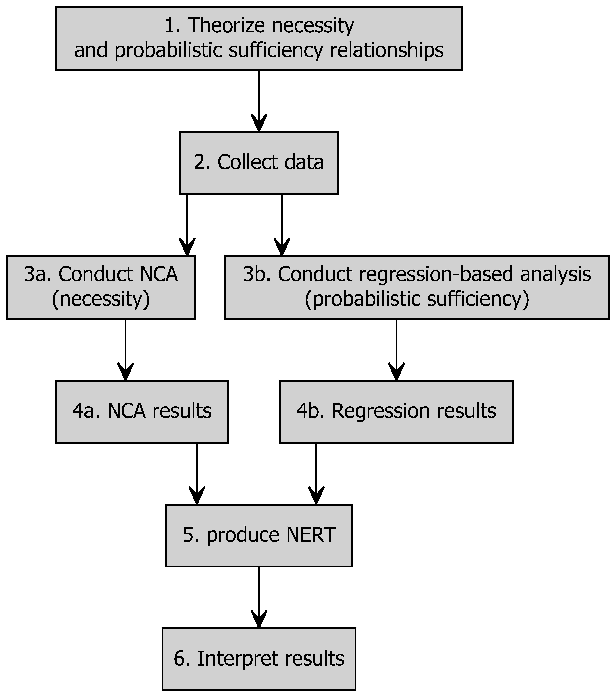
```


```{r regressionflowchart-multimethod-code, echo = FALSE, eval=FALSE}
#NCA-Regression - flowchart

library(DiagrammeR)
library(DiagrammeRsvg)
library(rsvg)

flowchart <- grViz("
digraph flowchart {

  # --- GRAPH SETTINGS ---
  graph [rankdir = TB, splines = ortho]  # <- makes edges straight
  node [shape = rectangle, style = filled, fillcolor = lightgrey, fontname = Helvetica, fontsize = 12]
  edge [arrowhead = vee, color = black]

  # --- LEFT FLOW ---
  D1 [label = '3a. Conduct NCA\n(necessity)']

  # --- MIDDLE FLOW ---
  A2 [label = '1. Theorize necessity\n and probabilistic sufficiency relationships']
  #B2 [label = '2. Collect data']
  E2 [label = '5. Produce NERT']
  F2 [label = '6. Interpret results']

  # --- RIGHT FLOW ---
  C3 [label = '2. Collect data']
  D3 [label = '3b. Conduct regression-based analysis\n(probabilistic sufficiency)']
  
  
  DE1 [label = '4a. NCA results']
  DE3 [label = '4b. Regression results']

  # --- CONNECTIONS ---
  A2 -> C3

  C3 -> D1
  C3 -> D3
  D1 -> DE1
  D3 -> DE3 
  DE1 -> E2
  DE3 -> E2
  E2 -> F2

  # --- ALIGNMENT ---
  {rank = same; A2}
  {rank = same; C3}
  {rank = same; D1; D3}
  {rank = same; DE1; DE3}
  {rank = same; E2}

}
")

flowchart

# Export the flowchart to PDF
# 1. Convert the graph to an SVG
svg_code <- export_svg(flowchart)

# 2. Convert the SVG to a PDF
#rsvg_pdf(charToRaw(svg_code), file = "Flowchart_regression_causalpluralism.pdf")

cat("PDF successfully created")

```

The next step is collecting data to obtain valid and reliable scores that represent the $X$'s and $Y$ of the hypotheses (see Chapter \@ref(datacollection)). Subsequently, two separate data analyses are done: the necessity analysis is conducted with NCA, while the probabilistic sufficiency analysis is done with the selected regression-based analysis (e.g., MLR, SEM). The regression results are often summarized in a regression table that reports the regression coefficients or path coefficients together with their $p$-values. Additional information is usually included as well, such as standard errors, confidence intervals, and model fit statistics, and a note may add additional information such as sample size. The left side of Table \@ref(tab:nert-tab) shows a minimum example of such a table with artificial data. In this table the NCA results are added to obtain the NCA-Extended Regression Table (NERT). It expands the conventional regression table by adding two columns: the necessity effect size ($d$) and its $p$-value, for those predictors that are hypothesized to operate as necessary conditions (Table \@ref(tab:nert-tab)). A blank line in this table indicates that no theoretical rationale is available, such that the NCA analysis is not conducted for this condition. Additional NCA method information that applies to all tested necessity hypotheses may be added in the note to the table. This applies, for example, to the selected ceiling line for estimating the effect size.


```{r nert-tab, echo = FALSE, warning=FALSE, message=FALSE, out.width='60%', cache=FALSE}

library(knitr)
library(kableExtra)

# variable names
vars <- c("$X_1$", "$X_2$", "$X_3$", "$X_4$", "$X_5$")

# regression coefficients, p-values, model fit (character vectors)
reg   <- c("0.23", "0.12", "0.43", "0.09", "0.18")
reg_p <- c("0.035", "< 0.001", "0.022", "0.087", "0.361")
r2    <- 0.28
r2_adj <- NULL   # NULL if not available

# necessity effect sizes and p-values
nec   <- c("0.20", "0.00", "", "0.03", "0.12")
nec_p <- c("< 0.001", "1.000", "", "0.035", "0.028")

# Caption and footnote
caption = "NERT tool for combining NCA results with regression-based results in a causal-pluralism multimethod study. NERT = NCA-Extended Regression Table. The extension consists of adding two columns to the regression table: the necessity effect size and its $p$-value."
note_text <- "n = 132. NCA ceiling line: CR-FDH."

# build rows conditionally
row_labels <- c(vars, sprintf("$R^2$ = %.2f", r2))
if (!is.null(r2_adj) && !is.na(r2_adj)) {
  row_labels <- c(row_labels, sprintf("$R^2$(adj.) = %.2f", r2_adj))
}

# build NERT
nert <- data.frame(
  Row = row_labels,
  `Regression coefficient` = c(reg,  rep("", length(row_labels) - length(reg))),
  reg_p_value              = c(reg_p, rep("", length(row_labels) - length(reg_p))),
  `Necessity effect size`  = c(nec,  rep("", length(row_labels) - length(nec))),
  nec_p_value              = c(nec_p, rep("", length(row_labels) - length(nec_p))),
  check.names = FALSE
)

kbl(
  nert,
  format = "html", 
  escape = FALSE, 
  booktabs = TRUE,
  linesep= "",
  longtable = FALSE,
  caption = caption,
  col.names = c("",
                "Regression coefficient",
                "<em>p</em>-value",
                "Necessity<br>effect size",
                "<em>p</em>-value"),
  align = c("l", "c","c", "c", "c")
  
) %>%
  kable_styling(full_width = FALSE, latex_options = c("HOLD_position", "scale_down")) %>%
  column_spec(1, width = "12em", extra_css = "white-space: nowrap;") %>%
  column_spec(2, width = "8em") %>%
  column_spec(3, width = "8em") %>%
  column_spec(4, width = "8em", border_left = TRUE) %>% 
  column_spec(5, width = "8em") %>%
  pack_rows("Variables/Conditions", 1,5) %>%
  pack_rows("Model fit (regression)", 6, 6, hline_before = TRUE) %>%
  footnote(general = note_text)%>%
  scroll_box(width = "100%")
```


```{r nert-tabX, echo = FALSE, warning=FALSE, eval = FALSE, message=FALSE, out.width='60%', cache=FALSE}

library(kableExtra)
library(knitr)

# check latex or html and for column name "Necessity effect size"
if (is_latex_output()) {
  nec_header <- kableExtra::linebreak("Necessity\neffect size", align = "c")
} else {
  nec_header <- "Necessity<br>effect size"
}

#input data for NERT
note_text <-  "n = 132. NCA ceiling line: CR-FDH."

nert <- data.frame(
  Row = c("$X_1$", "$X_2$", "$X_3$", "$X_4$", "$X_5$", "$R^2$ = 0.28"),
  `Regression coefficient` = c("0.23", "0.12", "0.43", "0.09", "0.18", ""),
  `reg_p_value`     =  c("0.035", "< 0.001", "0.022", "0.087","0.361", ""),
  `Necessity effect size` = c("0.20", "0.00", "", "0.03","0.12", ""),
  `nec_p_value`     =  c("< 0.001", "1.000", "", "0.035", "0.028",""),
  check.names = FALSE
)

# Bold the row labels
#nest$Row <- cell_spec(nest$Row, bold = TRUE, align = "left")


kbl(
  nert,
  format = "latex", 
  escape = FALSE,  #Prevent escaping of LaTeX special characters 
  booktabs = TRUE,
  linesep= "",
  longtable = FALSE,
  caption = "NERT tool for combining regression-based results with NCA necessity
results in a causal-pluralism multimethod study. NERT = NCA-Extended Regression Table. The extension consists of adding two columns to the regression table: the necessity effect size and its $p$-value.",
  col.names = c("",
                "Regression coefficient",
                "\\emph{p}-value",
                nec_header,
                "\\emph{p}-value"),
  align = c("l", "c","c", "c", "c")
  
) %>%
  kable_styling(full_width = FALSE, latex_options = c("HOLD_position", "scale_down")) %>%
  column_spec(1, width = "8em") %>%
  column_spec(2, width = "8em") %>%
  column_spec(3, width = "8em") %>%
  column_spec(4, width = "8em", border_left = TRUE) %>% 
  column_spec(5, width = "8em") %>%
  pack_rows("Variables/Conditions", 1,5) %>%
  pack_rows("Model fit (regression)", 6, 6, hline_before = TRUE) %>%
  footnote(general = note_text)%>%
  scroll_box(width = "100%")
```

A causal-pluralism multimethod study with NCA and a regression-based method can provide complementary information with the following possible results (Table \@ref(tab:multimethodregressionncaresults)).

```{r multimethodregressionncaresults, eval= TRUE, echo = FALSE, warning=FALSE, message=FALSE, out.width='99%', cache=FALSE}

library(kableExtra)

mmt <- data.frame(
  Row = c("Option 1", "Option 2", "Option 3", "Option 4"),
  `Probabilistic sufficiency` = c("Yes", "Yes", "No", "No"),
  `Necessity`     = c("Yes", "No", "Yes", "No"),
  check.names = FALSE
)

# Bold the row labels
#mmt$Row <- cell_spec(mmt$Row, bold = TRUE, align = "left")

kbl(
  mmt,
  booktabs = TRUE,
  caption = "Possible outcomes of a causal-pluralism multimethod study with NCA and a regression-based method.",
  col.names = if (knitr::is_html_output()) {
    c("",
      "Probabilistic sufficiency<br>If X, then probably Y",
      "Necessity<br>If not X, then not Y")
  } else {
    c("",
      "Probabilistic sufficiency: If X, then probably Y",
      "Necessity: If not X, then not Y")
  },

  align = c("l", "c","c"),
  escape = FALSE     # <- needed so cell_spec markup is interpreted
) %>%
  kable_styling(full_width = FALSE, latex_options = c("HOLD_position", "scale_down")) %>%
  column_spec(1, width = "7em") %>%
  column_spec(2, width = "7em") %>%
  column_spec(3, width = "7em")%>%
  scroll_box(width = "100%")

```

- Option 1: $X$ has an average effect on $Y$ and is also necessary for $Y$. $X$ is not only important but also required for having the outcome (See $X_1$ in Table \@ref(tab:nert-tab)). 

- Option 2: $X$ has an average effect on $Y$ but is not necessary for $Y$. $X$ is important but not essential. Its absence can be compensated by other factors (See $X_2$ in Table \@ref(tab:nert-tab)). 

- Option 3: $X$ has no average effect on $Y$, but is necessary for $Y$. It may be that $X$ is overlooked in regression analysis as an important factor (possibly due to the existence of many cases with high level of $X$ and low level of $Y$), but is still an essential factor (See $X_5$ in Table \@ref(tab:nert-tab)). 

- Option 4: $X$ has no average effect on $Y$ and is also not necessary for $Y$ (See $X_4$ in Table \@ref(tab:nert-tab)). 

Note that due to the different causal perspectives, one methodological approach cannot logically be a robustness check of the other approach. The results can only be different, not contradictory.


<!-- of a regression model that are potential necessary conditions. -->

<!-- - For those factors that provide a surprising result in the regression analysis (e.g., in terms of direction of the regression coefficient, see below the situation of disparate duality) to better understand the result.  -->

<!-- - For those factors that show no or a limited effect in the regression analysis (small regression coefficient) to check whether such ‘unimportant’ factors on average still may be necessary for a certain outcome. -->

<!-- -	For those factors that have a large effect in the regression analysis (large regression coefficient) to check whether an ‘important’ factor on average may also be necessary.  -->

<!-- When adding NCA to a regression analysis more insight about the effect of $X$ on $Y$ can be obtained. -->

<!-- Figure \@ref(fig:ncaols4) shows an example of a combined NCA and simple OLS regression analysis.  -->

<!-- ```{r ncaols4, echo=FALSE, fig.align = "center", fig.cap="Example of interpretation of findings from regression analysis and NCA", cache=TRUE} -->
<!-- knitr::include_graphics('Figure4ncaols.png') -->
<!-- ``` -->

<!-- setwd("~") -->
<!-- library(NCA) -->
<!-- set.seed (13) -->
<!-- n =100 -->
<!-- c = 1.2 -->
<!-- X <- runif(n) -->
<!-- Y <- X + c*runif(n) -->
<!-- cor(X,Y) -->
<!-- data <- data.frame(X,Y) -->
<!-- modelN <- nca_analysis(data,1,2, ceilings = c('ols', 'c_lp'), test.rep = 10000) -->
<!-- modelN -->

<!-- pdf("ncaols.pdf",5,5)  -->
<!-- nca_output(modelN, plots=T) -->
<!-- y1 <- 1.3 -->
<!-- abline(h = y1, lty=2, col = 'red') -->
<!-- xc1 <- (y1 - modelN$summaries$X$params[10])/modelN$summaries$X$params[9] -->
<!-- xc1 -->
<!-- abline(v = xc1, lty=2, col = 'red') -->
<!-- modelR<-lm(Y~X) -->
<!-- summary(modelR) -->
<!-- xr1 <- (y1- modelR$coefficients[1])/modelR$coefficients[2]  -->
<!-- xr1 -->
<!-- abline(v=xr1, lty=2, col = 'red') -->
<!-- text(min(X), y1, round(y1,1)) -->
<!-- text(xc1, min(Y), round(xc1,2)) -->
<!-- text(xr1, min(Y), round(xr1,2)) -->

<!-- yr2<- modelR$coefficients[1] + modelR$coefficients[2]*xc1  -->
<!-- yc2<- modelN$summaries$X$params[10] + modelN$summaries$X$params[9]*xr1 -->
<!-- abline(h = yr2, lty=2, col = 'red') -->
<!-- abline(h = yc2, lty=2, col = 'red') -->
<!-- text(min(X), yr2, round(yr2,1)) -->
<!-- text(min(X), yc2, round(yc2,1)) -->
<!-- dev.off() -->
<!-- $X$ and $Y$ are related with correlation coefficient 0.58. The data may be interpreted as an indication of a necessity relationship, an indication of an average effect relationship, or both. The average relationship is illustrated with a green OLS regression line with intercept 0.66 and slope 0.9 (p < 0.001). The ceiling line (C-LP) is illustrated with the dashed blue with intercept 1.1 and slope 1.0 (effect size d = 0.24; p < 0.001). According the ceiling line, for an outcome value $Y = 1.3$, a minimum level of the condition of $X = 0.15$ is necessary. According to the vertical line $X = 0.15$, the *average* value of the outcome for this value the condition is $Y = 0.8$. In other words, for a given value of $X$ (e.g., $X =0.15$), NCA predicts the *maximum* possible value of $Y$ ($Y = 1.3$), whereas OLS regression predicts the *average* value of $Y$ ($Y = 0.8$). OLS regression does not predict a maximum value of $Y$. Regression analysis assumes that any value of $Y$ is possible. Also very high values of $Y$, up to infinity, are possible, but unlikely. The horizontal line $Y = 1.3$ not only intersects the ceiling line, showing the required level of $X = 0.15$ that all cases must have satisfied to be able to reach $Y = 1.3$, but also the OLS regression line, showing that the *average* outcome $Y = 1.3$ is obtained when $X = 0.72$. The vertical line $X = 0.72$ intersects the ceiling line at $Y = 1.9$, showing that this outcome level is maximally possible when the condition level $X = 0.72$. -->

<!-- In this example the regression line has the same direction as the ceiling line. There is a positive average effect and a 'positive' necessity effect (high level of $X$ is necessary for high level of $Y$). I call this situation: '*commensurate duality*'. Commensurate duality also applies when both lines have negative slopes. It is also possible, but less common that the slope of the ceiling line is positive and the slope of the regression line is negative. In this situation there is a  negative average effect and a 'positive' necessity effect. A high level of $X$ is necessary for high level of $Y$, but increasing $X$ on average reduces $Y$. This can occur when a relatively high number of cases are in the lower right corner of the scatter plot (cases with high $X$ that do not reach high $Y$). The situation when both lines have opposite slopes is called '*disparate duality*'. A third situation is possible that there is no significant average effect and yet a significant necessity effect, or the other way around. I call this situation '*impact duality*'. The word 'duality' refers to a data interpretation battle. Should the observed data pattern be describe with regression analysis, NCA or both? The answer depends on the analyst's theory. When a conventional theory with additive/average effect logic is used, regression analysis ensures theory-method fit. -->
<!-- When a necessity theory is used, NCA ensures theory-method fit. When a conventional theory and a necessity theory are both used [e.g. in an 'embedded necessity theory', see @bokrantz2022building and see Chapter \@ref(theory)] both methods should be used to ensure theory-method fit. Hence, it depends on the underlying theory what method(s) should be selected to analyze the data.      -->

## Combining NCA and SEM in a multimethod study {#ncasem}

One of the most common causal-pluralism multimethod applications of combining NCA with a regression-based method is the use of NCA in the context of structural equation modeling (see Appendices \@ref(appendixncasem) and \@ref(appendixncaplssem)). Since in many such published applications NCA is not applied according to the standards proposed in this book and elsewhere, this section (as well as Appendix \@ref(appendixe)) provides  more details and recommendations on how to conduct such a combined analysis. 
A SEM-model consists of two parts. The *measurement model* defines how specified indicators relate to the underlying constructs ("latent variables"). It determines how the constructs are operationalized by their indicators and how measurement error is represented. The *structural model* specifies the relationships among the constructs (latent variables). This is the regression-based part of the model.

Different estimation approaches exist for estimating the relationship between the latent variables ("path coefficients"). Conventional covariance-based SEM [CB-SEM, @joreskog1970general] estimates model parameters based on the covariance matrix, using techniques such as maximum likelihood. Component-based SEM, for example Partial Least Squares SEM [PLS-SEM, @Wold1985] estimates latent variable scores as weighted composites of indicators to maximize the explained variance in the dependent variables. A more recent version of PLS is Consistent Partial Least Squares structural equation modeling [PLSc, @dijkstra2015consistent] that corrects the attenuation bias of traditional PLS estimates when reflective (common-factor) measurement models are used. 

If the SEM^[Whenever the difference between CB-SEM, PLS-SEM and PLSc is not relevant, the general term SEM is used.] model is estimated, latent variable scores can be obtained for further analysis, including for use of $X$- and $Y$-values as input to NCA. In PLS, these scores are directly estimated as part of the model fitting process as component-based SEM-methods are designed to estimate composites, whereas in CB-SEM the analyst must select (based on the analyst's goals, e.g., unbiasedness, orthogonality, correlation preservation) a factor score estimation method to compute estimated scores for latent factors from observed variables after fitting the model. Thus, depending on the SEM modeling approach that is selected by the analyst, the input scores for NCA and thus the NCA results may differ.   

NCA has been applied both in combination with CB-SEM (see Table \@ref(tab:pubstablesem) in Appendix \@ref(appendixncasem)) and in combination with PLS-SEM (see Table  \@ref(tab:pubstableplssem) in Appendix \@ref(appendixncaplssem)). Using PLS-SEM with NCA is popular, possibly for the following reasons:

1.	It is often easier to extract latent variables scores from the estimated PLS models than from estimated CB-SEM models.

2. Leading PLS-SEM proponents introduced NCA as a methodological enrichment of PLS-SEM, and provided specific recommendations [@richter2020predictors; @richter2022use; @richter2023apply] and extensions [@hauff2024importance; @sarstedt2024combined] for combining the methods.

3.	A basic version of the NCA software became part of a popular software package originally developed for conducting PLS-SEM (SmartPLS, Section \@ref(otherncasoftwarepackages) in the Appendix). 

<!-- A SEM model consists of two parts. The measurement model defines how latent variables are represented by measured indicators. A latent variable is an unobserved construct that is derived from observed indicators. The structural model specifies how the latent variables are related to each other.  -->

<!-- In both PLS-SEM and CB-SEM, latent variable scores can be obtained and used for further analysis. However, the estimation approach differs. PLS-SEM uses partial least squares to estimate latent variable scores as weighted composites of indicators and to maximize the explained variance in the dependent variables. CB-SEM estimates model parameters based on the covariance matrix, using techniques such as maximum likelihood or generalized least squares. Latent variable scores are not directly estimated in the model fitting process, but can be computed afterward if needed (e.g., as factor scores). -->

Combining NCA with SEM involves using estimated scores of the latent variables as input for NCA. This allows the analyst to examine whether a relationship between two latent variables is not only related in terms of  probabilistic sufficiency (as modeled in SEM) but also in terms of necessity, assuming a theoretical rationale exists. If a formal necessity hypothesis is available or can be derived (see Chapter \@ref(hypothesisformulation)), any pair of latent variables from the structural model can take the role of condition and outcome to study their necessity relationship, as long as a formal necessity hypothesis is available. When conducting NCA in combination with SEM, all general guidelines for conducting NCA apply (Section \@ref(review)).

The availability of a user-friendly software package for applying NCA within the context of PLS-SEM is an advantage, but it also carries a risk. While the SEM part of the study is often a deductive study for testing a probabilistic sufficiency hypothesis, many published multimethod studies combining NCA and PLS-SEM  conduct the NCA part as an exploratory investigation without having a necessity hypothesis. In the absence of a theoretical justification for necessity, such a study cannot claim that necessity has been identified (Section \@ref(corecriteria)). This also applies if the theoretical justification is provided after the results are known. An exploratory study does not qualify for a hypothesis testing study (Chapter \@ref(hypothesisformulation)). Having a theoretical rationale before data collection is a prerequisite for making a claim of empirical evidence of necessity (see Section \@ref(necessityinkind)). After an exploration, a further study is needed to test the hypothesis that was derived from the exploration (Section \@ref(hypothesistesting)). 

It is also not uncommon, in particular in studies that combine CB-SEM with NCA, that the latent variable scores  of the SEM-part of the study are *not* used as input to NCA. This happens, for example, when instead of using latent variable scores derived from the SEM study, scores independent from SEM (e.g., means of indicator scores) are used as the latent scores  input for NCA. Such a combined NCA-SEM study would qualify as two separate studies according to Table \@ref(tab:multimethodtypes).

### Steps for conducting NCA with SEM {#stepsncasem}

To outline the steps for an NCA-SEM multimethod study, first some SEM terminology is explained.
Since SEM terminology about 'indicators', 'weights', 'latent variables' and 'rescaling' varies across the SEM literature, the terminology described in Table \@ref(tab:semterminology) is used in this book.

 \
```{r semterminology, echo = FALSE, warning=FALSE, message=FALSE, out.width='99%', cache=FALSE}

library("kableExtra")
library(openxlsx)
terms <- openxlsx::read.xlsx("SEM_terminology.xlsx", sheet = 1)
colnames(terms) <- c("Terms", "Description")
kbl(
  terms,
  longtable = T, #format = "latex",
  booktabs = TRUE,
  caption = "SEM terminology",
) %>%
  kable_styling(full_width = F)  %>%
  kableExtra::kable_styling(latex_options = "HOLD_position") %>%
  column_spec(1, width = "10em") %>%
  column_spec(2, width = "25em") %>%
  pack_rows("General", 1,3) %>%
  pack_rows("Indicator", 4,9) %>%
  pack_rows("Weight and loading", 10,13) %>%
  pack_rows("Latent variable", 14, 18)%>%
  scroll_box(width = "100%")

```
 \


<!-- <div style="border: 2px solid #17a2b8; background-color: #e8f7fc; padding: 10px; border-radius: 5px;"> -->
<!-- **Terminology**  -->
<!-- <font size="1"> -->


<!-- **General**: -->

<!-- - Rescaling: normalization or standardization of original scores. -->

<!-- - Normalization (or min-max normalization): rescaling of scales with new minimum and maximum values (e.g., 0-1 or 0-100).    -->

<!-- - Standardization: Rescaling of observed scale values based on the their probability distribution. (z-score) -->


<!-- **Indicator**: -->

<!-- - Indicator (variable). A manifest/measured variable linked to a latent variable. -->

<!-- - Indicator score. The value of an indicator. -->

<!-- - Raw indicator score. The value of the indicator measured on a scale. The scale usually has minimum and maximum values, e.g., Likert scale ranging from 1-5 or 1-7. -->

<!-- - Normalized indicator score. The value of an indicator after min-max normalization of the raw indicator score (e.g., 0-1 scale or percentage scale 0-100). -->

<!-- - Standardized indicator score. The value of an indicator after standardization of the raw indicator (z-score: rescaled such that the mean = 0 and standard deviation = 1). -->

<!-- - Original indicator score. The indicator that is used as input for the SEM model (raw score or standardized score), which can be raw or standardized depending on the estimation settings. -->


<!-- **Weight and loading**:  -->

<!-- - (Indicator) weight. In PLS-SEM, the extent to which an indicator contributes to the latent variable score (as part of a weighted composite).  -->

<!-- - Standardized indicator weight. Indicator weight using standardized indicators. -->

<!-- - Estimated indicator weight. In PLS-SEM, the estimated coefficient that multiplies an indicator to construct the latent variable score.  -->

<!-- - Factor loading. In CB-SEM, the strength of indicator–latent variable relationships. -->


<!-- **Latent variable**: -->

<!-- - Latent variable. An unobserved construct linked to multiple indicators. -->

<!-- <!-- - Latent variable. A variable constructed by aggregating indicator scores.  --> 

<!-- - Latent variable score. The value of a latent variable, calculated as a linear combination (weighted sum) of indicator scores.  -->

<!-- - Standardized latent variable score. The value of a latent variable obtained by linear combination (weighted sum) of standardized indicator scores (z -score). -->

<!-- - Unstandardized latent variable score. The value of a latent variable expressed in the scale of the original indicators (commonly raw original scores).   -->

<!-- - Normalized unstandardized latent variable score. Unstandardized latent variable score after normalization. -->

<!-- </font> -->
<!-- </div>\ -->

Figure \@ref(fig:semflowchart) shows a flowchart for conducting NCA in combination with SEM.

```{r semflowchart, echo=FALSE, out.width='60%', fig.align = "center", fig.cap="Flowchart for conducting NCA in combination with structural equation modeling (SEM). NERT = NCA-Extended Regression Table tool. BIPMA = Bottleneck Importance Performance Map Analysis tool.", cache=TRUE}
#knitr::include_graphics('SEMflowchart2.png')
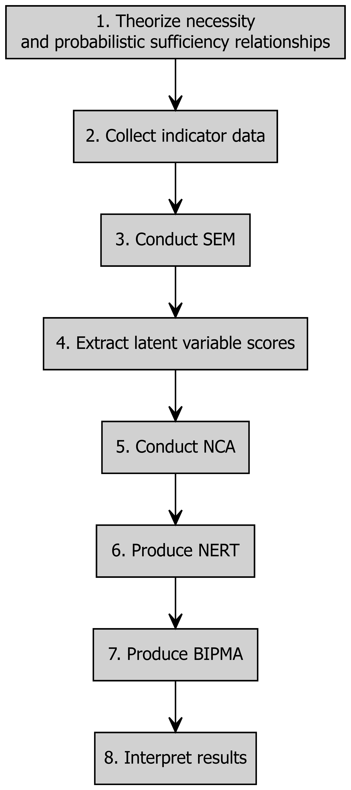
```

```{r semflowchart-multimethod-code, echo = FALSE, eval=FALSE}
library(DiagrammeR)
library(DiagrammeRsvg)
library(rsvg)

flowchart <- grViz("
digraph flowchart {

  # --- GRAPH SETTINGS ---
  graph [rankdir = TB, splines = ortho]  # <- makes edges straight
  node [shape = rectangle, style = filled, fillcolor = lightgrey, fontname = Helvetica, fontsize = 12]
  edge [arrowhead = vee, color = black]

  # --- MIDDLE FLOW ---
  A2 [label = '1. Theorize necessity\n and probabilistic sufficiency relationships']
  B2 [label = '2. Collect indicator data']
  C2 [label = '3. Conduct SEM']
  D2 [label = '4. Extract latent variable scores']
  E2 [label = '5. Conduct NCA'] 
  F2 [label = '6. Produce NERT']
  G2 [label = '7. Produce BIPMA']
  H2 [label = '8. Interpret results']

  # --- CONNECTIONS ---
  A2 -> B2
  B2 -> C2
  C2 -> D2
  D2 -> E2
  E2 -> F2 
  F2 -> G2
  G2 -> H2

  # # --- ALIGNMENT ---
  # {rank = same; A2}
  # {rank = same; C3}
  # {rank = same; D1; D3}
  # {rank = same; DE1; DE3}
  # {rank = same; E2}

}
")

flowchart

# Export the flowchart to PDF
# 1. Convert the graph to an SVG
svg_code <- export_svg(flowchart)

# 2. Convert the SVG to a PDF
#rsvg_pdf(charToRaw(svg_code), file = "Flowchart_sem_causalpluralism.pdf")

cat("PDF successfully created")
```

Eight steps are distinguished, and each step is discussed in detail. An example is provided in Appendix \@ref(appendixe).

#### Step 1: Theorize necessity and probabilistic sufficiency {#theorize}

The first step is a fundamental step for any combined NCA and SEM study. An NCA-SEM study implies that the relationships between the variables are considered from two different causal perspectives: necessity (NCA) and probabilistic sufficiency (SEM), see Section \@ref(underdetermination). For inferring causality, both NCA and SEM require that the study starts with formulating theoretical expectations about the causal relationship (e.g., hypotheses). According to SEM, all relationships between latent variables in the structural model are considered probabilistic sufficiency relationships that are theoretically justified. According to NCA, all, a few, or none of these relationships may be hypothesized as necessity relationships as well, depending on the availability of a theoretical justification in the format of a formal necessity hypothesis (Section \@ref(developingformaltheory)). A theory that includes one or more necessity relationships in addition to probabilistic sufficiency relationships is called an 'embedded necessity theory' [@bokrantz2022building].

Latent variables of a structural model can have different roles. It can be a *predictor variable* (independent variable; condition in NCA) that has an effect on a *predicted variable* (dependent variable; outcome in NCA). For example, when in a structural model a latent variable $M$ mediates the relationship between $X$ and $Y$, then $M$ has two different roles. For the $X$-$M$ relationship $X$ is the predictor and $M$ is the predicted variable, and for the $M$-$Y$ relationship $M$ is the predictor and $Y$ the predicted variable. When a relationship is (also) considered a necessity relationship, NCA calls the predictor variable the 'condition' and the predicted variable the 'outcome'.   

#### Step 2: Collect indicator data 

Conducting SEM assumes that data are available on observed indicators. SEM involves specifying a measurement model, which defines the relationships between indicators and latent variables. In step 2 the indicator data are collected. These data are the input for the measurement model.^[Note that it is also possible to hypothesize and test the necessity of an indicator of the latent construct.] 

#### Step 3: Conduct SEM 

The structural model specifies the relationships between latent variables. The complete model is then estimated using a chosen algorithm (e.g., PLS or CB-SEM). NCA is not part of the SEM estimation process itself, but it uses latent variable scores obtained from SEM as input for its own analysis. Therefore, it is important that the analyst ensures that the latent variable scores extracted from the SEM model are valid, reliable, and interpretable. Recommendations for good SEM practices are available in the literature and are not discussed here. Both commercial and open-source software tools are available to conduct SEM.

#### Step 4: Extract latent variable scores

The latent variable scores obtained from the SEM model serve as input for NCA. During SEM estimation, latent variable scores are often standardized (z-scores), resulting in scores with a mean of 0 and standard deviation of 1. Although NCA results are invariant to affine transformations (such as standardization or linear rescaling; Section \@ref(transformation)), it is recommended for purposes of interpretation of a necessary condition to first unstandardize standardized latent variable scores. Unstandardized latent variable scores are expressed on a scale that is directly related to the original indicator scale, provided that the same measurement scale was used for all indicators of the latent construct. This allows for more meaningful interpretation of the NCA results, especially when discussing real-world implications and when results are discussed in terms of necessity-in-degree with specified levels of $X$ and $Y$. Note that not all SEM software packages offer the option to extract unstandardized latent variable scores. Appendix \@ref(appendixe) gives an example showing how to convert standardized scores back to unstandardized scores when needed.

When all unstandardized latent variable scores are derived from indicators measured on the same scale (i.e., with identical minimum and maximum values), min-max-normalization is not required. However, if latent variables have different scales, min-max normalization is recommended. This ensures that the latent variable scores are comparable, which is particularly important in later steps (e.g., Step 7: producing a BIPMA).

A common approach to min-max normalization is to rescale scores to a 0–100 range, allowing latent variable scores to be interpreted as percentages of their original scale range. Alternatively, rescaling to a 0–1 range can be used, which is often more convenient for NCA, as it yields a scope of 1. However, this is optional and not required for the validity of NCA results.

#### Step 5: Conduct NCA
The unstandardized and possibly min-max normalized latent variable scores are input to NCA. In the first part of the analysis, the hypothesized relationships are tested for necessity-in-kind, which is the qualitative statement that $X$ is necessary for $Y$ without specifying levels of $X$ and $Y$ other than absence/presence or low/high. The observed effect size $d$ and the $p$-value are compared with their threshold values (e.g., $d$ = 0.10; $p$ = 0.05) that are set by the analyst to decide if a predictor variable is necessary for a predicted variable, as suggested by the hypothesis. 

In the second part, identified necessary in conditions in kind are selected for a bottleneck analysis for necessity-in-degree, which results in a quantitative statement that level $x$ of $X$ is necessary for level $y$ of $Y$. A specific format of this table, with the outcome values expressed as actual values or percentiles, and the conditions expressed as percentiles, provides information for each latent variable about the percentage of cases that are bottlenecks. A bottleneck case is a case that does not have the *required* level of the condition for a *target* level of the outcome.^[Chapter \@ref(practice) discusses the importance of knowing bottleneck cases for practical action.]

#### Step 6: Produce NERT
The NCA-Extended Regression Table (NERT) summarizes the main SEM results in terms of direct effects (path coefficients), total effects, and their $p$-values  and the main NCA results in terms of necessity effect sizes and their $p$-values. Note again,  that NCA is not a robustness check of SEM and vice versa. The two approaches provide different insights due to different causal perspectives.
 
#### Step 7: Produce BIPMA {#producebipma}
Whereas NERT presents the results of both NCA and SEM, the Bottleneck Importance Performance Map Analysis (BIPMA) builds on that by providing a tool to assist practitioners to prioritize their actions and resources based on these results. Evidence-based action means that the action is informed by the results of an empirical study, in particular based on hypotheses that were tested and supported (see the NERT). A SEM-hypothesis is a causal claim about average effects: if $X$ then probably $Y$. The hypothesis is usually considered supported if the criteria for statistical significance are satisfied. An NCA-hypothesis is a causal claim about any case: if not $X$ then not $Y$. The hypothesis is considered supported if the criteria for statistical significance *and* for practical significance are satisfied (assuming that a formal necessity hypothesis is available). The NERT reports the effect sizes (total effect for SEM; necessity effect size for NCA) and their significance ($p$-values). Only *supported* hypotheses are considered in BIPMA for evidence-based action.

Taking evidence-based action based only on SEM-results (assuming a supported probabilistic sufficiency hypothesis) means that a predictor variable that has a significant average effect on the predicted variable is a candidate for being changed. The action changes the predictor in order to change the average value of the predicted variable. According to a basic regression assumption, during the change of this predictor all other predictors remain constant (*ceteris paribus*). This (“all else equal”) assumption is the idea in regression analysis that a coefficient represents the effect of one predictor while holding the other included predictors constant. This implies that only one predictor can be selected for prioritizing an action based on SEM. Selection of multiple predictors and taking action on them simultaneously violates the *ceteris paribus* requirement. The only evidence-based way to select multiple predictors is through a sequential prioritization, in which a new SEM analysis is conducted after each (hypothetical) change has been made. 

A SEM-based action addresses an entire group of cases since SEM results apply to an entire group by definition (average effect). The action is considered most effective if a predictor is "important" and has low "performance". Importance  refers to the strength of the probabilistic sufficiency (average effect) relationship of the predictor variable on the predicted variable. Its metric is the total average effect on the outcome including direct and indirect effects. Performance refers to the mean normalized score of the predictor compared to other predictors. A low performance score means that the predictor has room for improvement. In PLS-SEM, the Importance Performance Map Analysis (IPMA) [@ringle2016gain] is often used for prioritization. In this map Importance is displayed on the horizontal axis and Performance on the vertical axis. The practical meaning of IPMA is that action priority should be given to a predictor variable with high level of Importance, and low level of Performance (points in the bottom-right corner assuming positive total effects and average scores).

Taking evidence-based action based only on NCA results (assuming supported necessity hypotheses) implies that a predictor variable is changed such that a selected *target outcome* of the predicted variable is *possible* (though not guaranteed). No assumption is needed about other predictors, including no requirement that these must remain constant. This implies that selection of multiple predictors and taking evidence-based action on them simultaneously is possible. Furthermore, an NCA-based action can address a single case, a small group of cases or an entire group of cases since NCA results apply to all cases. The goal of the action is to ensure that bottleneck cases are resolved: a bottleneck case is a case that does not meet the target condition level that is necessary for the selected target outcome level. An NCA-based action is most effective if only cases are selected that are below the required target condition level (for a detailed discussion see Chapter \@ref(practice)).

In an extension of IPMA, @hauff2024importance introduced the combined Importance Performance Map Analysis (cIPMA) which combines results of NCA and SEM. They add the third dimension that is called here the 'bottleneck' dimension. This dimension takes into account how effective the action is from the perspective of the presence of bottleneck cases according to NCA. 
<!-- While IPMA focuses on prioritization aimed at increasing the average effect across a group of cases, such an approach may be less effective when bottlenecks are present. The bottleneck dimension introduces a complementary priority judgement. It prioritizes actions based on the goal that as many cases as possible are able to achieve a specified target level of the predicted variable.  -->
This means that for cIPMA a *target outcome* must be selected and that an additional action goal is that the target outcome set by the analyst must become achievable by as many as possible cases. If the target outcome is set at a low level, the goal is to enable a base level of the outcome (e.g., mean or even lower outcome, for example corresponding to a minimum level that is achieved by 50 or 75 percent of the cases). If the target outcome is set at a high level, the goal is to enable high level of the outcome (e.g., corresponding to a minimum level that is achieved by only about 25 or 10 percent of the cases).

NCA's bottleneck table provides the required information for an NCA-based action in the context of cIPMA. This table is produced in Step 5 of a combined NCA-SEM study (see Figure \@ref(fig:semflowchart)). After establishing the target outcome, the bottleneck table provides the corresponding target condition for each necessary condition. The version of the table where conditions are expressed as percentiles provides information about the percentage and the number of cases that are bottleneck cases for the conditions. These cases have not achieved the target condition that is necessary for the target outcome. 

The cIPMA plot integrates three dimensions: Importance on the horizontal axis, Performance on the vertical axis, and Bottlenecks represented by the size of the points in the Importance-Performance plot. Each point represents a predictor variable with a given combination of Importance and Performance scores. cIPMA suggests that the best choice is the predictor with the largest Importance score and lowest Performance score (according to SEM), and the largest number of bottleneck cases (according to NCA's bottleneck table). 

<!-- Specifically, @hauff2024importance suggest that priority action based on SEM results should focus predictors located in the bottom-right corner of the cIPMA plot.implicitly assuming that the total effects are positive, while priority action based on NCA can focus on any of the quadrants. -->
<!-- NCA estimates the minimum required score of a predictor variable that is needed for being able to achieve the target level of the predicted variable. The bottleneck dimension in cIPMA is based on the *number or percentage of bottleneck cases* of the predictor variable. Information about the bottleneck cases (the cases where the predictor variable score is lower than the minimum required score to make the target outcome level achievable) can be obtained from   -->

When prioritization is based on the combined results from NCA and SEM, only one predictor variable can be selected for change if this change is (also) based on SEM results (because the *ceteris paribus* assumption of SEM applies).  However, it is possible that a bottleneck case is not only a bottleneck for the selected predictor, but also for another predictor. Solving a bottleneck for one predictor (by changing the level of that predictor such that it meets the target condition level) is only effective if the case is not also a bottleneck case for another predictor. A case with multiple bottlenecks (bottlenecks for multiple conditions) remains a bottleneck case after resolving the bottleneck for the selected predictor, because the bottlenecks for the other predictors remain unresolved.

<!-- and distinguished it from f the combined Importance Performance Map Analysis (cIPMA) as developed by [@hauff2024importance]. cIPMA is a combination of the classic IPMA [@ringle2016gain] and NCA. -->

<!-- The differences between IPMA, cIPMA, and BIPMA is as follows. IPMA only uses the SEM results to prioritize actions. It combines two dimensions: -->

<!-- - Importance: The total effects (direct and indirect path coefficients) of a predictor variable on the predicted variable. It represents the strengths of the probabilistic sufficiency (average effect) relation. -->

<!-- - Performance: The average score of a normalized predictor variable. It represents how well the predictor variable performs regarding the average (positive) contribution to the predicted variable (the mean score of the predictor). -->

<!-- Therefore, the practical meaning of IPMA is that action priority should be given to a predictor variable with: -->

<!-- - High level of Importance, and low level of Performance (points in the bottom-right corner assuming positive total effects). -->

<!-- cIPMA [@hauff2024importance] adds a third dimension to the classic IPMA, which is called here the 'bottleneck' dimension. This dimension takes into account how effective the action is from the perspective of the presence of bottleneck cases according to NCA. The bottleneck dimension introduces a complementary priority judgement. It prioritizes actions based on the goal that as many cases as possible are able to achieve a specified target level of the predicted variable. This means that for cIPMA a *target outcome* must be selected. This is a specific level of the predicted variable set by the analysist that must become achievable by as many as possible cases after action is taken. If the target outcome is set at a low level, the goal is to enable a base level of the outcome (e.g., mean or even lower outcome, for example corresponding to a minimum level that is achieved by 50 or 75 percent of the cases). If the target outcome is set at a high level, the goal is to enable high level of the outcome (e.g., corresponding to a minimum level that is achieved by only about 25 or 10 percent of the cases).  -->


<!-- Therefore, the practical meaning of cIPMA is that action priority should be given to the predictor variable with: -->

<!-- 1. High level of Importance, and low level of Performance (points in the bottom-right corner). -->
<!-- 2. High number or percentage of bottleneck cases (large points) for the significant necessary conditions. -->

<!-- Note that in IPMA and cIPMA all predictor variables that are hypothesized in the SEM model are usually shown in the plots, even if the total effect is  statistically non-significant. -->

<!-- The 'Bottlenecks Importance Performance Map Analysis' (BIPMA) is an adaptation and replacement of cIPMA: BIPMA adapts the cIPMA in four ways: -->


<!-- While IPMA focuses on prioritization aimed at increasing the average effect across a group of cases, such an approach may be less effective when bottlenecks are present.  -->

<!-- Prioritization is therefore based on predictors that: -->
<!-- 1, have lo -->


<!-- For an effective action based on NCA   -->


<!-- in terms of selection of the predictor variable that has the most important influence on the predicted variable. -->

<!-- s an adapted version o -->

Figure \@ref(fig:bipmageneral) shows an example of a Bottleneck Importance Performance Map Analysis (BIPMA)

<!-- (ref:caption123) Example of a Bottleneck Importance Performance Map Analysis (BIPMA) for evidence-based practical advice (prioritizing predictors) based on NCA and SEM results. The size of the dot is an indication of the number of *single* bottleneck cases that cannot achieve the target outcome (here 85% of the maximum of the outcome). White points: predictor has a significant necessity effect according to NCA and a significant total average effect according to SEM. Black points: predictor has a non-significant necessity effect and a significant total average effect. Gray points: predictor has a significant necessity effect and a non-significant total average effect. The horizontal and vertical thin dashed lines corresponds to mean Performance and the mean Importance of the predictors with a significant total average effect, respectively. -->

```{r bipmageneral, echo=FALSE, out.width='75%', fig.align = "center", fig.cap = "Example of a Bottleneck Importance Performance Map Analysis (BIPMA) for evidence-based practical advice (prioritizing predictors) based on NCA and SEM results. The size of the dot is an indication of the number of *single* bottleneck cases that cannot achieve the target outcome (here 85% of the maximum of the outcome). White points: predictor has a significant necessity effect according to NCA and a significant total average effect according to SEM. Black points: predictor has a non-significant necessity effect and a significant total average effect. Gray points: predictor has a significant necessity effect and a non-significant total average effect. The horizontal and vertical thin dashed lines corresponds to mean Performance and the mean Importance of the predictors with a significant total average effect, respectively.", cache=TRUE}
#knitr::include_graphics('examplebipma1.png')
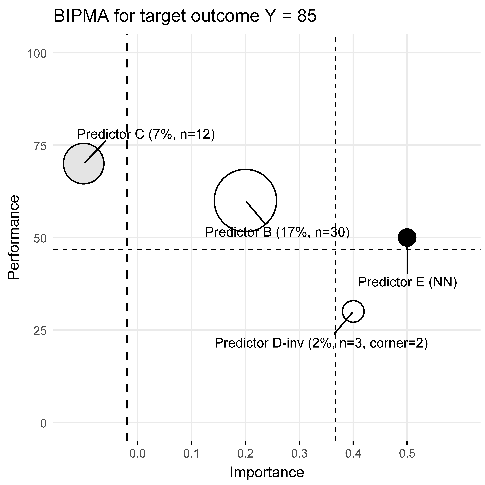
```

```{r examplebipmacode, echo = FALSE, eval=FALSE}
# R script for making the BIPMA introduced in
# Dul, J. (2026). Necessary Condition Analysis - NCA. Principles and Application. 
# Chapman & Hall/CRC Press.
# February 5, 2026

# Input for the plot
plots = FALSE # FALSE = do not save the plots (only display)
scale <- c(0,100)  # Define new scale (normalized scales in percentages)
x_range <- c(0,0.6) # range of values of the Importance x-axis of the (x)IPMA plot
y_range <- c(0,100) # range of values of the Performance y-axis of the (x)IPMA plot
size_limits = c(0,100) 
size_range <- c(0.5,50) # the size of the bubble of the (x)IPMA plot
name_plot <- "" # name of the plot

# SEM results
predictor <- c("Predictor A", "Predictor B", "Predictor C", "Predictor D", "Predictor E")
Importance <- c(0.15, 0.20, 0.05, -0.4, 0.5)
Performance = c(30, 60, 70, 30, 50)

# NCA-results
corner = c(1,1,1,2,1) # analyzed corners per predictor
target_outcome <- 85 
Single_bottleneck_cases_per = c(14.9425287,  17.2,  6.90,  1.72,  9.20)
Single_bottleneck_cases_num =  c(26,  30,  12,  3, 16)
Necessity = c("no", "yes", "yes", "yes", "no")
Sufficiency = c("no", "yes", "no", "yes", "yes")

# Prepare the plot
# Invert names and take absolute values where importance is negative (done in get_ipma_df)
renamed_predictors <- ifelse(Importance < 0,
                             paste0(predictor, "-inv"),
                             predictor)
Importance <- abs(Importance)

bipma_df <- data.frame(
  predictor = renamed_predictors,
  Importance,
  Performance,
  Single_bottleneck_cases_per,
  Single_bottleneck_cases_num,
  Necessity,
  Corner = corner,
  Target_outcome = target_outcome,
  Sufficiency
)

# Add predictor labels:
bipma_df$Predictor_with_single_cases <- ifelse(
  bipma_df$Necessity == "yes",
  paste0(
    bipma_df$predictor,
    " (",
    round(bipma_df$Single_bottleneck_cases_per, 0), "%, n=",
    bipma_df$Single_bottleneck_cases_num,
    ifelse(
      bipma_df$Corner %in% c(2, 3, 4),
      paste0(", corner=", bipma_df$Corner),
      ""
    ),
    ")"
  ),
  paste0(bipma_df$predictor, " (NN)")
)
bipma_df

# Make the plot
library(ggplot2)
library(ggrepel)

# For visibility of overlapping filled points
bipma_df <- bipma_df[order(bipma_df$Single_bottleneck_cases_num, decreasing = TRUE), ]

# Dynamically determine x_range if not provided
if (is.null(x_range)) {
  x_range <- range(bipma_df$Importance, na.rm = TRUE)
}

# Dynamically determine y_range if not provided
if (is.null(y_range)) {
  y_range <- range(bipma_df$Performance, na.rm = TRUE)
}

# Extract the bottleneck column name
colname <- colnames(bipma_df)[4]
target.Y <- target_outcome

# bipma_df$fill_color <- ifelse(
#   grepl("\\(NN\\)", bipma_df$Predictor_with_single_cases),
#   "black",
#   NA_character_
# )
bipma_df$fill_color <- ifelse(bipma_df$Necessity == "no", "black", NA_character_)
bipma_df$fill_color[is.na(bipma_df$fill_color) & bipma_df$Sufficiency == "no"] <- "grey90"
bipma_df$fill_color[is.na(bipma_df$fill_color)] <- "white"

# Define dot size: fixed small size for NN, scaled otherwise
bipma_df$dot_size <- ifelse(
  grepl("\\(NN\\)", bipma_df$Predictor_with_single_cases),
  1,
  bipma_df[[colname]]
)

# Adjust importance for plotting
x_no <- -0.1  # x-position for "no sufficiency" predictors changed from -0.00 to -0.1
bipma_df$Importance_adj <- ifelse(
  bipma_df$Sufficiency == "no",
  x_no,
  bipma_df$Importance
)

# Define x-range (include the no sufficiency zone to give space for points)
x_range_adj <- c(x_no - 0.02 , max(bipma_df$Importance, na.rm = TRUE) + 0.1)
x_breaks <- pretty(bipma_df$Importance)

## 1) keep the NN & NS names BEFORE removing them
dropped_idx <- (bipma_df$Necessity == "no" & bipma_df$Sufficiency == "no")
dropped_names <- bipma_df$predictor[dropped_idx]

# Remove predictors that are not necessary and not sufficient
bipma_df <- bipma_df[!dropped_idx, ]

# ADD Mean Importance for the vertical line (of predictors with significant total effect):
# exclude the "no sufficiency" predictors from the mean calculation
mean_importance <- mean(bipma_df$Importance[bipma_df$Sufficiency != "no"], na.rm = TRUE)

# ADD Mean Performance for the horizontal line (of predictors with significant total effect)
# exclude the "no sufficiency" predictors from the mean calculation
mean_performance <- mean(bipma_df$Performance[bipma_df$Sufficiency != "no"], na.rm = TRUE)

# Plot
p <- ggplot(bipma_df, aes(x = Importance_adj, y = Performance)) +
  
  # Mean reference lines
  geom_vline(xintercept = mean_importance, linetype = "dashed", linewidth = 0.4) +
  geom_hline(yintercept = mean_performance, linetype = "dashed", linewidth = 0.4) +
  
  #add separation line
  geom_vline(xintercept = -0.02, linetype = "dashed", linewidth = 0.7) +
  
  geom_point(
    aes(size = dot_size, fill = fill_color),
    shape = 21,
    color = "black",
    stroke = 0.7
  ) +
  scale_fill_identity() +
  
  # geom_text_repel(
  #   aes(label = Predictor_with_single_cases),
  #   size = 3.5,
  #   box.padding = 2
  # ) +
  
  geom_text_repel(
    aes(label = Predictor_with_single_cases),
    size = 3.5,
    box.padding = 1.2, #spacing
    #point.padding = 2.2, 
    force = 5, # allow labels to move further away
    force_pull = 3, # allow labels to move further away
    max.iter = 50000, # more work to find a non-overlapping layout
    #max.time = 2,  # allow more candidate positions
    seed = 123,
    min.segment.length = 0,  # keep labels from overlapping each other completely
  ) +
  
  
  coord_cartesian(xlim = x_range_adj, ylim = y_range) +
  scale_x_continuous(
    breaks = x_breaks,
    limits = x_range_adj
  ) +
  scale_y_continuous(limits = y_range) +
  scale_size_continuous(limits = size_limits, range = size_range) +
  
  labs(
    title = paste("BIPMA for target outcome Y =", target.Y, name_plot),
    x = "Importance",
    y = "Performance"
  ) +
  theme_minimal() +
  theme(
    axis.text.x = element_text(),
    axis.ticks.x = element_line(),
    panel.grid.minor = element_blank()
  ) +
  guides(size = "none")

## 2) add the textbox in the lower-left corner (only if there were dropped ones)
if (length(dropped_names) > 0) {
  p <- p +
    annotate(
      "label",
      x = x_range_adj[1] + 0.01,     # a little inside the panel
      y = y_range[1] + 0.01,
      hjust = 0,
      vjust = 0,
      label = paste(
        c("Non-significant necessity and average effects:", dropped_names),
        collapse = "\n"
      ),
      size = 3
    )
}

print(p)
ggsave("examplebipma2.pdf", p, width = 5, height = 5, dpi = 600, device = cairo_pdf)

```

BIPMA differs from cIPMA regarding the bottleneck cases to be considered during prioritization. BIPMA only considers *single* bottleneck cases. Single bottleneck cases are a bottleneck in only one predictor. These cases are relevant for taking action based on combined results of NCA and SEM. While cIPMA defines he bottleneck dimension for a predictor as the percentage or number of *single and multiple* bottleneck cases. BIPMA defines it as the percentage or number of *single* bottleneck cases, only to avoid ineffective actions. 

Three additional adaptations compared to cIPMA are implemented in BIPMA. To avoid the risk of false positive conclusions, as a general rule BIPMA only includes predictors to be considered for prioritization when the hypothesis is supported. Although this is a judgment of the analyst, usually an analyst rejects the hypothesis when the $p$-value is large (e.g., $p\ge$ 0.05), suggesting that the observed effect may be compatible with "no effect".^[Note that NCA not only rejects a necessity hypothesis if the $p$-value is large but also if the effect size is small. SEM usually rejects a probabilistic sufficiency hypothesis if the $p$-value is large (or similarly a zero effect is part of the confidence interval).] However, cIPMA is asymmetric regarding this statistical significance criterion as it adopts it only for NCA results. cIPMA (and IPMA) allow analysts to consider non-significant SEM results for practical action.^[The argument is: "While a non-significant effect provides evidence that a total effect is zero in the population, analysts should retain the corresponding construct in the IPMA since this outcome may also represent a valuable finding (e.g., a company invests into the performance of a construct that has no effect), which also can change with different data, for instance, in alternative contexts of the analysis" [@ringle2016gain p. 1872]. The suggestion to include non-significant SEM results in cIPMA is adopted in @hauff2024importance and @sarstedt2024combined.] BIPMA harmonizes this principle by not only excluding non-significant NCA results for evidence-based practical action, but also non-significant SEM results. ^[Harmonizing the approaches by allowing also non-significant NCA results introduces a risk of false positives and ineffective action.] Since BIPMA is a tool for practical action and not a tool for reporting results of the two analyses, the BIPMA should always be accompanied with the NERT tool (or similar) to report all observed effect sizes and their significance levels.
<!-- (unless ) ving an effect on the outcome are rejected     but also the non-significance of the total effects of SEM results (which is not done in cIPMA). This avoids false positive conclusions and ineffective SEM-based intervention efforts. In contrast, a non-significant necessary condition is not included in IPMA and cIPMA for reasons to avoid false positive conclusions and ineffective interventions. See below further explanation why BIPMA deviates from this advise]. Such condition has the standard point size illustrating that the predictor should not get priority from the perspective of necessity. -->

The second additional adaptation is that BIPMA deals with different relationship directions between predictor variable and predicted variable. The common situation in SEM is that the predictor variable has a positive (average) effect on the predicted variable. BIPMA also handles predictor variables with hypothesized and observed negative total average effect on the predicted variable. For example, @mwesiumo2025identifying added a negative total effect for one of the predictor variables on the negative side of cIPMA's Importance-axis. Since this is inconsistent with the advice [@hauff2024importance] that priority should be to points in the bottom-right corner of cIPMA, BIPMA explicitly uses the *absolute* total effect as Importance score, such that importance scores of positive total effects and negative total effects are comparable and priority should be given to points in the bottom-right corner independent of the sign of the total effect. The BIPMA plot identifies an Importance score that is based on a negative total effect by adding '-inv' to the name of the predictor, indicating that this predictor has an inverse effect on the predicted variable. This is shown in Figure \@ref(fig:bipmageneral) for predictor D.  While an *increase* of the predictor variable with a positive total effect will increase the predicted variable, a *decrease* of the predictor variable with a negative total effect will increase the predicted variable. 

A third additional adaptation is that BIPMA also handles different necessity directions. For NCA the default necessity direction is high-high, meaning that a high level of $X$ is necessary for a high level of $Y$. The other directions are low-high, high-low, or low-low, suggesting that low $X$ is necessary for high $Y$, high $X$ is necessary for low $Y$, or low $X$ is necessary for low $Y$, respectively. This implies that the expected empty corner of the $XY$-plot is not upper-left, but that another corner of the $XY$-plot is expected to be empty and should be analyzed. For example, an expected and observed empty corner is the upper-right corner of the $XY$-plot (low $X$ is necessary for high $Y$), which implies that for resolving bottleneck cases the predicted variable must decrease, rather than increase. If the corner deviates from corner = 1, the corner is specified in the BIPMA plot in the predictor label. This is shown in Figure \@ref(fig:bipmageneral) for predictor D. Predictor D has a negative average effect and an empty upper-right corner in the $XY$-plot.

BIPMA aims to inform practice as closely as possible in line with the evidence of empirical results both in terms of effect size and in terms of statistical significance. Using points with different shades of gray, BIPMA displays the four possible combinations of statistical (non-)significance of NCA and SEM results (Figure \@ref(fig:bipmageneral)):

In BIPMA conditions are displayed as points with different sizes and shades of gray: 

- The size of the point reflects the number of *single* bottleneck cases for the specific condition. The percentage and number of single bottleneck cases is mentioned near the point.

- White point: the total average effect (Importance) and the necessity effect are both significant. The size of the point reflects the number of *single* bottleneck cases.

- Black point: the total average effect is significant and the necessity effect is non-significant. The black point has a standard size.

- Gray point: the total average effect is non-significant and the necessity effect is significant. The size of the point reflects the number of *single* bottleneck cases. When according to SEM the average effect of the conditions is statistically non-significant only the vertical position (Performance) contains relevant information for action. No evidence-based information is available about the total average effect (Importance). For this reason the point is moved to the left outside  the horizontal axis, indicating absence of information.^[A non-significant total average effect is statistically compatible with the null hypothesis of no total effect. In reality the true effect could be positive, negative or absent. In this situation only the size of the point (necessity) is informative.]

- If the total effect is non-significant (statistically) and the necessity effect is non-significant (statistically or practically) the point is not shown. There is no evidence for practical action. The name of such a non-significant predictor is mentioned at the bottom of the plot. 

<!-- Note that the criteria for non-significance are stricter for necessity than for probabilistic sufficiency because of different approaches for rejecting an effect size. Both methods use statistical significance ($p$-value), but NCA also considers practical significance (effect size). In the current practice of SEM, no standardized rule is available for evaluating practical significance of the total effect size (Importance). Having strict criteria for significance is relevant to avoid false positive conclusions drawn frim the SEM or NCA results. A prudent approach towards practice limits the risk of ineffective action and waste of resources. -->


<!-- While taking these adaptations into account, the practical meaning of BIPMA is that action priority should be given to predictor variables with: -->

<!-- 1. A statistically significant and high level of Importance (absolute total effect) and low level of Performance (points in the bottom-right corner of the Importance-Performance plot). -->

<!-- 2. High number or percentage of *single* bottleneck cases for significant necessary conditions (large points). -->

The goal of BIPMA is to identify predictor variables for action using results from NCA and SEM. Several prioritization approaches and corresponding ways to evaluate the BIPMA plot can be used to combine these criteria. Assuming a positive direction for the average effect and a high-high direction for the necessity effect, these *strategies* can be formulated as follows: 

1. Enable a target outcome. This approach only considers NCA results. It is feasible when SEM results do not give a clear preference for predictors to be changed (e.g., no points in the bottom-right corner of BIPMA). Multiple predictor variables can be selected for an action based on the NCA results. This approach implies that the goal of the intervention is to enable a high target score by ensuring that none of the conditions have bottleneck cases. For example, if the target outcome is desirable and $X$ is necessary for high $Y$, the target can be set at a high level that is achieved by not more than 25% or 10% of the cases (the level corresponding to the best performing cases). The intervention then consists of ensuring that the bottleneck cases are resolved by increasing the values of the conditions with bottleneck cases. The approach is also feasible when the goal is to enable a certain minimum level of the outcome for all cases. The target outcome can for example be set at a minimum level that is achieved by more than 50% or 75% of the cases.

2. Improve the average outcome. This approach only considers the SEM results. It is feasible when NCA results show that none of the conditions are necessary or have only a small number of bottleneck cases. Only one predictor variable can be selected for action at once given the *ceteris paribus* requirement of regression analysis. For selecting a second predictor, evidence-based action requires a new SEM and BIPMA with a new dataset representing the situation after the intervention on the first predictor.

3. Improve the average outcome and enable a target outcome. This approach considers both the NCA and SEM results. Since SEM is part of the consideration, this approach requires that only one predictor is selected for evidence-based action. The combined approach is most effective for a predictor with a large number of bottleneck cases in the bottom-right corner of the BIMPA plot. 

Since these stylized situations may not exist in practice, hybrid approaches, for example different approaches for different predictors may be considered.

SEM results are average effect results for the entire group of cases and the goal is to increase the average performance. NCA results allow also custom-made approaches for individual cases or a selection of cases. The case or group of cases get a specific intervention depending on the case's bottleneck situation. An individualized NCA-based intervention can considerably improve the intervention effectiveness and efficiency. This is discussed in Chapter \@ref(practice).

#### Step 8: Interpret results
In the final step the results of the two approaches are interpreted using NERT and BIPMA. It is possible to conduct robustness checks to explore the sensitivity of choices made by the analyst on key results of NCA and SEM. Commonly recommended robustness checks for SEM do not apply to NCA. The NCA-related robustness checks in the  context of an NCA-SEM deal with the following two NCA key results that may be affected:

- Identification of a predictor from the SEM structural model as a potential necessary condition.

- Prioritization of predictors for intervention.

As discussed in Section \@ref(robustnesschecks), these key results may be affected by the analyst's choices of: 

- Ceiling line.

- Threshold level of the effect size.

- Threshold level of the $p$-value.

- Scope.

- Outlier handling.

- Target outcome.

A robustness check  consists of making an alternative (reasonable) choice rather than the original choice, and studying its influence on the key results. The output of the robustness check is the NCA robustness table. If the influence of changes of the analyst's choices is small, the original results may be considered robust; if not, the original results may be fragile.


### Recommendations for combining NCA and SEM {#recommendationplssem}
In publications where NCA is applied in combination with SEM, usually SEM is the main analysis and NCA is used as an additional analysis. However, several guidelines for applying NCA are often violated. This applies, for example, to the following recommendations with ‘must-have’ priority level (see the checklist in Section \@ref(review)):

-	Checklist item 4: *When, in the context of an NCA study, a comparison is made between NCA's causal perspective and the causal perspective inferred from conventional regression-based/statistical approaches, use the term probabilistic sufficiency for the latter, and not just sufficiency. The term sufficiency suggests determinism (as applied in QCA's configurational sufficiency logic). This recommendation is often violated in studies that combine NCA with SEM [...].*  \
*See this book: Sections \@ref(sufficiencycausality), \@ref(necessitycausality).* \
*Suggested articles: @dul2024different* [...]  \
The results of SEM's regression analyses (path coefficients of the structural model) are often interpreted as ‘sufficiency’, whereas sufficiency (like necessity) refers to deterministic causal logic and not to the probabilistic causal logic. A better description of the presumed causal relationships of the structural model (like any relationship that is analyzed with regression analysis) would be ‘probabilistic sufficiency’.

- Checklist item 5. *In multimethod studies, use and refer to NCA as an approach with a specific perspective on causality and data analysis, and do not incorrectly refer to it as a robustness check or add-on to other methods (and vice versa). This recommendation is often violated in studies that combine NCA with SEM.*  
*See this book: Sections \@ref(underdetermination), \@ref(ncasem), \@ref(ncaqca).* \
*Suggested article: @dul2024different*  \
In studies that combine NCA with SEM, NCA is often suggested as a robustness check of SEM. However, this is incorrect. A good practice is to use NCA as a methodological approach on its own with a different causal perspective, such that the two approaches can give complementary insights.  

-	Checklist item 7: *Formulate the necessity relationship explicitly as a necessary condition hypothesis: $X$ is necessary for $Y$. For a deductive study this is done before data analysis; for an explorative study this is done after data analysis when a necessity relationship is found.* \
*See this book: Sections \@ref(developingformaltheory).*  \
In studies that combine NCA with SEM, well-founded probabilistic sufficiency hypotheses are often formulated (to be tested with the SEM model). However, necessity hypotheses are often not provided. Formulating necessity hypotheses is a requirement since the necessity causal perspective differs from the probabilistic sufficiency causal perspective. This applies also to studies that use NCA for exploration or as an additional analysis. A good practice is to formulate necessity hypotheses prior to conducting the analysis, just as is done with the probabilistic sufficiency hypotheses. However, it is estimated that fewer than 25% of NCA–SEM publications include a necessity hypothesis, and a probabilistic sufficiency hypothesis cannot compensate for this absence.

-	Checklist item 9: *Explain why $X$ is necessary for $Y$ using a causal explanation (narrative) by answering three questions: (1) Why does $X$ enable $Y$ ($X$ is an enabler). The existing literature may be a source of information; (2) Why does the absence of $X$ lead to the absence of $Y$ ($X$ is a constraint); (3) Why is the absence of $X$ not compensable (no substitution for $X$). Making the narrative complete is a creative process, supported by literature and experiences of scholars and practitioners.* \
*See this book: Section \@ref(causalexplanation).*
 \
This often violated recommendation is related to the previous one. Even if a necessity hypothesis is formulated, it should also be explained **why** it is expected that $X$ is necessary for $Y$ (the causal explanation). Less than half of the few NCA - SEM publications  with a necessity hypothesis  provide a causal explanation why $X$ would be necessary for $Y$. In a theory testing study, a necessity hypothesis for NCA should get the same attention and depth regarding the causal explanation as a probabilistic sufficiency hypothesis for SEM, as for example is done in a study by @battistoni2023adoption.

-	Checklist item 19: *Explain whether and how the data were transformed, and whether the transformation aligns with NCA. Affine transformation (including linear transformation) produces valid results. NCA's data analysis does not require data transformation and non-transformed data are often more meaningful and better interpretable (e.g., levels of a Likert scale) than transformed data. This particularly applies to necessity-in-degree and interpretations of specific levels of $X$ being necessary for specific levels of $Y$. Refrain from conducting non-linear data transformation (e.g., log-transformation, logistic transformation) unless the transformed data represent $X$ and $Y$ as defined in the necessity hypothesis (e.g., log-transformed GDP). [...].* \
*See this book: Sections \@ref(transformation)*, *Appendix \@ref(appendixd).*  \ 
 \
In most applications of SEM, latent variable scores are standardized (centering the data around zero and scaling the data to have a standard deviation of one). For proper interpretation of necessity-in-degree (bottleneck table) the use of unstandardized scores may be more meaningful. When the indicators are measured on similar scales like Likert scales, unstandardized scores are more closely related to the original measurement scale than standardized scores, which makes interpretations of levels more meaningful.

-	Checklist item 20: *Specify and justify the selected ceiling line by considering theoretical expectations (border is linear or non-linear), type of data (discrete or continuous), observed border pattern (regular or irregular), balance between accuracy and generalizability (avoiding overfitting), and quality of the data (data with/without measurement error, simulation data).*  
*See this book: Sections \@ref(mathceiling), \@ref(ceilinglinespecification).*  \ 
Often no justification is given for the selection of the ceiling line. The CE-FDH ceiling line is commonly selected without further explanation, possibly because this line was used for good reasons in the original publication that introduced NCA in the SEM context [@richter2020predictors]. However, this reason might not apply in other situations. Similarly, when the two default ceiling lines (CE-FDH and CR-FDH) are used, no explanation is usually given for this selection.

-	Checklist item 29: *Include the $XY$-tables or $XY$-plots of all tested/explored relationships, preferably in the main text. It is essential that readers are able to inspect them visually.* \
*See this book: Sections \@ref(visualinspection).*  \
Often, not all $XY$-plots of tested necessity relationships are presented. In some cases, only the plots of the supported relationships are provided. In others, $XY$-plots are not provided at all.

-	Checklist item 32: *Conclude about necessity-in-kind using three criteria: (1) Theoretical justification (the formal hypothesis), (2) Effect size not below the selected threshold value, (3) $p$-value below the selected threshold value. Note that for support all criteria apply and that missing just one of them is enough for a rejection. This implies, for example, that without theoretical justification the claim for a necessity relationship is rejected.* \
*See this book: Sections \@ref(necessityinkind).*  \
In many NCA-SEM studies not all three criteria for concluding about necessity (theoretical support, large effect size, small $p$-value) are taken into consideration. Often the requirement of theoretical support is lacking (see items 7 and 9 above). Usually, only theoretical support for the probabilistic sufficiency relationships of the structural model is provided, but this is not informative about the necessity relationship. Without theoretical support for a necessity relationship, it is invalid to conclude that a necessity relationship was identified, even if the effect size was large enough, and the $p$-value small enough.
 
-	Checklist item 36: *Conduct robustness checks and summarize the results: is the main conclusion about necessity (support or rejection of the hypothesis) sensitive to choices by the analyst regarding ceiling line, scope, effect size threshold, $p$-value threshold, removing/keeping outliers, different choices for the target outcome? Conclude if the results are robust or fragile.* \
*See this book: Section \@ref(robustnesschecks).*  \
In many studies a robustness check is done for the SEM part of the study, but not for the NCA part. Robustness checks for NCA are different from those for SEM, and equally important. For example, outliers for SEM may not be outliers for NCA, and vice versa. NCA's outlier analysis can be done with the NCA software in R (Section \@ref(interpretresults1) in the Appendix \@ref(appendixe) for an example).

-	Checklist item 38: *When NCA is used in a causal-pluralism study by combining it with another method (e.g., regression-based methods or QCA), report how the results of NCA and the other method complement each other using NERT, NEST and BIPMA when applicable.* \
*See this book: Chapter \@ref(multimethodstudies).*  \
In many studies, SEM results and NCA results are presented separately without discussing the insights obtained from combining the two methods. The discussion could focus on the consequences of the combined results for theory and practice. The use of NERT (Section \@ref(ncawithregressionbasedmethods)) and BIPMA (Section \@ref(producebipma)) could be helpful to integrate the results. 
            
The quality of studies that combine NCA with SEM could be enhanced by ensuring that these and other 'must-have' recommendations are fulfilled. Once the must-have requirements are met, further improvements can be achieved by addressing the 'should-have' and 'nice-to-have' suggestions in the checklist (Section \@ref(review)). As the number of combined NCA and SEM studies grows, reviewers may raise the standard for the appropriate application of NCA. Section \@ref(review) includes recommendations and references to meet the requirements.

Appendix \@ref(appendixe) provides a demonstration of combining NCA and PLS-SEM with R.


<!-- <!-- ## \textcolor{gray}{Combining NCA with regression} --> 
<!-- <!-- ## <span style="color: #D3D3D3">Combining NCA with regression</span> {#ncaregression} --> 
<!-- <!-- under construction --> 
<!-- ## NCA alone {#ncaalone} -->

<!-- Running example?  -->

<!-- ## NCA combined with regression analysis {#ncaregression} -->
<!-- <!-- see: [NCA website](https://www.erim.eur.nl/necessary-condition-analysis/publications/book/complementing-nca-and-regression/). --> 
<!-- <!-- gray}{Combining NCA with QCA} --> 
<!-- <!-- ## <span style="color: #D3D3D3">Combining NCA with QCA</span> {#ncaqca} --> 
<!-- <!-- under construction --> 

<!-- ### Introduction  -->


<!-- ## NCA combined with SEM -->

<!-- Growing number of articles -->

<!-- several guidelines PLS-SEM -->

<!-- - which scores to used (unnormalized) -->


<!-- ADAPT THIS TEXT" -->
<!-- PLS SEM Guidelines for Reviewers -->
<!-- In this review I have focused on the application of NCA within the PLS-SEM framework. I like the paper’s topic and it use of classic theories for explaining behavior, in particular because classic theories are often formulated (or can be interpreted) as necessity theories. Necessity has been sidelined by complex regression- based models, made feasible by increasing computational power, which allows handling complexity—possibly at the expense of insight. NCA results can add clarity, simplicity and interpretability, if properly applied.  -->
<!-- I have the following main remarks and suggestions (I  will leave minor remarks for a possible next round of review).   -->
<!-- 1. Explain the type of sufficiency causality used in PLS-SEM as “probabilistic sufficiency” -->
<!-- The paper uses the term sufficiency for the standard PLS-SEM analysis and the term necessity for the analysis with NCA. However, the correct term for the PLS-SEM analysis is “probabilistic sufficiency for the following reasons. -->
<!-- When PLS-SEM is combined with NCA, two different types of causality are used, and this should be carefully noted. In PLS-SEM and other regression-based methods, the common causal interpretation (of regression or path coefficients) is ‘if X then probably Y ‘. Here a single X is considered a probabilistic cause that produces an “average effect” on Y, ceteris paribus. This type of causality can be  called ‘probabilistic sufficiency”, but not just ‘sufficiency’.  A ‘sufficient cause’ (if X then (always) Y’) is a deterministic cause that (nearly) always produces the outcome. The term ‘sufficiency’ is commonly used for this type of causality in for example mathematics, philosophy and for methods like Qualitative Comparative Analysis, QCA (that considers a combination of Xs as being sufficient for Y ). The deterministic term ‘sufficiency’  relates directly to ‘necessity’, which is another deterministic type of causality (if not X than (nearly) always not Y). Common phrasing in the conditional logic and causality literature such as  “necessary but not sufficient, or “necessary and sufficient” (also used in this paper) refer to the deterministic meaning of the two, and such phrasings become confusing at best when one is deterministic and the other one is probabilistic.   -->
<!-- Therefore, when the paper talks about ‘sufficiency’ of the structural relationships in the PLS-SEM model, this should be phrased as “probabilistic sufficiency”, to differentiate it from the common interpretation of ‘sufficiency’ as deterministic sufficiency. When the structural relationships of the PLS-SEM model are analyzed from the perspective of deterministic necessity (with NCA), the name ‘necessity’ is fine because the common interpretation of ‘necessity’ is deterministic necessity, and that is what the paper does and intends to do. Details about the different types of causality can be found in: Dul, J. (2024). A different causal perspective with Necessary Condition Analysis. Journal of Business Research, 114618. -->

<!-- 2. Formulate and justify the necessity hypothesis -->
<!-- It is common practice to formulate hypotheses for the structural part of the PLS-SEM model by formulating hypotheses for each structural relationship. Usually, In this paper the empirical literature is used to justify the hypotheses of the structural model. This literature (implicitly) employs the ‘probabilistic sufficiency perspective (e.g., when regression-based analyses are employed). This means that the “probabilistic sufficiency” hypothesis of the structural relations can be properly justified by referring to this literature.  However, for justifying the necessity relationships of the relationships in the structural model this literature has serious limitations. The presence of a probabilistic relationship or average effect is not conclusive or informative about necessity. It is possible that a necessity relationship exists when the literature claims and justifies that there is a probabilistic sufficiency relationship, or that no necessity relationship exists when the literature claims and justifies that there is no probabilistic sufficiency relationship. It is possible that no necessity relationship exists when the literature claims and justifies a probabilistic sufficiency relationship, and that a necessity relationship exists when the literature does not claim and justify a probabilistic sufficiency relationship. Probabilistic sufficiency and necessity are different causal lenses that may act independently (see also comment 1). This means that it is not enough to say: “Since we know that there is a probabilistic sufficiency relationship (an average effect), we now claim and test the necessity of the relationship”, or similar  […]).  -->
<!-- This means that for a single structural relation in a PLS-SEM model two separate hypotheses need to be formulated: the standard probabilistic sufficiency hypothesis and a necessity hypothesis.  Furthermore, each hypotheses of the pair must be justified differently. Since each of the 10 relationships in the structural model of Figure 3 is analyzed both from the PLS-SEM and the NCA perspective, there are actually 20 hypotheses that are tested. Each hypothesis must be formulated and justified separately. -->
<!-- A necessity hypothesis and justification can be obtained by a combination of two approaches. Forst it may be useful to do thought experiments and logical reasoning to evaluate WHY (a certain level o)f X must be present to have (a certain level of) the outcome, and/or WHY the absence of that X is a bottleneck that will always produce the absence of Y, and/or WHY the absence of X cannot be compensated by the presence of another determinant. Particularly it could be evaluated mentally whether (1) cases exist with the outcome but without the condition, (2) cases exist without the condition but with the outcome, and (3) cases without the condition can have the outcome with a substitute condition. If these cases exist, the relationship may not be necessary, or only necessary in a specific theoretical domain (boundary condition of the hypothesis). Second, it may be useful to review causal claims in the literature (that are usually done for justifying a probabilistic sufficiency relationship) whether explicit or implicit necessity claims are part of it. These causal claims can be found for example in theory development or discussion sections of journal articles. Not seldom explicit necessity claims are made there, even if the causal theory and related methods are based on probabilistic sufficiency. Necessity claims come with different wordings. Words like needed, required, critical, essential, indispensable, etc. refer to the need for the presence of the necessary condition for having the outcome (there must be X to have Y), and words like bottleneck, constraint, block, etc. refer to absence of the outcome when the necessary condition is absent (no Y without X). It may be useful to go back to the writings of Rogers, Ajzen and Cialdini and of later scholars who interpreted their work to see if they use implicit necessity logic when describing relations.  Recently NCA has been applied or suggested as to accommodate the necessity interpretation of the TPB model (see for example Frommeyer, B., Wagner, E., Hossiep, C. R., and Schewe, G. (2022). The utility of intention as a proxy for sustainable buying behavior–a necessary condition analysis. Journal of Business Research, 143:201–213 or Rozenkowska, K. (2023). Theory of planned behavior in consumer behavior research: A systematic literature review. International Journal of Consumer Studies). These publications also may help to give a  theoretical justifications for a necessity relationship. Note that NCA does not accept a condition as being necessary if such theoretical rationale for necessity is missing, both in theory testing research and in explorative research. -->

<!-- 3. Conduct and report NCA according to the guidelines for good practice. -->
<!-- The paper claims to have followed guidelines for NCA but it is still far from following the recent guidelines of good NCA practice as proposed in: Dul, J., Hauff S., & Bouncken, R.B. (2023). Necessary condition analysis (NCA): Review of topics in recent research and suggestions for good practice. Review of Managerial Science, 17, 683–714.  -->
<!-- Apart from theoretical justification (see comment 2) three other main guidelines are: -->
<!-- -	Show the scatter plot of all conditions that are evaluated for necessity, thus not just the for the conditions where necessity was supported, but also for conditions were necessity was not supported.  One reason is that this allows the reader for a visual inspection about what is the best ceiling line and about the possible presence of outliers that could explain the (non)results.  -->
<!-- -	Select the ceiling(s) based on the number of levels of X and Y and the expected or visually observed (non-)linearity of the border.  Only show the selected ceiling lines in the scatter plot. Do not show the two (default) ceiling lines if these are not selected for the analysis. Often, as in this article, the CE-FDH ceiling line is selected in PLS-SEM studies without justification, possibly because this line was selected (for good reasons) in the first study that applied NCA with PLS-SEM, but this reason may not apply to the study at hand. -->
<!-- -	Present the bottleneck table for the non-rejected necessary conditions.  Decide how to present the bottleneck table (e.g., percentage of range, actual values, percentiles). Often the default (percentage of range) is given but the used of actual values or percentiles is more informative. For example, the use of percentiles helps to set priorities at group level for formatting practical recommendations.  -->
<!-- I suggest to implement these NCA guidelines carefully, or give explicit reasons in the paper when a guideline is not followed. -->

<!-- 4. Conduct a robustness check for NCA -->
<!-- The robustness of the NCA results are unclear. Any analyst must make several choices for conducting NCA. Two important choices are the selection of the ceiling line and the inclusion or exclusion of potential outliers (you could evaluate potential outliers with the R package for NCA). NCA’s robustness check verifies if different choices will result in important differences in results and the conclusion about the hypothesis. If not, the results are robust, if yes, the results are fragile. Both outcomes are acceptable as long as there is transparency and conclusions based on fragile outcomes are presented reluctantly.  Details about robustness checks for NCA can be found in: Dul, J. (2021). Advances in Necessary Condition Analysis. online book. -->

<!-- 5. Discuss the practical consequences of NCA findings -->
<!-- The discussion section on the practical contribution is rather limited and could be extended. -->
<!-- One of the advantages of combining PLS-SEM with NCA is that NCA results are directly practically relevant. Whereas PLS-SEM results can inform practice about average effects for a group of cases (if X is implemented in the group, the group average Y will change, see the IPMA approach), and NCA results when applied to groups can also direct the attention to the group with the largest number of cases that do not have the necessary condition in place (see the recent cIPMA approach), NCA results can also inform practice that the necessary condition(s) must be present at the right level in each single case, to make a desired outcome possible, thus direction attention to individual cases that did not satisfy the necessary condition.  For making the latent construct scores better interpretable (the values are directly connected to the anchor points of the (Likert) scales), unstandardized latent construct are preferred for the NCA analysis of the structural relationships.  To make the PLS-SEM results comparable to the NCA results this could also apply to the PLS-SEM analysis. -->
<!-- I hope that you consider these comments as useful. I realize that in particular handling the theoretical justification of the necessity hypotheses may be challenging, but this is needed for a proper theoretical contribution with NCA in a high ranked journal. I wish you good luck with improving the paper.  -->


<!-- I am generally satisfied with the paper’s changes but still see some important issues. -->
<!-- I appreciate that the theoretical underpinning of the necessity relationship is improved. It is good news (and I was not surprised about it) that the founders of the original theories used in this paper indeed refer implicitly and explicitly to necessity causal logic, which gives the current paper a stronger rationale and theoretical justification for formulating necessity hypotheses and for conducting NCA. -->
<!-- However, I am not so satisfied with the NCA robustness check, which I suggested to do in my original comment 4. The robustness check is a check of the conclusion that the authors derive, in this case whether a condition is necessary or not. The check challenges the conclusion that a condition is supported AND challenges the conclusion that a conclusion is not supported in several ways, and I suggested to do at least: -->
<!-- 1.	using another choice of a (also possibly relevant!) ceiling line (in this case use CR-FDH if the main analysis to derive to the conclusion was done with CE-FDH). -->
<!-- 2.	by doing an outlier analysis and making a choice about them.  -->
<!-- The first problem is that the paper makes the wrong interpretation about the goal if the robustness check. The authors let the rustiness check drive the conclusion, rather than being a check of the conclusion. The conclusion about necessity is made by using three criteria (theoretical support, effect size and $p$-value). AFTER this conclusion is made a robustness check should be done to verify if the conclusion is robust or fragile. So, a conclusion that a necessary condition is supported can be robust or fragile, and a conclusion that a necessary condition is not supported can be robust or fragile. The authors seem to mis-interpreted a “fragile result” as a results where the condition is not supported, and similarly a “robust result” as a result where the condition is supported.   -->
<!-- The second problem is that the paper does not do an outlier analysis, which is part of NCA robustness check (see the reference in my original comment 4). It seems that the results are (partly) driven by outliers. The outlier analysis can be done with the function nca_outliers of the NCA R package. The absence of this function in the SmartPLS package is not a reason not to do an outlier analysis. -->
<!-- Related to this issue, the scatter plots of all conditions that are evaluated for necessity must be presented as I suggested in the original comment 3. Thus, not just the for the conditions where necessity was supported, but also for conditions where necessity was not supported.  One reason is that this allows the reader for a visual inspection about what is the best (alternative) ceiling line and about the possible presence of outliers that could explain the (non)results.  -->


## NCA with QCA {#ncaqca}
<!-- see: [NCA website](https://www.erim.eur.nl/necessary-condition-analysis/about-nca/faq/nca-and-other-data-analysis-methods/nca-and-qca/). -->

Qualitative Comparative Analysis (QCA) has its roots in political science and sociology, and
was developed by Charles Ragin [@ragin1987comparative;@ragin2000fuzzy;@ragin2009redesigning]. QCA has steadily evolved over the years, and currently many types of QCA approaches exist. A common interpretation of QCA as described by @schneider2012set and @mello2021qualitative is followed in this book.

### Principles of QCA
Set theory is at the core of QCA. Instead of studying relations between variables, set theory focuses on relations between sets. Cases can be either part of a set or not part of a set. The Netherlands, for example, is a case that is ‘in the set’ of rich countries, and Ethiopia is a case that is ‘out of the set’ of rich countries. Set membership scores (rather than variable scores) are linked to a case. Regarding the set of rich countries, the Netherlands has a set membership score of 1 and Ethiopia of 0. In the original version of QCA the set membership scores could only be 0 or 1. This version of QCA is called crisp-set QCA (csQCA). Later also fuzzy-set QCA (fsQCA) was developed. Here the membership scores can also have values between 0 and 1. For example, Croatia could be allocated a set membership score of 0.7, indicating that it is ‘more in the set’ than ‘out of the set’ of rich countries.

In QCA, relations between sets are studied. Suppose that one set is the set of rich countries ($X$), and another set is the set of countries with happy people (‘happy countries’, $Y$). QCA uses Boolean (binary) algebra and expresses the relationship between condition $X$ and outcome $Y$: the presence or absence of $X$ is related to the presence or absence of $Y$. More specifically, the relations are expressed in terms of sufficiency and necessity. For example, the presence of $X$ (being a country that is part of the set of rich countries) could be theoretically stated as *sufficient* for the presence of $Y$ (being a country that is part of the set of happy countries). In this case, the following claims would apply: All rich countries are happy countries; the set of rich countries is a subset of the set of happy countries; no rich country is not a happy country; set $X$ is a subset of set $Y$. Alternatively, another theory could state that the presence of $X$ (being country that is part of the set of rich countries) is *necessary* for the presence of $Y$ (being a country that is part of the set of happy countries). All happy countries are rich countries; the set of rich countries is a superset of the set of happy countries; no happy country is not a rich country; set $X$ is a superset of set $Y$.

QCA’s main causal interest is sufficiency. QCA assumes that a configuration of single conditions produces the outcome. For example, the condition of being in the set of rich countries ($X_1$) AND the condition of being in the set of democratic countries ($X_2$) is sufficient for the outcome of being in the set of happy countries ($Y$). QCA’s Boolean logic statements for this sufficiency relationship is expressed as follows:

\begin{equation} 
(\#eq:qca1)
X_1*X_2 → Y
\end{equation}

where the symbol ‘$*$’ means the logical ‘AND’, and the symbol ‘$→$’ means ‘is sufficient for’.

Furthermore, QCA assumes that several alternative configurations may exist that can produce the outcome, known as ‘equifinality’. This is expressed in the following example:

\begin{equation} 
(\#eq:qca2)
X_1*X_2 + X_2*X_3*X_4 → Y
\end{equation}

where the symbol ‘$+$’ means the logical ‘OR’. 

It is also possible that the absence of a condition is part of a configuration. This is shown in the following example:

\begin{equation} 
(\#eq:qca3)
X_1*X_2 + X_2*{\neg}X_3*X_4 → Y
\end{equation}

where the symbol ‘$\neg$’ means ‘absence of’. 

Single conditions that are necessary/non-redundant in a configuration that is sufficient for the outcome are called INUS conditions [@mackie1965causes]. An INUS condition is an ‘Insufficient but Non-redundant (i.e., Necessary) part of an Unnecessary but Sufficient condition.’ In this expression, the words ‘part’ and ‘condition’ are somewhat confusing because ‘part’ refers to the single condition and ‘condition’ refers to the configuration that consists of single conditions (parts). Insufficient refers to the fact that a part (single condition) is not itself sufficient for the outcome. Non-redundant refers to the necessity of the part (single condition) for the configurations being sufficient for the outcome. Unnecessary refers to the possibility that other configurations can also be sufficient for the outcome. Sufficient refers to the fact that the configuration is sufficient for the outcome. 

Although a single condition may be locally necessary for the configuration to be sufficient to produce the outcome, it is not globally necessary for the outcome because the single condition may be absent in another sufficient configuration. INUS conditions are thus usually not necessary conditions for the outcome (the latter are the conditions that NCA considers). Hence, in above generic logical statements about relations between sets, see Equations \@ref(eq:qca1), \@ref(eq:qca2), \@ref(eq:qca3), $X$ and $Y$ can only be absent or present (Boolean algebra), even though the individual members of the sets can have fuzzy scores. Both csQCA and fsQCA use only binary levels (absent or present) of the condition and the outcome when formulating the solution. 

The starting point of QCA's data analysis is to transform variable scores (if available) into set membership scores. Variable scores are called "raw" scores and the transformation process is called ‘calibration’. Calibration can be based on the distribution of the data, the measurement scale, or expert knowledge. The goal of calibration is to get scores of 0 or 1 (csQCA) or between 0 and 1 (fsQCA) to represent the extent to which the case belongs to the set (set membership score). In fsQCA, cases with membership score below 0.5 do not count as having the condition present and contribute to the assessment of absence of the condition. Similarly, cases with membership score above 0.5 qualify as having the condition present. 

As a qualitative method, QCA's calibration process is preferably guided by knowledge about the studied cases. However, particularly in large-n fsQCA studies a 'mechanistic' (data driven) transformation is often unavoidable due to lack of access to the cases. For this transformation the non-linear logistic function is usually selected. This selection is somewhat arbitrary (but is built into popular QCA software) and moves the variable scores to the extremes (0 and 1) in comparison to just (linear) transformation (e.g., min-max normalization) of the data. With the standard logistic transformation, low values move towards 0 and high values towards 1. When no substantive reason exists for the logistic transformation, and mechanistic transformation is unavoidable, linear transformation from raw scores to set membership scores (normalization) may be preferred to avoid changing the distribution of the data and obscure possible necessary conditions [@dul2016orm]. Moving the $X$- and $Y$-scores to the extremes implies that cases in the $XY$-plot with low to middle values of $X$ move to the left and cases with middle to high values of $Y$ move upwards. As a result, the upper-left corner is filled with more cases. Consequently, potential meaningful empty spaces in the original data (indicating necessity) may not be identifiable. With the normalized transformation, the cases stay where they are; an empty space in a corner of the $XY$-plot with the original data stays empty. The normalized transformation is an alternative to an arbitrary transformation: it just changes variable score into set membership scores, without affecting the distribution of the data. A calibration evaluation tool to check the effect of calibration on the necessity effect size is available at https://r.erim.eur.nl/r-apps/qca/. 

QCA performs two separate analyses with calibrated data: a necessity analysis for identifying necessary conditions^[In QCA both potential single necessary condition and potential substitutable necessary condition (OR combinations of conditions) can be identified, although it is often difficult to theoretically justify an OR-combination, see Section \@ref(comparisonncaqca).], and a sufficiency analysis (‘truth table’ analysis) for identifying sufficient configurations. Although the focus in QCA is on sufficiency, a necessity analysis precedes the sufficiency analysis because if a necessary condition is not part of the sufficient configuration, the outcome will not be produced: 

> “If a causal condition passes the analyst’s test of necessity, then this condition should be made a component of every causal expression that the analyst examines subsequently in the analysis of sufficiency." [@ragin2000fuzzy, p. 254]

In csQCA, $X$ and $Y$ are expressed as dichotomous set membership scores: present (in the set) or absent (not in the set). In the $XY$-table, a necessary condition in kind is identified when the upper-left cell is (almost) empty  (Figure \@ref(fig:qcanca1)). Necessity consistency is the number of cases in the upper-right cell divided by the number of cases in the upper-left plus upper-right cell.  


```{r qcanca1, echo=FALSE, out.width='45%', fig.align = "center", fig.cap="Necessity analysis by dichotomous NCA and crisp set QCA.", cache=TRUE}
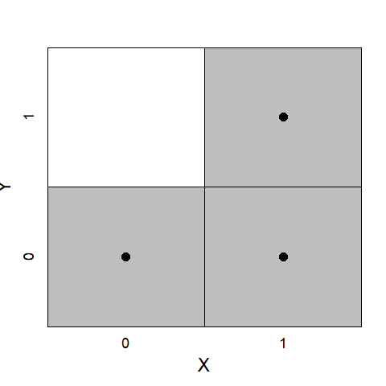
```


In fsQCA, $X$ and $Y$ are expressed as discrete or continuous set membership scores indicating the extent to which the condition or outcome is in the set. In the $XY$-plot, a diagonal is drawn and a  necessary condition in kind is identified when the area above the diagonal is (almost) empty  (Figure \@ref(fig:qcanca2)-left). Necessity **in**consistency is the sum of vertical distances of cases above the diagonal, divided by the sum of vertical distances of all cases. Necessity consistency is the  complement of this value (1 - inconsistency).


<!-- (ref:caption3) Comparison of necessity analysis with fsQCA’s (Left) and with NCA (Right). The ceiling in QCA is predefined (diagonal) and in NCA estimated (with CE-FDH). Data from @rohlfing2013improving; see also @vis2018analyzing.  -->
```{r qcanca2, echo=FALSE, out.width='100%', fig.align = "center", fig.cap="Comparison of necessity analysis with fsQCA’s (Left) and with NCA (Right). The ceiling in QCA is predefined (diagonal) and in NCA estimated (with CE-FDH). Data from @rohlfing2013improving; see also @vis2018analyzing. ", cache=TRUE}
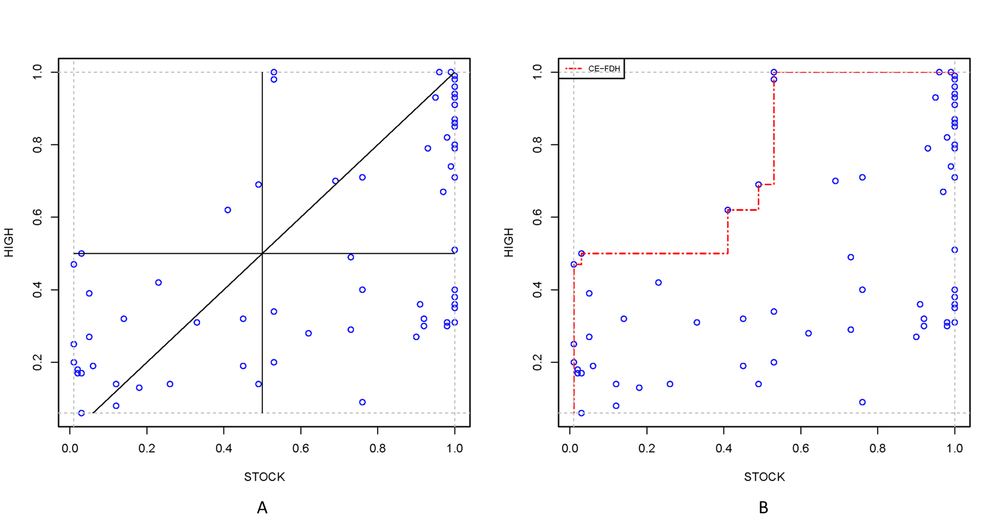
#knitr::include_graphics('Figure 2AB BWcool.png')
```


The main analysis of csQCA and fsQCA is the sufficiency analysis. Whereas QCA's necessity analysis uses linear algebra to identify necessity, QCA's sufficiency analysis uses Boolean algebra and truth tables. The truth table is a logical summary of all ($2^k$) possible combinations of $k$ conditions ($X$'s) that are selected for the analysis. A combination of conditions is referred to as a configuration. In configurations, conditions can only be considered present or absent (with the 0.5 membership score threshold point used in fsQCA; absent: < 0.5; present: > 0.5). The purpose of QCA is to identify which of the possible configurations in the truth table are actually observed in the data, and to establish whether the outcome is present or absent in the observed configurations. This leads to QCA’s *solution table* consisting of configurations that are considered to be able to produce the outcome ($Y$ = 1). A second solution table consists of configurations that are considered to not produce the outcome ($Y$ = 0).

Over the years, different approaches have been suggested to integrate an observed necessary condition from QCA's necessity analysis (for $Y$ = 1 and $Y$ = 0, respectively) into the sufficiency solution. For example, Ragin has suggested to *add* the necessary condition if it is absent in an observed configuration, to *remove* the necessary condition from all configurations, and to *ignore* necessity.^[Ragin 2000, (p. 254) "If several conditions pass the test of necessity, they are all *inserted* into the causal expressions that are subsequently tested for sufficiency.” Ragin (2009, p. 110): “It is often useful to check for necessary conditions before conducting the fuzzy truth table procedure. Any condition that passes the test and that “makes sense” as a necessary condition can be *dropped* from the truth table procedure, which, after all, is essentially an analysis of sufficiency." [@MendelKorjani2010, p. 83.] quote Ragin’s view on this approach as follows: “That being said (*ignore* necessity), there is still a lot of interest in necessary conditions in the social sciences." (emphasis added).] It appears that the necessity analysis of QCA is often ignored and if this analysis is done, different approaches are used  for integration of the necessity analysis with the sufficiency analysis.

### Comparison NCA and QCA {#comparisonncaqca}

NCA and QCA share several characteristics. For a causal interpretation of data, both NCA and QCA rely on conditional logic (necessity and sufficiency), and theoretical argumentation for causality. Although NCA primarily uses  quantitative variable-based approaches, it can also be applied (like QCA) with calibrated set membership scores. Both methods can be used in large-n or small-n settings. In a large-n setting, both methods preferably use probability sampling and statistical generalization, although this is not common in QCA [@braumoeller2015guarding]. 

Despite these similarities there are also major differences [@dul2016jbr; @vis2018analyzing]. NCA focuses on necessity, whereas QCA focuses on sufficiency. NCA is mainly a deductive approach requiring a formal necessity hypothesis whereas QCA is mainly an inductive approach. Although QCA carefully selects conditions, a hypothesis how these are related to the outcome is usually not provided. The difference is evident when analyzing OR-combinations of necessity. An OR-combination ($X_1$ or $X_2$ is necessary for $Y$) is often an indication that a higher order construct is necessary for the outcome. A green apple is not necessary for an apple pie, nor is a red apple, but apple is necessary for an apple pie. In NCA's procedures for formulating a formal necessary condition hypothesis (Chapter \@ref(hypothesisformulation)), a relevant higher order construct, rather than the related lower order construct, would likely be recognized and become part of the analysis. An inductive QCA approach may not consider OR-combinations before the analysis, but may identify them afterwards. However, many identified necessity OR-combinations have no substantive meaning as by logic, any necessary condition that is combined with another condition is a necessary OR-combination, even if the combination does not have a substantive meaning.
<!-- If a single condition ($X_1$) is already necessary, then any OR-combination that includes $X_1$ (like $X_1$ OR $X_2$, $X_1$ OR $X_3$, etc.) will also be necessary by definition simply because $X_1$ is part of them. These combinations, however, do not have any new or meaningful interpretation.  -->
If apple is necessary for an apple cake, then the combination [apple OR blue sky] is also necessary by logic, but this does not mean that blue sky is necessary or relevant. The combination is logically true but substantively meaningless.

<!-- When a analyst uses NCA or OLS, these common fundamental limitations should be acknowledged. When NCA and OLS are used in combination the fundamental differences between the methods should be acknowledged. It is important to stress that one method is not better than the other. NCA and OLS are different and address different research questions. To ensure theory-method fit, OLS is the preferred method when the analyst is interested in an average effect of $X$ on $Y$, and NCA is the preferred method when the analyst is interested in the necessity effect of $X$ on $Y$.  -->

Since NCA is an approach for analyzing necessity, it can be compared with QCA's necessity analysis only. When NCA is applied with dichotomous set membership scores as input for NCA's necessity analysis,  the conclusions are usually the same as with csQCA's necessity analysis. Without cases in the upper-left cell, QCA's consistency = 1, which supports necessity. In this situation NCA's effect size is 1, and assuming theoretical support and statistical significance, NCA supports necessity as well. However, NCA differs completely from fsQCA's necessity analysis. Whereas in fsQCA the 'ceiling line' is predefined as the diagonal in the $XY$-plot (Figure \@ref(fig:qcanca2)-left), in NCA the ceiling line is usually estimated from data^[It is also possible to predefine a ceiling line, see Section \@ref(ceilinglinespecification).], which is usually above the diagonal. When fsQCA rejects necessity when too many cases are above the diagonal (using necessity consistency as model fit measure), NCA's necessity analysis may conclude that necessity does exist, though not for all levels of $X$ and $Y$. Whether or not necessity-in-kind should be rejected depends in NCA on the effect size, the availability of theoretical support for necessity and the $p$-value (Section \@ref(necessityinkind)), but not directly on its model fit measures (Section \@ref(modelfit)). Additionally, when necessity-in-kind is observed, NCA can analyze necessity-in-degree to evaluate which level of $X$ is necessary for which level of $Y$ (Section \@ref(bottleneck)).  

When fsQCA supports necessity, some cases may be in the ‘empty’ zone above the diagonal as *deviant cases*. According to NCA the same cases may be close to the ceiling line and are considered *best cases*: cases that are able to achieve a high outcome with a low level of the conditions (assuming that $X$ is an effort and $Y$ is a desired outcome). In NCA, cases above the ceiling are considered not feasible and classified as noise (close above to the ceiling) or outliers/exceptions (further away from the ceiling) as discussed in Section \@ref(modelfit). 

<!-- ```{r, echo = FALSE, warning=FALSE, message=FALSE, include=TRUE} -->
<!-- library("kableExtra") -->
<!-- g <- read.csv("DifferencesNCAQCA.csv")  -->
<!-- kbl(g, caption = "Basic guidelines for good NCA practice", longtable = TRUE, align = c("l", "l", "l")) %>% -->
<!--   kable_styling() -->
<!--     # kable_paper("striped", full_width = F) %>% -->
<!--   # pack_rows("Theoretical justification", 1,3) %>% -->
<!--   # pack_rows("Meaningful data", 4, 4) %>% -->
<!--   # pack_rows("Scatter plot", 5, 6) %>% -->
<!--   # pack_rows("Ceiling line", 7, 7) %>% -->
<!--   # pack_rows("Effect size", 8, 9) %>% -->
<!--   # pack_rows("Statistical test", 10, 11) %>% -->
<!--   # pack_rows("Bottleneck analysis (necessity-in-degree)", 12, 17) %>% -->
<!--   # pack_rows("Descriptions of NCA", 18, 26)  -->
<!-- ``` -->


<!-- ```{r, table1ncaqca, echo=FALSE, out.width='100%', fig.align = "center", fig.cap="Comparison of NCA and QCA.", cache=TRUE} -->
<!-- knitr::include_graphics('Table1ncaqcav2.png') -->
<!-- ``` -->

<!-- NCA and QCA are only the same in a very specific situation of ‘in kind’ necessity: A single $X$ is -->
<!-- necessary for $Y$, and $X$ and $Y$ are dichotomous set membership scores (0 and 1). Then the -->
<!-- analyses of NCA and QCA are exactly the same. However, NCA normally uses variable scores, -->
<!-- but can also set membership scores when NCA is applied in combination with QCA (see -->
<!-- below). In addition to the ‘in kind’ necessity that both methods share, NCA also formulates -->
<!-- ‘in degree’ necessity. QCA also formulates ‘in kind’ necessity of ‘OR’ combinations of -->
<!-- conditions, as well as ‘in kind’ sufficiency of configurations of conditions. -->
<!-- The main interest of NCA is the necessity ‘in degree’ of single factors that enable the outcome, -->
<!-- whereas the main interest of QCA is the sufficiency ‘in kind’ of (alternative) configurations of -->
<!-- conditions. -->

<!-- Regarding research strategy most NCA studies are observational studies (both small N and large-n), although also experiments are possible. Most QCA studies are small N observational studies, although increasingly also large-n studies are employed with QCA, in particular in the business and management area. The experimental research strategy is rare (if not absent) in QCA. Regarding case selection/sampling purposive sampling is the main case selection strategy in QCA. It is also possible in small N NCA studies. For large-n studies sampling strategies such as those used in regression analysis (preferably probability sampling) are used both in NCA and QCA. Regarding measurement, NCA uses valid and reliable variable scores unless it is used in combination with QCA, in which case NCA uses calibrated set membership scores. QCA uses calibrated set membership scores and cannot use variable scores. In QCA data with variable scores may be used as input for the ‘calibration’ process to transform variable scores into set membership scores. Regarding data analysis in fsQCA a necessary condition is assumed to exist if the area above the diagonal reference line in an $XY$ scatter plot is virtually empty (see Figure \@ref(fig:qcanca2) A). In contrast, NCA uses the ceiling line as the reference line (see Figure \@ref(fig:qcanca2) B) for evaluating the necessity of $X$ for $Y$ (with possibly some cases above the ceiling line; accuracy below 100%). In situations where fsQCA observes ‘deviant cases’, NCA includes these cases in the analysis by ‘moving’ the reference line from the diagonal position to the boundary between the zone with cases and the zone without cases. [Note that moving the QCA's diagonal parallel upward to address inaccuracy has been suggested by @ragin2000fuzzy (p. 225, Figure 8.4), but this was not followed up by other QCA analysts]. NCA considers cases around the ceiling line (and usually above the diagonal) as ‘best practice’ cases rather than ‘deviant’ cases. These cases are able to reach a high level of outcome (e.g., an output that is desired) for a relatively low level of condition (e.g., an input that requires effort). For deciding about necessity, NCA evaluates the size of the ‘empty’ zone as a fraction of the total zone (empty plus full zone), which ratio is called the necessity effect size. If the effect size is greater than zero (an empty zone is present), and if according to NCA’s statistical test this is unlikely a random result of unrelated $X$ and $Y$, NCA identifies a necessary condition ‘in kind’ that can be formulated as: ‘$X$ is necessary for $Y$’, indicating that for at least a part of the range of $X$ and the range of $Y$ a certain level of $X$ is necessary for a certain level of Y. Additionally, NCA can quantitatively formulate necessary condition ‘in degree’ by using the ceiling line: ‘level $X_c$ of $X$ is necessary for level $Y_c$ of $Y$’. The ceiling line represents all combinations $X$ and $Y$ where $X$ is necessary for $Y$. Although also fsQCA’s diagonal reference line allows for making quantitative necessary conditions statements, e.g. $X$ > 0.3 is necessary for $Y$ = 0.3, fsQCA does not make such statements. -->
<!-- When the ceiling line coincides with the diagonal (corresponding to the situation that fsQCA considers) the statement ‘$X$ is necessary for $Y$’ applies to all $X$-levels [0,1] and all $Y$-levels [0,1] -->
<!-- and the results of the qualitative necessity analysis of fsQCA and NCA are the same. When the ceiling line is positioned above the diagonal ‘$X$ is necessary for $Y$’ only applies to a specific range of $X$ and a specific range of $Y$. Outside these ranges $X$ is not necessary for $Y$ (‘necessity inefficiency’). Then the results of the qualitative necessity analysis of fsQCA and NCA can be different. -->
<!-- Normally, NCA identifies more necessary conditions than fsQCA, mostly because the diagonal is used as reference line. In the example of Figure \@ref(fig:qcanca2), NCA identifies that $X$ is necessary for $Y$ because there is an empty zone above the ceiling line. However, fsQCA would conclude that $X$ is not necessary for $Y$, because the necessity consistency level is below 0.9. FsQCA’s necessity analysis can be considered as a special case of NCA: an NCA analysis with discrete or continuous fuzzy set membership scores for $X$ and $Y$, a ceiling line that is diagonal, an allowance of a specific number of cases in the empty zone given by the necessity consistency threshold, and the formulation of a qualitative ‘in kind’ necessity statement. -->

### Combining NCA and QCA

There are two ways to combine NCA and QCA in a multimethod study. First, since both NCA and QCA employ a necessity analysis based on necessity causal logic, these two approaches can be used jointly in a *method-triangulation multimethod study*. Second, since QCA also employs a sufficiency analysis based on configurational sufficiency causal logic, NCA can be combined with QCA's sufficiency analysis in a *causal-pluralism multimethod study*. Both types of multimethod studies are discussed below in more detail. 

## Combining NCA and QCA in a multimethod study {#combiningncaandqcainamultimethodstudy}

### Steps for conducting NCA with QCA's necessity analysis  {#necessityanalysisncaqca}
Figure \@ref(fig:qcaflowchart-methodtriangulation) shows a flowchart for conducting a necessity analysis with NCA and QCA in a method-triangulation multimethod study.

```{r qcaflowchart-methodtriangulation, echo=FALSE, out.width='60%', fig.align = "center", fig.cap="Flowchart for conducting a method-triangulation multimethod study with NCA and QCA's necessity analysis.", cache=TRUE}
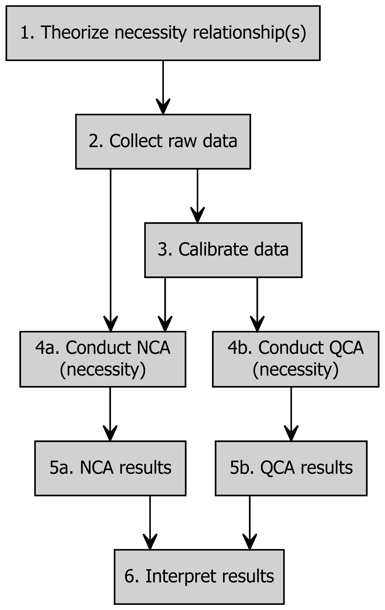
```


```{r qcaflowchart-methodtriangulation-code, echo = FALSE, eval=FALSE}
# QCA flowchart with straight-line arrows and three identical vertical flows (Left, Middle, Right)

library(DiagrammeR)
library(DiagrammeRsvg)
library(rsvg)

flowchart <- grViz("
digraph flowchart {

  # --- GRAPH SETTINGS ---
  graph [rankdir = TB, splines = ortho]  # <- makes edges straight
  node [shape = rectangle, style = filled, fillcolor = lightgrey, fontname = Helvetica, fontsize = 12]
  edge [arrowhead = vee, color = black]

  # --- LEFT FLOW ---
  D1 [label = '4a. Conduct NCA\n(necessity)']
  D2 [label = '5a. NCA results']

  # --- MIDDLE FLOW ---
  A2 [label = '1. Theorize necessity relationship(s)']
  B2 [label = '2. Collect raw data']
  E2 [label = '6. Interpret results']

  # --- RIGHT FLOW ---
  C3 [label = '3. Calibrate data']
  D3 [label = '4b. Conduct QCA\n(necessity)']
  D4 [label = '5b. QCA results']

  # --- CONNECTIONS ---
  A2 -> B2
  B2 -> C3
  B2 -> D1
  C3 -> D1
  C3 -> D3
  D1 -> D2
  D2 -> E2
  D3 -> D4
  D4 -> E2

  # --- ALIGNMENT ---
  {rank = same; A2}
  {rank = same; B2}
  {rank = same; C3}
  {rank = same; D1; D3}
  {rank = same; E2}

}
")

flowchart

# Export the flowchart to PDF
# 1. Convert the graph to an SVG
svg_code <- export_svg(flowchart)

# 2. Convert the SVG to a PDF
#rsvg_pdf(charToRaw(svg_code), file = "SEMflowchart_QCA_methodtriangulation.pdf")

cat("PDF successfully created")
```


The study starts with theorizing the necessity relationship(s). In NCA this means the formulation of a formal necessity hypothesis (Chapter \@ref(hypothesisformulation)) in which not only $X$ and $Y$ are selected, but also the causal relationship is theoretically justified. In QCA the relationship between the conditions and outcome is usually not discussed extensively before the analysis is done and usually no necessity hypothesis is formulated. This reflects that QCA is a more inductive approach. 

The next step is collecting (raw) data. In QCA the data need to be calibrated to transform the data into meaningful set membership scores. Qualitative data may be calibrated based on case knowledge of the user and expert judgment (the direct method), and quantitative data can be calibrated by mechanistically applying a transformation function (the indirect method). NCA accepts both calibrated data and raw data (when the raw data are valid and reliable), but QCA accepts only calibrated data. Therefore, two types of NCA-QCA method-triangulation for analyzing necessity can be done:

1. NCA with raw data and QCA with calibrated data.

2. NCA and QCA both with calibrated data.

After the NCA and QCA analyses are conducted, in the last step the results are interpreted in combination.

### Example NCA-QCA method-triangulation multimethod study {#examplencaqcamethodtriangulationmultimethodstudy}
This section presents an example of integrating NCA in QCA according to a method-triangulation multimethod necessity study. The example is based on a study by @lipset1959some, discussed in @ragin2009fsqca. The outcome variable is SURV: survival of democracy during the inter-war period. Assuming that a theoretical rationale for necessity exists, five conditions were analyzed for necessity using both QCA and NCA: 

- DEV: Level of development: expressed as GDP per capita (USD) in the raw data.

- URB	Level of urbanization: percent of the population in towns with 20,000 or more
inhabitants in the raw data.

- LIT	Level of literacy: percent of the literate population (raw data).

- IND	Level of industrialization: percent of the industrial labor force (raw data).

- STB	Government stability: “political-institutional (in)stability” expressed in the raw data by the number of cabinets which governed in the period under study.

The raw data were calibrated into fuzzy set membership scores (the calibration process is not discussed here). The analyses can be done as follows:  \

``` {r , echo = FALSE, eval = TRUE, warning=FALSE, message= FALSE}
library(QCA)
library(NCA)
``` 


``` {r , echo = TRUE, eval = TRUE, warning=FALSE, message= TRUE}
library(QCA)
library(NCA)

# Data
conditions <- c("DEV", "URB", "LIT", "IND", "STB") #names of the conditions"
outcome <- "SURV" #name of the outcome
data(LR) #Lipset raw data
data(LF) #Lipset calibrated data

#QCA-calibrated (fuzzy)
pofind(LF, outcome = "SURV") #single necessary conditions

#NCA-calibrated (fuzzy)
set.seed(123) # for reproducible results
model_calibrated<- nca_analysis(LF,
                                1:5,6,
                                ceilings = "ce_fdh",
                                test.rep = 10000)
model_calibrated

# NCA-raw data
set.seed(123) # for reproducible results
model_raw <- nca_analysis(LR,
                          1:5,6,
                          ceilings = "ce_fdh",
                          corner = c(1,1,1,1,2),
                          test.rep = 10000)
model_raw
```

<!-- ``` {r Lipset-hide , echo = TRUE, eval = TRUE, warning=FALSE, message= FALSE, result = FALSE} -->
<!-- library(QCA) -->
<!-- library(NCA) -->

<!-- # Data -->
<!-- conditions <- c("DEV", "URB", "LIT", "IND", "STB") #names of the conditions" -->
<!-- outcome <- "SURV" #name of the outcome -->
<!-- data(LR) #Lipset raw data -->
<!-- data(LF) #Lipset calibrated data -->

<!-- #QCA-calibrated (fuzzy) -->
<!-- pofind(LF, outcome = "SURV") #single necessary conditions -->

<!-- #NCA-calibrated (fuzzy) -->
<!-- model_calibrated<- nca_analysis(LF,  -->
<!--                                 1:5,6,  -->
<!--                                 ceilings = "ce_fdh",  -->
<!--                                 test.rep = 10000)  -->
<!-- model_calibrated -->

<!-- # NCA-raw data -->
<!-- model_raw <- nca_analysis(LR,  -->
<!--                           1:5,6,  -->
<!--                           ceilings = "ce_fdh",  -->
<!--                           corner = c(1,1,1,1,2), #raw STB data are inverse -->
<!--                           test.rep = 10000) -->
<!-- model_raw -->
<!-- ``` -->


<!-- ``` {r Lipset-show1 , echo = FALSE, eval = TRUE, warning=FALSE, message= FALSE, result = TRUE} -->

<!-- pofind(LF, outcome = "SURV") #single necessary conditions -->
<!-- ``` -->

<!-- ``` {r Lipset-show2 , echo = FALSE, eval = TRUE, warning=FALSE, message= FALSE, result = TRUE} -->

<!-- print(model_calibrated) -->

<!-- ``` -->


<!-- ``` {r Lipset-show3 , echo = FALSE, eval = TRUE, warning=FALSE, message= FALSE, result = TRUE} -->

<!-- print(model_raw) -->
<!-- ``` -->


Table \@ref(tab:necessity-tab) shows the results. Using the common necessity consistency threshold of 0.9 two necessary conditions are identified by QCA: LIT and STB. NCA's necessity analysis with the raw and with calibrated data show similar results. Also, NCA shows that LIT and STB are necessary conditions. However, NCA identifies a third necessary condition: DEV.    

```{r necessity-tab, echo = FALSE, warning=FALSE, message=FALSE, out.width='99%', cache=FALSE}
library(kableExtra)
library(knitr)
# if (is_latex_output()) {
#   nec_header <- kableExtra::linebreak("Necessity\neffect size", align = "c")
# } else {
#   nec_header <- "Necessity<br>effect size"
# }

mmt <- data.frame(
  Row = c("$DEV$", "$URB$", "$LIT$", "$IND$", "$STB$"),
  `Consistency (calibrated)` = c("0.831", "0.539", "0.991", "0.669", "0.920"),
  #`Coverage (calibrated)`     =  c("0.775", "< 0.771", "0.643", "0.684","0.707"),
  `Necessity effect size (calibrated)` = c("0.37", "0.01", "0.82", "0.02","0.46"),
  `p_value (calibrated)`     =  c("< 0.001", "0.358", "0.004", "0.376", "0.004"),
  `Necessity effect size (raw)` = c("0.27", "0.09", "0.74", "0.11","0.53"),
  `p_value (raw)`     =  c("< 0.001", "0.340", "0.002", "0.099", "0.010"),

  check.names = FALSE
)

# Bold the row labels
#mmt$Row <- cell_spec(mmt$Row, bold = TRUE, align = "left")


kbl(
  mmt,
  booktabs = TRUE,
  caption = "Comparison of NCA's and QCA's necessity analyses in a method-triangulation  multimethod study.",
  col.names = c("",
                "QCA Consistency (calibrated)",
                #"Coverage (calibrated)",
                "Necessity effect size (calibrated)",
                "<em>p</em>-value, (calibrated)",
                "Necessity effect size (raw)",
                "<em>p</em>-value, (raw)"
                ),
  #align = c("l", "c","c", "c", "c", "c", "c"),
  align = c("l", "c","c", "c", "c", "c"),
  escape = FALSE   
  
) %>%
  kable_styling(full_width = FALSE, latex_options = c("HOLD_position", "scale_down")) %>%
  column_spec(1, width = "5em") %>%
  column_spec(2, width = "5em") %>%
  column_spec(3, width = "5em") %>%
  column_spec(4, width = "5em") %>% 
  column_spec(5, width = "5em") %>%
  column_spec(6, width = "5em") %>%
  scroll_box(width = "100%")
  #column_spec(7, width = "5em")
  
```


Generally, NCA identifies more necessary conditions than fsQCA. This particularly happens when raw data, rather than (mechanistically) calibrated data, are used as input to NCA. 
For example, @torres2021levels conducted a method-triangulation NCA-QCA necessity study. They examined which elements of digital entrepreneurial ecosystems are necessary to produce outcomes. In their study the authors used only calibrated data and concluded that "[...] fsQCA should be complemented with NCA to better understand the necessary conditions. The results show that the former identifies considerably less necessary conditions in data sets than NCA[...]" [@torres2021levels, p. 41]. 

### Steps for conducting NCA with QCA's sufficiency analysis  {#necessitysufficiencyanalysisncaqca}

Another type of NCA-QCA multimethod study is the causal-pluralism multimethod study in which NCA's necessity causal perspective is combined with QCA's configurational sufficiency causal perspective. For a causal-pluralism study, it is necessary that the two methods use the same data. Hence, NCA must be applied with set membership scores, otherwise comparing and combining necessity results with sufficiency results becomes problematic.^[According to the definitions proposed in Section \@ref(methodtriangulationversuscausalpluralism) a QCA standard study that combines QCA's necessity analysis with QCA's sufficiency analysis is a causal-pluralism multimethod study. However, most QCA studies focus on the sufficiency analysis, and often largely ignore the necessity analysis, possibly because necessity is often not identified by QCA.]

Figure \@ref(fig:qcaflowchart-causalpluralism) shows a flowchart for conducting a necessity analysis of NCA with a sufficiency analysis of QCA in a causal-pluralism multimethod study.

```{r qcaflowchart-causalpluralism, echo=FALSE, out.width='40%', fig.align = "center", fig.cap="Flowchart for conducting a causal-pluralism multimethod study with NCA and QCA's sufficiency analysis.", cache=TRUE}
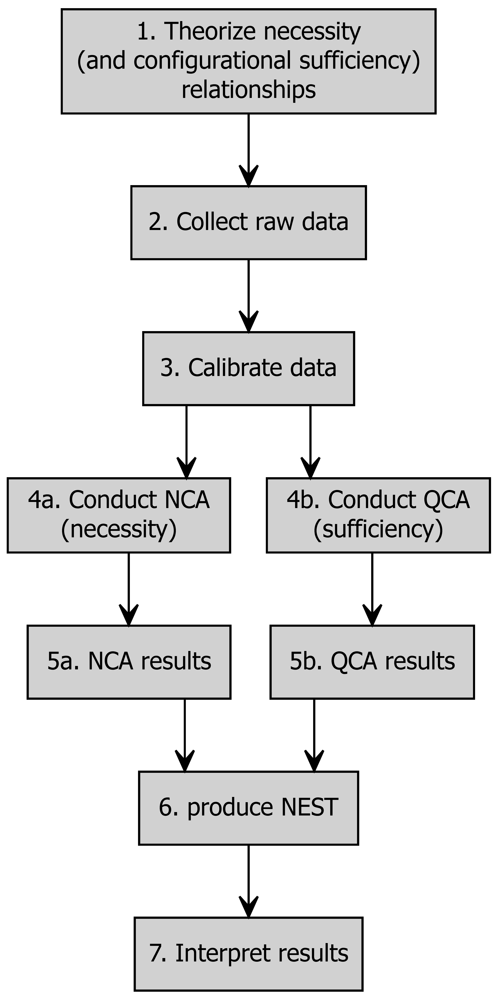
```

``` {r, qcaflowchartcausalpluralismcode, echo = FALSE, eval=FALSE}

# QCA flowchart causalpluralism

library(DiagrammeR)
library(DiagrammeRsvg)
library(rsvg)

flowchart <- grViz("
digraph flowchart {

  # --- GRAPH SETTINGS ---
  graph [rankdir = TB, splines = ortho]  # <- makes edges straight
  node [shape = rectangle, style = filled, fillcolor = lightgrey, fontname = Helvetica, fontsize = 12]
  edge [arrowhead = vee, color = black]

  # --- LEFT FLOW ---
  D1 [label = '4a. Conduct NCA\n(necessity)']

  # --- MIDDLE FLOW ---
  A2 [label = '1. Theorize necessity\n(and configurational sufficiency)\nrelationships']
  B2 [label = '2. Collect raw data']
  E2 [label = '6. Produce NEST']
  F2 [label = '7. Interpret results']

  # --- RIGHT FLOW ---
  C3 [label = '3. Calibrate data']
  D3 [label = '4b. Conduct QCA\n(sufficiency)']
  
  
  DE1 [label = '5a. NCA results']
  DE3 [label = '5b. QCA results']

  # --- CONNECTIONS ---
  A2 -> B2
  B2 -> C3

  C3 -> D1
  C3 -> D3
  D1 -> DE1
  D3 -> DE3 
  DE1 -> E2
  DE3 -> E2
  E2 -> F2

  # --- ALIGNMENT ---
  {rank = same; A2}
  {rank = same; B2}
  {rank = same; C3}
  {rank = same; D1; D3}
  {rank = same; DE1; DE3}
  {rank = same; E2}

}
")

flowchart

# Export the flowchart to PDF
# 1. Convert the graph to an SVG
svg_code <- export_svg(flowchart)

# 2. Convert the SVG to a PDF
#rsvg_pdf(charToRaw(svg_code), file = "Flowchart_QCA_causalpluralism.pdf")

cat("PDF successfully created")

```

The study starts with theorizing the necessity relationships for NCA: the formulation of a formal necessity hypothesis (Chapter \@ref(hypothesisformulation)). For the QCA sufficiency analysis the conditions that are part of the necessity hypothesis, and possibly other non-necessary contributing conditions are selected. Often, QCA is used inductively and does not formulate sufficiency hypotheses (claims about configurations that can produce the outcome) although this is also possible as, for example, suggested by @mello2021qualitative. Next, the raw data are collected and subsequently calibrated. The set membership scores are input to both NCA and QCA. Then NCA and QCA are conducted according to their own standards.

After the two analyses are done, the integration of the results may be challenging. As indicated in the above quote by Ragin, a necessary condition must become a part of the sufficient configuration, otherwise the configuration will not produce the outcome. Ragin's views on how to realize that goal has changed over the years, and new views have been added. Currently, at least five different views exist in the QCA community on how to integrate the identified necessary conditions (with QCA) with the identified sufficient configurations. These views may also apply to integrating a necessary condition identified with NCA. 
<!-- Although in most NCA applications variable scores are used for quantifying condition $X$ and outcome $Y$, NCA can also employ set membership scores for the conditions and the outcome, allowing to combine NCA and QCA. The other way around is not possible: combining QCA to a regular NCA with variable scores is not possible because QCA is a set theoretic approach that does not use variable scores.  -->
<!-- How can NCA with membership scores complement QCA? For answering this question first another question should be raised:  -->

<!-- By definition the necessary condition must be part of all sufficient configurations, otherwise this configuration cannot produce the outcome. However, within the QCA community five different views exist about how to integrate necessary conditions in sufficiency solution.  -->

In the first view, only sufficient configurations that include the necessary conditions are considered. This ensures that all selected configurations have the necessary condition. In the second view, the truth table analysis to find the sufficient configurations is done without the necessary conditions, and afterwards the necessary conditions are added to the configuration. This also ensures that all configurations have the necessary conditions. In the third view, configurations that do not include the necessary condition are excluded from the truth table before this table is further analyzed to find the sufficient configurations. This ‘ESA’ approach [@schneider2012set] also ensures that all configurations have the necessary conditions. In the fourth view, sufficient configurations are analyzed without worrying about necessary conditions. Afterwards, the necessary conditions are discussed separately. In the fifth view, a separate necessity analysis is not done, or necessity is ignored. 

All views have been employed in QCA; no consensus exists yet. An additional complexity of integrating NCA's necessity with QCA's sufficient configurations is that NCA produces necessary conditions in degree, rather than QCA’s necessary conditions in kind. In QCA's solution table, the conditions that are part of the sufficient configurations can only be absent or present.

One way to proceed with integrating NCA 's necessity approach with QCA's sufficiency approach is to combine the last part of the second view (adding necessary conditions afterwards), with the fourth view (discussing necessary conditions separately):

1. After NCA has identified necessity-in-kind in step 4a and QCA has identified the solution table in step 4b, NCA's bottleneck analysis for necessity-in-degree is conducted in step 5a, NCA's necessity-in-degree analysis with the bottleneck table is conducted as follows. Since in QCA's solution table an outcome is considered to be in the set if the set membership score is $Y$ > 0.5, NCA's necessity-in-degree analysis consists of identifying the required level of the condition membership score $X$ that is necessary for an outcome membership score $Y$ of at least 0.5. In other words, the target outcome in the bottleneck table is $Y$ = 0.5 membership score. 

2. Next, the resulting required membership score of the condition according to NCA is added to all QCA’s sufficient configurations in the solution table, if this condition is not already part of the configuration. Specifically, the NCA-Extended Solution Table (NEST) is produced. This extension specifies the required level of the necessary condition identified by NCA, such that the configuration can produce the outcome (for an example see below).  

3. Finally, the result of the NEST and the full results of NCA’s necessity analysis and QCA's sufficiency analysis are interpreted in combination. In particular, it could be discussed that specific levels of necessary membership scores found by NCA must be present in each sufficient configuration found by QCA. If that membership in degree is not in place, the configuration will not produce the outcome.

### Example NCA-QCA causal-pluralism multimethod study {#exampleQCA}
This section presents an example of integrating NCA in QCA according to a causal-pluralism multimethod necessity-sufficiency study. The example is based on a study by @emmenegger2011job about job security regulation (JSR) in Western European countries. In particular, the effect of six conditions is investigated. These six conditions are: S = state-society relationships, C = non-market coordination, L = strength labor movement, R = denomination, P = strength religious parties and V = veto points, The study conducts a necessity analysis and a sufficiency analysis, both with fsQCA. The study can be replicated as follows: 
 \
``` {r d-emm-qca, echo = TRUE, eval = TRUE, warning=FALSE, message= FALSE}
library(QCA)

# Data
data("d.Emm")
conditions <- c("S","C","L","R","P","V") #names of the conditions"
outcome <- "JSR" #name of the outcome

##### QCA #####
pofind(d.Emm, outcome = "JSR") #single necessary conditions
#published solution: no necessary conditions with consistency > 0.9
ttEmm <- truthTable(d.Emm, condition =  conditions,
                     outcome = outcome,
                     incl.cut = 0.90,
                     show.cases = TRUE)
minimize(ttEmm) # conservative/complex solution
#M1: S*~C*L*R*P + S*C*R*P*V + S*~C*~L*R*~P*~V + ~S*C*L*~R*P*~V -> JSR
minimize(ttEmm, include =  "?") # parsimonious solution
#M1: S*R + (L*P) -> JSR
#M2: S*R + (P*~V) -> JSR
minimize(ttEmm, include = "?", dir.exp = c(1,1,1,1,1,0), details=T)# intermediate solution
#M1:    S*R*~V + S*C*R*P + S*L*R*P + C*L*P*~V -> JSR
#published solution: M1:    S*R*~V + S*C*R*P + S*L*R*P + C*L*P*~V -> JSR
```
 \
The necessity analysis of fsQCA shows that none of the six conditions were necessary for job security regulation (necessity consistency of each condition is < 0.9). The following four sufficient configurations for the outcome JSR were identified:

S1. S\*R\*$\neg$V (presence of S AND presence of R AND absence of V)

S2. S\*C\*R\*P (presence of S AND presence of C AND presence of R AND presence of P)

S3. S\*L\*R\*P (presence of S AND presence of L AND presence of R AND presence of P)

S4. C\*L\*P\*$\neg$V (presence of C AND presence of L AND presence of P AND absence of V: $\neg$V)

This combination of solutions can be expressed by the following logical expression:
 \
 \
S\*R\*$\neg$V + S\*C\*R\*P + S\*L\*R\*P + C\*L\*P\*$\neg$V → JSR
 \
 \
For demonstration purposes, an NCA necessity analysis is added to this study. For the sake of this illustration, it is assumed that a formal necessity hypothesis exists for each condition (Chapter \@ref(hypothesisformulation)). Producing the $XY$-plots can be done as follows:  \

``` {r d-emm-nca , echo = TRUE, eval = FALSE, warning = FALSE, message = FALSE }
library(NCA)
model <- nca_analysis(d.Emm, 
                      conditions, 
                      outcome,
                      corner = c(1,1,1,1,1,2),
                      ceilings = "ce_fdh")
nca_output(model, summaries = FALSE)
```


Figure \@ref(fig:qcanca3) shows the $XY$-plots for the six conditions using the CE-FDH ceiling line.  \ 

<!-- (ref:caption6) Example of a necessity analysis with NCA for a clausal-pluralism multimethod study with fsQCA. [Data from @emmenegger2011job]. -->
```{r qcanca3, echo=FALSE, out.width='49%', fig.show = 'hold', fig.align = "center", fig.cap="Example of a necessity analysis with NCA for a clausal-pluralism multimethod study with fsQCA. [Data from @emmenegger2011job]."}
#knitr::include_graphics('Figure 3.png')

knitr::include_graphics('plot.S-JSR.png')
knitr::include_graphics('plot.C-JSR.png')
knitr::include_graphics('plot.L-JSR.png')
knitr::include_graphics('plot.R-JSR.png')
knitr::include_graphics('plot.P-JSR.png')
knitr::include_graphics('plot.V-JSR.png')

# knitr::include_graphics('plot.S-JSR BWcool.png')
# knitr::include_graphics('plot.C-JSR BWcool.png')
# knitr::include_graphics('plot.L-JSR BWcool.png')
# knitr::include_graphics('plot.R-JSR BWcool.png')
# knitr::include_graphics('plot.P-JSR BWcool.png')
# knitr::include_graphics('plot.V-JSR BWcool.png')

```
 \ 
NCA's necessity-in-kind analysis is conducted as follows:

``` {r EMME-hide1, echo = FALSE, eval = TRUE, warning = FALSE, message = FALSE, result = "hide"}
library(NCA)
set.seed(123) # for reproducible results
suppressWarnings(model <- nca_analysis(d.Emm, 
                      conditions, 
                      outcome, corner = c(1,1,1,1,1,2),
                      test.rep = 10000, #This may take a while
                      ceilings = "ce_fdh"
                      )
)
# necessity-in-kind
print(model)
```


``` {r EMME-show1a, echo = TRUE, eval = FALSE, warning = FALSE, message = FALSE, result = "hide"}
library(NCA)
set.seed(123) # for reproducible results
model <- nca_analysis(d.Emm, 
                      conditions, 
                      outcome, corner = c(1,1,1,1,1,2),
                      test.rep = 10000, #This may take a while
                      ceilings = "ce_fdh"
                      )
# necessity-in-kind
print(model)
```

``` {r EMME-show1b, echo = FALSE, eval = TRUE, warning = FALSE, message = FALSE}
print(model) 
```
  \
<!-- ```{r, table2ncaqca, echo=FALSE, eval = FALSE out.width='100%', fig.align = "center", fig.cap="NCA necessity analysis. $d$ = effect size; $p$ = $p$-value."} -->
<!-- knitr::include_graphics('Table2ncaqca.png') -->
<!-- ``` -->
```{r table2ncaqca2, echo = FALSE, eval = FALSE, warning=FALSE, message=FALSE, out.width='99%', cache=FALSE}

library(kableExtra)

emmen <- data.frame(
  Row = c("S = state-society relationships ", "C = non-market coordination ",  "L = strength labor movement", "R = denomination", "P = strength religious parties", "$\\neg$ V = absence of veto points"),
  `d` = c("0.140", "0", "0.287", "0.314", "0.172", "0.046"),
  `p` = c("0.136", "1", "0.002", "0.001", "0.009", "0.539"),
  check.names = FALSE
)

# Bold the row labels
#mmt$Row <- cell_spec(mmt$Row, bold = TRUE, align = "left")

kbl(
  emmen,
  booktabs = TRUE,
  caption = "necessity-in-kind results for Job security regulations (JSR)",
  col.names = c("", "d", "p"),
  align = c("l","r","r"),
  escape = FALSE     # <- needed so cell_spec markup is interpreted
) %>%
  kable_styling(full_width = FALSE, latex_options = c("HOLD_position", "scale_down")) %>%
  column_spec(1, width = "15em") %>%
  column_spec(2, width = "7em") %>%
  column_spec(3, width = "7em")

```
 \
The results indicate that three out of six conditions are necessary for Job security regulations (JSR) given the effect size and $p$-value thresholds of 0.10 and 0.05, respectively. The necessary conditions are: L = strength of labor movement, R = denomination, P = and strength of religious parties.

NCA's analysis of necessity-in-degree for these three conditions, adapted to an outcome of Y = .5, can be conducted as follows:
 \
``` {r , echo = TRUE, eval = TRUE, warning = FALSE, message = FALSE }
library(NCA)
model_bottl <- nca_analysis(d.Emm, 
                      conditions, 
                      outcome, 
                      corner = c(1,1,1,1,1,2),
                      ceilings = "ce_fdh", 
                      bottleneck.x =  'actual', 
                      bottleneck.y =  'actual', 
                      steps = seq(from = 0, to = 1, by = 0.1) #should include 0.5
                      )

# necessity-in-degree (reduced bottleneck table)
nca_output(model_bottl, summaries = FALSE, plots= FALSE,
           bottlenecks = TRUE,
           selection = c("L", "R", "P")
           )
```
 \

``` {r , echo = FALSE, eval = FALSE}
library(NCA)
library(QCA)

##### Data #####
data("d.Emm")
conditions <- c("S","C","L","R","P","V") #names of the conditions"
outcome <- "JSR" #name of the outcome

##### QCA #####
#replicate published results with QCA
pofind(d.Emm, outcome = "JSR") #single necessary conditions
#published solution: no necessary conditions with consistency > 0.9
ttEmm <- truthTable(d.Emm, condition =  conditions,
                     outcome = outcome,
                     incl.cut = 0.90,
                     show.cases = TRUE)
minimize(ttEmm) # conservative/complex solution
#M1: S*~C*L*R*P + S*C*R*P*V + S*~C*~L*R*~P*~V + ~S*C*L*~R*P*~V -> JSR
minimize(ttEmm, include =  "?") # parsimonious solution
#M1: S*R + (L*P) -> JSR
#M2: S*R + (P*~V) -> JSR
minimize(ttEmme, include = "?", dir.exp = c(1,1,1,1,1,0), details=T)# intermediate solution
#M1:    S*R*~V + S*C*R*P + S*L*R*P + C*L*P*~V -> JSR
#published solution: M1:    S*R*~V + S*C*R*P + S*L*R*P + C*L*P*~V -> JSR

##### NCA #####
set.seed(123) # for reproducible results
model <- nca_analysis(d.Emm, 
                      conditions, 
                      outcome, 
                      test.rep = 10000, #This may take a while 
                      ceilings = "ce_fdh", 
                      corner = c(1,1,1,1,1,2), 
                      bottleneck.x =  'actual', 
                      bottleneck.y =  'actual', 
                      steps = c(0,0.5)
                      )
# necessity-in-kind
print(model)

# necessity-in-degree (reduced bottleneck table)
nca_output(model,summaries = F, plots= FALSE,
           bottlenecks = TRUE,
           selection = c("L", "R", "P")
           )
```

From the bottleneck table it can be observed that the following conditions are necessary for JSR > 0.5:

 - L > 0.29 is necessary for JSR > 0.5 (presence of JSR)

 - R > 0.20 is necessary for JSR > 0.5 (presence of JSR)

 - P > 0.20 is necessary for JSR > 0.5 (presence of JSR)

Although in QCA’s binary logic these small necessary membership scores of L, R, P (all < 0.5) would be framed as ‘absence’ of the condition, in NCA these membership scores are considered small, yet must be present for having the outcome. Thus, according to NCA the low level of membership scores must be present, otherwise the sufficient configurations identified by QCA will not produce the outcome.

The presence of a condition and the outcome means that the membership score is > 0.5. The absence of a condition means that the membership score is < 0.5. A common way to summarize the results is the QCA solution table. The Fiss-style solution table [@fiss2011building] is shown in Table \@ref(tab:FISS).
<!-- Figure \@ref(fig:table3ncaqca). -->

``` {r Emmenegger, echo = FALSE, eval = TRUE, warning = FALSE, , message = FALSE, results ="hide"}
## ------------------------------------------------------------
## Libraries
## ------------------------------------------------------------
library(NCA)
library(QCA)
library(dplyr)
library(knitr)
library(kableExtra)


## ------------------------------------------------------------
## Example  data
## ------------------------------------------------------------
data("Emme")
data <- Emme

conditions <- c("S", "C", "L", "R", "P", "V")
outcome    <- "JSR"
#NCA input
corner <- c(1,1,1,1,1,2) #directional expectations for NCA
#QCA input

## ------------------------------------------------------------
## NCA: necessity analysis
## ------------------------------------------------------------
suppressWarnings(
model <- nca_analysis(
  data,
  conditions,
  outcome,
  ceilings     = "ce_fdh",
  corner = corner,
  test.rep     = 10000,
  bottleneck.x = "actual",
  bottleneck.y = "actual",
  steps        = c(0, 0.5)
  )
)

effect_sizes <- sapply(
  model$summaries,
  function(x) x$params["Effect size", "ce_fdh"]
)

p_values <- sapply(
  model$summaries,
  function(x) x$params["p-value", "ce_fdh"]
)

bottlenecks <- model$bottlenecks[[1]]

# only row with Y = 0.5
bottlenecks <-  bottlenecks[bottlenecks[[1]] == 0.5, ]

# drop first element (SURV) so only conditions remain
bottlenecks_no_first <- bottlenecks[-1]
bottlenecks_no_first <- bottlenecks_no_first[seq_along(effect_sizes)]

df <- data.frame(
  variable    = names(effect_sizes),
  effect_size = as.numeric(effect_sizes),
  p_value     = as.numeric(p_values),
  bottleneck  = as.numeric(bottlenecks_no_first),
  row.names   = names(effect_sizes)
)

nec <- df$bottleneck
names(nec) <- rownames(df)

nec[df$p_value >= 0.05 | df$effect_size < 0.10] <- NA

# (optional) filter necessary conditions, if you still need this
selected <- df[df$effect_size >= 0.1 & df$p_value < 0.05, , drop = FALSE]

## ------------------------------------------------------------
## QCA: solutions, fit, core/contributory
## ------------------------------------------------------------

# select incl.cut
incl.cut <- 0.90

# select directional expectations
dir.exp <-  c(1,1,1,1,1,0)

# select model
model <- 1

# select isol
isol <- "C1P1"

tt <- truthTable(
  data,
  condition  = conditions,
  outcome    = outcome,
  incl.cut   = incl.cut,
  show.cases = TRUE
)

sol_complex <- minimize(tt, details = TRUE)
sol_pars    <- minimize(tt, include = "?", details = TRUE)
sol_int     <- minimize(tt, include = "?", dir.exp = dir.exp, details = TRUE)

# Fit metrics
con_term       <- sol_int$i.sol[[isol]]$IC$incl.cov$inclS
raw_cov_term   <- sol_int$i.sol[[isol]]$IC$incl.cov$covS   
unique_cov_term<- sol_int$i.sol[[isol]]$IC$incl.cov$covU   
con_sol        <- sol_int$i.sol[[isol]]$IC$sol.incl.cov$inclS
cov_sol        <- sol_int$i.sol[[isol]]$IC$sol.incl.cov$covS

```


```{r FISS, echo = FALSE, eval = TRUE, warning = FALSE, , message = FALSE }

scov_sol <- cov_sol
scon_sol <- con_sol
scov_sol_str <- sprintf("%.3f", scov_sol)
scon_sol_str <- sprintf("%.3f", scon_sol)

## ------------------------------------------------------------
## Helper: identify core & contributory conditions
## ------------------------------------------------------------
identify_core_contributory <- function(sol_pars,
                                       sol_int,
                                       model = model, 
                                       isol = NULL) {
  
  # ensure isol is valid
  if (is.null(isol)) {
    isol <- names(sol_int$i.sol)[1]
  } else if (!isol %in% names(sol_int$i.sol)) {
    stop("isol must be one of: ", paste(names(sol_int$i.sol), collapse = ", "))
  }
  pars_terms <- sol_pars$solution[[model]]
  int_terms  <- sol_int$i.sol[[isol]]$solution[[model]]
  
  parse_term <- function(term) {
    parts <- trimws(strsplit(term, "\\*")[[1]])
    vals  <- ifelse(grepl("^~", parts), 0L, 1L)
    nms   <- gsub("^~", "", parts)
    setNames(vals, nms)
  }
  
  is_refinement <- function(pars, inter) {
    p <- parse_term(pars)
    i <- parse_term(inter)
    all(names(p) %in% names(i)) && all(p == i[names(p)])
  }
  
  lits_to_string <- function(v) {
    if (length(v) == 0) return(character(0))
    out <- ifelse(v == 1L, names(v), paste0("~", names(v)))
    unname(out)
  }
  
  matches <- lapply(int_terms, function(it) {
    pars_terms[vapply(pars_terms, is_refinement, logical(1), inter = it)]
  })
  names(matches) <- int_terms
  
  rows <- list()
  for (it in int_terms) {
    parents <- matches[[it]]
    i <- parse_term(it)
    
    if (length(parents) == 0) {
      rows[[length(rows) + 1]] <- data.frame(
        intermediate_term      = it,
        parsimonious_term      = NA_character_,
        core_conditions        = NA_character_,
        contributory_conditions= paste(lits_to_string(i), collapse = "*"),
        stringsAsFactors       = FALSE
      )
      next
    }
    
    for (pt in parents) {
      p <- parse_term(pt)
      core   <- p
      contrib<- i[setdiff(names(i), names(p))]
      
      rows[[length(rows) + 1]] <- data.frame(
        intermediate_term      = it,
        parsimonious_term      = pt,
        core_conditions        = paste(lits_to_string(core), collapse = "*"),
        contributory_conditions= if (length(contrib) == 0) "" else paste(lits_to_string(contrib), collapse = "*"),
        stringsAsFactors       = FALSE
      )
    }
  }
  
  do.call(rbind, rows)
}


## ------------------------------------------------------------
## Symbol list for NEST table (take from symbols definde in LaTeX macros in the header in yaml
## ------------------------------------------------------------
sym <- list(
  suf_present        = "●",        # ← add these two
  suf_absent         = "⊗",
  suf_present_core   = "⚫",
  suf_absent_core    = "⊗",
  suf_present_cont   = "●",
  suf_absent_cont = '\\scalebox{0.7}{⊗}' ,
  nec_degree_present = "◢",
  nec_degree_absent  = "◿"
)
  
#this list is needed for the table itself
  

## ------------------------------------------------------------
## QCA Solution Table (Fiss style)
## ------------------------------------------------------------
build_NEST <- function(sol_pars,
                       sol_int,
                       conditions,
                       solution_type = "intermediate",
                       show_core = TRUE,
                       model = 1,
                       isol = NULL,
                       sym) {
  
  if (solution_type == "intermediate") {
    if (is.null(isol)) {
      isol <- names(sol_int$i.sol)[1]
    } else if (!isol %in% names(sol_int$i.sol)) {
      stop("isol must be one of: ", paste(names(sol_int$i.sol), collapse = ", "))
    }
  }
  
  if (show_core && solution_type != "intermediate") {
    warning("show_core = TRUE only meaningful for intermediate solution; setting show_core <- FALSE")
    show_core <- FALSE
  }
  
  expr <- switch(
    solution_type,
    intermediate = sol_int$i.sol[[isol]]$solution[[model]],
    parsimonious = sol_pars$solution[[model]],
    stop("Unknown solution type")
  )
  if (is.null(expr)) stop("No sufficiency solutions found.")
  
  configs <- trimws(unlist(strsplit(expr, "\\+")))
  configs <- configs[nzchar(configs)]
  
  cp <- identify_core_contributory(sol_pars, sol_int, model = model, isol = isol)
  cp <- cp[!duplicated(cp$intermediate_term), , drop = FALSE]
  
  
  # helper for selecting the right symbols
  symbols <- function(config_string,
                      conditions,
                      core_conditions = character(0),
                      contributory_conditions = character(0),
                      sym,
                      show_core = TRUE) {
    
    out <- setNames(rep("", length(conditions)), conditions)
    
    if (is.null(config_string) || !nzchar(config_string)) return(out)
    
    suf_present        <- sym$suf_present
    suf_absent         <- sym$suf_absent
    suf_present_core   <- sym$suf_present_core
    suf_absent_core    <- sym$suf_absent_core
    suf_present_cont   <- sym$suf_present_cont
    suf_absent_cont    <- sym$suf_absent_cont

    # (nec symbols are used later, not here)
    
    config_string <- gsub("\\s+", "", config_string)
    lits <- strsplit(config_string, "\\*")[[1]]
    lits <- lits[nzchar(lits)]
    
    pick_symbol <- function(nm, is_neg) {
      if (!show_core) {
        return(if (is_neg) suf_absent else suf_present)
      }
      in_core <- nm %in% core_conditions
      in_cont <- nm %in% contributory_conditions
      
      if (!is_neg) {
        if (in_core) return(suf_present_core)
        if (in_cont) return(suf_present_cont)
        return(suf_present)
      } else {
        if (in_core) return(suf_absent_core)
        if (in_cont) return(suf_absent_cont)
        return(suf_absent)
      }
    }
    
    for (lit in lits) {
      is_neg <- startsWith(lit, "~")
      nm     <- if (is_neg) substring(lit, 2) else lit
      if (nm %in% conditions) out[nm] <- pick_symbol(nm, is_neg)
    }
    
    out
  }
  
  NEST <- t(vapply(seq_len(nrow(cp)), function(i) {
    config_string <- cp$intermediate_term[i]
    
    core_vec <- if (!is.na(cp$core_conditions[i]) && nzchar(cp$core_conditions[i])) {
      unlist(strsplit(cp$core_conditions[i], "\\*"))
    } else character(0)
    
    cont_vec <- if (!is.na(cp$contributory_conditions[i]) && nzchar(cp$contributory_conditions[i])) {
      unlist(strsplit(cp$contributory_conditions[i], "\\*"))
    } else character(0)
    
    symbols(
      config_string         = config_string,
      conditions            = conditions,
      core_conditions       = core_vec,
      contributory_conditions = cont_vec,
      sym                   = sym,
      show_core             = show_core
    )
  }, FUN.VALUE = setNames(rep("", length(conditions)), conditions)))
  
  rownames(NEST) <- cp$intermediate_term
  
  list(
    NEST                 = NEST,
    core_contributory_map= cp,
    expr                 = expr,
    sym                  = sym
  )
}

## ------------------------------------------------------------
## Add NCA info to NEST table
## ------------------------------------------------------------
NEST_example <- build_NEST(
  sol_pars   = sol_pars,
  sol_int    = sol_int,
  conditions = conditions,
  model      = model,
  isol       = isol,
  sym        = sym
)
sym_tbl <- NEST_example$sym 

NEST_df <- data.frame(
  configuration = rownames(NEST_example$NEST),
  NEST_example$NEST,
  row.names      = NULL,
  check.names    = FALSE,
  stringsAsFactors = FALSE
)
colnames(NEST_df)[1] <- " "   # empty header for configuration column

# transpose, drop configuration, make S1, S2, ...
NEST_t_df <- as.data.frame(t(NEST_df[, -1]), stringsAsFactors = FALSE)
colnames(NEST_t_df) <- paste0("S", seq_len(ncol(NEST_t_df)))

NEST_t_df_filled <- NEST_t_df

## ---- N column with ≥ / ≤ from `corner` -----------------------------

# numeric N values from NCA
NEST_t_df_filled$N_num <- nec[rownames(NEST_t_df_filled)]

# name the corner vector by conditions (S, C, L, R, P, V)
names(corner) <- conditions

# align corner to the N rows
corner_full <- corner[rownames(NEST_t_df_filled)]

# default: if something is NA in corner_full, treat as 1 (≥)
corner_full[is.na(corner_full)] <- 1

# choose symbols depending on output format
if (knitr::is_latex_output()) {
  ge_sym <- "$\\geq$"   # LaTeX math: ≥
  le_sym <- "$\\leq$"   # LaTeX math: ≤
} else {
  ge_sym <- "\u2265"    # ≥
  le_sym <- "\u2264"    # ≤
}

# build final N column as character
NEST_t_df_filled$N <- ifelse(
  is.na(NEST_t_df_filled$N_num),
  "",
  ifelse(
    corner_full == 1,
    paste0(ge_sym, " ", sprintf("%.2f", NEST_t_df_filled$N_num)),
    paste0(le_sym, " ", sprintf("%.2f", NEST_t_df_filled$N_num))
  )
)

# drop helper numeric column
NEST_t_df_filled$N_num <- NULL


# 
# 
# # add N column (numeric NEC values)
# NEST_t_df_filled$N <- nec[rownames(NEST_t_df_filled)]
# 
# # map to the right rows
# corner_full <- corner[rownames(NEST_t_df_filled)]


# fill NEC symbol (triangle) into empty S* cells where N is present

# keep numeric NEC indicator
nec_flag <- !is.na(nec[rownames(NEST_t_df_filled)])

s_cols <- grep("^S[0-9]", names(NEST_t_df_filled), value = TRUE)
nec_degree_present <- sym_tbl$nec_degree_present
nec_degree_absent  <- sym_tbl$nec_degree_absent


for (col in s_cols) {
  empty_here <- (is.na(NEST_t_df_filled[[col]]) | NEST_t_df_filled[[col]] == "") &
    nec_flag
  NEST_t_df_filled[empty_here, col] <- nec_degree_present
}


# show blank instead of NA in N
NEST_t_df_filled$N[is.na(NEST_t_df_filled$N)] <- ""
## ------------------------------------------------------------
## QCA-only solution table (no N column, no NEC symbols)
## ------------------------------------------------------------

# Start from the pure QCA matrix, *before* N column and NEC triangles
# NEST_t_df has rows = conditions (S, C, L, R, P, V) and columns = S1, S2, ...
NEST_qca_df <- NEST_t_df

k_sol <- ncol(NEST_qca_df)  # number of solution columns (S1, S2, ...)

# Term-level fit rows (per solution)
extra_rows_qca <- rbind(
  `Consistency`     = sprintf("%.3f", con_term),
  `Raw coverage`    = sprintf("%.3f", raw_cov_term),
  `Unique coverage` = sprintf("%.3f", unique_cov_term)
)

extra_rows_qca <- as.data.frame(extra_rows_qca, stringsAsFactors = FALSE)
colnames(extra_rows_qca) <- colnames(NEST_qca_df)

# Now add solution-level rows like in NEST:
# row name contains the value, all S* cells are empty ("")
row_cons_lab <- paste0("Solution consistency: ", scon_sol_str)
row_cov_lab  <- paste0("Solution coverage: ",  scov_sol_str)

ncl <- ncol(extra_rows_qca)

extra_rows_qca[row_cons_lab, ] <- rep("", ncl)
extra_rows_qca[row_cov_lab,  ] <- rep("", ncl)

# Bind conditions + term-fit rows + solution rows
NEST_qca_final <- rbind(NEST_qca_df, extra_rows_qca)

## ------------------------------------------------------------
## make_row helper for NEST chunk
## ------------------------------------------------------------
make_row <- function(vals, k, nms) {
  r <- as.data.frame(matrix("", nrow = 1, ncol = k), stringsAsFactors = FALSE)
  colnames(r) <- nms
  n <- min(length(vals), k)
  r[1, seq_len(n)] <- vals[seq_len(n)]
  r
}

## Footnote text for QCA-only table (no N column, no NEC triangles)

  note_lines_qca <- c(
    "Note:",
    "S1, ... = Sufficient configurations",
    "⚫/● = Presence of core/contributory condition",
    "⊗/<small>⊗</small> = Absence of core/contributory condition"
  )
  

## QCA-only table
tbl_qca <- knitr::kable(
  NEST_qca_final,
  format  = "html",
  align   = "c",  # center -> equal spacing between S columns
  caption = "QCA Solution Table (without NCA information).",
  booktabs = knitr::is_latex_output(),
  escape  = !knitr::is_latex_output(),
  linesep = ""
)

tbl_qca <- tbl_qca %>%
  kable_styling(
    position = "left",
    full_width = FALSE,
  ) %>%
  footnote(
    general       = note_lines_qca,
    general_title = "",
    escape        = FALSE
  )%>%
  scroll_box(width = "100%")

tbl_qca

```


<!-- ```{r, table3ncaqca, echo=FALSE, out.width='100%', fig.align = "center", fig.cap="QCA solution table with sufficient configurations."} -->
<!-- knitr::include_graphics('Table3ncaqca.png') -->
<!-- ``` -->
  \
  
The NCA necessity results can be combined with the QCA sufficiency results using the *NEST tool*. The NEST tool is the NCA-Extended Solution Table. It combines QCA results with NCA's necessity-in-degree results by adding a column and new symbols to the conventional QCA solution table (Table \@ref(tab:NEST)). 
<!-- \@ref(fig:table4ncaqca).  -->

``` {r NEST, echo = FALSE, eval = TRUE, warning = FALSE, , message = FALSE }

## ------------------------------------------------------------
## Add three  fit rows (consistency, coverage, raw, unique)
## ------------------------------------------------------------

# Add three term fit rows
con_row     <- sprintf("%.3f", con_term)
raw_cov_row <- sprintf("%.3f", raw_cov_term)
uniq_cov_row<- sprintf("%.3f", unique_cov_term)

# Add two solution fit rows
row_cons <- paste0("Solution consistency: ", scon_sol_str)
row_cov  <- paste0("Solution coverage: ", scov_sol_str)


k   <- ncol(NEST_t_df_filled)
nms <- colnames(NEST_t_df_filled)

extra_rows <- rbind(
  make_row(con_row,      k, nms),
  make_row(raw_cov_row,  k, nms),
  make_row(uniq_cov_row, k, nms)
)


rownames(extra_rows) <- c("Consistency", "Raw coverage", "Unique coverage")

empty_row <- as.data.frame(matrix("", nrow = 1, ncol = k), stringsAsFactors = FALSE)
colnames(empty_row) <- nms

row_cons_df <- empty_row; rownames(row_cons_df) <- row_cons
row_cov_df  <- empty_row; rownames(row_cov_df)  <- row_cov

extra_rows <- rbind(extra_rows, row_cons_df, row_cov_df)

NEST_t_df_final <- rbind(NEST_t_df_filled, extra_rows)


## ------------------------------------------------------------
## Footnote text (HTML / PDF aware)
## ------------------------------------------------------------


  # HTML: use Unicode symbols directly
  note_lines <- c(
    #"Note:",
    "S1, ... = Sufficient configurations",
    "N = Minimum required membership score according to NCA",
    "⚫/● = Presence of core/contributory condition",
    "⊗/<small>⊗</small> = Absence of core/contributory condition",
    "◢/◿ = 'Don't care' according to QCA; high/low level required according to NCA"
  )
  
  note_text <- paste(note_lines, collapse = "<br>")
  


## ------------------------------------------------------------
## NEST table
## ------------------------------------------------------------
tbl <- knitr::kable(
  NEST_t_df_final,
  format  = "html",
  align   = "c",
  caption = "NEST tool for combining NCA results with fsQCA results in a causal-pluralism multimethod study. NEST = NCA-Extended Solution Table. The extension consists of adding a necessity column to the fsQCA solution table: the necessary membership score for making the outcome possible (necessity-in-degree).",
  linesep  = ""  
)

tbl <- tbl %>%
  kable_styling(
    position = "left",
    full_width = FALSE
  ) %>%
  footnote(
    general       = note_lines,
    general_title = "",
    escape        = FALSE
  )%>%
  scroll_box(width = "100%")

tbl

```


<!-- (ref:caption7) NEST tool for combining QCA sufficiency results with NCA necessity results in a causal-pluralism multimethod study. NEST = NCA-Extended Solution Table. The extension consists of adding the triangle symbol \begingroup\fontspec{Segoe UI Symbol}◢\endgroup\space when the necessary condition in degree is missing in the sufficiency solution, and adding the column 'Necessity requirement' with the required level of the necessary condition. -->

<!-- ```{r table4ncaqca, echo=FALSE, out.width='100%', fig.align = "center", fig.cap="(ref:caption7)"} -->
<!-- knitr::include_graphics('Table4ncaqca2.png') -->
<!-- ``` -->

<!-- Figure \@ref(fig:table4ncaqca)  -->

The extra column N shows the required membership score of a condition such that the condition allows 0.5 membership score of the outcome. If this level of the condition is not achieved, the outcome will not occur. This required membership score of a necessary condition applies to each configuration. The *minimum* required level of the condition is shown as ($\ge$) when the hypothesized necessity relationship is high-high (presence/high level if $X$ is necessary for presence/high level of $Y$). In this situation NCA analyzes corner 1 of the $XY$-plot, which is the upper-left corner that is expected to be empty. Similarly, the maximum allowable level ($\le$) is shown when the hypothesized necessity relationship is low-high and corner 2 (upper-right) is the expected empty corner.^[For high-low and low-low relationship, NCA analyzes corners 3 and 4, respectively, and the NEST tool shows the corresponding inequality-signs: ($\ge$) and ($\le$).] 

In the conventional QCA solution table, blank cells in a configuration indicate that the condition has the *'don't care'* status. It is considered a non-essential part of the configuration to produce the outcome. However, it may be that according to NCA's necessity-in-degree result such a condition may be necessary with a certain level of membership score. When the condition is necessary according to NCA and 'don't care' according to QCA, the blank cell in the conventional QCA solution table is filled with a triangle symbol ◢  or ◿. This ensures that the minimum or maximum  required necessity membership score (according to NCA) is fulfilled. Only when this level is achieved, the solution can produce the outcome.^[The symbol ◢ for necessity-in-degree differs from the square symbol $\blacksquare$
proposed by @greckhamer2016ceo, and the diamond symbol $\blacklozenge$ used by @holtrop2024increasing. Both symbols indicate the presence of a necessary condition *in kind* according to QCA’s necessity analysis. The NEST table uses black dot symbols to indicate presence of the condition as originally and commonly used [e.g., @fiss2011building; @rubinson2019presenting]. To indicate absence of a condition, often a circle, a circled minus, or a crossed circle are in the QCA solution table. In the NEST table crossed circles ⊗/<small>⊗</small>  are selected as  such symbols are originally proposed by @fiss2011building and often used [e.g., @mello2021qualitative]. Note that the symbols may slightly differ in publications depending on selected fonts. @rubinson2025fiss provides dedicated, interactive software for producing publication-quality "Fiss configuration charts", including NEST tables that incorporate the ◢ symbol. A template for producing the NEST in ```R```  is available via the book-page https://jandul.github.io/NCA/.]

The NCA results that the presence of L $\ge$ 0.29 is necessary for JSR > 0.5 is already achieved in the QCA sufficient configurations S3 and S4, but not in configurations S1 and S2. According to QCA, in these latter configurations L is a 'don't care' condition. However, the necessity requirement of  L $\ge$ 0.29 still applies. Therefore, the symbol (\begingroup\fontspec{Segoe UI Symbol}◢\endgroup) is added to the configuration indicating that a 'don't care' condition is necessary as well. Similarly, R $\ge$ 0.20 is added to configuration 4, and P $\ge$ 0.20 is added to configuration 1. Without adding these requirements to the configurations, they cannot produce the outcome. Only configuration 3 includes all three necessary conditions according to NCA, without a need for adding them. If the NCA results would be ignored, configurations 1, 2, and 4 may not produce the outcome. Additionally, the NCA results can show what levels of the condition would be necessary for a higher level of the outcome than a membership score > 0.5. This can be observed in Figure \@ref(fig:qcanca3). For example, for a membership score of JSR of 0.9, it is necessary to have membership scores of L > 0.45, R = 1, P > 0.2.

In summary, the following suggestion can be made for an NCA-QCA causal-pluralism multimethod study:

- Use membership scores for both analyses; 

- Conduct these analyses separately;

- Integrate NCA's necessity-in-degree results into QCA's  sufficiency solution using the NEST tool as in Table \@ref(tab:NEST);

- Additionally, discuss the full results of NCA for deeper understanding of both necessity and configurational sufficiency.

<!-- The second example is from a study of Skarmeas et al. (2014) that I discuss in my book (Dul, 2020, pp. 77-83). This study is about the effect of four organizational motives (Egoistic-driven motives, absence of Value-driven motives, Strategy-driven motives, Stakeholder-driven motives) on customer scepticism about an organization’s Corporate Social Responsibility (CSR) initiative. The results of NCA’s necessity analysis with raw scores, and with calibrated set membership scores are shown in Figure \@ref(fig:table5ncaqca) and Figure \@ref(fig:table6ncaqca), respectively. -->

<!-- ```{r, table5ncaqca, echo=FALSE, out.width='100%', fig.align = "center", fig.cap="NCA necessity analysis with raw scores."} -->
<!-- knitr::include_graphics('Table5ncaqca.png') -->
<!-- ``` -->

<!-- ```{r, table6ncaqca, echo=FALSE, out.width='100%', fig.align = "center", fig.cap="NCA necessity analysis with calibrated cores."} -->
<!-- knitr::include_graphics('Table6ncaqca.png') -->
<!-- ``` -->

<!-- NCA with raw variable scores shows that Absence of Value-driven motives and Strategy-driven motives could be considered are necessary for Scepticism given the medium effect sizes and the small $p$-values (p < 0.05). Also, the NCA with calibrated set membership scores shows that these two conditions have low $p$-values; however, their effect sizes are small (0.04 and 0.02, respectively). This means that these necessary conditions may be statistically significant but may not be practically significant: nearly all cases reached the required level of necessity. Also, Egoistic-driven motives are statistically, but not practically significant. NCA with raw variable scores (the conventional NCA approach) can be used in combination with regression analysis, as regression analysis uses raw variable scores. NCA with calibrated set scores (set membership scores) can be used in combination with QCA, because QCA uses calibrated set membership scores. -->

<!-- Figure \@ref(fig:table7ncaqca) shows the two sufficient configurations according the QCA analysis of @skarmeas2014examining. -->
<!-- (2014). -->

<!-- ```{r, table7ncaqca, echo=FALSE, out.width='100%', fig.align = "center", fig.cap="Sufficient configurations (QCA) and necessity requirements (NCA) of the study by Skarmeas et al., 2014."} -->
<!-- knitr::include_graphics('Table7ncaqca.png') -->
<!-- ``` -->

<!-- In each configuration the necessity of Egoistic-driven motives and the Absence of Valuedriven motives are ensured in the configuration. However, the necessity of Strategy-driven motives is not ensured in Sufficient configuration 1. Therefore, the minimum required level of Stakeholder-driven motives according to NCA (0.01) is added to ensure that the configuration is able to produce the outcome. However, the practical meaning of this addition is very limited because the necessity effect size is small. It is added here for illustration of our recommendation. -->

### Recommendations for combining NCA and QCA {#recommendationplsqca}
In publications where NCA is applied in combination with QCA, QCA is usually the main analysis with the focus on sufficiency. NCA could replace QCA's necessity analysis. The two main advantages of NCA are that NCA can detect necessity-in-degree (which QCA cannot do) and that NCA can detect necessary conditions that QCA might miss.
When NCA is combined with QCA, several guidelines for applying NCA are often violated. This applies, for example, to the following recommendations with ‘must-have’ priority level (see the SCoRe checklist in Section \@ref(review)):

-	Checklist item 4: *[...] When NCA is compared with QCA's necessity analysis, use the term necessity analysis of QCA for the latter (and not NCA) and explain the differences between the necessity analysis of QCA (only necessity-in-kind) and that of NCA (also necessity-in-degree).*  \
*See this book: Sections \@ref(sufficiencycausality), \@ref(necessitycausality).* \ 
*Suggested articles: @dul2024different; @dul2016jbr; @vis2018analyzing;  @dul2022problematic.*  \
When NCA is combined with QCA the following misinterpretations have occurred: The necessity analysis of QCA is confused with the necessity analysis of NCA. This has happened, for example, in QCA studies that do not use NCA. Some studies call QCA's necessity analysis an 'NCA'. However, the two types of necessity analyses are different. An INUS condition of a configuration is confused with the necessary condition for the outcome. An INUS condition is an *Insufficient but Necessary part of an Unnecessary but Sufficient configuration*. INUS conditions are the necessary elements of a configuration to make that configuration sufficient. NCA captures necessary conditions for the outcome, not the INUS conditions for the configuration, see also @dul2021necessary.  Although an identified necessary condition for the outcome *must* be part of each sufficient configuration to be able to produce the outcome, the opposite is not true: a factor that is observed to be part of a particular sufficient *configuration* (INUS condition) is not automatically a global necessary condition for the *outcome*. 
An INUS condition that is present in all observed sufficient configurations is not automatically a necessary condition for the outcome. A separate necessity analysis is always needed to investigates if such an INUS condition is indeed necessary for the outcome.

-	Checklist item 7: *Formulate the necessity relationship explicitly as a necessary condition hypothesis: $X$ is necessary for $Y$. For a deductive study, this is done before data analysis; for an explorative study this is done after data analysis when indications for a necessity relationship are found.*  \
*See this book: Section \@ref(developingformaltheory).*  \
In studies that combine NCA with QCA, often no formal necessity hypothesis is formulated. NCA is primarily a deductive approach, and having a theoretical justification for necessity is one of the fundamental requirements to identify necessity. QCA is often an inductive approach and in small-n QCA case knowledge, and in large-n QCA general expert knowledge possibly illustrated with cases is often used to justify necessity. This case and general expert knowledge could be used for formulating a formal necessity hypothesis according to NCA before (deductive study) or after (inductive study) data collection.

-	Checklist item 9: *Explain why $X$ is necessary for $Y$ using a causal explanation (narrative) by answering three questions: (1) Why does $X$ enable $Y$ ($X$ is an enabler). The existing literature may be a source of information; (2) Why does the absence of $X$ lead to the absence of $Y$ ($X$ is a constraint); (3) Why is the absence of $X$ not compensable (no substitution for $X$). Making the narrative complete is a creative process, supported by literature and experiences of scholars and practitioners.* \
*See this book: Chapter \@ref(hypothesisformulation) in particular Section \@ref(causalexplanation).*  \
As part of the formal necessity hypothesis it should also be explained **why** it is expected that $X$ is necessary for $Y$. 

-	Checklist item 19: *Explain whether and how the data were transformed, and whether the transformation aligns with NCA. Affine transformation (including linear transformation) produces valid results. NCA's data analysis does not require data transformation and non-transformed data are often more meaningful and better interpretable (e.g., levels of a Likert scale) than transformed data. This particularly applies to necessity-in-degree and interpretations of specific levels of $X$ being necessary for specific levels of $Y$. Refrain from conducting non-linear data transformation (e.g., log-transformation, logistic transformation) unless the transformed data represent $X$ and $Y$ as defined in the necessity hypothesis (e.g., log-transformed GDP). [...].* \
*See this book: Sections \@ref(transformation)*, *Appendix \@ref(appendixd).*  \
In QCA applications that transform raw variable scores into set membership scores, often calibration is done mechanistically without using case or expert knowledge, though this is not preferred. The most commonly used transformation is the logistic transformation (S-curve). Such a non-linear transformation changes the distribution of the data such that points near NCA's ceiling line change. Unless there is theoretical motivation for it, non-linear transformation violates NCA's requirement of affine transformations (\@ref(appendixd)). With logistic transformation necessity often diminishes or even disappears due to the calibration. The effect of calibration on NCA's necessity should then be discussed.

-	Checklist item 38: *When NCA is used in a causal-pluralism study by combining it with another method (e.g., [...] QCA), report how the results of NCA and the other method complement each other using [...] NEST [...] when applicable.* \
*See this book: Chapter \@ref(multimethodstudies).*  \
In many NCA-QCA multimethod studies, QCA results and NCA results are presented separately without discussing the insights obtained from combining the two different methods. The discussion could focus on the consequences of the combined results for theory and practice. The use of NEST (see Table \@ref(tab:NEST)) could be helpful for this.

The quality of studies that combine NCA with QCA could be enhanced by ensuring that these and other 'must-have' recommendations are fulfilled. Once the must-have requirements are met, further improvements can be achieved by addressing the 'should-have' and 'nice-to-have' suggestions in the checklist (Section \@ref(review)). As the number of combined NCA and QCA studies grows, reviewers may raise the standard for the appropriate application of NCA. Section \@ref(review) includes recommendations and references to meet the requirements.

<!--chapter:end:110-multimethod-studiesJO.Rmd-->

# NCA in practice {#practice}

<div style="text-align: left; font-style: italic; margin: 2em 0;">
  This chapter will be made available soon.
</div>

  <!-- 12.1 Summary of this chapter {#summary-of-this-chapter} -->
  <!-- 12.2 The practical value of necessity logic {#practicalvalue} -->
  <!--   12.2.1 Must-have factors for desired outcomes {#must} -->
  <!--   12.2.2 Stop factors for undesirable outcomes {#stop} -->
  <!--   12.2.3 Shifting attention from average to individual interventions {#shifting-attention-from-average-to-individual-interventions} -->
  <!--   12.2.4 Examples of application areas {#applicationareas} -->
  <!-- 12.3 NCA's contribution to change and innovation {#ncacontributions} -->
  <!--   12.3.1 Part 1: Intervention strategy {#interventionstrategy} -->
  <!--     12.3.1.1 Establishing the team {#establishing-the-team} -->
  <!--     12.3.1.2 Establishing the goal and target group {#establishing-the-goal-and-target-group} -->
  <!--     12.3.1.3 Establishing drivers/barriers {#establishing-drivers-barriers} -->
  <!--     12.3.1.4 Formulating necessity hypotheses {#formulating-necessity-hypotheses} -->
  <!--   12.3.2 Part 2: Intervention design {#part-2-intervention-design} -->
  <!--     12.3.2.1 Data collection {#data-collection} -->
  <!--     12.3.2.2 Data analysis {#data-analysis} -->
  <!--     12.3.2.3 Displaying crucial results {#displaying-crucial-results} -->
  <!-- 12.4 Interventions for making desired outcomes possible {#interventions-for-making-desired-outcomes-possible} -->
  <!--   12.4.1 Intervention effort {#intervention-effort} -->
  <!--   12.4.2 Intervention effectiveness, waste and efficiency {#intervention-effectiveness-waste-and-efficiency} -->
  <!--   12.4.3 Ideal intervention {#ideal-intervention} -->
  <!-- 12.5 Interventions for preventing undesired outcomes {#interventions-for-preventing-undesired-outcomes} -->
  <!-- 12.6 Interventions with multiple necessary conditions {#interventions-with-multiple-necessary-conditions} -->
  <!-- 12.7 Illustrative example {#illustrativeexample1} -->
  <!--   12.7.1 Example Part 1: Intervention strategy {#example-part-1-intervention-strategy} -->
  <!--   12.7.2 Example Part 2: Intervention design {#exampleinterventiondesign} -->

<!--chapter:end:125-practiceJX.Rmd-->

# Summary and personal reflection {-}

## Summary of the book {-}
This book has introduced Necessary Condition Analysis (NCA) as a methodological approach that adds a distinct necessity perspective to the toolbox of empirical research and practical decision-making. NCA starts from a simple idea: some factors are not just helpful contributors to an outcome, they are indispensable. If a necessary condition is not present (at a required level), a desired outcome cannot occur, and no other factor can compensate for this absence. Conversely, for undesirable outcomes, certain stop factors can be kept below a threshold to make the outcome impossible.

Part I of the book set out the principles of NCA. It began in Chapter \@ref(causality) with causality, clarifying how necessity logic (if not $X$, then not $Y$) differs from sufficiency logic (if $X$, then $Y$) and from configurational, probabilistic, or typicality-based perspectives. NCA extends classical binary necessity to a continuous view in which different levels of a condition enable different levels of an outcome, while still maintaining a clear zone in which cases are impossible, above a ceiling line in the $XY$-plot. The theory chapter (Chapter \@ref(theory)) then showed how necessity relationships can be formulated as parsimonious necessity theories, discussed directions of necessity, double necessity, and clarified what “necessary but not sufficient” means in a causal framework.

The mathematical foundations of NCA (Chapter \@ref(mathematics)) characterize necessity in geometric terms: bounded variables, ceiling lines, degrees of freedom, effect size, and several model fit measures such as ceiling accuracy, sharpness, and spread. Together, these measures describe how well the ceiling line separates the “impossible” empty corner from the feasible area, and how sharply the necessity pattern appears in the data. 

The statistics chapter (Chapter \@ref(statistics)) then explained how NCA uses permutation tests, simulations, and power analyses to test whether an observed necessity effect could have arisen by chance. It also showed how regression-based concepts such as mediation, moderation, omitted variable bias, and confounding are different or do not apply from the perspective of necessity logic and NCA.

The credibility chapter (Chapter \@ref(sensitivityspecificity)) synthesized these foundations into a set of criteria for deciding whether a necessary condition claim is believable: theoretical support (a well-developed necessity hypothesis), practical relevance (a substantively meaningful effect size), statistical significance, robustness checks, and model fit. Together they provide a structured way to evaluate whether an observed ceiling pattern truly supports a necessity claim rather than reflecting a statistical artefact or a trivial result.

Part II translated these principles into concrete steps for conducting NCA studies. First, the hypothesis chapter (Chapter \@ref(hypothesisformulation)) described how to develop formal necessity hypotheses by drawing on explicit and tacit knowledge, building a preliminary necessity theory, performing thought experiments, and adding a causal explanation.

The data chapter (Chapter \@ref(datacollection)) discussed study designs (observational, longitudinal, case-based, experimental), sampling, case selection, and measurement for quantitative, qualitative, and set-membership data, as well as the use of archival data and data transformations.

The data analysis chapter (Chapter \@ref(dataanalysis)) presented NCA’s core analytic approach, which involves specifying the model bounding box and the ceiling line, visually inspecting the $XY$-plot, estimating the ceiling line, computing effect size and $p$-values, identifying and handling outliers, and assessing model fit. It then distinguished between necessity in kind (whether a condition is necessary at all) and necessity in degree (how much of a condition is required for a specific target outcome), operationalized via bottleneck tables. These bottleneck tables show which levels of conditions constrain particular target levels of the outcome, thus directly connect NCA results to potential action. Robustness checks (varying ceiling functions, scopes, thresholds, outlier decisions, and target outcomes) help to assess the stability of necessity claims.

The reporting chapter (Chapter \@ref(reporting)) explained how to write up NCA studies for different purposes (empirical, theoretical, methodological introduction, and practical publications) and introduced the SCoRe checklist for high-quality reporting, covering theory, methods, data, analysis, results, and discussion.

The multimethod chapter (Chapter \@ref(multimethodstudies)) positioned NCA within a broader landscape of methods and explained how NCA can be combined with regression-based approaches (MLR, SEM, PLS) and with QCA. Rather than treating methods as competing, the book advocates a causal-pluralist view where necessity, sufficiency, and probabilistic perspectives complement one another: they are first analyzed separately and then interpreted collectively using tools like NERT, NEST and BIPMA. Each method answers a different causal question and combining them allows a richer understanding of the same phenomenon.

The final chapter (Chapter \@ref(practice)) translated NCA into practice. Here, necessary conditions become levers for change. NCA helps to identify must-have factors for desirable outcomes and stop factors for preventing risks. Its threshold logic and bottleneck areas make it possible to design interventions that target those cases that cannot reach a target outcome unless a specific condition is improved, or that will remain protected from an undesired outcome as long as a risk factor stays below its threshold. The chapter introduced concepts such as intervention effort, effectiveness, waste and efficiency, and illustrated how NCA-based interventions can be more targeted and cost-effective than interventions guided by average-effect logic. 

Taken together, the book shows that NCA is not a replacement for existing methods, but a complementary approach that adds a missing causal lens: necessity. It invites analysts to move beyond the question “What works on average?” and to also ask “What is indispensable?” For researchers, NCA encourages the development of necessity theories and provides tools to test them rigorously. For practitioners, NCA offers a way to detect and remove bottlenecks in real systems, whether in education, business, healthcare, public policy, or any other field. With its conceptual framework, analytic tools, reporting standards, software support, and practical guidance, the book aims to enable thoughtful, high-quality use of NCA in both academic and applied work, and to stimulate further development of necessity-based thinking in the years to come.

 
## Reflections on a decade of NCA {-}

The publication of this book coincides with the tenth anniversary of Necessary Condition Analysis. The first formal exposition of NCA appeared in the journal *Organizational Research Methods* in 2016, but the idea itself required another decade of thinking, experimenting, and refining before it was ready to enter the scientific world. My own path toward NCA was far from linear. Trained first in mechanical engineering, then in biomedical engineering, I worked in applied research and consultancy in the field of human factors and ergonomics, and then moved into academia in business and management in the social sciences. I did not begin my career in the fields where NCA would ultimately take root.

I held managerial and administrative positions. These experiences gave me a deep appreciation for practical decision-making: understanding constraints, identifying what is truly essential, and distinguishing what merely helps from what must be present. With my strong connections to engineering and medical sciences, I was accustomed to environments where replication, empirical validation, and evidence-based practice were indispensable. Predictions had to be precise and actionable.

Entering the social science field late and as an outsider was, in some ways, a disadvantage. I lacked the traditional background and networks. But it was also an advantage: I came without disciplinary blinders, free to be curious, to ask naive questions, and to challenge established assumptions. When I moved into the social sciences, I found a landscape overwhelmed by theories and concepts, often complex, difficult to interpret, and hard to translate into action. I saw a surprising tolerance for drawing strong conclusions from single-shot studies. The lack of replication, limited availability of high-quality data, and the growing complexity of models left me wondering how decisions could be made with confidence. 

At the same time, it became clear to me that this situation was not due to negligence. The social sciences are young compared to engineering and medicine, and the scale of funding available for research is simply not comparable. Despite these constraints, the social sciences have achieved great advancements. Real-life problems involve people, decisions, organizations, and institutions, and the problems cannot be understood and solved without the insights of the social sciences. Addressing real-world challenges requires the combined strengths of sciences working together.

In this context, I sensed that something essential (literally, something necessary) was missing. The deterministic logic of necessity, which can perfectly predict the absence of an outcome and is foundational in how real systems function, offered a way out. Although the idea emerged during my encounter with the social sciences, it applies equally in engineering and medicine. Indeed, it is now taking hold in those fields as well. I often wondered how it was possible that the necessity perspective of NCA had not been developed earlier.

Before 2016, I also took time to think carefully about dissemination. I reflected on how new ideas spread and where resistance may lie: among gatekeepers, reviewers, editors, and entrenched methodological traditions. I knew that for NCA to have a chance, it should not be perceived as a competitor to established methods but as a complementary lens that adds something genuinely new. I also knew that it would need openness, transparency, and accessibility. From the start, my principle was that NCA should be freely available: free software, free materials, free support, and freely shared ideas. Dissemination meant planting seeds among doctoral students, researchers, and practitioners, and letting those seeds grow where they found fertile ground.

The years following the first publication were a period of extremes. On one side were strong negative reactions, sometimes surprisingly intense. There were science trolls (yes, they exist) who attacked not only the method but also its intentions. There were editors who feared that using NCA was “naive”, reviewers who issued strong opinions without knowing the method, and peers who advised others not to engage with the method. Some speculated that “if applied in medicine, people will die.” Others insisted that NCA should first prove itself in *the* top-tier econometrics journal before it could be taken seriously. And there were cynical remarks about miraculous empty spaces or trivial data transformations. These moments were not easy, but in areas where NCA has been accepted, they are largely behind us now. As Schopenhauer observed, new ideas first encounter ridicule, then opposition, and finally acceptance as self-evident.

Yet there were equally strong and uplifting experiences. Brave editors such as James LeBreton were willing to give the method a fair chance. Scholars like Herman Aguinis immediately saw the potential of necessity thinking, and many colleagues contributed enthusiastically (as recognized in the Acknowledgements). Even some early critics who once dismissed the method later became among the strongest supporters once they understood what NCA actually offers. A few even speculated wildly that the invention merited a Nobel Prize or could be a panacea for all methodological challenges (it is not!).

Alongside these positive developments, I also encountered weaker applications: rushed implementations, superficial readings, and a kind of “science populism” when people present NCA with great certainty while missing its underlying logic, sometimes even giving incorrect answers. Others tried to monetize the method, which only strengthened my commitment to keep NCA free and openly available.

Even with this turbulence, the growth of NCA has been remarkable. More scholars have used the method than I ever imagined, and many have helped push it forward. I am proud of what has been achieved: the development of concepts, terminology, mathematical foundations, statistical procedures, and tools that previously did not exist. Much had to be invented from scratch like names  for ceiling lines, new concepts like the bottleneck table, or new measures of fit, and many other components that now form the method’s core.

Why has NCA not yet been more widely adopted in practice, despite its potential? One reason is academic incentives: researchers are encouraged to move quickly to the next publication, leaving limited time for sustained engagement with practical application. Many who use NCA strive for both academic rigor and practical relevance, but the system rarely rewards that combination. Nevertheless, I remain optimistic. With growing experience, more applications in practice, and continued methodological development, NCA is becoming increasingly mature, and its practical value is gradually being recognized.

Looking forward, I see three important directions:

• Broader uptake in academia, including in fields such as the medical sciences, where NCA can help prevent undesired outcomes by identifying and eliminating indispensable single conditions, as well as in disciplines that still focus primarily on explaining why outcomes occur on average.

• Further deepening of the method. Once a method is established and accepted, the following decades allow for refinement, extension, and specialization.

• More real-world applications demonstrating how NCA can guide action, decision-making, and practical interventions. Practitioners who currently rely solely on average-effect logic can benefit from necessity logic as well.

At the same time, there are no shortcuts in NCA. Applying NCA requires methodological competence, respecting the fundamentals of NCA: understanding its deterministic necessity logic (with possible exceptions), its mathematical and statistical characteristics, and its assumptions, without slipping into probabilistic or conventional statistical thinking. Founders and early methodologists of other methodological approaches such as SEM, QCA, and grounded theory have warned in their own traditions that users should refrain from mechanical application, neglected assumptions, and overclaiming results. I have no illusion that NCA is immune to these tendencies, or that this book can fully prevent them. NCA, too, will be (and from the very beginning already has been) misinterpreted, routinized, overclaimed, and at times misused.

I therefore call upon NCA users to respect its principles: build strong theoretical support with explicit necessity hypotheses; avoid tweaking analyses to “find” necessity (since non-necessity can be equally informative); and report approaches, results and conclusions transparently. These principles are operationalized in the SCoRe checklist for analysts, authors, readers, peers, editors, reviewers and others to assess and enhance the quality of NCA applications.

Finally, on a personal note,  with thankfulness, many people have joined me along the way, contributing to the development and growth of NCA. But only one person has witnessed every effort, doubt, frustration, and joy, and has supported me unconditionally throughout the entire journey. For that, Renata, I am deeply grateful.


<!-- # Personal reflection {-} -->

<!-- The publication of this book marks the 10th anniversary of NCA. In 2016 the first NCA publication appeared in the journal Organizational Research Methods. Before that another ten years was needed to develop the idea. After a Bachelor and Master degree in Mechanical engineering, a PhD in biomedical engineering, and more than Educated as a mechanical engineers, It was not   -->
<!-- Looking back -->
<!-- < 2016 -->
<!-- - late in career, advantage/disavantage -->
<!-- - outsider in social sciences -->
<!-- - was this never found before -->
<!-- - time for thinking -->
<!-- - application of idea (merger)  -->
<!-- - nc for success: thought about how to disseminate (gate keepeers/phdStudents, face to face, seeds), free,  -->

<!-- 2016-2022 -->
<!-- - extreme negative (science trolls (yes the exist) editors naive, miraculous way?, cinical, unfair attacke, warning organizer not to invite (if applied in medicine it [people will die". do not want to expose my PhD students to this, first publish it in econometrics. must be firs ensowed in top journals (editor of a top journal), Toth: signal of importance, -->
<!-- - people who ridiculized it (by transformation you can create any empty space), now stronges supporters of NCA,  -->


<!-- - brave editors -->
<!-- - extreme positive": pancea of all methodological challenges, desrve Nobel prize  -->
<!-- - weak applications. too quicke, not readeing not understanding  -->
<!-- - science populism: not deep anought, not understanding pushing on buttons, lecturng about NCA, without deep understanding, give wrong answers  -->
<!-- - making money with it. -->
<!-- - my principle: free -->

<!-- - rapid increase: not happy, i how the quality goes up, relectt more  -->

<!-- why not picked up in practice? Acdemic: move to the next publication (goal of research), no insentive, persoanl ambition. Often: users of NCA academic rigor and practical relevent.  -->

<!-- Herman Acguinis  -->

<!-- James Lebreton -->

<!-- Renata Bauer -->


<!-- - proud: so many new thinga had to be developend. giving names names for ceiling line  -->
<!-- - in preface: mentioned four nc:  -->


<!-- Looking forward -->
<!-- - uptalke practice -->
<!-- - deepening the methods -->
<!-- - more experience -->
<!-- - more field -->


<!-- You are free not to believe in NCA and to stick to what you are familiar with. -->
<!-- Inclide to critize and jusge without  -->


<!-- shoppenhouer -->
<!-- Where as many people have joined me in this process only one knows all emotions and efforts and always supperted me. -->


<!--chapter:end:126-reflectionJO.Rmd-->

# Part III. Additional materials {-}

# (APPENDIX) Appendix {-}

# Nomenclature and glossary {#glossary}

## Nomenclature

| Symbol | Meaning |
|:--|:--|
| $\alpha$ | Threshold value for statistical significance |
| $a$ | Slope of a linear function |
| $b$ | Intercept of a linear function |
| $C$ | Size of the ceiling zone; a point on the ceiling line $(x_c, y_c)$ |
| $ca$ | Model fit metric ceiling accuracy |
| $cp$ | Model fit metric complexity |
| $d$ | Effect size |
| $df$ | Degrees of freedom of a necessity model |
| $ex$ | Model fit metric exceptions |
| $f$ | General symbol for a mathematical function |
| $F$ | Feasible area |
| $ft$ | Model fit metric fit |
| $h$ | Horizontal segment of a ceiling line |
| $H$ | Hypothesis |
| $i$ | Index for an observation or of a segment of a ceiling line |
| $j$ | Index for a variable |
| $J$ | Number of necessary conditions |
| $k$ | Number of outliers in a set of outliers |
| $lowP$ | Number of cases in the lowP-zone |
| $lowS$ | Number of cases in the lowS-zone |
| $max$ | Maximum value of a given range |
| $medP$ | Number of cases in the medP-zone |
| $medS$ | Number of cases in the medS-zone |
| $min$ | Minimum value of a given range |
| $n$ | Sample size |
| $N$ | Necessary condition (in NEST) |
| $nc$ | Necessary condition; necessary cause (near arrow in causal graph) |
| $ns$ | Model fit metric noise |
| $p$ | $p$-value for a statistical significance test |
| $P$ | Number of peers that define the ceiling line |
| $S$ | Scope: the size of the bounding box |
| $sd$ | Standard deviation |
| $sh$ | Model fit metric sharpness |
| $sp$ | Model fit metric spread |
| $su$ | Model fit metric support |
| $T$ | Time indicator |
| $v$ | Vertical segment of a ceiling line |
| $X, Y, Z$ | Variable names (capitals) |
| $x, y, z$ | Variable values (lower case) |

## Glossary

This glossary defines important terms used throughout this book. Defined terms are printed in **bold**. When a definition contains another defined term, it is printed in *italic*. When a defined term appears more than once within a single definition, only its first occurrence is highlighted.

**# above**. An *NCA parameter* indicating the number of *cases* above the *ceiling line*.

**Absence/low value of condition/outcome**. A value of a *condition* or *outcome* that is close to its minimum. Also see *Presence/high value of condition/outcome*, *Direction (of a necessary condition)*.

**Absolute inefficiency**. The area of the *bounding box* where the *necessary condition* does not constrain the *outcome* and the *outcome* is not constrained by the necessary condition. Also see *Relative inefficiency*, *Condition inefficiency*, *Outcome inefficiency*.

**Academia**. The world of higher education and research, like universities, focusing on theory, discovery, and teaching. Also see *Practice*. 

**Accuracy**. See *Ceiling accuracy*, *$p$-value accuracy*.

**Adjacent corner**. A corner in the *bounding box* next to the *corner* of interest. Also see *Opposite corner*, *Expected empty corner*.

**Alternative hypothesis**. A statistical concept describing a competing claim to the *null hypothesis*. Also see *Formal necessity hypothesis*. 

**Analyst**. A *scholar* or *practitioner* who uses NCA or other methodological approaches.

**Approximate permutation test**. See *Permutation test*. 

**Binary logic**. Two-valued logic where statements can only be true or false. Also see *Conditional logic*, *Causal logic*, *Necessity logic*, *Sufficiency logic*.

**BIPMA** Bottleneck Importance Performance Map Analysis. An *NCA* tool for a giving practical advice based on *SEM* results NCA results based in *single bottleneck cases*. Also see *NERT*, *IPMA*, *cIPMA*.

**Bivariate analysis**. A statistical analysis with two variables. Also see *Multiple bivariate analyses*, *$XY$-plot*, *$XY$-table*. 

**Boolean logic**. See *Binary logic*.

**Bottleneck case**. A *case* without the necessary level(s) of the *condition(s)*, such that it is unable to achieve the *target outcome*. Also see *Non-bottleneck case*, *Ignored case*, *Irrelevant case*, *Single bottleneck case*, *Multiple bottleneck case*. 

**Bottleneck distance**. The gap between a *case*'s *condition* value ($x$) and *target condition* value ($x_c$). 

**Bottleneck table**. A tabular representation of the *ceiling line* showing which values of the *condition(s)* is/are necessary for a particular value of the *outcome*. 

**Bounding box**. The rectangle defined by observed or theoretical limits of the *condition* and the *outcome*. Also see *Scope*, *Empirical scope*, *Theoretical scope*, *Tight bounding box*.

**c-accuracy**. See *Ceiling accuracy*.

**C-LP**. Ceiling - Linear Programming. A linear *ceiling line* based on minimization of heights of the CE-FDH peers by linear programming. Also see *CE-FDH*, *CR-FDH*, *CR-VRS*, *QR*.

**Case**. An instance of a *focal unit*.

**Case selection**. The selection of one or a small number of *cases* from a set of cases for inclusion in a *small-n study*. Also see *Sampling*.

**Case study**. A *study design* in which one or a small number of *cases* is selected for a *small-n* study. Also see *Observational study*, *Longitudinal study*, *Experimental study*.

**Causal explanation**. A story that connects *causes* to effects.

**Causal interpretation**. The causal explanation of a relationship judged as credible based on extra-data considerations such as domain knowledge, simplicity, stability, and the plausibility of underlying assumptions. Often data allow multiple interpretations.

**Causal logic**. The logic in which statements are causal relationships. Also see *Binary logic*, *Conditional logic*, *Necessity logic*, *Sufficiency logic*.

**Causal narrative**. See *Causal explanation*.

**Causal perspective**. The perspective selected by the *analyst* to theorize or infer causality from data. Also see *Necessity perspective*, *Typicality perspective*, *Sufficiency perspective*, *Probabilistic sufficiency perspective*.

**Causal-pluralism study**. A *multimethod study* that uses multiple *causal perspectives* and corresponding different methods with the same data. Also see *Method-triangulation study*, *Separate studies*, *Theory-method fit*.

**Causal relationship**. A relationship between two variable characteristics $X$ and $Y$ of a *focal unit* in which a value of $X$ (or its change) permits, or results in a value of $Y$ (or in its change).

**Causal underdetermination**. The idea that data are compatible with multiple distinct causal perspectives and explanations, so the causal structure cannot be uniquely identified from the data alone.

**Cause**. A variable characteristic $X$ of a focal unit of which the value (or its change) permits, or results in a value (or its change) of another variable characteristic $Y$. Also see *Necessity cause*, *Sufficiency cause*. 

**CB-SEM**. Covariance-Based SEM. A *SEM* approach that estimates model parameters based on the covariance matrix. Also see *PLS-SEM*.

**CE-FDH**. Ceiling Envelopment - Free Disposal Hull. A stepwise linear *ceiling line* based on the free disposal hull. Also see *Ceiling line*, *CR-FDH*, *CE-VRS*.

**CE-VRS**. Ceiling Envelopment - Variable Returns to Scale. A piecewise linear *ceiling line* consisting of oblique line segments such that envelope is concave when the *ceiling zone* is in *corner 1*. Also see *Ceiling line*, *CE-FDH*, *CR-FDH*, *CR-VRS*.

**Ceiling accuracy**. A *model fit* metric expressing the extent to which *cases* are on or below the *ceiling line*.

**Ceiling Envelopment - Free Disposal Hull**. See *CE-FDH*.

**Ceiling Envelopment - Variable Returns to Scale**. See *CE-VRS*.

**Ceiling line**. The borderline within the *bounding box* between the area where *cases* are impossible (*ceiling zone*) and the area where cases are possible (*feasible area*), such that a point $(x, y)$ is on the ceiling if and only if, for any other point $(x', y')$ in the bounding box, it holds that if $x' < x$ and $y' > y$, then $(x', y')$ is in the ceiling zone and if $x' \ge x$ and $y' \le y$, then $(x', y')$ is in the feasible area. Also see *CE-FDH*, *CR-FDH*, *C-LP*, *CE-VRS*, *CR-VRS*, *QR*.

**Ceiling outlier**. An *outlier* in the *ceiling zone*. Also see *Scope outlier*.

**Ceiling points**. Points on or near the *ceiling line*. Also see  *MedP-zone*, *MedS-zone*. 

**Ceiling Regression - Free Disposal Hull**. See *CR-FDH*.

**Ceiling zone**. The area in a *corner* of the *bounding box* where points cannot exist, except for *exceptions* and *noise*. Also see *Feasible area*.

**Chain (of) necessity**. See *Necessity chain*. 

**Chain necessity effect**. The necessity effect of the first element in a *necessity chain* on the final *outcome* (the extent to which the initial condition constrains the maximum attainable level of the chain’s endpoint through the intermediate necessary links). 

**Chained necessity**. See *Chain necessity effect*.

**cIPMA**. Combined Importance Performance Map Analysis. An extended version of *IPMA* that includes *NCA* results by considering a condition's number of bottleneck cases. Also see *BIPMA*.

**Combined Importance Performance Map Analysis**. See *cIPMA*.

**Complete hypothesis**. A *necessity hypothesis* with a plausible *causal explanation* about why the *condition* is necessary for the *outcome*. Also see *Formal necessity hypothesis*, *Trivial hypothesis*, *Testable hypothesis*, *Plausible hypothesis*.

**Completeness**. See *Complete hypothesis*.

**Complexity**. A *model fit* metric expressing the number of parameters that are needed for describing the necessity model (*degrees of freedom* - 4). Also see *Model specification*.

**Concept**. The varying characteristic of a *focal unit* of a *theory*. Also see *Condition*, *Outcome*.

**Conceptual model**. A visual representation of a *hypothesis* of a *necessity theory* in which the *condition* and *outcome* are presented by rectangles and the relationship between them by an arrow. The arrow originates in the condition and points to the outcome and represents the causal direction with the letters *nc* near it to express the *direction* of the necessary condition. Also see *Formal necessity hypothesis*. 

**Condition**. A varying characteristic $X$ of a *focal unit* of which the value (or its change) permits, or results in a value (or its change) of another varying characteristic $Y$ (which is called the *outcome*). Also see *Necessary condition*, *Sufficient condition*, *Outcome*, *Predictor (variable)*.

**Condition inefficiency**. The area of the *bounding box* where the *condition* does not constrain the *outcome*. Also see *Absolute inefficiency*, *Relative inefficiency*, *Outcome inefficiency*.

**Conditional logic**. If-then statements that can only be true or false. Also see *Binary logic*, *Causal logic*, *Necessity logic*, *Sufficiency logic*.

**Confounder**. A term used in regression-based analysis indicating the theoretical role of a *concept* as a common cause of two other concepts and that may account for part of the observed relationship between them. Also see *Mediator*, *Moderator*.

**Contingency table**. See *$XY$-table*.

**Continuous necessity**. A *necessity relationship* in which the *condition* and the *outcome* can have infinite numbers of levels (values). Also see *Dichotomous necessity*, *Discrete necessity*.

**Contrast test**. A *permutation test* in *NCA* in which for each *case* the labels $X_1$ and $X_2$ are switched with 50/50 probability. Also see *Null test*, *Independent test*, *Paired test*.

**Control variable**. A *variable* that is added in a regression-based data analyses for improving the prediction of the *outcome* and avoiding biased estimation of regression coefficients. Also see *Predictor (variable)*, *Predicted variable*. 

**Convenience sample**. A *sample* in which the instances are selected for convenience of the *analyst*. Also see *Random sample*, *Purposive case selection*.

**Corner 1**. Upper-left corner of the *$XY$-plot* or *bounding box*.

**Corner 2**. Upper-right corner of the *$XY$-plot* or *bounding box*.

**Corner 3**. Lower-left corner of the *$XY$-plot* or *bounding box*.

**Corner 4**. Lower-right corner of the *$XY$-plot* or *bounding box*.

**Corner of interest**. The corner of the *bounding box* implied by the *necessity hypothesis*. Also see *Formal necessity hypothesis*,  *Corner 1*, *Corner 2*, *Corner 3*, *Corner 4*. 

**Counterexample**. A case that is inconsistent with the *necessity hypothesis*. Also see *Exception*, *Outlier*, *Noise*. 

**Covariance-Based SEM**. See *CB-SEM*

**CR-FDH**. Ceiling Regression Free Disposal Hull. A linear *ceiling line* based on a trend line through the *CE-FDH* peers. Also see *C-LP*, *QR*, *CR-VRS*. 

**Credibility**. The trustworthiness of conclusions about necessity identified from data. Also see *Statistical credibility*, *Empirical credibility*.

**Crisp-set Qualitative Comparative Analysis (csQCA)**. See *csQCA*. 

**CR-VRS**. Ceiling Regression Variable Returns on Scale. A linear *ceiling line* based on a trend line through the *CE-VRS* peers. Also see *CR-FDH*, *C-LP*, *QR*. 

**csQCA**. Crisp-set Qualitative Comparative Analysis. A variant of *QCA* in which all conditions and outcomes are expressed as binary (0/1) *set membership scores*, indicating full non-membership (0) or full membership (1) in a set. Also see *fsQCA*.

$\mathbf{d}$. See *Effect size*.

**Data**. Recordings of evidence generated in the process of *data collection*. Also see *Measurement*, *Qualitative data*, *Quantitative data*, *Longitudinal data*.

**Data analysis**. The interpretation of *scores* obtained in a *study* in order to generate the result of the study. Also see *Qualitative data analysis*, *Quantitative data analysis*.

**Data collection**. The process of identifying and selecting one or more objects of measurement, extracting evidence of the value of the relevant variable properties or characteristics from these objects, and recording this evidence. Also see *Data*, *Measurement*, *Score*, *Dataset*.

**Data Generation Process**. See DGP.

**Dataset**. A collection of *scores* obtained from *data collection*.

**Degrees of freedom**. The minimum number of parameters that are needed for describing a necessity model. See also *Model specification*, *Complexity*.

**Deterministic necessity**. Necessity from the *deterministic perspective*. Also see *Typicality necessity*. 

**Deterministic perspective**. A *causal perspective* taken by the *analyst* that a *cause* always influences an effect without *exceptions*. Also see *Probabilistic perspective*, *Typicality perspective*.

**DGP**. Data Generation Process. The hypothetical mechanism that produces the data that are observed. 

**Dichotomous necessity**. A *necessity relationship* in which the condition or the outcome has only two levels (values). Also see *Discrete necessity*, *Continuous necessity*.

**Direct effect**. A term used in regression-based analyses indicating the effect of $X$ on $Y$ without going through an intermediate variable (*mediator*). Also see *Indirect effect*, *Total effect*, *Moderator*. 

**Direction (of a necessary condition)**. An indication whether the *condition* and *outcome* in the *necessity hypothesis* are absent or present. Also see *nc*, *Formal necessity hypothesis*. 

**Discrete necessity**. A *necessity relationship* in which the condition or the outcome has a finite number of levels (values). Also see *Dichotomous necessity*, *Continuous necessity*.

**Domain**. See *Theoretical domain*.

**Effect size**. The magnitude of the constraint that a *necessary condition* poses on the *outcome* expressed as the size of the *ceiling zone* relative to the size of the *bounding box* (*scope*). Also see *$p$-value*.

**Effect size threshold**. The value of the *effect size* selected by the *analyst* for evaluating the *necessity hypothesis*. Also see *Formal necessity hypothesis*, *Statistical significance threshold*.

**Effective case**. An *intervention case* that is in the *bottleneck area* (*bottleneck case*) before the *intervention* and removed from it after the intervention. Also see *Ineffective case*, *Irrelevant case*, *Ignored case*. 

**Embedded necessity theory**. A *necessity theory* with one or more *necessity relationships* and on or more other relationships. Also see *Pure necessity theory*.

**Emerging theory**. A *theory* that is not (yet) broadly accepted in *academia* or *practice*. Also see *Established theory*.

**Empirical credibility**. The trustworthiness of the *necessity hypothesis*, the *study design*, the *data*, and the *data analysis* used to draw conclusions about necessity. Also see *Formal necessity hypothesis*, *Statistical credibility*, *Effect size*, *$p$-value*, *Robustness*, *Model fit*.

**Empirical data**. *Data* from the real world. Also see *Simulation data* 

**Empirical scope**. The *bounding box* (or its area) defined by empirically observed minimum and maximum values of the *condition* and the *outcome*. Also see *Theoretical scope*, *Scope*. 

**Empty area**. See *Ceiling zone*.

**Empty corner**. See *Ceiling zone*.

**Empty space**. See *Ceiling zone*.

**Established theory**. A *theory* that is broadly accepted in *academia* or *practice*. Also see *Emerging theory*.

**Evidence-based intervention**. An *intervention* that is based on *empirical data*.

**Exception**. A *case* in the *lowP-zone* of the *ceiling zone* that is not the result of error and is accepted by the *analyst* as a rare counterexample of necessity. Also see *Outlier*, *Noise*, *Typicality perspective*. 

**Exceptions**. A *model fit* metric  expressing the number of *cases* in the *lowP-zone* of the *ceiling zone* that the *analyst* considers an *exception*. 

**Expected empty corner**. The area in the *bounding box* that is predicted to be empty according to the *necessity hypothesis*. Also see *Formal necessity hypothesis*, *Ceiling zone*.

**Experimental study**. A *study design* in which the *condition* is manipulated and the *outcome* is observed. Also see *Observational study*, *Longitudinal study*, *Case study*.

**Expert knowledge**. *Tacit knowledge* of a *scholar* or *practitioner*. Also see *Explicit knowledge*.

**Explicit knowledge**. Documented knowledge in the literature from *academia* and *practice* to be used for formulating a *formal necessity hypothesis*. Also see *Tacit knowledge*, *Expert knowledge*.

**Extension**. A horizontal or vertical line segment added to the endpoints of a polyline that connects *peers* to envelop the *feasible area*.  

**Falsification**. The view that theories and hypotheses cannot be proven true, but can only be proven false.

**Feasible area**. The area within the *bounding box* below the *ceiling line* for *corner 1* or *corner 2*, or above the ceiling line ("floor line") for *corner 3* or *corner 4*. Also see *Ceiling zone*.

**Fiss chart**. A solution table of *QCA* with specific notation for presence or absence of a *condition*, and for core or peripheral conditions. Also see *Solution table*, *NEST*.

**Fit**. A *model fit* metric expressing the *effect size* of a selected *ceiling line* as percentage of the effect size of the *CE-FDH* ceiling line.

**Floor line**. A *ceiling line* in *corner* 3 or 4.

**Focal unit**. The unit of a *theory* or *hypothesis*. Examples are ‘employee’, ‘team’, ‘company’, ‘country’. Also see *Theory*, *Theoretical domain*.

**Formal necessity hypothesis**. A *necessity relationship* that is *theory-grounded*, *testable*, *non-trivial*, *plausible* and *complete*. Also see *Preliminary necessity hypothesis*.

**Formal necessity theory**. A *necessity theory* in which the *necessity hypotheses* are *formal necessity hypotheses*. Also see *Preliminary necessity theory*.

**Fragility**. The absence of *robustness*.

**fsQCA**. Fuzzy-set Qualitative Comparative Analysis. A variant of *QCA* in which conditions and outcomes are expressed as fuzzy *set membership scores* ranging from 0 to 1. Also see *csQCA*. 

**Fuzzy-set Qualitative Comparative Analysis**. See *fsQCA*.

**High-high necessity**. A *necessity relationship* where the *presence/high value* of the *condition* is necessary for the *presence/high value* of the *outcome* ('+ nc +'). Also see *nc*, *Low-high necessity*, *High-low necessity*, *Low-low necessity*, *direction*. 

**High-low necessity**. A *necessity relationship* where the *presence/high value* of the *condition* is necessary for the *absence/low value* of the *outcome* ('+ nc -'). Also see *nc*, *High-high necessity*, *Low-high necessity*, *Low-low necessity*, *direction*. 

**Hypothesis**. A statement about the relationship between *concepts* or *variables*. Also see *Hypothesis testing*, *Necessity hypothesis*, *Formal necessity hypothesis*. 

**Hypothesis testing**. The procedure of making a decision about the credibility of a *hypothesis*. Also see  *Statistical credibility*, *Empirical credibility*, *Null hypothesis test*, *Thought experiment*.

**Ignored case**. An *non-intervention case* that is in the *bottleneck area* (*bottleneck case*) before and after the *intervention*. Also see *Irrelevant case*, *Effective case*, *Ineffective case*. 

**Importance Performance Map Analysis**. See *IPMA*.

**Independent test**. A *permutation test* in which from a pool of two groups *cases* are randomly reassigned to two groups of the same sizes. Also see *Null test*, *Contrast test*, *Paired test*.

**Indirect effect**. A term used in regression-based analyses indicating the effect of $X$ on $Y$ through a *mediator*. Also see *Direct effect*, *Total effect*, *Moderator*.

**Ineffective case**. An *intervention case* that is in the *bottleneck area* (*bottleneck case*) before and after the *intervention*. Also see *Effective case*, *Irrelevant case*, *Ignored case*. 

**Inefficiency**. A set of *NCA parameters* related to the extend to which the *necessary condition* covers the range of the *condition* and the *outcome*. Also see *Absolute inefficiency*, *Relative inefficiency*, *Condition inefficiency*, *Outcome inefficiency*. 

**Infeasible area**. See *Ceiling zone*.

**Influential case**. A *case* that has a large influence on the necessity *effect size* when removed. Also see *Outlier*.

**Informant**. A person who is the object of measurement for a *variable* and who is knowledgeable about that variable and informs the *analyst* about it. Also see *Subject*.

**Instance of a focal unit**. A single *case*.

**Intervention**. An external action applied to a *case* in order to increase or decrease the *condition* value with the intention to remove the *case* from the *bottleneck area* (for a desired *target outcome*) or move it into the bottleneck area (for an undesired target outcome). 

**Intervention case**. A *case* to which an *intervention* is applied. Also see *Non-intervention case*, *Effective case*, *Ineffective case*, *Irrelevant case*.  

**Intervention design**. The approach to collect and analyze data and displaying crucial results using the *bottleneck area*.

**Intervention effectiveness**. The number of *treated bottleneck cases* that have left the *bottleneck area* (*effective cases*) as a percentage of *intervention cases*.
 
**Intervention efficiency**. The amount of *intervention effort* on *intervention cases* that was effective in removing cases from the *bottleneck area*. It is the complement of *intervention waste* and is expressed in percentages.

**Intervention effort**. The magnitude of change in the *condition* value produced by the *intervention*.

**Intervention goal**. The intended result of an *intervention* specified as desired or undesired *outcome* and possibly by a specific *target outcome*. 

**Intervention group**. A group consisting of *intervention cases*.

**Intervention strategy**. The approach to establish the team for the *intervention*, set the goals and the *target groups*, evaluate drivers and barriers, and formulate hypotheses. See also *Intervention design*.

**Intervention waste**. The amount of *intervention effort* that does not contribute to moving *cases* out of or into the *bottleneck area*. Also see *Undershoot waste*, *Overshoot waste*.

**Irrelevant case**. An *intervention case* that is not in the *bottleneck area* (*non-bottleneck case*) before (and after) the intervention. Also see *Ignored case*, *Effective case*, *Ineffective case*.

**IPMA** Importance Performance Map Analysis. A tool for giving practical advice based on *SEM* results. Also see *cIPMA*, *BIPMA*.

**Iso-purity line**. See *Iso-P line*. 

**Iso-P line**. A line representing points with the same *purity* value. Also see *Iso-S line*, *Model fit*, *NCA ribbon*.

**Iso-solidity line**. See *Iso-S line*.

**Iso-S line**. A line representing points with the same *solidity* value. Also see *Iso-P line*, *Model fit*, *NCA ribbon*.

**Large-n study**. A study with a large number of *cases*. n stands for the number of cases.  Also see *Small-n study*.

**Likert scale**. A *rating scale* in the format of a limited number of points (e.g., 5 or 7) that can represent a person’s response. Also see *Informant*, *Subject*.

**Logic**. See *Binary logic*, *Causal logic*, *Conditional logic*, *Necessity logic*, *Sufficiency logic*.

**Longitudinal data**. *Scores* of *condition* and *outcome* that are measured at multiple time points. Also see *Quantitative data*, *Qualitative data*, *Set membership data*.

**Longitudinal study**. A *study design* with *data collection* at multiple time points. 
Also see *Observational study*, *Case study*, *Experimental study*.

**Low-high necessity**. A *necessity relationship* where the *absence/low value* of the *condition* is necessary for the *presence/high value* of the *outcome* ('- nc +'). Also see *nc*, *High-high necessity*, *High-low necessity*, *Low-low necessity*, *direction*. 

**Low-low necessity**. A *necessity relationship* where the *absence/low value* of the *condition* is necessary for the *absence/low value* of the *outcome* ('- nc -'). Also see *nc*, *High-high necessity*, *Low-high necessity*, *High-low necessity*, *direction*. 

**Low-purity zone**. See *lowP-zone*.

**Low-solidity zone**. See *lowS-zone*.

**lowP-zone**. The area of the *ceiling zone* far from the *ceiling line*. Also see *lowS-zone*, *medP-zone*.

**lowS-zone**. The part of the *feasible area* far from the *ceiling line*. Also see *lowP-zone*, *medS-zone*.

**Measurement**. The process in which *scores* are generated for data analysis. Also see *Data*, *Measurement validity*, *Measurement reliability*.

**Measurement reliability**. The degree of precision of a *score* when the measurement is repeated. Also see *Measurement*, *Measurement validity*.

**Measurement validity**. The extent to which procedures of *data collection* and of scoring can be considered to meaningfully capture the ideas contained in the concept of which the value is measured. Also see *Measurement*, *Measurement reliability*.

**Mediator**. A term used in regression-based analyses indicating the theoretical intermediate role of a *concept* between two other concepts. Also see *Moderator*, *Confounder*, *Necessity chain*.

**Medium-purity zone**. See *medP-zone*.

**Medium-solidity zone**. See *medS-zone*.

**medP-zone**. The area of the *ceiling zone* close to the *ceiling line*. Also see *lowP-zone*, *Iso-P line*.

**medS-zone**. The part of the *feasible area* close to the *ceiling line*. Also see *lowS-zone*, *Iso-S line*.

**Membership score**. See *Set membership data*.

**Method-triangulation study**. A *multimethod study* that uses a single *causal perspective* and corresponding different methods with the same or different data. Also see *Causal-pluralism study*, *Separate-studies*, *Theory-method fit*.

**Min-max normalization**. A linear transformation that maps values from an original range [min,max] to a chosen range (e.g., 0-1, or 0-100). Also see *Standardization*.

**Model fit**. The extent to which a model captures the pattern in the data. Also see *Complexity*, *Fit*, *Ceiling accuracy*, *Noise*, *Exceptions*, *Support*, *Spread*, *Sharpness*, *Purity*, *Solidity*.

**Model specification**. The process of selecting the functional form of the *ceiling line* and the *bounding box* for chosen *condition(s)* and *outcome*.

**Moderator**. A term used in regression-based analyses indicating the theoretical role of a *concept* as qualifier of the relationship between two other concepts. Also see *Mediator*, *Confounder*, *Subgroup ceiling line*.

**Monte Carlo simulation**. A computational method that uses repeated random sampling to approximate the behavior of a system or the value of a quantity. Also see *Power*.

**Multimethod study**. A hypothesis-testing *study* that uses different methods for testing one or more *hypotheses* with the same or a different *causal perspective* and with the same or different *data*. Also see *Method-triangulation study*, *Causal-pluralism study*, *Separate studies*, *Theory-method fit*.

**Multiple bivariate analyses**. A series of *bivariate analyses*. Also see *$XY$-plot*, *$XY$-table*. 

**Multiple bottleneck case**. A *case* that is a *bottleneck case* for multiple *conditions*. 

**Multiple NCA**. The application of *NCA* with the same *outcome* and different *conditions*, where each condition-outcome pair is analyzed with NCA.

**Natural distribution**. The distribution describing how a system behaves under its unaltered, observable conditions, without forced manipulation.

**nc**. An abbreviation of 'necessary condition' or 'necessity cause' placed near the arrow in a *conceptual model* and preceded and followed by '+' or '-' to indicate the *direction* of the necessary condition. Also see *high-high necessity*, *low-high necessity*, *high-low necessity*, *low-low necessity*.  

**NCA**. Necessary Condition Analysis. A methodological approach developed by Jan Dul that uses a necessity causal logic (methodology) for identifying necessary conditions from data (method). Also see *NESS*, *QCA*, *SSC*.

**NCA approach**. see *NCA*.

**NCA method**. The part of *NCA* concerned with data analysis and empirical testing. Also see *NCA methodology*.

**NCA methodology**. The part of *NCA* concerned with causal logic and theory. Also see *NCA method*.

**NCA parameter**. A quantity to evaluate a *necessary condition*. Also see *Ceiling zone*, *Effect size*, *# above*, *Model fit*, *Inefficiency*.

**NCA Ribbon**. The zone in the *bounding box* consisting of the *medP-zone* and *medS-zone*. Also see *Purity*, *Solidity*.

**NCA statistical test**. One of NCA's *permutation tests* to estimate the $p$-value. Also see *Null test*, *Contrast test*, *Independent test*, *Paired test*. 

**NCA-Extended Solution Table**. See *NEST*. 

**Necessary condition**. A *cause* that must exist in order for the *outcome* to exist. Also see *Sufficient condition*.

**Necessary Condition Analysis**. See *NCA*.

**Necessary condition hypothesis**. See *Necessity hypothesis*, *Formal necessity hypothesis*. 

**Necessary condition in degree**. See *NiD*.

**Necessary condition in kind**. See *NiK*.

**Necessary Element of a Sufficient Set**. See *NESS*. 

**Necessity cause**. See *Necessary condition*.

**Necessity chain**. A sequence of linked necessary conditions where each condition is required for the next outcome in the sequence to be possible. Also see *Chain necessity effect*.

**Necessity corner**. See *Expected empty corner*.

**Necessity hypothesis**. A *hypothesis* about a *necessity relationship*. Also see *Preliminary necessity hypothesis*, *Formal necessity hypothesis*.

**Necessity-in-degree**. See *NiD*.

**Necessity-in-kind**. See *NiK*.

**Necessity logic**. A *causal logic* describing a *necessity relationship*. Also see *Binary logic*, *Conditional logic*, *Sufficiency logic*.

**Necessity model**. The  *ceiling line* and the *bounding box* representing *necessity-in-degree*. Also see *Model specification*.  

**Necessity perspective**. The causal perspective on necessity selected by the *analyst*. In *NCA* the *Deterministic perspective* or the *Typicality perspective* can be selected. Also see *Sufficiency perspective*, *Probabilistic sufficiency perspective*.

**Necessity relationship**. A *causal relationship* in which the *cause* always, probably or typically enables or constrains the *outcome*. Also see *Necessity hypothesis*, *Formal necessity hypothesis*, *Deterministic necessity*, *Typicality necessity*.

**Necessity theory**. A theory consisting of at least one *necessity hypothesis*, with specified *focal unit*, *condition(s)* and *outcome(s)*, and a defined *theoretical domain*. Also see *Preliminary necessity theory*, *Formal necessity theory*.

**NESS**. Necessary Element of a Sufficient Set. A tool developed by Richard W. Wright that argues that an event is a legal cause of an outcome if and only if the event was a necessary element of a set of conditions that together were sufficient for the outcome to occur. Also see *NCA*, *QCA*, *SCC*.

**NEST**. NCA-Extended Solution Table. A *solution table* to with an extra column representing the *condition's* minimum required necessity level according to *NCA*. Also see *Fiss chart*.

**NHST**. Null Hypothesis Statistical Test. A procedure for deciding whether *sample* data provide enough evidence to reject a *null hypothesis*. Also see *Null test*, *Contrast test*, *Independent test*, *Paired test*, *Alternative hypothesis*, *Formal necessity hypothesis*. 

**NiD**. Necessity-in-degree. A *necessary condition* that is quantitatively formulated as level $x$ of $X$ is necessary for level $y$ of $Y$. Also see *NiK*.

**NiK**. Necessity-in-kind. A *necessary condition* that is qualitatively formulated as $X$ is necessary for $Y$. Also see *NiD*.

**Noise**. A *model fit* metric expressing the number of *cases* in the *medP-zone* of the *ceiling zone* as a percentage of all cases in the *bounding box*. Also see, *Counterexample*, *Exception*, *Outlier*.

**Non-bottleneck case**. A *case* with satisfied *target condition* level. Also see *Bottleneck case*, *Necessity-in-degree*, *Bottleneck table*.

**Non-intervention case**. A *case* to which an *intervention* is not applied. Also see *Intervention case*, *Ignored case*.

**Non-trivial hypothesis**. A *hypothesis* where both the absence of the *condition* and the presence of the *outcome* are possible; otherwise it is trivial. Also see *Formal necessity hypothesis*.

**Normal distribution**. A continuous probability distribution in which values cluster around a mean in a symmetric, bell-shaped pattern, defined by its mean and standard deviation. Also see *Uniform distribution*, *Truncated normal distribution*, *Skewed distribution*.

**Normalization**. See *Min-max normalization*.

**Null hypothesis**. The statistical concept describing the claim of no (nil) effect or relationship in the population. Also see *Null test*, *Contrast test*, *Independent test*, *Paired test*, *Alternative hypothesis*.

**Null hypothesis test**. See *NHST*.

**Null test**. A *permutation test* in which $Y$ is randomly shuffled across *cases* while keeping $X$ fixed. Also see *Contrast test*, *Independent test*, *Paired test*.

**Observational study**. A *study design* in which *variables* are observed in the real life context without manipulation by the *analyst*. Also see *Longitudinal study*, *Case study*, *Experimental study*.

**Omitted variable bias**. The estimation error that is made in a regression-based analysis when a *variable* is omitted from the regression model specification. 

**Opposite corner**. A corner in the *bounding box* diagonally across the *corner of interest*. Also see *Adjacent corner*. 

**Outcome**. The varying characteristic $Y$ of a *focal unit* of which the value (or its change) is the result of, or is permitted by a value (or its change) of another varying characteristic $X$ (which is called the *condition*). Also see *Predicted variable*.

**Outcome inefficiency**. The area of the *bounding box* where the *outcome* is not constrained by the *condition*. Also see *Absolute inefficiency*, *Relative inefficiency*, *Condition inefficiency*.

**Outlier**. A point (*case*) in the *bounding box* that is considered to be ‘far away’ from the other points (cases) and has a large influence on the *effect size* if removed. Also see *Ceiling outlier*, *Scope outlier*, *Counterexample*, *Exception*, *Noise*, *LowP-zone*, *MedP-zone*.

**Overall ceiling line**. A *ceiling line* that applies to the total group of cases. Also see *Subgroup ceiling line*.

**Overshoot waste**. *Intervention waste* caused by too much *intervention effort* beyond what is required for reaching the *target condition*. Also see *Undershoot waste*.

$\mathbf{p}$**-value**. The probability of obtaining a result that is greater than or equal to the observed result when the *null hypothesis* is true. Also see *Permutation test*, *NCA statistical test*.

$\mathbf{p}$**-value accuracy**. The estimated difference between the exact *$p$-value* and the estimated $p$-value Also see *Permutation test*, *NCA statistical test*

$\mathbf{p}$**-value threshold**. See *Statistical significance threshold*.

**Paired test**. A *permutation test* in which for each *case* it is randomly decided whether to switch the labels. Also see *Null test*, *Contrast test*, *Independent test*.

**Partial Least Squares SEM**. See *PLS-SEM*.

**Peer**. A point in the $XY$-plane that is used to define a *ceiling line*. Also see *CE-FDH*, *CE-VRS*, *CR-FDH*, *CR-VRS*, *C-LP*.

**Permutation test**. A statistical test that builds an empirical null distribution by repeatedly randomly permuting the observed $X$-$Y$ data to break any systematic relationship, recomputing *NCA*’s *effect size* each time, and then comparing the original effect size to this distribution to obtain the *$p$-value*. Also see *Null test*, *Contrast test*, *Independent test*, *Paired test*.

**Plausible hypothesis**. A *hypothesis* for which virtually no *cases* are reasonably expected in the *ceiling zone*. Also see *Formal necessity hypothesis*, *Trivial hypothesis*, *Testable hypothesis*, *Complete hypothesis*.

**Plausibility**. See *Plausible hypothesis*.

**PLS-SEM**. Partial Least Squares SEM. A component-based SEM approach that estimates model parameters to maximize explained variance in the predicted variables. Also see *CB-SEM*.

**Population**. The set of instances of a *focal unit* defined by one or a small number of criteria and that is defined in the *theoretical domain*. Also see *Sample*.

**Potential necessary condition**. A *condition* that is suggested to be necessary based existing knowledge and is a candidate for formulating a *necessity hypothesis*. Also see *Preliminary necessity hypothesis*, *Formal necessity hypothesis*, *Expert knowledge*, *Tacit knowledge*, *Explicit knowledge*.

**Potential outlier**. A *case* that has a large influence on the *effect size* if removed. Also see *Outlier*.

**Power**. The probability that a statistical test correctly rejects the null hypothesis when a specific alternative hypothesis is true. Also see *$p$-value*, *Statistical credibility*.

**Practice**. The real-world application of knowledge, like business, policy, or services, focusing on action, outcomes, and impact. Also see *Academia*, *Practitioner*.

**Practitioner**. An investigator, a data analyst, a data scientist, etc. active in *practice*. Also see *Analyst*, *Scholar*.

**Predicted variable**. Name used for *outcome* in the context of a regression-based analysis. Also see *Predictor (variable)*.

**Predictor (variable)**. Name used for a *condition* in the context of a regression analysis. Also see *Predicted variable*. 

**Preliminary necessity hypothesis**. A "best guess" *necessity hypothesis* based on existing sources of knowledge about *potential necessary conditions* and to be developed toward a *formal necessity hypothesis*.    

**Preliminary necessity theory**. A *necessity theory* in which the *necessity hypotheses* are not yet *formal necessity hypotheses*. Also see *Formal necessity theory*.

**Presence/high value of condition/outcome**. A value of a *condition* or *outcome* that is close to its maximum. Also see *Absence/low value of condition/outcome*, *Direction (of a necessary condition)*.

**Probabilistic sufficiency perspective**. The probabilistic perspective selected by the analyst that a cause probably produces an effect. Also see *Necessity perspective* *Deterministic perspective*, *Typicality perspective*, *Sufficiency perspective*.

**Proposition**. A statement about the relationship between *concepts* of a *theory*. Also see *Hypothesis*.

**Pure necessity theory**. A *necessity theory* with only necessity relationships. Also see *Embedded necessity theory*.

**Purity**. A measure of closeness of a point in the *ceiling zone* to the *ceiling*. Also see *Solidity*, *Model fit*, *NCA ribbon*.

**Purposive case selection**. A selection of *cases* from the *theoretical domain* in which instances are selected purposefully (e.g., instances with a certain value of the *outcome*). Also see *Convenience sample*, *Random sample*. 

**Qualitative Comparative Analysis**. See *QCA*.

**QCA**. A comparative method developed by Charles Ragin that analyzes combinations of conditions (configurations)  that are sufficient for the outcome using set theory.
Also see *fsQCA*, *csQCA*, *NCA*, *NESS*, *SCC*.

**QR**. Quantile Regression. A linear (pseudo) *ceiling line* obtained through a regression method that estimates the relationship between $X$ and a chosen conditional high quantile of $Y$. Also see *Ceiling line*, **CR-FDH*, *CR-VRS*, *C-LP*. 

**Qualitative data**. *Scores* expressing in words or letters the extent to which a *case* has a property or characteristic. Also see *Quantitative data*, *Longitudinal data*, *Set membership data*.

**Qualitative data analysis**. Identifying and evaluating a pattern in qualitative data.

**Quantitative data**. *Scores* expressing in numbers the extent to which a *case* has a property or characteristic. Also see *Qualitative data*, *Longitudinal data*, *Set membership data*.

**Quantitative data analysis**. Generating and evaluating a pattern in *quantitative data*. 
Also see *Qualitative data analysis*.

**R**. A programming language and environment for statistical computing and graphics, used to import, manage, analyze, and visualize data.

**Random sample**. A *sample* in which instances have the same probability of being selected from the *population* into the sample. Also see *Convenience sample*, *Purposive case selection*.

**Rating scale**. A method in which a person assigns a value to an object. Also see *Informant*, *Subject*.

**Relative inefficiency**. The total area of the *bounding box* where the *necessary condition* does not constrain the *outcome* and the outcome is not constrained by the necessary condition, expressed as percentage of the *scope*. Also see *Absolute inefficiency*, *Condition inefficiency*, *Outcome inefficiency*.

**Replication**. Conducting a test of a *hypothesis* in another instance, or in another group or *population* of instances of the *focal unit*. 

**Ribbon**. See *NCA ribbon*.

**Robustness**. The extent to which the conclusions of a *study* remain essentially unchanged when the *analyst* makes other plausible choices (e.g., model specification, evaluation criteria). Also see *Fragility*.

**Robustness check**. An analysis where the original analysis is re-run using other plausible choices by the *analyst* to conclude if the results are *robust* or *fragile*.

**Sample**. A set of *instances* selected from a *population* of the *theoretical domain*. 
Also see *Convenience sample*, *Random sample*, *Purposive case selection*.

**Sampling**. The process of drawing a *sample*. Also see *Sampling frame*.

**Sampling frame**. A list of all instances of a *population*. Also see *Random sample*.

**SatP**. Saturated purity zone. The *feasible area* including the ceiling line where *Purity* = 1.

**SatS**. Saturated solidity zone. The *feasible area* including the ceiling line where *Solidity* = 1.

**Saturated purity zone**. See *SatP*.

**Saturated solidity zone**. See *SatS*.

**Scatter plot**. See *$XY$-plot*

**SCC**. Sufficient-Component Cause model. A conceptual framework in epidemiology (also called causal pie) developed by Kenneth J. Rothman, that explains how an *outcome* occurs when a complete set of component causes collectively forms a sufficient cause. Also see *NCA*, *NESS*, *QCA*. 

**Scholar**.	A researcher active in *academia*. Also see *Practitioner*, *Analyst*.

**Scope**. The area of the *bounding box*. Also see *Empirical scope*, *Theoretical scope*.

<!-- **Scope bound**. A line segment of the rectangle consisting of the lines representing the minimum and maximum values of the condition and the outcome (x= x_{min}, x= x_{max}, y= y_{min}, y= y_{max}). -->
<!-- Also see *Scope*. -->

**Scope outlier**. An *outlier* on the bounds of the *bounding box*.

**Score**. A value assigned to a *condition* or *outcome* based on *data* or *expert knowledge*. Also see *Quantitative data*, *Longitudinal data*. *Set membership data*. 

**SCoRe checklist**. The Strengthening (theoretical rigor), Conducting (data & analysis quality), and Reporting (transparency) checklist. A tool for authors, editors and reviewers to evaluate the quality of an *NCA* *study* and its reporting.

**SEM**. Structural Equation Modeling. A model consisting of a measurement model specifying how indicators relate to the underlying constructs (“latent variables”) and a structural model specifying the (average) relationships among the constructs. (latent variables). Also see *PLS-SEM*, *CB-SEM*.

**Sensitivity**. See *TPR*.

**Separate studies**. *Studies* that use multiple *causal perspectives* and corresponding different methods with different *data*. Also see *Method-triangulation study*, *Causal-pluralism study*, *Theory-method fit*.

**Set membership data**. *Scores* expressing the extent to which a *case* belongs to a set. Also see *Qualitative data*, *Quantitative data*, *Longitudinal data*

**Sharpness**. A *model fit* metric expressing the difference in density of *cases* in the *lowS-zone* and cases in the *lowP-zone*.

**Significance**. See *Statistical significance*, *Substantive significance*.

**Simulated data**. *Data* that are fabricated, for example, for a *Monte Carlo simulation*. Also see *Empirical data*.

**Single bottleneck case**. A *bottleneck case* for only one *condition*. Also see *BIPMA*.

**Skewed distribution**. A distribution with a longer tail on one side (right-skewed or left-skewed). Also see *Truncated normal distribution*, *Uniform distribution*, *Normal distribution*.

**Small-n study**. A *study* with one or a small number of *cases*. The letter n stands for the number of cases. Also see *Large-n study*.

**Solidity**. A measure of closeness of a point in the *feasible area* to the *ceiling*. Also see *Purity*, *Model fit*, *NCA ribbon*.

**Solution table**. A table presenting the results of a *QCA* sufficiency analysis as the configurations (combinations of *conditions*) that consistently led to the *outcome* (pass the frequency and consistency thresholds set by the analyst) together with their consistency and coverage information. Also see *QCA*, *Fiss chart*.

**Specificity**. See *TNR*.

**Spread**. A *model fit* metric  expressing the evenness of the $X$ positions of the *cases* in the *medS-zone* and on the *ceiling line*. 

**Spurious relationship**. An observed relationship that seems causal but is more plausibly explained by another model. 

**Standardization**. A linear transformation that centers and scales values using the sample mean $\mu$ and standard deviation $\sigma$, producing values in standard deviation units. Also see *Normalization*.

**Statistic**. A number computed from a *sample* that summarizes the evidence against the *null hypothesis*. Also see *Effect size*. 

**Statistical credibility**. The trustworthiness of conclusions about necessity identified from *data* when necessity is absent or present in the *population*. Also see *Empirical credibility*, *TPR*, *TNR*.

**Statistical generalization**. The statement that the *study* results that are obtained in a *sample* of a *population* also apply to the population from which the sample is drawn.

**Statistical significance**. The meaningfulness of the *effect size* from a statistical perspective. Also see *$p$-value*, *Substantive significance*.

**Statistical significance threshold**. The *$p$-value* ($\alpha$) selected by the *analyst* for evaluating the *formal necessity hypothesis*. Also see *Effect size threshold*.

**Structural Equation Modeling**. See *SEM*.

**Study**. An academic research activity or a project in practice.

**Study design**. A category of procedures for selecting or generating one or more instances of a *focal unit* as well as for analyzing the *data* that are observed or generated in the selected or generated instance or instances. Also see *Observational study*, *Longitudinal study*, *Experimental study*, *Case study*.

**Subgroup ceiling line**. A *ceiling line* that applies to a subgroup of the total group of *cases*. Also see *Overall ceiling line*.

**Subject**. A person who is the object of measurement and an instance of the *focal unit* of the *theory*. Also see *Informant*.

**Substantive significance**. The meaningfulness of the effect size *from a practical perspective*. Also see *Statistical significance*.

**Sufficiency cause**. See *Sufficient condition*.

**Sufficiency logic**. A causal logic describing a sufficiency relationship. Also see *Sufficiency relationship*, *Necessity logic*.

**Sufficiency perspective**. The causal perspective on sufficiency selected by the *analyst*. Also see *Necessity perspective*, *Probabilistic perspective sufficiency*.

**Sufficient condition**. A *cause* that always results in an outcome. Also see *Necessary condition*.

**Sufficient-Component Cause model**. See *SCC*.

**Support**. A *model fit* metric  expressing the number of *cases* in the *medS-zone* of the *feasible area* including the cases on the ceiling line as a percentage of all cases in the *bounding box*.

**Tacit knowledge**. Undocumented knowledge in *academia* and *practice* to be used for formulating a *formal necessity hypothesis*. Also see *Explicit knowledge*, *Expert knowledge*.

**Target condition**. The level of a *condition* that is necessary for the *target outcome*. Also see *Necessity-in-degree*.

**Target group**. The group of *cases* for which an *intervention* goal is set. 

**Target outcome**. A desired or undesired level of the *outcome* set by the *analyst* that is to be achieved or to be avoided. Also see *Target condition*, *Necessity-in-degree*.

**Test**. Determining whether a *hypothesis* is rejected or not rejected (supported) in an instance or in a group or *population* of instances selected from the *theoretical domain*.

**Test statistic**. See *Statistic*.

**Testable hypothesis**. A *hypothesis* with measurable *variables* (variables that can have *scores*). Also see *Formal necessity hypothesis*, *Trivial hypothesis*, *Testable hypothesis*, *Plausible hypothesis*, *Complete hypothesis*.

**Testability**. *See Testable hypothesis*.

**Theoretical domain**. The universe of instances of a *focal* unit of a *theory* or *hypothesis* where the theory or hypothesis is supposed to hold. Also see *Necessity theory*, *Formal necessity hypothesis*.

**Theoretical justification**. The availability of a *formal necessity hypothesis* when evaluating a *necessity relationship*.

**Theoretical scope**. The *bounding box* (or its area) defined by specified minimum and maximum values of the *condition* and the *outcome*. Also see *Empirical scope*, *Scope*. 

**Theorizing**. Development of a *formal (necessity) hypothesis*.

**Theory**. A (set of) *hypotheses* (*propositions*) regarding the relationships between the varying characteristics (*concepts*) of a *focal unit*, and the description why the relations exist (*causal explanation*) in a *theoretical domain*. Also see *Formal necessity hypothesis*. 

**Theory-grounded hypothesis**: A *hypothesis* that is embedded in a *necessity theory*. Also see *Formal necessity hypothesis*.

**Theory-in-use**. A more or less consistent set of beliefs in *practice* about the world. Also see *Theory*, *Formal necessity hypothesis*. 

**Theory-method fit**. The situation that the *causal perspective* is aligned with the data analysis method.

**Thought experiment**. The mental evaluation to check the validity of the *necessity theory* and its *hypothesis*. Also see *Hypothesis testing*, *Formal necessity hypothesis*.

**Tight bounding box**. The pair of *bounding box* and *ceiling line* when the *ceiling* zone holds the single *corner of interest*.

**TNR**. True Negative Rate (*specificity*). The ability of an approach to correctly identify that necessity does not exist in the *population*. Also see *TPR*, *Credibility*, *Statistical credibility*, *Empirical credibility*, *Formal hypothesis*. *Effect size*, *$p$-value*, *Robustness*, *Model fit*.

**Total effect**. A term used in regression-based analyses indicating the combined effect of the *direct effect* and the *indirect effect* of $X$ on $Y$. Also see *Direct effect*, *Indirect effect*.

**Total intervention effort**. The sum of *intervention efforts* applied to the *intervention cases*.

**TPR**. True Positive Rate (*sensitivity*). The ability of an approach to correctly identify that necessity exists in the *population*. Also see *TNR*, *Credibility*, *Statistical credibility*, *Empirical credibility*, *Formal hypothesis*. *Effect size*, *$p$-value*, *Robustness*, *Model fit*.

**Treated bottleneck cases**. *Bottleneck cases* that received the *intervention*.

**Trivial hypothesis**. A hypothesis in which the absence of the condition or the presence of the outcome are not possible. Also see *Formal necessity hypothesis*, *Testable hypothesis*, *Plausible hypothesis*, *Complete hypothesis*.  

**Triviality**. See *Trivial hypothesis*.

**True Negative Rate**. See *TNR*.

**True Positive Rate**. See *TPR*.

**Truncated normal distribution**. A *normal distribution* that is restricted to a range. Also see *Uniform distribution*, *Skewed distribution*

**Typicality necessity**. Necessity from the *typicality perspective*. Also see *Deterministic necessity*. 

**Typicality perspective**. A lens taken by the *analyst* that a *cause* always influences an effect, but that there can be a rare *exceptions*. Also see *Necessity perspective*, *Sufficiency perspective*, *Probabilistic sufficiency perspective*.

**Undershoot waste**. *Intervention waste* caused by insufficient *intervention effort* such that *cases* do not move from or into the *bottleneck area*. Also see *Overshoot waste*.

**Uniform distribution**. A distribution in which all values within a specified range are equally likely. Also see *Truncated normal distribution*, *Normal distribution*, *Skewed distribution*.

**Unit square**. A special case of a *bounding box* in which the *condition* and the *outcome* are both limited to the interval [0,1]. Also see *Min-max normalization*. 

**Variable**. The operationalized *concept* (varying characteristic of a *focal unit* of a *hypothesis*).

**Visual inspection**. The procedure by which patterns are discovered or compared by looking at the *scores* or a graphical representation of the *scores*. 

$\mathbf{XY}$**-plot**. A graphical representation of the relationship between *condition* and *outcome* in a coordinate system with *cases* shown as points. Also see *$XY$-table*.

$\mathbf{XY}$**-table**. A matrix representation of the relationship between *condition* and *outcome* with the number of *cases* shown in the cells. Also see *$XY$-plot*.

<!--chapter:end:140-glosseryJO.Rmd-->

# Software {#appendixb}

<div style="text-align: left; font-style: italic; margin: 2em 0;">
  This chapter will be made available soon.
</div>

  <!-- 16.1 `NCA` with `R` {#mainncasoftware} -->
  <!-- 16.2 Additional R-code {#additionalcode} -->
  <!-- 16.3 Demonstration of `NCA` with `R` {#ncademonstration} -->
  <!--   16.3.1 Example {- #exampledataappendixb} {#example-exampledataappendixb} -->
  <!--   16.3.2 Stage 1: Formulate the formal necessity hypothesis {#stage-1-formulate-the-formal-necessity-hypothesis} -->
  <!--   16.3.3 Stage 2. Collect data {#stage-2-collect-data} -->
  <!--   16.3.4 Install and load the NCA package and data {-} {#install-and-load-the-nca-package-and-data} -->
  <!--   16.3.5 Stage 3. Analyze data {#stage-3-analyze-data} -->
  <!--     16.3.5.1 Model specification {-} {#model-specification} -->
  <!--     16.3.5.2 Visual inspection {-} {#visual-inspection} -->
  <!--     16.3.5.3 Estimate effect size and $p$-value: necessity-in-kind {-} {#estimate-effect-size-and-p-value-necessity-in-kind} -->
  <!--     16.3.5.4 Evaluate model fit {-} {#evaluate-model-fit} -->
  <!--     16.3.5.5 Robustness checks {-} {#robustness-checks} -->
  <!--     16.3.5.6 Bottleneck analysis: necessity-in-degree {-} {#bottleneck-analysis-necessity-in-degree} -->
  <!--   16.3.6 Advanced functions {-} {#advanced-functions} -->
  <!--     16.3.6.1 Statistical difference tests {-} {#statistical-difference-tests} -->
  <!--     16.3.6.2 Power analysis {-} {#power-analysis} -->
  <!--     16.3.6.3 Random sample {-} {#random-sample} -->
  <!--     16.3.6.4 Save results {-} {#save-results} -->
  <!--     16.3.6.5 Help {-} {#help} -->
  <!--   16.3.7 Stage 4. Report results {#stage-4-report-results} -->
  <!-- 16.4 Other software packages with NCA {#otherncasoftwarepackages} -->
  <!--   16.4.1 Demonstration of **nca** with ```Stata``` {#demonstration-of-nca-with-stata} -->
  <!--     16.4.1.1 Prepare the analysis {-} {#prepare-the-analysis} -->
  <!--     16.4.1.2 Load the data {-} {#load-the-data} -->
  <!--     16.4.1.3 Estimate effect size and the $p$-value {-} {#estimate-effect-size-and-the-p-value} -->
  <!--     16.4.1.4 Create output {-} {#create-output} -->
  <!--     16.4.1.5 Perform the bottleneck analysis {-} {#perform-the-bottleneck-analysis} -->
  <!--     16.4.1.6 Advanced functions {-} {#advanced-functions} -->
  

<!--chapter:end:1001-appendix-softwareJX.Rmd-->

# Publications {#appendixa}

<div style="text-align: left; font-style: italic; margin: 2em 0;">
  This chapter will be made available soon.
</div>

  <!-- 17.1 Journal articles;  NCA alone {#appendixncaalone} -->
  <!-- 17.2 Journal articles;  NCA and MLR {#appendixncamlr} -->
  <!-- 17.3 Journal articles;  NCA and CB-SEM {#appendixncasem} -->
  <!-- 17.4 Journal articles;  NCA and PLS-SEM {#appendixncaplssem} -->
  <!-- 17.5 Journal articles;  NCA and QCA {#appendixncaqca} -->
  <!-- 17.6 Journal articles;  NCA and other methods {#appendixncaother} -->
  <!-- 17.7 Journal articles;  NCA and combination of other methods {#appendixncacombiother} -->

<!--chapter:end:1002-appendix-publicationsJX.Rmd-->

# Affine transformations {#appendixd}

This appendix shows that affine transformations preserve the NCA effect size $d$.

The following definitions are used:

- Let \( \Omega \subseteq \mathbb{R}^2 \) be the data in the $XY$-plane.

- Let \( S \) be the *scope* defined by:

  \[
  S = [X_{\min}, X_{\max}] \times [Y_{\min}, Y_{\max}]
  \]

- Let \( C \subseteq S \) be the *ceiling zone* or *empty area* (above the ceiling line).


The *effect size* in NCA is defined as:

\[
d = \frac{\text{Area}(C)}{\text{Area}(S)}
\]


Let \( f: \mathbb{R}^2 \to \mathbb{R}^2 \) be a general *differentiable and invertible* transformation:

\[
f(x, y) = (u, v) = (f_1(x), f_2(y))
\]

The *Jacobian determinant* \( J_f(x, y) \) indicates how an infinitesimal area around point \( (x, y) \) is transformed:

\[
J_f(x, y) = 
\begin{vmatrix}
\frac{df_1}{dx} & 0 \\
0 & \frac{df_2}{dy}
\end{vmatrix}
= f_1'(x) \cdot f_2'(y)
\]

The area of a transformed region \( R \) becomes:

\[
\text{Area}(f(R)) = \iint_R |J_f(x, y)| \, dx\,dy
\]

So the *transformed effect size* becomes:

\[
d' = \frac{\iint_{{C}} |J_f(x, y)| \, dx\,dy}{\iint_{{S}} |J_f(x, y)| \, dx\,dy}
\]

For the affine case:

If \( f_1(x) = ax + b \) and \( f_2(y) = cy + e \), then:

\[
f_1'(x) = a, \quad f_2'(y) = c \quad \Rightarrow \quad J_f(x, y) = ac = \text{constant}
\]

So:
\[
d' = \frac{ac \cdot \text{Area}({C})}{ac \cdot \text{Area}({S})} = d
\]

Thus, affine transformations preserves the effect size.

<!-- For the non-affine case: -->

<!-- If either \( f_1 \) or \( f_2 \) is *nonlinear*, then \( f_1'(x) \) or \( f_2'(y) \) is *not constant*, and: -->

<!-- \[ -->
<!-- J_f(x, y) = f_1'(x) \cdot f_2'(y) \quad \text{is not constant} -->
<!-- \] -->

<!-- This means: -->

<!-- - Area elements are *scaled differently* across \( {C} \) and \( {S} \), -->
<!-- - Hence, the ratio \( d' \neq d \), -->
<!-- - The NCA effect size is *distorted*. -->

<!-- The transformed effect size is: -->

<!-- \[ -->
<!-- d' = \frac{\iint_{{C}} f_1'(x) f_2'(y) \, dx\,dy}{\iint_{{S}} f_1'(x) f_2'(y) \, dx\,dy} -->
<!-- \] -->

<!-- This equals \( d \) *if and only if* \( f_1'(x) \) and \( f_2'(y) \) are *constant*, i.e., if \( f_1 \) and \( f_2 \) are *affine*. -->

<!-- Therefore, only affine transformations preserve the NCA effect size. Nonlinear transformations distort it. -->


<!-- # Causal DAGs and Necessity reasoning   {#appendixe} -->

<!-- This appendix connects NCA's causal reasoning, where a necessary condition is understood as an enabler, a constraint, and a non-substitutable factor (see Chapter \@ref(hypothesisformulation)), with causal DAGs (Directed Acyclic Graphs) and its structural equations. -->
<!-- Three causal patterns are compared: -->

<!-- 1. A model with a true necessary condition. -->
<!-- 2. A model with a second factor that is also truly necessary. -->
<!-- 3. A model where the second factor only appears necessary, but is a proxy. -->

<!-- --- -->

<!-- ## Model 1. Necessity of $X_1$ -->
<!-- In Model 1, $Y$ is the outcome, $X_1$ is a necessary condition for $Y$, and $R$ are all other factors that are required to produce $Y$. -->

<!-- ```{r dag1, echo=FALSE, message=FALSE, out.width = "50%", fig.align='center', fig.cap= "$X_1$ is necessary condition for $Y$. $R$ represents all other factors that are necessary for $Y$. $X_1$ and $R$ are jointly sufficient for $Y$."} -->
<!-- knitr::include_graphics('fig-model1-dag.png') -->
<!-- ``` -->

<!-- $X_1$ ───► $Y$ ◄─── $R$ -->

<!-- The structural equation is: -->

<!-- \[ -->
<!-- Y := X_1 \land R -->
<!-- \] -->

<!-- where $\land$ means logical AND, and $:=$ “is defined as” or “is determined by.” It means that $Y$ is not just equal to $X_1 \land R$, but is causally set by it. -->

<!-- In NCA's interpretation $X_1$ and $R$ are individually necessary. The DAG encodes the structural sufficiency relation ($Y := X_1 \land R$), while NCA focuses on the ceiling inequalities ($Y \le X_1$, $Y \le R$). The sufficiency part is implied by the structural equation but not visible in the ceiling lines: -->

<!-- \[ -->
<!-- Y \le X_1,\qquad Y \le R. -->
<!-- \] -->

<!-- Intervention: -->

<!-- \[ -->
<!-- \begin{aligned} -->
<!-- \operatorname{do}(X_1=0) &\;\Rightarrow\; Y=0 \quad\text{(confirms $X_1$ is necessary)} \\ -->
<!-- \operatorname{do}(R=0)   &\;\Rightarrow\; Y=0 \quad\text{(confirms $R$ is necessary)} \\ -->
<!-- \operatorname{do}(X_1=1) &\;\Rightarrow\; Y=R \quad\text{($X_1$ alone is not sufficient)} \\ -->
<!-- \operatorname{do}(R=1)   &\;\Rightarrow\; Y=X_1 \quad\text{($R$ alone is not sufficient)} \\ -->
<!-- \end{aligned} -->
<!-- \] -->

<!-- Thus, both $X_1$ and $R$ are true necessary conditions. -->

<!-- ## Model 2. Necessity of $X_1$ and $X_2$ -->
<!-- In Model 2 $X_1$ is necessary for $Y$ and there is a second condition $X_2$ that is also necessary for $Y$. -->

<!-- ```{r dag2, echo=FALSE, message=FALSE, out.width = "50%", fig.align='center', fig.cap= "$X_1$ and $X_2$ are necessary for $Y$."} -->
<!-- knitr::include_graphics('fig-model2-dag.png') -->
<!-- ``` -->

<!-- $X_1$ ───► $Y$ ◄─── $R$ -->
<!-- $X_2$ ───► $Y$ -->

<!-- The structural equations are: -->

<!-- \[ -->
<!-- Y := X_1 \land R \land X_2. -->
<!-- \] -->

<!-- In NCA's interpretation $X_2$ is isolated from $R$ and $X_1$; $X_1$, $X_2$ and $R$ are individually necessary and jointly sufficient. The necessity is represented by ceiling lines: -->

<!-- \[ -->
<!-- Y \le X_1,\qquad Y \le R,\qquad Y \le X_2. -->
<!-- \] -->

<!-- Intervention: -->

<!-- \[ -->
<!-- \begin{aligned} -->
<!-- \operatorname{do}(X_1=0) &\;\Rightarrow\; Y=0 \\ -->
<!-- \operatorname{do}(X_2=0) &\;\Rightarrow\; Y=0 \\ -->
<!-- \operatorname{do}(R=0)   &\;\Rightarrow\; Y=0 \\ -->
<!-- \end{aligned} -->
<!-- \] -->

<!-- Thus, each of $X_1$, $X_2$, and $R$ is a true necessary condition. -->

<!-- Sufficiency is conjunctive: -->
<!-- \[ -->
<!-- \operatorname{do}(X_1=1) \Rightarrow Y = R \land X_2,\qquad -->
<!-- \operatorname{do}(X_2=1) \Rightarrow Y = X_1 \land R, -->
<!-- \] -->
<!-- so no single condition is sufficient alone. -->

<!-- --- -->

<!-- ## Model 3. Necessity of $X_1$ and apparent necessity of $X_2$ -->

<!-- In Model 3, $X_2$ only $X_1$ is necessary for $Y$. $X_2$ appears necessary because $X_1$ is sufficient for $X_2$. $X_2$ is fully determined by $X_1$, but it has no causal influence on $Y$. -->

<!-- ```{r dag3, echo=FALSE, message=FALSE, out.width = "50%", fig.align='center', fig.cap= "$X_1$ is necessary for $Y$ and sufficient for $X_2$."} -->
<!-- knitr::include_graphics('fig-model3-dag.png') -->
<!-- ``` -->

<!-- $X_1$ ───► $Y$ ◄─── $R$ -->
<!-- $X_1$ ─► $X_2$ -->

<!-- The structural equations are: -->

<!-- \[ -->
<!-- Y := X_1 \land R,\qquad X_2 := X_1. -->
<!-- \] -->

<!-- In NCA's interpretation, $X_1$ is true necessary. $X_2$ *looks* necessary but is a proxy. The necessity is represented by ceiling lines: -->

<!-- \[ -->
<!-- Y \le X_1,\qquad Y \le R,\qquad Y \le X_2 \quad (\text{apparent}). -->
<!-- \] -->

<!-- But only $Y \le X_1$ and $Y \le R$ are true causal necessities. -->

<!-- Intervention: -->

<!-- \[ -->
<!-- \operatorname{do}(X_2=0),\; X_1=1,\; R=1 \;\Rightarrow\; Y=1. -->
<!-- \] -->

<!-- Thus, $X_2$ fails the do-test: the ceiling $Y \le X_2$ is a proxy and does not represent true necessity. -->

<!-- The proxy necessity $X_2$ indicates: -->
<!-- - Enabler: $X_2$ may appear to enable $Y$ but it is not necessary. -->
<!-- - Constraint: Absence of $X_2$ does not truly prevent $Y$. -->
<!-- - Substitute: $X_2$ is replaceable; $X_1$ (and $R$) are the true constraints. -->

<!-- ``` {r, echo = FALSE, eval = FALSE} -->
<!-- library(dagitty) -->
<!-- library(ggplot2) -->
<!-- library(grid)  # for arrow(), unit() -->

<!-- # --- Helpers (with edge trimming + linewidth) --- -->

<!-- set_coords <- function(d, coords_df){ -->
<!--   stopifnot(all(c("name","x","y") %in% names(coords_df))) -->
<!--   dagitty::coordinates(d) <- list( -->
<!--     x = setNames(coords_df$x, coords_df$name), -->
<!--     y = setNames(coords_df$y, coords_df$name) -->
<!--   ) -->
<!--   d -->
<!-- } -->

<!-- edges_df <- function(d){ -->
<!--   e  <- as.data.frame(dagitty::edges(d))   # columns: v (from), w (to) -->
<!--   cr <- dagitty::coordinates(d) -->
<!--   vnames <- as.character(e$v) -->
<!--   wnames <- as.character(e$w) -->
<!--   data.frame( -->
<!--     v = vnames, -->
<!--     w = wnames, -->
<!--     x_from = as.numeric(cr$x[vnames]), -->
<!--     y_from = as.numeric(cr$y[vnames]), -->
<!--     x_to   = as.numeric(cr$x[wnames]), -->
<!--     y_to   = as.numeric(cr$y[wnames]), -->
<!--     stringsAsFactors = FALSE -->
<!--   ) -->
<!-- } -->

<!-- # Trim edge so it starts/ends at node border (not center) -->
<!-- trim_edges <- function(ed, r = 0.18){  # r is node radius in DATA units; tweak to fit your layout -->
<!--   dx <- ed$x_to - ed$x_from -->
<!--   dy <- ed$y_to - ed$y_from -->
<!--   L  <- sqrt(dx*dx + dy*dy) -->
<!--   # Avoid division by zero, and don't invert edges shorter than 2r -->
<!--   ux <- ifelse(L > 0, dx / L, 0) -->
<!--   uy <- ifelse(L > 0, dy / L, 0) -->
<!--   shrink <- pmin(r, L/2 - 1e-6)  # keep positive -->
<!--   ed$x_from <- ed$x_from + ux * shrink -->
<!--   ed$y_from <- ed$y_from + uy * shrink -->
<!--   ed$x_to   <- ed$x_to   - ux * shrink -->
<!--   ed$y_to   <- ed$y_to   - uy * shrink -->
<!--   ed -->
<!-- } -->

<!-- plot_dag_base <- function(d, labels_df = NULL, title = NULL, -->
<!--                           node_radius = 0.18,  # in DATA units; increase if your nodes are larger -->
<!--                           node_size   = 10,     # visual size of node points 8 -->
<!--                           arrow_len_pt= 10,    # arrowhead length in points -->
<!--                           edge_width  = 0.9){ -->
<!--   cr <- dagitty::coordinates(d) -->
<!--   nodes <- data.frame( -->
<!--     name = names(cr$x), -->
<!--     x    = as.numeric(cr$x), -->
<!--     y    = as.numeric(cr$y), -->
<!--     stringsAsFactors = FALSE -->
<!--   ) -->
<!--   if (!is.null(labels_df) && all(c("name","label") %in% names(labels_df))){ -->
<!--     nodes <- merge(nodes, labels_df, by = "name", all.x = TRUE, sort = FALSE) -->
<!--   } else { -->
<!--     nodes$label <- nodes$name -->
<!--   } -->
<!--   ed <- trim_edges(edges_df(d), r = node_radius) -->

<!--   ggplot() + -->
<!--     # nodes (draw first) -->
<!--     geom_point( -->
<!--       data = nodes, -->
<!--       aes(x = x, y = y), -->
<!--       shape = 21, size = node_size, stroke = 0.6, -->
<!--       #colour = "grey10", fill = "#4C78A8" -->
<!--       colour = "grey10", fill = "black" -->
<!--     ) + -->
<!--     # edges on top so arrowheads are visible; NOTE: linewidth instead of size -->
<!--     geom_segment( -->
<!--       data = ed, -->
<!--       aes(x = x_from, y = y_from, xend = x_to, yend = y_to), -->
<!--       colour = "grey15", linewidth = edge_width, -->
<!--       lineend = "round", -->
<!--       arrow = arrow(length = unit(arrow_len_pt, "pt"), type = "closed") -->
<!--     ) + -->
<!--     # labels on top (math-ready) -->
<!--     geom_text( -->
<!--       data = nodes, -->
<!--       aes(x = x, y = y, label = label), -->
<!--       colour = "white", fontface = "bold", size = 4.2, parse = TRUE -->
<!--     ) + -->
<!--     coord_equal() + -->
<!--     theme_minimal(base_size = 12) + -->
<!--     theme( -->
<!--       panel.grid = element_blank(), -->
<!--       axis.title = element_blank(), -->
<!--       axis.text  = element_blank(), -->
<!--       axis.ticks = element_blank(), -->
<!--       plot.title = element_text(face = "bold", hjust = 0.5) -->
<!--     ) + -->
<!--     labs(title = title) -->
<!-- } -->

<!-- dag1 <- dagitty("dag { X1 -> Y; R -> Y }") -->
<!-- coords1 <- data.frame( -->
<!--   name  = c("X1","R","Y"), -->
<!--   x     = c(0.0, 0.0, 2.2), -->
<!--   y     = c(0.8,-0.8, 0.0) -->
<!-- ) -->
<!-- labels1 <- data.frame( -->
<!--   name  = c("X1","R","Y"), -->
<!--   label = c("X[1]","R","Y") -->
<!-- ) -->
<!-- dag1 <- set_coords(dag1, coords1) -->

<!-- # Tune node_radius so arrowheads touch the circle edge nicely with your coordinate scale. -->
<!-- p1 <- plot_dag_base(dag1, labels1, -->
<!--                     node_radius = 0.18,  # try 0.15–0.25 if needed -->
<!--                     node_size   = 10, -->
<!--                     arrow_len_pt= 12, -->
<!--                     edge_width  = 1.0) -->
<!-- p1 -->


<!-- dag2 <- dagitty("dag { X1 -> Y; X2 -> Y; R -> Y }") -->
<!-- coords2 <- data.frame( -->
<!--   name  = c("X1","X2","R","Y"), -->
<!--   x     = c(0.0, 0.0, 0.0, 2.6), -->
<!--   y     = c(1.0, 0.0,-1.0, 0.0) -->
<!-- ) -->
<!-- labels2 <- data.frame( -->
<!--   name  = c("X1","X2","R","Y"), -->
<!--   label = c("X[1]","X[2]","R","Y") -->
<!-- ) -->
<!-- dag2 <- set_coords(dag2, coords2) -->
<!-- p2 <- plot_dag_base(dag2, labels2) -->
<!-- p2 -->

<!-- dag3 <- dagitty("dag { X1 -> Y; R -> Y; X1 -> X2 }") -->
<!-- coords3 <- data.frame( -->
<!--   name  = c("X1","R","X2","Y"), -->
<!--   x     = c(0.0, 0.0, 1.6, 2.6), -->
<!--   y     = c(0.8,-0.8, 1.0, 0.0) -->
<!-- ) -->
<!-- labels3 <- data.frame( -->
<!--   name  = c("X1","R","X2","Y"), -->
<!--   label = c("X[1]","R","X[2]","Y") -->
<!-- ) -->
<!-- dag3 <- set_coords(dag3, coords3) -->
<!-- p3 <- plot_dag_base(dag3, labels3) -->
<!-- p3 -->

<!-- ggsave("fig-model1-dag.png", p1, width = 5.5, height = 3.8, dpi = 300) -->
<!-- ggsave("fig-model2-dag.png", p2, width = 6.2, height = 4.2, dpi = 300) -->
<!-- ggsave("fig-model3-dag.png", p3, width = 6.2, height = 4.2, dpi = 300) -->

<!-- ``` -->


<!-- # Analytical proof why NCA is immune for confounding {#appendixconfounding} -->

<!-- ## Setup -->
<!-- Let $X \in \mathcal{X}$ be observed conditions and other predicors, $Y \in \mathbb{R}$ an outcome, and $Z \in \mathcal{Z}$ potential confounders that may be statistically dependent on $X$ (i.e., $p(z \mid x)$ may vary with $x$). -->

<!-- Let the conditional support of $Y \mid X = x, Z = z$ be $S_{Y \mid x,z} \subseteq \mathbb{R}$ with upper endpoint -->

<!-- $$ -->
<!-- U(x,z) = \sup S_{Y\mid x,z}. -->
<!-- $$ -->

<!-- Let the **population ceiling** at $x$ be the essential supremum. The supremum is least upper bound: the smallest number that is greater than or equal to every element in the set. -->

<!-- $$ -->
<!-- C(x) = \operatorname{ess\,sup}\{Y \mid X = x\} = \sup S_{Y \mid x}, -->
<!-- $$ -->

<!-- where the conditional support aggregates over feasible confounder values: -->

<!-- $$ -->
<!-- S_{Y\mid x} = \overline{\bigcup_{z \in S_{Z\mid x}} S_{Y\mid x,z}},  -->
<!-- \qquad -->
<!-- S_{Z\mid x} = \{z : p(z \mid x) > 0\}. -->
<!-- $$ -->

<!-- Define the **impossibility (forbidden) region at $x$** (the empty space) as -->

<!-- $$ -->
<!-- \mathcal{E}(x) := \{y \in \mathbb{R} : y > C(x)\}. -->
<!-- $$ -->

<!-- By construction, $S_{Y\mid x} \cap \mathcal{E}(x) = \varnothing.$ -->

<!-- ## Proposition -->
<!-- > **Proposition (Empty-above-ceiling is invariant to confounding).**   -->
<!-- > Suppose the representative sample reflects the population mix of confounders so that $S_{Z\mid x}$ is correctly represented for each $x$.   -->
<!-- > Then for every $x \in \mathcal{X}$, -->
<!-- > $$ -->
<!-- > \mathbb{P}\big(Y \in \mathcal{E}(x)\mid X = x\big) = 0, -->
<!-- > $$ -->
<!-- > and this remains true under any change in the **weights** $p(z\mid x)$ (i.e., under confounding), provided the **support** $S_{Z\mid x}$ and the conditional supports $S_{Y\mid x,z}$ are unchanged. -->

<!-- **Intuition:**   -->
<!-- Confounding reweights which $z$ occur at a given $x$; it does not create outcomes that were previously impossible. The area above $C(x)$ stays empty. -->

<!-- ## Proof  -->
<!-- Fix $x$.   -->
<!-- By support decomposition, -->

<!-- $$ -->
<!-- S_{Y\mid x} = \overline{\bigcup_{z\in S_{Z\mid x}} S_{Y\mid x,z}} -->
<!-- \quad \Longrightarrow \quad -->
<!-- C(x) = \sup S_{Y\mid x} = \sup_{z \in S_{Z\mid x}} U(x,z). -->
<!-- $$ -->

<!-- Let $y > C(x)$. Then for all $z \in S_{Z\mid x}$, $y > U(x,z)$, hence $y \notin S_{Y\mid x,z}$.   -->
<!-- Therefore $y \notin S_{Y\mid x}$. -->

<!-- Equivalently, -->

<!-- $$ -->
<!-- \mathbb{P}(Y = y \mid X = x, Z = z) = 0 -->
<!-- \quad \text{for all } z \in S_{Z\mid x},\; y \in \mathcal{E}(x). -->
<!-- $$ -->

<!-- Integrating over $Z \mid X = x$ with any conditional distribution $p(z\mid x)$ supported on $S_{Z\mid x}$, -->

<!-- $$ -->
<!-- \mathbb{P}\big(Y \in \mathcal{E}(x)\mid X = x\big) -->
<!-- = \int \mathbb{P}\big(Y \in \mathcal{E}(x)\mid X = x, Z = z\big)\,p(z\mid x)\,dz -->
<!-- = \int 0\cdot p(z\mid x)\,dz -->
<!-- = 0. -->
<!-- $$ -->

<!-- Thus the region $\mathcal{E}(x) = \{y > C(x)\}$ remains empty **regardless of the reweighting** $p(z\mid x)$.   -->

<!--chapter:end:1003-appendix-affineJO.Rmd-->

# Simulations for TPR and TNR {#appendixtprtnr}

This appendix provides additional simulation results for the True Positive Rate (TPR; sensitivity) and the True Negative Rate (TNR; specificity), as discussed in Section \@ref(statisticalcredibility). 

## True Positive Rate (TPR)

With the same simulation settings as in Figure \@ref(fig:tpr01), Figure \@ref(fig:tpr02) shows the simulation results for an effect size $d = 0.20$ instead of $d = 0.10$. All TPR curves shift to the left. Consequently, with a larger true effect size, the required sample size is smaller to achieve the same TPR.

```{r tpr02, fig.pos='t', echo = FALSE, warning=FALSE, message=FALSE, out.width='90%', fig.align = "center", fig.cap= "True Positive Rate (TPR, sensitivity) of the NCA approach for identifying necessity in the population. True necessity effect size in corner 1 = 0.20. Slopes of ceiling/floor lines are 1 (corners 1 and 4) or -1 (corners 2 and 3). Top-Right: other empty corner = 2. Bottom-Left: other empty corner = 3. Bottom-Right: other empty corner = 4."}
knitr:: include_graphics("tpr02.png")
#knitr:: include_graphics("tpr02BWcool.png")
```

With the same simulation settings as in Figure \@ref(fig:tpr01), Figures \@ref(fig:tpr06) and  \@ref(fig:tpr16) show the simulation results for ceiling slopes of 0.60 and 1.67, respectively, instead of 1. This comparison allows evaluation of the (non)-evenness of the TPR curves for scenarios B and C as a function of the slope of the ceiling line. Only the slope of the ceiling line in the necessity corner of interest is changed. Because the slopes of the lines in the other empty corners remain the same (-1), this slope change introduces asymmetry. Due to the intersection of the lines within the bounding box (Figure \@ref(fig:intersection)), only an effect size of 0.12 could be evaluated. The results indicate that the slope change has little or no effect on the TPR curves. 

 <!-- \textcolor{red}{CHECK EFFECT SIZE 0.12. Was eerst 0.05 in tekst. 0.12 lijkt goed te zijn. zie email 14 feb} -->


```{r tpr06, echo = FALSE, warning=FALSE, message=FALSE, out.width='90%', fig.align = "center", fig.cap= "True Positive Rate (TPR, sensitivity) of the NCA approach for identifying necessity in the population. True necessity effect size in corner 1 = 0.12. Slope of necessity ceiling line (corner 1) = 0.60. Slopes of ceiling/floor lines of other empty corners are 1 (4) or -1 (corners 2 and 3). Top-Right: other empty corner = 2. Bottom-Left: other empty corner = 3. Bottom-Right: other empty corner = 4."}
knitr:: include_graphics("tpr06.png")
#knitr:: include_graphics("tpr06BWcool.png")
```

```{r tpr16, echo = FALSE, warning=FALSE, message=FALSE, out.width='90%', fig.align = "center", fig.cap= "True Positive Rate (TPR, sensitivity) of the NCA approach for identifying necessity in the population. True necessity effect size in corner 1 = 0.12. Slope of necessity ceiling line (corner 1) = 1.67. Slopes of ceiling/floor lines of other empty corners are 1 (4) or -1 (corners 2 and 3). Top-Right: other empty corner = 2. Bottom-Left: other empty corner = 3. Bottom-Right: other empty corner = 4."}
knitr:: include_graphics("tpr16.png")
#knitr:: include_graphics("tpr16BWcool.png")
```

The results show that the evenness of the curves for scenarios B and C remains. This may not be the case if the sizes of empty corners 2 and 3 differ, or if the $X$ and $Y$ distributions in the feasible area differ.

## True Negative Rate (TNR)
With the same simulation settings as in Figure \@ref(fig:tnruniform), Figure \@ref(fig:tnrnormal) shows TNR ($p$- and $d$-based) when the distribution in the feasible space is based on a normal distribution instead of a uniform distribution.

```{r tnrnormal, echo = FALSE, warning=FALSE, message=FALSE, out.width='90%', fig.align = "center", fig.cap= "True Negative Rate (TNR, specificity) of the NCA approach for identifying necessity in the population with the $p$ and $d$-value criterion, with normal distribution of cases in the feasible space. True necessity effect size in corner 1 = 0 for different sizes of other empty corners. Top-Right: other empty corner = 2. Bottom-Left: other empty corner = 3. Bottom-Right: other empty corner = 4."}
knitr:: include_graphics("tnrnormal.png")
#knitr:: include_graphics("tnrnormal BWcool.png")
```

The high TNR for empty corners 2 and 3 remains, whereas the curves for corner 4 shift to the right. This means that with a normal-based distribution under the ceiling, a larger sample size is required compared to a uniform distribution to obtain the same TNR.


<!--chapter:end:1004-appendix-tprJO.Rmd-->

# Necessity and the traditional experiment {#appendixaa}

<div style="text-align: left; font-style: italic; margin: 2em 0;">
  This chapter will be made available soon.
</div>
  
  <!-- 20.1 Traditional experiment {#traditionalexperiment} -->
  <!-- 20.2 Necessity lessons from the traditional experiment {#nonnecessitytest} -->


<!--chapter:end:1005-appendix-experimentJX.Rmd-->


# Correlation by necessity {#appendixc}

<!-- A correlation is a common way to express a relationship between two continuous variables. It provides a simple, standardised and intuitve measure of how two variables move together. The direction and strengths are expressed in one number: the correlation coefficient ($r$) which is unit free and ranges between -1 and + 1. Part of its popularity is that it is computationally simple and widely taught as a first step in exploring data relationships. The regression coefficient $\beta_1$ of the regression equation $Y = \beta_0 + \beta_1 X + \varepsilon$ is closely related to the correlation coefficient: $\beta_1 = r \cdot \frac{s_Y}{s_X}$, where $s$ is the standard deviation. -->
<!-- Just like the regression coefficient, also an observed correlation coefficient is often interpreted as a signal of a probabilistic sufficiency relationship, e.g., when testing a probabilistic sufficiency hypothesis.     -->

<!-- This section shows, however, that also a necessity relationship can result in a correlation coefficient. This means that, without know the true relationship in a population, an observed correlation coefficient could be interpretated as both types of relationships. -->

A correlation is a commonly used measure to express the linear relationship between two continuous variables. It offers a simple, standardized, and intuitive indication of how variables move together in the data. The *correlation coefficient* $r$ captures both the direction and strength of a linear relationship in a single, unit-free number ranging from −1 to +1. Its popularity stems in part from its computational simplicity and its status as a widely taught first step in data analysis.

The Pearson correlation coefficient is closely related to the regression coefficient $b$ from a simple linear regression equation: $y = a + bx + \epsilon$:

\begin{equation}
(\#eq:correg)
r = b \cdot \frac{sd_x}{sd_y}
\end{equation}

where $sd_x$ and $sd_y$ are the standard deviations of $x$ and $y$, respectively.

Like the regression coefficient, the observed correlation coefficient is often *interpreted* as evidence of a probabilistic sufficiency relationship, especially when testing hypotheses of that nature. However, this section shows that an observed non-zero correlation can also be produced by any relationship between $X$ and $Y$, including a necessity relationship. 

This implies that, without knowing the true underlying relationship in the population, an observed correlation coefficient could be interpreted both as an indication for a probabilistic sufficiency, or as a necessity relationship, or as something else. In other words, causality cannot be found from data, but data can be analyzed with different causal perspectives in mind (Section \@ref(underdetermination)).

<!-- The  linear relationship between two variables can be expressed by a single numerical value: the correlation coefficient. For example, the Pearson correlation coefficient ($r$) measures the linear association between two continuous variables $X$ and $Y$. The observed correlation may be the result of a linear causal relationship between $X$ and $Y$. This is not only possible when $X$ and $Y$ have a probabilistic sufficiency relationship (if $X$, then probably $Y$) but also when $X$ and $Y$ have a necessity relationship (if not $X$, then not $Y$). When the correlation results from a probabilistic sufficiency relationship the true relationship in the population can be described by a combination of factors that together have an _average_ effect on the outcome. A simple linear version of such a probabilistic sufficiency model is $a + bX = Y$, where $X$ is the cause, and $Y$ is the (average) effect. If $X$ increases, then the probability of $Y$ increases. Statistically, this relationship can be statistically modeled using the linear regression equation  $Y = a + bX + \epsilon$, where $\epsilon$ is an error term capturing the variation of individual observations around the average effect. -->

Figure \@ref(fig:corregnecfig) Left shows an $XY$-plot in which the solid line represents a true linear probabilistic sufficiency relationship in the population. The population data were generated with a fixed $X$ with values between 0 and 1, and normally distributed random variables $Y$ and \(\epsilon\) with zero averages and standard deviations of 1. A random sample of 100 cases was drawn from this population, and the relationship was estimated using ordinary least squares (OLS) regression (dashed line in the center). This shows that the estimated and the true average relationship are very close, as expected. The sample correlation coefficient is 0.25. The estimated ceiling line (dashed line at the top) illustrates that NCA does not capture the underlying probabilistic sufficiency relationship in the population. The empty space is only an artifact of finite sampling: the points could be there according to the normal distributions of $X$ and $Y$, but were not observed.

```{r nccor, echo = FALSE, cache=TRUE, warning=FALSE, message=FALSE, eval = FALSE, out.width='100%', fig.align = "center", fig.cap="Correlation with coefficient 0.38 resulting from a necessity relationship. The line on top of the data is the ceiling line representing the necessity relationship."}
#comparing correlation produced by probabilistic sufficiency and by necessity
library(NCA)
#correlation produced by a probabilistic sufficiency XY relation  
#true regression
set.seed (15)
x <- runif(100) # bounded
eps<- rnorm(100) #unbounded
y <- x + eps # unbounded; linear relationship with intercept = 0 and slope = 1 
df2 <- data.frame(x,y)
#cor(df2$x,df2$y, method = "spearman")
#pdf("correlation_regr1.pdf")
plot(df2$x, df2$y, xlab = 'X', ylab = 'Y')
fit <- lm(y~x, data = df2)
abline(coef(fit)[1], coef(fit)[2], lty = 2, col = "red")  # estimated regression line
model_reg<-nca_analysis(df2, 1,2, ceilings='c_lp')
slope_c <- nca_extract(model_reg, x = 'x', ceiling = "c_lp", param = "Slope")
intercept_c <- nca_extract(model_reg, x = 'x', ceiling = "c_lp",param = "Intercept")
abline(intercept_c, slope_c, lty = 2, col = "black") #estimated ceiling line
abline(0,1, lty =1, col = "red") #true regression line line
cor(df2$x,df2$y, method = "pearson")
#dev.off()

# true necessity
#correlation produced by a necessity XY relation  
set.seed (15)
df1 <- nca_random(100, 0.6, 0.3) #, distribution.x = "normal", distribution.y = "normal")
#pdf("correlation_nec1.pdf")
plot (df1$X, df1$Y, xlab = 'X', ylab = 'Y')
library(NCA)
model_nec<-nca_analysis(df1, 1,2, ceilings='c_lp')
slope_c <- nca_extract(model_nec, x = 'X', ceiling = "c_lp", param = "Slope")
intercept_c <- nca_extract(model_nec, x = 'X', ceiling = "c_lp",param = "Intercept")
abline(intercept_c, slope_c, lty=2, col = "red") # estimated ceiling
fit <- lm(df1$Y~df1$X, data = df1)
#abline(fit[1], fit[2], lty = 2) #estimated OLS
abline(coef(fit)[1], coef(fit)[2], lty = 2, col = "black") #estimated regression line
abline(0.6,0.3, lty=1, col = "red") #true ceiling
cor(df1[,1],df1[,2], method = "pearson")
#dev.off()
```

```{r corregnecfig, echo = FALSE, warning=FALSE, message=FALSE,  fig.show="hold", out.width='45%', fig.align = "center", fig.cap= "Correlation by probabilistic sufficiency (Left) and by necessity (Right). Random samples (n = 100) from a population with probabilistic sufficiency (solid line, Left) and necessity (solid line, Right). The dashed lines are estimated lines by OLS regression (center lines) and by NCA (ceiling lines)."}
#par(mfrow = c(1,2))
knitr:: include_graphics("correlation_regr1.png")
knitr:: include_graphics("correlation_nec1.png")
```
 \

Figure \@ref(fig:corregnecfig) Right shows a similar $XY$-plot in which the solid line now represents a true linear *necessity* relationship in the population. The population data were generated with bounded variables $X$ and $Y$ with values between 0 and 1 and a uniform distribution below the ceiling (see Section \@ref(statisticalmodeling)). A sample of 100 cases was randomly drawn from this population and the relationship was estimated with the NCA's C-LP ceiling line (solid line at the top). This shows that the estimated and the true necessity relationship are very close. The sample correlation coefficient is 0.19. The estimated OLS regression line in the center of the data (dotted line) illustrates that regression analysis does not capture the underlying necessity relationship in the population. The correlation is only an artifact of the necessity relationship due to the selected distribution of data below the ceiling. 

The examples show that both types of relationships can produce a correlation coefficient. Since in these examples the data generation process is known, namely induced probabilistic sufficiency and necessity, respectively, it is easy to conclude in which situation the regression line and in which situation the ceiling line best represents the causal relationship in the population whereas the observed correlation is not informative for this. Unfortunately, in empirical studies the true causal relationship in the population is unknown, and an observed correlation does not tell what the underlying relationship was: probabilistic sufficiency, necessity or something else. Usually the analyst decides (e.g., based on theory) whether the underlying causality is probabilistic sufficiency, necessity (or both), and selects the appropriate estimation technique(s) accordingly. It is incorrect to assume a probabilistic relationship and apply NCA, just as it is inappropriate to assume a necessity relationship and apply regression analysis. Both represent a mismatch between theory and method, leading to a theory-method misfit (see Section \@ref(methodtriangulationversuscausalpluralism)). The often implicit assumption that the correlation coefficient indicates the presence of a probabilistic sufficiency relationship is incorrect if the underlying causality is necessity, but there is no way to evaluate this. The use of an (implicit) automatism to select probabilistic sufficiency as the underlying causality may have two reasons. First, this causal perspective is currently the main paradigm of causality. Second, the correlation coefficient $r$ and the regression coefficient $b$ are closely related and can be expressed by a simple mathematical equation (see Equation \@ref(eq:correg)).


<!-- For empirical testing of a necessity relationship (e.g., as expressed in a hypothesis) the relationship is modeled as a  single factor that enables the outcome (_necessity logic_). Such model captures the single necessary factor independently of all other causal factors. This necessity model corresponds to the NCA ceiling line.  -->

<!-- A simple linear necessity model (ceiling line) is $a_c + b_cx = y$, in which $a_c$ is the intercept of the ceiling line and $b_c$ is the slope of the ceiling line that take values of 0.4 and 1 respectively. This can be represented by the ceiling equation  $y \leq  a_c + b_cx$. -->

<!-- Figure \@ref(fig:nccor) shows a $XY$-scatter plot of 100 cases randomly selected from a population in which this linear ceiling relationship holds. $X$ is a random variable between 0 and 1, and $Y$ is a uniform distributed random variable bounded by the ceiling line. The simulation shows that the necessity relationship results in a correlation of 0.38.  -->


<!-- The true (because induced) _necessity_ relationship in the population (in this case linear ceiling with parameters $a$ = 0.4 and $b$ = 1) can be described with a ceiling line on top  of the data (solid line). It would not be correct to draw a regression line through the middle of the data and interpret it as representing a sufficiency relationship between $X$ and $Y$ (dashed line).   -->

<!-- ### Interpretation of correlation when causality is unknown   -->


<!-- $$\begin{aligned} -->
<!-- r = b * sd(x)/sd(y)\\\end{aligned}$$ -->

<!-- where $r$ is the sample's  correlation coefficient, $b$ the regression coefficient, and $sd$ the standard deviation. -->
A similar simple mathematical equation for the relationship between the regression coefficient and the correlation coefficient as in Equation \@ref(eq:correg) is not available for the relationship between necessity effect size and correlation coefficient. However, with certain assumptions, such a relationship can be derived. The general equation for the correlation coefficient can be written as:

$$\begin{aligned}
\rho_{XY} & = \frac{{{E}}(XY) - {{E}}(X) {{E}}(Y)}{\sqrt{{{E}}(X^2) - {{E}}(X)^2} \sqrt{{{E}}(Y^2) - {{E}}(Y)^2}} \\\end{aligned}$$

where $\rho_{XY}$ is the Pearson correlation coefficient, and $E$ is the expected value.

For a linear ceiling line $f(x) = a + bx$ and a uniform distribution under the ceiling and within the bounding box (unit box), the correlation coefficient can be derived analytically, as shown below.^[The derivation was done by Roelof Kuik.]

## Situation {-}
Consider a linear case with a tight bounding box (unit box): $0 < a <1 < a+b$ (Figure \@ref(fig:boundinglinefig)).

```{r boundinglinefig, echo = FALSE, warning=FALSE, message=FALSE, out.width='45%', fig.align = "center", fig.cap= "Parameters: $0 < a < 1 < a+b$."}
knitr:: 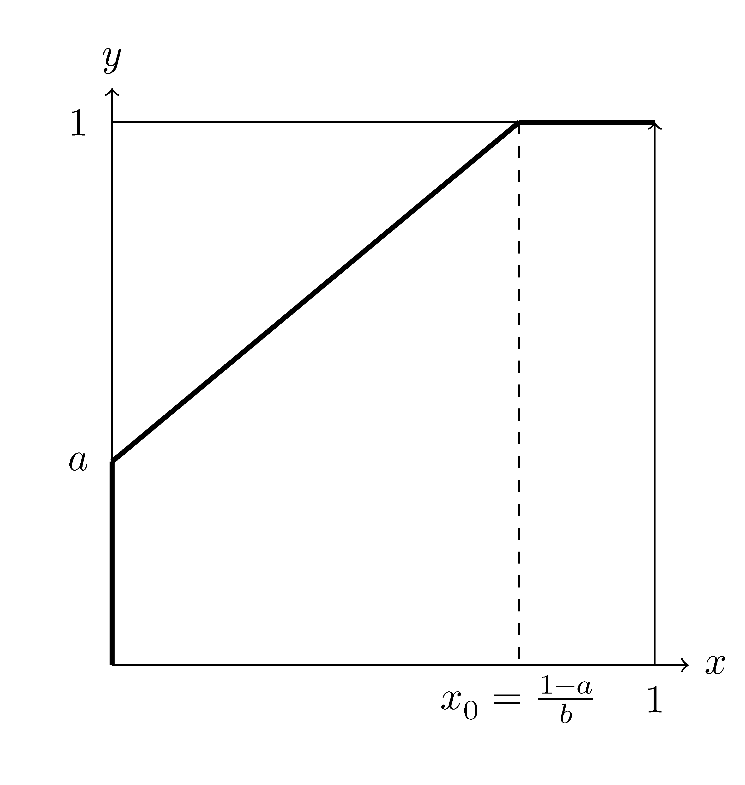
```


<!-- ```{=latex} -->
<!-- \begin{figure}[ht] -->
<!-- \centering -->
<!-- \begin{tikzpicture}[scale=.6] -->
<!-- \draw[->] (0,0) -- (8.5,0); -->
<!-- \draw[->] (0,0) -- (0,8.5); -->
<!-- \node at (8.9,0) {$x$}; -->
<!-- \node at (0,8.9) {$y$}; -->
<!-- \draw[-] (0,8) -- (8,8); -->
<!-- \draw[->] (8,0) -- (8,8); -->
<!-- \coordinate (x0) at (6,8); -->
<!-- \coordinate (x00) at (6,0); -->
<!-- \coordinate (a) at (0,3); -->
<!-- \draw[color = black, line width=1.2pt] (0,0) -- (a); -->
<!-- \draw[color = black, line width=1.2pt] (x0) -- (a); -->
<!-- \draw[color = black, line width=1.2pt] (x0) -- (8,8); -->
<!-- \draw[dashed] (x0) -- (x00); -->
<!-- \node[shift={(0,-0.3)}] at (x00) {$x_0 = \frac{1-a}{b}$}; -->
<!-- \node[shift={(-0.3,0)}] at (a) {$a$}; -->
<!-- \node[shift={(-0.3,0)}] at (0,8) {$1$}; -->
<!-- \node[shift={(0,-0.3)}] at (8,0) {$1$}; -->
<!-- \end{tikzpicture} -->
<!-- \caption{Parameters: $0 < a < 1 < a + b$.} -->
<!-- \label{fig:boundingline} -->
<!-- \end{figure} -->
<!-- ``` -->


Define $L(x) = \min\{1,a+bx\}$.
\begin{align} F_{a,b} & \equiv \int_0^1 L(x) \,dx = \text{surface area below thick line} \\
   & = 1 - \text{surface area above thick line} \\
   & = 1 - \tfrac{1}{2} (1-a) x_0 = 1 - \frac{(1-a)^2}{2b} \end{align}
Uniform distribution $(X,Y)$ below the ceiling line:
\begin{align}
X & \propto \frac{1}{F_{a,b}} L(x) \,dx \\
Y|X & \propto \frac{I_{[0,L(x)]}(y)}{L(x)}  \,dy
\end{align}
where $X$ is a random variable, $Y|X$ is a random variable $Y$ conditioned on $X$ and $\propto$ means `distributed with a density function given as'. Further, $I_{[0,L(x)]}$ is the indicator function for the interval $[0,L(x)]$.
Note that
\[ (X,Y) \propto \frac{1}{F_{a,b}} I_{[0,L(x)]}(y) \,dx \, \,dy = \frac{1}{F_{a,b}} I_{ y \leq a + bx}(x,y) \,dx \, \,dy \]
is indeed the (normalized) uniform distribution below the line \footnote{Also note that, in equation form,
$X = G^{-1}(U_1)$ and $Y = L(X) U_2$ where $U_1$ and $U_2$ are independent uniform on the interval $[0,1]$. The function $G^{-1}$ is the inverse of
\[ G(\theta) =  \frac{1}{F_{a,b}} \int_0^\theta L(x) \,dx .\]
}. 

The text below uses four values, $a$, $b$, $x_0$, and $F_{a,b}$ to formulate expressions. Two are all that are needed. Indeed, for example,
\begin{align*}
\frac{1-F_{a,b}}{x_0} & = \frac{\frac{(1-a)^2}{2b}}{(1-a)/b} = \tfrac{1}{2} (1-a)
\end{align*}
and so
\[ a =  1- 2 \frac{1-F_{a,b}}{x_0} \quad \text{or} \quad x_0 = 2 \frac{1-F_{a,b}}{1-a} \quad \text{or} \quad F_{a,b} = 1 - x_0 (1-a)/2 . \]
Likewise
\[ b = (1-a)/x_0 = \left( \frac{1- 2 \frac{1-F_{a,b}}{x_0}}{x_0}  \right) .\]

## Symmetry transformation {-}

Consider the `double flip + transposition' transformation:
\[ (x,y) \mapsto (\alpha,\beta) \equiv (1-y,1-x) . \]
In $\alpha\beta$ coordinates, Figure \@ref(fig:boundinglinefig) presents itself as Figure \@ref(fig:flipboundinglinefig).


```{r flipboundinglinefig, echo=FALSE, warning=FALSE, message=FALSE, fig.align="center", out.width="45%", fig.cap="Parameters: $\\hat{a}=1-a$ with $0 < \\hat{a} < 1$ and $0 < x_0 < 1$."}
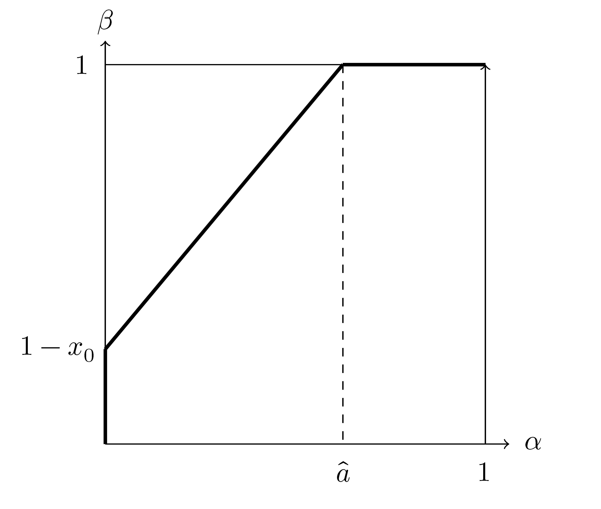
```


<!-- ```{=latex} -->
<!-- \begin{figure}[ht] -->
<!-- \centering -->
<!-- \begin{tikzpicture}[scale=.6] -->
<!-- \draw[->] (0,0) -- (8.5,0); -->
<!-- \draw[->] (0,0) -- (0,8.5); -->
<!-- \node at (8.9,0) {$\alpha$}; -->
<!-- \node at (0,8.9) {$\beta$}; -->
<!-- \draw[-] (0,8) -- (8,8); -->
<!-- \draw[->] (8,0) -- (8,8); -->
<!-- \coordinate (x0) at (5,8); -->
<!-- \coordinate (x00) at (5,0); -->
<!-- \coordinate (a) at (0,2); -->
<!-- \draw[color = black, line width=1.2pt] (0,0) -- (a); -->
<!-- \draw[color = black, line width=1.2pt] (x0) -- (a); -->
<!-- \draw[color = black, line width=1.2pt] (x0) -- (8,8); -->
<!-- \draw[dashed] (x0) -- (x00); -->
<!-- \node[shift={(0,-0.3)}] at (x00) {$\hat{a}$}; -->
<!-- \node[shift={(-0.6,0)}] at (a) {$1-x_0$}; -->
<!-- \node[shift={(-0.3,0)}] at (0,8) {$1$}; -->
<!-- \node[shift={(0,-0.3)}] at (8,0) {$1$}; -->
<!-- \end{tikzpicture} -->
<!-- \caption{Parameters: $\hat{a}=1-a$ with $0 < \hat{a} < 1$ and $ 0 < x_0 < 1$.} -->
<!-- \label{fig:flipboundingline} -->
<!-- \end{figure} -->
<!-- ``` -->


The ceiling function in $\alpha \beta$ coordinates is $\hat{L}(\alpha) = \min(1, (1-x_0) + (1/b) \beta$. 
Now
\[ E{Y} = E(1-\alpha) = 1 - E(\alpha) \]
where, by symmetry,
\[ E(\alpha) = E(X) \quad [\text{where $x_0 \leftrightarrow \hat{a}$}] . \]
Note that under the symmetry $x_0 \leftrightarrow \hat{a}$ the value of $F_{a,b} = 1 - \tfrac{1}{2} x_0 \hat{a}$ is evidently invariant.

## Correlation {-}

\[ \rho_{XY} = \frac{E(XY) - E(X) E(Y)}{\sigma_X \sigma_Y} . \]
Five integrals:

1. Expectation of $X$.

\begin{align*}
E(X) &= \frac{1}{F_{a,b}} \int_0^1 x L(x)\,dx \\
     &= \frac{1}{F_{a,b}} \int_0^1 x \min\{1,a+bx\}\,dx\\
     &= \frac{1}{F_{a,b}} \left( \int_0^{(1-a)/b} (ax + bx^2)\,dx + \int_{(1-a)/b}^1 x\,dx \right) \\
     &= \frac{1}{F_{a,b}} \left( \left.(\tfrac{1}{2}ax^2 + \tfrac{1}{3}bx^3)\right|_{0}^{(1-a)/b} + \left.\tfrac{1}{2}x^2\right|_{(1-a)/b}^{1} \right) \\
     &= \frac{1}{F_{a,b}} \left( \tfrac{1}{2}a \left(\frac{1-a}{b}\right)^2 + \tfrac{1}{3}b\left(\frac{1-a}{b}\right)^3 + \tfrac{1}{2} - \tfrac{1}{2} \left(\frac{1-a}{b}\right)^2 \right)\\
     &= \frac{1}{2F_{a,b}} \left( 1 + (a + \tfrac{2}{3}(1-a) + 1)\left(\frac{1-a}{b}\right)^2 \right) \\
     &= \frac{1}{2F_{a,b}} \left( 1 - \tfrac{1}{3}(1-a)\left(\frac{1-a}{b}\right)^2 \right) \\
     &= \frac{1}{2F_{a,b}} \left( \tfrac{2}{3}\frac{(1-a)}{b} - \tfrac{2}{3}\frac{(1-a)}{b}\frac{(1-a)^2}{2b} + 1 - \tfrac{2}{3}\frac{(1-a)}{b} \right) \\
     &= \frac{1}{2F_{a,b}} \left( \tfrac{2}{3}\frac{(1-a)}{b}F_{a,b} + 1 - \tfrac{2}{3}\frac{(1-a)}{b} \right) \\
     &= \tfrac{1}{2} \left( \tfrac{2}{3}\frac{(1-a)}{b} + \left(1 - \tfrac{2}{3}\frac{(1-a)}{b}\right)\frac{1}{F_{a,b}} \right) \\
     &= \tfrac{1}{2} \left( \tfrac{2}{3}x_0 + \left(1 - \tfrac{2}{3}x_0\right)\frac{1}{F_{a,b}} \right)\\
     &= \frac{1}{2F_{a,b}} \left( 1 - \tfrac{2}{3}x_0 + \tfrac{2}{3}x_0 F_{a,b} \right).
\end{align*}

Note. As $\frac{1}{F_{a,b}} \geq 1$ we have

\[
E(X) = \tfrac{1}{2} \left( \tfrac{2}{3} x_0 + \left( 1 - \tfrac{2}{3} x_0 \right) \frac{1}{F_{a,b}} \right) \geq \tfrac{1}{2} \left( \tfrac{2}{3} x_0 + 1 - \tfrac{2}{3} x_0 \right) = \tfrac{1}{2}
\]

as is evident from Figure \@ref(fig:boundinglinefig). Reworking $E(X)$ (into $\hat{a}$ and $x_0$) we obtain

\begin{align*}
E(X) &= \frac{1}{2F_{a,b}} \left( 1 - \tfrac{2}{3} x_0 + \tfrac{2}{3} x_0 F_{a,b} \right) \\
     &= \frac{1}{2F_{a,b}} \left( 1 - \tfrac{2}{3} x_0 + \tfrac{2}{3} x_0 (1-\tfrac{1}{2} \hat{a} x_0) \right) \\
     &= \frac{1}{2F_{a,b}} \left( 1 - \tfrac{1}{3} \hat{a}\,x_0^2 \right).
\end{align*}

2. Expectation of $Y$. Note that $E(Y) = E(E(Y \mid X))$.

Step 1.

\[
E(Y \mid X=x) = \int_0^{L(x)} y \frac{I_{[0,L(x)]}(y)}{L(x)}\,dy = \left.\tfrac{1}{2}\frac{y^2}{L(x)}\right|_{0}^{L(x)} = \tfrac{1}{2}L(x).
\]

Step 2.

\begin{align*}
E(Y) &= \int_0^{1} \tfrac{1}{2} L(x)\frac{L(x)}{F_{a,b}}\,dx \\
     &= \frac{1}{2F_{a,b}} \left( \int_0^{(1-a)/b} (a+bx)^2\,dx + \int_{(1-a)/b}^1\,dx \right) \\
     &= \frac{1}{2F_{a,b}} \left( \int_0^{(1-a)/b} (a^2 + 2abx + b^2x^2)\,dx + \int_{(1-a)/b}^1\,dx \right) \\
     &= \frac{1}{2F_{a,b}} \left( \left.(a^2x + abx^2 + \tfrac{1}{3}b^2x^3)\right|_{0}^{(1-a)/b} + \left.x\right|_{(1-a)/b}^{1} \right) \\
     &= \frac{1}{2F_{a,b}} \left( a^2 \frac{1-a}{b} + ab\left(\frac{1-a}{b}\right)^2 + \tfrac{1}{3} b^2\left(\frac{1-a}{b}\right)^3 + 1 - \frac{1-a}{b} \right) \\
     &= \frac{1}{2F_{a,b}} \left( a^2 x_0 + 2a \frac{(1-a)^2}{2b} + \tfrac{2}{3}(1-a)\frac{(1-a)^2}{2b} + 1 - x_0 \right) \\
     &= \frac{1}{2F_{a,b}} \left( a^2 x_0 + (2a + \tfrac{2}{3}(1-a))(1 - F_{a,b}) + 1 - x_0 \right) \\
     &= \frac{1}{2F_{a,b}} \left( 1 - x_0 + a^2 x_0 + \tfrac{2}{3}(2a + 1)(1 - F_{a,b}) \right) \\
     &= \frac{1}{2F_{a,b}} \left( 1 + (a-1)(a+1)x_0 + \tfrac{2}{3}(2a + 1)(1 - F_{a,b}) \right) \\
     &= \frac{1}{2F_{a,b}} \left( 1 - 2(a+1)(1-F_{a,b}) + \tfrac{2}{3}(2a + 1)(1 - F_{a,b}) \right) \\
     &= \frac{1}{2F_{a,b}} \left( 1 - \tfrac{2}{3}(a+2)(1-F_{a,b}) \right) \\
     &= \frac{1}{2F_{a,b}} \left( 1 - \tfrac{2}{3}(a+2) + \tfrac{2}{3}(a+2)F_{a,b} \right).
\end{align*}

Set $\theta(a) = \tfrac{1}{3}(a+2) \leq \tfrac{1}{3}(1+2) = 1$. Also, evidently $\theta(a) \geq \tfrac{2}{3}$. Now

\begin{align*}
E(Y) &= \frac{1}{2F_{a,b}} ( 1 - 2\theta(a) + 2\theta(a) F_{a,b} ) \\
     &= \frac{1}{2F_{a,b}} \left( 1 - 2\theta(a)(1 - F_{a,b}) \right) \\
     &\leq \frac{1}{2F_{a,b}} \left( 1 - \tfrac{4}{3}(1 - F_{a,b}) \right) \\
     &= \frac{1}{2F_{a,b}} \left( - \tfrac{1}{3} + \tfrac{4}{3} F_{a,b} \right) \\
     &= \frac{1}{2} \left( - \tfrac{1}{3}\frac{1}{F_{a,b}} + \tfrac{1}{3} + 1 \right) \leq \frac{1}{2}.
\end{align*}

Note that the final inequality is strict for $F_{a,b} < 1$. The inequality $E(Y) \leq \tfrac{1}{2}$ is evident from Figure \@ref(fig:boundinglinefig).

*Alternative calculation*.

\begin{align*}
E(Y) &= \int_0^{1} \tfrac{1}{2} L(x)\frac{L(x)}{F_{a,b}}\,dx \\
     &= \frac{1}{2F_{a,b}} \left( \int_0^{(1-a)/b} (a+bx)^2\,dx + \int_{(1-a)/b}^1\,dx \right) \\
     &= \frac{1}{2F_{a,b}} \left( \frac{1}{b} \int_a^{1} z^2\,dz + \left.x\right|_{(1-a)/b}^{1} \right) \\
     &= \frac{1}{2F_{a,b}} \left( \frac{1}{3b} \left.z^3\right|_{a}^{1} + \left.x\right|_{(1-a)/b}^{1} \right) \\
     &= \frac{1}{2F_{a,b}} \left( \frac{1}{3b}(1-a^3) + 1 - \frac{1-a}{b} \right).
\end{align*}

Note that

\begin{align*}
a^2 (1-a) + a(1-a)^2 + \tfrac{1}{3} (1-a)^3 &= a^2-a^3 + a(1-2a+a^2) + \tfrac{1}{3} (1-a)(1-2a+a^2) \\
&= a - a^2 + \tfrac{1}{3} (1-2a+a^2-a+2a^2-a^3) \\
&= a - a^2 + \tfrac{1}{3}(1-a^3) - a + a^2 = \tfrac{1}{3}(1-a^3).
\end{align*}

Also note

\[
(1-a^3) = (1-a) (3a + (1-a)^2) = (1-a) (3a + 1-2a + a^2) = (1-a) (1 + a + a^2).
\]

Reworking $E(Y)$ (into $\hat{a}$ and $x_0$) using the symmetry

\begin{align*}
E(Y) &= \frac{1}{2F_{a,b}} \left( 1 - \tfrac{2}{3}(a+2) + \tfrac{2}{3}(a+2) F_{a,b} \right) \\
     &= \frac{1}{2F_{a,b}} \left( 1 - \tfrac{2}{3}(1-\hat{a}+2) + \tfrac{2}{3}(1-\hat{a}+2)(1-\tfrac{1}{2} x_0 \hat{a}) \right) \\
     &= \frac{1}{2F_{a,b}} \left( 1 - \tfrac{1}{3}(3-\hat{a}) x_0 \hat{a} \right) \\
     &= 1 - \frac{1}{2F_{a,b}} \left( -1 + 2 F_{a,b} + \tfrac{1}{3}(3-\hat{a}) x_0 \hat{a} \right) \\
     &= 1 - \frac{1}{2F_{a,b}} \left( -1 + 2 - x_0 \hat{a} + \tfrac{1}{3}(3-\hat{a}) x_0 \hat{a} \right) \\
     &= 1 - \frac{1}{2F_{a,b}} \left( 1 - \tfrac{1}{3} x_0 \hat{a}^2 \right) = 1 - E(X)\,[\text{where $x_0 \leftrightarrow \hat{a}$}].
\end{align*}

3. Second moment of $X$.

\begin{align*}
E(X^2) &= \frac{1}{F_{a,b}} \int_0^1 x^2 L(x)\,dx \\
       &= \frac{1}{F_{a,b}} \int_0^1 x^2 \min\{1,a+bx\}\,dx\\
       &= \frac{1}{F_{a,b}} \left( \int_0^{(1-a)/b} (ax^2 + bx^3)\,dx + \int_{(1-a)/b}^1 x^2\,dx \right) \\
       &= \frac{1}{F_{a,b}} \left( \left.(\tfrac{1}{3}ax^3 + \tfrac{1}{4}bx^4)\right|_{0}^{(1-a)/b} + \left.\tfrac{1}{3}x^3\right|_{(1-a)/b}^{1} \right) \\
       &= \frac{1}{F_{a,b}} \left( \tfrac{1}{3}a \left(\frac{1-a}{b}\right)^3 + \tfrac{1}{4}b\left(\frac{1-a}{b}\right)^4 + \tfrac{1}{3} - \tfrac{1}{3} \left(\frac{1-a}{b}\right)^3 \right)\\
       &= \frac{1}{F_{a,b}} \left( \tfrac{1}{3} - \tfrac{8}{3}(1-a)\left(\frac{1-a}{2b}\right)^3 + 2(1-a)\left(\frac{1-a}{2b}\right)^3 \right)\\
       &= \frac{1}{F_{a,b}} \left( \tfrac{1}{3} - \tfrac{8}{3}\left(\frac{(1-a)}{2b}\right)^2 \left(\frac{(1-a)^2}{2b}\right) + 2\left(\frac{(1-a)}{2b}\right)^2 \left(\frac{(1-a)^2}{2b}\right) \right)\\
       &= \frac{1}{F_{a,b}} \left( \tfrac{1}{3} - \tfrac{2}{3} x_0^2 (1-F_{a,b}) + \tfrac{1}{2} x_0^2 (1-F_{a,b}) \right) \\
       &= \frac{1}{F_{a,b}} \left( \tfrac{1}{3} - \tfrac{1}{6} x_0^2 (1-F_{a,b}) \right) \\
       &= \frac{1}{3F_{a,b}} \left( (1 - \tfrac{1}{2} x_0^2) + \tfrac{1}{2} x_0^2 F_{a,b} \right).
\end{align*}

4. Second moment of $Y$. Note $E(Y^2) = E(E(Y^2 \mid X))$.

Step 1.

\[
E(Y^2 \mid X=x) = \int_0^{L(x)} y^2 \frac{I_{[0,L(x)]}(y)}{L(x)}\,dy = \left.\tfrac{1}{3}\frac{y^3}{L(x)}\right|_{0}^{L(x)} = \tfrac{1}{3}(L(x))^2.
\]

Step 2.

\begin{align*}
E(Y^2) &= \int_0^{1} \tfrac{1}{3}(L(x))^2 \frac{L(x)}{F_{a,b}}\,dx \\
       &= \frac{1}{3F_{a,b}} \left( \int_0^{(1-a)/b} (a+bx)^3\,dx + \int_{(1-a)/b}^1\,dx \right) \\
       &= \frac{1}{3F_{a,b}} \left( \int_a^{1} z^3 \frac{1}{b}\,dz + \left.x\right|_{(1-a)/b}^{1} \right) \\
       &= \frac{1}{3F_{a,b}} \left( \frac{1}{b} \left.\tfrac{1}{4}z^4\right|_{a}^{1} + 1 - \frac{1-a}{b} \right) \\
       &= \frac{1}{3F_{a,b}} \left( \frac{1}{4b} (1-a^4) + 1 - \frac{1-a}{b} \right).
\end{align*}

Note that $1-a^4 = (1-a)(1+a+a^2+a^3) = (1-a^3) + (1-a)a^3$. Also, $1-a^4 = (1-a^2)(1+a^2) = (1-a)(1+a)(1+a^2)$. We continue:

\begin{align*}
E(Y^2) &= \frac{1}{3F_{a,b}} \left( \frac{1}{4b} (1-a)(1+a)(1+a^2) + 1 - \frac{1-a}{b} \right).
\end{align*}

Alternative:

\begin{align*}
E(Y^2) &= \int_0^{1} \tfrac{1}{3}(L(x))^2 \frac{L(x)}{F_{a,b}}\,dx \\
       &= \frac{1}{3F_{a,b}} \left( \int_0^{(1-a)/b} (a+bx)^3\,dx + \int_{(1-a)/b}^1\,dx \right) \\
       &= \frac{1}{3F_{a,b}} \left( \int_0^{(1-a)/b} (a^3 + 3a^2bx + 3ab^2x^2 + b^3x^3)\,dx + \left.x\right|_{(1-a)/b}^{1} \right) \\
       &= \frac{1}{3F_{a,b}} \left( \left.a^3x + \tfrac{1}{2} 3a^2bx^2 + ab^2x^3 + \tfrac{1}{4}b^3x^4\right|_{0}^{(1-a)/b} + 1 - \frac{1-a}{b} \right) \\
       &= \frac{1}{3F_{a,b}} \left( a^3\frac{1-a}{b} + \tfrac{3}{2} a^2b\left(\frac{1-a}{b}\right)^2 + ab^2\left(\frac{1-a}{b}\right)^3 + \tfrac{1}{4}b^3\left(\frac{1-a}{b}\right)^4 + 1 - \frac{1-a}{b} \right) \\
       &= \frac{1}{3F_{a,b}} \left( a^3 x_0 + 3 a^2 (1-F_{a,b}) + 2a(1-a) (1-F_{a,b}) + \tfrac{1}{2} (1-a)^2 (1-F_{a,b}) + 1 - x_0 \right) \\
       &= \frac{1}{3F_{a,b}} \left(1 - (1 - a^3) x_0 + \left(3 a^2 + 2a(1-a) + \tfrac{1}{2} (1-a)^2 \right) (1-F_{a,b}) \right) \\
       &= \frac{1}{3F_{a,b}} \left(1 - (1 - a^3) x_0 + \left(3a^2 + 2a - 2a^2 + \tfrac{1}{2} - a + \tfrac{1}{2} a^2 \right) (1-F_{a,b}) \right).
\end{align*}

Continuing:

\begin{align*}
E(Y^2) &= \frac{1}{3F_{a,b}} \left(1 - (1 - a^3) x_0 + \left(\tfrac{1}{2} + a + \tfrac{3}{2} a^2 \right) (1-F_{a,b}) \right) \\
       &= \frac{1}{3F_{a,b}} \left(1 - (1 - a)(1+a+a^2) \frac{1-a}{b} + \left(\tfrac{1}{2} + a + \tfrac{3}{2} a^2 \right) (1-F_{a,b}) \right) \\
       &= \frac{1}{3F_{a,b}} \left(1 - 2(1+a+a^2) (1-F_{a,b}) + \left(\tfrac{1}{2} + a + \tfrac{3}{2} a^2 \right) (1-F_{a,b}) \right) \\
       &= \frac{1}{3F_{a,b}} \left(1 - \tfrac{1}{2} (3 + 2a + a^2) (1-F_{a,b}) \right) \\
       &= \frac{1}{3F_{a,b}} \left(- \tfrac{1}{2} - a - \tfrac{1}{2}a^2 + \tfrac{1}{2} (3 + 2a + a^2) F_{a,b} \right) \\
       &= \frac{1}{3F_{a,b}} \left( -\tfrac{1}{2} (1+a)^2 + (1 + \tfrac{1}{2} (1+a)^2) F_{a,b} \right) \\
       &= \frac{1}{3F_{a,b}} \left( -\tfrac{1}{2} (2-\hat{a})^2 + (1 + \tfrac{1}{2} (2-\hat{a})^2) F_{a,b} \right).
\end{align*}

Verification via symmetry:

\begin{align*}
E(Y^2) &= E((1-\alpha)^2) = 1 - 2E(\alpha) + E(\alpha^2) \\
       &= 1 - 2E(X)[\text{where $x_0 \leftrightarrow \hat{a}$}] + E(X^2)[\text{where $x_0 \leftrightarrow \hat{a}$}] \\
       &= 1 - \frac{1}{F_{a,b}} (1 - \tfrac{1}{3} x_0 \hat{a}^2) + \frac{1}{3F_{a,b}} (1 - \tfrac{1}{2}\hat{a}^2 + \frac{1}{2}\hat{a}^2 F_{a,b}) \\
       &= \frac{1}{3F_{a,b}} \left( 3F - 3(1 - \tfrac{1}{3} x_0 \hat{a}^2) + 1 - \tfrac{1}{2}\hat{a}^2 + \frac{1}{2}\hat{a}^2 F_{a,b} \right) \\
       &= \frac{1}{3F_{a,b}} \left( -2 - \tfrac{1}{2}\hat{a}^2 + x_0 \hat{a}^2 + (3 + \tfrac{1}{2}\hat{a}^2) F_{a,b} \right) \\
       &= \frac{1}{3F_{a,b}} \left( -2 - \tfrac{1}{2}\hat{a}^2 + 2\hat{a} (1-F_{a,b}) + (3 + \tfrac{1}{2}\hat{a}^2) F_{a,b} \right) \\
       &= \frac{1}{3F_{a,b}} \left( -2 + 2\hat{a} - \tfrac{1}{2}\hat{a}^2 + (1 + 2 - 2\hat{a} + \tfrac{1}{2}\hat{a}^2) F_{a,b} \right) \\
       &= \frac{1}{3F_{a,b}} \left( - \tfrac{1}{2} (2-\hat{a})^2 + (1 + \tfrac{1}{2} (2-\hat{a})^2) F_{a,b} \right).
\end{align*}

5. Inner product $E(XY)$. We have $E(XY) = E(E(XY \mid X=x))$.

Step 1.

\begin{align*}
E(XY \mid X=x) &= x \int_0^{L(x)} y \frac{I_{[0,L(x)]}}{L(x)}(y)\,dy \\
               &= \frac{x}{L(x)} \left.\tfrac{1}{2} y^2\right|_{0}^{L(x)} \\
               &= \tfrac{1}{2} x L(x).
\end{align*}

Step 2.

\begin{align*}
E(XY) &= \frac{1}{F_{a,b}} \int_0^1 \tfrac{1}{2} x (L(x))^2\,dx \\
      &= \frac{1}{2F_{a,b}} \left( \int_0^{(1-a)/b} x(a+bx)^2\,dx + \int_{(1-a)/b}^1 x\,dx \right) \\
      &= \frac{1}{2F_{a,b}} \left( \int_0^{(1-a)/b} (a^2x + 2abx^2 + b^2x^3)\,dx + \tfrac{1}{2} \left.x^2\right|_{(1-a)/b}^{1} \right) \\
      &= \frac{1}{2F_{a,b}} \left( \left.(\tfrac{1}{2}a^2x^2 + \tfrac{2}{3}abx^3 + \tfrac{1}{4}b^2x^4)\right|_{0}^{(1-a)/b} + \tfrac{1}{2} \left( 1 - \left(\frac{1-a}{b}\right)^2 \right) \right) \\
      &= \frac{1}{4F_{a,b}} \left( 1 - \left(\frac{1-a}{b}\right)^2 + a^2\left(\frac{1-a}{b}\right)^2 + \tfrac{4}{3}ab\left(\frac{1-a}{b}\right)^3 + \tfrac{1}{2}b^2\left(\frac{1-a}{b}\right)^4 \right)\\
      &= \frac{1}{4F_{a,b}} \left( 1 - (1+a) \frac{(1-a)^3}{b^2} + \tfrac{4}{3}a(1-a)/b \frac{(1-a)^2}{b} + \tfrac{1}{2}(1-a)^2/b \frac{(1-a)^2}{b} \right)\\
      &= \frac{1}{4F_{a,b}} \left( 1 + \left(-2(1+a)x_0 + \tfrac{8}{3}ax_0 + (1-a)x_0 \right) (1-F_{a,b}) \right)\\
      &= \frac{1}{4F_{a,b}} \left( 1 + \left( -x_0 - \tfrac{1}{3}ax_0 \right) (1-F_{a,b}) \right) \\
      &= \frac{1}{4F_{a,b}} \left( 1 - x_0 - \tfrac{1}{3}ax_0 + (x_0 + \tfrac{1}{3}ax_0) F_{a,b} \right).
\end{align*}

Note that

\[
x_0 + \tfrac{1}{3}ax_0 = x_0 + \tfrac{1}{3}(1-\hat{a})x_0 = \tfrac{2}{3}(2x_0 - 1 + F_{a,b}).
\]

and so

\begin{align*}
E(XY) &= \frac{1}{4F_{a,b}} \left( 1 + \tfrac{2}{3} (1 - 2x_0 - F_{a,b}) - \tfrac{2}{3} (1 - 2x_0 - F_{a,b}) F_{a,b} \right) \\
      &= \frac{1}{4F_{a,b}} \left( 1 - \tfrac{2}{3} (2x_0 + F_{a,b}) + \tfrac{2}{3} (2x_0 + F_{a,b}) F_{a,b} \right) \\
      &= \frac{1}{4F_{a,b}} \left( 1 - \tfrac{2}{3} (2x_0 + F_{a,b}) (1 - F_{a,b}) \right).
\end{align*}

Therefore the correlation is:

$$
\begin{aligned}
\rho_{XY} & =
\frac{{{E}}(XY) - {{E}}(X) {{E}}(Y)}
{\sqrt{{{E}}(X^2) - {{E}}(X)^2} \sqrt{{{E}
}(Y^2) - {{E}}(Y)^2}}
=
\\\end{aligned}
$$

\begin{aligned}
\frac{
\frac{1}{4F_{a,b}} \left( 1 - x_0 - \tfrac{1}{3}ax_0 + (x_0 + \tfrac{1}{3}ax_0)F_{a,b} \right)
-
\frac{1}{2F_{a,b}} \left( 1 - \tfrac{2}{3}x_0 + \tfrac{2}{3}x_0F_{a,b} \right)
\frac{1}{2F_{a,b}} \left( 1 - \tfrac{2}{3}(a+2) + \tfrac{2}{3}(a+2)F_{a,b} \right)
}{
\sqrt{
\frac{1}{3F_{a,b}} \left( 1 - \tfrac{1}{2}x_0^2 + \tfrac{1}{2}x_0^2F_{a,b} \right)
-
\left(
\frac{1}{2F_{a,b}} \left( 1 - \tfrac{2}{3}x_0 + \tfrac{2}{3}x_0F_{a,b} \right)
\right)^2
}
\sqrt{
\frac{1}{3F_{a,b}} \left( -\tfrac{1}{2}(1+a)^2 + \left( 1 + \tfrac{1}{2}(1+a)^2 \right)F_{a,b} \right)
-
\left(
\frac{1}{2F_{a,b}} \left( 1 - \tfrac{2}{3}(a+2) + \tfrac{2}{3}(a+2)F_{a,b} \right)
\right)^2
}
}.
\end{aligned}


<!-- \fontsize{6}{6} \selectfont -->
<!-- \begin{sideways}\begin{minipage}{0.95\textheight} Correlation.  -->

<!-- \vspace*{1cm} \begin{align*} -->
<!-- \fontsize{6}{6} \selectfont -->
<!-- \vspace*{1cm} \rho_{XY} & = \frac{\Ave(XY) - \Ave(X) \Ave(Y)}{\sqrt{\Ave(X^2) - \Ave(X)^2} \sqrt{\Ave(Y^2) - \Ave(Y)^2}} \\ -->
<!-- & = \frac{\ExpXY - \ExpX \ExpY}{\sqrt{\ExpXtwo - \left( \ExpX \right)^2} \sqrt{\ExpYtwo - \left( \ExpY \right)^2}} -->
<!-- \end{align*} \end{minipage}\end{sideways} -->


<!-- {\leftskip=-1cm \rightskip=-1cm -->
<!-- \[ -->
<!-- \begin{aligned} -->
<!-- \small\frac{\frac{1}{4C_{a,b}} \left( 1 -x_0 - \tfrac{1}{3}ax_0 + (x_0 + \tfrac{1}{3}ax_0) C_{a,b} \right)- \frac{1}{2C_{a,b}} \left(  1- \tfrac{2}{3} x_0  + \tfrac{2}{3} x_0 C_{a,b} \right)\frac{1}{2C_{a,b}} \left( 1 - \tfrac{2}{3}(a+2)  +   \tfrac{2}{3}(a+2)  C_{a,b} \right)}{\sqrt{\frac{1}{3C_{a,b}} \left( (1 - \tfrac{1}{2} x_0^2) +  \tfrac{1}{2} x_0^2 C_{a,b}  \right)- \left( \frac{1}{2C_{a,b}} \left(  1- \tfrac{2}{3} x_0  + \tfrac{2}{3} x_0 C_{a,b} \right)\right)^2} \sqrt{\frac{1}{3C_{a,b}} \left( -\tfrac{1}{2} (1+a)^2  +  (1 + \tfrac{1}{2} (1+a)^2) C_{a,b})  \right)- \left( \frac{1}{2C_{a,b}} \left( 1 - \tfrac{2}{3}(a+2)  +   \tfrac{2}{3}(a+2)  C_{a,b} \right)\right)^2}} -->
<!-- \end{aligned}. -->
<!-- \] -->
<!-- \par} -->


<!-- $$\begin{aligned} -->
<!-- \small\frac{\frac{1}{4C_{a,b}} \left( 1 -x_0 - \tfrac{1}{3}ax_0 + (x_0 + \tfrac{1}{3}ax_0) C_{a,b} \right)- \frac{1}{2C_{a,b}} \left(  1- \tfrac{2}{3} x_0  + \tfrac{2}{3} x_0 C_{a,b} \right)\frac{1}{2C_{a,b}} \left( 1 - \tfrac{2}{3}(a+2)  +   \tfrac{2}{3}(a+2)  C_{a,b} \right)}{\sqrt{\frac{1}{3C_{a,b}} \left( (1 - \tfrac{1}{2} x_0^2) +  \tfrac{1}{2} x_0^2 C_{a,b}  \right)- \left( \frac{1}{2C_{a,b}} \left(  1- \tfrac{2}{3} x_0  + \tfrac{2}{3} x_0 C_{a,b} \right)\right)^2} \sqrt{\frac{1}{3C_{a,b}} \left( -\tfrac{1}{2} (1+a)^2  +  (1 + \tfrac{1}{2} (1+a)^2) C_{a,b})  \right)- \left( \frac{1}{2C_{a,b}} \left( 1 - \tfrac{2}{3}(a+2)  +   \tfrac{2}{3}(a+2)  C_{a,b} \right)\right)^2}} -->
<!-- \end{aligned}$$ -->


<!--chapter:end:10061-appendix-correlationJO.Rmd-->

# Demonstration NCA with PLS-SEM {#appendixe}

<!-- \textcolor{red}{set nboot 5000 ipv 14} -->

<!-- \textcolor{red}{set test.rep 10000 ipv 13} -->

This section demonstrates the steps for combining NCA with SEM (Section \@ref(ncasem)) using an example. This example has been used in four published studies where NCA is combined with PLS-SEM [@richter2020predictors; @richter2023apply; @hauff2024importance; @sarstedt2024combined]. The goal of the demonstration is threefold:

- Show how the combined analysis can be done following the flowchart presented in this book.

- Show how the proposed BIPMA plot for prioritizing evidence-based action in practice can be produced and how it differs from IPMA and cIPMA.

- Show how robustness checks for NCA can be conducted in the context of SEM.

- Show how to conduct a combined NCA-SEM analysis with ```R```.

This demonstration is a replication of the four above studies by using a different software package than the SmartPLS package. The NCA package for ```R``` includes all NCA functions and is free. The SmartPLS software may be more user-friendly for users who are not familiar with ```R```, but it is not free and does not include all NCA functions.
<!-- A quick start guideline for using NCA with ```R``` can be found [here]( https://www.erim.eur.nl/fileadmin/user_upload/_generated_/download/Quick_Start_Guide_NCA_4.0.0_February_2024.pdf). -->

The selected example evaluates an extended version of the Technology Acceptance Model (TAM) [@richter2020predictors]. Figure \@ref(fig:tamfig) shows the model consisting of six variables (rectangles) and 9 relationships (arrows).

(ref:caption101) The extended Technology Acceptance Model (TAM) according to @richter2020predictors.

```{r tamfig, echo=FALSE, out.width='100%', fig.align = "center", fig.cap="(ref:caption101)", cache=TRUE}
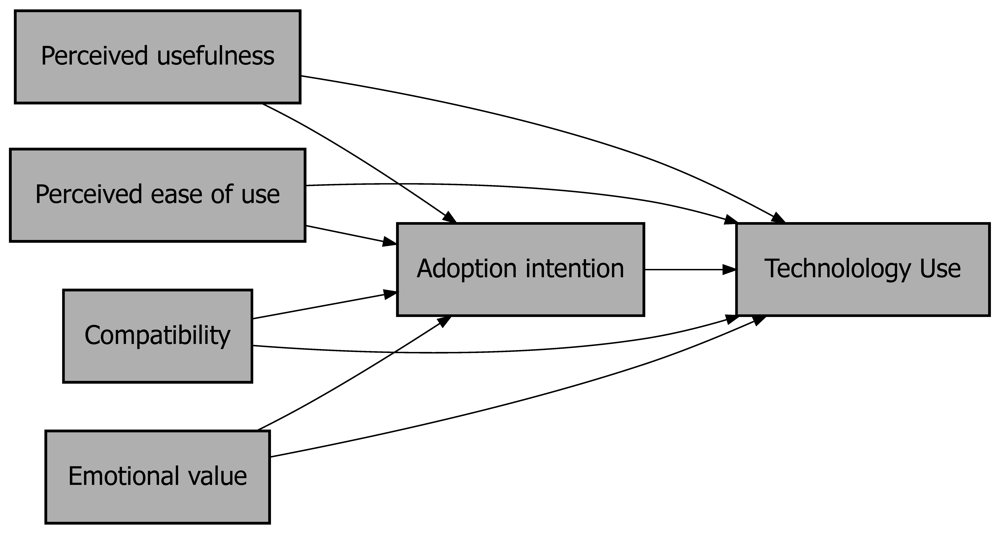
```

For the demonstration, the flowchart of Figure \@ref(fig:semflowchart) is followed. The ```R``` packages ```SEMinR``` for conducting PLS-SEM, ```NCA``` for conducting NCA, and the general purpose ```R``` packages  ```ggplot2``` and ```ggrepel``` for graphics need to be installed. Additional ```R``` code for conducting the analysis can be found in Section \@ref(additionalcode).

## Step 1: Theorize necessity and probabilistic relationships
It is assumed that the relationships shown in Figure \@ref(fig:tamfig) are theoretically justified from both the perspective of probabilistic sufficiency as well as from the perspective of necessity [@richter2020predictors]. For enhancing the necessity theorizing see Section \@ref(causalexplanation).


## Step 2: Collect data
The dataset is provided by [@schubring2023extended] on [Mendeley Data](https://data.mendeley.com/datasets/pd5dp3phx2/4), and explained in @richter2023dataset. The dataset needs to be downloaded in the working directory. 
The helper function  ```get_indicator_data_TAM``` imports the dataset, selects relevant columns, and changes the column names for use in ```SEMinR```. The helper function can be downloaded from the book-page: https://jandul.github.io/NCA.

<!-- ``` {r getindicatordatatamfunction, echo = TRUE, eval = TRUE} -->
<!-- get_indicator_data_TAM <- function(){ -->
<!-- df0 <- read.csv("Extended TAM.csv") -->
<!-- df1 <- df0[, 1:(ncol(df0) - 4)] -->
<!-- colnames(df1) <- c("PU1","PU2","PU3", -->
<!--                    "CO1","CO2","CO3", -->
<!--                    "EOU1", "EOU2","EOU3", -->
<!--                    "EMV1", "EMV2","EMV3", -->
<!--                    "AD1",  "AD2","AD3", -->
<!--                    "USE") -->
<!-- return(df1) -->
<!-- } -->
<!-- ``` -->

  
```{r GetIndicatorDataTam, echo=TRUE, message=FALSE, eval=TRUE}
# Get indicator data
source("get_indicator_data_TAM.R")
df <- get_indicator_data_TAM()
head(df, 3)
```
<!-- ```{r indicator_data, echo=FALSE, out.width='99%', fig.align = "left", fig.cap= NULL, cache=TRUE} -->
<!-- knitr::include_graphics('indicator_data.png') -->
<!-- ``` -->
The original data consists of 174 rows (cases = individuals using e-readers) and 20 columns. The first 16 columns represent the raw indicators of the 6 variables of the TAM model. The last four columns are not considered in this demonstration and are removed from the dataset. After running the helper function, the resulting dataset  ```df``` is used as input for the PLS-SEM model. The raw indicator scores are measured with 5-point Likert scales, except for the score for Technology use, which is measured with a 7-point Likert scale. The variable names are PU = Perceived usefulness, CO = Compatibility, EOU = Perceived ease of use, EMV = Emotional value, AD = Adoption intention, and USE = Technology use.

## Step 3: Conduct SEM
Following the four original studies, the PLS-SEM approach is selected to estimate the SEM model using the ```SEMinR``` package. This package standardizes the raw scores and produces latent construct scores (mean = 0, sd = 1), path coefficients and other output. The helper function ```estimate_sem_model_TAM``` conducts the PLS-SEM model estimation. This ```R``` function can be downloaded from the book-page: https://jandul.github.io/NCA.
<!-- The ```R``` code of the helper function be found in Section \@ref(estimatesemmodel). -->
  <!-- \ -->

<!-- ``` {r estimatesemmodeltamfunction, echo = TRUE, eval = TRUE} -->
<!-- estimate_sem_model_TAM <- function(data){ -->
<!-- library(seminr) -->
<!-- TAM_mm <- constructs( -->
<!--   composite("Perceived usefulness", multi_items("PU", 1:3)), -->
<!--   composite("Compatibility", multi_items("CO", 1:3)), -->
<!--   composite("Perceived ease of use", multi_items("EOU", 1:3)), -->
<!--   composite("Emotional value", multi_items("EMV", 1:3)), -->
<!--   composite("Adoption intention", multi_items("AD", 1:3)), -->
<!--   composite("Technology use", single_item("USE")) -->
<!-- ) -->
<!-- TAM_sm <- relationships( -->
<!--   paths(from = "Perceived usefulness",  -->
<!--         to = c("Adoption intention", "Technology use")), -->
<!--   paths(from = "Compatibility", -->
<!--         to = c("Adoption intention", "Technology use")), -->
<!--   paths(from = "Perceived ease of use", -->
<!--         to = c("Adoption intention", "Technology use")), -->
<!--   paths(from = "Emotional value", -->
<!--         to = c("Adoption intention", "Technology use")), -->
<!--   paths(from = "Adoption intention", -->
<!--         to = c("Technology use")) -->
<!-- ) -->
<!-- TAM_pls <- estimate_pls(data = data, -->
<!--                         measurement_model = TAM_mm, -->
<!--                         structural_model = TAM_sm) -->
<!-- return (TAM_pls) -->
<!-- } -->

<!-- ``` -->

  
The summary of the results shows the standardized path coefficients and some metrics about model fit:

``` {r estimate_TAM, echo=TRUE, warning = FALSE, message = FALSE, eval = TRUE}
# Estimate SEM model
# install.packages("seminr") # install the package if needed
source("estimate_sem_model_TAM.R")
TAM_pls <- estimate_sem_model_TAM(df)
summary(TAM_pls)
```

<!-- ```{r generating-the-seminr-model, echo=FALSE, out.width='99%', fig.align = "left", fig.cap= NULL, cache=TRUE} -->
<!-- knitr::include_graphics('Generating the seminr model.png') -->
<!-- ``` -->
The results correspond to those reported in the four original publications using the SmartPLS software. 

In addition, the 95% confidence interval of the path coefficients can be obtained using bootstrapping. A path is significant if its 95% bootstrap confidence interval does not include zero. The helper function ```get_significance_sem.R``` can be used to find significant direct effects, indirect effects, and total effects as follows. This ```R``` function can be downloaded from the book-page: https://jandul.github.io/NCA.
<!-- The ```R``` code of the helper function be found in Section \@ref(significancesem). -->
<!--  \ -->

<!-- ``` {r getsignificancesemfunction, echo = TRUE, eval = TRUE} -->
<!-- get_significance_sem <- function(sem, nboot = 5000) { -->
<!--   boot_model <- bootstrap_model(sem, nboot = nboot) # alpha is fixed at 0.05  -->
<!--   df_direct <- as.data.frame(summary(boot_model)[[2]]) -->
<!--   df_total  <- as.data.frame(summary(boot_model)[[6]]) -->
<!--   colnames(df_direct)[5:6] <- c("CI_low", "CI_high") -->
<!--   colnames(df_total)[5:6]  <- c("CI_low", "CI_high") -->
<!--   df_direct <- cbind(Path = rownames(df_direct), df_direct) -->
<!--   df_total  <- cbind(Path = rownames(df_total), df_total) -->
<!--   rownames(df_direct) <- NULL; rownames(df_total)  <- NULL -->
<!--   path_order <- df_direct$Path -->
<!--   merged_df <- merge(df_total, df_direct, by = "Path", suffixes = c("_total", "_direct")) -->
<!--   colnames(merged_df) <- make.names(colnames(merged_df)) -->
<!--   merged_df$Indirect_Estimate <- merged_df$Original.Est._total - merged_df$Original.Est._direct -->
<!--   merged_df$Sig_Direct   <- (merged_df$CI_low_direct > 0 | -->
<!--                                merged_df$CI_high_direct < 0) -->
<!--   merged_df$Sig_Total    <- (merged_df$CI_low_total > 0 |  -->
<!--                                merged_df$CI_high_total < 0) -->
<!--   merged_df$Sig_Indirect <- merged_df$Sig_Total & !merged_df$Sig_Direct -->
<!--   summary_df <- merged_df[, c( -->
<!--     "Path", -->
<!--     "Original.Est._direct", "Indirect_Estimate", "Original.Est._total", -->
<!--     "Sig_Direct", "Sig_Indirect", "Sig_Total" -->
<!--   )] -->
<!--   summary_df <- within(summary_df, { -->
<!--     Original.Est._direct  <- round(Original.Est._direct, 3) -->
<!--     Indirect_Estimate     <- round(Indirect_Estimate, 3) -->
<!--     Original.Est._total   <- round(Original.Est._total, 3) -->
<!--   }) -->
<!--   summary_df$Path <- factor(summary_df$Path, levels = path_order) -->
<!--   summary_df <- summary_df[order(summary_df$Path), ] -->
<!--   colnames(summary_df)[2:4] <- c("Direct", "Indirect", "Total") -->
<!--   get_rhs <- function(path_string) { -->
<!--     strsplit(as.character(path_string), "->")[[1]][2] |> trimws() -->
<!--   } -->
<!--   summary_df$Predicted <- sapply(as.character(summary_df$Path), get_rhs) -->
<!--   return(summary_df) -->
<!-- } -->

<!-- ```  -->

  
``` {r bootstrap_SEM, echo = TRUE, warning = FALSE, message = FALSE, eval = TRUE}
# Estimate significance SEM effects
source("get_significance_sem.R")

# Limit computation time
nboot <- 5000 # set lower for less computation time; 
              # for final analysis select 5000
set.seed(123) # for reproducible results
TAM_sig <- get_significance_sem (sem = TAM_pls, 
                                 nboot = nboot) 
print(TAM_sig)
```

  
<!-- ```{r significance_SEM, echo=FALSE, out.width='99%', fig.align = "left", fig.cap= NULL, cache=TRUE} -->
<!-- knitr::include_graphics('significance_SEM.png') -->
<!-- ``` -->
For the *direct* paths, three out of nine path coefficients are significant: 

- Perceived usefulness  $\rightarrow$  Adoption intention (direct effect: 0.227), 

- Emotional value  $\rightarrow$  Adoption intention (direct effect: 0.515)

- and Adoption intention  $\rightarrow$  Technology use (direct effect: 0.437)

For the *indirect* paths, two out of four paths are significant:

- Perceived usefulness $\rightarrow$ Adoption intention $\rightarrow$ Technology use (indirect effect: 0.099) 

- Emotional value $\rightarrow$ Adoption intention $\rightarrow$ Technology use (indirect effect: 0.225)

From the four combined direct and indirect  paths (*total effect*) only one is significant: Emotional value $\rightarrow$ Adoption intentions $\rightarrow$ Technology (total effect = 0.362).

These results suggest that for increasing Technology use on average, only Emotional value and Adoption intention are effective. Perceived usefulness, Compatibility and Perceived ease of use are not candidates for intervention based on the SEM results as they do not have a significant total effect on Technology use.

## Step 4: Extract latent variable scores 

By default, PLS-SEM model estimation produces standardized latent variable scores, and this is the only option in ```SEMinR``` version 2.4.2 that was used for the analysis. However, unstandardized scores are preferred as input for NCA, and normalized unstandardized scores are needed for IPMA, cIPMA and BIPMA. The helper function  ```unstandardize``` calculates the unstandardized latent variable scores from the standardized latent variable scores using procedures described in [@ringle2016gain], such that the scale of the latent variable scores match the scale of the original indicator scores. This ```R``` function can be downloaded from the book-page: https://jandul.github.io/NCA.
<!-- (Section \@ref(unstandardize)). -->
<!--  \ -->
<!-- ``` {r unstandardizefunction, echo = TRUE, eval = TRUE} -->
<!-- unstandardize <- function(sem) { -->
<!--   original_indicators_df <- as.data.frame(sem$rawdata) -->
<!--   standardized_weights_matrix <- sem$outer_weights -->
<!--   standardized_weights_df <- as.data.frame(as.table(standardized_weights_matrix)) -->
<!--   colnames(standardized_weights_df) <- c("Indicator",  -->
<!--                                          "Latent variable", -->
<!--                                          "Standardized weight") -->
<!--   standardized_weights_df <- subset(standardized_weights_df, -->
<!--                                     `Standardized weight` != 0) -->
<!--   standardized_weights_df$SD <-  -->
<!--     sem$sdData[as.character(standardized_weights_df$Indicator)] -->
<!--   standardized_weights_df$`Unstandardized weight` <-  -->
<!--   standardized_weights_df$`Standardized weight` /  -->
<!--     standardized_weights_df$SD   -->
<!--   sum_weights <- tapply( -->
<!--     standardized_weights_df$`Unstandardized weight`,  -->
<!--     standardized_weights_df$`Latent variable`,  -->
<!--     sum -->
<!--   ) -->
<!--   standardized_weights_df$`Sum unstandardized weight` <-  -->
<!--     sum_weights[match(standardized_weights_df$`Latent variable`, -->
<!--                       names(sum_weights))] -->
<!--   standardized_weights_df$`Normalized unstandardized weight` <-  -->
<!--     standardized_weights_df$`Unstandardized weight` / -->
<!--     standardized_weights_df$`Sum unstandardized weight` -->
<!--   unstandardized_latent_variable_df <-  -->
<!--     data.frame(matrix(nrow = nrow(original_indicators_df), ncol = 0)) -->
<!--   for (latent_variable in unique(standardized_weights_df$`Latent variable`)) { -->
<!--     latent_data <- subset(standardized_weights_df, -->
<!--                           `Latent variable` == latent_variable) -->
<!--     indicators <- as.character(latent_data$Indicator) -->
<!--     weights <- latent_data$`Normalized unstandardized weight` -->
<!--     indicator_scores <- original_indicators_df[, indicators, drop = FALSE] -->
<!--     latent_score <- rowSums(sweep(indicator_scores, 2, weights, `*`)) -->
<!--     unstandardized_latent_variable_df[[latent_variable]] <- latent_score -->
<!--   } -->
<!--   return(unstandardized_latent_variable_df) -->
<!-- } -->

<!-- ```  -->

  
``` {r unstandardize, echo = TRUE, eval = TRUE}
# Unstandardize data
source("unstandardize.R")
dataset <- unstandardize(TAM_pls)
head(dataset, 3)
data.frame (Mean = colMeans(dataset),
            Min = apply(dataset, 2, min),
            Max = apply(dataset, 2, max)
            )
```

The resulting dataset with unstandardized latent variable scores is called ```dataset```. The variables are now interpretable according to the Likert scales that were used to measure its raw indicators. The results show that minimum and maximum latent variable *scores*  correspond to the minimum and maximum values of the Likert *scale values*. There is one exception: the minimum observed latent variable score for Perceived ease of use is 1.67 whereas the minimum value of the scale is 1. Apparently, none of the 174 cases (individuals) scored a value 1 on all three indicators of this latent variable.

The unstandardized latent variable scores can be min-max normalized to obtain normalized unstandardized latent variable scores. Min-max normalization is essential if the predictor variables do not have the same scale values (e.g., one predictor variable is measured with a 1-5-Likert scale while another predictor variable is measured with a 1-7-Likert scale). If the same scale is used for all predictor variables, it is preferred not to normalize the scales and to keep the unstandardized latent variables scores, such that the results are  interpretable according to the Likert scale values.

Data can be normalized using the helper function ```nca_util_normalize``` of the ```NCA``` package in ```R```. The input arguments for this function are the data and the range (theoretical minimum and maximum) of the scale (the observed minimum or maximum values might be different). The range of the scale (e.g., 0-1 or 0-100). For example, (c)IPMA commonly uses a 0-100 normalization of the unstandardized latent variable scores: 
<!--  \ -->
<!-- ``` {r normalize, echo = TRUE, eval = TRUE} -->
<!-- library(NCA) -->
<!-- data <- dataset -->
<!-- range = c(0, 100) #percentages -->
<!-- dataset1 <- nca_util_normalize (data, range) -->
<!-- head(dataset1, 3) -->
<!-- ``` -->
<!--  \ -->
  
``` {r normalize, echo = TRUE, eval = TRUE}
# Min-max normalize data
data <- dataset
scale = c(0, 100) #new percentages scale
library(NCA) # use normalize utility of NCA 
min_max <- c(rep(c(1,5), 5), c(1,7)) # min and max values of original scale
dataset1 <-  nca_util_normalize(data = data, scale = scale, min_max = min_max)
head(dataset1, 3)
```

The resulting dataset with 0-100 normalized unstandardized latent variable scores is called ```dataset1```. The variable scores can be interpreted as percentages of the range of the scale. For example, the midpoint 3 of a non-normalized unstandardized 1-5-Likert scale becomes 50 after 0-100 normalization. Note that for the illustrative example normalization is not essential for conducting IPMA, cIPMA or BIPMA because the five predictor variables have the same scale values (1-5-Likert scales).

Since the results of NCA are insensitive to linear transformations (Appendix \@ref(appendixd)), the results are the same for standardized, unstandardized, normalized or non-normalized scores. Unstandardized (normalized or non-normalized) latent variable scores are the preferred input for NCA because of interpretability. The reason is that, in contrast to SEM where a relationship is described in terms of a change of $X$ producing a change of $Y$ (e.g., more $X$ produces more $Y$), NCA describes a relationship in terms of the necessity of a *level* of $X$ for a *level* of $Y$ (level $x$ of $X$ is necessary for level $y$ of $Y$). By using interpretable levels linked to the original (unstandardized) scales, NCA results become more insightful.

## Step 5: Conduct NCA {#examplestep4conductnca}

To estimate the necessity of the 9 relationships in the TAM model, 9 necessity analyses are done to obtain necessity effect sizes and $p$-values. These analyses are grouped into two multiple NCA's: one for the outcome Adoption intention (with four conditions: Perceived usefulness, Compatibility, Perceived ease of use, Emotional value), and one for the outcome Technology use (with five conditions: Perceived usefulness, Compatibility, Perceived ease of use, Emotional value, Adoption intention). The remainder of this demonstration focuses on the outcome Technology use, thus only five necessity relationships are analyzed.

In the original four studies that use the example, the analysts make following choices for the NCA analysis:

- Ceiling line = CE-FDH.

- Effect size threshold level = 0.10.

- $p$-value threshold level  =  0.05.

- Scope: empirical scope.

- Outlier removal: none.

- Target outcome = 85% [only in @hauff2024importance; @sarstedt2024combined].

For this demonstration, the same choices for the primary NCA analysis are made (and different choices for the robustness checks).

The original studies use standardized scores [@richter2020predictors], non-normalized unstandardized scores [@richter2023apply], or 0-100 normalized unstandardized scores [@hauff2024importance; @sarstedt2024combined] as input for NCA. For this demonstration, the preferred scores from an NCA perspective are used as input data: unstandardized latent variable scores without normalization (because all indicator scales of the conditions use the same Likert scales). NCA can be conducted as follows with the ```NCA``` software in ```R```.

``` {r MultipleNCAForTechnologyUse-hide, echo = TRUE, warning = FALSE, message = FALSE, eval = TRUE, results = "hide"}
library(NCA)
# Limit computation time
test.rep <- 10000 # set lower for less computation time; 
                  # for final analysis select 10000
# Conduct NCA - Technology use
set.seed(123) # for reproducible results
model1.technology <- nca_analysis(dataset, 1:5, 6, 
                                  ceilings = "ce_fdh", 
                                  test.rep = test.rep) 
print(model1.technology)
```


``` {r MultipleNCAForTechnologyUse1-show, echo = FALSE, warning = FALSE, message = TRUE, eval = TRUE}

model1.technology
```

  
  
``` {r MultipleNCAForAdoptionIntention-hide, echo = TRUE, warning = FALSE, message = FALSE, eval = TRUE, results = "hide" }
# Conduct NCA - Adoption intention
set.seed(123) # for reproducible results
model1.adoption <- nca_analysis(dataset, 1:4, 5,
                                ceilings = "ce_fdh",
                                test.rep = test.rep) 
print(model1.adoption)
```

  
``` {r MultipleNCAForAdoptionIntention-show, echo = FALSE, warning = FALSE, message = FALSE, eval = TRUE}

print(model1.adoption)
```
 
The results show NCA's effect size and $p$-value of the five conditions for Technology use. The results correspond to those reported in the four original studies using the SmartPLS software. It can be concluded that the five conditions are necessary conditions for Technology use because the three criteria for identifying necessity-in-kind are met: 

1. A necessity hypothesis is formulated and theoretically justified (for the purpose of this demonstration this requirement is assumed to be met).  

2. The effect size is relatively large ($d \geq$ 0.10).

3. The $p$-value is relatively small ($p$ < 0.05).

This means that the analysis can continue with an analysis of necessity-in-degree with a bottleneck table that includes all five necessary conditions. This analysis gives information about the minimum level of a condition that is necessary for the target level of the outcome. It also informs if in individual cases a selected target outcome level is achievable, given the observed levels of the conditions. If a case has a value of any condition below the minimum required level for that condition, this case is a 'bottleneck case' for that condition. If the case has a condition value above the minimum required level, the case is not a bottleneck case for the condition, but could be a bottleneck case for another conditions. Only when all condition values exceed their respective threshold levels, the case is not a bottleneck case, making the target outcome level achievable.

The use of non-normalized unstandardized latent variable scores and of 'actual values' in the bottleneck table ensures a direct link between the values in the bottleneck table and the values of the Likert scales that were used to measure the indicator scores. This means that in NCA's ```nca_analysis``` function, the values of conditions in the bottleneck table  must be must specified as 'actual' using the argument ```bottleneck.x = 'actual'```. Since the outcome variable Technology use has 7 distinct levels, the steps in the bottleneck table preferably correspond to these levels of the outcome. This can be done with the argument ```steps```. 

<!-- ```{=latex} -->
<!-- \begingroup -->
<!-- \colorlet{red}{black} -->
<!-- ``` -->


```{r include=FALSE}
knitr::opts_chunk$set(highlight = FALSE)
```

  
``` {r ncaforsem1, echo = TRUE, eval = TRUE}
# Bottleneck table Technology use: actual-actual
library(NCA)
bottleneck.y = "actual"
bottleneck.x = "actual"
steps = c(1,2,3,4,5,6,7)
model2.technology <- nca_analysis(dataset,# unstandardized (non-normalized)
                                  1:5, # five conditions
                                  6, # outcome
                                  ceilings = "ce_fdh",
                                  bottleneck.x = bottleneck.x,
                                  bottleneck.y = bottleneck.y,
                                  steps = steps)
nca_output (model2.technology, summaries = FALSE, plots = FALSE,
            bottlenecks = TRUE)
```
<!-- \endgroup  -->

<!-- The predictor numbers are: -->

<!-- 1 = Perceived usefulness -->

<!-- 2 = Compatibility  -->

<!-- 3 = Perceived ease of use  -->

<!-- 4 = Emotional value  -->

<!-- 5 = Adoption intention -->
The outcome variable Technology use is the perceived frequency of utilizing an e-book. The 7 anchor points are 1 = never, 2 = seldom; 3 = several times a month; 4 = once a week; 5 = several times a week; 6 = daily; 7 = several times daily. The condition variables are measured on a 5 point disagree-agree Likert scale where the anchor points range  from  1 = strongly disagree to 5 = agree fully. In the original studies (and here) it is assumed that these Likert scales are interval scales, meaning the distances between anchor points are treated as being equal. This assumption facilitates quantitative analysis of the data, although it is often, like here, a strong assumption.

The bottleneck table can be evaluated row-wise. It shows that for a given target outcome level of Technology use (first column), the conditions must meet a certain minimum level (next columns). For example, for a level of 3  of Technology use ('several times a month'), it is only necessary to have level 2.015 of Perceived ease of use; the other predictors cannot be a bottleneck (NN = Not Necessary). However, for a target level of 4 of Technology use ('once a week'), it is necessary to have level 1.628 of Perceived usefulness, level 2.021 of Compatibility, level 2.339 of Perceived ease of use, level 2.986 of Emotional value, and level 2.353 of Adoption intention.

The bottleneck tables that are used by @hauff2024importance and @sarstedt2024combined have a large number of steps as they used 0-100 normalized unstandardized scores of the latent variable with bottleneck steps of 5% for the outcome (0% = original level 1, 100% = original level 7). For the purpose of cIPMA, 'actual' values for the outcome are selected (because the input data are already percentage of range) for the outcome and 'percentile' values for the conditions. Their analysis is replicated as follows:

``` {r ncaforsem2, echo = TRUE, eval = TRUE}
# Bottleneck table Technology use: actual - percentile
library(NCA)
bottleneck.y = "actual"
bottleneck.x = "percentile"
steps=seq(0, 100, 5)
model3.technology <- nca_analysis(dataset1, 1:5, 6, 
                                  ceilings = "ce_fdh", 
                                  bottleneck.x = bottleneck.x,
                                  bottleneck.y = bottleneck.y, 
                                  steps = steps)
nca_output (model3.technology, summaries = FALSE, plots = FALSE,
            bottlenecks = TRUE)
```

In this version of the bottleneck table, the outcome is expressed as 'actual values', which are the values used as input to NCA (here the 0-100% normalized values). The conditions are expressed as percentiles. The percentile value corresponds to the *percentage* of cases that are unable to achieve the level of the outcome (value in the first column of the row). The number between brackets refers to the *number* of cases that were unable to meet the required level of the condition for the given target level of the outcome. For example, for the target outcome level of Technology use of 85%, 47.1% of cases (82 cases) were unable to achieve the required level of Perceived usefulness. This means that these cases will not have a level of 85% Technology use. A case that is not able to achieve a target outcome because the required level of the necessary condition is not met is a *bottleneck case*.

The level of 85% outcome on a 0-100 normalized scale corresponds to level 6.1 on the original 1-7-Likert scale. A value of 6 on the Likert scale (daily use of the e-reader) corresponds to 83.33% on the 0-100 normalized scale. It shows that although 0-100 normalization is common in the context of IPMA, the link with the original scales may be obscured. 

The percentage of bottleneck cases for a given condition and target outcome can be extracted from the bottleneck table if percentiles were used as values for the conditions by using the helper function ```get_bottleneck_cases```. This ```R``` function can be downloaded from the https://jandul.github.io/NCA
<!-- (Section \@ref(getbottleneckcases)). -->
<!--   \ -->

<!-- ``` {r ncaforsem3, echo = TRUE, eval = TRUE} -->
<!-- get_bottleneck_cases <- function(data, conditions, outcome,  -->
<!--                                  corner = 1, target_outcome, ceiling) { -->
<!--   outcome_min <- min(data[[outcome]], na.rm = TRUE) -->
<!--   outcome_max <- max(data[[outcome]], na.rm = TRUE) -->
<!--   if (length(corner) == 1 && corner == 1) {corner <- rep(1, length(conditions))} -->
<!--   if (target_outcome < outcome_min || target_outcome > outcome_max) { -->
<!--     stop( -->
<!--       sprintf( -->
<!--         "Error: target_outcome (%f) is out of range  -->
<!--         for the outcome variable '%s'. Minimum: %f, Maximum: %f", -->
<!--         target_outcome, outcome, outcome_min, outcome_max -->
<!--       ) -->
<!--     ) -->
<!--   } -->
<!--   bottleneck_matrix <- matrix(0, nrow = nrow(data), ncol = length(conditions)) -->
<!--   colnames(bottleneck_matrix) <- conditions -->
<!--   threshold <- setNames(numeric(length(conditions)), conditions) -->
<!--   eps <- .Machine$double.eps^0.5  -->
<!--   for (condition in conditions) { -->
<!--     # Find index of the condition -->
<!--     condition_index <- which(conditions == condition)[1]  -->
<!--     corner_val <- corner[condition_index] -->
<!--     if (is.na(corner_val)) { -->
<!--       warning(sprintf("Warning: corner value for condition '%s' is NA.  -->
<!--                       Defaulting to 1.", condition)) -->
<!--       corner_val <- 1L -->
<!--     } else if (!(corner_val %in% 1:4)) { -->
<!--       warning(sprintf("Warning: corner value for condition '%s' (%d) -->
<!--                       is out of valid range (1-4).  -->
<!--                       Defaulting to 1.", condition, corner_val)) -->
<!--       corner_val <- 1L -->
<!--     } -->
<!--     model1 <- nca_analysis( -->
<!--       data, -->
<!--       condition, -->
<!--       outcome, -->
<!--       corner = corner_val, -->
<!--       ceilings = ceiling, -->
<!--       bottleneck.y = "actual", -->
<!--       bottleneck.x = "actual", -->
<!--       steps = c(target_outcome, NA) -->
<!--     ) -->
<!--       threshold[condition] <-  -->
<!--         attr(model1[["bottlenecks"]][[ceiling]][[condition]],"mpx.actual")[1, 1] -->
<!--       if (corner_val %in% c(1, 3)) { -->
<!--         bottleneck_matrix[, condition] <- as.numeric( -->
<!--           data[[condition]] < (threshold[condition] - eps) -->
<!--         ) -->
<!--       } else { -->
<!--         bottleneck_matrix[, condition] <- as.numeric( -->
<!--           data[[condition]] > (threshold[condition] - eps) -->
<!--         ) -->
<!--       } -->
<!--       if (sum(bottleneck_matrix[, condition]) == nrow(data)) { -->
<!--         bottleneck_matrix[, condition] <- 0 -->
<!--       } -->
<!--       if (threshold[condition] == -Inf) { -->
<!--         threshold[condition] <- 0 -->
<!--       } -->
<!--   } -->
<!--   bottlenecks_per_condition <- colSums(bottleneck_matrix) -->
<!--   bottleneck_cases_num <- as.data.frame (bottlenecks_per_condition) # number -->
<!--   colnames(bottleneck_cases_num)[1] <- paste0("Bottlenecks (Y = ",  -->
<!--                                               target_outcome, ")") -->
<!--   bottleneck_cases_per <- as.data.frame (100 * (bottleneck_cases_num / -->
<!--                                                   nrow(data))) # percentage -->
<!--   return(list( -->
<!--     bottleneck_cases_per = bottleneck_cases_per, -->
<!--     bottleneck_cases_num = bottleneck_cases_num -->
<!--   )) -->
<!-- } -->

<!-- ``` -->
  
``` {r ncaforsem4, echo = TRUE, eval = TRUE}
# Bottleneck cases - Technology use 
source("get_bottleneck_cases.R")
data <-  dataset1
predicted <- "Technology use"
predictors <-  c("Perceived usefulness", 
                 "Compatibility",
                 "Perceived ease of use",
                 "Emotional value",
                 "Adoption intention")
corner = 1 # default; expected empty space for all conditions
target_outcome <- 85
ceiling <- "ce_fdh"
bottlenecks_technology <- get_bottleneck_cases(data = data, 
                                               conditions = predictors, 
                                               outcome = predicted, 
                                               corner = corner, 
                                               target_outcome = target_outcome,
                                               ceiling = ceiling)
bottlenecks_technology
```

These numbers correspond the number in row Y = 85 of the bottleneck table where the values of the conditions are expressed in percentiles. The percentage of bottleneck cases is used as input to the cIPMA.

## Step 6: Produce NERT
The NCA Extended Regression Tables (NERTs) for SEM are shown in Tables \@ref(tab:nertsem1-tab) and  \@ref(tab:nertsem2-tab) for the outcome Adoption intention and Technology use, respectively. The regression results are expressed as direct and total path coefficients with their $p$-values.  \
    
```{r nertsem1-tab, echo = TRUE, warning=FALSE, message=FALSE, out.width='60%', cache=FALSE}
#NERT - Adoption intention
library(kableExtra)
library(knitr)

# variable names
vars <- c("Perceived usefulness",
          "Compatibility",
          "Perceived ease of use",
          "Emotional value")
n_vars <- length(vars)

# regression coefficients, p-values, model fit (character vectors)
reg   <- c("0.227", "0.045", "0.088", "0.515")
reg_p <- c("0.026", "0.686", "0.253", "< 0.001")
r2    <- 0.539
r2_adj <- 0.528   # NULL if not available

# necessity effect sizes and p-values
nec   <- c("0.12", "0.08", "0.15","0.21")
nec_p <- c("0.002", "0.010", "0.007", "<0.001")

# Caption and footnote
caption = "Summary of the SEM and NCA results for outcome Adoption intention."
note_text <- "n = 174. NCA ceiling line: CE-FDH."

# build rows conditionally
row_labels <- c(vars, sprintf("R<sup>2</sup> = %.2f", r2))
if (!is.null(r2_adj) && !is.na(r2_adj)) {
  row_labels <- c(row_labels, sprintf("R<sup>2</sup>(adj.) = %.2f", r2_adj))
}

# build NERT
nert <- data.frame(
  Row = row_labels,
  `Regression coefficient` = c(reg,  rep("", length(row_labels) - length(reg))),
  reg_p_value              = c(reg_p, rep("", length(row_labels) - length(reg_p))),
  `Necessity effect size`  = c(nec,  rep("", length(row_labels) - length(nec))),
  nec_p_value              = c(nec_p, rep("", length(row_labels) - length(nec_p))),
  check.names = FALSE
)

kbl(
  nert,
  format  = "html",
  escape  = FALSE,
  booktabs = TRUE,
  linesep = "",
  longtable = FALSE,
  caption = caption,
  col.names = c(
    "",
    "Regression coefficient",
    "<em>p</em>-value",
    "Necessity<br>effect size",
    "<em>p</em>-value"
  ),
  align = c("l", "c", "c", "c", "c")
) %>%
  kable_styling(full_width = FALSE, 
                latex_options = c("HOLD_position", "scale_down")) %>%
  column_spec(1, width = "12em", extra_css = "white-space: nowrap;") %>%
  column_spec(2, width = "8em") %>%
  column_spec(3, width = "8em") %>%
  column_spec(4, width = "8em", border_left = TRUE) %>% 
  column_spec(5, width = "8em") %>%
  pack_rows("Variables/Conditions", 1,n_vars) %>%
  pack_rows("Model fit (regression)", n_vars + 1, nrow(nert), 
            hline_before = TRUE) %>%
  footnote(general = note_text)%>%
  scroll_box(width = "100%")
```

Table \@ref(tab:nertsem1-tab) for Adoption intention indicates that Perceived usefulness and Emotional value both have a probabilistic sufficiency effect on Adoption attention (path coefficients are significant) and are also necessary conditions for Adoption intention (effect sizes are large enough and significant). Compatibility has no average effect nor a necessity effect on Adoption intention (although its necessity effect size is statistically significant, it is too small  $p$-< 0.10). Perceived ease of use has also no average effect on Adoption intention, but it has a necessity effect.  \

```{r nertsem2-tab, echo = TRUE, warning=FALSE, message=FALSE, out.width='60%', cache=FALSE}
#NERT - Technology use
library(kableExtra)
library(knitr)
# variable names
vars <- c("Perceived usefulness",
          "Compatibility",
          "Perceived ease of use",
          "Emotional value",
          "Adoption intention")
n_vars <- length(vars)
# regression coefficients, p-values, model fit (character vectors)
direct_coef <- c("0.050", "0.107", "0.010", "0.137", "0.437")
direct_p    <- c("0.608", "0.393", "0.911", "0.139", "< 0.001")
total_coef  <- c("0.149", "0.127", "0.049", "0.362", "0.437")
total_p     <- c("0.166", "0.304", "0.520", "< 0.001", "< 0.001")
nec_es <- c("0.24", "0.21", "0.24", "0.33", "0.29")
nec_p  <- c("0.001", "< 0.001", "0.015", "< 0.001", "< 0.001")
r2     <- 0.539
r2_adj <- 0.528
# Caption and footnote
caption <- "Summary of the SEM and NCA results for outcome Technology use."
note_text <- "n = 174. NCA ceiling line: CE-FDH."
# build rows conditionally
if (knitr::is_latex_output()) {
  r2_label  <- sprintf("$R^2$ = %.2f", r2)
  r2a_label <- sprintf("$R^2$(adj.) = %.2f", r2_adj)
  col_p        <- "\\emph{p}-value"
  col_nec      <- linebreak("Necessity\neffect size", align = "c")
} else {
  r2_label  <- sprintf("R<sup>2</sup> = %.2f", r2)
  r2a_label <- sprintf("R<sup>2</sup>(adj.) = %.2f", r2_adj)
  col_p        <- "<em>p</em>-value"
  col_nec      <- "Necessity<br>effect size"
}
row_labels <- c(vars, r2_label)
if (!is.null(r2_adj) && !is.na(r2_adj)) {
  row_labels <- c(row_labels, r2a_label)
}
pad_to <- function(x, n) c(x, rep("", max(0, n - length(x))))
n_rows <- length(row_labels)
# build NERT
nert <- data.frame(
  Row         = row_labels,
  direct_coef = pad_to(direct_coef, n_rows),
  direct_p    = pad_to(direct_p, n_rows),
  total_coef  = pad_to(total_coef, n_rows),
  total_p     = pad_to(total_p, n_rows),
  nec_es      = pad_to(nec_es, n_rows),
  nec_p       = pad_to(nec_p, n_rows),
  check.names = FALSE
)
kbl(
  nert,
  format    = if (knitr::is_latex_output()) "latex" else "html",
  escape    = FALSE,
  booktabs  = TRUE,
  linesep   = "",
  longtable = FALSE,
  caption   = caption,
  col.names = c(" ",
                "Direct path coefficient",
                col_p,
                "Total path coefficient",
                col_p,
                col_nec,
                col_p),
  align = c("l", "c", "c", "c", "c", "c", "c")
) %>%
  kable_styling(
    full_width    = FALSE,
    latex_options = if (knitr::is_latex_output()) c("HOLD_position", "scale_down") else NULL
  ) %>%

  column_spec(1, width = "12em", extra_css = "white-space: nowrap;") %>%
  column_spec(2, width = "5em") %>%
  column_spec(3, width = "4em", extra_css = "white-space: nowrap;") %>%
  column_spec(4, width = "5em") %>%
  column_spec(5, width = "4em", extra_css = "white-space: nowrap;") %>%
  column_spec(6, width = "4em", border_left = TRUE) %>%
  column_spec(7, width = "4em", extra_css = "white-space: nowrap;") %>%
 
  pack_rows("Variables/Conditions", 1, n_vars) %>%
  pack_rows("Model fit (SEM)", n_vars + 1, nrow(nert), hline_before = TRUE) %>%
  footnote(general = note_text, escape = FALSE)%>%
  scroll_box(width = "100%")
```


  
```{r nertsem2X-tab, echo = FALSE, warning=FALSE, eval = FALSE, message=FALSE, out.width='60%', cache=FALSE, results='asis'}
#NERT - Technology use
library(kableExtra)
library(knitr)
if (is_latex_output()) {
  nec_header <- kableExtra::linebreak("Necessity\neffect size", align = "c")
} else {
  nec_header <- "Necessity<br>effect size"
}

mmt <- data.frame(
  Row = c("Perceived usefulness",
          "Compatibility",
          "Perceived ease of use",
          "Emotional value",
          "Adoption intention",
          "$R^2$",
          "$R^2$(Adjusted)"
          ),
  
  `Direct path coefficient ` = c("0.050", "0.107", "0.010", "0.137", "0.437", "0.539", "0.528"),
  `\\emph{p}-value`     =  c("0.608", "0.393", "0.911", "0.139","< 0.001",  "", ""),
  `Total path coefficient ` = c("0.149", "0.127", "0.049", "0.362", "0.437", "", ""),
  `\\emph{p}-value`     =  c("0.166", "0.304", "0.520", "< 0.001","< 0.001",  "", ""),
  `Necessity effect size` = c("0.24", "0.21", "0.24","0.33", "0.29", "", ""),
  `\\emph{p}-value`     =  c("0.001", "< 0.001", "0.015", "< 0.001","< 0.001", "" , ""),
  check.names = FALSE
)

note_text2 <- c(
  "n = 174. NCA ceiling line: CE-FDH."
)

kbl(
  mmt,
  booktabs = TRUE,
  caption = "Summary of the SEM and NCA results for outcome Technology use.",
  col.names = c("",
                "Direct path coefficient",
                "\\emph{p}-value",
                "Total path coefficient",
                "\\emph{p}-value",
                nec_header,
                "\\emph{p}-value"
                ),
  align = c("l", "c", "c","c", "c", "r"),
  escape = FALSE   
  
) %>%
  kable_styling(full_width = FALSE, latex_options = c("HOLD_position")) %>%
  column_spec(1, width = "8em") %>%
  column_spec(2, width = "5em") %>%
  column_spec(3, width = "4em") %>%
  column_spec(4, width = "5em") %>%
  column_spec(5, width = "4em") %>%
  column_spec(6, width = "4em", border_left = TRUE) %>% 

  pack_rows("Predictors", 1,5) %>%
  pack_rows("Model fit (SEM)", 6, 6, hline_before = TRUE) %>%
    footnote(general = note_text2, escape = FALSE)
```
  
Table \@ref(tab:nertsem2-tab) for Technology use shows that none of the predictors except Adoption intention has a direct average effect on Technology use. The results of the total average effects show that only Emotional value and adoption intention have a probabilistic sufficiency effect on Technology use. However, all predictors are necessary conditions for Technology use.

## Step 7: Produce BIPMA 
Before producing BIPMA (Section \@ref(producebipma)), this demonstration first produces IPMA and cIPMA for comparison. To produce classic IPMA, Importance and Performance scores are extracted from the SEM results. The  Importance score of each predictor variable corresponds to the total effect (path coefficient) on the predicted variable (Step 3). The Performance score of each predictor variable is the mean of the 0-100 normalized unstandardized variable score (Step 4). The helper function ```get_ipma_df``` can be used for extracting these values from the SEM results. This ```R``` function can be downloaded from the book-page: https://jandul.github.io/NCA.
<!-- (Section \@ref(getipmadf)). -->
<!--   \ -->

<!-- ``` {r getipmadf, echo = TRUE, eval = TRUE} -->
<!-- get_ipma_df <- function(data, sem, predictors, predicted) { -->
<!--   Importance_df <- as.data.frame(summary(sem)$total_effects) -->
<!--   Importance <- Importance_df[predictors, predicted] -->
<!--   Performance_df <- as.data.frame(sapply(data, mean)) -->
<!--   Performance <- Performance_df[predictors, 1] -->
<!--   renamed_predictors <- ifelse(Importance < 0, -->
<!--                                paste0(predictors, "-inv"), -->
<!--                                predictors) -->
<!--   Importance <- abs(Importance) -->
<!--   ipma_df <- data.frame( -->
<!--     predictor = renamed_predictors, -->
<!--     Importance = Importance, -->
<!--     Performance = Performance -->
<!--   ) -->
<!--   return(ipma_df) -->
<!-- } -->

<!-- ``` -->
  
``` {r ncaforsem5, echo = TRUE, eval = TRUE}
# IPMA  - dataset
source("get_ipma_df.R")
data <- dataset1 # 0-100 normalized unstandardized
sem <- TAM_pls
predicted <- "Technology use"
predictors <-  c("Perceived usefulness", 
                 "Compatibility",
                 "Perceived ease of use",
                 "Emotional value",
                 "Adoption intention")
IPMA_df_technology <- get_ipma_df(data = data, 
                                  sem = sem, 
                                  predictors = predictors, 
                                  predicted = predicted)
IPMA_df_technology
```


The IPMA is produced by mapping the predictor variables on a 2×2 plot with the horizontal axis representing Importance and the vertical axis Performance. This can be done with the helper function ```get_ipma_plot```. This ```R``` function can be downloaded from the book-page: https://jandul.github.io/NCA.
<!-- (Section \@ref(getipmaplot)). -->
<!--   \ -->

<!-- ``` {r, echo = TRUE, eval = FALSE} -->
<!-- library(ggplot2) -->
<!-- library(ggrepel) -->
<!-- get_ipma_plot <- function(ipma_df,  -->
<!--                           x_range = NULL, -->
<!--                           y_range = NULL) { -->
<!--   if (is.null(x_range)) { -->
<!--     x_range <- range(ipma_df$Importance, na.rm = TRUE) -->
<!--   }   -->
<!--   if (is.null(y_range)) { -->
<!--     y_range <- range(ipma_df$Performance, na.rm = TRUE) -->
<!--   }   -->
<!--   mean_importance <- mean(ipma_df$Importance, na.rm = TRUE) -->
<!--   mean_performance <- mean(ipma_df$Performance, na.rm = TRUE) -->
<!--   p <- ggplot(ipma_df, aes(x = Importance, y = Performance)) + -->
<!--     geom_vline(xintercept = mean_importance, linetype = "dashed", linewidth = 0.4) + -->
<!--     geom_hline(yintercept = mean_performance, linetype = "dashed", linewidth = 0.4) + -->
<!--     geom_point(color = "black", size = 5) +   -->
<!--     geom_text_repel( -->
<!--       aes(label = predictor), -->
<!--       size = 3.5, -->
<!--       box.padding = 2  -->
<!--     ) + -->
<!--     coord_cartesian(xlim = x_range, ylim = y_range) +   -->
<!--     scale_x_continuous(limits = x_range) +   -->
<!--     scale_y_continuous(limits = y_range) +   -->
<!--     labs( -->
<!--       title = "classic IPMA", -->
<!--       x = "Importance", -->
<!--       y = "Performance" -->
<!--     ) + -->
<!--     theme_minimal()   -->
<!--   print(p) -->
<!--   timestamp <- format(Sys.time(), "%Y%m%d_%H%M%S") -->
<!--   filename <- paste0("ipma_", timestamp, ".pdf") -->
<!--   ggsave(filename, p, width = 5, height = 5, dpi = 600, device = cairo_pdf) -->
<!-- } -->

<!-- ``` -->
  
``` {r ncaforsem6, echo = TRUE, eval = FALSE}
# IPMA  - plot
# install.packages("ggplot2") # install the package if needed
# install.packages("ggrepel") # install the package if needed
source("get_ipma_plot.R")
ipma_df <- IPMA_df_technology 
x_range <- c(0,0.6) # range of the Importance axis
y_range <- c(0,100) # range of the Performance axis
IPMA_plot_technology <- get_ipma_plot(ipma_df = ipma_df,
                                      x_range = x_range,
                                      y_range = y_range) 
```
<!-- ``` {r, echo=FALSE, cache=FALSE, include=FALSE, eval = FALSE, out.width='90%'} -->
<!-- pdf("ipma85.pdf") -->
<!-- IPMA_plot_technology -->
<!-- dev.off() -->
<!-- ``` -->
  
The results for Technology use are shown in Figure \@ref(fig:ipma). Although the SEM results show that Compatibility and Perceived ease of use have no significant effect on Technology use, the conventional IPMA plot includes the points for all predictors because this choice was made in the publications that previously used this example. The dashed lines represent mean values of the Importance and Performance scores of the predictors.

According to IPMA, priority of action should be given to a predictor with high Importance and low Performance scores. From the two predictors with the highest Importance (Emotional value and Adoption intention), Emotional value has a slightly lower Performance score and could be selected to prioritize action. This action (assuming other predictors constant) should result in an increase of its current Performance score (mean score of the latent variable), which is somewhat below 75%, to a higher score. 

```{r ipma, echo=FALSE, out.width='75%', fig.align = "center", fig.cap="Classic Importance Performance Map Analysis (IPMA) for the outcome Technology use.", cache=TRUE}
#knitr::include_graphics('ipma1.png')
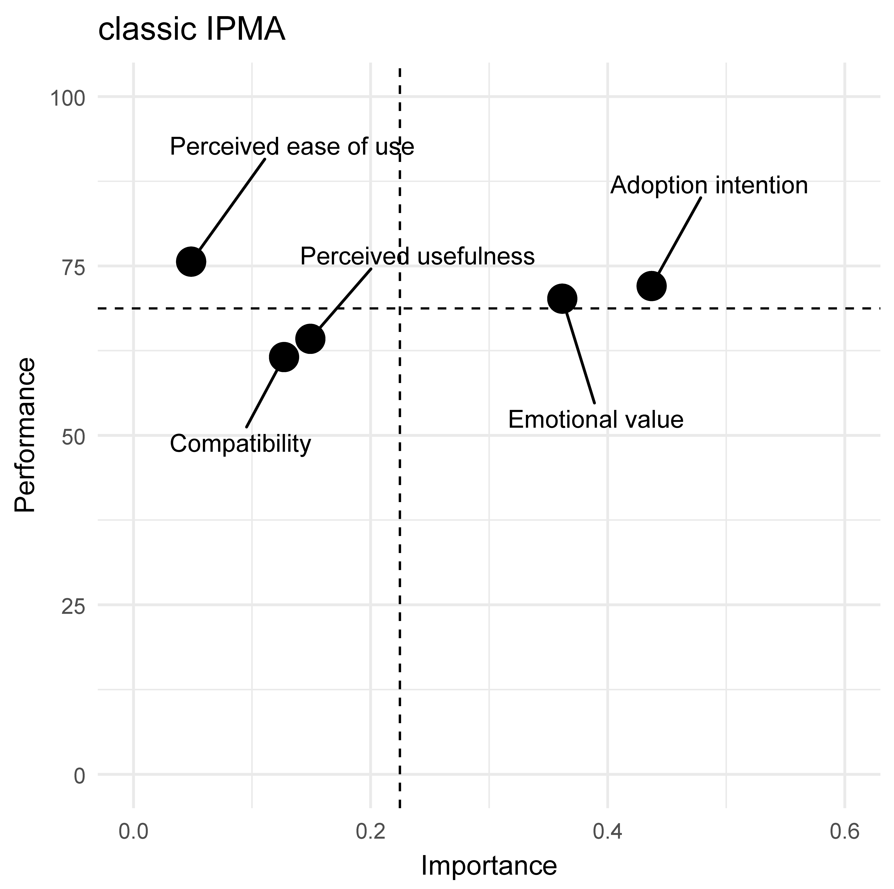
```

cIPMA adds the bottleneck dimension to IPMA. In selecting the priority predictor, cIPMA not only considers the Importance and Performance scores of the predictor, but also the percentage of bottleneck cases of the predictor: the percentage of cases that are unable to achieve a particular target outcome level. As shown above, the percentage of bottleneck cases per predictor can be obtained with the helper function ```get_bottleneck_cases```. To produce cIPMA, the IPMA dataset with Importance and Performance scores is extended with the percentage of bottleneck cases. The function ```get_cipma_df``` is used for this. Note that the output includes the column 'Necessity' that indicates whether the predictor is necessary given the selected threshold values for the effect size $d$ and the $p$-value. These predictors should not show up in the bottleneck table and therefore should not be part of cIPMA's bottleneck dimension. Therefore, in the ```get_cipma_df``` helper function a standard point size as in IPMA is given to such predictors. This ```R``` function can be downloaded from the book-page: https://jandul.github.io/NCA.
<!--   \ -->

<!-- ``` {r getcipmadffunction, echo = TRUE, eval = TRUE} -->
<!-- get_cipma_df <- function(ipma_df, bottlenecks, necessity) {  -->
<!--   cases_num <- bottlenecks$bottleneck_cases_num -->
<!--   cases_per <- bottlenecks$bottleneck_cases_per -->
<!--   cipma_df <- cbind( -->
<!--     ipma_df, -->
<!--     cases_per, -->
<!--     cases_num -->
<!--   ) -->
<!--   rownames(cipma_df) <- rownames(ipma_df) -->
<!--   colnames(cipma_df)[4:5] <- c("Bottleneck_cases_per", "Bottleneck_cases_num") -->
<!--   cipma_df$Necessity <- necessity -->
<!--   cipma_df$Predictor_with_cases <- ifelse( -->
<!--     cipma_df$Necessity == "yes", -->
<!--     paste0( -->
<!--       cipma_df$predictor,  -->
<!--       " (",  -->
<!--       round(cipma_df$Bottleneck_cases_per, 0), "%, n=", -->
<!--       cipma_df$Bottleneck_cases_num, -->
<!--       ")" -->
<!--     ), -->
<!--     paste0(cipma_df$predictor, " (NN)") -->
<!--   ) -->

<!--   return(cipma_df) -->
<!-- } -->

<!-- ``` -->

``` {r predictorsnecessary, echo = TRUE, eval = TRUE}
# cIPMA  - dataset
source("get_cipma_df.R")
d_threshold <- 0.1 
p_threshold <- 0.05
model <- model1.technology

# Extract parameters
effect_size <- sapply(predictors, nca_extract, model = model, ceiling = "ce_fdh",
                      param   = "Effect size")
p_value <- sapply(predictors, nca_extract, model = model, ceiling = "ce_fdh",
                  param   = "p-value")

necessity <- ifelse(effect_size >= d_threshold & p_value <= p_threshold,
                    "yes", "no")
ipma_df <- IPMA_df_technology
bottlenecks <- bottlenecks_technology
CIPMA_df_technology <- get_cipma_df(ipma_df = ipma_df, 
                                    bottlenecks = bottlenecks, 
                                    necessity = necessity)
CIPMA_df_technology
```

The plot can hthen be produced with the helper function ```get_cipma_plot```. This ```R``` function can be downloaded from the book-page: https://jandul.github.io/NCA.
<!-- (Section \@ref(getcipmaplot)). -->

<!-- ``` {r getsipmaplotfunction, echo = TRUE, eval = FALSE} -->
<!-- get_cipma_plot <- function(cipma_df, x_range = NULL, y_range = NULL, size_limits, size_range) { -->
<!--   library(ggplot2) -->
<!--   library(ggrepel) -->
<!--   if (is.null(x_range)) { -->
<!--     x_range <- range(cipma_df$Importance, na.rm = TRUE) -->
<!--   } -->
<!--   if (is.null(y_range)) { -->
<!--     y_range <- range(cipma_df$Performance, na.rm = TRUE) -->
<!--   } -->
<!--   colname <- colnames(cipma_df)[4] -->
<!--   target.Y <- target_outcome -->
<!--   cipma_df$fill_color <- ifelse( -->
<!--     grepl("\\(NN\\)", cipma_df$Predictor_with_cases), -->
<!--     "black", -->
<!--     NA -->
<!--   ) -->
<!--   cipma_df$dot_size <- ifelse( -->
<!--     grepl("\\(NN\\)", cipma_df$Predictor_with_cases), -->
<!--     1, -->
<!--     cipma_df[[colname]] -->
<!--   ) -->
<!--   mean_importance <- mean(cipma_df$Importance, na.rm = TRUE) -->
<!--   mean_performance <- mean(cipma_df$Performance, na.rm = TRUE) -->
<!--   pc <- ggplot(cipma_df, aes(x = Importance, y = Performance)) + -->
<!--     geom_vline(xintercept = mean_importance, linetype = "dashed", linewidth = 0.4) + -->
<!--     geom_hline(yintercept = mean_performance, linetype = "dashed", linewidth = 0.4) + -->
<!--     geom_point( -->
<!--       aes(size = dot_size), -->
<!--       shape = 21, -->
<!--       fill = cipma_df$fill_color, -->
<!--       color = "black", -->
<!--       stroke = 0.7 -->
<!--     ) + -->
<!--     geom_text_repel( -->
<!--       aes(label = Predictor_with_cases), -->
<!--       size = 3.5, -->
<!--       box.padding = 2 -->
<!--     ) + -->
<!--     coord_cartesian(xlim = x_range, ylim = y_range) + -->
<!--     scale_x_continuous(limits = x_range) + -->
<!--     scale_y_continuous(limits = y_range) + -->
<!--     scale_size_continuous(limits = size_limits, range = size_range) + -->
<!--     labs( -->
<!--       title = paste("cIPMA for target outcome Y =", target.Y, " ", name_plot), -->
<!--       x = "Importance", -->
<!--       y = "Performance" -->
<!--     ) + -->
<!--     theme_minimal() + -->
<!--     guides(size = "none", fill = "none")   -->
<!--   print(pc) -->
<!-- } -->

<!-- ``` -->

```{r cipmaplot, echo = TRUE, eval=FALSE}
# cIPMA  - plot
source("get_cipma_plot.R")
cipma_df <- CIPMA_df_technology 
x_range <- c(0,0.6)
y_range <- c(0,100)
size_limits = c(0,100)
size_range <- c(0.5,50) # the size of the bulbs
name_plot <- "Original" 
cIPMA_plot_technology <- get_cipma_plot(cipma_df = cipma_df,
                                        x_range = x_range,
                                        y_range = y_range,
                                        size_limits = size_limits,
                                        size_range = size_range)

```

<!-- ``` {r cipma85, echo=FALSE, cache=TRUE, include=FALSE, eval = FALSE, out.width='90%'} -->
<!-- pdf("cipma85.pdf") -->
<!-- cIPMA_plot_technology -->
<!-- dev.off() -->
<!-- ``` -->
```{r cipma, echo=FALSE, out.width='75%', fig.align = "center", fig.cap="Combined Importance Performance Map Analysis (cIPMA) for the outcome Technology use. The size of the dots is an indication of the number of cases that cannot achieve the target outcome of 85% of maximum outcome.", cache=TRUE}
#knitr::include_graphics('cipma1.png')
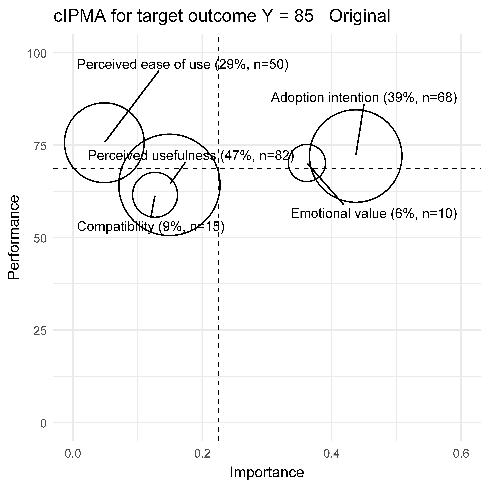
```
  
The results are shown in Figure \@ref(fig:cipma), which corresponds to the  plots in @hauff2024importance and @sarstedt2024combined. The IPMA plot is extended with points sizes that depend on the number or percentage of bottleneck cases. Since all predictors are necessary, each point's size is relevant. The percentage and number of bottleneck cases are included here between brackets. The NCA results show large differences in percentage and number of bottleneck cases between the five conditions. The order from high to low percentages is: Perceived usefulness, Adoption intention, Perceived ease of use, Compatibility and Emotional value. Perceived usefulness has 47% bottleneck cases, whereas Emotional value has only 6%. This means that from the perspective of NCA, Perceived usefulness is a more relevant than emotional value for a single predictor action. Successful interventions on a single condition (with the goal of bringing all bottleneck cases to at least the threshold level such that the target outcome is possible) will reduce more bottleneck cases when the intervention focuses on Perceived usefulness, rather than on emotional value. Note that such an intervention to eliminate bottlenecks does not guarantee that the target outcome level (85%) will be achieved: a necessary condition for an outcome is not a sufficient condition for it. Additionally, cases may be bottlenecks in multiple conditions. Note also the relevance of a necessary condition in terms of *effect size* may differ from the relevance of a necessary condition in terms of *number of bottleneck cases*. The first refers to the magnitude of the constraining role of the condition for the outcome in general, whereas the second refers to the size of the group  of cases that cannot achieve a certain target level of the outcome. For emotional value the effect size is largest (0.33), but the percentage of bottleneck cases is lowest (6%).

The BIPMA extends the cIPMA by considering only single bottleneck cases per predictor as explained in Section \@ref(producebipma). The number of single bottleneck cases can be extracted with the helper function ```get_single_bottleneck_cases```. This ```R``` function can be downloaded from the book-page: https://jandul.github.io/NCA.
<!-- (Section \@ref(getsinglebottleneckcases)). -->
<!--   \ -->

<!-- ``` {r getsinglebottleneckcasesfunction, echo = TRUE, eval = TRUE} -->
<!-- get_single_bottleneck_cases <- function(data,  -->
<!--                                         conditions,  -->
<!--                                         outcome,  -->
<!--                                         corner = 1,  -->
<!--                                         target_outcome,  -->
<!--                                         ceiling) { -->
<!--   outcome_min <- min(data[[outcome]], na.rm = TRUE) -->
<!--   outcome_max <- max(data[[outcome]], na.rm = TRUE) -->
<!--   if (length(corner) == 1 && corner == 1) {corner <- rep(1, length(conditions))} -->
<!--   if (target_outcome < outcome_min || target_outcome > outcome_max) { -->
<!--     stop( -->
<!--       sprintf( -->
<!--         "Error: target_outcome (%f) is out of range -->
<!--         for the outcome variable '%s'. Minimum: %f, Maximum: %f", -->
<!--         target_outcome, outcome, outcome_min, outcome_max -->
<!--       ) -->
<!--     ) -->
<!--   } -->
<!--   bottleneck_matrix <- matrix(0, nrow = nrow(data), ncol = length(conditions)) -->
<!--   colnames(bottleneck_matrix) <- conditions -->
<!--   threshold <- setNames(numeric(length(conditions)), conditions) -->
<!--   eps <- .Machine$double.eps^0.5   -->
<!--   for (condition in conditions) { -->
<!--     condition_index <- which(conditions == condition)[1]   -->
<!--     corner_val <- corner[condition_index] -->
<!--     if (is.na(corner_val)) { -->
<!--       warning(sprintf("Warning: corner value for condition '%s' is NA. -->
<!--                       Defaulting to 1.", condition)) -->
<!--       corner_val <- 1L -->
<!--     } else if (!(corner_val %in% 1:4)) { -->
<!--       warning(sprintf("Warning: corner value for condition '%s' (%d)  -->
<!--                       is out of valid range (1-4). Defaulting to 1.", -->
<!--                       condition, corner_val)) -->
<!--       corner_val <- 1L -->
<!--     } -->
<!--     model1 <- nca_analysis( -->
<!--       data,  -->
<!--       condition,  -->
<!--       outcome,  -->
<!--       corner = corner_val, -->
<!--       ceilings = ceiling,  -->
<!--       bottleneck.y = "actual",  -->
<!--       bottleneck.x = "actual",  -->
<!--       steps = c(target_outcome, NA) -->
<!--     ) -->
<!--     threshold[condition] <-  -->
<!--       attr(model1[["bottlenecks"]][[ceiling]][[condition]],"mpx.actual")[1, 1] -->
<!--     if (corner_val %in% c(1, 3)) { -->
<!--       bottleneck_matrix[, condition] <- as.numeric( -->
<!--         data[[condition]] < (threshold[condition] - eps) -->
<!--       ) -->
<!--     } else { -->
<!--       bottleneck_matrix[, condition] <- as.numeric( -->
<!--         data[[condition]] > (threshold[condition] - eps) -->
<!--       ) -->
<!--     } -->
<!--     if (sum(bottleneck_matrix[, condition]) == nrow(data)) { -->
<!--       bottleneck_matrix[, condition] <- 0 -->
<!--     } -->
<!--     if (threshold[condition] == -Inf) { -->
<!--       threshold[condition] <- 0 -->
<!--     } -->
<!--   } -->
<!--   total_bottlenecks_per_row <- rowSums(bottleneck_matrix) -->
<!--   single_bottlenecks_per_condition <-  -->
<!--     colSums(bottleneck_matrix & (total_bottlenecks_per_row == 1)) -->
<!--   single_bottleneck_cases_num <-  -->
<!--     as.data.frame (single_bottlenecks_per_condition) # number -->
<!--   colnames(single_bottleneck_cases_num)[1] <-  -->
<!--     paste0("Bottlenecks (Y = ", target_outcome, ")") -->
<!--   single_bottleneck_cases_per <-  -->
<!--     as.data.frame (100 * (single_bottleneck_cases_num / nrow(data))) # percentage -->
<!--   return(list( -->
<!--     single_bottleneck_cases_per = single_bottleneck_cases_per, -->
<!--     single_bottleneck_cases_num = single_bottleneck_cases_num -->
<!--   )) -->
<!-- } -->

<!-- ``` -->
  
``` {r ncasem7, echo=TRUE, eval = TRUE}
# Single bottleneck cases - Target outcome 85
source("get_single_bottleneck_cases.R")
data <- dataset1
ceilings = "ce_fdh"
target_outcome <- 85
predicted <- "Technology use"
predictors <-  c("Perceived usefulness", 
                 "Compatibility",
                 "Perceived ease of use",
                 "Emotional value",
                 "Adoption intention")
corner = 1 # default expected empty space for all conditions
single_bottlenecks_technology <- get_single_bottleneck_cases(
                                data, 
                                conditions = predictors,
                                outcome = predicted,
                                corner = corner,
                                target_outcome=target_outcome, 
                                ceiling = ceilings)
single_bottlenecks_technology
```

Next, the significant predictor variables for the predicted variable must be identified:

``` {r, echo = TRUE, eval = TRUE}
# Significant total effects (SEM)
sem_sig <- TAM_sig
for_select_predicted <- sem_sig[sem_sig$Predicted == predicted, ]
sufficiency <- ifelse(for_select_predicted$Sig_Total, "yes", "no")
names(sufficiency) <- predictors

```

The BIPMA dataset with Bottlenecks (single bottlenecks), Importance and Performance scores can be obtained with the helper function ```get_bipma_df```. This ```R``` function can be downloaded from the book-page: https://jandul.github.io/NCA.
<!-- (Section \@ref(getbipmadf)). -->
<!--   \ -->
<!-- ``` {r, echo = TRUE, eval = TRUE} -->
<!-- get_bipma_df <- function(ipma_df, single_bottlenecks, necessity, sufficiency) {  -->
<!--   single_cases_num <- single_bottlenecks$single_bottleneck_cases_num -->
<!--   single_cases_per <- single_bottlenecks$single_bottleneck_cases_per -->
<!--     bipma_df <- cbind( -->
<!--     ipma_df, -->
<!--     single_cases_per, -->
<!--     single_cases_num -->
<!--   ) -->
<!--   rownames(bipma_df) <- rownames(ipma_df) -->
<!--   colnames(bipma_df)[4:5] <- c("Single_bottleneck_cases_per", "Single_bottleneck_cases_num") -->
<!--   bipma_df$Necessity <- necessity -->
<!--   bipma_df$Corner <- corner -->
<!--   bipma_df$Target_outcome <- target_outcome -->
<!--   bipma_df$Sufficiency <- sufficiency -->
<!--   bipma_df$Predictor_with_single_cases <- ifelse( -->
<!--     bipma_df$Necessity == "yes", -->
<!--     paste0( -->
<!--       bipma_df$predictor, -->
<!--       " (", -->
<!--       round(bipma_df$Single_bottleneck_cases_per, 0), "%, n=", -->
<!--       bipma_df$Single_bottleneck_cases_num, -->
<!--       ifelse( -->
<!--         bipma_df$Corner %in% c(2, 3, 4), -->
<!--         paste0(", corner=", bipma_df$Corner), -->
<!--         "" -->
<!--       ), -->
<!--       ")" -->
<!--     ), -->
<!--     paste0(bipma_df$predictor, " (NN)") -->
<!--   ) -->
<!--   return(bipma_df) -->
<!-- } -->

<!-- ``` -->

``` {r ncasem8, echo = TRUE, eval = TRUE}
# BIPMA  - dataset
source("get_bipma_df.R")
ipma_df <- IPMA_df_technology
single_bottlenecks <- single_bottlenecks_technology
BIPMA_df_technology <- get_bipma_df(ipma_df = ipma_df,
                                    single_bottlenecks=single_bottlenecks, 
                                    necessity = necessity, 
                                    sufficiency = sufficiency)
BIPMA_df_technology
```

  
The BIPMA can be created with the helper function ```get_bipma_plot```. This ```R``` function can be downloaded from the book-page: https://jandul.github.io/NCA.
<!-- (Section \@ref(getbipmaplot)). -->
<!--   \ -->

<!-- ``` {r, echo = TRUE, eval = FALSE} -->
<!-- get_bipma_plot <- function(bipma_df, x_range = NULL, y_range = NULL, size_limits, size_range) { -->
<!--   library(ggplot2) -->
<!--   library(ggrepel) -->
<!--   bipma_df <- bipma_df[order(bipma_df$Single_bottleneck_cases_num, decreasing = TRUE), ] -->
<!--   if (is.null(x_range)) { -->
<!--     x_range <- range(bipma_df$Importance, na.rm = TRUE) -->
<!--   } -->
<!--   if (is.null(y_range)) { -->
<!--     y_range <- range(bipma_df$Performance, na.rm = TRUE) -->
<!--   } -->
<!--   colname <- colnames(bipma_df)[4] -->
<!--   target.Y <- target_outcome -->
<!--   bipma_df$fill_color <- ifelse( -->
<!--     grepl("\\(NN\\)", bipma_df$Predictor_with_single_cases), -->
<!--     "black", -->
<!--     NA_character_ -->
<!--   ) -->
<!--   bipma_df$fill_color[is.na(bipma_df$fill_color) & bipma_df$Sufficiency == "no"] <- "grey90" -->
<!--   bipma_df$fill_color[is.na(bipma_df$fill_color)] <- "white" -->
<!--   bipma_df$dot_size <- ifelse( -->
<!--     grepl("\\(NN\\)", bipma_df$Predictor_with_single_cases), -->
<!--     1, -->
<!--     bipma_df[[colname]] -->
<!--   ) -->
<!--   x_no <- -0.10  # x-position for "no sufficiency" predictors -->
<!--   bipma_df$Importance_adj <- ifelse( -->
<!--     bipma_df$Sufficiency == "no", -->
<!--     x_no, -->
<!--     bipma_df$Importance -->
<!--   ) -->
<!--   x_range_adj <- c(x_no - 0.02 , max(bipma_df$Importance, na.rm = TRUE) + 0.1) -->
<!--   x_breaks <- pretty(bipma_df$Importance) -->
<!--   dropped_idx <- (bipma_df$Necessity == "no" & bipma_df$Sufficiency == "no") -->
<!--   dropped_names <- bipma_df$predictor[dropped_idx] -->
<!--   bipma_df <- bipma_df[!dropped_idx, ] -->
<!--   mean_importance <- mean(bipma_df$Importance, na.rm = TRUE) -->
<!--   mean_performance <- mean(bipma_df$Performance, na.rm = TRUE) -->
<!--   pc1 <- ggplot(bipma_df, aes(x = Importance_adj, y = Performance)) + -->
<!--     geom_vline(xintercept = mean_importance, linetype = "dashed", linewidth = 0.4) + -->
<!--     geom_hline(yintercept = mean_performance, linetype = "dashed", linewidth = 0.4) + -->
<!--     geom_vline(xintercept = -0.02, linetype = "dashed", linewidth = 0.7) + -->
<!--     geom_point( -->
<!--       aes(size = dot_size, fill = fill_color), -->
<!--       shape = 21, -->
<!--       color = "black", -->
<!--       stroke = 0.7 -->
<!--     ) + -->
<!--     scale_fill_identity() + -->
<!--     geom_text_repel( -->
<!--       aes(label = Predictor_with_single_cases), -->
<!--       size = 3.5, -->
<!--       box.padding = 2 -->
<!--     ) + -->
<!--     coord_cartesian(xlim = x_range_adj, ylim = y_range) + -->
<!--     scale_x_continuous( -->
<!--       breaks = x_breaks, -->
<!--       limits = x_range_adj -->
<!--     ) + -->
<!--     scale_y_continuous(limits = y_range) + -->
<!--     scale_size_continuous(limits = size_limits, range = size_range) + -->
<!--     labs( -->
<!--       title = paste("BIPMA for target outcome Y =", target.Y, name_plot), -->
<!--       x = "Importance", -->
<!--       y = "Performance" -->
<!--     ) + -->
<!--     theme_minimal() + -->
<!--     theme( -->
<!--       axis.text.x = element_text(), -->
<!--       axis.ticks.x = element_line(), -->
<!--       panel.grid.minor = element_blank() -->
<!--     ) + -->
<!--     guides(size = "none") -->
<!--   if (length(dropped_names) > 0) { -->
<!--     pc1 <- pc1 + -->
<!--       annotate( -->
<!--         "label", -->
<!--         x = x_range_adj[1] + 0.01,     # a little inside the panel -->
<!--         y = y_range[1] + 0.01, -->
<!--         hjust = 0, -->
<!--         vjust = 0, -->
<!--         label = paste( -->
<!--           c("Non-significant necessity and average effects:", dropped_names), -->
<!--           collapse = "\n" -->
<!--         ), -->
<!--         size = 3 -->
<!--       ) -->
<!--   } -->
<!--   print(pc1) -->
<!--   timestamp <- format(Sys.time(), "%Y%m%d_%H%M%S") -->
<!--   filename <- paste0("bipma_", timestamp, ".pdf") -->
<!--   ggsave(filename, pc1, width = 5, height = 5, dpi = 600, device = cairo_pdf) -->
<!-- } -->
<!-- ``` -->


``` {r, echo = TRUE, eval = FALSE}
# Bipma - plot
source("get_bipma_plot.R")
bipma_df <- BIPMA_df_technology 
x_range <- c(0,0.6)
y_range <- c(0,100)
size_limits = c(0,100)
size_range <- c(0.5,50) # the size of the bulbs
BIPMA_plot_technology <- get_bipma_plot(bipma_df = bipma_df,
                                        x_range = x_range, 
                                        y_range = y_range, 
                                        size_limits = size_limits, 
                                        size_range = size_range)
```
<!--  \ -->
<!-- ``` {r bipma85, echo=FALSE, cache=TRUE, include=FALSE, eval = FALSE, out.width='90%'} -->
<!-- pdf("bipma85.pdf") -->
<!-- BIPMA_plot_technology -->
<!-- dev.off() -->
<!-- ``` -->
<!--  \ -->


(ref:caption1234) Bottleneck Importance Performance Map Analysis (BIPMA) for the outcome Technology use. The size of the dots is an indication of the number of *single* bottleneck cases that cannot achieve the target outcome of 85% of maximum outcome. White dots: Significant average effect and significant necessity effects. Gray dots:  Non-significant average effect and significant necessity effects. The horizontal and vertical thin dashed lines corresponds to mean Performance and the mean Importance of the predictors with a significant total average effect, respectively.
```{r bipma, echo=FALSE, out.width='75%', fig.align = "center", fig.cap = "(ref:caption1234)", cache=TRUE}
#knitr::include_graphics('bipma1.png')
#knitr::include_graphics('bipma2.png')
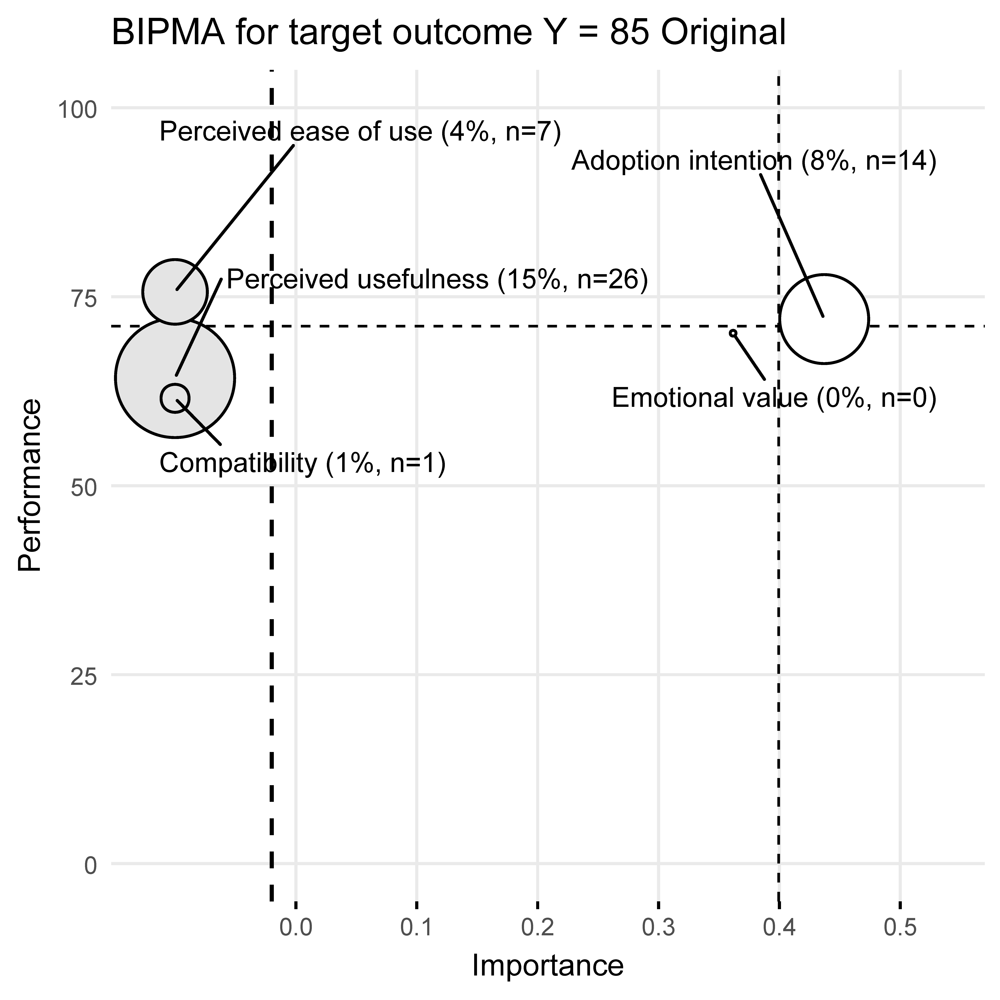
```

  
The results are shown in Figure \@ref(fig:bipma). For each condition the percentage and number of *single* bottleneck cases is given between brackets. The results again show large differences in the percentage and number of single bottleneck cases between the five conditions. In this case, the *order* from high to low percentages is the same as for cIPMA as shown in Figure \@ref(fig:cipma). However, the *number and percentage* of bottleneck cases are in BIPMA considerably lower than in CIPMA. Perceived usefulness has most single bottleneck cases (15%, n=26), whereas Emotional value has none. This means that, in contrast to the conclusion from cIPMA, emotional value is not a relevant predictor for an action based on NCA if only one condition can be changed. Successful group interventions on a single predictor (with the goal to bring all bottleneck cases above the threshold level) could focus on Perceived usefulness, which has almost twice an many single bottlenecks as Adoption intention. Perceived usefulness, Compatibility and Perceived ease of use have non-significant average effects on Technology use according to SEM. Predictors that are necessary from the perspective of NCA, but are non-significant predictors from the perspective of SEM, are placed on the Importance axis at Importance = 0 and the corresponding points are shown in gray. Predictors that are significant from the perspective of SEM but non-significant from the perspective of NCA are shown as small black points, but none of the conditions in this analysis were non-significant from the perspective of NCA. Note, that it is possible that a condition without bottleneck cases is also displayed this way (Emotional value), but such a condition is irrelevant for an NCA-based intervention. Predictors that are non-significant from the perspective of both SEM and NCA are separately mentioned in the BIPMA plot in a text box (Figure \@ref(fig:bipmageneral)) to indicate that actions on such predictors are not effective. However, in the TAM example non-significant predictors from the necessity perspective were not identified.  

For selecting a proper group intervention strategy based on the BIPMA results, see Section \@ref(producebipma). For a selecting a case-specific interventions strategy based only on the NCA results, see Chapter \@ref(practice). 

## Step 8: Interpret results {#interpretresults1}

The results of the SEM study suggest that for increasing the Technology use on average, only Emotional value and Adoption intention are effective. At the same time, the NCA study shows that a high level of Technology use is only achievable when all predictors meet a certain minimum level. To evaluate the robustness of these NCA results several checks can be done (Section \@ref(robustnesschecks)). Robustness checks for SEM are not discussed here. For this demonstration eight checks are selected (Table \@ref(tab:examplerobustnesschecks)). In each check, one choice is changed and the new results are compared with the original results, and it is evaluated if the conclusion regarding necessity is changed. 

The type of changes in several analyst's choices regarding necessity is shown in Table \@ref(tab:examplerobustnesschecks). 
<!-- The robustness checks are produced with the  -->
<!-- Tintegrated function ```ncasem_example``` that includes also all previous helper functions (Section \@ref(ncasemexample)). -->

<!-- for HTML -->
```{r examplerobustnesschecks, echo = FALSE, warning=FALSE, eval = TRUE}
# Load required libraries
library(knitr)
library(kableExtra)
library(openxlsx)

# Read the data from the Excel file
checks <- read.xlsx("checks.xlsx", sheet = 1)

# Rename the columns
colnames(checks) <- c("Robustness check", "Original", "Check1", "Check2", "Check3", "Check4", "Check5", "Check6", "Check7", "Check8")

# Rename the rows
checks[, 1] <- c(
  "Ceiling line",
  "Threshold effect size",
  "Threshold <em>p</em>-value",
  "Scope",
  "Outliers",
  "Target outcome"
)

# Convert Check1 column to character (if it isn't already)
checks$Check1 <- as.character(checks$Check1)

background = "#f28b4b"
# Highlight the cell where Check1 is "CR-FHD"
checks$Check1 <- ifelse(
  checks$Check1 == "CR-FDH",
  cell_spec(checks$Check1, color = "black", background = background),
  checks$Check1
)

# Highlight the cell where Check2 is "0.20"
checks$Check2 <- ifelse(
  checks$Check2 == "0.20",
  cell_spec(checks$Check2, color = "black", background = background),
  checks$Check2
)

# Highlight the cell where Check3 is "0.01"
checks$Check3 <- ifelse(
  checks$Check3 == "0.01",
  cell_spec(checks$Check3, color = "black", background = background),
  checks$Check3
)

# Highlight the cell where Check4 is "theoretical"
checks$Check4 <- ifelse(
  checks$Check4 == "theoretical",
  cell_spec(checks$Check4, color = "black", background = background),
  checks$Check4
)

# Highlight the cell where Check5 is "yes, single"
checks$Check5 <- ifelse(
  checks$Check5 == "yes, single",
  cell_spec(checks$Check5, color = "black", background = background),
  checks$Check5
)

# Highlight the cell where Check6 is "yes, multiple"
checks$Check6 <- ifelse(
  checks$Check6 == "yes, multiple",
  cell_spec(checks$Check6, color = "black", background = background),
  checks$Check6
)

# Highlight the cell where Check7 is "80"
checks$Check7 <- ifelse(
  checks$Check7 == "80",
  cell_spec(checks$Check7, color = "black", background = background),
  checks$Check7
)

# Highlight the cell where Check8 is "90"
checks$Check8 <- ifelse(
  checks$Check8 == "90",
  cell_spec(checks$Check8, color = "black", background = background),
  checks$Check8
)
colnames(checks) <- c("Robustness check", 
                      "Original", 
                      "Ceiling change",
                      "<em>d</em>-threshold change",
                      "<em>p</em>-threshold change",
                      "Scope change",
                      "Single outlier removal",
                      "Multiple outlier removal",
                      "Target lower",
                      "Target higher")

# Generate the table with styled rows
kbl(
  checks,
  escape = FALSE, # Important to render HTML for cell_spec
  booktabs = TRUE,
  longtable = TRUE,
  col.names = colnames(checks),
  align = c("l", "r", "r", "r", "r", "r", "r", "r", "r", "r"),
  caption = "Selected robustness checks. The orange elements are changed compared to the original analysis",
  format = "html",
  table.attr = "style='width:30%;'"
) %>%
  kable_styling(font_size = 8, full_width = FALSE) %>%
  kable_paper() %>%
  scroll_box(width = "100%", height = "100%")

```
 
<!-- For PDF -->
```{r examplerobustnesscheckspdf, echo = FALSE, warning=FALSE, eval = FALSE}
# Load required libraries
library(knitr)
library(kableExtra)
library(openxlsx)

# Read the data from the Excel file
checks <- read.xlsx("checks.xlsx", sheet = 1)

# Rename the columns
colnames(checks) <- c("Robustness check", "Original", "Check1", "Check2", "Check3", "Check4", "Check5", "Check6", "Check7", "Check8")

# Convert Check1 column to character (if it isn't already)
checks$Check1 <- as.character(checks$Check1)

background = "lightgray"
# Highlight the cell where Check1 is "CR-FHD"
checks$Check1 <- ifelse(
  checks$Check1 == "CR-FDH",
  cell_spec(checks$Check1, color = "black", background = background),
  checks$Check1
)

# Highlight the cell where Check2 is "0.20"
checks$Check2 <- ifelse(
  checks$Check2 == "0.20",
  cell_spec(checks$Check2, color = "black", background = background),
  checks$Check2
)

# Highlight the cell where Check3 is "0.01"
checks$Check3 <- ifelse(
  checks$Check3 == "0.01",
  cell_spec(checks$Check3, color = "black", background = background),
  checks$Check3
)

# Highlight the cell where Check4 is "theoretical"
checks$Check4 <- ifelse(
  checks$Check4 == "theoretical",
  cell_spec(checks$Check4, color = "black", background = background),
  checks$Check4
)

# Highlight the cell where Check5 is "yes, single"
checks$Check5 <- ifelse(
  checks$Check5 == "yes, single",
  cell_spec(checks$Check5, color = "black", background = background),
  checks$Check5
)

# Highlight the cell where Check6 is "yes, multiple"
checks$Check6 <- ifelse(
  checks$Check6 == "yes, multiple",
  cell_spec(checks$Check6, color = "black", background = background),
  checks$Check6
)

# Highlight the cell where Check7 is "80"
checks$Check7 <- ifelse(
  checks$Check7 == "80",
  cell_spec(checks$Check7, color = "black", background = background),
  checks$Check7
)

# Highlight the cell where Check8 is "90"
checks$Check8 <- ifelse(
  checks$Check8 == "90",
  cell_spec(checks$Check8, color = "black", background = background),
  checks$Check8
)
colnames(checks) <- c("Robustness check", "Original", "Ceiling change", "\\emph{d}-threshold change", "\\emph{p}-threshold change", "Scope change", "Outlier change-1", "Outlier change-2", "Target lower", "Target higher")


# Generate the table with styled rows
kbl(
  checks,
  escape = FALSE, # Important for cell_spec
  booktabs = TRUE,
  longtable = FALSE,
  # col.names = colnames(checks),
  # align = c("l", "r", "r", "r", "r", "r", "r", "r", "r", "r"),
  caption = "Selected robustness checks. The black elements are changed compared to the original",
  #format = "html",
  #table.attr = "style='width:30%;'"
) %>%
  #kable_styling(font_size = 9, full_width = FALSE) %>%
  kable_styling(font_size = 8,
                full_width = FALSE, 
                latex_options = c("hold_position", "repeat_header", "scale_down")
  )%>%
      column_spec(1, width = "5em")  %>%
      column_spec(2, width = "4em")  %>%
      column_spec(3, width = "4em")  %>%
      column_spec(4, width = "4em")%>%
      column_spec(5, width = "4em")%>%
      column_spec(6, width = "4em")%>%
      column_spec(7, width = "4em")%>%
      column_spec(8, width = "4em")%>%
      column_spec(9, width = "4em")%>%
      column_spec(10, width = "4em")

  #kable_paper() %>%
  #scroll_box(width = "100%", height = "100%")

``` 
  \
  
The results of these robustness checks for each individual predictor variable are shown in Table \@ref(tab:robustcheckssem).

<!-- FOR HTML -->
```{r robustcheckssem, echo = FALSE, warning=FALSE, message=FALSE, eval = TRUE}

#generate_nca_table <- function(file_path) {
  # Load required libraries
  library(knitr)
  library(kableExtra)
  library(tidyverse)
  library(openxlsx)
  # Read the data from the Excel file
  rob <- read.xlsx("robustness_table_sem.xlsx", sheet = 1)
  colnames(rob) <- c("Predictor",
                     "Robustness check",
                     "Effect size",
                     "<em>p</em>-value",
                     "Necessity", 
                     "Single bottlenecks(%)",
                     "Single bottlenecks(n)",
                     "Priority")

rob$`Robustness check` <- gsub("p value change", "<em>p</em>-value change", rob$`Robustness check`)
rob$`Robustness check` <- gsub("d value change", "<em>d</em>-value change", rob$`Robustness check`)
  
  # Preprocess `robs` and define columns
  robs <- rob[, c(2, 3, 4, 5, 6, 7, 8)]
  robs$`Single bottlenecks(%)` <- round(robs$`Single bottlenecks(%)`, 1)
  robs$`Effect size` <- sprintf("%.2f", as.numeric(robs$`Effect size`))
  robs$`<em>p</em>-value` <- sprintf("%.3f", as.numeric(robs$`<em>p</em>-value`))

  
  # Get the unique conditions to determine the number of blocks

  conditions <- unique(rob$Predictor)

  # Define block size
  block_size <- 9  # Number of robustness checks (excluding block name)

  # Function to pad or truncate rows to match the block size
  adjust_block <- function(block_data, block_size) {
    n_rows <- nrow(block_data)
    if (n_rows > block_size) {
      return(block_data[1:block_size, ]) # Truncate to match block size
    } else if (n_rows < block_size) {
      padding <- data.frame(matrix("", nrow = block_size - n_rows, ncol = ncol(block_data)))
      colnames(padding) <- colnames(block_data)
      return(rbind(block_data, padding)) # Add empty rows to match block size
    }
    return(block_data) # Already matches block size
  }

  # Create a list to store the adjusted blocks of data
  block_data_list <- list()
  for (i in 1:length(conditions)) {
    start_row <- (i - 1) * block_size + 1
    end_row <- min(i * block_size, nrow(robs))
  # Adjust the block size (pad or truncate)
    block_data_list[[i]] <- adjust_block(robs[start_row:end_row, ], block_size)
  }

  # Combine blocks with titles, dynamically based on the number of conditions
  robs_with_titles <- NULL
  for (i in 1:length(conditions)) {
    block_title <- c(conditions[i], rep("", ncol(robs) - 1)) # Title row for each block
    block_data <- block_data_list[[i]] # Select corresponding block data

    # Bind title row and block data together
    robs_with_titles <- rbind(robs_with_titles, block_title, block_data)
  }

  # Generate the table with styled rows
  kbl(
   robs_with_titles,
   escape = FALSE, # Important to render HTML for cell_spec
    booktabs = TRUE,
    longtable = TRUE,
    col.names = colnames(robs),
    align = c("l", "l", "r", "r", "r", "r"),
    caption = "'NCA robustness table' with the results of the robustness checks",
    format = "html",
    row.names = FALSE, # Remove row numbers
    table.attr = "style='width:30%;'"
  ) %>%
    kable_styling(font_size = 11, full_width = F) %>%
    kable_paper() %>%
    scroll_box(width = "100%", height = "450px") %>%
    row_spec(0, bold = TRUE, extra_css = "border-bottom: 2px solid black;") %>% # Add a dark line under the header
    row_spec(seq(1, nrow(robs_with_titles), by = block_size + 1), bold = TRUE, background = "#f0f0f0") %>% # Highlight all block titles
    row_spec(seq(10, nrow(robs_with_titles), by = block_size + 1), extra_css = "border-bottom: 2px solid black;") # Add dark lines after blocks
#}

# Example usage:
#generate_nca_table("robustness_table_sem.xlsx")
```
  \
  
Without discussing details, the general results of the NCA robustness tables are as follows. The results for the necessity of Perceived usefulness are robust with respect to the conclusion about necessity-in-kind. For necessity-in-degree only a change of ceiling line from CE-FDH to CR-FDH resulted in a different priority level (from first to second). Most single bottleneck cases exist for this predictor. Generally, the original results for this predictor can be considered as robust. The same conclusion applies to Compatibility. The original conclusion about necessity-in-kind is stable and for all checks the priority level for action remains low. However, the results of Perceived ease of use are more variable. For example, the statistical significance of the original finding and therefore the conclusion of necessity is somewhat fragile. Also the number of bottleneck cases changes from 7 to 1 and is sensitive to small changes of the selected target level. The results for Emotional value and Adoption intention are relatively robust. 

Note that the NCA robustness table is a tool for better understanding and communicating the credibility of the original results. The findings from the checks largely depend on the selected parameters for the checks. No hard rules exist to decide about the robustness or fragility of the results, as this is a judgement by the analyst and others. 

<!--chapter:end:1007-appendix-plsJO.Rmd-->


# Bottleneck distance table {#appendixh}

<div style="text-align: left; font-style: italic; margin: 2em 0;">
  This chapter will be made available soon.
</div>


<!--chapter:end:1009-appendix-distanceJX.Rmd-->


# Bibliography {-} 

<div style="text-align: left; font-style: italic; margin: 2em 0;">
  The complete bibliography will be made available soon.
</div>

<!--chapter:end:150-referencesJX.Rmd-->

